# 地址指标 (addresses)

## 📋 概述

分析网络中地址的行为、分布和特征，包括活跃地址、余额分布、盈亏状态等核心指标。

本类别共包含 **50** 个API端点，分为 **12** 个子类别。

## 🗂️ 指标分类

| 子类别 | 指标数量 | 主要功能 |
|--------|----------|----------|
| 供应量分布 | 16 | 供应量在不同地址组的分布 |
| 最小余额门槛 | 15 | 按余额门槛统计地址分布 |
| 活跃度指标 | 4 | 追踪网络活跃度和用户参与度 |
| 累积地址 | 3 | 累积地址的历史统计 |
| 盈利地址 | 2 | 分析盈利地址的规模和特征 |
| 发送活动 | 2 | 发送交易活动统计 |
| 持有者分析 | 2 | 持有者行为和特征分析 |
| 接收活动 | 2 | 接收交易活动统计 |
| 亏损地址 | 1 | 分析亏损地址的规模和特征 |
| 非零地址 | 1 | 非零余额地址分析 |
| 新增地址 | 1 | 新增地址的增长趋势 |
| 数量统计 | 1 | 各类地址数量统计 |

## 🎨 指标体系结构图

```mermaid
graph TD
    A["地址指标<br/>共50个指标"]
    A:::mainNode
    
    A --> B1["供应量分布<br/>16个指标"]
    B1:::categoryNode
    B1 --> C1_1["相对供应量分布<br/><i>supply_distribution_relative</i>"]
    C1_1:::metricNode
    C1_1 --> D1_1["展示不同地址组别持有的币量占总供应量的百分比分布。这个指标用于分析财富集中度和市场结构，可以识别大户控盘程度。通过追踪供应量在不同规模地址间的分布变化，可以判断"]
    D1_1:::descNode
    B1 --> C1_2["余额<0.001币的地址持有量<br/><i>supply_balance_less_0001</i>"]
    C1_2:::metricNode
    C1_2 --> D1_2["统计余额小于0.001个币的所有地址持有的总供应量。这些通常是粉尘地址或废弃地址，其供应量占比反映了网络中无效或休眠资金的规模"]
    D1_2:::descNode
    B1 --> C1_3["余额>10万币的地址持有量<br/><i>supply_balance_more_100k</i>"]
    C1_3:::metricNode
    C1_3 --> D1_3["统计余额超过100000个币的地址持有的总供应量。这些是最大的持有者，包括交易所、托管机构和超级巨鲸，其行为可以主导市场走向"]
    D1_3:::descNode
    A --> B2["最小余额门槛<br/>15个指标"]
    B2:::categoryNode
    B2 --> C2_1["持有≥1美元的地址数<br/><i>min_1_usd_count</i>"]
    C2_1:::metricNode
    C2_1 --> D2_1["以美元计价余额大于或等于1美元的地址数量。这个指标评估实际有经济价值的地址规模，过滤掉粉尘地址，更准确地反映真实用户数量"]
    D2_1:::descNode
    B2 --> C2_2["持有≥10美元的地址数<br/><i>min_10_usd_count</i>"]
    C2_2:::metricNode
    C2_2 --> D2_2["以美元计价余额大于或等于10美元的地址数量。筛选出有一定经济意义的活跃用户，这个门槛通常能够过滤掉测试地址和无意义的小额地址"]
    D2_2:::descNode
    B2 --> C2_3["持有≥100美元的地址数<br/><i>min_100_usd_count</i>"]
    C2_3:::metricNode
    C2_3 --> D2_3["以美元计价余额大于或等于100美元的地址数量。反映有实质性投资的用户群体规模，这个级别的持有者通常对价格波动有一定承受能力"]
    D2_3:::descNode
    A --> B3["活跃度指标<br/>4个指标"]
    B3:::categoryNode
    B3 --> C3_1["活跃地址数<br/><i>active_count</i>"]
    C3_1:::metricNode
    C3_1 --> D3_1["统计在指定时间窗口内（通常为24小时）至少发生过一次交易（发送或接收）的独立地址数量。这是衡量网络活跃度和用户参与度的核心指标，能够反映网络的健康状况和成长趋势"]
    D3_1:::descNode
    B3 --> C3_2["包含合约的活跃地址数<br/><i>active_count_with_contracts</i>"]
    C3_2:::metricNode
    C3_2 --> D3_2["统计包括智能合约地址在内的所有活跃地址数量。这个指标更全面地反映了网络活动，特别适用于以太坊等支持智能合约的区块链，能够捕捉DeFi、NFT和其他dApp的活动"]
    D3_2:::descNode
    B3 --> C3_3["地址活跃保留率<br/><i>activity_retention_rate</i>"]
    C3_3:::metricNode
    C3_3 --> D3_3["衡量在特定时间段内活跃的地址在后续时间段继续保持活跃的比例。这个指标反映用户粘性和网络的持续吸引力，高保留率表明用户对网络有持续的使用需求，是评估网络长期价值的"]
    D3_3:::descNode
    A --> B4["累积地址<br/>3个指标"]
    B4:::categoryNode
    B4 --> C4_1["累积地址总数<br/><i>accumulation_count</i>"]
    C4_1:::metricNode
    C4_1 --> D4_1["从创世区块以来所有曾经持有过该资产的独立地址总数。反映了网络的历史参与度和累计用户规模，是评估网络长期增长和采用度的重要指标。这个数字只会增加不会减少，代表了网"]
    D4_1:::descNode
    B4 --> C4_2["累积地址余额分布<br/><i>accumulation_balance</i>"]
    C4_2:::metricNode
    C4_2 --> D4_2["展示不同余额区间的累积地址数量分布。帮助分析财富集中度和持币结构的历史演变，可以识别鲸鱼地址和散户的分布情况。通过这个指标可以了解网络的财富分配是否健康"]
    D4_2:::descNode
    B4 --> C4_3["持有者累积比率<br/><i>holder_accumulation_ratio</i>"]
    C4_3:::metricNode
    C4_3 --> D4_3["衡量地址累积（增加持仓）与分发（减少持仓）的相对强度。正值表示净累积，负值表示净分发。这个指标能够识别市场是处于累积阶段还是分发阶段"]
    D4_3:::descNode
    A --> B5["盈利地址<br/>2个指标"]
    B5:::categoryNode
    B5 --> C5_1["盈利地址数<br/><i>profit_count</i>"]
    C5_1:::metricNode
    C5_1 --> D5_1["当前持币成本低于市场价格的地址数量。反映市场中处于账面盈利状态的投资者规模，是判断市场情绪和潜在卖压的重要指标。高比例的盈利地址可能带来获利了结的压力"]
    D5_1:::descNode
    B5 --> C5_2["盈利地址占比<br/><i>profit_relative</i>"]
    C5_2:::metricNode
    C5_2 --> D5_2["盈利地址占所有非零余额地址的百分比。这个相对指标能够更好地反映市场整体的盈利状况，当该比例过高时，可能预示着短期调整风险"]
    D5_2:::descNode
    A --> B6["发送活动<br/>2个指标"]
    B6:::categoryNode
    B6 --> C6_1["Depositing Addresses<br/><i>sending_to_exchanges_count</i>"]
    C6_1:::metricNode
    C6_1 --> D6_1["Depositing Addresses。此指标提供了链上数据的重要洞察，帮助投资者和分析师更好地理解市场动态和网络状况"]
    D6_1:::descNode
    B6 --> C6_2["发送地址数<br/><i>sending_count</i>"]
    C6_2:::metricNode
    C6_2 --> D6_2["在指定时间内至少发送过一次转账的地址数量。反映主动交易用户的规模，是衡量网络交易活跃度的重要指标。高发送地址数表明用户积极使用网络进行价值转移"]
    D6_2:::descNode
    
    %% 高对比度样式
    classDef mainNode fill:#1e3a8a,stroke:#ffffff,stroke-width:3px,color:#ffffff,font-weight:bold
    classDef categoryNode fill:#0891b2,stroke:#ffffff,stroke-width:2px,color:#ffffff,font-weight:bold
    classDef metricNode fill:#059669,stroke:#ffffff,stroke-width:2px,color:#ffffff
    classDef descNode fill:#fbbf24,stroke:#92400e,stroke-width:1px,color:#000000,font-size:10px
```



## 📂 详细指标说明

### 📊 供应量分布（16个指标）

本子类别包含以下详细指标：

#### 1. 相对供应量分布

- **指标代码**: `supply_distribution_relative`
- **API路径**: `/v1/metrics/addresses/supply_distribution_relative`
- **英文名称**: Address Supply Distribution

**📝 详细说明**：
展示不同地址组别持有的币量占总供应量的百分比分布。这个指标用于分析财富集中度和市场结构，可以识别大户控盘程度。通过追踪供应量在不同规模地址间的分布变化，可以判断市场是在集中还是分散

**使用示例**：
```python
# 获取相对供应量分布数据
df = client.get_metric(
    "/v1/metrics/addresses/supply_distribution_relative",
    asset="BTC",
    resolution="24h"
)
```

---

#### 2. 余额<0.001币的地址持有量

- **指标代码**: `supply_balance_less_0001`
- **API路径**: `/v1/metrics/addresses/supply_balance_less_0001`
- **英文名称**: Supply Held by Addresses with Balance < 0.001

**📝 详细说明**：
统计余额小于0.001个币的所有地址持有的总供应量。这些通常是粉尘地址或废弃地址，其供应量占比反映了网络中无效或休眠资金的规模

**使用示例**：
```python
# 获取余额<0.001币的地址持有量数据
df = client.get_metric(
    "/v1/metrics/addresses/supply_balance_less_0001",
    asset="BTC",
    resolution="24h"
)
```

---

#### 3. 余额>10万币的地址持有量

- **指标代码**: `supply_balance_more_100k`
- **API路径**: `/v1/metrics/addresses/supply_balance_more_100k`
- **英文名称**: Supply Held by Addresses with Balance > 100k

**📝 详细说明**：
统计余额超过100000个币的地址持有的总供应量。这些是最大的持有者，包括交易所、托管机构和超级巨鲸，其行为可以主导市场走向

**使用示例**：
```python
# 获取余额>10万币的地址持有量数据
df = client.get_metric(
    "/v1/metrics/addresses/supply_balance_more_100k",
    asset="BTC",
    resolution="24h"
)
```

---

#### 4. 余额0.001-0.01币的地址持有量

- **指标代码**: `supply_balance_0001_001`
- **API路径**: `/v1/metrics/addresses/supply_balance_0001_001`
- **英文名称**: Supply Held by Addresses with Balance 0.001 - 0.01

**📝 详细说明**：
统计余额在0.001到0.01个币之间的地址持有的总供应量。这个区间通常包含小额试用用户或新用户，反映了网络的基础用户参与情况

**使用示例**：
```python
# 获取余额0.001-0.01币的地址持有量数据
df = client.get_metric(
    "/v1/metrics/addresses/supply_balance_0001_001",
    asset="BTC",
    resolution="24h"
)
```

---

#### 5. 余额0.01-0.1币的地址持有量

- **指标代码**: `supply_balance_001_01`
- **API路径**: `/v1/metrics/addresses/supply_balance_001_01`
- **英文名称**: Supply Held by Addresses with Balance 0.01 - 0.1

**📝 详细说明**：
统计余额在0.01到0.1个币之间的地址持有的总供应量。这个区间代表了小额投资者的参与度，是评估散户市场的重要指标

**使用示例**：
```python
# 获取余额0.01-0.1币的地址持有量数据
df = client.get_metric(
    "/v1/metrics/addresses/supply_balance_001_01",
    asset="BTC",
    resolution="24h"
)
```

---

#### 6. 余额0.1-1币的地址持有量

- **指标代码**: `supply_balance_01_1`
- **API路径**: `/v1/metrics/addresses/supply_balance_01_1`
- **英文名称**: Supply Held by Addresses with Balance 0.1 - 1

**📝 详细说明**：
统计余额在0.1到1个币之间的地址持有的总供应量。这个区间的持有者通常是认真的个人投资者，其变化反映了零售投资者的信心

**使用示例**：
```python
# 获取余额0.1-1币的地址持有量数据
df = client.get_metric(
    "/v1/metrics/addresses/supply_balance_01_1",
    asset="BTC",
    resolution="24h"
)
```

---

#### 7. 余额1-10币的地址持有量

- **指标代码**: `supply_balance_1_10`
- **API路径**: `/v1/metrics/addresses/supply_balance_1_10`
- **英文名称**: Supply Held by Addresses with Balance 1 - 10

**📝 详细说明**：
统计余额在1到10个币之间的地址持有的总供应量。这是中等规模投资者的主要区间，其供应量变化能够反映市场的中坚力量动向

**使用示例**：
```python
# 获取余额1-10币的地址持有量数据
df = client.get_metric(
    "/v1/metrics/addresses/supply_balance_1_10",
    asset="BTC",
    resolution="24h"
)
```

---

#### 8. 余额10-100币的地址持有量

- **指标代码**: `supply_balance_10_100`
- **API路径**: `/v1/metrics/addresses/supply_balance_10_100`
- **英文名称**: Supply Held by Addresses with Balance 10 - 100

**📝 详细说明**：
统计余额在10到100个币之间的地址持有的总供应量。这个区间包含了较大的个人投资者和小型机构，是市场的重要组成部分

**使用示例**：
```python
# 获取余额10-100币的地址持有量数据
df = client.get_metric(
    "/v1/metrics/addresses/supply_balance_10_100",
    asset="BTC",
    resolution="24h"
)
```

---

#### 9. 余额100-1000币的地址持有量

- **指标代码**: `supply_balance_100_1k`
- **API路径**: `/v1/metrics/addresses/supply_balance_100_1k`
- **英文名称**: Supply Held by Addresses with Balance 100 - 1k

**📝 详细说明**：
统计余额在100到1000个币之间的地址持有的总供应量。这些是大额持有者，其行为对市场价格有显著影响

**使用示例**：
```python
# 获取余额100-1000币的地址持有量数据
df = client.get_metric(
    "/v1/metrics/addresses/supply_balance_100_1k",
    asset="BTC",
    resolution="24h"
)
```

---

#### 10. 余额1万-10万币的地址持有量

- **指标代码**: `supply_balance_10k_100k`
- **API路径**: `/v1/metrics/addresses/supply_balance_10k_100k`
- **英文名称**: Supply Held by Addresses with Balance 10k - 100k

**📝 详细说明**：
统计余额在10000到100000个币之间的地址持有的总供应量。这些超大户的动向对市场有决定性影响，需要密切关注

**使用示例**：
```python
# 获取余额1万-10万币的地址持有量数据
df = client.get_metric(
    "/v1/metrics/addresses/supply_balance_10k_100k",
    asset="BTC",
    resolution="24h"
)
```

---

#### 11. 余额1千-1万币的地址持有量

- **指标代码**: `supply_balance_1k_10k`
- **API路径**: `/v1/metrics/addresses/supply_balance_1k_10k`
- **英文名称**: Supply Held by Addresses with Balance 1k - 10k

**📝 详细说明**：
统计余额在1000到10000个币之间的地址持有的总供应量。这个区间主要是巨鲸和机构投资者，其资金流向是市场的风向标

**使用示例**：
```python
# 获取余额1千-1万币的地址持有量数据
df = client.get_metric(
    "/v1/metrics/addresses/supply_balance_1k_10k",
    asset="BTC",
    resolution="24h"
)
```

---

#### 12. Supply in Addresses Holding ab

- **指标代码**: `supply_balance_above_10000_ppm`
- **API路径**: `/v1/metrics/addresses/supply_balance_above_10000_ppm`
- **英文名称**: Supply in Addresses Holding above 10000 ppm

**📝 详细说明**：
分析地址余额的分布情况。Supply in Addresses Holding above 10000 ppm。通过追踪不同余额区间的地址分布，可以了解网络的财富集中度和用户结构

**使用示例**：
```python
# 获取Supply in Addresses Holding ab数据
df = client.get_metric(
    "/v1/metrics/addresses/supply_balance_above_10000_ppm",
    asset="BTC",
    resolution="24h"
)
```

---

#### 13. 余额0.1-1币的地址持有量

- **指标代码**: `supply_balance_01_10_ppm`
- **API路径**: `/v1/metrics/addresses/supply_balance_01_10_ppm`
- **英文名称**: Supply in Addresses Holding between 0.01 and 10 ppm

**📝 详细说明**：
统计余额在0.1到1个币之间的地址持有的总供应量。这个区间的持有者通常是认真的个人投资者，其变化反映了零售投资者的信心

**使用示例**：
```python
# 获取余额0.1-1币的地址持有量数据
df = client.get_metric(
    "/v1/metrics/addresses/supply_balance_01_10_ppm",
    asset="BTC",
    resolution="24h"
)
```

---

#### 14. 余额10-100币的地址持有量

- **指标代码**: `supply_balance_10_1000_ppm`
- **API路径**: `/v1/metrics/addresses/supply_balance_10_1000_ppm`
- **英文名称**: Supply in Addresses Holding between 10 and 1000 ppm

**📝 详细说明**：
统计余额在10到100个币之间的地址持有的总供应量。这个区间包含了较大的个人投资者和小型机构，是市场的重要组成部分

**使用示例**：
```python
# 获取余额10-100币的地址持有量数据
df = client.get_metric(
    "/v1/metrics/addresses/supply_balance_10_1000_ppm",
    asset="BTC",
    resolution="24h"
)
```

---

#### 15. Supply in Addresses Holding be

- **指标代码**: `supply_balance_1000_10000_ppm`
- **API路径**: `/v1/metrics/addresses/supply_balance_1000_10000_ppm`
- **英文名称**: Supply in Addresses Holding between 1000 and 10000 ppm

**📝 详细说明**：
分析地址余额的分布情况。Supply in Addresses Holding between 1000 and 10000 ppm。通过追踪不同余额区间的地址分布，可以了解网络的财富集中度和用户结构

**使用示例**：
```python
# 获取Supply in Addresses Holding be数据
df = client.get_metric(
    "/v1/metrics/addresses/supply_balance_1000_10000_ppm",
    asset="BTC",
    resolution="24h"
)
```

---

#### 16. Supply in Addresses Holding le

- **指标代码**: `supply_balance_less_01_ppm`
- **API路径**: `/v1/metrics/addresses/supply_balance_less_01_ppm`
- **英文名称**: Supply in Addresses Holding less than 0.01 ppm

**📝 详细说明**：
分析地址余额的分布情况。Supply in Addresses Holding less than 0.01 ppm。通过追踪不同余额区间的地址分布，可以了解网络的财富集中度和用户结构

**使用示例**：
```python
# 获取Supply in Addresses Holding le数据
df = client.get_metric(
    "/v1/metrics/addresses/supply_balance_less_01_ppm",
    asset="BTC",
    resolution="24h"
)
```

---

### 📊 最小余额门槛（15个指标）

本子类别包含以下详细指标：

#### 1. 持有≥1美元的地址数

- **指标代码**: `min_1_usd_count`
- **API路径**: `/v1/metrics/addresses/min_1_usd_count`
- **英文名称**: Addresses with Balance ≥ $1

**📝 详细说明**：
以美元计价余额大于或等于1美元的地址数量。这个指标评估实际有经济价值的地址规模，过滤掉粉尘地址，更准确地反映真实用户数量

**使用示例**：
```python
# 获取持有≥1美元的地址数数据
df = client.get_metric(
    "/v1/metrics/addresses/min_1_usd_count",
    asset="BTC",
    resolution="24h"
)
```

---

#### 2. 持有≥10美元的地址数

- **指标代码**: `min_10_usd_count`
- **API路径**: `/v1/metrics/addresses/min_10_usd_count`
- **英文名称**: Addresses with Balance ≥ $10

**📝 详细说明**：
以美元计价余额大于或等于10美元的地址数量。筛选出有一定经济意义的活跃用户，这个门槛通常能够过滤掉测试地址和无意义的小额地址

**使用示例**：
```python
# 获取持有≥10美元的地址数数据
df = client.get_metric(
    "/v1/metrics/addresses/min_10_usd_count",
    asset="BTC",
    resolution="24h"
)
```

---

#### 3. 持有≥100美元的地址数

- **指标代码**: `min_100_usd_count`
- **API路径**: `/v1/metrics/addresses/min_100_usd_count`
- **英文名称**: Addresses with Balance ≥ $100

**📝 详细说明**：
以美元计价余额大于或等于100美元的地址数量。反映有实质性投资的用户群体规模，这个级别的持有者通常对价格波动有一定承受能力

**使用示例**：
```python
# 获取持有≥100美元的地址数数据
df = client.get_metric(
    "/v1/metrics/addresses/min_100_usd_count",
    asset="BTC",
    resolution="24h"
)
```

---

#### 4. 持有≥10万美元的地址数

- **指标代码**: `min_100k_usd_count`
- **API路径**: `/v1/metrics/addresses/min_100k_usd_count`
- **英文名称**: Addresses with Balance ≥ $100k

**📝 详细说明**：
以美元计价余额大于或等于100000美元的地址数量。追踪富裕投资者和小型机构的参与程度，其增长通常预示着市场的成熟和机构化

**使用示例**：
```python
# 获取持有≥10万美元的地址数数据
df = client.get_metric(
    "/v1/metrics/addresses/min_100k_usd_count",
    asset="BTC",
    resolution="24h"
)
```

---

#### 5. 持有≥1万美元的地址数

- **指标代码**: `min_10k_usd_count`
- **API路径**: `/v1/metrics/addresses/min_10k_usd_count`
- **英文名称**: Addresses with Balance ≥ $10k

**📝 详细说明**：
以美元计价余额大于或等于10000美元的地址数量。反映高净值投资者的数量变化，这个指标是判断机构和专业投资者兴趣的风向标

**使用示例**：
```python
# 获取持有≥1万美元的地址数数据
df = client.get_metric(
    "/v1/metrics/addresses/min_10k_usd_count",
    asset="BTC",
    resolution="24h"
)
```

---

#### 6. 持有≥1千美元的地址数

- **指标代码**: `min_1k_usd_count`
- **API路径**: `/v1/metrics/addresses/min_1k_usd_count`
- **英文名称**: Addresses with Balance ≥ $1k

**📝 详细说明**：
以美元计价余额大于或等于1000美元的地址数量。追踪中等投资者的参与度，这个群体是市场流动性的重要提供者

**使用示例**：
```python
# 获取持有≥1千美元的地址数数据
df = client.get_metric(
    "/v1/metrics/addresses/min_1k_usd_count",
    asset="BTC",
    resolution="24h"
)
```

---

#### 7. 持有≥100万美元的地址数

- **指标代码**: `min_1m_usd_count`
- **API路径**: `/v1/metrics/addresses/min_1m_usd_count`
- **英文名称**: Addresses with Balance ≥ $1M

**📝 详细说明**：
以美元计价余额大于或等于1000000美元的地址数量。监控百万富翁级别投资者和大型机构的数量变化，是市场机构化程度的重要指标

**使用示例**：
```python
# 获取持有≥100万美元的地址数数据
df = client.get_metric(
    "/v1/metrics/addresses/min_1m_usd_count",
    asset="BTC",
    resolution="24h"
)
```

---

#### 8. Addresses with Balance ≥ 0.01

- **指标代码**: `min_point_zero_1_count`
- **API路径**: `/v1/metrics/addresses/min_point_zero_1_count`
- **英文名称**: Addresses with Balance ≥ 0.01

**📝 详细说明**：
Addresses with Balance ≥ 0.01。此指标提供了链上数据的重要洞察，帮助投资者和分析师更好地理解市场动态和网络状况

**使用示例**：
```python
# 获取Addresses with Balance ≥ 0.01数据
df = client.get_metric(
    "/v1/metrics/addresses/min_point_zero_1_count",
    asset="BTC",
    resolution="24h"
)
```

---

#### 9. Addresses with Balance ≥ 0.1

- **指标代码**: `min_point_1_count`
- **API路径**: `/v1/metrics/addresses/min_point_1_count`
- **英文名称**: Addresses with Balance ≥ 0.1

**📝 详细说明**：
Addresses with Balance ≥ 0.1。此指标提供了链上数据的重要洞察，帮助投资者和分析师更好地理解市场动态和网络状况

**使用示例**：
```python
# 获取Addresses with Balance ≥ 0.1数据
df = client.get_metric(
    "/v1/metrics/addresses/min_point_1_count",
    asset="BTC",
    resolution="24h"
)
```

---

#### 10. 持有≥1币的地址数

- **指标代码**: `min_1_count`
- **API路径**: `/v1/metrics/addresses/min_1_count`
- **英文名称**: Addresses with Balance ≥ 1

**📝 详细说明**：
余额大于或等于1个原生币的地址数量。追踪"整币持有者"群体的规模变化，是评估币种分布广度的重要指标。整币持有者的增加通常被视为积极信号，表明更多人愿意持有完整单位的资产

**使用示例**：
```python
# 获取持有≥1币的地址数数据
df = client.get_metric(
    "/v1/metrics/addresses/min_1_count",
    asset="BTC",
    resolution="24h"
)
```

---

#### 11. 持有≥10币的地址数

- **指标代码**: `min_10_count`
- **API路径**: `/v1/metrics/addresses/min_10_count`
- **英文名称**: Addresses with Balance ≥ 10

**📝 详细说明**：
余额大于或等于10个原生币的地址数量。反映中等规模持有者的数量变化，这个群体通常是市场的中坚力量，其增减能够反映市场信心的变化

**使用示例**：
```python
# 获取持有≥10币的地址数数据
df = client.get_metric(
    "/v1/metrics/addresses/min_10_count",
    asset="BTC",
    resolution="24h"
)
```

---

#### 12. 持有≥100币的地址数

- **指标代码**: `min_100_count`
- **API路径**: `/v1/metrics/addresses/min_100_count`
- **英文名称**: Addresses with Balance ≥ 100

**📝 详细说明**：
余额大于或等于100个原生币的地址数量。追踪大额持有者群体的规模，这些地址的累积或分散行为能够预示市场趋势的变化

**使用示例**：
```python
# 获取持有≥100币的地址数数据
df = client.get_metric(
    "/v1/metrics/addresses/min_100_count",
    asset="BTC",
    resolution="24h"
)
```

---

#### 13. 持有≥10000币的地址数

- **指标代码**: `min_10k_count`
- **API路径**: `/v1/metrics/addresses/min_10k_count`
- **英文名称**: Addresses with Balance ≥ 10k

**📝 详细说明**：
余额大于或等于10000个原生币的地址数量。追踪超大型持有者（机构或早期投资者）的规模和动向，这个群体的变化往往预示着市场的长期趋势

**使用示例**：
```python
# 获取持有≥10000币的地址数数据
df = client.get_metric(
    "/v1/metrics/addresses/min_10k_count",
    asset="BTC",
    resolution="24h"
)
```

---

#### 14. 持有≥1000币的地址数

- **指标代码**: `min_1k_count`
- **API路径**: `/v1/metrics/addresses/min_1k_count`
- **英文名称**: Addresses with Balance ≥ 1k

**📝 详细说明**：
余额大于或等于1000个原生币的地址数量。反映"巨鲸"级别持有者的数量，这些地址的行为可能对市场产生重大影响，其增减是市场集中度的重要指标

**使用示例**：
```python
# 获取持有≥1000币的地址数数据
df = client.get_metric(
    "/v1/metrics/addresses/min_1k_count",
    asset="BTC",
    resolution="24h"
)
```

---

#### 15. Addresses with Balance ≥ 32 ET

- **指标代码**: `min_32_count`
- **API路径**: `/v1/metrics/addresses/min_32_count`
- **英文名称**: Addresses with Balance ≥ 32 ETH

**📝 详细说明**：
Addresses with Balance ≥ 32 ETH。此指标提供了链上数据的重要洞察，帮助投资者和分析师更好地理解市场动态和网络状况

**使用示例**：
```python
# 获取Addresses with Balance ≥ 32 ET数据
df = client.get_metric(
    "/v1/metrics/addresses/min_32_count",
    asset="BTC",
    resolution="24h"
)
```

---

### 📊 活跃度指标（4个指标）

本子类别包含以下详细指标：

#### 1. 活跃地址数

- **指标代码**: `active_count`
- **API路径**: `/v1/metrics/addresses/active_count`
- **英文名称**: Active Addresses

**📝 详细说明**：
统计在指定时间窗口内（通常为24小时）至少发生过一次交易（发送或接收）的独立地址数量。这是衡量网络活跃度和用户参与度的核心指标，能够反映网络的健康状况和成长趋势。高活跃地址数通常表示网络使用率高，生态系统活跃

**使用示例**：
```python
# 获取活跃地址数数据
df = client.get_metric(
    "/v1/metrics/addresses/active_count",
    asset="BTC",
    resolution="24h"
)
```

---

#### 2. 包含合约的活跃地址数

- **指标代码**: `active_count_with_contracts`
- **API路径**: `/v1/metrics/addresses/active_count_with_contracts`
- **英文名称**: Active Addresses (with contracts)

**📝 详细说明**：
统计包括智能合约地址在内的所有活跃地址数量。这个指标更全面地反映了网络活动，特别适用于以太坊等支持智能合约的区块链，能够捕捉DeFi、NFT和其他dApp的活动。对于评估整个生态系统的活跃度非常重要

**使用示例**：
```python
# 获取包含合约的活跃地址数数据
df = client.get_metric(
    "/v1/metrics/addresses/active_count_with_contracts",
    asset="BTC",
    resolution="24h"
)
```

---

#### 3. 地址活跃保留率

- **指标代码**: `activity_retention_rate`
- **API路径**: `/v1/metrics/addresses/activity_retention_rate`
- **英文名称**: Activity Retention Rate

**📝 详细说明**：
衡量在特定时间段内活跃的地址在后续时间段继续保持活跃的比例。这个指标反映用户粘性和网络的持续吸引力，高保留率表明用户对网络有持续的使用需求，是评估网络长期价值的重要指标

**使用示例**：
```python
# 获取地址活跃保留率数据
df = client.get_metric(
    "/v1/metrics/addresses/activity_retention_rate",
    asset="BTC",
    resolution="24h"
)
```

---

#### 4. MoM Activity Retention

- **指标代码**: `activity_retention`
- **API路径**: `/v1/metrics/addresses/activity_retention`
- **英文名称**: MoM Activity Retention

**📝 详细说明**：
MoM Activity Retention。此指标提供了链上数据的重要洞察，帮助投资者和分析师更好地理解市场动态和网络状况

**使用示例**：
```python
# 获取MoM Activity Retention数据
df = client.get_metric(
    "/v1/metrics/addresses/activity_retention",
    asset="BTC",
    resolution="24h"
)
```

---

### 📊 累积地址（3个指标）

本子类别包含以下详细指标：

#### 1. 累积地址总数

- **指标代码**: `accumulation_count`
- **API路径**: `/v1/metrics/addresses/accumulation_count`
- **英文名称**: Accumulation Addresses

**📝 详细说明**：
从创世区块以来所有曾经持有过该资产的独立地址总数。反映了网络的历史参与度和累计用户规模，是评估网络长期增长和采用度的重要指标。这个数字只会增加不会减少，代表了网络的总体覆盖范围

**使用示例**：
```python
# 获取累积地址总数数据
df = client.get_metric(
    "/v1/metrics/addresses/accumulation_count",
    asset="BTC",
    resolution="24h"
)
```

---

#### 2. 累积地址余额分布

- **指标代码**: `accumulation_balance`
- **API路径**: `/v1/metrics/addresses/accumulation_balance`
- **英文名称**: Accumulation Balance

**📝 详细说明**：
展示不同余额区间的累积地址数量分布。帮助分析财富集中度和持币结构的历史演变，可以识别鲸鱼地址和散户的分布情况。通过这个指标可以了解网络的财富分配是否健康

**使用示例**：
```python
# 获取累积地址余额分布数据
df = client.get_metric(
    "/v1/metrics/addresses/accumulation_balance",
    asset="BTC",
    resolution="24h"
)
```

---

#### 3. 持有者累积比率

- **指标代码**: `holder_accumulation_ratio`
- **API路径**: `/v1/metrics/addresses/holder_accumulation_ratio`
- **英文名称**: Holder Accumulation Ratio

**📝 详细说明**：
衡量地址累积（增加持仓）与分发（减少持仓）的相对强度。正值表示净累积，负值表示净分发。这个指标能够识别市场是处于累积阶段还是分发阶段

**使用示例**：
```python
# 获取持有者累积比率数据
df = client.get_metric(
    "/v1/metrics/addresses/holder_accumulation_ratio",
    asset="BTC",
    resolution="24h"
)
```

---

### 📊 盈利地址（2个指标）

本子类别包含以下详细指标：

#### 1. 盈利地址数

- **指标代码**: `profit_count`
- **API路径**: `/v1/metrics/addresses/profit_count`
- **英文名称**: Addresses in Profit

**📝 详细说明**：
当前持币成本低于市场价格的地址数量。反映市场中处于账面盈利状态的投资者规模，是判断市场情绪和潜在卖压的重要指标。高比例的盈利地址可能带来获利了结的压力

**使用示例**：
```python
# 获取盈利地址数数据
df = client.get_metric(
    "/v1/metrics/addresses/profit_count",
    asset="BTC",
    resolution="24h"
)
```

---

#### 2. 盈利地址占比

- **指标代码**: `profit_relative`
- **API路径**: `/v1/metrics/addresses/profit_relative`
- **英文名称**: Percent Addresses in Profit

**📝 详细说明**：
盈利地址占所有非零余额地址的百分比。这个相对指标能够更好地反映市场整体的盈利状况，当该比例过高时，可能预示着短期调整风险

**使用示例**：
```python
# 获取盈利地址占比数据
df = client.get_metric(
    "/v1/metrics/addresses/profit_relative",
    asset="BTC",
    resolution="24h"
)
```

---

### 📊 发送活动（2个指标）

本子类别包含以下详细指标：

#### 1. Depositing Addresses

- **指标代码**: `sending_to_exchanges_count`
- **API路径**: `/v1/metrics/addresses/sending_to_exchanges_count`
- **英文名称**: Depositing Addresses

**📝 详细说明**：
Depositing Addresses。此指标提供了链上数据的重要洞察，帮助投资者和分析师更好地理解市场动态和网络状况

**使用示例**：
```python
# 获取Depositing Addresses数据
df = client.get_metric(
    "/v1/metrics/addresses/sending_to_exchanges_count",
    asset="BTC",
    resolution="24h"
)
```

---

#### 2. 发送地址数

- **指标代码**: `sending_count`
- **API路径**: `/v1/metrics/addresses/sending_count`
- **英文名称**: Sending Addresses

**📝 详细说明**：
在指定时间内至少发送过一次转账的地址数量。反映主动交易用户的规模，是衡量网络交易活跃度的重要指标。高发送地址数表明用户积极使用网络进行价值转移

**使用示例**：
```python
# 获取发送地址数数据
df = client.get_metric(
    "/v1/metrics/addresses/sending_count",
    asset="BTC",
    resolution="24h"
)
```

---

### 📊 持有者分析（2个指标）

本子类别包含以下详细指标：

#### 1. 持有者保留率

- **指标代码**: `holder_retention_rate`
- **API路径**: `/v1/metrics/addresses/holder_retention_rate`
- **英文名称**: Holder Retention Rate

**📝 详细说明**：
统计在特定时间段内继续持有资产未卖出的地址比例。高保留率表明持有者对资产有长期信心，是市场稳定性的积极信号

**使用示例**：
```python
# 获取持有者保留率数据
df = client.get_metric(
    "/v1/metrics/addresses/holder_retention_rate",
    asset="BTC",
    resolution="24h"
)
```

---

#### 2. MoM Holder Retention

- **指标代码**: `holder_retention`
- **API路径**: `/v1/metrics/addresses/holder_retention`
- **英文名称**: MoM Holder Retention

**📝 详细说明**：
分析持有者的行为和特征。MoM Holder Retention。深入了解不同类型持有者的动态，有助于预测市场趋势

**使用示例**：
```python
# 获取MoM Holder Retention数据
df = client.get_metric(
    "/v1/metrics/addresses/holder_retention",
    asset="BTC",
    resolution="24h"
)
```

---

### 📊 接收活动（2个指标）

本子类别包含以下详细指标：

#### 1. 接收地址数

- **指标代码**: `receiving_count`
- **API路径**: `/v1/metrics/addresses/receiving_count`
- **英文名称**: Receiving Addresses

**📝 详细说明**：
在指定时间内至少接收过一次转账的地址数量。反映资金流入的分布广度，帮助判断资金的集中或分散程度。大量接收地址可能表示资金分散流入，市场参与度高

**使用示例**：
```python
# 获取接收地址数数据
df = client.get_metric(
    "/v1/metrics/addresses/receiving_count",
    asset="BTC",
    resolution="24h"
)
```

---

#### 2. Withdrawing Addresses

- **指标代码**: `receiving_from_exchanges_count`
- **API路径**: `/v1/metrics/addresses/receiving_from_exchanges_count`
- **英文名称**: Withdrawing Addresses

**📝 详细说明**：
Withdrawing Addresses。此指标提供了链上数据的重要洞察，帮助投资者和分析师更好地理解市场动态和网络状况

**使用示例**：
```python
# 获取Withdrawing Addresses数据
df = client.get_metric(
    "/v1/metrics/addresses/receiving_from_exchanges_count",
    asset="BTC",
    resolution="24h"
)
```

---

### 📊 亏损地址（1个指标）

本子类别包含以下详细指标：

#### 1. 亏损地址数

- **指标代码**: `loss_count`
- **API路径**: `/v1/metrics/addresses/loss_count`
- **英文名称**: Addresses in Loss

**📝 详细说明**：
当前持币成本高于市场价格的地址数量。反映市场中处于账面亏损状态的投资者规模，帮助识别支撑位和套牢盘分布。大量亏损地址可能形成重要的心理支撑位

**使用示例**：
```python
# 获取亏损地址数数据
df = client.get_metric(
    "/v1/metrics/addresses/loss_count",
    asset="BTC",
    resolution="24h"
)
```

---

### 📊 非零地址（1个指标）

本子类别包含以下详细指标：

#### 1. 非零余额地址数

- **指标代码**: `non_zero_count`
- **API路径**: `/v1/metrics/addresses/non_zero_count`
- **英文名称**: Addresses with Non-Zero Balance

**📝 详细说明**：
当前余额大于0的所有地址数量。反映实际持有该资产的用户总规模，是衡量真实用户基础的关键指标。这个数字的增长表明更多用户选择持有而非清空其资产

**使用示例**：
```python
# 获取非零余额地址数数据
df = client.get_metric(
    "/v1/metrics/addresses/non_zero_count",
    asset="BTC",
    resolution="24h"
)
```

---

### 📊 新增地址（1个指标）

本子类别包含以下详细指标：

#### 1. 新增地址数

- **指标代码**: `new_non_zero_count`
- **API路径**: `/v1/metrics/addresses/new_non_zero_count`
- **英文名称**: New Addresses

**📝 详细说明**：
统计在指定时间内首次在区块链上出现的新地址数量。反映新用户的加入速度和网络的增长动力，是预测未来发展趋势的先行指标。新地址激增可能预示着市场兴趣增加或新应用的推出

**使用示例**：
```python
# 获取新增地址数数据
df = client.get_metric(
    "/v1/metrics/addresses/new_non_zero_count",
    asset="BTC",
    resolution="24h"
)
```

---

### 📊 数量统计（1个指标）

本子类别包含以下详细指标：

#### 1. Total Addresses

- **指标代码**: `count`
- **API路径**: `/v1/metrics/addresses/count`
- **英文名称**: Total Addresses

**📝 详细说明**：
Total Addresses。此指标提供了链上数据的重要洞察，帮助投资者和分析师更好地理解市场动态和网络状况

**使用示例**：
```python
# 获取Total Addresses数据
df = client.get_metric(
    "/v1/metrics/addresses/count",
    asset="BTC",
    resolution="24h"
)
```

---

## 📊 完整指标列表

| # | 指标名称 | 指标代码 | API路径 | 说明 |
|---|----------|----------|---------|------|
| 1 | 累积地址总数 | `accumulation_count` | `/v1/metrics/addresses/accumulation_count` | 从创世区块以来所有曾经持有过该资产的独立地址总数。反映了网络的历史参与度和累计用户规模，是评估网络长期增长和采用度的重要指标。这个数字只会增加不会减少，代表了网络的总体覆盖范围 |
| 2 | 累积地址余额分布 | `accumulation_balance` | `/v1/metrics/addresses/accumulation_balance` | 展示不同余额区间的累积地址数量分布。帮助分析财富集中度和持币结构的历史演变，可以识别鲸鱼地址和散户的分布情况。通过这个指标可以了解网络的财富分配是否健康 |
| 3 | 活跃地址数 | `active_count` | `/v1/metrics/addresses/active_count` | 统计在指定时间窗口内（通常为24小时）至少发生过一次交易（发送或接收）的独立地址数量。这是衡量网络活跃度和用户参与度的核心指标，能够反映网络的健康状况和成长趋势。高活跃地址数通常表示网络使用率高，生态... |
| 4 | 包含合约的活跃地址数 | `active_count_with_contracts` | `/v1/metrics/addresses/active_count_with_contracts` | 统计包括智能合约地址在内的所有活跃地址数量。这个指标更全面地反映了网络活动，特别适用于以太坊等支持智能合约的区块链，能够捕捉DeFi、NFT和其他dApp的活动。对于评估整个生态系统的活跃度非常重要 |
| 5 | 地址活跃保留率 | `activity_retention_rate` | `/v1/metrics/addresses/activity_retention_rate` | 衡量在特定时间段内活跃的地址在后续时间段继续保持活跃的比例。这个指标反映用户粘性和网络的持续吸引力，高保留率表明用户对网络有持续的使用需求，是评估网络长期价值的重要指标 |
| 6 | 相对供应量分布 | `supply_distribution_relative` | `/v1/metrics/addresses/supply_distribution_relative` | 展示不同地址组别持有的币量占总供应量的百分比分布。这个指标用于分析财富集中度和市场结构，可以识别大户控盘程度。通过追踪供应量在不同规模地址间的分布变化，可以判断市场是在集中还是分散 |
| 7 | 亏损地址数 | `loss_count` | `/v1/metrics/addresses/loss_count` | 当前持币成本高于市场价格的地址数量。反映市场中处于账面亏损状态的投资者规模，帮助识别支撑位和套牢盘分布。大量亏损地址可能形成重要的心理支撑位 |
| 8 | 盈利地址数 | `profit_count` | `/v1/metrics/addresses/profit_count` | 当前持币成本低于市场价格的地址数量。反映市场中处于账面盈利状态的投资者规模，是判断市场情绪和潜在卖压的重要指标。高比例的盈利地址可能带来获利了结的压力 |
| 9 | 持有≥1美元的地址数 | `min_1_usd_count` | `/v1/metrics/addresses/min_1_usd_count` | 以美元计价余额大于或等于1美元的地址数量。这个指标评估实际有经济价值的地址规模，过滤掉粉尘地址，更准确地反映真实用户数量 |
| 10 | 持有≥10美元的地址数 | `min_10_usd_count` | `/v1/metrics/addresses/min_10_usd_count` | 以美元计价余额大于或等于10美元的地址数量。筛选出有一定经济意义的活跃用户，这个门槛通常能够过滤掉测试地址和无意义的小额地址 |
| 11 | 持有≥100美元的地址数 | `min_100_usd_count` | `/v1/metrics/addresses/min_100_usd_count` | 以美元计价余额大于或等于100美元的地址数量。反映有实质性投资的用户群体规模，这个级别的持有者通常对价格波动有一定承受能力 |
| 12 | 持有≥10万美元的地址数 | `min_100k_usd_count` | `/v1/metrics/addresses/min_100k_usd_count` | 以美元计价余额大于或等于100000美元的地址数量。追踪富裕投资者和小型机构的参与程度，其增长通常预示着市场的成熟和机构化 |
| 13 | 持有≥1万美元的地址数 | `min_10k_usd_count` | `/v1/metrics/addresses/min_10k_usd_count` | 以美元计价余额大于或等于10000美元的地址数量。反映高净值投资者的数量变化，这个指标是判断机构和专业投资者兴趣的风向标 |
| 14 | 持有≥1千美元的地址数 | `min_1k_usd_count` | `/v1/metrics/addresses/min_1k_usd_count` | 以美元计价余额大于或等于1000美元的地址数量。追踪中等投资者的参与度，这个群体是市场流动性的重要提供者 |
| 15 | 持有≥100万美元的地址数 | `min_1m_usd_count` | `/v1/metrics/addresses/min_1m_usd_count` | 以美元计价余额大于或等于1000000美元的地址数量。监控百万富翁级别投资者和大型机构的数量变化，是市场机构化程度的重要指标 |
| 16 | Addresses with Balance ≥ 0.01 | `min_point_zero_1_count` | `/v1/metrics/addresses/min_point_zero_1_count` | Addresses with Balance ≥ 0.01。此指标提供了链上数据的重要洞察，帮助投资者和分析师更好地理解市场动态和网络状况 |
| 17 | Addresses with Balance ≥ 0.1 | `min_point_1_count` | `/v1/metrics/addresses/min_point_1_count` | Addresses with Balance ≥ 0.1。此指标提供了链上数据的重要洞察，帮助投资者和分析师更好地理解市场动态和网络状况 |
| 18 | 持有≥1币的地址数 | `min_1_count` | `/v1/metrics/addresses/min_1_count` | 余额大于或等于1个原生币的地址数量。追踪"整币持有者"群体的规模变化，是评估币种分布广度的重要指标。整币持有者的增加通常被视为积极信号，表明更多人愿意持有完整单位的资产 |
| 19 | 持有≥10币的地址数 | `min_10_count` | `/v1/metrics/addresses/min_10_count` | 余额大于或等于10个原生币的地址数量。反映中等规模持有者的数量变化，这个群体通常是市场的中坚力量，其增减能够反映市场信心的变化 |
| 20 | 持有≥100币的地址数 | `min_100_count` | `/v1/metrics/addresses/min_100_count` | 余额大于或等于100个原生币的地址数量。追踪大额持有者群体的规模，这些地址的累积或分散行为能够预示市场趋势的变化 |
| 21 | 持有≥10000币的地址数 | `min_10k_count` | `/v1/metrics/addresses/min_10k_count` | 余额大于或等于10000个原生币的地址数量。追踪超大型持有者（机构或早期投资者）的规模和动向，这个群体的变化往往预示着市场的长期趋势 |
| 22 | 持有≥1000币的地址数 | `min_1k_count` | `/v1/metrics/addresses/min_1k_count` | 余额大于或等于1000个原生币的地址数量。反映"巨鲸"级别持有者的数量，这些地址的行为可能对市场产生重大影响，其增减是市场集中度的重要指标 |
| 23 | Addresses with Balance ≥ 32 ET | `min_32_count` | `/v1/metrics/addresses/min_32_count` | Addresses with Balance ≥ 32 ETH。此指标提供了链上数据的重要洞察，帮助投资者和分析师更好地理解市场动态和网络状况 |
| 24 | 非零余额地址数 | `non_zero_count` | `/v1/metrics/addresses/non_zero_count` | 当前余额大于0的所有地址数量。反映实际持有该资产的用户总规模，是衡量真实用户基础的关键指标。这个数字的增长表明更多用户选择持有而非清空其资产 |
| 25 | Depositing Addresses | `sending_to_exchanges_count` | `/v1/metrics/addresses/sending_to_exchanges_count` | Depositing Addresses。此指标提供了链上数据的重要洞察，帮助投资者和分析师更好地理解市场动态和网络状况 |
| 26 | 持有者累积比率 | `holder_accumulation_ratio` | `/v1/metrics/addresses/holder_accumulation_ratio` | 衡量地址累积（增加持仓）与分发（减少持仓）的相对强度。正值表示净累积，负值表示净分发。这个指标能够识别市场是处于累积阶段还是分发阶段 |
| 27 | 持有者保留率 | `holder_retention_rate` | `/v1/metrics/addresses/holder_retention_rate` | 统计在特定时间段内继续持有资产未卖出的地址比例。高保留率表明持有者对资产有长期信心，是市场稳定性的积极信号 |
| 28 | MoM Activity Retention | `activity_retention` | `/v1/metrics/addresses/activity_retention` | MoM Activity Retention。此指标提供了链上数据的重要洞察，帮助投资者和分析师更好地理解市场动态和网络状况 |
| 29 | MoM Holder Retention | `holder_retention` | `/v1/metrics/addresses/holder_retention` | 分析持有者的行为和特征。MoM Holder Retention。深入了解不同类型持有者的动态，有助于预测市场趋势 |
| 30 | 新增地址数 | `new_non_zero_count` | `/v1/metrics/addresses/new_non_zero_count` | 统计在指定时间内首次在区块链上出现的新地址数量。反映新用户的加入速度和网络的增长动力，是预测未来发展趋势的先行指标。新地址激增可能预示着市场兴趣增加或新应用的推出 |
| 31 | 盈利地址占比 | `profit_relative` | `/v1/metrics/addresses/profit_relative` | 盈利地址占所有非零余额地址的百分比。这个相对指标能够更好地反映市场整体的盈利状况，当该比例过高时，可能预示着短期调整风险 |
| 32 | 接收地址数 | `receiving_count` | `/v1/metrics/addresses/receiving_count` | 在指定时间内至少接收过一次转账的地址数量。反映资金流入的分布广度，帮助判断资金的集中或分散程度。大量接收地址可能表示资金分散流入，市场参与度高 |
| 33 | 发送地址数 | `sending_count` | `/v1/metrics/addresses/sending_count` | 在指定时间内至少发送过一次转账的地址数量。反映主动交易用户的规模，是衡量网络交易活跃度的重要指标。高发送地址数表明用户积极使用网络进行价值转移 |
| 34 | 余额<0.001币的地址持有量 | `supply_balance_less_0001` | `/v1/metrics/addresses/supply_balance_less_0001` | 统计余额小于0.001个币的所有地址持有的总供应量。这些通常是粉尘地址或废弃地址，其供应量占比反映了网络中无效或休眠资金的规模 |
| 35 | 余额>10万币的地址持有量 | `supply_balance_more_100k` | `/v1/metrics/addresses/supply_balance_more_100k` | 统计余额超过100000个币的地址持有的总供应量。这些是最大的持有者，包括交易所、托管机构和超级巨鲸，其行为可以主导市场走向 |
| 36 | 余额0.001-0.01币的地址持有量 | `supply_balance_0001_001` | `/v1/metrics/addresses/supply_balance_0001_001` | 统计余额在0.001到0.01个币之间的地址持有的总供应量。这个区间通常包含小额试用用户或新用户，反映了网络的基础用户参与情况 |
| 37 | 余额0.01-0.1币的地址持有量 | `supply_balance_001_01` | `/v1/metrics/addresses/supply_balance_001_01` | 统计余额在0.01到0.1个币之间的地址持有的总供应量。这个区间代表了小额投资者的参与度，是评估散户市场的重要指标 |
| 38 | 余额0.1-1币的地址持有量 | `supply_balance_01_1` | `/v1/metrics/addresses/supply_balance_01_1` | 统计余额在0.1到1个币之间的地址持有的总供应量。这个区间的持有者通常是认真的个人投资者，其变化反映了零售投资者的信心 |
| 39 | 余额1-10币的地址持有量 | `supply_balance_1_10` | `/v1/metrics/addresses/supply_balance_1_10` | 统计余额在1到10个币之间的地址持有的总供应量。这是中等规模投资者的主要区间，其供应量变化能够反映市场的中坚力量动向 |
| 40 | 余额10-100币的地址持有量 | `supply_balance_10_100` | `/v1/metrics/addresses/supply_balance_10_100` | 统计余额在10到100个币之间的地址持有的总供应量。这个区间包含了较大的个人投资者和小型机构，是市场的重要组成部分 |
| 41 | 余额100-1000币的地址持有量 | `supply_balance_100_1k` | `/v1/metrics/addresses/supply_balance_100_1k` | 统计余额在100到1000个币之间的地址持有的总供应量。这些是大额持有者，其行为对市场价格有显著影响 |
| 42 | 余额1万-10万币的地址持有量 | `supply_balance_10k_100k` | `/v1/metrics/addresses/supply_balance_10k_100k` | 统计余额在10000到100000个币之间的地址持有的总供应量。这些超大户的动向对市场有决定性影响，需要密切关注 |
| 43 | 余额1千-1万币的地址持有量 | `supply_balance_1k_10k` | `/v1/metrics/addresses/supply_balance_1k_10k` | 统计余额在1000到10000个币之间的地址持有的总供应量。这个区间主要是巨鲸和机构投资者，其资金流向是市场的风向标 |
| 44 | Supply in Addresses Holding ab | `supply_balance_above_10000_ppm` | `/v1/metrics/addresses/supply_balance_above_10000_ppm` | 分析地址余额的分布情况。Supply in Addresses Holding above 10000 ppm。通过追踪不同余额区间的地址分布，可以了解网络的财富集中度和用户结构 |
| 45 | 余额0.1-1币的地址持有量 | `supply_balance_01_10_ppm` | `/v1/metrics/addresses/supply_balance_01_10_ppm` | 统计余额在0.1到1个币之间的地址持有的总供应量。这个区间的持有者通常是认真的个人投资者，其变化反映了零售投资者的信心 |
| 46 | 余额10-100币的地址持有量 | `supply_balance_10_1000_ppm` | `/v1/metrics/addresses/supply_balance_10_1000_ppm` | 统计余额在10到100个币之间的地址持有的总供应量。这个区间包含了较大的个人投资者和小型机构，是市场的重要组成部分 |
| 47 | Supply in Addresses Holding be | `supply_balance_1000_10000_ppm` | `/v1/metrics/addresses/supply_balance_1000_10000_ppm` | 分析地址余额的分布情况。Supply in Addresses Holding between 1000 and 10000 ppm。通过追踪不同余额区间的地址分布，可以了解网络的财富集中度和用户结构 |
| 48 | Supply in Addresses Holding le | `supply_balance_less_01_ppm` | `/v1/metrics/addresses/supply_balance_less_01_ppm` | 分析地址余额的分布情况。Supply in Addresses Holding less than 0.01 ppm。通过追踪不同余额区间的地址分布，可以了解网络的财富集中度和用户结构 |
| 49 | Total Addresses | `count` | `/v1/metrics/addresses/count` | Total Addresses。此指标提供了链上数据的重要洞察，帮助投资者和分析师更好地理解市场动态和网络状况 |
| 50 | Withdrawing Addresses | `receiving_from_exchanges_count` | `/v1/metrics/addresses/receiving_from_exchanges_count` | Withdrawing Addresses。此指标提供了链上数据的重要洞察，帮助投资者和分析师更好地理解市场动态和网络状况 |

## 💻 代码示例

### Python客户端示例

```python
import requests
import pandas as pd
import matplotlib.pyplot as plt

class GlassnodeClient:
    def __init__(self, api_key):
        self.api_key = api_key
        self.base_url = "https://api.glassnode.com"
    
    def get_metric(self, path, asset="BTC", resolution="24h", **kwargs):
        url = f"{self.base_url}{path}"
        params = {
            "a": asset,
            "api_key": self.api_key,
            "s": resolution,
            **kwargs
        }
        
        response = requests.get(url, params=params)
        if response.status_code == 200:
            data = response.json()
            df = pd.DataFrame(data)
            df['datetime'] = pd.to_datetime(df['t'], unit='s')
            df['value'] = df['v']
            return df[['datetime', 'value']]
        else:
            raise Exception(f"API Error: {response.status_code}")

# 使用示例
client = GlassnodeClient("YOUR_API_KEY")

# 获取多个相关指标
metrics = [
    '/v1/metrics/addresses/active_count',
    '/v1/metrics/addresses/new',
    '/v1/metrics/addresses/non_zero_count'
]

data = {}
for metric_path in metrics:
    data[metric_path] = client.get_metric(metric_path)

# 可视化
fig, axes = plt.subplots(3, 1, figsize=(12, 10))
for idx, (path, df) in enumerate(data.items()):
    axes[idx].plot(df['datetime'], df['value'])
    axes[idx].set_title(path.split('/')[-1])
    axes[idx].grid(True, alpha=0.3)

plt.tight_layout()
plt.show()
```

### 批量数据分析

```python
import asyncio
import aiohttp

async def fetch_single(session, url, params, name):
    async with session.get(url, params=params) as response:
        if response.status == 200:
            data = await response.json()
            return name, data
        return name, None

async def fetch_batch_metrics(api_key, metric_configs):
    async with aiohttp.ClientSession() as session:
        tasks = []
        for config in metric_configs:
            url = f"https://api.glassnode.com{config['path']}"
            params = {
                "a": config.get('asset', 'BTC'),
                "api_key": api_key,
                "s": config.get('resolution', '24h')
            }
            tasks.append(fetch_single(session, url, params, config['name']))
        
        return await asyncio.gather(*tasks)

# 配置要获取的指标
metric_configs = [
    {'name': '活跃地址', 'path': '/v1/metrics/addresses/active_count'},
    {'name': '新增地址', 'path': '/v1/metrics/addresses/new'},
    {'name': '非零地址', 'path': '/v1/metrics/addresses/non_zero_count'}
]

# 执行批量获取
api_key = "YOUR_API_KEY"
results = asyncio.run(fetch_batch_metrics(api_key, metric_configs))
```

## ⚙️ API参数说明

| 参数 | 必需 | 类型 | 说明 | 示例 |
|------|------|------|------|------|
| `a` | ✅ | string | 资产符号 | BTC, ETH |
| `api_key` | ✅ | string | API密钥 | your_key |
| `s` | ❌ | string | 时间分辨率 | 10m, 1h, 24h |
| `i` | ❌ | string | 时间间隔 | 24h, 1w |
| `since` | ❌ | integer | 开始时间 | 1614556800 |
| `until` | ❌ | integer | 结束时间 | 1617235200 |
| `c` | ❌ | string | 货币单位 | native, USD |

## 📈 数据特性

- **更新频率**: 10分钟到每日不等
- **历史数据**: 最早可追溯至2009年（BTC）
- **数据格式**: JSON或CSV
- **时区**: UTC

## 🔗 相关资源

- [Glassnode官网](https://glassnode.com)
- [API文档](https://docs.glassnode.com)
- [Glassnode Academy](https://academy.glassnode.com)

---

*文档版本: v5.0*  
*最后更新: 2024年*  
