# 区块链基础数据 (blockchain)

## 📋 概述

提供区块链的基础运行数据，包括区块信息、UTXO集、网络状态等底层指标。

本类别共包含 **18** 个API端点，分为 **5** 个子类别。

## 🗂️ 指标分类

| 子类别 | 指标数量 | 主要功能 |
|--------|----------|----------|
| UTXO | 6 | 提供专门的数据分析 |
| 区块数据 | 5 | 提供专门的数据分析 |
| 数量统计 | 4 | 各类地址数量统计 |
| 盈利地址 | 2 | 分析盈利地址的规模和特征 |
| 亏损地址 | 1 | 分析亏损地址的规模和特征 |

## 🎨 指标体系结构图

```mermaid
graph TD
    A["区块链基础数据<br/>共18个指标"]
    A:::mainNode
    
    A --> B1["UTXO<br/>6个指标"]
    B1:::categoryNode
    B1 --> C1_1["UTXO Value Created (Mean)<br/><i>utxo_created_value_mean</i>"]
    C1_1:::metricNode
    C1_1 --> D1_1["UTXO Value Created (Mean)。此指标提供了链上数据的重要洞察，帮助投资者和分析师更好地理解市场动态和网络状况"]
    D1_1:::descNode
    B1 --> C1_2["UTXO Value Created (Median)<br/><i>utxo_created_value_median</i>"]
    C1_2:::metricNode
    C1_2 --> D1_2["UTXO Value Created (Median)。此指标提供了链上数据的重要洞察，帮助投资者和分析师更好地理解市场动态和网络状况"]
    D1_2:::descNode
    B1 --> C1_3["UTXO Value Created (Total)<br/><i>utxo_created_value_sum</i>"]
    C1_3:::metricNode
    C1_3 --> D1_3["UTXO Value Created (Total)。此指标提供了链上数据的重要洞察，帮助投资者和分析师更好地理解市场动态和网络状况"]
    D1_3:::descNode
    A --> B2["区块数据<br/>5个指标"]
    B2:::categoryNode
    B2 --> C2_1["Block Height<br/><i>block_height</i>"]
    C2_1:::metricNode
    C2_1 --> D2_1["Block Height。此指标提供了链上数据的重要洞察，帮助投资者和分析师更好地理解市场动态和网络状况"]
    D2_1:::descNode
    B2 --> C2_2["Block Interval (Mean)<br/><i>block_interval_mean</i>"]
    C2_2:::metricNode
    C2_2 --> D2_2["Block Interval (Mean)。此指标提供了链上数据的重要洞察，帮助投资者和分析师更好地理解市场动态和网络状况"]
    D2_2:::descNode
    B2 --> C2_3["Block Interval (Median)<br/><i>block_interval_median</i>"]
    C2_3:::metricNode
    C2_3 --> D2_3["Block Interval (Median)。此指标提供了链上数据的重要洞察，帮助投资者和分析师更好地理解市场动态和网络状况"]
    D2_3:::descNode
    A --> B3["数量统计<br/>4个指标"]
    B3:::categoryNode
    B3 --> C3_1["Blocks Mined<br/><i>block_count</i>"]
    C3_1:::metricNode
    C3_1 --> D3_1["Blocks Mined。此指标提供了链上数据的重要洞察，帮助投资者和分析师更好地理解市场动态和网络状况"]
    D3_1:::descNode
    B3 --> C3_2["UTXOs (Total)<br/><i>utxo_count</i>"]
    C3_2:::metricNode
    C3_2 --> D3_2["UTXOs (Total)。此指标提供了链上数据的重要洞察，帮助投资者和分析师更好地理解市场动态和网络状况"]
    D3_2:::descNode
    B3 --> C3_3["UTXOs Created<br/><i>utxo_created_count</i>"]
    C3_3:::metricNode
    C3_3 --> D3_3["UTXOs Created。此指标提供了链上数据的重要洞察，帮助投资者和分析师更好地理解市场动态和网络状况"]
    D3_3:::descNode
    A --> B4["盈利地址<br/>2个指标"]
    B4:::categoryNode
    B4 --> C4_1["盈利地址占比<br/><i>utxo_profit_relative</i>"]
    C4_1:::metricNode
    C4_1 --> D4_1["盈利地址占所有非零余额地址的百分比。这个相对指标能够更好地反映市场整体的盈利状况，当该比例过高时，可能预示着短期调整风险"]
    D4_1:::descNode
    B4 --> C4_2["盈利地址数<br/><i>utxo_profit_count</i>"]
    C4_2:::metricNode
    C4_2 --> D4_2["当前持币成本低于市场价格的地址数量。反映市场中处于账面盈利状态的投资者规模，是判断市场情绪和潜在卖压的重要指标。高比例的盈利地址可能带来获利了结的压力"]
    D4_2:::descNode
    A --> B5["亏损地址<br/>1个指标"]
    B5:::categoryNode
    B5 --> C5_1["亏损地址数<br/><i>utxo_loss_count</i>"]
    C5_1:::metricNode
    C5_1 --> D5_1["当前持币成本高于市场价格的地址数量。反映市场中处于账面亏损状态的投资者规模，帮助识别支撑位和套牢盘分布。大量亏损地址可能形成重要的心理支撑位"]
    D5_1:::descNode
    
    %% 高对比度样式
    classDef mainNode fill:#1e3a8a,stroke:#ffffff,stroke-width:3px,color:#ffffff,font-weight:bold
    classDef categoryNode fill:#0891b2,stroke:#ffffff,stroke-width:2px,color:#ffffff,font-weight:bold
    classDef metricNode fill:#059669,stroke:#ffffff,stroke-width:2px,color:#ffffff
    classDef descNode fill:#fbbf24,stroke:#92400e,stroke-width:1px,color:#000000,font-size:10px
```



## 📂 详细指标说明

### 📊 UTXO（6个指标）

本子类别包含以下详细指标：

#### 1. UTXO Value Created (Mean)

- **指标代码**: `utxo_created_value_mean`
- **API路径**: `/v1/metrics/blockchain/utxo_created_value_mean`
- **英文名称**: UTXO Value Created (Mean)

**📝 详细说明**：
UTXO Value Created (Mean)。此指标提供了链上数据的重要洞察，帮助投资者和分析师更好地理解市场动态和网络状况

**使用示例**：
```python
# 获取UTXO Value Created (Mean)数据
df = client.get_metric(
    "/v1/metrics/blockchain/utxo_created_value_mean",
    asset="BTC",
    resolution="24h"
)
```

---

#### 2. UTXO Value Created (Median)

- **指标代码**: `utxo_created_value_median`
- **API路径**: `/v1/metrics/blockchain/utxo_created_value_median`
- **英文名称**: UTXO Value Created (Median)

**📝 详细说明**：
UTXO Value Created (Median)。此指标提供了链上数据的重要洞察，帮助投资者和分析师更好地理解市场动态和网络状况

**使用示例**：
```python
# 获取UTXO Value Created (Median)数据
df = client.get_metric(
    "/v1/metrics/blockchain/utxo_created_value_median",
    asset="BTC",
    resolution="24h"
)
```

---

#### 3. UTXO Value Created (Total)

- **指标代码**: `utxo_created_value_sum`
- **API路径**: `/v1/metrics/blockchain/utxo_created_value_sum`
- **英文名称**: UTXO Value Created (Total)

**📝 详细说明**：
UTXO Value Created (Total)。此指标提供了链上数据的重要洞察，帮助投资者和分析师更好地理解市场动态和网络状况

**使用示例**：
```python
# 获取UTXO Value Created (Total)数据
df = client.get_metric(
    "/v1/metrics/blockchain/utxo_created_value_sum",
    asset="BTC",
    resolution="24h"
)
```

---

#### 4. UTXO Value Spent (Mean)

- **指标代码**: `utxo_spent_value_mean`
- **API路径**: `/v1/metrics/blockchain/utxo_spent_value_mean`
- **英文名称**: UTXO Value Spent (Mean)

**📝 详细说明**：
UTXO Value Spent (Mean)。此指标提供了链上数据的重要洞察，帮助投资者和分析师更好地理解市场动态和网络状况

**使用示例**：
```python
# 获取UTXO Value Spent (Mean)数据
df = client.get_metric(
    "/v1/metrics/blockchain/utxo_spent_value_mean",
    asset="BTC",
    resolution="24h"
)
```

---

#### 5. UTXO Value Spent (Median)

- **指标代码**: `utxo_spent_value_median`
- **API路径**: `/v1/metrics/blockchain/utxo_spent_value_median`
- **英文名称**: UTXO Value Spent (Median)

**📝 详细说明**：
UTXO Value Spent (Median)。此指标提供了链上数据的重要洞察，帮助投资者和分析师更好地理解市场动态和网络状况

**使用示例**：
```python
# 获取UTXO Value Spent (Median)数据
df = client.get_metric(
    "/v1/metrics/blockchain/utxo_spent_value_median",
    asset="BTC",
    resolution="24h"
)
```

---

#### 6. UTXO Value Spent (Total)

- **指标代码**: `utxo_spent_value_sum`
- **API路径**: `/v1/metrics/blockchain/utxo_spent_value_sum`
- **英文名称**: UTXO Value Spent (Total)

**📝 详细说明**：
UTXO Value Spent (Total)。此指标提供了链上数据的重要洞察，帮助投资者和分析师更好地理解市场动态和网络状况

**使用示例**：
```python
# 获取UTXO Value Spent (Total)数据
df = client.get_metric(
    "/v1/metrics/blockchain/utxo_spent_value_sum",
    asset="BTC",
    resolution="24h"
)
```

---

### 📊 区块数据（5个指标）

本子类别包含以下详细指标：

#### 1. Block Height

- **指标代码**: `block_height`
- **API路径**: `/v1/metrics/blockchain/block_height`
- **英文名称**: Block Height

**📝 详细说明**：
Block Height。此指标提供了链上数据的重要洞察，帮助投资者和分析师更好地理解市场动态和网络状况

**使用示例**：
```python
# 获取Block Height数据
df = client.get_metric(
    "/v1/metrics/blockchain/block_height",
    asset="BTC",
    resolution="24h"
)
```

---

#### 2. Block Interval (Mean)

- **指标代码**: `block_interval_mean`
- **API路径**: `/v1/metrics/blockchain/block_interval_mean`
- **英文名称**: Block Interval (Mean)

**📝 详细说明**：
Block Interval (Mean)。此指标提供了链上数据的重要洞察，帮助投资者和分析师更好地理解市场动态和网络状况

**使用示例**：
```python
# 获取Block Interval (Mean)数据
df = client.get_metric(
    "/v1/metrics/blockchain/block_interval_mean",
    asset="BTC",
    resolution="24h"
)
```

---

#### 3. Block Interval (Median)

- **指标代码**: `block_interval_median`
- **API路径**: `/v1/metrics/blockchain/block_interval_median`
- **英文名称**: Block Interval (Median)

**📝 详细说明**：
Block Interval (Median)。此指标提供了链上数据的重要洞察，帮助投资者和分析师更好地理解市场动态和网络状况

**使用示例**：
```python
# 获取Block Interval (Median)数据
df = client.get_metric(
    "/v1/metrics/blockchain/block_interval_median",
    asset="BTC",
    resolution="24h"
)
```

---

#### 4. Block Size (Mean)

- **指标代码**: `block_size_mean`
- **API路径**: `/v1/metrics/blockchain/block_size_mean`
- **英文名称**: Block Size (Mean)

**📝 详细说明**：
Block Size (Mean)。此指标提供了链上数据的重要洞察，帮助投资者和分析师更好地理解市场动态和网络状况

**使用示例**：
```python
# 获取Block Size (Mean)数据
df = client.get_metric(
    "/v1/metrics/blockchain/block_size_mean",
    asset="BTC",
    resolution="24h"
)
```

---

#### 5. Block Size (Total)

- **指标代码**: `block_size_sum`
- **API路径**: `/v1/metrics/blockchain/block_size_sum`
- **英文名称**: Block Size (Total)

**📝 详细说明**：
Block Size (Total)。此指标提供了链上数据的重要洞察，帮助投资者和分析师更好地理解市场动态和网络状况

**使用示例**：
```python
# 获取Block Size (Total)数据
df = client.get_metric(
    "/v1/metrics/blockchain/block_size_sum",
    asset="BTC",
    resolution="24h"
)
```

---

### 📊 数量统计（4个指标）

本子类别包含以下详细指标：

#### 1. Blocks Mined

- **指标代码**: `block_count`
- **API路径**: `/v1/metrics/blockchain/block_count`
- **英文名称**: Blocks Mined

**📝 详细说明**：
Blocks Mined。此指标提供了链上数据的重要洞察，帮助投资者和分析师更好地理解市场动态和网络状况

**使用示例**：
```python
# 获取Blocks Mined数据
df = client.get_metric(
    "/v1/metrics/blockchain/block_count",
    asset="BTC",
    resolution="24h"
)
```

---

#### 2. UTXOs (Total)

- **指标代码**: `utxo_count`
- **API路径**: `/v1/metrics/blockchain/utxo_count`
- **英文名称**: UTXOs (Total)

**📝 详细说明**：
UTXOs (Total)。此指标提供了链上数据的重要洞察，帮助投资者和分析师更好地理解市场动态和网络状况

**使用示例**：
```python
# 获取UTXOs (Total)数据
df = client.get_metric(
    "/v1/metrics/blockchain/utxo_count",
    asset="BTC",
    resolution="24h"
)
```

---

#### 3. UTXOs Created

- **指标代码**: `utxo_created_count`
- **API路径**: `/v1/metrics/blockchain/utxo_created_count`
- **英文名称**: UTXOs Created

**📝 详细说明**：
UTXOs Created。此指标提供了链上数据的重要洞察，帮助投资者和分析师更好地理解市场动态和网络状况

**使用示例**：
```python
# 获取UTXOs Created数据
df = client.get_metric(
    "/v1/metrics/blockchain/utxo_created_count",
    asset="BTC",
    resolution="24h"
)
```

---

#### 4. UTXOs Spent

- **指标代码**: `utxo_spent_count`
- **API路径**: `/v1/metrics/blockchain/utxo_spent_count`
- **英文名称**: UTXOs Spent

**📝 详细说明**：
UTXOs Spent。此指标提供了链上数据的重要洞察，帮助投资者和分析师更好地理解市场动态和网络状况

**使用示例**：
```python
# 获取UTXOs Spent数据
df = client.get_metric(
    "/v1/metrics/blockchain/utxo_spent_count",
    asset="BTC",
    resolution="24h"
)
```

---

### 📊 盈利地址（2个指标）

本子类别包含以下详细指标：

#### 1. 盈利地址占比

- **指标代码**: `utxo_profit_relative`
- **API路径**: `/v1/metrics/blockchain/utxo_profit_relative`
- **英文名称**: Percent UTXOs in Profit

**📝 详细说明**：
盈利地址占所有非零余额地址的百分比。这个相对指标能够更好地反映市场整体的盈利状况，当该比例过高时，可能预示着短期调整风险

**使用示例**：
```python
# 获取盈利地址占比数据
df = client.get_metric(
    "/v1/metrics/blockchain/utxo_profit_relative",
    asset="BTC",
    resolution="24h"
)
```

---

#### 2. 盈利地址数

- **指标代码**: `utxo_profit_count`
- **API路径**: `/v1/metrics/blockchain/utxo_profit_count`
- **英文名称**: UTXOs in Profit

**📝 详细说明**：
当前持币成本低于市场价格的地址数量。反映市场中处于账面盈利状态的投资者规模，是判断市场情绪和潜在卖压的重要指标。高比例的盈利地址可能带来获利了结的压力

**使用示例**：
```python
# 获取盈利地址数数据
df = client.get_metric(
    "/v1/metrics/blockchain/utxo_profit_count",
    asset="BTC",
    resolution="24h"
)
```

---

### 📊 亏损地址（1个指标）

本子类别包含以下详细指标：

#### 1. 亏损地址数

- **指标代码**: `utxo_loss_count`
- **API路径**: `/v1/metrics/blockchain/utxo_loss_count`
- **英文名称**: UTXOs in Loss

**📝 详细说明**：
当前持币成本高于市场价格的地址数量。反映市场中处于账面亏损状态的投资者规模，帮助识别支撑位和套牢盘分布。大量亏损地址可能形成重要的心理支撑位

**使用示例**：
```python
# 获取亏损地址数数据
df = client.get_metric(
    "/v1/metrics/blockchain/utxo_loss_count",
    asset="BTC",
    resolution="24h"
)
```

---

## 📊 完整指标列表

| # | 指标名称 | 指标代码 | API路径 | 说明 |
|---|----------|----------|---------|------|
| 1 | Block Height | `block_height` | `/v1/metrics/blockchain/block_height` | Block Height。此指标提供了链上数据的重要洞察，帮助投资者和分析师更好地理解市场动态和网络状况 |
| 2 | Block Interval (Mean) | `block_interval_mean` | `/v1/metrics/blockchain/block_interval_mean` | Block Interval (Mean)。此指标提供了链上数据的重要洞察，帮助投资者和分析师更好地理解市场动态和网络状况 |
| 3 | Block Interval (Median) | `block_interval_median` | `/v1/metrics/blockchain/block_interval_median` | Block Interval (Median)。此指标提供了链上数据的重要洞察，帮助投资者和分析师更好地理解市场动态和网络状况 |
| 4 | Block Size (Mean) | `block_size_mean` | `/v1/metrics/blockchain/block_size_mean` | Block Size (Mean)。此指标提供了链上数据的重要洞察，帮助投资者和分析师更好地理解市场动态和网络状况 |
| 5 | Block Size (Total) | `block_size_sum` | `/v1/metrics/blockchain/block_size_sum` | Block Size (Total)。此指标提供了链上数据的重要洞察，帮助投资者和分析师更好地理解市场动态和网络状况 |
| 6 | Blocks Mined | `block_count` | `/v1/metrics/blockchain/block_count` | Blocks Mined。此指标提供了链上数据的重要洞察，帮助投资者和分析师更好地理解市场动态和网络状况 |
| 7 | 盈利地址占比 | `utxo_profit_relative` | `/v1/metrics/blockchain/utxo_profit_relative` | 盈利地址占所有非零余额地址的百分比。这个相对指标能够更好地反映市场整体的盈利状况，当该比例过高时，可能预示着短期调整风险 |
| 8 | UTXO Value Created (Mean) | `utxo_created_value_mean` | `/v1/metrics/blockchain/utxo_created_value_mean` | UTXO Value Created (Mean)。此指标提供了链上数据的重要洞察，帮助投资者和分析师更好地理解市场动态和网络状况 |
| 9 | UTXO Value Created (Median) | `utxo_created_value_median` | `/v1/metrics/blockchain/utxo_created_value_median` | UTXO Value Created (Median)。此指标提供了链上数据的重要洞察，帮助投资者和分析师更好地理解市场动态和网络状况 |
| 10 | UTXO Value Created (Total) | `utxo_created_value_sum` | `/v1/metrics/blockchain/utxo_created_value_sum` | UTXO Value Created (Total)。此指标提供了链上数据的重要洞察，帮助投资者和分析师更好地理解市场动态和网络状况 |
| 11 | UTXO Value Spent (Mean) | `utxo_spent_value_mean` | `/v1/metrics/blockchain/utxo_spent_value_mean` | UTXO Value Spent (Mean)。此指标提供了链上数据的重要洞察，帮助投资者和分析师更好地理解市场动态和网络状况 |
| 12 | UTXO Value Spent (Median) | `utxo_spent_value_median` | `/v1/metrics/blockchain/utxo_spent_value_median` | UTXO Value Spent (Median)。此指标提供了链上数据的重要洞察，帮助投资者和分析师更好地理解市场动态和网络状况 |
| 13 | UTXO Value Spent (Total) | `utxo_spent_value_sum` | `/v1/metrics/blockchain/utxo_spent_value_sum` | UTXO Value Spent (Total)。此指标提供了链上数据的重要洞察，帮助投资者和分析师更好地理解市场动态和网络状况 |
| 14 | UTXOs (Total) | `utxo_count` | `/v1/metrics/blockchain/utxo_count` | UTXOs (Total)。此指标提供了链上数据的重要洞察，帮助投资者和分析师更好地理解市场动态和网络状况 |
| 15 | UTXOs Created | `utxo_created_count` | `/v1/metrics/blockchain/utxo_created_count` | UTXOs Created。此指标提供了链上数据的重要洞察，帮助投资者和分析师更好地理解市场动态和网络状况 |
| 16 | 亏损地址数 | `utxo_loss_count` | `/v1/metrics/blockchain/utxo_loss_count` | 当前持币成本高于市场价格的地址数量。反映市场中处于账面亏损状态的投资者规模，帮助识别支撑位和套牢盘分布。大量亏损地址可能形成重要的心理支撑位 |
| 17 | 盈利地址数 | `utxo_profit_count` | `/v1/metrics/blockchain/utxo_profit_count` | 当前持币成本低于市场价格的地址数量。反映市场中处于账面盈利状态的投资者规模，是判断市场情绪和潜在卖压的重要指标。高比例的盈利地址可能带来获利了结的压力 |
| 18 | UTXOs Spent | `utxo_spent_count` | `/v1/metrics/blockchain/utxo_spent_count` | UTXOs Spent。此指标提供了链上数据的重要洞察，帮助投资者和分析师更好地理解市场动态和网络状况 |

## 💻 代码示例

### Python客户端示例

```python
import requests
import pandas as pd
import matplotlib.pyplot as plt

class GlassnodeClient:
    def __init__(self, api_key):
        self.api_key = api_key
        self.base_url = "https://api.glassnode.com"
    
    def get_metric(self, path, asset="BTC", resolution="24h", **kwargs):
        url = f"{self.base_url}{path}"
        params = {
            "a": asset,
            "api_key": self.api_key,
            "s": resolution,
            **kwargs
        }
        
        response = requests.get(url, params=params)
        if response.status_code == 200:
            data = response.json()
            df = pd.DataFrame(data)
            df['datetime'] = pd.to_datetime(df['t'], unit='s')
            df['value'] = df['v']
            return df[['datetime', 'value']]
        else:
            raise Exception(f"API Error: {response.status_code}")

# 使用示例
client = GlassnodeClient("YOUR_API_KEY")

# 获取多个相关指标
metrics = [
    '/v1/metrics/addresses/active_count',
    '/v1/metrics/addresses/new',
    '/v1/metrics/addresses/non_zero_count'
]

data = {}
for metric_path in metrics:
    data[metric_path] = client.get_metric(metric_path)

# 可视化
fig, axes = plt.subplots(3, 1, figsize=(12, 10))
for idx, (path, df) in enumerate(data.items()):
    axes[idx].plot(df['datetime'], df['value'])
    axes[idx].set_title(path.split('/')[-1])
    axes[idx].grid(True, alpha=0.3)

plt.tight_layout()
plt.show()
```

### 批量数据分析

```python
import asyncio
import aiohttp

async def fetch_single(session, url, params, name):
    async with session.get(url, params=params) as response:
        if response.status == 200:
            data = await response.json()
            return name, data
        return name, None

async def fetch_batch_metrics(api_key, metric_configs):
    async with aiohttp.ClientSession() as session:
        tasks = []
        for config in metric_configs:
            url = f"https://api.glassnode.com{config['path']}"
            params = {
                "a": config.get('asset', 'BTC'),
                "api_key": api_key,
                "s": config.get('resolution', '24h')
            }
            tasks.append(fetch_single(session, url, params, config['name']))
        
        return await asyncio.gather(*tasks)

# 配置要获取的指标
metric_configs = [
    {'name': '活跃地址', 'path': '/v1/metrics/addresses/active_count'},
    {'name': '新增地址', 'path': '/v1/metrics/addresses/new'},
    {'name': '非零地址', 'path': '/v1/metrics/addresses/non_zero_count'}
]

# 执行批量获取
api_key = "YOUR_API_KEY"
results = asyncio.run(fetch_batch_metrics(api_key, metric_configs))
```

## ⚙️ API参数说明

| 参数 | 必需 | 类型 | 说明 | 示例 |
|------|------|------|------|------|
| `a` | ✅ | string | 资产符号 | BTC, ETH |
| `api_key` | ✅ | string | API密钥 | your_key |
| `s` | ❌ | string | 时间分辨率 | 10m, 1h, 24h |
| `i` | ❌ | string | 时间间隔 | 24h, 1w |
| `since` | ❌ | integer | 开始时间 | 1614556800 |
| `until` | ❌ | integer | 结束时间 | 1617235200 |
| `c` | ❌ | string | 货币单位 | native, USD |

## 📈 数据特性

- **更新频率**: 10分钟到每日不等
- **历史数据**: 最早可追溯至2009年（BTC）
- **数据格式**: JSON或CSV
- **时区**: UTC

## 🔗 相关资源

- [Glassnode官网](https://glassnode.com)
- [API文档](https://docs.glassnode.com)
- [Glassnode Academy](https://academy.glassnode.com)

---

*文档版本: v5.0*  
*最后更新: 2024年*  
