# 细分数据 (breakdowns)

## 📋 概述

各类数据的细分统计，提供更精细的数据维度划分。

本类别共包含 **39** 个API端点，分为 **8** 个子类别。

## 🗂️ 指标分类

| 子类别 | 指标数量 | 主要功能 |
|--------|----------|----------|
| 亏损地址 | 7 | 分析亏损地址的规模和特征 |
| 盈利地址 | 7 | 分析盈利地址的规模和特征 |
| 市值 | 6 | 提供专门的数据分析 |
| 供应量分布 | 5 | 供应量在不同地址组的分布 |
| SOPR指标 | 4 | 提供专门的数据分析 |
| SPENT | 4 | 提供专门的数据分析 |
| MVRV指标 | 3 | 提供专门的数据分析 |
| 价格指标 | 3 | 提供专门的数据分析 |

## 🎨 指标体系结构图

```mermaid
graph LR
    A["细分数据<br/>共39个指标"]
    A:::mainNode
    
    A --> B1["亏损地址<br/>7个指标"]
    B1:::categoryNode
    B1 --> C1_1["Realized Loss by Age<br/><i>realized_loss_by_age</i>"]
    C1_1:::metricNode
    C1_1 --> D1_1["分析地址的盈亏状态。Realized Loss by Age。通过追踪盈亏地址的数量和分布，可以评估市场情绪和潜在的买卖压力"]
    D1_1:::descNode
    B1 --> C1_2["Realized Loss by Loss Margin<br/><i>realized_loss_by_pnl</i>"]
    C1_2:::metricNode
    C1_2 --> D1_2["分析地址的盈亏状态。Realized Loss by Loss Margin。通过追踪盈亏地址的数量和分布，可以评估市场情绪和潜在的买卖压力"]
    D1_2:::descNode
    B1 --> C1_3["Realized Loss by LTH/STH<br/><i>realized_loss_by_lth_sth</i>"]
    C1_3:::metricNode
    C1_3 --> D1_3["分析地址的盈亏状态。Realized Loss by LTH/STH。通过追踪盈亏地址的数量和分布，可以评估市场情绪和潜在的买卖压力"]
    D1_3:::descNode
    A --> B2["盈利地址<br/>7个指标"]
    B2:::categoryNode
    B2 --> C2_1["Realized Profit by Age<br/><i>realized_profit_by_age</i>"]
    C2_1:::metricNode
    C2_1 --> D2_1["分析地址的盈亏状态。Realized Profit by Age。通过追踪盈亏地址的数量和分布，可以评估市场情绪和潜在的买卖压力"]
    D2_1:::descNode
    B2 --> C2_2["Realized Profit by LTH/STH<br/><i>realized_profit_by_lth_sth</i>"]
    C2_2:::metricNode
    C2_2 --> D2_2["分析地址的盈亏状态。Realized Profit by LTH/STH。通过追踪盈亏地址的数量和分布，可以评估市场情绪和潜在的买卖压力"]
    D2_2:::descNode
    B2 --> C2_3["Realized Profit by Profit Marg<br/><i>realized_profit_by_pnl</i>"]
    C2_3:::metricNode
    C2_3 --> D2_3["分析地址的盈亏状态。Realized Profit by Profit Margin。通过追踪盈亏地址的数量和分布，可以评估市场情绪和潜在的买卖压力"]
    D2_3:::descNode
    A --> B3["市值<br/>6个指标"]
    B3:::categoryNode
    B3 --> C3_1["Market Cap by Age<br/><i>marketcap_usd_by_age</i>"]
    C3_1:::metricNode
    C3_1 --> D3_1["Market Cap by Age。此指标提供了链上数据的重要洞察，帮助投资者和分析师更好地理解市场动态和网络状况"]
    D3_1:::descNode
    B3 --> C3_2["Market Cap by PnL<br/><i>marketcap_usd_by_pnl</i>"]
    C3_2:::metricNode
    C3_2 --> D3_2["Market Cap by PnL。此指标提供了链上数据的重要洞察，帮助投资者和分析师更好地理解市场动态和网络状况"]
    D3_2:::descNode
    B3 --> C3_3["Market Cap by Wallet Size<br/><i>marketcap_usd_by_wallet_size</i>"]
    C3_3:::metricNode
    C3_3 --> D3_3["Market Cap by Wallet Size。此指标提供了链上数据的重要洞察，帮助投资者和分析师更好地理解市场动态和网络状况"]
    D3_3:::descNode
    A --> B4["供应量分布<br/>5个指标"]
    B4:::categoryNode
    B4 --> C4_1["Relative Supply by PnL<br/><i>supply_by_pnl_relative</i>"]
    C4_1:::metricNode
    C4_1 --> D4_1["追踪供应量在不同地址组的分布。Relative Supply by PnL。此指标有助于分析市场结构和识别重要的市场参与者群体"]
    D4_1:::descNode
    B4 --> C4_2["Supply by Age<br/><i>supply_by_age</i>"]
    C4_2:::metricNode
    C4_2 --> D4_2["追踪供应量在不同地址组的分布。Supply by Age。此指标有助于分析市场结构和识别重要的市场参与者群体"]
    D4_2:::descNode
    B4 --> C4_3["Supply by Investor Behavior<br/><i>supply_by_investor_behavior</i>"]
    C4_3:::metricNode
    C4_3 --> D4_3["追踪供应量在不同地址组的分布。Supply by Investor Behavior。此指标有助于分析市场结构和识别重要的市场参与者群体"]
    D4_3:::descNode
    A --> B5["SOPR指标<br/>4个指标"]
    B5:::categoryNode
    B5 --> C5_1["SOPR by Age<br/><i>sopr_by_age</i>"]
    C5_1:::metricNode
    C5_1 --> D5_1["SOPR by Age。此指标提供了链上数据的重要洞察，帮助投资者和分析师更好地理解市场动态和网络状况"]
    D5_1:::descNode
    B5 --> C5_2["SOPR by LTH/STH<br/><i>sopr_by_lth_sth</i>"]
    C5_2:::metricNode
    C5_2 --> D5_2["SOPR by LTH/STH。此指标提供了链上数据的重要洞察，帮助投资者和分析师更好地理解市场动态和网络状况"]
    D5_2:::descNode
    B5 --> C5_3["SOPR by PnL<br/><i>sopr_by_pnl</i>"]
    C5_3:::metricNode
    C5_3 --> D5_3["SOPR by PnL。此指标提供了链上数据的重要洞察，帮助投资者和分析师更好地理解市场动态和网络状况"]
    D5_3:::descNode
    A --> B6["SPENT<br/>4个指标"]
    B6:::categoryNode
    B6 --> C6_1["Spent Volume by Age<br/><i>spent_volume_sum_by_age</i>"]
    C6_1:::metricNode
    C6_1 --> D6_1["Spent Volume by Age。此指标提供了链上数据的重要洞察，帮助投资者和分析师更好地理解市场动态和网络状况"]
    D6_1:::descNode
    B6 --> C6_2["Spent Volume by LTH/STH<br/><i>spent_volume_sum_by_lth_sth</i>"]
    C6_2:::metricNode
    C6_2 --> D6_2["Spent Volume by LTH/STH。此指标提供了链上数据的重要洞察，帮助投资者和分析师更好地理解市场动态和网络状况"]
    D6_2:::descNode
    B6 --> C6_3["Spent Volume by PnL<br/><i>spent_volume_sum_by_pnl</i>"]
    C6_3:::metricNode
    C6_3 --> D6_3["Spent Volume by PnL。此指标提供了链上数据的重要洞察，帮助投资者和分析师更好地理解市场动态和网络状况"]
    D6_3:::descNode
    
    %% 高对比度样式
    classDef mainNode fill:#1e3a8a,stroke:#ffffff,stroke-width:3px,color:#ffffff,font-weight:bold
    classDef categoryNode fill:#0891b2,stroke:#ffffff,stroke-width:2px,color:#ffffff,font-weight:bold
    classDef metricNode fill:#059669,stroke:#ffffff,stroke-width:2px,color:#ffffff
    classDef descNode fill:#fbbf24,stroke:#92400e,stroke-width:1px,color:#000000,font-size:10px
```



## 📂 详细指标说明

### 📊 亏损地址（7个指标）

本子类别包含以下详细指标：

#### 1. Realized Loss by Age

- **指标代码**: `realized_loss_by_age`
- **API路径**: `/v1/metrics/breakdowns/realized_loss_by_age`
- **英文名称**: Realized Loss by Age

**📝 详细说明**：
分析地址的盈亏状态。Realized Loss by Age。通过追踪盈亏地址的数量和分布，可以评估市场情绪和潜在的买卖压力

**使用示例**：
```python
# 获取Realized Loss by Age数据
df = client.get_metric(
    "/v1/metrics/breakdowns/realized_loss_by_age",
    asset="BTC",
    resolution="24h"
)
```

---

#### 2. Realized Loss by Loss Margin

- **指标代码**: `realized_loss_by_pnl`
- **API路径**: `/v1/metrics/breakdowns/realized_loss_by_pnl`
- **英文名称**: Realized Loss by Loss Margin

**📝 详细说明**：
分析地址的盈亏状态。Realized Loss by Loss Margin。通过追踪盈亏地址的数量和分布，可以评估市场情绪和潜在的买卖压力

**使用示例**：
```python
# 获取Realized Loss by Loss Margin数据
df = client.get_metric(
    "/v1/metrics/breakdowns/realized_loss_by_pnl",
    asset="BTC",
    resolution="24h"
)
```

---

#### 3. Realized Loss by LTH/STH

- **指标代码**: `realized_loss_by_lth_sth`
- **API路径**: `/v1/metrics/breakdowns/realized_loss_by_lth_sth`
- **英文名称**: Realized Loss by LTH/STH

**📝 详细说明**：
分析地址的盈亏状态。Realized Loss by LTH/STH。通过追踪盈亏地址的数量和分布，可以评估市场情绪和潜在的买卖压力

**使用示例**：
```python
# 获取Realized Loss by LTH/STH数据
df = client.get_metric(
    "/v1/metrics/breakdowns/realized_loss_by_lth_sth",
    asset="BTC",
    resolution="24h"
)
```

---

#### 4. Realized Loss by Wallet Size

- **指标代码**: `realized_loss_by_wallet_size`
- **API路径**: `/v1/metrics/breakdowns/realized_loss_by_wallet_size`
- **英文名称**: Realized Loss by Wallet Size

**📝 详细说明**：
分析地址的盈亏状态。Realized Loss by Wallet Size。通过追踪盈亏地址的数量和分布，可以评估市场情绪和潜在的买卖压力

**使用示例**：
```python
# 获取Realized Loss by Wallet Size数据
df = client.get_metric(
    "/v1/metrics/breakdowns/realized_loss_by_wallet_size",
    asset="BTC",
    resolution="24h"
)
```

---

#### 5. Spent Volume in Loss by Age

- **指标代码**: `spent_volume_loss_sum_by_age`
- **API路径**: `/v1/metrics/breakdowns/spent_volume_loss_sum_by_age`
- **英文名称**: Spent Volume in Loss by Age

**📝 详细说明**：
分析地址的盈亏状态。Spent Volume in Loss by Age。通过追踪盈亏地址的数量和分布，可以评估市场情绪和潜在的买卖压力

**使用示例**：
```python
# 获取Spent Volume in Loss by Age数据
df = client.get_metric(
    "/v1/metrics/breakdowns/spent_volume_loss_sum_by_age",
    asset="BTC",
    resolution="24h"
)
```

---

#### 6. Spent Volume in Loss by LTH/ST

- **指标代码**: `spent_volume_loss_sum_by_lth_sth`
- **API路径**: `/v1/metrics/breakdowns/spent_volume_loss_sum_by_lth_sth`
- **英文名称**: Spent Volume in Loss by LTH/STH

**📝 详细说明**：
分析地址的盈亏状态。Spent Volume in Loss by LTH/STH。通过追踪盈亏地址的数量和分布，可以评估市场情绪和潜在的买卖压力

**使用示例**：
```python
# 获取Spent Volume in Loss by LTH/ST数据
df = client.get_metric(
    "/v1/metrics/breakdowns/spent_volume_loss_sum_by_lth_sth",
    asset="BTC",
    resolution="24h"
)
```

---

#### 7. Spent Volume in Loss by Wallet

- **指标代码**: `spent_volume_loss_sum_by_wallet_size`
- **API路径**: `/v1/metrics/breakdowns/spent_volume_loss_sum_by_wallet_size`
- **英文名称**: Spent Volume in Loss by Wallet Size

**📝 详细说明**：
分析地址的盈亏状态。Spent Volume in Loss by Wallet Size。通过追踪盈亏地址的数量和分布，可以评估市场情绪和潜在的买卖压力

**使用示例**：
```python
# 获取Spent Volume in Loss by Wallet数据
df = client.get_metric(
    "/v1/metrics/breakdowns/spent_volume_loss_sum_by_wallet_size",
    asset="BTC",
    resolution="24h"
)
```

---

### 📊 盈利地址（7个指标）

本子类别包含以下详细指标：

#### 1. Realized Profit by Age

- **指标代码**: `realized_profit_by_age`
- **API路径**: `/v1/metrics/breakdowns/realized_profit_by_age`
- **英文名称**: Realized Profit by Age

**📝 详细说明**：
分析地址的盈亏状态。Realized Profit by Age。通过追踪盈亏地址的数量和分布，可以评估市场情绪和潜在的买卖压力

**使用示例**：
```python
# 获取Realized Profit by Age数据
df = client.get_metric(
    "/v1/metrics/breakdowns/realized_profit_by_age",
    asset="BTC",
    resolution="24h"
)
```

---

#### 2. Realized Profit by LTH/STH

- **指标代码**: `realized_profit_by_lth_sth`
- **API路径**: `/v1/metrics/breakdowns/realized_profit_by_lth_sth`
- **英文名称**: Realized Profit by LTH/STH

**📝 详细说明**：
分析地址的盈亏状态。Realized Profit by LTH/STH。通过追踪盈亏地址的数量和分布，可以评估市场情绪和潜在的买卖压力

**使用示例**：
```python
# 获取Realized Profit by LTH/STH数据
df = client.get_metric(
    "/v1/metrics/breakdowns/realized_profit_by_lth_sth",
    asset="BTC",
    resolution="24h"
)
```

---

#### 3. Realized Profit by Profit Marg

- **指标代码**: `realized_profit_by_pnl`
- **API路径**: `/v1/metrics/breakdowns/realized_profit_by_pnl`
- **英文名称**: Realized Profit by Profit Margin

**📝 详细说明**：
分析地址的盈亏状态。Realized Profit by Profit Margin。通过追踪盈亏地址的数量和分布，可以评估市场情绪和潜在的买卖压力

**使用示例**：
```python
# 获取Realized Profit by Profit Marg数据
df = client.get_metric(
    "/v1/metrics/breakdowns/realized_profit_by_pnl",
    asset="BTC",
    resolution="24h"
)
```

---

#### 4. Realized Profit by Wallet Size

- **指标代码**: `realized_profit_by_wallet_size`
- **API路径**: `/v1/metrics/breakdowns/realized_profit_by_wallet_size`
- **英文名称**: Realized Profit by Wallet Size

**📝 详细说明**：
分析地址的盈亏状态。Realized Profit by Wallet Size。通过追踪盈亏地址的数量和分布，可以评估市场情绪和潜在的买卖压力

**使用示例**：
```python
# 获取Realized Profit by Wallet Size数据
df = client.get_metric(
    "/v1/metrics/breakdowns/realized_profit_by_wallet_size",
    asset="BTC",
    resolution="24h"
)
```

---

#### 5. Spent Volume in Profit by Age

- **指标代码**: `spent_volume_profit_sum_by_age`
- **API路径**: `/v1/metrics/breakdowns/spent_volume_profit_sum_by_age`
- **英文名称**: Spent Volume in Profit by Age

**📝 详细说明**：
分析地址的盈亏状态。Spent Volume in Profit by Age。通过追踪盈亏地址的数量和分布，可以评估市场情绪和潜在的买卖压力

**使用示例**：
```python
# 获取Spent Volume in Profit by Age数据
df = client.get_metric(
    "/v1/metrics/breakdowns/spent_volume_profit_sum_by_age",
    asset="BTC",
    resolution="24h"
)
```

---

#### 6. Spent Volume in Profit by LTH/

- **指标代码**: `spent_volume_profit_sum_by_lth_sth`
- **API路径**: `/v1/metrics/breakdowns/spent_volume_profit_sum_by_lth_sth`
- **英文名称**: Spent Volume in Profit by LTH/STH

**📝 详细说明**：
分析地址的盈亏状态。Spent Volume in Profit by LTH/STH。通过追踪盈亏地址的数量和分布，可以评估市场情绪和潜在的买卖压力

**使用示例**：
```python
# 获取Spent Volume in Profit by LTH/数据
df = client.get_metric(
    "/v1/metrics/breakdowns/spent_volume_profit_sum_by_lth_sth",
    asset="BTC",
    resolution="24h"
)
```

---

#### 7. Spent Volume in Profit by Wall

- **指标代码**: `spent_volume_profit_sum_by_wallet_size`
- **API路径**: `/v1/metrics/breakdowns/spent_volume_profit_sum_by_wallet_size`
- **英文名称**: Spent Volume in Profit by Wallet Size

**📝 详细说明**：
分析地址的盈亏状态。Spent Volume in Profit by Wallet Size。通过追踪盈亏地址的数量和分布，可以评估市场情绪和潜在的买卖压力

**使用示例**：
```python
# 获取Spent Volume in Profit by Wall数据
df = client.get_metric(
    "/v1/metrics/breakdowns/spent_volume_profit_sum_by_wallet_size",
    asset="BTC",
    resolution="24h"
)
```

---

### 📊 市值（6个指标）

本子类别包含以下详细指标：

#### 1. Market Cap by Age

- **指标代码**: `marketcap_usd_by_age`
- **API路径**: `/v1/metrics/breakdowns/marketcap_usd_by_age`
- **英文名称**: Market Cap by Age

**📝 详细说明**：
Market Cap by Age。此指标提供了链上数据的重要洞察，帮助投资者和分析师更好地理解市场动态和网络状况

**使用示例**：
```python
# 获取Market Cap by Age数据
df = client.get_metric(
    "/v1/metrics/breakdowns/marketcap_usd_by_age",
    asset="BTC",
    resolution="24h"
)
```

---

#### 2. Market Cap by PnL

- **指标代码**: `marketcap_usd_by_pnl`
- **API路径**: `/v1/metrics/breakdowns/marketcap_usd_by_pnl`
- **英文名称**: Market Cap by PnL

**📝 详细说明**：
Market Cap by PnL。此指标提供了链上数据的重要洞察，帮助投资者和分析师更好地理解市场动态和网络状况

**使用示例**：
```python
# 获取Market Cap by PnL数据
df = client.get_metric(
    "/v1/metrics/breakdowns/marketcap_usd_by_pnl",
    asset="BTC",
    resolution="24h"
)
```

---

#### 3. Market Cap by Wallet Size

- **指标代码**: `marketcap_usd_by_wallet_size`
- **API路径**: `/v1/metrics/breakdowns/marketcap_usd_by_wallet_size`
- **英文名称**: Market Cap by Wallet Size

**📝 详细说明**：
Market Cap by Wallet Size。此指标提供了链上数据的重要洞察，帮助投资者和分析师更好地理解市场动态和网络状况

**使用示例**：
```python
# 获取Market Cap by Wallet Size数据
df = client.get_metric(
    "/v1/metrics/breakdowns/marketcap_usd_by_wallet_size",
    asset="BTC",
    resolution="24h"
)
```

---

#### 4. Realized Cap by Age

- **指标代码**: `marketcap_realized_usd_by_age`
- **API路径**: `/v1/metrics/breakdowns/marketcap_realized_usd_by_age`
- **英文名称**: Realized Cap by Age

**📝 详细说明**：
Realized Cap by Age。此指标提供了链上数据的重要洞察，帮助投资者和分析师更好地理解市场动态和网络状况

**使用示例**：
```python
# 获取Realized Cap by Age数据
df = client.get_metric(
    "/v1/metrics/breakdowns/marketcap_realized_usd_by_age",
    asset="BTC",
    resolution="24h"
)
```

---

#### 5. Realized Cap by PnL

- **指标代码**: `marketcap_realized_usd_by_pnl`
- **API路径**: `/v1/metrics/breakdowns/marketcap_realized_usd_by_pnl`
- **英文名称**: Realized Cap by PnL

**📝 详细说明**：
Realized Cap by PnL。此指标提供了链上数据的重要洞察，帮助投资者和分析师更好地理解市场动态和网络状况

**使用示例**：
```python
# 获取Realized Cap by PnL数据
df = client.get_metric(
    "/v1/metrics/breakdowns/marketcap_realized_usd_by_pnl",
    asset="BTC",
    resolution="24h"
)
```

---

#### 6. Realized Cap by Wallet Size

- **指标代码**: `marketcap_realized_usd_by_wallet_size`
- **API路径**: `/v1/metrics/breakdowns/marketcap_realized_usd_by_wallet_size`
- **英文名称**: Realized Cap by Wallet Size

**📝 详细说明**：
Realized Cap by Wallet Size。此指标提供了链上数据的重要洞察，帮助投资者和分析师更好地理解市场动态和网络状况

**使用示例**：
```python
# 获取Realized Cap by Wallet Size数据
df = client.get_metric(
    "/v1/metrics/breakdowns/marketcap_realized_usd_by_wallet_size",
    asset="BTC",
    resolution="24h"
)
```

---

### 📊 供应量分布（5个指标）

本子类别包含以下详细指标：

#### 1. Relative Supply by PnL

- **指标代码**: `supply_by_pnl_relative`
- **API路径**: `/v1/metrics/breakdowns/supply_by_pnl_relative`
- **英文名称**: Relative Supply by PnL

**📝 详细说明**：
追踪供应量在不同地址组的分布。Relative Supply by PnL。此指标有助于分析市场结构和识别重要的市场参与者群体

**使用示例**：
```python
# 获取Relative Supply by PnL数据
df = client.get_metric(
    "/v1/metrics/breakdowns/supply_by_pnl_relative",
    asset="BTC",
    resolution="24h"
)
```

---

#### 2. Supply by Age

- **指标代码**: `supply_by_age`
- **API路径**: `/v1/metrics/breakdowns/supply_by_age`
- **英文名称**: Supply by Age

**📝 详细说明**：
追踪供应量在不同地址组的分布。Supply by Age。此指标有助于分析市场结构和识别重要的市场参与者群体

**使用示例**：
```python
# 获取Supply by Age数据
df = client.get_metric(
    "/v1/metrics/breakdowns/supply_by_age",
    asset="BTC",
    resolution="24h"
)
```

---

#### 3. Supply by Investor Behavior

- **指标代码**: `supply_by_investor_behavior`
- **API路径**: `/v1/metrics/breakdowns/supply_by_investor_behavior`
- **英文名称**: Supply by Investor Behavior

**📝 详细说明**：
追踪供应量在不同地址组的分布。Supply by Investor Behavior。此指标有助于分析市场结构和识别重要的市场参与者群体

**使用示例**：
```python
# 获取Supply by Investor Behavior数据
df = client.get_metric(
    "/v1/metrics/breakdowns/supply_by_investor_behavior",
    asset="BTC",
    resolution="24h"
)
```

---

#### 4. Supply by PnL

- **指标代码**: `supply_by_pnl`
- **API路径**: `/v1/metrics/breakdowns/supply_by_pnl`
- **英文名称**: Supply by PnL

**📝 详细说明**：
追踪供应量在不同地址组的分布。Supply by PnL。此指标有助于分析市场结构和识别重要的市场参与者群体

**使用示例**：
```python
# 获取Supply by PnL数据
df = client.get_metric(
    "/v1/metrics/breakdowns/supply_by_pnl",
    asset="BTC",
    resolution="24h"
)
```

---

#### 5. Supply by Wallet Size

- **指标代码**: `supply_by_wallet_size`
- **API路径**: `/v1/metrics/breakdowns/supply_by_wallet_size`
- **英文名称**: Supply by Wallet Size

**📝 详细说明**：
追踪供应量在不同地址组的分布。Supply by Wallet Size。此指标有助于分析市场结构和识别重要的市场参与者群体

**使用示例**：
```python
# 获取Supply by Wallet Size数据
df = client.get_metric(
    "/v1/metrics/breakdowns/supply_by_wallet_size",
    asset="BTC",
    resolution="24h"
)
```

---

### 📊 SOPR指标（4个指标）

本子类别包含以下详细指标：

#### 1. SOPR by Age

- **指标代码**: `sopr_by_age`
- **API路径**: `/v1/metrics/breakdowns/sopr_by_age`
- **英文名称**: SOPR by Age

**📝 详细说明**：
SOPR by Age。此指标提供了链上数据的重要洞察，帮助投资者和分析师更好地理解市场动态和网络状况

**使用示例**：
```python
# 获取SOPR by Age数据
df = client.get_metric(
    "/v1/metrics/breakdowns/sopr_by_age",
    asset="BTC",
    resolution="24h"
)
```

---

#### 2. SOPR by LTH/STH

- **指标代码**: `sopr_by_lth_sth`
- **API路径**: `/v1/metrics/breakdowns/sopr_by_lth_sth`
- **英文名称**: SOPR by LTH/STH

**📝 详细说明**：
SOPR by LTH/STH。此指标提供了链上数据的重要洞察，帮助投资者和分析师更好地理解市场动态和网络状况

**使用示例**：
```python
# 获取SOPR by LTH/STH数据
df = client.get_metric(
    "/v1/metrics/breakdowns/sopr_by_lth_sth",
    asset="BTC",
    resolution="24h"
)
```

---

#### 3. SOPR by PnL

- **指标代码**: `sopr_by_pnl`
- **API路径**: `/v1/metrics/breakdowns/sopr_by_pnl`
- **英文名称**: SOPR by PnL

**📝 详细说明**：
SOPR by PnL。此指标提供了链上数据的重要洞察，帮助投资者和分析师更好地理解市场动态和网络状况

**使用示例**：
```python
# 获取SOPR by PnL数据
df = client.get_metric(
    "/v1/metrics/breakdowns/sopr_by_pnl",
    asset="BTC",
    resolution="24h"
)
```

---

#### 4. SOPR by Wallet Size

- **指标代码**: `sopr_by_wallet_size`
- **API路径**: `/v1/metrics/breakdowns/sopr_by_wallet_size`
- **英文名称**: SOPR by Wallet Size

**📝 详细说明**：
SOPR by Wallet Size。此指标提供了链上数据的重要洞察，帮助投资者和分析师更好地理解市场动态和网络状况

**使用示例**：
```python
# 获取SOPR by Wallet Size数据
df = client.get_metric(
    "/v1/metrics/breakdowns/sopr_by_wallet_size",
    asset="BTC",
    resolution="24h"
)
```

---

### 📊 SPENT（4个指标）

本子类别包含以下详细指标：

#### 1. Spent Volume by Age

- **指标代码**: `spent_volume_sum_by_age`
- **API路径**: `/v1/metrics/breakdowns/spent_volume_sum_by_age`
- **英文名称**: Spent Volume by Age

**📝 详细说明**：
Spent Volume by Age。此指标提供了链上数据的重要洞察，帮助投资者和分析师更好地理解市场动态和网络状况

**使用示例**：
```python
# 获取Spent Volume by Age数据
df = client.get_metric(
    "/v1/metrics/breakdowns/spent_volume_sum_by_age",
    asset="BTC",
    resolution="24h"
)
```

---

#### 2. Spent Volume by LTH/STH

- **指标代码**: `spent_volume_sum_by_lth_sth`
- **API路径**: `/v1/metrics/breakdowns/spent_volume_sum_by_lth_sth`
- **英文名称**: Spent Volume by LTH/STH

**📝 详细说明**：
Spent Volume by LTH/STH。此指标提供了链上数据的重要洞察，帮助投资者和分析师更好地理解市场动态和网络状况

**使用示例**：
```python
# 获取Spent Volume by LTH/STH数据
df = client.get_metric(
    "/v1/metrics/breakdowns/spent_volume_sum_by_lth_sth",
    asset="BTC",
    resolution="24h"
)
```

---

#### 3. Spent Volume by PnL

- **指标代码**: `spent_volume_sum_by_pnl`
- **API路径**: `/v1/metrics/breakdowns/spent_volume_sum_by_pnl`
- **英文名称**: Spent Volume by PnL

**📝 详细说明**：
Spent Volume by PnL。此指标提供了链上数据的重要洞察，帮助投资者和分析师更好地理解市场动态和网络状况

**使用示例**：
```python
# 获取Spent Volume by PnL数据
df = client.get_metric(
    "/v1/metrics/breakdowns/spent_volume_sum_by_pnl",
    asset="BTC",
    resolution="24h"
)
```

---

#### 4. Spent Volume by Wallet Size

- **指标代码**: `spent_volume_sum_by_wallet_size`
- **API路径**: `/v1/metrics/breakdowns/spent_volume_sum_by_wallet_size`
- **英文名称**: Spent Volume by Wallet Size

**📝 详细说明**：
Spent Volume by Wallet Size。此指标提供了链上数据的重要洞察，帮助投资者和分析师更好地理解市场动态和网络状况

**使用示例**：
```python
# 获取Spent Volume by Wallet Size数据
df = client.get_metric(
    "/v1/metrics/breakdowns/spent_volume_sum_by_wallet_size",
    asset="BTC",
    resolution="24h"
)
```

---

### 📊 MVRV指标（3个指标）

本子类别包含以下详细指标：

#### 1. MVRV by Age

- **指标代码**: `mvrv_by_age`
- **API路径**: `/v1/metrics/breakdowns/mvrv_by_age`
- **英文名称**: MVRV by Age

**📝 详细说明**：
MVRV by Age。此指标提供了链上数据的重要洞察，帮助投资者和分析师更好地理解市场动态和网络状况

**使用示例**：
```python
# 获取MVRV by Age数据
df = client.get_metric(
    "/v1/metrics/breakdowns/mvrv_by_age",
    asset="BTC",
    resolution="24h"
)
```

---

#### 2. MVRV by PnL

- **指标代码**: `mvrv_by_pnl`
- **API路径**: `/v1/metrics/breakdowns/mvrv_by_pnl`
- **英文名称**: MVRV by PnL

**📝 详细说明**：
MVRV by PnL。此指标提供了链上数据的重要洞察，帮助投资者和分析师更好地理解市场动态和网络状况

**使用示例**：
```python
# 获取MVRV by PnL数据
df = client.get_metric(
    "/v1/metrics/breakdowns/mvrv_by_pnl",
    asset="BTC",
    resolution="24h"
)
```

---

#### 3. MVRV by Wallet Size

- **指标代码**: `mvrv_by_wallet_size`
- **API路径**: `/v1/metrics/breakdowns/mvrv_by_wallet_size`
- **英文名称**: MVRV by Wallet Size

**📝 详细说明**：
MVRV by Wallet Size。此指标提供了链上数据的重要洞察，帮助投资者和分析师更好地理解市场动态和网络状况

**使用示例**：
```python
# 获取MVRV by Wallet Size数据
df = client.get_metric(
    "/v1/metrics/breakdowns/mvrv_by_wallet_size",
    asset="BTC",
    resolution="24h"
)
```

---

### 📊 价格指标（3个指标）

本子类别包含以下详细指标：

#### 1. Realized Price by Age

- **指标代码**: `price_realized_usd_by_age`
- **API路径**: `/v1/metrics/breakdowns/price_realized_usd_by_age`
- **英文名称**: Realized Price by Age

**📝 详细说明**：
Realized Price by Age。此指标提供了链上数据的重要洞察，帮助投资者和分析师更好地理解市场动态和网络状况

**使用示例**：
```python
# 获取Realized Price by Age数据
df = client.get_metric(
    "/v1/metrics/breakdowns/price_realized_usd_by_age",
    asset="BTC",
    resolution="24h"
)
```

---

#### 2. Realized Price by PnL

- **指标代码**: `price_realized_usd_by_pnl`
- **API路径**: `/v1/metrics/breakdowns/price_realized_usd_by_pnl`
- **英文名称**: Realized Price by PnL

**📝 详细说明**：
Realized Price by PnL。此指标提供了链上数据的重要洞察，帮助投资者和分析师更好地理解市场动态和网络状况

**使用示例**：
```python
# 获取Realized Price by PnL数据
df = client.get_metric(
    "/v1/metrics/breakdowns/price_realized_usd_by_pnl",
    asset="BTC",
    resolution="24h"
)
```

---

#### 3. Realized Price by Wallet Size

- **指标代码**: `price_realized_usd_by_wallet_size`
- **API路径**: `/v1/metrics/breakdowns/price_realized_usd_by_wallet_size`
- **英文名称**: Realized Price by Wallet Size

**📝 详细说明**：
Realized Price by Wallet Size。此指标提供了链上数据的重要洞察，帮助投资者和分析师更好地理解市场动态和网络状况

**使用示例**：
```python
# 获取Realized Price by Wallet Size数据
df = client.get_metric(
    "/v1/metrics/breakdowns/price_realized_usd_by_wallet_size",
    asset="BTC",
    resolution="24h"
)
```

---

## 📊 完整指标列表

| # | 指标名称 | 指标代码 | API路径 | 说明 |
|---|----------|----------|---------|------|
| 1 | Market Cap by Age | `marketcap_usd_by_age` | `/v1/metrics/breakdowns/marketcap_usd_by_age` | Market Cap by Age。此指标提供了链上数据的重要洞察，帮助投资者和分析师更好地理解市场动态和网络状况 |
| 2 | Market Cap by PnL | `marketcap_usd_by_pnl` | `/v1/metrics/breakdowns/marketcap_usd_by_pnl` | Market Cap by PnL。此指标提供了链上数据的重要洞察，帮助投资者和分析师更好地理解市场动态和网络状况 |
| 3 | Market Cap by Wallet Size | `marketcap_usd_by_wallet_size` | `/v1/metrics/breakdowns/marketcap_usd_by_wallet_size` | Market Cap by Wallet Size。此指标提供了链上数据的重要洞察，帮助投资者和分析师更好地理解市场动态和网络状况 |
| 4 | MVRV by Age | `mvrv_by_age` | `/v1/metrics/breakdowns/mvrv_by_age` | MVRV by Age。此指标提供了链上数据的重要洞察，帮助投资者和分析师更好地理解市场动态和网络状况 |
| 5 | MVRV by PnL | `mvrv_by_pnl` | `/v1/metrics/breakdowns/mvrv_by_pnl` | MVRV by PnL。此指标提供了链上数据的重要洞察，帮助投资者和分析师更好地理解市场动态和网络状况 |
| 6 | MVRV by Wallet Size | `mvrv_by_wallet_size` | `/v1/metrics/breakdowns/mvrv_by_wallet_size` | MVRV by Wallet Size。此指标提供了链上数据的重要洞察，帮助投资者和分析师更好地理解市场动态和网络状况 |
| 7 | Realized Cap by Age | `marketcap_realized_usd_by_age` | `/v1/metrics/breakdowns/marketcap_realized_usd_by_age` | Realized Cap by Age。此指标提供了链上数据的重要洞察，帮助投资者和分析师更好地理解市场动态和网络状况 |
| 8 | Realized Cap by PnL | `marketcap_realized_usd_by_pnl` | `/v1/metrics/breakdowns/marketcap_realized_usd_by_pnl` | Realized Cap by PnL。此指标提供了链上数据的重要洞察，帮助投资者和分析师更好地理解市场动态和网络状况 |
| 9 | Realized Cap by Wallet Size | `marketcap_realized_usd_by_wallet_size` | `/v1/metrics/breakdowns/marketcap_realized_usd_by_wallet_size` | Realized Cap by Wallet Size。此指标提供了链上数据的重要洞察，帮助投资者和分析师更好地理解市场动态和网络状况 |
| 10 | Realized Loss by Age | `realized_loss_by_age` | `/v1/metrics/breakdowns/realized_loss_by_age` | 分析地址的盈亏状态。Realized Loss by Age。通过追踪盈亏地址的数量和分布，可以评估市场情绪和潜在的买卖压力 |
| 11 | Realized Loss by Loss Margin | `realized_loss_by_pnl` | `/v1/metrics/breakdowns/realized_loss_by_pnl` | 分析地址的盈亏状态。Realized Loss by Loss Margin。通过追踪盈亏地址的数量和分布，可以评估市场情绪和潜在的买卖压力 |
| 12 | Realized Loss by LTH/STH | `realized_loss_by_lth_sth` | `/v1/metrics/breakdowns/realized_loss_by_lth_sth` | 分析地址的盈亏状态。Realized Loss by LTH/STH。通过追踪盈亏地址的数量和分布，可以评估市场情绪和潜在的买卖压力 |
| 13 | Realized Loss by Wallet Size | `realized_loss_by_wallet_size` | `/v1/metrics/breakdowns/realized_loss_by_wallet_size` | 分析地址的盈亏状态。Realized Loss by Wallet Size。通过追踪盈亏地址的数量和分布，可以评估市场情绪和潜在的买卖压力 |
| 14 | Realized Price by Age | `price_realized_usd_by_age` | `/v1/metrics/breakdowns/price_realized_usd_by_age` | Realized Price by Age。此指标提供了链上数据的重要洞察，帮助投资者和分析师更好地理解市场动态和网络状况 |
| 15 | Realized Price by PnL | `price_realized_usd_by_pnl` | `/v1/metrics/breakdowns/price_realized_usd_by_pnl` | Realized Price by PnL。此指标提供了链上数据的重要洞察，帮助投资者和分析师更好地理解市场动态和网络状况 |
| 16 | Realized Price by Wallet Size | `price_realized_usd_by_wallet_size` | `/v1/metrics/breakdowns/price_realized_usd_by_wallet_size` | Realized Price by Wallet Size。此指标提供了链上数据的重要洞察，帮助投资者和分析师更好地理解市场动态和网络状况 |
| 17 | Realized Profit by Age | `realized_profit_by_age` | `/v1/metrics/breakdowns/realized_profit_by_age` | 分析地址的盈亏状态。Realized Profit by Age。通过追踪盈亏地址的数量和分布，可以评估市场情绪和潜在的买卖压力 |
| 18 | Realized Profit by LTH/STH | `realized_profit_by_lth_sth` | `/v1/metrics/breakdowns/realized_profit_by_lth_sth` | 分析地址的盈亏状态。Realized Profit by LTH/STH。通过追踪盈亏地址的数量和分布，可以评估市场情绪和潜在的买卖压力 |
| 19 | Realized Profit by Profit Marg | `realized_profit_by_pnl` | `/v1/metrics/breakdowns/realized_profit_by_pnl` | 分析地址的盈亏状态。Realized Profit by Profit Margin。通过追踪盈亏地址的数量和分布，可以评估市场情绪和潜在的买卖压力 |
| 20 | Realized Profit by Wallet Size | `realized_profit_by_wallet_size` | `/v1/metrics/breakdowns/realized_profit_by_wallet_size` | 分析地址的盈亏状态。Realized Profit by Wallet Size。通过追踪盈亏地址的数量和分布，可以评估市场情绪和潜在的买卖压力 |
| 21 | Relative Supply by PnL | `supply_by_pnl_relative` | `/v1/metrics/breakdowns/supply_by_pnl_relative` | 追踪供应量在不同地址组的分布。Relative Supply by PnL。此指标有助于分析市场结构和识别重要的市场参与者群体 |
| 22 | SOPR by Age | `sopr_by_age` | `/v1/metrics/breakdowns/sopr_by_age` | SOPR by Age。此指标提供了链上数据的重要洞察，帮助投资者和分析师更好地理解市场动态和网络状况 |
| 23 | SOPR by LTH/STH | `sopr_by_lth_sth` | `/v1/metrics/breakdowns/sopr_by_lth_sth` | SOPR by LTH/STH。此指标提供了链上数据的重要洞察，帮助投资者和分析师更好地理解市场动态和网络状况 |
| 24 | SOPR by PnL | `sopr_by_pnl` | `/v1/metrics/breakdowns/sopr_by_pnl` | SOPR by PnL。此指标提供了链上数据的重要洞察，帮助投资者和分析师更好地理解市场动态和网络状况 |
| 25 | SOPR by Wallet Size | `sopr_by_wallet_size` | `/v1/metrics/breakdowns/sopr_by_wallet_size` | SOPR by Wallet Size。此指标提供了链上数据的重要洞察，帮助投资者和分析师更好地理解市场动态和网络状况 |
| 26 | Spent Volume by Age | `spent_volume_sum_by_age` | `/v1/metrics/breakdowns/spent_volume_sum_by_age` | Spent Volume by Age。此指标提供了链上数据的重要洞察，帮助投资者和分析师更好地理解市场动态和网络状况 |
| 27 | Spent Volume by LTH/STH | `spent_volume_sum_by_lth_sth` | `/v1/metrics/breakdowns/spent_volume_sum_by_lth_sth` | Spent Volume by LTH/STH。此指标提供了链上数据的重要洞察，帮助投资者和分析师更好地理解市场动态和网络状况 |
| 28 | Spent Volume by PnL | `spent_volume_sum_by_pnl` | `/v1/metrics/breakdowns/spent_volume_sum_by_pnl` | Spent Volume by PnL。此指标提供了链上数据的重要洞察，帮助投资者和分析师更好地理解市场动态和网络状况 |
| 29 | Spent Volume by Wallet Size | `spent_volume_sum_by_wallet_size` | `/v1/metrics/breakdowns/spent_volume_sum_by_wallet_size` | Spent Volume by Wallet Size。此指标提供了链上数据的重要洞察，帮助投资者和分析师更好地理解市场动态和网络状况 |
| 30 | Spent Volume in Loss by Age | `spent_volume_loss_sum_by_age` | `/v1/metrics/breakdowns/spent_volume_loss_sum_by_age` | 分析地址的盈亏状态。Spent Volume in Loss by Age。通过追踪盈亏地址的数量和分布，可以评估市场情绪和潜在的买卖压力 |
| 31 | Spent Volume in Loss by LTH/ST | `spent_volume_loss_sum_by_lth_sth` | `/v1/metrics/breakdowns/spent_volume_loss_sum_by_lth_sth` | 分析地址的盈亏状态。Spent Volume in Loss by LTH/STH。通过追踪盈亏地址的数量和分布，可以评估市场情绪和潜在的买卖压力 |
| 32 | Spent Volume in Loss by Wallet | `spent_volume_loss_sum_by_wallet_size` | `/v1/metrics/breakdowns/spent_volume_loss_sum_by_wallet_size` | 分析地址的盈亏状态。Spent Volume in Loss by Wallet Size。通过追踪盈亏地址的数量和分布，可以评估市场情绪和潜在的买卖压力 |
| 33 | Spent Volume in Profit by Age | `spent_volume_profit_sum_by_age` | `/v1/metrics/breakdowns/spent_volume_profit_sum_by_age` | 分析地址的盈亏状态。Spent Volume in Profit by Age。通过追踪盈亏地址的数量和分布，可以评估市场情绪和潜在的买卖压力 |
| 34 | Spent Volume in Profit by LTH/ | `spent_volume_profit_sum_by_lth_sth` | `/v1/metrics/breakdowns/spent_volume_profit_sum_by_lth_sth` | 分析地址的盈亏状态。Spent Volume in Profit by LTH/STH。通过追踪盈亏地址的数量和分布，可以评估市场情绪和潜在的买卖压力 |
| 35 | Spent Volume in Profit by Wall | `spent_volume_profit_sum_by_wallet_size` | `/v1/metrics/breakdowns/spent_volume_profit_sum_by_wallet_size` | 分析地址的盈亏状态。Spent Volume in Profit by Wallet Size。通过追踪盈亏地址的数量和分布，可以评估市场情绪和潜在的买卖压力 |
| 36 | Supply by Age | `supply_by_age` | `/v1/metrics/breakdowns/supply_by_age` | 追踪供应量在不同地址组的分布。Supply by Age。此指标有助于分析市场结构和识别重要的市场参与者群体 |
| 37 | Supply by Investor Behavior | `supply_by_investor_behavior` | `/v1/metrics/breakdowns/supply_by_investor_behavior` | 追踪供应量在不同地址组的分布。Supply by Investor Behavior。此指标有助于分析市场结构和识别重要的市场参与者群体 |
| 38 | Supply by PnL | `supply_by_pnl` | `/v1/metrics/breakdowns/supply_by_pnl` | 追踪供应量在不同地址组的分布。Supply by PnL。此指标有助于分析市场结构和识别重要的市场参与者群体 |
| 39 | Supply by Wallet Size | `supply_by_wallet_size` | `/v1/metrics/breakdowns/supply_by_wallet_size` | 追踪供应量在不同地址组的分布。Supply by Wallet Size。此指标有助于分析市场结构和识别重要的市场参与者群体 |

## 💻 代码示例

### Python客户端示例

```python
import requests
import pandas as pd
import matplotlib.pyplot as plt

class GlassnodeClient:
    def __init__(self, api_key):
        self.api_key = api_key
        self.base_url = "https://api.glassnode.com"
    
    def get_metric(self, path, asset="BTC", resolution="24h", **kwargs):
        url = f"{self.base_url}{path}"
        params = {
            "a": asset,
            "api_key": self.api_key,
            "s": resolution,
            **kwargs
        }
        
        response = requests.get(url, params=params)
        if response.status_code == 200:
            data = response.json()
            df = pd.DataFrame(data)
            df['datetime'] = pd.to_datetime(df['t'], unit='s')
            df['value'] = df['v']
            return df[['datetime', 'value']]
        else:
            raise Exception(f"API Error: {response.status_code}")

# 使用示例
client = GlassnodeClient("YOUR_API_KEY")

# 获取多个相关指标
metrics = [
    '/v1/metrics/addresses/active_count',
    '/v1/metrics/addresses/new',
    '/v1/metrics/addresses/non_zero_count'
]

data = {}
for metric_path in metrics:
    data[metric_path] = client.get_metric(metric_path)

# 可视化
fig, axes = plt.subplots(3, 1, figsize=(12, 10))
for idx, (path, df) in enumerate(data.items()):
    axes[idx].plot(df['datetime'], df['value'])
    axes[idx].set_title(path.split('/')[-1])
    axes[idx].grid(True, alpha=0.3)

plt.tight_layout()
plt.show()
```

### 批量数据分析

```python
import asyncio
import aiohttp

async def fetch_single(session, url, params, name):
    async with session.get(url, params=params) as response:
        if response.status == 200:
            data = await response.json()
            return name, data
        return name, None

async def fetch_batch_metrics(api_key, metric_configs):
    async with aiohttp.ClientSession() as session:
        tasks = []
        for config in metric_configs:
            url = f"https://api.glassnode.com{config['path']}"
            params = {
                "a": config.get('asset', 'BTC'),
                "api_key": api_key,
                "s": config.get('resolution', '24h')
            }
            tasks.append(fetch_single(session, url, params, config['name']))
        
        return await asyncio.gather(*tasks)

# 配置要获取的指标
metric_configs = [
    {'name': '活跃地址', 'path': '/v1/metrics/addresses/active_count'},
    {'name': '新增地址', 'path': '/v1/metrics/addresses/new'},
    {'name': '非零地址', 'path': '/v1/metrics/addresses/non_zero_count'}
]

# 执行批量获取
api_key = "YOUR_API_KEY"
results = asyncio.run(fetch_batch_metrics(api_key, metric_configs))
```

## ⚙️ API参数说明

| 参数 | 必需 | 类型 | 说明 | 示例 |
|------|------|------|------|------|
| `a` | ✅ | string | 资产符号 | BTC, ETH |
| `api_key` | ✅ | string | API密钥 | your_key |
| `s` | ❌ | string | 时间分辨率 | 10m, 1h, 24h |
| `i` | ❌ | string | 时间间隔 | 24h, 1w |
| `since` | ❌ | integer | 开始时间 | 1614556800 |
| `until` | ❌ | integer | 结束时间 | 1617235200 |
| `c` | ❌ | string | 货币单位 | native, USD |

## 📈 数据特性

- **更新频率**: 10分钟到每日不等
- **历史数据**: 最早可追溯至2009年（BTC）
- **数据格式**: JSON或CSV
- **时区**: UTC

## 🔗 相关资源

- [Glassnode官网](https://glassnode.com)
- [API文档](https://docs.glassnode.com)
- [Glassnode Academy](https://academy.glassnode.com)

---

*文档版本: v5.0*  
*最后更新: 2024年*  
