# DeFi协议数据 (defi)

## 📋 概述

去中心化金融协议数据，包括TVL、借贷、DEX交易量等DeFi生态指标。

本类别共包含 **1** 个API端点，分为 **1** 个子类别。

## 🗂️ 指标分类

| 子类别 | 指标数量 | 主要功能 |
|--------|----------|----------|
| 总计 | 1 | 提供专门的数据分析 |

## 🎨 指标体系结构图

```mermaid
graph TD
    A["DeFi协议数据<br/>共1个指标"]
    A:::mainNode
    
    A --> B1["总计<br/>1个指标"]
    B1:::categoryNode
    B1 --> C1_1["Total Value Locked in DeFi (TV<br/><i>total_value_locked</i>"]
    C1_1:::metricNode
    C1_1 --> D1_1["Total Value Locked in DeFi (TVL)。此指标提供了链上数据的重要洞察，帮助投资者和分析师更好地理解市场动态和网络状况"]
    D1_1:::descNode
    
    %% 高对比度样式
    classDef mainNode fill:#1e3a8a,stroke:#ffffff,stroke-width:3px,color:#ffffff,font-weight:bold
    classDef categoryNode fill:#0891b2,stroke:#ffffff,stroke-width:2px,color:#ffffff,font-weight:bold
    classDef metricNode fill:#059669,stroke:#ffffff,stroke-width:2px,color:#ffffff
    classDef descNode fill:#fbbf24,stroke:#92400e,stroke-width:1px,color:#000000,font-size:10px
```



## 📂 详细指标说明

### 📊 总计（1个指标）

本子类别包含以下详细指标：

#### 1. Total Value Locked in DeFi (TV

- **指标代码**: `total_value_locked`
- **API路径**: `/v1/metrics/defi/total_value_locked`
- **英文名称**: Total Value Locked in DeFi (TVL)

**📝 详细说明**：
Total Value Locked in DeFi (TVL)。此指标提供了链上数据的重要洞察，帮助投资者和分析师更好地理解市场动态和网络状况

**使用示例**：
```python
# 获取Total Value Locked in DeFi (TV数据
df = client.get_metric(
    "/v1/metrics/defi/total_value_locked",
    asset="BTC",
    resolution="24h"
)
```

---

## 📊 完整指标列表

| # | 指标名称 | 指标代码 | API路径 | 说明 |
|---|----------|----------|---------|------|
| 1 | Total Value Locked in DeFi (TV | `total_value_locked` | `/v1/metrics/defi/total_value_locked` | Total Value Locked in DeFi (TVL)。此指标提供了链上数据的重要洞察，帮助投资者和分析师更好地理解市场动态和网络状况 |

## 💻 代码示例

### Python客户端示例

```python
import requests
import pandas as pd
import matplotlib.pyplot as plt

class GlassnodeClient:
    def __init__(self, api_key):
        self.api_key = api_key
        self.base_url = "https://api.glassnode.com"
    
    def get_metric(self, path, asset="BTC", resolution="24h", **kwargs):
        url = f"{self.base_url}{path}"
        params = {
            "a": asset,
            "api_key": self.api_key,
            "s": resolution,
            **kwargs
        }
        
        response = requests.get(url, params=params)
        if response.status_code == 200:
            data = response.json()
            df = pd.DataFrame(data)
            df['datetime'] = pd.to_datetime(df['t'], unit='s')
            df['value'] = df['v']
            return df[['datetime', 'value']]
        else:
            raise Exception(f"API Error: {response.status_code}")

# 使用示例
client = GlassnodeClient("YOUR_API_KEY")

# 获取多个相关指标
metrics = [
    '/v1/metrics/addresses/active_count',
    '/v1/metrics/addresses/new',
    '/v1/metrics/addresses/non_zero_count'
]

data = {}
for metric_path in metrics:
    data[metric_path] = client.get_metric(metric_path)

# 可视化
fig, axes = plt.subplots(3, 1, figsize=(12, 10))
for idx, (path, df) in enumerate(data.items()):
    axes[idx].plot(df['datetime'], df['value'])
    axes[idx].set_title(path.split('/')[-1])
    axes[idx].grid(True, alpha=0.3)

plt.tight_layout()
plt.show()
```

### 批量数据分析

```python
import asyncio
import aiohttp

async def fetch_single(session, url, params, name):
    async with session.get(url, params=params) as response:
        if response.status == 200:
            data = await response.json()
            return name, data
        return name, None

async def fetch_batch_metrics(api_key, metric_configs):
    async with aiohttp.ClientSession() as session:
        tasks = []
        for config in metric_configs:
            url = f"https://api.glassnode.com{config['path']}"
            params = {
                "a": config.get('asset', 'BTC'),
                "api_key": api_key,
                "s": config.get('resolution', '24h')
            }
            tasks.append(fetch_single(session, url, params, config['name']))
        
        return await asyncio.gather(*tasks)

# 配置要获取的指标
metric_configs = [
    {'name': '活跃地址', 'path': '/v1/metrics/addresses/active_count'},
    {'name': '新增地址', 'path': '/v1/metrics/addresses/new'},
    {'name': '非零地址', 'path': '/v1/metrics/addresses/non_zero_count'}
]

# 执行批量获取
api_key = "YOUR_API_KEY"
results = asyncio.run(fetch_batch_metrics(api_key, metric_configs))
```

## ⚙️ API参数说明

| 参数 | 必需 | 类型 | 说明 | 示例 |
|------|------|------|------|------|
| `a` | ✅ | string | 资产符号 | BTC, ETH |
| `api_key` | ✅ | string | API密钥 | your_key |
| `s` | ❌ | string | 时间分辨率 | 10m, 1h, 24h |
| `i` | ❌ | string | 时间间隔 | 24h, 1w |
| `since` | ❌ | integer | 开始时间 | 1614556800 |
| `until` | ❌ | integer | 结束时间 | 1617235200 |
| `c` | ❌ | string | 货币单位 | native, USD |

## 📈 数据特性

- **更新频率**: 10分钟到每日不等
- **历史数据**: 最早可追溯至2009年（BTC）
- **数据格式**: JSON或CSV
- **时区**: UTC

## 🔗 相关资源

- [Glassnode官网](https://glassnode.com)
- [API文档](https://docs.glassnode.com)
- [Glassnode Academy](https://academy.glassnode.com)

---

*文档版本: v5.0*  
*最后更新: 2024年*  
