# 衍生品市场 (derivatives)

## 📋 概述

衍生品市场数据，包括期货、期权的持仓量、资金费率、清算等衍生品指标。

本类别共包含 **58** 个API端点，分为 **4** 个子类别。

## 🗂️ 指标分类

| 子类别 | 指标数量 | 主要功能 |
|--------|----------|----------|
| FUTURES | 39 | 提供专门的数据分析 |
| OPTIONS | 17 | 提供专门的数据分析 |
| DVOL | 1 | 提供专门的数据分析 |
| PERPETUALS | 1 | 提供专门的数据分析 |

## 🎨 指标体系结构图

```mermaid
graph TD
    A["衍生品市场<br/>共58个指标"]
    A:::mainNode
    
    A --> B1["FUTURES<br/>39个指标"]
    B1:::categoryNode
    B1 --> C1_1["Cash-Margined Futures Open Int<br/><i>futures_open_interest_cash_margin_sum</i>"]
    C1_1:::metricNode
    C1_1 --> D1_1["Cash-Margined Futures Open Interest。此指标提供了链上数据的重要洞察，帮助投资者和分析师更好地理解市场动态和网络状况"]
    D1_1:::descNode
    B1 --> C1_2["Crypto-Margined Futures Open I<br/><i>futures_open_interest_crypto_margin_sum</i>"]
    C1_2:::metricNode
    C1_2 --> D1_2["Crypto-Margined Futures Open Interest。此指标提供了链上数据的重要洞察，帮助投资者和分析师更好地理解市场动态和网络状况"]
    D1_2:::descNode
    B1 --> C1_3["Futures Annualized Rolling Bas<br/><i>futures_annualized_basis_3m</i>"]
    C1_3:::metricNode
    C1_3 --> D1_3["Futures Annualized Rolling Basis (3M)。此指标提供了链上数据的重要洞察，帮助投资者和分析师更好地理解市场动态和网络状况"]
    D1_3:::descNode
    A --> B2["OPTIONS<br/>17个指标"]
    B2:::categoryNode
    B2 --> C2_1["Options 25 Delta Skew (1 Month<br/><i>options_25delta_skew_1_month</i>"]
    C2_1:::metricNode
    C2_1 --> D2_1["Options 25 Delta Skew (1 Month)。此指标提供了链上数据的重要洞察，帮助投资者和分析师更好地理解市场动态和网络状况"]
    D2_1:::descNode
    B2 --> C2_2["Options 25 Delta Skew (1 Week)<br/><i>options_25delta_skew_1_week</i>"]
    C2_2:::metricNode
    C2_2 --> D2_2["Options 25 Delta Skew (1 Week)。此指标提供了链上数据的重要洞察，帮助投资者和分析师更好地理解市场动态和网络状况"]
    D2_2:::descNode
    B2 --> C2_3["Options 25 Delta Skew (3 Month<br/><i>options_25delta_skew_3_months</i>"]
    C2_3:::metricNode
    C2_3 --> D2_3["Options 25 Delta Skew (3 Months)。此指标提供了链上数据的重要洞察，帮助投资者和分析师更好地理解市场动态和网络状况"]
    D2_3:::descNode
    A --> B3["DVOL<br/>1个指标"]
    B3:::categoryNode
    B3 --> C3_1["Implied Volatility Index (DVOL<br/><i>dvol_ohlc</i>"]
    C3_1:::metricNode
    C3_1 --> D3_1["Implied Volatility Index (DVOL)。此指标提供了链上数据的重要洞察，帮助投资者和分析师更好地理解市场动态和网络状况"]
    D3_1:::descNode
    A --> B4["PERPETUALS<br/>1个指标"]
    B4:::categoryNode
    B4 --> C4_1["Perpetuals Reference Rate<br/><i>perpetuals_reference_rate</i>"]
    C4_1:::metricNode
    C4_1 --> D4_1["Perpetuals Reference Rate。此指标提供了链上数据的重要洞察，帮助投资者和分析师更好地理解市场动态和网络状况"]
    D4_1:::descNode
    
    %% 高对比度样式
    classDef mainNode fill:#1e3a8a,stroke:#ffffff,stroke-width:3px,color:#ffffff,font-weight:bold
    classDef categoryNode fill:#0891b2,stroke:#ffffff,stroke-width:2px,color:#ffffff,font-weight:bold
    classDef metricNode fill:#059669,stroke:#ffffff,stroke-width:2px,color:#ffffff
    classDef descNode fill:#fbbf24,stroke:#92400e,stroke-width:1px,color:#000000,font-size:10px
```



## 📂 详细指标说明

### 📊 FUTURES（39个指标）

本子类别包含以下详细指标：

#### 1. Cash-Margined Futures Open Int

- **指标代码**: `futures_open_interest_cash_margin_sum`
- **API路径**: `/v1/metrics/derivatives/futures_open_interest_cash_margin_sum`
- **英文名称**: Cash-Margined Futures Open Interest

**📝 详细说明**：
Cash-Margined Futures Open Interest。此指标提供了链上数据的重要洞察，帮助投资者和分析师更好地理解市场动态和网络状况

**使用示例**：
```python
# 获取Cash-Margined Futures Open Int数据
df = client.get_metric(
    "/v1/metrics/derivatives/futures_open_interest_cash_margin_sum",
    asset="BTC",
    resolution="24h"
)
```

---

#### 2. Crypto-Margined Futures Open I

- **指标代码**: `futures_open_interest_crypto_margin_sum`
- **API路径**: `/v1/metrics/derivatives/futures_open_interest_crypto_margin_sum`
- **英文名称**: Crypto-Margined Futures Open Interest

**📝 详细说明**：
Crypto-Margined Futures Open Interest。此指标提供了链上数据的重要洞察，帮助投资者和分析师更好地理解市场动态和网络状况

**使用示例**：
```python
# 获取Crypto-Margined Futures Open I数据
df = client.get_metric(
    "/v1/metrics/derivatives/futures_open_interest_crypto_margin_sum",
    asset="BTC",
    resolution="24h"
)
```

---

#### 3. Futures Annualized Rolling Bas

- **指标代码**: `futures_annualized_basis_3m`
- **API路径**: `/v1/metrics/derivatives/futures_annualized_basis_3m`
- **英文名称**: Futures Annualized Rolling Basis (3M)

**📝 详细说明**：
Futures Annualized Rolling Basis (3M)。此指标提供了链上数据的重要洞察，帮助投资者和分析师更好地理解市场动态和网络状况

**使用示例**：
```python
# 获取Futures Annualized Rolling Bas数据
df = client.get_metric(
    "/v1/metrics/derivatives/futures_annualized_basis_3m",
    asset="BTC",
    resolution="24h"
)
```

---

#### 4. Futures Buy Volume

- **指标代码**: `futures_volume_buy_sum`
- **API路径**: `/v1/metrics/derivatives/futures_volume_buy_sum`
- **英文名称**: Futures Buy Volume

**📝 详细说明**：
Futures Buy Volume。此指标提供了链上数据的重要洞察，帮助投资者和分析师更好地理解市场动态和网络状况

**使用示例**：
```python
# 获取Futures Buy Volume数据
df = client.get_metric(
    "/v1/metrics/derivatives/futures_volume_buy_sum",
    asset="BTC",
    resolution="24h"
)
```

---

#### 5. Futures Buy Volume 24h

- **指标代码**: `futures_volume_buy_daily_sum`
- **API路径**: `/v1/metrics/derivatives/futures_volume_buy_daily_sum`
- **英文名称**: Futures Buy Volume 24h

**📝 详细说明**：
Futures Buy Volume 24h。此指标提供了链上数据的重要洞察，帮助投资者和分析师更好地理解市场动态和网络状况

**使用示例**：
```python
# 获取Futures Buy Volume 24h数据
df = client.get_metric(
    "/v1/metrics/derivatives/futures_volume_buy_daily_sum",
    asset="BTC",
    resolution="24h"
)
```

---

#### 6. Futures Buy Volume Perpetual

- **指标代码**: `futures_volume_buy_perpetual_sum`
- **API路径**: `/v1/metrics/derivatives/futures_volume_buy_perpetual_sum`
- **英文名称**: Futures Buy Volume Perpetual

**📝 详细说明**：
Futures Buy Volume Perpetual。此指标提供了链上数据的重要洞察，帮助投资者和分析师更好地理解市场动态和网络状况

**使用示例**：
```python
# 获取Futures Buy Volume Perpetual数据
df = client.get_metric(
    "/v1/metrics/derivatives/futures_volume_buy_perpetual_sum",
    asset="BTC",
    resolution="24h"
)
```

---

#### 7. Futures Buy Volume Perpetual 2

- **指标代码**: `futures_volume_buy_daily_perpetual_sum`
- **API路径**: `/v1/metrics/derivatives/futures_volume_buy_daily_perpetual_sum`
- **英文名称**: Futures Buy Volume Perpetual 24h

**📝 详细说明**：
Futures Buy Volume Perpetual 24h。此指标提供了链上数据的重要洞察，帮助投资者和分析师更好地理解市场动态和网络状况

**使用示例**：
```python
# 获取Futures Buy Volume Perpetual 2数据
df = client.get_metric(
    "/v1/metrics/derivatives/futures_volume_buy_daily_perpetual_sum",
    asset="BTC",
    resolution="24h"
)
```

---

#### 8. Futures Estimated Leverage Rat

- **指标代码**: `futures_estimated_leverage_ratio`
- **API路径**: `/v1/metrics/derivatives/futures_estimated_leverage_ratio`
- **英文名称**: Futures Estimated Leverage Ratio

**📝 详细说明**：
Futures Estimated Leverage Ratio。此指标提供了链上数据的重要洞察，帮助投资者和分析师更好地理解市场动态和网络状况

**使用示例**：
```python
# 获取Futures Estimated Leverage Rat数据
df = client.get_metric(
    "/v1/metrics/derivatives/futures_estimated_leverage_ratio",
    asset="BTC",
    resolution="24h"
)
```

---

#### 9. Futures Long Liquidations (Mea

- **指标代码**: `futures_liquidated_volume_long_mean`
- **API路径**: `/v1/metrics/derivatives/futures_liquidated_volume_long_mean`
- **英文名称**: Futures Long Liquidations (Mean)

**📝 详细说明**：
Futures Long Liquidations (Mean)。此指标提供了链上数据的重要洞察，帮助投资者和分析师更好地理解市场动态和网络状况

**使用示例**：
```python
# 获取Futures Long Liquidations (Mea数据
df = client.get_metric(
    "/v1/metrics/derivatives/futures_liquidated_volume_long_mean",
    asset="BTC",
    resolution="24h"
)
```

---

#### 10. Futures Long Liquidations (Tot

- **指标代码**: `futures_liquidated_volume_long_sum`
- **API路径**: `/v1/metrics/derivatives/futures_liquidated_volume_long_sum`
- **英文名称**: Futures Long Liquidations (Total)

**📝 详细说明**：
Futures Long Liquidations (Total)。此指标提供了链上数据的重要洞察，帮助投资者和分析师更好地理解市场动态和网络状况

**使用示例**：
```python
# 获取Futures Long Liquidations (Tot数据
df = client.get_metric(
    "/v1/metrics/derivatives/futures_liquidated_volume_long_sum",
    asset="BTC",
    resolution="24h"
)
```

---

#### 11. Futures Long Liquidations Domi

- **指标代码**: `futures_liquidated_volume_long_relative`
- **API路径**: `/v1/metrics/derivatives/futures_liquidated_volume_long_relative`
- **英文名称**: Futures Long Liquidations Dominance

**📝 详细说明**：
Futures Long Liquidations Dominance。此指标提供了链上数据的重要洞察，帮助投资者和分析师更好地理解市场动态和网络状况

**使用示例**：
```python
# 获取Futures Long Liquidations Domi数据
df = client.get_metric(
    "/v1/metrics/derivatives/futures_liquidated_volume_long_relative",
    asset="BTC",
    resolution="24h"
)
```

---

#### 12. Futures Open Interest

- **指标代码**: `futures_open_interest_sum`
- **API路径**: `/v1/metrics/derivatives/futures_open_interest_sum`
- **英文名称**: Futures Open Interest

**📝 详细说明**：
Futures Open Interest。此指标提供了链上数据的重要洞察，帮助投资者和分析师更好地理解市场动态和网络状况

**使用示例**：
```python
# 获取Futures Open Interest数据
df = client.get_metric(
    "/v1/metrics/derivatives/futures_open_interest_sum",
    asset="BTC",
    resolution="24h"
)
```

---

#### 13. Futures Open Interest (Current

- **指标代码**: `futures_open_interest_latest`
- **API路径**: `/v1/metrics/derivatives/futures_open_interest_latest`
- **英文名称**: Futures Open Interest (Current)

**📝 详细说明**：
Futures Open Interest (Current)。此指标提供了链上数据的重要洞察，帮助投资者和分析师更好地理解市场动态和网络状况

**使用示例**：
```python
# 获取Futures Open Interest (Current数据
df = client.get_metric(
    "/v1/metrics/derivatives/futures_open_interest_latest",
    asset="BTC",
    resolution="24h"
)
```

---

#### 14. Futures Open Interest (Stacked

- **指标代码**: `futures_open_interest_sum_all`
- **API路径**: `/v1/metrics/derivatives/futures_open_interest_sum_all`
- **英文名称**: Futures Open Interest (Stacked)

**📝 详细说明**：
Futures Open Interest (Stacked)。此指标提供了链上数据的重要洞察，帮助投资者和分析师更好地理解市场动态和网络状况

**使用示例**：
```python
# 获取Futures Open Interest (Stacked数据
df = client.get_metric(
    "/v1/metrics/derivatives/futures_open_interest_sum_all",
    asset="BTC",
    resolution="24h"
)
```

---

#### 15. Futures Open Interest Cash Mar

- **指标代码**: `futures_open_interest_cash_margin_perpetual_sum`
- **API路径**: `/v1/metrics/derivatives/futures_open_interest_cash_margin_perpetual_sum`
- **英文名称**: Futures Open Interest Cash Margin Perpetual

**📝 详细说明**：
Futures Open Interest Cash Margin Perpetual。此指标提供了链上数据的重要洞察，帮助投资者和分析师更好地理解市场动态和网络状况

**使用示例**：
```python
# 获取Futures Open Interest Cash Mar数据
df = client.get_metric(
    "/v1/metrics/derivatives/futures_open_interest_cash_margin_perpetual_sum",
    asset="BTC",
    resolution="24h"
)
```

---

#### 16. Futures Open Interest Crypto M

- **指标代码**: `futures_open_interest_crypto_margin_perpetual_sum`
- **API路径**: `/v1/metrics/derivatives/futures_open_interest_crypto_margin_perpetual_sum`
- **英文名称**: Futures Open Interest Crypto Margin Perpetual

**📝 详细说明**：
Futures Open Interest Crypto Margin Perpetual。此指标提供了链上数据的重要洞察，帮助投资者和分析师更好地理解市场动态和网络状况

**使用示例**：
```python
# 获取Futures Open Interest Crypto M数据
df = client.get_metric(
    "/v1/metrics/derivatives/futures_open_interest_crypto_margin_perpetual_sum",
    asset="BTC",
    resolution="24h"
)
```

---

#### 17. Futures Open Interest Crypto M

- **指标代码**: `futures_open_interest_crypto_margin_relative_perpetual`
- **API路径**: `/v1/metrics/derivatives/futures_open_interest_crypto_margin_relative_perpetual`
- **英文名称**: Futures Open Interest Crypto Margin Relative Perpetual

**📝 详细说明**：
Futures Open Interest Crypto Margin Relative Perpetual。此指标提供了链上数据的重要洞察，帮助投资者和分析师更好地理解市场动态和网络状况

**使用示例**：
```python
# 获取Futures Open Interest Crypto M数据
df = client.get_metric(
    "/v1/metrics/derivatives/futures_open_interest_crypto_margin_relative_perpetual",
    asset="BTC",
    resolution="24h"
)
```

---

#### 18. Futures Open Interest Perpetua

- **指标代码**: `futures_open_interest_perpetual_sum`
- **API路径**: `/v1/metrics/derivatives/futures_open_interest_perpetual_sum`
- **英文名称**: Futures Open Interest Perpetual

**📝 详细说明**：
Futures Open Interest Perpetual。此指标提供了链上数据的重要洞察，帮助投资者和分析师更好地理解市场动态和网络状况

**使用示例**：
```python
# 获取Futures Open Interest Perpetua数据
df = client.get_metric(
    "/v1/metrics/derivatives/futures_open_interest_perpetual_sum",
    asset="BTC",
    resolution="24h"
)
```

---

#### 19. Futures Open Interest Perpetua

- **指标代码**: `futures_open_interest_perpetual_sum_all`
- **API路径**: `/v1/metrics/derivatives/futures_open_interest_perpetual_sum_all`
- **英文名称**: Futures Open Interest Perpetual (Stacked)

**📝 详细说明**：
Futures Open Interest Perpetual (Stacked)。此指标提供了链上数据的重要洞察，帮助投资者和分析师更好地理解市场动态和网络状况

**使用示例**：
```python
# 获取Futures Open Interest Perpetua数据
df = client.get_metric(
    "/v1/metrics/derivatives/futures_open_interest_perpetual_sum_all",
    asset="BTC",
    resolution="24h"
)
```

---

#### 20. Futures Perpetual Funding Rate

- **指标代码**: `futures_funding_rate_perpetual`
- **API路径**: `/v1/metrics/derivatives/futures_funding_rate_perpetual`
- **英文名称**: Futures Perpetual Funding Rate

**📝 详细说明**：
Futures Perpetual Funding Rate。此指标提供了链上数据的重要洞察，帮助投资者和分析师更好地理解市场动态和网络状况

**使用示例**：
```python
# 获取Futures Perpetual Funding Rate数据
df = client.get_metric(
    "/v1/metrics/derivatives/futures_funding_rate_perpetual",
    asset="BTC",
    resolution="24h"
)
```

---

#### 21. Futures Perpetual Funding Rate

- **指标代码**: `futures_funding_rate_perpetual_all`
- **API路径**: `/v1/metrics/derivatives/futures_funding_rate_perpetual_all`
- **英文名称**: Futures Perpetual Funding Rate (All)

**📝 详细说明**：
Futures Perpetual Funding Rate (All)。此指标提供了链上数据的重要洞察，帮助投资者和分析师更好地理解市场动态和网络状况

**使用示例**：
```python
# 获取Futures Perpetual Funding Rate数据
df = client.get_metric(
    "/v1/metrics/derivatives/futures_funding_rate_perpetual_all",
    asset="BTC",
    resolution="24h"
)
```

---

#### 22. Futures Sell Volume

- **指标代码**: `futures_volume_sell_sum`
- **API路径**: `/v1/metrics/derivatives/futures_volume_sell_sum`
- **英文名称**: Futures Sell Volume

**📝 详细说明**：
Futures Sell Volume。此指标提供了链上数据的重要洞察，帮助投资者和分析师更好地理解市场动态和网络状况

**使用示例**：
```python
# 获取Futures Sell Volume数据
df = client.get_metric(
    "/v1/metrics/derivatives/futures_volume_sell_sum",
    asset="BTC",
    resolution="24h"
)
```

---

#### 23. Futures Sell Volume 24h

- **指标代码**: `futures_volume_sell_daily_sum`
- **API路径**: `/v1/metrics/derivatives/futures_volume_sell_daily_sum`
- **英文名称**: Futures Sell Volume 24h

**📝 详细说明**：
Futures Sell Volume 24h。此指标提供了链上数据的重要洞察，帮助投资者和分析师更好地理解市场动态和网络状况

**使用示例**：
```python
# 获取Futures Sell Volume 24h数据
df = client.get_metric(
    "/v1/metrics/derivatives/futures_volume_sell_daily_sum",
    asset="BTC",
    resolution="24h"
)
```

---

#### 24. Futures Sell Volume Perpetual

- **指标代码**: `futures_volume_sell_perpetual_sum`
- **API路径**: `/v1/metrics/derivatives/futures_volume_sell_perpetual_sum`
- **英文名称**: Futures Sell Volume Perpetual

**📝 详细说明**：
Futures Sell Volume Perpetual。此指标提供了链上数据的重要洞察，帮助投资者和分析师更好地理解市场动态和网络状况

**使用示例**：
```python
# 获取Futures Sell Volume Perpetual数据
df = client.get_metric(
    "/v1/metrics/derivatives/futures_volume_sell_perpetual_sum",
    asset="BTC",
    resolution="24h"
)
```

---

#### 25. Futures Sell Volume Perpetual 

- **指标代码**: `futures_volume_sell_daily_perpetual_sum`
- **API路径**: `/v1/metrics/derivatives/futures_volume_sell_daily_perpetual_sum`
- **英文名称**: Futures Sell Volume Perpetual 24h

**📝 详细说明**：
Futures Sell Volume Perpetual 24h。此指标提供了链上数据的重要洞察，帮助投资者和分析师更好地理解市场动态和网络状况

**使用示例**：
```python
# 获取Futures Sell Volume Perpetual 数据
df = client.get_metric(
    "/v1/metrics/derivatives/futures_volume_sell_daily_perpetual_sum",
    asset="BTC",
    resolution="24h"
)
```

---

#### 26. Futures Short Liquidations (Me

- **指标代码**: `futures_liquidated_volume_short_mean`
- **API路径**: `/v1/metrics/derivatives/futures_liquidated_volume_short_mean`
- **英文名称**: Futures Short Liquidations (Mean)

**📝 详细说明**：
Futures Short Liquidations (Mean)。此指标提供了链上数据的重要洞察，帮助投资者和分析师更好地理解市场动态和网络状况

**使用示例**：
```python
# 获取Futures Short Liquidations (Me数据
df = client.get_metric(
    "/v1/metrics/derivatives/futures_liquidated_volume_short_mean",
    asset="BTC",
    resolution="24h"
)
```

---

#### 27. Futures Short Liquidations (To

- **指标代码**: `futures_liquidated_volume_short_sum`
- **API路径**: `/v1/metrics/derivatives/futures_liquidated_volume_short_sum`
- **英文名称**: Futures Short Liquidations (Total)

**📝 详细说明**：
Futures Short Liquidations (Total)。此指标提供了链上数据的重要洞察，帮助投资者和分析师更好地理解市场动态和网络状况

**使用示例**：
```python
# 获取Futures Short Liquidations (To数据
df = client.get_metric(
    "/v1/metrics/derivatives/futures_liquidated_volume_short_sum",
    asset="BTC",
    resolution="24h"
)
```

---

#### 28. Futures Term Structure

- **指标代码**: `futures_term_structure`
- **API路径**: `/v1/metrics/derivatives/futures_term_structure`
- **英文名称**: Futures Term Structure

**📝 详细说明**：
Futures Term Structure。此指标提供了链上数据的重要洞察，帮助投资者和分析师更好地理解市场动态和网络状况

**使用示例**：
```python
# 获取Futures Term Structure数据
df = client.get_metric(
    "/v1/metrics/derivatives/futures_term_structure",
    asset="BTC",
    resolution="24h"
)
```

---

#### 29. Futures Term Structure by Exch

- **指标代码**: `futures_term_structure_by_exchange`
- **API路径**: `/v1/metrics/derivatives/futures_term_structure_by_exchange`
- **英文名称**: Futures Term Structure by Exchange

**📝 详细说明**：
Futures Term Structure by Exchange。此指标提供了链上数据的重要洞察，帮助投资者和分析师更好地理解市场动态和网络状况

**使用示例**：
```python
# 获取Futures Term Structure by Exch数据
df = client.get_metric(
    "/v1/metrics/derivatives/futures_term_structure_by_exchange",
    asset="BTC",
    resolution="24h"
)
```

---

#### 30. Futures Volume

- **指标代码**: `futures_volume_sum`
- **API路径**: `/v1/metrics/derivatives/futures_volume_sum`
- **英文名称**: Futures Volume

**📝 详细说明**：
Futures Volume。此指标提供了链上数据的重要洞察，帮助投资者和分析师更好地理解市场动态和网络状况

**使用示例**：
```python
# 获取Futures Volume数据
df = client.get_metric(
    "/v1/metrics/derivatives/futures_volume_sum",
    asset="BTC",
    resolution="24h"
)
```

---

#### 31. Futures Volume 24h

- **指标代码**: `futures_volume_daily_sum`
- **API路径**: `/v1/metrics/derivatives/futures_volume_daily_sum`
- **英文名称**: Futures Volume 24h

**📝 详细说明**：
Futures Volume 24h。此指标提供了链上数据的重要洞察，帮助投资者和分析师更好地理解市场动态和网络状况

**使用示例**：
```python
# 获取Futures Volume 24h数据
df = client.get_metric(
    "/v1/metrics/derivatives/futures_volume_daily_sum",
    asset="BTC",
    resolution="24h"
)
```

---

#### 32. Futures Volume 24h (Latest)

- **指标代码**: `futures_volume_daily_latest`
- **API路径**: `/v1/metrics/derivatives/futures_volume_daily_latest`
- **英文名称**: Futures Volume 24h (Latest)

**📝 详细说明**：
Futures Volume 24h (Latest)。此指标提供了链上数据的重要洞察，帮助投资者和分析师更好地理解市场动态和网络状况

**使用示例**：
```python
# 获取Futures Volume 24h (Latest)数据
df = client.get_metric(
    "/v1/metrics/derivatives/futures_volume_daily_latest",
    asset="BTC",
    resolution="24h"
)
```

---

#### 33. Futures Volume 24h (Stacked)

- **指标代码**: `futures_volume_daily_sum_all`
- **API路径**: `/v1/metrics/derivatives/futures_volume_daily_sum_all`
- **英文名称**: Futures Volume 24h (Stacked)

**📝 详细说明**：
Futures Volume 24h (Stacked)。此指标提供了链上数据的重要洞察，帮助投资者和分析师更好地理解市场动态和网络状况

**使用示例**：
```python
# 获取Futures Volume 24h (Stacked)数据
df = client.get_metric(
    "/v1/metrics/derivatives/futures_volume_daily_sum_all",
    asset="BTC",
    resolution="24h"
)
```

---

#### 34. Futures Volume Delta

- **指标代码**: `futures_vd`
- **API路径**: `/v1/metrics/derivatives/futures_vd`
- **英文名称**: Futures Volume Delta

**📝 详细说明**：
Futures Volume Delta。此指标提供了链上数据的重要洞察，帮助投资者和分析师更好地理解市场动态和网络状况

**使用示例**：
```python
# 获取Futures Volume Delta数据
df = client.get_metric(
    "/v1/metrics/derivatives/futures_vd",
    asset="BTC",
    resolution="24h"
)
```

---

#### 35. Futures Volume Delta Perpetual

- **指标代码**: `futures_vd_perpetual`
- **API路径**: `/v1/metrics/derivatives/futures_vd_perpetual`
- **英文名称**: Futures Volume Delta Perpetual

**📝 详细说明**：
Futures Volume Delta Perpetual。此指标提供了链上数据的重要洞察，帮助投资者和分析师更好地理解市场动态和网络状况

**使用示例**：
```python
# 获取Futures Volume Delta Perpetual数据
df = client.get_metric(
    "/v1/metrics/derivatives/futures_vd_perpetual",
    asset="BTC",
    resolution="24h"
)
```

---

#### 36. Futures Volume Perpetual

- **指标代码**: `futures_volume_perpetual_sum`
- **API路径**: `/v1/metrics/derivatives/futures_volume_perpetual_sum`
- **英文名称**: Futures Volume Perpetual

**📝 详细说明**：
Futures Volume Perpetual。此指标提供了链上数据的重要洞察，帮助投资者和分析师更好地理解市场动态和网络状况

**使用示例**：
```python
# 获取Futures Volume Perpetual数据
df = client.get_metric(
    "/v1/metrics/derivatives/futures_volume_perpetual_sum",
    asset="BTC",
    resolution="24h"
)
```

---

#### 37. Futures Volume Perpetual 24h

- **指标代码**: `futures_volume_daily_perpetual_sum`
- **API路径**: `/v1/metrics/derivatives/futures_volume_daily_perpetual_sum`
- **英文名称**: Futures Volume Perpetual 24h

**📝 详细说明**：
Futures Volume Perpetual 24h。此指标提供了链上数据的重要洞察，帮助投资者和分析师更好地理解市场动态和网络状况

**使用示例**：
```python
# 获取Futures Volume Perpetual 24h数据
df = client.get_metric(
    "/v1/metrics/derivatives/futures_volume_daily_perpetual_sum",
    asset="BTC",
    resolution="24h"
)
```

---

#### 38. Futures Volume Perpetual 24h (

- **指标代码**: `futures_volume_daily_perpetual_sum_all`
- **API路径**: `/v1/metrics/derivatives/futures_volume_daily_perpetual_sum_all`
- **英文名称**: Futures Volume Perpetual 24h (Stacked)

**📝 详细说明**：
Futures Volume Perpetual 24h (Stacked)。此指标提供了链上数据的重要洞察，帮助投资者和分析师更好地理解市场动态和网络状况

**使用示例**：
```python
# 获取Futures Volume Perpetual 24h (数据
df = client.get_metric(
    "/v1/metrics/derivatives/futures_volume_daily_perpetual_sum_all",
    asset="BTC",
    resolution="24h"
)
```

---

#### 39. Percent Crypto-Margined Future

- **指标代码**: `futures_open_interest_crypto_margin_relative`
- **API路径**: `/v1/metrics/derivatives/futures_open_interest_crypto_margin_relative`
- **英文名称**: Percent Crypto-Margined Futures Open Interest

**📝 详细说明**：
Percent Crypto-Margined Futures Open Interest。此指标提供了链上数据的重要洞察，帮助投资者和分析师更好地理解市场动态和网络状况

**使用示例**：
```python
# 获取Percent Crypto-Margined Future数据
df = client.get_metric(
    "/v1/metrics/derivatives/futures_open_interest_crypto_margin_relative",
    asset="BTC",
    resolution="24h"
)
```

---

### 📊 OPTIONS（17个指标）

本子类别包含以下详细指标：

#### 1. Options 25 Delta Skew (1 Month

- **指标代码**: `options_25delta_skew_1_month`
- **API路径**: `/v1/metrics/derivatives/options_25delta_skew_1_month`
- **英文名称**: Options 25 Delta Skew (1 Month)

**📝 详细说明**：
Options 25 Delta Skew (1 Month)。此指标提供了链上数据的重要洞察，帮助投资者和分析师更好地理解市场动态和网络状况

**使用示例**：
```python
# 获取Options 25 Delta Skew (1 Month数据
df = client.get_metric(
    "/v1/metrics/derivatives/options_25delta_skew_1_month",
    asset="BTC",
    resolution="24h"
)
```

---

#### 2. Options 25 Delta Skew (1 Week)

- **指标代码**: `options_25delta_skew_1_week`
- **API路径**: `/v1/metrics/derivatives/options_25delta_skew_1_week`
- **英文名称**: Options 25 Delta Skew (1 Week)

**📝 详细说明**：
Options 25 Delta Skew (1 Week)。此指标提供了链上数据的重要洞察，帮助投资者和分析师更好地理解市场动态和网络状况

**使用示例**：
```python
# 获取Options 25 Delta Skew (1 Week)数据
df = client.get_metric(
    "/v1/metrics/derivatives/options_25delta_skew_1_week",
    asset="BTC",
    resolution="24h"
)
```

---

#### 3. Options 25 Delta Skew (3 Month

- **指标代码**: `options_25delta_skew_3_months`
- **API路径**: `/v1/metrics/derivatives/options_25delta_skew_3_months`
- **英文名称**: Options 25 Delta Skew (3 Months)

**📝 详细说明**：
Options 25 Delta Skew (3 Months)。此指标提供了链上数据的重要洞察，帮助投资者和分析师更好地理解市场动态和网络状况

**使用示例**：
```python
# 获取Options 25 Delta Skew (3 Month数据
df = client.get_metric(
    "/v1/metrics/derivatives/options_25delta_skew_3_months",
    asset="BTC",
    resolution="24h"
)
```

---

#### 4. Options 25 Delta Skew (6 Month

- **指标代码**: `options_25delta_skew_6_months`
- **API路径**: `/v1/metrics/derivatives/options_25delta_skew_6_months`
- **英文名称**: Options 25 Delta Skew (6 Months)

**📝 详细说明**：
Options 25 Delta Skew (6 Months)。此指标提供了链上数据的重要洞察，帮助投资者和分析师更好地理解市场动态和网络状况

**使用示例**：
```python
# 获取Options 25 Delta Skew (6 Month数据
df = client.get_metric(
    "/v1/metrics/derivatives/options_25delta_skew_6_months",
    asset="BTC",
    resolution="24h"
)
```

---

#### 5. Options 25 Delta Skew (All)

- **指标代码**: `options_25delta_skew_all`
- **API路径**: `/v1/metrics/derivatives/options_25delta_skew_all`
- **英文名称**: Options 25 Delta Skew (All)

**📝 详细说明**：
Options 25 Delta Skew (All)。此指标提供了链上数据的重要洞察，帮助投资者和分析师更好地理解市场动态和网络状况

**使用示例**：
```python
# 获取Options 25 Delta Skew (All)数据
df = client.get_metric(
    "/v1/metrics/derivatives/options_25delta_skew_all",
    asset="BTC",
    resolution="24h"
)
```

---

#### 6. Options ATM Implied Volatility

- **指标代码**: `options_atm_implied_volatility_1_month`
- **API路径**: `/v1/metrics/derivatives/options_atm_implied_volatility_1_month`
- **英文名称**: Options ATM Implied Volatility (1 Month)

**📝 详细说明**：
Options ATM Implied Volatility (1 Month)。此指标提供了链上数据的重要洞察，帮助投资者和分析师更好地理解市场动态和网络状况

**使用示例**：
```python
# 获取Options ATM Implied Volatility数据
df = client.get_metric(
    "/v1/metrics/derivatives/options_atm_implied_volatility_1_month",
    asset="BTC",
    resolution="24h"
)
```

---

#### 7. Options ATM Implied Volatility

- **指标代码**: `options_atm_implied_volatility_1_week`
- **API路径**: `/v1/metrics/derivatives/options_atm_implied_volatility_1_week`
- **英文名称**: Options ATM Implied Volatility (1 Week)

**📝 详细说明**：
Options ATM Implied Volatility (1 Week)。此指标提供了链上数据的重要洞察，帮助投资者和分析师更好地理解市场动态和网络状况

**使用示例**：
```python
# 获取Options ATM Implied Volatility数据
df = client.get_metric(
    "/v1/metrics/derivatives/options_atm_implied_volatility_1_week",
    asset="BTC",
    resolution="24h"
)
```

---

#### 8. Options ATM Implied Volatility

- **指标代码**: `options_atm_implied_volatility_3_months`
- **API路径**: `/v1/metrics/derivatives/options_atm_implied_volatility_3_months`
- **英文名称**: Options ATM Implied Volatility (3 Months)

**📝 详细说明**：
Options ATM Implied Volatility (3 Months)。此指标提供了链上数据的重要洞察，帮助投资者和分析师更好地理解市场动态和网络状况

**使用示例**：
```python
# 获取Options ATM Implied Volatility数据
df = client.get_metric(
    "/v1/metrics/derivatives/options_atm_implied_volatility_3_months",
    asset="BTC",
    resolution="24h"
)
```

---

#### 9. Options ATM Implied Volatility

- **指标代码**: `options_atm_implied_volatility_6_months`
- **API路径**: `/v1/metrics/derivatives/options_atm_implied_volatility_6_months`
- **英文名称**: Options ATM Implied Volatility (6 Months)

**📝 详细说明**：
Options ATM Implied Volatility (6 Months)。此指标提供了链上数据的重要洞察，帮助投资者和分析师更好地理解市场动态和网络状况

**使用示例**：
```python
# 获取Options ATM Implied Volatility数据
df = client.get_metric(
    "/v1/metrics/derivatives/options_atm_implied_volatility_6_months",
    asset="BTC",
    resolution="24h"
)
```

---

#### 10. Options ATM Implied Volatility

- **指标代码**: `options_atm_implied_volatility_all`
- **API路径**: `/v1/metrics/derivatives/options_atm_implied_volatility_all`
- **英文名称**: Options ATM Implied Volatility (All)

**📝 详细说明**：
Options ATM Implied Volatility (All)。此指标提供了链上数据的重要洞察，帮助投资者和分析师更好地理解市场动态和网络状况

**使用示例**：
```python
# 获取Options ATM Implied Volatility数据
df = client.get_metric(
    "/v1/metrics/derivatives/options_atm_implied_volatility_all",
    asset="BTC",
    resolution="24h"
)
```

---

#### 11. Options OI by Strike Price

- **指标代码**: `options_open_interest_distribution`
- **API路径**: `/v1/metrics/derivatives/options_open_interest_distribution`
- **英文名称**: Options OI by Strike Price

**📝 详细说明**：
Options OI by Strike Price。此指标提供了链上数据的重要洞察，帮助投资者和分析师更好地理解市场动态和网络状况

**使用示例**：
```python
# 获取Options OI by Strike Price数据
df = client.get_metric(
    "/v1/metrics/derivatives/options_open_interest_distribution",
    asset="BTC",
    resolution="24h"
)
```

---

#### 12. Options Open Interest

- **指标代码**: `options_open_interest_sum`
- **API路径**: `/v1/metrics/derivatives/options_open_interest_sum`
- **英文名称**: Options Open Interest

**📝 详细说明**：
Options Open Interest。此指标提供了链上数据的重要洞察，帮助投资者和分析师更好地理解市场动态和网络状况

**使用示例**：
```python
# 获取Options Open Interest数据
df = client.get_metric(
    "/v1/metrics/derivatives/options_open_interest_sum",
    asset="BTC",
    resolution="24h"
)
```

---

#### 13. Options Open Interest Put/Call

- **指标代码**: `options_open_interest_put_call_ratio`
- **API路径**: `/v1/metrics/derivatives/options_open_interest_put_call_ratio`
- **英文名称**: Options Open Interest Put/Call Ratio

**📝 详细说明**：
Options Open Interest Put/Call Ratio。此指标提供了链上数据的重要洞察，帮助投资者和分析师更好地理解市场动态和网络状况

**使用示例**：
```python
# 获取Options Open Interest Put/Call数据
df = client.get_metric(
    "/v1/metrics/derivatives/options_open_interest_put_call_ratio",
    asset="BTC",
    resolution="24h"
)
```

---

#### 14. Options Volatility Term Struct

- **指标代码**: `options_implied_volatility_term_structure`
- **API路径**: `/v1/metrics/derivatives/options_implied_volatility_term_structure`
- **英文名称**: Options Volatility Term Structure

**📝 详细说明**：
Options Volatility Term Structure。此指标提供了链上数据的重要洞察，帮助投资者和分析师更好地理解市场动态和网络状况

**使用示例**：
```python
# 获取Options Volatility Term Struct数据
df = client.get_metric(
    "/v1/metrics/derivatives/options_implied_volatility_term_structure",
    asset="BTC",
    resolution="24h"
)
```

---

#### 15. Options Volume

- **指标代码**: `options_volume_daily_sum`
- **API路径**: `/v1/metrics/derivatives/options_volume_daily_sum`
- **英文名称**: Options Volume

**📝 详细说明**：
Options Volume。此指标提供了链上数据的重要洞察，帮助投资者和分析师更好地理解市场动态和网络状况

**使用示例**：
```python
# 获取Options Volume数据
df = client.get_metric(
    "/v1/metrics/derivatives/options_volume_daily_sum",
    asset="BTC",
    resolution="24h"
)
```

---

#### 16. Options Volume Put/Call Ratio

- **指标代码**: `options_volume_put_call_ratio`
- **API路径**: `/v1/metrics/derivatives/options_volume_put_call_ratio`
- **英文名称**: Options Volume Put/Call Ratio

**📝 详细说明**：
Options Volume Put/Call Ratio。此指标提供了链上数据的重要洞察，帮助投资者和分析师更好地理解市场动态和网络状况

**使用示例**：
```python
# 获取Options Volume Put/Call Ratio数据
df = client.get_metric(
    "/v1/metrics/derivatives/options_volume_put_call_ratio",
    asset="BTC",
    resolution="24h"
)
```

---

#### 17. Volatility Smile

- **指标代码**: `options_volatility_smile`
- **API路径**: `/v1/metrics/derivatives/options_volatility_smile`
- **英文名称**: Volatility Smile

**📝 详细说明**：
Volatility Smile。此指标提供了链上数据的重要洞察，帮助投资者和分析师更好地理解市场动态和网络状况

**使用示例**：
```python
# 获取Volatility Smile数据
df = client.get_metric(
    "/v1/metrics/derivatives/options_volatility_smile",
    asset="BTC",
    resolution="24h"
)
```

---

### 📊 DVOL（1个指标）

本子类别包含以下详细指标：

#### 1. Implied Volatility Index (DVOL

- **指标代码**: `dvol_ohlc`
- **API路径**: `/v1/metrics/derivatives/dvol_ohlc`
- **英文名称**: Implied Volatility Index (DVOL)

**📝 详细说明**：
Implied Volatility Index (DVOL)。此指标提供了链上数据的重要洞察，帮助投资者和分析师更好地理解市场动态和网络状况

**使用示例**：
```python
# 获取Implied Volatility Index (DVOL数据
df = client.get_metric(
    "/v1/metrics/derivatives/dvol_ohlc",
    asset="BTC",
    resolution="24h"
)
```

---

### 📊 PERPETUALS（1个指标）

本子类别包含以下详细指标：

#### 1. Perpetuals Reference Rate

- **指标代码**: `perpetuals_reference_rate`
- **API路径**: `/v1/metrics/derivatives/perpetuals_reference_rate`
- **英文名称**: Perpetuals Reference Rate

**📝 详细说明**：
Perpetuals Reference Rate。此指标提供了链上数据的重要洞察，帮助投资者和分析师更好地理解市场动态和网络状况

**使用示例**：
```python
# 获取Perpetuals Reference Rate数据
df = client.get_metric(
    "/v1/metrics/derivatives/perpetuals_reference_rate",
    asset="BTC",
    resolution="24h"
)
```

---

## 📊 完整指标列表

| # | 指标名称 | 指标代码 | API路径 | 说明 |
|---|----------|----------|---------|------|
| 1 | Cash-Margined Futures Open Int | `futures_open_interest_cash_margin_sum` | `/v1/metrics/derivatives/futures_open_interest_cash_margin_sum` | Cash-Margined Futures Open Interest。此指标提供了链上数据的重要洞察，帮助投资者和分析师更好地理解市场动态和网络状况 |
| 2 | Crypto-Margined Futures Open I | `futures_open_interest_crypto_margin_sum` | `/v1/metrics/derivatives/futures_open_interest_crypto_margin_sum` | Crypto-Margined Futures Open Interest。此指标提供了链上数据的重要洞察，帮助投资者和分析师更好地理解市场动态和网络状况 |
| 3 | Futures Annualized Rolling Bas | `futures_annualized_basis_3m` | `/v1/metrics/derivatives/futures_annualized_basis_3m` | Futures Annualized Rolling Basis (3M)。此指标提供了链上数据的重要洞察，帮助投资者和分析师更好地理解市场动态和网络状况 |
| 4 | Futures Buy Volume | `futures_volume_buy_sum` | `/v1/metrics/derivatives/futures_volume_buy_sum` | Futures Buy Volume。此指标提供了链上数据的重要洞察，帮助投资者和分析师更好地理解市场动态和网络状况 |
| 5 | Futures Buy Volume 24h | `futures_volume_buy_daily_sum` | `/v1/metrics/derivatives/futures_volume_buy_daily_sum` | Futures Buy Volume 24h。此指标提供了链上数据的重要洞察，帮助投资者和分析师更好地理解市场动态和网络状况 |
| 6 | Futures Buy Volume Perpetual | `futures_volume_buy_perpetual_sum` | `/v1/metrics/derivatives/futures_volume_buy_perpetual_sum` | Futures Buy Volume Perpetual。此指标提供了链上数据的重要洞察，帮助投资者和分析师更好地理解市场动态和网络状况 |
| 7 | Futures Buy Volume Perpetual 2 | `futures_volume_buy_daily_perpetual_sum` | `/v1/metrics/derivatives/futures_volume_buy_daily_perpetual_sum` | Futures Buy Volume Perpetual 24h。此指标提供了链上数据的重要洞察，帮助投资者和分析师更好地理解市场动态和网络状况 |
| 8 | Futures Estimated Leverage Rat | `futures_estimated_leverage_ratio` | `/v1/metrics/derivatives/futures_estimated_leverage_ratio` | Futures Estimated Leverage Ratio。此指标提供了链上数据的重要洞察，帮助投资者和分析师更好地理解市场动态和网络状况 |
| 9 | Futures Long Liquidations (Mea | `futures_liquidated_volume_long_mean` | `/v1/metrics/derivatives/futures_liquidated_volume_long_mean` | Futures Long Liquidations (Mean)。此指标提供了链上数据的重要洞察，帮助投资者和分析师更好地理解市场动态和网络状况 |
| 10 | Futures Long Liquidations (Tot | `futures_liquidated_volume_long_sum` | `/v1/metrics/derivatives/futures_liquidated_volume_long_sum` | Futures Long Liquidations (Total)。此指标提供了链上数据的重要洞察，帮助投资者和分析师更好地理解市场动态和网络状况 |
| 11 | Futures Long Liquidations Domi | `futures_liquidated_volume_long_relative` | `/v1/metrics/derivatives/futures_liquidated_volume_long_relative` | Futures Long Liquidations Dominance。此指标提供了链上数据的重要洞察，帮助投资者和分析师更好地理解市场动态和网络状况 |
| 12 | Futures Open Interest | `futures_open_interest_sum` | `/v1/metrics/derivatives/futures_open_interest_sum` | Futures Open Interest。此指标提供了链上数据的重要洞察，帮助投资者和分析师更好地理解市场动态和网络状况 |
| 13 | Futures Open Interest (Current | `futures_open_interest_latest` | `/v1/metrics/derivatives/futures_open_interest_latest` | Futures Open Interest (Current)。此指标提供了链上数据的重要洞察，帮助投资者和分析师更好地理解市场动态和网络状况 |
| 14 | Futures Open Interest (Stacked | `futures_open_interest_sum_all` | `/v1/metrics/derivatives/futures_open_interest_sum_all` | Futures Open Interest (Stacked)。此指标提供了链上数据的重要洞察，帮助投资者和分析师更好地理解市场动态和网络状况 |
| 15 | Futures Open Interest Cash Mar | `futures_open_interest_cash_margin_perpetual_sum` | `/v1/metrics/derivatives/futures_open_interest_cash_margin_perpetual_sum` | Futures Open Interest Cash Margin Perpetual。此指标提供了链上数据的重要洞察，帮助投资者和分析师更好地理解市场动态和网络状况 |
| 16 | Futures Open Interest Crypto M | `futures_open_interest_crypto_margin_perpetual_sum` | `/v1/metrics/derivatives/futures_open_interest_crypto_margin_perpetual_sum` | Futures Open Interest Crypto Margin Perpetual。此指标提供了链上数据的重要洞察，帮助投资者和分析师更好地理解市场动态和网络状况 |
| 17 | Futures Open Interest Crypto M | `futures_open_interest_crypto_margin_relative_perpetual` | `/v1/metrics/derivatives/futures_open_interest_crypto_margin_relative_perpetual` | Futures Open Interest Crypto Margin Relative Perpetual。此指标提供了链上数据的重要洞察，帮助投资者和分析师更好地理解市场动态和网络状况 |
| 18 | Futures Open Interest Perpetua | `futures_open_interest_perpetual_sum` | `/v1/metrics/derivatives/futures_open_interest_perpetual_sum` | Futures Open Interest Perpetual。此指标提供了链上数据的重要洞察，帮助投资者和分析师更好地理解市场动态和网络状况 |
| 19 | Futures Open Interest Perpetua | `futures_open_interest_perpetual_sum_all` | `/v1/metrics/derivatives/futures_open_interest_perpetual_sum_all` | Futures Open Interest Perpetual (Stacked)。此指标提供了链上数据的重要洞察，帮助投资者和分析师更好地理解市场动态和网络状况 |
| 20 | Futures Perpetual Funding Rate | `futures_funding_rate_perpetual` | `/v1/metrics/derivatives/futures_funding_rate_perpetual` | Futures Perpetual Funding Rate。此指标提供了链上数据的重要洞察，帮助投资者和分析师更好地理解市场动态和网络状况 |
| 21 | Futures Perpetual Funding Rate | `futures_funding_rate_perpetual_all` | `/v1/metrics/derivatives/futures_funding_rate_perpetual_all` | Futures Perpetual Funding Rate (All)。此指标提供了链上数据的重要洞察，帮助投资者和分析师更好地理解市场动态和网络状况 |
| 22 | Futures Sell Volume | `futures_volume_sell_sum` | `/v1/metrics/derivatives/futures_volume_sell_sum` | Futures Sell Volume。此指标提供了链上数据的重要洞察，帮助投资者和分析师更好地理解市场动态和网络状况 |
| 23 | Futures Sell Volume 24h | `futures_volume_sell_daily_sum` | `/v1/metrics/derivatives/futures_volume_sell_daily_sum` | Futures Sell Volume 24h。此指标提供了链上数据的重要洞察，帮助投资者和分析师更好地理解市场动态和网络状况 |
| 24 | Futures Sell Volume Perpetual | `futures_volume_sell_perpetual_sum` | `/v1/metrics/derivatives/futures_volume_sell_perpetual_sum` | Futures Sell Volume Perpetual。此指标提供了链上数据的重要洞察，帮助投资者和分析师更好地理解市场动态和网络状况 |
| 25 | Futures Sell Volume Perpetual  | `futures_volume_sell_daily_perpetual_sum` | `/v1/metrics/derivatives/futures_volume_sell_daily_perpetual_sum` | Futures Sell Volume Perpetual 24h。此指标提供了链上数据的重要洞察，帮助投资者和分析师更好地理解市场动态和网络状况 |
| 26 | Futures Short Liquidations (Me | `futures_liquidated_volume_short_mean` | `/v1/metrics/derivatives/futures_liquidated_volume_short_mean` | Futures Short Liquidations (Mean)。此指标提供了链上数据的重要洞察，帮助投资者和分析师更好地理解市场动态和网络状况 |
| 27 | Futures Short Liquidations (To | `futures_liquidated_volume_short_sum` | `/v1/metrics/derivatives/futures_liquidated_volume_short_sum` | Futures Short Liquidations (Total)。此指标提供了链上数据的重要洞察，帮助投资者和分析师更好地理解市场动态和网络状况 |
| 28 | Futures Term Structure | `futures_term_structure` | `/v1/metrics/derivatives/futures_term_structure` | Futures Term Structure。此指标提供了链上数据的重要洞察，帮助投资者和分析师更好地理解市场动态和网络状况 |
| 29 | Futures Term Structure by Exch | `futures_term_structure_by_exchange` | `/v1/metrics/derivatives/futures_term_structure_by_exchange` | Futures Term Structure by Exchange。此指标提供了链上数据的重要洞察，帮助投资者和分析师更好地理解市场动态和网络状况 |
| 30 | Futures Volume | `futures_volume_sum` | `/v1/metrics/derivatives/futures_volume_sum` | Futures Volume。此指标提供了链上数据的重要洞察，帮助投资者和分析师更好地理解市场动态和网络状况 |
| 31 | Futures Volume 24h | `futures_volume_daily_sum` | `/v1/metrics/derivatives/futures_volume_daily_sum` | Futures Volume 24h。此指标提供了链上数据的重要洞察，帮助投资者和分析师更好地理解市场动态和网络状况 |
| 32 | Futures Volume 24h (Latest) | `futures_volume_daily_latest` | `/v1/metrics/derivatives/futures_volume_daily_latest` | Futures Volume 24h (Latest)。此指标提供了链上数据的重要洞察，帮助投资者和分析师更好地理解市场动态和网络状况 |
| 33 | Futures Volume 24h (Stacked) | `futures_volume_daily_sum_all` | `/v1/metrics/derivatives/futures_volume_daily_sum_all` | Futures Volume 24h (Stacked)。此指标提供了链上数据的重要洞察，帮助投资者和分析师更好地理解市场动态和网络状况 |
| 34 | Futures Volume Delta | `futures_vd` | `/v1/metrics/derivatives/futures_vd` | Futures Volume Delta。此指标提供了链上数据的重要洞察，帮助投资者和分析师更好地理解市场动态和网络状况 |
| 35 | Futures Volume Delta Perpetual | `futures_vd_perpetual` | `/v1/metrics/derivatives/futures_vd_perpetual` | Futures Volume Delta Perpetual。此指标提供了链上数据的重要洞察，帮助投资者和分析师更好地理解市场动态和网络状况 |
| 36 | Futures Volume Perpetual | `futures_volume_perpetual_sum` | `/v1/metrics/derivatives/futures_volume_perpetual_sum` | Futures Volume Perpetual。此指标提供了链上数据的重要洞察，帮助投资者和分析师更好地理解市场动态和网络状况 |
| 37 | Futures Volume Perpetual 24h | `futures_volume_daily_perpetual_sum` | `/v1/metrics/derivatives/futures_volume_daily_perpetual_sum` | Futures Volume Perpetual 24h。此指标提供了链上数据的重要洞察，帮助投资者和分析师更好地理解市场动态和网络状况 |
| 38 | Futures Volume Perpetual 24h ( | `futures_volume_daily_perpetual_sum_all` | `/v1/metrics/derivatives/futures_volume_daily_perpetual_sum_all` | Futures Volume Perpetual 24h (Stacked)。此指标提供了链上数据的重要洞察，帮助投资者和分析师更好地理解市场动态和网络状况 |
| 39 | Implied Volatility Index (DVOL | `dvol_ohlc` | `/v1/metrics/derivatives/dvol_ohlc` | Implied Volatility Index (DVOL)。此指标提供了链上数据的重要洞察，帮助投资者和分析师更好地理解市场动态和网络状况 |
| 40 | Options 25 Delta Skew (1 Month | `options_25delta_skew_1_month` | `/v1/metrics/derivatives/options_25delta_skew_1_month` | Options 25 Delta Skew (1 Month)。此指标提供了链上数据的重要洞察，帮助投资者和分析师更好地理解市场动态和网络状况 |
| 41 | Options 25 Delta Skew (1 Week) | `options_25delta_skew_1_week` | `/v1/metrics/derivatives/options_25delta_skew_1_week` | Options 25 Delta Skew (1 Week)。此指标提供了链上数据的重要洞察，帮助投资者和分析师更好地理解市场动态和网络状况 |
| 42 | Options 25 Delta Skew (3 Month | `options_25delta_skew_3_months` | `/v1/metrics/derivatives/options_25delta_skew_3_months` | Options 25 Delta Skew (3 Months)。此指标提供了链上数据的重要洞察，帮助投资者和分析师更好地理解市场动态和网络状况 |
| 43 | Options 25 Delta Skew (6 Month | `options_25delta_skew_6_months` | `/v1/metrics/derivatives/options_25delta_skew_6_months` | Options 25 Delta Skew (6 Months)。此指标提供了链上数据的重要洞察，帮助投资者和分析师更好地理解市场动态和网络状况 |
| 44 | Options 25 Delta Skew (All) | `options_25delta_skew_all` | `/v1/metrics/derivatives/options_25delta_skew_all` | Options 25 Delta Skew (All)。此指标提供了链上数据的重要洞察，帮助投资者和分析师更好地理解市场动态和网络状况 |
| 45 | Options ATM Implied Volatility | `options_atm_implied_volatility_1_month` | `/v1/metrics/derivatives/options_atm_implied_volatility_1_month` | Options ATM Implied Volatility (1 Month)。此指标提供了链上数据的重要洞察，帮助投资者和分析师更好地理解市场动态和网络状况 |
| 46 | Options ATM Implied Volatility | `options_atm_implied_volatility_1_week` | `/v1/metrics/derivatives/options_atm_implied_volatility_1_week` | Options ATM Implied Volatility (1 Week)。此指标提供了链上数据的重要洞察，帮助投资者和分析师更好地理解市场动态和网络状况 |
| 47 | Options ATM Implied Volatility | `options_atm_implied_volatility_3_months` | `/v1/metrics/derivatives/options_atm_implied_volatility_3_months` | Options ATM Implied Volatility (3 Months)。此指标提供了链上数据的重要洞察，帮助投资者和分析师更好地理解市场动态和网络状况 |
| 48 | Options ATM Implied Volatility | `options_atm_implied_volatility_6_months` | `/v1/metrics/derivatives/options_atm_implied_volatility_6_months` | Options ATM Implied Volatility (6 Months)。此指标提供了链上数据的重要洞察，帮助投资者和分析师更好地理解市场动态和网络状况 |
| 49 | Options ATM Implied Volatility | `options_atm_implied_volatility_all` | `/v1/metrics/derivatives/options_atm_implied_volatility_all` | Options ATM Implied Volatility (All)。此指标提供了链上数据的重要洞察，帮助投资者和分析师更好地理解市场动态和网络状况 |
| 50 | Options OI by Strike Price | `options_open_interest_distribution` | `/v1/metrics/derivatives/options_open_interest_distribution` | Options OI by Strike Price。此指标提供了链上数据的重要洞察，帮助投资者和分析师更好地理解市场动态和网络状况 |
| 51 | Options Open Interest | `options_open_interest_sum` | `/v1/metrics/derivatives/options_open_interest_sum` | Options Open Interest。此指标提供了链上数据的重要洞察，帮助投资者和分析师更好地理解市场动态和网络状况 |
| 52 | Options Open Interest Put/Call | `options_open_interest_put_call_ratio` | `/v1/metrics/derivatives/options_open_interest_put_call_ratio` | Options Open Interest Put/Call Ratio。此指标提供了链上数据的重要洞察，帮助投资者和分析师更好地理解市场动态和网络状况 |
| 53 | Options Volatility Term Struct | `options_implied_volatility_term_structure` | `/v1/metrics/derivatives/options_implied_volatility_term_structure` | Options Volatility Term Structure。此指标提供了链上数据的重要洞察，帮助投资者和分析师更好地理解市场动态和网络状况 |
| 54 | Options Volume | `options_volume_daily_sum` | `/v1/metrics/derivatives/options_volume_daily_sum` | Options Volume。此指标提供了链上数据的重要洞察，帮助投资者和分析师更好地理解市场动态和网络状况 |
| 55 | Options Volume Put/Call Ratio | `options_volume_put_call_ratio` | `/v1/metrics/derivatives/options_volume_put_call_ratio` | Options Volume Put/Call Ratio。此指标提供了链上数据的重要洞察，帮助投资者和分析师更好地理解市场动态和网络状况 |
| 56 | Percent Crypto-Margined Future | `futures_open_interest_crypto_margin_relative` | `/v1/metrics/derivatives/futures_open_interest_crypto_margin_relative` | Percent Crypto-Margined Futures Open Interest。此指标提供了链上数据的重要洞察，帮助投资者和分析师更好地理解市场动态和网络状况 |
| 57 | Perpetuals Reference Rate | `perpetuals_reference_rate` | `/v1/metrics/derivatives/perpetuals_reference_rate` | Perpetuals Reference Rate。此指标提供了链上数据的重要洞察，帮助投资者和分析师更好地理解市场动态和网络状况 |
| 58 | Volatility Smile | `options_volatility_smile` | `/v1/metrics/derivatives/options_volatility_smile` | Volatility Smile。此指标提供了链上数据的重要洞察，帮助投资者和分析师更好地理解市场动态和网络状况 |

## 💻 代码示例

### Python客户端示例

```python
import requests
import pandas as pd
import matplotlib.pyplot as plt

class GlassnodeClient:
    def __init__(self, api_key):
        self.api_key = api_key
        self.base_url = "https://api.glassnode.com"
    
    def get_metric(self, path, asset="BTC", resolution="24h", **kwargs):
        url = f"{self.base_url}{path}"
        params = {
            "a": asset,
            "api_key": self.api_key,
            "s": resolution,
            **kwargs
        }
        
        response = requests.get(url, params=params)
        if response.status_code == 200:
            data = response.json()
            df = pd.DataFrame(data)
            df['datetime'] = pd.to_datetime(df['t'], unit='s')
            df['value'] = df['v']
            return df[['datetime', 'value']]
        else:
            raise Exception(f"API Error: {response.status_code}")

# 使用示例
client = GlassnodeClient("YOUR_API_KEY")

# 获取多个相关指标
metrics = [
    '/v1/metrics/addresses/active_count',
    '/v1/metrics/addresses/new',
    '/v1/metrics/addresses/non_zero_count'
]

data = {}
for metric_path in metrics:
    data[metric_path] = client.get_metric(metric_path)

# 可视化
fig, axes = plt.subplots(3, 1, figsize=(12, 10))
for idx, (path, df) in enumerate(data.items()):
    axes[idx].plot(df['datetime'], df['value'])
    axes[idx].set_title(path.split('/')[-1])
    axes[idx].grid(True, alpha=0.3)

plt.tight_layout()
plt.show()
```

### 批量数据分析

```python
import asyncio
import aiohttp

async def fetch_single(session, url, params, name):
    async with session.get(url, params=params) as response:
        if response.status == 200:
            data = await response.json()
            return name, data
        return name, None

async def fetch_batch_metrics(api_key, metric_configs):
    async with aiohttp.ClientSession() as session:
        tasks = []
        for config in metric_configs:
            url = f"https://api.glassnode.com{config['path']}"
            params = {
                "a": config.get('asset', 'BTC'),
                "api_key": api_key,
                "s": config.get('resolution', '24h')
            }
            tasks.append(fetch_single(session, url, params, config['name']))
        
        return await asyncio.gather(*tasks)

# 配置要获取的指标
metric_configs = [
    {'name': '活跃地址', 'path': '/v1/metrics/addresses/active_count'},
    {'name': '新增地址', 'path': '/v1/metrics/addresses/new'},
    {'name': '非零地址', 'path': '/v1/metrics/addresses/non_zero_count'}
]

# 执行批量获取
api_key = "YOUR_API_KEY"
results = asyncio.run(fetch_batch_metrics(api_key, metric_configs))
```

## ⚙️ API参数说明

| 参数 | 必需 | 类型 | 说明 | 示例 |
|------|------|------|------|------|
| `a` | ✅ | string | 资产符号 | BTC, ETH |
| `api_key` | ✅ | string | API密钥 | your_key |
| `s` | ❌ | string | 时间分辨率 | 10m, 1h, 24h |
| `i` | ❌ | string | 时间间隔 | 24h, 1w |
| `since` | ❌ | integer | 开始时间 | 1614556800 |
| `until` | ❌ | integer | 结束时间 | 1617235200 |
| `c` | ❌ | string | 货币单位 | native, USD |

## 📈 数据特性

- **更新频率**: 10分钟到每日不等
- **历史数据**: 最早可追溯至2009年（BTC）
- **数据格式**: JSON或CSV
- **时区**: UTC

## 🔗 相关资源

- [Glassnode官网](https://glassnode.com)
- [API文档](https://docs.glassnode.com)
- [Glassnode Academy](https://academy.glassnode.com)

---

*文档版本: v5.0*  
*最后更新: 2024年*  
