# 分布统计 (distribution)

## 📋 概述

各类分布统计数据，包括余额分布、持币时间分布等统计指标。

本类别共包含 **42** 个API端点，分为 **6** 个子类别。

## 🗂️ 指标分类

| 子类别 | 指标数量 | 主要功能 |
|--------|----------|----------|
| 余额分析 | 29 | 地址余额的详细统计分析 |
| 交易所 | 6 | 提供专门的数据分析 |
| PROOF | 3 | 提供专门的数据分析 |
| OTHER | 2 | 提供专门的数据分析 |
| OUTFLOWS | 1 | 提供专门的数据分析 |
| 供应量分布 | 1 | 供应量在不同地址组的分布 |

## 🎨 指标体系结构图

```mermaid
graph TD
    A["分布统计<br/>共42个指标"]
    A:::mainNode
    
    A --> B1["余额分析<br/>29个指标"]
    B1:::categoryNode
    B1 --> C1_1["Bhutan Government Balance<br/><i>balance_bhutan_government</i>"]
    C1_1:::metricNode
    C1_1 --> D1_1["分析地址余额的分布情况。Bhutan Government Balance。通过追踪不同余额区间的地址分布，可以了解网络的财富集中度和用户结构"]
    D1_1:::descNode
    B1 --> C1_2["Cash App Balance<br/><i>balance_cashapp</i>"]
    C1_2:::metricNode
    C1_2 --> D1_2["分析地址余额的分布情况。Cash App Balance。通过追踪不同余额区间的地址分布，可以了解网络的财富集中度和用户结构"]
    D1_2:::descNode
    B1 --> C1_3["Donald Trump Balance<br/><i>balance_donald_trump</i>"]
    C1_3:::metricNode
    C1_3 --> D1_3["分析地址余额的分布情况。Donald Trump Balance。通过追踪不同余额区间的地址分布，可以了解网络的财富集中度和用户结构"]
    D1_3:::descNode
    A --> B2["交易所<br/>6个指标"]
    B2:::categoryNode
    B2 --> C2_1["Exchange Aggregated Reliance R<br/><i>exchange_aggregated_reliance_ratio</i>"]
    C2_1:::metricNode
    C2_1 --> D2_1["Exchange Aggregated Reliance Ratio。此指标提供了链上数据的重要洞察，帮助投资者和分析师更好地理解市场动态和网络状况"]
    D2_1:::descNode
    B2 --> C2_2["Exchange Aggregated Reshufflin<br/><i>exchange_aggregated_reshuffling_ratio</i>"]
    C2_2:::metricNode
    C2_2 --> D2_2["Exchange Aggregated Reshuffling Ratio。此指标提供了链上数据的重要洞察，帮助投资者和分析师更好地理解市场动态和网络状况"]
    D2_2:::descNode
    B2 --> C2_3["Exchange Net Position Change<br/><i>exchange_net_position_change</i>"]
    C2_3:::metricNode
    C2_3 --> D2_3["Exchange Net Position Change。此指标提供了链上数据的重要洞察，帮助投资者和分析师更好地理解市场动态和网络状况"]
    D2_3:::descNode
    A --> B3["PROOF<br/>3个指标"]
    B3:::categoryNode
    B3 --> C3_1["Proof of Reserves<br/><i>proof_of_reserves</i>"]
    C3_1:::metricNode
    C3_1 --> D3_1["Proof of Reserves。此指标提供了链上数据的重要洞察，帮助投资者和分析师更好地理解市场动态和网络状况"]
    D3_1:::descNode
    B3 --> C3_2["Proof of Reserves (All assets)<br/><i>proof_of_reserves_all</i>"]
    C3_2:::metricNode
    C3_2 --> D3_2["Proof of Reserves (All assets)。此指标提供了链上数据的重要洞察，帮助投资者和分析师更好地理解市场动态和网络状况"]
    D3_2:::descNode
    B3 --> C3_3["Proof of Reserves (Current)<br/><i>proof_of_reserves_all_latest</i>"]
    C3_3:::metricNode
    C3_3 --> D3_3["Proof of Reserves (Current)。此指标提供了链上数据的重要洞察，帮助投资者和分析师更好地理解市场动态和网络状况"]
    D3_3:::descNode
    A --> B4["OTHER<br/>2个指标"]
    B4:::categoryNode
    B4 --> C4_1["Gini Coefficient<br/><i>gini</i>"]
    C4_1:::metricNode
    C4_1 --> D4_1["Gini Coefficient。此指标提供了链上数据的重要洞察，帮助投资者和分析师更好地理解市场动态和网络状况"]
    D4_1:::descNode
    B4 --> C4_2["Herfindahl Index<br/><i>herfindahl</i>"]
    C4_2:::metricNode
    C4_2 --> D4_2["Herfindahl Index。此指标提供了链上数据的重要洞察，帮助投资者和分析师更好地理解市场动态和网络状况"]
    D4_2:::descNode
    A --> B5["OUTFLOWS<br/>1个指标"]
    B5:::categoryNode
    B5 --> C5_1["Mt. Gox Outflows<br/><i>outflows_mtgox_trustee</i>"]
    C5_1:::metricNode
    C5_1 --> D5_1["Mt. Gox Outflows。此指标提供了链上数据的重要洞察，帮助投资者和分析师更好地理解市场动态和网络状况"]
    D5_1:::descNode
    A --> B6["供应量分布<br/>1个指标"]
    B6:::categoryNode
    B6 --> C6_1["Supply in Smart Contracts<br/><i>supply_contracts</i>"]
    C6_1:::metricNode
    C6_1 --> D6_1["追踪供应量在不同地址组的分布。Supply in Smart Contracts。此指标有助于分析市场结构和识别重要的市场参与者群体"]
    D6_1:::descNode
    
    %% 高对比度样式
    classDef mainNode fill:#1e3a8a,stroke:#ffffff,stroke-width:3px,color:#ffffff,font-weight:bold
    classDef categoryNode fill:#0891b2,stroke:#ffffff,stroke-width:2px,color:#ffffff,font-weight:bold
    classDef metricNode fill:#059669,stroke:#ffffff,stroke-width:2px,color:#ffffff
    classDef descNode fill:#fbbf24,stroke:#92400e,stroke-width:1px,color:#000000,font-size:10px
```



## 📂 详细指标说明

### 📊 余额分析（29个指标）

本子类别包含以下详细指标：

#### 1. Bhutan Government Balance

- **指标代码**: `balance_bhutan_government`
- **API路径**: `/v1/metrics/distribution/balance_bhutan_government`
- **英文名称**: Bhutan Government Balance

**📝 详细说明**：
分析地址余额的分布情况。Bhutan Government Balance。通过追踪不同余额区间的地址分布，可以了解网络的财富集中度和用户结构

**使用示例**：
```python
# 获取Bhutan Government Balance数据
df = client.get_metric(
    "/v1/metrics/distribution/balance_bhutan_government",
    asset="BTC",
    resolution="24h"
)
```

---

#### 2. Cash App Balance

- **指标代码**: `balance_cashapp`
- **API路径**: `/v1/metrics/distribution/balance_cashapp`
- **英文名称**: Cash App Balance

**📝 详细说明**：
分析地址余额的分布情况。Cash App Balance。通过追踪不同余额区间的地址分布，可以了解网络的财富集中度和用户结构

**使用示例**：
```python
# 获取Cash App Balance数据
df = client.get_metric(
    "/v1/metrics/distribution/balance_cashapp",
    asset="BTC",
    resolution="24h"
)
```

---

#### 3. Donald Trump Balance

- **指标代码**: `balance_donald_trump`
- **API路径**: `/v1/metrics/distribution/balance_donald_trump`
- **英文名称**: Donald Trump Balance

**📝 详细说明**：
分析地址余额的分布情况。Donald Trump Balance。通过追踪不同余额区间的地址分布，可以了解网络的财富集中度和用户结构

**使用示例**：
```python
# 获取Donald Trump Balance数据
df = client.get_metric(
    "/v1/metrics/distribution/balance_donald_trump",
    asset="BTC",
    resolution="24h"
)
```

---

#### 4. El Salvador Government Balance

- **指标代码**: `balance_el_salvador`
- **API路径**: `/v1/metrics/distribution/balance_el_salvador`
- **英文名称**: El Salvador Government Balance

**📝 详细说明**：
分析地址余额的分布情况。El Salvador Government Balance。通过追踪不同余额区间的地址分布，可以了解网络的财富集中度和用户结构

**使用示例**：
```python
# 获取El Salvador Government Balance数据
df = client.get_metric(
    "/v1/metrics/distribution/balance_el_salvador",
    asset="BTC",
    resolution="24h"
)
```

---

#### 5. Estimated Bitwise Bitcoin ETF 

- **指标代码**: `balance_bitwise`
- **API路径**: `/v1/metrics/distribution/balance_bitwise`
- **英文名称**: Estimated Bitwise Bitcoin ETF Balance (BITB)

**📝 详细说明**：
分析地址余额的分布情况。Estimated Bitwise Bitcoin ETF Balance (BITB)。通过追踪不同余额区间的地址分布，可以了解网络的财富集中度和用户结构

**使用示例**：
```python
# 获取Estimated Bitwise Bitcoin ETF 数据
df = client.get_metric(
    "/v1/metrics/distribution/balance_bitwise",
    asset="BTC",
    resolution="24h"
)
```

---

#### 6. Estimated BlackRock Bitcoin ET

- **指标代码**: `balance_blackrock`
- **API路径**: `/v1/metrics/distribution/balance_blackrock`
- **英文名称**: Estimated BlackRock Bitcoin ETF Balance (IBIT)

**📝 详细说明**：
分析地址余额的分布情况。Estimated BlackRock Bitcoin ETF Balance (IBIT)。通过追踪不同余额区间的地址分布，可以了解网络的财富集中度和用户结构

**使用示例**：
```python
# 获取Estimated BlackRock Bitcoin ET数据
df = client.get_metric(
    "/v1/metrics/distribution/balance_blackrock",
    asset="BTC",
    resolution="24h"
)
```

---

#### 7. Estimated Franklin Templeton B

- **指标代码**: `balance_franklin_templeton`
- **API路径**: `/v1/metrics/distribution/balance_franklin_templeton`
- **英文名称**: Estimated Franklin Templeton Bitcoin ETF Balance (EZBC)

**📝 详细说明**：
分析地址余额的分布情况。Estimated Franklin Templeton Bitcoin ETF Balance (EZBC)。通过追踪不同余额区间的地址分布，可以了解网络的财富集中度和用户结构

**使用示例**：
```python
# 获取Estimated Franklin Templeton B数据
df = client.get_metric(
    "/v1/metrics/distribution/balance_franklin_templeton",
    asset="BTC",
    resolution="24h"
)
```

---

#### 8. Estimated Grayscale Bitcoin ET

- **指标代码**: `balance_grayscale_trust`
- **API路径**: `/v1/metrics/distribution/balance_grayscale_trust`
- **英文名称**: Estimated Grayscale Bitcoin ETF Balance (GBTC)

**📝 详细说明**：
分析地址余额的分布情况。Estimated Grayscale Bitcoin ETF Balance (GBTC)。通过追踪不同余额区间的地址分布，可以了解网络的财富集中度和用户结构

**使用示例**：
```python
# 获取Estimated Grayscale Bitcoin ET数据
df = client.get_metric(
    "/v1/metrics/distribution/balance_grayscale_trust",
    asset="BTC",
    resolution="24h"
)
```

---

#### 9. Estimated VanEck Bitcoin ETF B

- **指标代码**: `balance_vaneck`
- **API路径**: `/v1/metrics/distribution/balance_vaneck`
- **英文名称**: Estimated VanEck Bitcoin ETF Balance (HODL)

**📝 详细说明**：
分析地址余额的分布情况。Estimated VanEck Bitcoin ETF Balance (HODL)。通过追踪不同余额区间的地址分布，可以了解网络的财富集中度和用户结构

**使用示例**：
```python
# 获取Estimated VanEck Bitcoin ETF B数据
df = client.get_metric(
    "/v1/metrics/distribution/balance_vaneck",
    asset="BTC",
    resolution="24h"
)
```

---

#### 10. Estimated WisdomTree Bitcoin E

- **指标代码**: `balance_wisdomtree`
- **API路径**: `/v1/metrics/distribution/balance_wisdomtree`
- **英文名称**: Estimated WisdomTree Bitcoin ETF Balance (BTCW)

**📝 详细说明**：
分析地址余额的分布情况。Estimated WisdomTree Bitcoin ETF Balance (BTCW)。通过追踪不同余额区间的地址分布，可以了解网络的财富集中度和用户结构

**使用示例**：
```python
# 获取Estimated WisdomTree Bitcoin E数据
df = client.get_metric(
    "/v1/metrics/distribution/balance_wisdomtree",
    asset="BTC",
    resolution="24h"
)
```

---

#### 11. Exchange Balance (Percent)

- **指标代码**: `balance_exchanges_relative`
- **API路径**: `/v1/metrics/distribution/balance_exchanges_relative`
- **英文名称**: Exchange Balance (Percent)

**📝 详细说明**：
分析地址余额的分布情况。Exchange Balance (Percent)。通过追踪不同余额区间的地址分布，可以了解网络的财富集中度和用户结构

**使用示例**：
```python
# 获取Exchange Balance (Percent)数据
df = client.get_metric(
    "/v1/metrics/distribution/balance_exchanges_relative",
    asset="BTC",
    resolution="24h"
)
```

---

#### 12. Exchange Balance (Stacked)

- **指标代码**: `balance_exchanges_all`
- **API路径**: `/v1/metrics/distribution/balance_exchanges_all`
- **英文名称**: Exchange Balance (Stacked)

**📝 详细说明**：
分析地址余额的分布情况。Exchange Balance (Stacked)。通过追踪不同余额区间的地址分布，可以了解网络的财富集中度和用户结构

**使用示例**：
```python
# 获取Exchange Balance (Stacked)数据
df = client.get_metric(
    "/v1/metrics/distribution/balance_exchanges_all",
    asset="BTC",
    resolution="24h"
)
```

---

#### 13. Exchange Balance (Total)

- **指标代码**: `balance_exchanges`
- **API路径**: `/v1/metrics/distribution/balance_exchanges`
- **英文名称**: Exchange Balance (Total)

**📝 详细说明**：
分析地址余额的分布情况。Exchange Balance (Total)。通过追踪不同余额区间的地址分布，可以了解网络的财富集中度和用户结构

**使用示例**：
```python
# 获取Exchange Balance (Total)数据
df = client.get_metric(
    "/v1/metrics/distribution/balance_exchanges",
    asset="BTC",
    resolution="24h"
)
```

---

#### 14. German Government Balance

- **指标代码**: `balance_german_government`
- **API路径**: `/v1/metrics/distribution/balance_german_government`
- **英文名称**: German Government Balance

**📝 详细说明**：
分析地址余额的分布情况。German Government Balance。通过追踪不同余额区间的地址分布，可以了解网络的财富集中度和用户结构

**使用示例**：
```python
# 获取German Government Balance数据
df = client.get_metric(
    "/v1/metrics/distribution/balance_german_government",
    asset="BTC",
    resolution="24h"
)
```

---

#### 15. Luna Foundation Guard Balance

- **指标代码**: `balance_luna_foundation_guard`
- **API路径**: `/v1/metrics/distribution/balance_luna_foundation_guard`
- **英文名称**: Luna Foundation Guard Balance

**📝 详细说明**：
分析地址余额的分布情况。Luna Foundation Guard Balance。通过追踪不同余额区间的地址分布，可以了解网络的财富集中度和用户结构

**使用示例**：
```python
# 获取Luna Foundation Guard Balance数据
df = client.get_metric(
    "/v1/metrics/distribution/balance_luna_foundation_guard",
    asset="BTC",
    resolution="24h"
)
```

---

#### 16. Miner Balance

- **指标代码**: `balance_miners_sum`
- **API路径**: `/v1/metrics/distribution/balance_miners_sum`
- **英文名称**: Miner Balance

**📝 详细说明**：
分析地址余额的分布情况。Miner Balance。通过追踪不同余额区间的地址分布，可以了解网络的财富集中度和用户结构

**使用示例**：
```python
# 获取Miner Balance数据
df = client.get_metric(
    "/v1/metrics/distribution/balance_miners_sum",
    asset="BTC",
    resolution="24h"
)
```

---

#### 17. Miner Balance (Stacked)

- **指标代码**: `balance_miners_all`
- **API路径**: `/v1/metrics/distribution/balance_miners_all`
- **英文名称**: Miner Balance (Stacked)

**📝 详细说明**：
分析地址余额的分布情况。Miner Balance (Stacked)。通过追踪不同余额区间的地址分布，可以了解网络的财富集中度和用户结构

**使用示例**：
```python
# 获取Miner Balance (Stacked)数据
df = client.get_metric(
    "/v1/metrics/distribution/balance_miners_all",
    asset="BTC",
    resolution="24h"
)
```

---

#### 18. Miner Net Position Change

- **指标代码**: `balance_miners_change`
- **API路径**: `/v1/metrics/distribution/balance_miners_change`
- **英文名称**: Miner Net Position Change

**📝 详细说明**：
分析地址余额的分布情况。Miner Net Position Change。通过追踪不同余额区间的地址分布，可以了解网络的财富集中度和用户结构

**使用示例**：
```python
# 获取Miner Net Position Change数据
df = client.get_metric(
    "/v1/metrics/distribution/balance_miners_change",
    asset="BTC",
    resolution="24h"
)
```

---

#### 19. Mt. Gox Balance

- **指标代码**: `balance_mtgox_trustee`
- **API路径**: `/v1/metrics/distribution/balance_mtgox_trustee`
- **英文名称**: Mt. Gox Balance

**📝 详细说明**：
分析地址余额的分布情况。Mt. Gox Balance。通过追踪不同余额区间的地址分布，可以了解网络的财富集中度和用户结构

**使用示例**：
```python
# 获取Mt. Gox Balance数据
df = client.get_metric(
    "/v1/metrics/distribution/balance_mtgox_trustee",
    asset="BTC",
    resolution="24h"
)
```

---

#### 20. OTC Desks Holdings

- **指标代码**: `balance_otc_desks`
- **API路径**: `/v1/metrics/distribution/balance_otc_desks`
- **英文名称**: OTC Desks Holdings

**📝 详细说明**：
分析地址余额的分布情况。OTC Desks Holdings。通过追踪不同余额区间的地址分布，可以了解网络的财富集中度和用户结构

**使用示例**：
```python
# 获取OTC Desks Holdings数据
df = client.get_metric(
    "/v1/metrics/distribution/balance_otc_desks",
    asset="BTC",
    resolution="24h"
)
```

---

#### 21. PayPal Balance

- **指标代码**: `balance_paypal`
- **API路径**: `/v1/metrics/distribution/balance_paypal`
- **英文名称**: PayPal Balance

**📝 详细说明**：
分析地址余额的分布情况。PayPal Balance。通过追踪不同余额区间的地址分布，可以了解网络的财富集中度和用户结构

**使用示例**：
```python
# 获取PayPal Balance数据
df = client.get_metric(
    "/v1/metrics/distribution/balance_paypal",
    asset="BTC",
    resolution="24h"
)
```

---

#### 22. Revolut Balance

- **指标代码**: `balance_revolut`
- **API路径**: `/v1/metrics/distribution/balance_revolut`
- **英文名称**: Revolut Balance

**📝 详细说明**：
分析地址余额的分布情况。Revolut Balance。通过追踪不同余额区间的地址分布，可以了解网络的财富集中度和用户结构

**使用示例**：
```python
# 获取Revolut Balance数据
df = client.get_metric(
    "/v1/metrics/distribution/balance_revolut",
    asset="BTC",
    resolution="24h"
)
```

---

#### 23. Robinhood Balance

- **指标代码**: `balance_robinhood`
- **API路径**: `/v1/metrics/distribution/balance_robinhood`
- **英文名称**: Robinhood Balance

**📝 详细说明**：
分析地址余额的分布情况。Robinhood Balance。通过追踪不同余额区间的地址分布，可以了解网络的财富集中度和用户结构

**使用示例**：
```python
# 获取Robinhood Balance数据
df = client.get_metric(
    "/v1/metrics/distribution/balance_robinhood",
    asset="BTC",
    resolution="24h"
)
```

---

#### 24. Supply of Top 1% Addresses

- **指标代码**: `balance_1pct_holders`
- **API路径**: `/v1/metrics/distribution/balance_1pct_holders`
- **英文名称**: Supply of Top 1% Addresses

**📝 详细说明**：
分析地址余额的分布情况。Supply of Top 1% Addresses。通过追踪不同余额区间的地址分布，可以了解网络的财富集中度和用户结构

**使用示例**：
```python
# 获取Supply of Top 1% Addresses数据
df = client.get_metric(
    "/v1/metrics/distribution/balance_1pct_holders",
    asset="BTC",
    resolution="24h"
)
```

---

#### 25. Tesla Balance

- **指标代码**: `balance_tesla`
- **API路径**: `/v1/metrics/distribution/balance_tesla`
- **英文名称**: Tesla Balance

**📝 详细说明**：
分析地址余额的分布情况。Tesla Balance。通过追踪不同余额区间的地址分布，可以了解网络的财富集中度和用户结构

**使用示例**：
```python
# 获取Tesla Balance数据
df = client.get_metric(
    "/v1/metrics/distribution/balance_tesla",
    asset="BTC",
    resolution="24h"
)
```

---

#### 26. Tether Treasury Balance

- **指标代码**: `balance_tether_treasury`
- **API路径**: `/v1/metrics/distribution/balance_tether_treasury`
- **英文名称**: Tether Treasury Balance

**📝 详细说明**：
分析地址余额的分布情况。Tether Treasury Balance。通过追踪不同余额区间的地址分布，可以了解网络的财富集中度和用户结构

**使用示例**：
```python
# 获取Tether Treasury Balance数据
df = client.get_metric(
    "/v1/metrics/distribution/balance_tether_treasury",
    asset="BTC",
    resolution="24h"
)
```

---

#### 27. UK Government Balance

- **指标代码**: `balance_uk_government`
- **API路径**: `/v1/metrics/distribution/balance_uk_government`
- **英文名称**: UK Government Balance

**📝 详细说明**：
分析地址余额的分布情况。UK Government Balance。通过追踪不同余额区间的地址分布，可以了解网络的财富集中度和用户结构

**使用示例**：
```python
# 获取UK Government Balance数据
df = client.get_metric(
    "/v1/metrics/distribution/balance_uk_government",
    asset="BTC",
    resolution="24h"
)
```

---

#### 28. US Government Balance

- **指标代码**: `balance_us_government`
- **API路径**: `/v1/metrics/distribution/balance_us_government`
- **英文名称**: US Government Balance

**📝 详细说明**：
分析地址余额的分布情况。US Government Balance。通过追踪不同余额区间的地址分布，可以了解网络的财富集中度和用户结构

**使用示例**：
```python
# 获取US Government Balance数据
df = client.get_metric(
    "/v1/metrics/distribution/balance_us_government",
    asset="BTC",
    resolution="24h"
)
```

---

#### 29. WBTC Balance

- **指标代码**: `balance_wbtc`
- **API路径**: `/v1/metrics/distribution/balance_wbtc`
- **英文名称**: WBTC Balance

**📝 详细说明**：
分析地址余额的分布情况。WBTC Balance。通过追踪不同余额区间的地址分布，可以了解网络的财富集中度和用户结构

**使用示例**：
```python
# 获取WBTC Balance数据
df = client.get_metric(
    "/v1/metrics/distribution/balance_wbtc",
    asset="BTC",
    resolution="24h"
)
```

---

### 📊 交易所（6个指标）

本子类别包含以下详细指标：

#### 1. Exchange Aggregated Reliance R

- **指标代码**: `exchange_aggregated_reliance_ratio`
- **API路径**: `/v1/metrics/distribution/exchange_aggregated_reliance_ratio`
- **英文名称**: Exchange Aggregated Reliance Ratio

**📝 详细说明**：
Exchange Aggregated Reliance Ratio。此指标提供了链上数据的重要洞察，帮助投资者和分析师更好地理解市场动态和网络状况

**使用示例**：
```python
# 获取Exchange Aggregated Reliance R数据
df = client.get_metric(
    "/v1/metrics/distribution/exchange_aggregated_reliance_ratio",
    asset="BTC",
    resolution="24h"
)
```

---

#### 2. Exchange Aggregated Reshufflin

- **指标代码**: `exchange_aggregated_reshuffling_ratio`
- **API路径**: `/v1/metrics/distribution/exchange_aggregated_reshuffling_ratio`
- **英文名称**: Exchange Aggregated Reshuffling Ratio

**📝 详细说明**：
Exchange Aggregated Reshuffling Ratio。此指标提供了链上数据的重要洞察，帮助投资者和分析师更好地理解市场动态和网络状况

**使用示例**：
```python
# 获取Exchange Aggregated Reshufflin数据
df = client.get_metric(
    "/v1/metrics/distribution/exchange_aggregated_reshuffling_ratio",
    asset="BTC",
    resolution="24h"
)
```

---

#### 3. Exchange Net Position Change

- **指标代码**: `exchange_net_position_change`
- **API路径**: `/v1/metrics/distribution/exchange_net_position_change`
- **英文名称**: Exchange Net Position Change

**📝 详细说明**：
Exchange Net Position Change。此指标提供了链上数据的重要洞察，帮助投资者和分析师更好地理解市场动态和网络状况

**使用示例**：
```python
# 获取Exchange Net Position Change数据
df = client.get_metric(
    "/v1/metrics/distribution/exchange_net_position_change",
    asset="BTC",
    resolution="24h"
)
```

---

#### 4. Exchange Reliance Ratio

- **指标代码**: `exchange_reliance_ratio`
- **API路径**: `/v1/metrics/distribution/exchange_reliance_ratio`
- **英文名称**: Exchange Reliance Ratio

**📝 详细说明**：
Exchange Reliance Ratio。此指标提供了链上数据的重要洞察，帮助投资者和分析师更好地理解市场动态和网络状况

**使用示例**：
```python
# 获取Exchange Reliance Ratio数据
df = client.get_metric(
    "/v1/metrics/distribution/exchange_reliance_ratio",
    asset="BTC",
    resolution="24h"
)
```

---

#### 5. Exchange Reshuffling Ratio

- **指标代码**: `exchange_reshuffling_ratio`
- **API路径**: `/v1/metrics/distribution/exchange_reshuffling_ratio`
- **英文名称**: Exchange Reshuffling Ratio

**📝 详细说明**：
Exchange Reshuffling Ratio。此指标提供了链上数据的重要洞察，帮助投资者和分析师更好地理解市场动态和网络状况

**使用示例**：
```python
# 获取Exchange Reshuffling Ratio数据
df = client.get_metric(
    "/v1/metrics/distribution/exchange_reshuffling_ratio",
    asset="BTC",
    resolution="24h"
)
```

---

#### 6. Exchange Whales Outflow

- **指标代码**: `exchange_whales_outflow`
- **API路径**: `/v1/metrics/distribution/exchange_whales_outflow`
- **英文名称**: Exchange Whales Outflow

**📝 详细说明**：
Exchange Whales Outflow。此指标提供了链上数据的重要洞察，帮助投资者和分析师更好地理解市场动态和网络状况

**使用示例**：
```python
# 获取Exchange Whales Outflow数据
df = client.get_metric(
    "/v1/metrics/distribution/exchange_whales_outflow",
    asset="BTC",
    resolution="24h"
)
```

---

### 📊 PROOF（3个指标）

本子类别包含以下详细指标：

#### 1. Proof of Reserves

- **指标代码**: `proof_of_reserves`
- **API路径**: `/v1/metrics/distribution/proof_of_reserves`
- **英文名称**: Proof of Reserves

**📝 详细说明**：
Proof of Reserves。此指标提供了链上数据的重要洞察，帮助投资者和分析师更好地理解市场动态和网络状况

**使用示例**：
```python
# 获取Proof of Reserves数据
df = client.get_metric(
    "/v1/metrics/distribution/proof_of_reserves",
    asset="BTC",
    resolution="24h"
)
```

---

#### 2. Proof of Reserves (All assets)

- **指标代码**: `proof_of_reserves_all`
- **API路径**: `/v1/metrics/distribution/proof_of_reserves_all`
- **英文名称**: Proof of Reserves (All assets)

**📝 详细说明**：
Proof of Reserves (All assets)。此指标提供了链上数据的重要洞察，帮助投资者和分析师更好地理解市场动态和网络状况

**使用示例**：
```python
# 获取Proof of Reserves (All assets)数据
df = client.get_metric(
    "/v1/metrics/distribution/proof_of_reserves_all",
    asset="BTC",
    resolution="24h"
)
```

---

#### 3. Proof of Reserves (Current)

- **指标代码**: `proof_of_reserves_all_latest`
- **API路径**: `/v1/metrics/distribution/proof_of_reserves_all_latest`
- **英文名称**: Proof of Reserves (Current)

**📝 详细说明**：
Proof of Reserves (Current)。此指标提供了链上数据的重要洞察，帮助投资者和分析师更好地理解市场动态和网络状况

**使用示例**：
```python
# 获取Proof of Reserves (Current)数据
df = client.get_metric(
    "/v1/metrics/distribution/proof_of_reserves_all_latest",
    asset="BTC",
    resolution="24h"
)
```

---

### 📊 OTHER（2个指标）

本子类别包含以下详细指标：

#### 1. Gini Coefficient

- **指标代码**: `gini`
- **API路径**: `/v1/metrics/distribution/gini`
- **英文名称**: Gini Coefficient

**📝 详细说明**：
Gini Coefficient。此指标提供了链上数据的重要洞察，帮助投资者和分析师更好地理解市场动态和网络状况

**使用示例**：
```python
# 获取Gini Coefficient数据
df = client.get_metric(
    "/v1/metrics/distribution/gini",
    asset="BTC",
    resolution="24h"
)
```

---

#### 2. Herfindahl Index

- **指标代码**: `herfindahl`
- **API路径**: `/v1/metrics/distribution/herfindahl`
- **英文名称**: Herfindahl Index

**📝 详细说明**：
Herfindahl Index。此指标提供了链上数据的重要洞察，帮助投资者和分析师更好地理解市场动态和网络状况

**使用示例**：
```python
# 获取Herfindahl Index数据
df = client.get_metric(
    "/v1/metrics/distribution/herfindahl",
    asset="BTC",
    resolution="24h"
)
```

---

### 📊 OUTFLOWS（1个指标）

本子类别包含以下详细指标：

#### 1. Mt. Gox Outflows

- **指标代码**: `outflows_mtgox_trustee`
- **API路径**: `/v1/metrics/distribution/outflows_mtgox_trustee`
- **英文名称**: Mt. Gox Outflows

**📝 详细说明**：
Mt. Gox Outflows。此指标提供了链上数据的重要洞察，帮助投资者和分析师更好地理解市场动态和网络状况

**使用示例**：
```python
# 获取Mt. Gox Outflows数据
df = client.get_metric(
    "/v1/metrics/distribution/outflows_mtgox_trustee",
    asset="BTC",
    resolution="24h"
)
```

---

### 📊 供应量分布（1个指标）

本子类别包含以下详细指标：

#### 1. Supply in Smart Contracts

- **指标代码**: `supply_contracts`
- **API路径**: `/v1/metrics/distribution/supply_contracts`
- **英文名称**: Supply in Smart Contracts

**📝 详细说明**：
追踪供应量在不同地址组的分布。Supply in Smart Contracts。此指标有助于分析市场结构和识别重要的市场参与者群体

**使用示例**：
```python
# 获取Supply in Smart Contracts数据
df = client.get_metric(
    "/v1/metrics/distribution/supply_contracts",
    asset="BTC",
    resolution="24h"
)
```

---

## 📊 完整指标列表

| # | 指标名称 | 指标代码 | API路径 | 说明 |
|---|----------|----------|---------|------|
| 1 | Bhutan Government Balance | `balance_bhutan_government` | `/v1/metrics/distribution/balance_bhutan_government` | 分析地址余额的分布情况。Bhutan Government Balance。通过追踪不同余额区间的地址分布，可以了解网络的财富集中度和用户结构 |
| 2 | Cash App Balance | `balance_cashapp` | `/v1/metrics/distribution/balance_cashapp` | 分析地址余额的分布情况。Cash App Balance。通过追踪不同余额区间的地址分布，可以了解网络的财富集中度和用户结构 |
| 3 | Donald Trump Balance | `balance_donald_trump` | `/v1/metrics/distribution/balance_donald_trump` | 分析地址余额的分布情况。Donald Trump Balance。通过追踪不同余额区间的地址分布，可以了解网络的财富集中度和用户结构 |
| 4 | El Salvador Government Balance | `balance_el_salvador` | `/v1/metrics/distribution/balance_el_salvador` | 分析地址余额的分布情况。El Salvador Government Balance。通过追踪不同余额区间的地址分布，可以了解网络的财富集中度和用户结构 |
| 5 | Estimated Bitwise Bitcoin ETF  | `balance_bitwise` | `/v1/metrics/distribution/balance_bitwise` | 分析地址余额的分布情况。Estimated Bitwise Bitcoin ETF Balance (BITB)。通过追踪不同余额区间的地址分布，可以了解网络的财富集中度和用户结构 |
| 6 | Estimated BlackRock Bitcoin ET | `balance_blackrock` | `/v1/metrics/distribution/balance_blackrock` | 分析地址余额的分布情况。Estimated BlackRock Bitcoin ETF Balance (IBIT)。通过追踪不同余额区间的地址分布，可以了解网络的财富集中度和用户结构 |
| 7 | Estimated Franklin Templeton B | `balance_franklin_templeton` | `/v1/metrics/distribution/balance_franklin_templeton` | 分析地址余额的分布情况。Estimated Franklin Templeton Bitcoin ETF Balance (EZBC)。通过追踪不同余额区间的地址分布，可以了解网络的财富集中度和用户结... |
| 8 | Estimated Grayscale Bitcoin ET | `balance_grayscale_trust` | `/v1/metrics/distribution/balance_grayscale_trust` | 分析地址余额的分布情况。Estimated Grayscale Bitcoin ETF Balance (GBTC)。通过追踪不同余额区间的地址分布，可以了解网络的财富集中度和用户结构 |
| 9 | Estimated VanEck Bitcoin ETF B | `balance_vaneck` | `/v1/metrics/distribution/balance_vaneck` | 分析地址余额的分布情况。Estimated VanEck Bitcoin ETF Balance (HODL)。通过追踪不同余额区间的地址分布，可以了解网络的财富集中度和用户结构 |
| 10 | Estimated WisdomTree Bitcoin E | `balance_wisdomtree` | `/v1/metrics/distribution/balance_wisdomtree` | 分析地址余额的分布情况。Estimated WisdomTree Bitcoin ETF Balance (BTCW)。通过追踪不同余额区间的地址分布，可以了解网络的财富集中度和用户结构 |
| 11 | Exchange Aggregated Reliance R | `exchange_aggregated_reliance_ratio` | `/v1/metrics/distribution/exchange_aggregated_reliance_ratio` | Exchange Aggregated Reliance Ratio。此指标提供了链上数据的重要洞察，帮助投资者和分析师更好地理解市场动态和网络状况 |
| 12 | Exchange Aggregated Reshufflin | `exchange_aggregated_reshuffling_ratio` | `/v1/metrics/distribution/exchange_aggregated_reshuffling_ratio` | Exchange Aggregated Reshuffling Ratio。此指标提供了链上数据的重要洞察，帮助投资者和分析师更好地理解市场动态和网络状况 |
| 13 | Exchange Balance (Percent) | `balance_exchanges_relative` | `/v1/metrics/distribution/balance_exchanges_relative` | 分析地址余额的分布情况。Exchange Balance (Percent)。通过追踪不同余额区间的地址分布，可以了解网络的财富集中度和用户结构 |
| 14 | Exchange Balance (Stacked) | `balance_exchanges_all` | `/v1/metrics/distribution/balance_exchanges_all` | 分析地址余额的分布情况。Exchange Balance (Stacked)。通过追踪不同余额区间的地址分布，可以了解网络的财富集中度和用户结构 |
| 15 | Exchange Balance (Total) | `balance_exchanges` | `/v1/metrics/distribution/balance_exchanges` | 分析地址余额的分布情况。Exchange Balance (Total)。通过追踪不同余额区间的地址分布，可以了解网络的财富集中度和用户结构 |
| 16 | Exchange Net Position Change | `exchange_net_position_change` | `/v1/metrics/distribution/exchange_net_position_change` | Exchange Net Position Change。此指标提供了链上数据的重要洞察，帮助投资者和分析师更好地理解市场动态和网络状况 |
| 17 | Exchange Reliance Ratio | `exchange_reliance_ratio` | `/v1/metrics/distribution/exchange_reliance_ratio` | Exchange Reliance Ratio。此指标提供了链上数据的重要洞察，帮助投资者和分析师更好地理解市场动态和网络状况 |
| 18 | Exchange Reshuffling Ratio | `exchange_reshuffling_ratio` | `/v1/metrics/distribution/exchange_reshuffling_ratio` | Exchange Reshuffling Ratio。此指标提供了链上数据的重要洞察，帮助投资者和分析师更好地理解市场动态和网络状况 |
| 19 | Exchange Whales Outflow | `exchange_whales_outflow` | `/v1/metrics/distribution/exchange_whales_outflow` | Exchange Whales Outflow。此指标提供了链上数据的重要洞察，帮助投资者和分析师更好地理解市场动态和网络状况 |
| 20 | German Government Balance | `balance_german_government` | `/v1/metrics/distribution/balance_german_government` | 分析地址余额的分布情况。German Government Balance。通过追踪不同余额区间的地址分布，可以了解网络的财富集中度和用户结构 |
| 21 | Gini Coefficient | `gini` | `/v1/metrics/distribution/gini` | Gini Coefficient。此指标提供了链上数据的重要洞察，帮助投资者和分析师更好地理解市场动态和网络状况 |
| 22 | Herfindahl Index | `herfindahl` | `/v1/metrics/distribution/herfindahl` | Herfindahl Index。此指标提供了链上数据的重要洞察，帮助投资者和分析师更好地理解市场动态和网络状况 |
| 23 | Luna Foundation Guard Balance | `balance_luna_foundation_guard` | `/v1/metrics/distribution/balance_luna_foundation_guard` | 分析地址余额的分布情况。Luna Foundation Guard Balance。通过追踪不同余额区间的地址分布，可以了解网络的财富集中度和用户结构 |
| 24 | Miner Balance | `balance_miners_sum` | `/v1/metrics/distribution/balance_miners_sum` | 分析地址余额的分布情况。Miner Balance。通过追踪不同余额区间的地址分布，可以了解网络的财富集中度和用户结构 |
| 25 | Miner Balance (Stacked) | `balance_miners_all` | `/v1/metrics/distribution/balance_miners_all` | 分析地址余额的分布情况。Miner Balance (Stacked)。通过追踪不同余额区间的地址分布，可以了解网络的财富集中度和用户结构 |
| 26 | Miner Net Position Change | `balance_miners_change` | `/v1/metrics/distribution/balance_miners_change` | 分析地址余额的分布情况。Miner Net Position Change。通过追踪不同余额区间的地址分布，可以了解网络的财富集中度和用户结构 |
| 27 | Mt. Gox Balance | `balance_mtgox_trustee` | `/v1/metrics/distribution/balance_mtgox_trustee` | 分析地址余额的分布情况。Mt. Gox Balance。通过追踪不同余额区间的地址分布，可以了解网络的财富集中度和用户结构 |
| 28 | Mt. Gox Outflows | `outflows_mtgox_trustee` | `/v1/metrics/distribution/outflows_mtgox_trustee` | Mt. Gox Outflows。此指标提供了链上数据的重要洞察，帮助投资者和分析师更好地理解市场动态和网络状况 |
| 29 | OTC Desks Holdings | `balance_otc_desks` | `/v1/metrics/distribution/balance_otc_desks` | 分析地址余额的分布情况。OTC Desks Holdings。通过追踪不同余额区间的地址分布，可以了解网络的财富集中度和用户结构 |
| 30 | PayPal Balance | `balance_paypal` | `/v1/metrics/distribution/balance_paypal` | 分析地址余额的分布情况。PayPal Balance。通过追踪不同余额区间的地址分布，可以了解网络的财富集中度和用户结构 |
| 31 | Proof of Reserves | `proof_of_reserves` | `/v1/metrics/distribution/proof_of_reserves` | Proof of Reserves。此指标提供了链上数据的重要洞察，帮助投资者和分析师更好地理解市场动态和网络状况 |
| 32 | Proof of Reserves (All assets) | `proof_of_reserves_all` | `/v1/metrics/distribution/proof_of_reserves_all` | Proof of Reserves (All assets)。此指标提供了链上数据的重要洞察，帮助投资者和分析师更好地理解市场动态和网络状况 |
| 33 | Proof of Reserves (Current) | `proof_of_reserves_all_latest` | `/v1/metrics/distribution/proof_of_reserves_all_latest` | Proof of Reserves (Current)。此指标提供了链上数据的重要洞察，帮助投资者和分析师更好地理解市场动态和网络状况 |
| 34 | Revolut Balance | `balance_revolut` | `/v1/metrics/distribution/balance_revolut` | 分析地址余额的分布情况。Revolut Balance。通过追踪不同余额区间的地址分布，可以了解网络的财富集中度和用户结构 |
| 35 | Robinhood Balance | `balance_robinhood` | `/v1/metrics/distribution/balance_robinhood` | 分析地址余额的分布情况。Robinhood Balance。通过追踪不同余额区间的地址分布，可以了解网络的财富集中度和用户结构 |
| 36 | Supply in Smart Contracts | `supply_contracts` | `/v1/metrics/distribution/supply_contracts` | 追踪供应量在不同地址组的分布。Supply in Smart Contracts。此指标有助于分析市场结构和识别重要的市场参与者群体 |
| 37 | Supply of Top 1% Addresses | `balance_1pct_holders` | `/v1/metrics/distribution/balance_1pct_holders` | 分析地址余额的分布情况。Supply of Top 1% Addresses。通过追踪不同余额区间的地址分布，可以了解网络的财富集中度和用户结构 |
| 38 | Tesla Balance | `balance_tesla` | `/v1/metrics/distribution/balance_tesla` | 分析地址余额的分布情况。Tesla Balance。通过追踪不同余额区间的地址分布，可以了解网络的财富集中度和用户结构 |
| 39 | Tether Treasury Balance | `balance_tether_treasury` | `/v1/metrics/distribution/balance_tether_treasury` | 分析地址余额的分布情况。Tether Treasury Balance。通过追踪不同余额区间的地址分布，可以了解网络的财富集中度和用户结构 |
| 40 | UK Government Balance | `balance_uk_government` | `/v1/metrics/distribution/balance_uk_government` | 分析地址余额的分布情况。UK Government Balance。通过追踪不同余额区间的地址分布，可以了解网络的财富集中度和用户结构 |
| 41 | US Government Balance | `balance_us_government` | `/v1/metrics/distribution/balance_us_government` | 分析地址余额的分布情况。US Government Balance。通过追踪不同余额区间的地址分布，可以了解网络的财富集中度和用户结构 |
| 42 | WBTC Balance | `balance_wbtc` | `/v1/metrics/distribution/balance_wbtc` | 分析地址余额的分布情况。WBTC Balance。通过追踪不同余额区间的地址分布，可以了解网络的财富集中度和用户结构 |

## 💻 代码示例

### Python客户端示例

```python
import requests
import pandas as pd
import matplotlib.pyplot as plt

class GlassnodeClient:
    def __init__(self, api_key):
        self.api_key = api_key
        self.base_url = "https://api.glassnode.com"
    
    def get_metric(self, path, asset="BTC", resolution="24h", **kwargs):
        url = f"{self.base_url}{path}"
        params = {
            "a": asset,
            "api_key": self.api_key,
            "s": resolution,
            **kwargs
        }
        
        response = requests.get(url, params=params)
        if response.status_code == 200:
            data = response.json()
            df = pd.DataFrame(data)
            df['datetime'] = pd.to_datetime(df['t'], unit='s')
            df['value'] = df['v']
            return df[['datetime', 'value']]
        else:
            raise Exception(f"API Error: {response.status_code}")

# 使用示例
client = GlassnodeClient("YOUR_API_KEY")

# 获取多个相关指标
metrics = [
    '/v1/metrics/addresses/active_count',
    '/v1/metrics/addresses/new',
    '/v1/metrics/addresses/non_zero_count'
]

data = {}
for metric_path in metrics:
    data[metric_path] = client.get_metric(metric_path)

# 可视化
fig, axes = plt.subplots(3, 1, figsize=(12, 10))
for idx, (path, df) in enumerate(data.items()):
    axes[idx].plot(df['datetime'], df['value'])
    axes[idx].set_title(path.split('/')[-1])
    axes[idx].grid(True, alpha=0.3)

plt.tight_layout()
plt.show()
```

### 批量数据分析

```python
import asyncio
import aiohttp

async def fetch_single(session, url, params, name):
    async with session.get(url, params=params) as response:
        if response.status == 200:
            data = await response.json()
            return name, data
        return name, None

async def fetch_batch_metrics(api_key, metric_configs):
    async with aiohttp.ClientSession() as session:
        tasks = []
        for config in metric_configs:
            url = f"https://api.glassnode.com{config['path']}"
            params = {
                "a": config.get('asset', 'BTC'),
                "api_key": api_key,
                "s": config.get('resolution', '24h')
            }
            tasks.append(fetch_single(session, url, params, config['name']))
        
        return await asyncio.gather(*tasks)

# 配置要获取的指标
metric_configs = [
    {'name': '活跃地址', 'path': '/v1/metrics/addresses/active_count'},
    {'name': '新增地址', 'path': '/v1/metrics/addresses/new'},
    {'name': '非零地址', 'path': '/v1/metrics/addresses/non_zero_count'}
]

# 执行批量获取
api_key = "YOUR_API_KEY"
results = asyncio.run(fetch_batch_metrics(api_key, metric_configs))
```

## ⚙️ API参数说明

| 参数 | 必需 | 类型 | 说明 | 示例 |
|------|------|------|------|------|
| `a` | ✅ | string | 资产符号 | BTC, ETH |
| `api_key` | ✅ | string | API密钥 | your_key |
| `s` | ❌ | string | 时间分辨率 | 10m, 1h, 24h |
| `i` | ❌ | string | 时间间隔 | 24h, 1w |
| `since` | ❌ | integer | 开始时间 | 1614556800 |
| `until` | ❌ | integer | 结束时间 | 1617235200 |
| `c` | ❌ | string | 货币单位 | native, USD |

## 📈 数据特性

- **更新频率**: 10分钟到每日不等
- **历史数据**: 最早可追溯至2009年（BTC）
- **数据格式**: JSON或CSV
- **时区**: UTC

## 🔗 相关资源

- [Glassnode官网](https://glassnode.com)
- [API文档](https://docs.glassnode.com)
- [Glassnode Academy](https://academy.glassnode.com)

---

*文档版本: v5.0*  
*最后更新: 2024年*  
