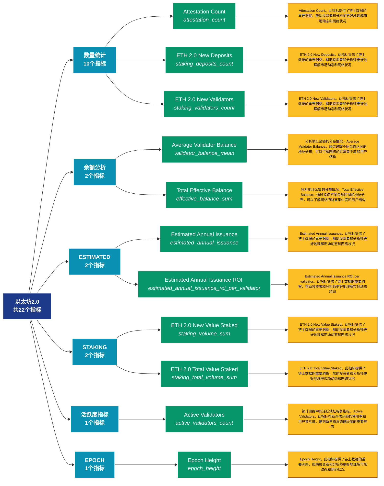

# 以太坊2.0 (eth2)

## 📋 概述

以太坊2.0质押和验证者数据，包括质押量、验证者数量、奖励等。

本类别共包含 **22** 个API端点，分为 **10** 个子类别。

## 🗂️ 指标分类

| 子类别 | 指标数量 | 主要功能 |
|--------|----------|----------|
| 数量统计 | 10 | 各类地址数量统计 |
| 余额分析 | 2 | 地址余额的详细统计分析 |
| ESTIMATED | 2 | 提供专门的数据分析 |
| STAKING | 2 | 提供专门的数据分析 |
| 活跃度指标 | 1 | 追踪网络活跃度和用户参与度 |
| EPOCH | 1 | 提供专门的数据分析 |
| DEPOSITED | 1 | 提供专门的数据分析 |
| PARTICIPATION | 1 | 提供专门的数据分析 |
| SLOT | 1 | 提供专门的数据分析 |
| STAKE | 1 | 提供专门的数据分析 |

## 🎨 指标体系结构图



## 📂 详细指标说明

### 📊 数量统计（10个指标）

本子类别包含以下详细指标：

#### 1. Attestation Count

- **指标代码**: `attestation_count`
- **API路径**: `/v1/metrics/eth2/attestation_count`
- **英文名称**: Attestation Count

**📝 详细说明**：
Attestation Count。此指标提供了链上数据的重要洞察，帮助投资者和分析师更好地理解市场动态和网络状况

**使用示例**：
```python
# 获取Attestation Count数据
df = client.get_metric(
    "/v1/metrics/eth2/attestation_count",
    asset="BTC",
    resolution="24h"
)
```

---

#### 2. ETH 2.0 New Deposits

- **指标代码**: `staking_deposits_count`
- **API路径**: `/v1/metrics/eth2/staking_deposits_count`
- **英文名称**: ETH 2.0 New Deposits

**📝 详细说明**：
ETH 2.0 New Deposits。此指标提供了链上数据的重要洞察，帮助投资者和分析师更好地理解市场动态和网络状况

**使用示例**：
```python
# 获取ETH 2.0 New Deposits数据
df = client.get_metric(
    "/v1/metrics/eth2/staking_deposits_count",
    asset="BTC",
    resolution="24h"
)
```

---

#### 3. ETH 2.0 New Validators

- **指标代码**: `staking_validators_count`
- **API路径**: `/v1/metrics/eth2/staking_validators_count`
- **英文名称**: ETH 2.0 New Validators

**📝 详细说明**：
ETH 2.0 New Validators。此指标提供了链上数据的重要洞察，帮助投资者和分析师更好地理解市场动态和网络状况

**使用示例**：
```python
# 获取ETH 2.0 New Validators数据
df = client.get_metric(
    "/v1/metrics/eth2/staking_validators_count",
    asset="BTC",
    resolution="24h"
)
```

---

#### 4. ETH 2.0 Total Number of Deposi

- **指标代码**: `staking_total_deposits_count`
- **API路径**: `/v1/metrics/eth2/staking_total_deposits_count`
- **英文名称**: ETH 2.0 Total Number of Deposits

**📝 详细说明**：
ETH 2.0 Total Number of Deposits。此指标提供了链上数据的重要洞察，帮助投资者和分析师更好地理解市场动态和网络状况

**使用示例**：
```python
# 获取ETH 2.0 Total Number of Deposi数据
df = client.get_metric(
    "/v1/metrics/eth2/staking_total_deposits_count",
    asset="BTC",
    resolution="24h"
)
```

---

#### 5. ETH 2.0 Total Number of Valida

- **指标代码**: `staking_total_validators_count`
- **API路径**: `/v1/metrics/eth2/staking_total_validators_count`
- **英文名称**: ETH 2.0 Total Number of Validators

**📝 详细说明**：
ETH 2.0 Total Number of Validators。此指标提供了链上数据的重要洞察，帮助投资者和分析师更好地理解市场动态和网络状况

**使用示例**：
```python
# 获取ETH 2.0 Total Number of Valida数据
df = client.get_metric(
    "/v1/metrics/eth2/staking_total_validators_count",
    asset="BTC",
    resolution="24h"
)
```

---

#### 6. Missed Blocks

- **指标代码**: `missed_blocks_count`
- **API路径**: `/v1/metrics/eth2/missed_blocks_count`
- **英文名称**: Missed Blocks

**📝 详细说明**：
Missed Blocks。此指标提供了链上数据的重要洞察，帮助投资者和分析师更好地理解市场动态和网络状况

**使用示例**：
```python
# 获取Missed Blocks数据
df = client.get_metric(
    "/v1/metrics/eth2/missed_blocks_count",
    asset="BTC",
    resolution="24h"
)
```

---

#### 7. Orphaned Blocks

- **指标代码**: `orphaned_blocks_count`
- **API路径**: `/v1/metrics/eth2/orphaned_blocks_count`
- **英文名称**: Orphaned Blocks

**📝 详细说明**：
Orphaned Blocks。此指标提供了链上数据的重要洞察，帮助投资者和分析师更好地理解市场动态和网络状况

**使用示例**：
```python
# 获取Orphaned Blocks数据
df = client.get_metric(
    "/v1/metrics/eth2/orphaned_blocks_count",
    asset="BTC",
    resolution="24h"
)
```

---

#### 8. Slashing Event Count

- **指标代码**: `slashings_count`
- **API路径**: `/v1/metrics/eth2/slashings_count`
- **英文名称**: Slashing Event Count

**📝 详细说明**：
Slashing Event Count。此指标提供了链上数据的重要洞察，帮助投资者和分析师更好地理解市场动态和网络状况

**使用示例**：
```python
# 获取Slashing Event Count数据
df = client.get_metric(
    "/v1/metrics/eth2/slashings_count",
    asset="BTC",
    resolution="24h"
)
```

---

#### 9. Staking Deposits

- **指标代码**: `deposits_count`
- **API路径**: `/v1/metrics/eth2/deposits_count`
- **英文名称**: Staking Deposits

**📝 详细说明**：
Staking Deposits。此指标提供了链上数据的重要洞察，帮助投资者和分析师更好地理解市场动态和网络状况

**使用示例**：
```python
# 获取Staking Deposits数据
df = client.get_metric(
    "/v1/metrics/eth2/deposits_count",
    asset="BTC",
    resolution="24h"
)
```

---

#### 10. Voluntary Exit Count

- **指标代码**: `voluntary_exit_count`
- **API路径**: `/v1/metrics/eth2/voluntary_exit_count`
- **英文名称**: Voluntary Exit Count

**📝 详细说明**：
Voluntary Exit Count。此指标提供了链上数据的重要洞察，帮助投资者和分析师更好地理解市场动态和网络状况

**使用示例**：
```python
# 获取Voluntary Exit Count数据
df = client.get_metric(
    "/v1/metrics/eth2/voluntary_exit_count",
    asset="BTC",
    resolution="24h"
)
```

---

### 📊 余额分析（2个指标）

本子类别包含以下详细指标：

#### 1. Average Validator Balance

- **指标代码**: `validator_balance_mean`
- **API路径**: `/v1/metrics/eth2/validator_balance_mean`
- **英文名称**: Average Validator Balance

**📝 详细说明**：
分析地址余额的分布情况。Average Validator Balance。通过追踪不同余额区间的地址分布，可以了解网络的财富集中度和用户结构

**使用示例**：
```python
# 获取Average Validator Balance数据
df = client.get_metric(
    "/v1/metrics/eth2/validator_balance_mean",
    asset="BTC",
    resolution="24h"
)
```

---

#### 2. Total Effective Balance

- **指标代码**: `effective_balance_sum`
- **API路径**: `/v1/metrics/eth2/effective_balance_sum`
- **英文名称**: Total Effective Balance

**📝 详细说明**：
分析地址余额的分布情况。Total Effective Balance。通过追踪不同余额区间的地址分布，可以了解网络的财富集中度和用户结构

**使用示例**：
```python
# 获取Total Effective Balance数据
df = client.get_metric(
    "/v1/metrics/eth2/effective_balance_sum",
    asset="BTC",
    resolution="24h"
)
```

---

### 📊 ESTIMATED（2个指标）

本子类别包含以下详细指标：

#### 1. Estimated Annual Issuance

- **指标代码**: `estimated_annual_issuance`
- **API路径**: `/v1/metrics/eth2/estimated_annual_issuance`
- **英文名称**: Estimated Annual Issuance

**📝 详细说明**：
Estimated Annual Issuance。此指标提供了链上数据的重要洞察，帮助投资者和分析师更好地理解市场动态和网络状况

**使用示例**：
```python
# 获取Estimated Annual Issuance数据
df = client.get_metric(
    "/v1/metrics/eth2/estimated_annual_issuance",
    asset="BTC",
    resolution="24h"
)
```

---

#### 2. Estimated Annual Issuance ROI 

- **指标代码**: `estimated_annual_issuance_roi_per_validator`
- **API路径**: `/v1/metrics/eth2/estimated_annual_issuance_roi_per_validator`
- **英文名称**: Estimated Annual Issuance ROI per validator

**📝 详细说明**：
Estimated Annual Issuance ROI per validator。此指标提供了链上数据的重要洞察，帮助投资者和分析师更好地理解市场动态和网络状况

**使用示例**：
```python
# 获取Estimated Annual Issuance ROI 数据
df = client.get_metric(
    "/v1/metrics/eth2/estimated_annual_issuance_roi_per_validator",
    asset="BTC",
    resolution="24h"
)
```

---

### 📊 STAKING（2个指标）

本子类别包含以下详细指标：

#### 1. ETH 2.0 New Value Staked

- **指标代码**: `staking_volume_sum`
- **API路径**: `/v1/metrics/eth2/staking_volume_sum`
- **英文名称**: ETH 2.0 New Value Staked

**📝 详细说明**：
ETH 2.0 New Value Staked。此指标提供了链上数据的重要洞察，帮助投资者和分析师更好地理解市场动态和网络状况

**使用示例**：
```python
# 获取ETH 2.0 New Value Staked数据
df = client.get_metric(
    "/v1/metrics/eth2/staking_volume_sum",
    asset="BTC",
    resolution="24h"
)
```

---

#### 2. ETH 2.0 Total Value Staked

- **指标代码**: `staking_total_volume_sum`
- **API路径**: `/v1/metrics/eth2/staking_total_volume_sum`
- **英文名称**: ETH 2.0 Total Value Staked

**📝 详细说明**：
ETH 2.0 Total Value Staked。此指标提供了链上数据的重要洞察，帮助投资者和分析师更好地理解市场动态和网络状况

**使用示例**：
```python
# 获取ETH 2.0 Total Value Staked数据
df = client.get_metric(
    "/v1/metrics/eth2/staking_total_volume_sum",
    asset="BTC",
    resolution="24h"
)
```

---

### 📊 活跃度指标（1个指标）

本子类别包含以下详细指标：

#### 1. Active Validators

- **指标代码**: `active_validators_count`
- **API路径**: `/v1/metrics/eth2/active_validators_count`
- **英文名称**: Active Validators

**📝 详细说明**：
统计网络中的活跃地址相关指标。Active Validators。此指标帮助评估网络的使用率和用户参与度，是判断生态系统健康度的重要参考

**使用示例**：
```python
# 获取Active Validators数据
df = client.get_metric(
    "/v1/metrics/eth2/active_validators_count",
    asset="BTC",
    resolution="24h"
)
```

---

### 📊 EPOCH（1个指标）

本子类别包含以下详细指标：

#### 1. Epoch Height

- **指标代码**: `epoch_height`
- **API路径**: `/v1/metrics/eth2/epoch_height`
- **英文名称**: Epoch Height

**📝 详细说明**：
Epoch Height。此指标提供了链上数据的重要洞察，帮助投资者和分析师更好地理解市场动态和网络状况

**使用示例**：
```python
# 获取Epoch Height数据
df = client.get_metric(
    "/v1/metrics/eth2/epoch_height",
    asset="BTC",
    resolution="24h"
)
```

---

### 📊 DEPOSITED（1个指标）

本子类别包含以下详细指标：

#### 1. ETH 2.0 Total Value Staked by 

- **指标代码**: `deposited_by_provider_volume_sum`
- **API路径**: `/v1/metrics/eth2/deposited_by_provider_volume_sum`
- **英文名称**: ETH 2.0 Total Value Staked by Provider

**📝 详细说明**：
ETH 2.0 Total Value Staked by Provider。此指标提供了链上数据的重要洞察，帮助投资者和分析师更好地理解市场动态和网络状况

**使用示例**：
```python
# 获取ETH 2.0 Total Value Staked by 数据
df = client.get_metric(
    "/v1/metrics/eth2/deposited_by_provider_volume_sum",
    asset="BTC",
    resolution="24h"
)
```

---

### 📊 PARTICIPATION（1个指标）

本子类别包含以下详细指标：

#### 1. Participation Rate

- **指标代码**: `participation_rate_mean`
- **API路径**: `/v1/metrics/eth2/participation_rate_mean`
- **英文名称**: Participation Rate

**📝 详细说明**：
Participation Rate。此指标提供了链上数据的重要洞察，帮助投资者和分析师更好地理解市场动态和网络状况

**使用示例**：
```python
# 获取Participation Rate数据
df = client.get_metric(
    "/v1/metrics/eth2/participation_rate_mean",
    asset="BTC",
    resolution="24h"
)
```

---

### 📊 SLOT（1个指标）

本子类别包含以下详细指标：

#### 1. Slot Height

- **指标代码**: `slot_height`
- **API路径**: `/v1/metrics/eth2/slot_height`
- **英文名称**: Slot Height

**📝 详细说明**：
Slot Height。此指标提供了链上数据的重要洞察，帮助投资者和分析师更好地理解市场动态和网络状况

**使用示例**：
```python
# 获取Slot Height数据
df = client.get_metric(
    "/v1/metrics/eth2/slot_height",
    asset="BTC",
    resolution="24h"
)
```

---

### 📊 STAKE（1个指标）

本子类别包含以下详细指标：

#### 1. Stake Effectiveness

- **指标代码**: `stake_effectiveness_mean`
- **API路径**: `/v1/metrics/eth2/stake_effectiveness_mean`
- **英文名称**: Stake Effectiveness

**📝 详细说明**：
Stake Effectiveness。此指标提供了链上数据的重要洞察，帮助投资者和分析师更好地理解市场动态和网络状况

**使用示例**：
```python
# 获取Stake Effectiveness数据
df = client.get_metric(
    "/v1/metrics/eth2/stake_effectiveness_mean",
    asset="BTC",
    resolution="24h"
)
```

---

## 📊 完整指标列表

| # | 指标名称 | 指标代码 | API路径 | 说明 |
|---|----------|----------|---------|------|
| 1 | Active Validators | `active_validators_count` | `/v1/metrics/eth2/active_validators_count` | 统计网络中的活跃地址相关指标。Active Validators。此指标帮助评估网络的使用率和用户参与度，是判断生态系统健康度的重要参考 |
| 2 | Attestation Count | `attestation_count` | `/v1/metrics/eth2/attestation_count` | Attestation Count。此指标提供了链上数据的重要洞察，帮助投资者和分析师更好地理解市场动态和网络状况 |
| 3 | Average Validator Balance | `validator_balance_mean` | `/v1/metrics/eth2/validator_balance_mean` | 分析地址余额的分布情况。Average Validator Balance。通过追踪不同余额区间的地址分布，可以了解网络的财富集中度和用户结构 |
| 4 | Epoch Height | `epoch_height` | `/v1/metrics/eth2/epoch_height` | Epoch Height。此指标提供了链上数据的重要洞察，帮助投资者和分析师更好地理解市场动态和网络状况 |
| 5 | Estimated Annual Issuance | `estimated_annual_issuance` | `/v1/metrics/eth2/estimated_annual_issuance` | Estimated Annual Issuance。此指标提供了链上数据的重要洞察，帮助投资者和分析师更好地理解市场动态和网络状况 |
| 6 | Estimated Annual Issuance ROI  | `estimated_annual_issuance_roi_per_validator` | `/v1/metrics/eth2/estimated_annual_issuance_roi_per_validator` | Estimated Annual Issuance ROI per validator。此指标提供了链上数据的重要洞察，帮助投资者和分析师更好地理解市场动态和网络状况 |
| 7 | ETH 2.0 New Deposits | `staking_deposits_count` | `/v1/metrics/eth2/staking_deposits_count` | ETH 2.0 New Deposits。此指标提供了链上数据的重要洞察，帮助投资者和分析师更好地理解市场动态和网络状况 |
| 8 | ETH 2.0 New Validators | `staking_validators_count` | `/v1/metrics/eth2/staking_validators_count` | ETH 2.0 New Validators。此指标提供了链上数据的重要洞察，帮助投资者和分析师更好地理解市场动态和网络状况 |
| 9 | ETH 2.0 New Value Staked | `staking_volume_sum` | `/v1/metrics/eth2/staking_volume_sum` | ETH 2.0 New Value Staked。此指标提供了链上数据的重要洞察，帮助投资者和分析师更好地理解市场动态和网络状况 |
| 10 | ETH 2.0 Total Number of Deposi | `staking_total_deposits_count` | `/v1/metrics/eth2/staking_total_deposits_count` | ETH 2.0 Total Number of Deposits。此指标提供了链上数据的重要洞察，帮助投资者和分析师更好地理解市场动态和网络状况 |
| 11 | ETH 2.0 Total Number of Valida | `staking_total_validators_count` | `/v1/metrics/eth2/staking_total_validators_count` | ETH 2.0 Total Number of Validators。此指标提供了链上数据的重要洞察，帮助投资者和分析师更好地理解市场动态和网络状况 |
| 12 | ETH 2.0 Total Value Staked | `staking_total_volume_sum` | `/v1/metrics/eth2/staking_total_volume_sum` | ETH 2.0 Total Value Staked。此指标提供了链上数据的重要洞察，帮助投资者和分析师更好地理解市场动态和网络状况 |
| 13 | ETH 2.0 Total Value Staked by  | `deposited_by_provider_volume_sum` | `/v1/metrics/eth2/deposited_by_provider_volume_sum` | ETH 2.0 Total Value Staked by Provider。此指标提供了链上数据的重要洞察，帮助投资者和分析师更好地理解市场动态和网络状况 |
| 14 | Missed Blocks | `missed_blocks_count` | `/v1/metrics/eth2/missed_blocks_count` | Missed Blocks。此指标提供了链上数据的重要洞察，帮助投资者和分析师更好地理解市场动态和网络状况 |
| 15 | Orphaned Blocks | `orphaned_blocks_count` | `/v1/metrics/eth2/orphaned_blocks_count` | Orphaned Blocks。此指标提供了链上数据的重要洞察，帮助投资者和分析师更好地理解市场动态和网络状况 |
| 16 | Participation Rate | `participation_rate_mean` | `/v1/metrics/eth2/participation_rate_mean` | Participation Rate。此指标提供了链上数据的重要洞察，帮助投资者和分析师更好地理解市场动态和网络状况 |
| 17 | Slashing Event Count | `slashings_count` | `/v1/metrics/eth2/slashings_count` | Slashing Event Count。此指标提供了链上数据的重要洞察，帮助投资者和分析师更好地理解市场动态和网络状况 |
| 18 | Slot Height | `slot_height` | `/v1/metrics/eth2/slot_height` | Slot Height。此指标提供了链上数据的重要洞察，帮助投资者和分析师更好地理解市场动态和网络状况 |
| 19 | Stake Effectiveness | `stake_effectiveness_mean` | `/v1/metrics/eth2/stake_effectiveness_mean` | Stake Effectiveness。此指标提供了链上数据的重要洞察，帮助投资者和分析师更好地理解市场动态和网络状况 |
| 20 | Staking Deposits | `deposits_count` | `/v1/metrics/eth2/deposits_count` | Staking Deposits。此指标提供了链上数据的重要洞察，帮助投资者和分析师更好地理解市场动态和网络状况 |
| 21 | Total Effective Balance | `effective_balance_sum` | `/v1/metrics/eth2/effective_balance_sum` | 分析地址余额的分布情况。Total Effective Balance。通过追踪不同余额区间的地址分布，可以了解网络的财富集中度和用户结构 |
| 22 | Voluntary Exit Count | `voluntary_exit_count` | `/v1/metrics/eth2/voluntary_exit_count` | Voluntary Exit Count。此指标提供了链上数据的重要洞察，帮助投资者和分析师更好地理解市场动态和网络状况 |

## 💻 代码示例

### Python客户端示例

```python
import requests
import pandas as pd
import matplotlib.pyplot as plt

class GlassnodeClient:
    def __init__(self, api_key):
        self.api_key = api_key
        self.base_url = "https://api.glassnode.com"
    
    def get_metric(self, path, asset="BTC", resolution="24h", **kwargs):
        url = f"{self.base_url}{path}"
        params = {
            "a": asset,
            "api_key": self.api_key,
            "s": resolution,
            **kwargs
        }
        
        response = requests.get(url, params=params)
        if response.status_code == 200:
            data = response.json()
            df = pd.DataFrame(data)
            df['datetime'] = pd.to_datetime(df['t'], unit='s')
            df['value'] = df['v']
            return df[['datetime', 'value']]
        else:
            raise Exception(f"API Error: {response.status_code}")

# 使用示例
client = GlassnodeClient("YOUR_API_KEY")

# 获取多个相关指标
metrics = [
    '/v1/metrics/addresses/active_count',
    '/v1/metrics/addresses/new',
    '/v1/metrics/addresses/non_zero_count'
]

data = {}
for metric_path in metrics:
    data[metric_path] = client.get_metric(metric_path)

# 可视化
fig, axes = plt.subplots(3, 1, figsize=(12, 10))
for idx, (path, df) in enumerate(data.items()):
    axes[idx].plot(df['datetime'], df['value'])
    axes[idx].set_title(path.split('/')[-1])
    axes[idx].grid(True, alpha=0.3)

plt.tight_layout()
plt.show()
```

### 批量数据分析

```python
import asyncio
import aiohttp

async def fetch_single(session, url, params, name):
    async with session.get(url, params=params) as response:
        if response.status == 200:
            data = await response.json()
            return name, data
        return name, None

async def fetch_batch_metrics(api_key, metric_configs):
    async with aiohttp.ClientSession() as session:
        tasks = []
        for config in metric_configs:
            url = f"https://api.glassnode.com{config['path']}"
            params = {
                "a": config.get('asset', 'BTC'),
                "api_key": api_key,
                "s": config.get('resolution', '24h')
            }
            tasks.append(fetch_single(session, url, params, config['name']))
        
        return await asyncio.gather(*tasks)

# 配置要获取的指标
metric_configs = [
    {'name': '活跃地址', 'path': '/v1/metrics/addresses/active_count'},
    {'name': '新增地址', 'path': '/v1/metrics/addresses/new'},
    {'name': '非零地址', 'path': '/v1/metrics/addresses/non_zero_count'}
]

# 执行批量获取
api_key = "YOUR_API_KEY"
results = asyncio.run(fetch_batch_metrics(api_key, metric_configs))
```

## ⚙️ API参数说明

| 参数 | 必需 | 类型 | 说明 | 示例 |
|------|------|------|------|------|
| `a` | ✅ | string | 资产符号 | BTC, ETH |
| `api_key` | ✅ | string | API密钥 | your_key |
| `s` | ❌ | string | 时间分辨率 | 10m, 1h, 24h |
| `i` | ❌ | string | 时间间隔 | 24h, 1w |
| `since` | ❌ | integer | 开始时间 | 1614556800 |
| `until` | ❌ | integer | 结束时间 | 1617235200 |
| `c` | ❌ | string | 货币单位 | native, USD |

## 📈 数据特性

- **更新频率**: 10分钟到每日不等
- **历史数据**: 最早可追溯至2009年（BTC）
- **数据格式**: JSON或CSV
- **时区**: UTC

## 🔗 相关资源

- [Glassnode官网](https://glassnode.com)
- [API文档](https://docs.glassnode.com)
- [Glassnode Academy](https://academy.glassnode.com)

---

*文档版本: v5.0*  
*最后更新: 2024年*  
