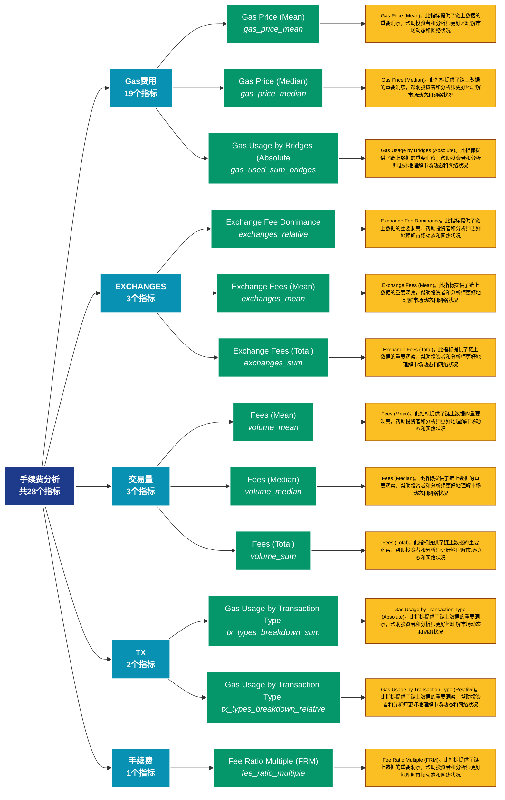

# 手续费分析 (fees)

## 📋 概述

手续费市场分析，包括平均费用、总费用、费用压力等费用相关指标。

本类别共包含 **28** 个API端点，分为 **5** 个子类别。

## 🗂️ 指标分类

| 子类别 | 指标数量 | 主要功能 |
|--------|----------|----------|
| Gas费用 | 19 | 提供专门的数据分析 |
| EXCHANGES | 3 | 提供专门的数据分析 |
| 交易量 | 3 | 提供专门的数据分析 |
| TX | 2 | 提供专门的数据分析 |
| 手续费 | 1 | 提供专门的数据分析 |

## 🎨 指标体系结构图



## 📂 详细指标说明

### 📊 Gas费用（19个指标）

本子类别包含以下详细指标：

#### 1. Gas Price (Mean)

- **指标代码**: `gas_price_mean`
- **API路径**: `/v1/metrics/fees/gas_price_mean`
- **英文名称**: Gas Price (Mean)

**📝 详细说明**：
Gas Price (Mean)。此指标提供了链上数据的重要洞察，帮助投资者和分析师更好地理解市场动态和网络状况

**使用示例**：
```python
# 获取Gas Price (Mean)数据
df = client.get_metric(
    "/v1/metrics/fees/gas_price_mean",
    asset="BTC",
    resolution="24h"
)
```

---

#### 2. Gas Price (Median)

- **指标代码**: `gas_price_median`
- **API路径**: `/v1/metrics/fees/gas_price_median`
- **英文名称**: Gas Price (Median)

**📝 详细说明**：
Gas Price (Median)。此指标提供了链上数据的重要洞察，帮助投资者和分析师更好地理解市场动态和网络状况

**使用示例**：
```python
# 获取Gas Price (Median)数据
df = client.get_metric(
    "/v1/metrics/fees/gas_price_median",
    asset="BTC",
    resolution="24h"
)
```

---

#### 3. Gas Usage by Bridges (Absolute

- **指标代码**: `gas_used_sum_bridges`
- **API路径**: `/v1/metrics/fees/gas_used_sum_bridges`
- **英文名称**: Gas Usage by Bridges (Absolute)

**📝 详细说明**：
Gas Usage by Bridges (Absolute)。此指标提供了链上数据的重要洞察，帮助投资者和分析师更好地理解市场动态和网络状况

**使用示例**：
```python
# 获取Gas Usage by Bridges (Absolute数据
df = client.get_metric(
    "/v1/metrics/fees/gas_used_sum_bridges",
    asset="BTC",
    resolution="24h"
)
```

---

#### 4. Gas Usage by Bridges (Relative

- **指标代码**: `gas_used_sum_bridges_relative`
- **API路径**: `/v1/metrics/fees/gas_used_sum_bridges_relative`
- **英文名称**: Gas Usage by Bridges (Relative)

**📝 详细说明**：
Gas Usage by Bridges (Relative)。此指标提供了链上数据的重要洞察，帮助投资者和分析师更好地理解市场动态和网络状况

**使用示例**：
```python
# 获取Gas Usage by Bridges (Relative数据
df = client.get_metric(
    "/v1/metrics/fees/gas_used_sum_bridges_relative",
    asset="BTC",
    resolution="24h"
)
```

---

#### 5. Gas Usage by DeFi (Absolute)

- **指标代码**: `gas_used_sum_defi`
- **API路径**: `/v1/metrics/fees/gas_used_sum_defi`
- **英文名称**: Gas Usage by DeFi (Absolute)

**📝 详细说明**：
Gas Usage by DeFi (Absolute)。此指标提供了链上数据的重要洞察，帮助投资者和分析师更好地理解市场动态和网络状况

**使用示例**：
```python
# 获取Gas Usage by DeFi (Absolute)数据
df = client.get_metric(
    "/v1/metrics/fees/gas_used_sum_defi",
    asset="BTC",
    resolution="24h"
)
```

---

#### 6. Gas Usage by DeFi (Relative)

- **指标代码**: `gas_used_sum_defi_relative`
- **API路径**: `/v1/metrics/fees/gas_used_sum_defi_relative`
- **英文名称**: Gas Usage by DeFi (Relative)

**📝 详细说明**：
Gas Usage by DeFi (Relative)。此指标提供了链上数据的重要洞察，帮助投资者和分析师更好地理解市场动态和网络状况

**使用示例**：
```python
# 获取Gas Usage by DeFi (Relative)数据
df = client.get_metric(
    "/v1/metrics/fees/gas_used_sum_defi_relative",
    asset="BTC",
    resolution="24h"
)
```

---

#### 7. Gas Usage by ERC-20 Tokens (Ab

- **指标代码**: `gas_used_sum_erc20`
- **API路径**: `/v1/metrics/fees/gas_used_sum_erc20`
- **英文名称**: Gas Usage by ERC-20 Tokens (Absolute)

**📝 详细说明**：
Gas Usage by ERC-20 Tokens (Absolute)。此指标提供了链上数据的重要洞察，帮助投资者和分析师更好地理解市场动态和网络状况

**使用示例**：
```python
# 获取Gas Usage by ERC-20 Tokens (Ab数据
df = client.get_metric(
    "/v1/metrics/fees/gas_used_sum_erc20",
    asset="BTC",
    resolution="24h"
)
```

---

#### 8. Gas Usage by ERC-20 Tokens (Re

- **指标代码**: `gas_used_sum_erc20_relative`
- **API路径**: `/v1/metrics/fees/gas_used_sum_erc20_relative`
- **英文名称**: Gas Usage by ERC-20 Tokens (Relative)

**📝 详细说明**：
Gas Usage by ERC-20 Tokens (Relative)。此指标提供了链上数据的重要洞察，帮助投资者和分析师更好地理解市场动态和网络状况

**使用示例**：
```python
# 获取Gas Usage by ERC-20 Tokens (Re数据
df = client.get_metric(
    "/v1/metrics/fees/gas_used_sum_erc20_relative",
    asset="BTC",
    resolution="24h"
)
```

---

#### 9. Gas Usage by NFTs (Absolute)

- **指标代码**: `gas_used_sum_nfts`
- **API路径**: `/v1/metrics/fees/gas_used_sum_nfts`
- **英文名称**: Gas Usage by NFTs (Absolute)

**📝 详细说明**：
Gas Usage by NFTs (Absolute)。此指标提供了链上数据的重要洞察，帮助投资者和分析师更好地理解市场动态和网络状况

**使用示例**：
```python
# 获取Gas Usage by NFTs (Absolute)数据
df = client.get_metric(
    "/v1/metrics/fees/gas_used_sum_nfts",
    asset="BTC",
    resolution="24h"
)
```

---

#### 10. Gas Usage by NFTs (Relative)

- **指标代码**: `gas_used_sum_nfts_relative`
- **API路径**: `/v1/metrics/fees/gas_used_sum_nfts_relative`
- **英文名称**: Gas Usage by NFTs (Relative)

**📝 详细说明**：
Gas Usage by NFTs (Relative)。此指标提供了链上数据的重要洞察，帮助投资者和分析师更好地理解市场动态和网络状况

**使用示例**：
```python
# 获取Gas Usage by NFTs (Relative)数据
df = client.get_metric(
    "/v1/metrics/fees/gas_used_sum_nfts_relative",
    asset="BTC",
    resolution="24h"
)
```

---

#### 11. Gas Usage by Stablecoins (Abso

- **指标代码**: `gas_used_sum_stablecoins`
- **API路径**: `/v1/metrics/fees/gas_used_sum_stablecoins`
- **英文名称**: Gas Usage by Stablecoins (Absolute)

**📝 详细说明**：
Gas Usage by Stablecoins (Absolute)。此指标提供了链上数据的重要洞察，帮助投资者和分析师更好地理解市场动态和网络状况

**使用示例**：
```python
# 获取Gas Usage by Stablecoins (Abso数据
df = client.get_metric(
    "/v1/metrics/fees/gas_used_sum_stablecoins",
    asset="BTC",
    resolution="24h"
)
```

---

#### 12. Gas Usage by Stablecoins (Rela

- **指标代码**: `gas_used_sum_stablecoins_relative`
- **API路径**: `/v1/metrics/fees/gas_used_sum_stablecoins_relative`
- **英文名称**: Gas Usage by Stablecoins (Relative)

**📝 详细说明**：
Gas Usage by Stablecoins (Relative)。此指标提供了链上数据的重要洞察，帮助投资者和分析师更好地理解市场动态和网络状况

**使用示例**：
```python
# 获取Gas Usage by Stablecoins (Rela数据
df = client.get_metric(
    "/v1/metrics/fees/gas_used_sum_stablecoins_relative",
    asset="BTC",
    resolution="24h"
)
```

---

#### 13. Gas Usage by Vanilla Transacti

- **指标代码**: `gas_used_sum_vanilla`
- **API路径**: `/v1/metrics/fees/gas_used_sum_vanilla`
- **英文名称**: Gas Usage by Vanilla Transactions (Absolute)

**📝 详细说明**：
Gas Usage by Vanilla Transactions (Absolute)。此指标提供了链上数据的重要洞察，帮助投资者和分析师更好地理解市场动态和网络状况

**使用示例**：
```python
# 获取Gas Usage by Vanilla Transacti数据
df = client.get_metric(
    "/v1/metrics/fees/gas_used_sum_vanilla",
    asset="BTC",
    resolution="24h"
)
```

---

#### 14. Gas Usage by Vanilla Transacti

- **指标代码**: `gas_used_sum_vanilla_relative`
- **API路径**: `/v1/metrics/fees/gas_used_sum_vanilla_relative`
- **英文名称**: Gas Usage by Vanilla Transactions (Relative)

**📝 详细说明**：
Gas Usage by Vanilla Transactions (Relative)。此指标提供了链上数据的重要洞察，帮助投资者和分析师更好地理解市场动态和网络状况

**使用示例**：
```python
# 获取Gas Usage by Vanilla Transacti数据
df = client.get_metric(
    "/v1/metrics/fees/gas_used_sum_vanilla_relative",
    asset="BTC",
    resolution="24h"
)
```

---

#### 15. Gas Used (Mean)

- **指标代码**: `gas_used_mean`
- **API路径**: `/v1/metrics/fees/gas_used_mean`
- **英文名称**: Gas Used (Mean)

**📝 详细说明**：
Gas Used (Mean)。此指标提供了链上数据的重要洞察，帮助投资者和分析师更好地理解市场动态和网络状况

**使用示例**：
```python
# 获取Gas Used (Mean)数据
df = client.get_metric(
    "/v1/metrics/fees/gas_used_mean",
    asset="BTC",
    resolution="24h"
)
```

---

#### 16. Gas Used (Median)

- **指标代码**: `gas_used_median`
- **API路径**: `/v1/metrics/fees/gas_used_median`
- **英文名称**: Gas Used (Median)

**📝 详细说明**：
Gas Used (Median)。此指标提供了链上数据的重要洞察，帮助投资者和分析师更好地理解市场动态和网络状况

**使用示例**：
```python
# 获取Gas Used (Median)数据
df = client.get_metric(
    "/v1/metrics/fees/gas_used_median",
    asset="BTC",
    resolution="24h"
)
```

---

#### 17. Gas Used (Total)

- **指标代码**: `gas_used_sum`
- **API路径**: `/v1/metrics/fees/gas_used_sum`
- **英文名称**: Gas Used (Total)

**📝 详细说明**：
Gas Used (Total)。此指标提供了链上数据的重要洞察，帮助投资者和分析师更好地理解市场动态和网络状况

**使用示例**：
```python
# 获取Gas Used (Total)数据
df = client.get_metric(
    "/v1/metrics/fees/gas_used_sum",
    asset="BTC",
    resolution="24h"
)
```

---

#### 18. Transaction Gas Limit (Mean)

- **指标代码**: `gas_limit_tx_mean`
- **API路径**: `/v1/metrics/fees/gas_limit_tx_mean`
- **英文名称**: Transaction Gas Limit (Mean)

**📝 详细说明**：
Transaction Gas Limit (Mean)。此指标提供了链上数据的重要洞察，帮助投资者和分析师更好地理解市场动态和网络状况

**使用示例**：
```python
# 获取Transaction Gas Limit (Mean)数据
df = client.get_metric(
    "/v1/metrics/fees/gas_limit_tx_mean",
    asset="BTC",
    resolution="24h"
)
```

---

#### 19. Transaction Gas Limit (Median)

- **指标代码**: `gas_limit_tx_median`
- **API路径**: `/v1/metrics/fees/gas_limit_tx_median`
- **英文名称**: Transaction Gas Limit (Median)

**📝 详细说明**：
Transaction Gas Limit (Median)。此指标提供了链上数据的重要洞察，帮助投资者和分析师更好地理解市场动态和网络状况

**使用示例**：
```python
# 获取Transaction Gas Limit (Median)数据
df = client.get_metric(
    "/v1/metrics/fees/gas_limit_tx_median",
    asset="BTC",
    resolution="24h"
)
```

---

### 📊 EXCHANGES（3个指标）

本子类别包含以下详细指标：

#### 1. Exchange Fee Dominance

- **指标代码**: `exchanges_relative`
- **API路径**: `/v1/metrics/fees/exchanges_relative`
- **英文名称**: Exchange Fee Dominance

**📝 详细说明**：
Exchange Fee Dominance。此指标提供了链上数据的重要洞察，帮助投资者和分析师更好地理解市场动态和网络状况

**使用示例**：
```python
# 获取Exchange Fee Dominance数据
df = client.get_metric(
    "/v1/metrics/fees/exchanges_relative",
    asset="BTC",
    resolution="24h"
)
```

---

#### 2. Exchange Fees (Mean)

- **指标代码**: `exchanges_mean`
- **API路径**: `/v1/metrics/fees/exchanges_mean`
- **英文名称**: Exchange Fees (Mean)

**📝 详细说明**：
Exchange Fees (Mean)。此指标提供了链上数据的重要洞察，帮助投资者和分析师更好地理解市场动态和网络状况

**使用示例**：
```python
# 获取Exchange Fees (Mean)数据
df = client.get_metric(
    "/v1/metrics/fees/exchanges_mean",
    asset="BTC",
    resolution="24h"
)
```

---

#### 3. Exchange Fees (Total)

- **指标代码**: `exchanges_sum`
- **API路径**: `/v1/metrics/fees/exchanges_sum`
- **英文名称**: Exchange Fees (Total)

**📝 详细说明**：
Exchange Fees (Total)。此指标提供了链上数据的重要洞察，帮助投资者和分析师更好地理解市场动态和网络状况

**使用示例**：
```python
# 获取Exchange Fees (Total)数据
df = client.get_metric(
    "/v1/metrics/fees/exchanges_sum",
    asset="BTC",
    resolution="24h"
)
```

---

### 📊 交易量（3个指标）

本子类别包含以下详细指标：

#### 1. Fees (Mean)

- **指标代码**: `volume_mean`
- **API路径**: `/v1/metrics/fees/volume_mean`
- **英文名称**: Fees (Mean)

**📝 详细说明**：
Fees (Mean)。此指标提供了链上数据的重要洞察，帮助投资者和分析师更好地理解市场动态和网络状况

**使用示例**：
```python
# 获取Fees (Mean)数据
df = client.get_metric(
    "/v1/metrics/fees/volume_mean",
    asset="BTC",
    resolution="24h"
)
```

---

#### 2. Fees (Median)

- **指标代码**: `volume_median`
- **API路径**: `/v1/metrics/fees/volume_median`
- **英文名称**: Fees (Median)

**📝 详细说明**：
Fees (Median)。此指标提供了链上数据的重要洞察，帮助投资者和分析师更好地理解市场动态和网络状况

**使用示例**：
```python
# 获取Fees (Median)数据
df = client.get_metric(
    "/v1/metrics/fees/volume_median",
    asset="BTC",
    resolution="24h"
)
```

---

#### 3. Fees (Total)

- **指标代码**: `volume_sum`
- **API路径**: `/v1/metrics/fees/volume_sum`
- **英文名称**: Fees (Total)

**📝 详细说明**：
Fees (Total)。此指标提供了链上数据的重要洞察，帮助投资者和分析师更好地理解市场动态和网络状况

**使用示例**：
```python
# 获取Fees (Total)数据
df = client.get_metric(
    "/v1/metrics/fees/volume_sum",
    asset="BTC",
    resolution="24h"
)
```

---

### 📊 TX（2个指标）

本子类别包含以下详细指标：

#### 1. Gas Usage by Transaction Type 

- **指标代码**: `tx_types_breakdown_sum`
- **API路径**: `/v1/metrics/fees/tx_types_breakdown_sum`
- **英文名称**: Gas Usage by Transaction Type (Absolute)

**📝 详细说明**：
Gas Usage by Transaction Type (Absolute)。此指标提供了链上数据的重要洞察，帮助投资者和分析师更好地理解市场动态和网络状况

**使用示例**：
```python
# 获取Gas Usage by Transaction Type 数据
df = client.get_metric(
    "/v1/metrics/fees/tx_types_breakdown_sum",
    asset="BTC",
    resolution="24h"
)
```

---

#### 2. Gas Usage by Transaction Type 

- **指标代码**: `tx_types_breakdown_relative`
- **API路径**: `/v1/metrics/fees/tx_types_breakdown_relative`
- **英文名称**: Gas Usage by Transaction Type (Relative)

**📝 详细说明**：
Gas Usage by Transaction Type (Relative)。此指标提供了链上数据的重要洞察，帮助投资者和分析师更好地理解市场动态和网络状况

**使用示例**：
```python
# 获取Gas Usage by Transaction Type 数据
df = client.get_metric(
    "/v1/metrics/fees/tx_types_breakdown_relative",
    asset="BTC",
    resolution="24h"
)
```

---

### 📊 手续费（1个指标）

本子类别包含以下详细指标：

#### 1. Fee Ratio Multiple (FRM)

- **指标代码**: `fee_ratio_multiple`
- **API路径**: `/v1/metrics/fees/fee_ratio_multiple`
- **英文名称**: Fee Ratio Multiple (FRM)

**📝 详细说明**：
Fee Ratio Multiple (FRM)。此指标提供了链上数据的重要洞察，帮助投资者和分析师更好地理解市场动态和网络状况

**使用示例**：
```python
# 获取Fee Ratio Multiple (FRM)数据
df = client.get_metric(
    "/v1/metrics/fees/fee_ratio_multiple",
    asset="BTC",
    resolution="24h"
)
```

---

## 📊 完整指标列表

| # | 指标名称 | 指标代码 | API路径 | 说明 |
|---|----------|----------|---------|------|
| 1 | Exchange Fee Dominance | `exchanges_relative` | `/v1/metrics/fees/exchanges_relative` | Exchange Fee Dominance。此指标提供了链上数据的重要洞察，帮助投资者和分析师更好地理解市场动态和网络状况 |
| 2 | Exchange Fees (Mean) | `exchanges_mean` | `/v1/metrics/fees/exchanges_mean` | Exchange Fees (Mean)。此指标提供了链上数据的重要洞察，帮助投资者和分析师更好地理解市场动态和网络状况 |
| 3 | Exchange Fees (Total) | `exchanges_sum` | `/v1/metrics/fees/exchanges_sum` | Exchange Fees (Total)。此指标提供了链上数据的重要洞察，帮助投资者和分析师更好地理解市场动态和网络状况 |
| 4 | Fee Ratio Multiple (FRM) | `fee_ratio_multiple` | `/v1/metrics/fees/fee_ratio_multiple` | Fee Ratio Multiple (FRM)。此指标提供了链上数据的重要洞察，帮助投资者和分析师更好地理解市场动态和网络状况 |
| 5 | Fees (Mean) | `volume_mean` | `/v1/metrics/fees/volume_mean` | Fees (Mean)。此指标提供了链上数据的重要洞察，帮助投资者和分析师更好地理解市场动态和网络状况 |
| 6 | Fees (Median) | `volume_median` | `/v1/metrics/fees/volume_median` | Fees (Median)。此指标提供了链上数据的重要洞察，帮助投资者和分析师更好地理解市场动态和网络状况 |
| 7 | Fees (Total) | `volume_sum` | `/v1/metrics/fees/volume_sum` | Fees (Total)。此指标提供了链上数据的重要洞察，帮助投资者和分析师更好地理解市场动态和网络状况 |
| 8 | Gas Price (Mean) | `gas_price_mean` | `/v1/metrics/fees/gas_price_mean` | Gas Price (Mean)。此指标提供了链上数据的重要洞察，帮助投资者和分析师更好地理解市场动态和网络状况 |
| 9 | Gas Price (Median) | `gas_price_median` | `/v1/metrics/fees/gas_price_median` | Gas Price (Median)。此指标提供了链上数据的重要洞察，帮助投资者和分析师更好地理解市场动态和网络状况 |
| 10 | Gas Usage by Bridges (Absolute | `gas_used_sum_bridges` | `/v1/metrics/fees/gas_used_sum_bridges` | Gas Usage by Bridges (Absolute)。此指标提供了链上数据的重要洞察，帮助投资者和分析师更好地理解市场动态和网络状况 |
| 11 | Gas Usage by Bridges (Relative | `gas_used_sum_bridges_relative` | `/v1/metrics/fees/gas_used_sum_bridges_relative` | Gas Usage by Bridges (Relative)。此指标提供了链上数据的重要洞察，帮助投资者和分析师更好地理解市场动态和网络状况 |
| 12 | Gas Usage by DeFi (Absolute) | `gas_used_sum_defi` | `/v1/metrics/fees/gas_used_sum_defi` | Gas Usage by DeFi (Absolute)。此指标提供了链上数据的重要洞察，帮助投资者和分析师更好地理解市场动态和网络状况 |
| 13 | Gas Usage by DeFi (Relative) | `gas_used_sum_defi_relative` | `/v1/metrics/fees/gas_used_sum_defi_relative` | Gas Usage by DeFi (Relative)。此指标提供了链上数据的重要洞察，帮助投资者和分析师更好地理解市场动态和网络状况 |
| 14 | Gas Usage by ERC-20 Tokens (Ab | `gas_used_sum_erc20` | `/v1/metrics/fees/gas_used_sum_erc20` | Gas Usage by ERC-20 Tokens (Absolute)。此指标提供了链上数据的重要洞察，帮助投资者和分析师更好地理解市场动态和网络状况 |
| 15 | Gas Usage by ERC-20 Tokens (Re | `gas_used_sum_erc20_relative` | `/v1/metrics/fees/gas_used_sum_erc20_relative` | Gas Usage by ERC-20 Tokens (Relative)。此指标提供了链上数据的重要洞察，帮助投资者和分析师更好地理解市场动态和网络状况 |
| 16 | Gas Usage by NFTs (Absolute) | `gas_used_sum_nfts` | `/v1/metrics/fees/gas_used_sum_nfts` | Gas Usage by NFTs (Absolute)。此指标提供了链上数据的重要洞察，帮助投资者和分析师更好地理解市场动态和网络状况 |
| 17 | Gas Usage by NFTs (Relative) | `gas_used_sum_nfts_relative` | `/v1/metrics/fees/gas_used_sum_nfts_relative` | Gas Usage by NFTs (Relative)。此指标提供了链上数据的重要洞察，帮助投资者和分析师更好地理解市场动态和网络状况 |
| 18 | Gas Usage by Stablecoins (Abso | `gas_used_sum_stablecoins` | `/v1/metrics/fees/gas_used_sum_stablecoins` | Gas Usage by Stablecoins (Absolute)。此指标提供了链上数据的重要洞察，帮助投资者和分析师更好地理解市场动态和网络状况 |
| 19 | Gas Usage by Stablecoins (Rela | `gas_used_sum_stablecoins_relative` | `/v1/metrics/fees/gas_used_sum_stablecoins_relative` | Gas Usage by Stablecoins (Relative)。此指标提供了链上数据的重要洞察，帮助投资者和分析师更好地理解市场动态和网络状况 |
| 20 | Gas Usage by Transaction Type  | `tx_types_breakdown_sum` | `/v1/metrics/fees/tx_types_breakdown_sum` | Gas Usage by Transaction Type (Absolute)。此指标提供了链上数据的重要洞察，帮助投资者和分析师更好地理解市场动态和网络状况 |
| 21 | Gas Usage by Transaction Type  | `tx_types_breakdown_relative` | `/v1/metrics/fees/tx_types_breakdown_relative` | Gas Usage by Transaction Type (Relative)。此指标提供了链上数据的重要洞察，帮助投资者和分析师更好地理解市场动态和网络状况 |
| 22 | Gas Usage by Vanilla Transacti | `gas_used_sum_vanilla` | `/v1/metrics/fees/gas_used_sum_vanilla` | Gas Usage by Vanilla Transactions (Absolute)。此指标提供了链上数据的重要洞察，帮助投资者和分析师更好地理解市场动态和网络状况 |
| 23 | Gas Usage by Vanilla Transacti | `gas_used_sum_vanilla_relative` | `/v1/metrics/fees/gas_used_sum_vanilla_relative` | Gas Usage by Vanilla Transactions (Relative)。此指标提供了链上数据的重要洞察，帮助投资者和分析师更好地理解市场动态和网络状况 |
| 24 | Gas Used (Mean) | `gas_used_mean` | `/v1/metrics/fees/gas_used_mean` | Gas Used (Mean)。此指标提供了链上数据的重要洞察，帮助投资者和分析师更好地理解市场动态和网络状况 |
| 25 | Gas Used (Median) | `gas_used_median` | `/v1/metrics/fees/gas_used_median` | Gas Used (Median)。此指标提供了链上数据的重要洞察，帮助投资者和分析师更好地理解市场动态和网络状况 |
| 26 | Gas Used (Total) | `gas_used_sum` | `/v1/metrics/fees/gas_used_sum` | Gas Used (Total)。此指标提供了链上数据的重要洞察，帮助投资者和分析师更好地理解市场动态和网络状况 |
| 27 | Transaction Gas Limit (Mean) | `gas_limit_tx_mean` | `/v1/metrics/fees/gas_limit_tx_mean` | Transaction Gas Limit (Mean)。此指标提供了链上数据的重要洞察，帮助投资者和分析师更好地理解市场动态和网络状况 |
| 28 | Transaction Gas Limit (Median) | `gas_limit_tx_median` | `/v1/metrics/fees/gas_limit_tx_median` | Transaction Gas Limit (Median)。此指标提供了链上数据的重要洞察，帮助投资者和分析师更好地理解市场动态和网络状况 |

## 💻 代码示例

### Python客户端示例

```python
import requests
import pandas as pd
import matplotlib.pyplot as plt

class GlassnodeClient:
    def __init__(self, api_key):
        self.api_key = api_key
        self.base_url = "https://api.glassnode.com"
    
    def get_metric(self, path, asset="BTC", resolution="24h", **kwargs):
        url = f"{self.base_url}{path}"
        params = {
            "a": asset,
            "api_key": self.api_key,
            "s": resolution,
            **kwargs
        }
        
        response = requests.get(url, params=params)
        if response.status_code == 200:
            data = response.json()
            df = pd.DataFrame(data)
            df['datetime'] = pd.to_datetime(df['t'], unit='s')
            df['value'] = df['v']
            return df[['datetime', 'value']]
        else:
            raise Exception(f"API Error: {response.status_code}")

# 使用示例
client = GlassnodeClient("YOUR_API_KEY")

# 获取多个相关指标
metrics = [
    '/v1/metrics/addresses/active_count',
    '/v1/metrics/addresses/new',
    '/v1/metrics/addresses/non_zero_count'
]

data = {}
for metric_path in metrics:
    data[metric_path] = client.get_metric(metric_path)

# 可视化
fig, axes = plt.subplots(3, 1, figsize=(12, 10))
for idx, (path, df) in enumerate(data.items()):
    axes[idx].plot(df['datetime'], df['value'])
    axes[idx].set_title(path.split('/')[-1])
    axes[idx].grid(True, alpha=0.3)

plt.tight_layout()
plt.show()
```

### 批量数据分析

```python
import asyncio
import aiohttp

async def fetch_single(session, url, params, name):
    async with session.get(url, params=params) as response:
        if response.status == 200:
            data = await response.json()
            return name, data
        return name, None

async def fetch_batch_metrics(api_key, metric_configs):
    async with aiohttp.ClientSession() as session:
        tasks = []
        for config in metric_configs:
            url = f"https://api.glassnode.com{config['path']}"
            params = {
                "a": config.get('asset', 'BTC'),
                "api_key": api_key,
                "s": config.get('resolution', '24h')
            }
            tasks.append(fetch_single(session, url, params, config['name']))
        
        return await asyncio.gather(*tasks)

# 配置要获取的指标
metric_configs = [
    {'name': '活跃地址', 'path': '/v1/metrics/addresses/active_count'},
    {'name': '新增地址', 'path': '/v1/metrics/addresses/new'},
    {'name': '非零地址', 'path': '/v1/metrics/addresses/non_zero_count'}
]

# 执行批量获取
api_key = "YOUR_API_KEY"
results = asyncio.run(fetch_batch_metrics(api_key, metric_configs))
```

## ⚙️ API参数说明

| 参数 | 必需 | 类型 | 说明 | 示例 |
|------|------|------|------|------|
| `a` | ✅ | string | 资产符号 | BTC, ETH |
| `api_key` | ✅ | string | API密钥 | your_key |
| `s` | ❌ | string | 时间分辨率 | 10m, 1h, 24h |
| `i` | ❌ | string | 时间间隔 | 24h, 1w |
| `since` | ❌ | integer | 开始时间 | 1614556800 |
| `until` | ❌ | integer | 结束时间 | 1617235200 |
| `c` | ❌ | string | 货币单位 | native, USD |

## 📈 数据特性

- **更新频率**: 10分钟到每日不等
- **历史数据**: 最早可追溯至2009年（BTC）
- **数据格式**: JSON或CSV
- **时区**: UTC

## 🔗 相关资源

- [Glassnode官网](https://glassnode.com)
- [API文档](https://docs.glassnode.com)
- [Glassnode Academy](https://academy.glassnode.com)

---

*文档版本: v5.0*  
*最后更新: 2024年*  
