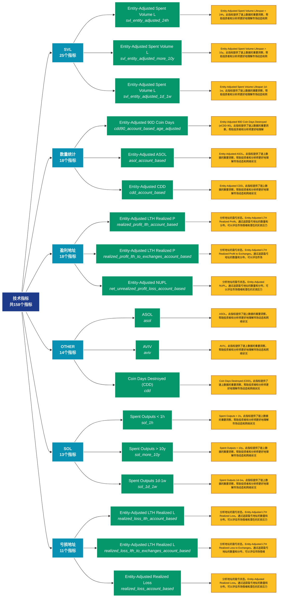

# 技术指标 (indicators)

## 📋 概述

技术分析指标，包括MVRV、SOPR、NVT等链上特有的分析指标。

本类别共包含 **158** 个API端点，分为 **38** 个子类别。

## 🗂️ 指标分类

| 子类别 | 指标数量 | 主要功能 |
|--------|----------|----------|
| SVL | 25 | 提供专门的数据分析 |
| 数量统计 | 18 | 各类地址数量统计 |
| 盈利地址 | 18 | 分析盈利地址的规模和特征 |
| OTHER | 14 | 提供专门的数据分析 |
| SOL | 13 | 提供专门的数据分析 |
| 亏损地址 | 11 | 分析亏损地址的规模和特征 |
| 供应量分布 | 10 | 供应量在不同地址组的分布 |
| SPENT | 6 | 提供专门的数据分析 |
| LEVERAGE | 4 | 提供专门的数据分析 |
| SOPR指标 | 3 | 提供专门的数据分析 |
| COIN | 2 | 提供专门的数据分析 |
| COST | 2 | 提供专门的数据分析 |
| 挖矿难度 | 2 | 提供专门的数据分析 |
| ASOL | 2 | 提供专门的数据分析 |
| CDD | 2 | 提供专门的数据分析 |
| NUPL | 2 | 提供专门的数据分析 |
| STOCK | 2 | 提供专门的数据分析 |
| UTXO | 2 | 提供专门的数据分析 |
| CDD90 | 1 | 提供专门的数据分析 |
| 累积地址 | 1 | 累积地址的历史统计 |
| 余额分析 | 1 | 地址余额的详细统计分析 |
| AVERAGE | 1 | 提供专门的数据分析 |
| DORMANCY | 1 | 提供专门的数据分析 |
| NVT | 1 | 提供专门的数据分析 |
| SVAB | 1 | 提供专门的数据分析 |
| URPD | 1 | 提供专门的数据分析 |
| FEAR | 1 | 提供专门的数据分析 |
| 哈希率 | 1 | 提供专门的数据分析 |
| HODLED | 1 | 提供专门的数据分析 |
| HODLER | 1 | 提供专门的数据分析 |
| INVESTOR | 1 | 提供专门的数据分析 |
| PI | 1 | 提供专门的数据分析 |
| POWER | 1 | 提供专门的数据分析 |
| PUELL | 1 | 提供专门的数据分析 |
| RESERVE | 1 | 提供专门的数据分析 |
| RHODL | 1 | 提供专门的数据分析 |
| SELLER | 1 | 提供专门的数据分析 |
| SSR | 1 | 提供专门的数据分析 |

## 🎨 指标体系结构图



## 📂 详细指标说明

### 📊 SVL（25个指标）

本子类别包含以下详细指标：

#### 1. Entity-Adjusted Spent Volume L

- **指标代码**: `svl_entity_adjusted_24h`
- **API路径**: `/v1/metrics/indicators/svl_entity_adjusted_24h`
- **英文名称**: Entity-Adjusted Spent Volume Lifespan < 24h

**📝 详细说明**：
Entity-Adjusted Spent Volume Lifespan < 24h。此指标提供了链上数据的重要洞察，帮助投资者和分析师更好地理解市场动态和网络状况

**使用示例**：
```python
# 获取Entity-Adjusted Spent Volume L数据
df = client.get_metric(
    "/v1/metrics/indicators/svl_entity_adjusted_24h",
    asset="BTC",
    resolution="24h"
)
```

---

#### 2. Entity-Adjusted Spent Volume L

- **指标代码**: `svl_entity_adjusted_more_10y`
- **API路径**: `/v1/metrics/indicators/svl_entity_adjusted_more_10y`
- **英文名称**: Entity-Adjusted Spent Volume Lifespan > 10y

**📝 详细说明**：
Entity-Adjusted Spent Volume Lifespan > 10y。此指标提供了链上数据的重要洞察，帮助投资者和分析师更好地理解市场动态和网络状况

**使用示例**：
```python
# 获取Entity-Adjusted Spent Volume L数据
df = client.get_metric(
    "/v1/metrics/indicators/svl_entity_adjusted_more_10y",
    asset="BTC",
    resolution="24h"
)
```

---

#### 3. Entity-Adjusted Spent Volume L

- **指标代码**: `svl_entity_adjusted_1d_1w`
- **API路径**: `/v1/metrics/indicators/svl_entity_adjusted_1d_1w`
- **英文名称**: Entity-Adjusted Spent Volume Lifespan 1d-1w

**📝 详细说明**：
Entity-Adjusted Spent Volume Lifespan 1d-1w。此指标提供了链上数据的重要洞察，帮助投资者和分析师更好地理解市场动态和网络状况

**使用示例**：
```python
# 获取Entity-Adjusted Spent Volume L数据
df = client.get_metric(
    "/v1/metrics/indicators/svl_entity_adjusted_1d_1w",
    asset="BTC",
    resolution="24h"
)
```

---

#### 4. Entity-Adjusted Spent Volume L

- **指标代码**: `svl_entity_adjusted_1m_3m`
- **API路径**: `/v1/metrics/indicators/svl_entity_adjusted_1m_3m`
- **英文名称**: Entity-Adjusted Spent Volume Lifespan 1m-3m

**📝 详细说明**：
Entity-Adjusted Spent Volume Lifespan 1m-3m。此指标提供了链上数据的重要洞察，帮助投资者和分析师更好地理解市场动态和网络状况

**使用示例**：
```python
# 获取Entity-Adjusted Spent Volume L数据
df = client.get_metric(
    "/v1/metrics/indicators/svl_entity_adjusted_1m_3m",
    asset="BTC",
    resolution="24h"
)
```

---

#### 5. Entity-Adjusted Spent Volume L

- **指标代码**: `svl_entity_adjusted_1w_1m`
- **API路径**: `/v1/metrics/indicators/svl_entity_adjusted_1w_1m`
- **英文名称**: Entity-Adjusted Spent Volume Lifespan 1w-1m 

**📝 详细说明**：
Entity-Adjusted Spent Volume Lifespan 1w-1m 。此指标提供了链上数据的重要洞察，帮助投资者和分析师更好地理解市场动态和网络状况

**使用示例**：
```python
# 获取Entity-Adjusted Spent Volume L数据
df = client.get_metric(
    "/v1/metrics/indicators/svl_entity_adjusted_1w_1m",
    asset="BTC",
    resolution="24h"
)
```

---

#### 6. Entity-Adjusted Spent Volume L

- **指标代码**: `svl_entity_adjusted_1y_2y`
- **API路径**: `/v1/metrics/indicators/svl_entity_adjusted_1y_2y`
- **英文名称**: Entity-Adjusted Spent Volume Lifespan 1y-2y

**📝 详细说明**：
Entity-Adjusted Spent Volume Lifespan 1y-2y。此指标提供了链上数据的重要洞察，帮助投资者和分析师更好地理解市场动态和网络状况

**使用示例**：
```python
# 获取Entity-Adjusted Spent Volume L数据
df = client.get_metric(
    "/v1/metrics/indicators/svl_entity_adjusted_1y_2y",
    asset="BTC",
    resolution="24h"
)
```

---

#### 7. Entity-Adjusted Spent Volume L

- **指标代码**: `svl_entity_adjusted_2y_3y`
- **API路径**: `/v1/metrics/indicators/svl_entity_adjusted_2y_3y`
- **英文名称**: Entity-Adjusted Spent Volume Lifespan 2y-3y

**📝 详细说明**：
Entity-Adjusted Spent Volume Lifespan 2y-3y。此指标提供了链上数据的重要洞察，帮助投资者和分析师更好地理解市场动态和网络状况

**使用示例**：
```python
# 获取Entity-Adjusted Spent Volume L数据
df = client.get_metric(
    "/v1/metrics/indicators/svl_entity_adjusted_2y_3y",
    asset="BTC",
    resolution="24h"
)
```

---

#### 8. Entity-Adjusted Spent Volume L

- **指标代码**: `svl_entity_adjusted_3m_6m`
- **API路径**: `/v1/metrics/indicators/svl_entity_adjusted_3m_6m`
- **英文名称**: Entity-Adjusted Spent Volume Lifespan 3m-6m

**📝 详细说明**：
Entity-Adjusted Spent Volume Lifespan 3m-6m。此指标提供了链上数据的重要洞察，帮助投资者和分析师更好地理解市场动态和网络状况

**使用示例**：
```python
# 获取Entity-Adjusted Spent Volume L数据
df = client.get_metric(
    "/v1/metrics/indicators/svl_entity_adjusted_3m_6m",
    asset="BTC",
    resolution="24h"
)
```

---

#### 9. Entity-Adjusted Spent Volume L

- **指标代码**: `svl_entity_adjusted_3y_5y`
- **API路径**: `/v1/metrics/indicators/svl_entity_adjusted_3y_5y`
- **英文名称**: Entity-Adjusted Spent Volume Lifespan 3y-5y

**📝 详细说明**：
Entity-Adjusted Spent Volume Lifespan 3y-5y。此指标提供了链上数据的重要洞察，帮助投资者和分析师更好地理解市场动态和网络状况

**使用示例**：
```python
# 获取Entity-Adjusted Spent Volume L数据
df = client.get_metric(
    "/v1/metrics/indicators/svl_entity_adjusted_3y_5y",
    asset="BTC",
    resolution="24h"
)
```

---

#### 10. Entity-Adjusted Spent Volume L

- **指标代码**: `svl_entity_adjusted_5y_7y`
- **API路径**: `/v1/metrics/indicators/svl_entity_adjusted_5y_7y`
- **英文名称**: Entity-Adjusted Spent Volume Lifespan 5y-7y

**📝 详细说明**：
Entity-Adjusted Spent Volume Lifespan 5y-7y。此指标提供了链上数据的重要洞察，帮助投资者和分析师更好地理解市场动态和网络状况

**使用示例**：
```python
# 获取Entity-Adjusted Spent Volume L数据
df = client.get_metric(
    "/v1/metrics/indicators/svl_entity_adjusted_5y_7y",
    asset="BTC",
    resolution="24h"
)
```

---

#### 11. Entity-Adjusted Spent Volume L

- **指标代码**: `svl_entity_adjusted_6m_12m`
- **API路径**: `/v1/metrics/indicators/svl_entity_adjusted_6m_12m`
- **英文名称**: Entity-Adjusted Spent Volume Lifespan 6m-12m 

**📝 详细说明**：
Entity-Adjusted Spent Volume Lifespan 6m-12m 。此指标提供了链上数据的重要洞察，帮助投资者和分析师更好地理解市场动态和网络状况

**使用示例**：
```python
# 获取Entity-Adjusted Spent Volume L数据
df = client.get_metric(
    "/v1/metrics/indicators/svl_entity_adjusted_6m_12m",
    asset="BTC",
    resolution="24h"
)
```

---

#### 12. Entity-Adjusted Spent Volume L

- **指标代码**: `svl_entity_adjusted_7y_10y`
- **API路径**: `/v1/metrics/indicators/svl_entity_adjusted_7y_10y`
- **英文名称**: Entity-Adjusted Spent Volume Lifespan 7y-10y

**📝 详细说明**：
Entity-Adjusted Spent Volume Lifespan 7y-10y。此指标提供了链上数据的重要洞察，帮助投资者和分析师更好地理解市场动态和网络状况

**使用示例**：
```python
# 获取Entity-Adjusted Spent Volume L数据
df = client.get_metric(
    "/v1/metrics/indicators/svl_entity_adjusted_7y_10y",
    asset="BTC",
    resolution="24h"
)
```

---

#### 13. Spent Volume < 1h

- **指标代码**: `svl_1h`
- **API路径**: `/v1/metrics/indicators/svl_1h`
- **英文名称**: Spent Volume < 1h

**📝 详细说明**：
Spent Volume < 1h。此指标提供了链上数据的重要洞察，帮助投资者和分析师更好地理解市场动态和网络状况

**使用示例**：
```python
# 获取Spent Volume < 1h数据
df = client.get_metric(
    "/v1/metrics/indicators/svl_1h",
    asset="BTC",
    resolution="24h"
)
```

---

#### 14. Spent Volume > 10y

- **指标代码**: `svl_more_10y`
- **API路径**: `/v1/metrics/indicators/svl_more_10y`
- **英文名称**: Spent Volume > 10y

**📝 详细说明**：
Spent Volume > 10y。此指标提供了链上数据的重要洞察，帮助投资者和分析师更好地理解市场动态和网络状况

**使用示例**：
```python
# 获取Spent Volume > 10y数据
df = client.get_metric(
    "/v1/metrics/indicators/svl_more_10y",
    asset="BTC",
    resolution="24h"
)
```

---

#### 15. Spent Volume 1d-1w

- **指标代码**: `svl_1d_1w`
- **API路径**: `/v1/metrics/indicators/svl_1d_1w`
- **英文名称**: Spent Volume 1d-1w

**📝 详细说明**：
Spent Volume 1d-1w。此指标提供了链上数据的重要洞察，帮助投资者和分析师更好地理解市场动态和网络状况

**使用示例**：
```python
# 获取Spent Volume 1d-1w数据
df = client.get_metric(
    "/v1/metrics/indicators/svl_1d_1w",
    asset="BTC",
    resolution="24h"
)
```

---

#### 16. Spent Volume 1h-24h

- **指标代码**: `svl_1h_24h`
- **API路径**: `/v1/metrics/indicators/svl_1h_24h`
- **英文名称**: Spent Volume 1h-24h

**📝 详细说明**：
Spent Volume 1h-24h。此指标提供了链上数据的重要洞察，帮助投资者和分析师更好地理解市场动态和网络状况

**使用示例**：
```python
# 获取Spent Volume 1h-24h数据
df = client.get_metric(
    "/v1/metrics/indicators/svl_1h_24h",
    asset="BTC",
    resolution="24h"
)
```

---

#### 17. Spent Volume 1m-3m

- **指标代码**: `svl_1m_3m`
- **API路径**: `/v1/metrics/indicators/svl_1m_3m`
- **英文名称**: Spent Volume 1m-3m

**📝 详细说明**：
Spent Volume 1m-3m。此指标提供了链上数据的重要洞察，帮助投资者和分析师更好地理解市场动态和网络状况

**使用示例**：
```python
# 获取Spent Volume 1m-3m数据
df = client.get_metric(
    "/v1/metrics/indicators/svl_1m_3m",
    asset="BTC",
    resolution="24h"
)
```

---

#### 18. Spent Volume 1w-1m

- **指标代码**: `svl_1w_1m`
- **API路径**: `/v1/metrics/indicators/svl_1w_1m`
- **英文名称**: Spent Volume 1w-1m

**📝 详细说明**：
Spent Volume 1w-1m。此指标提供了链上数据的重要洞察，帮助投资者和分析师更好地理解市场动态和网络状况

**使用示例**：
```python
# 获取Spent Volume 1w-1m数据
df = client.get_metric(
    "/v1/metrics/indicators/svl_1w_1m",
    asset="BTC",
    resolution="24h"
)
```

---

#### 19. Spent Volume 1y-2y

- **指标代码**: `svl_1y_2y`
- **API路径**: `/v1/metrics/indicators/svl_1y_2y`
- **英文名称**: Spent Volume 1y-2y

**📝 详细说明**：
Spent Volume 1y-2y。此指标提供了链上数据的重要洞察，帮助投资者和分析师更好地理解市场动态和网络状况

**使用示例**：
```python
# 获取Spent Volume 1y-2y数据
df = client.get_metric(
    "/v1/metrics/indicators/svl_1y_2y",
    asset="BTC",
    resolution="24h"
)
```

---

#### 20. Spent Volume 2y-3y

- **指标代码**: `svl_2y_3y`
- **API路径**: `/v1/metrics/indicators/svl_2y_3y`
- **英文名称**: Spent Volume 2y-3y

**📝 详细说明**：
Spent Volume 2y-3y。此指标提供了链上数据的重要洞察，帮助投资者和分析师更好地理解市场动态和网络状况

**使用示例**：
```python
# 获取Spent Volume 2y-3y数据
df = client.get_metric(
    "/v1/metrics/indicators/svl_2y_3y",
    asset="BTC",
    resolution="24h"
)
```

---

#### 21. Spent Volume 3m-6m

- **指标代码**: `svl_3m_6m`
- **API路径**: `/v1/metrics/indicators/svl_3m_6m`
- **英文名称**: Spent Volume 3m-6m

**📝 详细说明**：
Spent Volume 3m-6m。此指标提供了链上数据的重要洞察，帮助投资者和分析师更好地理解市场动态和网络状况

**使用示例**：
```python
# 获取Spent Volume 3m-6m数据
df = client.get_metric(
    "/v1/metrics/indicators/svl_3m_6m",
    asset="BTC",
    resolution="24h"
)
```

---

#### 22. Spent Volume 3y-5y

- **指标代码**: `svl_3y_5y`
- **API路径**: `/v1/metrics/indicators/svl_3y_5y`
- **英文名称**: Spent Volume 3y-5y

**📝 详细说明**：
Spent Volume 3y-5y。此指标提供了链上数据的重要洞察，帮助投资者和分析师更好地理解市场动态和网络状况

**使用示例**：
```python
# 获取Spent Volume 3y-5y数据
df = client.get_metric(
    "/v1/metrics/indicators/svl_3y_5y",
    asset="BTC",
    resolution="24h"
)
```

---

#### 23. Spent Volume 5y-7y

- **指标代码**: `svl_5y_7y`
- **API路径**: `/v1/metrics/indicators/svl_5y_7y`
- **英文名称**: Spent Volume 5y-7y

**📝 详细说明**：
Spent Volume 5y-7y。此指标提供了链上数据的重要洞察，帮助投资者和分析师更好地理解市场动态和网络状况

**使用示例**：
```python
# 获取Spent Volume 5y-7y数据
df = client.get_metric(
    "/v1/metrics/indicators/svl_5y_7y",
    asset="BTC",
    resolution="24h"
)
```

---

#### 24. Spent Volume 6m-12m

- **指标代码**: `svl_6m_12m`
- **API路径**: `/v1/metrics/indicators/svl_6m_12m`
- **英文名称**: Spent Volume 6m-12m

**📝 详细说明**：
Spent Volume 6m-12m。此指标提供了链上数据的重要洞察，帮助投资者和分析师更好地理解市场动态和网络状况

**使用示例**：
```python
# 获取Spent Volume 6m-12m数据
df = client.get_metric(
    "/v1/metrics/indicators/svl_6m_12m",
    asset="BTC",
    resolution="24h"
)
```

---

#### 25. Spent Volume 7y-10y

- **指标代码**: `svl_7y_10y`
- **API路径**: `/v1/metrics/indicators/svl_7y_10y`
- **英文名称**: Spent Volume 7y-10y

**📝 详细说明**：
Spent Volume 7y-10y。此指标提供了链上数据的重要洞察，帮助投资者和分析师更好地理解市场动态和网络状况

**使用示例**：
```python
# 获取Spent Volume 7y-10y数据
df = client.get_metric(
    "/v1/metrics/indicators/svl_7y_10y",
    asset="BTC",
    resolution="24h"
)
```

---

### 📊 数量统计（18个指标）

本子类别包含以下详细指标：

#### 1. Entity-Adjusted 90D Coin Days 

- **指标代码**: `cdd90_account_based_age_adjusted`
- **API路径**: `/v1/metrics/indicators/cdd90_account_based_age_adjusted`
- **英文名称**: Entity-Adjusted 90D Coin Days Destroyed (eCDD-90)

**📝 详细说明**：
Entity-Adjusted 90D Coin Days Destroyed (eCDD-90)。此指标提供了链上数据的重要洞察，帮助投资者和分析师更好地理解市场动态和网络状况

**使用示例**：
```python
# 获取Entity-Adjusted 90D Coin Days 数据
df = client.get_metric(
    "/v1/metrics/indicators/cdd90_account_based_age_adjusted",
    asset="BTC",
    resolution="24h"
)
```

---

#### 2. Entity-Adjusted ASOL

- **指标代码**: `asol_account_based`
- **API路径**: `/v1/metrics/indicators/asol_account_based`
- **英文名称**: Entity-Adjusted ASOL

**📝 详细说明**：
Entity-Adjusted ASOL。此指标提供了链上数据的重要洞察，帮助投资者和分析师更好地理解市场动态和网络状况

**使用示例**：
```python
# 获取Entity-Adjusted ASOL数据
df = client.get_metric(
    "/v1/metrics/indicators/asol_account_based",
    asset="BTC",
    resolution="24h"
)
```

---

#### 3. Entity-Adjusted CDD

- **指标代码**: `cdd_account_based`
- **API路径**: `/v1/metrics/indicators/cdd_account_based`
- **英文名称**: Entity-Adjusted CDD

**📝 详细说明**：
Entity-Adjusted CDD。此指标提供了链上数据的重要洞察，帮助投资者和分析师更好地理解市场动态和网络状况

**使用示例**：
```python
# 获取Entity-Adjusted CDD数据
df = client.get_metric(
    "/v1/metrics/indicators/cdd_account_based",
    asset="BTC",
    resolution="24h"
)
```

---

#### 4. Entity-Adjusted CYD

- **指标代码**: `cyd_account_based`
- **API路径**: `/v1/metrics/indicators/cyd_account_based`
- **英文名称**: Entity-Adjusted CYD

**📝 详细说明**：
Entity-Adjusted CYD。此指标提供了链上数据的重要洞察，帮助投资者和分析师更好地理解市场动态和网络状况

**使用示例**：
```python
# 获取Entity-Adjusted CYD数据
df = client.get_metric(
    "/v1/metrics/indicators/cyd_account_based",
    asset="BTC",
    resolution="24h"
)
```

---

#### 5. Entity-Adjusted Dormancy

- **指标代码**: `dormancy_account_based`
- **API路径**: `/v1/metrics/indicators/dormancy_account_based`
- **英文名称**: Entity-Adjusted Dormancy

**📝 详细说明**：
Entity-Adjusted Dormancy。此指标提供了链上数据的重要洞察，帮助投资者和分析师更好地理解市场动态和网络状况

**使用示例**：
```python
# 获取Entity-Adjusted Dormancy数据
df = client.get_metric(
    "/v1/metrics/indicators/dormancy_account_based",
    asset="BTC",
    resolution="24h"
)
```

---

#### 6. Entity-Adjusted Liveliness

- **指标代码**: `liveliness_account_based`
- **API路径**: `/v1/metrics/indicators/liveliness_account_based`
- **英文名称**: Entity-Adjusted Liveliness

**📝 详细说明**：
Entity-Adjusted Liveliness。此指标提供了链上数据的重要洞察，帮助投资者和分析师更好地理解市场动态和网络状况

**使用示例**：
```python
# 获取Entity-Adjusted Liveliness数据
df = client.get_metric(
    "/v1/metrics/indicators/liveliness_account_based",
    asset="BTC",
    resolution="24h"
)
```

---

#### 7. Entity-Adjusted Long-Term Hold

- **指标代码**: `asol_lth_account_based`
- **API路径**: `/v1/metrics/indicators/asol_lth_account_based`
- **英文名称**: Entity-Adjusted Long-Term Holder ASOL

**📝 详细说明**：
Entity-Adjusted Long-Term Holder ASOL。此指标提供了链上数据的重要洞察，帮助投资者和分析师更好地理解市场动态和网络状况

**使用示例**：
```python
# 获取Entity-Adjusted Long-Term Hold数据
df = client.get_metric(
    "/v1/metrics/indicators/asol_lth_account_based",
    asset="BTC",
    resolution="24h"
)
```

---

#### 8. Entity-Adjusted Long-Term Hold

- **指标代码**: `cdd_lth_account_based`
- **API路径**: `/v1/metrics/indicators/cdd_lth_account_based`
- **英文名称**: Entity-Adjusted Long-Term Holder CDD

**📝 详细说明**：
Entity-Adjusted Long-Term Holder CDD。此指标提供了链上数据的重要洞察，帮助投资者和分析师更好地理解市场动态和网络状况

**使用示例**：
```python
# 获取Entity-Adjusted Long-Term Hold数据
df = client.get_metric(
    "/v1/metrics/indicators/cdd_lth_account_based",
    asset="BTC",
    resolution="24h"
)
```

---

#### 9. Entity-Adjusted Long-Term Hold

- **指标代码**: `dormancy_lth_account_based`
- **API路径**: `/v1/metrics/indicators/dormancy_lth_account_based`
- **英文名称**: Entity-Adjusted Long-Term Holder Dormancy

**📝 详细说明**：
Entity-Adjusted Long-Term Holder Dormancy。此指标提供了链上数据的重要洞察，帮助投资者和分析师更好地理解市场动态和网络状况

**使用示例**：
```python
# 获取Entity-Adjusted Long-Term Hold数据
df = client.get_metric(
    "/v1/metrics/indicators/dormancy_lth_account_based",
    asset="BTC",
    resolution="24h"
)
```

---

#### 10. Entity-Adjusted LTH-NUPL

- **指标代码**: `nupl_more_155_account_based`
- **API路径**: `/v1/metrics/indicators/nupl_more_155_account_based`
- **英文名称**: Entity-Adjusted LTH-NUPL

**📝 详细说明**：
Entity-Adjusted LTH-NUPL。此指标提供了链上数据的重要洞察，帮助投资者和分析师更好地理解市场动态和网络状况

**使用示例**：
```python
# 获取Entity-Adjusted LTH-NUPL数据
df = client.get_metric(
    "/v1/metrics/indicators/nupl_more_155_account_based",
    asset="BTC",
    resolution="24h"
)
```

---

#### 11. Entity-Adjusted MSOL

- **指标代码**: `msol_account_based`
- **API路径**: `/v1/metrics/indicators/msol_account_based`
- **英文名称**: Entity-Adjusted MSOL

**📝 详细说明**：
Entity-Adjusted MSOL。此指标提供了链上数据的重要洞察，帮助投资者和分析师更好地理解市场动态和网络状况

**使用示例**：
```python
# 获取Entity-Adjusted MSOL数据
df = client.get_metric(
    "/v1/metrics/indicators/msol_account_based",
    asset="BTC",
    resolution="24h"
)
```

---

#### 12. Entity-Adjusted MVRV

- **指标代码**: `mvrv_account_based`
- **API路径**: `/v1/metrics/indicators/mvrv_account_based`
- **英文名称**: Entity-Adjusted MVRV

**📝 详细说明**：
Entity-Adjusted MVRV。此指标提供了链上数据的重要洞察，帮助投资者和分析师更好地理解市场动态和网络状况

**使用示例**：
```python
# 获取Entity-Adjusted MVRV数据
df = client.get_metric(
    "/v1/metrics/indicators/mvrv_account_based",
    asset="BTC",
    resolution="24h"
)
```

---

#### 13. Entity-Adjusted Realized Cap

- **指标代码**: `rcap_account_based`
- **API路径**: `/v1/metrics/indicators/rcap_account_based`
- **英文名称**: Entity-Adjusted Realized Cap

**📝 详细说明**：
Entity-Adjusted Realized Cap。此指标提供了链上数据的重要洞察，帮助投资者和分析师更好地理解市场动态和网络状况

**使用示例**：
```python
# 获取Entity-Adjusted Realized Cap数据
df = client.get_metric(
    "/v1/metrics/indicators/rcap_account_based",
    asset="BTC",
    resolution="24h"
)
```

---

#### 14. Entity-Adjusted Short-Term Hol

- **指标代码**: `asol_sth_account_based`
- **API路径**: `/v1/metrics/indicators/asol_sth_account_based`
- **英文名称**: Entity-Adjusted Short-Term Holder ASOL

**📝 详细说明**：
Entity-Adjusted Short-Term Holder ASOL。此指标提供了链上数据的重要洞察，帮助投资者和分析师更好地理解市场动态和网络状况

**使用示例**：
```python
# 获取Entity-Adjusted Short-Term Hol数据
df = client.get_metric(
    "/v1/metrics/indicators/asol_sth_account_based",
    asset="BTC",
    resolution="24h"
)
```

---

#### 15. Entity-Adjusted Short-Term Hol

- **指标代码**: `cdd_sth_account_based`
- **API路径**: `/v1/metrics/indicators/cdd_sth_account_based`
- **英文名称**: Entity-Adjusted Short-Term Holder CDD

**📝 详细说明**：
Entity-Adjusted Short-Term Holder CDD。此指标提供了链上数据的重要洞察，帮助投资者和分析师更好地理解市场动态和网络状况

**使用示例**：
```python
# 获取Entity-Adjusted Short-Term Hol数据
df = client.get_metric(
    "/v1/metrics/indicators/cdd_sth_account_based",
    asset="BTC",
    resolution="24h"
)
```

---

#### 16. Entity-Adjusted Short-Term Hol

- **指标代码**: `dormancy_sth_account_based`
- **API路径**: `/v1/metrics/indicators/dormancy_sth_account_based`
- **英文名称**: Entity-Adjusted Short-Term Holder Dormancy

**📝 详细说明**：
Entity-Adjusted Short-Term Holder Dormancy。此指标提供了链上数据的重要洞察，帮助投资者和分析师更好地理解市场动态和网络状况

**使用示例**：
```python
# 获取Entity-Adjusted Short-Term Hol数据
df = client.get_metric(
    "/v1/metrics/indicators/dormancy_sth_account_based",
    asset="BTC",
    resolution="24h"
)
```

---

#### 17. Entity-Adjusted SOPR

- **指标代码**: `sopr_account_based`
- **API路径**: `/v1/metrics/indicators/sopr_account_based`
- **英文名称**: Entity-Adjusted SOPR

**📝 详细说明**：
Entity-Adjusted SOPR。此指标提供了链上数据的重要洞察，帮助投资者和分析师更好地理解市场动态和网络状况

**使用示例**：
```python
# 获取Entity-Adjusted SOPR数据
df = client.get_metric(
    "/v1/metrics/indicators/sopr_account_based",
    asset="BTC",
    resolution="24h"
)
```

---

#### 18. Entity-Adjusted STH-NUPL

- **指标代码**: `nupl_less_155_account_based`
- **API路径**: `/v1/metrics/indicators/nupl_less_155_account_based`
- **英文名称**: Entity-Adjusted STH-NUPL

**📝 详细说明**：
Entity-Adjusted STH-NUPL。此指标提供了链上数据的重要洞察，帮助投资者和分析师更好地理解市场动态和网络状况

**使用示例**：
```python
# 获取Entity-Adjusted STH-NUPL数据
df = client.get_metric(
    "/v1/metrics/indicators/nupl_less_155_account_based",
    asset="BTC",
    resolution="24h"
)
```

---

### 📊 盈利地址（18个指标）

本子类别包含以下详细指标：

#### 1. Entity-Adjusted LTH Realized P

- **指标代码**: `realized_profit_lth_account_based`
- **API路径**: `/v1/metrics/indicators/realized_profit_lth_account_based`
- **英文名称**: Entity-Adjusted LTH Realized Profit

**📝 详细说明**：
分析地址的盈亏状态。Entity-Adjusted LTH Realized Profit。通过追踪盈亏地址的数量和分布，可以评估市场情绪和潜在的买卖压力

**使用示例**：
```python
# 获取Entity-Adjusted LTH Realized P数据
df = client.get_metric(
    "/v1/metrics/indicators/realized_profit_lth_account_based",
    asset="BTC",
    resolution="24h"
)
```

---

#### 2. Entity-Adjusted LTH Realized P

- **指标代码**: `realized_profit_lth_to_exchanges_account_based`
- **API路径**: `/v1/metrics/indicators/realized_profit_lth_to_exchanges_account_based`
- **英文名称**: Entity-Adjusted LTH Realized Profit to Exchanges

**📝 详细说明**：
分析地址的盈亏状态。Entity-Adjusted LTH Realized Profit to Exchanges。通过追踪盈亏地址的数量和分布，可以评估市场情绪和潜在的买卖压力

**使用示例**：
```python
# 获取Entity-Adjusted LTH Realized P数据
df = client.get_metric(
    "/v1/metrics/indicators/realized_profit_lth_to_exchanges_account_based",
    asset="BTC",
    resolution="24h"
)
```

---

#### 3. Entity-Adjusted NUPL

- **指标代码**: `net_unrealized_profit_loss_account_based`
- **API路径**: `/v1/metrics/indicators/net_unrealized_profit_loss_account_based`
- **英文名称**: Entity-Adjusted NUPL

**📝 详细说明**：
分析地址的盈亏状态。Entity-Adjusted NUPL。通过追踪盈亏地址的数量和分布，可以评估市场情绪和潜在的买卖压力

**使用示例**：
```python
# 获取Entity-Adjusted NUPL数据
df = client.get_metric(
    "/v1/metrics/indicators/net_unrealized_profit_loss_account_based",
    asset="BTC",
    resolution="24h"
)
```

---

#### 4. Entity-Adjusted Realized Profi

- **指标代码**: `realized_profit_account_based`
- **API路径**: `/v1/metrics/indicators/realized_profit_account_based`
- **英文名称**: Entity-Adjusted Realized Profit

**📝 详细说明**：
分析地址的盈亏状态。Entity-Adjusted Realized Profit。通过追踪盈亏地址的数量和分布，可以评估市场情绪和潜在的买卖压力

**使用示例**：
```python
# 获取Entity-Adjusted Realized Profi数据
df = client.get_metric(
    "/v1/metrics/indicators/realized_profit_account_based",
    asset="BTC",
    resolution="24h"
)
```

---

#### 5. Entity-Adjusted Realized Profi

- **指标代码**: `realized_profit_to_exchanges_account_based`
- **API路径**: `/v1/metrics/indicators/realized_profit_to_exchanges_account_based`
- **英文名称**: Entity-Adjusted Realized Profit to Exchanges

**📝 详细说明**：
分析地址的盈亏状态。Entity-Adjusted Realized Profit to Exchanges。通过追踪盈亏地址的数量和分布，可以评估市场情绪和潜在的买卖压力

**使用示例**：
```python
# 获取Entity-Adjusted Realized Profi数据
df = client.get_metric(
    "/v1/metrics/indicators/realized_profit_to_exchanges_account_based",
    asset="BTC",
    resolution="24h"
)
```

---

#### 6. Entity-Adjusted STH Realized P

- **指标代码**: `realized_profit_sth_account_based`
- **API路径**: `/v1/metrics/indicators/realized_profit_sth_account_based`
- **英文名称**: Entity-Adjusted STH Realized Profit

**📝 详细说明**：
分析地址的盈亏状态。Entity-Adjusted STH Realized Profit。通过追踪盈亏地址的数量和分布，可以评估市场情绪和潜在的买卖压力

**使用示例**：
```python
# 获取Entity-Adjusted STH Realized P数据
df = client.get_metric(
    "/v1/metrics/indicators/realized_profit_sth_account_based",
    asset="BTC",
    resolution="24h"
)
```

---

#### 7. Entity-Adjusted STH Realized P

- **指标代码**: `realized_profit_sth_to_exchanges_account_based`
- **API路径**: `/v1/metrics/indicators/realized_profit_sth_to_exchanges_account_based`
- **英文名称**: Entity-Adjusted STH Realized Profit to Exchanges

**📝 详细说明**：
分析地址的盈亏状态。Entity-Adjusted STH Realized Profit to Exchanges。通过追踪盈亏地址的数量和分布，可以评估市场情绪和潜在的买卖压力

**使用示例**：
```python
# 获取Entity-Adjusted STH Realized P数据
df = client.get_metric(
    "/v1/metrics/indicators/realized_profit_sth_to_exchanges_account_based",
    asset="BTC",
    resolution="24h"
)
```

---

#### 8. Entity-Adjusted Unrealized Pro

- **指标代码**: `unrealized_profit_account_based`
- **API路径**: `/v1/metrics/indicators/unrealized_profit_account_based`
- **英文名称**: Entity-Adjusted Unrealized Profit

**📝 详细说明**：
分析地址的盈亏状态。Entity-Adjusted Unrealized Profit。通过追踪盈亏地址的数量和分布，可以评估市场情绪和潜在的买卖压力

**使用示例**：
```python
# 获取Entity-Adjusted Unrealized Pro数据
df = client.get_metric(
    "/v1/metrics/indicators/unrealized_profit_account_based",
    asset="BTC",
    resolution="24h"
)
```

---

#### 9. LTH Relative Unrealized Profit

- **指标代码**: `unrealized_profit_more_155`
- **API路径**: `/v1/metrics/indicators/unrealized_profit_more_155`
- **英文名称**: LTH Relative Unrealized Profit

**📝 详细说明**：
分析地址的盈亏状态。LTH Relative Unrealized Profit。通过追踪盈亏地址的数量和分布，可以评估市场情绪和潜在的买卖压力

**使用示例**：
```python
# 获取LTH Relative Unrealized Profit数据
df = client.get_metric(
    "/v1/metrics/indicators/unrealized_profit_more_155",
    asset="BTC",
    resolution="24h"
)
```

---

#### 10. Net Realized Profit/Loss

- **指标代码**: `net_realized_profit_loss`
- **API路径**: `/v1/metrics/indicators/net_realized_profit_loss`
- **英文名称**: Net Realized Profit/Loss

**📝 详细说明**：
分析地址的盈亏状态。Net Realized Profit/Loss。通过追踪盈亏地址的数量和分布，可以评估市场情绪和潜在的买卖压力

**使用示例**：
```python
# 获取Net Realized Profit/Loss数据
df = client.get_metric(
    "/v1/metrics/indicators/net_realized_profit_loss",
    asset="BTC",
    resolution="24h"
)
```

---

#### 11. Net Unrealized Profit/Loss (NU

- **指标代码**: `net_unrealized_profit_loss`
- **API路径**: `/v1/metrics/indicators/net_unrealized_profit_loss`
- **英文名称**: Net Unrealized Profit/Loss (NUPL)

**📝 详细说明**：
分析地址的盈亏状态。Net Unrealized Profit/Loss (NUPL)。通过追踪盈亏地址的数量和分布，可以评估市场情绪和潜在的买卖压力

**使用示例**：
```python
# 获取Net Unrealized Profit/Loss (NU数据
df = client.get_metric(
    "/v1/metrics/indicators/net_unrealized_profit_loss",
    asset="BTC",
    resolution="24h"
)
```

---

#### 12. Realized P/L Ratio

- **指标代码**: `realized_profit_loss_ratio`
- **API路径**: `/v1/metrics/indicators/realized_profit_loss_ratio`
- **英文名称**: Realized P/L Ratio

**📝 详细说明**：
分析地址的盈亏状态。Realized P/L Ratio。通过追踪盈亏地址的数量和分布，可以评估市场情绪和潜在的买卖压力

**使用示例**：
```python
# 获取Realized P/L Ratio数据
df = client.get_metric(
    "/v1/metrics/indicators/realized_profit_loss_ratio",
    asset="BTC",
    resolution="24h"
)
```

---

#### 13. Realized Profit

- **指标代码**: `realized_profit`
- **API路径**: `/v1/metrics/indicators/realized_profit`
- **英文名称**: Realized Profit

**📝 详细说明**：
分析地址的盈亏状态。Realized Profit。通过追踪盈亏地址的数量和分布，可以评估市场情绪和潜在的买卖压力

**使用示例**：
```python
# 获取Realized Profit数据
df = client.get_metric(
    "/v1/metrics/indicators/realized_profit",
    asset="BTC",
    resolution="24h"
)
```

---

#### 14. Realized Profits-to-Value (RPV

- **指标代码**: `realized_profits_to_value_ratio`
- **API路径**: `/v1/metrics/indicators/realized_profits_to_value_ratio`
- **英文名称**: Realized Profits-to-Value (RPV) Ratio

**📝 详细说明**：
分析地址的盈亏状态。Realized Profits-to-Value (RPV) Ratio。通过追踪盈亏地址的数量和分布，可以评估市场情绪和潜在的买卖压力

**使用示例**：
```python
# 获取Realized Profits-to-Value (RPV数据
df = client.get_metric(
    "/v1/metrics/indicators/realized_profits_to_value_ratio",
    asset="BTC",
    resolution="24h"
)
```

---

#### 15. Relative LTH/STH Realized Prof

- **指标代码**: `realized_profit_loss_lth_sth_relative`
- **API路径**: `/v1/metrics/indicators/realized_profit_loss_lth_sth_relative`
- **英文名称**: Relative LTH/STH Realized Profit/Loss

**📝 详细说明**：
分析地址的盈亏状态。Relative LTH/STH Realized Profit/Loss。通过追踪盈亏地址的数量和分布，可以评估市场情绪和潜在的买卖压力

**使用示例**：
```python
# 获取Relative LTH/STH Realized Prof数据
df = client.get_metric(
    "/v1/metrics/indicators/realized_profit_loss_lth_sth_relative",
    asset="BTC",
    resolution="24h"
)
```

---

#### 16. Relative LTH/STH Realized Prof

- **指标代码**: `realized_profit_loss_lth_sth_to_exchanges_relative`
- **API路径**: `/v1/metrics/indicators/realized_profit_loss_lth_sth_to_exchanges_relative`
- **英文名称**: Relative LTH/STH Realized Profit/Loss to Exchanges

**📝 详细说明**：
分析地址的盈亏状态。Relative LTH/STH Realized Profit/Loss to Exchanges。通过追踪盈亏地址的数量和分布，可以评估市场情绪和潜在的买卖压力

**使用示例**：
```python
# 获取Relative LTH/STH Realized Prof数据
df = client.get_metric(
    "/v1/metrics/indicators/realized_profit_loss_lth_sth_to_exchanges_relative",
    asset="BTC",
    resolution="24h"
)
```

---

#### 17. Relative Unrealized Profit

- **指标代码**: `unrealized_profit`
- **API路径**: `/v1/metrics/indicators/unrealized_profit`
- **英文名称**: Relative Unrealized Profit

**📝 详细说明**：
分析地址的盈亏状态。Relative Unrealized Profit。通过追踪盈亏地址的数量和分布，可以评估市场情绪和潜在的买卖压力

**使用示例**：
```python
# 获取Relative Unrealized Profit数据
df = client.get_metric(
    "/v1/metrics/indicators/unrealized_profit",
    asset="BTC",
    resolution="24h"
)
```

---

#### 18. STH Relative Unrealized Profit

- **指标代码**: `unrealized_profit_less_155`
- **API路径**: `/v1/metrics/indicators/unrealized_profit_less_155`
- **英文名称**: STH Relative Unrealized Profit

**📝 详细说明**：
分析地址的盈亏状态。STH Relative Unrealized Profit。通过追踪盈亏地址的数量和分布，可以评估市场情绪和潜在的买卖压力

**使用示例**：
```python
# 获取STH Relative Unrealized Profit数据
df = client.get_metric(
    "/v1/metrics/indicators/unrealized_profit_less_155",
    asset="BTC",
    resolution="24h"
)
```

---

### 📊 OTHER（14个指标）

本子类别包含以下详细指标：

#### 1. ASOL

- **指标代码**: `asol`
- **API路径**: `/v1/metrics/indicators/asol`
- **英文名称**: ASOL

**📝 详细说明**：
ASOL。此指标提供了链上数据的重要洞察，帮助投资者和分析师更好地理解市场动态和网络状况

**使用示例**：
```python
# 获取ASOL数据
df = client.get_metric(
    "/v1/metrics/indicators/asol",
    asset="BTC",
    resolution="24h"
)
```

---

#### 2. AVIV

- **指标代码**: `aviv`
- **API路径**: `/v1/metrics/indicators/aviv`
- **英文名称**: AVIV

**📝 详细说明**：
AVIV。此指标提供了链上数据的重要洞察，帮助投资者和分析师更好地理解市场动态和网络状况

**使用示例**：
```python
# 获取AVIV数据
df = client.get_metric(
    "/v1/metrics/indicators/aviv",
    asset="BTC",
    resolution="24h"
)
```

---

#### 3. Coin Days Destroyed (CDD)

- **指标代码**: `cdd`
- **API路径**: `/v1/metrics/indicators/cdd`
- **英文名称**: Coin Days Destroyed (CDD)

**📝 详细说明**：
Coin Days Destroyed (CDD)。此指标提供了链上数据的重要洞察，帮助投资者和分析师更好地理解市场动态和网络状况

**使用示例**：
```python
# 获取Coin Days Destroyed (CDD)数据
df = client.get_metric(
    "/v1/metrics/indicators/cdd",
    asset="BTC",
    resolution="24h"
)
```

---

#### 4. Coin Years Destroyed (CYD)

- **指标代码**: `cyd`
- **API路径**: `/v1/metrics/indicators/cyd`
- **英文名称**: Coin Years Destroyed (CYD)

**📝 详细说明**：
Coin Years Destroyed (CYD)。此指标提供了链上数据的重要洞察，帮助投资者和分析师更好地理解市场动态和网络状况

**使用示例**：
```python
# 获取Coin Years Destroyed (CYD)数据
df = client.get_metric(
    "/v1/metrics/indicators/cyd",
    asset="BTC",
    resolution="24h"
)
```

---

#### 5. CVDD

- **指标代码**: `cvdd`
- **API路径**: `/v1/metrics/indicators/cvdd`
- **英文名称**: CVDD

**📝 详细说明**：
CVDD。此指标提供了链上数据的重要洞察，帮助投资者和分析师更好地理解市场动态和网络状况

**使用示例**：
```python
# 获取CVDD数据
df = client.get_metric(
    "/v1/metrics/indicators/cvdd",
    asset="BTC",
    resolution="24h"
)
```

---

#### 6. Liveliness

- **指标代码**: `liveliness`
- **API路径**: `/v1/metrics/indicators/liveliness`
- **英文名称**: Liveliness

**📝 详细说明**：
Liveliness。此指标提供了链上数据的重要洞察，帮助投资者和分析师更好地理解市场动态和网络状况

**使用示例**：
```python
# 获取Liveliness数据
df = client.get_metric(
    "/v1/metrics/indicators/liveliness",
    asset="BTC",
    resolution="24h"
)
```

---

#### 7. MSOL

- **指标代码**: `msol`
- **API路径**: `/v1/metrics/indicators/msol`
- **英文名称**: MSOL

**📝 详细说明**：
MSOL。此指标提供了链上数据的重要洞察，帮助投资者和分析师更好地理解市场动态和网络状况

**使用示例**：
```python
# 获取MSOL数据
df = client.get_metric(
    "/v1/metrics/indicators/msol",
    asset="BTC",
    resolution="24h"
)
```

---

#### 8. NVT Ratio

- **指标代码**: `nvt`
- **API路径**: `/v1/metrics/indicators/nvt`
- **英文名称**: NVT Ratio

**📝 详细说明**：
NVT Ratio。此指标提供了链上数据的重要洞察，帮助投资者和分析师更好地理解市场动态和网络状况

**使用示例**：
```python
# 获取NVT Ratio数据
df = client.get_metric(
    "/v1/metrics/indicators/nvt",
    asset="BTC",
    resolution="24h"
)
```

---

#### 9. NVT Signal

- **指标代码**: `nvts`
- **API路径**: `/v1/metrics/indicators/nvts`
- **英文名称**: NVT Signal

**📝 详细说明**：
NVT Signal。此指标提供了链上数据的重要洞察，帮助投资者和分析师更好地理解市场动态和网络状况

**使用示例**：
```python
# 获取NVT Signal数据
df = client.get_metric(
    "/v1/metrics/indicators/nvts",
    asset="BTC",
    resolution="24h"
)
```

---

#### 10. SOPR

- **指标代码**: `sopr`
- **API路径**: `/v1/metrics/indicators/sopr`
- **英文名称**: SOPR

**📝 详细说明**：
SOPR。此指标提供了链上数据的重要洞察，帮助投资者和分析师更好地理解市场动态和网络状况

**使用示例**：
```python
# 获取SOPR数据
df = client.get_metric(
    "/v1/metrics/indicators/sopr",
    asset="BTC",
    resolution="24h"
)
```

---

#### 11. Spent Output Age Bands

- **指标代码**: `soab`
- **API路径**: `/v1/metrics/indicators/soab`
- **英文名称**: Spent Output Age Bands

**📝 详细说明**：
Spent Output Age Bands。此指标提供了链上数据的重要洞察，帮助投资者和分析师更好地理解市场动态和网络状况

**使用示例**：
```python
# 获取Spent Output Age Bands数据
df = client.get_metric(
    "/v1/metrics/indicators/soab",
    asset="BTC",
    resolution="24h"
)
```

---

#### 12. Spent Volume Age Bands (SVAB)

- **指标代码**: `svab`
- **API路径**: `/v1/metrics/indicators/svab`
- **英文名称**: Spent Volume Age Bands (SVAB)

**📝 详细说明**：
Spent Volume Age Bands (SVAB)。此指标提供了链上数据的重要洞察，帮助投资者和分析师更好地理解市场动态和网络状况

**使用示例**：
```python
# 获取Spent Volume Age Bands (SVAB)数据
df = client.get_metric(
    "/v1/metrics/indicators/svab",
    asset="BTC",
    resolution="24h"
)
```

---

#### 13. Stablecoin Supply Ratio (SSR)

- **指标代码**: `ssr`
- **API路径**: `/v1/metrics/indicators/ssr`
- **英文名称**: Stablecoin Supply Ratio (SSR)

**📝 详细说明**：
Stablecoin Supply Ratio (SSR)。此指标提供了链上数据的重要洞察，帮助投资者和分析师更好地理解市场动态和网络状况

**使用示例**：
```python
# 获取Stablecoin Supply Ratio (SSR)数据
df = client.get_metric(
    "/v1/metrics/indicators/ssr",
    asset="BTC",
    resolution="24h"
)
```

---

#### 14. Velocity

- **指标代码**: `velocity`
- **API路径**: `/v1/metrics/indicators/velocity`
- **英文名称**: Velocity

**📝 详细说明**：
Velocity。此指标提供了链上数据的重要洞察，帮助投资者和分析师更好地理解市场动态和网络状况

**使用示例**：
```python
# 获取Velocity数据
df = client.get_metric(
    "/v1/metrics/indicators/velocity",
    asset="BTC",
    resolution="24h"
)
```

---

### 📊 SOL（13个指标）

本子类别包含以下详细指标：

#### 1. Spent Outputs < 1h

- **指标代码**: `sol_1h`
- **API路径**: `/v1/metrics/indicators/sol_1h`
- **英文名称**: Spent Outputs < 1h

**📝 详细说明**：
Spent Outputs < 1h。此指标提供了链上数据的重要洞察，帮助投资者和分析师更好地理解市场动态和网络状况

**使用示例**：
```python
# 获取Spent Outputs < 1h数据
df = client.get_metric(
    "/v1/metrics/indicators/sol_1h",
    asset="BTC",
    resolution="24h"
)
```

---

#### 2. Spent Outputs > 10y

- **指标代码**: `sol_more_10y`
- **API路径**: `/v1/metrics/indicators/sol_more_10y`
- **英文名称**: Spent Outputs > 10y

**📝 详细说明**：
Spent Outputs > 10y。此指标提供了链上数据的重要洞察，帮助投资者和分析师更好地理解市场动态和网络状况

**使用示例**：
```python
# 获取Spent Outputs > 10y数据
df = client.get_metric(
    "/v1/metrics/indicators/sol_more_10y",
    asset="BTC",
    resolution="24h"
)
```

---

#### 3. Spent Outputs 1d-1w

- **指标代码**: `sol_1d_1w`
- **API路径**: `/v1/metrics/indicators/sol_1d_1w`
- **英文名称**: Spent Outputs 1d-1w

**📝 详细说明**：
Spent Outputs 1d-1w。此指标提供了链上数据的重要洞察，帮助投资者和分析师更好地理解市场动态和网络状况

**使用示例**：
```python
# 获取Spent Outputs 1d-1w数据
df = client.get_metric(
    "/v1/metrics/indicators/sol_1d_1w",
    asset="BTC",
    resolution="24h"
)
```

---

#### 4. Spent Outputs 1h-24h

- **指标代码**: `sol_1h_24h`
- **API路径**: `/v1/metrics/indicators/sol_1h_24h`
- **英文名称**: Spent Outputs 1h-24h

**📝 详细说明**：
Spent Outputs 1h-24h。此指标提供了链上数据的重要洞察，帮助投资者和分析师更好地理解市场动态和网络状况

**使用示例**：
```python
# 获取Spent Outputs 1h-24h数据
df = client.get_metric(
    "/v1/metrics/indicators/sol_1h_24h",
    asset="BTC",
    resolution="24h"
)
```

---

#### 5. Spent Outputs 1m-3m

- **指标代码**: `sol_1m_3m`
- **API路径**: `/v1/metrics/indicators/sol_1m_3m`
- **英文名称**: Spent Outputs 1m-3m

**📝 详细说明**：
Spent Outputs 1m-3m。此指标提供了链上数据的重要洞察，帮助投资者和分析师更好地理解市场动态和网络状况

**使用示例**：
```python
# 获取Spent Outputs 1m-3m数据
df = client.get_metric(
    "/v1/metrics/indicators/sol_1m_3m",
    asset="BTC",
    resolution="24h"
)
```

---

#### 6. Spent Outputs 1w-1m

- **指标代码**: `sol_1w_1m`
- **API路径**: `/v1/metrics/indicators/sol_1w_1m`
- **英文名称**: Spent Outputs 1w-1m

**📝 详细说明**：
Spent Outputs 1w-1m。此指标提供了链上数据的重要洞察，帮助投资者和分析师更好地理解市场动态和网络状况

**使用示例**：
```python
# 获取Spent Outputs 1w-1m数据
df = client.get_metric(
    "/v1/metrics/indicators/sol_1w_1m",
    asset="BTC",
    resolution="24h"
)
```

---

#### 7. Spent Outputs 1y-2y

- **指标代码**: `sol_1y_2y`
- **API路径**: `/v1/metrics/indicators/sol_1y_2y`
- **英文名称**: Spent Outputs 1y-2y

**📝 详细说明**：
Spent Outputs 1y-2y。此指标提供了链上数据的重要洞察，帮助投资者和分析师更好地理解市场动态和网络状况

**使用示例**：
```python
# 获取Spent Outputs 1y-2y数据
df = client.get_metric(
    "/v1/metrics/indicators/sol_1y_2y",
    asset="BTC",
    resolution="24h"
)
```

---

#### 8. Spent Outputs 2y-3y

- **指标代码**: `sol_2y_3y`
- **API路径**: `/v1/metrics/indicators/sol_2y_3y`
- **英文名称**: Spent Outputs 2y-3y

**📝 详细说明**：
Spent Outputs 2y-3y。此指标提供了链上数据的重要洞察，帮助投资者和分析师更好地理解市场动态和网络状况

**使用示例**：
```python
# 获取Spent Outputs 2y-3y数据
df = client.get_metric(
    "/v1/metrics/indicators/sol_2y_3y",
    asset="BTC",
    resolution="24h"
)
```

---

#### 9. Spent Outputs 3m-6m

- **指标代码**: `sol_3m_6m`
- **API路径**: `/v1/metrics/indicators/sol_3m_6m`
- **英文名称**: Spent Outputs 3m-6m

**📝 详细说明**：
Spent Outputs 3m-6m。此指标提供了链上数据的重要洞察，帮助投资者和分析师更好地理解市场动态和网络状况

**使用示例**：
```python
# 获取Spent Outputs 3m-6m数据
df = client.get_metric(
    "/v1/metrics/indicators/sol_3m_6m",
    asset="BTC",
    resolution="24h"
)
```

---

#### 10. Spent Outputs 3y-5y

- **指标代码**: `sol_3y_5y`
- **API路径**: `/v1/metrics/indicators/sol_3y_5y`
- **英文名称**: Spent Outputs 3y-5y

**📝 详细说明**：
Spent Outputs 3y-5y。此指标提供了链上数据的重要洞察，帮助投资者和分析师更好地理解市场动态和网络状况

**使用示例**：
```python
# 获取Spent Outputs 3y-5y数据
df = client.get_metric(
    "/v1/metrics/indicators/sol_3y_5y",
    asset="BTC",
    resolution="24h"
)
```

---

#### 11. Spent Outputs 5y-7y

- **指标代码**: `sol_5y_7y`
- **API路径**: `/v1/metrics/indicators/sol_5y_7y`
- **英文名称**: Spent Outputs 5y-7y

**📝 详细说明**：
Spent Outputs 5y-7y。此指标提供了链上数据的重要洞察，帮助投资者和分析师更好地理解市场动态和网络状况

**使用示例**：
```python
# 获取Spent Outputs 5y-7y数据
df = client.get_metric(
    "/v1/metrics/indicators/sol_5y_7y",
    asset="BTC",
    resolution="24h"
)
```

---

#### 12. Spent Outputs 6m-12m

- **指标代码**: `sol_6m_12m`
- **API路径**: `/v1/metrics/indicators/sol_6m_12m`
- **英文名称**: Spent Outputs 6m-12m

**📝 详细说明**：
Spent Outputs 6m-12m。此指标提供了链上数据的重要洞察，帮助投资者和分析师更好地理解市场动态和网络状况

**使用示例**：
```python
# 获取Spent Outputs 6m-12m数据
df = client.get_metric(
    "/v1/metrics/indicators/sol_6m_12m",
    asset="BTC",
    resolution="24h"
)
```

---

#### 13. Spent Outputs 7y-10y

- **指标代码**: `sol_7y_10y`
- **API路径**: `/v1/metrics/indicators/sol_7y_10y`
- **英文名称**: Spent Outputs 7y-10y

**📝 详细说明**：
Spent Outputs 7y-10y。此指标提供了链上数据的重要洞察，帮助投资者和分析师更好地理解市场动态和网络状况

**使用示例**：
```python
# 获取Spent Outputs 7y-10y数据
df = client.get_metric(
    "/v1/metrics/indicators/sol_7y_10y",
    asset="BTC",
    resolution="24h"
)
```

---

### 📊 亏损地址（11个指标）

本子类别包含以下详细指标：

#### 1. Entity-Adjusted LTH Realized L

- **指标代码**: `realized_loss_lth_account_based`
- **API路径**: `/v1/metrics/indicators/realized_loss_lth_account_based`
- **英文名称**: Entity-Adjusted LTH Realized Loss

**📝 详细说明**：
分析地址的盈亏状态。Entity-Adjusted LTH Realized Loss。通过追踪盈亏地址的数量和分布，可以评估市场情绪和潜在的买卖压力

**使用示例**：
```python
# 获取Entity-Adjusted LTH Realized L数据
df = client.get_metric(
    "/v1/metrics/indicators/realized_loss_lth_account_based",
    asset="BTC",
    resolution="24h"
)
```

---

#### 2. Entity-Adjusted LTH Realized L

- **指标代码**: `realized_loss_lth_to_exchanges_account_based`
- **API路径**: `/v1/metrics/indicators/realized_loss_lth_to_exchanges_account_based`
- **英文名称**: Entity-Adjusted LTH Realized Loss to Exchanges

**📝 详细说明**：
分析地址的盈亏状态。Entity-Adjusted LTH Realized Loss to Exchanges。通过追踪盈亏地址的数量和分布，可以评估市场情绪和潜在的买卖压力

**使用示例**：
```python
# 获取Entity-Adjusted LTH Realized L数据
df = client.get_metric(
    "/v1/metrics/indicators/realized_loss_lth_to_exchanges_account_based",
    asset="BTC",
    resolution="24h"
)
```

---

#### 3. Entity-Adjusted Realized Loss

- **指标代码**: `realized_loss_account_based`
- **API路径**: `/v1/metrics/indicators/realized_loss_account_based`
- **英文名称**: Entity-Adjusted Realized Loss

**📝 详细说明**：
分析地址的盈亏状态。Entity-Adjusted Realized Loss。通过追踪盈亏地址的数量和分布，可以评估市场情绪和潜在的买卖压力

**使用示例**：
```python
# 获取Entity-Adjusted Realized Loss数据
df = client.get_metric(
    "/v1/metrics/indicators/realized_loss_account_based",
    asset="BTC",
    resolution="24h"
)
```

---

#### 4. Entity-Adjusted Realized Loss 

- **指标代码**: `realized_loss_to_exchanges_account_based`
- **API路径**: `/v1/metrics/indicators/realized_loss_to_exchanges_account_based`
- **英文名称**: Entity-Adjusted Realized Loss to Exchanges

**📝 详细说明**：
分析地址的盈亏状态。Entity-Adjusted Realized Loss to Exchanges。通过追踪盈亏地址的数量和分布，可以评估市场情绪和潜在的买卖压力

**使用示例**：
```python
# 获取Entity-Adjusted Realized Loss 数据
df = client.get_metric(
    "/v1/metrics/indicators/realized_loss_to_exchanges_account_based",
    asset="BTC",
    resolution="24h"
)
```

---

#### 5. Entity-Adjusted STH Realized L

- **指标代码**: `realized_loss_sth_account_based`
- **API路径**: `/v1/metrics/indicators/realized_loss_sth_account_based`
- **英文名称**: Entity-Adjusted STH Realized Loss

**📝 详细说明**：
分析地址的盈亏状态。Entity-Adjusted STH Realized Loss。通过追踪盈亏地址的数量和分布，可以评估市场情绪和潜在的买卖压力

**使用示例**：
```python
# 获取Entity-Adjusted STH Realized L数据
df = client.get_metric(
    "/v1/metrics/indicators/realized_loss_sth_account_based",
    asset="BTC",
    resolution="24h"
)
```

---

#### 6. Entity-Adjusted STH Realized L

- **指标代码**: `realized_loss_sth_to_exchanges_account_based`
- **API路径**: `/v1/metrics/indicators/realized_loss_sth_to_exchanges_account_based`
- **英文名称**: Entity-Adjusted STH Realized Loss to Exchanges

**📝 详细说明**：
分析地址的盈亏状态。Entity-Adjusted STH Realized Loss to Exchanges。通过追踪盈亏地址的数量和分布，可以评估市场情绪和潜在的买卖压力

**使用示例**：
```python
# 获取Entity-Adjusted STH Realized L数据
df = client.get_metric(
    "/v1/metrics/indicators/realized_loss_sth_to_exchanges_account_based",
    asset="BTC",
    resolution="24h"
)
```

---

#### 7. Entity-Adjusted Unrealized Los

- **指标代码**: `unrealized_loss_account_based`
- **API路径**: `/v1/metrics/indicators/unrealized_loss_account_based`
- **英文名称**: Entity-Adjusted Unrealized Loss

**📝 详细说明**：
分析地址的盈亏状态。Entity-Adjusted Unrealized Loss。通过追踪盈亏地址的数量和分布，可以评估市场情绪和潜在的买卖压力

**使用示例**：
```python
# 获取Entity-Adjusted Unrealized Los数据
df = client.get_metric(
    "/v1/metrics/indicators/unrealized_loss_account_based",
    asset="BTC",
    resolution="24h"
)
```

---

#### 8. LTH Relative Unrealized Loss

- **指标代码**: `unrealized_loss_more_155`
- **API路径**: `/v1/metrics/indicators/unrealized_loss_more_155`
- **英文名称**: LTH Relative Unrealized Loss

**📝 详细说明**：
分析地址的盈亏状态。LTH Relative Unrealized Loss。通过追踪盈亏地址的数量和分布，可以评估市场情绪和潜在的买卖压力

**使用示例**：
```python
# 获取LTH Relative Unrealized Loss数据
df = client.get_metric(
    "/v1/metrics/indicators/unrealized_loss_more_155",
    asset="BTC",
    resolution="24h"
)
```

---

#### 9. Realized Loss

- **指标代码**: `realized_loss`
- **API路径**: `/v1/metrics/indicators/realized_loss`
- **英文名称**: Realized Loss

**📝 详细说明**：
分析地址的盈亏状态。Realized Loss。通过追踪盈亏地址的数量和分布，可以评估市场情绪和潜在的买卖压力

**使用示例**：
```python
# 获取Realized Loss数据
df = client.get_metric(
    "/v1/metrics/indicators/realized_loss",
    asset="BTC",
    resolution="24h"
)
```

---

#### 10. Relative Unrealized Loss

- **指标代码**: `unrealized_loss`
- **API路径**: `/v1/metrics/indicators/unrealized_loss`
- **英文名称**: Relative Unrealized Loss

**📝 详细说明**：
分析地址的盈亏状态。Relative Unrealized Loss。通过追踪盈亏地址的数量和分布，可以评估市场情绪和潜在的买卖压力

**使用示例**：
```python
# 获取Relative Unrealized Loss数据
df = client.get_metric(
    "/v1/metrics/indicators/unrealized_loss",
    asset="BTC",
    resolution="24h"
)
```

---

#### 11. STH Relative Unrealized Loss

- **指标代码**: `unrealized_loss_less_155`
- **API路径**: `/v1/metrics/indicators/unrealized_loss_less_155`
- **英文名称**: STH Relative Unrealized Loss

**📝 详细说明**：
分析地址的盈亏状态。STH Relative Unrealized Loss。通过追踪盈亏地址的数量和分布，可以评估市场情绪和潜在的买卖压力

**使用示例**：
```python
# 获取STH Relative Unrealized Loss数据
df = client.get_metric(
    "/v1/metrics/indicators/unrealized_loss_less_155",
    asset="BTC",
    resolution="24h"
)
```

---

### 📊 供应量分布（10个指标）

本子类别包含以下详细指标：

#### 1. Binary CDD

- **指标代码**: `cdd_supply_adjusted_binary`
- **API路径**: `/v1/metrics/indicators/cdd_supply_adjusted_binary`
- **英文名称**: Binary CDD

**📝 详细说明**：
追踪供应量在不同地址组的分布。Binary CDD。此指标有助于分析市场结构和识别重要的市场参与者群体

**使用示例**：
```python
# 获取Binary CDD数据
df = client.get_metric(
    "/v1/metrics/indicators/cdd_supply_adjusted_binary",
    asset="BTC",
    resolution="24h"
)
```

---

#### 2. Entity- and Supply-Adjusted CY

- **指标代码**: `cyd_account_based_supply_adjusted`
- **API路径**: `/v1/metrics/indicators/cyd_account_based_supply_adjusted`
- **英文名称**: Entity- and Supply-Adjusted CYD

**📝 详细说明**：
追踪供应量在不同地址组的分布。Entity- and Supply-Adjusted CYD。此指标有助于分析市场结构和识别重要的市场参与者群体

**使用示例**：
```python
# 获取Entity- and Supply-Adjusted CY数据
df = client.get_metric(
    "/v1/metrics/indicators/cyd_account_based_supply_adjusted",
    asset="BTC",
    resolution="24h"
)
```

---

#### 3. LTH Realized Supply Density

- **指标代码**: `realized_supply_density_more_155`
- **API路径**: `/v1/metrics/indicators/realized_supply_density_more_155`
- **英文名称**: LTH Realized Supply Density

**📝 详细说明**：
追踪供应量在不同地址组的分布。LTH Realized Supply Density。此指标有助于分析市场结构和识别重要的市场参与者群体

**使用示例**：
```python
# 获取LTH Realized Supply Density数据
df = client.get_metric(
    "/v1/metrics/indicators/realized_supply_density_more_155",
    asset="BTC",
    resolution="24h"
)
```

---

#### 4. Realized Supply Density

- **指标代码**: `realized_supply_density`
- **API路径**: `/v1/metrics/indicators/realized_supply_density`
- **英文名称**: Realized Supply Density

**📝 详细说明**：
追踪供应量在不同地址组的分布。Realized Supply Density。此指标有助于分析市场结构和识别重要的市场参与者群体

**使用示例**：
```python
# 获取Realized Supply Density数据
df = client.get_metric(
    "/v1/metrics/indicators/realized_supply_density",
    asset="BTC",
    resolution="24h"
)
```

---

#### 5. Realized Supply Density Dynami

- **指标代码**: `realized_supply_density_dynamic`
- **API路径**: `/v1/metrics/indicators/realized_supply_density_dynamic`
- **英文名称**: Realized Supply Density Dynamic

**📝 详细说明**：
追踪供应量在不同地址组的分布。Realized Supply Density Dynamic。此指标有助于分析市场结构和识别重要的市场参与者群体

**使用示例**：
```python
# 获取Realized Supply Density Dynami数据
df = client.get_metric(
    "/v1/metrics/indicators/realized_supply_density_dynamic",
    asset="BTC",
    resolution="24h"
)
```

---

#### 6. Spent Supply Distribution Quan

- **指标代码**: `spent_supply_distribution_quantiles`
- **API路径**: `/v1/metrics/indicators/spent_supply_distribution_quantiles`
- **英文名称**: Spent Supply Distribution Quantiles

**📝 详细说明**：
追踪供应量在不同地址组的分布。Spent Supply Distribution Quantiles。此指标有助于分析市场结构和识别重要的市场参与者群体

**使用示例**：
```python
# 获取Spent Supply Distribution Quan数据
df = client.get_metric(
    "/v1/metrics/indicators/spent_supply_distribution_quantiles",
    asset="BTC",
    resolution="24h"
)
```

---

#### 7. STH Realized Supply Density

- **指标代码**: `realized_supply_density_less_155`
- **API路径**: `/v1/metrics/indicators/realized_supply_density_less_155`
- **英文名称**: STH Realized Supply Density

**📝 详细说明**：
追踪供应量在不同地址组的分布。STH Realized Supply Density。此指标有助于分析市场结构和识别重要的市场参与者群体

**使用示例**：
```python
# 获取STH Realized Supply Density数据
df = client.get_metric(
    "/v1/metrics/indicators/realized_supply_density_less_155",
    asset="BTC",
    resolution="24h"
)
```

---

#### 8. Supply-Adjusted CDD

- **指标代码**: `cdd_supply_adjusted`
- **API路径**: `/v1/metrics/indicators/cdd_supply_adjusted`
- **英文名称**: Supply-Adjusted CDD

**📝 详细说明**：
追踪供应量在不同地址组的分布。Supply-Adjusted CDD。此指标有助于分析市场结构和识别重要的市场参与者群体

**使用示例**：
```python
# 获取Supply-Adjusted CDD数据
df = client.get_metric(
    "/v1/metrics/indicators/cdd_supply_adjusted",
    asset="BTC",
    resolution="24h"
)
```

---

#### 9. Supply-Adjusted CYD

- **指标代码**: `cyd_supply_adjusted`
- **API路径**: `/v1/metrics/indicators/cyd_supply_adjusted`
- **英文名称**: Supply-Adjusted CYD

**📝 详细说明**：
追踪供应量在不同地址组的分布。Supply-Adjusted CYD。此指标有助于分析市场结构和识别重要的市场参与者群体

**使用示例**：
```python
# 获取Supply-Adjusted CYD数据
df = client.get_metric(
    "/v1/metrics/indicators/cyd_supply_adjusted",
    asset="BTC",
    resolution="24h"
)
```

---

#### 10. Supply-Adjusted Dormancy

- **指标代码**: `average_dormancy_supply_adjusted`
- **API路径**: `/v1/metrics/indicators/average_dormancy_supply_adjusted`
- **英文名称**: Supply-Adjusted Dormancy

**📝 详细说明**：
追踪供应量在不同地址组的分布。Supply-Adjusted Dormancy。此指标有助于分析市场结构和识别重要的市场参与者群体

**使用示例**：
```python
# 获取Supply-Adjusted Dormancy数据
df = client.get_metric(
    "/v1/metrics/indicators/average_dormancy_supply_adjusted",
    asset="BTC",
    resolution="24h"
)
```

---

### 📊 SPENT（6个指标）

本子类别包含以下详细指标：

#### 1. Relative Outputs by Date Bands

- **指标代码**: `spent_outputs_by_date_bands_relative`
- **API路径**: `/v1/metrics/indicators/spent_outputs_by_date_bands_relative`
- **英文名称**: Relative Outputs by Date Bands

**📝 详细说明**：
Relative Outputs by Date Bands。此指标提供了链上数据的重要洞察，帮助投资者和分析师更好地理解市场动态和网络状况

**使用示例**：
```python
# 获取Relative Outputs by Date Bands数据
df = client.get_metric(
    "/v1/metrics/indicators/spent_outputs_by_date_bands_relative",
    asset="BTC",
    resolution="24h"
)
```

---

#### 2. Relative Volume by Date Bands

- **指标代码**: `spent_volume_by_date_bands_relative`
- **API路径**: `/v1/metrics/indicators/spent_volume_by_date_bands_relative`
- **英文名称**: Relative Volume by Date Bands

**📝 详细说明**：
Relative Volume by Date Bands。此指标提供了链上数据的重要洞察，帮助投资者和分析师更好地理解市场动态和网络状况

**使用示例**：
```python
# 获取Relative Volume by Date Bands数据
df = client.get_metric(
    "/v1/metrics/indicators/spent_volume_by_date_bands_relative",
    asset="BTC",
    resolution="24h"
)
```

---

#### 3. SOPD (ATH-Partitioned)

- **指标代码**: `spent_output_price_distribution_ath`
- **API路径**: `/v1/metrics/indicators/spent_output_price_distribution_ath`
- **英文名称**: SOPD (ATH-Partitioned)

**📝 详细说明**：
SOPD (ATH-Partitioned)。此指标提供了链上数据的重要洞察，帮助投资者和分析师更好地理解市场动态和网络状况

**使用示例**：
```python
# 获取SOPD (ATH-Partitioned)数据
df = client.get_metric(
    "/v1/metrics/indicators/spent_output_price_distribution_ath",
    asset="BTC",
    resolution="24h"
)
```

---

#### 4. SOPD (Percent-Partitioned)

- **指标代码**: `spent_output_price_distribution_percent`
- **API路径**: `/v1/metrics/indicators/spent_output_price_distribution_percent`
- **英文名称**: SOPD (Percent-Partitioned)

**📝 详细说明**：
SOPD (Percent-Partitioned)。此指标提供了链上数据的重要洞察，帮助投资者和分析师更好地理解市场动态和网络状况

**使用示例**：
```python
# 获取SOPD (Percent-Partitioned)数据
df = client.get_metric(
    "/v1/metrics/indicators/spent_output_price_distribution_percent",
    asset="BTC",
    resolution="24h"
)
```

---

#### 5. Spent Outputs by Date Bands

- **指标代码**: `spent_outputs_by_date_bands`
- **API路径**: `/v1/metrics/indicators/spent_outputs_by_date_bands`
- **英文名称**: Spent Outputs by Date Bands

**📝 详细说明**：
Spent Outputs by Date Bands。此指标提供了链上数据的重要洞察，帮助投资者和分析师更好地理解市场动态和网络状况

**使用示例**：
```python
# 获取Spent Outputs by Date Bands数据
df = client.get_metric(
    "/v1/metrics/indicators/spent_outputs_by_date_bands",
    asset="BTC",
    resolution="24h"
)
```

---

#### 6. Spent Volume by Date Bands

- **指标代码**: `spent_volume_by_date_bands`
- **API路径**: `/v1/metrics/indicators/spent_volume_by_date_bands`
- **英文名称**: Spent Volume by Date Bands

**📝 详细说明**：
Spent Volume by Date Bands。此指标提供了链上数据的重要洞察，帮助投资者和分析师更好地理解市场动态和网络状况

**使用示例**：
```python
# 获取Spent Volume by Date Bands数据
df = client.get_metric(
    "/v1/metrics/indicators/spent_volume_by_date_bands",
    asset="BTC",
    resolution="24h"
)
```

---

### 📊 LEVERAGE（4个指标）

本子类别包含以下详细指标：

#### 1. Position Closures

- **指标代码**: `leverage_position_closures`
- **API路径**: `/v1/metrics/indicators/leverage_position_closures`
- **英文名称**: Position Closures

**📝 详细说明**：
Position Closures。此指标提供了链上数据的重要洞察，帮助投资者和分析师更好地理解市场动态和网络状况

**使用示例**：
```python
# 获取Position Closures数据
df = client.get_metric(
    "/v1/metrics/indicators/leverage_position_closures",
    asset="BTC",
    resolution="24h"
)
```

---

#### 2. Position Closures Scaled

- **指标代码**: `leverage_position_closures_scaled`
- **API路径**: `/v1/metrics/indicators/leverage_position_closures_scaled`
- **英文名称**: Position Closures Scaled

**📝 详细说明**：
Position Closures Scaled。此指标提供了链上数据的重要洞察，帮助投资者和分析师更好地理解市场动态和网络状况

**使用示例**：
```python
# 获取Position Closures Scaled数据
df = client.get_metric(
    "/v1/metrics/indicators/leverage_position_closures_scaled",
    asset="BTC",
    resolution="24h"
)
```

---

#### 3. Position Openings

- **指标代码**: `leverage_position_openings`
- **API路径**: `/v1/metrics/indicators/leverage_position_openings`
- **英文名称**: Position Openings

**📝 详细说明**：
Position Openings。此指标提供了链上数据的重要洞察，帮助投资者和分析师更好地理解市场动态和网络状况

**使用示例**：
```python
# 获取Position Openings数据
df = client.get_metric(
    "/v1/metrics/indicators/leverage_position_openings",
    asset="BTC",
    resolution="24h"
)
```

---

#### 4. Position Openings Scaled

- **指标代码**: `leverage_position_openings_scaled`
- **API路径**: `/v1/metrics/indicators/leverage_position_openings_scaled`
- **英文名称**: Position Openings Scaled

**📝 详细说明**：
Position Openings Scaled。此指标提供了链上数据的重要洞察，帮助投资者和分析师更好地理解市场动态和网络状况

**使用示例**：
```python
# 获取Position Openings Scaled数据
df = client.get_metric(
    "/v1/metrics/indicators/leverage_position_openings_scaled",
    asset="BTC",
    resolution="24h"
)
```

---

### 📊 SOPR指标（3个指标）

本子类别包含以下详细指标：

#### 1. aSOPR

- **指标代码**: `sopr_adjusted`
- **API路径**: `/v1/metrics/indicators/sopr_adjusted`
- **英文名称**: aSOPR

**📝 详细说明**：
aSOPR。此指标提供了链上数据的重要洞察，帮助投资者和分析师更好地理解市场动态和网络状况

**使用示例**：
```python
# 获取aSOPR数据
df = client.get_metric(
    "/v1/metrics/indicators/sopr_adjusted",
    asset="BTC",
    resolution="24h"
)
```

---

#### 2. LTH-SOPR

- **指标代码**: `sopr_more_155`
- **API路径**: `/v1/metrics/indicators/sopr_more_155`
- **英文名称**: LTH-SOPR

**📝 详细说明**：
LTH-SOPR。此指标提供了链上数据的重要洞察，帮助投资者和分析师更好地理解市场动态和网络状况

**使用示例**：
```python
# 获取LTH-SOPR数据
df = client.get_metric(
    "/v1/metrics/indicators/sopr_more_155",
    asset="BTC",
    resolution="24h"
)
```

---

#### 3. STH-SOPR

- **指标代码**: `sopr_less_155`
- **API路径**: `/v1/metrics/indicators/sopr_less_155`
- **英文名称**: STH-SOPR

**📝 详细说明**：
STH-SOPR。此指标提供了链上数据的重要洞察，帮助投资者和分析师更好地理解市场动态和网络状况

**使用示例**：
```python
# 获取STH-SOPR数据
df = client.get_metric(
    "/v1/metrics/indicators/sopr_less_155",
    asset="BTC",
    resolution="24h"
)
```

---

### 📊 COIN（2个指标）

本子类别包含以下详细指标：

#### 1. Coin Blocks Created (CBC)

- **指标代码**: `coin_blocks_created`
- **API路径**: `/v1/metrics/indicators/coin_blocks_created`
- **英文名称**: Coin Blocks Created (CBC)

**📝 详细说明**：
Coin Blocks Created (CBC)。此指标提供了链上数据的重要洞察，帮助投资者和分析师更好地理解市场动态和网络状况

**使用示例**：
```python
# 获取Coin Blocks Created (CBC)数据
df = client.get_metric(
    "/v1/metrics/indicators/coin_blocks_created",
    asset="BTC",
    resolution="24h"
)
```

---

#### 2. Coin Blocks Destroyed

- **指标代码**: `coin_blocks_destroyed`
- **API路径**: `/v1/metrics/indicators/coin_blocks_destroyed`
- **英文名称**: Coin Blocks Destroyed

**📝 详细说明**：
Coin Blocks Destroyed。此指标提供了链上数据的重要洞察，帮助投资者和分析师更好地理解市场动态和网络状况

**使用示例**：
```python
# 获取Coin Blocks Destroyed数据
df = client.get_metric(
    "/v1/metrics/indicators/coin_blocks_destroyed",
    asset="BTC",
    resolution="24h"
)
```

---

### 📊 COST（2个指标）

本子类别包含以下详细指标：

#### 1. Cost Basis Distribution Heatma

- **指标代码**: `cost_basis_distribution_heatmap`
- **API路径**: `/v1/metrics/indicators/cost_basis_distribution_heatmap`
- **英文名称**: Cost Basis Distribution Heatmap

**📝 详细说明**：
Cost Basis Distribution Heatmap。此指标提供了链上数据的重要洞察，帮助投资者和分析师更好地理解市场动态和网络状况

**使用示例**：
```python
# 获取Cost Basis Distribution Heatma数据
df = client.get_metric(
    "/v1/metrics/indicators/cost_basis_distribution_heatmap",
    asset="BTC",
    resolution="24h"
)
```

---

#### 2. Cost Basis Distribution Quanti

- **指标代码**: `cost_basis_distribution_quantiles`
- **API路径**: `/v1/metrics/indicators/cost_basis_distribution_quantiles`
- **英文名称**: Cost Basis Distribution Quantiles

**📝 详细说明**：
Cost Basis Distribution Quantiles。此指标提供了链上数据的重要洞察，帮助投资者和分析师更好地理解市场动态和网络状况

**使用示例**：
```python
# 获取Cost Basis Distribution Quanti数据
df = client.get_metric(
    "/v1/metrics/indicators/cost_basis_distribution_quantiles",
    asset="BTC",
    resolution="24h"
)
```

---

### 📊 挖矿难度（2个指标）

本子类别包含以下详细指标：

#### 1. Difficulty Ribbon

- **指标代码**: `difficulty_ribbon`
- **API路径**: `/v1/metrics/indicators/difficulty_ribbon`
- **英文名称**: Difficulty Ribbon

**📝 详细说明**：
Difficulty Ribbon。此指标提供了链上数据的重要洞察，帮助投资者和分析师更好地理解市场动态和网络状况

**使用示例**：
```python
# 获取Difficulty Ribbon数据
df = client.get_metric(
    "/v1/metrics/indicators/difficulty_ribbon",
    asset="BTC",
    resolution="24h"
)
```

---

#### 2. Difficulty Ribbon Compression

- **指标代码**: `difficulty_ribbon_compression`
- **API路径**: `/v1/metrics/indicators/difficulty_ribbon_compression`
- **英文名称**: Difficulty Ribbon Compression

**📝 详细说明**：
Difficulty Ribbon Compression。此指标提供了链上数据的重要洞察，帮助投资者和分析师更好地理解市场动态和网络状况

**使用示例**：
```python
# 获取Difficulty Ribbon Compression数据
df = client.get_metric(
    "/v1/metrics/indicators/difficulty_ribbon_compression",
    asset="BTC",
    resolution="24h"
)
```

---

### 📊 ASOL（2个指标）

本子类别包含以下详细指标：

#### 1. Long-Term Holder ASOL

- **指标代码**: `asol_lth`
- **API路径**: `/v1/metrics/indicators/asol_lth`
- **英文名称**: Long-Term Holder ASOL

**📝 详细说明**：
Long-Term Holder ASOL。此指标提供了链上数据的重要洞察，帮助投资者和分析师更好地理解市场动态和网络状况

**使用示例**：
```python
# 获取Long-Term Holder ASOL数据
df = client.get_metric(
    "/v1/metrics/indicators/asol_lth",
    asset="BTC",
    resolution="24h"
)
```

---

#### 2. Short-Term Holder ASOL

- **指标代码**: `asol_sth`
- **API路径**: `/v1/metrics/indicators/asol_sth`
- **英文名称**: Short-Term Holder ASOL

**📝 详细说明**：
Short-Term Holder ASOL。此指标提供了链上数据的重要洞察，帮助投资者和分析师更好地理解市场动态和网络状况

**使用示例**：
```python
# 获取Short-Term Holder ASOL数据
df = client.get_metric(
    "/v1/metrics/indicators/asol_sth",
    asset="BTC",
    resolution="24h"
)
```

---

### 📊 CDD（2个指标）

本子类别包含以下详细指标：

#### 1. Long-Term Holder CDD

- **指标代码**: `cdd_lth`
- **API路径**: `/v1/metrics/indicators/cdd_lth`
- **英文名称**: Long-Term Holder CDD

**📝 详细说明**：
Long-Term Holder CDD。此指标提供了链上数据的重要洞察，帮助投资者和分析师更好地理解市场动态和网络状况

**使用示例**：
```python
# 获取Long-Term Holder CDD数据
df = client.get_metric(
    "/v1/metrics/indicators/cdd_lth",
    asset="BTC",
    resolution="24h"
)
```

---

#### 2. Short-Term Holder CDD

- **指标代码**: `cdd_sth`
- **API路径**: `/v1/metrics/indicators/cdd_sth`
- **英文名称**: Short-Term Holder CDD

**📝 详细说明**：
Short-Term Holder CDD。此指标提供了链上数据的重要洞察，帮助投资者和分析师更好地理解市场动态和网络状况

**使用示例**：
```python
# 获取Short-Term Holder CDD数据
df = client.get_metric(
    "/v1/metrics/indicators/cdd_sth",
    asset="BTC",
    resolution="24h"
)
```

---

### 📊 NUPL（2个指标）

本子类别包含以下详细指标：

#### 1. LTH-NUPL

- **指标代码**: `nupl_more_155`
- **API路径**: `/v1/metrics/indicators/nupl_more_155`
- **英文名称**: LTH-NUPL

**📝 详细说明**：
LTH-NUPL。此指标提供了链上数据的重要洞察，帮助投资者和分析师更好地理解市场动态和网络状况

**使用示例**：
```python
# 获取LTH-NUPL数据
df = client.get_metric(
    "/v1/metrics/indicators/nupl_more_155",
    asset="BTC",
    resolution="24h"
)
```

---

#### 2. STH-NUPL

- **指标代码**: `nupl_less_155`
- **API路径**: `/v1/metrics/indicators/nupl_less_155`
- **英文名称**: STH-NUPL

**📝 详细说明**：
STH-NUPL。此指标提供了链上数据的重要洞察，帮助投资者和分析师更好地理解市场动态和网络状况

**使用示例**：
```python
# 获取STH-NUPL数据
df = client.get_metric(
    "/v1/metrics/indicators/nupl_less_155",
    asset="BTC",
    resolution="24h"
)
```

---

### 📊 STOCK（2个指标）

本子类别包含以下详细指标：

#### 1. Stock-to-Flow Deflection

- **指标代码**: `stock_to_flow_deflection`
- **API路径**: `/v1/metrics/indicators/stock_to_flow_deflection`
- **英文名称**: Stock-to-Flow Deflection

**📝 详细说明**：
Stock-to-Flow Deflection。此指标提供了链上数据的重要洞察，帮助投资者和分析师更好地理解市场动态和网络状况

**使用示例**：
```python
# 获取Stock-to-Flow Deflection数据
df = client.get_metric(
    "/v1/metrics/indicators/stock_to_flow_deflection",
    asset="BTC",
    resolution="24h"
)
```

---

#### 2. Stock-to-Flow Ratio

- **指标代码**: `stock_to_flow_ratio`
- **API路径**: `/v1/metrics/indicators/stock_to_flow_ratio`
- **英文名称**: Stock-to-Flow Ratio

**📝 详细说明**：
Stock-to-Flow Ratio。此指标提供了链上数据的重要洞察，帮助投资者和分析师更好地理解市场动态和网络状况

**使用示例**：
```python
# 获取Stock-to-Flow Ratio数据
df = client.get_metric(
    "/v1/metrics/indicators/stock_to_flow_ratio",
    asset="BTC",
    resolution="24h"
)
```

---

### 📊 UTXO（2个指标）

本子类别包含以下详细指标：

#### 1. URPD (ATH-Partitioned)

- **指标代码**: `utxo_realized_price_distribution_ath`
- **API路径**: `/v1/metrics/indicators/utxo_realized_price_distribution_ath`
- **英文名称**: URPD (ATH-Partitioned)

**📝 详细说明**：
URPD (ATH-Partitioned)。此指标提供了链上数据的重要洞察，帮助投资者和分析师更好地理解市场动态和网络状况

**使用示例**：
```python
# 获取URPD (ATH-Partitioned)数据
df = client.get_metric(
    "/v1/metrics/indicators/utxo_realized_price_distribution_ath",
    asset="BTC",
    resolution="24h"
)
```

---

#### 2. URPD (Percent-Partitioned)

- **指标代码**: `utxo_realized_price_distribution_percent`
- **API路径**: `/v1/metrics/indicators/utxo_realized_price_distribution_percent`
- **英文名称**: URPD (Percent-Partitioned)

**📝 详细说明**：
URPD (Percent-Partitioned)。此指标提供了链上数据的重要洞察，帮助投资者和分析师更好地理解市场动态和网络状况

**使用示例**：
```python
# 获取URPD (Percent-Partitioned)数据
df = client.get_metric(
    "/v1/metrics/indicators/utxo_realized_price_distribution_percent",
    asset="BTC",
    resolution="24h"
)
```

---

### 📊 CDD90（1个指标）

本子类别包含以下详细指标：

#### 1. 90D Coin Days Destroyed (CDD-9

- **指标代码**: `cdd90_age_adjusted`
- **API路径**: `/v1/metrics/indicators/cdd90_age_adjusted`
- **英文名称**: 90D Coin Days Destroyed (CDD-90)

**📝 详细说明**：
90D Coin Days Destroyed (CDD-90)。此指标提供了链上数据的重要洞察，帮助投资者和分析师更好地理解市场动态和网络状况

**使用示例**：
```python
# 获取90D Coin Days Destroyed (CDD-9数据
df = client.get_metric(
    "/v1/metrics/indicators/cdd90_age_adjusted",
    asset="BTC",
    resolution="24h"
)
```

---

### 📊 累积地址（1个指标）

本子类别包含以下详细指标：

#### 1. Accumulation Trend Score

- **指标代码**: `accumulation_trend_score`
- **API路径**: `/v1/metrics/indicators/accumulation_trend_score`
- **英文名称**: Accumulation Trend Score

**📝 详细说明**：
Accumulation Trend Score。此指标提供了链上数据的重要洞察，帮助投资者和分析师更好地理解市场动态和网络状况

**使用示例**：
```python
# 获取Accumulation Trend Score数据
df = client.get_metric(
    "/v1/metrics/indicators/accumulation_trend_score",
    asset="BTC",
    resolution="24h"
)
```

---

### 📊 余额分析（1个指标）

本子类别包含以下详细指标：

#### 1. Balanced Price

- **指标代码**: `balanced_price_usd`
- **API路径**: `/v1/metrics/indicators/balanced_price_usd`
- **英文名称**: Balanced Price

**📝 详细说明**：
分析地址余额的分布情况。Balanced Price。通过追踪不同余额区间的地址分布，可以了解网络的财富集中度和用户结构

**使用示例**：
```python
# 获取Balanced Price数据
df = client.get_metric(
    "/v1/metrics/indicators/balanced_price_usd",
    asset="BTC",
    resolution="24h"
)
```

---

### 📊 AVERAGE（1个指标）

本子类别包含以下详细指标：

#### 1. Dormancy

- **指标代码**: `average_dormancy`
- **API路径**: `/v1/metrics/indicators/average_dormancy`
- **英文名称**: Dormancy

**📝 详细说明**：
Dormancy。此指标提供了链上数据的重要洞察，帮助投资者和分析师更好地理解市场动态和网络状况

**使用示例**：
```python
# 获取Dormancy数据
df = client.get_metric(
    "/v1/metrics/indicators/average_dormancy",
    asset="BTC",
    resolution="24h"
)
```

---

### 📊 DORMANCY（1个指标）

本子类别包含以下详细指标：

#### 1. Dormancy Flow

- **指标代码**: `dormancy_flow`
- **API路径**: `/v1/metrics/indicators/dormancy_flow`
- **英文名称**: Dormancy Flow

**📝 详细说明**：
Dormancy Flow。此指标提供了链上数据的重要洞察，帮助投资者和分析师更好地理解市场动态和网络状况

**使用示例**：
```python
# 获取Dormancy Flow数据
df = client.get_metric(
    "/v1/metrics/indicators/dormancy_flow",
    asset="BTC",
    resolution="24h"
)
```

---

### 📊 NVT（1个指标）

本子类别包含以下详细指标：

#### 1. Entity-Adjusted NVT

- **指标代码**: `nvt_entity_adjusted`
- **API路径**: `/v1/metrics/indicators/nvt_entity_adjusted`
- **英文名称**: Entity-Adjusted NVT

**📝 详细说明**：
Entity-Adjusted NVT。此指标提供了链上数据的重要洞察，帮助投资者和分析师更好地理解市场动态和网络状况

**使用示例**：
```python
# 获取Entity-Adjusted NVT数据
df = client.get_metric(
    "/v1/metrics/indicators/nvt_entity_adjusted",
    asset="BTC",
    resolution="24h"
)
```

---

### 📊 SVAB（1个指标）

本子类别包含以下详细指标：

#### 1. Entity-Adjusted Spent Volume A

- **指标代码**: `svab_entity_adjusted`
- **API路径**: `/v1/metrics/indicators/svab_entity_adjusted`
- **英文名称**: Entity-Adjusted Spent Volume Age Bands (SVAB)

**📝 详细说明**：
Entity-Adjusted Spent Volume Age Bands (SVAB)。此指标提供了链上数据的重要洞察，帮助投资者和分析师更好地理解市场动态和网络状况

**使用示例**：
```python
# 获取Entity-Adjusted Spent Volume A数据
df = client.get_metric(
    "/v1/metrics/indicators/svab_entity_adjusted",
    asset="BTC",
    resolution="24h"
)
```

---

### 📊 URPD（1个指标）

本子类别包含以下详细指标：

#### 1. Entity-Adjusted URPD

- **指标代码**: `urpd_entity_adjusted`
- **API路径**: `/v1/metrics/indicators/urpd_entity_adjusted`
- **英文名称**: Entity-Adjusted URPD

**📝 详细说明**：
Entity-Adjusted URPD。此指标提供了链上数据的重要洞察，帮助投资者和分析师更好地理解市场动态和网络状况

**使用示例**：
```python
# 获取Entity-Adjusted URPD数据
df = client.get_metric(
    "/v1/metrics/indicators/urpd_entity_adjusted",
    asset="BTC",
    resolution="24h"
)
```

---

### 📊 FEAR（1个指标）

本子类别包含以下详细指标：

#### 1. Fear & Greed Index

- **指标代码**: `fear_greed`
- **API路径**: `/v1/metrics/indicators/fear_greed`
- **英文名称**: Fear & Greed Index

**📝 详细说明**：
Fear & Greed Index。此指标提供了链上数据的重要洞察，帮助投资者和分析师更好地理解市场动态和网络状况

**使用示例**：
```python
# 获取Fear & Greed Index数据
df = client.get_metric(
    "/v1/metrics/indicators/fear_greed",
    asset="BTC",
    resolution="24h"
)
```

---

### 📊 哈希率（1个指标）

本子类别包含以下详细指标：

#### 1. Hash Ribbon

- **指标代码**: `hash_ribbon`
- **API路径**: `/v1/metrics/indicators/hash_ribbon`
- **英文名称**: Hash Ribbon

**📝 详细说明**：
Hash Ribbon。此指标提供了链上数据的重要洞察，帮助投资者和分析师更好地理解市场动态和网络状况

**使用示例**：
```python
# 获取Hash Ribbon数据
df = client.get_metric(
    "/v1/metrics/indicators/hash_ribbon",
    asset="BTC",
    resolution="24h"
)
```

---

### 📊 HODLED（1个指标）

本子类别包含以下详细指标：

#### 1. Hodled or Lost Coins

- **指标代码**: `hodled_lost_coins`
- **API路径**: `/v1/metrics/indicators/hodled_lost_coins`
- **英文名称**: Hodled or Lost Coins

**📝 详细说明**：
Hodled or Lost Coins。此指标提供了链上数据的重要洞察，帮助投资者和分析师更好地理解市场动态和网络状况

**使用示例**：
```python
# 获取Hodled or Lost Coins数据
df = client.get_metric(
    "/v1/metrics/indicators/hodled_lost_coins",
    asset="BTC",
    resolution="24h"
)
```

---

### 📊 HODLER（1个指标）

本子类别包含以下详细指标：

#### 1. Hodler Net Position Change

- **指标代码**: `hodler_net_position_change`
- **API路径**: `/v1/metrics/indicators/hodler_net_position_change`
- **英文名称**: Hodler Net Position Change

**📝 详细说明**：
Hodler Net Position Change。此指标提供了链上数据的重要洞察，帮助投资者和分析师更好地理解市场动态和网络状况

**使用示例**：
```python
# 获取Hodler Net Position Change数据
df = client.get_metric(
    "/v1/metrics/indicators/hodler_net_position_change",
    asset="BTC",
    resolution="24h"
)
```

---

### 📊 INVESTOR（1个指标）

本子类别包含以下详细指标：

#### 1. Investor Capitalization

- **指标代码**: `investor_capitalization`
- **API路径**: `/v1/metrics/indicators/investor_capitalization`
- **英文名称**: Investor Capitalization

**📝 详细说明**：
Investor Capitalization。此指标提供了链上数据的重要洞察，帮助投资者和分析师更好地理解市场动态和网络状况

**使用示例**：
```python
# 获取Investor Capitalization数据
df = client.get_metric(
    "/v1/metrics/indicators/investor_capitalization",
    asset="BTC",
    resolution="24h"
)
```

---

### 📊 PI（1个指标）

本子类别包含以下详细指标：

#### 1. Pi Cycle Top Indicator

- **指标代码**: `pi_cycle_top`
- **API路径**: `/v1/metrics/indicators/pi_cycle_top`
- **英文名称**: Pi Cycle Top Indicator

**📝 详细说明**：
Pi Cycle Top Indicator。此指标提供了链上数据的重要洞察，帮助投资者和分析师更好地理解市场动态和网络状况

**使用示例**：
```python
# 获取Pi Cycle Top Indicator数据
df = client.get_metric(
    "/v1/metrics/indicators/pi_cycle_top",
    asset="BTC",
    resolution="24h"
)
```

---

### 📊 POWER（1个指标）

本子类别包含以下详细指标：

#### 1. Power-Law Model

- **指标代码**: `power_law`
- **API路径**: `/v1/metrics/indicators/power_law`
- **英文名称**: Power-Law Model

**📝 详细说明**：
Power-Law Model。此指标提供了链上数据的重要洞察，帮助投资者和分析师更好地理解市场动态和网络状况

**使用示例**：
```python
# 获取Power-Law Model数据
df = client.get_metric(
    "/v1/metrics/indicators/power_law",
    asset="BTC",
    resolution="24h"
)
```

---

### 📊 PUELL（1个指标）

本子类别包含以下详细指标：

#### 1. Puell Multiple

- **指标代码**: `puell_multiple`
- **API路径**: `/v1/metrics/indicators/puell_multiple`
- **英文名称**: Puell Multiple

**📝 详细说明**：
Puell Multiple。此指标提供了链上数据的重要洞察，帮助投资者和分析师更好地理解市场动态和网络状况

**使用示例**：
```python
# 获取Puell Multiple数据
df = client.get_metric(
    "/v1/metrics/indicators/puell_multiple",
    asset="BTC",
    resolution="24h"
)
```

---

### 📊 RESERVE（1个指标）

本子类别包含以下详细指标：

#### 1. Reserve Risk

- **指标代码**: `reserve_risk`
- **API路径**: `/v1/metrics/indicators/reserve_risk`
- **英文名称**: Reserve Risk

**📝 详细说明**：
Reserve Risk。此指标提供了链上数据的重要洞察，帮助投资者和分析师更好地理解市场动态和网络状况

**使用示例**：
```python
# 获取Reserve Risk数据
df = client.get_metric(
    "/v1/metrics/indicators/reserve_risk",
    asset="BTC",
    resolution="24h"
)
```

---

### 📊 RHODL（1个指标）

本子类别包含以下详细指标：

#### 1. RHODL Ratio

- **指标代码**: `rhodl_ratio`
- **API路径**: `/v1/metrics/indicators/rhodl_ratio`
- **英文名称**: RHODL Ratio

**📝 详细说明**：
RHODL Ratio。此指标提供了链上数据的重要洞察，帮助投资者和分析师更好地理解市场动态和网络状况

**使用示例**：
```python
# 获取RHODL Ratio数据
df = client.get_metric(
    "/v1/metrics/indicators/rhodl_ratio",
    asset="BTC",
    resolution="24h"
)
```

---

### 📊 SELLER（1个指标）

本子类别包含以下详细指标：

#### 1. Seller Exhaustion Constant

- **指标代码**: `seller_exhaustion_constant`
- **API路径**: `/v1/metrics/indicators/seller_exhaustion_constant`
- **英文名称**: Seller Exhaustion Constant

**📝 详细说明**：
Seller Exhaustion Constant。此指标提供了链上数据的重要洞察，帮助投资者和分析师更好地理解市场动态和网络状况

**使用示例**：
```python
# 获取Seller Exhaustion Constant数据
df = client.get_metric(
    "/v1/metrics/indicators/seller_exhaustion_constant",
    asset="BTC",
    resolution="24h"
)
```

---

### 📊 SSR（1个指标）

本子类别包含以下详细指标：

#### 1. Stablecoin Supply Ratio (SSR) 

- **指标代码**: `ssr_oscillator`
- **API路径**: `/v1/metrics/indicators/ssr_oscillator`
- **英文名称**: Stablecoin Supply Ratio (SSR) Oscillator

**📝 详细说明**：
Stablecoin Supply Ratio (SSR) Oscillator。此指标提供了链上数据的重要洞察，帮助投资者和分析师更好地理解市场动态和网络状况

**使用示例**：
```python
# 获取Stablecoin Supply Ratio (SSR) 数据
df = client.get_metric(
    "/v1/metrics/indicators/ssr_oscillator",
    asset="BTC",
    resolution="24h"
)
```

---

## 📊 完整指标列表

| # | 指标名称 | 指标代码 | API路径 | 说明 |
|---|----------|----------|---------|------|
| 1 | 90D Coin Days Destroyed (CDD-9 | `cdd90_age_adjusted` | `/v1/metrics/indicators/cdd90_age_adjusted` | 90D Coin Days Destroyed (CDD-90)。此指标提供了链上数据的重要洞察，帮助投资者和分析师更好地理解市场动态和网络状况 |
| 2 | Accumulation Trend Score | `accumulation_trend_score` | `/v1/metrics/indicators/accumulation_trend_score` | Accumulation Trend Score。此指标提供了链上数据的重要洞察，帮助投资者和分析师更好地理解市场动态和网络状况 |
| 3 | ASOL | `asol` | `/v1/metrics/indicators/asol` | ASOL。此指标提供了链上数据的重要洞察，帮助投资者和分析师更好地理解市场动态和网络状况 |
| 4 | aSOPR | `sopr_adjusted` | `/v1/metrics/indicators/sopr_adjusted` | aSOPR。此指标提供了链上数据的重要洞察，帮助投资者和分析师更好地理解市场动态和网络状况 |
| 5 | AVIV | `aviv` | `/v1/metrics/indicators/aviv` | AVIV。此指标提供了链上数据的重要洞察，帮助投资者和分析师更好地理解市场动态和网络状况 |
| 6 | Balanced Price | `balanced_price_usd` | `/v1/metrics/indicators/balanced_price_usd` | 分析地址余额的分布情况。Balanced Price。通过追踪不同余额区间的地址分布，可以了解网络的财富集中度和用户结构 |
| 7 | Binary CDD | `cdd_supply_adjusted_binary` | `/v1/metrics/indicators/cdd_supply_adjusted_binary` | 追踪供应量在不同地址组的分布。Binary CDD。此指标有助于分析市场结构和识别重要的市场参与者群体 |
| 8 | Coin Blocks Created (CBC) | `coin_blocks_created` | `/v1/metrics/indicators/coin_blocks_created` | Coin Blocks Created (CBC)。此指标提供了链上数据的重要洞察，帮助投资者和分析师更好地理解市场动态和网络状况 |
| 9 | Coin Blocks Destroyed | `coin_blocks_destroyed` | `/v1/metrics/indicators/coin_blocks_destroyed` | Coin Blocks Destroyed。此指标提供了链上数据的重要洞察，帮助投资者和分析师更好地理解市场动态和网络状况 |
| 10 | Coin Days Destroyed (CDD) | `cdd` | `/v1/metrics/indicators/cdd` | Coin Days Destroyed (CDD)。此指标提供了链上数据的重要洞察，帮助投资者和分析师更好地理解市场动态和网络状况 |
| 11 | Coin Years Destroyed (CYD) | `cyd` | `/v1/metrics/indicators/cyd` | Coin Years Destroyed (CYD)。此指标提供了链上数据的重要洞察，帮助投资者和分析师更好地理解市场动态和网络状况 |
| 12 | Cost Basis Distribution Heatma | `cost_basis_distribution_heatmap` | `/v1/metrics/indicators/cost_basis_distribution_heatmap` | Cost Basis Distribution Heatmap。此指标提供了链上数据的重要洞察，帮助投资者和分析师更好地理解市场动态和网络状况 |
| 13 | Cost Basis Distribution Quanti | `cost_basis_distribution_quantiles` | `/v1/metrics/indicators/cost_basis_distribution_quantiles` | Cost Basis Distribution Quantiles。此指标提供了链上数据的重要洞察，帮助投资者和分析师更好地理解市场动态和网络状况 |
| 14 | CVDD | `cvdd` | `/v1/metrics/indicators/cvdd` | CVDD。此指标提供了链上数据的重要洞察，帮助投资者和分析师更好地理解市场动态和网络状况 |
| 15 | Difficulty Ribbon | `difficulty_ribbon` | `/v1/metrics/indicators/difficulty_ribbon` | Difficulty Ribbon。此指标提供了链上数据的重要洞察，帮助投资者和分析师更好地理解市场动态和网络状况 |
| 16 | Difficulty Ribbon Compression | `difficulty_ribbon_compression` | `/v1/metrics/indicators/difficulty_ribbon_compression` | Difficulty Ribbon Compression。此指标提供了链上数据的重要洞察，帮助投资者和分析师更好地理解市场动态和网络状况 |
| 17 | Dormancy | `average_dormancy` | `/v1/metrics/indicators/average_dormancy` | Dormancy。此指标提供了链上数据的重要洞察，帮助投资者和分析师更好地理解市场动态和网络状况 |
| 18 | Dormancy Flow | `dormancy_flow` | `/v1/metrics/indicators/dormancy_flow` | Dormancy Flow。此指标提供了链上数据的重要洞察，帮助投资者和分析师更好地理解市场动态和网络状况 |
| 19 | Entity- and Supply-Adjusted CY | `cyd_account_based_supply_adjusted` | `/v1/metrics/indicators/cyd_account_based_supply_adjusted` | 追踪供应量在不同地址组的分布。Entity- and Supply-Adjusted CYD。此指标有助于分析市场结构和识别重要的市场参与者群体 |
| 20 | Entity-Adjusted 90D Coin Days  | `cdd90_account_based_age_adjusted` | `/v1/metrics/indicators/cdd90_account_based_age_adjusted` | Entity-Adjusted 90D Coin Days Destroyed (eCDD-90)。此指标提供了链上数据的重要洞察，帮助投资者和分析师更好地理解市场动态和网络状况 |
| 21 | Entity-Adjusted ASOL | `asol_account_based` | `/v1/metrics/indicators/asol_account_based` | Entity-Adjusted ASOL。此指标提供了链上数据的重要洞察，帮助投资者和分析师更好地理解市场动态和网络状况 |
| 22 | Entity-Adjusted CDD | `cdd_account_based` | `/v1/metrics/indicators/cdd_account_based` | Entity-Adjusted CDD。此指标提供了链上数据的重要洞察，帮助投资者和分析师更好地理解市场动态和网络状况 |
| 23 | Entity-Adjusted CYD | `cyd_account_based` | `/v1/metrics/indicators/cyd_account_based` | Entity-Adjusted CYD。此指标提供了链上数据的重要洞察，帮助投资者和分析师更好地理解市场动态和网络状况 |
| 24 | Entity-Adjusted Dormancy | `dormancy_account_based` | `/v1/metrics/indicators/dormancy_account_based` | Entity-Adjusted Dormancy。此指标提供了链上数据的重要洞察，帮助投资者和分析师更好地理解市场动态和网络状况 |
| 25 | Entity-Adjusted Liveliness | `liveliness_account_based` | `/v1/metrics/indicators/liveliness_account_based` | Entity-Adjusted Liveliness。此指标提供了链上数据的重要洞察，帮助投资者和分析师更好地理解市场动态和网络状况 |
| 26 | Entity-Adjusted Long-Term Hold | `asol_lth_account_based` | `/v1/metrics/indicators/asol_lth_account_based` | Entity-Adjusted Long-Term Holder ASOL。此指标提供了链上数据的重要洞察，帮助投资者和分析师更好地理解市场动态和网络状况 |
| 27 | Entity-Adjusted Long-Term Hold | `cdd_lth_account_based` | `/v1/metrics/indicators/cdd_lth_account_based` | Entity-Adjusted Long-Term Holder CDD。此指标提供了链上数据的重要洞察，帮助投资者和分析师更好地理解市场动态和网络状况 |
| 28 | Entity-Adjusted Long-Term Hold | `dormancy_lth_account_based` | `/v1/metrics/indicators/dormancy_lth_account_based` | Entity-Adjusted Long-Term Holder Dormancy。此指标提供了链上数据的重要洞察，帮助投资者和分析师更好地理解市场动态和网络状况 |
| 29 | Entity-Adjusted LTH Realized L | `realized_loss_lth_account_based` | `/v1/metrics/indicators/realized_loss_lth_account_based` | 分析地址的盈亏状态。Entity-Adjusted LTH Realized Loss。通过追踪盈亏地址的数量和分布，可以评估市场情绪和潜在的买卖压力 |
| 30 | Entity-Adjusted LTH Realized L | `realized_loss_lth_to_exchanges_account_based` | `/v1/metrics/indicators/realized_loss_lth_to_exchanges_account_based` | 分析地址的盈亏状态。Entity-Adjusted LTH Realized Loss to Exchanges。通过追踪盈亏地址的数量和分布，可以评估市场情绪和潜在的买卖压力 |
| 31 | Entity-Adjusted LTH Realized P | `realized_profit_lth_account_based` | `/v1/metrics/indicators/realized_profit_lth_account_based` | 分析地址的盈亏状态。Entity-Adjusted LTH Realized Profit。通过追踪盈亏地址的数量和分布，可以评估市场情绪和潜在的买卖压力 |
| 32 | Entity-Adjusted LTH Realized P | `realized_profit_lth_to_exchanges_account_based` | `/v1/metrics/indicators/realized_profit_lth_to_exchanges_account_based` | 分析地址的盈亏状态。Entity-Adjusted LTH Realized Profit to Exchanges。通过追踪盈亏地址的数量和分布，可以评估市场情绪和潜在的买卖压力 |
| 33 | Entity-Adjusted LTH-NUPL | `nupl_more_155_account_based` | `/v1/metrics/indicators/nupl_more_155_account_based` | Entity-Adjusted LTH-NUPL。此指标提供了链上数据的重要洞察，帮助投资者和分析师更好地理解市场动态和网络状况 |
| 34 | Entity-Adjusted MSOL | `msol_account_based` | `/v1/metrics/indicators/msol_account_based` | Entity-Adjusted MSOL。此指标提供了链上数据的重要洞察，帮助投资者和分析师更好地理解市场动态和网络状况 |
| 35 | Entity-Adjusted MVRV | `mvrv_account_based` | `/v1/metrics/indicators/mvrv_account_based` | Entity-Adjusted MVRV。此指标提供了链上数据的重要洞察，帮助投资者和分析师更好地理解市场动态和网络状况 |
| 36 | Entity-Adjusted NUPL | `net_unrealized_profit_loss_account_based` | `/v1/metrics/indicators/net_unrealized_profit_loss_account_based` | 分析地址的盈亏状态。Entity-Adjusted NUPL。通过追踪盈亏地址的数量和分布，可以评估市场情绪和潜在的买卖压力 |
| 37 | Entity-Adjusted NVT | `nvt_entity_adjusted` | `/v1/metrics/indicators/nvt_entity_adjusted` | Entity-Adjusted NVT。此指标提供了链上数据的重要洞察，帮助投资者和分析师更好地理解市场动态和网络状况 |
| 38 | Entity-Adjusted Realized Cap | `rcap_account_based` | `/v1/metrics/indicators/rcap_account_based` | Entity-Adjusted Realized Cap。此指标提供了链上数据的重要洞察，帮助投资者和分析师更好地理解市场动态和网络状况 |
| 39 | Entity-Adjusted Realized Loss | `realized_loss_account_based` | `/v1/metrics/indicators/realized_loss_account_based` | 分析地址的盈亏状态。Entity-Adjusted Realized Loss。通过追踪盈亏地址的数量和分布，可以评估市场情绪和潜在的买卖压力 |
| 40 | Entity-Adjusted Realized Loss  | `realized_loss_to_exchanges_account_based` | `/v1/metrics/indicators/realized_loss_to_exchanges_account_based` | 分析地址的盈亏状态。Entity-Adjusted Realized Loss to Exchanges。通过追踪盈亏地址的数量和分布，可以评估市场情绪和潜在的买卖压力 |
| 41 | Entity-Adjusted Realized Profi | `realized_profit_account_based` | `/v1/metrics/indicators/realized_profit_account_based` | 分析地址的盈亏状态。Entity-Adjusted Realized Profit。通过追踪盈亏地址的数量和分布，可以评估市场情绪和潜在的买卖压力 |
| 42 | Entity-Adjusted Realized Profi | `realized_profit_to_exchanges_account_based` | `/v1/metrics/indicators/realized_profit_to_exchanges_account_based` | 分析地址的盈亏状态。Entity-Adjusted Realized Profit to Exchanges。通过追踪盈亏地址的数量和分布，可以评估市场情绪和潜在的买卖压力 |
| 43 | Entity-Adjusted Short-Term Hol | `asol_sth_account_based` | `/v1/metrics/indicators/asol_sth_account_based` | Entity-Adjusted Short-Term Holder ASOL。此指标提供了链上数据的重要洞察，帮助投资者和分析师更好地理解市场动态和网络状况 |
| 44 | Entity-Adjusted Short-Term Hol | `cdd_sth_account_based` | `/v1/metrics/indicators/cdd_sth_account_based` | Entity-Adjusted Short-Term Holder CDD。此指标提供了链上数据的重要洞察，帮助投资者和分析师更好地理解市场动态和网络状况 |
| 45 | Entity-Adjusted Short-Term Hol | `dormancy_sth_account_based` | `/v1/metrics/indicators/dormancy_sth_account_based` | Entity-Adjusted Short-Term Holder Dormancy。此指标提供了链上数据的重要洞察，帮助投资者和分析师更好地理解市场动态和网络状况 |
| 46 | Entity-Adjusted SOPR | `sopr_account_based` | `/v1/metrics/indicators/sopr_account_based` | Entity-Adjusted SOPR。此指标提供了链上数据的重要洞察，帮助投资者和分析师更好地理解市场动态和网络状况 |
| 47 | Entity-Adjusted Spent Volume A | `svab_entity_adjusted` | `/v1/metrics/indicators/svab_entity_adjusted` | Entity-Adjusted Spent Volume Age Bands (SVAB)。此指标提供了链上数据的重要洞察，帮助投资者和分析师更好地理解市场动态和网络状况 |
| 48 | Entity-Adjusted Spent Volume L | `svl_entity_adjusted_24h` | `/v1/metrics/indicators/svl_entity_adjusted_24h` | Entity-Adjusted Spent Volume Lifespan < 24h。此指标提供了链上数据的重要洞察，帮助投资者和分析师更好地理解市场动态和网络状况 |
| 49 | Entity-Adjusted Spent Volume L | `svl_entity_adjusted_more_10y` | `/v1/metrics/indicators/svl_entity_adjusted_more_10y` | Entity-Adjusted Spent Volume Lifespan > 10y。此指标提供了链上数据的重要洞察，帮助投资者和分析师更好地理解市场动态和网络状况 |
| 50 | Entity-Adjusted Spent Volume L | `svl_entity_adjusted_1d_1w` | `/v1/metrics/indicators/svl_entity_adjusted_1d_1w` | Entity-Adjusted Spent Volume Lifespan 1d-1w。此指标提供了链上数据的重要洞察，帮助投资者和分析师更好地理解市场动态和网络状况 |
| 51 | Entity-Adjusted Spent Volume L | `svl_entity_adjusted_1m_3m` | `/v1/metrics/indicators/svl_entity_adjusted_1m_3m` | Entity-Adjusted Spent Volume Lifespan 1m-3m。此指标提供了链上数据的重要洞察，帮助投资者和分析师更好地理解市场动态和网络状况 |
| 52 | Entity-Adjusted Spent Volume L | `svl_entity_adjusted_1w_1m` | `/v1/metrics/indicators/svl_entity_adjusted_1w_1m` | Entity-Adjusted Spent Volume Lifespan 1w-1m 。此指标提供了链上数据的重要洞察，帮助投资者和分析师更好地理解市场动态和网络状况 |
| 53 | Entity-Adjusted Spent Volume L | `svl_entity_adjusted_1y_2y` | `/v1/metrics/indicators/svl_entity_adjusted_1y_2y` | Entity-Adjusted Spent Volume Lifespan 1y-2y。此指标提供了链上数据的重要洞察，帮助投资者和分析师更好地理解市场动态和网络状况 |
| 54 | Entity-Adjusted Spent Volume L | `svl_entity_adjusted_2y_3y` | `/v1/metrics/indicators/svl_entity_adjusted_2y_3y` | Entity-Adjusted Spent Volume Lifespan 2y-3y。此指标提供了链上数据的重要洞察，帮助投资者和分析师更好地理解市场动态和网络状况 |
| 55 | Entity-Adjusted Spent Volume L | `svl_entity_adjusted_3m_6m` | `/v1/metrics/indicators/svl_entity_adjusted_3m_6m` | Entity-Adjusted Spent Volume Lifespan 3m-6m。此指标提供了链上数据的重要洞察，帮助投资者和分析师更好地理解市场动态和网络状况 |
| 56 | Entity-Adjusted Spent Volume L | `svl_entity_adjusted_3y_5y` | `/v1/metrics/indicators/svl_entity_adjusted_3y_5y` | Entity-Adjusted Spent Volume Lifespan 3y-5y。此指标提供了链上数据的重要洞察，帮助投资者和分析师更好地理解市场动态和网络状况 |
| 57 | Entity-Adjusted Spent Volume L | `svl_entity_adjusted_5y_7y` | `/v1/metrics/indicators/svl_entity_adjusted_5y_7y` | Entity-Adjusted Spent Volume Lifespan 5y-7y。此指标提供了链上数据的重要洞察，帮助投资者和分析师更好地理解市场动态和网络状况 |
| 58 | Entity-Adjusted Spent Volume L | `svl_entity_adjusted_6m_12m` | `/v1/metrics/indicators/svl_entity_adjusted_6m_12m` | Entity-Adjusted Spent Volume Lifespan 6m-12m 。此指标提供了链上数据的重要洞察，帮助投资者和分析师更好地理解市场动态和网络状况 |
| 59 | Entity-Adjusted Spent Volume L | `svl_entity_adjusted_7y_10y` | `/v1/metrics/indicators/svl_entity_adjusted_7y_10y` | Entity-Adjusted Spent Volume Lifespan 7y-10y。此指标提供了链上数据的重要洞察，帮助投资者和分析师更好地理解市场动态和网络状况 |
| 60 | Entity-Adjusted STH Realized L | `realized_loss_sth_account_based` | `/v1/metrics/indicators/realized_loss_sth_account_based` | 分析地址的盈亏状态。Entity-Adjusted STH Realized Loss。通过追踪盈亏地址的数量和分布，可以评估市场情绪和潜在的买卖压力 |
| 61 | Entity-Adjusted STH Realized L | `realized_loss_sth_to_exchanges_account_based` | `/v1/metrics/indicators/realized_loss_sth_to_exchanges_account_based` | 分析地址的盈亏状态。Entity-Adjusted STH Realized Loss to Exchanges。通过追踪盈亏地址的数量和分布，可以评估市场情绪和潜在的买卖压力 |
| 62 | Entity-Adjusted STH Realized P | `realized_profit_sth_account_based` | `/v1/metrics/indicators/realized_profit_sth_account_based` | 分析地址的盈亏状态。Entity-Adjusted STH Realized Profit。通过追踪盈亏地址的数量和分布，可以评估市场情绪和潜在的买卖压力 |
| 63 | Entity-Adjusted STH Realized P | `realized_profit_sth_to_exchanges_account_based` | `/v1/metrics/indicators/realized_profit_sth_to_exchanges_account_based` | 分析地址的盈亏状态。Entity-Adjusted STH Realized Profit to Exchanges。通过追踪盈亏地址的数量和分布，可以评估市场情绪和潜在的买卖压力 |
| 64 | Entity-Adjusted STH-NUPL | `nupl_less_155_account_based` | `/v1/metrics/indicators/nupl_less_155_account_based` | Entity-Adjusted STH-NUPL。此指标提供了链上数据的重要洞察，帮助投资者和分析师更好地理解市场动态和网络状况 |
| 65 | Entity-Adjusted Unrealized Los | `unrealized_loss_account_based` | `/v1/metrics/indicators/unrealized_loss_account_based` | 分析地址的盈亏状态。Entity-Adjusted Unrealized Loss。通过追踪盈亏地址的数量和分布，可以评估市场情绪和潜在的买卖压力 |
| 66 | Entity-Adjusted Unrealized Pro | `unrealized_profit_account_based` | `/v1/metrics/indicators/unrealized_profit_account_based` | 分析地址的盈亏状态。Entity-Adjusted Unrealized Profit。通过追踪盈亏地址的数量和分布，可以评估市场情绪和潜在的买卖压力 |
| 67 | Entity-Adjusted URPD | `urpd_entity_adjusted` | `/v1/metrics/indicators/urpd_entity_adjusted` | Entity-Adjusted URPD。此指标提供了链上数据的重要洞察，帮助投资者和分析师更好地理解市场动态和网络状况 |
| 68 | Fear & Greed Index | `fear_greed` | `/v1/metrics/indicators/fear_greed` | Fear & Greed Index。此指标提供了链上数据的重要洞察，帮助投资者和分析师更好地理解市场动态和网络状况 |
| 69 | Hash Ribbon | `hash_ribbon` | `/v1/metrics/indicators/hash_ribbon` | Hash Ribbon。此指标提供了链上数据的重要洞察，帮助投资者和分析师更好地理解市场动态和网络状况 |
| 70 | Hodled or Lost Coins | `hodled_lost_coins` | `/v1/metrics/indicators/hodled_lost_coins` | Hodled or Lost Coins。此指标提供了链上数据的重要洞察，帮助投资者和分析师更好地理解市场动态和网络状况 |
| 71 | Hodler Net Position Change | `hodler_net_position_change` | `/v1/metrics/indicators/hodler_net_position_change` | Hodler Net Position Change。此指标提供了链上数据的重要洞察，帮助投资者和分析师更好地理解市场动态和网络状况 |
| 72 | Investor Capitalization | `investor_capitalization` | `/v1/metrics/indicators/investor_capitalization` | Investor Capitalization。此指标提供了链上数据的重要洞察，帮助投资者和分析师更好地理解市场动态和网络状况 |
| 73 | Liveliness | `liveliness` | `/v1/metrics/indicators/liveliness` | Liveliness。此指标提供了链上数据的重要洞察，帮助投资者和分析师更好地理解市场动态和网络状况 |
| 74 | Long-Term Holder ASOL | `asol_lth` | `/v1/metrics/indicators/asol_lth` | Long-Term Holder ASOL。此指标提供了链上数据的重要洞察，帮助投资者和分析师更好地理解市场动态和网络状况 |
| 75 | Long-Term Holder CDD | `cdd_lth` | `/v1/metrics/indicators/cdd_lth` | Long-Term Holder CDD。此指标提供了链上数据的重要洞察，帮助投资者和分析师更好地理解市场动态和网络状况 |
| 76 | LTH Realized Supply Density | `realized_supply_density_more_155` | `/v1/metrics/indicators/realized_supply_density_more_155` | 追踪供应量在不同地址组的分布。LTH Realized Supply Density。此指标有助于分析市场结构和识别重要的市场参与者群体 |
| 77 | LTH Relative Unrealized Loss | `unrealized_loss_more_155` | `/v1/metrics/indicators/unrealized_loss_more_155` | 分析地址的盈亏状态。LTH Relative Unrealized Loss。通过追踪盈亏地址的数量和分布，可以评估市场情绪和潜在的买卖压力 |
| 78 | LTH Relative Unrealized Profit | `unrealized_profit_more_155` | `/v1/metrics/indicators/unrealized_profit_more_155` | 分析地址的盈亏状态。LTH Relative Unrealized Profit。通过追踪盈亏地址的数量和分布，可以评估市场情绪和潜在的买卖压力 |
| 79 | LTH-NUPL | `nupl_more_155` | `/v1/metrics/indicators/nupl_more_155` | LTH-NUPL。此指标提供了链上数据的重要洞察，帮助投资者和分析师更好地理解市场动态和网络状况 |
| 80 | LTH-SOPR | `sopr_more_155` | `/v1/metrics/indicators/sopr_more_155` | LTH-SOPR。此指标提供了链上数据的重要洞察，帮助投资者和分析师更好地理解市场动态和网络状况 |
| 81 | MSOL | `msol` | `/v1/metrics/indicators/msol` | MSOL。此指标提供了链上数据的重要洞察，帮助投资者和分析师更好地理解市场动态和网络状况 |
| 82 | Net Realized Profit/Loss | `net_realized_profit_loss` | `/v1/metrics/indicators/net_realized_profit_loss` | 分析地址的盈亏状态。Net Realized Profit/Loss。通过追踪盈亏地址的数量和分布，可以评估市场情绪和潜在的买卖压力 |
| 83 | Net Unrealized Profit/Loss (NU | `net_unrealized_profit_loss` | `/v1/metrics/indicators/net_unrealized_profit_loss` | 分析地址的盈亏状态。Net Unrealized Profit/Loss (NUPL)。通过追踪盈亏地址的数量和分布，可以评估市场情绪和潜在的买卖压力 |
| 84 | NVT Ratio | `nvt` | `/v1/metrics/indicators/nvt` | NVT Ratio。此指标提供了链上数据的重要洞察，帮助投资者和分析师更好地理解市场动态和网络状况 |
| 85 | NVT Signal | `nvts` | `/v1/metrics/indicators/nvts` | NVT Signal。此指标提供了链上数据的重要洞察，帮助投资者和分析师更好地理解市场动态和网络状况 |
| 86 | Pi Cycle Top Indicator | `pi_cycle_top` | `/v1/metrics/indicators/pi_cycle_top` | Pi Cycle Top Indicator。此指标提供了链上数据的重要洞察，帮助投资者和分析师更好地理解市场动态和网络状况 |
| 87 | Position Closures | `leverage_position_closures` | `/v1/metrics/indicators/leverage_position_closures` | Position Closures。此指标提供了链上数据的重要洞察，帮助投资者和分析师更好地理解市场动态和网络状况 |
| 88 | Position Closures Scaled | `leverage_position_closures_scaled` | `/v1/metrics/indicators/leverage_position_closures_scaled` | Position Closures Scaled。此指标提供了链上数据的重要洞察，帮助投资者和分析师更好地理解市场动态和网络状况 |
| 89 | Position Openings | `leverage_position_openings` | `/v1/metrics/indicators/leverage_position_openings` | Position Openings。此指标提供了链上数据的重要洞察，帮助投资者和分析师更好地理解市场动态和网络状况 |
| 90 | Position Openings Scaled | `leverage_position_openings_scaled` | `/v1/metrics/indicators/leverage_position_openings_scaled` | Position Openings Scaled。此指标提供了链上数据的重要洞察，帮助投资者和分析师更好地理解市场动态和网络状况 |
| 91 | Power-Law Model | `power_law` | `/v1/metrics/indicators/power_law` | Power-Law Model。此指标提供了链上数据的重要洞察，帮助投资者和分析师更好地理解市场动态和网络状况 |
| 92 | Puell Multiple | `puell_multiple` | `/v1/metrics/indicators/puell_multiple` | Puell Multiple。此指标提供了链上数据的重要洞察，帮助投资者和分析师更好地理解市场动态和网络状况 |
| 93 | Realized Loss | `realized_loss` | `/v1/metrics/indicators/realized_loss` | 分析地址的盈亏状态。Realized Loss。通过追踪盈亏地址的数量和分布，可以评估市场情绪和潜在的买卖压力 |
| 94 | Realized P/L Ratio | `realized_profit_loss_ratio` | `/v1/metrics/indicators/realized_profit_loss_ratio` | 分析地址的盈亏状态。Realized P/L Ratio。通过追踪盈亏地址的数量和分布，可以评估市场情绪和潜在的买卖压力 |
| 95 | Realized Profit | `realized_profit` | `/v1/metrics/indicators/realized_profit` | 分析地址的盈亏状态。Realized Profit。通过追踪盈亏地址的数量和分布，可以评估市场情绪和潜在的买卖压力 |
| 96 | Realized Profits-to-Value (RPV | `realized_profits_to_value_ratio` | `/v1/metrics/indicators/realized_profits_to_value_ratio` | 分析地址的盈亏状态。Realized Profits-to-Value (RPV) Ratio。通过追踪盈亏地址的数量和分布，可以评估市场情绪和潜在的买卖压力 |
| 97 | Realized Supply Density | `realized_supply_density` | `/v1/metrics/indicators/realized_supply_density` | 追踪供应量在不同地址组的分布。Realized Supply Density。此指标有助于分析市场结构和识别重要的市场参与者群体 |
| 98 | Realized Supply Density Dynami | `realized_supply_density_dynamic` | `/v1/metrics/indicators/realized_supply_density_dynamic` | 追踪供应量在不同地址组的分布。Realized Supply Density Dynamic。此指标有助于分析市场结构和识别重要的市场参与者群体 |
| 99 | Relative LTH/STH Realized Prof | `realized_profit_loss_lth_sth_relative` | `/v1/metrics/indicators/realized_profit_loss_lth_sth_relative` | 分析地址的盈亏状态。Relative LTH/STH Realized Profit/Loss。通过追踪盈亏地址的数量和分布，可以评估市场情绪和潜在的买卖压力 |
| 100 | Relative LTH/STH Realized Prof | `realized_profit_loss_lth_sth_to_exchanges_relative` | `/v1/metrics/indicators/realized_profit_loss_lth_sth_to_exchanges_relative` | 分析地址的盈亏状态。Relative LTH/STH Realized Profit/Loss to Exchanges。通过追踪盈亏地址的数量和分布，可以评估市场情绪和潜在的买卖压力 |
| 101 | Relative Outputs by Date Bands | `spent_outputs_by_date_bands_relative` | `/v1/metrics/indicators/spent_outputs_by_date_bands_relative` | Relative Outputs by Date Bands。此指标提供了链上数据的重要洞察，帮助投资者和分析师更好地理解市场动态和网络状况 |
| 102 | Relative Unrealized Loss | `unrealized_loss` | `/v1/metrics/indicators/unrealized_loss` | 分析地址的盈亏状态。Relative Unrealized Loss。通过追踪盈亏地址的数量和分布，可以评估市场情绪和潜在的买卖压力 |
| 103 | Relative Unrealized Profit | `unrealized_profit` | `/v1/metrics/indicators/unrealized_profit` | 分析地址的盈亏状态。Relative Unrealized Profit。通过追踪盈亏地址的数量和分布，可以评估市场情绪和潜在的买卖压力 |
| 104 | Relative Volume by Date Bands | `spent_volume_by_date_bands_relative` | `/v1/metrics/indicators/spent_volume_by_date_bands_relative` | Relative Volume by Date Bands。此指标提供了链上数据的重要洞察，帮助投资者和分析师更好地理解市场动态和网络状况 |
| 105 | Reserve Risk | `reserve_risk` | `/v1/metrics/indicators/reserve_risk` | Reserve Risk。此指标提供了链上数据的重要洞察，帮助投资者和分析师更好地理解市场动态和网络状况 |
| 106 | RHODL Ratio | `rhodl_ratio` | `/v1/metrics/indicators/rhodl_ratio` | RHODL Ratio。此指标提供了链上数据的重要洞察，帮助投资者和分析师更好地理解市场动态和网络状况 |
| 107 | Seller Exhaustion Constant | `seller_exhaustion_constant` | `/v1/metrics/indicators/seller_exhaustion_constant` | Seller Exhaustion Constant。此指标提供了链上数据的重要洞察，帮助投资者和分析师更好地理解市场动态和网络状况 |
| 108 | Short-Term Holder ASOL | `asol_sth` | `/v1/metrics/indicators/asol_sth` | Short-Term Holder ASOL。此指标提供了链上数据的重要洞察，帮助投资者和分析师更好地理解市场动态和网络状况 |
| 109 | Short-Term Holder CDD | `cdd_sth` | `/v1/metrics/indicators/cdd_sth` | Short-Term Holder CDD。此指标提供了链上数据的重要洞察，帮助投资者和分析师更好地理解市场动态和网络状况 |
| 110 | SOPD (ATH-Partitioned) | `spent_output_price_distribution_ath` | `/v1/metrics/indicators/spent_output_price_distribution_ath` | SOPD (ATH-Partitioned)。此指标提供了链上数据的重要洞察，帮助投资者和分析师更好地理解市场动态和网络状况 |
| 111 | SOPD (Percent-Partitioned) | `spent_output_price_distribution_percent` | `/v1/metrics/indicators/spent_output_price_distribution_percent` | SOPD (Percent-Partitioned)。此指标提供了链上数据的重要洞察，帮助投资者和分析师更好地理解市场动态和网络状况 |
| 112 | SOPR | `sopr` | `/v1/metrics/indicators/sopr` | SOPR。此指标提供了链上数据的重要洞察，帮助投资者和分析师更好地理解市场动态和网络状况 |
| 113 | Spent Output Age Bands | `soab` | `/v1/metrics/indicators/soab` | Spent Output Age Bands。此指标提供了链上数据的重要洞察，帮助投资者和分析师更好地理解市场动态和网络状况 |
| 114 | Spent Outputs < 1h | `sol_1h` | `/v1/metrics/indicators/sol_1h` | Spent Outputs < 1h。此指标提供了链上数据的重要洞察，帮助投资者和分析师更好地理解市场动态和网络状况 |
| 115 | Spent Outputs > 10y | `sol_more_10y` | `/v1/metrics/indicators/sol_more_10y` | Spent Outputs > 10y。此指标提供了链上数据的重要洞察，帮助投资者和分析师更好地理解市场动态和网络状况 |
| 116 | Spent Outputs 1d-1w | `sol_1d_1w` | `/v1/metrics/indicators/sol_1d_1w` | Spent Outputs 1d-1w。此指标提供了链上数据的重要洞察，帮助投资者和分析师更好地理解市场动态和网络状况 |
| 117 | Spent Outputs 1h-24h | `sol_1h_24h` | `/v1/metrics/indicators/sol_1h_24h` | Spent Outputs 1h-24h。此指标提供了链上数据的重要洞察，帮助投资者和分析师更好地理解市场动态和网络状况 |
| 118 | Spent Outputs 1m-3m | `sol_1m_3m` | `/v1/metrics/indicators/sol_1m_3m` | Spent Outputs 1m-3m。此指标提供了链上数据的重要洞察，帮助投资者和分析师更好地理解市场动态和网络状况 |
| 119 | Spent Outputs 1w-1m | `sol_1w_1m` | `/v1/metrics/indicators/sol_1w_1m` | Spent Outputs 1w-1m。此指标提供了链上数据的重要洞察，帮助投资者和分析师更好地理解市场动态和网络状况 |
| 120 | Spent Outputs 1y-2y | `sol_1y_2y` | `/v1/metrics/indicators/sol_1y_2y` | Spent Outputs 1y-2y。此指标提供了链上数据的重要洞察，帮助投资者和分析师更好地理解市场动态和网络状况 |
| 121 | Spent Outputs 2y-3y | `sol_2y_3y` | `/v1/metrics/indicators/sol_2y_3y` | Spent Outputs 2y-3y。此指标提供了链上数据的重要洞察，帮助投资者和分析师更好地理解市场动态和网络状况 |
| 122 | Spent Outputs 3m-6m | `sol_3m_6m` | `/v1/metrics/indicators/sol_3m_6m` | Spent Outputs 3m-6m。此指标提供了链上数据的重要洞察，帮助投资者和分析师更好地理解市场动态和网络状况 |
| 123 | Spent Outputs 3y-5y | `sol_3y_5y` | `/v1/metrics/indicators/sol_3y_5y` | Spent Outputs 3y-5y。此指标提供了链上数据的重要洞察，帮助投资者和分析师更好地理解市场动态和网络状况 |
| 124 | Spent Outputs 5y-7y | `sol_5y_7y` | `/v1/metrics/indicators/sol_5y_7y` | Spent Outputs 5y-7y。此指标提供了链上数据的重要洞察，帮助投资者和分析师更好地理解市场动态和网络状况 |
| 125 | Spent Outputs 6m-12m | `sol_6m_12m` | `/v1/metrics/indicators/sol_6m_12m` | Spent Outputs 6m-12m。此指标提供了链上数据的重要洞察，帮助投资者和分析师更好地理解市场动态和网络状况 |
| 126 | Spent Outputs 7y-10y | `sol_7y_10y` | `/v1/metrics/indicators/sol_7y_10y` | Spent Outputs 7y-10y。此指标提供了链上数据的重要洞察，帮助投资者和分析师更好地理解市场动态和网络状况 |
| 127 | Spent Outputs by Date Bands | `spent_outputs_by_date_bands` | `/v1/metrics/indicators/spent_outputs_by_date_bands` | Spent Outputs by Date Bands。此指标提供了链上数据的重要洞察，帮助投资者和分析师更好地理解市场动态和网络状况 |
| 128 | Spent Supply Distribution Quan | `spent_supply_distribution_quantiles` | `/v1/metrics/indicators/spent_supply_distribution_quantiles` | 追踪供应量在不同地址组的分布。Spent Supply Distribution Quantiles。此指标有助于分析市场结构和识别重要的市场参与者群体 |
| 129 | Spent Volume < 1h | `svl_1h` | `/v1/metrics/indicators/svl_1h` | Spent Volume < 1h。此指标提供了链上数据的重要洞察，帮助投资者和分析师更好地理解市场动态和网络状况 |
| 130 | Spent Volume > 10y | `svl_more_10y` | `/v1/metrics/indicators/svl_more_10y` | Spent Volume > 10y。此指标提供了链上数据的重要洞察，帮助投资者和分析师更好地理解市场动态和网络状况 |
| 131 | Spent Volume 1d-1w | `svl_1d_1w` | `/v1/metrics/indicators/svl_1d_1w` | Spent Volume 1d-1w。此指标提供了链上数据的重要洞察，帮助投资者和分析师更好地理解市场动态和网络状况 |
| 132 | Spent Volume 1h-24h | `svl_1h_24h` | `/v1/metrics/indicators/svl_1h_24h` | Spent Volume 1h-24h。此指标提供了链上数据的重要洞察，帮助投资者和分析师更好地理解市场动态和网络状况 |
| 133 | Spent Volume 1m-3m | `svl_1m_3m` | `/v1/metrics/indicators/svl_1m_3m` | Spent Volume 1m-3m。此指标提供了链上数据的重要洞察，帮助投资者和分析师更好地理解市场动态和网络状况 |
| 134 | Spent Volume 1w-1m | `svl_1w_1m` | `/v1/metrics/indicators/svl_1w_1m` | Spent Volume 1w-1m。此指标提供了链上数据的重要洞察，帮助投资者和分析师更好地理解市场动态和网络状况 |
| 135 | Spent Volume 1y-2y | `svl_1y_2y` | `/v1/metrics/indicators/svl_1y_2y` | Spent Volume 1y-2y。此指标提供了链上数据的重要洞察，帮助投资者和分析师更好地理解市场动态和网络状况 |
| 136 | Spent Volume 2y-3y | `svl_2y_3y` | `/v1/metrics/indicators/svl_2y_3y` | Spent Volume 2y-3y。此指标提供了链上数据的重要洞察，帮助投资者和分析师更好地理解市场动态和网络状况 |
| 137 | Spent Volume 3m-6m | `svl_3m_6m` | `/v1/metrics/indicators/svl_3m_6m` | Spent Volume 3m-6m。此指标提供了链上数据的重要洞察，帮助投资者和分析师更好地理解市场动态和网络状况 |
| 138 | Spent Volume 3y-5y | `svl_3y_5y` | `/v1/metrics/indicators/svl_3y_5y` | Spent Volume 3y-5y。此指标提供了链上数据的重要洞察，帮助投资者和分析师更好地理解市场动态和网络状况 |
| 139 | Spent Volume 5y-7y | `svl_5y_7y` | `/v1/metrics/indicators/svl_5y_7y` | Spent Volume 5y-7y。此指标提供了链上数据的重要洞察，帮助投资者和分析师更好地理解市场动态和网络状况 |
| 140 | Spent Volume 6m-12m | `svl_6m_12m` | `/v1/metrics/indicators/svl_6m_12m` | Spent Volume 6m-12m。此指标提供了链上数据的重要洞察，帮助投资者和分析师更好地理解市场动态和网络状况 |
| 141 | Spent Volume 7y-10y | `svl_7y_10y` | `/v1/metrics/indicators/svl_7y_10y` | Spent Volume 7y-10y。此指标提供了链上数据的重要洞察，帮助投资者和分析师更好地理解市场动态和网络状况 |
| 142 | Spent Volume Age Bands (SVAB) | `svab` | `/v1/metrics/indicators/svab` | Spent Volume Age Bands (SVAB)。此指标提供了链上数据的重要洞察，帮助投资者和分析师更好地理解市场动态和网络状况 |
| 143 | Spent Volume by Date Bands | `spent_volume_by_date_bands` | `/v1/metrics/indicators/spent_volume_by_date_bands` | Spent Volume by Date Bands。此指标提供了链上数据的重要洞察，帮助投资者和分析师更好地理解市场动态和网络状况 |
| 144 | Stablecoin Supply Ratio (SSR) | `ssr` | `/v1/metrics/indicators/ssr` | Stablecoin Supply Ratio (SSR)。此指标提供了链上数据的重要洞察，帮助投资者和分析师更好地理解市场动态和网络状况 |
| 145 | Stablecoin Supply Ratio (SSR)  | `ssr_oscillator` | `/v1/metrics/indicators/ssr_oscillator` | Stablecoin Supply Ratio (SSR) Oscillator。此指标提供了链上数据的重要洞察，帮助投资者和分析师更好地理解市场动态和网络状况 |
| 146 | STH Realized Supply Density | `realized_supply_density_less_155` | `/v1/metrics/indicators/realized_supply_density_less_155` | 追踪供应量在不同地址组的分布。STH Realized Supply Density。此指标有助于分析市场结构和识别重要的市场参与者群体 |
| 147 | STH Relative Unrealized Loss | `unrealized_loss_less_155` | `/v1/metrics/indicators/unrealized_loss_less_155` | 分析地址的盈亏状态。STH Relative Unrealized Loss。通过追踪盈亏地址的数量和分布，可以评估市场情绪和潜在的买卖压力 |
| 148 | STH Relative Unrealized Profit | `unrealized_profit_less_155` | `/v1/metrics/indicators/unrealized_profit_less_155` | 分析地址的盈亏状态。STH Relative Unrealized Profit。通过追踪盈亏地址的数量和分布，可以评估市场情绪和潜在的买卖压力 |
| 149 | STH-NUPL | `nupl_less_155` | `/v1/metrics/indicators/nupl_less_155` | STH-NUPL。此指标提供了链上数据的重要洞察，帮助投资者和分析师更好地理解市场动态和网络状况 |
| 150 | STH-SOPR | `sopr_less_155` | `/v1/metrics/indicators/sopr_less_155` | STH-SOPR。此指标提供了链上数据的重要洞察，帮助投资者和分析师更好地理解市场动态和网络状况 |
| 151 | Stock-to-Flow Deflection | `stock_to_flow_deflection` | `/v1/metrics/indicators/stock_to_flow_deflection` | Stock-to-Flow Deflection。此指标提供了链上数据的重要洞察，帮助投资者和分析师更好地理解市场动态和网络状况 |
| 152 | Stock-to-Flow Ratio | `stock_to_flow_ratio` | `/v1/metrics/indicators/stock_to_flow_ratio` | Stock-to-Flow Ratio。此指标提供了链上数据的重要洞察，帮助投资者和分析师更好地理解市场动态和网络状况 |
| 153 | Supply-Adjusted CDD | `cdd_supply_adjusted` | `/v1/metrics/indicators/cdd_supply_adjusted` | 追踪供应量在不同地址组的分布。Supply-Adjusted CDD。此指标有助于分析市场结构和识别重要的市场参与者群体 |
| 154 | Supply-Adjusted CYD | `cyd_supply_adjusted` | `/v1/metrics/indicators/cyd_supply_adjusted` | 追踪供应量在不同地址组的分布。Supply-Adjusted CYD。此指标有助于分析市场结构和识别重要的市场参与者群体 |
| 155 | Supply-Adjusted Dormancy | `average_dormancy_supply_adjusted` | `/v1/metrics/indicators/average_dormancy_supply_adjusted` | 追踪供应量在不同地址组的分布。Supply-Adjusted Dormancy。此指标有助于分析市场结构和识别重要的市场参与者群体 |
| 156 | URPD (ATH-Partitioned) | `utxo_realized_price_distribution_ath` | `/v1/metrics/indicators/utxo_realized_price_distribution_ath` | URPD (ATH-Partitioned)。此指标提供了链上数据的重要洞察，帮助投资者和分析师更好地理解市场动态和网络状况 |
| 157 | URPD (Percent-Partitioned) | `utxo_realized_price_distribution_percent` | `/v1/metrics/indicators/utxo_realized_price_distribution_percent` | URPD (Percent-Partitioned)。此指标提供了链上数据的重要洞察，帮助投资者和分析师更好地理解市场动态和网络状况 |
| 158 | Velocity | `velocity` | `/v1/metrics/indicators/velocity` | Velocity。此指标提供了链上数据的重要洞察，帮助投资者和分析师更好地理解市场动态和网络状况 |

## 💻 代码示例

### Python客户端示例

```python
import requests
import pandas as pd
import matplotlib.pyplot as plt

class GlassnodeClient:
    def __init__(self, api_key):
        self.api_key = api_key
        self.base_url = "https://api.glassnode.com"
    
    def get_metric(self, path, asset="BTC", resolution="24h", **kwargs):
        url = f"{self.base_url}{path}"
        params = {
            "a": asset,
            "api_key": self.api_key,
            "s": resolution,
            **kwargs
        }
        
        response = requests.get(url, params=params)
        if response.status_code == 200:
            data = response.json()
            df = pd.DataFrame(data)
            df['datetime'] = pd.to_datetime(df['t'], unit='s')
            df['value'] = df['v']
            return df[['datetime', 'value']]
        else:
            raise Exception(f"API Error: {response.status_code}")

# 使用示例
client = GlassnodeClient("YOUR_API_KEY")

# 获取多个相关指标
metrics = [
    '/v1/metrics/addresses/active_count',
    '/v1/metrics/addresses/new',
    '/v1/metrics/addresses/non_zero_count'
]

data = {}
for metric_path in metrics:
    data[metric_path] = client.get_metric(metric_path)

# 可视化
fig, axes = plt.subplots(3, 1, figsize=(12, 10))
for idx, (path, df) in enumerate(data.items()):
    axes[idx].plot(df['datetime'], df['value'])
    axes[idx].set_title(path.split('/')[-1])
    axes[idx].grid(True, alpha=0.3)

plt.tight_layout()
plt.show()
```

### 批量数据分析

```python
import asyncio
import aiohttp

async def fetch_single(session, url, params, name):
    async with session.get(url, params=params) as response:
        if response.status == 200:
            data = await response.json()
            return name, data
        return name, None

async def fetch_batch_metrics(api_key, metric_configs):
    async with aiohttp.ClientSession() as session:
        tasks = []
        for config in metric_configs:
            url = f"https://api.glassnode.com{config['path']}"
            params = {
                "a": config.get('asset', 'BTC'),
                "api_key": api_key,
                "s": config.get('resolution', '24h')
            }
            tasks.append(fetch_single(session, url, params, config['name']))
        
        return await asyncio.gather(*tasks)

# 配置要获取的指标
metric_configs = [
    {'name': '活跃地址', 'path': '/v1/metrics/addresses/active_count'},
    {'name': '新增地址', 'path': '/v1/metrics/addresses/new'},
    {'name': '非零地址', 'path': '/v1/metrics/addresses/non_zero_count'}
]

# 执行批量获取
api_key = "YOUR_API_KEY"
results = asyncio.run(fetch_batch_metrics(api_key, metric_configs))
```

## ⚙️ API参数说明

| 参数 | 必需 | 类型 | 说明 | 示例 |
|------|------|------|------|------|
| `a` | ✅ | string | 资产符号 | BTC, ETH |
| `api_key` | ✅ | string | API密钥 | your_key |
| `s` | ❌ | string | 时间分辨率 | 10m, 1h, 24h |
| `i` | ❌ | string | 时间间隔 | 24h, 1w |
| `since` | ❌ | integer | 开始时间 | 1614556800 |
| `until` | ❌ | integer | 结束时间 | 1617235200 |
| `c` | ❌ | string | 货币单位 | native, USD |

## 📈 数据特性

- **更新频率**: 10分钟到每日不等
- **历史数据**: 最早可追溯至2009年（BTC）
- **数据格式**: JSON或CSV
- **时区**: UTC

## 🔗 相关资源

- [Glassnode官网](https://glassnode.com)
- [API文档](https://docs.glassnode.com)
- [Glassnode Academy](https://academy.glassnode.com)

---

*文档版本: v5.0*  
*最后更新: 2024年*  
