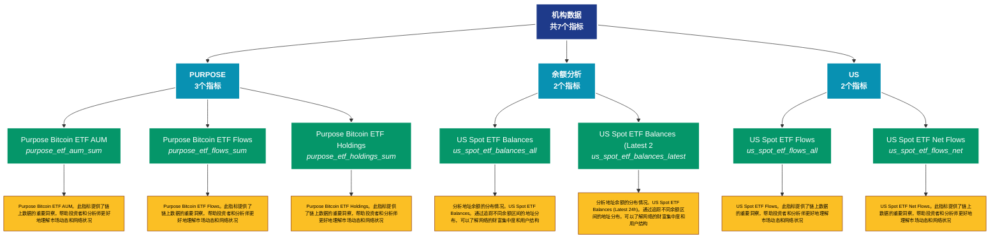

# 机构数据 (institutions)

## 📋 概述

机构投资者相关数据，包括灰度、ETF、上市公司持仓等机构指标。

本类别共包含 **7** 个API端点，分为 **3** 个子类别。

## 🗂️ 指标分类

| 子类别 | 指标数量 | 主要功能 |
|--------|----------|----------|
| PURPOSE | 3 | 提供专门的数据分析 |
| 余额分析 | 2 | 地址余额的详细统计分析 |
| US | 2 | 提供专门的数据分析 |

## 🎨 指标体系结构图



## 📂 详细指标说明

### 📊 PURPOSE（3个指标）

本子类别包含以下详细指标：

#### 1. Purpose Bitcoin ETF AUM

- **指标代码**: `purpose_etf_aum_sum`
- **API路径**: `/v1/metrics/institutions/purpose_etf_aum_sum`
- **英文名称**: Purpose Bitcoin ETF AUM

**📝 详细说明**：
Purpose Bitcoin ETF AUM。此指标提供了链上数据的重要洞察，帮助投资者和分析师更好地理解市场动态和网络状况

**使用示例**：
```python
# 获取Purpose Bitcoin ETF AUM数据
df = client.get_metric(
    "/v1/metrics/institutions/purpose_etf_aum_sum",
    asset="BTC",
    resolution="24h"
)
```

---

#### 2. Purpose Bitcoin ETF Flows

- **指标代码**: `purpose_etf_flows_sum`
- **API路径**: `/v1/metrics/institutions/purpose_etf_flows_sum`
- **英文名称**: Purpose Bitcoin ETF Flows

**📝 详细说明**：
Purpose Bitcoin ETF Flows。此指标提供了链上数据的重要洞察，帮助投资者和分析师更好地理解市场动态和网络状况

**使用示例**：
```python
# 获取Purpose Bitcoin ETF Flows数据
df = client.get_metric(
    "/v1/metrics/institutions/purpose_etf_flows_sum",
    asset="BTC",
    resolution="24h"
)
```

---

#### 3. Purpose Bitcoin ETF Holdings

- **指标代码**: `purpose_etf_holdings_sum`
- **API路径**: `/v1/metrics/institutions/purpose_etf_holdings_sum`
- **英文名称**: Purpose Bitcoin ETF Holdings

**📝 详细说明**：
Purpose Bitcoin ETF Holdings。此指标提供了链上数据的重要洞察，帮助投资者和分析师更好地理解市场动态和网络状况

**使用示例**：
```python
# 获取Purpose Bitcoin ETF Holdings数据
df = client.get_metric(
    "/v1/metrics/institutions/purpose_etf_holdings_sum",
    asset="BTC",
    resolution="24h"
)
```

---

### 📊 余额分析（2个指标）

本子类别包含以下详细指标：

#### 1. US Spot ETF Balances

- **指标代码**: `us_spot_etf_balances_all`
- **API路径**: `/v1/metrics/institutions/us_spot_etf_balances_all`
- **英文名称**: US Spot ETF Balances

**📝 详细说明**：
分析地址余额的分布情况。US Spot ETF Balances。通过追踪不同余额区间的地址分布，可以了解网络的财富集中度和用户结构

**使用示例**：
```python
# 获取US Spot ETF Balances数据
df = client.get_metric(
    "/v1/metrics/institutions/us_spot_etf_balances_all",
    asset="BTC",
    resolution="24h"
)
```

---

#### 2. US Spot ETF Balances (Latest 2

- **指标代码**: `us_spot_etf_balances_latest`
- **API路径**: `/v1/metrics/institutions/us_spot_etf_balances_latest`
- **英文名称**: US Spot ETF Balances (Latest 24h)

**📝 详细说明**：
分析地址余额的分布情况。US Spot ETF Balances (Latest 24h)。通过追踪不同余额区间的地址分布，可以了解网络的财富集中度和用户结构

**使用示例**：
```python
# 获取US Spot ETF Balances (Latest 2数据
df = client.get_metric(
    "/v1/metrics/institutions/us_spot_etf_balances_latest",
    asset="BTC",
    resolution="24h"
)
```

---

### 📊 US（2个指标）

本子类别包含以下详细指标：

#### 1. US Spot ETF Flows

- **指标代码**: `us_spot_etf_flows_all`
- **API路径**: `/v1/metrics/institutions/us_spot_etf_flows_all`
- **英文名称**: US Spot ETF Flows

**📝 详细说明**：
US Spot ETF Flows。此指标提供了链上数据的重要洞察，帮助投资者和分析师更好地理解市场动态和网络状况

**使用示例**：
```python
# 获取US Spot ETF Flows数据
df = client.get_metric(
    "/v1/metrics/institutions/us_spot_etf_flows_all",
    asset="BTC",
    resolution="24h"
)
```

---

#### 2. US Spot ETF Net Flows

- **指标代码**: `us_spot_etf_flows_net`
- **API路径**: `/v1/metrics/institutions/us_spot_etf_flows_net`
- **英文名称**: US Spot ETF Net Flows

**📝 详细说明**：
US Spot ETF Net Flows。此指标提供了链上数据的重要洞察，帮助投资者和分析师更好地理解市场动态和网络状况

**使用示例**：
```python
# 获取US Spot ETF Net Flows数据
df = client.get_metric(
    "/v1/metrics/institutions/us_spot_etf_flows_net",
    asset="BTC",
    resolution="24h"
)
```

---

## 📊 完整指标列表

| # | 指标名称 | 指标代码 | API路径 | 说明 |
|---|----------|----------|---------|------|
| 1 | Purpose Bitcoin ETF AUM | `purpose_etf_aum_sum` | `/v1/metrics/institutions/purpose_etf_aum_sum` | Purpose Bitcoin ETF AUM。此指标提供了链上数据的重要洞察，帮助投资者和分析师更好地理解市场动态和网络状况 |
| 2 | Purpose Bitcoin ETF Flows | `purpose_etf_flows_sum` | `/v1/metrics/institutions/purpose_etf_flows_sum` | Purpose Bitcoin ETF Flows。此指标提供了链上数据的重要洞察，帮助投资者和分析师更好地理解市场动态和网络状况 |
| 3 | Purpose Bitcoin ETF Holdings | `purpose_etf_holdings_sum` | `/v1/metrics/institutions/purpose_etf_holdings_sum` | Purpose Bitcoin ETF Holdings。此指标提供了链上数据的重要洞察，帮助投资者和分析师更好地理解市场动态和网络状况 |
| 4 | US Spot ETF Balances | `us_spot_etf_balances_all` | `/v1/metrics/institutions/us_spot_etf_balances_all` | 分析地址余额的分布情况。US Spot ETF Balances。通过追踪不同余额区间的地址分布，可以了解网络的财富集中度和用户结构 |
| 5 | US Spot ETF Balances (Latest 2 | `us_spot_etf_balances_latest` | `/v1/metrics/institutions/us_spot_etf_balances_latest` | 分析地址余额的分布情况。US Spot ETF Balances (Latest 24h)。通过追踪不同余额区间的地址分布，可以了解网络的财富集中度和用户结构 |
| 6 | US Spot ETF Flows | `us_spot_etf_flows_all` | `/v1/metrics/institutions/us_spot_etf_flows_all` | US Spot ETF Flows。此指标提供了链上数据的重要洞察，帮助投资者和分析师更好地理解市场动态和网络状况 |
| 7 | US Spot ETF Net Flows | `us_spot_etf_flows_net` | `/v1/metrics/institutions/us_spot_etf_flows_net` | US Spot ETF Net Flows。此指标提供了链上数据的重要洞察，帮助投资者和分析师更好地理解市场动态和网络状况 |

## 💻 代码示例

### Python客户端示例

```python
import requests
import pandas as pd
import matplotlib.pyplot as plt

class GlassnodeClient:
    def __init__(self, api_key):
        self.api_key = api_key
        self.base_url = "https://api.glassnode.com"
    
    def get_metric(self, path, asset="BTC", resolution="24h", **kwargs):
        url = f"{self.base_url}{path}"
        params = {
            "a": asset,
            "api_key": self.api_key,
            "s": resolution,
            **kwargs
        }
        
        response = requests.get(url, params=params)
        if response.status_code == 200:
            data = response.json()
            df = pd.DataFrame(data)
            df['datetime'] = pd.to_datetime(df['t'], unit='s')
            df['value'] = df['v']
            return df[['datetime', 'value']]
        else:
            raise Exception(f"API Error: {response.status_code}")

# 使用示例
client = GlassnodeClient("YOUR_API_KEY")

# 获取多个相关指标
metrics = [
    '/v1/metrics/addresses/active_count',
    '/v1/metrics/addresses/new',
    '/v1/metrics/addresses/non_zero_count'
]

data = {}
for metric_path in metrics:
    data[metric_path] = client.get_metric(metric_path)

# 可视化
fig, axes = plt.subplots(3, 1, figsize=(12, 10))
for idx, (path, df) in enumerate(data.items()):
    axes[idx].plot(df['datetime'], df['value'])
    axes[idx].set_title(path.split('/')[-1])
    axes[idx].grid(True, alpha=0.3)

plt.tight_layout()
plt.show()
```

### 批量数据分析

```python
import asyncio
import aiohttp

async def fetch_single(session, url, params, name):
    async with session.get(url, params=params) as response:
        if response.status == 200:
            data = await response.json()
            return name, data
        return name, None

async def fetch_batch_metrics(api_key, metric_configs):
    async with aiohttp.ClientSession() as session:
        tasks = []
        for config in metric_configs:
            url = f"https://api.glassnode.com{config['path']}"
            params = {
                "a": config.get('asset', 'BTC'),
                "api_key": api_key,
                "s": config.get('resolution', '24h')
            }
            tasks.append(fetch_single(session, url, params, config['name']))
        
        return await asyncio.gather(*tasks)

# 配置要获取的指标
metric_configs = [
    {'name': '活跃地址', 'path': '/v1/metrics/addresses/active_count'},
    {'name': '新增地址', 'path': '/v1/metrics/addresses/new'},
    {'name': '非零地址', 'path': '/v1/metrics/addresses/non_zero_count'}
]

# 执行批量获取
api_key = "YOUR_API_KEY"
results = asyncio.run(fetch_batch_metrics(api_key, metric_configs))
```

## ⚙️ API参数说明

| 参数 | 必需 | 类型 | 说明 | 示例 |
|------|------|------|------|------|
| `a` | ✅ | string | 资产符号 | BTC, ETH |
| `api_key` | ✅ | string | API密钥 | your_key |
| `s` | ❌ | string | 时间分辨率 | 10m, 1h, 24h |
| `i` | ❌ | string | 时间间隔 | 24h, 1w |
| `since` | ❌ | integer | 开始时间 | 1614556800 |
| `until` | ❌ | integer | 结束时间 | 1617235200 |
| `c` | ❌ | string | 货币单位 | native, USD |

## 📈 数据特性

- **更新频率**: 10分钟到每日不等
- **历史数据**: 最早可追溯至2009年（BTC）
- **数据格式**: JSON或CSV
- **时区**: UTC

## 🔗 相关资源

- [Glassnode官网](https://glassnode.com)
- [API文档](https://docs.glassnode.com)
- [Glassnode Academy](https://academy.glassnode.com)

---

*文档版本: v5.0*  
*最后更新: 2024年*  
