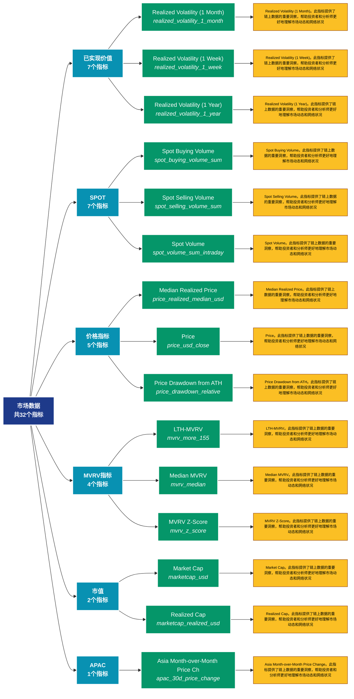

# 市场数据 (market)

## 📋 概述

全面的市场数据分析，涵盖价格、交易量、市值、已实现价值等市场核心指标。

本类别共包含 **32** 个API端点，分为 **12** 个子类别。

## 🗂️ 指标分类

| 子类别 | 指标数量 | 主要功能 |
|--------|----------|----------|
| 已实现价值 | 7 | 提供专门的数据分析 |
| SPOT | 7 | 提供专门的数据分析 |
| 价格指标 | 5 | 提供专门的数据分析 |
| MVRV指标 | 4 | 提供专门的数据分析 |
| 市值 | 2 | 提供专门的数据分析 |
| APAC | 1 | 提供专门的数据分析 |
| BTC | 1 | 提供专门的数据分析 |
| DELTACAP | 1 | 提供专门的数据分析 |
| EMEA | 1 | 提供专门的数据分析 |
| HODL | 1 | 提供专门的数据分析 |
| OTHER | 1 | 提供专门的数据分析 |
| AMER | 1 | 提供专门的数据分析 |

## 🎨 指标体系结构图



## 📂 详细指标说明

### 📊 已实现价值（7个指标）

本子类别包含以下详细指标：

#### 1. Realized Volatility (1 Month)

- **指标代码**: `realized_volatility_1_month`
- **API路径**: `/v1/metrics/market/realized_volatility_1_month`
- **英文名称**: Realized Volatility (1 Month)

**📝 详细说明**：
Realized Volatility (1 Month)。此指标提供了链上数据的重要洞察，帮助投资者和分析师更好地理解市场动态和网络状况

**使用示例**：
```python
# 获取Realized Volatility (1 Month)数据
df = client.get_metric(
    "/v1/metrics/market/realized_volatility_1_month",
    asset="BTC",
    resolution="24h"
)
```

---

#### 2. Realized Volatility (1 Week)

- **指标代码**: `realized_volatility_1_week`
- **API路径**: `/v1/metrics/market/realized_volatility_1_week`
- **英文名称**: Realized Volatility (1 Week)

**📝 详细说明**：
Realized Volatility (1 Week)。此指标提供了链上数据的重要洞察，帮助投资者和分析师更好地理解市场动态和网络状况

**使用示例**：
```python
# 获取Realized Volatility (1 Week)数据
df = client.get_metric(
    "/v1/metrics/market/realized_volatility_1_week",
    asset="BTC",
    resolution="24h"
)
```

---

#### 3. Realized Volatility (1 Year)

- **指标代码**: `realized_volatility_1_year`
- **API路径**: `/v1/metrics/market/realized_volatility_1_year`
- **英文名称**: Realized Volatility (1 Year)

**📝 详细说明**：
Realized Volatility (1 Year)。此指标提供了链上数据的重要洞察，帮助投资者和分析师更好地理解市场动态和网络状况

**使用示例**：
```python
# 获取Realized Volatility (1 Year)数据
df = client.get_metric(
    "/v1/metrics/market/realized_volatility_1_year",
    asset="BTC",
    resolution="24h"
)
```

---

#### 4. Realized Volatility (2 Weeks)

- **指标代码**: `realized_volatility_2_weeks`
- **API路径**: `/v1/metrics/market/realized_volatility_2_weeks`
- **英文名称**: Realized Volatility (2 Weeks)

**📝 详细说明**：
Realized Volatility (2 Weeks)。此指标提供了链上数据的重要洞察，帮助投资者和分析师更好地理解市场动态和网络状况

**使用示例**：
```python
# 获取Realized Volatility (2 Weeks)数据
df = client.get_metric(
    "/v1/metrics/market/realized_volatility_2_weeks",
    asset="BTC",
    resolution="24h"
)
```

---

#### 5. Realized Volatility (3 Months)

- **指标代码**: `realized_volatility_3_months`
- **API路径**: `/v1/metrics/market/realized_volatility_3_months`
- **英文名称**: Realized Volatility (3 Months)

**📝 详细说明**：
Realized Volatility (3 Months)。此指标提供了链上数据的重要洞察，帮助投资者和分析师更好地理解市场动态和网络状况

**使用示例**：
```python
# 获取Realized Volatility (3 Months)数据
df = client.get_metric(
    "/v1/metrics/market/realized_volatility_3_months",
    asset="BTC",
    resolution="24h"
)
```

---

#### 6. Realized Volatility (6 Months)

- **指标代码**: `realized_volatility_6_months`
- **API路径**: `/v1/metrics/market/realized_volatility_6_months`
- **英文名称**: Realized Volatility (6 Months)

**📝 详细说明**：
Realized Volatility (6 Months)。此指标提供了链上数据的重要洞察，帮助投资者和分析师更好地理解市场动态和网络状况

**使用示例**：
```python
# 获取Realized Volatility (6 Months)数据
df = client.get_metric(
    "/v1/metrics/market/realized_volatility_6_months",
    asset="BTC",
    resolution="24h"
)
```

---

#### 7. Realized Volatility (All)

- **指标代码**: `realized_volatility_all`
- **API路径**: `/v1/metrics/market/realized_volatility_all`
- **英文名称**: Realized Volatility (All)

**📝 详细说明**：
Realized Volatility (All)。此指标提供了链上数据的重要洞察，帮助投资者和分析师更好地理解市场动态和网络状况

**使用示例**：
```python
# 获取Realized Volatility (All)数据
df = client.get_metric(
    "/v1/metrics/market/realized_volatility_all",
    asset="BTC",
    resolution="24h"
)
```

---

### 📊 SPOT（7个指标）

本子类别包含以下详细指标：

#### 1. Spot Buying Volume

- **指标代码**: `spot_buying_volume_sum`
- **API路径**: `/v1/metrics/market/spot_buying_volume_sum`
- **英文名称**: Spot Buying Volume

**📝 详细说明**：
Spot Buying Volume。此指标提供了链上数据的重要洞察，帮助投资者和分析师更好地理解市场动态和网络状况

**使用示例**：
```python
# 获取Spot Buying Volume数据
df = client.get_metric(
    "/v1/metrics/market/spot_buying_volume_sum",
    asset="BTC",
    resolution="24h"
)
```

---

#### 2. Spot Selling Volume

- **指标代码**: `spot_selling_volume_sum`
- **API路径**: `/v1/metrics/market/spot_selling_volume_sum`
- **英文名称**: Spot Selling Volume

**📝 详细说明**：
Spot Selling Volume。此指标提供了链上数据的重要洞察，帮助投资者和分析师更好地理解市场动态和网络状况

**使用示例**：
```python
# 获取Spot Selling Volume数据
df = client.get_metric(
    "/v1/metrics/market/spot_selling_volume_sum",
    asset="BTC",
    resolution="24h"
)
```

---

#### 3. Spot Volume

- **指标代码**: `spot_volume_sum_intraday`
- **API路径**: `/v1/metrics/market/spot_volume_sum_intraday`
- **英文名称**: Spot Volume

**📝 详细说明**：
Spot Volume。此指标提供了链上数据的重要洞察，帮助投资者和分析师更好地理解市场动态和网络状况

**使用示例**：
```python
# 获取Spot Volume数据
df = client.get_metric(
    "/v1/metrics/market/spot_volume_sum_intraday",
    asset="BTC",
    resolution="24h"
)
```

---

#### 4. Spot Volume 24h

- **指标代码**: `spot_volume_daily_sum`
- **API路径**: `/v1/metrics/market/spot_volume_daily_sum`
- **英文名称**: Spot Volume 24h

**📝 详细说明**：
Spot Volume 24h。此指标提供了链上数据的重要洞察，帮助投资者和分析师更好地理解市场动态和网络状况

**使用示例**：
```python
# 获取Spot Volume 24h数据
df = client.get_metric(
    "/v1/metrics/market/spot_volume_daily_sum",
    asset="BTC",
    resolution="24h"
)
```

---

#### 5. Spot Volume 24h (Latest)

- **指标代码**: `spot_volume_daily_latest`
- **API路径**: `/v1/metrics/market/spot_volume_daily_latest`
- **英文名称**: Spot Volume 24h (Latest)

**📝 详细说明**：
Spot Volume 24h (Latest)。此指标提供了链上数据的重要洞察，帮助投资者和分析师更好地理解市场动态和网络状况

**使用示例**：
```python
# 获取Spot Volume 24h (Latest)数据
df = client.get_metric(
    "/v1/metrics/market/spot_volume_daily_latest",
    asset="BTC",
    resolution="24h"
)
```

---

#### 6. Spot Volume 24h (Stacked)

- **指标代码**: `spot_volume_daily_sum_all`
- **API路径**: `/v1/metrics/market/spot_volume_daily_sum_all`
- **英文名称**: Spot Volume 24h (Stacked)

**📝 详细说明**：
Spot Volume 24h (Stacked)。此指标提供了链上数据的重要洞察，帮助投资者和分析师更好地理解市场动态和网络状况

**使用示例**：
```python
# 获取Spot Volume 24h (Stacked)数据
df = client.get_metric(
    "/v1/metrics/market/spot_volume_daily_sum_all",
    asset="BTC",
    resolution="24h"
)
```

---

#### 7. Spot Volume Delta

- **指标代码**: `spot_vd_sum`
- **API路径**: `/v1/metrics/market/spot_vd_sum`
- **英文名称**: Spot Volume Delta

**📝 详细说明**：
Spot Volume Delta。此指标提供了链上数据的重要洞察，帮助投资者和分析师更好地理解市场动态和网络状况

**使用示例**：
```python
# 获取Spot Volume Delta数据
df = client.get_metric(
    "/v1/metrics/market/spot_vd_sum",
    asset="BTC",
    resolution="24h"
)
```

---

### 📊 价格指标（5个指标）

本子类别包含以下详细指标：

#### 1. Median Realized Price

- **指标代码**: `price_realized_median_usd`
- **API路径**: `/v1/metrics/market/price_realized_median_usd`
- **英文名称**: Median Realized Price

**📝 详细说明**：
Median Realized Price。此指标提供了链上数据的重要洞察，帮助投资者和分析师更好地理解市场动态和网络状况

**使用示例**：
```python
# 获取Median Realized Price数据
df = client.get_metric(
    "/v1/metrics/market/price_realized_median_usd",
    asset="BTC",
    resolution="24h"
)
```

---

#### 2. Price

- **指标代码**: `price_usd_close`
- **API路径**: `/v1/metrics/market/price_usd_close`
- **英文名称**: Price

**📝 详细说明**：
Price。此指标提供了链上数据的重要洞察，帮助投资者和分析师更好地理解市场动态和网络状况

**使用示例**：
```python
# 获取Price数据
df = client.get_metric(
    "/v1/metrics/market/price_usd_close",
    asset="BTC",
    resolution="24h"
)
```

---

#### 3. Price Drawdown from ATH

- **指标代码**: `price_drawdown_relative`
- **API路径**: `/v1/metrics/market/price_drawdown_relative`
- **英文名称**: Price Drawdown from ATH

**📝 详细说明**：
Price Drawdown from ATH。此指标提供了链上数据的重要洞察，帮助投资者和分析师更好地理解市场动态和网络状况

**使用示例**：
```python
# 获取Price Drawdown from ATH数据
df = client.get_metric(
    "/v1/metrics/market/price_drawdown_relative",
    asset="BTC",
    resolution="24h"
)
```

---

#### 4. Price OHLC

- **指标代码**: `price_usd_ohlc`
- **API路径**: `/v1/metrics/market/price_usd_ohlc`
- **英文名称**: Price OHLC

**📝 详细说明**：
Price OHLC。此指标提供了链上数据的重要洞察，帮助投资者和分析师更好地理解市场动态和网络状况

**使用示例**：
```python
# 获取Price OHLC数据
df = client.get_metric(
    "/v1/metrics/market/price_usd_ohlc",
    asset="BTC",
    resolution="24h"
)
```

---

#### 5. Realized Price

- **指标代码**: `price_realized_usd`
- **API路径**: `/v1/metrics/market/price_realized_usd`
- **英文名称**: Realized Price

**📝 详细说明**：
Realized Price。此指标提供了链上数据的重要洞察，帮助投资者和分析师更好地理解市场动态和网络状况

**使用示例**：
```python
# 获取Realized Price数据
df = client.get_metric(
    "/v1/metrics/market/price_realized_usd",
    asset="BTC",
    resolution="24h"
)
```

---

### 📊 MVRV指标（4个指标）

本子类别包含以下详细指标：

#### 1. LTH-MVRV

- **指标代码**: `mvrv_more_155`
- **API路径**: `/v1/metrics/market/mvrv_more_155`
- **英文名称**: LTH-MVRV

**📝 详细说明**：
LTH-MVRV。此指标提供了链上数据的重要洞察，帮助投资者和分析师更好地理解市场动态和网络状况

**使用示例**：
```python
# 获取LTH-MVRV数据
df = client.get_metric(
    "/v1/metrics/market/mvrv_more_155",
    asset="BTC",
    resolution="24h"
)
```

---

#### 2. Median MVRV

- **指标代码**: `mvrv_median`
- **API路径**: `/v1/metrics/market/mvrv_median`
- **英文名称**: Median MVRV

**📝 详细说明**：
Median MVRV。此指标提供了链上数据的重要洞察，帮助投资者和分析师更好地理解市场动态和网络状况

**使用示例**：
```python
# 获取Median MVRV数据
df = client.get_metric(
    "/v1/metrics/market/mvrv_median",
    asset="BTC",
    resolution="24h"
)
```

---

#### 3. MVRV Z-Score

- **指标代码**: `mvrv_z_score`
- **API路径**: `/v1/metrics/market/mvrv_z_score`
- **英文名称**: MVRV Z-Score

**📝 详细说明**：
MVRV Z-Score。此指标提供了链上数据的重要洞察，帮助投资者和分析师更好地理解市场动态和网络状况

**使用示例**：
```python
# 获取MVRV Z-Score数据
df = client.get_metric(
    "/v1/metrics/market/mvrv_z_score",
    asset="BTC",
    resolution="24h"
)
```

---

#### 4. STH-MVRV

- **指标代码**: `mvrv_less_155`
- **API路径**: `/v1/metrics/market/mvrv_less_155`
- **英文名称**: STH-MVRV

**📝 详细说明**：
STH-MVRV。此指标提供了链上数据的重要洞察，帮助投资者和分析师更好地理解市场动态和网络状况

**使用示例**：
```python
# 获取STH-MVRV数据
df = client.get_metric(
    "/v1/metrics/market/mvrv_less_155",
    asset="BTC",
    resolution="24h"
)
```

---

### 📊 市值（2个指标）

本子类别包含以下详细指标：

#### 1. Market Cap

- **指标代码**: `marketcap_usd`
- **API路径**: `/v1/metrics/market/marketcap_usd`
- **英文名称**: Market Cap

**📝 详细说明**：
Market Cap。此指标提供了链上数据的重要洞察，帮助投资者和分析师更好地理解市场动态和网络状况

**使用示例**：
```python
# 获取Market Cap数据
df = client.get_metric(
    "/v1/metrics/market/marketcap_usd",
    asset="BTC",
    resolution="24h"
)
```

---

#### 2. Realized Cap

- **指标代码**: `marketcap_realized_usd`
- **API路径**: `/v1/metrics/market/marketcap_realized_usd`
- **英文名称**: Realized Cap

**📝 详细说明**：
Realized Cap。此指标提供了链上数据的重要洞察，帮助投资者和分析师更好地理解市场动态和网络状况

**使用示例**：
```python
# 获取Realized Cap数据
df = client.get_metric(
    "/v1/metrics/market/marketcap_realized_usd",
    asset="BTC",
    resolution="24h"
)
```

---

### 📊 APAC（1个指标）

本子类别包含以下详细指标：

#### 1. Asia Month-over-Month Price Ch

- **指标代码**: `apac_30d_price_change`
- **API路径**: `/v1/metrics/market/apac_30d_price_change`
- **英文名称**: Asia Month-over-Month Price Change

**📝 详细说明**：
Asia Month-over-Month Price Change。此指标提供了链上数据的重要洞察，帮助投资者和分析师更好地理解市场动态和网络状况

**使用示例**：
```python
# 获取Asia Month-over-Month Price Ch数据
df = client.get_metric(
    "/v1/metrics/market/apac_30d_price_change",
    asset="BTC",
    resolution="24h"
)
```

---

### 📊 BTC（1个指标）

本子类别包含以下详细指标：

#### 1. BTC Dominance

- **指标代码**: `btc_dominance`
- **API路径**: `/v1/metrics/market/btc_dominance`
- **英文名称**: BTC Dominance

**📝 详细说明**：
BTC Dominance。此指标提供了链上数据的重要洞察，帮助投资者和分析师更好地理解市场动态和网络状况

**使用示例**：
```python
# 获取BTC Dominance数据
df = client.get_metric(
    "/v1/metrics/market/btc_dominance",
    asset="BTC",
    resolution="24h"
)
```

---

### 📊 DELTACAP（1个指标）

本子类别包含以下详细指标：

#### 1. Delta Cap

- **指标代码**: `deltacap_usd`
- **API路径**: `/v1/metrics/market/deltacap_usd`
- **英文名称**: Delta Cap

**📝 详细说明**：
Delta Cap。此指标提供了链上数据的重要洞察，帮助投资者和分析师更好地理解市场动态和网络状况

**使用示例**：
```python
# 获取Delta Cap数据
df = client.get_metric(
    "/v1/metrics/market/deltacap_usd",
    asset="BTC",
    resolution="24h"
)
```

---

### 📊 EMEA（1个指标）

本子类别包含以下详细指标：

#### 1. EU Month-over-Month Price Chan

- **指标代码**: `emea_30d_price_change`
- **API路径**: `/v1/metrics/market/emea_30d_price_change`
- **英文名称**: EU Month-over-Month Price Change

**📝 详细说明**：
EU Month-over-Month Price Change。此指标提供了链上数据的重要洞察，帮助投资者和分析师更好地理解市场动态和网络状况

**使用示例**：
```python
# 获取EU Month-over-Month Price Chan数据
df = client.get_metric(
    "/v1/metrics/market/emea_30d_price_change",
    asset="BTC",
    resolution="24h"
)
```

---

### 📊 HODL（1个指标）

本子类别包含以下详细指标：

#### 1. HODL Cave

- **指标代码**: `hodl_cave`
- **API路径**: `/v1/metrics/market/hodl_cave`
- **英文名称**: HODL Cave

**📝 详细说明**：
HODL Cave。此指标提供了链上数据的重要洞察，帮助投资者和分析师更好地理解市场动态和网络状况

**使用示例**：
```python
# 获取HODL Cave数据
df = client.get_metric(
    "/v1/metrics/market/hodl_cave",
    asset="BTC",
    resolution="24h"
)
```

---

### 📊 OTHER（1个指标）

本子类别包含以下详细指标：

#### 1. MVRV Ratio

- **指标代码**: `mvrv`
- **API路径**: `/v1/metrics/market/mvrv`
- **英文名称**: MVRV Ratio

**📝 详细说明**：
MVRV Ratio。此指标提供了链上数据的重要洞察，帮助投资者和分析师更好地理解市场动态和网络状况

**使用示例**：
```python
# 获取MVRV Ratio数据
df = client.get_metric(
    "/v1/metrics/market/mvrv",
    asset="BTC",
    resolution="24h"
)
```

---

### 📊 AMER（1个指标）

本子类别包含以下详细指标：

#### 1. US Month-over-Month Price Chan

- **指标代码**: `amer_30d_price_change`
- **API路径**: `/v1/metrics/market/amer_30d_price_change`
- **英文名称**: US Month-over-Month Price Change

**📝 详细说明**：
US Month-over-Month Price Change。此指标提供了链上数据的重要洞察，帮助投资者和分析师更好地理解市场动态和网络状况

**使用示例**：
```python
# 获取US Month-over-Month Price Chan数据
df = client.get_metric(
    "/v1/metrics/market/amer_30d_price_change",
    asset="BTC",
    resolution="24h"
)
```

---

## 📊 完整指标列表

| # | 指标名称 | 指标代码 | API路径 | 说明 |
|---|----------|----------|---------|------|
| 1 | Asia Month-over-Month Price Ch | `apac_30d_price_change` | `/v1/metrics/market/apac_30d_price_change` | Asia Month-over-Month Price Change。此指标提供了链上数据的重要洞察，帮助投资者和分析师更好地理解市场动态和网络状况 |
| 2 | BTC Dominance | `btc_dominance` | `/v1/metrics/market/btc_dominance` | BTC Dominance。此指标提供了链上数据的重要洞察，帮助投资者和分析师更好地理解市场动态和网络状况 |
| 3 | Delta Cap | `deltacap_usd` | `/v1/metrics/market/deltacap_usd` | Delta Cap。此指标提供了链上数据的重要洞察，帮助投资者和分析师更好地理解市场动态和网络状况 |
| 4 | EU Month-over-Month Price Chan | `emea_30d_price_change` | `/v1/metrics/market/emea_30d_price_change` | EU Month-over-Month Price Change。此指标提供了链上数据的重要洞察，帮助投资者和分析师更好地理解市场动态和网络状况 |
| 5 | HODL Cave | `hodl_cave` | `/v1/metrics/market/hodl_cave` | HODL Cave。此指标提供了链上数据的重要洞察，帮助投资者和分析师更好地理解市场动态和网络状况 |
| 6 | LTH-MVRV | `mvrv_more_155` | `/v1/metrics/market/mvrv_more_155` | LTH-MVRV。此指标提供了链上数据的重要洞察，帮助投资者和分析师更好地理解市场动态和网络状况 |
| 7 | Market Cap | `marketcap_usd` | `/v1/metrics/market/marketcap_usd` | Market Cap。此指标提供了链上数据的重要洞察，帮助投资者和分析师更好地理解市场动态和网络状况 |
| 8 | Median MVRV | `mvrv_median` | `/v1/metrics/market/mvrv_median` | Median MVRV。此指标提供了链上数据的重要洞察，帮助投资者和分析师更好地理解市场动态和网络状况 |
| 9 | Median Realized Price | `price_realized_median_usd` | `/v1/metrics/market/price_realized_median_usd` | Median Realized Price。此指标提供了链上数据的重要洞察，帮助投资者和分析师更好地理解市场动态和网络状况 |
| 10 | MVRV Ratio | `mvrv` | `/v1/metrics/market/mvrv` | MVRV Ratio。此指标提供了链上数据的重要洞察，帮助投资者和分析师更好地理解市场动态和网络状况 |
| 11 | MVRV Z-Score | `mvrv_z_score` | `/v1/metrics/market/mvrv_z_score` | MVRV Z-Score。此指标提供了链上数据的重要洞察，帮助投资者和分析师更好地理解市场动态和网络状况 |
| 12 | Price | `price_usd_close` | `/v1/metrics/market/price_usd_close` | Price。此指标提供了链上数据的重要洞察，帮助投资者和分析师更好地理解市场动态和网络状况 |
| 13 | Price Drawdown from ATH | `price_drawdown_relative` | `/v1/metrics/market/price_drawdown_relative` | Price Drawdown from ATH。此指标提供了链上数据的重要洞察，帮助投资者和分析师更好地理解市场动态和网络状况 |
| 14 | Price OHLC | `price_usd_ohlc` | `/v1/metrics/market/price_usd_ohlc` | Price OHLC。此指标提供了链上数据的重要洞察，帮助投资者和分析师更好地理解市场动态和网络状况 |
| 15 | Realized Cap | `marketcap_realized_usd` | `/v1/metrics/market/marketcap_realized_usd` | Realized Cap。此指标提供了链上数据的重要洞察，帮助投资者和分析师更好地理解市场动态和网络状况 |
| 16 | Realized Price | `price_realized_usd` | `/v1/metrics/market/price_realized_usd` | Realized Price。此指标提供了链上数据的重要洞察，帮助投资者和分析师更好地理解市场动态和网络状况 |
| 17 | Realized Volatility (1 Month) | `realized_volatility_1_month` | `/v1/metrics/market/realized_volatility_1_month` | Realized Volatility (1 Month)。此指标提供了链上数据的重要洞察，帮助投资者和分析师更好地理解市场动态和网络状况 |
| 18 | Realized Volatility (1 Week) | `realized_volatility_1_week` | `/v1/metrics/market/realized_volatility_1_week` | Realized Volatility (1 Week)。此指标提供了链上数据的重要洞察，帮助投资者和分析师更好地理解市场动态和网络状况 |
| 19 | Realized Volatility (1 Year) | `realized_volatility_1_year` | `/v1/metrics/market/realized_volatility_1_year` | Realized Volatility (1 Year)。此指标提供了链上数据的重要洞察，帮助投资者和分析师更好地理解市场动态和网络状况 |
| 20 | Realized Volatility (2 Weeks) | `realized_volatility_2_weeks` | `/v1/metrics/market/realized_volatility_2_weeks` | Realized Volatility (2 Weeks)。此指标提供了链上数据的重要洞察，帮助投资者和分析师更好地理解市场动态和网络状况 |
| 21 | Realized Volatility (3 Months) | `realized_volatility_3_months` | `/v1/metrics/market/realized_volatility_3_months` | Realized Volatility (3 Months)。此指标提供了链上数据的重要洞察，帮助投资者和分析师更好地理解市场动态和网络状况 |
| 22 | Realized Volatility (6 Months) | `realized_volatility_6_months` | `/v1/metrics/market/realized_volatility_6_months` | Realized Volatility (6 Months)。此指标提供了链上数据的重要洞察，帮助投资者和分析师更好地理解市场动态和网络状况 |
| 23 | Realized Volatility (All) | `realized_volatility_all` | `/v1/metrics/market/realized_volatility_all` | Realized Volatility (All)。此指标提供了链上数据的重要洞察，帮助投资者和分析师更好地理解市场动态和网络状况 |
| 24 | Spot Buying Volume | `spot_buying_volume_sum` | `/v1/metrics/market/spot_buying_volume_sum` | Spot Buying Volume。此指标提供了链上数据的重要洞察，帮助投资者和分析师更好地理解市场动态和网络状况 |
| 25 | Spot Selling Volume | `spot_selling_volume_sum` | `/v1/metrics/market/spot_selling_volume_sum` | Spot Selling Volume。此指标提供了链上数据的重要洞察，帮助投资者和分析师更好地理解市场动态和网络状况 |
| 26 | Spot Volume | `spot_volume_sum_intraday` | `/v1/metrics/market/spot_volume_sum_intraday` | Spot Volume。此指标提供了链上数据的重要洞察，帮助投资者和分析师更好地理解市场动态和网络状况 |
| 27 | Spot Volume 24h | `spot_volume_daily_sum` | `/v1/metrics/market/spot_volume_daily_sum` | Spot Volume 24h。此指标提供了链上数据的重要洞察，帮助投资者和分析师更好地理解市场动态和网络状况 |
| 28 | Spot Volume 24h (Latest) | `spot_volume_daily_latest` | `/v1/metrics/market/spot_volume_daily_latest` | Spot Volume 24h (Latest)。此指标提供了链上数据的重要洞察，帮助投资者和分析师更好地理解市场动态和网络状况 |
| 29 | Spot Volume 24h (Stacked) | `spot_volume_daily_sum_all` | `/v1/metrics/market/spot_volume_daily_sum_all` | Spot Volume 24h (Stacked)。此指标提供了链上数据的重要洞察，帮助投资者和分析师更好地理解市场动态和网络状况 |
| 30 | Spot Volume Delta | `spot_vd_sum` | `/v1/metrics/market/spot_vd_sum` | Spot Volume Delta。此指标提供了链上数据的重要洞察，帮助投资者和分析师更好地理解市场动态和网络状况 |
| 31 | STH-MVRV | `mvrv_less_155` | `/v1/metrics/market/mvrv_less_155` | STH-MVRV。此指标提供了链上数据的重要洞察，帮助投资者和分析师更好地理解市场动态和网络状况 |
| 32 | US Month-over-Month Price Chan | `amer_30d_price_change` | `/v1/metrics/market/amer_30d_price_change` | US Month-over-Month Price Change。此指标提供了链上数据的重要洞察，帮助投资者和分析师更好地理解市场动态和网络状况 |

## 💻 代码示例

### Python客户端示例

```python
import requests
import pandas as pd
import matplotlib.pyplot as plt

class GlassnodeClient:
    def __init__(self, api_key):
        self.api_key = api_key
        self.base_url = "https://api.glassnode.com"
    
    def get_metric(self, path, asset="BTC", resolution="24h", **kwargs):
        url = f"{self.base_url}{path}"
        params = {
            "a": asset,
            "api_key": self.api_key,
            "s": resolution,
            **kwargs
        }
        
        response = requests.get(url, params=params)
        if response.status_code == 200:
            data = response.json()
            df = pd.DataFrame(data)
            df['datetime'] = pd.to_datetime(df['t'], unit='s')
            df['value'] = df['v']
            return df[['datetime', 'value']]
        else:
            raise Exception(f"API Error: {response.status_code}")

# 使用示例
client = GlassnodeClient("YOUR_API_KEY")

# 获取多个相关指标
metrics = [
    '/v1/metrics/addresses/active_count',
    '/v1/metrics/addresses/new',
    '/v1/metrics/addresses/non_zero_count'
]

data = {}
for metric_path in metrics:
    data[metric_path] = client.get_metric(metric_path)

# 可视化
fig, axes = plt.subplots(3, 1, figsize=(12, 10))
for idx, (path, df) in enumerate(data.items()):
    axes[idx].plot(df['datetime'], df['value'])
    axes[idx].set_title(path.split('/')[-1])
    axes[idx].grid(True, alpha=0.3)

plt.tight_layout()
plt.show()
```

### 批量数据分析

```python
import asyncio
import aiohttp

async def fetch_single(session, url, params, name):
    async with session.get(url, params=params) as response:
        if response.status == 200:
            data = await response.json()
            return name, data
        return name, None

async def fetch_batch_metrics(api_key, metric_configs):
    async with aiohttp.ClientSession() as session:
        tasks = []
        for config in metric_configs:
            url = f"https://api.glassnode.com{config['path']}"
            params = {
                "a": config.get('asset', 'BTC'),
                "api_key": api_key,
                "s": config.get('resolution', '24h')
            }
            tasks.append(fetch_single(session, url, params, config['name']))
        
        return await asyncio.gather(*tasks)

# 配置要获取的指标
metric_configs = [
    {'name': '活跃地址', 'path': '/v1/metrics/addresses/active_count'},
    {'name': '新增地址', 'path': '/v1/metrics/addresses/new'},
    {'name': '非零地址', 'path': '/v1/metrics/addresses/non_zero_count'}
]

# 执行批量获取
api_key = "YOUR_API_KEY"
results = asyncio.run(fetch_batch_metrics(api_key, metric_configs))
```

## ⚙️ API参数说明

| 参数 | 必需 | 类型 | 说明 | 示例 |
|------|------|------|------|------|
| `a` | ✅ | string | 资产符号 | BTC, ETH |
| `api_key` | ✅ | string | API密钥 | your_key |
| `s` | ❌ | string | 时间分辨率 | 10m, 1h, 24h |
| `i` | ❌ | string | 时间间隔 | 24h, 1w |
| `since` | ❌ | integer | 开始时间 | 1614556800 |
| `until` | ❌ | integer | 结束时间 | 1617235200 |
| `c` | ❌ | string | 货币单位 | native, USD |

## 📈 数据特性

- **更新频率**: 10分钟到每日不等
- **历史数据**: 最早可追溯至2009年（BTC）
- **数据格式**: JSON或CSV
- **时区**: UTC

## 🔗 相关资源

- [Glassnode官网](https://glassnode.com)
- [API文档](https://docs.glassnode.com)
- [Glassnode Academy](https://academy.glassnode.com)

---

*文档版本: v5.0*  
*最后更新: 2024年*  
