# 内存池 (mempool)

## 📋 概述

内存池状态监控，包括待确认交易、拥堵程度等内存池指标。

本类别共包含 **10** 个API端点，分为 **3** 个子类别。

## 🗂️ 指标分类

| 子类别 | 指标数量 | 主要功能 |
|--------|----------|----------|
| FEES | 4 | 提供专门的数据分析 |
| TXS | 4 | 提供专门的数据分析 |
| 数量统计 | 2 | 各类地址数量统计 |

## 🎨 指标体系结构图

```mermaid
graph TD
    A["内存池<br/>共10个指标"]
    A:::mainNode
    
    A --> B1["FEES<br/>4个指标"]
    B1:::categoryNode
    B1 --> C1_1["Mempool Average Relative Fee<br/><i>fees_average_relative</i>"]
    C1_1:::metricNode
    C1_1 --> D1_1["Mempool Average Relative Fee。此指标提供了链上数据的重要洞察，帮助投资者和分析师更好地理解市场动态和网络状况"]
    D1_1:::descNode
    B1 --> C1_2["Mempool Median Relative Fee<br/><i>fees_median_relative</i>"]
    C1_2:::metricNode
    C1_2 --> D1_2["Mempool Median Relative Fee。此指标提供了链上数据的重要洞察，帮助投资者和分析师更好地理解市场动态和网络状况"]
    D1_2:::descNode
    B1 --> C1_3["Mempool Total Amount of Fees<br/><i>fees_sum</i>"]
    C1_3:::metricNode
    C1_3 --> D1_3["Mempool Total Amount of Fees。此指标提供了链上数据的重要洞察，帮助投资者和分析师更好地理解市场动态和网络状况"]
    D1_3:::descNode
    A --> B2["TXS<br/>4个指标"]
    B2:::categoryNode
    B2 --> C2_1["Mempool Total Amount of Coins<br/><i>txs_value_sum</i>"]
    C2_1:::metricNode
    C2_1 --> D2_1["Mempool Total Amount of Coins。此指标提供了链上数据的重要洞察，帮助投资者和分析师更好地理解市场动态和网络状况"]
    D2_1:::descNode
    B2 --> C2_2["Mempool Total Amount of Coins <br/><i>txs_value_distribution</i>"]
    C2_2:::metricNode
    C2_2 --> D2_2["Mempool Total Amount of Coins by Relative Fee。此指标提供了链上数据的重要洞察，帮助投资者和分析师更好地理解市场动态"]
    D2_2:::descNode
    B2 --> C2_3["Mempool Transactions Size<br/><i>txs_size_sum</i>"]
    C2_3:::metricNode
    C2_3 --> D2_3["Mempool Transactions Size。此指标提供了链上数据的重要洞察，帮助投资者和分析师更好地理解市场动态和网络状况"]
    D2_3:::descNode
    A --> B3["数量统计<br/>2个指标"]
    B3:::categoryNode
    B3 --> C3_1["Mempool Transaction Count<br/><i>txs_count_sum</i>"]
    C3_1:::metricNode
    C3_1 --> D3_1["Mempool Transaction Count。此指标提供了链上数据的重要洞察，帮助投资者和分析师更好地理解市场动态和网络状况"]
    D3_1:::descNode
    B3 --> C3_2["Mempool Transaction Count by R<br/><i>txs_count_distribution</i>"]
    C3_2:::metricNode
    C3_2 --> D3_2["Mempool Transaction Count by Relative Fee。此指标提供了链上数据的重要洞察，帮助投资者和分析师更好地理解市场动态和网络状"]
    D3_2:::descNode
    
    %% 高对比度样式
    classDef mainNode fill:#1e3a8a,stroke:#ffffff,stroke-width:3px,color:#ffffff,font-weight:bold
    classDef categoryNode fill:#0891b2,stroke:#ffffff,stroke-width:2px,color:#ffffff,font-weight:bold
    classDef metricNode fill:#059669,stroke:#ffffff,stroke-width:2px,color:#ffffff
    classDef descNode fill:#fbbf24,stroke:#92400e,stroke-width:1px,color:#000000,font-size:10px
```



## 📂 详细指标说明

### 📊 FEES（4个指标）

本子类别包含以下详细指标：

#### 1. Mempool Average Relative Fee

- **指标代码**: `fees_average_relative`
- **API路径**: `/v1/metrics/mempool/fees_average_relative`
- **英文名称**: Mempool Average Relative Fee

**📝 详细说明**：
Mempool Average Relative Fee。此指标提供了链上数据的重要洞察，帮助投资者和分析师更好地理解市场动态和网络状况

**使用示例**：
```python
# 获取Mempool Average Relative Fee数据
df = client.get_metric(
    "/v1/metrics/mempool/fees_average_relative",
    asset="BTC",
    resolution="24h"
)
```

---

#### 2. Mempool Median Relative Fee

- **指标代码**: `fees_median_relative`
- **API路径**: `/v1/metrics/mempool/fees_median_relative`
- **英文名称**: Mempool Median Relative Fee

**📝 详细说明**：
Mempool Median Relative Fee。此指标提供了链上数据的重要洞察，帮助投资者和分析师更好地理解市场动态和网络状况

**使用示例**：
```python
# 获取Mempool Median Relative Fee数据
df = client.get_metric(
    "/v1/metrics/mempool/fees_median_relative",
    asset="BTC",
    resolution="24h"
)
```

---

#### 3. Mempool Total Amount of Fees

- **指标代码**: `fees_sum`
- **API路径**: `/v1/metrics/mempool/fees_sum`
- **英文名称**: Mempool Total Amount of Fees

**📝 详细说明**：
Mempool Total Amount of Fees。此指标提供了链上数据的重要洞察，帮助投资者和分析师更好地理解市场动态和网络状况

**使用示例**：
```python
# 获取Mempool Total Amount of Fees数据
df = client.get_metric(
    "/v1/metrics/mempool/fees_sum",
    asset="BTC",
    resolution="24h"
)
```

---

#### 4. Mempool Total Amount of Fees b

- **指标代码**: `fees_distribution`
- **API路径**: `/v1/metrics/mempool/fees_distribution`
- **英文名称**: Mempool Total Amount of Fees by Relative Fee

**📝 详细说明**：
Mempool Total Amount of Fees by Relative Fee。此指标提供了链上数据的重要洞察，帮助投资者和分析师更好地理解市场动态和网络状况

**使用示例**：
```python
# 获取Mempool Total Amount of Fees b数据
df = client.get_metric(
    "/v1/metrics/mempool/fees_distribution",
    asset="BTC",
    resolution="24h"
)
```

---

### 📊 TXS（4个指标）

本子类别包含以下详细指标：

#### 1. Mempool Total Amount of Coins

- **指标代码**: `txs_value_sum`
- **API路径**: `/v1/metrics/mempool/txs_value_sum`
- **英文名称**: Mempool Total Amount of Coins

**📝 详细说明**：
Mempool Total Amount of Coins。此指标提供了链上数据的重要洞察，帮助投资者和分析师更好地理解市场动态和网络状况

**使用示例**：
```python
# 获取Mempool Total Amount of Coins数据
df = client.get_metric(
    "/v1/metrics/mempool/txs_value_sum",
    asset="BTC",
    resolution="24h"
)
```

---

#### 2. Mempool Total Amount of Coins 

- **指标代码**: `txs_value_distribution`
- **API路径**: `/v1/metrics/mempool/txs_value_distribution`
- **英文名称**: Mempool Total Amount of Coins by Relative Fee

**📝 详细说明**：
Mempool Total Amount of Coins by Relative Fee。此指标提供了链上数据的重要洞察，帮助投资者和分析师更好地理解市场动态和网络状况

**使用示例**：
```python
# 获取Mempool Total Amount of Coins 数据
df = client.get_metric(
    "/v1/metrics/mempool/txs_value_distribution",
    asset="BTC",
    resolution="24h"
)
```

---

#### 3. Mempool Transactions Size

- **指标代码**: `txs_size_sum`
- **API路径**: `/v1/metrics/mempool/txs_size_sum`
- **英文名称**: Mempool Transactions Size

**📝 详细说明**：
Mempool Transactions Size。此指标提供了链上数据的重要洞察，帮助投资者和分析师更好地理解市场动态和网络状况

**使用示例**：
```python
# 获取Mempool Transactions Size数据
df = client.get_metric(
    "/v1/metrics/mempool/txs_size_sum",
    asset="BTC",
    resolution="24h"
)
```

---

#### 4. Mempool Transactions Size by R

- **指标代码**: `txs_size_distribution`
- **API路径**: `/v1/metrics/mempool/txs_size_distribution`
- **英文名称**: Mempool Transactions Size by Relative Fee

**📝 详细说明**：
Mempool Transactions Size by Relative Fee。此指标提供了链上数据的重要洞察，帮助投资者和分析师更好地理解市场动态和网络状况

**使用示例**：
```python
# 获取Mempool Transactions Size by R数据
df = client.get_metric(
    "/v1/metrics/mempool/txs_size_distribution",
    asset="BTC",
    resolution="24h"
)
```

---

### 📊 数量统计（2个指标）

本子类别包含以下详细指标：

#### 1. Mempool Transaction Count

- **指标代码**: `txs_count_sum`
- **API路径**: `/v1/metrics/mempool/txs_count_sum`
- **英文名称**: Mempool Transaction Count

**📝 详细说明**：
Mempool Transaction Count。此指标提供了链上数据的重要洞察，帮助投资者和分析师更好地理解市场动态和网络状况

**使用示例**：
```python
# 获取Mempool Transaction Count数据
df = client.get_metric(
    "/v1/metrics/mempool/txs_count_sum",
    asset="BTC",
    resolution="24h"
)
```

---

#### 2. Mempool Transaction Count by R

- **指标代码**: `txs_count_distribution`
- **API路径**: `/v1/metrics/mempool/txs_count_distribution`
- **英文名称**: Mempool Transaction Count by Relative Fee

**📝 详细说明**：
Mempool Transaction Count by Relative Fee。此指标提供了链上数据的重要洞察，帮助投资者和分析师更好地理解市场动态和网络状况

**使用示例**：
```python
# 获取Mempool Transaction Count by R数据
df = client.get_metric(
    "/v1/metrics/mempool/txs_count_distribution",
    asset="BTC",
    resolution="24h"
)
```

---

## 📊 完整指标列表

| # | 指标名称 | 指标代码 | API路径 | 说明 |
|---|----------|----------|---------|------|
| 1 | Mempool Average Relative Fee | `fees_average_relative` | `/v1/metrics/mempool/fees_average_relative` | Mempool Average Relative Fee。此指标提供了链上数据的重要洞察，帮助投资者和分析师更好地理解市场动态和网络状况 |
| 2 | Mempool Median Relative Fee | `fees_median_relative` | `/v1/metrics/mempool/fees_median_relative` | Mempool Median Relative Fee。此指标提供了链上数据的重要洞察，帮助投资者和分析师更好地理解市场动态和网络状况 |
| 3 | Mempool Total Amount of Coins | `txs_value_sum` | `/v1/metrics/mempool/txs_value_sum` | Mempool Total Amount of Coins。此指标提供了链上数据的重要洞察，帮助投资者和分析师更好地理解市场动态和网络状况 |
| 4 | Mempool Total Amount of Coins  | `txs_value_distribution` | `/v1/metrics/mempool/txs_value_distribution` | Mempool Total Amount of Coins by Relative Fee。此指标提供了链上数据的重要洞察，帮助投资者和分析师更好地理解市场动态和网络状况 |
| 5 | Mempool Total Amount of Fees | `fees_sum` | `/v1/metrics/mempool/fees_sum` | Mempool Total Amount of Fees。此指标提供了链上数据的重要洞察，帮助投资者和分析师更好地理解市场动态和网络状况 |
| 6 | Mempool Total Amount of Fees b | `fees_distribution` | `/v1/metrics/mempool/fees_distribution` | Mempool Total Amount of Fees by Relative Fee。此指标提供了链上数据的重要洞察，帮助投资者和分析师更好地理解市场动态和网络状况 |
| 7 | Mempool Transaction Count | `txs_count_sum` | `/v1/metrics/mempool/txs_count_sum` | Mempool Transaction Count。此指标提供了链上数据的重要洞察，帮助投资者和分析师更好地理解市场动态和网络状况 |
| 8 | Mempool Transaction Count by R | `txs_count_distribution` | `/v1/metrics/mempool/txs_count_distribution` | Mempool Transaction Count by Relative Fee。此指标提供了链上数据的重要洞察，帮助投资者和分析师更好地理解市场动态和网络状况 |
| 9 | Mempool Transactions Size | `txs_size_sum` | `/v1/metrics/mempool/txs_size_sum` | Mempool Transactions Size。此指标提供了链上数据的重要洞察，帮助投资者和分析师更好地理解市场动态和网络状况 |
| 10 | Mempool Transactions Size by R | `txs_size_distribution` | `/v1/metrics/mempool/txs_size_distribution` | Mempool Transactions Size by Relative Fee。此指标提供了链上数据的重要洞察，帮助投资者和分析师更好地理解市场动态和网络状况 |

## 💻 代码示例

### Python客户端示例

```python
import requests
import pandas as pd
import matplotlib.pyplot as plt

class GlassnodeClient:
    def __init__(self, api_key):
        self.api_key = api_key
        self.base_url = "https://api.glassnode.com"
    
    def get_metric(self, path, asset="BTC", resolution="24h", **kwargs):
        url = f"{self.base_url}{path}"
        params = {
            "a": asset,
            "api_key": self.api_key,
            "s": resolution,
            **kwargs
        }
        
        response = requests.get(url, params=params)
        if response.status_code == 200:
            data = response.json()
            df = pd.DataFrame(data)
            df['datetime'] = pd.to_datetime(df['t'], unit='s')
            df['value'] = df['v']
            return df[['datetime', 'value']]
        else:
            raise Exception(f"API Error: {response.status_code}")

# 使用示例
client = GlassnodeClient("YOUR_API_KEY")

# 获取多个相关指标
metrics = [
    '/v1/metrics/addresses/active_count',
    '/v1/metrics/addresses/new',
    '/v1/metrics/addresses/non_zero_count'
]

data = {}
for metric_path in metrics:
    data[metric_path] = client.get_metric(metric_path)

# 可视化
fig, axes = plt.subplots(3, 1, figsize=(12, 10))
for idx, (path, df) in enumerate(data.items()):
    axes[idx].plot(df['datetime'], df['value'])
    axes[idx].set_title(path.split('/')[-1])
    axes[idx].grid(True, alpha=0.3)

plt.tight_layout()
plt.show()
```

### 批量数据分析

```python
import asyncio
import aiohttp

async def fetch_single(session, url, params, name):
    async with session.get(url, params=params) as response:
        if response.status == 200:
            data = await response.json()
            return name, data
        return name, None

async def fetch_batch_metrics(api_key, metric_configs):
    async with aiohttp.ClientSession() as session:
        tasks = []
        for config in metric_configs:
            url = f"https://api.glassnode.com{config['path']}"
            params = {
                "a": config.get('asset', 'BTC'),
                "api_key": api_key,
                "s": config.get('resolution', '24h')
            }
            tasks.append(fetch_single(session, url, params, config['name']))
        
        return await asyncio.gather(*tasks)

# 配置要获取的指标
metric_configs = [
    {'name': '活跃地址', 'path': '/v1/metrics/addresses/active_count'},
    {'name': '新增地址', 'path': '/v1/metrics/addresses/new'},
    {'name': '非零地址', 'path': '/v1/metrics/addresses/non_zero_count'}
]

# 执行批量获取
api_key = "YOUR_API_KEY"
results = asyncio.run(fetch_batch_metrics(api_key, metric_configs))
```

## ⚙️ API参数说明

| 参数 | 必需 | 类型 | 说明 | 示例 |
|------|------|------|------|------|
| `a` | ✅ | string | 资产符号 | BTC, ETH |
| `api_key` | ✅ | string | API密钥 | your_key |
| `s` | ❌ | string | 时间分辨率 | 10m, 1h, 24h |
| `i` | ❌ | string | 时间间隔 | 24h, 1w |
| `since` | ❌ | integer | 开始时间 | 1614556800 |
| `until` | ❌ | integer | 结束时间 | 1617235200 |
| `c` | ❌ | string | 货币单位 | native, USD |

## 📈 数据特性

- **更新频率**: 10分钟到每日不等
- **历史数据**: 最早可追溯至2009年（BTC）
- **数据格式**: JSON或CSV
- **时区**: UTC

## 🔗 相关资源

- [Glassnode官网](https://glassnode.com)
- [API文档](https://docs.glassnode.com)
- [Glassnode Academy](https://academy.glassnode.com)

---

*文档版本: v5.0*  
*最后更新: 2024年*  
