# 协议数据 (protocols)

## 📋 概述

各类协议的专属数据，包括特定协议的使用量、锁定量等。

本类别共包含 **58** 个API端点，分为 **8** 个子类别。

## 🗂️ 指标分类

| 子类别 | 指标数量 | 主要功能 |
|--------|----------|----------|
| AAVE | 26 | 提供专门的数据分析 |
| UNISWAP | 9 | 提供专门的数据分析 |
| 数量统计 | 8 | 各类地址数量统计 |
| COMPOUND | 5 | 提供专门的数据分析 |
| LIDO | 4 | 提供专门的数据分析 |
| MAKER | 4 | 提供专门的数据分析 |
| 新增地址 | 1 | 新增地址的增长趋势 |
| 余额分析 | 1 | 地址余额的详细统计分析 |

## 🎨 指标体系结构图

```mermaid
graph LR
    A["协议数据<br/>共58个指标"]
    A:::mainNode
    
    A --> B1["AAVE<br/>26个指标"]
    B1:::categoryNode
    B1 --> C1_1["Aave V1: Available Liquidity V<br/><i>aave_v1_available_liquidity_sum_by_token</i>"]
    C1_1:::metricNode
    C1_1 --> D1_1["Aave V1: Available Liquidity Volume by Token。此指标提供了链上数据的重要洞察，帮助投资者和分析师更好地理解市场动态和"]
    D1_1:::descNode
    B1 --> C1_2["Aave V1: Available Liquidity V<br/><i>aave_v1_available_liquidity_perc_by_token</i>"]
    C1_2:::metricNode
    C1_2 --> D1_2["Aave V1: Available Liquidity Volume Percentage by Token。此指标提供了链上数据的重要洞察，帮助投资者和分析"]
    D1_2:::descNode
    B1 --> C1_3["Aave V1: Collateral Rate by To<br/><i>aave_v1_collateral_rate_by_token</i>"]
    C1_3:::metricNode
    C1_3 --> D1_3["Aave V1: Collateral Rate by Token。此指标提供了链上数据的重要洞察，帮助投资者和分析师更好地理解市场动态和网络状况"]
    D1_3:::descNode
    A --> B2["UNISWAP<br/>9个指标"]
    B2:::categoryNode
    B2 --> C2_1["Uniswap Fees<br/><i>uniswap_fees_sum</i>"]
    C2_1:::metricNode
    C2_1 --> D2_1["Uniswap Fees。此指标提供了链上数据的重要洞察，帮助投资者和分析师更好地理解市场动态和网络状况"]
    D2_1:::descNode
    B2 --> C2_2["Uniswap Fees per Fee Tier<br/><i>uniswap_v3_fees_sum_by_fee_tier</i>"]
    C2_2:::metricNode
    C2_2 --> D2_2["Uniswap Fees per Fee Tier。此指标提供了链上数据的重要洞察，帮助投资者和分析师更好地理解市场动态和网络状况"]
    D2_2:::descNode
    B2 --> C2_3["Uniswap Mean AVL<br/><i>uniswap_v3_avl_mean</i>"]
    C2_3:::metricNode
    C2_3 --> D2_3["Uniswap Mean AVL。此指标提供了链上数据的重要洞察，帮助投资者和分析师更好地理解市场动态和网络状况"]
    D2_3:::descNode
    A --> B3["数量统计<br/>8个指标"]
    B3:::categoryNode
    B3 --> C3_1["Aave V1: Count by Action Type<br/><i>aave_v1_count_by_action</i>"]
    C3_1:::metricNode
    C3_1 --> D3_1["Aave V1: Count by Action Type。此指标提供了链上数据的重要洞察，帮助投资者和分析师更好地理解市场动态和网络状况"]
    D3_1:::descNode
    B3 --> C3_2["Aave V2: Count by Action Type<br/><i>aave_v2_count_by_action</i>"]
    C3_2:::metricNode
    C3_2 --> D3_2["Aave V2: Count by Action Type。此指标提供了链上数据的重要洞察，帮助投资者和分析师更好地理解市场动态和网络状况"]
    D3_2:::descNode
    B3 --> C3_3["Aave V3: Count by Action Type<br/><i>aave_v3_count_by_action</i>"]
    C3_3:::metricNode
    C3_3 --> D3_3["Aave V3: Count by Action Type。此指标提供了链上数据的重要洞察，帮助投资者和分析师更好地理解市场动态和网络状况"]
    D3_3:::descNode
    A --> B4["COMPOUND<br/>5个指标"]
    B4:::categoryNode
    B4 --> C4_1["Compound: Deposit Inflows and <br/><i>compound_deposit_flow</i>"]
    C4_1:::metricNode
    C4_1 --> D4_1["Compound: Deposit Inflows and Outflows。此指标提供了链上数据的重要洞察，帮助投资者和分析师更好地理解市场动态和网络状况"]
    D4_1:::descNode
    B4 --> C4_2["Compound: Loan Inflows and Out<br/><i>compound_loan_flow</i>"]
    C4_2:::metricNode
    C4_2 --> D4_2["Compound: Loan Inflows and Outflows。此指标提供了链上数据的重要洞察，帮助投资者和分析师更好地理解市场动态和网络状况"]
    D4_2:::descNode
    B4 --> C4_3["Compound: Total Value Locked<br/><i>compound_total_value_locked</i>"]
    C4_3:::metricNode
    C4_3 --> D4_3["Compound: Total Value Locked。此指标提供了链上数据的重要洞察，帮助投资者和分析师更好地理解市场动态和网络状况"]
    D4_3:::descNode
    A --> B5["LIDO<br/>4个指标"]
    B5:::categoryNode
    B5 --> C5_1["Lido Deposits Volume<br/><i>lido_deposits_volume_sum</i>"]
    C5_1:::metricNode
    C5_1 --> D5_1["Lido Deposits Volume。此指标提供了链上数据的重要洞察，帮助投资者和分析师更好地理解市场动态和网络状况"]
    D5_1:::descNode
    B5 --> C5_2["Lido Net Volume<br/><i>lido_volume_net</i>"]
    C5_2:::metricNode
    C5_2 --> D5_2["Lido Net Volume。此指标提供了链上数据的重要洞察，帮助投资者和分析师更好地理解市场动态和网络状况"]
    D5_2:::descNode
    B5 --> C5_3["Lido Total Value Locked<br/><i>lido_total_value_locked</i>"]
    C5_3:::metricNode
    C5_3 --> D5_3["Lido Total Value Locked。此指标提供了链上数据的重要洞察，帮助投资者和分析师更好地理解市场动态和网络状况"]
    D5_3:::descNode
    A --> B6["MAKER<br/>4个指标"]
    B6:::categoryNode
    B6 --> C6_1["Maker: Event Volume (USD) by T<br/><i>maker_event_volume_usd_by_type</i>"]
    C6_1:::metricNode
    C6_1 --> D6_1["Maker: Event Volume (USD) by Type。此指标提供了链上数据的重要洞察，帮助投资者和分析师更好地理解市场动态和网络状况"]
    D6_1:::descNode
    B6 --> C6_2["Maker: Total Value Locked (TVL<br/><i>maker_total_value_locked_sum</i>"]
    C6_2:::metricNode
    C6_2 --> D6_2["Maker: Total Value Locked (TVL)。此指标提供了链上数据的重要洞察，帮助投资者和分析师更好地理解市场动态和网络状况"]
    D6_2:::descNode
    B6 --> C6_3["Maker: Total Value Locked (TVL<br/><i>maker_total_value_locked_sum_by_token</i>"]
    C6_3:::metricNode
    C6_3 --> D6_3["Maker: Total Value Locked (TVL) by Token。此指标提供了链上数据的重要洞察，帮助投资者和分析师更好地理解市场动态和网络状况"]
    D6_3:::descNode
    
    %% 高对比度样式
    classDef mainNode fill:#1e3a8a,stroke:#ffffff,stroke-width:3px,color:#ffffff,font-weight:bold
    classDef categoryNode fill:#0891b2,stroke:#ffffff,stroke-width:2px,color:#ffffff,font-weight:bold
    classDef metricNode fill:#059669,stroke:#ffffff,stroke-width:2px,color:#ffffff
    classDef descNode fill:#fbbf24,stroke:#92400e,stroke-width:1px,color:#000000,font-size:10px
```



## 📂 详细指标说明

### 📊 AAVE（26个指标）

本子类别包含以下详细指标：

#### 1. Aave V1: Available Liquidity V

- **指标代码**: `aave_v1_available_liquidity_sum_by_token`
- **API路径**: `/v1/metrics/protocols/aave_v1_available_liquidity_sum_by_token`
- **英文名称**: Aave V1: Available Liquidity Volume by Token

**📝 详细说明**：
Aave V1: Available Liquidity Volume by Token。此指标提供了链上数据的重要洞察，帮助投资者和分析师更好地理解市场动态和网络状况

**使用示例**：
```python
# 获取Aave V1: Available Liquidity V数据
df = client.get_metric(
    "/v1/metrics/protocols/aave_v1_available_liquidity_sum_by_token",
    asset="BTC",
    resolution="24h"
)
```

---

#### 2. Aave V1: Available Liquidity V

- **指标代码**: `aave_v1_available_liquidity_perc_by_token`
- **API路径**: `/v1/metrics/protocols/aave_v1_available_liquidity_perc_by_token`
- **英文名称**: Aave V1: Available Liquidity Volume Percentage by Token

**📝 详细说明**：
Aave V1: Available Liquidity Volume Percentage by Token。此指标提供了链上数据的重要洞察，帮助投资者和分析师更好地理解市场动态和网络状况

**使用示例**：
```python
# 获取Aave V1: Available Liquidity V数据
df = client.get_metric(
    "/v1/metrics/protocols/aave_v1_available_liquidity_perc_by_token",
    asset="BTC",
    resolution="24h"
)
```

---

#### 3. Aave V1: Collateral Rate by To

- **指标代码**: `aave_v1_collateral_rate_by_token`
- **API路径**: `/v1/metrics/protocols/aave_v1_collateral_rate_by_token`
- **英文名称**: Aave V1: Collateral Rate by Token

**📝 详细说明**：
Aave V1: Collateral Rate by Token。此指标提供了链上数据的重要洞察，帮助投资者和分析师更好地理解市场动态和网络状况

**使用示例**：
```python
# 获取Aave V1: Collateral Rate by To数据
df = client.get_metric(
    "/v1/metrics/protocols/aave_v1_collateral_rate_by_token",
    asset="BTC",
    resolution="24h"
)
```

---

#### 4. Aave V1: Fixed Borrow Rate by 

- **指标代码**: `aave_v1_stable_borrow_rate_by_token`
- **API路径**: `/v1/metrics/protocols/aave_v1_stable_borrow_rate_by_token`
- **英文名称**: Aave V1: Fixed Borrow Rate by Token

**📝 详细说明**：
Aave V1: Fixed Borrow Rate by Token。此指标提供了链上数据的重要洞察，帮助投资者和分析师更好地理解市场动态和网络状况

**使用示例**：
```python
# 获取Aave V1: Fixed Borrow Rate by 数据
df = client.get_metric(
    "/v1/metrics/protocols/aave_v1_stable_borrow_rate_by_token",
    asset="BTC",
    resolution="24h"
)
```

---

#### 5. Aave V1: Variable Borrow Rate 

- **指标代码**: `aave_v1_variable_borrow_rate_by_token`
- **API路径**: `/v1/metrics/protocols/aave_v1_variable_borrow_rate_by_token`
- **英文名称**: Aave V1: Variable Borrow Rate by Token

**📝 详细说明**：
Aave V1: Variable Borrow Rate by Token。此指标提供了链上数据的重要洞察，帮助投资者和分析师更好地理解市场动态和网络状况

**使用示例**：
```python
# 获取Aave V1: Variable Borrow Rate 数据
df = client.get_metric(
    "/v1/metrics/protocols/aave_v1_variable_borrow_rate_by_token",
    asset="BTC",
    resolution="24h"
)
```

---

#### 6. Aave V1: Volume by Action Type

- **指标代码**: `aave_v1_volume_sum_by_action`
- **API路径**: `/v1/metrics/protocols/aave_v1_volume_sum_by_action`
- **英文名称**: Aave V1: Volume by Action Type

**📝 详细说明**：
Aave V1: Volume by Action Type。此指标提供了链上数据的重要洞察，帮助投资者和分析师更好地理解市场动态和网络状况

**使用示例**：
```python
# 获取Aave V1: Volume by Action Type数据
df = client.get_metric(
    "/v1/metrics/protocols/aave_v1_volume_sum_by_action",
    asset="BTC",
    resolution="24h"
)
```

---

#### 7. Aave V2: Activity-Based Total 

- **指标代码**: `aave_v2_total_value_locked_sum`
- **API路径**: `/v1/metrics/protocols/aave_v2_total_value_locked_sum`
- **英文名称**: Aave V2: Activity-Based Total Value Locked (TVL)

**📝 详细说明**：
Aave V2: Activity-Based Total Value Locked (TVL)。此指标提供了链上数据的重要洞察，帮助投资者和分析师更好地理解市场动态和网络状况

**使用示例**：
```python
# 获取Aave V2: Activity-Based Total 数据
df = client.get_metric(
    "/v1/metrics/protocols/aave_v2_total_value_locked_sum",
    asset="BTC",
    resolution="24h"
)
```

---

#### 8. Aave V2: Activity-Based Total 

- **指标代码**: `aave_v2_total_value_locked_perc`
- **API路径**: `/v1/metrics/protocols/aave_v2_total_value_locked_perc`
- **英文名称**: Aave V2: Activity-Based Total Value Locked (TVL) Percentage Share

**📝 详细说明**：
Aave V2: Activity-Based Total Value Locked (TVL) Percentage Share。此指标提供了链上数据的重要洞察，帮助投资者和分析师更好地理解市场动态和网络状况

**使用示例**：
```python
# 获取Aave V2: Activity-Based Total 数据
df = client.get_metric(
    "/v1/metrics/protocols/aave_v2_total_value_locked_perc",
    asset="BTC",
    resolution="24h"
)
```

---

#### 9. Aave V2: Available Liquidity P

- **指标代码**: `aave_v2_available_liquidity_perc_by_token`
- **API路径**: `/v1/metrics/protocols/aave_v2_available_liquidity_perc_by_token`
- **英文名称**: Aave V2: Available Liquidity Percentage Share by Token

**📝 详细说明**：
Aave V2: Available Liquidity Percentage Share by Token。此指标提供了链上数据的重要洞察，帮助投资者和分析师更好地理解市场动态和网络状况

**使用示例**：
```python
# 获取Aave V2: Available Liquidity P数据
df = client.get_metric(
    "/v1/metrics/protocols/aave_v2_available_liquidity_perc_by_token",
    asset="BTC",
    resolution="24h"
)
```

---

#### 10. Aave V2: Available Liquidity V

- **指标代码**: `aave_v2_available_liquidity_sum_by_token`
- **API路径**: `/v1/metrics/protocols/aave_v2_available_liquidity_sum_by_token`
- **英文名称**: Aave V2: Available Liquidity Volume by Token

**📝 详细说明**：
Aave V2: Available Liquidity Volume by Token。此指标提供了链上数据的重要洞察，帮助投资者和分析师更好地理解市场动态和网络状况

**使用示例**：
```python
# 获取Aave V2: Available Liquidity V数据
df = client.get_metric(
    "/v1/metrics/protocols/aave_v2_available_liquidity_sum_by_token",
    asset="BTC",
    resolution="24h"
)
```

---

#### 11. Aave V2: Borrow Volume by Toke

- **指标代码**: `aave_v2_borrows_sum_by_token`
- **API路径**: `/v1/metrics/protocols/aave_v2_borrows_sum_by_token`
- **英文名称**: Aave V2: Borrow Volume by Token

**📝 详细说明**：
Aave V2: Borrow Volume by Token。此指标提供了链上数据的重要洞察，帮助投资者和分析师更好地理解市场动态和网络状况

**使用示例**：
```python
# 获取Aave V2: Borrow Volume by Toke数据
df = client.get_metric(
    "/v1/metrics/protocols/aave_v2_borrows_sum_by_token",
    asset="BTC",
    resolution="24h"
)
```

---

#### 12. Aave V2: Borrow Volume Share P

- **指标代码**: `aave_v2_borrows_perc_by_token`
- **API路径**: `/v1/metrics/protocols/aave_v2_borrows_perc_by_token`
- **英文名称**: Aave V2: Borrow Volume Share Percentage by Token

**📝 详细说明**：
Aave V2: Borrow Volume Share Percentage by Token。此指标提供了链上数据的重要洞察，帮助投资者和分析师更好地理解市场动态和网络状况

**使用示例**：
```python
# 获取Aave V2: Borrow Volume Share P数据
df = client.get_metric(
    "/v1/metrics/protocols/aave_v2_borrows_perc_by_token",
    asset="BTC",
    resolution="24h"
)
```

---

#### 13. Aave V2: Collateral Rate by To

- **指标代码**: `aave_v2_collateral_rate_by_token`
- **API路径**: `/v1/metrics/protocols/aave_v2_collateral_rate_by_token`
- **英文名称**: Aave V2: Collateral Rate by Token

**📝 详细说明**：
Aave V2: Collateral Rate by Token。此指标提供了链上数据的重要洞察，帮助投资者和分析师更好地理解市场动态和网络状况

**使用示例**：
```python
# 获取Aave V2: Collateral Rate by To数据
df = client.get_metric(
    "/v1/metrics/protocols/aave_v2_collateral_rate_by_token",
    asset="BTC",
    resolution="24h"
)
```

---

#### 14. Aave V2: Fixed Borrow Rate by 

- **指标代码**: `aave_v2_stable_borrow_rate_by_token`
- **API路径**: `/v1/metrics/protocols/aave_v2_stable_borrow_rate_by_token`
- **英文名称**: Aave V2: Fixed Borrow Rate by Token

**📝 详细说明**：
Aave V2: Fixed Borrow Rate by Token。此指标提供了链上数据的重要洞察，帮助投资者和分析师更好地理解市场动态和网络状况

**使用示例**：
```python
# 获取Aave V2: Fixed Borrow Rate by 数据
df = client.get_metric(
    "/v1/metrics/protocols/aave_v2_stable_borrow_rate_by_token",
    asset="BTC",
    resolution="24h"
)
```

---

#### 15. Aave V2: Variable Borrow Rate 

- **指标代码**: `aave_v2_variable_borrow_rate_by_token`
- **API路径**: `/v1/metrics/protocols/aave_v2_variable_borrow_rate_by_token`
- **英文名称**: Aave V2: Variable Borrow Rate by Token

**📝 详细说明**：
Aave V2: Variable Borrow Rate by Token。此指标提供了链上数据的重要洞察，帮助投资者和分析师更好地理解市场动态和网络状况

**使用示例**：
```python
# 获取Aave V2: Variable Borrow Rate 数据
df = client.get_metric(
    "/v1/metrics/protocols/aave_v2_variable_borrow_rate_by_token",
    asset="BTC",
    resolution="24h"
)
```

---

#### 16. Aave V2: Volume by Action Type

- **指标代码**: `aave_v2_volume_sum_by_action`
- **API路径**: `/v1/metrics/protocols/aave_v2_volume_sum_by_action`
- **英文名称**: Aave V2: Volume by Action Type

**📝 详细说明**：
Aave V2: Volume by Action Type。此指标提供了链上数据的重要洞察，帮助投资者和分析师更好地理解市场动态和网络状况

**使用示例**：
```python
# 获取Aave V2: Volume by Action Type数据
df = client.get_metric(
    "/v1/metrics/protocols/aave_v2_volume_sum_by_action",
    asset="BTC",
    resolution="24h"
)
```

---

#### 17. Aave V3: Activity-Based Total 

- **指标代码**: `aave_v3_total_value_locked_sum`
- **API路径**: `/v1/metrics/protocols/aave_v3_total_value_locked_sum`
- **英文名称**: Aave V3: Activity-Based Total Value Locked (TVL)

**📝 详细说明**：
Aave V3: Activity-Based Total Value Locked (TVL)。此指标提供了链上数据的重要洞察，帮助投资者和分析师更好地理解市场动态和网络状况

**使用示例**：
```python
# 获取Aave V3: Activity-Based Total 数据
df = client.get_metric(
    "/v1/metrics/protocols/aave_v3_total_value_locked_sum",
    asset="BTC",
    resolution="24h"
)
```

---

#### 18. Aave V3: Activity-Based Total 

- **指标代码**: `aave_v3_total_value_locked_perc`
- **API路径**: `/v1/metrics/protocols/aave_v3_total_value_locked_perc`
- **英文名称**: Aave V3: Activity-Based Total Value Locked (TVL) Percentage Share

**📝 详细说明**：
Aave V3: Activity-Based Total Value Locked (TVL) Percentage Share。此指标提供了链上数据的重要洞察，帮助投资者和分析师更好地理解市场动态和网络状况

**使用示例**：
```python
# 获取Aave V3: Activity-Based Total 数据
df = client.get_metric(
    "/v1/metrics/protocols/aave_v3_total_value_locked_perc",
    asset="BTC",
    resolution="24h"
)
```

---

#### 19. Aave V3: Available Liquidity P

- **指标代码**: `aave_v3_available_liquidity_perc_by_token`
- **API路径**: `/v1/metrics/protocols/aave_v3_available_liquidity_perc_by_token`
- **英文名称**: Aave V3: Available Liquidity Percentage Share by Token

**📝 详细说明**：
Aave V3: Available Liquidity Percentage Share by Token。此指标提供了链上数据的重要洞察，帮助投资者和分析师更好地理解市场动态和网络状况

**使用示例**：
```python
# 获取Aave V3: Available Liquidity P数据
df = client.get_metric(
    "/v1/metrics/protocols/aave_v3_available_liquidity_perc_by_token",
    asset="BTC",
    resolution="24h"
)
```

---

#### 20. Aave V3: Available Liquidity V

- **指标代码**: `aave_v3_available_liquidity_sum_by_token`
- **API路径**: `/v1/metrics/protocols/aave_v3_available_liquidity_sum_by_token`
- **英文名称**: Aave V3: Available Liquidity Volume by Token

**📝 详细说明**：
Aave V3: Available Liquidity Volume by Token。此指标提供了链上数据的重要洞察，帮助投资者和分析师更好地理解市场动态和网络状况

**使用示例**：
```python
# 获取Aave V3: Available Liquidity V数据
df = client.get_metric(
    "/v1/metrics/protocols/aave_v3_available_liquidity_sum_by_token",
    asset="BTC",
    resolution="24h"
)
```

---

#### 21. Aave V3: Borrow Volume by Toke

- **指标代码**: `aave_v3_borrows_sum_by_token`
- **API路径**: `/v1/metrics/protocols/aave_v3_borrows_sum_by_token`
- **英文名称**: Aave V3: Borrow Volume by Token

**📝 详细说明**：
Aave V3: Borrow Volume by Token。此指标提供了链上数据的重要洞察，帮助投资者和分析师更好地理解市场动态和网络状况

**使用示例**：
```python
# 获取Aave V3: Borrow Volume by Toke数据
df = client.get_metric(
    "/v1/metrics/protocols/aave_v3_borrows_sum_by_token",
    asset="BTC",
    resolution="24h"
)
```

---

#### 22. Aave V3: Borrow Volume Share P

- **指标代码**: `aave_v3_borrows_perc_by_token`
- **API路径**: `/v1/metrics/protocols/aave_v3_borrows_perc_by_token`
- **英文名称**: Aave V3: Borrow Volume Share Percentage by Token

**📝 详细说明**：
Aave V3: Borrow Volume Share Percentage by Token。此指标提供了链上数据的重要洞察，帮助投资者和分析师更好地理解市场动态和网络状况

**使用示例**：
```python
# 获取Aave V3: Borrow Volume Share P数据
df = client.get_metric(
    "/v1/metrics/protocols/aave_v3_borrows_perc_by_token",
    asset="BTC",
    resolution="24h"
)
```

---

#### 23. Aave V3: Collateral Rate by To

- **指标代码**: `aave_v3_collateral_rate_by_token`
- **API路径**: `/v1/metrics/protocols/aave_v3_collateral_rate_by_token`
- **英文名称**: Aave V3: Collateral Rate by Token

**📝 详细说明**：
Aave V3: Collateral Rate by Token。此指标提供了链上数据的重要洞察，帮助投资者和分析师更好地理解市场动态和网络状况

**使用示例**：
```python
# 获取Aave V3: Collateral Rate by To数据
df = client.get_metric(
    "/v1/metrics/protocols/aave_v3_collateral_rate_by_token",
    asset="BTC",
    resolution="24h"
)
```

---

#### 24. Aave V3: Stable Borrow Rate by

- **指标代码**: `aave_v3_stable_borrow_rate_by_token`
- **API路径**: `/v1/metrics/protocols/aave_v3_stable_borrow_rate_by_token`
- **英文名称**: Aave V3: Stable Borrow Rate by Token

**📝 详细说明**：
Aave V3: Stable Borrow Rate by Token。此指标提供了链上数据的重要洞察，帮助投资者和分析师更好地理解市场动态和网络状况

**使用示例**：
```python
# 获取Aave V3: Stable Borrow Rate by数据
df = client.get_metric(
    "/v1/metrics/protocols/aave_v3_stable_borrow_rate_by_token",
    asset="BTC",
    resolution="24h"
)
```

---

#### 25. Aave V3: Variable Borrow Rate 

- **指标代码**: `aave_v3_variable_borrow_rate_by_token`
- **API路径**: `/v1/metrics/protocols/aave_v3_variable_borrow_rate_by_token`
- **英文名称**: Aave V3: Variable Borrow Rate by Token

**📝 详细说明**：
Aave V3: Variable Borrow Rate by Token。此指标提供了链上数据的重要洞察，帮助投资者和分析师更好地理解市场动态和网络状况

**使用示例**：
```python
# 获取Aave V3: Variable Borrow Rate 数据
df = client.get_metric(
    "/v1/metrics/protocols/aave_v3_variable_borrow_rate_by_token",
    asset="BTC",
    resolution="24h"
)
```

---

#### 26. Aave V3: Volume by Action Type

- **指标代码**: `aave_v3_volume_sum_by_action`
- **API路径**: `/v1/metrics/protocols/aave_v3_volume_sum_by_action`
- **英文名称**: Aave V3: Volume by Action Type

**📝 详细说明**：
Aave V3: Volume by Action Type。此指标提供了链上数据的重要洞察，帮助投资者和分析师更好地理解市场动态和网络状况

**使用示例**：
```python
# 获取Aave V3: Volume by Action Type数据
df = client.get_metric(
    "/v1/metrics/protocols/aave_v3_volume_sum_by_action",
    asset="BTC",
    resolution="24h"
)
```

---

### 📊 UNISWAP（9个指标）

本子类别包含以下详细指标：

#### 1. Uniswap Fees

- **指标代码**: `uniswap_fees_sum`
- **API路径**: `/v1/metrics/protocols/uniswap_fees_sum`
- **英文名称**: Uniswap Fees

**📝 详细说明**：
Uniswap Fees。此指标提供了链上数据的重要洞察，帮助投资者和分析师更好地理解市场动态和网络状况

**使用示例**：
```python
# 获取Uniswap Fees数据
df = client.get_metric(
    "/v1/metrics/protocols/uniswap_fees_sum",
    asset="BTC",
    resolution="24h"
)
```

---

#### 2. Uniswap Fees per Fee Tier

- **指标代码**: `uniswap_v3_fees_sum_by_fee_tier`
- **API路径**: `/v1/metrics/protocols/uniswap_v3_fees_sum_by_fee_tier`
- **英文名称**: Uniswap Fees per Fee Tier

**📝 详细说明**：
Uniswap Fees per Fee Tier。此指标提供了链上数据的重要洞察，帮助投资者和分析师更好地理解市场动态和网络状况

**使用示例**：
```python
# 获取Uniswap Fees per Fee Tier数据
df = client.get_metric(
    "/v1/metrics/protocols/uniswap_v3_fees_sum_by_fee_tier",
    asset="BTC",
    resolution="24h"
)
```

---

#### 3. Uniswap Mean AVL

- **指标代码**: `uniswap_v3_avl_mean`
- **API路径**: `/v1/metrics/protocols/uniswap_v3_avl_mean`
- **英文名称**: Uniswap Mean AVL

**📝 详细说明**：
Uniswap Mean AVL。此指标提供了链上数据的重要洞察，帮助投资者和分析师更好地理解市场动态和网络状况

**使用示例**：
```python
# 获取Uniswap Mean AVL数据
df = client.get_metric(
    "/v1/metrics/protocols/uniswap_v3_avl_mean",
    asset="BTC",
    resolution="24h"
)
```

---

#### 4. Uniswap Mean AVL per Fee Tier

- **指标代码**: `uniswap_v3_avl_by_fee_tier_mean`
- **API路径**: `/v1/metrics/protocols/uniswap_v3_avl_by_fee_tier_mean`
- **英文名称**: Uniswap Mean AVL per Fee Tier

**📝 详细说明**：
Uniswap Mean AVL per Fee Tier。此指标提供了链上数据的重要洞察，帮助投资者和分析师更好地理解市场动态和网络状况

**使用示例**：
```python
# 获取Uniswap Mean AVL per Fee Tier数据
df = client.get_metric(
    "/v1/metrics/protocols/uniswap_v3_avl_by_fee_tier_mean",
    asset="BTC",
    resolution="24h"
)
```

---

#### 5. Uniswap Trade Volume

- **指标代码**: `uniswap_volume_traded_sum`
- **API路径**: `/v1/metrics/protocols/uniswap_volume_traded_sum`
- **英文名称**: Uniswap Trade Volume

**📝 详细说明**：
Uniswap Trade Volume。此指标提供了链上数据的重要洞察，帮助投资者和分析师更好地理解市场动态和网络状况

**使用示例**：
```python
# 获取Uniswap Trade Volume数据
df = client.get_metric(
    "/v1/metrics/protocols/uniswap_volume_traded_sum",
    asset="BTC",
    resolution="24h"
)
```

---

#### 6. Uniswap Trade Volume per Token

- **指标代码**: `uniswap_volume_by_token_type`
- **API路径**: `/v1/metrics/protocols/uniswap_volume_by_token_type`
- **英文名称**: Uniswap Trade Volume per Token Type

**📝 详细说明**：
Uniswap Trade Volume per Token Type。此指标提供了链上数据的重要洞察，帮助投资者和分析师更好地理解市场动态和网络状况

**使用示例**：
```python
# 获取Uniswap Trade Volume per Token数据
df = client.get_metric(
    "/v1/metrics/protocols/uniswap_volume_by_token_type",
    asset="BTC",
    resolution="24h"
)
```

---

#### 7. Uniswap Trade Volume per Trade

- **指标代码**: `uniswap_volume_by_size_cohort`
- **API路径**: `/v1/metrics/protocols/uniswap_volume_by_size_cohort`
- **英文名称**: Uniswap Trade Volume per Trade Size

**📝 详细说明**：
Uniswap Trade Volume per Trade Size。此指标提供了链上数据的重要洞察，帮助投资者和分析师更好地理解市场动态和网络状况

**使用示例**：
```python
# 获取Uniswap Trade Volume per Trade数据
df = client.get_metric(
    "/v1/metrics/protocols/uniswap_volume_by_size_cohort",
    asset="BTC",
    resolution="24h"
)
```

---

#### 8. Uniswap TVL per Fee Tier

- **指标代码**: `uniswap_total_value_locked_by_fee_tier`
- **API路径**: `/v1/metrics/protocols/uniswap_total_value_locked_by_fee_tier`
- **英文名称**: Uniswap TVL per Fee Tier

**📝 详细说明**：
Uniswap TVL per Fee Tier。此指标提供了链上数据的重要洞察，帮助投资者和分析师更好地理解市场动态和网络状况

**使用示例**：
```python
# 获取Uniswap TVL per Fee Tier数据
df = client.get_metric(
    "/v1/metrics/protocols/uniswap_total_value_locked_by_fee_tier",
    asset="BTC",
    resolution="24h"
)
```

---

#### 9. Uniswap: Total Value Locked

- **指标代码**: `uniswap_total_value_locked`
- **API路径**: `/v1/metrics/protocols/uniswap_total_value_locked`
- **英文名称**: Uniswap: Total Value Locked

**📝 详细说明**：
Uniswap: Total Value Locked。此指标提供了链上数据的重要洞察，帮助投资者和分析师更好地理解市场动态和网络状况

**使用示例**：
```python
# 获取Uniswap: Total Value Locked数据
df = client.get_metric(
    "/v1/metrics/protocols/uniswap_total_value_locked",
    asset="BTC",
    resolution="24h"
)
```

---

### 📊 数量统计（8个指标）

本子类别包含以下详细指标：

#### 1. Aave V1: Count by Action Type

- **指标代码**: `aave_v1_count_by_action`
- **API路径**: `/v1/metrics/protocols/aave_v1_count_by_action`
- **英文名称**: Aave V1: Count by Action Type

**📝 详细说明**：
Aave V1: Count by Action Type。此指标提供了链上数据的重要洞察，帮助投资者和分析师更好地理解市场动态和网络状况

**使用示例**：
```python
# 获取Aave V1: Count by Action Type数据
df = client.get_metric(
    "/v1/metrics/protocols/aave_v1_count_by_action",
    asset="BTC",
    resolution="24h"
)
```

---

#### 2. Aave V2: Count by Action Type

- **指标代码**: `aave_v2_count_by_action`
- **API路径**: `/v1/metrics/protocols/aave_v2_count_by_action`
- **英文名称**: Aave V2: Count by Action Type

**📝 详细说明**：
Aave V2: Count by Action Type。此指标提供了链上数据的重要洞察，帮助投资者和分析师更好地理解市场动态和网络状况

**使用示例**：
```python
# 获取Aave V2: Count by Action Type数据
df = client.get_metric(
    "/v1/metrics/protocols/aave_v2_count_by_action",
    asset="BTC",
    resolution="24h"
)
```

---

#### 3. Aave V3: Count by Action Type

- **指标代码**: `aave_v3_count_by_action`
- **API路径**: `/v1/metrics/protocols/aave_v3_count_by_action`
- **英文名称**: Aave V3: Count by Action Type

**📝 详细说明**：
Aave V3: Count by Action Type。此指标提供了链上数据的重要洞察，帮助投资者和分析师更好地理解市场动态和网络状况

**使用示例**：
```python
# 获取Aave V3: Count by Action Type数据
df = client.get_metric(
    "/v1/metrics/protocols/aave_v3_count_by_action",
    asset="BTC",
    resolution="24h"
)
```

---

#### 4. Compound: User Interaction Cou

- **指标代码**: `compound_count_by_action`
- **API路径**: `/v1/metrics/protocols/compound_count_by_action`
- **英文名称**: Compound: User Interaction Count by Action Type

**📝 详细说明**：
Compound: User Interaction Count by Action Type。此指标提供了链上数据的重要洞察，帮助投资者和分析师更好地理解市场动态和网络状况

**使用示例**：
```python
# 获取Compound: User Interaction Cou数据
df = client.get_metric(
    "/v1/metrics/protocols/compound_count_by_action",
    asset="BTC",
    resolution="24h"
)
```

---

#### 5. Maker: Event Count by Type

- **指标代码**: `maker_event_count_by_type`
- **API路径**: `/v1/metrics/protocols/maker_event_count_by_type`
- **英文名称**: Maker: Event Count by Type

**📝 详细说明**：
Maker: Event Count by Type。此指标提供了链上数据的重要洞察，帮助投资者和分析师更好地理解市场动态和网络状况

**使用示例**：
```python
# 获取Maker: Event Count by Type数据
df = client.get_metric(
    "/v1/metrics/protocols/maker_event_count_by_type",
    asset="BTC",
    resolution="24h"
)
```

---

#### 6. Uniswap Pools Created

- **指标代码**: `uniswap_pools_created_count`
- **API路径**: `/v1/metrics/protocols/uniswap_pools_created_count`
- **英文名称**: Uniswap Pools Created

**📝 详细说明**：
Uniswap Pools Created。此指标提供了链上数据的重要洞察，帮助投资者和分析师更好地理解市场动态和网络状况

**使用示例**：
```python
# 获取Uniswap Pools Created数据
df = client.get_metric(
    "/v1/metrics/protocols/uniswap_pools_created_count",
    asset="BTC",
    resolution="24h"
)
```

---

#### 7. Uniswap Pools Created per Fee 

- **指标代码**: `uniswap_v3_pools_created_by_fee_tier_count`
- **API路径**: `/v1/metrics/protocols/uniswap_v3_pools_created_by_fee_tier_count`
- **英文名称**: Uniswap Pools Created per Fee Tier

**📝 详细说明**：
Uniswap Pools Created per Fee Tier。此指标提供了链上数据的重要洞察，帮助投资者和分析师更好地理解市场动态和网络状况

**使用示例**：
```python
# 获取Uniswap Pools Created per Fee 数据
df = client.get_metric(
    "/v1/metrics/protocols/uniswap_v3_pools_created_by_fee_tier_count",
    asset="BTC",
    resolution="24h"
)
```

---

#### 8. Uniswap Trade Count

- **指标代码**: `uniswap_trades_count`
- **API路径**: `/v1/metrics/protocols/uniswap_trades_count`
- **英文名称**: Uniswap Trade Count

**📝 详细说明**：
Uniswap Trade Count。此指标提供了链上数据的重要洞察，帮助投资者和分析师更好地理解市场动态和网络状况

**使用示例**：
```python
# 获取Uniswap Trade Count数据
df = client.get_metric(
    "/v1/metrics/protocols/uniswap_trades_count",
    asset="BTC",
    resolution="24h"
)
```

---

### 📊 COMPOUND（5个指标）

本子类别包含以下详细指标：

#### 1. Compound: Deposit Inflows and 

- **指标代码**: `compound_deposit_flow`
- **API路径**: `/v1/metrics/protocols/compound_deposit_flow`
- **英文名称**: Compound: Deposit Inflows and Outflows

**📝 详细说明**：
Compound: Deposit Inflows and Outflows。此指标提供了链上数据的重要洞察，帮助投资者和分析师更好地理解市场动态和网络状况

**使用示例**：
```python
# 获取Compound: Deposit Inflows and 数据
df = client.get_metric(
    "/v1/metrics/protocols/compound_deposit_flow",
    asset="BTC",
    resolution="24h"
)
```

---

#### 2. Compound: Loan Inflows and Out

- **指标代码**: `compound_loan_flow`
- **API路径**: `/v1/metrics/protocols/compound_loan_flow`
- **英文名称**: Compound: Loan Inflows and Outflows

**📝 详细说明**：
Compound: Loan Inflows and Outflows。此指标提供了链上数据的重要洞察，帮助投资者和分析师更好地理解市场动态和网络状况

**使用示例**：
```python
# 获取Compound: Loan Inflows and Out数据
df = client.get_metric(
    "/v1/metrics/protocols/compound_loan_flow",
    asset="BTC",
    resolution="24h"
)
```

---

#### 3. Compound: Total Value Locked

- **指标代码**: `compound_total_value_locked`
- **API路径**: `/v1/metrics/protocols/compound_total_value_locked`
- **英文名称**: Compound: Total Value Locked

**📝 详细说明**：
Compound: Total Value Locked。此指标提供了链上数据的重要洞察，帮助投资者和分析师更好地理解市场动态和网络状况

**使用示例**：
```python
# 获取Compound: Total Value Locked数据
df = client.get_metric(
    "/v1/metrics/protocols/compound_total_value_locked",
    asset="BTC",
    resolution="24h"
)
```

---

#### 4. Compound: User Interaction Vol

- **指标代码**: `compound_volume_by_action`
- **API路径**: `/v1/metrics/protocols/compound_volume_by_action`
- **英文名称**: Compound: User Interaction Volume by Action Type

**📝 详细说明**：
Compound: User Interaction Volume by Action Type。此指标提供了链上数据的重要洞察，帮助投资者和分析师更好地理解市场动态和网络状况

**使用示例**：
```python
# 获取Compound: User Interaction Vol数据
df = client.get_metric(
    "/v1/metrics/protocols/compound_volume_by_action",
    asset="BTC",
    resolution="24h"
)
```

---

#### 5. Compound: Utilization Ratio

- **指标代码**: `compound_utilization_ratio`
- **API路径**: `/v1/metrics/protocols/compound_utilization_ratio`
- **英文名称**: Compound: Utilization Ratio

**📝 详细说明**：
Compound: Utilization Ratio。此指标提供了链上数据的重要洞察，帮助投资者和分析师更好地理解市场动态和网络状况

**使用示例**：
```python
# 获取Compound: Utilization Ratio数据
df = client.get_metric(
    "/v1/metrics/protocols/compound_utilization_ratio",
    asset="BTC",
    resolution="24h"
)
```

---

### 📊 LIDO（4个指标）

本子类别包含以下详细指标：

#### 1. Lido Deposits Volume

- **指标代码**: `lido_deposits_volume_sum`
- **API路径**: `/v1/metrics/protocols/lido_deposits_volume_sum`
- **英文名称**: Lido Deposits Volume

**📝 详细说明**：
Lido Deposits Volume。此指标提供了链上数据的重要洞察，帮助投资者和分析师更好地理解市场动态和网络状况

**使用示例**：
```python
# 获取Lido Deposits Volume数据
df = client.get_metric(
    "/v1/metrics/protocols/lido_deposits_volume_sum",
    asset="BTC",
    resolution="24h"
)
```

---

#### 2. Lido Net Volume

- **指标代码**: `lido_volume_net`
- **API路径**: `/v1/metrics/protocols/lido_volume_net`
- **英文名称**: Lido Net Volume

**📝 详细说明**：
Lido Net Volume。此指标提供了链上数据的重要洞察，帮助投资者和分析师更好地理解市场动态和网络状况

**使用示例**：
```python
# 获取Lido Net Volume数据
df = client.get_metric(
    "/v1/metrics/protocols/lido_volume_net",
    asset="BTC",
    resolution="24h"
)
```

---

#### 3. Lido Total Value Locked

- **指标代码**: `lido_total_value_locked`
- **API路径**: `/v1/metrics/protocols/lido_total_value_locked`
- **英文名称**: Lido Total Value Locked

**📝 详细说明**：
Lido Total Value Locked。此指标提供了链上数据的重要洞察，帮助投资者和分析师更好地理解市场动态和网络状况

**使用示例**：
```python
# 获取Lido Total Value Locked数据
df = client.get_metric(
    "/v1/metrics/protocols/lido_total_value_locked",
    asset="BTC",
    resolution="24h"
)
```

---

#### 4. Lido Withdrawn Volume

- **指标代码**: `lido_withdrawn_volume_sum`
- **API路径**: `/v1/metrics/protocols/lido_withdrawn_volume_sum`
- **英文名称**: Lido Withdrawn Volume

**📝 详细说明**：
Lido Withdrawn Volume。此指标提供了链上数据的重要洞察，帮助投资者和分析师更好地理解市场动态和网络状况

**使用示例**：
```python
# 获取Lido Withdrawn Volume数据
df = client.get_metric(
    "/v1/metrics/protocols/lido_withdrawn_volume_sum",
    asset="BTC",
    resolution="24h"
)
```

---

### 📊 MAKER（4个指标）

本子类别包含以下详细指标：

#### 1. Maker: Event Volume (USD) by T

- **指标代码**: `maker_event_volume_usd_by_type`
- **API路径**: `/v1/metrics/protocols/maker_event_volume_usd_by_type`
- **英文名称**: Maker: Event Volume (USD) by Type

**📝 详细说明**：
Maker: Event Volume (USD) by Type。此指标提供了链上数据的重要洞察，帮助投资者和分析师更好地理解市场动态和网络状况

**使用示例**：
```python
# 获取Maker: Event Volume (USD) by T数据
df = client.get_metric(
    "/v1/metrics/protocols/maker_event_volume_usd_by_type",
    asset="BTC",
    resolution="24h"
)
```

---

#### 2. Maker: Total Value Locked (TVL

- **指标代码**: `maker_total_value_locked_sum`
- **API路径**: `/v1/metrics/protocols/maker_total_value_locked_sum`
- **英文名称**: Maker: Total Value Locked (TVL)

**📝 详细说明**：
Maker: Total Value Locked (TVL)。此指标提供了链上数据的重要洞察，帮助投资者和分析师更好地理解市场动态和网络状况

**使用示例**：
```python
# 获取Maker: Total Value Locked (TVL数据
df = client.get_metric(
    "/v1/metrics/protocols/maker_total_value_locked_sum",
    asset="BTC",
    resolution="24h"
)
```

---

#### 3. Maker: Total Value Locked (TVL

- **指标代码**: `maker_total_value_locked_sum_by_token`
- **API路径**: `/v1/metrics/protocols/maker_total_value_locked_sum_by_token`
- **英文名称**: Maker: Total Value Locked (TVL) by Token

**📝 详细说明**：
Maker: Total Value Locked (TVL) by Token。此指标提供了链上数据的重要洞察，帮助投资者和分析师更好地理解市场动态和网络状况

**使用示例**：
```python
# 获取Maker: Total Value Locked (TVL数据
df = client.get_metric(
    "/v1/metrics/protocols/maker_total_value_locked_sum_by_token",
    asset="BTC",
    resolution="24h"
)
```

---

#### 4. Maker: Total Vaults Created

- **指标代码**: `maker_total_vaults_created_cum`
- **API路径**: `/v1/metrics/protocols/maker_total_vaults_created_cum`
- **英文名称**: Maker: Total Vaults Created

**📝 详细说明**：
Maker: Total Vaults Created。此指标提供了链上数据的重要洞察，帮助投资者和分析师更好地理解市场动态和网络状况

**使用示例**：
```python
# 获取Maker: Total Vaults Created数据
df = client.get_metric(
    "/v1/metrics/protocols/maker_total_vaults_created_cum",
    asset="BTC",
    resolution="24h"
)
```

---

### 📊 新增地址（1个指标）

本子类别包含以下详细指标：

#### 1. 新增地址数

- **指标代码**: `maker_new_vaults_created_count`
- **API路径**: `/v1/metrics/protocols/maker_new_vaults_created_count`
- **英文名称**: Maker: Number of New Vaults Created

**📝 详细说明**：
统计在指定时间内首次在区块链上出现的新地址数量。反映新用户的加入速度和网络的增长动力，是预测未来发展趋势的先行指标。新地址激增可能预示着市场兴趣增加或新应用的推出

**使用示例**：
```python
# 获取新增地址数数据
df = client.get_metric(
    "/v1/metrics/protocols/maker_new_vaults_created_count",
    asset="BTC",
    resolution="24h"
)
```

---

### 📊 余额分析（1个指标）

本子类别包含以下详细指标：

#### 1. Maker: Peg Stability Module (P

- **指标代码**: `maker_psm_balance_sum`
- **API路径**: `/v1/metrics/protocols/maker_psm_balance_sum`
- **英文名称**: Maker: Peg Stability Module (PSM) Balance

**📝 详细说明**：
分析地址余额的分布情况。Maker: Peg Stability Module (PSM) Balance。通过追踪不同余额区间的地址分布，可以了解网络的财富集中度和用户结构

**使用示例**：
```python
# 获取Maker: Peg Stability Module (P数据
df = client.get_metric(
    "/v1/metrics/protocols/maker_psm_balance_sum",
    asset="BTC",
    resolution="24h"
)
```

---

## 📊 完整指标列表

| # | 指标名称 | 指标代码 | API路径 | 说明 |
|---|----------|----------|---------|------|
| 1 | Aave V1: Available Liquidity V | `aave_v1_available_liquidity_sum_by_token` | `/v1/metrics/protocols/aave_v1_available_liquidity_sum_by_token` | Aave V1: Available Liquidity Volume by Token。此指标提供了链上数据的重要洞察，帮助投资者和分析师更好地理解市场动态和网络状况 |
| 2 | Aave V1: Available Liquidity V | `aave_v1_available_liquidity_perc_by_token` | `/v1/metrics/protocols/aave_v1_available_liquidity_perc_by_token` | Aave V1: Available Liquidity Volume Percentage by Token。此指标提供了链上数据的重要洞察，帮助投资者和分析师更好地理解市场动态和网络状况 |
| 3 | Aave V1: Collateral Rate by To | `aave_v1_collateral_rate_by_token` | `/v1/metrics/protocols/aave_v1_collateral_rate_by_token` | Aave V1: Collateral Rate by Token。此指标提供了链上数据的重要洞察，帮助投资者和分析师更好地理解市场动态和网络状况 |
| 4 | Aave V1: Count by Action Type | `aave_v1_count_by_action` | `/v1/metrics/protocols/aave_v1_count_by_action` | Aave V1: Count by Action Type。此指标提供了链上数据的重要洞察，帮助投资者和分析师更好地理解市场动态和网络状况 |
| 5 | Aave V1: Fixed Borrow Rate by  | `aave_v1_stable_borrow_rate_by_token` | `/v1/metrics/protocols/aave_v1_stable_borrow_rate_by_token` | Aave V1: Fixed Borrow Rate by Token。此指标提供了链上数据的重要洞察，帮助投资者和分析师更好地理解市场动态和网络状况 |
| 6 | Aave V1: Variable Borrow Rate  | `aave_v1_variable_borrow_rate_by_token` | `/v1/metrics/protocols/aave_v1_variable_borrow_rate_by_token` | Aave V1: Variable Borrow Rate by Token。此指标提供了链上数据的重要洞察，帮助投资者和分析师更好地理解市场动态和网络状况 |
| 7 | Aave V1: Volume by Action Type | `aave_v1_volume_sum_by_action` | `/v1/metrics/protocols/aave_v1_volume_sum_by_action` | Aave V1: Volume by Action Type。此指标提供了链上数据的重要洞察，帮助投资者和分析师更好地理解市场动态和网络状况 |
| 8 | Aave V2: Activity-Based Total  | `aave_v2_total_value_locked_sum` | `/v1/metrics/protocols/aave_v2_total_value_locked_sum` | Aave V2: Activity-Based Total Value Locked (TVL)。此指标提供了链上数据的重要洞察，帮助投资者和分析师更好地理解市场动态和网络状况 |
| 9 | Aave V2: Activity-Based Total  | `aave_v2_total_value_locked_perc` | `/v1/metrics/protocols/aave_v2_total_value_locked_perc` | Aave V2: Activity-Based Total Value Locked (TVL) Percentage Share。此指标提供了链上数据的重要洞察，帮助投资者和分析师更好地理解市场动态... |
| 10 | Aave V2: Available Liquidity P | `aave_v2_available_liquidity_perc_by_token` | `/v1/metrics/protocols/aave_v2_available_liquidity_perc_by_token` | Aave V2: Available Liquidity Percentage Share by Token。此指标提供了链上数据的重要洞察，帮助投资者和分析师更好地理解市场动态和网络状况 |
| 11 | Aave V2: Available Liquidity V | `aave_v2_available_liquidity_sum_by_token` | `/v1/metrics/protocols/aave_v2_available_liquidity_sum_by_token` | Aave V2: Available Liquidity Volume by Token。此指标提供了链上数据的重要洞察，帮助投资者和分析师更好地理解市场动态和网络状况 |
| 12 | Aave V2: Borrow Volume by Toke | `aave_v2_borrows_sum_by_token` | `/v1/metrics/protocols/aave_v2_borrows_sum_by_token` | Aave V2: Borrow Volume by Token。此指标提供了链上数据的重要洞察，帮助投资者和分析师更好地理解市场动态和网络状况 |
| 13 | Aave V2: Borrow Volume Share P | `aave_v2_borrows_perc_by_token` | `/v1/metrics/protocols/aave_v2_borrows_perc_by_token` | Aave V2: Borrow Volume Share Percentage by Token。此指标提供了链上数据的重要洞察，帮助投资者和分析师更好地理解市场动态和网络状况 |
| 14 | Aave V2: Collateral Rate by To | `aave_v2_collateral_rate_by_token` | `/v1/metrics/protocols/aave_v2_collateral_rate_by_token` | Aave V2: Collateral Rate by Token。此指标提供了链上数据的重要洞察，帮助投资者和分析师更好地理解市场动态和网络状况 |
| 15 | Aave V2: Count by Action Type | `aave_v2_count_by_action` | `/v1/metrics/protocols/aave_v2_count_by_action` | Aave V2: Count by Action Type。此指标提供了链上数据的重要洞察，帮助投资者和分析师更好地理解市场动态和网络状况 |
| 16 | Aave V2: Fixed Borrow Rate by  | `aave_v2_stable_borrow_rate_by_token` | `/v1/metrics/protocols/aave_v2_stable_borrow_rate_by_token` | Aave V2: Fixed Borrow Rate by Token。此指标提供了链上数据的重要洞察，帮助投资者和分析师更好地理解市场动态和网络状况 |
| 17 | Aave V2: Variable Borrow Rate  | `aave_v2_variable_borrow_rate_by_token` | `/v1/metrics/protocols/aave_v2_variable_borrow_rate_by_token` | Aave V2: Variable Borrow Rate by Token。此指标提供了链上数据的重要洞察，帮助投资者和分析师更好地理解市场动态和网络状况 |
| 18 | Aave V2: Volume by Action Type | `aave_v2_volume_sum_by_action` | `/v1/metrics/protocols/aave_v2_volume_sum_by_action` | Aave V2: Volume by Action Type。此指标提供了链上数据的重要洞察，帮助投资者和分析师更好地理解市场动态和网络状况 |
| 19 | Aave V3: Activity-Based Total  | `aave_v3_total_value_locked_sum` | `/v1/metrics/protocols/aave_v3_total_value_locked_sum` | Aave V3: Activity-Based Total Value Locked (TVL)。此指标提供了链上数据的重要洞察，帮助投资者和分析师更好地理解市场动态和网络状况 |
| 20 | Aave V3: Activity-Based Total  | `aave_v3_total_value_locked_perc` | `/v1/metrics/protocols/aave_v3_total_value_locked_perc` | Aave V3: Activity-Based Total Value Locked (TVL) Percentage Share。此指标提供了链上数据的重要洞察，帮助投资者和分析师更好地理解市场动态... |
| 21 | Aave V3: Available Liquidity P | `aave_v3_available_liquidity_perc_by_token` | `/v1/metrics/protocols/aave_v3_available_liquidity_perc_by_token` | Aave V3: Available Liquidity Percentage Share by Token。此指标提供了链上数据的重要洞察，帮助投资者和分析师更好地理解市场动态和网络状况 |
| 22 | Aave V3: Available Liquidity V | `aave_v3_available_liquidity_sum_by_token` | `/v1/metrics/protocols/aave_v3_available_liquidity_sum_by_token` | Aave V3: Available Liquidity Volume by Token。此指标提供了链上数据的重要洞察，帮助投资者和分析师更好地理解市场动态和网络状况 |
| 23 | Aave V3: Borrow Volume by Toke | `aave_v3_borrows_sum_by_token` | `/v1/metrics/protocols/aave_v3_borrows_sum_by_token` | Aave V3: Borrow Volume by Token。此指标提供了链上数据的重要洞察，帮助投资者和分析师更好地理解市场动态和网络状况 |
| 24 | Aave V3: Borrow Volume Share P | `aave_v3_borrows_perc_by_token` | `/v1/metrics/protocols/aave_v3_borrows_perc_by_token` | Aave V3: Borrow Volume Share Percentage by Token。此指标提供了链上数据的重要洞察，帮助投资者和分析师更好地理解市场动态和网络状况 |
| 25 | Aave V3: Collateral Rate by To | `aave_v3_collateral_rate_by_token` | `/v1/metrics/protocols/aave_v3_collateral_rate_by_token` | Aave V3: Collateral Rate by Token。此指标提供了链上数据的重要洞察，帮助投资者和分析师更好地理解市场动态和网络状况 |
| 26 | Aave V3: Count by Action Type | `aave_v3_count_by_action` | `/v1/metrics/protocols/aave_v3_count_by_action` | Aave V3: Count by Action Type。此指标提供了链上数据的重要洞察，帮助投资者和分析师更好地理解市场动态和网络状况 |
| 27 | Aave V3: Stable Borrow Rate by | `aave_v3_stable_borrow_rate_by_token` | `/v1/metrics/protocols/aave_v3_stable_borrow_rate_by_token` | Aave V3: Stable Borrow Rate by Token。此指标提供了链上数据的重要洞察，帮助投资者和分析师更好地理解市场动态和网络状况 |
| 28 | Aave V3: Variable Borrow Rate  | `aave_v3_variable_borrow_rate_by_token` | `/v1/metrics/protocols/aave_v3_variable_borrow_rate_by_token` | Aave V3: Variable Borrow Rate by Token。此指标提供了链上数据的重要洞察，帮助投资者和分析师更好地理解市场动态和网络状况 |
| 29 | Aave V3: Volume by Action Type | `aave_v3_volume_sum_by_action` | `/v1/metrics/protocols/aave_v3_volume_sum_by_action` | Aave V3: Volume by Action Type。此指标提供了链上数据的重要洞察，帮助投资者和分析师更好地理解市场动态和网络状况 |
| 30 | Compound: Deposit Inflows and  | `compound_deposit_flow` | `/v1/metrics/protocols/compound_deposit_flow` | Compound: Deposit Inflows and Outflows。此指标提供了链上数据的重要洞察，帮助投资者和分析师更好地理解市场动态和网络状况 |
| 31 | Compound: Loan Inflows and Out | `compound_loan_flow` | `/v1/metrics/protocols/compound_loan_flow` | Compound: Loan Inflows and Outflows。此指标提供了链上数据的重要洞察，帮助投资者和分析师更好地理解市场动态和网络状况 |
| 32 | Compound: Total Value Locked | `compound_total_value_locked` | `/v1/metrics/protocols/compound_total_value_locked` | Compound: Total Value Locked。此指标提供了链上数据的重要洞察，帮助投资者和分析师更好地理解市场动态和网络状况 |
| 33 | Compound: User Interaction Cou | `compound_count_by_action` | `/v1/metrics/protocols/compound_count_by_action` | Compound: User Interaction Count by Action Type。此指标提供了链上数据的重要洞察，帮助投资者和分析师更好地理解市场动态和网络状况 |
| 34 | Compound: User Interaction Vol | `compound_volume_by_action` | `/v1/metrics/protocols/compound_volume_by_action` | Compound: User Interaction Volume by Action Type。此指标提供了链上数据的重要洞察，帮助投资者和分析师更好地理解市场动态和网络状况 |
| 35 | Compound: Utilization Ratio | `compound_utilization_ratio` | `/v1/metrics/protocols/compound_utilization_ratio` | Compound: Utilization Ratio。此指标提供了链上数据的重要洞察，帮助投资者和分析师更好地理解市场动态和网络状况 |
| 36 | Lido Deposits Volume | `lido_deposits_volume_sum` | `/v1/metrics/protocols/lido_deposits_volume_sum` | Lido Deposits Volume。此指标提供了链上数据的重要洞察，帮助投资者和分析师更好地理解市场动态和网络状况 |
| 37 | Lido Net Volume | `lido_volume_net` | `/v1/metrics/protocols/lido_volume_net` | Lido Net Volume。此指标提供了链上数据的重要洞察，帮助投资者和分析师更好地理解市场动态和网络状况 |
| 38 | Lido Total Value Locked | `lido_total_value_locked` | `/v1/metrics/protocols/lido_total_value_locked` | Lido Total Value Locked。此指标提供了链上数据的重要洞察，帮助投资者和分析师更好地理解市场动态和网络状况 |
| 39 | Lido Withdrawn Volume | `lido_withdrawn_volume_sum` | `/v1/metrics/protocols/lido_withdrawn_volume_sum` | Lido Withdrawn Volume。此指标提供了链上数据的重要洞察，帮助投资者和分析师更好地理解市场动态和网络状况 |
| 40 | Maker: Event Count by Type | `maker_event_count_by_type` | `/v1/metrics/protocols/maker_event_count_by_type` | Maker: Event Count by Type。此指标提供了链上数据的重要洞察，帮助投资者和分析师更好地理解市场动态和网络状况 |
| 41 | Maker: Event Volume (USD) by T | `maker_event_volume_usd_by_type` | `/v1/metrics/protocols/maker_event_volume_usd_by_type` | Maker: Event Volume (USD) by Type。此指标提供了链上数据的重要洞察，帮助投资者和分析师更好地理解市场动态和网络状况 |
| 42 | 新增地址数 | `maker_new_vaults_created_count` | `/v1/metrics/protocols/maker_new_vaults_created_count` | 统计在指定时间内首次在区块链上出现的新地址数量。反映新用户的加入速度和网络的增长动力，是预测未来发展趋势的先行指标。新地址激增可能预示着市场兴趣增加或新应用的推出 |
| 43 | Maker: Peg Stability Module (P | `maker_psm_balance_sum` | `/v1/metrics/protocols/maker_psm_balance_sum` | 分析地址余额的分布情况。Maker: Peg Stability Module (PSM) Balance。通过追踪不同余额区间的地址分布，可以了解网络的财富集中度和用户结构 |
| 44 | Maker: Total Value Locked (TVL | `maker_total_value_locked_sum` | `/v1/metrics/protocols/maker_total_value_locked_sum` | Maker: Total Value Locked (TVL)。此指标提供了链上数据的重要洞察，帮助投资者和分析师更好地理解市场动态和网络状况 |
| 45 | Maker: Total Value Locked (TVL | `maker_total_value_locked_sum_by_token` | `/v1/metrics/protocols/maker_total_value_locked_sum_by_token` | Maker: Total Value Locked (TVL) by Token。此指标提供了链上数据的重要洞察，帮助投资者和分析师更好地理解市场动态和网络状况 |
| 46 | Maker: Total Vaults Created | `maker_total_vaults_created_cum` | `/v1/metrics/protocols/maker_total_vaults_created_cum` | Maker: Total Vaults Created。此指标提供了链上数据的重要洞察，帮助投资者和分析师更好地理解市场动态和网络状况 |
| 47 | Uniswap Fees | `uniswap_fees_sum` | `/v1/metrics/protocols/uniswap_fees_sum` | Uniswap Fees。此指标提供了链上数据的重要洞察，帮助投资者和分析师更好地理解市场动态和网络状况 |
| 48 | Uniswap Fees per Fee Tier | `uniswap_v3_fees_sum_by_fee_tier` | `/v1/metrics/protocols/uniswap_v3_fees_sum_by_fee_tier` | Uniswap Fees per Fee Tier。此指标提供了链上数据的重要洞察，帮助投资者和分析师更好地理解市场动态和网络状况 |
| 49 | Uniswap Mean AVL | `uniswap_v3_avl_mean` | `/v1/metrics/protocols/uniswap_v3_avl_mean` | Uniswap Mean AVL。此指标提供了链上数据的重要洞察，帮助投资者和分析师更好地理解市场动态和网络状况 |
| 50 | Uniswap Mean AVL per Fee Tier | `uniswap_v3_avl_by_fee_tier_mean` | `/v1/metrics/protocols/uniswap_v3_avl_by_fee_tier_mean` | Uniswap Mean AVL per Fee Tier。此指标提供了链上数据的重要洞察，帮助投资者和分析师更好地理解市场动态和网络状况 |
| 51 | Uniswap Pools Created | `uniswap_pools_created_count` | `/v1/metrics/protocols/uniswap_pools_created_count` | Uniswap Pools Created。此指标提供了链上数据的重要洞察，帮助投资者和分析师更好地理解市场动态和网络状况 |
| 52 | Uniswap Pools Created per Fee  | `uniswap_v3_pools_created_by_fee_tier_count` | `/v1/metrics/protocols/uniswap_v3_pools_created_by_fee_tier_count` | Uniswap Pools Created per Fee Tier。此指标提供了链上数据的重要洞察，帮助投资者和分析师更好地理解市场动态和网络状况 |
| 53 | Uniswap Trade Count | `uniswap_trades_count` | `/v1/metrics/protocols/uniswap_trades_count` | Uniswap Trade Count。此指标提供了链上数据的重要洞察，帮助投资者和分析师更好地理解市场动态和网络状况 |
| 54 | Uniswap Trade Volume | `uniswap_volume_traded_sum` | `/v1/metrics/protocols/uniswap_volume_traded_sum` | Uniswap Trade Volume。此指标提供了链上数据的重要洞察，帮助投资者和分析师更好地理解市场动态和网络状况 |
| 55 | Uniswap Trade Volume per Token | `uniswap_volume_by_token_type` | `/v1/metrics/protocols/uniswap_volume_by_token_type` | Uniswap Trade Volume per Token Type。此指标提供了链上数据的重要洞察，帮助投资者和分析师更好地理解市场动态和网络状况 |
| 56 | Uniswap Trade Volume per Trade | `uniswap_volume_by_size_cohort` | `/v1/metrics/protocols/uniswap_volume_by_size_cohort` | Uniswap Trade Volume per Trade Size。此指标提供了链上数据的重要洞察，帮助投资者和分析师更好地理解市场动态和网络状况 |
| 57 | Uniswap TVL per Fee Tier | `uniswap_total_value_locked_by_fee_tier` | `/v1/metrics/protocols/uniswap_total_value_locked_by_fee_tier` | Uniswap TVL per Fee Tier。此指标提供了链上数据的重要洞察，帮助投资者和分析师更好地理解市场动态和网络状况 |
| 58 | Uniswap: Total Value Locked | `uniswap_total_value_locked` | `/v1/metrics/protocols/uniswap_total_value_locked` | Uniswap: Total Value Locked。此指标提供了链上数据的重要洞察，帮助投资者和分析师更好地理解市场动态和网络状况 |

## 💻 代码示例

### Python客户端示例

```python
import requests
import pandas as pd
import matplotlib.pyplot as plt

class GlassnodeClient:
    def __init__(self, api_key):
        self.api_key = api_key
        self.base_url = "https://api.glassnode.com"
    
    def get_metric(self, path, asset="BTC", resolution="24h", **kwargs):
        url = f"{self.base_url}{path}"
        params = {
            "a": asset,
            "api_key": self.api_key,
            "s": resolution,
            **kwargs
        }
        
        response = requests.get(url, params=params)
        if response.status_code == 200:
            data = response.json()
            df = pd.DataFrame(data)
            df['datetime'] = pd.to_datetime(df['t'], unit='s')
            df['value'] = df['v']
            return df[['datetime', 'value']]
        else:
            raise Exception(f"API Error: {response.status_code}")

# 使用示例
client = GlassnodeClient("YOUR_API_KEY")

# 获取多个相关指标
metrics = [
    '/v1/metrics/addresses/active_count',
    '/v1/metrics/addresses/new',
    '/v1/metrics/addresses/non_zero_count'
]

data = {}
for metric_path in metrics:
    data[metric_path] = client.get_metric(metric_path)

# 可视化
fig, axes = plt.subplots(3, 1, figsize=(12, 10))
for idx, (path, df) in enumerate(data.items()):
    axes[idx].plot(df['datetime'], df['value'])
    axes[idx].set_title(path.split('/')[-1])
    axes[idx].grid(True, alpha=0.3)

plt.tight_layout()
plt.show()
```

### 批量数据分析

```python
import asyncio
import aiohttp

async def fetch_single(session, url, params, name):
    async with session.get(url, params=params) as response:
        if response.status == 200:
            data = await response.json()
            return name, data
        return name, None

async def fetch_batch_metrics(api_key, metric_configs):
    async with aiohttp.ClientSession() as session:
        tasks = []
        for config in metric_configs:
            url = f"https://api.glassnode.com{config['path']}"
            params = {
                "a": config.get('asset', 'BTC'),
                "api_key": api_key,
                "s": config.get('resolution', '24h')
            }
            tasks.append(fetch_single(session, url, params, config['name']))
        
        return await asyncio.gather(*tasks)

# 配置要获取的指标
metric_configs = [
    {'name': '活跃地址', 'path': '/v1/metrics/addresses/active_count'},
    {'name': '新增地址', 'path': '/v1/metrics/addresses/new'},
    {'name': '非零地址', 'path': '/v1/metrics/addresses/non_zero_count'}
]

# 执行批量获取
api_key = "YOUR_API_KEY"
results = asyncio.run(fetch_batch_metrics(api_key, metric_configs))
```

## ⚙️ API参数说明

| 参数 | 必需 | 类型 | 说明 | 示例 |
|------|------|------|------|------|
| `a` | ✅ | string | 资产符号 | BTC, ETH |
| `api_key` | ✅ | string | API密钥 | your_key |
| `s` | ❌ | string | 时间分辨率 | 10m, 1h, 24h |
| `i` | ❌ | string | 时间间隔 | 24h, 1w |
| `since` | ❌ | integer | 开始时间 | 1614556800 |
| `until` | ❌ | integer | 结束时间 | 1617235200 |
| `c` | ❌ | string | 货币单位 | native, USD |

## 📈 数据特性

- **更新频率**: 10分钟到每日不等
- **历史数据**: 最早可追溯至2009年（BTC）
- **数据格式**: JSON或CSV
- **时区**: UTC

## 🔗 相关资源

- [Glassnode官网](https://glassnode.com)
- [API文档](https://docs.glassnode.com)
- [Glassnode Academy](https://academy.glassnode.com)

---

*文档版本: v5.0*  
*最后更新: 2024年*  
