# 供应量指标 (supply)

## 📋 概述

追踪加密货币的供应动态，包括流通量、锁定量、销毁量等供应端指标。

本类别共包含 **61** 个API端点，分为 **19** 个子类别。

## 🗂️ 指标分类

| 子类别 | 指标数量 | 主要功能 |
|--------|----------|----------|
| 活跃度指标 | 17 | 追踪网络活跃度和用户参与度 |
| 供应量分布 | 6 | 供应量在不同地址组的分布 |
| 盈利地址 | 6 | 分析盈利地址的规模和特征 |
| OTHER | 5 | 提供专门的数据分析 |
| REVIVED | 4 | 提供专门的数据分析 |
| LIQUID | 3 | 提供专门的数据分析 |
| 亏损地址 | 3 | 分析亏损地址的规模和特征 |
| RCAP | 3 | 提供专门的数据分析 |
| ILLIQUID | 2 | 提供专门的数据分析 |
| LTH | 2 | 提供专门的数据分析 |
| STH | 2 | 提供专门的数据分析 |
| CURRENT | 1 | 提供专门的数据分析 |
| BURN | 1 | 提供专门的数据分析 |
| HIGHLY | 1 | 提供专门的数据分析 |
| HODL | 1 | 提供专门的数据分析 |
| INFLATION | 1 | 提供专门的数据分析 |
| 持有者分析 | 1 | 持有者行为和特征分析 |
| PROBABLY | 1 | 提供专门的数据分析 |
| PROVABLY | 1 | 提供专门的数据分析 |

## 🎨 指标体系结构图

```mermaid
graph TD
    A["供应量指标<br/>共61个指标"]
    A:::mainNode
    
    A --> B1["活跃度指标<br/>17个指标"]
    B1:::categoryNode
    B1 --> C1_1["MoM Activity Retention Supply<br/><i>activity_retention</i>"]
    C1_1:::metricNode
    C1_1 --> D1_1["MoM Activity Retention Supply。此指标提供了链上数据的重要洞察，帮助投资者和分析师更好地理解市场动态和网络状况"]
    D1_1:::descNode
    B1 --> C1_2["Supply Last Active < 24h<br/><i>active_24h</i>"]
    C1_2:::metricNode
    C1_2 --> D1_2["统计网络中的活跃地址相关指标。Supply Last Active < 24h。此指标帮助评估网络的使用率和用户参与度，是判断生态系统健康度的重要参考"]
    D1_2:::descNode
    B1 --> C1_3["Supply Last Active >10y<br/><i>active_more_10y</i>"]
    C1_3:::metricNode
    C1_3 --> D1_3["统计网络中的活跃地址相关指标。Supply Last Active >10y。此指标帮助评估网络的使用率和用户参与度，是判断生态系统健康度的重要参考"]
    D1_3:::descNode
    A --> B2["供应量分布<br/>6个指标"]
    B2:::categoryNode
    B2 --> C2_1["Asia Year-over-Year Supply Cha<br/><i>apac_1y_supply_change</i>"]
    C2_1:::metricNode
    C2_1 --> D2_1["追踪供应量在不同地址组的分布。Asia Year-over-Year Supply Change。此指标有助于分析市场结构和识别重要的市场参与者群体"]
    D2_1:::descNode
    B2 --> C2_2["EU Year-over-Year Supply Chang<br/><i>emea_1y_supply_change</i>"]
    C2_2:::metricNode
    C2_2 --> D2_2["追踪供应量在不同地址组的分布。EU Year-over-Year Supply Change。此指标有助于分析市场结构和识别重要的市场参与者群体"]
    D2_2:::descNode
    B2 --> C2_3["Relative Supply by Date Bands<br/><i>supply_by_date_bands_relative</i>"]
    C2_3:::metricNode
    C2_3 --> D2_3["追踪供应量在不同地址组的分布。Relative Supply by Date Bands。此指标有助于分析市场结构和识别重要的市场参与者群体"]
    D2_3:::descNode
    A --> B3["盈利地址<br/>6个指标"]
    B3:::categoryNode
    B3 --> C3_1["Long-Term Holder Supply in Pro<br/><i>lth_profit_sum</i>"]
    C3_1:::metricNode
    C3_1 --> D3_1["分析地址的盈亏状态。Long-Term Holder Supply in Profit。通过追踪盈亏地址的数量和分布，可以评估市场情绪和潜在的买卖压力"]
    D3_1:::descNode
    B3 --> C3_2["盈利地址占比<br/><i>profit_relative</i>"]
    C3_2:::metricNode
    C3_2 --> D3_2["盈利地址占所有非零余额地址的百分比。这个相对指标能够更好地反映市场整体的盈利状况，当该比例过高时，可能预示着短期调整风险"]
    D3_2:::descNode
    B3 --> C3_3["亏损地址占比<br/><i>lth_sth_profit_loss_relative</i>"]
    C3_3:::metricNode
    C3_3 --> D3_3["亏损地址占所有非零余额地址的百分比。高亏损占比通常出现在市场底部区域，可能是反转信号的先兆"]
    D3_3:::descNode
    A --> B4["OTHER<br/>5个指标"]
    B4:::categoryNode
    B4 --> C4_1["Burned Supply<br/><i>burned</i>"]
    C4_1:::metricNode
    C4_1 --> D4_1["Burned Supply。此指标提供了链上数据的重要洞察，帮助投资者和分析师更好地理解市场动态和网络状况"]
    D4_1:::descNode
    B4 --> C4_2["Circulating Supply<br/><i>current</i>"]
    C4_2:::metricNode
    C4_2 --> D4_2["Circulating Supply。此指标提供了链上数据的重要洞察，帮助投资者和分析师更好地理解市场动态和网络状况"]
    D4_2:::descNode
    B4 --> C4_3["Issuance<br/><i>issued</i>"]
    C4_3:::metricNode
    C4_3 --> D4_3["Issuance。此指标提供了链上数据的重要洞察，帮助投资者和分析师更好地理解市场动态和网络状况"]
    D4_3:::descNode
    A --> B5["REVIVED<br/>4个指标"]
    B5:::categoryNode
    B5 --> C5_1["Revived Supply 1+ Years<br/><i>revived_more_1y_sum</i>"]
    C5_1:::metricNode
    C5_1 --> D5_1["Revived Supply 1+ Years。此指标提供了链上数据的重要洞察，帮助投资者和分析师更好地理解市场动态和网络状况"]
    D5_1:::descNode
    B5 --> C5_2["Revived Supply 2+ Years<br/><i>revived_more_2y_sum</i>"]
    C5_2:::metricNode
    C5_2 --> D5_2["Revived Supply 2+ Years。此指标提供了链上数据的重要洞察，帮助投资者和分析师更好地理解市场动态和网络状况"]
    D5_2:::descNode
    B5 --> C5_3["Revived Supply 3+ Years<br/><i>revived_more_3y_sum</i>"]
    C5_3:::metricNode
    C5_3 --> D5_3["Revived Supply 3+ Years。此指标提供了链上数据的重要洞察，帮助投资者和分析师更好地理解市场动态和网络状况"]
    D5_3:::descNode
    A --> B6["LIQUID<br/>3个指标"]
    B6:::categoryNode
    B6 --> C6_1["Liquid and Illiquid Supply<br/><i>liquid_illiquid_sum</i>"]
    C6_1:::metricNode
    C6_1 --> D6_1["Liquid and Illiquid Supply。此指标提供了链上数据的重要洞察，帮助投资者和分析师更好地理解市场动态和网络状况"]
    D6_1:::descNode
    B6 --> C6_2["Liquid Supply<br/><i>liquid_sum</i>"]
    C6_2:::metricNode
    C6_2 --> D6_2["Liquid Supply。此指标提供了链上数据的重要洞察，帮助投资者和分析师更好地理解市场动态和网络状况"]
    D6_2:::descNode
    B6 --> C6_3["Liquid Supply Change<br/><i>liquid_change</i>"]
    C6_3:::metricNode
    C6_3 --> D6_3["Liquid Supply Change。此指标提供了链上数据的重要洞察，帮助投资者和分析师更好地理解市场动态和网络状况"]
    D6_3:::descNode
    
    %% 高对比度样式
    classDef mainNode fill:#1e3a8a,stroke:#ffffff,stroke-width:3px,color:#ffffff,font-weight:bold
    classDef categoryNode fill:#0891b2,stroke:#ffffff,stroke-width:2px,color:#ffffff,font-weight:bold
    classDef metricNode fill:#059669,stroke:#ffffff,stroke-width:2px,color:#ffffff
    classDef descNode fill:#fbbf24,stroke:#92400e,stroke-width:1px,color:#000000,font-size:10px
```



## 📂 详细指标说明

### 📊 活跃度指标（17个指标）

本子类别包含以下详细指标：

#### 1. MoM Activity Retention Supply

- **指标代码**: `activity_retention`
- **API路径**: `/v1/metrics/supply/activity_retention`
- **英文名称**: MoM Activity Retention Supply

**📝 详细说明**：
MoM Activity Retention Supply。此指标提供了链上数据的重要洞察，帮助投资者和分析师更好地理解市场动态和网络状况

**使用示例**：
```python
# 获取MoM Activity Retention Supply数据
df = client.get_metric(
    "/v1/metrics/supply/activity_retention",
    asset="BTC",
    resolution="24h"
)
```

---

#### 2. Supply Last Active < 24h

- **指标代码**: `active_24h`
- **API路径**: `/v1/metrics/supply/active_24h`
- **英文名称**: Supply Last Active < 24h

**📝 详细说明**：
统计网络中的活跃地址相关指标。Supply Last Active < 24h。此指标帮助评估网络的使用率和用户参与度，是判断生态系统健康度的重要参考

**使用示例**：
```python
# 获取Supply Last Active < 24h数据
df = client.get_metric(
    "/v1/metrics/supply/active_24h",
    asset="BTC",
    resolution="24h"
)
```

---

#### 3. Supply Last Active >10y

- **指标代码**: `active_more_10y`
- **API路径**: `/v1/metrics/supply/active_more_10y`
- **英文名称**: Supply Last Active >10y

**📝 详细说明**：
统计网络中的活跃地址相关指标。Supply Last Active >10y。此指标帮助评估网络的使用率和用户参与度，是判断生态系统健康度的重要参考

**使用示例**：
```python
# 获取Supply Last Active >10y数据
df = client.get_metric(
    "/v1/metrics/supply/active_more_10y",
    asset="BTC",
    resolution="24h"
)
```

---

#### 4. Supply Last Active 1+ Years Ag

- **指标代码**: `active_more_1y_percent`
- **API路径**: `/v1/metrics/supply/active_more_1y_percent`
- **英文名称**: Supply Last Active 1+ Years Ago

**📝 详细说明**：
统计网络中的活跃地址相关指标。Supply Last Active 1+ Years Ago。此指标帮助评估网络的使用率和用户参与度，是判断生态系统健康度的重要参考

**使用示例**：
```python
# 获取Supply Last Active 1+ Years Ag数据
df = client.get_metric(
    "/v1/metrics/supply/active_more_1y_percent",
    asset="BTC",
    resolution="24h"
)
```

---

#### 5. Supply Last Active 1d-1w

- **指标代码**: `active_1d_1w`
- **API路径**: `/v1/metrics/supply/active_1d_1w`
- **英文名称**: Supply Last Active 1d-1w

**📝 详细说明**：
统计网络中的活跃地址相关指标。Supply Last Active 1d-1w。此指标帮助评估网络的使用率和用户参与度，是判断生态系统健康度的重要参考

**使用示例**：
```python
# 获取Supply Last Active 1d-1w数据
df = client.get_metric(
    "/v1/metrics/supply/active_1d_1w",
    asset="BTC",
    resolution="24h"
)
```

---

#### 6. Supply Last Active 1m-3m

- **指标代码**: `active_1m_3m`
- **API路径**: `/v1/metrics/supply/active_1m_3m`
- **英文名称**: Supply Last Active 1m-3m

**📝 详细说明**：
统计网络中的活跃地址相关指标。Supply Last Active 1m-3m。此指标帮助评估网络的使用率和用户参与度，是判断生态系统健康度的重要参考

**使用示例**：
```python
# 获取Supply Last Active 1m-3m数据
df = client.get_metric(
    "/v1/metrics/supply/active_1m_3m",
    asset="BTC",
    resolution="24h"
)
```

---

#### 7. Supply Last Active 1w-1m

- **指标代码**: `active_1w_1m`
- **API路径**: `/v1/metrics/supply/active_1w_1m`
- **英文名称**: Supply Last Active 1w-1m

**📝 详细说明**：
统计网络中的活跃地址相关指标。Supply Last Active 1w-1m。此指标帮助评估网络的使用率和用户参与度，是判断生态系统健康度的重要参考

**使用示例**：
```python
# 获取Supply Last Active 1w-1m数据
df = client.get_metric(
    "/v1/metrics/supply/active_1w_1m",
    asset="BTC",
    resolution="24h"
)
```

---

#### 8. Supply Last Active 1y-2y

- **指标代码**: `active_1y_2y`
- **API路径**: `/v1/metrics/supply/active_1y_2y`
- **英文名称**: Supply Last Active 1y-2y

**📝 详细说明**：
统计网络中的活跃地址相关指标。Supply Last Active 1y-2y。此指标帮助评估网络的使用率和用户参与度，是判断生态系统健康度的重要参考

**使用示例**：
```python
# 获取Supply Last Active 1y-2y数据
df = client.get_metric(
    "/v1/metrics/supply/active_1y_2y",
    asset="BTC",
    resolution="24h"
)
```

---

#### 9. Supply Last Active 2+ Years Ag

- **指标代码**: `active_more_2y_percent`
- **API路径**: `/v1/metrics/supply/active_more_2y_percent`
- **英文名称**: Supply Last Active 2+ Years Ago

**📝 详细说明**：
统计网络中的活跃地址相关指标。Supply Last Active 2+ Years Ago。此指标帮助评估网络的使用率和用户参与度，是判断生态系统健康度的重要参考

**使用示例**：
```python
# 获取Supply Last Active 2+ Years Ag数据
df = client.get_metric(
    "/v1/metrics/supply/active_more_2y_percent",
    asset="BTC",
    resolution="24h"
)
```

---

#### 10. Supply Last Active 2y-3y

- **指标代码**: `active_2y_3y`
- **API路径**: `/v1/metrics/supply/active_2y_3y`
- **英文名称**: Supply Last Active 2y-3y

**📝 详细说明**：
统计网络中的活跃地址相关指标。Supply Last Active 2y-3y。此指标帮助评估网络的使用率和用户参与度，是判断生态系统健康度的重要参考

**使用示例**：
```python
# 获取Supply Last Active 2y-3y数据
df = client.get_metric(
    "/v1/metrics/supply/active_2y_3y",
    asset="BTC",
    resolution="24h"
)
```

---

#### 11. Supply Last Active 3+ Years Ag

- **指标代码**: `active_more_3y_percent`
- **API路径**: `/v1/metrics/supply/active_more_3y_percent`
- **英文名称**: Supply Last Active 3+ Years Ago

**📝 详细说明**：
统计网络中的活跃地址相关指标。Supply Last Active 3+ Years Ago。此指标帮助评估网络的使用率和用户参与度，是判断生态系统健康度的重要参考

**使用示例**：
```python
# 获取Supply Last Active 3+ Years Ag数据
df = client.get_metric(
    "/v1/metrics/supply/active_more_3y_percent",
    asset="BTC",
    resolution="24h"
)
```

---

#### 12. Supply Last Active 3m-6m

- **指标代码**: `active_3m_6m`
- **API路径**: `/v1/metrics/supply/active_3m_6m`
- **英文名称**: Supply Last Active 3m-6m

**📝 详细说明**：
统计网络中的活跃地址相关指标。Supply Last Active 3m-6m。此指标帮助评估网络的使用率和用户参与度，是判断生态系统健康度的重要参考

**使用示例**：
```python
# 获取Supply Last Active 3m-6m数据
df = client.get_metric(
    "/v1/metrics/supply/active_3m_6m",
    asset="BTC",
    resolution="24h"
)
```

---

#### 13. Supply Last Active 3y-5y

- **指标代码**: `active_3y_5y`
- **API路径**: `/v1/metrics/supply/active_3y_5y`
- **英文名称**: Supply Last Active 3y-5y

**📝 详细说明**：
统计网络中的活跃地址相关指标。Supply Last Active 3y-5y。此指标帮助评估网络的使用率和用户参与度，是判断生态系统健康度的重要参考

**使用示例**：
```python
# 获取Supply Last Active 3y-5y数据
df = client.get_metric(
    "/v1/metrics/supply/active_3y_5y",
    asset="BTC",
    resolution="24h"
)
```

---

#### 14. Supply Last Active 5+ Years Ag

- **指标代码**: `active_more_5y_percent`
- **API路径**: `/v1/metrics/supply/active_more_5y_percent`
- **英文名称**: Supply Last Active 5+ Years Ago

**📝 详细说明**：
统计网络中的活跃地址相关指标。Supply Last Active 5+ Years Ago。此指标帮助评估网络的使用率和用户参与度，是判断生态系统健康度的重要参考

**使用示例**：
```python
# 获取Supply Last Active 5+ Years Ag数据
df = client.get_metric(
    "/v1/metrics/supply/active_more_5y_percent",
    asset="BTC",
    resolution="24h"
)
```

---

#### 15. Supply Last Active 5y-7y

- **指标代码**: `active_5y_7y`
- **API路径**: `/v1/metrics/supply/active_5y_7y`
- **英文名称**: Supply Last Active 5y-7y

**📝 详细说明**：
统计网络中的活跃地址相关指标。Supply Last Active 5y-7y。此指标帮助评估网络的使用率和用户参与度，是判断生态系统健康度的重要参考

**使用示例**：
```python
# 获取Supply Last Active 5y-7y数据
df = client.get_metric(
    "/v1/metrics/supply/active_5y_7y",
    asset="BTC",
    resolution="24h"
)
```

---

#### 16. Supply Last Active 6m-12m

- **指标代码**: `active_6m_12m`
- **API路径**: `/v1/metrics/supply/active_6m_12m`
- **英文名称**: Supply Last Active 6m-12m

**📝 详细说明**：
统计网络中的活跃地址相关指标。Supply Last Active 6m-12m。此指标帮助评估网络的使用率和用户参与度，是判断生态系统健康度的重要参考

**使用示例**：
```python
# 获取Supply Last Active 6m-12m数据
df = client.get_metric(
    "/v1/metrics/supply/active_6m_12m",
    asset="BTC",
    resolution="24h"
)
```

---

#### 17. Supply Last Active 7y-10y

- **指标代码**: `active_7y_10y`
- **API路径**: `/v1/metrics/supply/active_7y_10y`
- **英文名称**: Supply Last Active 7y-10y

**📝 详细说明**：
统计网络中的活跃地址相关指标。Supply Last Active 7y-10y。此指标帮助评估网络的使用率和用户参与度，是判断生态系统健康度的重要参考

**使用示例**：
```python
# 获取Supply Last Active 7y-10y数据
df = client.get_metric(
    "/v1/metrics/supply/active_7y_10y",
    asset="BTC",
    resolution="24h"
)
```

---

### 📊 供应量分布（6个指标）

本子类别包含以下详细指标：

#### 1. Asia Year-over-Year Supply Cha

- **指标代码**: `apac_1y_supply_change`
- **API路径**: `/v1/metrics/supply/apac_1y_supply_change`
- **英文名称**: Asia Year-over-Year Supply Change

**📝 详细说明**：
追踪供应量在不同地址组的分布。Asia Year-over-Year Supply Change。此指标有助于分析市场结构和识别重要的市场参与者群体

**使用示例**：
```python
# 获取Asia Year-over-Year Supply Cha数据
df = client.get_metric(
    "/v1/metrics/supply/apac_1y_supply_change",
    asset="BTC",
    resolution="24h"
)
```

---

#### 2. EU Year-over-Year Supply Chang

- **指标代码**: `emea_1y_supply_change`
- **API路径**: `/v1/metrics/supply/emea_1y_supply_change`
- **英文名称**: EU Year-over-Year Supply Change

**📝 详细说明**：
追踪供应量在不同地址组的分布。EU Year-over-Year Supply Change。此指标有助于分析市场结构和识别重要的市场参与者群体

**使用示例**：
```python
# 获取EU Year-over-Year Supply Chang数据
df = client.get_metric(
    "/v1/metrics/supply/emea_1y_supply_change",
    asset="BTC",
    resolution="24h"
)
```

---

#### 3. Relative Supply by Date Bands

- **指标代码**: `supply_by_date_bands_relative`
- **API路径**: `/v1/metrics/supply/supply_by_date_bands_relative`
- **英文名称**: Relative Supply by Date Bands

**📝 详细说明**：
追踪供应量在不同地址组的分布。Relative Supply by Date Bands。此指标有助于分析市场结构和识别重要的市场参与者群体

**使用示例**：
```python
# 获取Relative Supply by Date Bands数据
df = client.get_metric(
    "/v1/metrics/supply/supply_by_date_bands_relative",
    asset="BTC",
    resolution="24h"
)
```

---

#### 4. Supply by Date Bands

- **指标代码**: `supply_by_date_bands`
- **API路径**: `/v1/metrics/supply/supply_by_date_bands`
- **英文名称**: Supply by Date Bands

**📝 详细说明**：
追踪供应量在不同地址组的分布。Supply by Date Bands。此指标有助于分析市场结构和识别重要的市场参与者群体

**使用示例**：
```python
# 获取Supply by Date Bands数据
df = client.get_metric(
    "/v1/metrics/supply/supply_by_date_bands",
    asset="BTC",
    resolution="24h"
)
```

---

#### 5. Supply by TxOut Type

- **指标代码**: `supply_by_txout_type`
- **API路径**: `/v1/metrics/supply/supply_by_txout_type`
- **英文名称**: Supply by TxOut Type

**📝 详细说明**：
追踪供应量在不同地址组的分布。Supply by TxOut Type。此指标有助于分析市场结构和识别重要的市场参与者群体

**使用示例**：
```python
# 获取Supply by TxOut Type数据
df = client.get_metric(
    "/v1/metrics/supply/supply_by_txout_type",
    asset="BTC",
    resolution="24h"
)
```

---

#### 6. US Year-over-Year Supply Chang

- **指标代码**: `amer_1y_supply_change`
- **API路径**: `/v1/metrics/supply/amer_1y_supply_change`
- **英文名称**: US Year-over-Year Supply Change

**📝 详细说明**：
追踪供应量在不同地址组的分布。US Year-over-Year Supply Change。此指标有助于分析市场结构和识别重要的市场参与者群体

**使用示例**：
```python
# 获取US Year-over-Year Supply Chang数据
df = client.get_metric(
    "/v1/metrics/supply/amer_1y_supply_change",
    asset="BTC",
    resolution="24h"
)
```

---

### 📊 盈利地址（6个指标）

本子类别包含以下详细指标：

#### 1. Long-Term Holder Supply in Pro

- **指标代码**: `lth_profit_sum`
- **API路径**: `/v1/metrics/supply/lth_profit_sum`
- **英文名称**: Long-Term Holder Supply in Profit

**📝 详细说明**：
分析地址的盈亏状态。Long-Term Holder Supply in Profit。通过追踪盈亏地址的数量和分布，可以评估市场情绪和潜在的买卖压力

**使用示例**：
```python
# 获取Long-Term Holder Supply in Pro数据
df = client.get_metric(
    "/v1/metrics/supply/lth_profit_sum",
    asset="BTC",
    resolution="24h"
)
```

---

#### 2. 盈利地址占比

- **指标代码**: `profit_relative`
- **API路径**: `/v1/metrics/supply/profit_relative`
- **英文名称**: Percent Supply in Profit

**📝 详细说明**：
盈利地址占所有非零余额地址的百分比。这个相对指标能够更好地反映市场整体的盈利状况，当该比例过高时，可能预示着短期调整风险

**使用示例**：
```python
# 获取盈利地址占比数据
df = client.get_metric(
    "/v1/metrics/supply/profit_relative",
    asset="BTC",
    resolution="24h"
)
```

---

#### 3. 亏损地址占比

- **指标代码**: `lth_sth_profit_loss_relative`
- **API路径**: `/v1/metrics/supply/lth_sth_profit_loss_relative`
- **英文名称**: Relative Long/Short-Term Holder Supply

**📝 详细说明**：
亏损地址占所有非零余额地址的百分比。高亏损占比通常出现在市场底部区域，可能是反转信号的先兆

**使用示例**：
```python
# 获取亏损地址占比数据
df = client.get_metric(
    "/v1/metrics/supply/lth_sth_profit_loss_relative",
    asset="BTC",
    resolution="24h"
)
```

---

#### 4. Short-Term Holder Profit/Loss 

- **指标代码**: `sth_profit_loss_ratio`
- **API路径**: `/v1/metrics/supply/sth_profit_loss_ratio`
- **英文名称**: Short-Term Holder Profit/Loss Ratio

**📝 详细说明**：
分析地址的盈亏状态。Short-Term Holder Profit/Loss Ratio。通过追踪盈亏地址的数量和分布，可以评估市场情绪和潜在的买卖压力

**使用示例**：
```python
# 获取Short-Term Holder Profit/Loss 数据
df = client.get_metric(
    "/v1/metrics/supply/sth_profit_loss_ratio",
    asset="BTC",
    resolution="24h"
)
```

---

#### 5. Short-Term Holder Supply in Pr

- **指标代码**: `sth_profit_sum`
- **API路径**: `/v1/metrics/supply/sth_profit_sum`
- **英文名称**: Short-Term Holder Supply in Profit

**📝 详细说明**：
分析地址的盈亏状态。Short-Term Holder Supply in Profit。通过追踪盈亏地址的数量和分布，可以评估市场情绪和潜在的买卖压力

**使用示例**：
```python
# 获取Short-Term Holder Supply in Pr数据
df = client.get_metric(
    "/v1/metrics/supply/sth_profit_sum",
    asset="BTC",
    resolution="24h"
)
```

---

#### 6. Supply in Profit

- **指标代码**: `profit_sum`
- **API路径**: `/v1/metrics/supply/profit_sum`
- **英文名称**: Supply in Profit

**📝 详细说明**：
分析地址的盈亏状态。Supply in Profit。通过追踪盈亏地址的数量和分布，可以评估市场情绪和潜在的买卖压力

**使用示例**：
```python
# 获取Supply in Profit数据
df = client.get_metric(
    "/v1/metrics/supply/profit_sum",
    asset="BTC",
    resolution="24h"
)
```

---

### 📊 OTHER（5个指标）

本子类别包含以下详细指标：

#### 1. Burned Supply

- **指标代码**: `burned`
- **API路径**: `/v1/metrics/supply/burned`
- **英文名称**: Burned Supply

**📝 详细说明**：
Burned Supply。此指标提供了链上数据的重要洞察，帮助投资者和分析师更好地理解市场动态和网络状况

**使用示例**：
```python
# 获取Burned Supply数据
df = client.get_metric(
    "/v1/metrics/supply/burned",
    asset="BTC",
    resolution="24h"
)
```

---

#### 2. Circulating Supply

- **指标代码**: `current`
- **API路径**: `/v1/metrics/supply/current`
- **英文名称**: Circulating Supply

**📝 详细说明**：
Circulating Supply。此指标提供了链上数据的重要洞察，帮助投资者和分析师更好地理解市场动态和网络状况

**使用示例**：
```python
# 获取Circulating Supply数据
df = client.get_metric(
    "/v1/metrics/supply/current",
    asset="BTC",
    resolution="24h"
)
```

---

#### 3. Issuance

- **指标代码**: `issued`
- **API路径**: `/v1/metrics/supply/issued`
- **英文名称**: Issuance

**📝 详细说明**：
Issuance。此指标提供了链上数据的重要洞察，帮助投资者和分析师更好地理解市场动态和网络状况

**使用示例**：
```python
# 获取Issuance数据
df = client.get_metric(
    "/v1/metrics/supply/issued",
    asset="BTC",
    resolution="24h"
)
```

---

#### 4. Minted Supply

- **指标代码**: `minted`
- **API路径**: `/v1/metrics/supply/minted`
- **英文名称**: Minted Supply

**📝 详细说明**：
Minted Supply。此指标提供了链上数据的重要洞察，帮助投资者和分析师更好地理解市场动态和网络状况

**使用示例**：
```python
# 获取Minted Supply数据
df = client.get_metric(
    "/v1/metrics/supply/minted",
    asset="BTC",
    resolution="24h"
)
```

---

#### 5. Tips (Priority Fee)

- **指标代码**: `tips`
- **API路径**: `/v1/metrics/supply/tips`
- **英文名称**: Tips (Priority Fee)

**📝 详细说明**：
Tips (Priority Fee)。此指标提供了链上数据的重要洞察，帮助投资者和分析师更好地理解市场动态和网络状况

**使用示例**：
```python
# 获取Tips (Priority Fee)数据
df = client.get_metric(
    "/v1/metrics/supply/tips",
    asset="BTC",
    resolution="24h"
)
```

---

### 📊 REVIVED（4个指标）

本子类别包含以下详细指标：

#### 1. Revived Supply 1+ Years

- **指标代码**: `revived_more_1y_sum`
- **API路径**: `/v1/metrics/supply/revived_more_1y_sum`
- **英文名称**: Revived Supply 1+ Years

**📝 详细说明**：
Revived Supply 1+ Years。此指标提供了链上数据的重要洞察，帮助投资者和分析师更好地理解市场动态和网络状况

**使用示例**：
```python
# 获取Revived Supply 1+ Years数据
df = client.get_metric(
    "/v1/metrics/supply/revived_more_1y_sum",
    asset="BTC",
    resolution="24h"
)
```

---

#### 2. Revived Supply 2+ Years

- **指标代码**: `revived_more_2y_sum`
- **API路径**: `/v1/metrics/supply/revived_more_2y_sum`
- **英文名称**: Revived Supply 2+ Years

**📝 详细说明**：
Revived Supply 2+ Years。此指标提供了链上数据的重要洞察，帮助投资者和分析师更好地理解市场动态和网络状况

**使用示例**：
```python
# 获取Revived Supply 2+ Years数据
df = client.get_metric(
    "/v1/metrics/supply/revived_more_2y_sum",
    asset="BTC",
    resolution="24h"
)
```

---

#### 3. Revived Supply 3+ Years

- **指标代码**: `revived_more_3y_sum`
- **API路径**: `/v1/metrics/supply/revived_more_3y_sum`
- **英文名称**: Revived Supply 3+ Years

**📝 详细说明**：
Revived Supply 3+ Years。此指标提供了链上数据的重要洞察，帮助投资者和分析师更好地理解市场动态和网络状况

**使用示例**：
```python
# 获取Revived Supply 3+ Years数据
df = client.get_metric(
    "/v1/metrics/supply/revived_more_3y_sum",
    asset="BTC",
    resolution="24h"
)
```

---

#### 4. Revived Supply 5+ Years

- **指标代码**: `revived_more_5y_sum`
- **API路径**: `/v1/metrics/supply/revived_more_5y_sum`
- **英文名称**: Revived Supply 5+ Years

**📝 详细说明**：
Revived Supply 5+ Years。此指标提供了链上数据的重要洞察，帮助投资者和分析师更好地理解市场动态和网络状况

**使用示例**：
```python
# 获取Revived Supply 5+ Years数据
df = client.get_metric(
    "/v1/metrics/supply/revived_more_5y_sum",
    asset="BTC",
    resolution="24h"
)
```

---

### 📊 LIQUID（3个指标）

本子类别包含以下详细指标：

#### 1. Liquid and Illiquid Supply

- **指标代码**: `liquid_illiquid_sum`
- **API路径**: `/v1/metrics/supply/liquid_illiquid_sum`
- **英文名称**: Liquid and Illiquid Supply

**📝 详细说明**：
Liquid and Illiquid Supply。此指标提供了链上数据的重要洞察，帮助投资者和分析师更好地理解市场动态和网络状况

**使用示例**：
```python
# 获取Liquid and Illiquid Supply数据
df = client.get_metric(
    "/v1/metrics/supply/liquid_illiquid_sum",
    asset="BTC",
    resolution="24h"
)
```

---

#### 2. Liquid Supply

- **指标代码**: `liquid_sum`
- **API路径**: `/v1/metrics/supply/liquid_sum`
- **英文名称**: Liquid Supply

**📝 详细说明**：
Liquid Supply。此指标提供了链上数据的重要洞察，帮助投资者和分析师更好地理解市场动态和网络状况

**使用示例**：
```python
# 获取Liquid Supply数据
df = client.get_metric(
    "/v1/metrics/supply/liquid_sum",
    asset="BTC",
    resolution="24h"
)
```

---

#### 3. Liquid Supply Change

- **指标代码**: `liquid_change`
- **API路径**: `/v1/metrics/supply/liquid_change`
- **英文名称**: Liquid Supply Change

**📝 详细说明**：
Liquid Supply Change。此指标提供了链上数据的重要洞察，帮助投资者和分析师更好地理解市场动态和网络状况

**使用示例**：
```python
# 获取Liquid Supply Change数据
df = client.get_metric(
    "/v1/metrics/supply/liquid_change",
    asset="BTC",
    resolution="24h"
)
```

---

### 📊 亏损地址（3个指标）

本子类别包含以下详细指标：

#### 1. Long-Term Holder Supply in Los

- **指标代码**: `lth_loss_sum`
- **API路径**: `/v1/metrics/supply/lth_loss_sum`
- **英文名称**: Long-Term Holder Supply in Loss

**📝 详细说明**：
分析地址的盈亏状态。Long-Term Holder Supply in Loss。通过追踪盈亏地址的数量和分布，可以评估市场情绪和潜在的买卖压力

**使用示例**：
```python
# 获取Long-Term Holder Supply in Los数据
df = client.get_metric(
    "/v1/metrics/supply/lth_loss_sum",
    asset="BTC",
    resolution="24h"
)
```

---

#### 2. Short-Term Holder Supply in Lo

- **指标代码**: `sth_loss_sum`
- **API路径**: `/v1/metrics/supply/sth_loss_sum`
- **英文名称**: Short-Term Holder Supply in Loss

**📝 详细说明**：
分析地址的盈亏状态。Short-Term Holder Supply in Loss。通过追踪盈亏地址的数量和分布，可以评估市场情绪和潜在的买卖压力

**使用示例**：
```python
# 获取Short-Term Holder Supply in Lo数据
df = client.get_metric(
    "/v1/metrics/supply/sth_loss_sum",
    asset="BTC",
    resolution="24h"
)
```

---

#### 3. Supply in Loss

- **指标代码**: `loss_sum`
- **API路径**: `/v1/metrics/supply/loss_sum`
- **英文名称**: Supply in Loss

**📝 详细说明**：
分析地址的盈亏状态。Supply in Loss。通过追踪盈亏地址的数量和分布，可以评估市场情绪和潜在的买卖压力

**使用示例**：
```python
# 获取Supply in Loss数据
df = client.get_metric(
    "/v1/metrics/supply/loss_sum",
    asset="BTC",
    resolution="24h"
)
```

---

### 📊 RCAP（3个指标）

本子类别包含以下详细指标：

#### 1. Realized Cap by Date Bands

- **指标代码**: `rcap_by_date_bands`
- **API路径**: `/v1/metrics/supply/rcap_by_date_bands`
- **英文名称**: Realized Cap by Date Bands

**📝 详细说明**：
Realized Cap by Date Bands。此指标提供了链上数据的重要洞察，帮助投资者和分析师更好地理解市场动态和网络状况

**使用示例**：
```python
# 获取Realized Cap by Date Bands数据
df = client.get_metric(
    "/v1/metrics/supply/rcap_by_date_bands",
    asset="BTC",
    resolution="24h"
)
```

---

#### 2. Realized Cap HODL Waves

- **指标代码**: `rcap_hodl_waves`
- **API路径**: `/v1/metrics/supply/rcap_hodl_waves`
- **英文名称**: Realized Cap HODL Waves

**📝 详细说明**：
Realized Cap HODL Waves。此指标提供了链上数据的重要洞察，帮助投资者和分析师更好地理解市场动态和网络状况

**使用示例**：
```python
# 获取Realized Cap HODL Waves数据
df = client.get_metric(
    "/v1/metrics/supply/rcap_hodl_waves",
    asset="BTC",
    resolution="24h"
)
```

---

#### 3. Relative Realized Cap by Date 

- **指标代码**: `rcap_by_date_bands_relative`
- **API路径**: `/v1/metrics/supply/rcap_by_date_bands_relative`
- **英文名称**: Relative Realized Cap by Date Bands

**📝 详细说明**：
Relative Realized Cap by Date Bands。此指标提供了链上数据的重要洞察，帮助投资者和分析师更好地理解市场动态和网络状况

**使用示例**：
```python
# 获取Relative Realized Cap by Date 数据
df = client.get_metric(
    "/v1/metrics/supply/rcap_by_date_bands_relative",
    asset="BTC",
    resolution="24h"
)
```

---

### 📊 ILLIQUID（2个指标）

本子类别包含以下详细指标：

#### 1. Illiquid Supply

- **指标代码**: `illiquid_sum`
- **API路径**: `/v1/metrics/supply/illiquid_sum`
- **英文名称**: Illiquid Supply

**📝 详细说明**：
Illiquid Supply。此指标提供了链上数据的重要洞察，帮助投资者和分析师更好地理解市场动态和网络状况

**使用示例**：
```python
# 获取Illiquid Supply数据
df = client.get_metric(
    "/v1/metrics/supply/illiquid_sum",
    asset="BTC",
    resolution="24h"
)
```

---

#### 2. Illiquid Supply Change

- **指标代码**: `illiquid_change`
- **API路径**: `/v1/metrics/supply/illiquid_change`
- **英文名称**: Illiquid Supply Change

**📝 详细说明**：
Illiquid Supply Change。此指标提供了链上数据的重要洞察，帮助投资者和分析师更好地理解市场动态和网络状况

**使用示例**：
```python
# 获取Illiquid Supply Change数据
df = client.get_metric(
    "/v1/metrics/supply/illiquid_change",
    asset="BTC",
    resolution="24h"
)
```

---

### 📊 LTH（2个指标）

本子类别包含以下详细指标：

#### 1. Long-Term Holder Position Chan

- **指标代码**: `lth_net_change`
- **API路径**: `/v1/metrics/supply/lth_net_change`
- **英文名称**: Long-Term Holder Position Change

**📝 详细说明**：
Long-Term Holder Position Change。此指标提供了链上数据的重要洞察，帮助投资者和分析师更好地理解市场动态和网络状况

**使用示例**：
```python
# 获取Long-Term Holder Position Chan数据
df = client.get_metric(
    "/v1/metrics/supply/lth_net_change",
    asset="BTC",
    resolution="24h"
)
```

---

#### 2. Long-Term Holder Supply

- **指标代码**: `lth_sum`
- **API路径**: `/v1/metrics/supply/lth_sum`
- **英文名称**: Long-Term Holder Supply

**📝 详细说明**：
Long-Term Holder Supply。此指标提供了链上数据的重要洞察，帮助投资者和分析师更好地理解市场动态和网络状况

**使用示例**：
```python
# 获取Long-Term Holder Supply数据
df = client.get_metric(
    "/v1/metrics/supply/lth_sum",
    asset="BTC",
    resolution="24h"
)
```

---

### 📊 STH（2个指标）

本子类别包含以下详细指标：

#### 1. Short-Term Holder Supply

- **指标代码**: `sth_sum`
- **API路径**: `/v1/metrics/supply/sth_sum`
- **英文名称**: Short-Term Holder Supply

**📝 详细说明**：
Short-Term Holder Supply。此指标提供了链上数据的重要洞察，帮助投资者和分析师更好地理解市场动态和网络状况

**使用示例**：
```python
# 获取Short-Term Holder Supply数据
df = client.get_metric(
    "/v1/metrics/supply/sth_sum",
    asset="BTC",
    resolution="24h"
)
```

---

#### 2. SLRV Ratio

- **指标代码**: `sth_lth_realized_value_ratio`
- **API路径**: `/v1/metrics/supply/sth_lth_realized_value_ratio`
- **英文名称**: SLRV Ratio

**📝 详细说明**：
SLRV Ratio。此指标提供了链上数据的重要洞察，帮助投资者和分析师更好地理解市场动态和网络状况

**使用示例**：
```python
# 获取SLRV Ratio数据
df = client.get_metric(
    "/v1/metrics/supply/sth_lth_realized_value_ratio",
    asset="BTC",
    resolution="24h"
)
```

---

### 📊 CURRENT（1个指标）

本子类别包含以下详细指标：

#### 1. Adjusted Supply

- **指标代码**: `current_adjusted`
- **API路径**: `/v1/metrics/supply/current_adjusted`
- **英文名称**: Adjusted Supply

**📝 详细说明**：
Adjusted Supply。此指标提供了链上数据的重要洞察，帮助投资者和分析师更好地理解市场动态和网络状况

**使用示例**：
```python
# 获取Adjusted Supply数据
df = client.get_metric(
    "/v1/metrics/supply/current_adjusted",
    asset="BTC",
    resolution="24h"
)
```

---

### 📊 BURN（1个指标）

本子类别包含以下详细指标：

#### 1. Burn Rate (Base Fee)

- **指标代码**: `burn_rate`
- **API路径**: `/v1/metrics/supply/burn_rate`
- **英文名称**: Burn Rate (Base Fee)

**📝 详细说明**：
Burn Rate (Base Fee)。此指标提供了链上数据的重要洞察，帮助投资者和分析师更好地理解市场动态和网络状况

**使用示例**：
```python
# 获取Burn Rate (Base Fee)数据
df = client.get_metric(
    "/v1/metrics/supply/burn_rate",
    asset="BTC",
    resolution="24h"
)
```

---

### 📊 HIGHLY（1个指标）

本子类别包含以下详细指标：

#### 1. Highly Liquid Supply

- **指标代码**: `highly_liquid_sum`
- **API路径**: `/v1/metrics/supply/highly_liquid_sum`
- **英文名称**: Highly Liquid Supply

**📝 详细说明**：
Highly Liquid Supply。此指标提供了链上数据的重要洞察，帮助投资者和分析师更好地理解市场动态和网络状况

**使用示例**：
```python
# 获取Highly Liquid Supply数据
df = client.get_metric(
    "/v1/metrics/supply/highly_liquid_sum",
    asset="BTC",
    resolution="24h"
)
```

---

### 📊 HODL（1个指标）

本子类别包含以下详细指标：

#### 1. HODL Waves

- **指标代码**: `hodl_waves`
- **API路径**: `/v1/metrics/supply/hodl_waves`
- **英文名称**: HODL Waves

**📝 详细说明**：
HODL Waves。此指标提供了链上数据的重要洞察，帮助投资者和分析师更好地理解市场动态和网络状况

**使用示例**：
```python
# 获取HODL Waves数据
df = client.get_metric(
    "/v1/metrics/supply/hodl_waves",
    asset="BTC",
    resolution="24h"
)
```

---

### 📊 INFLATION（1个指标）

本子类别包含以下详细指标：

#### 1. Inflation Rate

- **指标代码**: `inflation_rate`
- **API路径**: `/v1/metrics/supply/inflation_rate`
- **英文名称**: Inflation Rate

**📝 详细说明**：
Inflation Rate。此指标提供了链上数据的重要洞察，帮助投资者和分析师更好地理解市场动态和网络状况

**使用示例**：
```python
# 获取Inflation Rate数据
df = client.get_metric(
    "/v1/metrics/supply/inflation_rate",
    asset="BTC",
    resolution="24h"
)
```

---

### 📊 持有者分析（1个指标）

本子类别包含以下详细指标：

#### 1. MoM Holder Retention Supply

- **指标代码**: `holder_retention`
- **API路径**: `/v1/metrics/supply/holder_retention`
- **英文名称**: MoM Holder Retention Supply

**📝 详细说明**：
分析持有者的行为和特征。MoM Holder Retention Supply。深入了解不同类型持有者的动态，有助于预测市场趋势

**使用示例**：
```python
# 获取MoM Holder Retention Supply数据
df = client.get_metric(
    "/v1/metrics/supply/holder_retention",
    asset="BTC",
    resolution="24h"
)
```

---

### 📊 PROBABLY（1个指标）

本子类别包含以下详细指标：

#### 1. Probably Lost Supply

- **指标代码**: `probably_lost`
- **API路径**: `/v1/metrics/supply/probably_lost`
- **英文名称**: Probably Lost Supply

**📝 详细说明**：
Probably Lost Supply。此指标提供了链上数据的重要洞察，帮助投资者和分析师更好地理解市场动态和网络状况

**使用示例**：
```python
# 获取Probably Lost Supply数据
df = client.get_metric(
    "/v1/metrics/supply/probably_lost",
    asset="BTC",
    resolution="24h"
)
```

---

### 📊 PROVABLY（1个指标）

本子类别包含以下详细指标：

#### 1. Provably Lost Supply

- **指标代码**: `provably_lost`
- **API路径**: `/v1/metrics/supply/provably_lost`
- **英文名称**: Provably Lost Supply

**📝 详细说明**：
Provably Lost Supply。此指标提供了链上数据的重要洞察，帮助投资者和分析师更好地理解市场动态和网络状况

**使用示例**：
```python
# 获取Provably Lost Supply数据
df = client.get_metric(
    "/v1/metrics/supply/provably_lost",
    asset="BTC",
    resolution="24h"
)
```

---

## 📊 完整指标列表

| # | 指标名称 | 指标代码 | API路径 | 说明 |
|---|----------|----------|---------|------|
| 1 | Adjusted Supply | `current_adjusted` | `/v1/metrics/supply/current_adjusted` | Adjusted Supply。此指标提供了链上数据的重要洞察，帮助投资者和分析师更好地理解市场动态和网络状况 |
| 2 | Asia Year-over-Year Supply Cha | `apac_1y_supply_change` | `/v1/metrics/supply/apac_1y_supply_change` | 追踪供应量在不同地址组的分布。Asia Year-over-Year Supply Change。此指标有助于分析市场结构和识别重要的市场参与者群体 |
| 3 | Burn Rate (Base Fee) | `burn_rate` | `/v1/metrics/supply/burn_rate` | Burn Rate (Base Fee)。此指标提供了链上数据的重要洞察，帮助投资者和分析师更好地理解市场动态和网络状况 |
| 4 | Burned Supply | `burned` | `/v1/metrics/supply/burned` | Burned Supply。此指标提供了链上数据的重要洞察，帮助投资者和分析师更好地理解市场动态和网络状况 |
| 5 | Circulating Supply | `current` | `/v1/metrics/supply/current` | Circulating Supply。此指标提供了链上数据的重要洞察，帮助投资者和分析师更好地理解市场动态和网络状况 |
| 6 | EU Year-over-Year Supply Chang | `emea_1y_supply_change` | `/v1/metrics/supply/emea_1y_supply_change` | 追踪供应量在不同地址组的分布。EU Year-over-Year Supply Change。此指标有助于分析市场结构和识别重要的市场参与者群体 |
| 7 | Highly Liquid Supply | `highly_liquid_sum` | `/v1/metrics/supply/highly_liquid_sum` | Highly Liquid Supply。此指标提供了链上数据的重要洞察，帮助投资者和分析师更好地理解市场动态和网络状况 |
| 8 | HODL Waves | `hodl_waves` | `/v1/metrics/supply/hodl_waves` | HODL Waves。此指标提供了链上数据的重要洞察，帮助投资者和分析师更好地理解市场动态和网络状况 |
| 9 | Illiquid Supply | `illiquid_sum` | `/v1/metrics/supply/illiquid_sum` | Illiquid Supply。此指标提供了链上数据的重要洞察，帮助投资者和分析师更好地理解市场动态和网络状况 |
| 10 | Illiquid Supply Change | `illiquid_change` | `/v1/metrics/supply/illiquid_change` | Illiquid Supply Change。此指标提供了链上数据的重要洞察，帮助投资者和分析师更好地理解市场动态和网络状况 |
| 11 | Inflation Rate | `inflation_rate` | `/v1/metrics/supply/inflation_rate` | Inflation Rate。此指标提供了链上数据的重要洞察，帮助投资者和分析师更好地理解市场动态和网络状况 |
| 12 | Issuance | `issued` | `/v1/metrics/supply/issued` | Issuance。此指标提供了链上数据的重要洞察，帮助投资者和分析师更好地理解市场动态和网络状况 |
| 13 | Liquid and Illiquid Supply | `liquid_illiquid_sum` | `/v1/metrics/supply/liquid_illiquid_sum` | Liquid and Illiquid Supply。此指标提供了链上数据的重要洞察，帮助投资者和分析师更好地理解市场动态和网络状况 |
| 14 | Liquid Supply | `liquid_sum` | `/v1/metrics/supply/liquid_sum` | Liquid Supply。此指标提供了链上数据的重要洞察，帮助投资者和分析师更好地理解市场动态和网络状况 |
| 15 | Liquid Supply Change | `liquid_change` | `/v1/metrics/supply/liquid_change` | Liquid Supply Change。此指标提供了链上数据的重要洞察，帮助投资者和分析师更好地理解市场动态和网络状况 |
| 16 | Long-Term Holder Position Chan | `lth_net_change` | `/v1/metrics/supply/lth_net_change` | Long-Term Holder Position Change。此指标提供了链上数据的重要洞察，帮助投资者和分析师更好地理解市场动态和网络状况 |
| 17 | Long-Term Holder Supply | `lth_sum` | `/v1/metrics/supply/lth_sum` | Long-Term Holder Supply。此指标提供了链上数据的重要洞察，帮助投资者和分析师更好地理解市场动态和网络状况 |
| 18 | Long-Term Holder Supply in Los | `lth_loss_sum` | `/v1/metrics/supply/lth_loss_sum` | 分析地址的盈亏状态。Long-Term Holder Supply in Loss。通过追踪盈亏地址的数量和分布，可以评估市场情绪和潜在的买卖压力 |
| 19 | Long-Term Holder Supply in Pro | `lth_profit_sum` | `/v1/metrics/supply/lth_profit_sum` | 分析地址的盈亏状态。Long-Term Holder Supply in Profit。通过追踪盈亏地址的数量和分布，可以评估市场情绪和潜在的买卖压力 |
| 20 | Minted Supply | `minted` | `/v1/metrics/supply/minted` | Minted Supply。此指标提供了链上数据的重要洞察，帮助投资者和分析师更好地理解市场动态和网络状况 |
| 21 | MoM Activity Retention Supply | `activity_retention` | `/v1/metrics/supply/activity_retention` | MoM Activity Retention Supply。此指标提供了链上数据的重要洞察，帮助投资者和分析师更好地理解市场动态和网络状况 |
| 22 | MoM Holder Retention Supply | `holder_retention` | `/v1/metrics/supply/holder_retention` | 分析持有者的行为和特征。MoM Holder Retention Supply。深入了解不同类型持有者的动态，有助于预测市场趋势 |
| 23 | 盈利地址占比 | `profit_relative` | `/v1/metrics/supply/profit_relative` | 盈利地址占所有非零余额地址的百分比。这个相对指标能够更好地反映市场整体的盈利状况，当该比例过高时，可能预示着短期调整风险 |
| 24 | Probably Lost Supply | `probably_lost` | `/v1/metrics/supply/probably_lost` | Probably Lost Supply。此指标提供了链上数据的重要洞察，帮助投资者和分析师更好地理解市场动态和网络状况 |
| 25 | Provably Lost Supply | `provably_lost` | `/v1/metrics/supply/provably_lost` | Provably Lost Supply。此指标提供了链上数据的重要洞察，帮助投资者和分析师更好地理解市场动态和网络状况 |
| 26 | Realized Cap by Date Bands | `rcap_by_date_bands` | `/v1/metrics/supply/rcap_by_date_bands` | Realized Cap by Date Bands。此指标提供了链上数据的重要洞察，帮助投资者和分析师更好地理解市场动态和网络状况 |
| 27 | Realized Cap HODL Waves | `rcap_hodl_waves` | `/v1/metrics/supply/rcap_hodl_waves` | Realized Cap HODL Waves。此指标提供了链上数据的重要洞察，帮助投资者和分析师更好地理解市场动态和网络状况 |
| 28 | 亏损地址占比 | `lth_sth_profit_loss_relative` | `/v1/metrics/supply/lth_sth_profit_loss_relative` | 亏损地址占所有非零余额地址的百分比。高亏损占比通常出现在市场底部区域，可能是反转信号的先兆 |
| 29 | Relative Realized Cap by Date  | `rcap_by_date_bands_relative` | `/v1/metrics/supply/rcap_by_date_bands_relative` | Relative Realized Cap by Date Bands。此指标提供了链上数据的重要洞察，帮助投资者和分析师更好地理解市场动态和网络状况 |
| 30 | Relative Supply by Date Bands | `supply_by_date_bands_relative` | `/v1/metrics/supply/supply_by_date_bands_relative` | 追踪供应量在不同地址组的分布。Relative Supply by Date Bands。此指标有助于分析市场结构和识别重要的市场参与者群体 |
| 31 | Revived Supply 1+ Years | `revived_more_1y_sum` | `/v1/metrics/supply/revived_more_1y_sum` | Revived Supply 1+ Years。此指标提供了链上数据的重要洞察，帮助投资者和分析师更好地理解市场动态和网络状况 |
| 32 | Revived Supply 2+ Years | `revived_more_2y_sum` | `/v1/metrics/supply/revived_more_2y_sum` | Revived Supply 2+ Years。此指标提供了链上数据的重要洞察，帮助投资者和分析师更好地理解市场动态和网络状况 |
| 33 | Revived Supply 3+ Years | `revived_more_3y_sum` | `/v1/metrics/supply/revived_more_3y_sum` | Revived Supply 3+ Years。此指标提供了链上数据的重要洞察，帮助投资者和分析师更好地理解市场动态和网络状况 |
| 34 | Revived Supply 5+ Years | `revived_more_5y_sum` | `/v1/metrics/supply/revived_more_5y_sum` | Revived Supply 5+ Years。此指标提供了链上数据的重要洞察，帮助投资者和分析师更好地理解市场动态和网络状况 |
| 35 | Short-Term Holder Profit/Loss  | `sth_profit_loss_ratio` | `/v1/metrics/supply/sth_profit_loss_ratio` | 分析地址的盈亏状态。Short-Term Holder Profit/Loss Ratio。通过追踪盈亏地址的数量和分布，可以评估市场情绪和潜在的买卖压力 |
| 36 | Short-Term Holder Supply | `sth_sum` | `/v1/metrics/supply/sth_sum` | Short-Term Holder Supply。此指标提供了链上数据的重要洞察，帮助投资者和分析师更好地理解市场动态和网络状况 |
| 37 | Short-Term Holder Supply in Lo | `sth_loss_sum` | `/v1/metrics/supply/sth_loss_sum` | 分析地址的盈亏状态。Short-Term Holder Supply in Loss。通过追踪盈亏地址的数量和分布，可以评估市场情绪和潜在的买卖压力 |
| 38 | Short-Term Holder Supply in Pr | `sth_profit_sum` | `/v1/metrics/supply/sth_profit_sum` | 分析地址的盈亏状态。Short-Term Holder Supply in Profit。通过追踪盈亏地址的数量和分布，可以评估市场情绪和潜在的买卖压力 |
| 39 | SLRV Ratio | `sth_lth_realized_value_ratio` | `/v1/metrics/supply/sth_lth_realized_value_ratio` | SLRV Ratio。此指标提供了链上数据的重要洞察，帮助投资者和分析师更好地理解市场动态和网络状况 |
| 40 | Supply by Date Bands | `supply_by_date_bands` | `/v1/metrics/supply/supply_by_date_bands` | 追踪供应量在不同地址组的分布。Supply by Date Bands。此指标有助于分析市场结构和识别重要的市场参与者群体 |
| 41 | Supply by TxOut Type | `supply_by_txout_type` | `/v1/metrics/supply/supply_by_txout_type` | 追踪供应量在不同地址组的分布。Supply by TxOut Type。此指标有助于分析市场结构和识别重要的市场参与者群体 |
| 42 | Supply in Loss | `loss_sum` | `/v1/metrics/supply/loss_sum` | 分析地址的盈亏状态。Supply in Loss。通过追踪盈亏地址的数量和分布，可以评估市场情绪和潜在的买卖压力 |
| 43 | Supply in Profit | `profit_sum` | `/v1/metrics/supply/profit_sum` | 分析地址的盈亏状态。Supply in Profit。通过追踪盈亏地址的数量和分布，可以评估市场情绪和潜在的买卖压力 |
| 44 | Supply Last Active < 24h | `active_24h` | `/v1/metrics/supply/active_24h` | 统计网络中的活跃地址相关指标。Supply Last Active < 24h。此指标帮助评估网络的使用率和用户参与度，是判断生态系统健康度的重要参考 |
| 45 | Supply Last Active >10y | `active_more_10y` | `/v1/metrics/supply/active_more_10y` | 统计网络中的活跃地址相关指标。Supply Last Active >10y。此指标帮助评估网络的使用率和用户参与度，是判断生态系统健康度的重要参考 |
| 46 | Supply Last Active 1+ Years Ag | `active_more_1y_percent` | `/v1/metrics/supply/active_more_1y_percent` | 统计网络中的活跃地址相关指标。Supply Last Active 1+ Years Ago。此指标帮助评估网络的使用率和用户参与度，是判断生态系统健康度的重要参考 |
| 47 | Supply Last Active 1d-1w | `active_1d_1w` | `/v1/metrics/supply/active_1d_1w` | 统计网络中的活跃地址相关指标。Supply Last Active 1d-1w。此指标帮助评估网络的使用率和用户参与度，是判断生态系统健康度的重要参考 |
| 48 | Supply Last Active 1m-3m | `active_1m_3m` | `/v1/metrics/supply/active_1m_3m` | 统计网络中的活跃地址相关指标。Supply Last Active 1m-3m。此指标帮助评估网络的使用率和用户参与度，是判断生态系统健康度的重要参考 |
| 49 | Supply Last Active 1w-1m | `active_1w_1m` | `/v1/metrics/supply/active_1w_1m` | 统计网络中的活跃地址相关指标。Supply Last Active 1w-1m。此指标帮助评估网络的使用率和用户参与度，是判断生态系统健康度的重要参考 |
| 50 | Supply Last Active 1y-2y | `active_1y_2y` | `/v1/metrics/supply/active_1y_2y` | 统计网络中的活跃地址相关指标。Supply Last Active 1y-2y。此指标帮助评估网络的使用率和用户参与度，是判断生态系统健康度的重要参考 |
| 51 | Supply Last Active 2+ Years Ag | `active_more_2y_percent` | `/v1/metrics/supply/active_more_2y_percent` | 统计网络中的活跃地址相关指标。Supply Last Active 2+ Years Ago。此指标帮助评估网络的使用率和用户参与度，是判断生态系统健康度的重要参考 |
| 52 | Supply Last Active 2y-3y | `active_2y_3y` | `/v1/metrics/supply/active_2y_3y` | 统计网络中的活跃地址相关指标。Supply Last Active 2y-3y。此指标帮助评估网络的使用率和用户参与度，是判断生态系统健康度的重要参考 |
| 53 | Supply Last Active 3+ Years Ag | `active_more_3y_percent` | `/v1/metrics/supply/active_more_3y_percent` | 统计网络中的活跃地址相关指标。Supply Last Active 3+ Years Ago。此指标帮助评估网络的使用率和用户参与度，是判断生态系统健康度的重要参考 |
| 54 | Supply Last Active 3m-6m | `active_3m_6m` | `/v1/metrics/supply/active_3m_6m` | 统计网络中的活跃地址相关指标。Supply Last Active 3m-6m。此指标帮助评估网络的使用率和用户参与度，是判断生态系统健康度的重要参考 |
| 55 | Supply Last Active 3y-5y | `active_3y_5y` | `/v1/metrics/supply/active_3y_5y` | 统计网络中的活跃地址相关指标。Supply Last Active 3y-5y。此指标帮助评估网络的使用率和用户参与度，是判断生态系统健康度的重要参考 |
| 56 | Supply Last Active 5+ Years Ag | `active_more_5y_percent` | `/v1/metrics/supply/active_more_5y_percent` | 统计网络中的活跃地址相关指标。Supply Last Active 5+ Years Ago。此指标帮助评估网络的使用率和用户参与度，是判断生态系统健康度的重要参考 |
| 57 | Supply Last Active 5y-7y | `active_5y_7y` | `/v1/metrics/supply/active_5y_7y` | 统计网络中的活跃地址相关指标。Supply Last Active 5y-7y。此指标帮助评估网络的使用率和用户参与度，是判断生态系统健康度的重要参考 |
| 58 | Supply Last Active 6m-12m | `active_6m_12m` | `/v1/metrics/supply/active_6m_12m` | 统计网络中的活跃地址相关指标。Supply Last Active 6m-12m。此指标帮助评估网络的使用率和用户参与度，是判断生态系统健康度的重要参考 |
| 59 | Supply Last Active 7y-10y | `active_7y_10y` | `/v1/metrics/supply/active_7y_10y` | 统计网络中的活跃地址相关指标。Supply Last Active 7y-10y。此指标帮助评估网络的使用率和用户参与度，是判断生态系统健康度的重要参考 |
| 60 | Tips (Priority Fee) | `tips` | `/v1/metrics/supply/tips` | Tips (Priority Fee)。此指标提供了链上数据的重要洞察，帮助投资者和分析师更好地理解市场动态和网络状况 |
| 61 | US Year-over-Year Supply Chang | `amer_1y_supply_change` | `/v1/metrics/supply/amer_1y_supply_change` | 追踪供应量在不同地址组的分布。US Year-over-Year Supply Change。此指标有助于分析市场结构和识别重要的市场参与者群体 |

## 💻 代码示例

### Python客户端示例

```python
import requests
import pandas as pd
import matplotlib.pyplot as plt

class GlassnodeClient:
    def __init__(self, api_key):
        self.api_key = api_key
        self.base_url = "https://api.glassnode.com"
    
    def get_metric(self, path, asset="BTC", resolution="24h", **kwargs):
        url = f"{self.base_url}{path}"
        params = {
            "a": asset,
            "api_key": self.api_key,
            "s": resolution,
            **kwargs
        }
        
        response = requests.get(url, params=params)
        if response.status_code == 200:
            data = response.json()
            df = pd.DataFrame(data)
            df['datetime'] = pd.to_datetime(df['t'], unit='s')
            df['value'] = df['v']
            return df[['datetime', 'value']]
        else:
            raise Exception(f"API Error: {response.status_code}")

# 使用示例
client = GlassnodeClient("YOUR_API_KEY")

# 获取多个相关指标
metrics = [
    '/v1/metrics/addresses/active_count',
    '/v1/metrics/addresses/new',
    '/v1/metrics/addresses/non_zero_count'
]

data = {}
for metric_path in metrics:
    data[metric_path] = client.get_metric(metric_path)

# 可视化
fig, axes = plt.subplots(3, 1, figsize=(12, 10))
for idx, (path, df) in enumerate(data.items()):
    axes[idx].plot(df['datetime'], df['value'])
    axes[idx].set_title(path.split('/')[-1])
    axes[idx].grid(True, alpha=0.3)

plt.tight_layout()
plt.show()
```

### 批量数据分析

```python
import asyncio
import aiohttp

async def fetch_single(session, url, params, name):
    async with session.get(url, params=params) as response:
        if response.status == 200:
            data = await response.json()
            return name, data
        return name, None

async def fetch_batch_metrics(api_key, metric_configs):
    async with aiohttp.ClientSession() as session:
        tasks = []
        for config in metric_configs:
            url = f"https://api.glassnode.com{config['path']}"
            params = {
                "a": config.get('asset', 'BTC'),
                "api_key": api_key,
                "s": config.get('resolution', '24h')
            }
            tasks.append(fetch_single(session, url, params, config['name']))
        
        return await asyncio.gather(*tasks)

# 配置要获取的指标
metric_configs = [
    {'name': '活跃地址', 'path': '/v1/metrics/addresses/active_count'},
    {'name': '新增地址', 'path': '/v1/metrics/addresses/new'},
    {'name': '非零地址', 'path': '/v1/metrics/addresses/non_zero_count'}
]

# 执行批量获取
api_key = "YOUR_API_KEY"
results = asyncio.run(fetch_batch_metrics(api_key, metric_configs))
```

## ⚙️ API参数说明

| 参数 | 必需 | 类型 | 说明 | 示例 |
|------|------|------|------|------|
| `a` | ✅ | string | 资产符号 | BTC, ETH |
| `api_key` | ✅ | string | API密钥 | your_key |
| `s` | ❌ | string | 时间分辨率 | 10m, 1h, 24h |
| `i` | ❌ | string | 时间间隔 | 24h, 1w |
| `since` | ❌ | integer | 开始时间 | 1614556800 |
| `until` | ❌ | integer | 结束时间 | 1617235200 |
| `c` | ❌ | string | 货币单位 | native, USD |

## 📈 数据特性

- **更新频率**: 10分钟到每日不等
- **历史数据**: 最早可追溯至2009年（BTC）
- **数据格式**: JSON或CSV
- **时区**: UTC

## 🔗 相关资源

- [Glassnode官网](https://glassnode.com)
- [API文档](https://docs.glassnode.com)
- [Glassnode Academy](https://academy.glassnode.com)

---

*文档版本: v5.0*  
*最后更新: 2024年*  
