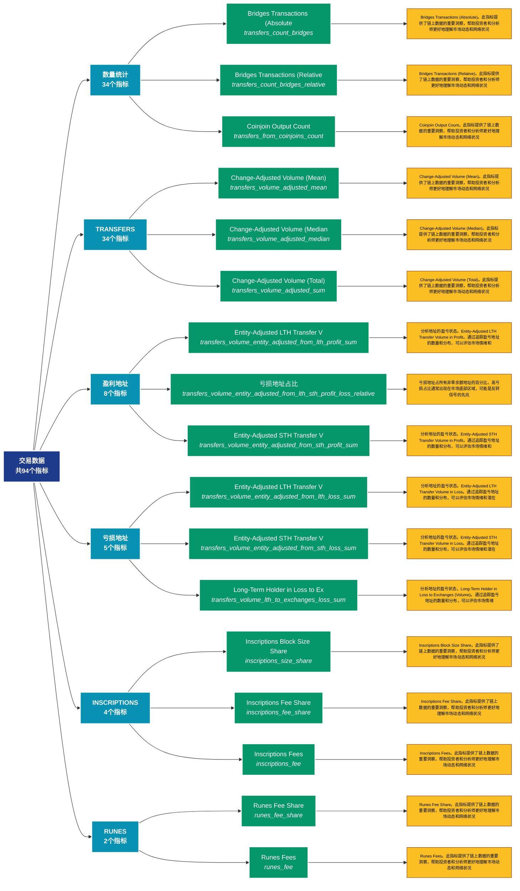

# 交易数据 (transactions)

## 📋 概述

深入分析链上交易活动，包括交易量、转账金额、交易类型等交易层面数据。

本类别共包含 **94** 个API端点，分为 **12** 个子类别。

## 🗂️ 指标分类

| 子类别 | 指标数量 | 主要功能 |
|--------|----------|----------|
| 数量统计 | 34 | 各类地址数量统计 |
| TRANSFERS | 34 | 提供专门的数据分析 |
| 盈利地址 | 8 | 分析盈利地址的规模和特征 |
| 亏损地址 | 5 | 分析亏损地址的规模和特征 |
| INSCRIPTIONS | 4 | 提供专门的数据分析 |
| RUNES | 2 | 提供专门的数据分析 |
| SIZE | 2 | 提供专门的数据分析 |
| SEGWIT | 1 | 提供专门的数据分析 |
| SPENT | 1 | 提供专门的数据分析 |
| TAPROOT | 1 | 提供专门的数据分析 |
| OTHER | 1 | 提供专门的数据分析 |
| TX | 1 | 提供专门的数据分析 |

## 🎨 指标体系结构图



## 📂 详细指标说明

### 📊 数量统计（34个指标）

本子类别包含以下详细指标：

#### 1. Bridges Transactions (Absolute

- **指标代码**: `transfers_count_bridges`
- **API路径**: `/v1/metrics/transactions/transfers_count_bridges`
- **英文名称**: Bridges Transactions (Absolute)

**📝 详细说明**：
Bridges Transactions (Absolute)。此指标提供了链上数据的重要洞察，帮助投资者和分析师更好地理解市场动态和网络状况

**使用示例**：
```python
# 获取Bridges Transactions (Absolute数据
df = client.get_metric(
    "/v1/metrics/transactions/transfers_count_bridges",
    asset="BTC",
    resolution="24h"
)
```

---

#### 2. Bridges Transactions (Relative

- **指标代码**: `transfers_count_bridges_relative`
- **API路径**: `/v1/metrics/transactions/transfers_count_bridges_relative`
- **英文名称**: Bridges Transactions (Relative)

**📝 详细说明**：
Bridges Transactions (Relative)。此指标提供了链上数据的重要洞察，帮助投资者和分析师更好地理解市场动态和网络状况

**使用示例**：
```python
# 获取Bridges Transactions (Relative数据
df = client.get_metric(
    "/v1/metrics/transactions/transfers_count_bridges_relative",
    asset="BTC",
    resolution="24h"
)
```

---

#### 3. Coinjoin Output Count

- **指标代码**: `transfers_from_coinjoins_count`
- **API路径**: `/v1/metrics/transactions/transfers_from_coinjoins_count`
- **英文名称**: Coinjoin Output Count

**📝 详细说明**：
Coinjoin Output Count。此指标提供了链上数据的重要洞察，帮助投资者和分析师更好地理解市场动态和网络状况

**使用示例**：
```python
# 获取Coinjoin Output Count数据
df = client.get_metric(
    "/v1/metrics/transactions/transfers_from_coinjoins_count",
    asset="BTC",
    resolution="24h"
)
```

---

#### 4. Contract Calls (External)

- **指标代码**: `contract_calls_external_count`
- **API路径**: `/v1/metrics/transactions/contract_calls_external_count`
- **英文名称**: Contract Calls (External)

**📝 详细说明**：
Contract Calls (External)。此指标提供了链上数据的重要洞察，帮助投资者和分析师更好地理解市场动态和网络状况

**使用示例**：
```python
# 获取Contract Calls (External)数据
df = client.get_metric(
    "/v1/metrics/transactions/contract_calls_external_count",
    asset="BTC",
    resolution="24h"
)
```

---

#### 5. Contract Calls (Internal)

- **指标代码**: `contract_calls_internal_count`
- **API路径**: `/v1/metrics/transactions/contract_calls_internal_count`
- **英文名称**: Contract Calls (Internal)

**📝 详细说明**：
Contract Calls (Internal)。此指标提供了链上数据的重要洞察，帮助投资者和分析师更好地理解市场动态和网络状况

**使用示例**：
```python
# 获取Contract Calls (Internal)数据
df = client.get_metric(
    "/v1/metrics/transactions/contract_calls_internal_count",
    asset="BTC",
    resolution="24h"
)
```

---

#### 6. DeFi Transactions (Absolute)

- **指标代码**: `transfers_count_defi`
- **API路径**: `/v1/metrics/transactions/transfers_count_defi`
- **英文名称**: DeFi Transactions (Absolute)

**📝 详细说明**：
DeFi Transactions (Absolute)。此指标提供了链上数据的重要洞察，帮助投资者和分析师更好地理解市场动态和网络状况

**使用示例**：
```python
# 获取DeFi Transactions (Absolute)数据
df = client.get_metric(
    "/v1/metrics/transactions/transfers_count_defi",
    asset="BTC",
    resolution="24h"
)
```

---

#### 7. DeFi Transactions (Relative)

- **指标代码**: `transfers_count_defi_relative`
- **API路径**: `/v1/metrics/transactions/transfers_count_defi_relative`
- **英文名称**: DeFi Transactions (Relative)

**📝 详细说明**：
DeFi Transactions (Relative)。此指标提供了链上数据的重要洞察，帮助投资者和分析师更好地理解市场动态和网络状况

**使用示例**：
```python
# 获取DeFi Transactions (Relative)数据
df = client.get_metric(
    "/v1/metrics/transactions/transfers_count_defi_relative",
    asset="BTC",
    resolution="24h"
)
```

---

#### 8. Entity-Adjusted Transaction Co

- **指标代码**: `entity_adjusted_count`
- **API路径**: `/v1/metrics/transactions/entity_adjusted_count`
- **英文名称**: Entity-Adjusted Transaction Count

**📝 详细说明**：
Entity-Adjusted Transaction Count。此指标提供了链上数据的重要洞察，帮助投资者和分析师更好地理解市场动态和网络状况

**使用示例**：
```python
# 获取Entity-Adjusted Transaction Co数据
df = client.get_metric(
    "/v1/metrics/transactions/entity_adjusted_count",
    asset="BTC",
    resolution="24h"
)
```

---

#### 9. ERC-20 Transactions (Absolute)

- **指标代码**: `transfers_count_erc20`
- **API路径**: `/v1/metrics/transactions/transfers_count_erc20`
- **英文名称**: ERC-20 Transactions (Absolute)

**📝 详细说明**：
ERC-20 Transactions (Absolute)。此指标提供了链上数据的重要洞察，帮助投资者和分析师更好地理解市场动态和网络状况

**使用示例**：
```python
# 获取ERC-20 Transactions (Absolute)数据
df = client.get_metric(
    "/v1/metrics/transactions/transfers_count_erc20",
    asset="BTC",
    resolution="24h"
)
```

---

#### 10. ERC-20 Transactions (Relative)

- **指标代码**: `transfers_count_erc20_relative`
- **API路径**: `/v1/metrics/transactions/transfers_count_erc20_relative`
- **英文名称**: ERC-20 Transactions (Relative)

**📝 详细说明**：
ERC-20 Transactions (Relative)。此指标提供了链上数据的重要洞察，帮助投资者和分析师更好地理解市场动态和网络状况

**使用示例**：
```python
# 获取ERC-20 Transactions (Relative)数据
df = client.get_metric(
    "/v1/metrics/transactions/transfers_count_erc20_relative",
    asset="BTC",
    resolution="24h"
)
```

---

#### 11. Exchange Deposits

- **指标代码**: `transfers_to_exchanges_count`
- **API路径**: `/v1/metrics/transactions/transfers_to_exchanges_count`
- **英文名称**: Exchange Deposits

**📝 详细说明**：
Exchange Deposits。此指标提供了链上数据的重要洞察，帮助投资者和分析师更好地理解市场动态和网络状况

**使用示例**：
```python
# 获取Exchange Deposits数据
df = client.get_metric(
    "/v1/metrics/transactions/transfers_to_exchanges_count",
    asset="BTC",
    resolution="24h"
)
```

---

#### 12. Exchange Withdrawals

- **指标代码**: `transfers_from_exchanges_count`
- **API路径**: `/v1/metrics/transactions/transfers_from_exchanges_count`
- **英文名称**: Exchange Withdrawals

**📝 详细说明**：
Exchange Withdrawals。此指标提供了链上数据的重要洞察，帮助投资者和分析师更好地理解市场动态和网络状况

**使用示例**：
```python
# 获取Exchange Withdrawals数据
df = client.get_metric(
    "/v1/metrics/transactions/transfers_from_exchanges_count",
    asset="BTC",
    resolution="24h"
)
```

---

#### 13. Inscriptions Total Count

- **指标代码**: `inscriptions_count_sum`
- **API路径**: `/v1/metrics/transactions/inscriptions_count_sum`
- **英文名称**: Inscriptions Total Count

**📝 详细说明**：
Inscriptions Total Count。此指标提供了链上数据的重要洞察，帮助投资者和分析师更好地理解市场动态和网络状况

**使用示例**：
```python
# 获取Inscriptions Total Count数据
df = client.get_metric(
    "/v1/metrics/transactions/inscriptions_count_sum",
    asset="BTC",
    resolution="24h"
)
```

---

#### 14. Inscriptions Transaction Count

- **指标代码**: `inscriptions_count`
- **API路径**: `/v1/metrics/transactions/inscriptions_count`
- **英文名称**: Inscriptions Transaction Count

**📝 详细说明**：
Inscriptions Transaction Count。此指标提供了链上数据的重要洞察，帮助投资者和分析师更好地理解市场动态和网络状况

**使用示例**：
```python
# 获取Inscriptions Transaction Count数据
df = client.get_metric(
    "/v1/metrics/transactions/inscriptions_count",
    asset="BTC",
    resolution="24h"
)
```

---

#### 15. Inscriptions Transaction Count

- **指标代码**: `inscriptions_count_share`
- **API路径**: `/v1/metrics/transactions/inscriptions_count_share`
- **英文名称**: Inscriptions Transaction Count Share

**📝 详细说明**：
Inscriptions Transaction Count Share。此指标提供了链上数据的重要洞察，帮助投资者和分析师更好地理解市场动态和网络状况

**使用示例**：
```python
# 获取Inscriptions Transaction Count数据
df = client.get_metric(
    "/v1/metrics/transactions/inscriptions_count_share",
    asset="BTC",
    resolution="24h"
)
```

---

#### 16. Inter-Exchange Transfers

- **指标代码**: `transfers_between_exchanges_count`
- **API路径**: `/v1/metrics/transactions/transfers_between_exchanges_count`
- **英文名称**: Inter-Exchange Transfers

**📝 详细说明**：
Inter-Exchange Transfers。此指标提供了链上数据的重要洞察，帮助投资者和分析师更好地理解市场动态和网络状况

**使用示例**：
```python
# 获取Inter-Exchange Transfers数据
df = client.get_metric(
    "/v1/metrics/transactions/transfers_between_exchanges_count",
    asset="BTC",
    resolution="24h"
)
```

---

#### 17. Miner Incoming Transfers

- **指标代码**: `transfers_to_miners_count`
- **API路径**: `/v1/metrics/transactions/transfers_to_miners_count`
- **英文名称**: Miner Incoming Transfers

**📝 详细说明**：
Miner Incoming Transfers。此指标提供了链上数据的重要洞察，帮助投资者和分析师更好地理解市场动态和网络状况

**使用示例**：
```python
# 获取Miner Incoming Transfers数据
df = client.get_metric(
    "/v1/metrics/transactions/transfers_to_miners_count",
    asset="BTC",
    resolution="24h"
)
```

---

#### 18. Miner Outgoing Transfers

- **指标代码**: `transfers_from_miners_count`
- **API路径**: `/v1/metrics/transactions/transfers_from_miners_count`
- **英文名称**: Miner Outgoing Transfers

**📝 详细说明**：
Miner Outgoing Transfers。此指标提供了链上数据的重要洞察，帮助投资者和分析师更好地理解市场动态和网络状况

**使用示例**：
```python
# 获取Miner Outgoing Transfers数据
df = client.get_metric(
    "/v1/metrics/transactions/transfers_from_miners_count",
    asset="BTC",
    resolution="24h"
)
```

---

#### 19. NFTs Transactions (Absolute)

- **指标代码**: `transfers_count_nfts`
- **API路径**: `/v1/metrics/transactions/transfers_count_nfts`
- **英文名称**: NFTs Transactions (Absolute)

**📝 详细说明**：
NFTs Transactions (Absolute)。此指标提供了链上数据的重要洞察，帮助投资者和分析师更好地理解市场动态和网络状况

**使用示例**：
```python
# 获取NFTs Transactions (Absolute)数据
df = client.get_metric(
    "/v1/metrics/transactions/transfers_count_nfts",
    asset="BTC",
    resolution="24h"
)
```

---

#### 20. NFTs Transactions (Relative)

- **指标代码**: `transfers_count_nfts_relative`
- **API路径**: `/v1/metrics/transactions/transfers_count_nfts_relative`
- **英文名称**: NFTs Transactions (Relative)

**📝 详细说明**：
NFTs Transactions (Relative)。此指标提供了链上数据的重要洞察，帮助投资者和分析师更好地理解市场动态和网络状况

**使用示例**：
```python
# 获取NFTs Transactions (Relative)数据
df = client.get_metric(
    "/v1/metrics/transactions/transfers_count_nfts_relative",
    asset="BTC",
    resolution="24h"
)
```

---

#### 21. OTC Desks Incoming Transaction

- **指标代码**: `transfers_to_otc_desks_count`
- **API路径**: `/v1/metrics/transactions/transfers_to_otc_desks_count`
- **英文名称**: OTC Desks Incoming Transactions

**📝 详细说明**：
OTC Desks Incoming Transactions。此指标提供了链上数据的重要洞察，帮助投资者和分析师更好地理解市场动态和网络状况

**使用示例**：
```python
# 获取OTC Desks Incoming Transaction数据
df = client.get_metric(
    "/v1/metrics/transactions/transfers_to_otc_desks_count",
    asset="BTC",
    resolution="24h"
)
```

---

#### 22. OTC Desks Outgoing Transaction

- **指标代码**: `transfers_from_otc_desks_count`
- **API路径**: `/v1/metrics/transactions/transfers_from_otc_desks_count`
- **英文名称**: OTC Desks Outgoing Transactions

**📝 详细说明**：
OTC Desks Outgoing Transactions。此指标提供了链上数据的重要洞察，帮助投资者和分析师更好地理解市场动态和网络状况

**使用示例**：
```python
# 获取OTC Desks Outgoing Transaction数据
df = client.get_metric(
    "/v1/metrics/transactions/transfers_from_otc_desks_count",
    asset="BTC",
    resolution="24h"
)
```

---

#### 23. Runes Count

- **指标代码**: `runes_count`
- **API路径**: `/v1/metrics/transactions/runes_count`
- **英文名称**: Runes Count

**📝 详细说明**：
Runes Count。此指标提供了链上数据的重要洞察，帮助投资者和分析师更好地理解市场动态和网络状况

**使用示例**：
```python
# 获取Runes Count数据
df = client.get_metric(
    "/v1/metrics/transactions/runes_count",
    asset="BTC",
    resolution="24h"
)
```

---

#### 24. Runes Count Share

- **指标代码**: `runes_count_share`
- **API路径**: `/v1/metrics/transactions/runes_count_share`
- **英文名称**: Runes Count Share

**📝 详细说明**：
Runes Count Share。此指标提供了链上数据的重要洞察，帮助投资者和分析师更好地理解市场动态和网络状况

**使用示例**：
```python
# 获取Runes Count Share数据
df = client.get_metric(
    "/v1/metrics/transactions/runes_count_share",
    asset="BTC",
    resolution="24h"
)
```

---

#### 25. Runes Total Count

- **指标代码**: `runes_count_sum`
- **API路径**: `/v1/metrics/transactions/runes_count_sum`
- **英文名称**: Runes Total Count

**📝 详细说明**：
Runes Total Count。此指标提供了链上数据的重要洞察，帮助投资者和分析师更好地理解市场动态和网络状况

**使用示例**：
```python
# 获取Runes Total Count数据
df = client.get_metric(
    "/v1/metrics/transactions/runes_count_sum",
    asset="BTC",
    resolution="24h"
)
```

---

#### 26. Stablecoins Transactions (Abso

- **指标代码**: `transfers_count_stablecoins`
- **API路径**: `/v1/metrics/transactions/transfers_count_stablecoins`
- **英文名称**: Stablecoins Transactions (Absolute)

**📝 详细说明**：
Stablecoins Transactions (Absolute)。此指标提供了链上数据的重要洞察，帮助投资者和分析师更好地理解市场动态和网络状况

**使用示例**：
```python
# 获取Stablecoins Transactions (Abso数据
df = client.get_metric(
    "/v1/metrics/transactions/transfers_count_stablecoins",
    asset="BTC",
    resolution="24h"
)
```

---

#### 27. Stablecoins Transactions (Rela

- **指标代码**: `transfers_count_stablecoins_relative`
- **API路径**: `/v1/metrics/transactions/transfers_count_stablecoins_relative`
- **英文名称**: Stablecoins Transactions (Relative)

**📝 详细说明**：
Stablecoins Transactions (Relative)。此指标提供了链上数据的重要洞察，帮助投资者和分析师更好地理解市场动态和网络状况

**使用示例**：
```python
# 获取Stablecoins Transactions (Rela数据
df = client.get_metric(
    "/v1/metrics/transactions/transfers_count_stablecoins_relative",
    asset="BTC",
    resolution="24h"
)
```

---

#### 28. Transaction Count

- **指标代码**: `count`
- **API路径**: `/v1/metrics/transactions/count`
- **英文名称**: Transaction Count

**📝 详细说明**：
Transaction Count。此指标提供了链上数据的重要洞察，帮助投资者和分析师更好地理解市场动态和网络状况

**使用示例**：
```python
# 获取Transaction Count数据
df = client.get_metric(
    "/v1/metrics/transactions/count",
    asset="BTC",
    resolution="24h"
)
```

---

#### 29. Transaction Type Breakdown (Ab

- **指标代码**: `tx_types_breakdown_count`
- **API路径**: `/v1/metrics/transactions/tx_types_breakdown_count`
- **英文名称**: Transaction Type Breakdown (Absolute)

**📝 详细说明**：
Transaction Type Breakdown (Absolute)。此指标提供了链上数据的重要洞察，帮助投资者和分析师更好地理解市场动态和网络状况

**使用示例**：
```python
# 获取Transaction Type Breakdown (Ab数据
df = client.get_metric(
    "/v1/metrics/transactions/tx_types_breakdown_count",
    asset="BTC",
    resolution="24h"
)
```

---

#### 30. Transfer Count

- **指标代码**: `transfers_count`
- **API路径**: `/v1/metrics/transactions/transfers_count`
- **英文名称**: Transfer Count

**📝 详细说明**：
Transfer Count。此指标提供了链上数据的重要洞察，帮助投资者和分析师更好地理解市场动态和网络状况

**使用示例**：
```python
# 获取Transfer Count数据
df = client.get_metric(
    "/v1/metrics/transactions/transfers_count",
    asset="BTC",
    resolution="24h"
)
```

---

#### 31. Vanilla Transactions (Absolute

- **指标代码**: `transfers_count_vanilla`
- **API路径**: `/v1/metrics/transactions/transfers_count_vanilla`
- **英文名称**: Vanilla Transactions (Absolute)

**📝 详细说明**：
Vanilla Transactions (Absolute)。此指标提供了链上数据的重要洞察，帮助投资者和分析师更好地理解市场动态和网络状况

**使用示例**：
```python
# 获取Vanilla Transactions (Absolute数据
df = client.get_metric(
    "/v1/metrics/transactions/transfers_count_vanilla",
    asset="BTC",
    resolution="24h"
)
```

---

#### 32. Vanilla Transactions (Relative

- **指标代码**: `transfers_count_vanilla_relative`
- **API路径**: `/v1/metrics/transactions/transfers_count_vanilla_relative`
- **英文名称**: Vanilla Transactions (Relative)

**📝 详细说明**：
Vanilla Transactions (Relative)。此指标提供了链上数据的重要洞察，帮助投资者和分析师更好地理解市场动态和网络状况

**使用示例**：
```python
# 获取Vanilla Transactions (Relative数据
df = client.get_metric(
    "/v1/metrics/transactions/transfers_count_vanilla_relative",
    asset="BTC",
    resolution="24h"
)
```

---

#### 33. Whale Deposits to Exchanges (C

- **指标代码**: `transfers_whales_to_exchanges_count`
- **API路径**: `/v1/metrics/transactions/transfers_whales_to_exchanges_count`
- **英文名称**: Whale Deposits to Exchanges (Counts)

**📝 详细说明**：
Whale Deposits to Exchanges (Counts)。此指标提供了链上数据的重要洞察，帮助投资者和分析师更好地理解市场动态和网络状况

**使用示例**：
```python
# 获取Whale Deposits to Exchanges (C数据
df = client.get_metric(
    "/v1/metrics/transactions/transfers_whales_to_exchanges_count",
    asset="BTC",
    resolution="24h"
)
```

---

#### 34. Whale Withdrawals from Exchang

- **指标代码**: `transfers_exchanges_to_whales_count`
- **API路径**: `/v1/metrics/transactions/transfers_exchanges_to_whales_count`
- **英文名称**: Whale Withdrawals from Exchanges (Counts)

**📝 详细说明**：
Whale Withdrawals from Exchanges (Counts)。此指标提供了链上数据的重要洞察，帮助投资者和分析师更好地理解市场动态和网络状况

**使用示例**：
```python
# 获取Whale Withdrawals from Exchang数据
df = client.get_metric(
    "/v1/metrics/transactions/transfers_exchanges_to_whales_count",
    asset="BTC",
    resolution="24h"
)
```

---

### 📊 TRANSFERS（34个指标）

本子类别包含以下详细指标：

#### 1. Change-Adjusted Volume (Mean)

- **指标代码**: `transfers_volume_adjusted_mean`
- **API路径**: `/v1/metrics/transactions/transfers_volume_adjusted_mean`
- **英文名称**: Change-Adjusted Volume (Mean)

**📝 详细说明**：
Change-Adjusted Volume (Mean)。此指标提供了链上数据的重要洞察，帮助投资者和分析师更好地理解市场动态和网络状况

**使用示例**：
```python
# 获取Change-Adjusted Volume (Mean)数据
df = client.get_metric(
    "/v1/metrics/transactions/transfers_volume_adjusted_mean",
    asset="BTC",
    resolution="24h"
)
```

---

#### 2. Change-Adjusted Volume (Median

- **指标代码**: `transfers_volume_adjusted_median`
- **API路径**: `/v1/metrics/transactions/transfers_volume_adjusted_median`
- **英文名称**: Change-Adjusted Volume (Median)

**📝 详细说明**：
Change-Adjusted Volume (Median)。此指标提供了链上数据的重要洞察，帮助投资者和分析师更好地理解市场动态和网络状况

**使用示例**：
```python
# 获取Change-Adjusted Volume (Median数据
df = client.get_metric(
    "/v1/metrics/transactions/transfers_volume_adjusted_median",
    asset="BTC",
    resolution="24h"
)
```

---

#### 3. Change-Adjusted Volume (Total)

- **指标代码**: `transfers_volume_adjusted_sum`
- **API路径**: `/v1/metrics/transactions/transfers_volume_adjusted_sum`
- **英文名称**: Change-Adjusted Volume (Total)

**📝 详细说明**：
Change-Adjusted Volume (Total)。此指标提供了链上数据的重要洞察，帮助投资者和分析师更好地理解市场动态和网络状况

**使用示例**：
```python
# 获取Change-Adjusted Volume (Total)数据
df = client.get_metric(
    "/v1/metrics/transactions/transfers_volume_adjusted_sum",
    asset="BTC",
    resolution="24h"
)
```

---

#### 4. Coinjoin Output Volume

- **指标代码**: `transfers_volume_from_coinjoins_sum`
- **API路径**: `/v1/metrics/transactions/transfers_volume_from_coinjoins_sum`
- **英文名称**: Coinjoin Output Volume

**📝 详细说明**：
Coinjoin Output Volume。此指标提供了链上数据的重要洞察，帮助投资者和分析师更好地理解市场动态和网络状况

**使用示例**：
```python
# 获取Coinjoin Output Volume数据
df = client.get_metric(
    "/v1/metrics/transactions/transfers_volume_from_coinjoins_sum",
    asset="BTC",
    resolution="24h"
)
```

---

#### 5. Entity-Adjusted LTH Transfer V

- **指标代码**: `transfers_volume_entity_adjusted_from_lth_sum`
- **API路径**: `/v1/metrics/transactions/transfers_volume_entity_adjusted_from_lth_sum`
- **英文名称**: Entity-Adjusted LTH Transfer Volume

**📝 详细说明**：
Entity-Adjusted LTH Transfer Volume。此指标提供了链上数据的重要洞察，帮助投资者和分析师更好地理解市场动态和网络状况

**使用示例**：
```python
# 获取Entity-Adjusted LTH Transfer V数据
df = client.get_metric(
    "/v1/metrics/transactions/transfers_volume_entity_adjusted_from_lth_sum",
    asset="BTC",
    resolution="24h"
)
```

---

#### 6. Entity-Adjusted STH Transfer V

- **指标代码**: `transfers_volume_entity_adjusted_from_sth_sum`
- **API路径**: `/v1/metrics/transactions/transfers_volume_entity_adjusted_from_sth_sum`
- **英文名称**: Entity-Adjusted STH Transfer Volume

**📝 详细说明**：
Entity-Adjusted STH Transfer Volume。此指标提供了链上数据的重要洞察，帮助投资者和分析师更好地理解市场动态和网络状况

**使用示例**：
```python
# 获取Entity-Adjusted STH Transfer V数据
df = client.get_metric(
    "/v1/metrics/transactions/transfers_volume_entity_adjusted_from_sth_sum",
    asset="BTC",
    resolution="24h"
)
```

---

#### 7. Entity-Adjusted Volume (Mean)

- **指标代码**: `transfers_volume_entity_adjusted_mean`
- **API路径**: `/v1/metrics/transactions/transfers_volume_entity_adjusted_mean`
- **英文名称**: Entity-Adjusted Volume (Mean)

**📝 详细说明**：
Entity-Adjusted Volume (Mean)。此指标提供了链上数据的重要洞察，帮助投资者和分析师更好地理解市场动态和网络状况

**使用示例**：
```python
# 获取Entity-Adjusted Volume (Mean)数据
df = client.get_metric(
    "/v1/metrics/transactions/transfers_volume_entity_adjusted_mean",
    asset="BTC",
    resolution="24h"
)
```

---

#### 8. Entity-Adjusted Volume (Median

- **指标代码**: `transfers_volume_entity_adjusted_median`
- **API路径**: `/v1/metrics/transactions/transfers_volume_entity_adjusted_median`
- **英文名称**: Entity-Adjusted Volume (Median)

**📝 详细说明**：
Entity-Adjusted Volume (Median)。此指标提供了链上数据的重要洞察，帮助投资者和分析师更好地理解市场动态和网络状况

**使用示例**：
```python
# 获取Entity-Adjusted Volume (Median数据
df = client.get_metric(
    "/v1/metrics/transactions/transfers_volume_entity_adjusted_median",
    asset="BTC",
    resolution="24h"
)
```

---

#### 9. Entity-Adjusted Volume (Total)

- **指标代码**: `transfers_volume_entity_adjusted_sum`
- **API路径**: `/v1/metrics/transactions/transfers_volume_entity_adjusted_sum`
- **英文名称**: Entity-Adjusted Volume (Total)

**📝 详细说明**：
Entity-Adjusted Volume (Total)。此指标提供了链上数据的重要洞察，帮助投资者和分析师更好地理解市场动态和网络状况

**使用示例**：
```python
# 获取Entity-Adjusted Volume (Total)数据
df = client.get_metric(
    "/v1/metrics/transactions/transfers_volume_entity_adjusted_sum",
    asset="BTC",
    resolution="24h"
)
```

---

#### 10. Exchange Inflow Volume (Mean)

- **指标代码**: `transfers_volume_to_exchanges_mean`
- **API路径**: `/v1/metrics/transactions/transfers_volume_to_exchanges_mean`
- **英文名称**: Exchange Inflow Volume (Mean)

**📝 详细说明**：
Exchange Inflow Volume (Mean)。此指标提供了链上数据的重要洞察，帮助投资者和分析师更好地理解市场动态和网络状况

**使用示例**：
```python
# 获取Exchange Inflow Volume (Mean)数据
df = client.get_metric(
    "/v1/metrics/transactions/transfers_volume_to_exchanges_mean",
    asset="BTC",
    resolution="24h"
)
```

---

#### 11. Exchange Inflow Volume (Total)

- **指标代码**: `transfers_volume_to_exchanges_sum`
- **API路径**: `/v1/metrics/transactions/transfers_volume_to_exchanges_sum`
- **英文名称**: Exchange Inflow Volume (Total)

**📝 详细说明**：
Exchange Inflow Volume (Total)。此指标提供了链上数据的重要洞察，帮助投资者和分析师更好地理解市场动态和网络状况

**使用示例**：
```python
# 获取Exchange Inflow Volume (Total)数据
df = client.get_metric(
    "/v1/metrics/transactions/transfers_volume_to_exchanges_sum",
    asset="BTC",
    resolution="24h"
)
```

---

#### 12. Exchange Netflow Volume

- **指标代码**: `transfers_volume_exchanges_net`
- **API路径**: `/v1/metrics/transactions/transfers_volume_exchanges_net`
- **英文名称**: Exchange Netflow Volume

**📝 详细说明**：
Exchange Netflow Volume。此指标提供了链上数据的重要洞察，帮助投资者和分析师更好地理解市场动态和网络状况

**使用示例**：
```python
# 获取Exchange Netflow Volume数据
df = client.get_metric(
    "/v1/metrics/transactions/transfers_volume_exchanges_net",
    asset="BTC",
    resolution="24h"
)
```

---

#### 13. Exchange Netflow Volume by Siz

- **指标代码**: `transfers_volume_exchanges_net_by_size`
- **API路径**: `/v1/metrics/transactions/transfers_volume_exchanges_net_by_size`
- **英文名称**: Exchange Netflow Volume by Size

**📝 详细说明**：
Exchange Netflow Volume by Size。此指标提供了链上数据的重要洞察，帮助投资者和分析师更好地理解市场动态和网络状况

**使用示例**：
```python
# 获取Exchange Netflow Volume by Siz数据
df = client.get_metric(
    "/v1/metrics/transactions/transfers_volume_exchanges_net_by_size",
    asset="BTC",
    resolution="24h"
)
```

---

#### 14. Exchange Outflow Volume (Mean)

- **指标代码**: `transfers_volume_from_exchanges_mean`
- **API路径**: `/v1/metrics/transactions/transfers_volume_from_exchanges_mean`
- **英文名称**: Exchange Outflow Volume (Mean)

**📝 详细说明**：
Exchange Outflow Volume (Mean)。此指标提供了链上数据的重要洞察，帮助投资者和分析师更好地理解市场动态和网络状况

**使用示例**：
```python
# 获取Exchange Outflow Volume (Mean)数据
df = client.get_metric(
    "/v1/metrics/transactions/transfers_volume_from_exchanges_mean",
    asset="BTC",
    resolution="24h"
)
```

---

#### 15. Exchange Outflow Volume (Total

- **指标代码**: `transfers_volume_from_exchanges_sum`
- **API路径**: `/v1/metrics/transactions/transfers_volume_from_exchanges_sum`
- **英文名称**: Exchange Outflow Volume (Total)

**📝 详细说明**：
Exchange Outflow Volume (Total)。此指标提供了链上数据的重要洞察，帮助投资者和分析师更好地理解市场动态和网络状况

**使用示例**：
```python
# 获取Exchange Outflow Volume (Total数据
df = client.get_metric(
    "/v1/metrics/transactions/transfers_volume_from_exchanges_sum",
    asset="BTC",
    resolution="24h"
)
```

---

#### 16. In-House Exchange Volume

- **指标代码**: `transfers_volume_within_exchanges_sum`
- **API路径**: `/v1/metrics/transactions/transfers_volume_within_exchanges_sum`
- **英文名称**: In-House Exchange Volume

**📝 详细说明**：
In-House Exchange Volume。此指标提供了链上数据的重要洞察，帮助投资者和分析师更好地理解市场动态和网络状况

**使用示例**：
```python
# 获取In-House Exchange Volume数据
df = client.get_metric(
    "/v1/metrics/transactions/transfers_volume_within_exchanges_sum",
    asset="BTC",
    resolution="24h"
)
```

---

#### 17. Inter-Exchange Volume

- **指标代码**: `transfers_volume_between_exchanges_sum`
- **API路径**: `/v1/metrics/transactions/transfers_volume_between_exchanges_sum`
- **英文名称**: Inter-Exchange Volume

**📝 详细说明**：
Inter-Exchange Volume。此指标提供了链上数据的重要洞察，帮助投资者和分析师更好地理解市场动态和网络状况

**使用示例**：
```python
# 获取Inter-Exchange Volume数据
df = client.get_metric(
    "/v1/metrics/transactions/transfers_volume_between_exchanges_sum",
    asset="BTC",
    resolution="24h"
)
```

---

#### 18. Long-Term Holder to Exchanges 

- **指标代码**: `transfers_volume_lth_to_exchanges_sum`
- **API路径**: `/v1/metrics/transactions/transfers_volume_lth_to_exchanges_sum`
- **英文名称**: Long-Term Holder to Exchanges (Volume)

**📝 详细说明**：
Long-Term Holder to Exchanges (Volume)。此指标提供了链上数据的重要洞察，帮助投资者和分析师更好地理解市场动态和网络状况

**使用示例**：
```python
# 获取Long-Term Holder to Exchanges 数据
df = client.get_metric(
    "/v1/metrics/transactions/transfers_volume_lth_to_exchanges_sum",
    asset="BTC",
    resolution="24h"
)
```

---

#### 19. Miner Inflow Volume

- **指标代码**: `transfers_volume_to_miners_sum`
- **API路径**: `/v1/metrics/transactions/transfers_volume_to_miners_sum`
- **英文名称**: Miner Inflow Volume

**📝 详细说明**：
Miner Inflow Volume。此指标提供了链上数据的重要洞察，帮助投资者和分析师更好地理解市场动态和网络状况

**使用示例**：
```python
# 获取Miner Inflow Volume数据
df = client.get_metric(
    "/v1/metrics/transactions/transfers_volume_to_miners_sum",
    asset="BTC",
    resolution="24h"
)
```

---

#### 20. Miner Netflow Volume

- **指标代码**: `transfers_volume_miners_net`
- **API路径**: `/v1/metrics/transactions/transfers_volume_miners_net`
- **英文名称**: Miner Netflow Volume

**📝 详细说明**：
Miner Netflow Volume。此指标提供了链上数据的重要洞察，帮助投资者和分析师更好地理解市场动态和网络状况

**使用示例**：
```python
# 获取Miner Netflow Volume数据
df = client.get_metric(
    "/v1/metrics/transactions/transfers_volume_miners_net",
    asset="BTC",
    resolution="24h"
)
```

---

#### 21. Miner Outflow Volume

- **指标代码**: `transfers_volume_from_miners_sum`
- **API路径**: `/v1/metrics/transactions/transfers_volume_from_miners_sum`
- **英文名称**: Miner Outflow Volume

**📝 详细说明**：
Miner Outflow Volume。此指标提供了链上数据的重要洞察，帮助投资者和分析师更好地理解市场动态和网络状况

**使用示例**：
```python
# 获取Miner Outflow Volume数据
df = client.get_metric(
    "/v1/metrics/transactions/transfers_volume_from_miners_sum",
    asset="BTC",
    resolution="24h"
)
```

---

#### 22. Miners to Exchanges

- **指标代码**: `transfers_volume_miners_to_exchanges`
- **API路径**: `/v1/metrics/transactions/transfers_volume_miners_to_exchanges`
- **英文名称**: Miners to Exchanges

**📝 详细说明**：
Miners to Exchanges。此指标提供了链上数据的重要洞察，帮助投资者和分析师更好地理解市场动态和网络状况

**使用示例**：
```python
# 获取Miners to Exchanges数据
df = client.get_metric(
    "/v1/metrics/transactions/transfers_volume_miners_to_exchanges",
    asset="BTC",
    resolution="24h"
)
```

---

#### 23. Miners to Exchanges (Stacked)

- **指标代码**: `transfers_volume_miners_to_exchanges_all`
- **API路径**: `/v1/metrics/transactions/transfers_volume_miners_to_exchanges_all`
- **英文名称**: Miners to Exchanges (Stacked)

**📝 详细说明**：
Miners to Exchanges (Stacked)。此指标提供了链上数据的重要洞察，帮助投资者和分析师更好地理解市场动态和网络状况

**使用示例**：
```python
# 获取Miners to Exchanges (Stacked)数据
df = client.get_metric(
    "/v1/metrics/transactions/transfers_volume_miners_to_exchanges_all",
    asset="BTC",
    resolution="24h"
)
```

---

#### 24. OTC Desks Inflows

- **指标代码**: `transfers_volume_to_otc_desks_sum`
- **API路径**: `/v1/metrics/transactions/transfers_volume_to_otc_desks_sum`
- **英文名称**: OTC Desks Inflows

**📝 详细说明**：
OTC Desks Inflows。此指标提供了链上数据的重要洞察，帮助投资者和分析师更好地理解市场动态和网络状况

**使用示例**：
```python
# 获取OTC Desks Inflows数据
df = client.get_metric(
    "/v1/metrics/transactions/transfers_volume_to_otc_desks_sum",
    asset="BTC",
    resolution="24h"
)
```

---

#### 25. OTC Desks Outflows

- **指标代码**: `transfers_volume_from_otc_desks_sum`
- **API路径**: `/v1/metrics/transactions/transfers_volume_from_otc_desks_sum`
- **英文名称**: OTC Desks Outflows

**📝 详细说明**：
OTC Desks Outflows。此指标提供了链上数据的重要洞察，帮助投资者和分析师更好地理解市场动态和网络状况

**使用示例**：
```python
# 获取OTC Desks Outflows数据
df = client.get_metric(
    "/v1/metrics/transactions/transfers_volume_from_otc_desks_sum",
    asset="BTC",
    resolution="24h"
)
```

---

#### 26. Relative Transfer Volume by Si

- **指标代码**: `transfers_volume_by_size_entity_adjusted_relative`
- **API路径**: `/v1/metrics/transactions/transfers_volume_by_size_entity_adjusted_relative`
- **英文名称**: Relative Transfer Volume by Size (Entity-Adjusted)

**📝 详细说明**：
Relative Transfer Volume by Size (Entity-Adjusted)。此指标提供了链上数据的重要洞察，帮助投资者和分析师更好地理解市场动态和网络状况

**使用示例**：
```python
# 获取Relative Transfer Volume by Si数据
df = client.get_metric(
    "/v1/metrics/transactions/transfers_volume_by_size_entity_adjusted_relative",
    asset="BTC",
    resolution="24h"
)
```

---

#### 27. Short-Term Holder to Exchanges

- **指标代码**: `transfers_volume_sth_to_exchanges_sum`
- **API路径**: `/v1/metrics/transactions/transfers_volume_sth_to_exchanges_sum`
- **英文名称**: Short-Term Holder to Exchanges (Volume)

**📝 详细说明**：
Short-Term Holder to Exchanges (Volume)。此指标提供了链上数据的重要洞察，帮助投资者和分析师更好地理解市场动态和网络状况

**使用示例**：
```python
# 获取Short-Term Holder to Exchanges数据
df = client.get_metric(
    "/v1/metrics/transactions/transfers_volume_sth_to_exchanges_sum",
    asset="BTC",
    resolution="24h"
)
```

---

#### 28. Total Transfer Volume by Size 

- **指标代码**: `transfers_volume_by_size_entity_adjusted_sum`
- **API路径**: `/v1/metrics/transactions/transfers_volume_by_size_entity_adjusted_sum`
- **英文名称**: Total Transfer Volume by Size (Entity-Adjusted)

**📝 详细说明**：
Total Transfer Volume by Size (Entity-Adjusted)。此指标提供了链上数据的重要洞察，帮助投资者和分析师更好地理解市场动态和网络状况

**使用示例**：
```python
# 获取Total Transfer Volume by Size 数据
df = client.get_metric(
    "/v1/metrics/transactions/transfers_volume_by_size_entity_adjusted_sum",
    asset="BTC",
    resolution="24h"
)
```

---

#### 29. Transfer Rate

- **指标代码**: `transfers_rate`
- **API路径**: `/v1/metrics/transactions/transfers_rate`
- **英文名称**: Transfer Rate

**📝 详细说明**：
Transfer Rate。此指标提供了链上数据的重要洞察，帮助投资者和分析师更好地理解市场动态和网络状况

**使用示例**：
```python
# 获取Transfer Rate数据
df = client.get_metric(
    "/v1/metrics/transactions/transfers_rate",
    asset="BTC",
    resolution="24h"
)
```

---

#### 30. Transfer Volume (Mean)

- **指标代码**: `transfers_volume_mean`
- **API路径**: `/v1/metrics/transactions/transfers_volume_mean`
- **英文名称**: Transfer Volume (Mean)

**📝 详细说明**：
Transfer Volume (Mean)。此指标提供了链上数据的重要洞察，帮助投资者和分析师更好地理解市场动态和网络状况

**使用示例**：
```python
# 获取Transfer Volume (Mean)数据
df = client.get_metric(
    "/v1/metrics/transactions/transfers_volume_mean",
    asset="BTC",
    resolution="24h"
)
```

---

#### 31. Transfer Volume (Median)

- **指标代码**: `transfers_volume_median`
- **API路径**: `/v1/metrics/transactions/transfers_volume_median`
- **英文名称**: Transfer Volume (Median)

**📝 详细说明**：
Transfer Volume (Median)。此指标提供了链上数据的重要洞察，帮助投资者和分析师更好地理解市场动态和网络状况

**使用示例**：
```python
# 获取Transfer Volume (Median)数据
df = client.get_metric(
    "/v1/metrics/transactions/transfers_volume_median",
    asset="BTC",
    resolution="24h"
)
```

---

#### 32. Transfer Volume (Total)

- **指标代码**: `transfers_volume_sum`
- **API路径**: `/v1/metrics/transactions/transfers_volume_sum`
- **英文名称**: Transfer Volume (Total)

**📝 详细说明**：
Transfer Volume (Total)。此指标提供了链上数据的重要洞察，帮助投资者和分析师更好地理解市场动态和网络状况

**使用示例**：
```python
# 获取Transfer Volume (Total)数据
df = client.get_metric(
    "/v1/metrics/transactions/transfers_volume_sum",
    asset="BTC",
    resolution="24h"
)
```

---

#### 33. Whale Deposits to Exchanges (V

- **指标代码**: `transfers_volume_whales_to_exchanges_sum`
- **API路径**: `/v1/metrics/transactions/transfers_volume_whales_to_exchanges_sum`
- **英文名称**: Whale Deposits to Exchanges (Volume)

**📝 详细说明**：
Whale Deposits to Exchanges (Volume)。此指标提供了链上数据的重要洞察，帮助投资者和分析师更好地理解市场动态和网络状况

**使用示例**：
```python
# 获取Whale Deposits to Exchanges (V数据
df = client.get_metric(
    "/v1/metrics/transactions/transfers_volume_whales_to_exchanges_sum",
    asset="BTC",
    resolution="24h"
)
```

---

#### 34. Whale Withdrawals from Exchang

- **指标代码**: `transfers_volume_exchanges_to_whales_sum`
- **API路径**: `/v1/metrics/transactions/transfers_volume_exchanges_to_whales_sum`
- **英文名称**: Whale Withdrawals from Exchanges (Volume)

**📝 详细说明**：
Whale Withdrawals from Exchanges (Volume)。此指标提供了链上数据的重要洞察，帮助投资者和分析师更好地理解市场动态和网络状况

**使用示例**：
```python
# 获取Whale Withdrawals from Exchang数据
df = client.get_metric(
    "/v1/metrics/transactions/transfers_volume_exchanges_to_whales_sum",
    asset="BTC",
    resolution="24h"
)
```

---

### 📊 盈利地址（8个指标）

本子类别包含以下详细指标：

#### 1. Entity-Adjusted LTH Transfer V

- **指标代码**: `transfers_volume_entity_adjusted_from_lth_profit_sum`
- **API路径**: `/v1/metrics/transactions/transfers_volume_entity_adjusted_from_lth_profit_sum`
- **英文名称**: Entity-Adjusted LTH Transfer Volume in Profit

**📝 详细说明**：
分析地址的盈亏状态。Entity-Adjusted LTH Transfer Volume in Profit。通过追踪盈亏地址的数量和分布，可以评估市场情绪和潜在的买卖压力

**使用示例**：
```python
# 获取Entity-Adjusted LTH Transfer V数据
df = client.get_metric(
    "/v1/metrics/transactions/transfers_volume_entity_adjusted_from_lth_profit_sum",
    asset="BTC",
    resolution="24h"
)
```

---

#### 2. 亏损地址占比

- **指标代码**: `transfers_volume_entity_adjusted_from_lth_sth_profit_loss_relative`
- **API路径**: `/v1/metrics/transactions/transfers_volume_entity_adjusted_from_lth_sth_profit_loss_relative`
- **英文名称**: Entity-Adjusted LTH/STH Transfer Volume in Profit/Loss

**📝 详细说明**：
亏损地址占所有非零余额地址的百分比。高亏损占比通常出现在市场底部区域，可能是反转信号的先兆

**使用示例**：
```python
# 获取亏损地址占比数据
df = client.get_metric(
    "/v1/metrics/transactions/transfers_volume_entity_adjusted_from_lth_sth_profit_loss_relative",
    asset="BTC",
    resolution="24h"
)
```

---

#### 3. Entity-Adjusted STH Transfer V

- **指标代码**: `transfers_volume_entity_adjusted_from_sth_profit_sum`
- **API路径**: `/v1/metrics/transactions/transfers_volume_entity_adjusted_from_sth_profit_sum`
- **英文名称**: Entity-Adjusted STH Transfer Volume in Profit

**📝 详细说明**：
分析地址的盈亏状态。Entity-Adjusted STH Transfer Volume in Profit。通过追踪盈亏地址的数量和分布，可以评估市场情绪和潜在的买卖压力

**使用示例**：
```python
# 获取Entity-Adjusted STH Transfer V数据
df = client.get_metric(
    "/v1/metrics/transactions/transfers_volume_entity_adjusted_from_sth_profit_sum",
    asset="BTC",
    resolution="24h"
)
```

---

#### 4. Long-Term Holder in Profit to 

- **指标代码**: `transfers_volume_lth_to_exchanges_profit_sum`
- **API路径**: `/v1/metrics/transactions/transfers_volume_lth_to_exchanges_profit_sum`
- **英文名称**: Long-Term Holder in Profit to Exchanges (Volume)

**📝 详细说明**：
分析地址的盈亏状态。Long-Term Holder in Profit to Exchanges (Volume)。通过追踪盈亏地址的数量和分布，可以评估市场情绪和潜在的买卖压力

**使用示例**：
```python
# 获取Long-Term Holder in Profit to 数据
df = client.get_metric(
    "/v1/metrics/transactions/transfers_volume_lth_to_exchanges_profit_sum",
    asset="BTC",
    resolution="24h"
)
```

---

#### 5. 亏损地址占比

- **指标代码**: `transfers_volume_lth_sth_to_exchanges_profit_loss_relative`
- **API路径**: `/v1/metrics/transactions/transfers_volume_lth_sth_to_exchanges_profit_loss_relative`
- **英文名称**: LTH/STH Transfer Volume in Profit/Loss to Exchanges

**📝 详细说明**：
亏损地址占所有非零余额地址的百分比。高亏损占比通常出现在市场底部区域，可能是反转信号的先兆

**使用示例**：
```python
# 获取亏损地址占比数据
df = client.get_metric(
    "/v1/metrics/transactions/transfers_volume_lth_sth_to_exchanges_profit_loss_relative",
    asset="BTC",
    resolution="24h"
)
```

---

#### 6. 盈利地址占比

- **指标代码**: `transfers_volume_profit_relative`
- **API路径**: `/v1/metrics/transactions/transfers_volume_profit_relative`
- **英文名称**: Percent Volume in Profit

**📝 详细说明**：
盈利地址占所有非零余额地址的百分比。这个相对指标能够更好地反映市场整体的盈利状况，当该比例过高时，可能预示着短期调整风险

**使用示例**：
```python
# 获取盈利地址占比数据
df = client.get_metric(
    "/v1/metrics/transactions/transfers_volume_profit_relative",
    asset="BTC",
    resolution="24h"
)
```

---

#### 7. Short-Term Holder in Profit to

- **指标代码**: `transfers_volume_sth_to_exchanges_profit_sum`
- **API路径**: `/v1/metrics/transactions/transfers_volume_sth_to_exchanges_profit_sum`
- **英文名称**: Short-Term Holder in Profit to Exchanges (Volume)

**📝 详细说明**：
分析地址的盈亏状态。Short-Term Holder in Profit to Exchanges (Volume)。通过追踪盈亏地址的数量和分布，可以评估市场情绪和潜在的买卖压力

**使用示例**：
```python
# 获取Short-Term Holder in Profit to数据
df = client.get_metric(
    "/v1/metrics/transactions/transfers_volume_sth_to_exchanges_profit_sum",
    asset="BTC",
    resolution="24h"
)
```

---

#### 8. Transfer Volume in Profit

- **指标代码**: `transfers_volume_profit_sum`
- **API路径**: `/v1/metrics/transactions/transfers_volume_profit_sum`
- **英文名称**: Transfer Volume in Profit

**📝 详细说明**：
分析地址的盈亏状态。Transfer Volume in Profit。通过追踪盈亏地址的数量和分布，可以评估市场情绪和潜在的买卖压力

**使用示例**：
```python
# 获取Transfer Volume in Profit数据
df = client.get_metric(
    "/v1/metrics/transactions/transfers_volume_profit_sum",
    asset="BTC",
    resolution="24h"
)
```

---

### 📊 亏损地址（5个指标）

本子类别包含以下详细指标：

#### 1. Entity-Adjusted LTH Transfer V

- **指标代码**: `transfers_volume_entity_adjusted_from_lth_loss_sum`
- **API路径**: `/v1/metrics/transactions/transfers_volume_entity_adjusted_from_lth_loss_sum`
- **英文名称**: Entity-Adjusted LTH Transfer Volume in Loss

**📝 详细说明**：
分析地址的盈亏状态。Entity-Adjusted LTH Transfer Volume in Loss。通过追踪盈亏地址的数量和分布，可以评估市场情绪和潜在的买卖压力

**使用示例**：
```python
# 获取Entity-Adjusted LTH Transfer V数据
df = client.get_metric(
    "/v1/metrics/transactions/transfers_volume_entity_adjusted_from_lth_loss_sum",
    asset="BTC",
    resolution="24h"
)
```

---

#### 2. Entity-Adjusted STH Transfer V

- **指标代码**: `transfers_volume_entity_adjusted_from_sth_loss_sum`
- **API路径**: `/v1/metrics/transactions/transfers_volume_entity_adjusted_from_sth_loss_sum`
- **英文名称**: Entity-Adjusted STH Transfer Volume in Loss

**📝 详细说明**：
分析地址的盈亏状态。Entity-Adjusted STH Transfer Volume in Loss。通过追踪盈亏地址的数量和分布，可以评估市场情绪和潜在的买卖压力

**使用示例**：
```python
# 获取Entity-Adjusted STH Transfer V数据
df = client.get_metric(
    "/v1/metrics/transactions/transfers_volume_entity_adjusted_from_sth_loss_sum",
    asset="BTC",
    resolution="24h"
)
```

---

#### 3. Long-Term Holder in Loss to Ex

- **指标代码**: `transfers_volume_lth_to_exchanges_loss_sum`
- **API路径**: `/v1/metrics/transactions/transfers_volume_lth_to_exchanges_loss_sum`
- **英文名称**: Long-Term Holder in Loss to Exchanges (Volume)

**📝 详细说明**：
分析地址的盈亏状态。Long-Term Holder in Loss to Exchanges (Volume)。通过追踪盈亏地址的数量和分布，可以评估市场情绪和潜在的买卖压力

**使用示例**：
```python
# 获取Long-Term Holder in Loss to Ex数据
df = client.get_metric(
    "/v1/metrics/transactions/transfers_volume_lth_to_exchanges_loss_sum",
    asset="BTC",
    resolution="24h"
)
```

---

#### 4. Short-Term Holder in Loss to E

- **指标代码**: `transfers_volume_sth_to_exchanges_loss_sum`
- **API路径**: `/v1/metrics/transactions/transfers_volume_sth_to_exchanges_loss_sum`
- **英文名称**: Short-Term Holder in Loss to Exchanges (Volume)

**📝 详细说明**：
分析地址的盈亏状态。Short-Term Holder in Loss to Exchanges (Volume)。通过追踪盈亏地址的数量和分布，可以评估市场情绪和潜在的买卖压力

**使用示例**：
```python
# 获取Short-Term Holder in Loss to E数据
df = client.get_metric(
    "/v1/metrics/transactions/transfers_volume_sth_to_exchanges_loss_sum",
    asset="BTC",
    resolution="24h"
)
```

---

#### 5. Transfer Volume in Loss

- **指标代码**: `transfers_volume_loss_sum`
- **API路径**: `/v1/metrics/transactions/transfers_volume_loss_sum`
- **英文名称**: Transfer Volume in Loss

**📝 详细说明**：
分析地址的盈亏状态。Transfer Volume in Loss。通过追踪盈亏地址的数量和分布，可以评估市场情绪和潜在的买卖压力

**使用示例**：
```python
# 获取Transfer Volume in Loss数据
df = client.get_metric(
    "/v1/metrics/transactions/transfers_volume_loss_sum",
    asset="BTC",
    resolution="24h"
)
```

---

### 📊 INSCRIPTIONS（4个指标）

本子类别包含以下详细指标：

#### 1. Inscriptions Block Size Share

- **指标代码**: `inscriptions_size_share`
- **API路径**: `/v1/metrics/transactions/inscriptions_size_share`
- **英文名称**: Inscriptions Block Size Share

**📝 详细说明**：
Inscriptions Block Size Share。此指标提供了链上数据的重要洞察，帮助投资者和分析师更好地理解市场动态和网络状况

**使用示例**：
```python
# 获取Inscriptions Block Size Share数据
df = client.get_metric(
    "/v1/metrics/transactions/inscriptions_size_share",
    asset="BTC",
    resolution="24h"
)
```

---

#### 2. Inscriptions Fee Share

- **指标代码**: `inscriptions_fee_share`
- **API路径**: `/v1/metrics/transactions/inscriptions_fee_share`
- **英文名称**: Inscriptions Fee Share

**📝 详细说明**：
Inscriptions Fee Share。此指标提供了链上数据的重要洞察，帮助投资者和分析师更好地理解市场动态和网络状况

**使用示例**：
```python
# 获取Inscriptions Fee Share数据
df = client.get_metric(
    "/v1/metrics/transactions/inscriptions_fee_share",
    asset="BTC",
    resolution="24h"
)
```

---

#### 3. Inscriptions Fees

- **指标代码**: `inscriptions_fee`
- **API路径**: `/v1/metrics/transactions/inscriptions_fee`
- **英文名称**: Inscriptions Fees

**📝 详细说明**：
Inscriptions Fees。此指标提供了链上数据的重要洞察，帮助投资者和分析师更好地理解市场动态和网络状况

**使用示例**：
```python
# 获取Inscriptions Fees数据
df = client.get_metric(
    "/v1/metrics/transactions/inscriptions_fee",
    asset="BTC",
    resolution="24h"
)
```

---

#### 4. Inscriptions Total Block Size

- **指标代码**: `inscriptions_size_sum`
- **API路径**: `/v1/metrics/transactions/inscriptions_size_sum`
- **英文名称**: Inscriptions Total Block Size

**📝 详细说明**：
Inscriptions Total Block Size。此指标提供了链上数据的重要洞察，帮助投资者和分析师更好地理解市场动态和网络状况

**使用示例**：
```python
# 获取Inscriptions Total Block Size数据
df = client.get_metric(
    "/v1/metrics/transactions/inscriptions_size_sum",
    asset="BTC",
    resolution="24h"
)
```

---

### 📊 RUNES（2个指标）

本子类别包含以下详细指标：

#### 1. Runes Fee Share

- **指标代码**: `runes_fee_share`
- **API路径**: `/v1/metrics/transactions/runes_fee_share`
- **英文名称**: Runes Fee Share

**📝 详细说明**：
Runes Fee Share。此指标提供了链上数据的重要洞察，帮助投资者和分析师更好地理解市场动态和网络状况

**使用示例**：
```python
# 获取Runes Fee Share数据
df = client.get_metric(
    "/v1/metrics/transactions/runes_fee_share",
    asset="BTC",
    resolution="24h"
)
```

---

#### 2. Runes Fees

- **指标代码**: `runes_fee`
- **API路径**: `/v1/metrics/transactions/runes_fee`
- **英文名称**: Runes Fees

**📝 详细说明**：
Runes Fees。此指标提供了链上数据的重要洞察，帮助投资者和分析师更好地理解市场动态和网络状况

**使用示例**：
```python
# 获取Runes Fees数据
df = client.get_metric(
    "/v1/metrics/transactions/runes_fee",
    asset="BTC",
    resolution="24h"
)
```

---

### 📊 SIZE（2个指标）

本子类别包含以下详细指标：

#### 1. Transaction Size (Mean)

- **指标代码**: `size_mean`
- **API路径**: `/v1/metrics/transactions/size_mean`
- **英文名称**: Transaction Size (Mean)

**📝 详细说明**：
Transaction Size (Mean)。此指标提供了链上数据的重要洞察，帮助投资者和分析师更好地理解市场动态和网络状况

**使用示例**：
```python
# 获取Transaction Size (Mean)数据
df = client.get_metric(
    "/v1/metrics/transactions/size_mean",
    asset="BTC",
    resolution="24h"
)
```

---

#### 2. Transaction Size (Total)

- **指标代码**: `size_sum`
- **API路径**: `/v1/metrics/transactions/size_sum`
- **英文名称**: Transaction Size (Total)

**📝 详细说明**：
Transaction Size (Total)。此指标提供了链上数据的重要洞察，帮助投资者和分析师更好地理解市场动态和网络状况

**使用示例**：
```python
# 获取Transaction Size (Total)数据
df = client.get_metric(
    "/v1/metrics/transactions/size_sum",
    asset="BTC",
    resolution="24h"
)
```

---

### 📊 SEGWIT（1个指标）

本子类别包含以下详细指标：

#### 1. SegWit Adoption

- **指标代码**: `segwit_adoption`
- **API路径**: `/v1/metrics/transactions/segwit_adoption`
- **英文名称**: SegWit Adoption

**📝 详细说明**：
SegWit Adoption。此指标提供了链上数据的重要洞察，帮助投资者和分析师更好地理解市场动态和网络状况

**使用示例**：
```python
# 获取SegWit Adoption数据
df = client.get_metric(
    "/v1/metrics/transactions/segwit_adoption",
    asset="BTC",
    resolution="24h"
)
```

---

### 📊 SPENT（1个指标）

本子类别包含以下详细指标：

#### 1. Spent Output Types

- **指标代码**: `spent_output_types_share`
- **API路径**: `/v1/metrics/transactions/spent_output_types_share`
- **英文名称**: Spent Output Types

**📝 详细说明**：
Spent Output Types。此指标提供了链上数据的重要洞察，帮助投资者和分析师更好地理解市场动态和网络状况

**使用示例**：
```python
# 获取Spent Output Types数据
df = client.get_metric(
    "/v1/metrics/transactions/spent_output_types_share",
    asset="BTC",
    resolution="24h"
)
```

---

### 📊 TAPROOT（1个指标）

本子类别包含以下详细指标：

#### 1. Taproot Adoption

- **指标代码**: `taproot_adoption`
- **API路径**: `/v1/metrics/transactions/taproot_adoption`
- **英文名称**: Taproot Adoption

**📝 详细说明**：
Taproot Adoption。此指标提供了链上数据的重要洞察，帮助投资者和分析师更好地理解市场动态和网络状况

**使用示例**：
```python
# 获取Taproot Adoption数据
df = client.get_metric(
    "/v1/metrics/transactions/taproot_adoption",
    asset="BTC",
    resolution="24h"
)
```

---

### 📊 OTHER（1个指标）

本子类别包含以下详细指标：

#### 1. Transaction Rate

- **指标代码**: `rate`
- **API路径**: `/v1/metrics/transactions/rate`
- **英文名称**: Transaction Rate

**📝 详细说明**：
Transaction Rate。此指标提供了链上数据的重要洞察，帮助投资者和分析师更好地理解市场动态和网络状况

**使用示例**：
```python
# 获取Transaction Rate数据
df = client.get_metric(
    "/v1/metrics/transactions/rate",
    asset="BTC",
    resolution="24h"
)
```

---

### 📊 TX（1个指标）

本子类别包含以下详细指标：

#### 1. Transaction Type Breakdown (Re

- **指标代码**: `tx_types_breakdown_relative`
- **API路径**: `/v1/metrics/transactions/tx_types_breakdown_relative`
- **英文名称**: Transaction Type Breakdown (Relative)

**📝 详细说明**：
Transaction Type Breakdown (Relative)。此指标提供了链上数据的重要洞察，帮助投资者和分析师更好地理解市场动态和网络状况

**使用示例**：
```python
# 获取Transaction Type Breakdown (Re数据
df = client.get_metric(
    "/v1/metrics/transactions/tx_types_breakdown_relative",
    asset="BTC",
    resolution="24h"
)
```

---

## 📊 完整指标列表

| # | 指标名称 | 指标代码 | API路径 | 说明 |
|---|----------|----------|---------|------|
| 1 | Bridges Transactions (Absolute | `transfers_count_bridges` | `/v1/metrics/transactions/transfers_count_bridges` | Bridges Transactions (Absolute)。此指标提供了链上数据的重要洞察，帮助投资者和分析师更好地理解市场动态和网络状况 |
| 2 | Bridges Transactions (Relative | `transfers_count_bridges_relative` | `/v1/metrics/transactions/transfers_count_bridges_relative` | Bridges Transactions (Relative)。此指标提供了链上数据的重要洞察，帮助投资者和分析师更好地理解市场动态和网络状况 |
| 3 | Change-Adjusted Volume (Mean) | `transfers_volume_adjusted_mean` | `/v1/metrics/transactions/transfers_volume_adjusted_mean` | Change-Adjusted Volume (Mean)。此指标提供了链上数据的重要洞察，帮助投资者和分析师更好地理解市场动态和网络状况 |
| 4 | Change-Adjusted Volume (Median | `transfers_volume_adjusted_median` | `/v1/metrics/transactions/transfers_volume_adjusted_median` | Change-Adjusted Volume (Median)。此指标提供了链上数据的重要洞察，帮助投资者和分析师更好地理解市场动态和网络状况 |
| 5 | Change-Adjusted Volume (Total) | `transfers_volume_adjusted_sum` | `/v1/metrics/transactions/transfers_volume_adjusted_sum` | Change-Adjusted Volume (Total)。此指标提供了链上数据的重要洞察，帮助投资者和分析师更好地理解市场动态和网络状况 |
| 6 | Coinjoin Output Count | `transfers_from_coinjoins_count` | `/v1/metrics/transactions/transfers_from_coinjoins_count` | Coinjoin Output Count。此指标提供了链上数据的重要洞察，帮助投资者和分析师更好地理解市场动态和网络状况 |
| 7 | Coinjoin Output Volume | `transfers_volume_from_coinjoins_sum` | `/v1/metrics/transactions/transfers_volume_from_coinjoins_sum` | Coinjoin Output Volume。此指标提供了链上数据的重要洞察，帮助投资者和分析师更好地理解市场动态和网络状况 |
| 8 | Contract Calls (External) | `contract_calls_external_count` | `/v1/metrics/transactions/contract_calls_external_count` | Contract Calls (External)。此指标提供了链上数据的重要洞察，帮助投资者和分析师更好地理解市场动态和网络状况 |
| 9 | Contract Calls (Internal) | `contract_calls_internal_count` | `/v1/metrics/transactions/contract_calls_internal_count` | Contract Calls (Internal)。此指标提供了链上数据的重要洞察，帮助投资者和分析师更好地理解市场动态和网络状况 |
| 10 | DeFi Transactions (Absolute) | `transfers_count_defi` | `/v1/metrics/transactions/transfers_count_defi` | DeFi Transactions (Absolute)。此指标提供了链上数据的重要洞察，帮助投资者和分析师更好地理解市场动态和网络状况 |
| 11 | DeFi Transactions (Relative) | `transfers_count_defi_relative` | `/v1/metrics/transactions/transfers_count_defi_relative` | DeFi Transactions (Relative)。此指标提供了链上数据的重要洞察，帮助投资者和分析师更好地理解市场动态和网络状况 |
| 12 | Entity-Adjusted LTH Transfer V | `transfers_volume_entity_adjusted_from_lth_sum` | `/v1/metrics/transactions/transfers_volume_entity_adjusted_from_lth_sum` | Entity-Adjusted LTH Transfer Volume。此指标提供了链上数据的重要洞察，帮助投资者和分析师更好地理解市场动态和网络状况 |
| 13 | Entity-Adjusted LTH Transfer V | `transfers_volume_entity_adjusted_from_lth_loss_sum` | `/v1/metrics/transactions/transfers_volume_entity_adjusted_from_lth_loss_sum` | 分析地址的盈亏状态。Entity-Adjusted LTH Transfer Volume in Loss。通过追踪盈亏地址的数量和分布，可以评估市场情绪和潜在的买卖压力 |
| 14 | Entity-Adjusted LTH Transfer V | `transfers_volume_entity_adjusted_from_lth_profit_sum` | `/v1/metrics/transactions/transfers_volume_entity_adjusted_from_lth_profit_sum` | 分析地址的盈亏状态。Entity-Adjusted LTH Transfer Volume in Profit。通过追踪盈亏地址的数量和分布，可以评估市场情绪和潜在的买卖压力 |
| 15 | 亏损地址占比 | `transfers_volume_entity_adjusted_from_lth_sth_profit_loss_relative` | `/v1/metrics/transactions/transfers_volume_entity_adjusted_from_lth_sth_profit_loss_relative` | 亏损地址占所有非零余额地址的百分比。高亏损占比通常出现在市场底部区域，可能是反转信号的先兆 |
| 16 | Entity-Adjusted STH Transfer V | `transfers_volume_entity_adjusted_from_sth_sum` | `/v1/metrics/transactions/transfers_volume_entity_adjusted_from_sth_sum` | Entity-Adjusted STH Transfer Volume。此指标提供了链上数据的重要洞察，帮助投资者和分析师更好地理解市场动态和网络状况 |
| 17 | Entity-Adjusted STH Transfer V | `transfers_volume_entity_adjusted_from_sth_loss_sum` | `/v1/metrics/transactions/transfers_volume_entity_adjusted_from_sth_loss_sum` | 分析地址的盈亏状态。Entity-Adjusted STH Transfer Volume in Loss。通过追踪盈亏地址的数量和分布，可以评估市场情绪和潜在的买卖压力 |
| 18 | Entity-Adjusted STH Transfer V | `transfers_volume_entity_adjusted_from_sth_profit_sum` | `/v1/metrics/transactions/transfers_volume_entity_adjusted_from_sth_profit_sum` | 分析地址的盈亏状态。Entity-Adjusted STH Transfer Volume in Profit。通过追踪盈亏地址的数量和分布，可以评估市场情绪和潜在的买卖压力 |
| 19 | Entity-Adjusted Transaction Co | `entity_adjusted_count` | `/v1/metrics/transactions/entity_adjusted_count` | Entity-Adjusted Transaction Count。此指标提供了链上数据的重要洞察，帮助投资者和分析师更好地理解市场动态和网络状况 |
| 20 | Entity-Adjusted Volume (Mean) | `transfers_volume_entity_adjusted_mean` | `/v1/metrics/transactions/transfers_volume_entity_adjusted_mean` | Entity-Adjusted Volume (Mean)。此指标提供了链上数据的重要洞察，帮助投资者和分析师更好地理解市场动态和网络状况 |
| 21 | Entity-Adjusted Volume (Median | `transfers_volume_entity_adjusted_median` | `/v1/metrics/transactions/transfers_volume_entity_adjusted_median` | Entity-Adjusted Volume (Median)。此指标提供了链上数据的重要洞察，帮助投资者和分析师更好地理解市场动态和网络状况 |
| 22 | Entity-Adjusted Volume (Total) | `transfers_volume_entity_adjusted_sum` | `/v1/metrics/transactions/transfers_volume_entity_adjusted_sum` | Entity-Adjusted Volume (Total)。此指标提供了链上数据的重要洞察，帮助投资者和分析师更好地理解市场动态和网络状况 |
| 23 | ERC-20 Transactions (Absolute) | `transfers_count_erc20` | `/v1/metrics/transactions/transfers_count_erc20` | ERC-20 Transactions (Absolute)。此指标提供了链上数据的重要洞察，帮助投资者和分析师更好地理解市场动态和网络状况 |
| 24 | ERC-20 Transactions (Relative) | `transfers_count_erc20_relative` | `/v1/metrics/transactions/transfers_count_erc20_relative` | ERC-20 Transactions (Relative)。此指标提供了链上数据的重要洞察，帮助投资者和分析师更好地理解市场动态和网络状况 |
| 25 | Exchange Deposits | `transfers_to_exchanges_count` | `/v1/metrics/transactions/transfers_to_exchanges_count` | Exchange Deposits。此指标提供了链上数据的重要洞察，帮助投资者和分析师更好地理解市场动态和网络状况 |
| 26 | Exchange Inflow Volume (Mean) | `transfers_volume_to_exchanges_mean` | `/v1/metrics/transactions/transfers_volume_to_exchanges_mean` | Exchange Inflow Volume (Mean)。此指标提供了链上数据的重要洞察，帮助投资者和分析师更好地理解市场动态和网络状况 |
| 27 | Exchange Inflow Volume (Total) | `transfers_volume_to_exchanges_sum` | `/v1/metrics/transactions/transfers_volume_to_exchanges_sum` | Exchange Inflow Volume (Total)。此指标提供了链上数据的重要洞察，帮助投资者和分析师更好地理解市场动态和网络状况 |
| 28 | Exchange Netflow Volume | `transfers_volume_exchanges_net` | `/v1/metrics/transactions/transfers_volume_exchanges_net` | Exchange Netflow Volume。此指标提供了链上数据的重要洞察，帮助投资者和分析师更好地理解市场动态和网络状况 |
| 29 | Exchange Netflow Volume by Siz | `transfers_volume_exchanges_net_by_size` | `/v1/metrics/transactions/transfers_volume_exchanges_net_by_size` | Exchange Netflow Volume by Size。此指标提供了链上数据的重要洞察，帮助投资者和分析师更好地理解市场动态和网络状况 |
| 30 | Exchange Outflow Volume (Mean) | `transfers_volume_from_exchanges_mean` | `/v1/metrics/transactions/transfers_volume_from_exchanges_mean` | Exchange Outflow Volume (Mean)。此指标提供了链上数据的重要洞察，帮助投资者和分析师更好地理解市场动态和网络状况 |
| 31 | Exchange Outflow Volume (Total | `transfers_volume_from_exchanges_sum` | `/v1/metrics/transactions/transfers_volume_from_exchanges_sum` | Exchange Outflow Volume (Total)。此指标提供了链上数据的重要洞察，帮助投资者和分析师更好地理解市场动态和网络状况 |
| 32 | Exchange Withdrawals | `transfers_from_exchanges_count` | `/v1/metrics/transactions/transfers_from_exchanges_count` | Exchange Withdrawals。此指标提供了链上数据的重要洞察，帮助投资者和分析师更好地理解市场动态和网络状况 |
| 33 | In-House Exchange Volume | `transfers_volume_within_exchanges_sum` | `/v1/metrics/transactions/transfers_volume_within_exchanges_sum` | In-House Exchange Volume。此指标提供了链上数据的重要洞察，帮助投资者和分析师更好地理解市场动态和网络状况 |
| 34 | Inscriptions Block Size Share | `inscriptions_size_share` | `/v1/metrics/transactions/inscriptions_size_share` | Inscriptions Block Size Share。此指标提供了链上数据的重要洞察，帮助投资者和分析师更好地理解市场动态和网络状况 |
| 35 | Inscriptions Fee Share | `inscriptions_fee_share` | `/v1/metrics/transactions/inscriptions_fee_share` | Inscriptions Fee Share。此指标提供了链上数据的重要洞察，帮助投资者和分析师更好地理解市场动态和网络状况 |
| 36 | Inscriptions Fees | `inscriptions_fee` | `/v1/metrics/transactions/inscriptions_fee` | Inscriptions Fees。此指标提供了链上数据的重要洞察，帮助投资者和分析师更好地理解市场动态和网络状况 |
| 37 | Inscriptions Total Block Size | `inscriptions_size_sum` | `/v1/metrics/transactions/inscriptions_size_sum` | Inscriptions Total Block Size。此指标提供了链上数据的重要洞察，帮助投资者和分析师更好地理解市场动态和网络状况 |
| 38 | Inscriptions Total Count | `inscriptions_count_sum` | `/v1/metrics/transactions/inscriptions_count_sum` | Inscriptions Total Count。此指标提供了链上数据的重要洞察，帮助投资者和分析师更好地理解市场动态和网络状况 |
| 39 | Inscriptions Transaction Count | `inscriptions_count` | `/v1/metrics/transactions/inscriptions_count` | Inscriptions Transaction Count。此指标提供了链上数据的重要洞察，帮助投资者和分析师更好地理解市场动态和网络状况 |
| 40 | Inscriptions Transaction Count | `inscriptions_count_share` | `/v1/metrics/transactions/inscriptions_count_share` | Inscriptions Transaction Count Share。此指标提供了链上数据的重要洞察，帮助投资者和分析师更好地理解市场动态和网络状况 |
| 41 | Inter-Exchange Transfers | `transfers_between_exchanges_count` | `/v1/metrics/transactions/transfers_between_exchanges_count` | Inter-Exchange Transfers。此指标提供了链上数据的重要洞察，帮助投资者和分析师更好地理解市场动态和网络状况 |
| 42 | Inter-Exchange Volume | `transfers_volume_between_exchanges_sum` | `/v1/metrics/transactions/transfers_volume_between_exchanges_sum` | Inter-Exchange Volume。此指标提供了链上数据的重要洞察，帮助投资者和分析师更好地理解市场动态和网络状况 |
| 43 | Long-Term Holder in Loss to Ex | `transfers_volume_lth_to_exchanges_loss_sum` | `/v1/metrics/transactions/transfers_volume_lth_to_exchanges_loss_sum` | 分析地址的盈亏状态。Long-Term Holder in Loss to Exchanges (Volume)。通过追踪盈亏地址的数量和分布，可以评估市场情绪和潜在的买卖压力 |
| 44 | Long-Term Holder in Profit to  | `transfers_volume_lth_to_exchanges_profit_sum` | `/v1/metrics/transactions/transfers_volume_lth_to_exchanges_profit_sum` | 分析地址的盈亏状态。Long-Term Holder in Profit to Exchanges (Volume)。通过追踪盈亏地址的数量和分布，可以评估市场情绪和潜在的买卖压力 |
| 45 | Long-Term Holder to Exchanges  | `transfers_volume_lth_to_exchanges_sum` | `/v1/metrics/transactions/transfers_volume_lth_to_exchanges_sum` | Long-Term Holder to Exchanges (Volume)。此指标提供了链上数据的重要洞察，帮助投资者和分析师更好地理解市场动态和网络状况 |
| 46 | 亏损地址占比 | `transfers_volume_lth_sth_to_exchanges_profit_loss_relative` | `/v1/metrics/transactions/transfers_volume_lth_sth_to_exchanges_profit_loss_relative` | 亏损地址占所有非零余额地址的百分比。高亏损占比通常出现在市场底部区域，可能是反转信号的先兆 |
| 47 | Miner Incoming Transfers | `transfers_to_miners_count` | `/v1/metrics/transactions/transfers_to_miners_count` | Miner Incoming Transfers。此指标提供了链上数据的重要洞察，帮助投资者和分析师更好地理解市场动态和网络状况 |
| 48 | Miner Inflow Volume | `transfers_volume_to_miners_sum` | `/v1/metrics/transactions/transfers_volume_to_miners_sum` | Miner Inflow Volume。此指标提供了链上数据的重要洞察，帮助投资者和分析师更好地理解市场动态和网络状况 |
| 49 | Miner Netflow Volume | `transfers_volume_miners_net` | `/v1/metrics/transactions/transfers_volume_miners_net` | Miner Netflow Volume。此指标提供了链上数据的重要洞察，帮助投资者和分析师更好地理解市场动态和网络状况 |
| 50 | Miner Outflow Volume | `transfers_volume_from_miners_sum` | `/v1/metrics/transactions/transfers_volume_from_miners_sum` | Miner Outflow Volume。此指标提供了链上数据的重要洞察，帮助投资者和分析师更好地理解市场动态和网络状况 |
| 51 | Miner Outgoing Transfers | `transfers_from_miners_count` | `/v1/metrics/transactions/transfers_from_miners_count` | Miner Outgoing Transfers。此指标提供了链上数据的重要洞察，帮助投资者和分析师更好地理解市场动态和网络状况 |
| 52 | Miners to Exchanges | `transfers_volume_miners_to_exchanges` | `/v1/metrics/transactions/transfers_volume_miners_to_exchanges` | Miners to Exchanges。此指标提供了链上数据的重要洞察，帮助投资者和分析师更好地理解市场动态和网络状况 |
| 53 | Miners to Exchanges (Stacked) | `transfers_volume_miners_to_exchanges_all` | `/v1/metrics/transactions/transfers_volume_miners_to_exchanges_all` | Miners to Exchanges (Stacked)。此指标提供了链上数据的重要洞察，帮助投资者和分析师更好地理解市场动态和网络状况 |
| 54 | NFTs Transactions (Absolute) | `transfers_count_nfts` | `/v1/metrics/transactions/transfers_count_nfts` | NFTs Transactions (Absolute)。此指标提供了链上数据的重要洞察，帮助投资者和分析师更好地理解市场动态和网络状况 |
| 55 | NFTs Transactions (Relative) | `transfers_count_nfts_relative` | `/v1/metrics/transactions/transfers_count_nfts_relative` | NFTs Transactions (Relative)。此指标提供了链上数据的重要洞察，帮助投资者和分析师更好地理解市场动态和网络状况 |
| 56 | OTC Desks Incoming Transaction | `transfers_to_otc_desks_count` | `/v1/metrics/transactions/transfers_to_otc_desks_count` | OTC Desks Incoming Transactions。此指标提供了链上数据的重要洞察，帮助投资者和分析师更好地理解市场动态和网络状况 |
| 57 | OTC Desks Inflows | `transfers_volume_to_otc_desks_sum` | `/v1/metrics/transactions/transfers_volume_to_otc_desks_sum` | OTC Desks Inflows。此指标提供了链上数据的重要洞察，帮助投资者和分析师更好地理解市场动态和网络状况 |
| 58 | OTC Desks Outflows | `transfers_volume_from_otc_desks_sum` | `/v1/metrics/transactions/transfers_volume_from_otc_desks_sum` | OTC Desks Outflows。此指标提供了链上数据的重要洞察，帮助投资者和分析师更好地理解市场动态和网络状况 |
| 59 | OTC Desks Outgoing Transaction | `transfers_from_otc_desks_count` | `/v1/metrics/transactions/transfers_from_otc_desks_count` | OTC Desks Outgoing Transactions。此指标提供了链上数据的重要洞察，帮助投资者和分析师更好地理解市场动态和网络状况 |
| 60 | 盈利地址占比 | `transfers_volume_profit_relative` | `/v1/metrics/transactions/transfers_volume_profit_relative` | 盈利地址占所有非零余额地址的百分比。这个相对指标能够更好地反映市场整体的盈利状况，当该比例过高时，可能预示着短期调整风险 |
| 61 | Relative Transfer Volume by Si | `transfers_volume_by_size_entity_adjusted_relative` | `/v1/metrics/transactions/transfers_volume_by_size_entity_adjusted_relative` | Relative Transfer Volume by Size (Entity-Adjusted)。此指标提供了链上数据的重要洞察，帮助投资者和分析师更好地理解市场动态和网络状况 |
| 62 | Runes Count | `runes_count` | `/v1/metrics/transactions/runes_count` | Runes Count。此指标提供了链上数据的重要洞察，帮助投资者和分析师更好地理解市场动态和网络状况 |
| 63 | Runes Count Share | `runes_count_share` | `/v1/metrics/transactions/runes_count_share` | Runes Count Share。此指标提供了链上数据的重要洞察，帮助投资者和分析师更好地理解市场动态和网络状况 |
| 64 | Runes Fee Share | `runes_fee_share` | `/v1/metrics/transactions/runes_fee_share` | Runes Fee Share。此指标提供了链上数据的重要洞察，帮助投资者和分析师更好地理解市场动态和网络状况 |
| 65 | Runes Fees | `runes_fee` | `/v1/metrics/transactions/runes_fee` | Runes Fees。此指标提供了链上数据的重要洞察，帮助投资者和分析师更好地理解市场动态和网络状况 |
| 66 | Runes Total Count | `runes_count_sum` | `/v1/metrics/transactions/runes_count_sum` | Runes Total Count。此指标提供了链上数据的重要洞察，帮助投资者和分析师更好地理解市场动态和网络状况 |
| 67 | SegWit Adoption | `segwit_adoption` | `/v1/metrics/transactions/segwit_adoption` | SegWit Adoption。此指标提供了链上数据的重要洞察，帮助投资者和分析师更好地理解市场动态和网络状况 |
| 68 | Short-Term Holder in Loss to E | `transfers_volume_sth_to_exchanges_loss_sum` | `/v1/metrics/transactions/transfers_volume_sth_to_exchanges_loss_sum` | 分析地址的盈亏状态。Short-Term Holder in Loss to Exchanges (Volume)。通过追踪盈亏地址的数量和分布，可以评估市场情绪和潜在的买卖压力 |
| 69 | Short-Term Holder in Profit to | `transfers_volume_sth_to_exchanges_profit_sum` | `/v1/metrics/transactions/transfers_volume_sth_to_exchanges_profit_sum` | 分析地址的盈亏状态。Short-Term Holder in Profit to Exchanges (Volume)。通过追踪盈亏地址的数量和分布，可以评估市场情绪和潜在的买卖压力 |
| 70 | Short-Term Holder to Exchanges | `transfers_volume_sth_to_exchanges_sum` | `/v1/metrics/transactions/transfers_volume_sth_to_exchanges_sum` | Short-Term Holder to Exchanges (Volume)。此指标提供了链上数据的重要洞察，帮助投资者和分析师更好地理解市场动态和网络状况 |
| 71 | Spent Output Types | `spent_output_types_share` | `/v1/metrics/transactions/spent_output_types_share` | Spent Output Types。此指标提供了链上数据的重要洞察，帮助投资者和分析师更好地理解市场动态和网络状况 |
| 72 | Stablecoins Transactions (Abso | `transfers_count_stablecoins` | `/v1/metrics/transactions/transfers_count_stablecoins` | Stablecoins Transactions (Absolute)。此指标提供了链上数据的重要洞察，帮助投资者和分析师更好地理解市场动态和网络状况 |
| 73 | Stablecoins Transactions (Rela | `transfers_count_stablecoins_relative` | `/v1/metrics/transactions/transfers_count_stablecoins_relative` | Stablecoins Transactions (Relative)。此指标提供了链上数据的重要洞察，帮助投资者和分析师更好地理解市场动态和网络状况 |
| 74 | Taproot Adoption | `taproot_adoption` | `/v1/metrics/transactions/taproot_adoption` | Taproot Adoption。此指标提供了链上数据的重要洞察，帮助投资者和分析师更好地理解市场动态和网络状况 |
| 75 | Total Transfer Volume by Size  | `transfers_volume_by_size_entity_adjusted_sum` | `/v1/metrics/transactions/transfers_volume_by_size_entity_adjusted_sum` | Total Transfer Volume by Size (Entity-Adjusted)。此指标提供了链上数据的重要洞察，帮助投资者和分析师更好地理解市场动态和网络状况 |
| 76 | Transaction Count | `count` | `/v1/metrics/transactions/count` | Transaction Count。此指标提供了链上数据的重要洞察，帮助投资者和分析师更好地理解市场动态和网络状况 |
| 77 | Transaction Rate | `rate` | `/v1/metrics/transactions/rate` | Transaction Rate。此指标提供了链上数据的重要洞察，帮助投资者和分析师更好地理解市场动态和网络状况 |
| 78 | Transaction Size (Mean) | `size_mean` | `/v1/metrics/transactions/size_mean` | Transaction Size (Mean)。此指标提供了链上数据的重要洞察，帮助投资者和分析师更好地理解市场动态和网络状况 |
| 79 | Transaction Size (Total) | `size_sum` | `/v1/metrics/transactions/size_sum` | Transaction Size (Total)。此指标提供了链上数据的重要洞察，帮助投资者和分析师更好地理解市场动态和网络状况 |
| 80 | Transaction Type Breakdown (Ab | `tx_types_breakdown_count` | `/v1/metrics/transactions/tx_types_breakdown_count` | Transaction Type Breakdown (Absolute)。此指标提供了链上数据的重要洞察，帮助投资者和分析师更好地理解市场动态和网络状况 |
| 81 | Transaction Type Breakdown (Re | `tx_types_breakdown_relative` | `/v1/metrics/transactions/tx_types_breakdown_relative` | Transaction Type Breakdown (Relative)。此指标提供了链上数据的重要洞察，帮助投资者和分析师更好地理解市场动态和网络状况 |
| 82 | Transfer Count | `transfers_count` | `/v1/metrics/transactions/transfers_count` | Transfer Count。此指标提供了链上数据的重要洞察，帮助投资者和分析师更好地理解市场动态和网络状况 |
| 83 | Transfer Rate | `transfers_rate` | `/v1/metrics/transactions/transfers_rate` | Transfer Rate。此指标提供了链上数据的重要洞察，帮助投资者和分析师更好地理解市场动态和网络状况 |
| 84 | Transfer Volume (Mean) | `transfers_volume_mean` | `/v1/metrics/transactions/transfers_volume_mean` | Transfer Volume (Mean)。此指标提供了链上数据的重要洞察，帮助投资者和分析师更好地理解市场动态和网络状况 |
| 85 | Transfer Volume (Median) | `transfers_volume_median` | `/v1/metrics/transactions/transfers_volume_median` | Transfer Volume (Median)。此指标提供了链上数据的重要洞察，帮助投资者和分析师更好地理解市场动态和网络状况 |
| 86 | Transfer Volume (Total) | `transfers_volume_sum` | `/v1/metrics/transactions/transfers_volume_sum` | Transfer Volume (Total)。此指标提供了链上数据的重要洞察，帮助投资者和分析师更好地理解市场动态和网络状况 |
| 87 | Transfer Volume in Loss | `transfers_volume_loss_sum` | `/v1/metrics/transactions/transfers_volume_loss_sum` | 分析地址的盈亏状态。Transfer Volume in Loss。通过追踪盈亏地址的数量和分布，可以评估市场情绪和潜在的买卖压力 |
| 88 | Transfer Volume in Profit | `transfers_volume_profit_sum` | `/v1/metrics/transactions/transfers_volume_profit_sum` | 分析地址的盈亏状态。Transfer Volume in Profit。通过追踪盈亏地址的数量和分布，可以评估市场情绪和潜在的买卖压力 |
| 89 | Vanilla Transactions (Absolute | `transfers_count_vanilla` | `/v1/metrics/transactions/transfers_count_vanilla` | Vanilla Transactions (Absolute)。此指标提供了链上数据的重要洞察，帮助投资者和分析师更好地理解市场动态和网络状况 |
| 90 | Vanilla Transactions (Relative | `transfers_count_vanilla_relative` | `/v1/metrics/transactions/transfers_count_vanilla_relative` | Vanilla Transactions (Relative)。此指标提供了链上数据的重要洞察，帮助投资者和分析师更好地理解市场动态和网络状况 |
| 91 | Whale Deposits to Exchanges (C | `transfers_whales_to_exchanges_count` | `/v1/metrics/transactions/transfers_whales_to_exchanges_count` | Whale Deposits to Exchanges (Counts)。此指标提供了链上数据的重要洞察，帮助投资者和分析师更好地理解市场动态和网络状况 |
| 92 | Whale Deposits to Exchanges (V | `transfers_volume_whales_to_exchanges_sum` | `/v1/metrics/transactions/transfers_volume_whales_to_exchanges_sum` | Whale Deposits to Exchanges (Volume)。此指标提供了链上数据的重要洞察，帮助投资者和分析师更好地理解市场动态和网络状况 |
| 93 | Whale Withdrawals from Exchang | `transfers_exchanges_to_whales_count` | `/v1/metrics/transactions/transfers_exchanges_to_whales_count` | Whale Withdrawals from Exchanges (Counts)。此指标提供了链上数据的重要洞察，帮助投资者和分析师更好地理解市场动态和网络状况 |
| 94 | Whale Withdrawals from Exchang | `transfers_volume_exchanges_to_whales_sum` | `/v1/metrics/transactions/transfers_volume_exchanges_to_whales_sum` | Whale Withdrawals from Exchanges (Volume)。此指标提供了链上数据的重要洞察，帮助投资者和分析师更好地理解市场动态和网络状况 |

## 💻 代码示例

### Python客户端示例

```python
import requests
import pandas as pd
import matplotlib.pyplot as plt

class GlassnodeClient:
    def __init__(self, api_key):
        self.api_key = api_key
        self.base_url = "https://api.glassnode.com"
    
    def get_metric(self, path, asset="BTC", resolution="24h", **kwargs):
        url = f"{self.base_url}{path}"
        params = {
            "a": asset,
            "api_key": self.api_key,
            "s": resolution,
            **kwargs
        }
        
        response = requests.get(url, params=params)
        if response.status_code == 200:
            data = response.json()
            df = pd.DataFrame(data)
            df['datetime'] = pd.to_datetime(df['t'], unit='s')
            df['value'] = df['v']
            return df[['datetime', 'value']]
        else:
            raise Exception(f"API Error: {response.status_code}")

# 使用示例
client = GlassnodeClient("YOUR_API_KEY")

# 获取多个相关指标
metrics = [
    '/v1/metrics/addresses/active_count',
    '/v1/metrics/addresses/new',
    '/v1/metrics/addresses/non_zero_count'
]

data = {}
for metric_path in metrics:
    data[metric_path] = client.get_metric(metric_path)

# 可视化
fig, axes = plt.subplots(3, 1, figsize=(12, 10))
for idx, (path, df) in enumerate(data.items()):
    axes[idx].plot(df['datetime'], df['value'])
    axes[idx].set_title(path.split('/')[-1])
    axes[idx].grid(True, alpha=0.3)

plt.tight_layout()
plt.show()
```

### 批量数据分析

```python
import asyncio
import aiohttp

async def fetch_single(session, url, params, name):
    async with session.get(url, params=params) as response:
        if response.status == 200:
            data = await response.json()
            return name, data
        return name, None

async def fetch_batch_metrics(api_key, metric_configs):
    async with aiohttp.ClientSession() as session:
        tasks = []
        for config in metric_configs:
            url = f"https://api.glassnode.com{config['path']}"
            params = {
                "a": config.get('asset', 'BTC'),
                "api_key": api_key,
                "s": config.get('resolution', '24h')
            }
            tasks.append(fetch_single(session, url, params, config['name']))
        
        return await asyncio.gather(*tasks)

# 配置要获取的指标
metric_configs = [
    {'name': '活跃地址', 'path': '/v1/metrics/addresses/active_count'},
    {'name': '新增地址', 'path': '/v1/metrics/addresses/new'},
    {'name': '非零地址', 'path': '/v1/metrics/addresses/non_zero_count'}
]

# 执行批量获取
api_key = "YOUR_API_KEY"
results = asyncio.run(fetch_batch_metrics(api_key, metric_configs))
```

## ⚙️ API参数说明

| 参数 | 必需 | 类型 | 说明 | 示例 |
|------|------|------|------|------|
| `a` | ✅ | string | 资产符号 | BTC, ETH |
| `api_key` | ✅ | string | API密钥 | your_key |
| `s` | ❌ | string | 时间分辨率 | 10m, 1h, 24h |
| `i` | ❌ | string | 时间间隔 | 24h, 1w |
| `since` | ❌ | integer | 开始时间 | 1614556800 |
| `until` | ❌ | integer | 结束时间 | 1617235200 |
| `c` | ❌ | string | 货币单位 | native, USD |

## 📈 数据特性

- **更新频率**: 10分钟到每日不等
- **历史数据**: 最早可追溯至2009年（BTC）
- **数据格式**: JSON或CSV
- **时区**: UTC

## 🔗 相关资源

- [Glassnode官网](https://glassnode.com)
- [API文档](https://docs.glassnode.com)
- [Glassnode Academy](https://academy.glassnode.com)

---

*文档版本: v5.0*  
*最后更新: 2024年*  
