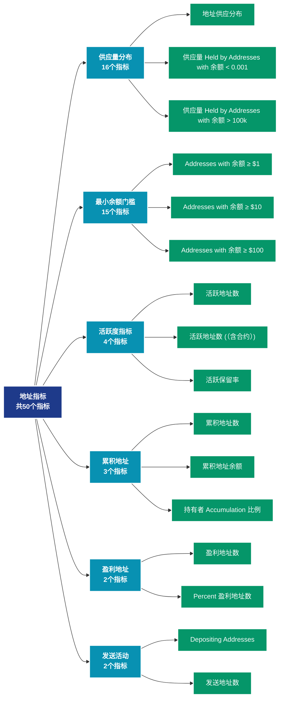

# 地址指标 (addresses)

## 📝 类别描述

分析网络中地址的行为、分布和特征，包括活跃地址、余额分布、盈亏状态等核心指标。

## 📊 指标概览

本类别共包含 **50** 个指标，涵盖以下主要子类别：

| 子类别 | 指标数量 | 主要功能 |
|--------|----------|----------|
| 供应量分布 | 16 | 供应量分布统计 |
| 最小余额门槛 | 15 | 专门数据分析 |
| 活跃度指标 | 4 | 网络活跃度和用户参与 |
| 累积地址 | 3 | 累积行为追踪 |
| 盈利地址 | 2 | 盈利状态分析 |
| 发送活动 | 2 | 专门数据分析 |
| 持有者分析 | 2 | 专门数据分析 |
| 接收活动 | 2 | 专门数据分析 |
| 亏损地址 | 1 | 亏损状态评估 |
| 非零地址 | 1 | 专门数据分析 |

## 🎨 指标体系结构图



## 📂 详细指标说明

### 📊 供应量分布（16个指标）

本子类别包含以下详细指标：

#### 1. 地址供应分布

- **指标代码**: `supply_distribution_relative`
- **API路径**: `/v1/metrics/addresses/supply_distribution_relative`
- **英文名称**: Address Supply Distribution

**英文原文：**
The relative distribution of the circulating supply held by addresses with specific balance bands.

**中文解释：**
展示不同余额区间的供应量分布情况。例如：持有0.001-0.01 BTC、0.01-0.1 BTC、0.1-1 BTC等不同规模的地址群体各持有多少比例的总供应量。这个指标帮助分析：1）财富集中度（基尼系数）；2）不同规模投资者的相对影响力；3）市场结构的演变。供应分布的变化可以揭示资金从散户到机构（或相反）的流动。

**使用示例**：
```python
# 获取地址供应分布数据
df = client.get_metric(
    "/v1/metrics/addresses/supply_distribution_relative",
    asset="BTC",
    resolution="24h"
)
```

---

#### 2. 供应量 Held by Addresses with 余额 < 0.001

- **指标代码**: `supply_balance_less_0001`
- **API路径**: `/v1/metrics/addresses/supply_balance_less_0001`
- **英文名称**: Supply Held by Addresses with Balance < 0.001

**英文原文：**
The total circulating supply held by addresses with balance lower than 0.001 coins.

**中文解释：**
分析地址余额的各个方面，包括余额分布、余额变化、余额集中度等。余额分析揭示了网络的财富结构和演变趋势，是理解市场力量对比的关键。

**使用示例**：
```python
# 获取供应量 Held by Addresses with 余额 < 0.001数据
df = client.get_metric(
    "/v1/metrics/addresses/supply_balance_less_0001",
    asset="BTC",
    resolution="24h"
)
```

---

#### 3. 供应量 Held by Addresses with 余额 > 100k

- **指标代码**: `supply_balance_more_100k`
- **API路径**: `/v1/metrics/addresses/supply_balance_more_100k`
- **英文名称**: Supply Held by Addresses with Balance > 100k

**英文原文：**
The total circulating supply held by addresses with balance of at least 100,000 coins.

**中文解释：**
分析地址余额的各个方面，包括余额分布、余额变化、余额集中度等。余额分析揭示了网络的财富结构和演变趋势，是理解市场力量对比的关键。

**使用示例**：
```python
# 获取供应量 Held by Addresses with 余额 > 100k数据
df = client.get_metric(
    "/v1/metrics/addresses/supply_balance_more_100k",
    asset="BTC",
    resolution="24h"
)
```

---

#### 4. 供应量 Held by Addresses with 余额 0.001 - 0.01

- **指标代码**: `supply_balance_0001_001`
- **API路径**: `/v1/metrics/addresses/supply_balance_0001_001`
- **英文名称**: Supply Held by Addresses with Balance 0.001 - 0.01

**英文原文：**
The total circulating supply held by addresses with balance between 0.001 and 0.01 coins.

**中文解释：**
分析地址余额的各个方面，包括余额分布、余额变化、余额集中度等。余额分析揭示了网络的财富结构和演变趋势，是理解市场力量对比的关键。

**使用示例**：
```python
# 获取供应量 Held by Addresses with 余额 0.001 - 0.01数据
df = client.get_metric(
    "/v1/metrics/addresses/supply_balance_0001_001",
    asset="BTC",
    resolution="24h"
)
```

---

#### 5. 供应量 Held by Addresses with 余额 0.01 - 0.1

- **指标代码**: `supply_balance_001_01`
- **API路径**: `/v1/metrics/addresses/supply_balance_001_01`
- **英文名称**: Supply Held by Addresses with Balance 0.01 - 0.1

**英文原文：**
The total circulating supply held by addresses with balance between 0.01 and 0.1 coins.

**中文解释：**
分析地址余额的各个方面，包括余额分布、余额变化、余额集中度等。余额分析揭示了网络的财富结构和演变趋势，是理解市场力量对比的关键。

**使用示例**：
```python
# 获取供应量 Held by Addresses with 余额 0.01 - 0.1数据
df = client.get_metric(
    "/v1/metrics/addresses/supply_balance_001_01",
    asset="BTC",
    resolution="24h"
)
```

---

#### 6. 供应量 Held by Addresses with 余额 0.1 - 1

- **指标代码**: `supply_balance_01_1`
- **API路径**: `/v1/metrics/addresses/supply_balance_01_1`
- **英文名称**: Supply Held by Addresses with Balance 0.1 - 1

**英文原文：**
The total circulating supply held by addresses with balance between 0.1 and 1 coins.

**中文解释：**
分析地址余额的各个方面，包括余额分布、余额变化、余额集中度等。余额分析揭示了网络的财富结构和演变趋势，是理解市场力量对比的关键。

**使用示例**：
```python
# 获取供应量 Held by Addresses with 余额 0.1 - 1数据
df = client.get_metric(
    "/v1/metrics/addresses/supply_balance_01_1",
    asset="BTC",
    resolution="24h"
)
```

---

#### 7. 供应量 Held by Addresses with 余额 1 - 10

- **指标代码**: `supply_balance_1_10`
- **API路径**: `/v1/metrics/addresses/supply_balance_1_10`
- **英文名称**: Supply Held by Addresses with Balance 1 - 10

**英文原文：**
The total circulating supply held by addresses with balance between 1 and 10 coins.

**中文解释：**
分析地址余额的各个方面，包括余额分布、余额变化、余额集中度等。余额分析揭示了网络的财富结构和演变趋势，是理解市场力量对比的关键。

**使用示例**：
```python
# 获取供应量 Held by Addresses with 余额 1 - 10数据
df = client.get_metric(
    "/v1/metrics/addresses/supply_balance_1_10",
    asset="BTC",
    resolution="24h"
)
```

---

#### 8. 供应量 Held by Addresses with 余额 10 - 100

- **指标代码**: `supply_balance_10_100`
- **API路径**: `/v1/metrics/addresses/supply_balance_10_100`
- **英文名称**: Supply Held by Addresses with Balance 10 - 100

**英文原文：**
The total circulating supply held by addresses with balance between 10 and 100 coins.

**中文解释：**
分析地址余额的各个方面，包括余额分布、余额变化、余额集中度等。余额分析揭示了网络的财富结构和演变趋势，是理解市场力量对比的关键。

**使用示例**：
```python
# 获取供应量 Held by Addresses with 余额 10 - 100数据
df = client.get_metric(
    "/v1/metrics/addresses/supply_balance_10_100",
    asset="BTC",
    resolution="24h"
)
```

---

#### 9. 供应量 Held by Addresses with 余额 100 - 1k

- **指标代码**: `supply_balance_100_1k`
- **API路径**: `/v1/metrics/addresses/supply_balance_100_1k`
- **英文名称**: Supply Held by Addresses with Balance 100 - 1k

**英文原文：**
The total circulating supply held by addresses with balance between 100 and 1k coins.

**中文解释：**
分析地址余额的各个方面，包括余额分布、余额变化、余额集中度等。余额分析揭示了网络的财富结构和演变趋势，是理解市场力量对比的关键。

**使用示例**：
```python
# 获取供应量 Held by Addresses with 余额 100 - 1k数据
df = client.get_metric(
    "/v1/metrics/addresses/supply_balance_100_1k",
    asset="BTC",
    resolution="24h"
)
```

---

#### 10. 供应量 Held by Addresses with 余额 10k - 100k

- **指标代码**: `supply_balance_10k_100k`
- **API路径**: `/v1/metrics/addresses/supply_balance_10k_100k`
- **英文名称**: Supply Held by Addresses with Balance 10k - 100k

**英文原文：**
The total circulating supply held by addresses with balance between 10k and 100k coins.

**中文解释：**
分析地址余额的各个方面，包括余额分布、余额变化、余额集中度等。余额分析揭示了网络的财富结构和演变趋势，是理解市场力量对比的关键。

**使用示例**：
```python
# 获取供应量 Held by Addresses with 余额 10k - 100k数据
df = client.get_metric(
    "/v1/metrics/addresses/supply_balance_10k_100k",
    asset="BTC",
    resolution="24h"
)
```

---

#### 11. 供应量 Held by Addresses with 余额 1k - 10k

- **指标代码**: `supply_balance_1k_10k`
- **API路径**: `/v1/metrics/addresses/supply_balance_1k_10k`
- **英文名称**: Supply Held by Addresses with Balance 1k - 10k

**英文原文：**
The total circulating supply held by addresses with balance between 1k and 10k coins.

**中文解释：**
分析地址余额的各个方面，包括余额分布、余额变化、余额集中度等。余额分析揭示了网络的财富结构和演变趋势，是理解市场力量对比的关键。

**使用示例**：
```python
# 获取供应量 Held by Addresses with 余额 1k - 10k数据
df = client.get_metric(
    "/v1/metrics/addresses/supply_balance_1k_10k",
    asset="BTC",
    resolution="24h"
)
```

---

#### 12. 供应量 in Addresses Holding above 10000 ppm

- **指标代码**: `supply_balance_above_10000_ppm`
- **API路径**: `/v1/metrics/addresses/supply_balance_above_10000_ppm`
- **英文名称**: Supply in Addresses Holding above 10000 ppm

**英文原文：**
The total circulating supply held by addresses with balance above 10000 parts per million of the total supply.

**中文解释：**
分析地址余额的各个方面，包括余额分布、余额变化、余额集中度等。余额分析揭示了网络的财富结构和演变趋势，是理解市场力量对比的关键。

**使用示例**：
```python
# 获取供应量 in Addresses Holding above 10000 ppm数据
df = client.get_metric(
    "/v1/metrics/addresses/supply_balance_above_10000_ppm",
    asset="BTC",
    resolution="24h"
)
```

---

#### 13. 供应量 in Addresses Holding between 0.01 and 10 ppm

- **指标代码**: `supply_balance_01_10_ppm`
- **API路径**: `/v1/metrics/addresses/supply_balance_01_10_ppm`
- **英文名称**: Supply in Addresses Holding between 0.01 and 10 ppm

**英文原文：**
The total circulating supply held by addresses with balance between 0.01 and 10 parts per million of the total supply.

**中文解释：**
分析地址余额的各个方面，包括余额分布、余额变化、余额集中度等。余额分析揭示了网络的财富结构和演变趋势，是理解市场力量对比的关键。

**使用示例**：
```python
# 获取供应量 in Addresses Holding between 0.01 and 10 ppm数据
df = client.get_metric(
    "/v1/metrics/addresses/supply_balance_01_10_ppm",
    asset="BTC",
    resolution="24h"
)
```

---

#### 14. 供应量 in Addresses Holding between 10 and 1000 ppm

- **指标代码**: `supply_balance_10_1000_ppm`
- **API路径**: `/v1/metrics/addresses/supply_balance_10_1000_ppm`
- **英文名称**: Supply in Addresses Holding between 10 and 1000 ppm

**英文原文：**
The total circulating supply held by addresses with balance between 10 and 1000 parts per million of the total supply.

**中文解释：**
分析地址余额的各个方面，包括余额分布、余额变化、余额集中度等。余额分析揭示了网络的财富结构和演变趋势，是理解市场力量对比的关键。

**使用示例**：
```python
# 获取供应量 in Addresses Holding between 10 and 1000 ppm数据
df = client.get_metric(
    "/v1/metrics/addresses/supply_balance_10_1000_ppm",
    asset="BTC",
    resolution="24h"
)
```

---

#### 15. 供应量 in Addresses Holding between 1000 and 10000 ppm

- **指标代码**: `supply_balance_1000_10000_ppm`
- **API路径**: `/v1/metrics/addresses/supply_balance_1000_10000_ppm`
- **英文名称**: Supply in Addresses Holding between 1000 and 10000 ppm

**英文原文：**
The total circulating supply held by addresses with balance between 1000 and 10000 parts per million of the total supply.

**中文解释：**
分析地址余额的各个方面，包括余额分布、余额变化、余额集中度等。余额分析揭示了网络的财富结构和演变趋势，是理解市场力量对比的关键。

**使用示例**：
```python
# 获取供应量 in Addresses Holding between 1000 and 10000 ppm数据
df = client.get_metric(
    "/v1/metrics/addresses/supply_balance_1000_10000_ppm",
    asset="BTC",
    resolution="24h"
)
```

---

#### 16. 供应量 in Addresses Holding less than 0.01 ppm

- **指标代码**: `supply_balance_less_01_ppm`
- **API路径**: `/v1/metrics/addresses/supply_balance_less_01_ppm`
- **英文名称**: Supply in Addresses Holding less than 0.01 ppm

**英文原文：**
The total circulating supply held by addresses with balance less than 0.01 parts per million of the total supply.

**中文解释：**
分析地址余额的各个方面，包括余额分布、余额变化、余额集中度等。余额分析揭示了网络的财富结构和演变趋势，是理解市场力量对比的关键。

**使用示例**：
```python
# 获取供应量 in Addresses Holding less than 0.01 ppm数据
df = client.get_metric(
    "/v1/metrics/addresses/supply_balance_less_01_ppm",
    asset="BTC",
    resolution="24h"
)
```

---

### 📊 最小余额门槛（15个指标）

本子类别包含以下详细指标：

#### 1. Addresses with 余额 ≥ $1

- **指标代码**: `min_1_usd_count`
- **API路径**: `/v1/metrics/addresses/min_1_usd_count`
- **英文名称**: Addresses with Balance ≥ $1

**英文原文：**
The number of unique addresses holding at least a value of $1 USD.

**中文解释：**
分析Addresses with Balance ≥ $1相关的链上数据。这个指标通过追踪区块链上的实时数据，提供了传统金融分析无法获得的透明度和洞察力。链上数据的优势在于：1）数据真实可验证；2）实时更新无延迟；3）覆盖所有参与者。通过综合分析多个链上指标，投资者可以做出更明智的决策，研究人员可以深入理解市场机制。

**使用示例**：
```python
# 获取Addresses with 余额 ≥ $1数据
df = client.get_metric(
    "/v1/metrics/addresses/min_1_usd_count",
    asset="BTC",
    resolution="24h"
)
```

---

#### 2. Addresses with 余额 ≥ $10

- **指标代码**: `min_10_usd_count`
- **API路径**: `/v1/metrics/addresses/min_10_usd_count`
- **英文名称**: Addresses with Balance ≥ $10

**英文原文：**
The number of unique addresses holding at least a value of $10 USD.

**中文解释：**
分析Addresses with Balance ≥ $10相关的链上数据。这个指标通过追踪区块链上的实时数据，提供了传统金融分析无法获得的透明度和洞察力。链上数据的优势在于：1）数据真实可验证；2）实时更新无延迟；3）覆盖所有参与者。通过综合分析多个链上指标，投资者可以做出更明智的决策，研究人员可以深入理解市场机制。

**使用示例**：
```python
# 获取Addresses with 余额 ≥ $10数据
df = client.get_metric(
    "/v1/metrics/addresses/min_10_usd_count",
    asset="BTC",
    resolution="24h"
)
```

---

#### 3. Addresses with 余额 ≥ $100

- **指标代码**: `min_100_usd_count`
- **API路径**: `/v1/metrics/addresses/min_100_usd_count`
- **英文名称**: Addresses with Balance ≥ $100

**英文原文：**
The number of unique addresses holding at least a value of $100 USD.

**中文解释：**
分析Addresses with Balance ≥ $100相关的链上数据。这个指标通过追踪区块链上的实时数据，提供了传统金融分析无法获得的透明度和洞察力。链上数据的优势在于：1）数据真实可验证；2）实时更新无延迟；3）覆盖所有参与者。通过综合分析多个链上指标，投资者可以做出更明智的决策，研究人员可以深入理解市场机制。

**使用示例**：
```python
# 获取Addresses with 余额 ≥ $100数据
df = client.get_metric(
    "/v1/metrics/addresses/min_100_usd_count",
    asset="BTC",
    resolution="24h"
)
```

---

#### 4. Addresses with 余额 ≥ $100k

- **指标代码**: `min_100k_usd_count`
- **API路径**: `/v1/metrics/addresses/min_100k_usd_count`
- **英文名称**: Addresses with Balance ≥ $100k

**英文原文：**
The number of unique addresses holding at least a value of $100k USD.

**中文解释：**
分析Addresses with Balance ≥ $100k相关的链上数据。这个指标通过追踪区块链上的实时数据，提供了传统金融分析无法获得的透明度和洞察力。链上数据的优势在于：1）数据真实可验证；2）实时更新无延迟；3）覆盖所有参与者。通过综合分析多个链上指标，投资者可以做出更明智的决策，研究人员可以深入理解市场机制。

**使用示例**：
```python
# 获取Addresses with 余额 ≥ $100k数据
df = client.get_metric(
    "/v1/metrics/addresses/min_100k_usd_count",
    asset="BTC",
    resolution="24h"
)
```

---

#### 5. Addresses with 余额 ≥ $10k

- **指标代码**: `min_10k_usd_count`
- **API路径**: `/v1/metrics/addresses/min_10k_usd_count`
- **英文名称**: Addresses with Balance ≥ $10k

**英文原文：**
The number of unique addresses holding at least a value of $10k USD.

**中文解释：**
分析Addresses with Balance ≥ $10k相关的链上数据。这个指标通过追踪区块链上的实时数据，提供了传统金融分析无法获得的透明度和洞察力。链上数据的优势在于：1）数据真实可验证；2）实时更新无延迟；3）覆盖所有参与者。通过综合分析多个链上指标，投资者可以做出更明智的决策，研究人员可以深入理解市场机制。

**使用示例**：
```python
# 获取Addresses with 余额 ≥ $10k数据
df = client.get_metric(
    "/v1/metrics/addresses/min_10k_usd_count",
    asset="BTC",
    resolution="24h"
)
```

---

#### 6. Addresses with 余额 ≥ $1k

- **指标代码**: `min_1k_usd_count`
- **API路径**: `/v1/metrics/addresses/min_1k_usd_count`
- **英文名称**: Addresses with Balance ≥ $1k

**英文原文：**
The number of unique addresses holding at least a value of $1k USD.

**中文解释：**
分析Addresses with Balance ≥ $1k相关的链上数据。这个指标通过追踪区块链上的实时数据，提供了传统金融分析无法获得的透明度和洞察力。链上数据的优势在于：1）数据真实可验证；2）实时更新无延迟；3）覆盖所有参与者。通过综合分析多个链上指标，投资者可以做出更明智的决策，研究人员可以深入理解市场机制。

**使用示例**：
```python
# 获取Addresses with 余额 ≥ $1k数据
df = client.get_metric(
    "/v1/metrics/addresses/min_1k_usd_count",
    asset="BTC",
    resolution="24h"
)
```

---

#### 7. Addresses with 余额 ≥ $1M

- **指标代码**: `min_1m_usd_count`
- **API路径**: `/v1/metrics/addresses/min_1m_usd_count`
- **英文名称**: Addresses with Balance ≥ $1M

**英文原文：**
The number of unique addresses holding at least a value of $1M USD.

**中文解释：**
分析Addresses with Balance ≥ $1M相关的链上数据。这个指标通过追踪区块链上的实时数据，提供了传统金融分析无法获得的透明度和洞察力。链上数据的优势在于：1）数据真实可验证；2）实时更新无延迟；3）覆盖所有参与者。通过综合分析多个链上指标，投资者可以做出更明智的决策，研究人员可以深入理解市场机制。

**使用示例**：
```python
# 获取Addresses with 余额 ≥ $1M数据
df = client.get_metric(
    "/v1/metrics/addresses/min_1m_usd_count",
    asset="BTC",
    resolution="24h"
)
```

---

#### 8. Addresses with 余额 ≥ 0.01

- **指标代码**: `min_point_zero_1_count`
- **API路径**: `/v1/metrics/addresses/min_point_zero_1_count`
- **英文名称**: Addresses with Balance ≥ 0.01

**英文原文：**
The number of unique addresses holding at least 0.01 coins.

**中文解释：**
分析Addresses with Balance ≥ 0.01相关的链上数据。这个指标通过追踪区块链上的实时数据，提供了传统金融分析无法获得的透明度和洞察力。链上数据的优势在于：1）数据真实可验证；2）实时更新无延迟；3）覆盖所有参与者。通过综合分析多个链上指标，投资者可以做出更明智的决策，研究人员可以深入理解市场机制。

**使用示例**：
```python
# 获取Addresses with 余额 ≥ 0.01数据
df = client.get_metric(
    "/v1/metrics/addresses/min_point_zero_1_count",
    asset="BTC",
    resolution="24h"
)
```

---

#### 9. Addresses with 余额 ≥ 0.1

- **指标代码**: `min_point_1_count`
- **API路径**: `/v1/metrics/addresses/min_point_1_count`
- **英文名称**: Addresses with Balance ≥ 0.1

**英文原文：**
The number of unique addresses holding at least 0.1 coins.

**中文解释：**
分析Addresses with Balance ≥ 0.1相关的链上数据。这个指标通过追踪区块链上的实时数据，提供了传统金融分析无法获得的透明度和洞察力。链上数据的优势在于：1）数据真实可验证；2）实时更新无延迟；3）覆盖所有参与者。通过综合分析多个链上指标，投资者可以做出更明智的决策，研究人员可以深入理解市场机制。

**使用示例**：
```python
# 获取Addresses with 余额 ≥ 0.1数据
df = client.get_metric(
    "/v1/metrics/addresses/min_point_1_count",
    asset="BTC",
    resolution="24h"
)
```

---

#### 10. Addresses with 余额 ≥ 1

- **指标代码**: `min_1_count`
- **API路径**: `/v1/metrics/addresses/min_1_count`
- **英文名称**: Addresses with Balance ≥ 1

**英文原文：**
The number of unique addresses holding at least 1 coin.

**中文解释：**
分析Addresses with Balance ≥ 1相关的链上数据。这个指标通过追踪区块链上的实时数据，提供了传统金融分析无法获得的透明度和洞察力。链上数据的优势在于：1）数据真实可验证；2）实时更新无延迟；3）覆盖所有参与者。通过综合分析多个链上指标，投资者可以做出更明智的决策，研究人员可以深入理解市场机制。

**使用示例**：
```python
# 获取Addresses with 余额 ≥ 1数据
df = client.get_metric(
    "/v1/metrics/addresses/min_1_count",
    asset="BTC",
    resolution="24h"
)
```

---

#### 11. Addresses with 余额 ≥ 10

- **指标代码**: `min_10_count`
- **API路径**: `/v1/metrics/addresses/min_10_count`
- **英文名称**: Addresses with Balance ≥ 10

**英文原文：**
The number of unique addresses holding at least 10 coins.

**中文解释：**
分析Addresses with Balance ≥ 10相关的链上数据。这个指标通过追踪区块链上的实时数据，提供了传统金融分析无法获得的透明度和洞察力。链上数据的优势在于：1）数据真实可验证；2）实时更新无延迟；3）覆盖所有参与者。通过综合分析多个链上指标，投资者可以做出更明智的决策，研究人员可以深入理解市场机制。

**使用示例**：
```python
# 获取Addresses with 余额 ≥ 10数据
df = client.get_metric(
    "/v1/metrics/addresses/min_10_count",
    asset="BTC",
    resolution="24h"
)
```

---

#### 12. Addresses with 余额 ≥ 100

- **指标代码**: `min_100_count`
- **API路径**: `/v1/metrics/addresses/min_100_count`
- **英文名称**: Addresses with Balance ≥ 100

**英文原文：**
The number of unique addresses holding at least 100 coins.

**中文解释：**
分析Addresses with Balance ≥ 100相关的链上数据。这个指标通过追踪区块链上的实时数据，提供了传统金融分析无法获得的透明度和洞察力。链上数据的优势在于：1）数据真实可验证；2）实时更新无延迟；3）覆盖所有参与者。通过综合分析多个链上指标，投资者可以做出更明智的决策，研究人员可以深入理解市场机制。

**使用示例**：
```python
# 获取Addresses with 余额 ≥ 100数据
df = client.get_metric(
    "/v1/metrics/addresses/min_100_count",
    asset="BTC",
    resolution="24h"
)
```

---

#### 13. Addresses with 余额 ≥ 10k

- **指标代码**: `min_10k_count`
- **API路径**: `/v1/metrics/addresses/min_10k_count`
- **英文名称**: Addresses with Balance ≥ 10k

**英文原文：**
The number of unique addresses holding at least 10k coins.

**中文解释：**
分析Addresses with Balance ≥ 10k相关的链上数据。这个指标通过追踪区块链上的实时数据，提供了传统金融分析无法获得的透明度和洞察力。链上数据的优势在于：1）数据真实可验证；2）实时更新无延迟；3）覆盖所有参与者。通过综合分析多个链上指标，投资者可以做出更明智的决策，研究人员可以深入理解市场机制。

**使用示例**：
```python
# 获取Addresses with 余额 ≥ 10k数据
df = client.get_metric(
    "/v1/metrics/addresses/min_10k_count",
    asset="BTC",
    resolution="24h"
)
```

---

#### 14. Addresses with 余额 ≥ 1k

- **指标代码**: `min_1k_count`
- **API路径**: `/v1/metrics/addresses/min_1k_count`
- **英文名称**: Addresses with Balance ≥ 1k

**英文原文：**
The number of unique addresses holding at least 1k coins.

**中文解释：**
分析Addresses with Balance ≥ 1k相关的链上数据。这个指标通过追踪区块链上的实时数据，提供了传统金融分析无法获得的透明度和洞察力。链上数据的优势在于：1）数据真实可验证；2）实时更新无延迟；3）覆盖所有参与者。通过综合分析多个链上指标，投资者可以做出更明智的决策，研究人员可以深入理解市场机制。

**使用示例**：
```python
# 获取Addresses with 余额 ≥ 1k数据
df = client.get_metric(
    "/v1/metrics/addresses/min_1k_count",
    asset="BTC",
    resolution="24h"
)
```

---

#### 15. Addresses with 余额 ≥ 32 ETH

- **指标代码**: `min_32_count`
- **API路径**: `/v1/metrics/addresses/min_32_count`
- **英文名称**: Addresses with Balance ≥ 32 ETH

**英文原文：**
The number of unique addresses holding at least 32 ETH. This is the number of potential validators for ETH 2.0. Only Externally Owned Addresses (EOAs) are counted, contracts are excluded.

**中文解释：**
分析Addresses with Balance ≥ 32 ETH相关的链上数据。这个指标通过追踪区块链上的实时数据，提供了传统金融分析无法获得的透明度和洞察力。链上数据的优势在于：1）数据真实可验证；2）实时更新无延迟；3）覆盖所有参与者。通过综合分析多个链上指标，投资者可以做出更明智的决策，研究人员可以深入理解市场机制。

**使用示例**：
```python
# 获取Addresses with 余额 ≥ 32 ETH数据
df = client.get_metric(
    "/v1/metrics/addresses/min_32_count",
    asset="BTC",
    resolution="24h"
)
```

---

### 📊 活跃度指标（4个指标）

本子类别包含以下详细指标：

#### 1. 活跃地址数

- **指标代码**: `active_count`
- **API路径**: `/v1/metrics/addresses/active_count`
- **英文名称**: Active Addresses

**英文原文：**
The number of unique addresses that were active in the network either as a sender or receiver. Only addresses that were active in successful transactions are counted.

**中文解释：**
统计在特定时间段内（通常为24小时）参与发送或接收交易的独立地址数量。活跃地址数是衡量网络使用率和用户参与度的核心指标。高活跃地址数通常表示：1）网络被广泛使用；2）生态系统健康发展；3）用户对网络有实际需求。活跃地址的变化趋势可以帮助判断网络的成长阶段和市场周期。

**使用示例**：
```python
# 获取活跃地址数数据
df = client.get_metric(
    "/v1/metrics/addresses/active_count",
    asset="BTC",
    resolution="24h"
)
```

---

#### 2. 活跃地址数 (（含合约）)

- **指标代码**: `active_count_with_contracts`
- **API路径**: `/v1/metrics/addresses/active_count_with_contracts`
- **英文名称**: Active Addresses (with contracts)

**英文原文：**
The number of unique addresses that were active in the network either as a sender or receiver or called a smart contract. Only successful transactions are counted.

**中文解释：**
统计在特定时间段内（通常为24小时）参与发送或接收交易的独立地址数量。活跃地址数是衡量网络使用率和用户参与度的核心指标。高活跃地址数通常表示：1）网络被广泛使用；2）生态系统健康发展；3）用户对网络有实际需求。活跃地址的变化趋势可以帮助判断网络的成长阶段和市场周期。

**使用示例**：
```python
# 获取活跃地址数 (（含合约）)数据
df = client.get_metric(
    "/v1/metrics/addresses/active_count_with_contracts",
    asset="BTC",
    resolution="24h"
)
```

---

#### 3. 活跃保留率

- **指标代码**: `activity_retention_rate`
- **API路径**: `/v1/metrics/addresses/activity_retention_rate`
- **英文名称**: Activity Retention Rate

**英文原文：**
This metric measures the percentage of addresses that were active—through sending or receiving transactions—in the previous 30-day period and remained active in the current one. It reflects how consistently participants continue to engage with the asset over time.

For example, a 70% retention rate means that 7 out of 10 previously active addresses continued transacting in the following period.

Higher retention indicates sustained user participation and provides an indication of the asset’s utility. Assets with frequent, ongoing usage—such as stablecoins—often exhibit higher activity retention rates. Conversely, a drop in retention may reflect reduced on-chain interaction, though it doesn’t necessarily signal waning interest, as users may shift to holding rather than transacting.

Based on: Glassnode Studio Chart – Activity Retention

Further reading: Glassnode Insights – Understanding Retention

**中文解释：**
分析Activity Retention Rate相关的链上数据。这个指标通过追踪区块链上的实时数据，提供了传统金融分析无法获得的透明度和洞察力。链上数据的优势在于：1）数据真实可验证；2）实时更新无延迟；3）覆盖所有参与者。通过综合分析多个链上指标，投资者可以做出更明智的决策，研究人员可以深入理解市场机制。

**使用示例**：
```python
# 获取活跃保留率数据
df = client.get_metric(
    "/v1/metrics/addresses/activity_retention_rate",
    asset="BTC",
    resolution="24h"
)
```

---

#### 4. MoM Activity Retention

- **指标代码**: `activity_retention`
- **API路径**: `/v1/metrics/addresses/activity_retention`
- **英文名称**: MoM Activity Retention

**英文原文：**
This metric shows the number of addresses that interact with the asset, segmented into "retention cohorts". The cohorts are defined as follows:
 * &#x60;New&#x60;: Addresses that interacted with the asset for the first time during the last 30 days.
 * &#x60;Retained (Increase)&#x60;: Addresses that were active in both the previous and current 30d period, and increased their activity.
 * &#x60;Retained (Equal)&#x60;: Addresses that were active in both the previous and current 30d period, with the same activity.
 * &#x60;Retained (Decrease)&#x60;: Addresses that were active in both the previous and current 30d period, and reduced their activity.
 * &#x60;Resurrected&#x60;: Addresses that were active in the current, but inactive in the previous 30d period.
 * &#x60;Churned&#x60;: Addresses that were not active within the last 30 days, but were active in the previous 30d period.
 * &#x60;Dead&#x60; (API only): Addresses that were inactive in the current and previous 30d interval, but were active at some point before.

**中文解释：**
分析MoM Activity Retention相关的链上数据。这个指标通过追踪区块链上的实时数据，提供了传统金融分析无法获得的透明度和洞察力。链上数据的优势在于：1）数据真实可验证；2）实时更新无延迟；3）覆盖所有参与者。通过综合分析多个链上指标，投资者可以做出更明智的决策，研究人员可以深入理解市场机制。

**使用示例**：
```python
# 获取MoM Activity Retention数据
df = client.get_metric(
    "/v1/metrics/addresses/activity_retention",
    asset="BTC",
    resolution="24h"
)
```

---

### 📊 累积地址（3个指标）

本子类别包含以下详细指标：

#### 1. 累积地址数

- **指标代码**: `accumulation_count`
- **API路径**: `/v1/metrics/addresses/accumulation_count`
- **英文名称**: Accumulation Addresses

**英文原文：**
The number of unique accumulation addresses. Accumulation addresses are defined as addresses that have at least 2 incoming non-dust transfers and have never spent funds. Exchange addresses and addresses receiving from coinbase transactions (miner addresses) are discarded. To account for lost coins, addresses that were last active more than 7 years ago are omitted as well.

**中文解释：**
统计累积型地址的数量。累积地址定义为：1）至少有2次非粉尘转入；2）从未花费过资金；3）排除交易所地址；4）排除矿工地址；5）排除7年以上未活跃的地址（可能已丢失）。这类地址代表了长期看涨的投资者，他们的行为通常被视为强烈的看涨信号。

**使用示例**：
```python
# 获取累积地址数数据
df = client.get_metric(
    "/v1/metrics/addresses/accumulation_count",
    asset="BTC",
    resolution="24h"
)
```

---

#### 2. 累积地址余额

- **指标代码**: `accumulation_balance`
- **API路径**: `/v1/metrics/addresses/accumulation_balance`
- **英文名称**: Accumulation Balance

**英文原文：**
The total amount of funds held in accumulation addresses. Accumulation addresses are defined as addresses that have at least 2 incoming non-dust transfers and have never spent funds. Exchange addresses and addresses receiving from coinbase transactions (miner addresses) are discarded. To account for lost coins, addresses that were last active more than 7 years ago are omitted as well.

**中文解释：**
计算所有累积地址持有的总资金量。这个指标反映了长期投资者的总体持仓规模。累积余额的增长表明：1）市场信心增强；2）长期投资者在建仓；3）可能接近市场底部。相反，累积余额下降可能预示市场顶部。

**使用示例**：
```python
# 获取累积地址余额数据
df = client.get_metric(
    "/v1/metrics/addresses/accumulation_balance",
    asset="BTC",
    resolution="24h"
)
```

---

#### 3. 持有者 Accumulation 比例

- **指标代码**: `holder_accumulation_ratio`
- **API路径**: `/v1/metrics/addresses/holder_accumulation_ratio`
- **英文名称**: Holder Accumulation Ratio

**英文原文：**
This metric shows the proportion of active holders who are increasing their positions versus those decreasing them, focusing exclusively on holders who changed their balance. It’s calculated by dividing the number of holders who increased their balance by the total number of holders who changed their balance in either direction.

Ratios above 50 ratio means that among holders who adjusted their position, 3 out of 4 chose to accumulate more.

It highlights whether the active holder base is expanding or contracting, and can serve as a proxy for sentiment—where higher ratios may suggest bullish momentum, and lower ratios may indicate distribution or profit-taking.

Based on: Glassnode Studio Chart – Holder Retention

Further reading: Glassnode Insights – Understanding Retention

**中文解释：**
全面追踪累积行为的各个方面。累积是市场底部形成的重要特征，通过监测累积地址的数量、余额、分布等多个维度，可以识别聪明钱的动向，预判市场转折点。

**使用示例**：
```python
# 获取持有者 Accumulation 比例数据
df = client.get_metric(
    "/v1/metrics/addresses/holder_accumulation_ratio",
    asset="BTC",
    resolution="24h"
)
```

---

### 📊 盈利地址（2个指标）

本子类别包含以下详细指标：

#### 1. 盈利地址数

- **指标代码**: `profit_count`
- **API路径**: `/v1/metrics/addresses/profit_count`
- **英文名称**: Addresses in Profit

**英文原文：**
The number of unique addresses whose funds have an average buy price that is lower than the current price. "Buy price" is here defined as the price at the time coins were transferred into an address.

**中文解释：**
统计当前持币成本低于市场价格的地址数量。买入价格通过币最后一次移动时的价格确定。盈利地址比例高表明：1）市场情绪乐观；2）可能存在获利回吐压力；3）牛市特征明显。当盈利地址比例极高（>95%）时，往往预示短期顶部。

**使用示例**：
```python
# 获取盈利地址数数据
df = client.get_metric(
    "/v1/metrics/addresses/profit_count",
    asset="BTC",
    resolution="24h"
)
```

---

#### 2. Percent 盈利地址数

- **指标代码**: `profit_relative`
- **API路径**: `/v1/metrics/addresses/profit_relative`
- **英文名称**: Percent Addresses in Profit

**英文原文：**
The percentage of unique addresses whose funds have an average buy price that is lower than the current price. "Buy price" is here defined as the price at the time coins were transferred into an address.

**中文解释：**
计算盈利地址占所有持币地址的百分比。这是一个标准化的指标，便于不同时期和不同资产之间的比较。历史数据显示，当该比例低于50%时，通常接近市场底部；高于90%时，需要警惕回调风险。

**使用示例**：
```python
# 获取Percent 盈利地址数数据
df = client.get_metric(
    "/v1/metrics/addresses/profit_relative",
    asset="BTC",
    resolution="24h"
)
```

---

### 📊 发送活动（2个指标）

本子类别包含以下详细指标：

#### 1. Depositing Addresses

- **指标代码**: `sending_to_exchanges_count`
- **API路径**: `/v1/metrics/addresses/sending_to_exchanges_count`
- **英文名称**: Depositing Addresses

**英文原文：**
The number of unique addresses that appeared as a sender in a transaction sending funds to exchanges.

**中文解释：**
全面分析交易所相关的链上活动。交易所是连接链上和链下市场的关键节点，其资金流动直接影响市场供需。通过监测交易所数据，可以预判短期价格压力和市场情绪变化。

**使用示例**：
```python
# 获取Depositing Addresses数据
df = client.get_metric(
    "/v1/metrics/addresses/sending_to_exchanges_count",
    asset="BTC",
    resolution="24h"
)
```

---

#### 2. 发送地址数

- **指标代码**: `sending_count`
- **API路径**: `/v1/metrics/addresses/sending_count`
- **英文名称**: Sending Addresses

**英文原文：**
The number of unique addresses that were active as a sender of funds. Only addresses that were active as a sender in successful non-zero transfers are counted.

**中文解释：**
分析Sending Addresses相关的链上数据。这个指标通过追踪区块链上的实时数据，提供了传统金融分析无法获得的透明度和洞察力。链上数据的优势在于：1）数据真实可验证；2）实时更新无延迟；3）覆盖所有参与者。通过综合分析多个链上指标，投资者可以做出更明智的决策，研究人员可以深入理解市场机制。

**使用示例**：
```python
# 获取发送地址数数据
df = client.get_metric(
    "/v1/metrics/addresses/sending_count",
    asset="BTC",
    resolution="24h"
)
```

---

### 📊 持有者分析（2个指标）

本子类别包含以下详细指标：

#### 1. 持有者 Retention 比率

- **指标代码**: `holder_retention_rate`
- **API路径**: `/v1/metrics/addresses/holder_retention_rate`
- **英文名称**: Holder Retention Rate

**英文原文：**
This metric tracks the percentage of addresses that maintain a balance of the asset across consecutive 30-day periods. It&#x27;s calculated by dividing the number of addresses currently holding a balance (including new holders, resurrected holders, and all retained holder categories) by the total number of addresses that held a balance at any point during the observation period.

Higher retention rates suggest strong holder confidence and long-term commitment. A retention rate of 80% means 8 out of 10 addresses that had a balance continue to hold the asset, while lower rates may indicate selling pressure or loss of confidence.

Based on: Glassnode Studio Chart – Holder Retention

Further reading: Glassnode Insights – Understanding Retention

**中文解释：**
分析Holder Retention Rate相关的链上数据。这个指标通过追踪区块链上的实时数据，提供了传统金融分析无法获得的透明度和洞察力。链上数据的优势在于：1）数据真实可验证；2）实时更新无延迟；3）覆盖所有参与者。通过综合分析多个链上指标，投资者可以做出更明智的决策，研究人员可以深入理解市场机制。

**使用示例**：
```python
# 获取持有者 Retention 比率数据
df = client.get_metric(
    "/v1/metrics/addresses/holder_retention_rate",
    asset="BTC",
    resolution="24h"
)
```

---

#### 2. MoM 持有者 Retention

- **指标代码**: `holder_retention`
- **API路径**: `/v1/metrics/addresses/holder_retention`
- **英文名称**: MoM Holder Retention

**英文原文：**
This metric shows the number of addresses that hold the selected asset or held it previously, segmented into "retention cohorts". The cohorts are defined as follows:
 * &#x60;New&#x60;: Addresses that interacted with the asset for the first time during the last 30 days and have a non-zero balance.
 * &#x60;Retained (Increase)&#x60;: Addresses that had a non-zero balance 30d ago and have increased their holdings since then.
 * &#x60;Retained (Equal)&#x60;: Addresses that have the same non-zero balance now compared to 30 days ago.
 * &#x60;Retained (Decrease)&#x60;: Addresses that had a non-zero balance 30d ago and have reduced their holdings since then, but still have a balance greater than zero.
 * &#x60;Resurrected&#x60;: Addresses with a non-zero balance that didn&#x27;t hold any supply 30 days ago. Note that addresses that appeared for the first time during the last 30 days are not included here and instead captured in the cohort &#x60;New&#x60;.
 * &#x60;Churned&#x60;: Addresses that no longer hold any supply, but had a non-zero balance 30 days ago.
 * &#x60;Resurrected & Churned&#x60;: Addresses that neither hold any supply nor held supply 30d ago, but had a non-zero balance in between. Note that addresses that appeared for the first time during the last 30 days are not included here and instead captured in the cohort &#x60;New & Churned&#x60;.
 * &#x60;New & Churned&#x60;: Addresses that interacted with the asset for the first time during the last 30 days, but no longer hold any supply.
 * &#x60;Dead&#x60; (API only): Addresses that didn&#x27;t hold any supply during the last 30 days, but had a non-zero balance at some point before.

Addresses with a balance below a certain dust threshold are not considered as holders.

**中文解释：**
分析MoM Holder Retention相关的链上数据。这个指标通过追踪区块链上的实时数据，提供了传统金融分析无法获得的透明度和洞察力。链上数据的优势在于：1）数据真实可验证；2）实时更新无延迟；3）覆盖所有参与者。通过综合分析多个链上指标，投资者可以做出更明智的决策，研究人员可以深入理解市场机制。

**使用示例**：
```python
# 获取MoM 持有者 Retention数据
df = client.get_metric(
    "/v1/metrics/addresses/holder_retention",
    asset="BTC",
    resolution="24h"
)
```

---

### 📊 接收活动（2个指标）

本子类别包含以下详细指标：

#### 1. 接收地址数

- **指标代码**: `receiving_count`
- **API路径**: `/v1/metrics/addresses/receiving_count`
- **英文名称**: Receiving Addresses

**英文原文：**
The number of unique addresses that were active as a receiver of funds. Only addresses that were active as a receiver in successful non-zero transfers are counted.

**中文解释：**
分析Receiving Addresses相关的链上数据。这个指标通过追踪区块链上的实时数据，提供了传统金融分析无法获得的透明度和洞察力。链上数据的优势在于：1）数据真实可验证；2）实时更新无延迟；3）覆盖所有参与者。通过综合分析多个链上指标，投资者可以做出更明智的决策，研究人员可以深入理解市场机制。

**使用示例**：
```python
# 获取接收地址数数据
df = client.get_metric(
    "/v1/metrics/addresses/receiving_count",
    asset="BTC",
    resolution="24h"
)
```

---

#### 2. Withdrawing Addresses

- **指标代码**: `receiving_from_exchanges_count`
- **API路径**: `/v1/metrics/addresses/receiving_from_exchanges_count`
- **英文名称**: Withdrawing Addresses

**英文原文：**
The number of unique addresses that appeared as a receiver in a transaction receiving funds from an exchanges.

**中文解释：**
全面分析交易所相关的链上活动。交易所是连接链上和链下市场的关键节点，其资金流动直接影响市场供需。通过监测交易所数据，可以预判短期价格压力和市场情绪变化。

**使用示例**：
```python
# 获取Withdrawing Addresses数据
df = client.get_metric(
    "/v1/metrics/addresses/receiving_from_exchanges_count",
    asset="BTC",
    resolution="24h"
)
```

---

### 📊 亏损地址（1个指标）

本子类别包含以下详细指标：

#### 1. 亏损地址数

- **指标代码**: `loss_count`
- **API路径**: `/v1/metrics/addresses/loss_count`
- **英文名称**: Addresses in Loss

**英文原文：**
The number of unique addresses whose funds have an average buy price that is higher than the current price. "Buy price" is here defined as the price at the time coins were transferred into an address.

**中文解释：**
统计当前持币成本高于市场价格的地址数量。大量亏损地址通常出现在：1）熊市底部；2）剧烈回调后；3）投降性抛售阶段。历史经验表明，亏损地址比例极高时，往往是绝佳的买入时机。

**使用示例**：
```python
# 获取亏损地址数数据
df = client.get_metric(
    "/v1/metrics/addresses/loss_count",
    asset="BTC",
    resolution="24h"
)
```

---

### 📊 非零地址（1个指标）

本子类别包含以下详细指标：

#### 1. Addresses with Non-Zero 余额

- **指标代码**: `non_zero_count`
- **API路径**: `/v1/metrics/addresses/non_zero_count`
- **英文名称**: Addresses with Non-Zero Balance

**英文原文：**
The number of unique addresses holding a positive (non-zero) amount of coins. Note that ERC-20 Assets 1h resolution is being updated every 24 hours.

**中文解释：**
统计当前余额大于0的所有地址数量。这是衡量实际持币用户规模的关键指标。非零地址的持续增长表明：1）更多用户选择持有而非卖出；2）网络的价值存储功能得到认可；3）长期采用趋势向好。这个指标过滤了所有已清空的地址，反映真实的用户基础。

**使用示例**：
```python
# 获取Addresses with Non-Zero 余额数据
df = client.get_metric(
    "/v1/metrics/addresses/non_zero_count",
    asset="BTC",
    resolution="24h"
)
```

---

### 📊 新增地址（1个指标）

本子类别包含以下详细指标：

#### 1. 新增地址数

- **指标代码**: `new_non_zero_count`
- **API路径**: `/v1/metrics/addresses/new_non_zero_count`
- **英文名称**: New Addresses

**英文原文：**
The number of unique addresses that appeared for the first time in a transaction of the native coin in the network.

**中文解释：**
统计首次在区块链上出现的新地址数量。新地址激增通常发生在：1）牛市早期（新用户涌入）；2）重大利好消息后；3）新应用或功能推出时。新地址增长是网络扩张的先行指标，但需要结合活跃度来判断是真实增长还是虚假繁荣。

**使用示例**：
```python
# 获取新增地址数数据
df = client.get_metric(
    "/v1/metrics/addresses/new_non_zero_count",
    asset="BTC",
    resolution="24h"
)
```

---

### 📊 数量统计（1个指标）

本子类别包含以下详细指标：

#### 1. 总计 Addresses

- **指标代码**: `count`
- **API路径**: `/v1/metrics/addresses/count`
- **英文名称**: Total Addresses

**英文原文：**
The total number of unique addresses that ever appeared in a transaction of the native coin in the network.

**中文解释：**
分析Total Addresses相关的链上数据。这个指标通过追踪区块链上的实时数据，提供了传统金融分析无法获得的透明度和洞察力。链上数据的优势在于：1）数据真实可验证；2）实时更新无延迟；3）覆盖所有参与者。通过综合分析多个链上指标，投资者可以做出更明智的决策，研究人员可以深入理解市场机制。

**使用示例**：
```python
# 获取总计 Addresses数据
df = client.get_metric(
    "/v1/metrics/addresses/count",
    asset="BTC",
    resolution="24h"
)
```

---

## 📊 完整指标列表

| # | 指标名称 | 指标代码 | API路径 |
|---|----------|----------|---------|
| 1 | 累积地址数 | `accumulation_count` | `/v1/metrics/addresses/accumulation_count` |
| 2 | 累积地址余额 | `accumulation_balance` | `/v1/metrics/addresses/accumulation_balance` |
| 3 | 活跃地址数 | `active_count` | `/v1/metrics/addresses/active_count` |
| 4 | 活跃地址数 (（含合约）) | `active_count_with_contracts` | `/v1/metrics/addresses/active_count_with_contracts` |
| 5 | 活跃保留率 | `activity_retention_rate` | `/v1/metrics/addresses/activity_retention_rate` |
| 6 | 地址供应分布 | `supply_distribution_relative` | `/v1/metrics/addresses/supply_distribution_relative` |
| 7 | 亏损地址数 | `loss_count` | `/v1/metrics/addresses/loss_count` |
| 8 | 盈利地址数 | `profit_count` | `/v1/metrics/addresses/profit_count` |
| 9 | Addresses with 余额 ≥ $1 | `min_1_usd_count` | `/v1/metrics/addresses/min_1_usd_count` |
| 10 | Addresses with 余额 ≥ $10 | `min_10_usd_count` | `/v1/metrics/addresses/min_10_usd_count` |
| 11 | Addresses with 余额 ≥ $100 | `min_100_usd_count` | `/v1/metrics/addresses/min_100_usd_count` |
| 12 | Addresses with 余额 ≥ $100k | `min_100k_usd_count` | `/v1/metrics/addresses/min_100k_usd_count` |
| 13 | Addresses with 余额 ≥ $10k | `min_10k_usd_count` | `/v1/metrics/addresses/min_10k_usd_count` |
| 14 | Addresses with 余额 ≥ $1k | `min_1k_usd_count` | `/v1/metrics/addresses/min_1k_usd_count` |
| 15 | Addresses with 余额 ≥ $1M | `min_1m_usd_count` | `/v1/metrics/addresses/min_1m_usd_count` |
| 16 | Addresses with 余额 ≥ 0.01 | `min_point_zero_1_count` | `/v1/metrics/addresses/min_point_zero_1_count` |
| 17 | Addresses with 余额 ≥ 0.1 | `min_point_1_count` | `/v1/metrics/addresses/min_point_1_count` |
| 18 | Addresses with 余额 ≥ 1 | `min_1_count` | `/v1/metrics/addresses/min_1_count` |
| 19 | Addresses with 余额 ≥ 10 | `min_10_count` | `/v1/metrics/addresses/min_10_count` |
| 20 | Addresses with 余额 ≥ 100 | `min_100_count` | `/v1/metrics/addresses/min_100_count` |
| 21 | Addresses with 余额 ≥ 10k | `min_10k_count` | `/v1/metrics/addresses/min_10k_count` |
| 22 | Addresses with 余额 ≥ 1k | `min_1k_count` | `/v1/metrics/addresses/min_1k_count` |
| 23 | Addresses with 余额 ≥ 32 ETH | `min_32_count` | `/v1/metrics/addresses/min_32_count` |
| 24 | Addresses with Non-Zero 余额 | `non_zero_count` | `/v1/metrics/addresses/non_zero_count` |
| 25 | Depositing Addresses | `sending_to_exchanges_count` | `/v1/metrics/addresses/sending_to_exchanges_count` |
| 26 | 持有者 Accumulation 比例 | `holder_accumulation_ratio` | `/v1/metrics/addresses/holder_accumulation_ratio` |
| 27 | 持有者 Retention 比率 | `holder_retention_rate` | `/v1/metrics/addresses/holder_retention_rate` |
| 28 | MoM Activity Retention | `activity_retention` | `/v1/metrics/addresses/activity_retention` |
| 29 | MoM 持有者 Retention | `holder_retention` | `/v1/metrics/addresses/holder_retention` |
| 30 | 新增地址数 | `new_non_zero_count` | `/v1/metrics/addresses/new_non_zero_count` |
| 31 | Percent 盈利地址数 | `profit_relative` | `/v1/metrics/addresses/profit_relative` |
| 32 | 接收地址数 | `receiving_count` | `/v1/metrics/addresses/receiving_count` |
| 33 | 发送地址数 | `sending_count` | `/v1/metrics/addresses/sending_count` |
| 34 | 供应量 Held by Addresses with 余额 < 0.001 | `supply_balance_less_0001` | `/v1/metrics/addresses/supply_balance_less_0001` |
| 35 | 供应量 Held by Addresses with 余额 > 100k | `supply_balance_more_100k` | `/v1/metrics/addresses/supply_balance_more_100k` |
| 36 | 供应量 Held by Addresses with 余额 0.001 - 0.01 | `supply_balance_0001_001` | `/v1/metrics/addresses/supply_balance_0001_001` |
| 37 | 供应量 Held by Addresses with 余额 0.01 - 0.1 | `supply_balance_001_01` | `/v1/metrics/addresses/supply_balance_001_01` |
| 38 | 供应量 Held by Addresses with 余额 0.1 - 1 | `supply_balance_01_1` | `/v1/metrics/addresses/supply_balance_01_1` |
| 39 | 供应量 Held by Addresses with 余额 1 - 10 | `supply_balance_1_10` | `/v1/metrics/addresses/supply_balance_1_10` |
| 40 | 供应量 Held by Addresses with 余额 10 - 100 | `supply_balance_10_100` | `/v1/metrics/addresses/supply_balance_10_100` |
| 41 | 供应量 Held by Addresses with 余额 100 - 1k | `supply_balance_100_1k` | `/v1/metrics/addresses/supply_balance_100_1k` |
| 42 | 供应量 Held by Addresses with 余额 10k - 100k | `supply_balance_10k_100k` | `/v1/metrics/addresses/supply_balance_10k_100k` |
| 43 | 供应量 Held by Addresses with 余额 1k - 10k | `supply_balance_1k_10k` | `/v1/metrics/addresses/supply_balance_1k_10k` |
| 44 | 供应量 in Addresses Holding above 10000 ppm | `supply_balance_above_10000_ppm` | `/v1/metrics/addresses/supply_balance_above_10000_ppm` |
| 45 | 供应量 in Addresses Holding between 0.01 and 10 ppm | `supply_balance_01_10_ppm` | `/v1/metrics/addresses/supply_balance_01_10_ppm` |
| 46 | 供应量 in Addresses Holding between 10 and 1000 ppm | `supply_balance_10_1000_ppm` | `/v1/metrics/addresses/supply_balance_10_1000_ppm` |
| 47 | 供应量 in Addresses Holding between 1000 and 10000 ppm | `supply_balance_1000_10000_ppm` | `/v1/metrics/addresses/supply_balance_1000_10000_ppm` |
| 48 | 供应量 in Addresses Holding less than 0.01 ppm | `supply_balance_less_01_ppm` | `/v1/metrics/addresses/supply_balance_less_01_ppm` |
| 49 | 总计 Addresses | `count` | `/v1/metrics/addresses/count` |
| 50 | Withdrawing Addresses | `receiving_from_exchanges_count` | `/v1/metrics/addresses/receiving_from_exchanges_count` |

## 💻 代码示例

### Python SDK 使用示例

```python
from glassnode import GlassnodeClient

# 初始化客户端
client = GlassnodeClient(api_key="YOUR_API_KEY")

# 获取单个指标
data = client.get(
    "/v1/metrics/addresses/active_count",
    asset="BTC",
    resolution="24h",
    since="2024-01-01"
)

# 批量获取多个指标
metrics = [
    "active_count",
    "new",
    "non_zero_count"
]

results = {}
for metric in metrics:
    results[metric] = client.get(
        f"/v1/metrics/addresses/{metric}",
        asset="BTC"
    )
```

## 📚 参考资源

- [Glassnode官方文档](https://docs.glassnode.com)
- [Glassnode Studio](https://studio.glassnode.com)
- [API访问说明](https://docs.glassnode.com/basic-api/api)

---

*最后更新：2024年*
