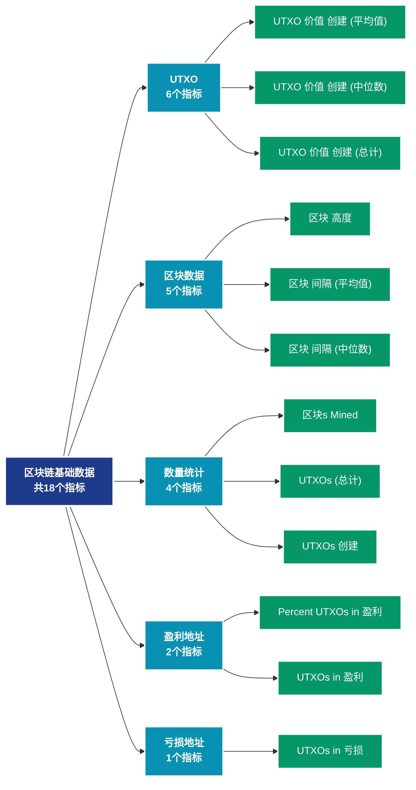

# 区块链基础数据 (blockchain)

## 📝 类别描述

提供区块链的基础运行数据，包括区块信息、UTXO集、网络状态等底层指标。

## 📊 指标概览

本类别共包含 **18** 个指标，涵盖以下主要子类别：

| 子类别 | 指标数量 | 主要功能 |
|--------|----------|----------|
| UTXO | 6 | 专门数据分析 |
| 区块数据 | 5 | 专门数据分析 |
| 数量统计 | 4 | 专门数据分析 |
| 盈利地址 | 2 | 盈利状态分析 |
| 亏损地址 | 1 | 亏损状态评估 |

## 🎨 指标体系结构图



## 📂 详细指标说明

### 📊 UTXO（6个指标）

本子类别包含以下详细指标：

#### 1. UTXO 价值 创建 (平均值)

- **指标代码**: `utxo_created_value_mean`
- **API路径**: `/v1/metrics/blockchain/utxo_created_value_mean`
- **英文名称**: UTXO Value Created (Mean)

**英文原文：**
The mean amount of coins in newly created UTXOs.

**中文解释：**
统计新创建UTXO的价值。当交易产生新的输出时，就创建了新的UTXO。高创建价值表明：1）大额交易活跃；2）资金正在分散；3）可能的分发或空投活动。UTXO创建模式可以揭示资金的流动方向和市场参与者的意图。

**使用示例**：
```python
# 获取UTXO 价值 创建 (平均值)数据
df = client.get_metric(
    "/v1/metrics/blockchain/utxo_created_value_mean",
    asset="BTC",
    resolution="24h"
)
```

---

#### 2. UTXO 价值 创建 (中位数)

- **指标代码**: `utxo_created_value_median`
- **API路径**: `/v1/metrics/blockchain/utxo_created_value_median`
- **英文名称**: UTXO Value Created (Median)

**英文原文：**
The median amount of coins in newly created UTXOs.

**中文解释：**
统计新创建UTXO的价值。当交易产生新的输出时，就创建了新的UTXO。高创建价值表明：1）大额交易活跃；2）资金正在分散；3）可能的分发或空投活动。UTXO创建模式可以揭示资金的流动方向和市场参与者的意图。

**使用示例**：
```python
# 获取UTXO 价值 创建 (中位数)数据
df = client.get_metric(
    "/v1/metrics/blockchain/utxo_created_value_median",
    asset="BTC",
    resolution="24h"
)
```

---

#### 3. UTXO 价值 创建 (总计)

- **指标代码**: `utxo_created_value_sum`
- **API路径**: `/v1/metrics/blockchain/utxo_created_value_sum`
- **英文名称**: UTXO Value Created (Total)

**英文原文：**
The total amount of coins in newly created UTXOs.

**中文解释：**
统计新创建UTXO的价值。当交易产生新的输出时，就创建了新的UTXO。高创建价值表明：1）大额交易活跃；2）资金正在分散；3）可能的分发或空投活动。UTXO创建模式可以揭示资金的流动方向和市场参与者的意图。

**使用示例**：
```python
# 获取UTXO 价值 创建 (总计)数据
df = client.get_metric(
    "/v1/metrics/blockchain/utxo_created_value_sum",
    asset="BTC",
    resolution="24h"
)
```

---

#### 4. UTXO 价值 花费 (平均值)

- **指标代码**: `utxo_spent_value_mean`
- **API路径**: `/v1/metrics/blockchain/utxo_spent_value_mean`
- **英文名称**: UTXO Value Spent (Mean)

**英文原文：**
The mean amount of coins in spent transaction outputs.

**中文解释：**
统计被花费UTXO的价值。UTXO被花费意味着之前的输出被用作新交易的输入。高花费价值可能因为：1）长期持有者开始移动资金；2）大额资金整合；3）交易所或机构的资金管理。老旧UTXO的花费特别值得关注，因为可能预示市场转折。

**使用示例**：
```python
# 获取UTXO 价值 花费 (平均值)数据
df = client.get_metric(
    "/v1/metrics/blockchain/utxo_spent_value_mean",
    asset="BTC",
    resolution="24h"
)
```

---

#### 5. UTXO 价值 花费 (中位数)

- **指标代码**: `utxo_spent_value_median`
- **API路径**: `/v1/metrics/blockchain/utxo_spent_value_median`
- **英文名称**: UTXO Value Spent (Median)

**英文原文：**
The median amount of coins in spent transaction outputs.

**中文解释：**
统计被花费UTXO的价值。UTXO被花费意味着之前的输出被用作新交易的输入。高花费价值可能因为：1）长期持有者开始移动资金；2）大额资金整合；3）交易所或机构的资金管理。老旧UTXO的花费特别值得关注，因为可能预示市场转折。

**使用示例**：
```python
# 获取UTXO 价值 花费 (中位数)数据
df = client.get_metric(
    "/v1/metrics/blockchain/utxo_spent_value_median",
    asset="BTC",
    resolution="24h"
)
```

---

#### 6. UTXO 价值 花费 (总计)

- **指标代码**: `utxo_spent_value_sum`
- **API路径**: `/v1/metrics/blockchain/utxo_spent_value_sum`
- **英文名称**: UTXO Value Spent (Total)

**英文原文：**
The total amount of coins in spent transaction outputs.

**中文解释：**
统计被花费UTXO的价值。UTXO被花费意味着之前的输出被用作新交易的输入。高花费价值可能因为：1）长期持有者开始移动资金；2）大额资金整合；3）交易所或机构的资金管理。老旧UTXO的花费特别值得关注，因为可能预示市场转折。

**使用示例**：
```python
# 获取UTXO 价值 花费 (总计)数据
df = client.get_metric(
    "/v1/metrics/blockchain/utxo_spent_value_sum",
    asset="BTC",
    resolution="24h"
)
```

---

### 📊 区块数据（5个指标）

本子类别包含以下详细指标：

#### 1. 区块 高度

- **指标代码**: `block_height`
- **API路径**: `/v1/metrics/blockchain/block_height`
- **英文名称**: Block Height

**英文原文：**
The block height, i.e. the total number of blocks ever created and included in the main blockchain.

**中文解释：**
分析Block Height相关的链上数据。这个指标通过追踪区块链上的实时数据，提供了传统金融分析无法获得的透明度和洞察力。链上数据的优势在于：1）数据真实可验证；2）实时更新无延迟；3）覆盖所有参与者。通过综合分析多个链上指标，投资者可以做出更明智的决策，研究人员可以深入理解市场机制。

**使用示例**：
```python
# 获取区块 高度数据
df = client.get_metric(
    "/v1/metrics/blockchain/block_height",
    asset="BTC",
    resolution="24h"
)
```

---

#### 2. 区块 间隔 (平均值)

- **指标代码**: `block_interval_mean`
- **API路径**: `/v1/metrics/blockchain/block_interval_mean`
- **英文名称**: Block Interval (Mean)

**英文原文：**
The mean time (in seconds) between mined blocks.

**中文解释：**
分析Block Interval (Mean)相关的链上数据。这个指标通过追踪区块链上的实时数据，提供了传统金融分析无法获得的透明度和洞察力。链上数据的优势在于：1）数据真实可验证；2）实时更新无延迟；3）覆盖所有参与者。通过综合分析多个链上指标，投资者可以做出更明智的决策，研究人员可以深入理解市场机制。

**使用示例**：
```python
# 获取区块 间隔 (平均值)数据
df = client.get_metric(
    "/v1/metrics/blockchain/block_interval_mean",
    asset="BTC",
    resolution="24h"
)
```

---

#### 3. 区块 间隔 (中位数)

- **指标代码**: `block_interval_median`
- **API路径**: `/v1/metrics/blockchain/block_interval_median`
- **英文名称**: Block Interval (Median)

**英文原文：**
The median time (in seconds) between mined blocks.

**中文解释：**
分析Block Interval (Median)相关的链上数据。这个指标通过追踪区块链上的实时数据，提供了传统金融分析无法获得的透明度和洞察力。链上数据的优势在于：1）数据真实可验证；2）实时更新无延迟；3）覆盖所有参与者。通过综合分析多个链上指标，投资者可以做出更明智的决策，研究人员可以深入理解市场机制。

**使用示例**：
```python
# 获取区块 间隔 (中位数)数据
df = client.get_metric(
    "/v1/metrics/blockchain/block_interval_median",
    asset="BTC",
    resolution="24h"
)
```

---

#### 4. 区块 大小 (平均值)

- **指标代码**: `block_size_mean`
- **API路径**: `/v1/metrics/blockchain/block_size_mean`
- **英文名称**: Block Size (Mean)

**英文原文：**
The mean size of all blocks created within the time period (in bytes).

**中文解释：**
分析Block Size (Mean)相关的链上数据。这个指标通过追踪区块链上的实时数据，提供了传统金融分析无法获得的透明度和洞察力。链上数据的优势在于：1）数据真实可验证；2）实时更新无延迟；3）覆盖所有参与者。通过综合分析多个链上指标，投资者可以做出更明智的决策，研究人员可以深入理解市场机制。

**使用示例**：
```python
# 获取区块 大小 (平均值)数据
df = client.get_metric(
    "/v1/metrics/blockchain/block_size_mean",
    asset="BTC",
    resolution="24h"
)
```

---

#### 5. 区块 大小 (总计)

- **指标代码**: `block_size_sum`
- **API路径**: `/v1/metrics/blockchain/block_size_sum`
- **英文名称**: Block Size (Total)

**英文原文：**
The total size of all blocks created within the time period (in bytes).

**中文解释：**
分析Block Size (Total)相关的链上数据。这个指标通过追踪区块链上的实时数据，提供了传统金融分析无法获得的透明度和洞察力。链上数据的优势在于：1）数据真实可验证；2）实时更新无延迟；3）覆盖所有参与者。通过综合分析多个链上指标，投资者可以做出更明智的决策，研究人员可以深入理解市场机制。

**使用示例**：
```python
# 获取区块 大小 (总计)数据
df = client.get_metric(
    "/v1/metrics/blockchain/block_size_sum",
    asset="BTC",
    resolution="24h"
)
```

---

### 📊 数量统计（4个指标）

本子类别包含以下详细指标：

#### 1. 区块s Mined

- **指标代码**: `block_count`
- **API路径**: `/v1/metrics/blockchain/block_count`
- **英文名称**: Blocks Mined

**英文原文：**
The number of blocks created and included in the main blockchain in that time period.

**中文解释：**
分析Blocks Mined相关的链上数据。这个指标通过追踪区块链上的实时数据，提供了传统金融分析无法获得的透明度和洞察力。链上数据的优势在于：1）数据真实可验证；2）实时更新无延迟；3）覆盖所有参与者。通过综合分析多个链上指标，投资者可以做出更明智的决策，研究人员可以深入理解市场机制。

**使用示例**：
```python
# 获取区块s Mined数据
df = client.get_metric(
    "/v1/metrics/blockchain/block_count",
    asset="BTC",
    resolution="24h"
)
```

---

#### 2. UTXOs (总计)

- **指标代码**: `utxo_count`
- **API路径**: `/v1/metrics/blockchain/utxo_count`
- **英文名称**: UTXOs (Total)

**英文原文：**
The total number of UTXOs in the network.

**中文解释：**
UTXO（未花费交易输出）是比特币等基于UTXO模型的区块链的基础数据结构。每个UTXO代表一个可以被花费的资金单位。UTXO的创建、花费、分布等数据提供了对链上经济活动的深入洞察。UTXO分析可以揭示资金流动、持有模式和市场周期。

**使用示例**：
```python
# 获取UTXOs (总计)数据
df = client.get_metric(
    "/v1/metrics/blockchain/utxo_count",
    asset="BTC",
    resolution="24h"
)
```

---

#### 3. UTXOs 创建

- **指标代码**: `utxo_created_count`
- **API路径**: `/v1/metrics/blockchain/utxo_created_count`
- **英文名称**: UTXOs Created

**英文原文：**
The number of created unspent transaction outputs.

**中文解释：**
统计新创建UTXO的数量。大量UTXO创建表明：1）交易活动频繁；2）资金碎片化加剧；3）更多的独立资金单位被创建。这可能预示着资金的分散化趋势。

**使用示例**：
```python
# 获取UTXOs 创建数据
df = client.get_metric(
    "/v1/metrics/blockchain/utxo_created_count",
    asset="BTC",
    resolution="24h"
)
```

---

#### 4. UTXOs 花费

- **指标代码**: `utxo_spent_count`
- **API路径**: `/v1/metrics/blockchain/utxo_spent_count`
- **英文名称**: UTXOs Spent

**英文原文：**
The number of spent transaction outputs.

**中文解释：**
统计被花费UTXO的数量。大量UTXO被花费通常伴随着：1）资金整合活动；2）批量交易处理；3）钱包优化操作。通过分析UTXO的年龄分布，可以了解不同持有期的投资者行为。

**使用示例**：
```python
# 获取UTXOs 花费数据
df = client.get_metric(
    "/v1/metrics/blockchain/utxo_spent_count",
    asset="BTC",
    resolution="24h"
)
```

---

### 📊 盈利地址（2个指标）

本子类别包含以下详细指标：

#### 1. Percent UTXOs in 盈利

- **指标代码**: `utxo_profit_relative`
- **API路径**: `/v1/metrics/blockchain/utxo_profit_relative`
- **英文名称**: Percent UTXOs in Profit

**英文原文：**
The percentage of unspent transaction outputs whose price at creation time was lower than the current price. For more information see this article.

**中文解释：**
计算盈利地址占所有持币地址的百分比。这是一个标准化的指标，便于不同时期和不同资产之间的比较。历史数据显示，当该比例低于50%时，通常接近市场底部；高于90%时，需要警惕回调风险。

**使用示例**：
```python
# 获取Percent UTXOs in 盈利数据
df = client.get_metric(
    "/v1/metrics/blockchain/utxo_profit_relative",
    asset="BTC",
    resolution="24h"
)
```

---

#### 2. UTXOs in 盈利

- **指标代码**: `utxo_profit_count`
- **API路径**: `/v1/metrics/blockchain/utxo_profit_count`
- **英文名称**: UTXOs in Profit

**英文原文：**
The number of unspent transaction outputs whose price at creation time was lower than the current price. For more information see this article.

**中文解释：**
统计当前持币成本低于市场价格的地址数量。买入价格通过币最后一次移动时的价格确定。盈利地址比例高表明：1）市场情绪乐观；2）可能存在获利回吐压力；3）牛市特征明显。当盈利地址比例极高（>95%）时，往往预示短期顶部。

**使用示例**：
```python
# 获取UTXOs in 盈利数据
df = client.get_metric(
    "/v1/metrics/blockchain/utxo_profit_count",
    asset="BTC",
    resolution="24h"
)
```

---

### 📊 亏损地址（1个指标）

本子类别包含以下详细指标：

#### 1. UTXOs in 亏损

- **指标代码**: `utxo_loss_count`
- **API路径**: `/v1/metrics/blockchain/utxo_loss_count`
- **英文名称**: UTXOs in Loss

**英文原文：**
The number of unspent transaction outputs whose price at creation time was higher than the current price. For more information see this article.

**中文解释：**
统计当前持币成本高于市场价格的地址数量。大量亏损地址通常出现在：1）熊市底部；2）剧烈回调后；3）投降性抛售阶段。历史经验表明，亏损地址比例极高时，往往是绝佳的买入时机。

**使用示例**：
```python
# 获取UTXOs in 亏损数据
df = client.get_metric(
    "/v1/metrics/blockchain/utxo_loss_count",
    asset="BTC",
    resolution="24h"
)
```

---

## 📊 完整指标列表

| # | 指标名称 | 指标代码 | API路径 |
|---|----------|----------|---------|
| 1 | 区块 高度 | `block_height` | `/v1/metrics/blockchain/block_height` |
| 2 | 区块 间隔 (平均值) | `block_interval_mean` | `/v1/metrics/blockchain/block_interval_mean` |
| 3 | 区块 间隔 (中位数) | `block_interval_median` | `/v1/metrics/blockchain/block_interval_median` |
| 4 | 区块 大小 (平均值) | `block_size_mean` | `/v1/metrics/blockchain/block_size_mean` |
| 5 | 区块 大小 (总计) | `block_size_sum` | `/v1/metrics/blockchain/block_size_sum` |
| 6 | 区块s Mined | `block_count` | `/v1/metrics/blockchain/block_count` |
| 7 | Percent UTXOs in 盈利 | `utxo_profit_relative` | `/v1/metrics/blockchain/utxo_profit_relative` |
| 8 | UTXO 价值 创建 (平均值) | `utxo_created_value_mean` | `/v1/metrics/blockchain/utxo_created_value_mean` |
| 9 | UTXO 价值 创建 (中位数) | `utxo_created_value_median` | `/v1/metrics/blockchain/utxo_created_value_median` |
| 10 | UTXO 价值 创建 (总计) | `utxo_created_value_sum` | `/v1/metrics/blockchain/utxo_created_value_sum` |
| 11 | UTXO 价值 花费 (平均值) | `utxo_spent_value_mean` | `/v1/metrics/blockchain/utxo_spent_value_mean` |
| 12 | UTXO 价值 花费 (中位数) | `utxo_spent_value_median` | `/v1/metrics/blockchain/utxo_spent_value_median` |
| 13 | UTXO 价值 花费 (总计) | `utxo_spent_value_sum` | `/v1/metrics/blockchain/utxo_spent_value_sum` |
| 14 | UTXOs (总计) | `utxo_count` | `/v1/metrics/blockchain/utxo_count` |
| 15 | UTXOs 创建 | `utxo_created_count` | `/v1/metrics/blockchain/utxo_created_count` |
| 16 | UTXOs in 亏损 | `utxo_loss_count` | `/v1/metrics/blockchain/utxo_loss_count` |
| 17 | UTXOs in 盈利 | `utxo_profit_count` | `/v1/metrics/blockchain/utxo_profit_count` |
| 18 | UTXOs 花费 | `utxo_spent_count` | `/v1/metrics/blockchain/utxo_spent_count` |

## 💻 代码示例

### Python SDK 使用示例

```python
from glassnode import GlassnodeClient

# 初始化客户端
client = GlassnodeClient(api_key="YOUR_API_KEY")

# 获取单个指标
data = client.get(
    "/v1/metrics/addresses/active_count",
    asset="BTC",
    resolution="24h",
    since="2024-01-01"
)

# 批量获取多个指标
metrics = [
    "active_count",
    "new",
    "non_zero_count"
]

results = {}
for metric in metrics:
    results[metric] = client.get(
        f"/v1/metrics/addresses/{metric}",
        asset="BTC"
    )
```

## 📚 参考资源

- [Glassnode官方文档](https://docs.glassnode.com)
- [Glassnode Studio](https://studio.glassnode.com)
- [API访问说明](https://docs.glassnode.com/basic-api/api)

---

*最后更新：2024年*
