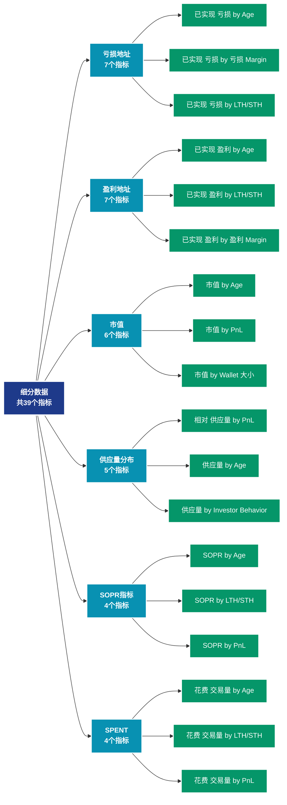

# 细分数据 (breakdowns)

## 📝 类别描述

各类数据的细分统计，提供更精细的数据维度划分。

## 📊 指标概览

本类别共包含 **39** 个指标，涵盖以下主要子类别：

| 子类别 | 指标数量 | 主要功能 |
|--------|----------|----------|
| 亏损地址 | 7 | 亏损状态评估 |
| 盈利地址 | 7 | 盈利状态分析 |
| 市值 | 6 | 专门数据分析 |
| 供应量分布 | 5 | 供应量分布统计 |
| SOPR指标 | 4 | 专门数据分析 |
| SPENT | 4 | 专门数据分析 |
| MVRV指标 | 3 | 专门数据分析 |
| 价格指标 | 3 | 专门数据分析 |

## 🎨 指标体系结构图



## 📂 详细指标说明

### 📊 亏损地址（7个指标）

本子类别包含以下详细指标：

#### 1. 已实现 亏损 by Age

- **指标代码**: `realized_loss_by_age`
- **API路径**: `/v1/metrics/breakdowns/realized_loss_by_age`
- **英文名称**: Realized Loss by Age

**英文原文：**
Realized Loss is a metric that calculates the total loss of a digital asset based on the difference between the acquisition price and the sale price of all spent coins where the sale price was lower than the acquisition price. The Realized Loss by Age metric further categorizes these losses into different age cohorts, providing a detailed view of the total loss experienced by holders of supply portions of varying ages. This metric is particularly useful for understanding the distribution of losses across different age cohorts, from hot supply (newly acquired coins) to cold supply (older, dormant coins). For example, it can help answer questions like, &#x27;Is the total realized loss greater for hot or cold supply?&#x27;

Note: The breakdown metrics utilize an address-based approach, analyzing transactions and holdings based on individual wallet addresses to facilitate comparability across digital assets and to ensure consistent analysis across various blockchain architectures. This contrasts with the alternative UTXO-based approach for chains like Bitcoin, where unspent transaction outputs are analyzed to categorize asset properties. As such, metrics for UTXO-based assets may show slight deviations if compared across these different computational methods.

**中文解释：**
全面评估地址的亏损状况。亏损数据帮助识别：1）投降性抛售的强度；2）市场底部的形成；3）支撑位的强弱。深度亏损往往伴随着市场的极度恐慌，这通常是反向投资的良机。

**使用示例**：
```python
# 获取已实现 亏损 by Age数据
df = client.get_metric(
    "/v1/metrics/breakdowns/realized_loss_by_age",
    asset="BTC",
    resolution="24h"
)
```

---

#### 2. 已实现 亏损 by 亏损 Margin

- **指标代码**: `realized_loss_by_pnl`
- **API路径**: `/v1/metrics/breakdowns/realized_loss_by_pnl`
- **英文名称**: Realized Loss by Loss Margin

**英文原文：**
Realized Loss is a key metric that calculates the total loss of a digital asset based on the difference between the acquisition price and the sale price for all spent coins where the sale price was lower than the acquisition price. The Realized Loss by Loss Margin metric further categorizes these losses based on realized loss levels, using Fibonacci retracement levels to provide a nuanced view of the market&#x27;s loss distribution. This metric is particularly useful for understanding the extent and distribution of realized losses across the market, offering insights into how much of the market&#x27;s realized loss is concentrated at different levels. For example, it can help answer questions like, &#x27;Are most realized losses occurring at specific retracement levels, indicating potential support or resistance zones?&#x27;

Note: The breakdown metrics utilize an address-based approach, analyzing transactions and holdings based on individual wallet addresses to facilitate comparability across digital assets and to ensure consistent analysis across various blockchain architectures. This contrasts with the alternative UTXO-based approach for chains like Bitcoin, where unspent transaction outputs are analyzed to categorize asset properties. As such, metrics for UTXO-based assets may show slight deviations if compared across these different computational methods.

**中文解释：**
全面评估地址的亏损状况。亏损数据帮助识别：1）投降性抛售的强度；2）市场底部的形成；3）支撑位的强弱。深度亏损往往伴随着市场的极度恐慌，这通常是反向投资的良机。

**使用示例**：
```python
# 获取已实现 亏损 by 亏损 Margin数据
df = client.get_metric(
    "/v1/metrics/breakdowns/realized_loss_by_pnl",
    asset="BTC",
    resolution="24h"
)
```

---

#### 3. 已实现 亏损 by LTH/STH

- **指标代码**: `realized_loss_by_lth_sth`
- **API路径**: `/v1/metrics/breakdowns/realized_loss_by_lth_sth`
- **英文名称**: Realized Loss by LTH/STH

**英文原文：**
Realized Loss is a metric that quantifies the total loss of a digital asset, calculated by the difference between the acquisition price and the sale price for all spent coins where the sale price was lower than the acquisition price. The Realized Loss by LTH/STH (Long-Term Holders/Short-Term Holders) metric further enhances this by categorizing digital assets into two cohorts based on the duration of holding. LTH/STH supply is defined with respect to the entity&#x27;s average purchasing date with weights given by a logistic function centered at an age of 155 days and a transition width of 10 days. This provides a more nuanced view of the total loss experienced by both long-term and short-term holders. This metric is particularly useful for understanding the distribution of losses across these two characteristic market participants. For example, it can help answer questions like, &#x27;Are long-term holders experiencing more losses compared to short-term holders?&#x27;

Note: The breakdown metrics utilize an address-based approach, analyzing transactions and holdings based on individual wallet addresses to facilitate comparability across digital assets and to ensure consistent analysis across various blockchain architectures. This contrasts with the alternative UTXO-based approach for chains like Bitcoin, where unspent transaction outputs are analyzed to categorize asset properties. As such, metrics for UTXO-based assets may show slight deviations if compared across these different computational methods.

**中文解释：**
全面评估地址的亏损状况。亏损数据帮助识别：1）投降性抛售的强度；2）市场底部的形成；3）支撑位的强弱。深度亏损往往伴随着市场的极度恐慌，这通常是反向投资的良机。

**使用示例**：
```python
# 获取已实现 亏损 by LTH/STH数据
df = client.get_metric(
    "/v1/metrics/breakdowns/realized_loss_by_lth_sth",
    asset="BTC",
    resolution="24h"
)
```

---

#### 4. 已实现 亏损 by Wallet 大小

- **指标代码**: `realized_loss_by_wallet_size`
- **API路径**: `/v1/metrics/breakdowns/realized_loss_by_wallet_size`
- **英文名称**: Realized Loss by Wallet Size

**英文原文：**
Realized Loss is a key metric that calculates the total loss of a digital asset based on the difference between the acquisition price and the sale price for all spent coins where the sale price was lower than the acquisition price. The Realized Loss by Wallet Size metric further refines this by categorizing digital assets according to the size of their wallets. This offers a granular view of the total loss experienced by different investor classes, from whales to retail investors. This metric is particularly useful for understanding the distribution of losses across different wallet sizes and identifying potential risk concentrations. For example, it can help answer questions like, &#x27;Are larger wallets (whales) experiencing more losses compared to smaller wallets (retail investors)?&#x27;

Note: The breakdown metrics utilize an address-based approach, analyzing transactions and holdings based on individual wallet addresses to facilitate comparability across digital assets and to ensure consistent analysis across various blockchain architectures. This contrasts with the alternative UTXO-based approach for chains like Bitcoin, where unspent transaction outputs are analyzed to categorize asset properties. As such, metrics for UTXO-based assets may show slight deviations if compared across these different computational methods.

**中文解释：**
全面评估地址的亏损状况。亏损数据帮助识别：1）投降性抛售的强度；2）市场底部的形成；3）支撑位的强弱。深度亏损往往伴随着市场的极度恐慌，这通常是反向投资的良机。

**使用示例**：
```python
# 获取已实现 亏损 by Wallet 大小数据
df = client.get_metric(
    "/v1/metrics/breakdowns/realized_loss_by_wallet_size",
    asset="BTC",
    resolution="24h"
)
```

---

#### 5. 花费 交易量 in 亏损 by Age

- **指标代码**: `spent_volume_loss_sum_by_age`
- **API路径**: `/v1/metrics/breakdowns/spent_volume_loss_sum_by_age`
- **英文名称**: Spent Volume in Loss by Age

**英文原文：**
Spent Volume in Loss is a metric that calculates the total volume of digital assets sold at a loss, meaning the sale price was lower than the acquisition price. The Spent Volume in Loss by Age metric further categorizes these volumes into different age cohorts, providing a detailed view of the volume of assets sold at a loss by holders of supply portions of varying ages. This metric is particularly useful for understanding the distribution of loss-making sales across different age cohorts, from hot supply (newly bought coins) to cold supply (older, dormant coins). For example, it can help answer questions like, &#x27;Is the volume of assets sold at a loss greater for older or newer coins?&#x27;

Note: The breakdown metrics utilize an address-based approach, analyzing transactions and holdings based on individual wallet addresses to facilitate comparability across digital assets and to ensure consistent analysis across various blockchain architectures. This contrasts with the alternative UTXO-based approach for chains like Bitcoin, where unspent transaction outputs are analyzed to categorize asset properties. As such, metrics for UTXO-based assets may show slight deviations if compared across these different computational methods.

**中文解释：**
全面评估地址的亏损状况。亏损数据帮助识别：1）投降性抛售的强度；2）市场底部的形成；3）支撑位的强弱。深度亏损往往伴随着市场的极度恐慌，这通常是反向投资的良机。

**使用示例**：
```python
# 获取花费 交易量 in 亏损 by Age数据
df = client.get_metric(
    "/v1/metrics/breakdowns/spent_volume_loss_sum_by_age",
    asset="BTC",
    resolution="24h"
)
```

---

#### 6. 花费 交易量 in 亏损 by LTH/STH

- **指标代码**: `spent_volume_loss_sum_by_lth_sth`
- **API路径**: `/v1/metrics/breakdowns/spent_volume_loss_sum_by_lth_sth`
- **英文名称**: Spent Volume in Loss by LTH/STH

**英文原文：**
The Spent Volume in Loss is a metric that quantifies the total volume of digital assets sold at a loss, meaning the sale price was lower than the acquisition price. The Spent Volume in Loss by LTH/STH (Long-Term Holders/Short-Term Holders) metric further enhances this by categorizing digital assets into two cohorts based on the duration of holding. LTH/STH supply is defined with respect to the entity&#x27;s average purchasing date with weights given by a logistic function centered at an age of 155 days and a transition width of 10 days. This provides a more nuanced view of the volume of assets sold at a loss by both long-term and short-term holders. This metric is particularly useful for understanding the distribution of loss-making sales across these two market participants. For example, it can help answer questions like, &#x27;Are long-term holders selling their assets at a loss more frequently compared to short-term holders?&#x27;

Note: The breakdown metrics utilize an address-based approach, analyzing transactions and holdings based on individual wallet addresses to facilitate comparability across digital assets and to ensure consistent analysis across various blockchain architectures. This contrasts with the alternative UTXO-based approach for chains like Bitcoin, where unspent transaction outputs are analyzed to categorize asset properties. As such, metrics for UTXO-based assets may show slight deviations if compared across these different computational methods.

**中文解释：**
全面评估地址的亏损状况。亏损数据帮助识别：1）投降性抛售的强度；2）市场底部的形成；3）支撑位的强弱。深度亏损往往伴随着市场的极度恐慌，这通常是反向投资的良机。

**使用示例**：
```python
# 获取花费 交易量 in 亏损 by LTH/STH数据
df = client.get_metric(
    "/v1/metrics/breakdowns/spent_volume_loss_sum_by_lth_sth",
    asset="BTC",
    resolution="24h"
)
```

---

#### 7. 花费 交易量 in 亏损 by Wallet 大小

- **指标代码**: `spent_volume_loss_sum_by_wallet_size`
- **API路径**: `/v1/metrics/breakdowns/spent_volume_loss_sum_by_wallet_size`
- **英文名称**: Spent Volume in Loss by Wallet Size

**英文原文：**
The Spent Volume in Loss is a metric that calculates the total volume of digital assets sold at a loss, meaning the sale price was lower than the acquisition price. The Spent Volume in Loss by Wallet Size metric further refines this by categorizing digital assets according to the size of their wallets. This provides a granular view of the volume of assets sold at a loss by different investor classes, from whales to retail investors. This metric is particularly useful for understanding the distribution of loss-making sales across different wallet sizes and identifying potential risk concentrations. For example, it can help answer questions like, &#x27;Are larger wallets (whales) selling their assets at a loss more frequently compared to smaller wallets (retail investors)?&#x27;

Note: The breakdown metrics utilize an address-based approach, analyzing transactions and holdings based on individual wallet addresses to facilitate comparability across digital assets and to ensure consistent analysis across various blockchain architectures. This contrasts with the alternative UTXO-based approach for chains like Bitcoin, where unspent transaction outputs are analyzed to categorize asset properties. As such, metrics for UTXO-based assets may show slight deviations if compared across these different computational methods.

**中文解释：**
全面评估地址的亏损状况。亏损数据帮助识别：1）投降性抛售的强度；2）市场底部的形成；3）支撑位的强弱。深度亏损往往伴随着市场的极度恐慌，这通常是反向投资的良机。

**使用示例**：
```python
# 获取花费 交易量 in 亏损 by Wallet 大小数据
df = client.get_metric(
    "/v1/metrics/breakdowns/spent_volume_loss_sum_by_wallet_size",
    asset="BTC",
    resolution="24h"
)
```

---

### 📊 盈利地址（7个指标）

本子类别包含以下详细指标：

#### 1. 已实现 盈利 by Age

- **指标代码**: `realized_profit_by_age`
- **API路径**: `/v1/metrics/breakdowns/realized_profit_by_age`
- **英文名称**: Realized Profit by Age

**英文原文：**
Realized Profit is a metric that calculates the total profit of a digital asset based on the difference between the acquisition price and the sale price of all spent coins where the sale price was higher than the acquisition price. The Realized Profit by Age metric further categorizes these profits into different age cohorts, providing a detailed view of the total profit experienced by holders of supply portions of varying ages. This metric is particularly useful for understanding the distribution of profits across different age cohorts, from hot supply (recently acquired coins) to cold supply (older coins). For example, it can help answer questions like, &#x27;Is the total realized profit greater for older or newer coins?&#x27;

Note: The breakdown metrics utilize an address-based approach, analyzing transactions and holdings based on individual wallet addresses to facilitate comparability across digital assets and to ensure consistent analysis across various blockchain architectures. This contrasts with the alternative UTXO-based approach for chains like Bitcoin, where unspent transaction outputs are analyzed to categorize asset properties. As such, metrics for UTXO-based assets may show slight deviations if compared across these different computational methods.

**中文解释：**
深入分析地址的盈利状况，包括盈利幅度、盈利持续时间、盈利地址的行为模式等。通过了解投资者的盈利情况，可以评估市场的获利回吐压力和持续上涨的潜力。

**使用示例**：
```python
# 获取已实现 盈利 by Age数据
df = client.get_metric(
    "/v1/metrics/breakdowns/realized_profit_by_age",
    asset="BTC",
    resolution="24h"
)
```

---

#### 2. 已实现 盈利 by LTH/STH

- **指标代码**: `realized_profit_by_lth_sth`
- **API路径**: `/v1/metrics/breakdowns/realized_profit_by_lth_sth`
- **英文名称**: Realized Profit by LTH/STH

**英文原文：**
Realized Profit is a metric that quantifies the total profit of a digital asset, calculated by the difference between the sale price and the acquisition price for all spent coins where the sale price was higher than the acquisition price. The Realized Profit by LTH/STH (Long-Term Holders/Short-Term Holders) metric further enhances this by categorizing digital assets into two cohorts based on the duration of holding. LTH/STH supply is defined with respect to the entity&#x27;s average purchasing date with weights given by a logistic function centered at an age of 155 days and a transition width of 10 days. This provides a more nuanced view of the total profit experienced by both long-term and short-term holders. This metric is particularly useful for understanding the distribution of profit-taking across these two characteristic market participants. For example, it can help answer questions like, &#x27;Are long-term holders realizing more profits compared to short-term holders?&#x27;

Note: The breakdown metrics utilize an address-based approach, analyzing transactions and holdings based on individual wallet addresses to facilitate comparability across digital assets and to ensure consistent analysis across various blockchain architectures. This contrasts with the alternative UTXO-based approach for chains like Bitcoin, where unspent transaction outputs are analyzed to categorize asset properties. As such, metrics for UTXO-based assets may show slight deviations if compared across these different computational methods.

**中文解释：**
深入分析地址的盈利状况，包括盈利幅度、盈利持续时间、盈利地址的行为模式等。通过了解投资者的盈利情况，可以评估市场的获利回吐压力和持续上涨的潜力。

**使用示例**：
```python
# 获取已实现 盈利 by LTH/STH数据
df = client.get_metric(
    "/v1/metrics/breakdowns/realized_profit_by_lth_sth",
    asset="BTC",
    resolution="24h"
)
```

---

#### 3. 已实现 盈利 by 盈利 Margin

- **指标代码**: `realized_profit_by_pnl`
- **API路径**: `/v1/metrics/breakdowns/realized_profit_by_pnl`
- **英文名称**: Realized Profit by Profit Margin

**英文原文：**
Realized Profit is a metric that calculates the total profit of a digital asset based on the difference between the acquisition price and the sale price of all spent coins where the sale price was higher than the acquisition price. The Realized Profit by Profit Margin metric further categorizes these profits based on realized profit levels. This metric is particularly useful for understanding the extent and distribution of realized profits across the market, offering insights into how much of the market&#x27;s realized profit is concentrated at different levels. For example, it can help answer questions like, &#x27;Are most realized profits occurring at specific levels, indicating potential zones of profit-taking?&#x27;

Note: The breakdown metrics utilize an address-based approach, analyzing transactions and holdings based on individual wallet addresses to facilitate comparability across digital assets and to ensure consistent analysis across various blockchain architectures. This contrasts with the alternative UTXO-based approach for chains like Bitcoin, where unspent transaction outputs are analyzed to categorize asset properties. As such, metrics for UTXO-based assets may show slight deviations if compared across these different computational methods.

**中文解释：**
深入分析地址的盈利状况，包括盈利幅度、盈利持续时间、盈利地址的行为模式等。通过了解投资者的盈利情况，可以评估市场的获利回吐压力和持续上涨的潜力。

**使用示例**：
```python
# 获取已实现 盈利 by 盈利 Margin数据
df = client.get_metric(
    "/v1/metrics/breakdowns/realized_profit_by_pnl",
    asset="BTC",
    resolution="24h"
)
```

---

#### 4. 已实现 盈利 by Wallet 大小

- **指标代码**: `realized_profit_by_wallet_size`
- **API路径**: `/v1/metrics/breakdowns/realized_profit_by_wallet_size`
- **英文名称**: Realized Profit by Wallet Size

**英文原文：**
Realized Profit is a key metric that calculates the total profit of a digital asset based on the difference between the acquisition price and the sale price for all spent coins where the sale price was higher than the acquisition price. The Realized Profit by Wallet Size metric enhances this by categorizing digital assets according to the size of their wallets. This provides a granular view of the total profit experienced by different investor classes, from whales to retail investors. This metric is particularly useful for understanding the distribution of profits across different wallet sizes and identifying potential profit concentrations. For example, it can help answer questions like, &#x27;Are larger wallets (whales) realizing more profits compared to smaller wallets (retail investors)?&#x27;

Note: The breakdown metrics utilize an address-based approach, analyzing transactions and holdings based on individual wallet addresses to facilitate comparability across digital assets and to ensure consistent analysis across various blockchain architectures. This contrasts with the alternative UTXO-based approach for chains like Bitcoin, where unspent transaction outputs are analyzed to categorize asset properties. As such, metrics for UTXO-based assets may show slight deviations if compared across these different computational methods.

**中文解释：**
深入分析地址的盈利状况，包括盈利幅度、盈利持续时间、盈利地址的行为模式等。通过了解投资者的盈利情况，可以评估市场的获利回吐压力和持续上涨的潜力。

**使用示例**：
```python
# 获取已实现 盈利 by Wallet 大小数据
df = client.get_metric(
    "/v1/metrics/breakdowns/realized_profit_by_wallet_size",
    asset="BTC",
    resolution="24h"
)
```

---

#### 5. 花费 交易量 in 盈利 by Age

- **指标代码**: `spent_volume_profit_sum_by_age`
- **API路径**: `/v1/metrics/breakdowns/spent_volume_profit_sum_by_age`
- **英文名称**: Spent Volume in Profit by Age

**英文原文：**
Spent Volume in Profit is a metric that measures the total volume of digital assets sold at a profit, meaning the sale price was higher than the acquisition price. The Spent Volume in Profit by Age metric further categorizes these volumes into different age cohorts, providing a detailed view of the volume of assets sold at a profit by holders of supply portions of varying ages. This metric is particularly useful for understanding the distribution of profit-making sales across different age cohorts, from hot supply (newly bought coins) to cold supply (older, dormant coins). For example, it can help answer questions like, &#x27;Are older coins being sold at a profit more frequently compared to newer coins?&#x27;

Note: The breakdown metrics utilize an address-based approach, analyzing transactions and holdings based on individual wallet addresses to facilitate comparability across digital assets and to ensure consistent analysis across various blockchain architectures. This contrasts with the alternative UTXO-based approach for chains like Bitcoin, where unspent transaction outputs are analyzed to categorize asset properties. As such, metrics for UTXO-based assets may show slight deviations if compared across these different computational methods.

**中文解释：**
深入分析地址的盈利状况，包括盈利幅度、盈利持续时间、盈利地址的行为模式等。通过了解投资者的盈利情况，可以评估市场的获利回吐压力和持续上涨的潜力。

**使用示例**：
```python
# 获取花费 交易量 in 盈利 by Age数据
df = client.get_metric(
    "/v1/metrics/breakdowns/spent_volume_profit_sum_by_age",
    asset="BTC",
    resolution="24h"
)
```

---

#### 6. 花费 交易量 in 盈利 by LTH/STH

- **指标代码**: `spent_volume_profit_sum_by_lth_sth`
- **API路径**: `/v1/metrics/breakdowns/spent_volume_profit_sum_by_lth_sth`
- **英文名称**: Spent Volume in Profit by LTH/STH

**英文原文：**
Spent Volume in Profit is a metric that quantifies the total volume of digital assets sold at a profit, meaning the sale price was higher than the acquisition price. The Spent Volume in Profit by LTH/STH (Long-Term Holders/Short-Term Holders) version of this metric further refines this data by categorizing digital assets into two cohorts based on the duration of holding. LTH/STH supply is defined with respect to the entity&#x27;s average purchasing date with weights given by a logistic function centered at an age of 155 days and a transition width of 10 days. This provides a more nuanced view of the volume of assets sold at a profit by both long-term and short-term holders. This metric is particularly useful for understanding the distribution of profit-making sales across these two market participant groups. For example, it can help answer questions like, &#x27;Are long-term holders realizing profits more frequently compared to short-term holders?&#x27;

Note: The breakdown metrics utilize an address-based approach, analyzing transactions and holdings based on individual wallet addresses to facilitate comparability across digital assets and to ensure consistent analysis across various blockchain architectures. This contrasts with the alternative UTXO-based approach for chains like Bitcoin, where unspent transaction outputs are analyzed to categorize asset properties. As such, metrics for UTXO-based assets may show slight deviations if compared across these different computational methods.

**中文解释：**
深入分析地址的盈利状况，包括盈利幅度、盈利持续时间、盈利地址的行为模式等。通过了解投资者的盈利情况，可以评估市场的获利回吐压力和持续上涨的潜力。

**使用示例**：
```python
# 获取花费 交易量 in 盈利 by LTH/STH数据
df = client.get_metric(
    "/v1/metrics/breakdowns/spent_volume_profit_sum_by_lth_sth",
    asset="BTC",
    resolution="24h"
)
```

---

#### 7. 花费 交易量 in 盈利 by Wallet 大小

- **指标代码**: `spent_volume_profit_sum_by_wallet_size`
- **API路径**: `/v1/metrics/breakdowns/spent_volume_profit_sum_by_wallet_size`
- **英文名称**: Spent Volume in Profit by Wallet Size

**英文原文：**
Spent Volume in Profit is a metric that measures the total volume of digital assets sold at a profit, meaning the sale price was higher than the acquisition price. The Spent Volume in Profit by Wallet Size metric further refines this by categorizing digital assets according to the size of their wallets, offering a detailed view of the volume of assets sold at a profit by different investor classes, from whales to retail investors. This metric is particularly useful for understanding the distribution of profit-making sales across different wallet sizes and identifying potential profit concentrations. For example, it can help answer questions like, &#x27;Are larger wallets (whales) selling their assets at a profit more frequently compared to smaller wallets (retail investors)?&#x27;

Note: The breakdown metrics utilize an address-based approach, analyzing transactions and holdings based on individual wallet addresses to facilitate comparability across digital assets and to ensure consistent analysis across various blockchain architectures. This contrasts with the alternative UTXO-based approach for chains like Bitcoin, where unspent transaction outputs are analyzed to categorize asset properties. As such, metrics for UTXO-based assets may show slight deviations if compared across these different computational methods.

**中文解释：**
深入分析地址的盈利状况，包括盈利幅度、盈利持续时间、盈利地址的行为模式等。通过了解投资者的盈利情况，可以评估市场的获利回吐压力和持续上涨的潜力。

**使用示例**：
```python
# 获取花费 交易量 in 盈利 by Wallet 大小数据
df = client.get_metric(
    "/v1/metrics/breakdowns/spent_volume_profit_sum_by_wallet_size",
    asset="BTC",
    resolution="24h"
)
```

---

### 📊 市值（6个指标）

本子类别包含以下详细指标：

#### 1. 市值 by Age

- **指标代码**: `marketcap_usd_by_age`
- **API路径**: `/v1/metrics/breakdowns/marketcap_usd_by_age`
- **英文名称**: Market Cap by Age

**英文原文：**
Market Capitalization (Market Cap) is a fundamental metric that calculates the total market value of a digital asset at a given time. It is computed by multiplying the current market price by the total supply of the asset. The Market Cap by Age metric further refines this by categorizing digital assets into different age cohorts, providing a detailed view of the total market value of supply of varying ages. This metric is beneficial for understanding value distribution across different age cohorts, from hot supply (newly acquired coins) to cold supply (older, dormant coins). For example, it can help answer questions like, &#x27;Is the majority of the market value held in older or newer coins?&#x27;

Note: The breakdown metrics utilize an address-based approach, analyzing transactions and holdings based on individual wallet addresses to facilitate comparability across digital assets and to ensure consistent analysis across various blockchain architectures. This contrasts with the alternative UTXO-based approach for chains like Bitcoin, where unspent transaction outputs are analyzed to categorize asset properties. As such, metrics for UTXO-based assets may show slight deviations if compared across these different computational methods.

**中文解释：**
追踪市场价格和估值指标。市场数据提供价格发现、估值参考和市场情绪评估。通过结合链上数据和市场数据，可以获得更全面的市场洞察。

**使用示例**：
```python
# 获取市值 by Age数据
df = client.get_metric(
    "/v1/metrics/breakdowns/marketcap_usd_by_age",
    asset="BTC",
    resolution="24h"
)
```

---

#### 2. 市值 by PnL

- **指标代码**: `marketcap_usd_by_pnl`
- **API路径**: `/v1/metrics/breakdowns/marketcap_usd_by_pnl`
- **英文名称**: Market Cap by PnL

**英文原文：**
Market Capitalization (Market Cap) is a fundamental metric that calculates the total market value of a digital asset at a given time, computed by multiplying the current market price by the total supply of the asset. The Market Cap by Profit and Loss metric further categorizes this data based on unrealized profit and loss levels, using Fibonacci retracement levels to provide a detailed view of the market&#x27;s valuation. This metric is particularly useful for understanding the distribution of unrealized gains and losses across the market, offering insights into how much of the market cap is held at a profit versus a loss. For example, it can help answer questions like, &#x27;Is the majority of the market cap currently held in assets that are above or below their acquisition cost?&#x27;

Note: The breakdown metrics utilize an address-based approach, analyzing transactions and holdings based on individual wallet addresses to facilitate comparability across digital assets and to ensure consistent analysis across various blockchain architectures. This contrasts with the alternative UTXO-based approach for chains like Bitcoin, where unspent transaction outputs are analyzed to categorize asset properties. As such, metrics for UTXO-based assets may show slight deviations if compared across these different computational methods.

**中文解释：**
追踪市场价格和估值指标。市场数据提供价格发现、估值参考和市场情绪评估。通过结合链上数据和市场数据，可以获得更全面的市场洞察。

**使用示例**：
```python
# 获取市值 by PnL数据
df = client.get_metric(
    "/v1/metrics/breakdowns/marketcap_usd_by_pnl",
    asset="BTC",
    resolution="24h"
)
```

---

#### 3. 市值 by Wallet 大小

- **指标代码**: `marketcap_usd_by_wallet_size`
- **API路径**: `/v1/metrics/breakdowns/marketcap_usd_by_wallet_size`
- **英文名称**: Market Cap by Wallet Size

**英文原文：**
Market Capitalization (Market Cap) is a fundamental metric that calculates the total market value of a digital asset at a given time. It is computed by multiplying the current market price by the total supply of the asset. The Market Cap by Wallet Size metric takes this a step further by categorizing digital assets according to the size of their wallets, providing a granular view of the total market value held by different investor classes, from whales to retail investors. This metric is particularly useful for identifying potential discrepancies in the investment base and understanding the behavior of different investor classes. For instance, it can help answer questions like, &#x27;Are larger wallets (whales) holding a greater proportion of the market value compared to smaller wallets (retail investors)?&#x27;

Note: The breakdown metrics utilize an address-based approach, analyzing transactions and holdings based on individual wallet addresses to facilitate comparability across digital assets and to ensure consistent analysis across various blockchain architectures. This contrasts with the alternative UTXO-based approach for chains like Bitcoin, where unspent transaction outputs are analyzed to categorize asset properties. As such, metrics for UTXO-based assets may show slight deviations if compared across these different computational methods.

**中文解释：**
追踪市场价格和估值指标。市场数据提供价格发现、估值参考和市场情绪评估。通过结合链上数据和市场数据，可以获得更全面的市场洞察。

**使用示例**：
```python
# 获取市值 by Wallet 大小数据
df = client.get_metric(
    "/v1/metrics/breakdowns/marketcap_usd_by_wallet_size",
    asset="BTC",
    resolution="24h"
)
```

---

#### 4. 已实现 Cap by Age

- **指标代码**: `marketcap_realized_usd_by_age`
- **API路径**: `/v1/metrics/breakdowns/marketcap_realized_usd_by_age`
- **英文名称**: Realized Cap by Age

**英文原文：**
Realized Capitalization (Realized Cap) is a key metric that calculates the total value of a digital asset based on the price at the time each unit last moved. In other words, it reflects the total acquisition cost of all coins in circulation. The Realized Cap by Age metric provides an additional layer of detail by categorizing digital assets into different age cohorts, offering a comprehensive view of the acquisition cost of supply portions of varying ages. This metric is particularly useful for understanding the distribution of network wealth across different age cohorts, from hot supply (coins that recently moved) to cold supply (older, dormant coins). For example, it can help answer questions like, &#x27;Is the majority of the acquisition cost concentrated in older or newer coins?&#x27;

Note: The breakdown metrics utilize an address-based approach, analyzing transactions and holdings based on individual wallet addresses to facilitate comparability across digital assets and to ensure consistent analysis across various blockchain architectures. This contrasts with the alternative UTXO-based approach for chains like Bitcoin, where unspent transaction outputs are analyzed to categorize asset properties. As such, metrics for UTXO-based assets may show slight deviations if compared across these different computational methods.

**中文解释：**
计算已实现市值或已实现价格。已实现价格是所有币按最后移动时的价格加权平均得出，反映了市场的成本基础。当市场价格高于已实现价格时，市场整体盈利；反之则整体亏损。这是判断市场周期位置的重要指标。

**使用示例**：
```python
# 获取已实现 Cap by Age数据
df = client.get_metric(
    "/v1/metrics/breakdowns/marketcap_realized_usd_by_age",
    asset="BTC",
    resolution="24h"
)
```

---

#### 5. 已实现 Cap by PnL

- **指标代码**: `marketcap_realized_usd_by_pnl`
- **API路径**: `/v1/metrics/breakdowns/marketcap_realized_usd_by_pnl`
- **英文名称**: Realized Cap by PnL

**英文原文：**
Realized Capitalization (Realized Cap) is a significant metric that calculates the total acquisition cost of all coins in circulation, based on the price at the time each unit last moved. The Realized Cap by Profit and Loss metric further categorizes this data based on unrealized profit and loss levels, using Fibonacci retracement levels to provide a nuanced view of the network&#x27;s valuation. This metric is particularly useful for understanding the distribution of unrealized gains and losses across the market, offering insights into how much of the realized cap is held at a profit versus a loss. For example, it can help answer questions like, &#x27;Is the majority of the realized cap currently held in assets that are above or below their acquisition cost?&#x27;

Note: The breakdown metrics utilize an address-based approach, analyzing transactions and holdings based on individual wallet addresses to facilitate comparability across digital assets and to ensure consistent analysis across various blockchain architectures. This contrasts with the alternative UTXO-based approach for chains like Bitcoin, where unspent transaction outputs are analyzed to categorize asset properties. As such, metrics for UTXO-based assets may show slight deviations if compared across these different computational methods.

**中文解释：**
计算已实现市值或已实现价格。已实现价格是所有币按最后移动时的价格加权平均得出，反映了市场的成本基础。当市场价格高于已实现价格时，市场整体盈利；反之则整体亏损。这是判断市场周期位置的重要指标。

**使用示例**：
```python
# 获取已实现 Cap by PnL数据
df = client.get_metric(
    "/v1/metrics/breakdowns/marketcap_realized_usd_by_pnl",
    asset="BTC",
    resolution="24h"
)
```

---

#### 6. 已实现 Cap by Wallet 大小

- **指标代码**: `marketcap_realized_usd_by_wallet_size`
- **API路径**: `/v1/metrics/breakdowns/marketcap_realized_usd_by_wallet_size`
- **英文名称**: Realized Cap by Wallet Size

**英文原文：**
The Realized Capitalization (Realized Cap) is a significant metric that calculates the total acquisition cost of all coins in circulation, based on the price at the time each unit last moved. The Realized Cap by Wallet Size metric further refines this by categorizing digital assets according to the size of their wallets, providing a granular view of the network wealth held by different investor classes, from whales to retail investors. This metric is particularly useful for identifying potential discrepancies in the investment base and understanding the behavior of different investor classes. For instance, it can help answer questions like, &#x27;Are larger wallets (whales) holding a greater proportion of the acquisition cost compared to smaller wallets (retail investors)?&#x27;

Note: The breakdown metrics utilize an address-based approach, analyzing transactions and holdings based on individual wallet addresses to facilitate comparability across digital assets and to ensure consistent analysis across various blockchain architectures. This contrasts with the alternative UTXO-based approach for chains like Bitcoin, where unspent transaction outputs are analyzed to categorize asset properties. As such, metrics for UTXO-based assets may show slight deviations if compared across these different computational methods.

**中文解释：**
计算已实现市值或已实现价格。已实现价格是所有币按最后移动时的价格加权平均得出，反映了市场的成本基础。当市场价格高于已实现价格时，市场整体盈利；反之则整体亏损。这是判断市场周期位置的重要指标。

**使用示例**：
```python
# 获取已实现 Cap by Wallet 大小数据
df = client.get_metric(
    "/v1/metrics/breakdowns/marketcap_realized_usd_by_wallet_size",
    asset="BTC",
    resolution="24h"
)
```

---

### 📊 供应量分布（5个指标）

本子类别包含以下详细指标：

#### 1. 相对 供应量 by PnL

- **指标代码**: `supply_by_pnl_relative`
- **API路径**: `/v1/metrics/breakdowns/supply_by_pnl_relative`
- **英文名称**: Relative Supply by PnL

**英文原文：**
This is the relative version of Supply by Profit and Loss.

The total supply of a digital asset is a fundamental metric representing the total quantity of that asset in circulation. The Supply by Profit and Loss metric further categorizes this total supply based on unrealized profit and loss levels, using Fibonacci retracement levels to provide a detailed view of the distribution of the total supply across different profit and loss thresholds. This metric is particularly useful for understanding how much of the total supply is held at a profit versus a loss, offering insights into the market&#x27;s overall sentiment and potential support or resistance levels. For example, it can help answer questions like, &#x27;Is the majority of the total supply currently held at a profit or a loss relative to its acquisition cost?&#x27;

Note: The breakdown metrics utilize an address-based approach, analyzing transactions and holdings based on individual wallet addresses to facilitate comparability across digital assets and to ensure consistent analysis across various blockchain architectures. This contrasts with the alternative UTXO-based approach for chains like Bitcoin, where unspent transaction outputs are analyzed to categorize asset properties. As such, metrics for UTXO-based assets may show slight deviations if compared across these different computational methods.

**中文解释：**
分析Relative Supply by PnL相关的链上数据。这个指标通过追踪区块链上的实时数据，提供了传统金融分析无法获得的透明度和洞察力。链上数据的优势在于：1）数据真实可验证；2）实时更新无延迟；3）覆盖所有参与者。通过综合分析多个链上指标，投资者可以做出更明智的决策，研究人员可以深入理解市场机制。

**使用示例**：
```python
# 获取相对 供应量 by PnL数据
df = client.get_metric(
    "/v1/metrics/breakdowns/supply_by_pnl_relative",
    asset="BTC",
    resolution="24h"
)
```

---

#### 2. 供应量 by Age

- **指标代码**: `supply_by_age`
- **API路径**: `/v1/metrics/breakdowns/supply_by_age`
- **英文名称**: Supply by Age

**英文原文：**
The total supply of a digital asset is a fundamental metric representing the total quantity of that asset in circulation. The Supply by Age metric further categorizes this total supply into different age cohorts, offering a detailed view of the distribution of the total supply across varying holding periods for these assets, from hot supply (recently moved coins) to cold supply (older, dormant coins). This metric is particularly useful for understanding the age distribution of the total supply, which can provide insights into the maturity and stability of a digital asset&#x27;s market. For example, it can help answer questions like, &#x27;Is the majority of the total supply held in older coins, indicating a mature market, or in newer coins, indicating a growing market?&#x27;

Note: The breakdown metrics utilize an address-based approach, analyzing transactions and holdings based on individual wallet addresses to facilitate comparability across digital assets and to ensure consistent analysis across various blockchain architectures. This contrasts with the alternative UTXO-based approach for chains like Bitcoin, where unspent transaction outputs are analyzed to categorize asset properties. As such, metrics for UTXO-based assets may show slight deviations if compared across these different computational methods.

**中文解释：**
分析Supply by Age相关的链上数据。这个指标通过追踪区块链上的实时数据，提供了传统金融分析无法获得的透明度和洞察力。链上数据的优势在于：1）数据真实可验证；2）实时更新无延迟；3）覆盖所有参与者。通过综合分析多个链上指标，投资者可以做出更明智的决策，研究人员可以深入理解市场机制。

**使用示例**：
```python
# 获取供应量 by Age数据
df = client.get_metric(
    "/v1/metrics/breakdowns/supply_by_age",
    asset="BTC",
    resolution="24h"
)
```

---

#### 3. 供应量 by Investor Behavior

- **指标代码**: `supply_by_investor_behavior`
- **API路径**: `/v1/metrics/breakdowns/supply_by_investor_behavior`
- **英文名称**: Supply by Investor Behavior

**英文原文：**
### Understanding Who’s Behind the Market Moves

The goal is to classify token supply based on the **behavior of market participants**. The idea is simple but powerful: instead of just looking at supply levels, we look at *who* is buying and *who* is selling. Is it mostly **first-time buyers** entering the market? Are we seeing **conviction buyers** step in while the price drops? Or is the current activity driven by **momentum buyers**, **profit takers**, or **loss sellers**?

#### Cohort Definitions

To make this work, we created a set of behavior-based cohorts:

- **Conviction Buyers**: Investors who buy despite falling prices. They believe in the long-term and lower their cost basis.
- **Momentum Buyers**: Investors who buy during uptrends, typically increasing their average cost basis.
- **First Buy**: First-time buyers entering the market — a clean slate.
- **Loss Sellers**: Investors exiting at a loss.
- **Profit Takers**: Investors locking in gains.

The metric tracks the cumulative token supply held by each cohort over time. To focus solely on investor behavior, we exclude exchanges and smart contracts.

For Bitcoin, this analysis is conducted at the entity level rather than the address level, grouping addresses that belong to the same user.

**中文解释：**
分析Supply by Investor Behavior相关的链上数据。这个指标通过追踪区块链上的实时数据，提供了传统金融分析无法获得的透明度和洞察力。链上数据的优势在于：1）数据真实可验证；2）实时更新无延迟；3）覆盖所有参与者。通过综合分析多个链上指标，投资者可以做出更明智的决策，研究人员可以深入理解市场机制。

**使用示例**：
```python
# 获取供应量 by Investor Behavior数据
df = client.get_metric(
    "/v1/metrics/breakdowns/supply_by_investor_behavior",
    asset="BTC",
    resolution="24h"
)
```

---

#### 4. 供应量 by PnL

- **指标代码**: `supply_by_pnl`
- **API路径**: `/v1/metrics/breakdowns/supply_by_pnl`
- **英文名称**: Supply by PnL

**英文原文：**
The total supply of a digital asset is a fundamental metric representing the total quantity of that asset in circulation. The Supply by Profit and Loss metric further categorizes this total supply based on unrealized profit and loss levels, using Fibonacci retracement levels to provide a detailed view of the distribution of the total supply across different profit and loss thresholds. This metric is particularly useful for understanding how much of the total supply is held at a profit versus a loss, offering insights into the market&#x27;s overall sentiment and potential support or resistance levels. For example, it can help answer questions like, &#x27;Is the majority of the total supply currently held at a profit or a loss relative to its acquisition cost?&#x27;

Note: The breakdown metrics utilize an address-based approach, analyzing transactions and holdings based on individual wallet addresses to facilitate comparability across digital assets and to ensure consistent analysis across various blockchain architectures. This contrasts with the alternative UTXO-based approach for chains like Bitcoin, where unspent transaction outputs are analyzed to categorize asset properties. As such, metrics for UTXO-based assets may show slight deviations if compared across these different computational methods.

**中文解释：**
分析Supply by PnL相关的链上数据。这个指标通过追踪区块链上的实时数据，提供了传统金融分析无法获得的透明度和洞察力。链上数据的优势在于：1）数据真实可验证；2）实时更新无延迟；3）覆盖所有参与者。通过综合分析多个链上指标，投资者可以做出更明智的决策，研究人员可以深入理解市场机制。

**使用示例**：
```python
# 获取供应量 by PnL数据
df = client.get_metric(
    "/v1/metrics/breakdowns/supply_by_pnl",
    asset="BTC",
    resolution="24h"
)
```

---

#### 5. 供应量 by Wallet 大小

- **指标代码**: `supply_by_wallet_size`
- **API路径**: `/v1/metrics/breakdowns/supply_by_wallet_size`
- **英文名称**: Supply by Wallet Size

**英文原文：**
The total supply of a digital asset is a fundamental metric representing the total quantity of that asset in circulation. The Supply by Wallet Size metric further refines this by categorizing the total supply according to the size of their wallets, providing a granular view of the distribution of the total supply across different investor classes, from whales to retail investors. This metric is particularly useful for understanding the distribution of the total supply across different wallet sizes, which can provide insights into the diversity and concentration of a digital asset&#x27;s market. For example, it can help answer questions like, &#x27;Is the majority of the total supply held in larger wallets (whales), indicating a concentrated market, or is it more evenly distributed across smaller wallets (retail investors), indicating a diverse market?&#x27;

Note: The breakdown metrics utilize an address-based approach, analyzing transactions and holdings based on individual wallet addresses to facilitate comparability across digital assets and to ensure consistent analysis across various blockchain architectures. This contrasts with the alternative UTXO-based approach for chains like Bitcoin, where unspent transaction outputs are analyzed to categorize asset properties. As such, metrics for UTXO-based assets may show slight deviations if compared across these different computational methods.

**中文解释：**
分析Supply by Wallet Size相关的链上数据。这个指标通过追踪区块链上的实时数据，提供了传统金融分析无法获得的透明度和洞察力。链上数据的优势在于：1）数据真实可验证；2）实时更新无延迟；3）覆盖所有参与者。通过综合分析多个链上指标，投资者可以做出更明智的决策，研究人员可以深入理解市场机制。

**使用示例**：
```python
# 获取供应量 by Wallet 大小数据
df = client.get_metric(
    "/v1/metrics/breakdowns/supply_by_wallet_size",
    asset="BTC",
    resolution="24h"
)
```

---

### 📊 SOPR指标（4个指标）

本子类别包含以下详细指标：

#### 1. SOPR by Age

- **指标代码**: `sopr_by_age`
- **API路径**: `/v1/metrics/breakdowns/sopr_by_age`
- **英文名称**: SOPR by Age

**英文原文：**
The Spent Output Profit Ratio (SOPR) is a metric that calculates the profit or loss made by holders of a digital asset when they sell, based on the difference between the sale price and the acquisition price. The SOPR by Age metric further categorizes this data into different age cohorts, providing a detailed view of the profit or loss realized by holders of supply portions of varying ages. This metric is particularly useful for understanding the distribution of profit-making or loss-making sales across different age cohorts, from hot supply (freshly acquired coins) to cold supply (longer-held coins). For example, it can help answer questions like, &#x27;Are older coins being sold at a profit more frequently compared to newer coins?&#x27;

Note: The breakdown metrics utilize an address-based approach, analyzing transactions and holdings based on individual wallet addresses to facilitate comparability across digital assets and to ensure consistent analysis across various blockchain architectures. This contrasts with the alternative UTXO-based approach for chains like Bitcoin, where unspent transaction outputs are analyzed to categorize asset properties. As such, metrics for UTXO-based assets may show slight deviations if compared across these different computational methods.

**中文解释：**
分析SOPR by Age相关的链上数据。这个指标通过追踪区块链上的实时数据，提供了传统金融分析无法获得的透明度和洞察力。链上数据的优势在于：1）数据真实可验证；2）实时更新无延迟；3）覆盖所有参与者。通过综合分析多个链上指标，投资者可以做出更明智的决策，研究人员可以深入理解市场机制。

**使用示例**：
```python
# 获取SOPR by Age数据
df = client.get_metric(
    "/v1/metrics/breakdowns/sopr_by_age",
    asset="BTC",
    resolution="24h"
)
```

---

#### 2. SOPR by LTH/STH

- **指标代码**: `sopr_by_lth_sth`
- **API路径**: `/v1/metrics/breakdowns/sopr_by_lth_sth`
- **英文名称**: SOPR by LTH/STH

**英文原文：**
The Spent Output Profit Ratio (SOPR) is a key metric that calculates the profit or loss made by holders of a digital asset when they sell, based on the difference between the sale price and the acquisition price. The SOPR by LTH/STH (Long-Term Holders/Short-Term Holders) metric further refines this by categorizing digital assets into two cohorts based on the duration of holding. LTH/STH supply is defined with respect to the entity&#x27;s average purchasing date with weights given by a logistic function centered at an age of 155 days and a transition width of 10 days. This provides a more nuanced view of the profit or loss realized by both long-term and short-term holders. This metric is particularly useful for understanding the distribution of profit-making or loss-making sales across these two market participants. For example, it can help answer questions like, &#x27;Are long-term holders selling their assets at a profit more frequently compared to short-term holders?&#x27;

Note: The breakdown metrics utilize an address-based approach, analyzing transactions and holdings based on individual wallet addresses to facilitate comparability across digital assets and to ensure consistent analysis across various blockchain architectures. This contrasts with the alternative UTXO-based approach for chains like Bitcoin, where unspent transaction outputs are analyzed to categorize asset properties. As such, metrics for UTXO-based assets may show slight deviations if compared across these different computational methods.

**中文解释：**
分析SOPR by LTH/STH相关的链上数据。这个指标通过追踪区块链上的实时数据，提供了传统金融分析无法获得的透明度和洞察力。链上数据的优势在于：1）数据真实可验证；2）实时更新无延迟；3）覆盖所有参与者。通过综合分析多个链上指标，投资者可以做出更明智的决策，研究人员可以深入理解市场机制。

**使用示例**：
```python
# 获取SOPR by LTH/STH数据
df = client.get_metric(
    "/v1/metrics/breakdowns/sopr_by_lth_sth",
    asset="BTC",
    resolution="24h"
)
```

---

#### 3. SOPR by PnL

- **指标代码**: `sopr_by_pnl`
- **API路径**: `/v1/metrics/breakdowns/sopr_by_pnl`
- **英文名称**: SOPR by PnL

**英文原文：**
The Spent Output Profit Ratio (SOPR) is a metric that calculates the profit or loss made by holders of a digital asset when they sell, based on the difference between the sale price and the acquisition price. The SOPR by Profit and Loss metric further categorizes this data based on realized profit and loss levels, using Fibonacci retracement levels to provide a nuanced view of the market&#x27;s profit and loss distribution. This metric is particularly useful for understanding the extent and distribution of realized profits and losses across the market, offering insights into how much of the market&#x27;s realized profit or loss is concentrated at different levels. For example, it can help answer questions like, &#x27;Are most sales occurring at a profit or a loss relative to their acquisition cost, and at what levels are these profits or losses concentrated?&#x27;

Note: The breakdown metrics utilize an address-based approach, analyzing transactions and holdings based on individual wallet addresses to facilitate comparability across digital assets and to ensure consistent analysis across various blockchain architectures. This contrasts with the alternative UTXO-based approach for chains like Bitcoin, where unspent transaction outputs are analyzed to categorize asset properties. As such, metrics for UTXO-based assets may show slight deviations if compared across these different computational methods.

**中文解释：**
分析SOPR by PnL相关的链上数据。这个指标通过追踪区块链上的实时数据，提供了传统金融分析无法获得的透明度和洞察力。链上数据的优势在于：1）数据真实可验证；2）实时更新无延迟；3）覆盖所有参与者。通过综合分析多个链上指标，投资者可以做出更明智的决策，研究人员可以深入理解市场机制。

**使用示例**：
```python
# 获取SOPR by PnL数据
df = client.get_metric(
    "/v1/metrics/breakdowns/sopr_by_pnl",
    asset="BTC",
    resolution="24h"
)
```

---

#### 4. SOPR by Wallet 大小

- **指标代码**: `sopr_by_wallet_size`
- **API路径**: `/v1/metrics/breakdowns/sopr_by_wallet_size`
- **英文名称**: SOPR by Wallet Size

**英文原文：**
The Spent Output Profit Ratio (SOPR) is a critical metric that calculates the profit or loss made by holders of a digital asset when they sell their assets, based on the difference between the sale price and the acquisition price. The SOPR by Wallet Size metric further refines this by categorizing digital assets according to the size of their wallets. This provides a granular view of the profit or loss realized by different investor classes, from whales to retail investors. This metric is particularly useful for understanding the distribution of profit-making or loss-making sales across different wallet sizes. For example, it can help answer questions like, &#x27;Are larger wallets (whales) selling their assets at a profit more frequently compared to smaller wallets (retail investors)?&#x27;

Note: The breakdown metrics utilize an address-based approach, analyzing transactions and holdings based on individual wallet addresses to facilitate comparability across digital assets and to ensure consistent analysis across various blockchain architectures. This contrasts with the alternative UTXO-based approach for chains like Bitcoin, where unspent transaction outputs are analyzed to categorize asset properties. As such, metrics for UTXO-based assets may show slight deviations if compared across these different computational methods.

**中文解释：**
分析SOPR by Wallet Size相关的链上数据。这个指标通过追踪区块链上的实时数据，提供了传统金融分析无法获得的透明度和洞察力。链上数据的优势在于：1）数据真实可验证；2）实时更新无延迟；3）覆盖所有参与者。通过综合分析多个链上指标，投资者可以做出更明智的决策，研究人员可以深入理解市场机制。

**使用示例**：
```python
# 获取SOPR by Wallet 大小数据
df = client.get_metric(
    "/v1/metrics/breakdowns/sopr_by_wallet_size",
    asset="BTC",
    resolution="24h"
)
```

---

### 📊 SPENT（4个指标）

本子类别包含以下详细指标：

#### 1. 花费 交易量 by Age

- **指标代码**: `spent_volume_sum_by_age`
- **API路径**: `/v1/metrics/breakdowns/spent_volume_sum_by_age`
- **英文名称**: Spent Volume by Age

**英文原文：**
Spent Volume is a metric that calculates the total volume of digital assets sold, providing an insight into the overall market activity. The Spent Volume by Age metric further categorizes this data into different age cohorts, offering a detailed view of the volume of assets sold by holders of supply portions of varying ages. This metric is particularly useful for understanding sales distribution across different age cohorts, from hot supply (newly acquired coins) to cold supply (older, dormant coins). This can help identify periods of increased selling activity among different age cohorts. For example, it can help answer questions like, &#x27;Are older coins being sold more frequently than newer ones?&#x27;

Note: The breakdown metrics utilize an address-based approach, analyzing transactions and holdings based on individual wallet addresses to facilitate comparability across digital assets and to ensure consistent analysis across various blockchain architectures. This contrasts with the alternative UTXO-based approach for chains like Bitcoin, where unspent transaction outputs are analyzed to categorize asset properties. As such, metrics for UTXO-based assets may show slight deviations if compared across these different computational methods.

**中文解释：**
分析Spent Volume by Age相关的链上数据。这个指标通过追踪区块链上的实时数据，提供了传统金融分析无法获得的透明度和洞察力。链上数据的优势在于：1）数据真实可验证；2）实时更新无延迟；3）覆盖所有参与者。通过综合分析多个链上指标，投资者可以做出更明智的决策，研究人员可以深入理解市场机制。

**使用示例**：
```python
# 获取花费 交易量 by Age数据
df = client.get_metric(
    "/v1/metrics/breakdowns/spent_volume_sum_by_age",
    asset="BTC",
    resolution="24h"
)
```

---

#### 2. 花费 交易量 by LTH/STH

- **指标代码**: `spent_volume_sum_by_lth_sth`
- **API路径**: `/v1/metrics/breakdowns/spent_volume_sum_by_lth_sth`
- **英文名称**: Spent Volume by LTH/STH

**英文原文：**
Spent Volume is a key metric that calculates the total volume of digital assets that have been sold, providing a comprehensive view of overall market activity. The Spent Volume by LTH/STH (Long-Term Holders/Short-Term Holders) version of this metric further refines this data by categorizing digital assets into two cohorts based on the duration of holding. LTH/STH supply is defined with respect to the entity&#x27;s average purchasing date with weights given by a logistic function centered at an age of 155 days and a transition width of 10 days. This provides a more nuanced view of the volume of assets sold by both long-term and short-term holders. This metric is particularly useful for understanding sales distribution across these two market participant groups. For example, it can help answer questions like, &#x27;Are long-term holders selling their assets more frequently compared to short-term holders?&#x27;

Note: The breakdown metrics utilize an address-based approach, analyzing transactions and holdings based on individual wallet addresses to facilitate comparability across digital assets and to ensure consistent analysis across various blockchain architectures. This contrasts with the alternative UTXO-based approach for chains like Bitcoin, where unspent transaction outputs are analyzed to categorize asset properties. As such, metrics for UTXO-based assets may show slight deviations if compared across these different computational methods.

**中文解释：**
分析Spent Volume by LTH/STH相关的链上数据。这个指标通过追踪区块链上的实时数据，提供了传统金融分析无法获得的透明度和洞察力。链上数据的优势在于：1）数据真实可验证；2）实时更新无延迟；3）覆盖所有参与者。通过综合分析多个链上指标，投资者可以做出更明智的决策，研究人员可以深入理解市场机制。

**使用示例**：
```python
# 获取花费 交易量 by LTH/STH数据
df = client.get_metric(
    "/v1/metrics/breakdowns/spent_volume_sum_by_lth_sth",
    asset="BTC",
    resolution="24h"
)
```

---

#### 3. 花费 交易量 by PnL

- **指标代码**: `spent_volume_sum_by_pnl`
- **API路径**: `/v1/metrics/breakdowns/spent_volume_sum_by_pnl`
- **英文名称**: Spent Volume by PnL

**英文原文：**
Spent Volume is a key metric that calculates the total volume of digital assets that have been sold, providing a comprehensive view of overall market activity. The Spent Volume by Profit and Loss metric further categorizes this data based on realized profit and loss levels, using Fibonacci retracement levels to provide a nuanced view of the market&#x27;s sales distribution. This metric is particularly useful for understanding the extent and distribution of both profit-making and loss-making sales across the market, offering insights into how much of the spent volume is concentrated at different profit or loss levels. For example, it can help answer questions like, &#x27;Are most digital assets being sold at specific profit or loss levels, indicating potential zones of market activity?&#x27;

Note: The breakdown metrics utilize an address-based approach, analyzing transactions and holdings based on individual wallet addresses to facilitate comparability across digital assets and to ensure consistent analysis across various blockchain architectures. This contrasts with the alternative UTXO-based approach for chains like Bitcoin, where unspent transaction outputs are analyzed to categorize asset properties. As such, metrics for UTXO-based assets may show slight deviations if compared across these different computational methods.

**中文解释：**
分析Spent Volume by PnL相关的链上数据。这个指标通过追踪区块链上的实时数据，提供了传统金融分析无法获得的透明度和洞察力。链上数据的优势在于：1）数据真实可验证；2）实时更新无延迟；3）覆盖所有参与者。通过综合分析多个链上指标，投资者可以做出更明智的决策，研究人员可以深入理解市场机制。

**使用示例**：
```python
# 获取花费 交易量 by PnL数据
df = client.get_metric(
    "/v1/metrics/breakdowns/spent_volume_sum_by_pnl",
    asset="BTC",
    resolution="24h"
)
```

---

#### 4. 花费 交易量 by Wallet 大小

- **指标代码**: `spent_volume_sum_by_wallet_size`
- **API路径**: `/v1/metrics/breakdowns/spent_volume_sum_by_wallet_size`
- **英文名称**: Spent Volume by Wallet Size

**英文原文：**
Spent Volume is a key metric that calculates the total volume of digital assets that have been sold, providing a comprehensive view of overall market activity. The Spent Volume by Wallet Size metric further refines this data by categorizing digital assets according to the size of their wallets. This offers a detailed view of the volume of assets sold by different investor classes, from whales to retail investors. This metric is particularly useful for understanding the distribution of sales across different wallet sizes and identifying potential market trends. For example, it can help answer questions like, &#x27;Are larger wallets (whales) selling their assets more frequently compared to smaller wallets (retail investors)?&#x27;

Note: The breakdown metrics utilize an address-based approach, analyzing transactions and holdings based on individual wallet addresses to facilitate comparability across digital assets and to ensure consistent analysis across various blockchain architectures. This contrasts with the alternative UTXO-based approach for chains like Bitcoin, where unspent transaction outputs are analyzed to categorize asset properties. As such, metrics for UTXO-based assets may show slight deviations if compared across these different computational methods.

**中文解释：**
分析Spent Volume by Wallet Size相关的链上数据。这个指标通过追踪区块链上的实时数据，提供了传统金融分析无法获得的透明度和洞察力。链上数据的优势在于：1）数据真实可验证；2）实时更新无延迟；3）覆盖所有参与者。通过综合分析多个链上指标，投资者可以做出更明智的决策，研究人员可以深入理解市场机制。

**使用示例**：
```python
# 获取花费 交易量 by Wallet 大小数据
df = client.get_metric(
    "/v1/metrics/breakdowns/spent_volume_sum_by_wallet_size",
    asset="BTC",
    resolution="24h"
)
```

---

### 📊 MVRV指标（3个指标）

本子类别包含以下详细指标：

#### 1. MVRV by Age

- **指标代码**: `mvrv_by_age`
- **API路径**: `/v1/metrics/breakdowns/mvrv_by_age`
- **英文名称**: MVRV by Age

**英文原文：**
The MVRV by Age metric is a nuanced version of the Market Value to Realized Value (MVRV) ratio, which compares the market capitalization (the current market value) to the realized capitalization (the value when the coins last moved). The MVRV by Age metric categorizes digital assets into different age cohorts, providing an aggregate assessment of the Unrealized Profit or Loss held across varying age groups. This metric is particularly useful for differentiating the behavior of investors who hold assets for an extended period of time versus those who trade frequently in the short term. For example, it can help answer questions like, &#x27;Are older coins being held at a higher relative valuation than coins that recently changed hands?&#x27;

Note: The breakdown metrics utilize an address-based approach, analyzing transactions and holdings based on individual wallet addresses to facilitate comparability across digital assets and to ensure consistent analysis across various blockchain architectures. This contrasts with the alternative UTXO-based approach for chains like Bitcoin, where unspent transaction outputs are analyzed to categorize asset properties. As such, metrics for UTXO-based assets may show slight deviations if compared across these different computational methods.

**中文解释：**
分析MVRV by Age相关的链上数据。这个指标通过追踪区块链上的实时数据，提供了传统金融分析无法获得的透明度和洞察力。链上数据的优势在于：1）数据真实可验证；2）实时更新无延迟；3）覆盖所有参与者。通过综合分析多个链上指标，投资者可以做出更明智的决策，研究人员可以深入理解市场机制。

**使用示例**：
```python
# 获取MVRV by Age数据
df = client.get_metric(
    "/v1/metrics/breakdowns/mvrv_by_age",
    asset="BTC",
    resolution="24h"
)
```

---

#### 2. MVRV by PnL

- **指标代码**: `mvrv_by_pnl`
- **API路径**: `/v1/metrics/breakdowns/mvrv_by_pnl`
- **英文名称**: MVRV by PnL

**英文原文：**
The Market Value to Realized Value (MVRV) ratio is a key metric that compares the market capitalization (the current market value) to the realized capitalization (the value when the coins last moved). The MVRV by Profit and Loss metric further categorizes this data based on unrealized profit and loss levels, using Fibonacci retracement levels to provide a nuanced view of the market&#x27;s valuation. This metric is particularly useful for understanding the distribution of unrealized gains and losses across the market, helping investors gauge whether the current market price is above or below a "fair value." For example, it can help answer questions like, &#x27;Are most digital assets currently held at a profit or a loss relative to their acquisition cost&#x27;

Note: The breakdown metrics utilize an address-based approach, analyzing transactions and holdings based on individual wallet addresses to facilitate comparability across digital assets and to ensure consistent analysis across various blockchain architectures. This contrasts with the alternative UTXO-based approach for chains like Bitcoin, where unspent transaction outputs are analyzed to categorize asset properties. As such, metrics for UTXO-based assets may show slight deviations if compared across these different computational methods.

**中文解释：**
分析MVRV by PnL相关的链上数据。这个指标通过追踪区块链上的实时数据，提供了传统金融分析无法获得的透明度和洞察力。链上数据的优势在于：1）数据真实可验证；2）实时更新无延迟；3）覆盖所有参与者。通过综合分析多个链上指标，投资者可以做出更明智的决策，研究人员可以深入理解市场机制。

**使用示例**：
```python
# 获取MVRV by PnL数据
df = client.get_metric(
    "/v1/metrics/breakdowns/mvrv_by_pnl",
    asset="BTC",
    resolution="24h"
)
```

---

#### 3. MVRV by Wallet 大小

- **指标代码**: `mvrv_by_wallet_size`
- **API路径**: `/v1/metrics/breakdowns/mvrv_by_wallet_size`
- **英文名称**: MVRV by Wallet Size

**英文原文：**
The MVRV by Wallet Size metric is a more detailed version of the Market Value to Realized Value (MVRV) ratio. The MVRV ratio is a key indicator that compares the market capitalization (the current market value) to the realized capitalization (the value when the coins last moved). By categorizing digital assets according to the size of their wallets, the MVRV by Wallet Size metric provides a granular assessment of the Unrealized Profit or Loss held across different investor classes, from whales to retail investors alike. This metric is particularly useful for identifying potential discrepancies in the investment base and understanding the behavior of different investor classes. For instance, it can help answer questions like, &#x27;Are larger wallets (whales) holding their assets at a higher value compared to smaller wallets (retail investors)?&#x27;

Note: The breakdown metrics utilize an address-based approach, analyzing transactions and holdings based on individual wallet addresses to facilitate comparability across digital assets and to ensure consistent analysis across various blockchain architectures. This contrasts with the alternative UTXO-based approach for chains like Bitcoin, where unspent transaction outputs are analyzed to categorize asset properties. As such, metrics for UTXO-based assets may show slight deviations if compared across these different computational methods.

**中文解释：**
分析MVRV by Wallet Size相关的链上数据。这个指标通过追踪区块链上的实时数据，提供了传统金融分析无法获得的透明度和洞察力。链上数据的优势在于：1）数据真实可验证；2）实时更新无延迟；3）覆盖所有参与者。通过综合分析多个链上指标，投资者可以做出更明智的决策，研究人员可以深入理解市场机制。

**使用示例**：
```python
# 获取MVRV by Wallet 大小数据
df = client.get_metric(
    "/v1/metrics/breakdowns/mvrv_by_wallet_size",
    asset="BTC",
    resolution="24h"
)
```

---

### 📊 价格指标（3个指标）

本子类别包含以下详细指标：

#### 1. 已实现 价格 by Age

- **指标代码**: `price_realized_usd_by_age`
- **API路径**: `/v1/metrics/breakdowns/price_realized_usd_by_age`
- **英文名称**: Realized Price by Age

**英文原文：**
Realized Price is a metric that calculates the average acquisition cost of a digital asset based on the price at the time each unit last moved. The Realized Price by Age metric further categorizes digital assets into different age cohorts, providing a detailed view of the average acquisition cost of supply portions of varying ages. This metric is particularly useful for understanding the distribution of acquisition costs across different age cohorts, from hot supply (newly bought coins) to cold supply (older, dormant coins). For example, it can help answer questions like, &#x27;Is the average acquisition cost higher for older or newer coins?&#x27;

Note: The breakdown metrics utilize an address-based approach, analyzing transactions and holdings based on individual wallet addresses to facilitate comparability across digital assets and to ensure consistent analysis across various blockchain architectures. This contrasts with the alternative UTXO-based approach for chains like Bitcoin, where unspent transaction outputs are analyzed to categorize asset properties. As such, metrics for UTXO-based assets may show slight deviations if compared across these different computational methods.

**中文解释：**
计算已实现市值或已实现价格。已实现价格是所有币按最后移动时的价格加权平均得出，反映了市场的成本基础。当市场价格高于已实现价格时，市场整体盈利；反之则整体亏损。这是判断市场周期位置的重要指标。

**使用示例**：
```python
# 获取已实现 价格 by Age数据
df = client.get_metric(
    "/v1/metrics/breakdowns/price_realized_usd_by_age",
    asset="BTC",
    resolution="24h"
)
```

---

#### 2. 已实现 价格 by PnL

- **指标代码**: `price_realized_usd_by_pnl`
- **API路径**: `/v1/metrics/breakdowns/price_realized_usd_by_pnl`
- **英文名称**: Realized Price by PnL

**英文原文：**
Realized Price is a key metric that calculates the average acquisition cost of a digital asset based on the price at the time each unit last moved. The Realized Price by Profit and Loss metric further categorizes this data based on unrealized profit and loss levels, using Fibonacci retracement levels to provide a detailed view of the average acquisition cost relative to the current market price. This metric is particularly useful for understanding the distribution of unrealized gains and losses across the market, offering insights into whether the average acquisition cost is above or below the current market price. For example, it can help answer questions like, &#x27;Is the average acquisition cost of digital assets currently higher or lower than the market price, indicating potential unrealized profit or loss?&#x27;

Note: The breakdown metrics utilize an address-based approach, analyzing transactions and holdings based on individual wallet addresses to facilitate comparability across digital assets and to ensure consistent analysis across various blockchain architectures. This contrasts with the alternative UTXO-based approach for chains like Bitcoin, where unspent transaction outputs are analyzed to categorize asset properties. As such, metrics for UTXO-based assets may show slight deviations if compared across these different computational methods.

**中文解释：**
计算已实现市值或已实现价格。已实现价格是所有币按最后移动时的价格加权平均得出，反映了市场的成本基础。当市场价格高于已实现价格时，市场整体盈利；反之则整体亏损。这是判断市场周期位置的重要指标。

**使用示例**：
```python
# 获取已实现 价格 by PnL数据
df = client.get_metric(
    "/v1/metrics/breakdowns/price_realized_usd_by_pnl",
    asset="BTC",
    resolution="24h"
)
```

---

#### 3. 已实现 价格 by Wallet 大小

- **指标代码**: `price_realized_usd_by_wallet_size`
- **API路径**: `/v1/metrics/breakdowns/price_realized_usd_by_wallet_size`
- **英文名称**: Realized Price by Wallet Size

**英文原文：**
Realized Price is a key metric that calculates the average acquisition cost of a digital asset based on the price at the time each unit last moved. The Realized Price by Wallet Size metric provides an additional layer of detail by categorizing digital assets according to the size of their wallets. This offers a granular view of the average acquisition cost held by different investor classes, from whales to retail investors. This metric is particularly useful for understanding the distribution of acquisition costs across different wallet sizes. For example, it can help answer questions like, &#x27;Is the average acquisition cost higher for larger wallets (whales) compared to smaller wallets (retail investors)?&#x27;

Note: The breakdown metrics utilize an address-based approach, analyzing transactions and holdings based on individual wallet addresses to facilitate comparability across digital assets and to ensure consistent analysis across various blockchain architectures. This contrasts with the alternative UTXO-based approach for chains like Bitcoin, where unspent transaction outputs are analyzed to categorize asset properties. As such, metrics for UTXO-based assets may show slight deviations if compared across these different computational methods.

**中文解释：**
计算已实现市值或已实现价格。已实现价格是所有币按最后移动时的价格加权平均得出，反映了市场的成本基础。当市场价格高于已实现价格时，市场整体盈利；反之则整体亏损。这是判断市场周期位置的重要指标。

**使用示例**：
```python
# 获取已实现 价格 by Wallet 大小数据
df = client.get_metric(
    "/v1/metrics/breakdowns/price_realized_usd_by_wallet_size",
    asset="BTC",
    resolution="24h"
)
```

---

## 📊 完整指标列表

| # | 指标名称 | 指标代码 | API路径 |
|---|----------|----------|---------|
| 1 | 市值 by Age | `marketcap_usd_by_age` | `/v1/metrics/breakdowns/marketcap_usd_by_age` |
| 2 | 市值 by PnL | `marketcap_usd_by_pnl` | `/v1/metrics/breakdowns/marketcap_usd_by_pnl` |
| 3 | 市值 by Wallet 大小 | `marketcap_usd_by_wallet_size` | `/v1/metrics/breakdowns/marketcap_usd_by_wallet_size` |
| 4 | MVRV by Age | `mvrv_by_age` | `/v1/metrics/breakdowns/mvrv_by_age` |
| 5 | MVRV by PnL | `mvrv_by_pnl` | `/v1/metrics/breakdowns/mvrv_by_pnl` |
| 6 | MVRV by Wallet 大小 | `mvrv_by_wallet_size` | `/v1/metrics/breakdowns/mvrv_by_wallet_size` |
| 7 | 已实现 Cap by Age | `marketcap_realized_usd_by_age` | `/v1/metrics/breakdowns/marketcap_realized_usd_by_age` |
| 8 | 已实现 Cap by PnL | `marketcap_realized_usd_by_pnl` | `/v1/metrics/breakdowns/marketcap_realized_usd_by_pnl` |
| 9 | 已实现 Cap by Wallet 大小 | `marketcap_realized_usd_by_wallet_size` | `/v1/metrics/breakdowns/marketcap_realized_usd_by_wallet_size` |
| 10 | 已实现 亏损 by Age | `realized_loss_by_age` | `/v1/metrics/breakdowns/realized_loss_by_age` |
| 11 | 已实现 亏损 by 亏损 Margin | `realized_loss_by_pnl` | `/v1/metrics/breakdowns/realized_loss_by_pnl` |
| 12 | 已实现 亏损 by LTH/STH | `realized_loss_by_lth_sth` | `/v1/metrics/breakdowns/realized_loss_by_lth_sth` |
| 13 | 已实现 亏损 by Wallet 大小 | `realized_loss_by_wallet_size` | `/v1/metrics/breakdowns/realized_loss_by_wallet_size` |
| 14 | 已实现 价格 by Age | `price_realized_usd_by_age` | `/v1/metrics/breakdowns/price_realized_usd_by_age` |
| 15 | 已实现 价格 by PnL | `price_realized_usd_by_pnl` | `/v1/metrics/breakdowns/price_realized_usd_by_pnl` |
| 16 | 已实现 价格 by Wallet 大小 | `price_realized_usd_by_wallet_size` | `/v1/metrics/breakdowns/price_realized_usd_by_wallet_size` |
| 17 | 已实现 盈利 by Age | `realized_profit_by_age` | `/v1/metrics/breakdowns/realized_profit_by_age` |
| 18 | 已实现 盈利 by LTH/STH | `realized_profit_by_lth_sth` | `/v1/metrics/breakdowns/realized_profit_by_lth_sth` |
| 19 | 已实现 盈利 by 盈利 Margin | `realized_profit_by_pnl` | `/v1/metrics/breakdowns/realized_profit_by_pnl` |
| 20 | 已实现 盈利 by Wallet 大小 | `realized_profit_by_wallet_size` | `/v1/metrics/breakdowns/realized_profit_by_wallet_size` |
| 21 | 相对 供应量 by PnL | `supply_by_pnl_relative` | `/v1/metrics/breakdowns/supply_by_pnl_relative` |
| 22 | SOPR by Age | `sopr_by_age` | `/v1/metrics/breakdowns/sopr_by_age` |
| 23 | SOPR by LTH/STH | `sopr_by_lth_sth` | `/v1/metrics/breakdowns/sopr_by_lth_sth` |
| 24 | SOPR by PnL | `sopr_by_pnl` | `/v1/metrics/breakdowns/sopr_by_pnl` |
| 25 | SOPR by Wallet 大小 | `sopr_by_wallet_size` | `/v1/metrics/breakdowns/sopr_by_wallet_size` |
| 26 | 花费 交易量 by Age | `spent_volume_sum_by_age` | `/v1/metrics/breakdowns/spent_volume_sum_by_age` |
| 27 | 花费 交易量 by LTH/STH | `spent_volume_sum_by_lth_sth` | `/v1/metrics/breakdowns/spent_volume_sum_by_lth_sth` |
| 28 | 花费 交易量 by PnL | `spent_volume_sum_by_pnl` | `/v1/metrics/breakdowns/spent_volume_sum_by_pnl` |
| 29 | 花费 交易量 by Wallet 大小 | `spent_volume_sum_by_wallet_size` | `/v1/metrics/breakdowns/spent_volume_sum_by_wallet_size` |
| 30 | 花费 交易量 in 亏损 by Age | `spent_volume_loss_sum_by_age` | `/v1/metrics/breakdowns/spent_volume_loss_sum_by_age` |
| 31 | 花费 交易量 in 亏损 by LTH/STH | `spent_volume_loss_sum_by_lth_sth` | `/v1/metrics/breakdowns/spent_volume_loss_sum_by_lth_sth` |
| 32 | 花费 交易量 in 亏损 by Wallet 大小 | `spent_volume_loss_sum_by_wallet_size` | `/v1/metrics/breakdowns/spent_volume_loss_sum_by_wallet_size` |
| 33 | 花费 交易量 in 盈利 by Age | `spent_volume_profit_sum_by_age` | `/v1/metrics/breakdowns/spent_volume_profit_sum_by_age` |
| 34 | 花费 交易量 in 盈利 by LTH/STH | `spent_volume_profit_sum_by_lth_sth` | `/v1/metrics/breakdowns/spent_volume_profit_sum_by_lth_sth` |
| 35 | 花费 交易量 in 盈利 by Wallet 大小 | `spent_volume_profit_sum_by_wallet_size` | `/v1/metrics/breakdowns/spent_volume_profit_sum_by_wallet_size` |
| 36 | 供应量 by Age | `supply_by_age` | `/v1/metrics/breakdowns/supply_by_age` |
| 37 | 供应量 by Investor Behavior | `supply_by_investor_behavior` | `/v1/metrics/breakdowns/supply_by_investor_behavior` |
| 38 | 供应量 by PnL | `supply_by_pnl` | `/v1/metrics/breakdowns/supply_by_pnl` |
| 39 | 供应量 by Wallet 大小 | `supply_by_wallet_size` | `/v1/metrics/breakdowns/supply_by_wallet_size` |

## 💻 代码示例

### Python SDK 使用示例

```python
from glassnode import GlassnodeClient

# 初始化客户端
client = GlassnodeClient(api_key="YOUR_API_KEY")

# 获取单个指标
data = client.get(
    "/v1/metrics/addresses/active_count",
    asset="BTC",
    resolution="24h",
    since="2024-01-01"
)

# 批量获取多个指标
metrics = [
    "active_count",
    "new",
    "non_zero_count"
]

results = {}
for metric in metrics:
    results[metric] = client.get(
        f"/v1/metrics/addresses/{metric}",
        asset="BTC"
    )
```

## 📚 参考资源

- [Glassnode官方文档](https://docs.glassnode.com)
- [Glassnode Studio](https://studio.glassnode.com)
- [API访问说明](https://docs.glassnode.com/basic-api/api)

---

*最后更新：2024年*
