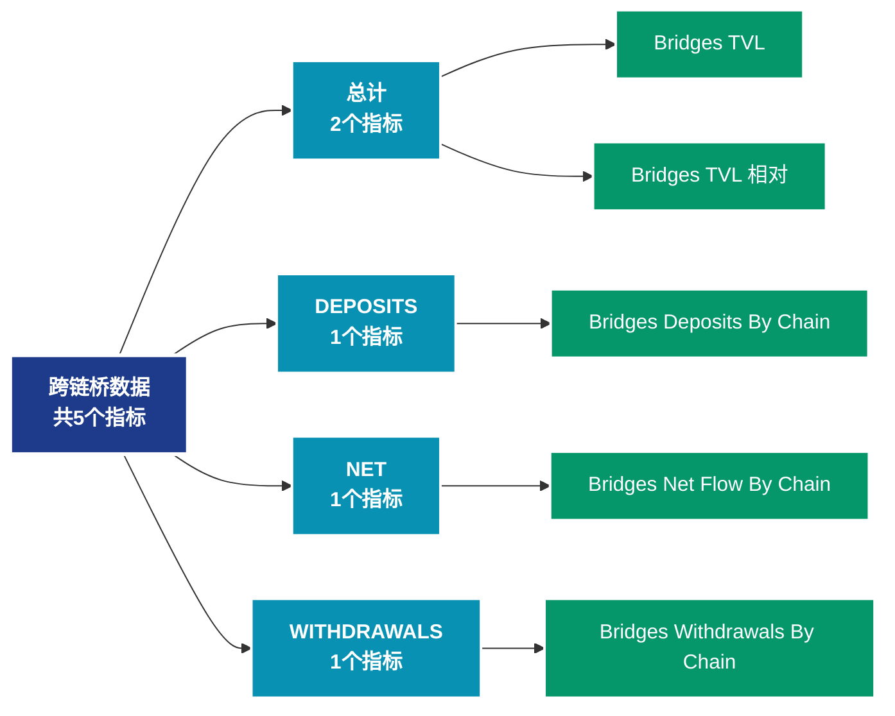

# 跨链桥数据 (bridges)

## 📝 类别描述

跨链桥协议数据，包括锁定量、跨链交易量等桥接相关指标。

## 📊 指标概览

本类别共包含 **5** 个指标，涵盖以下主要子类别：

| 子类别 | 指标数量 | 主要功能 |
|--------|----------|----------|
| 总计 | 2 | 专门数据分析 |
| DEPOSITS | 1 | 专门数据分析 |
| NET | 1 | 专门数据分析 |
| WITHDRAWALS | 1 | 专门数据分析 |

## 🎨 指标体系结构图



## 📂 详细指标说明

### 📊 总计（2个指标）

本子类别包含以下详细指标：

#### 1. Bridges TVL

- **指标代码**: `total_value_locked_by_chain`
- **API路径**: `/v1/metrics/bridges/total_value_locked_by_chain`
- **英文名称**: Bridges TVL

**英文原文：**
The Total Value Locked (TVL) in bridges measures the total USD value that is locked within the Ethereum side of bridge smart contracts. Locked tokens are not available on the Ethereum chain, but are available on the target blockchains. An increasing TVL means that value is flowing out of Ethereum and into other target blockchains, whilst a decreasing TVL means the value is flowing back into Ethereum. Bridge TVL is computed daily, by multiplying the number of tokens locked within the bridge smart contracts, by the latest daily price for each token.

Bridges are protocols that enable digital assets to be transferred from one blockchain to another. When an asset is transferred out of Ethereum, it gets deposited and locked into a bridge smart contract. When the asset is transferred back to Ethereum, it is withdrawn and released from the smart contract.

This metric only includes bridge contracts on the Ethereum side. The bridges included in this metric cover bridge deposits into both L1 and L2 blockchains, providing information on the value transferred to both L1 competitors, and L2 scaling solutions. Each bridge included in this metric represents a single blockchain, except the ones labeled as  multichain. That label is used to represent bridges that allow transferring assets across multiple different chains.

**中文解释：**
分析Bridges TVL相关的链上数据。这个指标通过追踪区块链上的实时数据，提供了传统金融分析无法获得的透明度和洞察力。链上数据的优势在于：1）数据真实可验证；2）实时更新无延迟；3）覆盖所有参与者。通过综合分析多个链上指标，投资者可以做出更明智的决策，研究人员可以深入理解市场机制。

**使用示例**：
```python
# 获取Bridges TVL数据
df = client.get_metric(
    "/v1/metrics/bridges/total_value_locked_by_chain",
    asset="BTC",
    resolution="24h"
)
```

---

#### 2. Bridges TVL 相对

- **指标代码**: `total_value_locked_by_chain_relative`
- **API路径**: `/v1/metrics/bridges/total_value_locked_by_chain_relative`
- **英文名称**: Bridges TVL Relative

**英文原文：**
This metric presents the Relative Total Value Locked (TVL dominance) of each target blockchain bridge compared to the total TVL across all bridges. A rising relative TVL indicates that the target blockchain is growing in USD denominated TVL dominance compared to the others (and vice versa). Bridge TVL is computed daily, by multiplying the number of tokens locked within the bridge smart contract, by the latest daily price of each token. Relative TVL is then computed by dividing the TVL of each bridge by the total TVL across all bridges.

Bridges are protocols that enable digital assets to be transferred from one blockchain to another. When an asset is transferred out of Ethereum, it gets deposited and locked into a bridge smart contract. When the asset is transferred back to Ethereum, it is withdrawn and released from the smart contract.

This metric only includes bridge contracts on the Ethereum side. The bridges included in this metric cover bridge deposits into both L1 and L2 blockchains, providing information on the value transferred to both L1 competitors, and L2 scaling solutions. Each bridge included in this metric represents a single blockchain, except the ones labeled as  multichain. That label is used to represent bridges that allow transferring assets across multiple different chains.

**中文解释：**
分析Bridges TVL Relative相关的链上数据。这个指标通过追踪区块链上的实时数据，提供了传统金融分析无法获得的透明度和洞察力。链上数据的优势在于：1）数据真实可验证；2）实时更新无延迟；3）覆盖所有参与者。通过综合分析多个链上指标，投资者可以做出更明智的决策，研究人员可以深入理解市场机制。

**使用示例**：
```python
# 获取Bridges TVL 相对数据
df = client.get_metric(
    "/v1/metrics/bridges/total_value_locked_by_chain_relative",
    asset="BTC",
    resolution="24h"
)
```

---

### 📊 DEPOSITS（1个指标）

本子类别包含以下详细指标：

#### 1. Bridges Deposits By Chain

- **指标代码**: `deposits_by_chain`
- **API路径**: `/v1/metrics/bridges/deposits_by_chain`
- **英文名称**: Bridges Deposits By Chain

**英文原文：**
This metric measures the USD value which is deposited into bridge smart contracts on Ethereum, and is therefore flowing out of the Ethereum blockchain, and into target blockchains. Deposit Volume is computed daily by multiplying the number of tokens deposited into bridges by the latest daily price of each token.

Bridges are protocols that enable digital assets to be transferred from one blockchain to another. When an asset is transferred out of Ethereum, it gets deposited and locked into a bridge smart contract. When the asset is transferred back to Ethereum, it is withdrawn and released from the smart contract.

This metric only includes bridge contracts on the Ethereum side. The bridges included in this metric cover bridge deposits into both L1 and L2 blockchains, providing information on the value transferred to both L1 competitors, and L2 scaling solutions. Each bridge included in this metric represents a single blockchain, except the ones labeled as  multichain. That label is used to represent bridges that allow transferring assets across multiple different chains.

**中文解释：**
分析Bridges Deposits By Chain相关的链上数据。这个指标通过追踪区块链上的实时数据，提供了传统金融分析无法获得的透明度和洞察力。链上数据的优势在于：1）数据真实可验证；2）实时更新无延迟；3）覆盖所有参与者。通过综合分析多个链上指标，投资者可以做出更明智的决策，研究人员可以深入理解市场机制。

**使用示例**：
```python
# 获取Bridges Deposits By Chain数据
df = client.get_metric(
    "/v1/metrics/bridges/deposits_by_chain",
    asset="BTC",
    resolution="24h"
)
```

---

### 📊 NET（1个指标）

本子类别包含以下详细指标：

#### 1. Bridges Net Flow By Chain

- **指标代码**: `net_volume_by_chain`
- **API路径**: `/v1/metrics/bridges/net_volume_by_chain`
- **英文名称**: Bridges Net Flow By Chain

**英文原文：**
This metric shows the net USD value flowing into, or out of Ethereum bridge smart contracts, calculated as bridge deposits minus bridge withdrawals. It can also be considered to represent the net USD value flowing in, or out of the Ethereum blockchain via bridges. A positive value means that there is more value being deposited into bridges, which translates into a net value outflow from Ethereum. On the other hand, a negative value means that there is more USD value being withdrawn from bridges, which translates into more USD value flowing back into Ethereum.

Bridges are protocols that enable digital assets to be transferred from one blockchain to another. When an asset is transferred out of Ethereum, it gets deposited and locked into a bridge smart contract. When the asset is transferred back to Ethereum, it is withdrawn and released from the smart contract.

This metric only includes bridge contracts on the Ethereum side. The bridges included in this metric cover bridge deposits into both L1 and L2 blockchains, providing information on the value transferred to both L1 competitors, and L2 scaling solutions. Each bridge included in this metric represents a single blockchain, except the ones labeled as  multichain. That label is used to represent bridges that allow transferring assets across multiple different chains.

**中文解释：**
分析Bridges Net Flow By Chain相关的链上数据。这个指标通过追踪区块链上的实时数据，提供了传统金融分析无法获得的透明度和洞察力。链上数据的优势在于：1）数据真实可验证；2）实时更新无延迟；3）覆盖所有参与者。通过综合分析多个链上指标，投资者可以做出更明智的决策，研究人员可以深入理解市场机制。

**使用示例**：
```python
# 获取Bridges Net Flow By Chain数据
df = client.get_metric(
    "/v1/metrics/bridges/net_volume_by_chain",
    asset="BTC",
    resolution="24h"
)
```

---

### 📊 WITHDRAWALS（1个指标）

本子类别包含以下详细指标：

#### 1. Bridges Withdrawals By Chain

- **指标代码**: `withdrawals_by_chain`
- **API路径**: `/v1/metrics/bridges/withdrawals_by_chain`
- **英文名称**: Bridges Withdrawals By Chain

**英文原文：**
This metric measures the USD value which is withdrawn from bridge smart contracts on Ethereum, and is therefore flowing into the Ethereum blockchain, and out of target blockchains. Withdrawal Volume is computed daily by multiplying the number of tokens withdrawn from bridges by the latest daily price of each token.

Bridges are protocols that enable digital assets to be transferred from one blockchain to another. When an asset is transferred out of Ethereum, it gets deposited and locked into a bridge smart contract. When the asset is transferred back to Ethereum, it is withdrawn and released from the smart contract.

This metric only includes bridge contracts on the Ethereum side. The bridges included in this metric cover bridge deposits into both L1 and L2 blockchains, providing information on the value transferred to both L1 competitors, and L2 scaling solutions. Each bridge included in this metric represents a single blockchain, except the ones labeled as  multichain. That label is used to represent bridges that allow transferring assets across multiple different chains.

**中文解释：**
分析Bridges Withdrawals By Chain相关的链上数据。这个指标通过追踪区块链上的实时数据，提供了传统金融分析无法获得的透明度和洞察力。链上数据的优势在于：1）数据真实可验证；2）实时更新无延迟；3）覆盖所有参与者。通过综合分析多个链上指标，投资者可以做出更明智的决策，研究人员可以深入理解市场机制。

**使用示例**：
```python
# 获取Bridges Withdrawals By Chain数据
df = client.get_metric(
    "/v1/metrics/bridges/withdrawals_by_chain",
    asset="BTC",
    resolution="24h"
)
```

---

## 📊 完整指标列表

| # | 指标名称 | 指标代码 | API路径 |
|---|----------|----------|---------|
| 1 | Bridges Deposits By Chain | `deposits_by_chain` | `/v1/metrics/bridges/deposits_by_chain` |
| 2 | Bridges Net Flow By Chain | `net_volume_by_chain` | `/v1/metrics/bridges/net_volume_by_chain` |
| 3 | Bridges TVL | `total_value_locked_by_chain` | `/v1/metrics/bridges/total_value_locked_by_chain` |
| 4 | Bridges TVL 相对 | `total_value_locked_by_chain_relative` | `/v1/metrics/bridges/total_value_locked_by_chain_relative` |
| 5 | Bridges Withdrawals By Chain | `withdrawals_by_chain` | `/v1/metrics/bridges/withdrawals_by_chain` |

## 💻 代码示例

### Python SDK 使用示例

```python
from glassnode import GlassnodeClient

# 初始化客户端
client = GlassnodeClient(api_key="YOUR_API_KEY")

# 获取单个指标
data = client.get(
    "/v1/metrics/addresses/active_count",
    asset="BTC",
    resolution="24h",
    since="2024-01-01"
)

# 批量获取多个指标
metrics = [
    "active_count",
    "new",
    "non_zero_count"
]

results = {}
for metric in metrics:
    results[metric] = client.get(
        f"/v1/metrics/addresses/{metric}",
        asset="BTC"
    )
```

## 📚 参考资源

- [Glassnode官方文档](https://docs.glassnode.com)
- [Glassnode Studio](https://studio.glassnode.com)
- [API访问说明](https://docs.glassnode.com/basic-api/api)

---

*最后更新：2024年*
