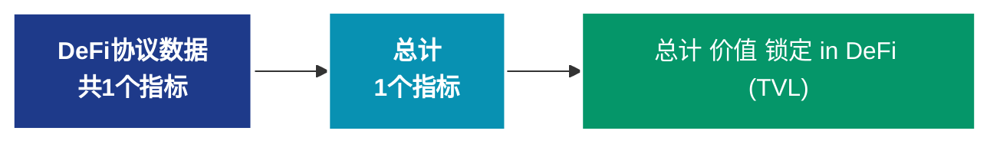

# DeFi协议数据 (defi)

## 📝 类别描述

去中心化金融协议数据，包括TVL、借贷、DEX交易量等DeFi生态指标。

## 📊 指标概览

本类别共包含 **1** 个指标，涵盖以下主要子类别：

| 子类别 | 指标数量 | 主要功能 |
|--------|----------|----------|
| 总计 | 1 | 专门数据分析 |

## 🎨 指标体系结构图



## 📂 详细指标说明

### 📊 总计（1个指标）

本子类别包含以下详细指标：

#### 1. 总计 价值 锁定 in DeFi (TVL)

- **指标代码**: `total_value_locked`
- **API路径**: `/v1/metrics/defi/total_value_locked`
- **英文名称**: Total Value Locked in DeFi (TVL)

**英文原文：**
The total value locked in all of DeFi. Source: DeFi Lama.

**中文解释：**
分析Total Value Locked in DeFi (TVL)相关的链上数据。这个指标通过追踪区块链上的实时数据，提供了传统金融分析无法获得的透明度和洞察力。链上数据的优势在于：1）数据真实可验证；2）实时更新无延迟；3）覆盖所有参与者。通过综合分析多个链上指标，投资者可以做出更明智的决策，研究人员可以深入理解市场机制。

**使用示例**：
```python
# 获取总计 价值 锁定 in DeFi (TVL)数据
df = client.get_metric(
    "/v1/metrics/defi/total_value_locked",
    asset="BTC",
    resolution="24h"
)
```

---

## 📊 完整指标列表

| # | 指标名称 | 指标代码 | API路径 |
|---|----------|----------|---------|
| 1 | 总计 价值 锁定 in DeFi (TVL) | `total_value_locked` | `/v1/metrics/defi/total_value_locked` |

## 💻 代码示例

### Python SDK 使用示例

```python
from glassnode import GlassnodeClient

# 初始化客户端
client = GlassnodeClient(api_key="YOUR_API_KEY")

# 获取单个指标
data = client.get(
    "/v1/metrics/addresses/active_count",
    asset="BTC",
    resolution="24h",
    since="2024-01-01"
)

# 批量获取多个指标
metrics = [
    "active_count",
    "new",
    "non_zero_count"
]

results = {}
for metric in metrics:
    results[metric] = client.get(
        f"/v1/metrics/addresses/{metric}",
        asset="BTC"
    )
```

## 📚 参考资源

- [Glassnode官方文档](https://docs.glassnode.com)
- [Glassnode Studio](https://studio.glassnode.com)
- [API访问说明](https://docs.glassnode.com/basic-api/api)

---

*最后更新：2024年*
