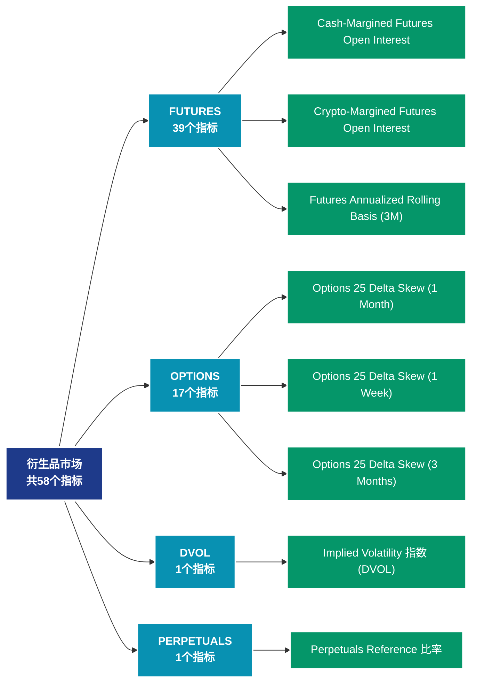

# 衍生品市场 (derivatives)

## 📝 类别描述

衍生品市场数据，包括期货、期权的持仓量、资金费率、清算等衍生品指标。

## 📊 指标概览

本类别共包含 **58** 个指标，涵盖以下主要子类别：

| 子类别 | 指标数量 | 主要功能 |
|--------|----------|----------|
| FUTURES | 39 | 专门数据分析 |
| OPTIONS | 17 | 专门数据分析 |
| DVOL | 1 | 专门数据分析 |
| PERPETUALS | 1 | 专门数据分析 |

## 🎨 指标体系结构图



## 📂 详细指标说明

### 📊 FUTURES（39个指标）

本子类别包含以下详细指标：

#### 1. Cash-Margined Futures Open Interest

- **指标代码**: `futures_open_interest_cash_margin_sum`
- **API路径**: `/v1/metrics/derivatives/futures_open_interest_cash_margin_sum`
- **英文名称**: Cash-Margined Futures Open Interest

**英文原文：**
The total amount of futures contracts open interest that is margined in USD or USD-pegged stablecoins. Stablecoins include USDT, USDC and BUSD.

**中文解释：**
分析Cash-Margined Futures Open Interest相关的链上数据。这个指标通过追踪区块链上的实时数据，提供了传统金融分析无法获得的透明度和洞察力。链上数据的优势在于：1）数据真实可验证；2）实时更新无延迟；3）覆盖所有参与者。通过综合分析多个链上指标，投资者可以做出更明智的决策，研究人员可以深入理解市场机制。

**使用示例**：
```python
# 获取Cash-Margined Futures Open Interest数据
df = client.get_metric(
    "/v1/metrics/derivatives/futures_open_interest_cash_margin_sum",
    asset="BTC",
    resolution="24h"
)
```

---

#### 2. Crypto-Margined Futures Open Interest

- **指标代码**: `futures_open_interest_crypto_margin_sum`
- **API路径**: `/v1/metrics/derivatives/futures_open_interest_crypto_margin_sum`
- **英文名称**: Crypto-Margined Futures Open Interest

**英文原文：**
The total amount of futures contracts open interest that is margined in the native coin (e.g. BTC) and not in USD or stablecoin. Note that for Ethereum contracts can be margined both in ETH or BTC.

**中文解释：**
分析Crypto-Margined Futures Open Interest相关的链上数据。这个指标通过追踪区块链上的实时数据，提供了传统金融分析无法获得的透明度和洞察力。链上数据的优势在于：1）数据真实可验证；2）实时更新无延迟；3）覆盖所有参与者。通过综合分析多个链上指标，投资者可以做出更明智的决策，研究人员可以深入理解市场机制。

**使用示例**：
```python
# 获取Crypto-Margined Futures Open Interest数据
df = client.get_metric(
    "/v1/metrics/derivatives/futures_open_interest_crypto_margin_sum",
    asset="BTC",
    resolution="24h"
)
```

---

#### 3. Futures Annualized Rolling Basis (3M)

- **指标代码**: `futures_annualized_basis_3m`
- **API路径**: `/v1/metrics/derivatives/futures_annualized_basis_3m`
- **英文名称**: Futures Annualized Rolling Basis (3M)

**英文原文：**
The 3 Month Futures Annualized Rolling Basis measures the annualized yield (percent return) that can be had by buying a spot asset and simultaneously selling a futures contract on that asset that expires in 3 months. Due to various supply, demand, and liquidity factors, crypto futures contracts will often trade at a price above that of the spot price. When this happens, market participants can do what is referred to commonly as a ‘basis trade’, allowing them to profit the difference in price between spot and a futures contract without taking on any directional exposure.

**中文解释：**
分析Futures Annualized Rolling Basis (3M)相关的链上数据。这个指标通过追踪区块链上的实时数据，提供了传统金融分析无法获得的透明度和洞察力。链上数据的优势在于：1）数据真实可验证；2）实时更新无延迟；3）覆盖所有参与者。通过综合分析多个链上指标，投资者可以做出更明智的决策，研究人员可以深入理解市场机制。

**使用示例**：
```python
# 获取Futures Annualized Rolling Basis (3M)数据
df = client.get_metric(
    "/v1/metrics/derivatives/futures_annualized_basis_3m",
    asset="BTC",
    resolution="24h"
)
```

---

#### 4. Futures Buy 交易量

- **指标代码**: `futures_volume_buy_sum`
- **API路径**: `/v1/metrics/derivatives/futures_volume_buy_sum`
- **英文名称**: Futures Buy Volume

**英文原文：**
The Futures Buying Volume Intraday metric measures the total trading volume (in USD value) where buyers were the aggressors, focusing on the native asset against USD-related currencies (both fiat and stablecoins) within a specific intraday time frame. This metric encapsulates both perpetual and expiry futures contracts, providing a comprehensive view of short-term market sentiment and immediate buying pressure.

**中文解释：**
分析Futures Buy Volume相关的链上数据。这个指标通过追踪区块链上的实时数据，提供了传统金融分析无法获得的透明度和洞察力。链上数据的优势在于：1）数据真实可验证；2）实时更新无延迟；3）覆盖所有参与者。通过综合分析多个链上指标，投资者可以做出更明智的决策，研究人员可以深入理解市场机制。

**使用示例**：
```python
# 获取Futures Buy 交易量数据
df = client.get_metric(
    "/v1/metrics/derivatives/futures_volume_buy_sum",
    asset="BTC",
    resolution="24h"
)
```

---

#### 5. Futures Buy 交易量 24h

- **指标代码**: `futures_volume_buy_daily_sum`
- **API路径**: `/v1/metrics/derivatives/futures_volume_buy_daily_sum`
- **英文名称**: Futures Buy Volume 24h

**英文原文：**
The Futures Buying Volume metric measures the total trading volume—over a 24-hour rolling window—of all futures contracts, including both expiry and perpetual contracts, in USD value where buyers were the aggressors. It focuses on the native asset traded against USD-related currencies (both fiat and stablecoins). This metric is useful for understanding market sentiment and identifying buying pressure within the most recent 24 hours, determined by your chosen data resolution (e.g., hourly, 10-minute intervals).

**中文解释：**
分析Futures Buy Volume 24h相关的链上数据。这个指标通过追踪区块链上的实时数据，提供了传统金融分析无法获得的透明度和洞察力。链上数据的优势在于：1）数据真实可验证；2）实时更新无延迟；3）覆盖所有参与者。通过综合分析多个链上指标，投资者可以做出更明智的决策，研究人员可以深入理解市场机制。

**使用示例**：
```python
# 获取Futures Buy 交易量 24h数据
df = client.get_metric(
    "/v1/metrics/derivatives/futures_volume_buy_daily_sum",
    asset="BTC",
    resolution="24h"
)
```

---

#### 6. Futures Buy 交易量 Perpetual

- **指标代码**: `futures_volume_buy_perpetual_sum`
- **API路径**: `/v1/metrics/derivatives/futures_volume_buy_perpetual_sum`
- **英文名称**: Futures Buy Volume Perpetual

**英文原文：**
Perpetual futures contracts are a type of derivative that allows traders to speculate on the price of digital assets without an expiration date. The Futures Buying Volume Intraday Perpetual metric measures the total trading volume (in USD value) where buyers were the aggressors, focusing on the native asset against USD-related currencies (both fiat and stablecoins) within a specific intraday time frame. This metric is useful for understanding short-term market sentiment and identifying immediate buying pressure. For example, you might ask, "How much buying activity has there been for Ethereum perpetual futures in the last hour?"

**中文解释：**
分析Futures Buy Volume Perpetual相关的链上数据。这个指标通过追踪区块链上的实时数据，提供了传统金融分析无法获得的透明度和洞察力。链上数据的优势在于：1）数据真实可验证；2）实时更新无延迟；3）覆盖所有参与者。通过综合分析多个链上指标，投资者可以做出更明智的决策，研究人员可以深入理解市场机制。

**使用示例**：
```python
# 获取Futures Buy 交易量 Perpetual数据
df = client.get_metric(
    "/v1/metrics/derivatives/futures_volume_buy_perpetual_sum",
    asset="BTC",
    resolution="24h"
)
```

---

#### 7. Futures Buy 交易量 Perpetual 24h

- **指标代码**: `futures_volume_buy_daily_perpetual_sum`
- **API路径**: `/v1/metrics/derivatives/futures_volume_buy_daily_perpetual_sum`
- **英文名称**: Futures Buy Volume Perpetual 24h

**英文原文：**
Perpetual futures contracts are a type of derivative that allows traders to speculate on the price of digital assets without an expiration date. The Futures Buying Volume Perpetual metric measures the total trading volume (in USD value) where buyers were the aggressors, focusing on the native asset against USD-related currencies (both fiat and stablecoins). This metric is useful for understanding market sentiment and identifying buying pressure within a specific time frame, determined by your chosen data resolution (e.g., hourly, 10-minute intervals). For example, you might ask, "How much buying activity has there been for Bitcoin perpetual futures in the last 24 hours?"

**中文解释：**
分析Futures Buy Volume Perpetual 24h相关的链上数据。这个指标通过追踪区块链上的实时数据，提供了传统金融分析无法获得的透明度和洞察力。链上数据的优势在于：1）数据真实可验证；2）实时更新无延迟；3）覆盖所有参与者。通过综合分析多个链上指标，投资者可以做出更明智的决策，研究人员可以深入理解市场机制。

**使用示例**：
```python
# 获取Futures Buy 交易量 Perpetual 24h数据
df = client.get_metric(
    "/v1/metrics/derivatives/futures_volume_buy_daily_perpetual_sum",
    asset="BTC",
    resolution="24h"
)
```

---

#### 8. Futures Estimated Leverage 比例

- **指标代码**: `futures_estimated_leverage_ratio`
- **API路径**: `/v1/metrics/derivatives/futures_estimated_leverage_ratio`
- **英文名称**: Futures Estimated Leverage Ratio

**英文原文：**
The Estimated Leverage Ratio is defined as the ratio of the open interest in futures contracts and the balance of the corresponding exchange.

**中文解释：**
分析Futures Estimated Leverage Ratio相关的链上数据。这个指标通过追踪区块链上的实时数据，提供了传统金融分析无法获得的透明度和洞察力。链上数据的优势在于：1）数据真实可验证；2）实时更新无延迟；3）覆盖所有参与者。通过综合分析多个链上指标，投资者可以做出更明智的决策，研究人员可以深入理解市场机制。

**使用示例**：
```python
# 获取Futures Estimated Leverage 比例数据
df = client.get_metric(
    "/v1/metrics/derivatives/futures_estimated_leverage_ratio",
    asset="BTC",
    resolution="24h"
)
```

---

#### 9. Futures Long Liquidations (平均值)

- **指标代码**: `futures_liquidated_volume_long_mean`
- **API路径**: `/v1/metrics/derivatives/futures_liquidated_volume_long_mean`
- **英文名称**: Futures Long Liquidations (Mean)

**英文原文：**
The mean liquidated volume from long positions in futures contracts.

**中文解释：**
分析Futures Long Liquidations (Mean)相关的链上数据。这个指标通过追踪区块链上的实时数据，提供了传统金融分析无法获得的透明度和洞察力。链上数据的优势在于：1）数据真实可验证；2）实时更新无延迟；3）覆盖所有参与者。通过综合分析多个链上指标，投资者可以做出更明智的决策，研究人员可以深入理解市场机制。

**使用示例**：
```python
# 获取Futures Long Liquidations (平均值)数据
df = client.get_metric(
    "/v1/metrics/derivatives/futures_liquidated_volume_long_mean",
    asset="BTC",
    resolution="24h"
)
```

---

#### 10. Futures Long Liquidations (总计)

- **指标代码**: `futures_liquidated_volume_long_sum`
- **API路径**: `/v1/metrics/derivatives/futures_liquidated_volume_long_sum`
- **英文名称**: Futures Long Liquidations (Total)

**英文原文：**
The sum liquidated volume from long positions in futures contracts.

**中文解释：**
分析Futures Long Liquidations (Total)相关的链上数据。这个指标通过追踪区块链上的实时数据，提供了传统金融分析无法获得的透明度和洞察力。链上数据的优势在于：1）数据真实可验证；2）实时更新无延迟；3）覆盖所有参与者。通过综合分析多个链上指标，投资者可以做出更明智的决策，研究人员可以深入理解市场机制。

**使用示例**：
```python
# 获取Futures Long Liquidations (总计)数据
df = client.get_metric(
    "/v1/metrics/derivatives/futures_liquidated_volume_long_sum",
    asset="BTC",
    resolution="24h"
)
```

---

#### 11. Futures Long Liquidations Dominance

- **指标代码**: `futures_liquidated_volume_long_relative`
- **API路径**: `/v1/metrics/derivatives/futures_liquidated_volume_long_relative`
- **英文名称**: Futures Long Liquidations Dominance

**英文原文：**
The percentage of long liquidations, i.e. long liquidations / (long liquidations + short liquidations). 50 indicate more longs liquidated, values below 50% more short liquidated.

**中文解释：**
分析Futures Long Liquidations Dominance相关的链上数据。这个指标通过追踪区块链上的实时数据，提供了传统金融分析无法获得的透明度和洞察力。链上数据的优势在于：1）数据真实可验证；2）实时更新无延迟；3）覆盖所有参与者。通过综合分析多个链上指标，投资者可以做出更明智的决策，研究人员可以深入理解市场机制。

**使用示例**：
```python
# 获取Futures Long Liquidations Dominance数据
df = client.get_metric(
    "/v1/metrics/derivatives/futures_liquidated_volume_long_relative",
    asset="BTC",
    resolution="24h"
)
```

---

#### 12. Futures Open Interest

- **指标代码**: `futures_open_interest_sum`
- **API路径**: `/v1/metrics/derivatives/futures_open_interest_sum`
- **英文名称**: Futures Open Interest

**英文原文：**
The total amount of funds allocated in open futures contracts. Use dropdown above chart to select individual exchanges.

**中文解释：**
分析Futures Open Interest相关的链上数据。这个指标通过追踪区块链上的实时数据，提供了传统金融分析无法获得的透明度和洞察力。链上数据的优势在于：1）数据真实可验证；2）实时更新无延迟；3）覆盖所有参与者。通过综合分析多个链上指标，投资者可以做出更明智的决策，研究人员可以深入理解市场机制。

**使用示例**：
```python
# 获取Futures Open Interest数据
df = client.get_metric(
    "/v1/metrics/derivatives/futures_open_interest_sum",
    asset="BTC",
    resolution="24h"
)
```

---

#### 13. Futures Open Interest (Current)

- **指标代码**: `futures_open_interest_latest`
- **API路径**: `/v1/metrics/derivatives/futures_open_interest_latest`
- **英文名称**: Futures Open Interest (Current)

**英文原文：**
The current amount of allocated funds in futures contracts per exchange. Values are updated every 10 min.

**中文解释：**
分析Futures Open Interest (Current)相关的链上数据。这个指标通过追踪区块链上的实时数据，提供了传统金融分析无法获得的透明度和洞察力。链上数据的优势在于：1）数据真实可验证；2）实时更新无延迟；3）覆盖所有参与者。通过综合分析多个链上指标，投资者可以做出更明智的决策，研究人员可以深入理解市场机制。

**使用示例**：
```python
# 获取Futures Open Interest (Current)数据
df = client.get_metric(
    "/v1/metrics/derivatives/futures_open_interest_latest",
    asset="BTC",
    resolution="24h"
)
```

---

#### 14. Futures Open Interest (Stacked)

- **指标代码**: `futures_open_interest_sum_all`
- **API路径**: `/v1/metrics/derivatives/futures_open_interest_sum_all`
- **英文名称**: Futures Open Interest (Stacked)

**英文原文：**
The total amount of funds allocated in open futures contracts.

**中文解释：**
分析Futures Open Interest (Stacked)相关的链上数据。这个指标通过追踪区块链上的实时数据，提供了传统金融分析无法获得的透明度和洞察力。链上数据的优势在于：1）数据真实可验证；2）实时更新无延迟；3）覆盖所有参与者。通过综合分析多个链上指标，投资者可以做出更明智的决策，研究人员可以深入理解市场机制。

**使用示例**：
```python
# 获取Futures Open Interest (Stacked)数据
df = client.get_metric(
    "/v1/metrics/derivatives/futures_open_interest_sum_all",
    asset="BTC",
    resolution="24h"
)
```

---

#### 15. Futures Open Interest Cash Margin Perpetual

- **指标代码**: `futures_open_interest_cash_margin_perpetual_sum`
- **API路径**: `/v1/metrics/derivatives/futures_open_interest_cash_margin_perpetual_sum`
- **英文名称**: Futures Open Interest Cash Margin Perpetual

**英文原文：**
Perpetual futures contracts are a type of derivative that allows traders to speculate on the price of digital assets without an expiration date. The Futures Open Interest Cash Margin Perpetual metric measures the total amount of funds (in USD value) allocated in open perpetual futures contracts that are collateralized with cash. This metric is useful for assessing the level of market participation and the amount of capital at risk in cash-margined perpetual futures. For example, you might ask, "What is the total cash-margined open interest for Ethereum perpetual futures across all exchanges?"

**中文解释：**
分析Futures Open Interest Cash Margin Perpetual相关的链上数据。这个指标通过追踪区块链上的实时数据，提供了传统金融分析无法获得的透明度和洞察力。链上数据的优势在于：1）数据真实可验证；2）实时更新无延迟；3）覆盖所有参与者。通过综合分析多个链上指标，投资者可以做出更明智的决策，研究人员可以深入理解市场机制。

**使用示例**：
```python
# 获取Futures Open Interest Cash Margin Perpetual数据
df = client.get_metric(
    "/v1/metrics/derivatives/futures_open_interest_cash_margin_perpetual_sum",
    asset="BTC",
    resolution="24h"
)
```

---

#### 16. Futures Open Interest Crypto Margin Perpetual

- **指标代码**: `futures_open_interest_crypto_margin_perpetual_sum`
- **API路径**: `/v1/metrics/derivatives/futures_open_interest_crypto_margin_perpetual_sum`
- **英文名称**: Futures Open Interest Crypto Margin Perpetual

**英文原文：**
Perpetual futures contracts are a type of derivative that allows traders to speculate on the price of digital assets without an expiration date. The Futures Open Interest Crypto Margin Perpetual metric measures the total amount of funds (in USD value) allocated in open perpetual futures contracts that are collateralized with digital assets instead of cash. This metric is useful for assessing the level of market participation and the amount of capital at risk in crypto-margined perpetual futures. For example, you might ask, "What is the total crypto-margined open interest for Bitcoin perpetual futures across all exchanges?"

**中文解释：**
分析Futures Open Interest Crypto Margin Perpetual相关的链上数据。这个指标通过追踪区块链上的实时数据，提供了传统金融分析无法获得的透明度和洞察力。链上数据的优势在于：1）数据真实可验证；2）实时更新无延迟；3）覆盖所有参与者。通过综合分析多个链上指标，投资者可以做出更明智的决策，研究人员可以深入理解市场机制。

**使用示例**：
```python
# 获取Futures Open Interest Crypto Margin Perpetual数据
df = client.get_metric(
    "/v1/metrics/derivatives/futures_open_interest_crypto_margin_perpetual_sum",
    asset="BTC",
    resolution="24h"
)
```

---

#### 17. Futures Open Interest Crypto Margin 相对 Perpetual

- **指标代码**: `futures_open_interest_crypto_margin_relative_perpetual`
- **API路径**: `/v1/metrics/derivatives/futures_open_interest_crypto_margin_relative_perpetual`
- **英文名称**: Futures Open Interest Crypto Margin Relative Perpetual

**英文原文：**
Perpetual futures contracts are a type of derivative that allows traders to speculate on the price of digital assets without an expiration date. The Futures Open Interest Crypto Margin Relative Perpetual metric measures the proportion of open perpetual futures contracts that are collateralized with digital assets relative to those collateralized with cash. This metric is useful for understanding the preference of market participants for using digital assets versus cash as collateral, which can provide insights into market confidence and risk tolerance. For example, you might ask, "What is the relative proportion of crypto-margined versus cash-margined open interest for Ethereum perpetual futures?"

**中文解释：**
分析Futures Open Interest Crypto Margin Relative Perpetual相关的链上数据。这个指标通过追踪区块链上的实时数据，提供了传统金融分析无法获得的透明度和洞察力。链上数据的优势在于：1）数据真实可验证；2）实时更新无延迟；3）覆盖所有参与者。通过综合分析多个链上指标，投资者可以做出更明智的决策，研究人员可以深入理解市场机制。

**使用示例**：
```python
# 获取Futures Open Interest Crypto Margin 相对 Perpetual数据
df = client.get_metric(
    "/v1/metrics/derivatives/futures_open_interest_crypto_margin_relative_perpetual",
    asset="BTC",
    resolution="24h"
)
```

---

#### 18. Futures Open Interest Perpetual

- **指标代码**: `futures_open_interest_perpetual_sum`
- **API路径**: `/v1/metrics/derivatives/futures_open_interest_perpetual_sum`
- **英文名称**: Futures Open Interest Perpetual

**英文原文：**
The total amount of funds allocated in open perpetual (non-expiring) futures contracts.

**中文解释：**
分析Futures Open Interest Perpetual相关的链上数据。这个指标通过追踪区块链上的实时数据，提供了传统金融分析无法获得的透明度和洞察力。链上数据的优势在于：1）数据真实可验证；2）实时更新无延迟；3）覆盖所有参与者。通过综合分析多个链上指标，投资者可以做出更明智的决策，研究人员可以深入理解市场机制。

**使用示例**：
```python
# 获取Futures Open Interest Perpetual数据
df = client.get_metric(
    "/v1/metrics/derivatives/futures_open_interest_perpetual_sum",
    asset="BTC",
    resolution="24h"
)
```

---

#### 19. Futures Open Interest Perpetual (Stacked)

- **指标代码**: `futures_open_interest_perpetual_sum_all`
- **API路径**: `/v1/metrics/derivatives/futures_open_interest_perpetual_sum_all`
- **英文名称**: Futures Open Interest Perpetual (Stacked)

**英文原文：**
The total amount of funds allocated in open perpetual (non-expiring) futures contracts.

**中文解释：**
分析Futures Open Interest Perpetual (Stacked)相关的链上数据。这个指标通过追踪区块链上的实时数据，提供了传统金融分析无法获得的透明度和洞察力。链上数据的优势在于：1）数据真实可验证；2）实时更新无延迟；3）覆盖所有参与者。通过综合分析多个链上指标，投资者可以做出更明智的决策，研究人员可以深入理解市场机制。

**使用示例**：
```python
# 获取Futures Open Interest Perpetual (Stacked)数据
df = client.get_metric(
    "/v1/metrics/derivatives/futures_open_interest_perpetual_sum_all",
    asset="BTC",
    resolution="24h"
)
```

---

#### 20. Futures Perpetual Funding 比率

- **指标代码**: `futures_funding_rate_perpetual`
- **API路径**: `/v1/metrics/derivatives/futures_funding_rate_perpetual`
- **英文名称**: Futures Perpetual Funding Rate

**英文原文：**
The average funding rate (in %) set by exchanges for perpetual futures contracts. When the rate is positive, long positions periodically pay short positions. Conversely, when the rate is negative, short positions periodically pay long positions. For a list of all supported exchanges and earliest available datapoints, please refer to our futures data documentation.

**Note:** The mean Funding Rate across exchanges is an average of each exchange&#x27;s Funding Rate weighted by the Open Interest of the corresponding exchange.

**中文解释：**
分析Futures Perpetual Funding Rate相关的链上数据。这个指标通过追踪区块链上的实时数据，提供了传统金融分析无法获得的透明度和洞察力。链上数据的优势在于：1）数据真实可验证；2）实时更新无延迟；3）覆盖所有参与者。通过综合分析多个链上指标，投资者可以做出更明智的决策，研究人员可以深入理解市场机制。

**使用示例**：
```python
# 获取Futures Perpetual Funding 比率数据
df = client.get_metric(
    "/v1/metrics/derivatives/futures_funding_rate_perpetual",
    asset="BTC",
    resolution="24h"
)
```

---

#### 21. Futures Perpetual Funding 比率 (All)

- **指标代码**: `futures_funding_rate_perpetual_all`
- **API路径**: `/v1/metrics/derivatives/futures_funding_rate_perpetual_all`
- **英文名称**: Futures Perpetual Funding Rate (All)

**英文原文：**
The average funding rate (in %) set by exchanges for perpetual futures contracts. When the rate is positive, long positions periodically pay short positions. Conversely, when the rate is negative, short positions periodically pay long positions. For a list of all supported exchanges and earliest available datapoints, please refer to our futures data documentation.

**Note:** The mean Funding Rate across exchanges is an average of each exchange&#x27;s Funding Rate weighted by the Open Interest of the corresponding exchange.

**中文解释：**
分析Futures Perpetual Funding Rate (All)相关的链上数据。这个指标通过追踪区块链上的实时数据，提供了传统金融分析无法获得的透明度和洞察力。链上数据的优势在于：1）数据真实可验证；2）实时更新无延迟；3）覆盖所有参与者。通过综合分析多个链上指标，投资者可以做出更明智的决策，研究人员可以深入理解市场机制。

**使用示例**：
```python
# 获取Futures Perpetual Funding 比率 (All)数据
df = client.get_metric(
    "/v1/metrics/derivatives/futures_funding_rate_perpetual_all",
    asset="BTC",
    resolution="24h"
)
```

---

#### 22. Futures Sell 交易量

- **指标代码**: `futures_volume_sell_sum`
- **API路径**: `/v1/metrics/derivatives/futures_volume_sell_sum`
- **英文名称**: Futures Sell Volume

**英文原文：**
The Futures Selling Volume Intraday metric measures the total trading volume (in USD value) where sellers were the aggressors, focusing on the native asset traded against USD-related currencies (both fiat and stablecoins) within a specific intraday time frame. This metric aggregates both expiry and perpetual futures contracts, providing a comprehensive view of immediate selling pressure in the futures market. This metric is useful for understanding short-term market sentiment and identifying immediate selling pressure. By analyzing intraday selling activity, traders can gain insights into potential short-term price movements and make timely decisions based on current market dynamics.

**中文解释：**
分析Futures Sell Volume相关的链上数据。这个指标通过追踪区块链上的实时数据，提供了传统金融分析无法获得的透明度和洞察力。链上数据的优势在于：1）数据真实可验证；2）实时更新无延迟；3）覆盖所有参与者。通过综合分析多个链上指标，投资者可以做出更明智的决策，研究人员可以深入理解市场机制。

**使用示例**：
```python
# 获取Futures Sell 交易量数据
df = client.get_metric(
    "/v1/metrics/derivatives/futures_volume_sell_sum",
    asset="BTC",
    resolution="24h"
)
```

---

#### 23. Futures Sell 交易量 24h

- **指标代码**: `futures_volume_sell_daily_sum`
- **API路径**: `/v1/metrics/derivatives/futures_volume_sell_daily_sum`
- **英文名称**: Futures Sell Volume 24h

**英文原文：**
The Futures Selling Volume metric measures the total trading volume (in USD value) where sellers were the aggressors, focusing on the native asset against USD-related currencies (both fiat and stablecoins) over a 24-hour rolling window. This metric aggregates both expiry and perpetual futures contracts, providing a comprehensive view of selling pressure in the futures market. This metric is useful for understanding market sentiment and identifying selling pressure within the most recent 24 hours, determined by your chosen data resolution (e.g., hourly, 10-minute intervals).

**中文解释：**
分析Futures Sell Volume 24h相关的链上数据。这个指标通过追踪区块链上的实时数据，提供了传统金融分析无法获得的透明度和洞察力。链上数据的优势在于：1）数据真实可验证；2）实时更新无延迟；3）覆盖所有参与者。通过综合分析多个链上指标，投资者可以做出更明智的决策，研究人员可以深入理解市场机制。

**使用示例**：
```python
# 获取Futures Sell 交易量 24h数据
df = client.get_metric(
    "/v1/metrics/derivatives/futures_volume_sell_daily_sum",
    asset="BTC",
    resolution="24h"
)
```

---

#### 24. Futures Sell 交易量 Perpetual

- **指标代码**: `futures_volume_sell_perpetual_sum`
- **API路径**: `/v1/metrics/derivatives/futures_volume_sell_perpetual_sum`
- **英文名称**: Futures Sell Volume Perpetual

**英文原文：**
Perpetual futures contracts are a type of derivative that allows traders to speculate on the price of digital assets without an expiration date. The Futures Selling Volume Intraday Perpetual metric measures the total trading volume (in USD value) where sellers were the aggressors, focusing on the native asset against USD-related currencies (both fiat and stablecoins) within a specific intraday time frame. This metric is useful for understanding short-term market sentiment and identifying immediate selling pressure. For example, you might ask, "How much selling activity has there been for Ethereum perpetual futures in the last hour?"

**中文解释：**
分析Futures Sell Volume Perpetual相关的链上数据。这个指标通过追踪区块链上的实时数据，提供了传统金融分析无法获得的透明度和洞察力。链上数据的优势在于：1）数据真实可验证；2）实时更新无延迟；3）覆盖所有参与者。通过综合分析多个链上指标，投资者可以做出更明智的决策，研究人员可以深入理解市场机制。

**使用示例**：
```python
# 获取Futures Sell 交易量 Perpetual数据
df = client.get_metric(
    "/v1/metrics/derivatives/futures_volume_sell_perpetual_sum",
    asset="BTC",
    resolution="24h"
)
```

---

#### 25. Futures Sell 交易量 Perpetual 24h

- **指标代码**: `futures_volume_sell_daily_perpetual_sum`
- **API路径**: `/v1/metrics/derivatives/futures_volume_sell_daily_perpetual_sum`
- **英文名称**: Futures Sell Volume Perpetual 24h

**英文原文：**
Perpetual futures contracts are a type of derivative that allows traders to speculate on the price of digital assets without an expiration date. The Futures Selling Volume Perpetual metric measures the total trading volume (in USD value) where sellers were the aggressors, focusing on the native asset against USD-related currencies (both fiat and stablecoins). This metric is useful for understanding market sentiment and identifying selling pressure within a specific time frame, determined by your chosen data resolution (e.g., hourly, 10-minute intervals). For example, you might ask, "How much selling activity has there been for Bitcoin perpetual futures in the last 24 hours?"

**中文解释：**
分析Futures Sell Volume Perpetual 24h相关的链上数据。这个指标通过追踪区块链上的实时数据，提供了传统金融分析无法获得的透明度和洞察力。链上数据的优势在于：1）数据真实可验证；2）实时更新无延迟；3）覆盖所有参与者。通过综合分析多个链上指标，投资者可以做出更明智的决策，研究人员可以深入理解市场机制。

**使用示例**：
```python
# 获取Futures Sell 交易量 Perpetual 24h数据
df = client.get_metric(
    "/v1/metrics/derivatives/futures_volume_sell_daily_perpetual_sum",
    asset="BTC",
    resolution="24h"
)
```

---

#### 26. Futures Short Liquidations (平均值)

- **指标代码**: `futures_liquidated_volume_short_mean`
- **API路径**: `/v1/metrics/derivatives/futures_liquidated_volume_short_mean`
- **英文名称**: Futures Short Liquidations (Mean)

**英文原文：**
The mean liquidated volume from short positions in futures contracts.

**中文解释：**
分析Futures Short Liquidations (Mean)相关的链上数据。这个指标通过追踪区块链上的实时数据，提供了传统金融分析无法获得的透明度和洞察力。链上数据的优势在于：1）数据真实可验证；2）实时更新无延迟；3）覆盖所有参与者。通过综合分析多个链上指标，投资者可以做出更明智的决策，研究人员可以深入理解市场机制。

**使用示例**：
```python
# 获取Futures Short Liquidations (平均值)数据
df = client.get_metric(
    "/v1/metrics/derivatives/futures_liquidated_volume_short_mean",
    asset="BTC",
    resolution="24h"
)
```

---

#### 27. Futures Short Liquidations (总计)

- **指标代码**: `futures_liquidated_volume_short_sum`
- **API路径**: `/v1/metrics/derivatives/futures_liquidated_volume_short_sum`
- **英文名称**: Futures Short Liquidations (Total)

**英文原文：**
The sum liquidated volume from short positions in futures contracts.

**中文解释：**
分析Futures Short Liquidations (Total)相关的链上数据。这个指标通过追踪区块链上的实时数据，提供了传统金融分析无法获得的透明度和洞察力。链上数据的优势在于：1）数据真实可验证；2）实时更新无延迟；3）覆盖所有参与者。通过综合分析多个链上指标，投资者可以做出更明智的决策，研究人员可以深入理解市场机制。

**使用示例**：
```python
# 获取Futures Short Liquidations (总计)数据
df = client.get_metric(
    "/v1/metrics/derivatives/futures_liquidated_volume_short_sum",
    asset="BTC",
    resolution="24h"
)
```

---

#### 28. Futures Term Structure

- **指标代码**: `futures_term_structure`
- **API路径**: `/v1/metrics/derivatives/futures_term_structure`
- **英文名称**: Futures Term Structure

**英文原文：**
The Futures Term Structure is a graphical representation of the pricing for futures contracts expiring at increasingly distant dates into the future. The most common state of the graph, an upwards slope, indicates a premium must be paid to purchase exposure, or delivery, of an asset in the future. A downwards slope conversely indicates a discounted rate on delivery of an asset in the future. Trends and dislocations within the graph can paint a picture of supply, demand, and liquidity for futures contracts expiring on different dates.

**中文解释：**
分析Futures Term Structure相关的链上数据。这个指标通过追踪区块链上的实时数据，提供了传统金融分析无法获得的透明度和洞察力。链上数据的优势在于：1）数据真实可验证；2）实时更新无延迟；3）覆盖所有参与者。通过综合分析多个链上指标，投资者可以做出更明智的决策，研究人员可以深入理解市场机制。

**使用示例**：
```python
# 获取Futures Term Structure数据
df = client.get_metric(
    "/v1/metrics/derivatives/futures_term_structure",
    asset="BTC",
    resolution="24h"
)
```

---

#### 29. Futures Term Structure by 交易所

- **指标代码**: `futures_term_structure_by_exchange`
- **API路径**: `/v1/metrics/derivatives/futures_term_structure_by_exchange`
- **英文名称**: Futures Term Structure by Exchange

**英文原文：**
The Futures Term Structure is a graphical representation of the pricing for futures contracts expiring at increasingly distant dates into the future. The most common state of the graph, an upwards slope, indicates a premium must be paid to purchase exposure, or delivery, of an asset in the future. A downwards slope conversely indicates a discounted rate on delivery of an asset in the future. Trends and dislocations within the graph can paint a picture of supply, demand, and liquidity for futures contracts expiring on different dates. Past states of the term structure (1 day, 2 days, 1 week, and 2 weeks ago) can be displayed alongside the latest state, showing recent impulses in the market and the evolution of the structure.

**中文解释：**
全面分析交易所相关的链上活动。交易所是连接链上和链下市场的关键节点，其资金流动直接影响市场供需。通过监测交易所数据，可以预判短期价格压力和市场情绪变化。

**使用示例**：
```python
# 获取Futures Term Structure by 交易所数据
df = client.get_metric(
    "/v1/metrics/derivatives/futures_term_structure_by_exchange",
    asset="BTC",
    resolution="24h"
)
```

---

#### 30. Futures 交易量

- **指标代码**: `futures_volume_sum`
- **API路径**: `/v1/metrics/derivatives/futures_volume_sum`
- **英文名称**: Futures Volume

**英文原文：**
The Futures Volume Intraday metric measures the total trading volume (in USD value) of all futures contracts within a specific intraday time frame, focusing on the native asset against USD-related currencies (both fiat and stablecoins). This metric is useful for assessing short-term market activity and liquidity in the futures market. For example, you might ask, "What is the total trading volume for Ethereum futures in the last hour?". Note: Buy and sell volumes do not always sum up to the total volume, as in rare cases, certain transactions cannot be definitively classified as either buys or sells.

**中文解释：**
分析Futures Volume相关的链上数据。这个指标通过追踪区块链上的实时数据，提供了传统金融分析无法获得的透明度和洞察力。链上数据的优势在于：1）数据真实可验证；2）实时更新无延迟；3）覆盖所有参与者。通过综合分析多个链上指标，投资者可以做出更明智的决策，研究人员可以深入理解市场机制。

**使用示例**：
```python
# 获取Futures 交易量数据
df = client.get_metric(
    "/v1/metrics/derivatives/futures_volume_sum",
    asset="BTC",
    resolution="24h"
)
```

---

#### 31. Futures 交易量 24h

- **指标代码**: `futures_volume_daily_sum`
- **API路径**: `/v1/metrics/derivatives/futures_volume_daily_sum`
- **英文名称**: Futures Volume 24h

**英文原文：**
The total volume traded in futures contracts in the last 24 hours. Use dropdown above chart to select individual exchanges. Note: Buy and sell volumes do not always sum up to the total volume, as in rare cases, certain transactions cannot be definitively classified as either buys or sells.

**中文解释：**
分析Futures Volume 24h相关的链上数据。这个指标通过追踪区块链上的实时数据，提供了传统金融分析无法获得的透明度和洞察力。链上数据的优势在于：1）数据真实可验证；2）实时更新无延迟；3）覆盖所有参与者。通过综合分析多个链上指标，投资者可以做出更明智的决策，研究人员可以深入理解市场机制。

**使用示例**：
```python
# 获取Futures 交易量 24h数据
df = client.get_metric(
    "/v1/metrics/derivatives/futures_volume_daily_sum",
    asset="BTC",
    resolution="24h"
)
```

---

#### 32. Futures 交易量 24h (Latest)

- **指标代码**: `futures_volume_daily_latest`
- **API路径**: `/v1/metrics/derivatives/futures_volume_daily_latest`
- **英文名称**: Futures Volume 24h (Latest)

**英文原文：**
The total volume traded in futures contracts per exchange over the last 24 hours. Values are updated every 10 min.

**中文解释：**
分析Futures Volume 24h (Latest)相关的链上数据。这个指标通过追踪区块链上的实时数据，提供了传统金融分析无法获得的透明度和洞察力。链上数据的优势在于：1）数据真实可验证；2）实时更新无延迟；3）覆盖所有参与者。通过综合分析多个链上指标，投资者可以做出更明智的决策，研究人员可以深入理解市场机制。

**使用示例**：
```python
# 获取Futures 交易量 24h (Latest)数据
df = client.get_metric(
    "/v1/metrics/derivatives/futures_volume_daily_latest",
    asset="BTC",
    resolution="24h"
)
```

---

#### 33. Futures 交易量 24h (Stacked)

- **指标代码**: `futures_volume_daily_sum_all`
- **API路径**: `/v1/metrics/derivatives/futures_volume_daily_sum_all`
- **英文名称**: Futures Volume 24h (Stacked)

**英文原文：**
The total volume traded in futures contracts in the last 24 hours. Use dropdown above chart to select individual exchanges.

**中文解释：**
分析Futures Volume 24h (Stacked)相关的链上数据。这个指标通过追踪区块链上的实时数据，提供了传统金融分析无法获得的透明度和洞察力。链上数据的优势在于：1）数据真实可验证；2）实时更新无延迟；3）覆盖所有参与者。通过综合分析多个链上指标，投资者可以做出更明智的决策，研究人员可以深入理解市场机制。

**使用示例**：
```python
# 获取Futures 交易量 24h (Stacked)数据
df = client.get_metric(
    "/v1/metrics/derivatives/futures_volume_daily_sum_all",
    asset="BTC",
    resolution="24h"
)
```

---

#### 34. Futures 交易量 Delta

- **指标代码**: `futures_vd`
- **API路径**: `/v1/metrics/derivatives/futures_vd`
- **英文名称**: Futures Volume Delta

**英文原文：**
Futures Volume Delta (VD) measures the net difference between buying and selling trade volumes, specifically highlighting the difference in volume where the buyer or seller was the aggressor. It includes trades where USD or USD-related currencies serve as the quote currency, encompassing both fiat and stablecoins. The VD is computed within specific intraday time frames, which are determined based on your selected data resolution (e.g., hourly, 10-minute intervals). \
\
You can view this metric for individual exchanges or as an aggregate total across exchanges.

**中文解释：**
分析Futures Volume Delta相关的链上数据。这个指标通过追踪区块链上的实时数据，提供了传统金融分析无法获得的透明度和洞察力。链上数据的优势在于：1）数据真实可验证；2）实时更新无延迟；3）覆盖所有参与者。通过综合分析多个链上指标，投资者可以做出更明智的决策，研究人员可以深入理解市场机制。

**使用示例**：
```python
# 获取Futures 交易量 Delta数据
df = client.get_metric(
    "/v1/metrics/derivatives/futures_vd",
    asset="BTC",
    resolution="24h"
)
```

---

#### 35. Futures 交易量 Delta Perpetual

- **指标代码**: `futures_vd_perpetual`
- **API路径**: `/v1/metrics/derivatives/futures_vd_perpetual`
- **英文名称**: Futures Volume Delta Perpetual

**英文原文：**
Futures Volume Delta (VD) Perpetual measures the net difference between buying and selling trade volumes, specifically highlighting the difference in volume where the buyer or seller was the aggressor. It includes trades where USD or USD-related currencies serve as the quote currency, encompassing both fiat and stablecoins. The VD is computed within specific intraday time frames, which are determined based on your selected data resolution (e.g., hourly, 10-minute intervals). \
\
You can view this metric for individual exchanges or as an aggregate total across exchanges.

**中文解释：**
分析Futures Volume Delta Perpetual相关的链上数据。这个指标通过追踪区块链上的实时数据，提供了传统金融分析无法获得的透明度和洞察力。链上数据的优势在于：1）数据真实可验证；2）实时更新无延迟；3）覆盖所有参与者。通过综合分析多个链上指标，投资者可以做出更明智的决策，研究人员可以深入理解市场机制。

**使用示例**：
```python
# 获取Futures 交易量 Delta Perpetual数据
df = client.get_metric(
    "/v1/metrics/derivatives/futures_vd_perpetual",
    asset="BTC",
    resolution="24h"
)
```

---

#### 36. Futures 交易量 Perpetual

- **指标代码**: `futures_volume_perpetual_sum`
- **API路径**: `/v1/metrics/derivatives/futures_volume_perpetual_sum`
- **英文名称**: Futures Volume Perpetual

**英文原文：**
Perpetual futures contracts are a type of derivative that allows traders to speculate on the price of digital assets without an expiration date. The Futures Volume Intraday Perpetual metric measures the total trading volume (in USD value) of perpetual futures contracts within a specific intraday time frame, focusing on the native asset against USD-related currencies (both fiat and stablecoins). This metric is useful for assessing short-term market activity and liquidity in the perpetual futures market. For example, you might ask, "What is the total trading volume for Ethereum perpetual futures in the last hour?". Note: Buy and sell volumes do not always sum up to the total volume, as in rare cases, certain transactions cannot be definitively classified as either buys or sells.

**中文解释：**
分析Futures Volume Perpetual相关的链上数据。这个指标通过追踪区块链上的实时数据，提供了传统金融分析无法获得的透明度和洞察力。链上数据的优势在于：1）数据真实可验证；2）实时更新无延迟；3）覆盖所有参与者。通过综合分析多个链上指标，投资者可以做出更明智的决策，研究人员可以深入理解市场机制。

**使用示例**：
```python
# 获取Futures 交易量 Perpetual数据
df = client.get_metric(
    "/v1/metrics/derivatives/futures_volume_perpetual_sum",
    asset="BTC",
    resolution="24h"
)
```

---

#### 37. Futures 交易量 Perpetual 24h

- **指标代码**: `futures_volume_daily_perpetual_sum`
- **API路径**: `/v1/metrics/derivatives/futures_volume_daily_perpetual_sum`
- **英文名称**: Futures Volume Perpetual 24h

**英文原文：**
The total volume traded in perpetual (non-expiring) futures contracts in the last 24 hours. Note: Buy and sell volumes do not always sum up to the total volume, as in rare cases, certain transactions cannot be definitively classified as either buys or sells.

**中文解释：**
分析Futures Volume Perpetual 24h相关的链上数据。这个指标通过追踪区块链上的实时数据，提供了传统金融分析无法获得的透明度和洞察力。链上数据的优势在于：1）数据真实可验证；2）实时更新无延迟；3）覆盖所有参与者。通过综合分析多个链上指标，投资者可以做出更明智的决策，研究人员可以深入理解市场机制。

**使用示例**：
```python
# 获取Futures 交易量 Perpetual 24h数据
df = client.get_metric(
    "/v1/metrics/derivatives/futures_volume_daily_perpetual_sum",
    asset="BTC",
    resolution="24h"
)
```

---

#### 38. Futures 交易量 Perpetual 24h (Stacked)

- **指标代码**: `futures_volume_daily_perpetual_sum_all`
- **API路径**: `/v1/metrics/derivatives/futures_volume_daily_perpetual_sum_all`
- **英文名称**: Futures Volume Perpetual 24h (Stacked)

**英文原文：**
The total volume traded in perpetual (non-expiring) futures contracts in the last 24 hours.

**中文解释：**
分析Futures Volume Perpetual 24h (Stacked)相关的链上数据。这个指标通过追踪区块链上的实时数据，提供了传统金融分析无法获得的透明度和洞察力。链上数据的优势在于：1）数据真实可验证；2）实时更新无延迟；3）覆盖所有参与者。通过综合分析多个链上指标，投资者可以做出更明智的决策，研究人员可以深入理解市场机制。

**使用示例**：
```python
# 获取Futures 交易量 Perpetual 24h (Stacked)数据
df = client.get_metric(
    "/v1/metrics/derivatives/futures_volume_daily_perpetual_sum_all",
    asset="BTC",
    resolution="24h"
)
```

---

#### 39. Percent Crypto-Margined Futures Open Interest

- **指标代码**: `futures_open_interest_crypto_margin_relative`
- **API路径**: `/v1/metrics/derivatives/futures_open_interest_crypto_margin_relative`
- **英文名称**: Percent Crypto-Margined Futures Open Interest

**英文原文：**
The percentage of futures contracts open interest that is margined in the native coin (e.g. BTC), and not in USD or a USD-pegged stablecoin.

**中文解释：**
分析Percent Crypto-Margined Futures Open Interest相关的链上数据。这个指标通过追踪区块链上的实时数据，提供了传统金融分析无法获得的透明度和洞察力。链上数据的优势在于：1）数据真实可验证；2）实时更新无延迟；3）覆盖所有参与者。通过综合分析多个链上指标，投资者可以做出更明智的决策，研究人员可以深入理解市场机制。

**使用示例**：
```python
# 获取Percent Crypto-Margined Futures Open Interest数据
df = client.get_metric(
    "/v1/metrics/derivatives/futures_open_interest_crypto_margin_relative",
    asset="BTC",
    resolution="24h"
)
```

---

### 📊 OPTIONS（17个指标）

本子类别包含以下详细指标：

#### 1. Options 25 Delta Skew (1 Month)

- **指标代码**: `options_25delta_skew_1_month`
- **API路径**: `/v1/metrics/derivatives/options_25delta_skew_1_month`
- **英文名称**: Options 25 Delta Skew (1 Month)

**英文原文：**
Skew is the relative richness of put vs call options, expressed in terms of Implied Volatility (IV). For options with a specific expiry, 25 Delta Skew refers to puts with a delta of -25 to demonstrate this difference in the market’s perception of implied volatility. 25 Delta Skew is calculated as the difference between a 25-delta put’s implied volatility and a 25-delta call’s implied volatility, normalized by the ATM Implied Volatility. This metrics focuses on option contracts expiring in 1 month.

**中文解释：**
分析Options 25 Delta Skew (1 Month)相关的链上数据。这个指标通过追踪区块链上的实时数据，提供了传统金融分析无法获得的透明度和洞察力。链上数据的优势在于：1）数据真实可验证；2）实时更新无延迟；3）覆盖所有参与者。通过综合分析多个链上指标，投资者可以做出更明智的决策，研究人员可以深入理解市场机制。

**使用示例**：
```python
# 获取Options 25 Delta Skew (1 Month)数据
df = client.get_metric(
    "/v1/metrics/derivatives/options_25delta_skew_1_month",
    asset="BTC",
    resolution="24h"
)
```

---

#### 2. Options 25 Delta Skew (1 Week)

- **指标代码**: `options_25delta_skew_1_week`
- **API路径**: `/v1/metrics/derivatives/options_25delta_skew_1_week`
- **英文名称**: Options 25 Delta Skew (1 Week)

**英文原文：**
Skew is the relative richness of put vs call options, expressed in terms of Implied Volatility (IV). For options with a specific expiry, 25 Delta Skew refers to puts with a delta of -25 to demonstrate this difference in the market’s perception of implied volatility. 25 Delta Skew is calculated as the difference between a 25-delta put’s implied volatility and a 25-delta call’s implied volatility, normalized by the ATM Implied Volatility. This metrics focuses on option contracts expiring in 1 week.

**中文解释：**
分析Options 25 Delta Skew (1 Week)相关的链上数据。这个指标通过追踪区块链上的实时数据，提供了传统金融分析无法获得的透明度和洞察力。链上数据的优势在于：1）数据真实可验证；2）实时更新无延迟；3）覆盖所有参与者。通过综合分析多个链上指标，投资者可以做出更明智的决策，研究人员可以深入理解市场机制。

**使用示例**：
```python
# 获取Options 25 Delta Skew (1 Week)数据
df = client.get_metric(
    "/v1/metrics/derivatives/options_25delta_skew_1_week",
    asset="BTC",
    resolution="24h"
)
```

---

#### 3. Options 25 Delta Skew (3 Months)

- **指标代码**: `options_25delta_skew_3_months`
- **API路径**: `/v1/metrics/derivatives/options_25delta_skew_3_months`
- **英文名称**: Options 25 Delta Skew (3 Months)

**英文原文：**
Skew is the relative richness of put vs call options, expressed in terms of Implied Volatility (IV). For options with a specific expiry, 25 Delta Skew refers to puts with a delta of -25 to demonstrate this difference in the market’s perception of implied volatility. 25 Delta Skew is calculated as the difference between a 25-delta put’s implied volatility and a 25-delta call’s implied volatility, normalized by the ATM Implied Volatility. This metrics focuses on option contracts expiring in 3 months.

**中文解释：**
分析Options 25 Delta Skew (3 Months)相关的链上数据。这个指标通过追踪区块链上的实时数据，提供了传统金融分析无法获得的透明度和洞察力。链上数据的优势在于：1）数据真实可验证；2）实时更新无延迟；3）覆盖所有参与者。通过综合分析多个链上指标，投资者可以做出更明智的决策，研究人员可以深入理解市场机制。

**使用示例**：
```python
# 获取Options 25 Delta Skew (3 Months)数据
df = client.get_metric(
    "/v1/metrics/derivatives/options_25delta_skew_3_months",
    asset="BTC",
    resolution="24h"
)
```

---

#### 4. Options 25 Delta Skew (6 Months)

- **指标代码**: `options_25delta_skew_6_months`
- **API路径**: `/v1/metrics/derivatives/options_25delta_skew_6_months`
- **英文名称**: Options 25 Delta Skew (6 Months)

**英文原文：**
Skew is the relative richness of put vs call options, expressed in terms of Implied Volatility (IV). For options with a specific expiry, 25 Delta Skew refers to puts with a delta of -25 to demonstrate this difference in the market’s perception of implied volatility. 25 Delta Skew is calculated as the difference between a 25-delta put’s implied volatility and a 25-delta call’s implied volatility, normalized by the ATM Implied Volatility. This metrics focuses on option contracts expiring in 6 months.

**中文解释：**
分析Options 25 Delta Skew (6 Months)相关的链上数据。这个指标通过追踪区块链上的实时数据，提供了传统金融分析无法获得的透明度和洞察力。链上数据的优势在于：1）数据真实可验证；2）实时更新无延迟；3）覆盖所有参与者。通过综合分析多个链上指标，投资者可以做出更明智的决策，研究人员可以深入理解市场机制。

**使用示例**：
```python
# 获取Options 25 Delta Skew (6 Months)数据
df = client.get_metric(
    "/v1/metrics/derivatives/options_25delta_skew_6_months",
    asset="BTC",
    resolution="24h"
)
```

---

#### 5. Options 25 Delta Skew (All)

- **指标代码**: `options_25delta_skew_all`
- **API路径**: `/v1/metrics/derivatives/options_25delta_skew_all`
- **英文名称**: Options 25 Delta Skew (All)

**英文原文：**
Skew is the relative richness of put vs call options, expressed in terms of Implied Volatility (IV). For options with a specific expiry, 25 Delta Skew refers to puts with a delta of -25 to demonstrate this difference in the market’s perception of implied volatility. 25 Delta Skew is calculated as the difference between a 25-delta put’s implied volatility and a 25-delta call’s implied volatility, normalized by the ATM Implied Volatility. The individual periods refer to option contracts expiring 1 week, 1 month, 3 months, and 6 months from now, respectively.

**中文解释：**
分析Options 25 Delta Skew (All)相关的链上数据。这个指标通过追踪区块链上的实时数据，提供了传统金融分析无法获得的透明度和洞察力。链上数据的优势在于：1）数据真实可验证；2）实时更新无延迟；3）覆盖所有参与者。通过综合分析多个链上指标，投资者可以做出更明智的决策，研究人员可以深入理解市场机制。

**使用示例**：
```python
# 获取Options 25 Delta Skew (All)数据
df = client.get_metric(
    "/v1/metrics/derivatives/options_25delta_skew_all",
    asset="BTC",
    resolution="24h"
)
```

---

#### 6. Options ATM Implied Volatility (1 Month)

- **指标代码**: `options_atm_implied_volatility_1_month`
- **API路径**: `/v1/metrics/derivatives/options_atm_implied_volatility_1_month`
- **英文名称**: Options ATM Implied Volatility (1 Month)

**英文原文：**
Implied Volatility is the market&#x27;s expectation of volatility. Given the price of an option we can solve for the expected volatility of the underlying asset. Formally, implied volatility (IV) is the one standard deviation range of expected movement of an asset’s price over the course of a year. Viewing At-The-Money (ATM) IV over time gives a normalized view of volatility expectations which will often rise and fall with realized volatility and market sentiment. This metric shows the ATM implied volatility for options contracts that expire 1 month from today.

**中文解释：**
分析Options ATM Implied Volatility (1 Month)相关的链上数据。这个指标通过追踪区块链上的实时数据，提供了传统金融分析无法获得的透明度和洞察力。链上数据的优势在于：1）数据真实可验证；2）实时更新无延迟；3）覆盖所有参与者。通过综合分析多个链上指标，投资者可以做出更明智的决策，研究人员可以深入理解市场机制。

**使用示例**：
```python
# 获取Options ATM Implied Volatility (1 Month)数据
df = client.get_metric(
    "/v1/metrics/derivatives/options_atm_implied_volatility_1_month",
    asset="BTC",
    resolution="24h"
)
```

---

#### 7. Options ATM Implied Volatility (1 Week)

- **指标代码**: `options_atm_implied_volatility_1_week`
- **API路径**: `/v1/metrics/derivatives/options_atm_implied_volatility_1_week`
- **英文名称**: Options ATM Implied Volatility (1 Week)

**英文原文：**
Implied Volatility is the market&#x27;s expectation of volatility. Given the price of an option we can solve for the expected volatility of the underlying asset. Formally, implied volatility (IV) is the one standard deviation range of expected movement of an asset’s price over the course of a year. Viewing At-The-Money (ATM) IV over time gives a normalized view of volatility expectations which will often rise and fall with realized volatility and market sentiment. This metric shows the ATM implied volatility for options contracts that expire 1 week from today.

**中文解释：**
分析Options ATM Implied Volatility (1 Week)相关的链上数据。这个指标通过追踪区块链上的实时数据，提供了传统金融分析无法获得的透明度和洞察力。链上数据的优势在于：1）数据真实可验证；2）实时更新无延迟；3）覆盖所有参与者。通过综合分析多个链上指标，投资者可以做出更明智的决策，研究人员可以深入理解市场机制。

**使用示例**：
```python
# 获取Options ATM Implied Volatility (1 Week)数据
df = client.get_metric(
    "/v1/metrics/derivatives/options_atm_implied_volatility_1_week",
    asset="BTC",
    resolution="24h"
)
```

---

#### 8. Options ATM Implied Volatility (3 Months)

- **指标代码**: `options_atm_implied_volatility_3_months`
- **API路径**: `/v1/metrics/derivatives/options_atm_implied_volatility_3_months`
- **英文名称**: Options ATM Implied Volatility (3 Months)

**英文原文：**
Implied Volatility is the market&#x27;s expectation of volatility. Given the price of an option we can solve for the expected volatility of the underlying asset. Formally, implied volatility (IV) is the one standard deviation range of expected movement of an asset’s price over the course of a year. Viewing At-The-Money (ATM) IV over time gives a normalized view of volatility expectations which will often rise and fall with realized volatility and market sentiment. This metric shows the ATM implied volatility for options contracts that expire 3 months from today.

**中文解释：**
分析Options ATM Implied Volatility (3 Months)相关的链上数据。这个指标通过追踪区块链上的实时数据，提供了传统金融分析无法获得的透明度和洞察力。链上数据的优势在于：1）数据真实可验证；2）实时更新无延迟；3）覆盖所有参与者。通过综合分析多个链上指标，投资者可以做出更明智的决策，研究人员可以深入理解市场机制。

**使用示例**：
```python
# 获取Options ATM Implied Volatility (3 Months)数据
df = client.get_metric(
    "/v1/metrics/derivatives/options_atm_implied_volatility_3_months",
    asset="BTC",
    resolution="24h"
)
```

---

#### 9. Options ATM Implied Volatility (6 Months)

- **指标代码**: `options_atm_implied_volatility_6_months`
- **API路径**: `/v1/metrics/derivatives/options_atm_implied_volatility_6_months`
- **英文名称**: Options ATM Implied Volatility (6 Months)

**英文原文：**
Implied Volatility is the market&#x27;s expectation of volatility. Given the price of an option we can solve for the expected volatility of the underlying asset. Formally, implied volatility (IV) is the one standard deviation range of expected movement of an asset’s price over the course of a year. Viewing At-The-Money (ATM) IV over time gives a normalized view of volatility expectations which will often rise and fall with realized volatility and market sentiment. This metric shows the ATM implied volatility for options contracts that expire 6 months from today.

**中文解释：**
分析Options ATM Implied Volatility (6 Months)相关的链上数据。这个指标通过追踪区块链上的实时数据，提供了传统金融分析无法获得的透明度和洞察力。链上数据的优势在于：1）数据真实可验证；2）实时更新无延迟；3）覆盖所有参与者。通过综合分析多个链上指标，投资者可以做出更明智的决策，研究人员可以深入理解市场机制。

**使用示例**：
```python
# 获取Options ATM Implied Volatility (6 Months)数据
df = client.get_metric(
    "/v1/metrics/derivatives/options_atm_implied_volatility_6_months",
    asset="BTC",
    resolution="24h"
)
```

---

#### 10. Options ATM Implied Volatility (All)

- **指标代码**: `options_atm_implied_volatility_all`
- **API路径**: `/v1/metrics/derivatives/options_atm_implied_volatility_all`
- **英文名称**: Options ATM Implied Volatility (All)

**英文原文：**
Implied Volatility is the market&#x27;s expectation of volatility. Given the price of an option we can solve for the expected volatility of the underlying asset. Formally, implied volatility (IV) is the one standard deviation range of expected movement of an asset’s price over the course of a year. Viewing At-The-Money (ATM) IV over time gives a normalized view of volatility expectations which will often rise and fall with realized volatility and market sentiment. This metric shows the ATM implied volatility for options contracts expiring 1 week, 1 month, 3 months, and 6 months from today.

**中文解释：**
分析Options ATM Implied Volatility (All)相关的链上数据。这个指标通过追踪区块链上的实时数据，提供了传统金融分析无法获得的透明度和洞察力。链上数据的优势在于：1）数据真实可验证；2）实时更新无延迟；3）覆盖所有参与者。通过综合分析多个链上指标，投资者可以做出更明智的决策，研究人员可以深入理解市场机制。

**使用示例**：
```python
# 获取Options ATM Implied Volatility (All)数据
df = client.get_metric(
    "/v1/metrics/derivatives/options_atm_implied_volatility_all",
    asset="BTC",
    resolution="24h"
)
```

---

#### 11. Options OI by Strike 价格

- **指标代码**: `options_open_interest_distribution`
- **API路径**: `/v1/metrics/derivatives/options_open_interest_distribution`
- **英文名称**: Options OI by Strike Price

**英文原文：**
The total open interest of call and put options by strike price for a specific options contract.

**中文解释：**
分析Options OI by Strike Price相关的链上数据。这个指标通过追踪区块链上的实时数据，提供了传统金融分析无法获得的透明度和洞察力。链上数据的优势在于：1）数据真实可验证；2）实时更新无延迟；3）覆盖所有参与者。通过综合分析多个链上指标，投资者可以做出更明智的决策，研究人员可以深入理解市场机制。

**使用示例**：
```python
# 获取Options OI by Strike 价格数据
df = client.get_metric(
    "/v1/metrics/derivatives/options_open_interest_distribution",
    asset="BTC",
    resolution="24h"
)
```

---

#### 12. Options Open Interest

- **指标代码**: `options_open_interest_sum`
- **API路径**: `/v1/metrics/derivatives/options_open_interest_sum`
- **英文名称**: Options Open Interest

**英文原文：**
The total amount of funds allocated in options contracts. Use dropdown above chart to select individual exchanges. Note that the supported exchanges that are served via our API can differ from those which are available in Studio, because some data is for display purposes only.

**中文解释：**
分析Options Open Interest相关的链上数据。这个指标通过追踪区块链上的实时数据，提供了传统金融分析无法获得的透明度和洞察力。链上数据的优势在于：1）数据真实可验证；2）实时更新无延迟；3）覆盖所有参与者。通过综合分析多个链上指标，投资者可以做出更明智的决策，研究人员可以深入理解市场机制。

**使用示例**：
```python
# 获取Options Open Interest数据
df = client.get_metric(
    "/v1/metrics/derivatives/options_open_interest_sum",
    asset="BTC",
    resolution="24h"
)
```

---

#### 13. Options Open Interest Put/Call 比例

- **指标代码**: `options_open_interest_put_call_ratio`
- **API路径**: `/v1/metrics/derivatives/options_open_interest_put_call_ratio`
- **英文名称**: Options Open Interest Put/Call Ratio

**英文原文：**
The Options Open Interest Put/Call Ratio shows the put volume divided by call volume of all funds currently allocated in options contracts (open interest).

**中文解释：**
分析Options Open Interest Put/Call Ratio相关的链上数据。这个指标通过追踪区块链上的实时数据，提供了传统金融分析无法获得的透明度和洞察力。链上数据的优势在于：1）数据真实可验证；2）实时更新无延迟；3）覆盖所有参与者。通过综合分析多个链上指标，投资者可以做出更明智的决策，研究人员可以深入理解市场机制。

**使用示例**：
```python
# 获取Options Open Interest Put/Call 比例数据
df = client.get_metric(
    "/v1/metrics/derivatives/options_open_interest_put_call_ratio",
    asset="BTC",
    resolution="24h"
)
```

---

#### 14. Options Volatility Term Structure

- **指标代码**: `options_implied_volatility_term_structure`
- **API路径**: `/v1/metrics/derivatives/options_implied_volatility_term_structure`
- **英文名称**: Options Volatility Term Structure

**英文原文：**
Implied Volatility Term Structure is the At-The-Money (ATM) implied volatility of options expiring on different dates in the future, and shows how the market prices the relation between volatility and time.

Occasionally, implied volatility for options expiring in the near term can top that of options expiring further in the future. This event that is referred to as "backwardation", can be an indication of panic and demand in the options markets as investors are willing to price in a greater risk for contracts expiring in the short term compared to those expiring further in the future. While "backwardation" is rare, most often the metric will show an upwards slope, the steepness of which can be a sign of complacency in the markets. When things are calm, the implied volatility for options expiring shortly can at times be 50% lower than the implied volatility on longer dated options.

The legend refers to the state of the term structure at several points in recent history, i.e. latest, 1 day, 2 days, 1 week and 2 weeks ago, respectively.

**中文解释：**
分析Options Volatility Term Structure相关的链上数据。这个指标通过追踪区块链上的实时数据，提供了传统金融分析无法获得的透明度和洞察力。链上数据的优势在于：1）数据真实可验证；2）实时更新无延迟；3）覆盖所有参与者。通过综合分析多个链上指标，投资者可以做出更明智的决策，研究人员可以深入理解市场机制。

**使用示例**：
```python
# 获取Options Volatility Term Structure数据
df = client.get_metric(
    "/v1/metrics/derivatives/options_implied_volatility_term_structure",
    asset="BTC",
    resolution="24h"
)
```

---

#### 15. Options 交易量

- **指标代码**: `options_volume_daily_sum`
- **API路径**: `/v1/metrics/derivatives/options_volume_daily_sum`
- **英文名称**: Options Volume

**英文原文：**
The total volume traded in options contracts in the last 24 hours. Use the dropdown above the chart to select individual exchanges. The supported exchanges served via our API can differ from those available in Studio because some data is for display purposes only. (Note that the quote of options contracts is the premium and not the notional value of the option, which refers to the value that the option controls.)

**中文解释：**
分析Options Volume相关的链上数据。这个指标通过追踪区块链上的实时数据，提供了传统金融分析无法获得的透明度和洞察力。链上数据的优势在于：1）数据真实可验证；2）实时更新无延迟；3）覆盖所有参与者。通过综合分析多个链上指标，投资者可以做出更明智的决策，研究人员可以深入理解市场机制。

**使用示例**：
```python
# 获取Options 交易量数据
df = client.get_metric(
    "/v1/metrics/derivatives/options_volume_daily_sum",
    asset="BTC",
    resolution="24h"
)
```

---

#### 16. Options 交易量 Put/Call 比例

- **指标代码**: `options_volume_put_call_ratio`
- **API路径**: `/v1/metrics/derivatives/options_volume_put_call_ratio`
- **英文名称**: Options Volume Put/Call Ratio

**英文原文：**
The Options Volume Put/Call Ratio shows the put volume divided by call volume traded in options contracts in the last 24 hours.

**中文解释：**
分析Options Volume Put/Call Ratio相关的链上数据。这个指标通过追踪区块链上的实时数据，提供了传统金融分析无法获得的透明度和洞察力。链上数据的优势在于：1）数据真实可验证；2）实时更新无延迟；3）覆盖所有参与者。通过综合分析多个链上指标，投资者可以做出更明智的决策，研究人员可以深入理解市场机制。

**使用示例**：
```python
# 获取Options 交易量 Put/Call 比例数据
df = client.get_metric(
    "/v1/metrics/derivatives/options_volume_put_call_ratio",
    asset="BTC",
    resolution="24h"
)
```

---

#### 17. Volatility Smile

- **指标代码**: `options_volatility_smile`
- **API路径**: `/v1/metrics/derivatives/options_volatility_smile`
- **英文名称**: Volatility Smile

**英文原文：**
Volatility Smile depicts the implied volatilities of options with different strikes for the chosen expiration date. Options further out of the money usually have higher implied volatilities, hence the charts show a typical &#x27;smile&#x27; shape. The steepness and shape of this smile can be used to assess the relative expensiveness of options, and gauge what kind of tail risks the market is pricing in.

The legend refers to historical overlays and shows the shape of the smile 1 day, 2 days, 1 week, and 2 weeks ago, respectively. For instance, when ATM implied volatility values for extreme strikes is lower today compared to historical overlays could indicate a reduced tail-risk being priced in by the market a probabilities for extreme moves relative to medium moves have come down in the market&#x27;s view.

**中文解释：**
分析Volatility Smile相关的链上数据。这个指标通过追踪区块链上的实时数据，提供了传统金融分析无法获得的透明度和洞察力。链上数据的优势在于：1）数据真实可验证；2）实时更新无延迟；3）覆盖所有参与者。通过综合分析多个链上指标，投资者可以做出更明智的决策，研究人员可以深入理解市场机制。

**使用示例**：
```python
# 获取Volatility Smile数据
df = client.get_metric(
    "/v1/metrics/derivatives/options_volatility_smile",
    asset="BTC",
    resolution="24h"
)
```

---

### 📊 DVOL（1个指标）

本子类别包含以下详细指标：

#### 1. Implied Volatility 指数 (DVOL)

- **指标代码**: `dvol_ohlc`
- **API路径**: `/v1/metrics/derivatives/dvol_ohlc`
- **英文名称**: Implied Volatility Index (DVOL)

**英文原文：**
The DVOL Index, developed by Deribit and inspired by the VIX methodology in traditional finance, tracks the 30-day implied volatility of options. It reflects market expectations and pricing of crypto option risk. More details on the methodology here.

**中文解释：**
分析Implied Volatility Index (DVOL)相关的链上数据。这个指标通过追踪区块链上的实时数据，提供了传统金融分析无法获得的透明度和洞察力。链上数据的优势在于：1）数据真实可验证；2）实时更新无延迟；3）覆盖所有参与者。通过综合分析多个链上指标，投资者可以做出更明智的决策，研究人员可以深入理解市场机制。

**使用示例**：
```python
# 获取Implied Volatility 指数 (DVOL)数据
df = client.get_metric(
    "/v1/metrics/derivatives/dvol_ohlc",
    asset="BTC",
    resolution="24h"
)
```

---

### 📊 PERPETUALS（1个指标）

本子类别包含以下详细指标：

#### 1. Perpetuals Reference 比率

- **指标代码**: `perpetuals_reference_rate`
- **API路径**: `/v1/metrics/derivatives/perpetuals_reference_rate`
- **英文名称**: Perpetuals Reference Rate

**英文原文：**
The Perpetuals Reference Rate is an index for perpetual contracts based on trade data from Deribit, Binance, and OKX. Inspired by the CME CF Bitcoin Reference Rate (BRRNY) methodology, it aggregates trades into 5-minute intervals, determining a volume-weighted median price for each. The final rate is derived from the average of 12 intervals. The daily model is calculated at 4:00 PM ET.

**中文解释：**
分析Perpetuals Reference Rate相关的链上数据。这个指标通过追踪区块链上的实时数据，提供了传统金融分析无法获得的透明度和洞察力。链上数据的优势在于：1）数据真实可验证；2）实时更新无延迟；3）覆盖所有参与者。通过综合分析多个链上指标，投资者可以做出更明智的决策，研究人员可以深入理解市场机制。

**使用示例**：
```python
# 获取Perpetuals Reference 比率数据
df = client.get_metric(
    "/v1/metrics/derivatives/perpetuals_reference_rate",
    asset="BTC",
    resolution="24h"
)
```

---

## 📊 完整指标列表

| # | 指标名称 | 指标代码 | API路径 |
|---|----------|----------|---------|
| 1 | Cash-Margined Futures Open Interest | `futures_open_interest_cash_margin_sum` | `/v1/metrics/derivatives/futures_open_interest_cash_margin_sum` |
| 2 | Crypto-Margined Futures Open Interest | `futures_open_interest_crypto_margin_sum` | `/v1/metrics/derivatives/futures_open_interest_crypto_margin_sum` |
| 3 | Futures Annualized Rolling Basis (3M) | `futures_annualized_basis_3m` | `/v1/metrics/derivatives/futures_annualized_basis_3m` |
| 4 | Futures Buy 交易量 | `futures_volume_buy_sum` | `/v1/metrics/derivatives/futures_volume_buy_sum` |
| 5 | Futures Buy 交易量 24h | `futures_volume_buy_daily_sum` | `/v1/metrics/derivatives/futures_volume_buy_daily_sum` |
| 6 | Futures Buy 交易量 Perpetual | `futures_volume_buy_perpetual_sum` | `/v1/metrics/derivatives/futures_volume_buy_perpetual_sum` |
| 7 | Futures Buy 交易量 Perpetual 24h | `futures_volume_buy_daily_perpetual_sum` | `/v1/metrics/derivatives/futures_volume_buy_daily_perpetual_sum` |
| 8 | Futures Estimated Leverage 比例 | `futures_estimated_leverage_ratio` | `/v1/metrics/derivatives/futures_estimated_leverage_ratio` |
| 9 | Futures Long Liquidations (平均值) | `futures_liquidated_volume_long_mean` | `/v1/metrics/derivatives/futures_liquidated_volume_long_mean` |
| 10 | Futures Long Liquidations (总计) | `futures_liquidated_volume_long_sum` | `/v1/metrics/derivatives/futures_liquidated_volume_long_sum` |
| 11 | Futures Long Liquidations Dominance | `futures_liquidated_volume_long_relative` | `/v1/metrics/derivatives/futures_liquidated_volume_long_relative` |
| 12 | Futures Open Interest | `futures_open_interest_sum` | `/v1/metrics/derivatives/futures_open_interest_sum` |
| 13 | Futures Open Interest (Current) | `futures_open_interest_latest` | `/v1/metrics/derivatives/futures_open_interest_latest` |
| 14 | Futures Open Interest (Stacked) | `futures_open_interest_sum_all` | `/v1/metrics/derivatives/futures_open_interest_sum_all` |
| 15 | Futures Open Interest Cash Margin Perpetual | `futures_open_interest_cash_margin_perpetual_sum` | `/v1/metrics/derivatives/futures_open_interest_cash_margin_perpetual_sum` |
| 16 | Futures Open Interest Crypto Margin Perpetual | `futures_open_interest_crypto_margin_perpetual_sum` | `/v1/metrics/derivatives/futures_open_interest_crypto_margin_perpetual_sum` |
| 17 | Futures Open Interest Crypto Margin 相对 Perpetual | `futures_open_interest_crypto_margin_relative_perpetual` | `/v1/metrics/derivatives/futures_open_interest_crypto_margin_relative_perpetual` |
| 18 | Futures Open Interest Perpetual | `futures_open_interest_perpetual_sum` | `/v1/metrics/derivatives/futures_open_interest_perpetual_sum` |
| 19 | Futures Open Interest Perpetual (Stacked) | `futures_open_interest_perpetual_sum_all` | `/v1/metrics/derivatives/futures_open_interest_perpetual_sum_all` |
| 20 | Futures Perpetual Funding 比率 | `futures_funding_rate_perpetual` | `/v1/metrics/derivatives/futures_funding_rate_perpetual` |
| 21 | Futures Perpetual Funding 比率 (All) | `futures_funding_rate_perpetual_all` | `/v1/metrics/derivatives/futures_funding_rate_perpetual_all` |
| 22 | Futures Sell 交易量 | `futures_volume_sell_sum` | `/v1/metrics/derivatives/futures_volume_sell_sum` |
| 23 | Futures Sell 交易量 24h | `futures_volume_sell_daily_sum` | `/v1/metrics/derivatives/futures_volume_sell_daily_sum` |
| 24 | Futures Sell 交易量 Perpetual | `futures_volume_sell_perpetual_sum` | `/v1/metrics/derivatives/futures_volume_sell_perpetual_sum` |
| 25 | Futures Sell 交易量 Perpetual 24h | `futures_volume_sell_daily_perpetual_sum` | `/v1/metrics/derivatives/futures_volume_sell_daily_perpetual_sum` |
| 26 | Futures Short Liquidations (平均值) | `futures_liquidated_volume_short_mean` | `/v1/metrics/derivatives/futures_liquidated_volume_short_mean` |
| 27 | Futures Short Liquidations (总计) | `futures_liquidated_volume_short_sum` | `/v1/metrics/derivatives/futures_liquidated_volume_short_sum` |
| 28 | Futures Term Structure | `futures_term_structure` | `/v1/metrics/derivatives/futures_term_structure` |
| 29 | Futures Term Structure by 交易所 | `futures_term_structure_by_exchange` | `/v1/metrics/derivatives/futures_term_structure_by_exchange` |
| 30 | Futures 交易量 | `futures_volume_sum` | `/v1/metrics/derivatives/futures_volume_sum` |
| 31 | Futures 交易量 24h | `futures_volume_daily_sum` | `/v1/metrics/derivatives/futures_volume_daily_sum` |
| 32 | Futures 交易量 24h (Latest) | `futures_volume_daily_latest` | `/v1/metrics/derivatives/futures_volume_daily_latest` |
| 33 | Futures 交易量 24h (Stacked) | `futures_volume_daily_sum_all` | `/v1/metrics/derivatives/futures_volume_daily_sum_all` |
| 34 | Futures 交易量 Delta | `futures_vd` | `/v1/metrics/derivatives/futures_vd` |
| 35 | Futures 交易量 Delta Perpetual | `futures_vd_perpetual` | `/v1/metrics/derivatives/futures_vd_perpetual` |
| 36 | Futures 交易量 Perpetual | `futures_volume_perpetual_sum` | `/v1/metrics/derivatives/futures_volume_perpetual_sum` |
| 37 | Futures 交易量 Perpetual 24h | `futures_volume_daily_perpetual_sum` | `/v1/metrics/derivatives/futures_volume_daily_perpetual_sum` |
| 38 | Futures 交易量 Perpetual 24h (Stacked) | `futures_volume_daily_perpetual_sum_all` | `/v1/metrics/derivatives/futures_volume_daily_perpetual_sum_all` |
| 39 | Implied Volatility 指数 (DVOL) | `dvol_ohlc` | `/v1/metrics/derivatives/dvol_ohlc` |
| 40 | Options 25 Delta Skew (1 Month) | `options_25delta_skew_1_month` | `/v1/metrics/derivatives/options_25delta_skew_1_month` |
| 41 | Options 25 Delta Skew (1 Week) | `options_25delta_skew_1_week` | `/v1/metrics/derivatives/options_25delta_skew_1_week` |
| 42 | Options 25 Delta Skew (3 Months) | `options_25delta_skew_3_months` | `/v1/metrics/derivatives/options_25delta_skew_3_months` |
| 43 | Options 25 Delta Skew (6 Months) | `options_25delta_skew_6_months` | `/v1/metrics/derivatives/options_25delta_skew_6_months` |
| 44 | Options 25 Delta Skew (All) | `options_25delta_skew_all` | `/v1/metrics/derivatives/options_25delta_skew_all` |
| 45 | Options ATM Implied Volatility (1 Month) | `options_atm_implied_volatility_1_month` | `/v1/metrics/derivatives/options_atm_implied_volatility_1_month` |
| 46 | Options ATM Implied Volatility (1 Week) | `options_atm_implied_volatility_1_week` | `/v1/metrics/derivatives/options_atm_implied_volatility_1_week` |
| 47 | Options ATM Implied Volatility (3 Months) | `options_atm_implied_volatility_3_months` | `/v1/metrics/derivatives/options_atm_implied_volatility_3_months` |
| 48 | Options ATM Implied Volatility (6 Months) | `options_atm_implied_volatility_6_months` | `/v1/metrics/derivatives/options_atm_implied_volatility_6_months` |
| 49 | Options ATM Implied Volatility (All) | `options_atm_implied_volatility_all` | `/v1/metrics/derivatives/options_atm_implied_volatility_all` |
| 50 | Options OI by Strike 价格 | `options_open_interest_distribution` | `/v1/metrics/derivatives/options_open_interest_distribution` |
| 51 | Options Open Interest | `options_open_interest_sum` | `/v1/metrics/derivatives/options_open_interest_sum` |
| 52 | Options Open Interest Put/Call 比例 | `options_open_interest_put_call_ratio` | `/v1/metrics/derivatives/options_open_interest_put_call_ratio` |
| 53 | Options Volatility Term Structure | `options_implied_volatility_term_structure` | `/v1/metrics/derivatives/options_implied_volatility_term_structure` |
| 54 | Options 交易量 | `options_volume_daily_sum` | `/v1/metrics/derivatives/options_volume_daily_sum` |
| 55 | Options 交易量 Put/Call 比例 | `options_volume_put_call_ratio` | `/v1/metrics/derivatives/options_volume_put_call_ratio` |
| 56 | Percent Crypto-Margined Futures Open Interest | `futures_open_interest_crypto_margin_relative` | `/v1/metrics/derivatives/futures_open_interest_crypto_margin_relative` |
| 57 | Perpetuals Reference 比率 | `perpetuals_reference_rate` | `/v1/metrics/derivatives/perpetuals_reference_rate` |
| 58 | Volatility Smile | `options_volatility_smile` | `/v1/metrics/derivatives/options_volatility_smile` |

## 💻 代码示例

### Python SDK 使用示例

```python
from glassnode import GlassnodeClient

# 初始化客户端
client = GlassnodeClient(api_key="YOUR_API_KEY")

# 获取单个指标
data = client.get(
    "/v1/metrics/addresses/active_count",
    asset="BTC",
    resolution="24h",
    since="2024-01-01"
)

# 批量获取多个指标
metrics = [
    "active_count",
    "new",
    "non_zero_count"
]

results = {}
for metric in metrics:
    results[metric] = client.get(
        f"/v1/metrics/addresses/{metric}",
        asset="BTC"
    )
```

## 📚 参考资源

- [Glassnode官方文档](https://docs.glassnode.com)
- [Glassnode Studio](https://studio.glassnode.com)
- [API访问说明](https://docs.glassnode.com/basic-api/api)

---

*最后更新：2024年*
