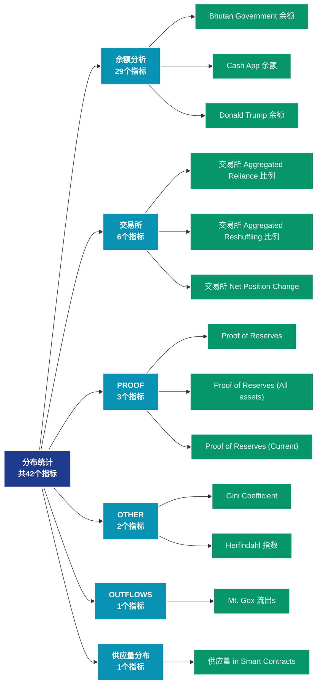

# 分布统计 (distribution)

## 📝 类别描述

各类分布统计数据，包括余额分布、持币时间分布等统计指标。

## 📊 指标概览

本类别共包含 **42** 个指标，涵盖以下主要子类别：

| 子类别 | 指标数量 | 主要功能 |
|--------|----------|----------|
| 余额分析 | 29 | 地址余额分布和变化 |
| 交易所 | 6 | 专门数据分析 |
| PROOF | 3 | 专门数据分析 |
| OTHER | 2 | 专门数据分析 |
| OUTFLOWS | 1 | 专门数据分析 |
| 供应量分布 | 1 | 供应量分布统计 |

## 🎨 指标体系结构图



## 📂 详细指标说明

### 📊 余额分析（29个指标）

本子类别包含以下详细指标：

#### 1. Bhutan Government 余额

- **指标代码**: `balance_bhutan_government`
- **API路径**: `/v1/metrics/distribution/balance_bhutan_government`
- **英文名称**: Bhutan Government Balance

**英文原文：**
The Bhutan Government Balance corresponds to the amount of BTC held in addresses controlled by Druk Holding and Investments (DHI), the investment arm of the Royal Government of Bhutan.

**中文解释：**
分析地址余额的各个方面，包括余额分布、余额变化、余额集中度等。余额分析揭示了网络的财富结构和演变趋势，是理解市场力量对比的关键。

**使用示例**：
```python
# 获取Bhutan Government 余额数据
df = client.get_metric(
    "/v1/metrics/distribution/balance_bhutan_government",
    asset="BTC",
    resolution="24h"
)
```

---

#### 2. Cash App 余额

- **指标代码**: `balance_cashapp`
- **API路径**: `/v1/metrics/distribution/balance_cashapp`
- **英文名称**: Cash App Balance

**英文原文：**
The amount of BTC held in addresses controlled by Cash App. Note that this metric is based on address labels that we constantly keep updating. The values shown here provide an estimate and may not necessarily reflect the full balance.

**中文解释：**
分析地址余额的各个方面，包括余额分布、余额变化、余额集中度等。余额分析揭示了网络的财富结构和演变趋势，是理解市场力量对比的关键。

**使用示例**：
```python
# 获取Cash App 余额数据
df = client.get_metric(
    "/v1/metrics/distribution/balance_cashapp",
    asset="BTC",
    resolution="24h"
)
```

---

#### 3. Donald Trump 余额

- **指标代码**: `balance_donald_trump`
- **API路径**: `/v1/metrics/distribution/balance_donald_trump`
- **英文名称**: Donald Trump Balance

**英文原文：**
The Donald Trump Balance corresponds to the amount of ETH held in addresses controlled by Donald Trump.

**中文解释：**
分析地址余额的各个方面，包括余额分布、余额变化、余额集中度等。余额分析揭示了网络的财富结构和演变趋势，是理解市场力量对比的关键。

**使用示例**：
```python
# 获取Donald Trump 余额数据
df = client.get_metric(
    "/v1/metrics/distribution/balance_donald_trump",
    asset="BTC",
    resolution="24h"
)
```

---

#### 4. El Salvador Government 余额

- **指标代码**: `balance_el_salvador`
- **API路径**: `/v1/metrics/distribution/balance_el_salvador`
- **英文名称**: El Salvador Government Balance

**英文原文：**
This metric provides insights into the on-chain balance of Bitcoin held by El Salvador, as reported by the National Bitcoin Office (ONBTC). For more details, please visit the official government website: https://bitcoin.gob.sv/

**中文解释：**
分析地址余额的各个方面，包括余额分布、余额变化、余额集中度等。余额分析揭示了网络的财富结构和演变趋势，是理解市场力量对比的关键。

**使用示例**：
```python
# 获取El Salvador Government 余额数据
df = client.get_metric(
    "/v1/metrics/distribution/balance_el_salvador",
    asset="BTC",
    resolution="24h"
)
```

---

#### 5. Estimated Bitwise Bitcoin ETF 余额 (BITB)

- **指标代码**: `balance_bitwise`
- **API路径**: `/v1/metrics/distribution/balance_bitwise`
- **英文名称**: Estimated Bitwise Bitcoin ETF Balance (BITB)

**英文原文：**
The BITB Balance metric aims to monitor and delineate the Bitcoin balances held within the Bitwise Bitcoin ETF (BITB). This balance estimate is derived from the addresses published on Bitwises&#x27;s website (https://bitbetf.com). 

Disclaimer:
For the most accurate and current balance information it is advised to explore the official Bitwise BITB ETF website (https://bitbetf.com).

**中文解释：**
分析地址余额的各个方面，包括余额分布、余额变化、余额集中度等。余额分析揭示了网络的财富结构和演变趋势，是理解市场力量对比的关键。

**使用示例**：
```python
# 获取Estimated Bitwise Bitcoin ETF 余额 (BITB)数据
df = client.get_metric(
    "/v1/metrics/distribution/balance_bitwise",
    asset="BTC",
    resolution="24h"
)
```

---

#### 6. Estimated BlackRock Bitcoin ETF 余额 (IBIT)

- **指标代码**: `balance_blackrock`
- **API路径**: `/v1/metrics/distribution/balance_blackrock`
- **英文名称**: Estimated BlackRock Bitcoin ETF Balance (IBIT)

**英文原文：**
The IBIT Balance metric is designed to dynamically track the estimated Bitcoin balances associated with the BlackRock Bitcoin ETF (IBIT) through on-chain data and Glassnode’s clustering heuristics. It’s important to note that, due to the inherent characteristics of on-chain analysis, this metric may not always precisely align with the officially reported numbers from the ETF issuer shown on the US Bitcoin Spot ETF Balances metric.

Disclaimer:
For the most accurate balance information and a comprehensive understanding of IBIT’s historical evolution, we recommend exploring the official BlackRock IBIT ETF website (https://www.ishares.com/us/products/333011/ishares-bitcoin-trust).

**中文解释：**
分析地址余额的各个方面，包括余额分布、余额变化、余额集中度等。余额分析揭示了网络的财富结构和演变趋势，是理解市场力量对比的关键。

**使用示例**：
```python
# 获取Estimated BlackRock Bitcoin ETF 余额 (IBIT)数据
df = client.get_metric(
    "/v1/metrics/distribution/balance_blackrock",
    asset="BTC",
    resolution="24h"
)
```

---

#### 7. Estimated Franklin Templeton Bitcoin ETF 余额 (EZBC)

- **指标代码**: `balance_franklin_templeton`
- **API路径**: `/v1/metrics/distribution/balance_franklin_templeton`
- **英文名称**: Estimated Franklin Templeton Bitcoin ETF Balance (EZBC)

**英文原文：**
The EZBC Balance metric aims to monitor and delineate the estimated Bitcoin balances held within the Franklin Templeton Bitcoin ETF (EZBC). This balance estimate is derived from a combination of on-chain analysis and Glassnode&#x27;s clustering heuristics.

Disclaimer:
The presented balance is an estimate based on on-chain data and clustering methods, and as such may not precisely match the actual EZBC balance. For the most accurate and current balance information, and for a comprehensive understanding of EZBC&#x27;s historical evolution, it is advised to explore the official Franklin Templeton EZBC ETF website (https://www.franklintempleton.com/investments/options/exchange-traded-funds/products/39639/SINGLCLASS/franklin-bitcoin-etf/EZBC).

**中文解释：**
分析地址余额的各个方面，包括余额分布、余额变化、余额集中度等。余额分析揭示了网络的财富结构和演变趋势，是理解市场力量对比的关键。

**使用示例**：
```python
# 获取Estimated Franklin Templeton Bitcoin ETF 余额 (EZBC)数据
df = client.get_metric(
    "/v1/metrics/distribution/balance_franklin_templeton",
    asset="BTC",
    resolution="24h"
)
```

---

#### 8. Estimated Grayscale Bitcoin ETF 余额 (GBTC)

- **指标代码**: `balance_grayscale_trust`
- **API路径**: `/v1/metrics/distribution/balance_grayscale_trust`
- **英文名称**: Estimated Grayscale Bitcoin ETF Balance (GBTC)

**英文原文：**
The GBTC Balance metric aims to monitor and delineate the estimated Bitcoin balances held within the Grayscale Bitcoin ETF (GBTC) under Coinbase Custody. This balance estimate is derived from a combination of on-chain analysis and Glassnode&#x27;s clustering heuristics.

Grayscale initially operated as a closed end fund, which allowed for both cash or in-kind share creation. The closed end fund had an annual fee of 2, and enabling NAV arbitrage via both share creation and redemption (cash only, not in-kind).

Disclaimer:
The presented balance is an estimate based on on-chain data and clustering methods, and as such may not precisely match the actual GBTC balance. For the most accurate and current balance information, and for a comprehensive understanding of GBTC&#x27;s historical evolution, it is advised to explore the official Grayscale GBTC ETF website (https://etfs.grayscale.com/gbtc).

**中文解释：**
分析地址余额的各个方面，包括余额分布、余额变化、余额集中度等。余额分析揭示了网络的财富结构和演变趋势，是理解市场力量对比的关键。

**使用示例**：
```python
# 获取Estimated Grayscale Bitcoin ETF 余额 (GBTC)数据
df = client.get_metric(
    "/v1/metrics/distribution/balance_grayscale_trust",
    asset="BTC",
    resolution="24h"
)
```

---

#### 9. Estimated VanEck Bitcoin ETF 余额 (HODL)

- **指标代码**: `balance_vaneck`
- **API路径**: `/v1/metrics/distribution/balance_vaneck`
- **英文名称**: Estimated VanEck Bitcoin ETF Balance (HODL)

**英文原文：**
The HODL Balance metric aims to monitor and delineate the estimated Bitcoin balances held within the VanEck Bitcoin ETF (HODL). This balance estimate is derived from a combination of on-chain analysis and Glassnode&#x27;s clustering heuristics.

Disclaimer:
The presented balance is an estimate based on on-chain data and clustering methods, and as such may not precisely match the actual HODL balance. For the most accurate and current balance information, and for a comprehensive understanding of HODL&#x27;s historical evolution, it is advised to explore the official VanEck HODL ETF website (https://www.vaneck.com/us/en/investments/bitcoin-trust-hodl/overview/).

**中文解释：**
分析地址余额的各个方面，包括余额分布、余额变化、余额集中度等。余额分析揭示了网络的财富结构和演变趋势，是理解市场力量对比的关键。

**使用示例**：
```python
# 获取Estimated VanEck Bitcoin ETF 余额 (HODL)数据
df = client.get_metric(
    "/v1/metrics/distribution/balance_vaneck",
    asset="BTC",
    resolution="24h"
)
```

---

#### 10. Estimated WisdomTree Bitcoin ETF 余额 (BTCW)

- **指标代码**: `balance_wisdomtree`
- **API路径**: `/v1/metrics/distribution/balance_wisdomtree`
- **英文名称**: Estimated WisdomTree Bitcoin ETF Balance (BTCW)

**英文原文：**
The BTCW Balance metric aims to monitor and delineate the estimated Bitcoin balances held within the WisdomTree Bitcoin ETF (BTCW). This balance estimate is derived from a combination of on-chain analysis and Glassnode&#x27;s clustering heuristics.

Disclaimer:
The presented balance is an estimate based on on-chain data and clustering methods, and as such may not precisely match the actual BTCW balance. For the most accurate and current balance information, and for a comprehensive understanding of BTCW&#x27;s historical evolution, it is advised to explore the official WisdomTree BTCW ETF website (https://www.wisdomtree.com/investments/etfs/crypto/btcw).

**中文解释：**
分析地址余额的各个方面，包括余额分布、余额变化、余额集中度等。余额分析揭示了网络的财富结构和演变趋势，是理解市场力量对比的关键。

**使用示例**：
```python
# 获取Estimated WisdomTree Bitcoin ETF 余额 (BTCW)数据
df = client.get_metric(
    "/v1/metrics/distribution/balance_wisdomtree",
    asset="BTC",
    resolution="24h"
)
```

---

#### 11. 交易所 余额 (Percent)

- **指标代码**: `balance_exchanges_relative`
- **API路径**: `/v1/metrics/distribution/balance_exchanges_relative`
- **英文名称**: Exchange Balance (Percent)

**英文原文：**
The percent supply held on exchange addresses. Note that exchange metrics are based on our labeled data of exchange addresses that we constantly keep updating, as well as data science techniques and statistical information that changes over time. Therefore these metrics are mutable – the data is stable, but especially most recent data points are subject to slight fluctuations as time progresses.

**中文解释：**
分析地址余额的各个方面，包括余额分布、余额变化、余额集中度等。余额分析揭示了网络的财富结构和演变趋势，是理解市场力量对比的关键。

**使用示例**：
```python
# 获取交易所 余额 (Percent)数据
df = client.get_metric(
    "/v1/metrics/distribution/balance_exchanges_relative",
    asset="BTC",
    resolution="24h"
)
```

---

#### 12. 交易所 余额 (Stacked)

- **指标代码**: `balance_exchanges_all`
- **API路径**: `/v1/metrics/distribution/balance_exchanges_all`
- **英文名称**: Exchange Balance (Stacked)

**英文原文：**
The total amount of coins held on exchange addresses. Note that exchange metrics are based on our labeled data of exchange addresses that we constantly keep updating, as well as data science techniques and statistical information that changes over time. Therefore these metrics are mutable – the data is stable, but especially most recent data points are subject to slight fluctuations as time progresses.

**中文解释：**
分析地址余额的各个方面，包括余额分布、余额变化、余额集中度等。余额分析揭示了网络的财富结构和演变趋势，是理解市场力量对比的关键。

**使用示例**：
```python
# 获取交易所 余额 (Stacked)数据
df = client.get_metric(
    "/v1/metrics/distribution/balance_exchanges_all",
    asset="BTC",
    resolution="24h"
)
```

---

#### 13. 交易所 余额 (总计)

- **指标代码**: `balance_exchanges`
- **API路径**: `/v1/metrics/distribution/balance_exchanges`
- **英文名称**: Exchange Balance (Total)

**英文原文：**
The total amount of coins held on exchange addresses. Note that exchange metrics are based on our labeled data of exchange addresses that we constantly keep updating, as well as data science techniques and statistical information that changes over time. Therefore these metrics are mutable – the data is stable, but especially most recent data points are subject to slight fluctuations as time progresses.

**中文解释：**
分析地址余额的各个方面，包括余额分布、余额变化、余额集中度等。余额分析揭示了网络的财富结构和演变趋势，是理解市场力量对比的关键。

**使用示例**：
```python
# 获取交易所 余额 (总计)数据
df = client.get_metric(
    "/v1/metrics/distribution/balance_exchanges",
    asset="BTC",
    resolution="24h"
)
```

---

#### 14. German Government 余额

- **指标代码**: `balance_german_government`
- **API路径**: `/v1/metrics/distribution/balance_german_government`
- **英文名称**: German Government Balance

**英文原文：**
The German Government Balance corresponds to the amount of BTC  held in addresses controlled by German authorities. The metric includes seized funds, e.g. from Movie2k that were seized by the German BKA. We constantly keep updating the set of addresses contributing to the total balance.

**中文解释：**
分析地址余额的各个方面，包括余额分布、余额变化、余额集中度等。余额分析揭示了网络的财富结构和演变趋势，是理解市场力量对比的关键。

**使用示例**：
```python
# 获取German Government 余额数据
df = client.get_metric(
    "/v1/metrics/distribution/balance_german_government",
    asset="BTC",
    resolution="24h"
)
```

---

#### 15. Luna Foundation Guard 余额

- **指标代码**: `balance_luna_foundation_guard`
- **API路径**: `/v1/metrics/distribution/balance_luna_foundation_guard`
- **英文名称**: Luna Foundation Guard Balance

**英文原文：**
The Luna Foundation Guard Balance corresponds to the amount of BTC held in addresses of the Luna Foundation Guard (LFG), which controls the bitcoin reserve supporting the TerraUSD (UST) stablecoin.

**中文解释：**
分析地址余额的各个方面，包括余额分布、余额变化、余额集中度等。余额分析揭示了网络的财富结构和演变趋势，是理解市场力量对比的关键。

**使用示例**：
```python
# 获取Luna Foundation Guard 余额数据
df = client.get_metric(
    "/v1/metrics/distribution/balance_luna_foundation_guard",
    asset="BTC",
    resolution="24h"
)
```

---

#### 16. Miner 余额

- **指标代码**: `balance_miners_sum`
- **API路径**: `/v1/metrics/distribution/balance_miners_sum`
- **英文名称**: Miner Balance

**英文原文：**
The total supply held in miner addresses.

**中文解释：**
分析地址余额的各个方面，包括余额分布、余额变化、余额集中度等。余额分析揭示了网络的财富结构和演变趋势，是理解市场力量对比的关键。

**使用示例**：
```python
# 获取Miner 余额数据
df = client.get_metric(
    "/v1/metrics/distribution/balance_miners_sum",
    asset="BTC",
    resolution="24h"
)
```

---

#### 17. Miner 余额 (Stacked)

- **指标代码**: `balance_miners_all`
- **API路径**: `/v1/metrics/distribution/balance_miners_all`
- **英文名称**: Miner Balance (Stacked)

**英文原文：**
The total supply held in miner addresses.

**中文解释：**
分析地址余额的各个方面，包括余额分布、余额变化、余额集中度等。余额分析揭示了网络的财富结构和演变趋势，是理解市场力量对比的关键。

**使用示例**：
```python
# 获取Miner 余额 (Stacked)数据
df = client.get_metric(
    "/v1/metrics/distribution/balance_miners_all",
    asset="BTC",
    resolution="24h"
)
```

---

#### 18. Miner Net Position Change

- **指标代码**: `balance_miners_change`
- **API路径**: `/v1/metrics/distribution/balance_miners_change`
- **英文名称**: Miner Net Position Change

**英文原文：**
The 30d change of the supply held in miner addresses.

**中文解释：**
分析地址余额的各个方面，包括余额分布、余额变化、余额集中度等。余额分析揭示了网络的财富结构和演变趋势，是理解市场力量对比的关键。

**使用示例**：
```python
# 获取Miner Net Position Change数据
df = client.get_metric(
    "/v1/metrics/distribution/balance_miners_change",
    asset="BTC",
    resolution="24h"
)
```

---

#### 19. Mt. Gox 余额

- **指标代码**: `balance_mtgox_trustee`
- **API路径**: `/v1/metrics/distribution/balance_mtgox_trustee`
- **英文名称**: Mt. Gox Balance

**英文原文：**
The Mt. Gox Trustee Balance corresponds to the amount of BTC held in addresses controlled by Nobuaki Kobayashi, the trustee overseeing the Mt. Gox civil rehabilitation proceedings.

**中文解释：**
分析地址余额的各个方面，包括余额分布、余额变化、余额集中度等。余额分析揭示了网络的财富结构和演变趋势，是理解市场力量对比的关键。

**使用示例**：
```python
# 获取Mt. Gox 余额数据
df = client.get_metric(
    "/v1/metrics/distribution/balance_mtgox_trustee",
    asset="BTC",
    resolution="24h"
)
```

---

#### 20. OTC Desks Holdings

- **指标代码**: `balance_otc_desks`
- **API路径**: `/v1/metrics/distribution/balance_otc_desks`
- **英文名称**: OTC Desks Holdings

**英文原文：**
The cumulative balance of cryptocurrencies stored in addresses associated with Over-The-Counter (OTC) desks is represented in this metric. It encompasses data from three specific OTC desks known to us, thus providing a glimpse into the broader OTC market activity, albeit not its entirety.

Please note, our OTC balance figures are derived from carefully curated datasets that are regularly updated, alongside advanced data analytics and evolving statistical methodologies. Consequently, while our data is reliable, it is important to acknowledge that the most recent figures may exhibit minor adjustments as new information becomes available and our models are refined.

**中文解释：**
分析地址余额的各个方面，包括余额分布、余额变化、余额集中度等。余额分析揭示了网络的财富结构和演变趋势，是理解市场力量对比的关键。

**使用示例**：
```python
# 获取OTC Desks Holdings数据
df = client.get_metric(
    "/v1/metrics/distribution/balance_otc_desks",
    asset="BTC",
    resolution="24h"
)
```

---

#### 21. PayPal 余额

- **指标代码**: `balance_paypal`
- **API路径**: `/v1/metrics/distribution/balance_paypal`
- **英文名称**: PayPal Balance

**英文原文：**
The amount of BTC held in addresses controlled by PayPal Holdings, Inc. Note that this metric is based on address labels that we constantly keep updating. The values shown here provide an estimate and may not necessarily reflect the full balance.

**中文解释：**
分析地址余额的各个方面，包括余额分布、余额变化、余额集中度等。余额分析揭示了网络的财富结构和演变趋势，是理解市场力量对比的关键。

**使用示例**：
```python
# 获取PayPal 余额数据
df = client.get_metric(
    "/v1/metrics/distribution/balance_paypal",
    asset="BTC",
    resolution="24h"
)
```

---

#### 22. Revolut 余额

- **指标代码**: `balance_revolut`
- **API路径**: `/v1/metrics/distribution/balance_revolut`
- **英文名称**: Revolut Balance

**英文原文：**
The amount of BTC held in addresses controlled by Revolut Group Holdings Ltd. Note that this metric is based on address labels that we constantly keep updating. The values shown here provide an estimate and may not necessarily reflect the full balance.

**中文解释：**
分析地址余额的各个方面，包括余额分布、余额变化、余额集中度等。余额分析揭示了网络的财富结构和演变趋势，是理解市场力量对比的关键。

**使用示例**：
```python
# 获取Revolut 余额数据
df = client.get_metric(
    "/v1/metrics/distribution/balance_revolut",
    asset="BTC",
    resolution="24h"
)
```

---

#### 23. Robinhood 余额

- **指标代码**: `balance_robinhood`
- **API路径**: `/v1/metrics/distribution/balance_robinhood`
- **英文名称**: Robinhood Balance

**英文原文：**
The amount of BTC held in addresses controlled by Robinhood Markets, Inc. Note that this metric is based on address labels that we constantly keep updating. The values shown here provide an estimate and may not necessarily reflect the full balance.

**中文解释：**
分析地址余额的各个方面，包括余额分布、余额变化、余额集中度等。余额分析揭示了网络的财富结构和演变趋势，是理解市场力量对比的关键。

**使用示例**：
```python
# 获取Robinhood 余额数据
df = client.get_metric(
    "/v1/metrics/distribution/balance_robinhood",
    asset="BTC",
    resolution="24h"
)
```

---

#### 24. 供应量 of Top 1% Addresses

- **指标代码**: `balance_1pct_holders`
- **API路径**: `/v1/metrics/distribution/balance_1pct_holders`
- **英文名称**: Supply of Top 1% Addresses

**英文原文：**
The percentage of supply held by the top 1% addresses. Exchange addresses, smart contract addresses, and other special asset-specific addresses (e.g. team fund addresses) are excluded.

**中文解释：**
分析地址余额的各个方面，包括余额分布、余额变化、余额集中度等。余额分析揭示了网络的财富结构和演变趋势，是理解市场力量对比的关键。

**使用示例**：
```python
# 获取供应量 of Top 1% Addresses数据
df = client.get_metric(
    "/v1/metrics/distribution/balance_1pct_holders",
    asset="BTC",
    resolution="24h"
)
```

---

#### 25. Tesla 余额

- **指标代码**: `balance_tesla`
- **API路径**: `/v1/metrics/distribution/balance_tesla`
- **英文名称**: Tesla Balance

**英文原文：**
The amount of BTC held in addresses controlled by Tesla, Inc. Note that this metric is based on address labels that we constantly keep updating. The values shown here provide an estimate and may not necessarily reflect the full balance.

**中文解释：**
分析地址余额的各个方面，包括余额分布、余额变化、余额集中度等。余额分析揭示了网络的财富结构和演变趋势，是理解市场力量对比的关键。

**使用示例**：
```python
# 获取Tesla 余额数据
df = client.get_metric(
    "/v1/metrics/distribution/balance_tesla",
    asset="BTC",
    resolution="24h"
)
```

---

#### 26. Tether Treasury 余额

- **指标代码**: `balance_tether_treasury`
- **API路径**: `/v1/metrics/distribution/balance_tether_treasury`
- **英文名称**: Tether Treasury Balance

**英文原文：**
The amount of BTC held in addresses controlled by Tether

**中文解释：**
分析地址余额的各个方面，包括余额分布、余额变化、余额集中度等。余额分析揭示了网络的财富结构和演变趋势，是理解市场力量对比的关键。

**使用示例**：
```python
# 获取Tether Treasury 余额数据
df = client.get_metric(
    "/v1/metrics/distribution/balance_tether_treasury",
    asset="BTC",
    resolution="24h"
)
```

---

#### 27. UK Government 余额

- **指标代码**: `balance_uk_government`
- **API路径**: `/v1/metrics/distribution/balance_uk_government`
- **英文名称**: UK Government Balance

**英文原文：**
The amount of BTC held in addresses controlled by UK authorities. Note that this metric is based on address labels that we constantly keep updating. The values shown here provide an estimate and may not necessarily reflect the full balance.

**中文解释：**
分析地址余额的各个方面，包括余额分布、余额变化、余额集中度等。余额分析揭示了网络的财富结构和演变趋势，是理解市场力量对比的关键。

**使用示例**：
```python
# 获取UK Government 余额数据
df = client.get_metric(
    "/v1/metrics/distribution/balance_uk_government",
    asset="BTC",
    resolution="24h"
)
```

---

#### 28. US Government 余额

- **指标代码**: `balance_us_government`
- **API路径**: `/v1/metrics/distribution/balance_us_government`
- **英文名称**: US Government Balance

**英文原文：**
The US Government Balance corresponds to the amount of BTC  held in addresses controlled by US authorities. The metric includes seized funds, e.g. from the 2016 Bitfinex Hack or the 2012 Silk Road Hack. We constantly keep updating the set of addresses contributing to the total balance.

**中文解释：**
分析地址余额的各个方面，包括余额分布、余额变化、余额集中度等。余额分析揭示了网络的财富结构和演变趋势，是理解市场力量对比的关键。

**使用示例**：
```python
# 获取US Government 余额数据
df = client.get_metric(
    "/v1/metrics/distribution/balance_us_government",
    asset="BTC",
    resolution="24h"
)
```

---

#### 29. WBTC 余额

- **指标代码**: `balance_wbtc`
- **API路径**: `/v1/metrics/distribution/balance_wbtc`
- **英文名称**: WBTC Balance

**英文原文：**
Wrapped Bitcoin (WBTC) is the first ERC20 token backed 1:1 with Bitcoin and designed to act as representation of Bitcoin on the Ethereum blockchain. The WBTC supply listed here corresponds to the amount of Bitcoin held by BitGo, the custodian responsible for minting new WBTC ERC20 tokens and guaranteeing backing of new ERC20 tokens by actual BTC.

**中文解释：**
分析地址余额的各个方面，包括余额分布、余额变化、余额集中度等。余额分析揭示了网络的财富结构和演变趋势，是理解市场力量对比的关键。

**使用示例**：
```python
# 获取WBTC 余额数据
df = client.get_metric(
    "/v1/metrics/distribution/balance_wbtc",
    asset="BTC",
    resolution="24h"
)
```

---

### 📊 交易所（6个指标）

本子类别包含以下详细指标：

#### 1. 交易所 Aggregated Reliance 比例

- **指标代码**: `exchange_aggregated_reliance_ratio`
- **API路径**: `/v1/metrics/distribution/exchange_aggregated_reliance_ratio`
- **英文名称**: Exchange Aggregated Reliance Ratio

**英文原文：**
The Exchange Aggregated Reliance Ratio extends the concept of the Exchange Reliance Ratio by providing a USD-volume-weighted average across major assets on a given exchange. Unlike asset-specific Reliance Ratios, this aggregated metric measures the overall dependency of an exchange’s liquidity concentration, reflecting how centralized or diversified the platform’s total asset flows are. Higher values indicate greater liquidity concentration and potential systemic risk, whereas lower values suggest broader liquidity distribution across the exchange..

This metric was introduced by CryptoVizArt. For further details, please refer to his introductory article.

**中文解释：**
全面分析交易所相关的链上活动。交易所是连接链上和链下市场的关键节点，其资金流动直接影响市场供需。通过监测交易所数据，可以预判短期价格压力和市场情绪变化。

**使用示例**：
```python
# 获取交易所 Aggregated Reliance 比例数据
df = client.get_metric(
    "/v1/metrics/distribution/exchange_aggregated_reliance_ratio",
    asset="BTC",
    resolution="24h"
)
```

---

#### 2. 交易所 Aggregated Reshuffling 比例

- **指标代码**: `exchange_aggregated_reshuffling_ratio`
- **API路径**: `/v1/metrics/distribution/exchange_aggregated_reshuffling_ratio`
- **英文名称**: Exchange Aggregated Reshuffling Ratio

**英文原文：**
The Exchange Aggregated Reliance Ratio extends the concept of the Exchange Reliance Ratio by providing a USD-volume-weighted average across major assets on a given exchange. Unlike asset-specific Reshuffling Ratios, this aggregated metric measures the overall internal liquidity movements relative to the exchange’s combined balances, representing platform-wide asset reallocation—not asset-specific flows. Higher readings indicate more intensive, and potentially stressed, internal reallocation of assets, whereas lower readings point to comparatively stable internal flows across the exchange.

This metric was introduced by CryptoVizArt. For further details, please refer to his introductory article.

**中文解释：**
全面分析交易所相关的链上活动。交易所是连接链上和链下市场的关键节点，其资金流动直接影响市场供需。通过监测交易所数据，可以预判短期价格压力和市场情绪变化。

**使用示例**：
```python
# 获取交易所 Aggregated Reshuffling 比例数据
df = client.get_metric(
    "/v1/metrics/distribution/exchange_aggregated_reshuffling_ratio",
    asset="BTC",
    resolution="24h"
)
```

---

#### 3. 交易所 Net Position Change

- **指标代码**: `exchange_net_position_change`
- **API路径**: `/v1/metrics/distribution/exchange_net_position_change`
- **英文名称**: Exchange Net Position Change

**英文原文：**
The 30d change of the supply held in exchange wallets.

**中文解释：**
全面分析交易所相关的链上活动。交易所是连接链上和链下市场的关键节点，其资金流动直接影响市场供需。通过监测交易所数据，可以预判短期价格压力和市场情绪变化。

**使用示例**：
```python
# 获取交易所 Net Position Change数据
df = client.get_metric(
    "/v1/metrics/distribution/exchange_net_position_change",
    asset="BTC",
    resolution="24h"
)
```

---

#### 4. 交易所 Reliance 比例

- **指标代码**: `exchange_reliance_ratio`
- **API路径**: `/v1/metrics/distribution/exchange_reliance_ratio`
- **英文名称**: Exchange Reliance Ratio

**英文原文：**
The Exchange Reliance Ratio measures the net token flow (inflows minus outflows) relative to an exchange’s total balance, providing insight into how dependent a token’s liquidity is on that specific platform. Elevated values indicate a concentration of liquidity within a single exchange, which can amplify systemic risk if disruptions occur. Conversely, extremely low values may signal a potential risk of insufficient liquidity, particularly if the condition persists over time. A balanced ratio reflects a healthier, more distributed market structure.

This metric was introduced by CryptoVizArt. For further details, please refer to his introductory article.

**中文解释：**
全面分析交易所相关的链上活动。交易所是连接链上和链下市场的关键节点，其资金流动直接影响市场供需。通过监测交易所数据，可以预判短期价格压力和市场情绪变化。

**使用示例**：
```python
# 获取交易所 Reliance 比例数据
df = client.get_metric(
    "/v1/metrics/distribution/exchange_reliance_ratio",
    asset="BTC",
    resolution="24h"
)
```

---

#### 5. 交易所 Reshuffling 比例

- **指标代码**: `exchange_reshuffling_ratio`
- **API路径**: `/v1/metrics/distribution/exchange_reshuffling_ratio`
- **英文名称**: Exchange Reshuffling Ratio

**英文原文：**
The Reshuffling Ratio quantifies the volume of internal (in-house) token transfers relative to an exchange’s total balance, averaged over a short rolling window. A higher Reshuffling Ratio suggests the exchange is actively reallocating its liquidity internally — a behavior that, if persistent, may warrant further investigation into the exchange&#x27;s liquidity management practices. Conversely, a lower ratio indicates more stable internal flows, reflecting a healthier operational state.

This metric was introduced by CryptoVizArt. For further details, please refer to his introductory article.

**中文解释：**
全面分析交易所相关的链上活动。交易所是连接链上和链下市场的关键节点，其资金流动直接影响市场供需。通过监测交易所数据，可以预判短期价格压力和市场情绪变化。

**使用示例**：
```python
# 获取交易所 Reshuffling 比例数据
df = client.get_metric(
    "/v1/metrics/distribution/exchange_reshuffling_ratio",
    asset="BTC",
    resolution="24h"
)
```

---

#### 6. 交易所 巨鲸s 流出

- **指标代码**: `exchange_whales_outflow`
- **API路径**: `/v1/metrics/distribution/exchange_whales_outflow`
- **英文名称**: Exchange Whales Outflow

**英文原文：**
The Whales Outflow metric tracks the rolling volume of withdrawals from an exchange to large non-exchange entities, normalized by the exchange’s balance. A higher value reflects increased whale-driven outflows, which may indicate active large-client withdrawal behavior. If such activity is concentrated on a single exchange, it warrants further assessment — under typical circumstances, it could result from internal wallet management operations; however, in extreme cases, it may signal declining client confidence or even a potential security breach.

This metric was introduced by CryptoVizArt. For further details, please refer to his introductory article.

**中文解释：**
追踪从交易所流出的资金量。资金流出交易所表明：1）投资者转为长期持有（看涨）；2）提现到冷钱包保管（减少流通）；3）DeFi或其他链上应用需求。大规模流出通常被视为供应减少的信号。

**使用示例**：
```python
# 获取交易所 巨鲸s 流出数据
df = client.get_metric(
    "/v1/metrics/distribution/exchange_whales_outflow",
    asset="BTC",
    resolution="24h"
)
```

---

### 📊 PROOF（3个指标）

本子类别包含以下详细指标：

#### 1. Proof of Reserves

- **指标代码**: `proof_of_reserves`
- **API路径**: `/v1/metrics/distribution/proof_of_reserves`
- **英文名称**: Proof of Reserves

**英文原文：**
Proof-of-Reserves refers to the on-chain reserves as officially disclosed by exchanges. This metric denotes the total balance on self-reported exchange addresses. Note that we only incorporate Bitcoin and Ethereum, and Solana addresses, other blockchains/L1s are not included. The proof-of-reserve data differs from our exchange balance metrics as they stricly monitor the balance on officially communicated exchange addresses, which are only a subset of all addresses included in our more comprehensive exchange metrics. For more information please see our article on proof-of-reserve metrics.

**中文解释：**
分析Proof of Reserves相关的链上数据。这个指标通过追踪区块链上的实时数据，提供了传统金融分析无法获得的透明度和洞察力。链上数据的优势在于：1）数据真实可验证；2）实时更新无延迟；3）覆盖所有参与者。通过综合分析多个链上指标，投资者可以做出更明智的决策，研究人员可以深入理解市场机制。

**使用示例**：
```python
# 获取Proof of Reserves数据
df = client.get_metric(
    "/v1/metrics/distribution/proof_of_reserves",
    asset="BTC",
    resolution="24h"
)
```

---

#### 2. Proof of Reserves (All assets)

- **指标代码**: `proof_of_reserves_all`
- **API路径**: `/v1/metrics/distribution/proof_of_reserves_all`
- **英文名称**: Proof of Reserves (All assets)

**英文原文：**
Proof-of-Reserves refers to the on-chain reserves as officially disclosed by exchanges. This metric denotes the total balance (in USD) of the biggest holdings on self-reported exchange addresses. We explicitly show at most the top 10 assets (by balance) and combine all others into the &#x27;Other&#x27; category. Note that we only incorporate Bitcoin and Ethereum addresses, other blockchains/L1s are not included. Therefore &#x27;Other&#x27; should be considered as a lower bound of additional exchange holdings. The proof-of-reserve data differs from our exchange balance metrics as they stricly monitor the balance on officially communicated exchange addresses, which are only a subset of all addresses included in our more comprehensive exchange metrics. For more information please see our article on proof-of-reserve metrics.

**中文解释：**
分析Proof of Reserves (All assets)相关的链上数据。这个指标通过追踪区块链上的实时数据，提供了传统金融分析无法获得的透明度和洞察力。链上数据的优势在于：1）数据真实可验证；2）实时更新无延迟；3）覆盖所有参与者。通过综合分析多个链上指标，投资者可以做出更明智的决策，研究人员可以深入理解市场机制。

**使用示例**：
```python
# 获取Proof of Reserves (All assets)数据
df = client.get_metric(
    "/v1/metrics/distribution/proof_of_reserves_all",
    asset="BTC",
    resolution="24h"
)
```

---

#### 3. Proof of Reserves (Current)

- **指标代码**: `proof_of_reserves_all_latest`
- **API路径**: `/v1/metrics/distribution/proof_of_reserves_all_latest`
- **英文名称**: Proof of Reserves (Current)

**英文原文：**
Proof-of-Reserves refers to the on-chain reserves as officially disclosed by exchanges. This metric denotes the latest balance on self-reported exchange addresses and their corresponding change over the last 24 hours. We explicitly show at most the top 10 assets (by balance) and combine all others into the &#x27;Other&#x27; category. Note that we only incorporate Bitcoin and Ethereum addresses, other blockchains/L1s are not included. Therefore &#x27;Other&#x27; should be considered as a lower bound of additional exchange holdings. The proof-of-reserve data differs from our exchange balance metrics as they stricly monitor the balance on officially communicated exchange addresses, which are only a subset of all addresses included in our more comprehensive exchange metrics. For more information please see our article on proof-of-reserve metrics.

**中文解释：**
分析Proof of Reserves (Current)相关的链上数据。这个指标通过追踪区块链上的实时数据，提供了传统金融分析无法获得的透明度和洞察力。链上数据的优势在于：1）数据真实可验证；2）实时更新无延迟；3）覆盖所有参与者。通过综合分析多个链上指标，投资者可以做出更明智的决策，研究人员可以深入理解市场机制。

**使用示例**：
```python
# 获取Proof of Reserves (Current)数据
df = client.get_metric(
    "/v1/metrics/distribution/proof_of_reserves_all_latest",
    asset="BTC",
    resolution="24h"
)
```

---

### 📊 OTHER（2个指标）

本子类别包含以下详细指标：

#### 1. Gini Coefficient

- **指标代码**: `gini`
- **API路径**: `/v1/metrics/distribution/gini`
- **英文名称**: Gini Coefficient

**英文原文：**
The gini coefficient for the distribution of coins over addresses. Exchange addresses, smart contract addresses, and other special asset-specific addresses (e.g. team fund addresses) are excluded for the computation of the gini.

**中文解释：**
分析Gini Coefficient相关的链上数据。这个指标通过追踪区块链上的实时数据，提供了传统金融分析无法获得的透明度和洞察力。链上数据的优势在于：1）数据真实可验证；2）实时更新无延迟；3）覆盖所有参与者。通过综合分析多个链上指标，投资者可以做出更明智的决策，研究人员可以深入理解市场机制。

**使用示例**：
```python
# 获取Gini Coefficient数据
df = client.get_metric(
    "/v1/metrics/distribution/gini",
    asset="BTC",
    resolution="24h"
)
```

---

#### 2. Herfindahl 指数

- **指标代码**: `herfindahl`
- **API路径**: `/v1/metrics/distribution/herfindahl`
- **英文名称**: Herfindahl Index

**英文原文：**
Originally used as a measure of competition, we adapt the Herfindahl Index as a metric for decentralization. It measures the addresses&#x27; shares of the current supply, and is defined as the sum of weighted address balances in the network. A large score indicates high concentration of supply, whereas a small score is an indicator for more evenly distributed funds across addresses. Exchange addresses, smart contract addresses and other special asset-specific addresses (e.g. team fund addresses) are excluded.

**中文解释：**
分析Herfindahl Index相关的链上数据。这个指标通过追踪区块链上的实时数据，提供了传统金融分析无法获得的透明度和洞察力。链上数据的优势在于：1）数据真实可验证；2）实时更新无延迟；3）覆盖所有参与者。通过综合分析多个链上指标，投资者可以做出更明智的决策，研究人员可以深入理解市场机制。

**使用示例**：
```python
# 获取Herfindahl 指数数据
df = client.get_metric(
    "/v1/metrics/distribution/herfindahl",
    asset="BTC",
    resolution="24h"
)
```

---

### 📊 OUTFLOWS（1个指标）

本子类别包含以下详细指标：

#### 1. Mt. Gox 流出s

- **指标代码**: `outflows_mtgox_trustee`
- **API路径**: `/v1/metrics/distribution/outflows_mtgox_trustee`
- **英文名称**: Mt. Gox Outflows

**英文原文：**
This metric traces the movement of BTC from the balances held by Nobuaki Kobayashi, the trustee supervising the civil rehabilitation proceedings of Mt. Gox. It presents a comprehensive timeline of BTC transactions flowing from Mt. Gox to individual exchanges or other recognized entities, helping track the redistribution of these assets over time.

**中文解释：**
分析Mt. Gox Outflows相关的链上数据。这个指标通过追踪区块链上的实时数据，提供了传统金融分析无法获得的透明度和洞察力。链上数据的优势在于：1）数据真实可验证；2）实时更新无延迟；3）覆盖所有参与者。通过综合分析多个链上指标，投资者可以做出更明智的决策，研究人员可以深入理解市场机制。

**使用示例**：
```python
# 获取Mt. Gox 流出s数据
df = client.get_metric(
    "/v1/metrics/distribution/outflows_mtgox_trustee",
    asset="BTC",
    resolution="24h"
)
```

---

### 📊 供应量分布（1个指标）

本子类别包含以下详细指标：

#### 1. 供应量 in Smart Contracts

- **指标代码**: `supply_contracts`
- **API路径**: `/v1/metrics/distribution/supply_contracts`
- **英文名称**: Supply in Smart Contracts

**英文原文：**
The percent of total supply of the token that is held in smart contracts.

**中文解释：**
分析Supply in Smart Contracts相关的链上数据。这个指标通过追踪区块链上的实时数据，提供了传统金融分析无法获得的透明度和洞察力。链上数据的优势在于：1）数据真实可验证；2）实时更新无延迟；3）覆盖所有参与者。通过综合分析多个链上指标，投资者可以做出更明智的决策，研究人员可以深入理解市场机制。

**使用示例**：
```python
# 获取供应量 in Smart Contracts数据
df = client.get_metric(
    "/v1/metrics/distribution/supply_contracts",
    asset="BTC",
    resolution="24h"
)
```

---

## 📊 完整指标列表

| # | 指标名称 | 指标代码 | API路径 |
|---|----------|----------|---------|
| 1 | Bhutan Government 余额 | `balance_bhutan_government` | `/v1/metrics/distribution/balance_bhutan_government` |
| 2 | Cash App 余额 | `balance_cashapp` | `/v1/metrics/distribution/balance_cashapp` |
| 3 | Donald Trump 余额 | `balance_donald_trump` | `/v1/metrics/distribution/balance_donald_trump` |
| 4 | El Salvador Government 余额 | `balance_el_salvador` | `/v1/metrics/distribution/balance_el_salvador` |
| 5 | Estimated Bitwise Bitcoin ETF 余额 (BITB) | `balance_bitwise` | `/v1/metrics/distribution/balance_bitwise` |
| 6 | Estimated BlackRock Bitcoin ETF 余额 (IBIT) | `balance_blackrock` | `/v1/metrics/distribution/balance_blackrock` |
| 7 | Estimated Franklin Templeton Bitcoin ETF 余额 (EZBC) | `balance_franklin_templeton` | `/v1/metrics/distribution/balance_franklin_templeton` |
| 8 | Estimated Grayscale Bitcoin ETF 余额 (GBTC) | `balance_grayscale_trust` | `/v1/metrics/distribution/balance_grayscale_trust` |
| 9 | Estimated VanEck Bitcoin ETF 余额 (HODL) | `balance_vaneck` | `/v1/metrics/distribution/balance_vaneck` |
| 10 | Estimated WisdomTree Bitcoin ETF 余额 (BTCW) | `balance_wisdomtree` | `/v1/metrics/distribution/balance_wisdomtree` |
| 11 | 交易所 Aggregated Reliance 比例 | `exchange_aggregated_reliance_ratio` | `/v1/metrics/distribution/exchange_aggregated_reliance_ratio` |
| 12 | 交易所 Aggregated Reshuffling 比例 | `exchange_aggregated_reshuffling_ratio` | `/v1/metrics/distribution/exchange_aggregated_reshuffling_ratio` |
| 13 | 交易所 余额 (Percent) | `balance_exchanges_relative` | `/v1/metrics/distribution/balance_exchanges_relative` |
| 14 | 交易所 余额 (Stacked) | `balance_exchanges_all` | `/v1/metrics/distribution/balance_exchanges_all` |
| 15 | 交易所 余额 (总计) | `balance_exchanges` | `/v1/metrics/distribution/balance_exchanges` |
| 16 | 交易所 Net Position Change | `exchange_net_position_change` | `/v1/metrics/distribution/exchange_net_position_change` |
| 17 | 交易所 Reliance 比例 | `exchange_reliance_ratio` | `/v1/metrics/distribution/exchange_reliance_ratio` |
| 18 | 交易所 Reshuffling 比例 | `exchange_reshuffling_ratio` | `/v1/metrics/distribution/exchange_reshuffling_ratio` |
| 19 | 交易所 巨鲸s 流出 | `exchange_whales_outflow` | `/v1/metrics/distribution/exchange_whales_outflow` |
| 20 | German Government 余额 | `balance_german_government` | `/v1/metrics/distribution/balance_german_government` |
| 21 | Gini Coefficient | `gini` | `/v1/metrics/distribution/gini` |
| 22 | Herfindahl 指数 | `herfindahl` | `/v1/metrics/distribution/herfindahl` |
| 23 | Luna Foundation Guard 余额 | `balance_luna_foundation_guard` | `/v1/metrics/distribution/balance_luna_foundation_guard` |
| 24 | Miner 余额 | `balance_miners_sum` | `/v1/metrics/distribution/balance_miners_sum` |
| 25 | Miner 余额 (Stacked) | `balance_miners_all` | `/v1/metrics/distribution/balance_miners_all` |
| 26 | Miner Net Position Change | `balance_miners_change` | `/v1/metrics/distribution/balance_miners_change` |
| 27 | Mt. Gox 余额 | `balance_mtgox_trustee` | `/v1/metrics/distribution/balance_mtgox_trustee` |
| 28 | Mt. Gox 流出s | `outflows_mtgox_trustee` | `/v1/metrics/distribution/outflows_mtgox_trustee` |
| 29 | OTC Desks Holdings | `balance_otc_desks` | `/v1/metrics/distribution/balance_otc_desks` |
| 30 | PayPal 余额 | `balance_paypal` | `/v1/metrics/distribution/balance_paypal` |
| 31 | Proof of Reserves | `proof_of_reserves` | `/v1/metrics/distribution/proof_of_reserves` |
| 32 | Proof of Reserves (All assets) | `proof_of_reserves_all` | `/v1/metrics/distribution/proof_of_reserves_all` |
| 33 | Proof of Reserves (Current) | `proof_of_reserves_all_latest` | `/v1/metrics/distribution/proof_of_reserves_all_latest` |
| 34 | Revolut 余额 | `balance_revolut` | `/v1/metrics/distribution/balance_revolut` |
| 35 | Robinhood 余额 | `balance_robinhood` | `/v1/metrics/distribution/balance_robinhood` |
| 36 | 供应量 in Smart Contracts | `supply_contracts` | `/v1/metrics/distribution/supply_contracts` |
| 37 | 供应量 of Top 1% Addresses | `balance_1pct_holders` | `/v1/metrics/distribution/balance_1pct_holders` |
| 38 | Tesla 余额 | `balance_tesla` | `/v1/metrics/distribution/balance_tesla` |
| 39 | Tether Treasury 余额 | `balance_tether_treasury` | `/v1/metrics/distribution/balance_tether_treasury` |
| 40 | UK Government 余额 | `balance_uk_government` | `/v1/metrics/distribution/balance_uk_government` |
| 41 | US Government 余额 | `balance_us_government` | `/v1/metrics/distribution/balance_us_government` |
| 42 | WBTC 余额 | `balance_wbtc` | `/v1/metrics/distribution/balance_wbtc` |

## 💻 代码示例

### Python SDK 使用示例

```python
from glassnode import GlassnodeClient

# 初始化客户端
client = GlassnodeClient(api_key="YOUR_API_KEY")

# 获取单个指标
data = client.get(
    "/v1/metrics/addresses/active_count",
    asset="BTC",
    resolution="24h",
    since="2024-01-01"
)

# 批量获取多个指标
metrics = [
    "active_count",
    "new",
    "non_zero_count"
]

results = {}
for metric in metrics:
    results[metric] = client.get(
        f"/v1/metrics/addresses/{metric}",
        asset="BTC"
    )
```

## 📚 参考资源

- [Glassnode官方文档](https://docs.glassnode.com)
- [Glassnode Studio](https://studio.glassnode.com)
- [API访问说明](https://docs.glassnode.com/basic-api/api)

---

*最后更新：2024年*
