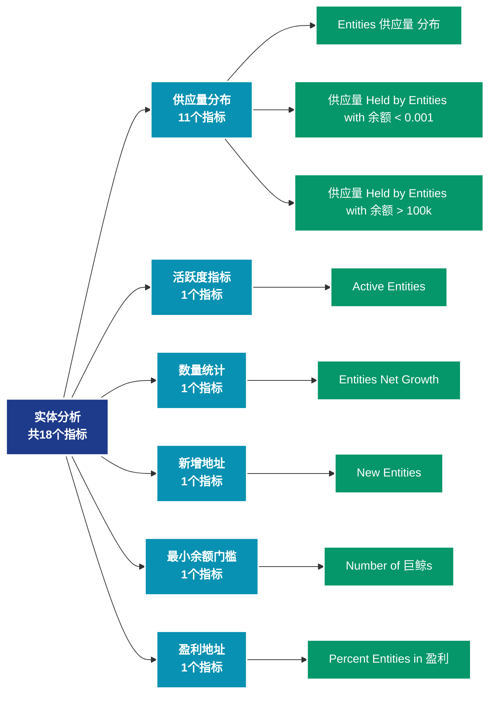

# 实体分析 (entities)

## 📝 类别描述

链上实体识别和分析，包括交易所、矿池、巨鲸等实体的行为追踪。

## 📊 指标概览

本类别共包含 **18** 个指标，涵盖以下主要子类别：

| 子类别 | 指标数量 | 主要功能 |
|--------|----------|----------|
| 供应量分布 | 11 | 供应量分布统计 |
| 活跃度指标 | 1 | 网络活跃度和用户参与 |
| 数量统计 | 1 | 专门数据分析 |
| 新增地址 | 1 | 新增用户和采用度 |
| 最小余额门槛 | 1 | 专门数据分析 |
| 盈利地址 | 1 | 盈利状态分析 |
| 接收活动 | 1 | 专门数据分析 |
| 发送活动 | 1 | 专门数据分析 |

## 🎨 指标体系结构图



## 📂 详细指标说明

### 📊 供应量分布（11个指标）

本子类别包含以下详细指标：

#### 1. Entities 供应量 分布

- **指标代码**: `supply_distribution_relative`
- **API路径**: `/v1/metrics/entities/supply_distribution_relative`
- **英文名称**: Entities Supply Distribution

**英文原文：**
Relative distribution of the circulating supply held by entities with specific balance bands.

**中文解释：**
展示不同余额区间的供应量分布情况。例如：持有0.001-0.01 BTC、0.01-0.1 BTC、0.1-1 BTC等不同规模的地址群体各持有多少比例的总供应量。这个指标帮助分析：1）财富集中度（基尼系数）；2）不同规模投资者的相对影响力；3）市场结构的演变。供应分布的变化可以揭示资金从散户到机构（或相反）的流动。

**使用示例**：
```python
# 获取Entities 供应量 分布数据
df = client.get_metric(
    "/v1/metrics/entities/supply_distribution_relative",
    asset="BTC",
    resolution="24h"
)
```

---

#### 2. 供应量 Held by Entities with 余额 < 0.001

- **指标代码**: `supply_balance_less_0001`
- **API路径**: `/v1/metrics/entities/supply_balance_less_0001`
- **英文名称**: Supply Held by Entities with Balance < 0.001

**英文原文：**
The total circulating supply held by entities with balance lower than 0.001 coins.

**中文解释：**
分析地址余额的各个方面，包括余额分布、余额变化、余额集中度等。余额分析揭示了网络的财富结构和演变趋势，是理解市场力量对比的关键。

**使用示例**：
```python
# 获取供应量 Held by Entities with 余额 < 0.001数据
df = client.get_metric(
    "/v1/metrics/entities/supply_balance_less_0001",
    asset="BTC",
    resolution="24h"
)
```

---

#### 3. 供应量 Held by Entities with 余额 > 100k

- **指标代码**: `supply_balance_more_100k`
- **API路径**: `/v1/metrics/entities/supply_balance_more_100k`
- **英文名称**: Supply Held by Entities with Balance > 100k

**英文原文：**
The total circulating supply held by entities with balance of at least 100,000 coins.

**中文解释：**
分析地址余额的各个方面，包括余额分布、余额变化、余额集中度等。余额分析揭示了网络的财富结构和演变趋势，是理解市场力量对比的关键。

**使用示例**：
```python
# 获取供应量 Held by Entities with 余额 > 100k数据
df = client.get_metric(
    "/v1/metrics/entities/supply_balance_more_100k",
    asset="BTC",
    resolution="24h"
)
```

---

#### 4. 供应量 Held by Entities with 余额 0.001 - 0.01

- **指标代码**: `supply_balance_0001_001`
- **API路径**: `/v1/metrics/entities/supply_balance_0001_001`
- **英文名称**: Supply Held by Entities with Balance 0.001 - 0.01

**英文原文：**
The total circulating supply held by entities with balance between 0.001 and 0.01 coins.

**中文解释：**
分析地址余额的各个方面，包括余额分布、余额变化、余额集中度等。余额分析揭示了网络的财富结构和演变趋势，是理解市场力量对比的关键。

**使用示例**：
```python
# 获取供应量 Held by Entities with 余额 0.001 - 0.01数据
df = client.get_metric(
    "/v1/metrics/entities/supply_balance_0001_001",
    asset="BTC",
    resolution="24h"
)
```

---

#### 5. 供应量 Held by Entities with 余额 0.01 - 0.1

- **指标代码**: `supply_balance_001_01`
- **API路径**: `/v1/metrics/entities/supply_balance_001_01`
- **英文名称**: Supply Held by Entities with Balance 0.01 - 0.1

**英文原文：**
The total circulating supply held by entities with balance between 0.01 and 0.1 coins.

**中文解释：**
分析地址余额的各个方面，包括余额分布、余额变化、余额集中度等。余额分析揭示了网络的财富结构和演变趋势，是理解市场力量对比的关键。

**使用示例**：
```python
# 获取供应量 Held by Entities with 余额 0.01 - 0.1数据
df = client.get_metric(
    "/v1/metrics/entities/supply_balance_001_01",
    asset="BTC",
    resolution="24h"
)
```

---

#### 6. 供应量 Held by Entities with 余额 0.1 - 1

- **指标代码**: `supply_balance_01_1`
- **API路径**: `/v1/metrics/entities/supply_balance_01_1`
- **英文名称**: Supply Held by Entities with Balance 0.1 - 1

**英文原文：**
The total circulating supply held by entities with balance between 0.1 and 1 coins.

**中文解释：**
分析地址余额的各个方面，包括余额分布、余额变化、余额集中度等。余额分析揭示了网络的财富结构和演变趋势，是理解市场力量对比的关键。

**使用示例**：
```python
# 获取供应量 Held by Entities with 余额 0.1 - 1数据
df = client.get_metric(
    "/v1/metrics/entities/supply_balance_01_1",
    asset="BTC",
    resolution="24h"
)
```

---

#### 7. 供应量 Held by Entities with 余额 1 - 10

- **指标代码**: `supply_balance_1_10`
- **API路径**: `/v1/metrics/entities/supply_balance_1_10`
- **英文名称**: Supply Held by Entities with Balance 1 - 10

**英文原文：**
The total circulating supply held by entities with balance between 1 and 10 coins.

**中文解释：**
分析地址余额的各个方面，包括余额分布、余额变化、余额集中度等。余额分析揭示了网络的财富结构和演变趋势，是理解市场力量对比的关键。

**使用示例**：
```python
# 获取供应量 Held by Entities with 余额 1 - 10数据
df = client.get_metric(
    "/v1/metrics/entities/supply_balance_1_10",
    asset="BTC",
    resolution="24h"
)
```

---

#### 8. 供应量 Held by Entities with 余额 10 - 100

- **指标代码**: `supply_balance_10_100`
- **API路径**: `/v1/metrics/entities/supply_balance_10_100`
- **英文名称**: Supply Held by Entities with Balance 10 - 100

**英文原文：**
The total circulating supply held by entities with balance between 10 and 100 coins.

**中文解释：**
分析地址余额的各个方面，包括余额分布、余额变化、余额集中度等。余额分析揭示了网络的财富结构和演变趋势，是理解市场力量对比的关键。

**使用示例**：
```python
# 获取供应量 Held by Entities with 余额 10 - 100数据
df = client.get_metric(
    "/v1/metrics/entities/supply_balance_10_100",
    asset="BTC",
    resolution="24h"
)
```

---

#### 9. 供应量 Held by Entities with 余额 100 - 1k

- **指标代码**: `supply_balance_100_1k`
- **API路径**: `/v1/metrics/entities/supply_balance_100_1k`
- **英文名称**: Supply Held by Entities with Balance 100 - 1k

**英文原文：**
The total circulating supply held by entities with balance between 100 and 1,000 coins.

**中文解释：**
分析地址余额的各个方面，包括余额分布、余额变化、余额集中度等。余额分析揭示了网络的财富结构和演变趋势，是理解市场力量对比的关键。

**使用示例**：
```python
# 获取供应量 Held by Entities with 余额 100 - 1k数据
df = client.get_metric(
    "/v1/metrics/entities/supply_balance_100_1k",
    asset="BTC",
    resolution="24h"
)
```

---

#### 10. 供应量 Held by Entities with 余额 10k - 100k

- **指标代码**: `supply_balance_10k_100k`
- **API路径**: `/v1/metrics/entities/supply_balance_10k_100k`
- **英文名称**: Supply Held by Entities with Balance 10k - 100k

**英文原文：**
The total circulating supply held by entities with balance between 10,000 and 100,000 coins.

**中文解释：**
分析地址余额的各个方面，包括余额分布、余额变化、余额集中度等。余额分析揭示了网络的财富结构和演变趋势，是理解市场力量对比的关键。

**使用示例**：
```python
# 获取供应量 Held by Entities with 余额 10k - 100k数据
df = client.get_metric(
    "/v1/metrics/entities/supply_balance_10k_100k",
    asset="BTC",
    resolution="24h"
)
```

---

#### 11. 供应量 Held by Entities with 余额 1k - 10k

- **指标代码**: `supply_balance_1k_10k`
- **API路径**: `/v1/metrics/entities/supply_balance_1k_10k`
- **英文名称**: Supply Held by Entities with Balance 1k - 10k

**英文原文：**
The total circulating supply held by entities with balance between 1,000 and 10,000 coins.

**中文解释：**
分析地址余额的各个方面，包括余额分布、余额变化、余额集中度等。余额分析揭示了网络的财富结构和演变趋势，是理解市场力量对比的关键。

**使用示例**：
```python
# 获取供应量 Held by Entities with 余额 1k - 10k数据
df = client.get_metric(
    "/v1/metrics/entities/supply_balance_1k_10k",
    asset="BTC",
    resolution="24h"
)
```

---

### 📊 活跃度指标（1个指标）

本子类别包含以下详细指标：

#### 1. Active Entities

- **指标代码**: `active_count`
- **API路径**: `/v1/metrics/entities/active_count`
- **英文名称**: Active Entities

**英文原文：**
The number of unique entities that were active either as a sender or receiver. Entities are defined as a cluster of addresses that are controlled by the same network entity and are estimated through advanced heuristics and Glassnode&#x27;s proprietary clustering algorithms. Note that entity–based metrics are based on data science techniques and statistical information that changes over time and are therefore mutable – the data is stable, but most recent data points are subject to slight fluctuations as time progresses. For more information see this article.

**中文解释：**
统计在特定时间段内（通常为24小时）参与发送或接收交易的独立地址数量。活跃地址数是衡量网络使用率和用户参与度的核心指标。高活跃地址数通常表示：1）网络被广泛使用；2）生态系统健康发展；3）用户对网络有实际需求。活跃地址的变化趋势可以帮助判断网络的成长阶段和市场周期。

**使用示例**：
```python
# 获取Active Entities数据
df = client.get_metric(
    "/v1/metrics/entities/active_count",
    asset="BTC",
    resolution="24h"
)
```

---

### 📊 数量统计（1个指标）

本子类别包含以下详细指标：

#### 1. Entities Net Growth

- **指标代码**: `net_growth_count`
- **API路径**: `/v1/metrics/entities/net_growth_count`
- **英文名称**: Entities Net Growth

**英文原文：**
The net growth of unique entities in the network. This metric is defined as the difference between new entities and "disappearing" entities (entities with a zero balance that had a non–zero balance at the previous timestamp). Entities are defined as a cluster of addresses that are controlled by the same network entity and are estimated through advanced heuristics and Glassnode&#x27;s proprietary clustering algorithms. Note that entity–based metrics are based on data science techniques and statistical information that changes over time and are therefore mutable – the data is stable, but most recent data points are subject to slight fluctuations as time progresses. For more information see this article.

**The computation of this metric requires statistical information from several days, and is therefore only available with a lag of one week.**

**中文解释：**
分析Entities Net Growth相关的链上数据。这个指标通过追踪区块链上的实时数据，提供了传统金融分析无法获得的透明度和洞察力。链上数据的优势在于：1）数据真实可验证；2）实时更新无延迟；3）覆盖所有参与者。通过综合分析多个链上指标，投资者可以做出更明智的决策，研究人员可以深入理解市场机制。

**使用示例**：
```python
# 获取Entities Net Growth数据
df = client.get_metric(
    "/v1/metrics/entities/net_growth_count",
    asset="BTC",
    resolution="24h"
)
```

---

### 📊 新增地址（1个指标）

本子类别包含以下详细指标：

#### 1. New Entities

- **指标代码**: `new_count`
- **API路径**: `/v1/metrics/entities/new_count`
- **英文名称**: New Entities

**英文原文：**
The number of unique entities that appeared for the first time in a transaction of the native coin in the network. Entities are defined as a cluster of addresses that are controlled by the same network entity and are estimated through advanced heuristics and Glassnode&#x27;s proprietary clustering algorithms. Note that entity–based metrics are based on data science techniques and statistical information that changes over time and are therefore mutable – the data is stable, but most recent data points are subject to slight fluctuations as time progresses. For more information see this article.

**The computation of this metric requires statistical information from several days, and is therefore only available with a lag of one week.**

**中文解释：**
统计首次在区块链上出现的新地址数量。新地址激增通常发生在：1）牛市早期（新用户涌入）；2）重大利好消息后；3）新应用或功能推出时。新地址增长是网络扩张的先行指标，但需要结合活跃度来判断是真实增长还是虚假繁荣。

**使用示例**：
```python
# 获取New Entities数据
df = client.get_metric(
    "/v1/metrics/entities/new_count",
    asset="BTC",
    resolution="24h"
)
```

---

### 📊 最小余额门槛（1个指标）

本子类别包含以下详细指标：

#### 1. Number of 巨鲸s

- **指标代码**: `min_1k_count`
- **API路径**: `/v1/metrics/entities/min_1k_count`
- **英文名称**: Number of Whales

**英文原文：**
The number of unique entities holding at least 1k coins.Entities are defined as a cluster of addresses that are controlled by the same network entity and are estimated through advanced heuristics and Glassnode&#x27;s proprietary clustering algorithms. Note that entity–based metrics are based on data science techniques and statistical information that changes over time and are therefore mutable – the data is stable, but most recent data points are subject to slight fluctuations as time progresses. For more information see this article.

**中文解释：**
分析Number of Whales相关的链上数据。这个指标通过追踪区块链上的实时数据，提供了传统金融分析无法获得的透明度和洞察力。链上数据的优势在于：1）数据真实可验证；2）实时更新无延迟；3）覆盖所有参与者。通过综合分析多个链上指标，投资者可以做出更明智的决策，研究人员可以深入理解市场机制。

**使用示例**：
```python
# 获取Number of 巨鲸s数据
df = client.get_metric(
    "/v1/metrics/entities/min_1k_count",
    asset="BTC",
    resolution="24h"
)
```

---

### 📊 盈利地址（1个指标）

本子类别包含以下详细指标：

#### 1. Percent Entities in 盈利

- **指标代码**: `profit_relative`
- **API路径**: `/v1/metrics/entities/profit_relative`
- **英文名称**: Percent Entities in Profit

**英文原文：**
The percentage of entities in the network that are currently in profit, e.g. the entities whose funds where on average bought at prices lower than the current price. "Buy price" is here defined as the price at the time coins were transferred into addresses controlled by the entity. Entities are defined as a cluster of addresses that are controlled by the same network entity and are estimated through advanced heuristics and Glassnode&#x27;s proprietary clustering algorithms. Note that entity–based metrics are based on data science techniques and statistical information that changes over time and are therefore mutable – the data is stable, but most recent data points are subject to slight fluctuations as time progresses. For more information this article.

**中文解释：**
计算盈利地址占所有持币地址的百分比。这是一个标准化的指标，便于不同时期和不同资产之间的比较。历史数据显示，当该比例低于50%时，通常接近市场底部；高于90%时，需要警惕回调风险。

**使用示例**：
```python
# 获取Percent Entities in 盈利数据
df = client.get_metric(
    "/v1/metrics/entities/profit_relative",
    asset="BTC",
    resolution="24h"
)
```

---

### 📊 接收活动（1个指标）

本子类别包含以下详细指标：

#### 1. Receiving Entities

- **指标代码**: `receiving_count`
- **API路径**: `/v1/metrics/entities/receiving_count`
- **英文名称**: Receiving Entities

**英文原文：**
The number of unique entities that were active as a receiver. Entities are defined as a cluster of addresses that are controlled by the same network entity and are estimated through advanced heuristics and Glassnode&#x27;s proprietary clustering algorithms. Note that entity–based metrics are based on data science techniques and statistical information that changes over time and are therefore mutable – the data is stable, but most recent data points are subject to slight fluctuations as time progresses. For more information see this article.

**中文解释：**
分析Receiving Entities相关的链上数据。这个指标通过追踪区块链上的实时数据，提供了传统金融分析无法获得的透明度和洞察力。链上数据的优势在于：1）数据真实可验证；2）实时更新无延迟；3）覆盖所有参与者。通过综合分析多个链上指标，投资者可以做出更明智的决策，研究人员可以深入理解市场机制。

**使用示例**：
```python
# 获取Receiving Entities数据
df = client.get_metric(
    "/v1/metrics/entities/receiving_count",
    asset="BTC",
    resolution="24h"
)
```

---

### 📊 发送活动（1个指标）

本子类别包含以下详细指标：

#### 1. Sending Entities

- **指标代码**: `sending_count`
- **API路径**: `/v1/metrics/entities/sending_count`
- **英文名称**: Sending Entities

**英文原文：**
The number of unique entities that were active as a sender. Entities are defined as a cluster of addresses that are controlled by the same network entity and are estimated through advanced heuristics and Glassnode&#x27;s proprietary clustering algorithms. Note that entity–based metrics are based on data science techniques and statistical information that changes over time and are therefore mutable – the data is stable, but most recent data points are subject to slight fluctuations as time progresses. For more information see this article.

**中文解释：**
分析Sending Entities相关的链上数据。这个指标通过追踪区块链上的实时数据，提供了传统金融分析无法获得的透明度和洞察力。链上数据的优势在于：1）数据真实可验证；2）实时更新无延迟；3）覆盖所有参与者。通过综合分析多个链上指标，投资者可以做出更明智的决策，研究人员可以深入理解市场机制。

**使用示例**：
```python
# 获取Sending Entities数据
df = client.get_metric(
    "/v1/metrics/entities/sending_count",
    asset="BTC",
    resolution="24h"
)
```

---

## 📊 完整指标列表

| # | 指标名称 | 指标代码 | API路径 |
|---|----------|----------|---------|
| 1 | Active Entities | `active_count` | `/v1/metrics/entities/active_count` |
| 2 | Entities Net Growth | `net_growth_count` | `/v1/metrics/entities/net_growth_count` |
| 3 | Entities 供应量 分布 | `supply_distribution_relative` | `/v1/metrics/entities/supply_distribution_relative` |
| 4 | New Entities | `new_count` | `/v1/metrics/entities/new_count` |
| 5 | Number of 巨鲸s | `min_1k_count` | `/v1/metrics/entities/min_1k_count` |
| 6 | Percent Entities in 盈利 | `profit_relative` | `/v1/metrics/entities/profit_relative` |
| 7 | Receiving Entities | `receiving_count` | `/v1/metrics/entities/receiving_count` |
| 8 | Sending Entities | `sending_count` | `/v1/metrics/entities/sending_count` |
| 9 | 供应量 Held by Entities with 余额 < 0.001 | `supply_balance_less_0001` | `/v1/metrics/entities/supply_balance_less_0001` |
| 10 | 供应量 Held by Entities with 余额 > 100k | `supply_balance_more_100k` | `/v1/metrics/entities/supply_balance_more_100k` |
| 11 | 供应量 Held by Entities with 余额 0.001 - 0.01 | `supply_balance_0001_001` | `/v1/metrics/entities/supply_balance_0001_001` |
| 12 | 供应量 Held by Entities with 余额 0.01 - 0.1 | `supply_balance_001_01` | `/v1/metrics/entities/supply_balance_001_01` |
| 13 | 供应量 Held by Entities with 余额 0.1 - 1 | `supply_balance_01_1` | `/v1/metrics/entities/supply_balance_01_1` |
| 14 | 供应量 Held by Entities with 余额 1 - 10 | `supply_balance_1_10` | `/v1/metrics/entities/supply_balance_1_10` |
| 15 | 供应量 Held by Entities with 余额 10 - 100 | `supply_balance_10_100` | `/v1/metrics/entities/supply_balance_10_100` |
| 16 | 供应量 Held by Entities with 余额 100 - 1k | `supply_balance_100_1k` | `/v1/metrics/entities/supply_balance_100_1k` |
| 17 | 供应量 Held by Entities with 余额 10k - 100k | `supply_balance_10k_100k` | `/v1/metrics/entities/supply_balance_10k_100k` |
| 18 | 供应量 Held by Entities with 余额 1k - 10k | `supply_balance_1k_10k` | `/v1/metrics/entities/supply_balance_1k_10k` |

## 💻 代码示例

### Python SDK 使用示例

```python
from glassnode import GlassnodeClient

# 初始化客户端
client = GlassnodeClient(api_key="YOUR_API_KEY")

# 获取单个指标
data = client.get(
    "/v1/metrics/addresses/active_count",
    asset="BTC",
    resolution="24h",
    since="2024-01-01"
)

# 批量获取多个指标
metrics = [
    "active_count",
    "new",
    "non_zero_count"
]

results = {}
for metric in metrics:
    results[metric] = client.get(
        f"/v1/metrics/addresses/{metric}",
        asset="BTC"
    )
```

## 📚 参考资源

- [Glassnode官方文档](https://docs.glassnode.com)
- [Glassnode Studio](https://studio.glassnode.com)
- [API访问说明](https://docs.glassnode.com/basic-api/api)

---

*最后更新：2024年*
