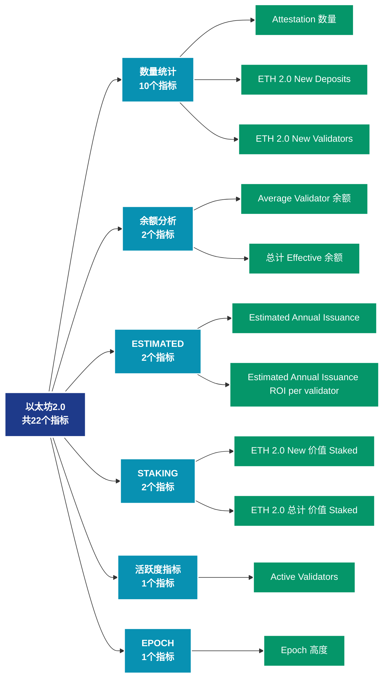

# 以太坊2.0 (eth2)

## 📝 类别描述

以太坊2.0质押和验证者数据，包括质押量、验证者数量、奖励等。

## 📊 指标概览

本类别共包含 **22** 个指标，涵盖以下主要子类别：

| 子类别 | 指标数量 | 主要功能 |
|--------|----------|----------|
| 数量统计 | 10 | 专门数据分析 |
| 余额分析 | 2 | 地址余额分布和变化 |
| ESTIMATED | 2 | 专门数据分析 |
| STAKING | 2 | 专门数据分析 |
| 活跃度指标 | 1 | 网络活跃度和用户参与 |
| EPOCH | 1 | 专门数据分析 |
| DEPOSITED | 1 | 专门数据分析 |
| PARTICIPATION | 1 | 专门数据分析 |
| SLOT | 1 | 专门数据分析 |
| STAKE | 1 | 专门数据分析 |

## 🎨 指标体系结构图



## 📂 详细指标说明

### 📊 数量统计（10个指标）

本子类别包含以下详细指标：

#### 1. Attestation 数量

- **指标代码**: `attestation_count`
- **API路径**: `/v1/metrics/eth2/attestation_count`
- **英文名称**: Attestation Count

**英文原文：**
The number of &#x27;yes&#x27; votes cast by the committee of validators which are attesting to the validity of the produced block in each slot.

Each Epoch, up to 64 committees of at least 128 validators are algorithmically selected per slot for block production and attestation. For each slot, one validator out of the committee is selected to propose a block, whilst the remaining validators are responsible for casting attestation votes.

**中文解释：**
分析Attestation Count相关的链上数据。这个指标通过追踪区块链上的实时数据，提供了传统金融分析无法获得的透明度和洞察力。链上数据的优势在于：1）数据真实可验证；2）实时更新无延迟；3）覆盖所有参与者。通过综合分析多个链上指标，投资者可以做出更明智的决策，研究人员可以深入理解市场机制。

**使用示例**：
```python
# 获取Attestation 数量数据
df = client.get_metric(
    "/v1/metrics/eth2/attestation_count",
    asset="BTC",
    resolution="24h"
)
```

---

#### 2. ETH 2.0 New Deposits

- **指标代码**: `staking_deposits_count`
- **API路径**: `/v1/metrics/eth2/staking_deposits_count`
- **英文名称**: ETH 2.0 New Deposits

**英文原文：**
The number transactions depositing 32 ETH to the ETH2 deposit contract.

**中文解释：**
分析ETH 2.0 New Deposits相关的链上数据。这个指标通过追踪区块链上的实时数据，提供了传统金融分析无法获得的透明度和洞察力。链上数据的优势在于：1）数据真实可验证；2）实时更新无延迟；3）覆盖所有参与者。通过综合分析多个链上指标，投资者可以做出更明智的决策，研究人员可以深入理解市场机制。

**使用示例**：
```python
# 获取ETH 2.0 New Deposits数据
df = client.get_metric(
    "/v1/metrics/eth2/staking_deposits_count",
    asset="BTC",
    resolution="24h"
)
```

---

#### 3. ETH 2.0 New Validators

- **指标代码**: `staking_validators_count`
- **API路径**: `/v1/metrics/eth2/staking_validators_count`
- **英文名称**: ETH 2.0 New Validators

**英文原文：**
The number of new unique addresses depositing 32 ETH to the ETH2 deposit contract. Note that there is not necessarily always a direct relationship between an individual address and a validator, e.g. a single validator can deposit funds from multiple addresses to the ETH2 contract.

**中文解释：**
分析ETH 2.0 New Validators相关的链上数据。这个指标通过追踪区块链上的实时数据，提供了传统金融分析无法获得的透明度和洞察力。链上数据的优势在于：1）数据真实可验证；2）实时更新无延迟；3）覆盖所有参与者。通过综合分析多个链上指标，投资者可以做出更明智的决策，研究人员可以深入理解市场机制。

**使用示例**：
```python
# 获取ETH 2.0 New Validators数据
df = client.get_metric(
    "/v1/metrics/eth2/staking_validators_count",
    asset="BTC",
    resolution="24h"
)
```

---

#### 4. ETH 2.0 总计 Number of Deposits

- **指标代码**: `staking_total_deposits_count`
- **API路径**: `/v1/metrics/eth2/staking_total_deposits_count`
- **英文名称**: ETH 2.0 Total Number of Deposits

**英文原文：**
The total number of transactions to the ETH2 deposit contract.

**中文解释：**
分析ETH 2.0 Total Number of Deposits相关的链上数据。这个指标通过追踪区块链上的实时数据，提供了传统金融分析无法获得的透明度和洞察力。链上数据的优势在于：1）数据真实可验证；2）实时更新无延迟；3）覆盖所有参与者。通过综合分析多个链上指标，投资者可以做出更明智的决策，研究人员可以深入理解市场机制。

**使用示例**：
```python
# 获取ETH 2.0 总计 Number of Deposits数据
df = client.get_metric(
    "/v1/metrics/eth2/staking_total_deposits_count",
    asset="BTC",
    resolution="24h"
)
```

---

#### 5. ETH 2.0 总计 Number of Validators

- **指标代码**: `staking_total_validators_count`
- **API路径**: `/v1/metrics/eth2/staking_total_validators_count`
- **英文名称**: ETH 2.0 Total Number of Validators

**英文原文：**
The total number of unique addresses that have deposited 32 ETH to the ETH2 deposit contract. Note that there is not necessarily always a direct relationship between an individual address and a validator, e.g. a single validator can deposit funds from multiple addresses to the ETH2 contract.

**中文解释：**
分析ETH 2.0 Total Number of Validators相关的链上数据。这个指标通过追踪区块链上的实时数据，提供了传统金融分析无法获得的透明度和洞察力。链上数据的优势在于：1）数据真实可验证；2）实时更新无延迟；3）覆盖所有参与者。通过综合分析多个链上指标，投资者可以做出更明智的决策，研究人员可以深入理解市场机制。

**使用示例**：
```python
# 获取ETH 2.0 总计 Number of Validators数据
df = client.get_metric(
    "/v1/metrics/eth2/staking_total_validators_count",
    asset="BTC",
    resolution="24h"
)
```

---

#### 6. Missed 区块s

- **指标代码**: `missed_blocks_count`
- **API路径**: `/v1/metrics/eth2/missed_blocks_count`
- **英文名称**: Missed Blocks

**英文原文：**
The total number of slots where a validator failed to produce a block. This can occur if a validator is offline, or opted not to propose a block in their allocated slot.

**中文解释：**
分析Missed Blocks相关的链上数据。这个指标通过追踪区块链上的实时数据，提供了传统金融分析无法获得的透明度和洞察力。链上数据的优势在于：1）数据真实可验证；2）实时更新无延迟；3）覆盖所有参与者。通过综合分析多个链上指标，投资者可以做出更明智的决策，研究人员可以深入理解市场机制。

**使用示例**：
```python
# 获取Missed 区块s数据
df = client.get_metric(
    "/v1/metrics/eth2/missed_blocks_count",
    asset="BTC",
    resolution="24h"
)
```

---

#### 7. Orphaned 区块s

- **指标代码**: `orphaned_blocks_count`
- **API路径**: `/v1/metrics/eth2/orphaned_blocks_count`
- **英文名称**: Orphaned Blocks

**英文原文：**
The total number of orphan blocks which were not selected as the canonical chain. Orphaned blocks are duplicate blocks, produced by different validators, but were not included on the main blockchain. They naturally occur due to network latency, or in instances where two validators produce a block at the same timestamp.

**中文解释：**
分析Orphaned Blocks相关的链上数据。这个指标通过追踪区块链上的实时数据，提供了传统金融分析无法获得的透明度和洞察力。链上数据的优势在于：1）数据真实可验证；2）实时更新无延迟；3）覆盖所有参与者。通过综合分析多个链上指标，投资者可以做出更明智的决策，研究人员可以深入理解市场机制。

**使用示例**：
```python
# 获取Orphaned 区块s数据
df = client.get_metric(
    "/v1/metrics/eth2/orphaned_blocks_count",
    asset="BTC",
    resolution="24h"
)
```

---

#### 8. Slashing Event 数量

- **指标代码**: `slashings_count`
- **API路径**: `/v1/metrics/eth2/slashings_count`
- **英文名称**: Slashing Event Count

**英文原文：**
Total number of slashing events recorded on the blockchain. Slashing events are automated events which occur due to validator misbehaviour such as proposing invalid blocks, or attesting to an invalid fork of the blockchain.

**中文解释：**
分析Slashing Event Count相关的链上数据。这个指标通过追踪区块链上的实时数据，提供了传统金融分析无法获得的透明度和洞察力。链上数据的优势在于：1）数据真实可验证；2）实时更新无延迟；3）覆盖所有参与者。通过综合分析多个链上指标，投资者可以做出更明智的决策，研究人员可以深入理解市场机制。

**使用示例**：
```python
# 获取Slashing Event 数量数据
df = client.get_metric(
    "/v1/metrics/eth2/slashings_count",
    asset="BTC",
    resolution="24h"
)
```

---

#### 9. Staking Deposits

- **指标代码**: `deposits_count`
- **API路径**: `/v1/metrics/eth2/deposits_count`
- **英文名称**: Staking Deposits

**英文原文：**
The number of new 32 ETH stake deposits made into the staking contract.

**中文解释：**
分析Staking Deposits相关的链上数据。这个指标通过追踪区块链上的实时数据，提供了传统金融分析无法获得的透明度和洞察力。链上数据的优势在于：1）数据真实可验证；2）实时更新无延迟；3）覆盖所有参与者。通过综合分析多个链上指标，投资者可以做出更明智的决策，研究人员可以深入理解市场机制。

**使用示例**：
```python
# 获取Staking Deposits数据
df = client.get_metric(
    "/v1/metrics/eth2/deposits_count",
    asset="BTC",
    resolution="24h"
)
```

---

#### 10. Voluntary Exit 数量

- **指标代码**: `voluntary_exit_count`
- **API路径**: `/v1/metrics/eth2/voluntary_exit_count`
- **英文名称**: Voluntary Exit Count

**英文原文：**
The total number of validators that have exited the validator pool voluntarily.

**中文解释：**
分析Voluntary Exit Count相关的链上数据。这个指标通过追踪区块链上的实时数据，提供了传统金融分析无法获得的透明度和洞察力。链上数据的优势在于：1）数据真实可验证；2）实时更新无延迟；3）覆盖所有参与者。通过综合分析多个链上指标，投资者可以做出更明智的决策，研究人员可以深入理解市场机制。

**使用示例**：
```python
# 获取Voluntary Exit 数量数据
df = client.get_metric(
    "/v1/metrics/eth2/voluntary_exit_count",
    asset="BTC",
    resolution="24h"
)
```

---

### 📊 余额分析（2个指标）

本子类别包含以下详细指标：

#### 1. Average Validator 余额

- **指标代码**: `validator_balance_mean`
- **API路径**: `/v1/metrics/eth2/validator_balance_mean`
- **英文名称**: Average Validator Balance

**英文原文：**
The count of active validators. Active validators are validators that have completed the activation queue, are not in an exit queue, and have effective balances greater than 32 ETH.

**中文解释：**
分析地址余额的各个方面，包括余额分布、余额变化、余额集中度等。余额分析揭示了网络的财富结构和演变趋势，是理解市场力量对比的关键。

**使用示例**：
```python
# 获取Average Validator 余额数据
df = client.get_metric(
    "/v1/metrics/eth2/validator_balance_mean",
    asset="BTC",
    resolution="24h"
)
```

---

#### 2. 总计 Effective 余额

- **指标代码**: `effective_balance_sum`
- **API路径**: `/v1/metrics/eth2/effective_balance_sum`
- **英文名称**: Total Effective Balance

**英文原文：**
The total staked balance which is actively participating in Proof-of-Stake consensus.

The Effective Balance of an individual validator is always rounded to 1 ETH increments, and has a maximum of 32 ETH. Effective Balance will round down to nearest 1 ETH increment with a minimum buffer of 0.25 ETH. For example:
- Total Balance of 35 ETH —> Effective Balance of 32 ETH
- Total Balance of 31.9 ETH —> Effective Balance of 31 ETH
- Total Balance of 31.25 ETH —>  Effective Balance of 31 ETH
- Total Balance of 31.24 ETH —>  Effective Balance of 30 ETH

**中文解释：**
分析地址余额的各个方面，包括余额分布、余额变化、余额集中度等。余额分析揭示了网络的财富结构和演变趋势，是理解市场力量对比的关键。

**使用示例**：
```python
# 获取总计 Effective 余额数据
df = client.get_metric(
    "/v1/metrics/eth2/effective_balance_sum",
    asset="BTC",
    resolution="24h"
)
```

---

### 📊 ESTIMATED（2个指标）

本子类别包含以下详细指标：

#### 1. Estimated Annual Issuance

- **指标代码**: `estimated_annual_issuance`
- **API路径**: `/v1/metrics/eth2/estimated_annual_issuance`
- **英文名称**: Estimated Annual Issuance

**英文原文：**
The theoretical network ETH issuance curve of the Ethereum Proof-of-Stake network. This chart reflects the estimated total ETH issuance which is determined based on the number of validators participating in consensus.

It is calculated as Annual ETH Issuance = 1024 * sqrt(Validator Count)

**中文解释：**
分析Estimated Annual Issuance相关的链上数据。这个指标通过追踪区块链上的实时数据，提供了传统金融分析无法获得的透明度和洞察力。链上数据的优势在于：1）数据真实可验证；2）实时更新无延迟；3）覆盖所有参与者。通过综合分析多个链上指标，投资者可以做出更明智的决策，研究人员可以深入理解市场机制。

**使用示例**：
```python
# 获取Estimated Annual Issuance数据
df = client.get_metric(
    "/v1/metrics/eth2/estimated_annual_issuance",
    asset="BTC",
    resolution="24h"
)
```

---

#### 2. Estimated Annual Issuance ROI per validator

- **指标代码**: `estimated_annual_issuance_roi_per_validator`
- **API路径**: `/v1/metrics/eth2/estimated_annual_issuance_roi_per_validator`
- **英文名称**: Estimated Annual Issuance ROI per validator

**英文原文：**
The theoretical per validator return curve of the Ethereum Proof-of-Stake network. This chart reflects the ETH denominated annual return (%) on a 32-ETH stake validator, with ETH issuance determined based on the number of validators participating in consensus.

It is calculated as Annual ROI per validator = 32 / sqrt(Validator Count)

**中文解释：**
分析Estimated Annual Issuance ROI per validator相关的链上数据。这个指标通过追踪区块链上的实时数据，提供了传统金融分析无法获得的透明度和洞察力。链上数据的优势在于：1）数据真实可验证；2）实时更新无延迟；3）覆盖所有参与者。通过综合分析多个链上指标，投资者可以做出更明智的决策，研究人员可以深入理解市场机制。

**使用示例**：
```python
# 获取Estimated Annual Issuance ROI per validator数据
df = client.get_metric(
    "/v1/metrics/eth2/estimated_annual_issuance_roi_per_validator",
    asset="BTC",
    resolution="24h"
)
```

---

### 📊 STAKING（2个指标）

本子类别包含以下详细指标：

#### 1. ETH 2.0 New 价值 Staked

- **指标代码**: `staking_volume_sum`
- **API路径**: `/v1/metrics/eth2/staking_volume_sum`
- **英文名称**: ETH 2.0 New Value Staked

**英文原文：**
The amount of ETH transferred to the ETH2 deposit contract.

**中文解释：**
分析ETH 2.0 New Value Staked相关的链上数据。这个指标通过追踪区块链上的实时数据，提供了传统金融分析无法获得的透明度和洞察力。链上数据的优势在于：1）数据真实可验证；2）实时更新无延迟；3）覆盖所有参与者。通过综合分析多个链上指标，投资者可以做出更明智的决策，研究人员可以深入理解市场机制。

**使用示例**：
```python
# 获取ETH 2.0 New 价值 Staked数据
df = client.get_metric(
    "/v1/metrics/eth2/staking_volume_sum",
    asset="BTC",
    resolution="24h"
)
```

---

#### 2. ETH 2.0 总计 价值 Staked

- **指标代码**: `staking_total_volume_sum`
- **API路径**: `/v1/metrics/eth2/staking_total_volume_sum`
- **英文名称**: ETH 2.0 Total Value Staked

**英文原文：**
The amount of ETH that has been deposited to the ETH2 deposit contract, the current ETH balance on the ETH2 deposit contract.

**中文解释：**
分析ETH 2.0 Total Value Staked相关的链上数据。这个指标通过追踪区块链上的实时数据，提供了传统金融分析无法获得的透明度和洞察力。链上数据的优势在于：1）数据真实可验证；2）实时更新无延迟；3）覆盖所有参与者。通过综合分析多个链上指标，投资者可以做出更明智的决策，研究人员可以深入理解市场机制。

**使用示例**：
```python
# 获取ETH 2.0 总计 价值 Staked数据
df = client.get_metric(
    "/v1/metrics/eth2/staking_total_volume_sum",
    asset="BTC",
    resolution="24h"
)
```

---

### 📊 活跃度指标（1个指标）

本子类别包含以下详细指标：

#### 1. Active Validators

- **指标代码**: `active_validators_count`
- **API路径**: `/v1/metrics/eth2/active_validators_count`
- **英文名称**: Active Validators

**英文原文：**
The count of active validators. Active validators are validators that have completed the activation queue, are not in an exit queue, and have effective balances greater than 32 ETH.

**中文解释：**
统计在特定时间段内（通常为24小时）参与发送或接收交易的独立地址数量。活跃地址数是衡量网络使用率和用户参与度的核心指标。高活跃地址数通常表示：1）网络被广泛使用；2）生态系统健康发展；3）用户对网络有实际需求。活跃地址的变化趋势可以帮助判断网络的成长阶段和市场周期。

**使用示例**：
```python
# 获取Active Validators数据
df = client.get_metric(
    "/v1/metrics/eth2/active_validators_count",
    asset="BTC",
    resolution="24h"
)
```

---

### 📊 EPOCH（1个指标）

本子类别包含以下详细指标：

#### 1. Epoch 高度

- **指标代码**: `epoch_height`
- **API路径**: `/v1/metrics/eth2/epoch_height`
- **英文名称**: Epoch Height

**英文原文：**
The epoch height, i.e. the total number of epochs ever included in the main blockchain. Each Epoch contains a set of 32 slots, and an average time interval of 6.4mins.

**中文解释：**
分析Epoch Height相关的链上数据。这个指标通过追踪区块链上的实时数据，提供了传统金融分析无法获得的透明度和洞察力。链上数据的优势在于：1）数据真实可验证；2）实时更新无延迟；3）覆盖所有参与者。通过综合分析多个链上指标，投资者可以做出更明智的决策，研究人员可以深入理解市场机制。

**使用示例**：
```python
# 获取Epoch 高度数据
df = client.get_metric(
    "/v1/metrics/eth2/epoch_height",
    asset="BTC",
    resolution="24h"
)
```

---

### 📊 DEPOSITED（1个指标）

本子类别包含以下详细指标：

#### 1. ETH 2.0 总计 价值 Staked by Provider

- **指标代码**: `deposited_by_provider_volume_sum`
- **API路径**: `/v1/metrics/eth2/deposited_by_provider_volume_sum`
- **英文名称**: ETH 2.0 Total Value Staked by Provider

**英文原文：**
The total amount of ETH transferred to the ETH2 deposit contract via staking providers.

**中文解释：**
分析ETH 2.0 Total Value Staked by Provider相关的链上数据。这个指标通过追踪区块链上的实时数据，提供了传统金融分析无法获得的透明度和洞察力。链上数据的优势在于：1）数据真实可验证；2）实时更新无延迟；3）覆盖所有参与者。通过综合分析多个链上指标，投资者可以做出更明智的决策，研究人员可以深入理解市场机制。

**使用示例**：
```python
# 获取ETH 2.0 总计 价值 Staked by Provider数据
df = client.get_metric(
    "/v1/metrics/eth2/deposited_by_provider_volume_sum",
    asset="BTC",
    resolution="24h"
)
```

---

### 📊 PARTICIPATION（1个指标）

本子类别包含以下详细指标：

#### 1. Participation 比率

- **指标代码**: `participation_rate_mean`
- **API路径**: `/v1/metrics/eth2/participation_rate_mean`
- **英文名称**: Participation Rate

**英文原文：**
A measure of network validator responsiveness, tracking the proportion of slots that were missed to the total available. The participation rate is calculated as follows: (Total Slots - Slots Missed) / Total Slots.

**中文解释：**
分析Participation Rate相关的链上数据。这个指标通过追踪区块链上的实时数据，提供了传统金融分析无法获得的透明度和洞察力。链上数据的优势在于：1）数据真实可验证；2）实时更新无延迟；3）覆盖所有参与者。通过综合分析多个链上指标，投资者可以做出更明智的决策，研究人员可以深入理解市场机制。

**使用示例**：
```python
# 获取Participation 比率数据
df = client.get_metric(
    "/v1/metrics/eth2/participation_rate_mean",
    asset="BTC",
    resolution="24h"
)
```

---

### 📊 SLOT（1个指标）

本子类别包含以下详细指标：

#### 1. Slot 高度

- **指标代码**: `slot_height`
- **API路径**: `/v1/metrics/eth2/slot_height`
- **英文名称**: Slot Height

**英文原文：**
The slot height, i.e. the total number of slots ever included in the main blockchain. Each slot is an opportunity for the selected validator to propose a block, and have a target interval of 12 seconds.

**中文解释：**
分析Slot Height相关的链上数据。这个指标通过追踪区块链上的实时数据，提供了传统金融分析无法获得的透明度和洞察力。链上数据的优势在于：1）数据真实可验证；2）实时更新无延迟；3）覆盖所有参与者。通过综合分析多个链上指标，投资者可以做出更明智的决策，研究人员可以深入理解市场机制。

**使用示例**：
```python
# 获取Slot 高度数据
df = client.get_metric(
    "/v1/metrics/eth2/slot_height",
    asset="BTC",
    resolution="24h"
)
```

---

### 📊 STAKE（1个指标）

本子类别包含以下详细指标：

#### 1. Stake Effectiveness

- **指标代码**: `stake_effectiveness_mean`
- **API路径**: `/v1/metrics/eth2/stake_effectiveness_mean`
- **英文名称**: Stake Effectiveness

**英文原文：**
Stake Effectiveness is a measure of the propostion of staked ETH which is actively participating in consensus. It is calculated as the ratio between the Total Staked Balance, and the Total Effective Balance of the Proof-of-Stake validator set: Stake Effectiveness = Total Effective Balance / Total Staked Balance

**中文解释：**
分析Stake Effectiveness相关的链上数据。这个指标通过追踪区块链上的实时数据，提供了传统金融分析无法获得的透明度和洞察力。链上数据的优势在于：1）数据真实可验证；2）实时更新无延迟；3）覆盖所有参与者。通过综合分析多个链上指标，投资者可以做出更明智的决策，研究人员可以深入理解市场机制。

**使用示例**：
```python
# 获取Stake Effectiveness数据
df = client.get_metric(
    "/v1/metrics/eth2/stake_effectiveness_mean",
    asset="BTC",
    resolution="24h"
)
```

---

## 📊 完整指标列表

| # | 指标名称 | 指标代码 | API路径 |
|---|----------|----------|---------|
| 1 | Active Validators | `active_validators_count` | `/v1/metrics/eth2/active_validators_count` |
| 2 | Attestation 数量 | `attestation_count` | `/v1/metrics/eth2/attestation_count` |
| 3 | Average Validator 余额 | `validator_balance_mean` | `/v1/metrics/eth2/validator_balance_mean` |
| 4 | Epoch 高度 | `epoch_height` | `/v1/metrics/eth2/epoch_height` |
| 5 | Estimated Annual Issuance | `estimated_annual_issuance` | `/v1/metrics/eth2/estimated_annual_issuance` |
| 6 | Estimated Annual Issuance ROI per validator | `estimated_annual_issuance_roi_per_validator` | `/v1/metrics/eth2/estimated_annual_issuance_roi_per_validator` |
| 7 | ETH 2.0 New Deposits | `staking_deposits_count` | `/v1/metrics/eth2/staking_deposits_count` |
| 8 | ETH 2.0 New Validators | `staking_validators_count` | `/v1/metrics/eth2/staking_validators_count` |
| 9 | ETH 2.0 New 价值 Staked | `staking_volume_sum` | `/v1/metrics/eth2/staking_volume_sum` |
| 10 | ETH 2.0 总计 Number of Deposits | `staking_total_deposits_count` | `/v1/metrics/eth2/staking_total_deposits_count` |
| 11 | ETH 2.0 总计 Number of Validators | `staking_total_validators_count` | `/v1/metrics/eth2/staking_total_validators_count` |
| 12 | ETH 2.0 总计 价值 Staked | `staking_total_volume_sum` | `/v1/metrics/eth2/staking_total_volume_sum` |
| 13 | ETH 2.0 总计 价值 Staked by Provider | `deposited_by_provider_volume_sum` | `/v1/metrics/eth2/deposited_by_provider_volume_sum` |
| 14 | Missed 区块s | `missed_blocks_count` | `/v1/metrics/eth2/missed_blocks_count` |
| 15 | Orphaned 区块s | `orphaned_blocks_count` | `/v1/metrics/eth2/orphaned_blocks_count` |
| 16 | Participation 比率 | `participation_rate_mean` | `/v1/metrics/eth2/participation_rate_mean` |
| 17 | Slashing Event 数量 | `slashings_count` | `/v1/metrics/eth2/slashings_count` |
| 18 | Slot 高度 | `slot_height` | `/v1/metrics/eth2/slot_height` |
| 19 | Stake Effectiveness | `stake_effectiveness_mean` | `/v1/metrics/eth2/stake_effectiveness_mean` |
| 20 | Staking Deposits | `deposits_count` | `/v1/metrics/eth2/deposits_count` |
| 21 | 总计 Effective 余额 | `effective_balance_sum` | `/v1/metrics/eth2/effective_balance_sum` |
| 22 | Voluntary Exit 数量 | `voluntary_exit_count` | `/v1/metrics/eth2/voluntary_exit_count` |

## 💻 代码示例

### Python SDK 使用示例

```python
from glassnode import GlassnodeClient

# 初始化客户端
client = GlassnodeClient(api_key="YOUR_API_KEY")

# 获取单个指标
data = client.get(
    "/v1/metrics/addresses/active_count",
    asset="BTC",
    resolution="24h",
    since="2024-01-01"
)

# 批量获取多个指标
metrics = [
    "active_count",
    "new",
    "non_zero_count"
]

results = {}
for metric in metrics:
    results[metric] = client.get(
        f"/v1/metrics/addresses/{metric}",
        asset="BTC"
    )
```

## 📚 参考资源

- [Glassnode官方文档](https://docs.glassnode.com)
- [Glassnode Studio](https://studio.glassnode.com)
- [API访问说明](https://docs.glassnode.com/basic-api/api)

---

*最后更新：2024年*
