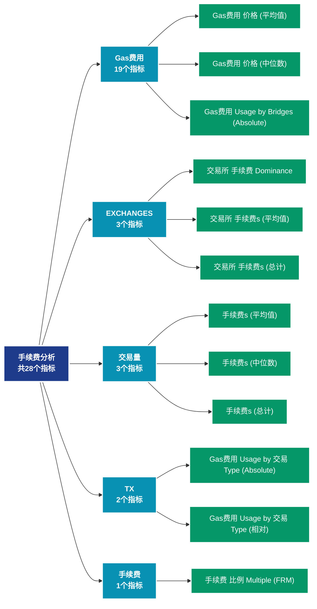

# 手续费分析 (fees)

## 📝 类别描述

手续费市场分析，包括平均费用、总费用、费用压力等费用相关指标。

## 📊 指标概览

本类别共包含 **28** 个指标，涵盖以下主要子类别：

| 子类别 | 指标数量 | 主要功能 |
|--------|----------|----------|
| Gas费用 | 19 | 专门数据分析 |
| EXCHANGES | 3 | 专门数据分析 |
| 交易量 | 3 | 专门数据分析 |
| TX | 2 | 专门数据分析 |
| 手续费 | 1 | 手续费市场动态 |

## 🎨 指标体系结构图



## 📂 详细指标说明

### 📊 Gas费用（19个指标）

本子类别包含以下详细指标：

#### 1. Gas费用 价格 (平均值)

- **指标代码**: `gas_price_mean`
- **API路径**: `/v1/metrics/fees/gas_price_mean`
- **英文名称**: Gas Price (Mean)

**英文原文：**
The mean gas price paid per transaction.

**中文解释：**
计算网络交易费用的平均值。平均费用反映：1）网络的拥堵程度；2）用户的支付意愿；3）区块空间的供需关系。高费用期间，只有高价值交易才会上链；低费用期间，更多小额交易变得可行。费用市场是评估网络使用需求的重要指标。

**使用示例**：
```python
# 获取Gas费用 价格 (平均值)数据
df = client.get_metric(
    "/v1/metrics/fees/gas_price_mean",
    asset="BTC",
    resolution="24h"
)
```

---

#### 2. Gas费用 价格 (中位数)

- **指标代码**: `gas_price_median`
- **API路径**: `/v1/metrics/fees/gas_price_median`
- **英文名称**: Gas Price (Median)

**英文原文：**
The median gas price paid per transaction.

**中文解释：**
计算交易费用的中位数。相比平均值，中位数不受极端高额费用的影响，更能反映典型用户的费用负担。中位数费用是评估网络可用性和普通用户体验的关键指标。

**使用示例**：
```python
# 获取Gas费用 价格 (中位数)数据
df = client.get_metric(
    "/v1/metrics/fees/gas_price_median",
    asset="BTC",
    resolution="24h"
)
```

---

#### 3. Gas费用 Usage by Bridges (Absolute)

- **指标代码**: `gas_used_sum_bridges`
- **API路径**: `/v1/metrics/fees/gas_used_sum_bridges`
- **英文名称**: Gas Usage by Bridges (Absolute)

**英文原文：**
The amount of gas consumed by the Ethereum network by contracts that allow transfer of tokens between different blockchains.

**中文解释：**
统计支付给矿工或验证者的总手续费。总费用反映：1）网络的安全预算；2）用户对区块空间的总需求；3）矿工/验证者的收入来源。在区块奖励减少的情况下，手续费将成为维护网络安全的主要激励。

**使用示例**：
```python
# 获取Gas费用 Usage by Bridges (Absolute)数据
df = client.get_metric(
    "/v1/metrics/fees/gas_used_sum_bridges",
    asset="BTC",
    resolution="24h"
)
```

---

#### 4. Gas费用 Usage by Bridges (相对)

- **指标代码**: `gas_used_sum_bridges_relative`
- **API路径**: `/v1/metrics/fees/gas_used_sum_bridges_relative`
- **英文名称**: Gas Usage by Bridges (Relative)

**英文原文：**
The relative amount (share) of gas consumed by the Ethereum network by contracts that allow transfer of tokens between different blockchains.

**中文解释：**
统计支付给矿工或验证者的总手续费。总费用反映：1）网络的安全预算；2）用户对区块空间的总需求；3）矿工/验证者的收入来源。在区块奖励减少的情况下，手续费将成为维护网络安全的主要激励。

**使用示例**：
```python
# 获取Gas费用 Usage by Bridges (相对)数据
df = client.get_metric(
    "/v1/metrics/fees/gas_used_sum_bridges_relative",
    asset="BTC",
    resolution="24h"
)
```

---

#### 5. Gas费用 Usage by DeFi (Absolute)

- **指标代码**: `gas_used_sum_defi`
- **API路径**: `/v1/metrics/fees/gas_used_sum_defi`
- **英文名称**: Gas Usage by DeFi (Absolute)

**英文原文：**
The amount of gas consumed by the Ethereum network by on-chain financial instruments and protocols implemented as smart contracts, including decentralized exchanges (DEXs).

**中文解释：**
统计支付给矿工或验证者的总手续费。总费用反映：1）网络的安全预算；2）用户对区块空间的总需求；3）矿工/验证者的收入来源。在区块奖励减少的情况下，手续费将成为维护网络安全的主要激励。

**使用示例**：
```python
# 获取Gas费用 Usage by DeFi (Absolute)数据
df = client.get_metric(
    "/v1/metrics/fees/gas_used_sum_defi",
    asset="BTC",
    resolution="24h"
)
```

---

#### 6. Gas费用 Usage by DeFi (相对)

- **指标代码**: `gas_used_sum_defi_relative`
- **API路径**: `/v1/metrics/fees/gas_used_sum_defi_relative`
- **英文名称**: Gas Usage by DeFi (Relative)

**英文原文：**
The relative amount (share) of gas consumed by the Ethereum network by on-chain financial instruments and protocols implemented as smart contracts, including decentralized exchanges (DEXs).

**中文解释：**
统计支付给矿工或验证者的总手续费。总费用反映：1）网络的安全预算；2）用户对区块空间的总需求；3）矿工/验证者的收入来源。在区块奖励减少的情况下，手续费将成为维护网络安全的主要激励。

**使用示例**：
```python
# 获取Gas费用 Usage by DeFi (相对)数据
df = client.get_metric(
    "/v1/metrics/fees/gas_used_sum_defi_relative",
    asset="BTC",
    resolution="24h"
)
```

---

#### 7. Gas费用 Usage by ERC-20 Tokens (Absolute)

- **指标代码**: `gas_used_sum_erc20`
- **API路径**: `/v1/metrics/fees/gas_used_sum_erc20`
- **英文名称**: Gas Usage by ERC-20 Tokens (Absolute)

**英文原文：**
The amount of gas consumed by the Ethereum network by transactions calling ERC20 contracts. Stablecoins contracts are excluded here.

**中文解释：**
统计支付给矿工或验证者的总手续费。总费用反映：1）网络的安全预算；2）用户对区块空间的总需求；3）矿工/验证者的收入来源。在区块奖励减少的情况下，手续费将成为维护网络安全的主要激励。

**使用示例**：
```python
# 获取Gas费用 Usage by ERC-20 Tokens (Absolute)数据
df = client.get_metric(
    "/v1/metrics/fees/gas_used_sum_erc20",
    asset="BTC",
    resolution="24h"
)
```

---

#### 8. Gas费用 Usage by ERC-20 Tokens (相对)

- **指标代码**: `gas_used_sum_erc20_relative`
- **API路径**: `/v1/metrics/fees/gas_used_sum_erc20_relative`
- **英文名称**: Gas Usage by ERC-20 Tokens (Relative)

**英文原文：**
The relative amount (share) of gas consumed by the Ethereum network by transactions calling ERC20 contracts. Stablecoins contracts are excluded here.

**中文解释：**
统计支付给矿工或验证者的总手续费。总费用反映：1）网络的安全预算；2）用户对区块空间的总需求；3）矿工/验证者的收入来源。在区块奖励减少的情况下，手续费将成为维护网络安全的主要激励。

**使用示例**：
```python
# 获取Gas费用 Usage by ERC-20 Tokens (相对)数据
df = client.get_metric(
    "/v1/metrics/fees/gas_used_sum_erc20_relative",
    asset="BTC",
    resolution="24h"
)
```

---

#### 9. Gas费用 Usage by NFTs (Absolute)

- **指标代码**: `gas_used_sum_nfts`
- **API路径**: `/v1/metrics/fees/gas_used_sum_nfts`
- **英文名称**: Gas Usage by NFTs (Absolute)

**英文原文：**
The amount of gas consumed by the Ethereum network by transactions interacting with non-fungible tokens. This category includes of both token contract standards (ERC721, ERC1155), as well as NFT marketplaces (OpenSea, Blur, LooksRare, Rarible, SuperRare) for trading those.

**中文解释：**
统计支付给矿工或验证者的总手续费。总费用反映：1）网络的安全预算；2）用户对区块空间的总需求；3）矿工/验证者的收入来源。在区块奖励减少的情况下，手续费将成为维护网络安全的主要激励。

**使用示例**：
```python
# 获取Gas费用 Usage by NFTs (Absolute)数据
df = client.get_metric(
    "/v1/metrics/fees/gas_used_sum_nfts",
    asset="BTC",
    resolution="24h"
)
```

---

#### 10. Gas费用 Usage by NFTs (相对)

- **指标代码**: `gas_used_sum_nfts_relative`
- **API路径**: `/v1/metrics/fees/gas_used_sum_nfts_relative`
- **英文名称**: Gas Usage by NFTs (Relative)

**英文原文：**
The relative amount (share) of gas consumed by the Ethereum network by transactions interacting with non-fungible tokens. This category includes of both token contract standards (ERC721, ERC1155), as well as NFT marketplaces (OpenSea, Blur, LooksRare, Rarible, SuperRare) for trading those.

**中文解释：**
统计支付给矿工或验证者的总手续费。总费用反映：1）网络的安全预算；2）用户对区块空间的总需求；3）矿工/验证者的收入来源。在区块奖励减少的情况下，手续费将成为维护网络安全的主要激励。

**使用示例**：
```python
# 获取Gas费用 Usage by NFTs (相对)数据
df = client.get_metric(
    "/v1/metrics/fees/gas_used_sum_nfts_relative",
    asset="BTC",
    resolution="24h"
)
```

---

#### 11. Gas费用 Usage by Stablecoins (Absolute)

- **指标代码**: `gas_used_sum_stablecoins`
- **API路径**: `/v1/metrics/fees/gas_used_sum_stablecoins`
- **英文名称**: Gas Usage by Stablecoins (Absolute)

**英文原文：**
The amount of gas consumed by the Ethereum network by stablecoin transactions. Stablecoin are fungible tokens that have their value pegged to an off-chain asset, either by the issuer or by an algorithm. We include 150+ stablecoins in this category, with USDT, USDC, UST, BUSD, and DAI being the most prominent ones.

**中文解释：**
统计支付给矿工或验证者的总手续费。总费用反映：1）网络的安全预算；2）用户对区块空间的总需求；3）矿工/验证者的收入来源。在区块奖励减少的情况下，手续费将成为维护网络安全的主要激励。

**使用示例**：
```python
# 获取Gas费用 Usage by Stablecoins (Absolute)数据
df = client.get_metric(
    "/v1/metrics/fees/gas_used_sum_stablecoins",
    asset="BTC",
    resolution="24h"
)
```

---

#### 12. Gas费用 Usage by Stablecoins (相对)

- **指标代码**: `gas_used_sum_stablecoins_relative`
- **API路径**: `/v1/metrics/fees/gas_used_sum_stablecoins_relative`
- **英文名称**: Gas Usage by Stablecoins (Relative)

**英文原文：**
The relative amount (share) of gas consumed by the Ethereum network by stablecoin transactions. Stablecoin are fungible tokens that have their value pegged to an off-chain asset, either by the issuer or by an algorithm. We include 150+ stablecoins in this category, with USDT, USDC, UST, BUSD, and DAI being the most prominent ones.

**中文解释：**
统计支付给矿工或验证者的总手续费。总费用反映：1）网络的安全预算；2）用户对区块空间的总需求；3）矿工/验证者的收入来源。在区块奖励减少的情况下，手续费将成为维护网络安全的主要激励。

**使用示例**：
```python
# 获取Gas费用 Usage by Stablecoins (相对)数据
df = client.get_metric(
    "/v1/metrics/fees/gas_used_sum_stablecoins_relative",
    asset="BTC",
    resolution="24h"
)
```

---

#### 13. Gas费用 Usage by Vanilla 交易s (Absolute)

- **指标代码**: `gas_used_sum_vanilla`
- **API路径**: `/v1/metrics/fees/gas_used_sum_vanilla`
- **英文名称**: Gas Usage by Vanilla Transactions (Absolute)

**英文原文：**
The amount of gas consumed by the Ethereum network by vanilla transactions. Vanilla transactions are pure ETH transfers between Externally Owned Accounts (EOAs), with no contracts being called. Note that occasionally the value of the last datapoint can slightly change as some addresses initially transact as "vanilla" before their associated smart contract deployment is observed.

**中文解释：**
统计支付给矿工或验证者的总手续费。总费用反映：1）网络的安全预算；2）用户对区块空间的总需求；3）矿工/验证者的收入来源。在区块奖励减少的情况下，手续费将成为维护网络安全的主要激励。

**使用示例**：
```python
# 获取Gas费用 Usage by Vanilla 交易s (Absolute)数据
df = client.get_metric(
    "/v1/metrics/fees/gas_used_sum_vanilla",
    asset="BTC",
    resolution="24h"
)
```

---

#### 14. Gas费用 Usage by Vanilla 交易s (相对)

- **指标代码**: `gas_used_sum_vanilla_relative`
- **API路径**: `/v1/metrics/fees/gas_used_sum_vanilla_relative`
- **英文名称**: Gas Usage by Vanilla Transactions (Relative)

**英文原文：**
The relative amount (share) of gas consumed by the Ethereum network by vanilla transactions. Vanilla transactions are pure ETH transfers between Externally Owned Accounts (EOAs), with no contracts being called. Note that occasionally the value of the last datapoint can slightly change as some addresses initially transact as "vanilla" before their associated smart contract deployment is observed.

**中文解释：**
统计支付给矿工或验证者的总手续费。总费用反映：1）网络的安全预算；2）用户对区块空间的总需求；3）矿工/验证者的收入来源。在区块奖励减少的情况下，手续费将成为维护网络安全的主要激励。

**使用示例**：
```python
# 获取Gas费用 Usage by Vanilla 交易s (相对)数据
df = client.get_metric(
    "/v1/metrics/fees/gas_used_sum_vanilla_relative",
    asset="BTC",
    resolution="24h"
)
```

---

#### 15. Gas费用 Used (平均值)

- **指标代码**: `gas_used_mean`
- **API路径**: `/v1/metrics/fees/gas_used_mean`
- **英文名称**: Gas Used (Mean)

**英文原文：**
The mean amount of gas used per transaction.

**中文解释：**
计算网络交易费用的平均值。平均费用反映：1）网络的拥堵程度；2）用户的支付意愿；3）区块空间的供需关系。高费用期间，只有高价值交易才会上链；低费用期间，更多小额交易变得可行。费用市场是评估网络使用需求的重要指标。

**使用示例**：
```python
# 获取Gas费用 Used (平均值)数据
df = client.get_metric(
    "/v1/metrics/fees/gas_used_mean",
    asset="BTC",
    resolution="24h"
)
```

---

#### 16. Gas费用 Used (中位数)

- **指标代码**: `gas_used_median`
- **API路径**: `/v1/metrics/fees/gas_used_median`
- **英文名称**: Gas Used (Median)

**英文原文：**
The median amount of gas used per transaction.

**中文解释：**
计算交易费用的中位数。相比平均值，中位数不受极端高额费用的影响，更能反映典型用户的费用负担。中位数费用是评估网络可用性和普通用户体验的关键指标。

**使用示例**：
```python
# 获取Gas费用 Used (中位数)数据
df = client.get_metric(
    "/v1/metrics/fees/gas_used_median",
    asset="BTC",
    resolution="24h"
)
```

---

#### 17. Gas费用 Used (总计)

- **指标代码**: `gas_used_sum`
- **API路径**: `/v1/metrics/fees/gas_used_sum`
- **英文名称**: Gas Used (Total)

**英文原文：**
The total amount of gas used in all transactions.

**中文解释：**
统计支付给矿工或验证者的总手续费。总费用反映：1）网络的安全预算；2）用户对区块空间的总需求；3）矿工/验证者的收入来源。在区块奖励减少的情况下，手续费将成为维护网络安全的主要激励。

**使用示例**：
```python
# 获取Gas费用 Used (总计)数据
df = client.get_metric(
    "/v1/metrics/fees/gas_used_sum",
    asset="BTC",
    resolution="24h"
)
```

---

#### 18. 交易 Gas费用 Limit (平均值)

- **指标代码**: `gas_limit_tx_mean`
- **API路径**: `/v1/metrics/fees/gas_limit_tx_mean`
- **英文名称**: Transaction Gas Limit (Mean)

**英文原文：**
The mean gas limit per transaction.

**中文解释：**
计算网络交易费用的平均值。平均费用反映：1）网络的拥堵程度；2）用户的支付意愿；3）区块空间的供需关系。高费用期间，只有高价值交易才会上链；低费用期间，更多小额交易变得可行。费用市场是评估网络使用需求的重要指标。

**使用示例**：
```python
# 获取交易 Gas费用 Limit (平均值)数据
df = client.get_metric(
    "/v1/metrics/fees/gas_limit_tx_mean",
    asset="BTC",
    resolution="24h"
)
```

---

#### 19. 交易 Gas费用 Limit (中位数)

- **指标代码**: `gas_limit_tx_median`
- **API路径**: `/v1/metrics/fees/gas_limit_tx_median`
- **英文名称**: Transaction Gas Limit (Median)

**英文原文：**
The median gas limit per transaction.

**中文解释：**
计算交易费用的中位数。相比平均值，中位数不受极端高额费用的影响，更能反映典型用户的费用负担。中位数费用是评估网络可用性和普通用户体验的关键指标。

**使用示例**：
```python
# 获取交易 Gas费用 Limit (中位数)数据
df = client.get_metric(
    "/v1/metrics/fees/gas_limit_tx_median",
    asset="BTC",
    resolution="24h"
)
```

---

### 📊 EXCHANGES（3个指标）

本子类别包含以下详细指标：

#### 1. 交易所 手续费 Dominance

- **指标代码**: `exchanges_relative`
- **API路径**: `/v1/metrics/fees/exchanges_relative`
- **英文名称**: Exchange Fee Dominance

**英文原文：**
The Exchange Fee Dominance metric is defined as the percent amount of total fees paid in transactions related to on-chain exchange activity.
- Deposits: Transactions that include an exchange address as the receiver of funds.
- Withdrawals: Transactions that include an exchange address as the sender of funds.
- In-House: Transactions that include addresses of a single exchange as both the sender and receiver of funds.
- Inter-Exchange: Transactions that include addresses of (distinct) exchanges as both the sender and receiver of funds.

If a transaction can be categorized into multiple of these categories (e.g. a transaction that sends funds externally as well as in-house), the fees are split into percentages according to the volume transferred.

**中文解释：**
全面分析交易所相关的链上活动。交易所是连接链上和链下市场的关键节点，其资金流动直接影响市场供需。通过监测交易所数据，可以预判短期价格压力和市场情绪变化。

**使用示例**：
```python
# 获取交易所 手续费 Dominance数据
df = client.get_metric(
    "/v1/metrics/fees/exchanges_relative",
    asset="BTC",
    resolution="24h"
)
```

---

#### 2. 交易所 手续费s (平均值)

- **指标代码**: `exchanges_mean`
- **API路径**: `/v1/metrics/fees/exchanges_mean`
- **英文名称**: Exchange Fees (Mean)

**英文原文：**
The mean amount of fees paid in transactions related to on-chain exchange activity. Note that the mean is computed over transfers, not transactions.
- Deposits: Transactions that include an exchange address as the receiver of funds.
- Withdrawals: Transactions that include an exchange address as the sender of funds.
- In-House: Transactions that include addresses of a single exchange as both the sender and receiver of funds.
- Inter-Exchange: Transactions that include addresses of (distinct) exchanges as both the sender and receiver of funds.

If a transaction can be categorized into multiple of these categories (e.g. a transaction that sends funds externally as well as in-house), the fees are split into percentages according to the volume transferred.

**中文解释：**
全面分析交易所相关的链上活动。交易所是连接链上和链下市场的关键节点，其资金流动直接影响市场供需。通过监测交易所数据，可以预判短期价格压力和市场情绪变化。

**使用示例**：
```python
# 获取交易所 手续费s (平均值)数据
df = client.get_metric(
    "/v1/metrics/fees/exchanges_mean",
    asset="BTC",
    resolution="24h"
)
```

---

#### 3. 交易所 手续费s (总计)

- **指标代码**: `exchanges_sum`
- **API路径**: `/v1/metrics/fees/exchanges_sum`
- **英文名称**: Exchange Fees (Total)

**英文原文：**
The total amount of fees paid in transactions related to on-chain exchange activity.
- Deposits: Transactions that include an exchange address as the receiver of funds.
- Withdrawals: Transactions that include an exchange address as the sender of funds.
- In-House: Transactions that include addresses of a single exchange as both the sender and receiver of funds.
- Inter-Exchange: Transactions that include addresses of (distinct) exchanges as both the sender and receiver of funds.

If a transaction can be categorized into multiple of these categories (e.g. a transaction that sends funds externally as well as in-house), the fees are split into percentages according to the volume transferred.

**中文解释：**
全面分析交易所相关的链上活动。交易所是连接链上和链下市场的关键节点，其资金流动直接影响市场供需。通过监测交易所数据，可以预判短期价格压力和市场情绪变化。

**使用示例**：
```python
# 获取交易所 手续费s (总计)数据
df = client.get_metric(
    "/v1/metrics/fees/exchanges_sum",
    asset="BTC",
    resolution="24h"
)
```

---

### 📊 交易量（3个指标）

本子类别包含以下详细指标：

#### 1. 手续费s (平均值)

- **指标代码**: `volume_mean`
- **API路径**: `/v1/metrics/fees/volume_mean`
- **英文名称**: Fees (Mean)

**英文原文：**
The mean fee per transaction. Issued (minted) coins are not included.

**中文解释：**
分析Fees (Mean)相关的链上数据。这个指标通过追踪区块链上的实时数据，提供了传统金融分析无法获得的透明度和洞察力。链上数据的优势在于：1）数据真实可验证；2）实时更新无延迟；3）覆盖所有参与者。通过综合分析多个链上指标，投资者可以做出更明智的决策，研究人员可以深入理解市场机制。

**使用示例**：
```python
# 获取手续费s (平均值)数据
df = client.get_metric(
    "/v1/metrics/fees/volume_mean",
    asset="BTC",
    resolution="24h"
)
```

---

#### 2. 手续费s (中位数)

- **指标代码**: `volume_median`
- **API路径**: `/v1/metrics/fees/volume_median`
- **英文名称**: Fees (Median)

**英文原文：**
The median fee per transaction. Issued (minted) coins are not included.

**中文解释：**
分析Fees (Median)相关的链上数据。这个指标通过追踪区块链上的实时数据，提供了传统金融分析无法获得的透明度和洞察力。链上数据的优势在于：1）数据真实可验证；2）实时更新无延迟；3）覆盖所有参与者。通过综合分析多个链上指标，投资者可以做出更明智的决策，研究人员可以深入理解市场机制。

**使用示例**：
```python
# 获取手续费s (中位数)数据
df = client.get_metric(
    "/v1/metrics/fees/volume_median",
    asset="BTC",
    resolution="24h"
)
```

---

#### 3. 手续费s (总计)

- **指标代码**: `volume_sum`
- **API路径**: `/v1/metrics/fees/volume_sum`
- **英文名称**: Fees (Total)

**英文原文：**
The total amount of fees paid to miners. Issued (minted) coins are not included.

**中文解释：**
分析Fees (Total)相关的链上数据。这个指标通过追踪区块链上的实时数据，提供了传统金融分析无法获得的透明度和洞察力。链上数据的优势在于：1）数据真实可验证；2）实时更新无延迟；3）覆盖所有参与者。通过综合分析多个链上指标，投资者可以做出更明智的决策，研究人员可以深入理解市场机制。

**使用示例**：
```python
# 获取手续费s (总计)数据
df = client.get_metric(
    "/v1/metrics/fees/volume_sum",
    asset="BTC",
    resolution="24h"
)
```

---

### 📊 TX（2个指标）

本子类别包含以下详细指标：

#### 1. Gas费用 Usage by 交易 Type (Absolute)

- **指标代码**: `tx_types_breakdown_sum`
- **API路径**: `/v1/metrics/fees/tx_types_breakdown_sum`
- **英文名称**: Gas Usage by Transaction Type (Absolute)

**英文原文：**
The amount of gas consumed by the Ethereum network by category. Transactions are classified into the following categories:

- *Vanilla:* Pure ETH transfers between Externally Owned Accounts (EOAs), with no contracts being called.

- *ERC20:* All transactions calling ERC20 contracts. Contracts in the Stablecoins category are excluded here.

- *Stablecoins:* Fungible tokens that have their value pegged to an off-chain asset, either by the issuer or by an algorithm. We include 150+ stablecoins in this category, with USDT, USDC, UST, BUSD, and DAI being the most prominent ones.

- *DeFi:* On-chain financial instruments and protocols implemented as smart contracts, including decentralized exchanges (DEXs). We include over 90+ DeFi protocols in this category, such as Uniswap, Etherdelta, 1inch, Sushiswap, Aave, and 0x.

- *Bridges:* Contracts allowing transfer of tokens between different blockchains. We include 50+ bridges in this category, such as Ronin, Polygon, Optimism, and Arbitrum.

- *NFTs:* Transactions interacting with non-fungible tokens. This category includes of both token contract standards (ERC721, ERC1155), as well as NFT marketplaces (OpenSea, Blur, LooksRare, Rarible, SuperRare) for trading those.

- *MEV Bots:* Miner Extractable Value (MEV) bots execute transactions for profit by reordering, inserting, and censoring transactions within blocks.

- *Other:* This category includes all other transactions in the Ethereum network that are not included in categories listed above.

**中文解释：**
分析Gas Usage by Transaction Type (Absolute)相关的链上数据。这个指标通过追踪区块链上的实时数据，提供了传统金融分析无法获得的透明度和洞察力。链上数据的优势在于：1）数据真实可验证；2）实时更新无延迟；3）覆盖所有参与者。通过综合分析多个链上指标，投资者可以做出更明智的决策，研究人员可以深入理解市场机制。

**使用示例**：
```python
# 获取Gas费用 Usage by 交易 Type (Absolute)数据
df = client.get_metric(
    "/v1/metrics/fees/tx_types_breakdown_sum",
    asset="BTC",
    resolution="24h"
)
```

---

#### 2. Gas费用 Usage by 交易 Type (相对)

- **指标代码**: `tx_types_breakdown_relative`
- **API路径**: `/v1/metrics/fees/tx_types_breakdown_relative`
- **英文名称**: Gas Usage by Transaction Type (Relative)

**英文原文：**
The relative amount (share) of gas consumed by the Ethereum network by category. Transactions are classified into one of the following categories:

- *Vanilla:* Pure ETH transfers between Externally Owned Accounts (EOAs), with no contracts being called.

- *ERC20:* All transactions calling ERC20 contracts. Contracts in the Stablecoins category are excluded here.

- *Stablecoins:* Fungible tokens that have their value pegged to an off-chain asset, either by the issuer or by an algorithm. We include 150+ stablecoins in this category, with USDT, USDC, UST, BUSD, and DAI being the most prominent ones.

- *DeFi:* On-chain financial instruments and protocols implemented as smart contracts, including decentralized exchanges (DEXs). We include over 90+ DeFi protocols in this category, such as Uniswap, Etherdelta, 1inch, Sushiswap, Aave, and 0x.

- *Bridges:* Contracts allowing transfer of tokens between different blockchains. We include 50+ bridges in this category, such as Ronin, Polygon, Optimism, and Arbitrum.

- *NFTs:* Transactions interacting with non-fungible tokens. This category includes of both token contract standards (ERC721, ERC1155), as well as NFT marketplaces (OpenSea, Blur, LooksRare, Rarible, SuperRare) for trading those.

- *MEV Bots:* Miner Extractable Value (MEV) bots execute transactions for profit by reordering, inserting, and censoring transactions within blocks.

- *Other:* This category includes all other transactions in the Ethereum network that are not included in categories listed above.

**中文解释：**
分析Gas Usage by Transaction Type (Relative)相关的链上数据。这个指标通过追踪区块链上的实时数据，提供了传统金融分析无法获得的透明度和洞察力。链上数据的优势在于：1）数据真实可验证；2）实时更新无延迟；3）覆盖所有参与者。通过综合分析多个链上指标，投资者可以做出更明智的决策，研究人员可以深入理解市场机制。

**使用示例**：
```python
# 获取Gas费用 Usage by 交易 Type (相对)数据
df = client.get_metric(
    "/v1/metrics/fees/tx_types_breakdown_relative",
    asset="BTC",
    resolution="24h"
)
```

---

### 📊 手续费（1个指标）

本子类别包含以下详细指标：

#### 1. 手续费 比例 Multiple (FRM)

- **指标代码**: `fee_ratio_multiple`
- **API路径**: `/v1/metrics/fees/fee_ratio_multiple`
- **英文名称**: Fee Ratio Multiple (FRM)

**英文原文：**
The Fee Ratio Multiple (FRM) is defined as the ratio between the total miner revenue (blocks rewards + transaction fees) and transaction fees. FRM is a measure of a blockchain&#x27;s security and gives an assessment how secure a chain is once block rewards disappear. This metric was first introduced by Matteo Leibowitz. For more information please see his article.

**中文解释：**
分析网络费用市场的动态。费用数据揭示了区块空间的稀缺性、用户的紧急程度和网络的经济可持续性。通过费用分析，可以优化交易时机，评估网络的采用程度。

**使用示例**：
```python
# 获取手续费 比例 Multiple (FRM)数据
df = client.get_metric(
    "/v1/metrics/fees/fee_ratio_multiple",
    asset="BTC",
    resolution="24h"
)
```

---

## 📊 完整指标列表

| # | 指标名称 | 指标代码 | API路径 |
|---|----------|----------|---------|
| 1 | 交易所 手续费 Dominance | `exchanges_relative` | `/v1/metrics/fees/exchanges_relative` |
| 2 | 交易所 手续费s (平均值) | `exchanges_mean` | `/v1/metrics/fees/exchanges_mean` |
| 3 | 交易所 手续费s (总计) | `exchanges_sum` | `/v1/metrics/fees/exchanges_sum` |
| 4 | 手续费 比例 Multiple (FRM) | `fee_ratio_multiple` | `/v1/metrics/fees/fee_ratio_multiple` |
| 5 | 手续费s (平均值) | `volume_mean` | `/v1/metrics/fees/volume_mean` |
| 6 | 手续费s (中位数) | `volume_median` | `/v1/metrics/fees/volume_median` |
| 7 | 手续费s (总计) | `volume_sum` | `/v1/metrics/fees/volume_sum` |
| 8 | Gas费用 价格 (平均值) | `gas_price_mean` | `/v1/metrics/fees/gas_price_mean` |
| 9 | Gas费用 价格 (中位数) | `gas_price_median` | `/v1/metrics/fees/gas_price_median` |
| 10 | Gas费用 Usage by Bridges (Absolute) | `gas_used_sum_bridges` | `/v1/metrics/fees/gas_used_sum_bridges` |
| 11 | Gas费用 Usage by Bridges (相对) | `gas_used_sum_bridges_relative` | `/v1/metrics/fees/gas_used_sum_bridges_relative` |
| 12 | Gas费用 Usage by DeFi (Absolute) | `gas_used_sum_defi` | `/v1/metrics/fees/gas_used_sum_defi` |
| 13 | Gas费用 Usage by DeFi (相对) | `gas_used_sum_defi_relative` | `/v1/metrics/fees/gas_used_sum_defi_relative` |
| 14 | Gas费用 Usage by ERC-20 Tokens (Absolute) | `gas_used_sum_erc20` | `/v1/metrics/fees/gas_used_sum_erc20` |
| 15 | Gas费用 Usage by ERC-20 Tokens (相对) | `gas_used_sum_erc20_relative` | `/v1/metrics/fees/gas_used_sum_erc20_relative` |
| 16 | Gas费用 Usage by NFTs (Absolute) | `gas_used_sum_nfts` | `/v1/metrics/fees/gas_used_sum_nfts` |
| 17 | Gas费用 Usage by NFTs (相对) | `gas_used_sum_nfts_relative` | `/v1/metrics/fees/gas_used_sum_nfts_relative` |
| 18 | Gas费用 Usage by Stablecoins (Absolute) | `gas_used_sum_stablecoins` | `/v1/metrics/fees/gas_used_sum_stablecoins` |
| 19 | Gas费用 Usage by Stablecoins (相对) | `gas_used_sum_stablecoins_relative` | `/v1/metrics/fees/gas_used_sum_stablecoins_relative` |
| 20 | Gas费用 Usage by 交易 Type (Absolute) | `tx_types_breakdown_sum` | `/v1/metrics/fees/tx_types_breakdown_sum` |
| 21 | Gas费用 Usage by 交易 Type (相对) | `tx_types_breakdown_relative` | `/v1/metrics/fees/tx_types_breakdown_relative` |
| 22 | Gas费用 Usage by Vanilla 交易s (Absolute) | `gas_used_sum_vanilla` | `/v1/metrics/fees/gas_used_sum_vanilla` |
| 23 | Gas费用 Usage by Vanilla 交易s (相对) | `gas_used_sum_vanilla_relative` | `/v1/metrics/fees/gas_used_sum_vanilla_relative` |
| 24 | Gas费用 Used (平均值) | `gas_used_mean` | `/v1/metrics/fees/gas_used_mean` |
| 25 | Gas费用 Used (中位数) | `gas_used_median` | `/v1/metrics/fees/gas_used_median` |
| 26 | Gas费用 Used (总计) | `gas_used_sum` | `/v1/metrics/fees/gas_used_sum` |
| 27 | 交易 Gas费用 Limit (平均值) | `gas_limit_tx_mean` | `/v1/metrics/fees/gas_limit_tx_mean` |
| 28 | 交易 Gas费用 Limit (中位数) | `gas_limit_tx_median` | `/v1/metrics/fees/gas_limit_tx_median` |

## 💻 代码示例

### Python SDK 使用示例

```python
from glassnode import GlassnodeClient

# 初始化客户端
client = GlassnodeClient(api_key="YOUR_API_KEY")

# 获取单个指标
data = client.get(
    "/v1/metrics/addresses/active_count",
    asset="BTC",
    resolution="24h",
    since="2024-01-01"
)

# 批量获取多个指标
metrics = [
    "active_count",
    "new",
    "non_zero_count"
]

results = {}
for metric in metrics:
    results[metric] = client.get(
        f"/v1/metrics/addresses/{metric}",
        asset="BTC"
    )
```

## 📚 参考资源

- [Glassnode官方文档](https://docs.glassnode.com)
- [Glassnode Studio](https://studio.glassnode.com)
- [API访问说明](https://docs.glassnode.com/basic-api/api)

---

*最后更新：2024年*
