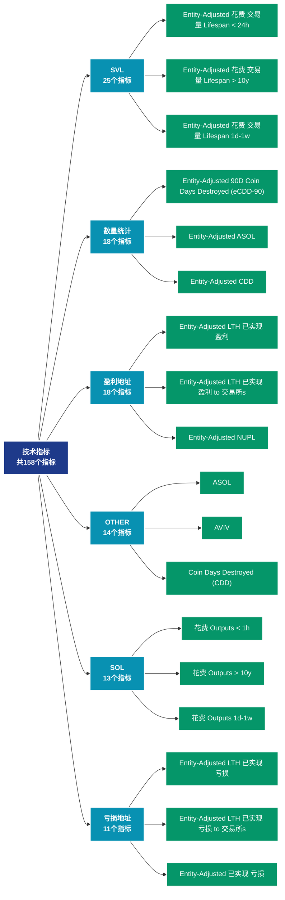

# 技术指标 (indicators)

## 📝 类别描述

技术分析指标，包括MVRV、SOPR、NVT等链上特有的分析指标。

## 📊 指标概览

本类别共包含 **158** 个指标，涵盖以下主要子类别：

| 子类别 | 指标数量 | 主要功能 |
|--------|----------|----------|
| SVL | 25 | 专门数据分析 |
| 数量统计 | 18 | 专门数据分析 |
| 盈利地址 | 18 | 盈利状态分析 |
| OTHER | 14 | 专门数据分析 |
| SOL | 13 | 专门数据分析 |
| 亏损地址 | 11 | 亏损状态评估 |
| 供应量分布 | 10 | 供应量分布统计 |
| SPENT | 6 | 专门数据分析 |
| LEVERAGE | 4 | 专门数据分析 |
| SOPR指标 | 3 | 专门数据分析 |

## 🎨 指标体系结构图



## 📂 详细指标说明

### 📊 SVL（25个指标）

本子类别包含以下详细指标：

#### 1. Entity-Adjusted 花费 交易量 Lifespan < 24h

- **指标代码**: `svl_entity_adjusted_24h`
- **API路径**: `/v1/metrics/indicators/svl_entity_adjusted_24h`
- **英文名称**: Entity-Adjusted Spent Volume Lifespan < 24h

**英文原文：**
The total transfer volume of coins younger than 24 hours. This metric is entity-adjusted and discards transactions between addresses of the same entity ("in-house" transactions).

Entities are defined as a cluster of addresses that are controlled by the same network entity and are estimated through advanced heuristics and Glassnode&#x27;s proprietary clustering algorithms. Note that entity–based metrics are based on data science techniques and statistical information that changes over time and are therefore mutable – the data is stable, but most recent data points are subject to slight fluctuations as time progresses. For more information see this article.

**中文解释：**
分析Entity-Adjusted Spent Volume Lifespan < 24h相关的链上数据。这个指标通过追踪区块链上的实时数据，提供了传统金融分析无法获得的透明度和洞察力。链上数据的优势在于：1）数据真实可验证；2）实时更新无延迟；3）覆盖所有参与者。通过综合分析多个链上指标，投资者可以做出更明智的决策，研究人员可以深入理解市场机制。

**使用示例**：
```python
# 获取Entity-Adjusted 花费 交易量 Lifespan < 24h数据
df = client.get_metric(
    "/v1/metrics/indicators/svl_entity_adjusted_24h",
    asset="BTC",
    resolution="24h"
)
```

---

#### 2. Entity-Adjusted 花费 交易量 Lifespan > 10y

- **指标代码**: `svl_entity_adjusted_more_10y`
- **API路径**: `/v1/metrics/indicators/svl_entity_adjusted_more_10y`
- **英文名称**: Entity-Adjusted Spent Volume Lifespan > 10y

**英文原文：**
The total transfer volume of coins that were last active more than 10 years ago. This metric is entity-adjusted and discards transactions between addresses of the same entity ("in-house" transactions).

Entities are defined as a cluster of addresses that are controlled by the same network entity and are estimated through advanced heuristics and Glassnode&#x27;s proprietary clustering algorithms. Note that entity–based metrics are based on data science techniques and statistical information that changes over time and are therefore mutable – the data is stable, but most recent data points are subject to slight fluctuations as time progresses. For more information see this article.

**中文解释：**
分析Entity-Adjusted Spent Volume Lifespan > 10y相关的链上数据。这个指标通过追踪区块链上的实时数据，提供了传统金融分析无法获得的透明度和洞察力。链上数据的优势在于：1）数据真实可验证；2）实时更新无延迟；3）覆盖所有参与者。通过综合分析多个链上指标，投资者可以做出更明智的决策，研究人员可以深入理解市场机制。

**使用示例**：
```python
# 获取Entity-Adjusted 花费 交易量 Lifespan > 10y数据
df = client.get_metric(
    "/v1/metrics/indicators/svl_entity_adjusted_more_10y",
    asset="BTC",
    resolution="24h"
)
```

---

#### 3. Entity-Adjusted 花费 交易量 Lifespan 1d-1w

- **指标代码**: `svl_entity_adjusted_1d_1w`
- **API路径**: `/v1/metrics/indicators/svl_entity_adjusted_1d_1w`
- **英文名称**: Entity-Adjusted Spent Volume Lifespan 1d-1w

**英文原文：**
The total transfer volume of coins that were last active between 1d and 1w ago. This metric is entity-adjusted and discards transactions between addresses of the same entity ("in-house" transactions).

Entities are defined as a cluster of addresses that are controlled by the same network entity and are estimated through advanced heuristics and Glassnode&#x27;s proprietary clustering algorithms. Note that entity–based metrics are based on data science techniques and statistical information that changes over time and are therefore mutable – the data is stable, but most recent data points are subject to slight fluctuations as time progresses. For more information see this article.

**中文解释：**
分析Entity-Adjusted Spent Volume Lifespan 1d-1w相关的链上数据。这个指标通过追踪区块链上的实时数据，提供了传统金融分析无法获得的透明度和洞察力。链上数据的优势在于：1）数据真实可验证；2）实时更新无延迟；3）覆盖所有参与者。通过综合分析多个链上指标，投资者可以做出更明智的决策，研究人员可以深入理解市场机制。

**使用示例**：
```python
# 获取Entity-Adjusted 花费 交易量 Lifespan 1d-1w数据
df = client.get_metric(
    "/v1/metrics/indicators/svl_entity_adjusted_1d_1w",
    asset="BTC",
    resolution="24h"
)
```

---

#### 4. Entity-Adjusted 花费 交易量 Lifespan 1m-3m

- **指标代码**: `svl_entity_adjusted_1m_3m`
- **API路径**: `/v1/metrics/indicators/svl_entity_adjusted_1m_3m`
- **英文名称**: Entity-Adjusted Spent Volume Lifespan 1m-3m

**英文原文：**
The total transfer volume of coins that were last active between 1m and 3m ago. This metric is entity-adjusted and discards transactions between addresses of the same entity ("in-house" transactions).

Entities are defined as a cluster of addresses that are controlled by the same network entity and are estimated through advanced heuristics and Glassnode&#x27;s proprietary clustering algorithms. Note that entity–based metrics are based on data science techniques and statistical information that changes over time and are therefore mutable – the data is stable, but most recent data points are subject to slight fluctuations as time progresses. For more information see this article.

**中文解释：**
分析Entity-Adjusted Spent Volume Lifespan 1m-3m相关的链上数据。这个指标通过追踪区块链上的实时数据，提供了传统金融分析无法获得的透明度和洞察力。链上数据的优势在于：1）数据真实可验证；2）实时更新无延迟；3）覆盖所有参与者。通过综合分析多个链上指标，投资者可以做出更明智的决策，研究人员可以深入理解市场机制。

**使用示例**：
```python
# 获取Entity-Adjusted 花费 交易量 Lifespan 1m-3m数据
df = client.get_metric(
    "/v1/metrics/indicators/svl_entity_adjusted_1m_3m",
    asset="BTC",
    resolution="24h"
)
```

---

#### 5. Entity-Adjusted 花费 交易量 Lifespan 1w-1m 

- **指标代码**: `svl_entity_adjusted_1w_1m`
- **API路径**: `/v1/metrics/indicators/svl_entity_adjusted_1w_1m`
- **英文名称**: Entity-Adjusted Spent Volume Lifespan 1w-1m 

**英文原文：**
The total transfer volume of coins that were last active between 1w and 1m ago. This metric is entity-adjusted and discards transactions between addresses of the same entity ("in-house" transactions).

Entities are defined as a cluster of addresses that are controlled by the same network entity and are estimated through advanced heuristics and Glassnode&#x27;s proprietary clustering algorithms. Note that entity–based metrics are based on data science techniques and statistical information that changes over time and are therefore mutable – the data is stable, but most recent data points are subject to slight fluctuations as time progresses. For more information see this article.

**中文解释：**
分析Entity-Adjusted Spent Volume Lifespan 1w-1m 相关的链上数据。这个指标通过追踪区块链上的实时数据，提供了传统金融分析无法获得的透明度和洞察力。链上数据的优势在于：1）数据真实可验证；2）实时更新无延迟；3）覆盖所有参与者。通过综合分析多个链上指标，投资者可以做出更明智的决策，研究人员可以深入理解市场机制。

**使用示例**：
```python
# 获取Entity-Adjusted 花费 交易量 Lifespan 1w-1m 数据
df = client.get_metric(
    "/v1/metrics/indicators/svl_entity_adjusted_1w_1m",
    asset="BTC",
    resolution="24h"
)
```

---

#### 6. Entity-Adjusted 花费 交易量 Lifespan 1y-2y

- **指标代码**: `svl_entity_adjusted_1y_2y`
- **API路径**: `/v1/metrics/indicators/svl_entity_adjusted_1y_2y`
- **英文名称**: Entity-Adjusted Spent Volume Lifespan 1y-2y

**英文原文：**
The total transfer volume of coins that were last active between 1y and 2y ago. This metric is entity-adjusted and discards transactions between addresses of the same entity ("in-house" transactions).

Entities are defined as a cluster of addresses that are controlled by the same network entity and are estimated through advanced heuristics and Glassnode&#x27;s proprietary clustering algorithms. Note that entity–based metrics are based on data science techniques and statistical information that changes over time and are therefore mutable – the data is stable, but most recent data points are subject to slight fluctuations as time progresses. For more information see this article.

**中文解释：**
分析Entity-Adjusted Spent Volume Lifespan 1y-2y相关的链上数据。这个指标通过追踪区块链上的实时数据，提供了传统金融分析无法获得的透明度和洞察力。链上数据的优势在于：1）数据真实可验证；2）实时更新无延迟；3）覆盖所有参与者。通过综合分析多个链上指标，投资者可以做出更明智的决策，研究人员可以深入理解市场机制。

**使用示例**：
```python
# 获取Entity-Adjusted 花费 交易量 Lifespan 1y-2y数据
df = client.get_metric(
    "/v1/metrics/indicators/svl_entity_adjusted_1y_2y",
    asset="BTC",
    resolution="24h"
)
```

---

#### 7. Entity-Adjusted 花费 交易量 Lifespan 2y-3y

- **指标代码**: `svl_entity_adjusted_2y_3y`
- **API路径**: `/v1/metrics/indicators/svl_entity_adjusted_2y_3y`
- **英文名称**: Entity-Adjusted Spent Volume Lifespan 2y-3y

**英文原文：**
The total transfer volume of coins that were last active between 2y and 3y ago. This metric is entity-adjusted and discards transactions between addresses of the same entity ("in-house" transactions).

Entities are defined as a cluster of addresses that are controlled by the same network entity and are estimated through advanced heuristics and Glassnode&#x27;s proprietary clustering algorithms. Note that entity–based metrics are based on data science techniques and statistical information that changes over time and are therefore mutable – the data is stable, but most recent data points are subject to slight fluctuations as time progresses. For more information see this article.

**中文解释：**
分析Entity-Adjusted Spent Volume Lifespan 2y-3y相关的链上数据。这个指标通过追踪区块链上的实时数据，提供了传统金融分析无法获得的透明度和洞察力。链上数据的优势在于：1）数据真实可验证；2）实时更新无延迟；3）覆盖所有参与者。通过综合分析多个链上指标，投资者可以做出更明智的决策，研究人员可以深入理解市场机制。

**使用示例**：
```python
# 获取Entity-Adjusted 花费 交易量 Lifespan 2y-3y数据
df = client.get_metric(
    "/v1/metrics/indicators/svl_entity_adjusted_2y_3y",
    asset="BTC",
    resolution="24h"
)
```

---

#### 8. Entity-Adjusted 花费 交易量 Lifespan 3m-6m

- **指标代码**: `svl_entity_adjusted_3m_6m`
- **API路径**: `/v1/metrics/indicators/svl_entity_adjusted_3m_6m`
- **英文名称**: Entity-Adjusted Spent Volume Lifespan 3m-6m

**英文原文：**
The total transfer volume of coins that were last active between 3m and 6m ago. This metric is entity-adjusted and discards transactions between addresses of the same entity ("in-house" transactions).

Entities are defined as a cluster of addresses that are controlled by the same network entity and are estimated through advanced heuristics and Glassnode&#x27;s proprietary clustering algorithms. Note that entity–based metrics are based on data science techniques and statistical information that changes over time and are therefore mutable – the data is stable, but most recent data points are subject to slight fluctuations as time progresses. For more information see this article.

**中文解释：**
分析Entity-Adjusted Spent Volume Lifespan 3m-6m相关的链上数据。这个指标通过追踪区块链上的实时数据，提供了传统金融分析无法获得的透明度和洞察力。链上数据的优势在于：1）数据真实可验证；2）实时更新无延迟；3）覆盖所有参与者。通过综合分析多个链上指标，投资者可以做出更明智的决策，研究人员可以深入理解市场机制。

**使用示例**：
```python
# 获取Entity-Adjusted 花费 交易量 Lifespan 3m-6m数据
df = client.get_metric(
    "/v1/metrics/indicators/svl_entity_adjusted_3m_6m",
    asset="BTC",
    resolution="24h"
)
```

---

#### 9. Entity-Adjusted 花费 交易量 Lifespan 3y-5y

- **指标代码**: `svl_entity_adjusted_3y_5y`
- **API路径**: `/v1/metrics/indicators/svl_entity_adjusted_3y_5y`
- **英文名称**: Entity-Adjusted Spent Volume Lifespan 3y-5y

**英文原文：**
The total transfer volume of coins that were last active between 3y and 5y ago. This metric is entity-adjusted and discards transactions between addresses of the same entity ("in-house" transactions).

Entities are defined as a cluster of addresses that are controlled by the same network entity and are estimated through advanced heuristics and Glassnode&#x27;s proprietary clustering algorithms. Note that entity–based metrics are based on data science techniques and statistical information that changes over time and are therefore mutable – the data is stable, but most recent data points are subject to slight fluctuations as time progresses. For more information see this article.

**中文解释：**
分析Entity-Adjusted Spent Volume Lifespan 3y-5y相关的链上数据。这个指标通过追踪区块链上的实时数据，提供了传统金融分析无法获得的透明度和洞察力。链上数据的优势在于：1）数据真实可验证；2）实时更新无延迟；3）覆盖所有参与者。通过综合分析多个链上指标，投资者可以做出更明智的决策，研究人员可以深入理解市场机制。

**使用示例**：
```python
# 获取Entity-Adjusted 花费 交易量 Lifespan 3y-5y数据
df = client.get_metric(
    "/v1/metrics/indicators/svl_entity_adjusted_3y_5y",
    asset="BTC",
    resolution="24h"
)
```

---

#### 10. Entity-Adjusted 花费 交易量 Lifespan 5y-7y

- **指标代码**: `svl_entity_adjusted_5y_7y`
- **API路径**: `/v1/metrics/indicators/svl_entity_adjusted_5y_7y`
- **英文名称**: Entity-Adjusted Spent Volume Lifespan 5y-7y

**英文原文：**
The total transfer volume of coins that were last active between 5y and 7y ago. This metric is entity-adjusted and discards transactions between addresses of the same entity ("in-house" transactions).

Entities are defined as a cluster of addresses that are controlled by the same network entity and are estimated through advanced heuristics and Glassnode&#x27;s proprietary clustering algorithms. Note that entity–based metrics are based on data science techniques and statistical information that changes over time and are therefore mutable – the data is stable, but most recent data points are subject to slight fluctuations as time progresses. For more information see this article.

**中文解释：**
分析Entity-Adjusted Spent Volume Lifespan 5y-7y相关的链上数据。这个指标通过追踪区块链上的实时数据，提供了传统金融分析无法获得的透明度和洞察力。链上数据的优势在于：1）数据真实可验证；2）实时更新无延迟；3）覆盖所有参与者。通过综合分析多个链上指标，投资者可以做出更明智的决策，研究人员可以深入理解市场机制。

**使用示例**：
```python
# 获取Entity-Adjusted 花费 交易量 Lifespan 5y-7y数据
df = client.get_metric(
    "/v1/metrics/indicators/svl_entity_adjusted_5y_7y",
    asset="BTC",
    resolution="24h"
)
```

---

#### 11. Entity-Adjusted 花费 交易量 Lifespan 6m-12m 

- **指标代码**: `svl_entity_adjusted_6m_12m`
- **API路径**: `/v1/metrics/indicators/svl_entity_adjusted_6m_12m`
- **英文名称**: Entity-Adjusted Spent Volume Lifespan 6m-12m 

**英文原文：**
The total transfer volume of coins that were last active between 6m and 12m ago. This metric is entity-adjusted and discards transactions between addresses of the same entity ("in-house" transactions).

Entities are defined as a cluster of addresses that are controlled by the same network entity and are estimated through advanced heuristics and Glassnode&#x27;s proprietary clustering algorithms. Note that entity–based metrics are based on data science techniques and statistical information that changes over time and are therefore mutable – the data is stable, but most recent data points are subject to slight fluctuations as time progresses. For more information see this article.

**中文解释：**
分析Entity-Adjusted Spent Volume Lifespan 6m-12m 相关的链上数据。这个指标通过追踪区块链上的实时数据，提供了传统金融分析无法获得的透明度和洞察力。链上数据的优势在于：1）数据真实可验证；2）实时更新无延迟；3）覆盖所有参与者。通过综合分析多个链上指标，投资者可以做出更明智的决策，研究人员可以深入理解市场机制。

**使用示例**：
```python
# 获取Entity-Adjusted 花费 交易量 Lifespan 6m-12m 数据
df = client.get_metric(
    "/v1/metrics/indicators/svl_entity_adjusted_6m_12m",
    asset="BTC",
    resolution="24h"
)
```

---

#### 12. Entity-Adjusted 花费 交易量 Lifespan 7y-10y

- **指标代码**: `svl_entity_adjusted_7y_10y`
- **API路径**: `/v1/metrics/indicators/svl_entity_adjusted_7y_10y`
- **英文名称**: Entity-Adjusted Spent Volume Lifespan 7y-10y

**英文原文：**
The total transfer volume of coins that were last active between 7y and 10y ago. This metric is entity-adjusted and discards transactions between addresses of the same entity ("in-house" transactions).

Entities are defined as a cluster of addresses that are controlled by the same network entity and are estimated through advanced heuristics and Glassnode&#x27;s proprietary clustering algorithms. Note that entity–based metrics are based on data science techniques and statistical information that changes over time and are therefore mutable – the data is stable, but most recent data points are subject to slight fluctuations as time progresses. For more information see this article.

**中文解释：**
分析Entity-Adjusted Spent Volume Lifespan 7y-10y相关的链上数据。这个指标通过追踪区块链上的实时数据，提供了传统金融分析无法获得的透明度和洞察力。链上数据的优势在于：1）数据真实可验证；2）实时更新无延迟；3）覆盖所有参与者。通过综合分析多个链上指标，投资者可以做出更明智的决策，研究人员可以深入理解市场机制。

**使用示例**：
```python
# 获取Entity-Adjusted 花费 交易量 Lifespan 7y-10y数据
df = client.get_metric(
    "/v1/metrics/indicators/svl_entity_adjusted_7y_10y",
    asset="BTC",
    resolution="24h"
)
```

---

#### 13. 花费 交易量 < 1h

- **指标代码**: `svl_1h`
- **API路径**: `/v1/metrics/indicators/svl_1h`
- **英文名称**: Spent Volume < 1h

**英文原文：**
The total transfer volume of coins younger than one hour.

**中文解释：**
分析Spent Volume < 1h相关的链上数据。这个指标通过追踪区块链上的实时数据，提供了传统金融分析无法获得的透明度和洞察力。链上数据的优势在于：1）数据真实可验证；2）实时更新无延迟；3）覆盖所有参与者。通过综合分析多个链上指标，投资者可以做出更明智的决策，研究人员可以深入理解市场机制。

**使用示例**：
```python
# 获取花费 交易量 < 1h数据
df = client.get_metric(
    "/v1/metrics/indicators/svl_1h",
    asset="BTC",
    resolution="24h"
)
```

---

#### 14. 花费 交易量 > 10y

- **指标代码**: `svl_more_10y`
- **API路径**: `/v1/metrics/indicators/svl_more_10y`
- **英文名称**: Spent Volume > 10y

**英文原文：**
The total transfer volume of coins that were last active more than 10 years ago.

**中文解释：**
分析Spent Volume > 10y相关的链上数据。这个指标通过追踪区块链上的实时数据，提供了传统金融分析无法获得的透明度和洞察力。链上数据的优势在于：1）数据真实可验证；2）实时更新无延迟；3）覆盖所有参与者。通过综合分析多个链上指标，投资者可以做出更明智的决策，研究人员可以深入理解市场机制。

**使用示例**：
```python
# 获取花费 交易量 > 10y数据
df = client.get_metric(
    "/v1/metrics/indicators/svl_more_10y",
    asset="BTC",
    resolution="24h"
)
```

---

#### 15. 花费 交易量 1d-1w

- **指标代码**: `svl_1d_1w`
- **API路径**: `/v1/metrics/indicators/svl_1d_1w`
- **英文名称**: Spent Volume 1d-1w

**英文原文：**
The total transfer volume of coins that were last active between 1d and 1w ago.

**中文解释：**
分析Spent Volume 1d-1w相关的链上数据。这个指标通过追踪区块链上的实时数据，提供了传统金融分析无法获得的透明度和洞察力。链上数据的优势在于：1）数据真实可验证；2）实时更新无延迟；3）覆盖所有参与者。通过综合分析多个链上指标，投资者可以做出更明智的决策，研究人员可以深入理解市场机制。

**使用示例**：
```python
# 获取花费 交易量 1d-1w数据
df = client.get_metric(
    "/v1/metrics/indicators/svl_1d_1w",
    asset="BTC",
    resolution="24h"
)
```

---

#### 16. 花费 交易量 1h-24h

- **指标代码**: `svl_1h_24h`
- **API路径**: `/v1/metrics/indicators/svl_1h_24h`
- **英文名称**: Spent Volume 1h-24h

**英文原文：**
The total transfer volume of coins that were last active between 1h and  24 hours ago.

**中文解释：**
分析Spent Volume 1h-24h相关的链上数据。这个指标通过追踪区块链上的实时数据，提供了传统金融分析无法获得的透明度和洞察力。链上数据的优势在于：1）数据真实可验证；2）实时更新无延迟；3）覆盖所有参与者。通过综合分析多个链上指标，投资者可以做出更明智的决策，研究人员可以深入理解市场机制。

**使用示例**：
```python
# 获取花费 交易量 1h-24h数据
df = client.get_metric(
    "/v1/metrics/indicators/svl_1h_24h",
    asset="BTC",
    resolution="24h"
)
```

---

#### 17. 花费 交易量 1m-3m

- **指标代码**: `svl_1m_3m`
- **API路径**: `/v1/metrics/indicators/svl_1m_3m`
- **英文名称**: Spent Volume 1m-3m

**英文原文：**
The total transfer volume of coins that were last active between 1m and 3m ago.

**中文解释：**
分析Spent Volume 1m-3m相关的链上数据。这个指标通过追踪区块链上的实时数据，提供了传统金融分析无法获得的透明度和洞察力。链上数据的优势在于：1）数据真实可验证；2）实时更新无延迟；3）覆盖所有参与者。通过综合分析多个链上指标，投资者可以做出更明智的决策，研究人员可以深入理解市场机制。

**使用示例**：
```python
# 获取花费 交易量 1m-3m数据
df = client.get_metric(
    "/v1/metrics/indicators/svl_1m_3m",
    asset="BTC",
    resolution="24h"
)
```

---

#### 18. 花费 交易量 1w-1m

- **指标代码**: `svl_1w_1m`
- **API路径**: `/v1/metrics/indicators/svl_1w_1m`
- **英文名称**: Spent Volume 1w-1m

**英文原文：**
The total transfer volume of coins that were last active between 1w and 1m ago.

**中文解释：**
分析Spent Volume 1w-1m相关的链上数据。这个指标通过追踪区块链上的实时数据，提供了传统金融分析无法获得的透明度和洞察力。链上数据的优势在于：1）数据真实可验证；2）实时更新无延迟；3）覆盖所有参与者。通过综合分析多个链上指标，投资者可以做出更明智的决策，研究人员可以深入理解市场机制。

**使用示例**：
```python
# 获取花费 交易量 1w-1m数据
df = client.get_metric(
    "/v1/metrics/indicators/svl_1w_1m",
    asset="BTC",
    resolution="24h"
)
```

---

#### 19. 花费 交易量 1y-2y

- **指标代码**: `svl_1y_2y`
- **API路径**: `/v1/metrics/indicators/svl_1y_2y`
- **英文名称**: Spent Volume 1y-2y

**英文原文：**
The total transfer volume of coins that were last active between 1y and 2y ago.

**中文解释：**
分析Spent Volume 1y-2y相关的链上数据。这个指标通过追踪区块链上的实时数据，提供了传统金融分析无法获得的透明度和洞察力。链上数据的优势在于：1）数据真实可验证；2）实时更新无延迟；3）覆盖所有参与者。通过综合分析多个链上指标，投资者可以做出更明智的决策，研究人员可以深入理解市场机制。

**使用示例**：
```python
# 获取花费 交易量 1y-2y数据
df = client.get_metric(
    "/v1/metrics/indicators/svl_1y_2y",
    asset="BTC",
    resolution="24h"
)
```

---

#### 20. 花费 交易量 2y-3y

- **指标代码**: `svl_2y_3y`
- **API路径**: `/v1/metrics/indicators/svl_2y_3y`
- **英文名称**: Spent Volume 2y-3y

**英文原文：**
The total transfer volume of coins that were last active between 2y and 3y ago.

**中文解释：**
分析Spent Volume 2y-3y相关的链上数据。这个指标通过追踪区块链上的实时数据，提供了传统金融分析无法获得的透明度和洞察力。链上数据的优势在于：1）数据真实可验证；2）实时更新无延迟；3）覆盖所有参与者。通过综合分析多个链上指标，投资者可以做出更明智的决策，研究人员可以深入理解市场机制。

**使用示例**：
```python
# 获取花费 交易量 2y-3y数据
df = client.get_metric(
    "/v1/metrics/indicators/svl_2y_3y",
    asset="BTC",
    resolution="24h"
)
```

---

#### 21. 花费 交易量 3m-6m

- **指标代码**: `svl_3m_6m`
- **API路径**: `/v1/metrics/indicators/svl_3m_6m`
- **英文名称**: Spent Volume 3m-6m

**英文原文：**
The total transfer volume of coins that were last active between 3m and 6m ago.

**中文解释：**
分析Spent Volume 3m-6m相关的链上数据。这个指标通过追踪区块链上的实时数据，提供了传统金融分析无法获得的透明度和洞察力。链上数据的优势在于：1）数据真实可验证；2）实时更新无延迟；3）覆盖所有参与者。通过综合分析多个链上指标，投资者可以做出更明智的决策，研究人员可以深入理解市场机制。

**使用示例**：
```python
# 获取花费 交易量 3m-6m数据
df = client.get_metric(
    "/v1/metrics/indicators/svl_3m_6m",
    asset="BTC",
    resolution="24h"
)
```

---

#### 22. 花费 交易量 3y-5y

- **指标代码**: `svl_3y_5y`
- **API路径**: `/v1/metrics/indicators/svl_3y_5y`
- **英文名称**: Spent Volume 3y-5y

**英文原文：**
The total transfer volume of coins that were last active between 3y and 5y ago.

**中文解释：**
分析Spent Volume 3y-5y相关的链上数据。这个指标通过追踪区块链上的实时数据，提供了传统金融分析无法获得的透明度和洞察力。链上数据的优势在于：1）数据真实可验证；2）实时更新无延迟；3）覆盖所有参与者。通过综合分析多个链上指标，投资者可以做出更明智的决策，研究人员可以深入理解市场机制。

**使用示例**：
```python
# 获取花费 交易量 3y-5y数据
df = client.get_metric(
    "/v1/metrics/indicators/svl_3y_5y",
    asset="BTC",
    resolution="24h"
)
```

---

#### 23. 花费 交易量 5y-7y

- **指标代码**: `svl_5y_7y`
- **API路径**: `/v1/metrics/indicators/svl_5y_7y`
- **英文名称**: Spent Volume 5y-7y

**英文原文：**
The total transfer volume of coins that were last active between 5y and 7y ago.

**中文解释：**
分析Spent Volume 5y-7y相关的链上数据。这个指标通过追踪区块链上的实时数据，提供了传统金融分析无法获得的透明度和洞察力。链上数据的优势在于：1）数据真实可验证；2）实时更新无延迟；3）覆盖所有参与者。通过综合分析多个链上指标，投资者可以做出更明智的决策，研究人员可以深入理解市场机制。

**使用示例**：
```python
# 获取花费 交易量 5y-7y数据
df = client.get_metric(
    "/v1/metrics/indicators/svl_5y_7y",
    asset="BTC",
    resolution="24h"
)
```

---

#### 24. 花费 交易量 6m-12m

- **指标代码**: `svl_6m_12m`
- **API路径**: `/v1/metrics/indicators/svl_6m_12m`
- **英文名称**: Spent Volume 6m-12m

**英文原文：**
The total transfer volume of coins that were last active between 6m and 12m ago.

**中文解释：**
分析Spent Volume 6m-12m相关的链上数据。这个指标通过追踪区块链上的实时数据，提供了传统金融分析无法获得的透明度和洞察力。链上数据的优势在于：1）数据真实可验证；2）实时更新无延迟；3）覆盖所有参与者。通过综合分析多个链上指标，投资者可以做出更明智的决策，研究人员可以深入理解市场机制。

**使用示例**：
```python
# 获取花费 交易量 6m-12m数据
df = client.get_metric(
    "/v1/metrics/indicators/svl_6m_12m",
    asset="BTC",
    resolution="24h"
)
```

---

#### 25. 花费 交易量 7y-10y

- **指标代码**: `svl_7y_10y`
- **API路径**: `/v1/metrics/indicators/svl_7y_10y`
- **英文名称**: Spent Volume 7y-10y

**英文原文：**
The total transfer volume of coins that were last active between 7y and 10y ago.

**中文解释：**
分析Spent Volume 7y-10y相关的链上数据。这个指标通过追踪区块链上的实时数据，提供了传统金融分析无法获得的透明度和洞察力。链上数据的优势在于：1）数据真实可验证；2）实时更新无延迟；3）覆盖所有参与者。通过综合分析多个链上指标，投资者可以做出更明智的决策，研究人员可以深入理解市场机制。

**使用示例**：
```python
# 获取花费 交易量 7y-10y数据
df = client.get_metric(
    "/v1/metrics/indicators/svl_7y_10y",
    asset="BTC",
    resolution="24h"
)
```

---

### 📊 数量统计（18个指标）

本子类别包含以下详细指标：

#### 1. Entity-Adjusted 90D Coin Days Destroyed (eCDD-90)

- **指标代码**: `cdd90_account_based_age_adjusted`
- **API路径**: `/v1/metrics/indicators/cdd90_account_based_age_adjusted`
- **英文名称**: Entity-Adjusted 90D Coin Days Destroyed (eCDD-90)

**英文原文：**
90D Coin Days Destroyed is the 90 day rolling sum of Coin Days Destroyed (CDD) and shows the amount of coin days that have been destroyed over the past year. This version is entity-adjusted, meaning that transactions within addresses controlled by the same network participant are discarded (see this article for more information), as well as age-adjusted meaning that we normalize by time in order to account for the increasing baseline as time goes by.

**中文解释：**
分析Entity-Adjusted 90D Coin Days Destroyed (eCDD-90)相关的链上数据。这个指标通过追踪区块链上的实时数据，提供了传统金融分析无法获得的透明度和洞察力。链上数据的优势在于：1）数据真实可验证；2）实时更新无延迟；3）覆盖所有参与者。通过综合分析多个链上指标，投资者可以做出更明智的决策，研究人员可以深入理解市场机制。

**使用示例**：
```python
# 获取Entity-Adjusted 90D Coin Days Destroyed (eCDD-90)数据
df = client.get_metric(
    "/v1/metrics/indicators/cdd90_account_based_age_adjusted",
    asset="BTC",
    resolution="24h"
)
```

---

#### 2. Entity-Adjusted ASOL

- **指标代码**: `asol_account_based`
- **API路径**: `/v1/metrics/indicators/asol_account_based`
- **英文名称**: Entity-Adjusted ASOL

**英文原文：**
Entity-adjusted ASOL is an improved variant of ASOL that discards transactions between addresses of the same entity ("in-house" transactions). Entity-adjusted ASOL therefore accounts for real economic activity only, and provides an improved market signal compared to its raw UTXO-based counterpart. For detailed information read this article.

**中文解释：**
分析Entity-Adjusted ASOL相关的链上数据。这个指标通过追踪区块链上的实时数据，提供了传统金融分析无法获得的透明度和洞察力。链上数据的优势在于：1）数据真实可验证；2）实时更新无延迟；3）覆盖所有参与者。通过综合分析多个链上指标，投资者可以做出更明智的决策，研究人员可以深入理解市场机制。

**使用示例**：
```python
# 获取Entity-Adjusted ASOL数据
df = client.get_metric(
    "/v1/metrics/indicators/asol_account_based",
    asset="BTC",
    resolution="24h"
)
```

---

#### 3. Entity-Adjusted CDD

- **指标代码**: `cdd_account_based`
- **API路径**: `/v1/metrics/indicators/cdd_account_based`
- **英文名称**: Entity-Adjusted CDD

**英文原文：**
Entity-adjusted CDD is an improved variant of CDD that discards transactions between addresses of the same entity ("in-house" transactions). Entity-adjusted CDD therefore accounts for real economic activity only, and provides an improved market signal compared to its raw UTXO-based counterpart. For detailed information read this article.

**中文解释：**
分析Entity-Adjusted CDD相关的链上数据。这个指标通过追踪区块链上的实时数据，提供了传统金融分析无法获得的透明度和洞察力。链上数据的优势在于：1）数据真实可验证；2）实时更新无延迟；3）覆盖所有参与者。通过综合分析多个链上指标，投资者可以做出更明智的决策，研究人员可以深入理解市场机制。

**使用示例**：
```python
# 获取Entity-Adjusted CDD数据
df = client.get_metric(
    "/v1/metrics/indicators/cdd_account_based",
    asset="BTC",
    resolution="24h"
)
```

---

#### 4. Entity-Adjusted CYD

- **指标代码**: `cyd_account_based`
- **API路径**: `/v1/metrics/indicators/cyd_account_based`
- **英文名称**: Entity-Adjusted CYD

**英文原文：**
Coin Years Destroyed (CYD) is defined as the 365 day rolling sum of Coin Days Destroyed (CDD), and shows the amount of coin days that have been destroyed over the past year. It is indicative of long-term holder behaviour. This version is entity-adjusted, meaning that transactions within addresses controlled by the same network participant are discarded (see this article for more information). This metric was first put forward by ARK Invest.

**中文解释：**
分析Entity-Adjusted CYD相关的链上数据。这个指标通过追踪区块链上的实时数据，提供了传统金融分析无法获得的透明度和洞察力。链上数据的优势在于：1）数据真实可验证；2）实时更新无延迟；3）覆盖所有参与者。通过综合分析多个链上指标，投资者可以做出更明智的决策，研究人员可以深入理解市场机制。

**使用示例**：
```python
# 获取Entity-Adjusted CYD数据
df = client.get_metric(
    "/v1/metrics/indicators/cyd_account_based",
    asset="BTC",
    resolution="24h"
)
```

---

#### 5. Entity-Adjusted Dormancy

- **指标代码**: `dormancy_account_based`
- **API路径**: `/v1/metrics/indicators/dormancy_account_based`
- **英文名称**: Entity-Adjusted Dormancy

**英文原文：**
Entity-adjusted Dormancy is an improved variant of Average Coin Dormancy that discards transactions between addresses of the same entity ("in-house" transactions). Entity-adjusted Dormancy therefore accounts for real economic activity only, and provides an improved market signal compared to its raw UTXO-based counterpart. For detailed information read this article.

**中文解释：**
分析Entity-Adjusted Dormancy相关的链上数据。这个指标通过追踪区块链上的实时数据，提供了传统金融分析无法获得的透明度和洞察力。链上数据的优势在于：1）数据真实可验证；2）实时更新无延迟；3）覆盖所有参与者。通过综合分析多个链上指标，投资者可以做出更明智的决策，研究人员可以深入理解市场机制。

**使用示例**：
```python
# 获取Entity-Adjusted Dormancy数据
df = client.get_metric(
    "/v1/metrics/indicators/dormancy_account_based",
    asset="BTC",
    resolution="24h"
)
```

---

#### 6. Entity-Adjusted Liveliness

- **指标代码**: `liveliness_account_based`
- **API路径**: `/v1/metrics/indicators/liveliness_account_based`
- **英文名称**: Entity-Adjusted Liveliness

**英文原文：**
Entity-adjusted Liveliness is an improved variant of Liveliness that discards transactions between addresses of the same entity ("in-house" transactions). Entity-adjusted Liveliness therefore accounts for real economic activity only, and provides an improved market signal compared to its raw UTXO-based counterpart. For detailed information read this article.

**中文解释：**
分析Entity-Adjusted Liveliness相关的链上数据。这个指标通过追踪区块链上的实时数据，提供了传统金融分析无法获得的透明度和洞察力。链上数据的优势在于：1）数据真实可验证；2）实时更新无延迟；3）覆盖所有参与者。通过综合分析多个链上指标，投资者可以做出更明智的决策，研究人员可以深入理解市场机制。

**使用示例**：
```python
# 获取Entity-Adjusted Liveliness数据
df = client.get_metric(
    "/v1/metrics/indicators/liveliness_account_based",
    asset="BTC",
    resolution="24h"
)
```

---

#### 7. Entity-Adjusted Long-Term 持有者 ASOL

- **指标代码**: `asol_lth_account_based`
- **API路径**: `/v1/metrics/indicators/asol_lth_account_based`
- **英文名称**: Entity-Adjusted Long-Term Holder ASOL

**英文原文：**
Long-Term Holder variant of Entity-Adjusted ASOL. Average Spent Output Lifespan (ASOL) is the average age (in days) of spent transaction outputs. Transactions between addresses of the same entity ("in-house" transactions) are discarded. Long- and Short-Term Holder supply is defined with respect to the entity&#x27;s averaged purchasing date with weights given by a logistic function centered at an age of 155 days and a transition width of 10 days.

Entities are defined as a cluster of addresses that are controlled by the same network entity and are estimated through advanced heuristics and Glassnode&#x27;s proprietary clustering algorithms. Note that entity–based metrics are based on data science techniques and statistical information that changes over time and are therefore mutable – the data is stable, but most recent data points are subject to slight fluctuations as time progresses. For more information see this article.

**中文解释：**
分析Entity-Adjusted Long-Term Holder ASOL相关的链上数据。这个指标通过追踪区块链上的实时数据，提供了传统金融分析无法获得的透明度和洞察力。链上数据的优势在于：1）数据真实可验证；2）实时更新无延迟；3）覆盖所有参与者。通过综合分析多个链上指标，投资者可以做出更明智的决策，研究人员可以深入理解市场机制。

**使用示例**：
```python
# 获取Entity-Adjusted Long-Term 持有者 ASOL数据
df = client.get_metric(
    "/v1/metrics/indicators/asol_lth_account_based",
    asset="BTC",
    resolution="24h"
)
```

---

#### 8. Entity-Adjusted Long-Term 持有者 CDD

- **指标代码**: `cdd_lth_account_based`
- **API路径**: `/v1/metrics/indicators/cdd_lth_account_based`
- **英文名称**: Entity-Adjusted Long-Term Holder CDD

**英文原文：**
Long-Term Holder variant of Entity-Adjusted CDD. Coin Days Destroyed (CDD) for any given transaction is calculated by taking the number of coins in a transaction and multiplying it by the number of days it has been since those coins were last spent. Transactions between addresses of the same entity ("in-house" transactions) are discarded. Long- and Short-Term Holder supply is defined with respect to the entity&#x27;s averaged purchasing date with weights given by a logistic function centered at an age of 155 days and a transition width of 10 days.

Entities are defined as a cluster of addresses that are controlled by the same network entity and are estimated through advanced heuristics and Glassnode&#x27;s proprietary clustering algorithms. Note that entity–based metrics are based on data science techniques and statistical information that changes over time and are therefore mutable – the data is stable, but most recent data points are subject to slight fluctuations as time progresses. For more information see this article.

**中文解释：**
分析Entity-Adjusted Long-Term Holder CDD相关的链上数据。这个指标通过追踪区块链上的实时数据，提供了传统金融分析无法获得的透明度和洞察力。链上数据的优势在于：1）数据真实可验证；2）实时更新无延迟；3）覆盖所有参与者。通过综合分析多个链上指标，投资者可以做出更明智的决策，研究人员可以深入理解市场机制。

**使用示例**：
```python
# 获取Entity-Adjusted Long-Term 持有者 CDD数据
df = client.get_metric(
    "/v1/metrics/indicators/cdd_lth_account_based",
    asset="BTC",
    resolution="24h"
)
```

---

#### 9. Entity-Adjusted Long-Term 持有者 Dormancy

- **指标代码**: `dormancy_lth_account_based`
- **API路径**: `/v1/metrics/indicators/dormancy_lth_account_based`
- **英文名称**: Entity-Adjusted Long-Term Holder Dormancy

**英文原文：**
Long-Term Holder variant of Entity-Adjusted Dormancy. Dormancy is the average number of days destroyed per coin transacted, and is defined as the ratio of coin days destroyed and total transfer volume. Transactions between addresses of the same entity ("in-house" transactions) are discarded. Long- and Short-Term Holder supply is defined with respect to the entity&#x27;s averaged purchasing date with weights given by a logistic function centered at an age of 155 days and a transition width of 10 days.

Entities are defined as a cluster of addresses that are controlled by the same network entity and are estimated through advanced heuristics and Glassnode&#x27;s proprietary clustering algorithms. Note that entity–based metrics are based on data science techniques and statistical information that changes over time and are therefore mutable – the data is stable, but most recent data points are subject to slight fluctuations as time progresses. For more information see this article.

**中文解释：**
分析Entity-Adjusted Long-Term Holder Dormancy相关的链上数据。这个指标通过追踪区块链上的实时数据，提供了传统金融分析无法获得的透明度和洞察力。链上数据的优势在于：1）数据真实可验证；2）实时更新无延迟；3）覆盖所有参与者。通过综合分析多个链上指标，投资者可以做出更明智的决策，研究人员可以深入理解市场机制。

**使用示例**：
```python
# 获取Entity-Adjusted Long-Term 持有者 Dormancy数据
df = client.get_metric(
    "/v1/metrics/indicators/dormancy_lth_account_based",
    asset="BTC",
    resolution="24h"
)
```

---

#### 10. Entity-Adjusted LTH-NUPL

- **指标代码**: `nupl_more_155_account_based`
- **API路径**: `/v1/metrics/indicators/nupl_more_155_account_based`
- **英文名称**: Entity-Adjusted LTH-NUPL

**英文原文：**
Entity-adjusted LTH-NUPL is an improved variant of Long-Term Holders Net Unrealized Profit/Loss (LTH-NUPL) that discards transactions between addresses of the same entity ("in-house" transactions). Entity-adjusted LTH NUPL therefore accounts for real economic activity only, and provides an improved market signal compared to its raw UTXO-based counterpart. For detailed information read this article. An entity is considered as a Long-Term Holder if the time since its averaged purchasing date is more than 155 days.

**中文解释：**
分析Entity-Adjusted LTH-NUPL相关的链上数据。这个指标通过追踪区块链上的实时数据，提供了传统金融分析无法获得的透明度和洞察力。链上数据的优势在于：1）数据真实可验证；2）实时更新无延迟；3）覆盖所有参与者。通过综合分析多个链上指标，投资者可以做出更明智的决策，研究人员可以深入理解市场机制。

**使用示例**：
```python
# 获取Entity-Adjusted LTH-NUPL数据
df = client.get_metric(
    "/v1/metrics/indicators/nupl_more_155_account_based",
    asset="BTC",
    resolution="24h"
)
```

---

#### 11. Entity-Adjusted MSOL

- **指标代码**: `msol_account_based`
- **API路径**: `/v1/metrics/indicators/msol_account_based`
- **英文名称**: Entity-Adjusted MSOL

**英文原文：**
Entity-adjusted MSOL is an improved variant of MSOL that discards transactions between addresses of the same entity ("in-house" transactions). Entity-adjusted MSOL therefore accounts for real economic activity only, and provides an improved market signal compared to its raw UTXO-based counterpart. For detailed information read this article.

**中文解释：**
分析Entity-Adjusted MSOL相关的链上数据。这个指标通过追踪区块链上的实时数据，提供了传统金融分析无法获得的透明度和洞察力。链上数据的优势在于：1）数据真实可验证；2）实时更新无延迟；3）覆盖所有参与者。通过综合分析多个链上指标，投资者可以做出更明智的决策，研究人员可以深入理解市场机制。

**使用示例**：
```python
# 获取Entity-Adjusted MSOL数据
df = client.get_metric(
    "/v1/metrics/indicators/msol_account_based",
    asset="BTC",
    resolution="24h"
)
```

---

#### 12. Entity-Adjusted MVRV

- **指标代码**: `mvrv_account_based`
- **API路径**: `/v1/metrics/indicators/mvrv_account_based`
- **英文名称**: Entity-Adjusted MVRV

**英文原文：**
Entity-adjusted MVRV is an improved variant of MVRV Ratio that discards transactions between addresses of the same entity ("in-house" transactions). Entity-adjusted MVRV therefore accounts for real economic activity only, and provides an improved market signal compared to its raw UTXO-based counterpart. For detailed information read this article.

**中文解释：**
分析Entity-Adjusted MVRV相关的链上数据。这个指标通过追踪区块链上的实时数据，提供了传统金融分析无法获得的透明度和洞察力。链上数据的优势在于：1）数据真实可验证；2）实时更新无延迟；3）覆盖所有参与者。通过综合分析多个链上指标，投资者可以做出更明智的决策，研究人员可以深入理解市场机制。

**使用示例**：
```python
# 获取Entity-Adjusted MVRV数据
df = client.get_metric(
    "/v1/metrics/indicators/mvrv_account_based",
    asset="BTC",
    resolution="24h"
)
```

---

#### 13. Entity-Adjusted 已实现 Cap

- **指标代码**: `rcap_account_based`
- **API路径**: `/v1/metrics/indicators/rcap_account_based`
- **英文名称**: Entity-Adjusted Realized Cap

**英文原文：**
Entity-adjusted Realized Cap is an improved variant of Realized Cap that discards transactions between addresses of the same entity ("in-house" transactions). Entity-adjusted Realized Cap therefore accounts for real economic activity only, and provides an improved market signal compared to its raw UTXO-based counterpart. For detailed information read this article.

**中文解释：**
分析Entity-Adjusted Realized Cap相关的链上数据。这个指标通过追踪区块链上的实时数据，提供了传统金融分析无法获得的透明度和洞察力。链上数据的优势在于：1）数据真实可验证；2）实时更新无延迟；3）覆盖所有参与者。通过综合分析多个链上指标，投资者可以做出更明智的决策，研究人员可以深入理解市场机制。

**使用示例**：
```python
# 获取Entity-Adjusted 已实现 Cap数据
df = client.get_metric(
    "/v1/metrics/indicators/rcap_account_based",
    asset="BTC",
    resolution="24h"
)
```

---

#### 14. Entity-Adjusted Short-Term 持有者 ASOL

- **指标代码**: `asol_sth_account_based`
- **API路径**: `/v1/metrics/indicators/asol_sth_account_based`
- **英文名称**: Entity-Adjusted Short-Term Holder ASOL

**英文原文：**
Short-Term Holder variant of Entity-Adjusted ASOL. Average Spent Output Lifespan (ASOL) is the average age (in days) of spent transaction outputs. Transactions between addresses of the same entity ("in-house" transactions) are discarded. Long- and Short-Term Holder supply is defined with respect to the entity&#x27;s averaged purchasing date with weights given by a logistic function centered at an age of 155 days and a transition width of 10 days.

Entities are defined as a cluster of addresses that are controlled by the same network entity and are estimated through advanced heuristics and Glassnode&#x27;s proprietary clustering algorithms. Note that entity–based metrics are based on data science techniques and statistical information that changes over time and are therefore mutable – the data is stable, but most recent data points are subject to slight fluctuations as time progresses. For more information see this article.

**中文解释：**
分析Entity-Adjusted Short-Term Holder ASOL相关的链上数据。这个指标通过追踪区块链上的实时数据，提供了传统金融分析无法获得的透明度和洞察力。链上数据的优势在于：1）数据真实可验证；2）实时更新无延迟；3）覆盖所有参与者。通过综合分析多个链上指标，投资者可以做出更明智的决策，研究人员可以深入理解市场机制。

**使用示例**：
```python
# 获取Entity-Adjusted Short-Term 持有者 ASOL数据
df = client.get_metric(
    "/v1/metrics/indicators/asol_sth_account_based",
    asset="BTC",
    resolution="24h"
)
```

---

#### 15. Entity-Adjusted Short-Term 持有者 CDD

- **指标代码**: `cdd_sth_account_based`
- **API路径**: `/v1/metrics/indicators/cdd_sth_account_based`
- **英文名称**: Entity-Adjusted Short-Term Holder CDD

**英文原文：**
Short-Term Holder variant of Entity-Adjusted CDD. Coin Days Destroyed (CDD) for any given transaction is calculated by taking the number of coins in a transaction and multiplying it by the number of days it has been since those coins were last spent. Transactions between addresses of the same entity ("in-house" transactions) are discarded. Long- and Short-Term Holder supply is defined with respect to the entity&#x27;s averaged purchasing date with weights given by a logistic function centered at an age of 155 days and a transition width of 10 days.

Entities are defined as a cluster of addresses that are controlled by the same network entity and are estimated through advanced heuristics and Glassnode&#x27;s proprietary clustering algorithms. Note that entity–based metrics are based on data science techniques and statistical information that changes over time and are therefore mutable – the data is stable, but most recent data points are subject to slight fluctuations as time progresses. For more information see this article.

**中文解释：**
分析Entity-Adjusted Short-Term Holder CDD相关的链上数据。这个指标通过追踪区块链上的实时数据，提供了传统金融分析无法获得的透明度和洞察力。链上数据的优势在于：1）数据真实可验证；2）实时更新无延迟；3）覆盖所有参与者。通过综合分析多个链上指标，投资者可以做出更明智的决策，研究人员可以深入理解市场机制。

**使用示例**：
```python
# 获取Entity-Adjusted Short-Term 持有者 CDD数据
df = client.get_metric(
    "/v1/metrics/indicators/cdd_sth_account_based",
    asset="BTC",
    resolution="24h"
)
```

---

#### 16. Entity-Adjusted Short-Term 持有者 Dormancy

- **指标代码**: `dormancy_sth_account_based`
- **API路径**: `/v1/metrics/indicators/dormancy_sth_account_based`
- **英文名称**: Entity-Adjusted Short-Term Holder Dormancy

**英文原文：**
Short-Term Holder variant of Entity-Adjusted Dormancy. Dormancy is the average number of days destroyed per coin transacted, and is defined as the ratio of coin days destroyed and total transfer volume. Transactions between addresses of the same entity ("in-house" transactions) are discarded. Long- and Short-Term Holder supply is defined with respect to the entity&#x27;s averaged purchasing date with weights given by a logistic function centered at an age of 155 days and a transition width of 10 days.

Entities are defined as a cluster of addresses that are controlled by the same network entity and are estimated through advanced heuristics and Glassnode&#x27;s proprietary clustering algorithms. Note that entity–based metrics are based on data science techniques and statistical information that changes over time and are therefore mutable – the data is stable, but most recent data points are subject to slight fluctuations as time progresses. For more information see this article.

**中文解释：**
分析Entity-Adjusted Short-Term Holder Dormancy相关的链上数据。这个指标通过追踪区块链上的实时数据，提供了传统金融分析无法获得的透明度和洞察力。链上数据的优势在于：1）数据真实可验证；2）实时更新无延迟；3）覆盖所有参与者。通过综合分析多个链上指标，投资者可以做出更明智的决策，研究人员可以深入理解市场机制。

**使用示例**：
```python
# 获取Entity-Adjusted Short-Term 持有者 Dormancy数据
df = client.get_metric(
    "/v1/metrics/indicators/dormancy_sth_account_based",
    asset="BTC",
    resolution="24h"
)
```

---

#### 17. Entity-Adjusted SOPR

- **指标代码**: `sopr_account_based`
- **API路径**: `/v1/metrics/indicators/sopr_account_based`
- **英文名称**: Entity-Adjusted SOPR

**英文原文：**
Entity-adjusted SOPR is an improved variant of SOPR that discards transactions between addresses of the same entity ("in-house" transactions). Entity-adjusted SOPR therefore accounts for real economic activity only, and provides an improved market signal compared to its raw UTXO-based counterpart. For detailed information read this article.

**中文解释：**
分析Entity-Adjusted SOPR相关的链上数据。这个指标通过追踪区块链上的实时数据，提供了传统金融分析无法获得的透明度和洞察力。链上数据的优势在于：1）数据真实可验证；2）实时更新无延迟；3）覆盖所有参与者。通过综合分析多个链上指标，投资者可以做出更明智的决策，研究人员可以深入理解市场机制。

**使用示例**：
```python
# 获取Entity-Adjusted SOPR数据
df = client.get_metric(
    "/v1/metrics/indicators/sopr_account_based",
    asset="BTC",
    resolution="24h"
)
```

---

#### 18. Entity-Adjusted STH-NUPL

- **指标代码**: `nupl_less_155_account_based`
- **API路径**: `/v1/metrics/indicators/nupl_less_155_account_based`
- **英文名称**: Entity-Adjusted STH-NUPL

**英文原文：**
Entity-adjusted STH-NUPL is an improved variant of Shot-Term Holders Net Unrealized Profit/Loss (STH-NUPL) that discards transactions between addresses of the same entity ("in-house" transactions). Entity-adjusted STH NUPL therefore accounts for real economic activity only, and provides an improved market signal compared to its raw UTXO-based counterpart. For detailed information read this article. An entity is considered as a Short-Term Holder if the time since its averaged purchasing date is less than 155 days.

**中文解释：**
分析Entity-Adjusted STH-NUPL相关的链上数据。这个指标通过追踪区块链上的实时数据，提供了传统金融分析无法获得的透明度和洞察力。链上数据的优势在于：1）数据真实可验证；2）实时更新无延迟；3）覆盖所有参与者。通过综合分析多个链上指标，投资者可以做出更明智的决策，研究人员可以深入理解市场机制。

**使用示例**：
```python
# 获取Entity-Adjusted STH-NUPL数据
df = client.get_metric(
    "/v1/metrics/indicators/nupl_less_155_account_based",
    asset="BTC",
    resolution="24h"
)
```

---

### 📊 盈利地址（18个指标）

本子类别包含以下详细指标：

#### 1. Entity-Adjusted LTH 已实现 盈利

- **指标代码**: `realized_profit_lth_account_based`
- **API路径**: `/v1/metrics/indicators/realized_profit_lth_account_based`
- **英文名称**: Entity-Adjusted LTH Realized Profit

**英文原文：**
Entity-Adjusted variant of Realized Profit for Long-Term Holders, which denotes the total profit (in USD) of all moved coins whose price at their last movement was lower than the price at the current movement. Long- and Short-Term Holder supply is defined with respect to the entity&#x27;s averaged purchasing date with weights given by a logistic function centered at an age of 155 days and a transition width of 10 days.

Volume transferred between addresses owned by the same entity cluster is excluded. As such, no value is realized during internal or “in-house” transfers.

Entities are defined as a cluster of addresses that are controlled by the same network entity and are estimated through advanced heuristics and Glassnode&#x27;s proprietary clustering algorithms. Note that entity–based metrics are based on data science techniques and statistical information that changes over time and are therefore mutable – the data is stable, but most recent data points are subject to slight fluctuations as time progresses. For more information see this article.

**中文解释：**
统计当前持币成本低于市场价格的地址数量。买入价格通过币最后一次移动时的价格确定。盈利地址比例高表明：1）市场情绪乐观；2）可能存在获利回吐压力；3）牛市特征明显。当盈利地址比例极高（>95%）时，往往预示短期顶部。

**使用示例**：
```python
# 获取Entity-Adjusted LTH 已实现 盈利数据
df = client.get_metric(
    "/v1/metrics/indicators/realized_profit_lth_account_based",
    asset="BTC",
    resolution="24h"
)
```

---

#### 2. Entity-Adjusted LTH 已实现 盈利 to 交易所s

- **指标代码**: `realized_profit_lth_to_exchanges_account_based`
- **API路径**: `/v1/metrics/indicators/realized_profit_lth_to_exchanges_account_based`
- **英文名称**: Entity-Adjusted LTH Realized Profit to Exchanges

**英文原文：**
Entity-Adjusted variant of Realized Profit for coins that are sent from Long-Term Holders to exchanges. Realized profit denotes the total profit (in USD) of all moved coins whose price at their last movement was lower than the price at the current movement. Long- and Short-Term Holder supply is defined with respect to the entity&#x27;s averaged purchasing date with weights given by a logistic function centered at an age of 155 days and a transition width of 10 days.

Entities are defined as a cluster of addresses that are controlled by the same network entity and are estimated through advanced heuristics and Glassnode&#x27;s proprietary clustering algorithms. Note that entity–based metrics are based on data science techniques and statistical information that changes over time and are therefore mutable – the data is stable, but most recent data points are subject to slight fluctuations as time progresses. For more information see this article.

Note that exchange metrics are based on our labeled data of exchange addresses that we constantly keep updating, as well as data science techniques and statistical information that changes over time. Therefore these metrics are mutable – the data is stable, but especially most recent data points are subject to slight fluctuations as time progresses.

**中文解释：**
统计当前持币成本低于市场价格的地址数量。买入价格通过币最后一次移动时的价格确定。盈利地址比例高表明：1）市场情绪乐观；2）可能存在获利回吐压力；3）牛市特征明显。当盈利地址比例极高（>95%）时，往往预示短期顶部。

**使用示例**：
```python
# 获取Entity-Adjusted LTH 已实现 盈利 to 交易所s数据
df = client.get_metric(
    "/v1/metrics/indicators/realized_profit_lth_to_exchanges_account_based",
    asset="BTC",
    resolution="24h"
)
```

---

#### 3. Entity-Adjusted NUPL

- **指标代码**: `net_unrealized_profit_loss_account_based`
- **API路径**: `/v1/metrics/indicators/net_unrealized_profit_loss_account_based`
- **英文名称**: Entity-Adjusted NUPL

**英文原文：**
Entity-adjusted NUPL is an improved variant of Net Unrealized Profit/Loss (NUPL) that discards transactions between addresses of the same entity ("in-house" transactions). Entity-adjusted NUPL therefore accounts for real economic activity only, and provides an improved market signal compared to its raw UTXO-based counterpart. For detailed information read this article.

**中文解释：**
统计当前持币成本低于市场价格的地址数量。买入价格通过币最后一次移动时的价格确定。盈利地址比例高表明：1）市场情绪乐观；2）可能存在获利回吐压力；3）牛市特征明显。当盈利地址比例极高（>95%）时，往往预示短期顶部。

**使用示例**：
```python
# 获取Entity-Adjusted NUPL数据
df = client.get_metric(
    "/v1/metrics/indicators/net_unrealized_profit_loss_account_based",
    asset="BTC",
    resolution="24h"
)
```

---

#### 4. Entity-Adjusted 已实现 盈利

- **指标代码**: `realized_profit_account_based`
- **API路径**: `/v1/metrics/indicators/realized_profit_account_based`
- **英文名称**: Entity-Adjusted Realized Profit

**英文原文：**
Entity-Adjusted variant of Realized Profit, which denotes the total profit (in USD) of all moved coins whose price at their last movement was lower than the price at the current movement.

Volume transferred between addresses owned by the same entity cluster is excluded. As such, no value is realized during internal or “in-house” transfers.

Entities are defined as a cluster of addresses that are controlled by the same network entity and are estimated through advanced heuristics and Glassnode&#x27;s proprietary clustering algorithms. Note that entity–based metrics are based on data science techniques and statistical information that changes over time and are therefore mutable – the data is stable, but most recent data points are subject to slight fluctuations as time progresses. For more information see this article.

**中文解释：**
统计当前持币成本低于市场价格的地址数量。买入价格通过币最后一次移动时的价格确定。盈利地址比例高表明：1）市场情绪乐观；2）可能存在获利回吐压力；3）牛市特征明显。当盈利地址比例极高（>95%）时，往往预示短期顶部。

**使用示例**：
```python
# 获取Entity-Adjusted 已实现 盈利数据
df = client.get_metric(
    "/v1/metrics/indicators/realized_profit_account_based",
    asset="BTC",
    resolution="24h"
)
```

---

#### 5. Entity-Adjusted 已实现 盈利 to 交易所s

- **指标代码**: `realized_profit_to_exchanges_account_based`
- **API路径**: `/v1/metrics/indicators/realized_profit_to_exchanges_account_based`
- **英文名称**: Entity-Adjusted Realized Profit to Exchanges

**英文原文：**
Entity-Adjusted variant of Realized Profit for coins that are sent to exchanges. Realized profit denotes the total profit (in USD) of all moved coins whose price at their last movement was lower than the price at the current movement.

Entities are defined as a cluster of addresses that are controlled by the same network entity and are estimated through advanced heuristics and Glassnode&#x27;s proprietary clustering algorithms. Note that entity–based metrics are based on data science techniques and statistical information that changes over time and are therefore mutable – the data is stable, but most recent data points are subject to slight fluctuations as time progresses. For more information see this article.

Note that exchange metrics are based on our labeled data of exchange addresses that we constantly keep updating, as well as data science techniques and statistical information that changes over time. Therefore these metrics are mutable – the data is stable, but especially most recent data points are subject to slight fluctuations as time progresses.

**中文解释：**
统计当前持币成本低于市场价格的地址数量。买入价格通过币最后一次移动时的价格确定。盈利地址比例高表明：1）市场情绪乐观；2）可能存在获利回吐压力；3）牛市特征明显。当盈利地址比例极高（>95%）时，往往预示短期顶部。

**使用示例**：
```python
# 获取Entity-Adjusted 已实现 盈利 to 交易所s数据
df = client.get_metric(
    "/v1/metrics/indicators/realized_profit_to_exchanges_account_based",
    asset="BTC",
    resolution="24h"
)
```

---

#### 6. Entity-Adjusted STH 已实现 盈利

- **指标代码**: `realized_profit_sth_account_based`
- **API路径**: `/v1/metrics/indicators/realized_profit_sth_account_based`
- **英文名称**: Entity-Adjusted STH Realized Profit

**英文原文：**
Entity-Adjusted variant of Realized Profit for Short-Term Holders, which denotes the total profit (in USD) of all moved coins whose price at their last movement was lower than the price at the current movement. Long- and Short-Term Holder supply is defined with respect to the entity&#x27;s averaged purchasing date with weights given by a logistic function centered at an age of 155 days and a transition width of 10 days.

Volume transferred between addresses owned by the same entity cluster is excluded. As such, no value is realized during internal or “in-house” transfers.

Entities are defined as a cluster of addresses that are controlled by the same network entity and are estimated through advanced heuristics and Glassnode&#x27;s proprietary clustering algorithms. Note that entity–based metrics are based on data science techniques and statistical information that changes over time and are therefore mutable – the data is stable, but most recent data points are subject to slight fluctuations as time progresses. For more information see this article.

**中文解释：**
统计当前持币成本低于市场价格的地址数量。买入价格通过币最后一次移动时的价格确定。盈利地址比例高表明：1）市场情绪乐观；2）可能存在获利回吐压力；3）牛市特征明显。当盈利地址比例极高（>95%）时，往往预示短期顶部。

**使用示例**：
```python
# 获取Entity-Adjusted STH 已实现 盈利数据
df = client.get_metric(
    "/v1/metrics/indicators/realized_profit_sth_account_based",
    asset="BTC",
    resolution="24h"
)
```

---

#### 7. Entity-Adjusted STH 已实现 盈利 to 交易所s

- **指标代码**: `realized_profit_sth_to_exchanges_account_based`
- **API路径**: `/v1/metrics/indicators/realized_profit_sth_to_exchanges_account_based`
- **英文名称**: Entity-Adjusted STH Realized Profit to Exchanges

**英文原文：**
Entity-Adjusted variant of Realized Profit for coins that are sent from Short-Term Holders to exchanges. Realized profit denotes the total profit (in USD) of all moved coins whose price at their last movement was lower than the price at the current movement. Long- and Short-Term Holder supply is defined with respect to the entity&#x27;s averaged purchasing date with weights given by a logistic function centered at an age of 155 days and a transition width of 10 days.

Entities are defined as a cluster of addresses that are controlled by the same network entity and are estimated through advanced heuristics and Glassnode&#x27;s proprietary clustering algorithms. Note that entity–based metrics are based on data science techniques and statistical information that changes over time and are therefore mutable – the data is stable, but most recent data points are subject to slight fluctuations as time progresses. For more information see this article.

Note that exchange metrics are based on our labeled data of exchange addresses that we constantly keep updating, as well as data science techniques and statistical information that changes over time. Therefore these metrics are mutable – the data is stable, but especially most recent data points are subject to slight fluctuations as time progresses.

**中文解释：**
统计当前持币成本低于市场价格的地址数量。买入价格通过币最后一次移动时的价格确定。盈利地址比例高表明：1）市场情绪乐观；2）可能存在获利回吐压力；3）牛市特征明显。当盈利地址比例极高（>95%）时，往往预示短期顶部。

**使用示例**：
```python
# 获取Entity-Adjusted STH 已实现 盈利 to 交易所s数据
df = client.get_metric(
    "/v1/metrics/indicators/realized_profit_sth_to_exchanges_account_based",
    asset="BTC",
    resolution="24h"
)
```

---

#### 8. Entity-Adjusted 未实现 盈利

- **指标代码**: `unrealized_profit_account_based`
- **API路径**: `/v1/metrics/indicators/unrealized_profit_account_based`
- **英文名称**: Entity-Adjusted Unrealized Profit

**英文原文：**
Entity-adjusted Relative Unrealized Profit is an improved variant of Unrealized Profit that discards transactions between addresses of the same entity ("in-house" transactions). Entity-adjusted Relative Unrealized Proft therefore accounts for real economic activity only, and provides an improved market signal compared to its raw UTXO-based counterpart. For detailed information read this article.

**中文解释：**
统计当前持币成本低于市场价格的地址数量。买入价格通过币最后一次移动时的价格确定。盈利地址比例高表明：1）市场情绪乐观；2）可能存在获利回吐压力；3）牛市特征明显。当盈利地址比例极高（>95%）时，往往预示短期顶部。

**使用示例**：
```python
# 获取Entity-Adjusted 未实现 盈利数据
df = client.get_metric(
    "/v1/metrics/indicators/unrealized_profit_account_based",
    asset="BTC",
    resolution="24h"
)
```

---

#### 9. LTH 相对 未实现 盈利

- **指标代码**: `unrealized_profit_more_155`
- **API路径**: `/v1/metrics/indicators/unrealized_profit_more_155`
- **英文名称**: LTH Relative Unrealized Profit

**英文原文：**
Long Term Holder (LTH) Relative Unrealized Profit is defined as the total profit in USD of all coins in existence whose price at realisation time was lower than the current price normalized by the market cap. Only UTXOs with a lifespan of at least 155 days are taken into account.

**中文解释：**
深入分析地址的盈利状况，包括盈利幅度、盈利持续时间、盈利地址的行为模式等。通过了解投资者的盈利情况，可以评估市场的获利回吐压力和持续上涨的潜力。

**使用示例**：
```python
# 获取LTH 相对 未实现 盈利数据
df = client.get_metric(
    "/v1/metrics/indicators/unrealized_profit_more_155",
    asset="BTC",
    resolution="24h"
)
```

---

#### 10. Net 已实现 盈利/亏损

- **指标代码**: `net_realized_profit_loss`
- **API路径**: `/v1/metrics/indicators/net_realized_profit_loss`
- **英文名称**: Net Realized Profit/Loss

**英文原文：**
Net Realized Profit/Loss is the net profit or loss of all moved coins, and is defined by the difference of Realized Profit - Realized Loss.

**中文解释：**
深入分析地址的盈利状况，包括盈利幅度、盈利持续时间、盈利地址的行为模式等。通过了解投资者的盈利情况，可以评估市场的获利回吐压力和持续上涨的潜力。

**使用示例**：
```python
# 获取Net 已实现 盈利/亏损数据
df = client.get_metric(
    "/v1/metrics/indicators/net_realized_profit_loss",
    asset="BTC",
    resolution="24h"
)
```

---

#### 11. Net 未实现 盈利/亏损 (NUPL)

- **指标代码**: `net_unrealized_profit_loss`
- **API路径**: `/v1/metrics/indicators/net_unrealized_profit_loss`
- **英文名称**: Net Unrealized Profit/Loss (NUPL)

**英文原文：**
Net Unrealized Profit/Loss is the difference between Relative Unrealized Profit and Relative Unrealized Loss. For more information see this article. This metric can also be calculated by subtracting realised cap from market cap, and dividing the result by the market cap as described in this article.

**中文解释：**
深入分析地址的盈利状况，包括盈利幅度、盈利持续时间、盈利地址的行为模式等。通过了解投资者的盈利情况，可以评估市场的获利回吐压力和持续上涨的潜力。

**使用示例**：
```python
# 获取Net 未实现 盈利/亏损 (NUPL)数据
df = client.get_metric(
    "/v1/metrics/indicators/net_unrealized_profit_loss",
    asset="BTC",
    resolution="24h"
)
```

---

#### 12. 已实现 P/L 比例

- **指标代码**: `realized_profit_loss_ratio`
- **API路径**: `/v1/metrics/indicators/realized_profit_loss_ratio`
- **英文名称**: Realized P/L Ratio

**英文原文：**
Realized Profit/Loss Ratio is the ratio between all coins moved at a profit and at a loss, i.e. Realized Profit / Realized Loss.

**中文解释：**
深入分析地址的盈利状况，包括盈利幅度、盈利持续时间、盈利地址的行为模式等。通过了解投资者的盈利情况，可以评估市场的获利回吐压力和持续上涨的潜力。

**使用示例**：
```python
# 获取已实现 P/L 比例数据
df = client.get_metric(
    "/v1/metrics/indicators/realized_profit_loss_ratio",
    asset="BTC",
    resolution="24h"
)
```

---

#### 13. 已实现 盈利

- **指标代码**: `realized_profit`
- **API路径**: `/v1/metrics/indicators/realized_profit`
- **英文名称**: Realized Profit

**英文原文：**
Realized Profit denotes the total profit (USD value) of all moved coins whose price at their last movement was lower than the price at the current movement.

**中文解释：**
深入分析地址的盈利状况，包括盈利幅度、盈利持续时间、盈利地址的行为模式等。通过了解投资者的盈利情况，可以评估市场的获利回吐压力和持续上涨的潜力。

**使用示例**：
```python
# 获取已实现 盈利数据
df = client.get_metric(
    "/v1/metrics/indicators/realized_profit",
    asset="BTC",
    resolution="24h"
)
```

---

#### 14. 已实现 盈利s-to-价值 (RPV) 比例

- **指标代码**: `realized_profits_to_value_ratio`
- **API路径**: `/v1/metrics/indicators/realized_profits_to_value_ratio`
- **英文名称**: Realized Profits-to-Value (RPV) Ratio

**英文原文：**
The Realized Profits-to-Value Ratio (RPV) is defined as the ratio of Realized Profits and Realized Cap. This metric compares profit-taking in the market with its overall cost basis on a dollar-to-dollar basis. This metric was first put forward by ARK Invest.

**中文解释：**
深入分析地址的盈利状况，包括盈利幅度、盈利持续时间、盈利地址的行为模式等。通过了解投资者的盈利情况，可以评估市场的获利回吐压力和持续上涨的潜力。

**使用示例**：
```python
# 获取已实现 盈利s-to-价值 (RPV) 比例数据
df = client.get_metric(
    "/v1/metrics/indicators/realized_profits_to_value_ratio",
    asset="BTC",
    resolution="24h"
)
```

---

#### 15. 相对 LTH/STH 已实现 盈利/亏损

- **指标代码**: `realized_profit_loss_lth_sth_relative`
- **API路径**: `/v1/metrics/indicators/realized_profit_loss_lth_sth_relative`
- **英文名称**: Relative LTH/STH Realized Profit/Loss

**英文原文：**
Relative distribution of the total profit and loss (USD value) of all coins moved by long- and short-term holders. Long- and Short-Term Holder supply is defined with respect to the entity&#x27;s averaged purchasing date with weights given by a logistic function centered at an age of 155 days and a transition width of 10 days.

Volume transferred between addresses owned by the same entity cluster is excluded. As such, no value is realized during internal or “in-house” transfers.

Entities are defined as a cluster of addresses that are controlled by the same network entity and are estimated through advanced heuristics and Glassnode&#x27;s proprietary clustering algorithms. Note that entity–based metrics are based on data science techniques and statistical information that changes over time and are therefore mutable – the data is stable, but most recent data points are subject to slight fluctuations as time progresses. For more information see this article.

**中文解释：**
计算盈利地址占所有持币地址的百分比。这是一个标准化的指标，便于不同时期和不同资产之间的比较。历史数据显示，当该比例低于50%时，通常接近市场底部；高于90%时，需要警惕回调风险。

**使用示例**：
```python
# 获取相对 LTH/STH 已实现 盈利/亏损数据
df = client.get_metric(
    "/v1/metrics/indicators/realized_profit_loss_lth_sth_relative",
    asset="BTC",
    resolution="24h"
)
```

---

#### 16. 相对 LTH/STH 已实现 盈利/亏损 to 交易所s

- **指标代码**: `realized_profit_loss_lth_sth_to_exchanges_relative`
- **API路径**: `/v1/metrics/indicators/realized_profit_loss_lth_sth_to_exchanges_relative`
- **英文名称**: Relative LTH/STH Realized Profit/Loss to Exchanges

**英文原文：**
Relative distribution of the total profit and loss (USD value) of all coins moved by long- and short-term holders to exchanges. Realized profit/loss denotes the total profit/loss (in USD) of all moved coins whose price at their last movement was lower/higher than the price at the current movement. Long- and Short-Term Holder supply is defined with respect to the entity&#x27;s averaged purchasing date with weights given by a logistic function centered at an age of 155 days and a transition width of 10 days.

Entities are defined as a cluster of addresses that are controlled by the same network entity and are estimated through advanced heuristics and Glassnode&#x27;s proprietary clustering algorithms. Note that entity–based metrics are based on data science techniques and statistical information that changes over time and are therefore mutable – the data is stable, but most recent data points are subject to slight fluctuations as time progresses. For more information see this article.

Note that exchange metrics are based on our labeled data of exchange addresses that we constantly keep updating, as well as data science techniques and statistical information that changes over time. Therefore these metrics are mutable – the data is stable, but especially most recent data points are subject to slight fluctuations as time progresses.

**中文解释：**
计算盈利地址占所有持币地址的百分比。这是一个标准化的指标，便于不同时期和不同资产之间的比较。历史数据显示，当该比例低于50%时，通常接近市场底部；高于90%时，需要警惕回调风险。

**使用示例**：
```python
# 获取相对 LTH/STH 已实现 盈利/亏损 to 交易所s数据
df = client.get_metric(
    "/v1/metrics/indicators/realized_profit_loss_lth_sth_to_exchanges_relative",
    asset="BTC",
    resolution="24h"
)
```

---

#### 17. 相对 未实现 盈利

- **指标代码**: `unrealized_profit`
- **API路径**: `/v1/metrics/indicators/unrealized_profit`
- **英文名称**: Relative Unrealized Profit

**英文原文：**
Relative Unrealized Profit is defined as the total profit in USD of all coins in existence whose price at realisation time was lower than the current price normalized by the market cap. For more information see this article.

**中文解释：**
深入分析地址的盈利状况，包括盈利幅度、盈利持续时间、盈利地址的行为模式等。通过了解投资者的盈利情况，可以评估市场的获利回吐压力和持续上涨的潜力。

**使用示例**：
```python
# 获取相对 未实现 盈利数据
df = client.get_metric(
    "/v1/metrics/indicators/unrealized_profit",
    asset="BTC",
    resolution="24h"
)
```

---

#### 18. STH 相对 未实现 盈利

- **指标代码**: `unrealized_profit_less_155`
- **API路径**: `/v1/metrics/indicators/unrealized_profit_less_155`
- **英文名称**: STH Relative Unrealized Profit

**英文原文：**
Short Term Holder (STH) Relative Unrealized Profit is defined as the total profit in USD of all coins in existence whose price at realisation time was lower than the current price normalized by the market cap. Only UTXOs with a lifespan of at most 155 days are taken into account.

**中文解释：**
深入分析地址的盈利状况，包括盈利幅度、盈利持续时间、盈利地址的行为模式等。通过了解投资者的盈利情况，可以评估市场的获利回吐压力和持续上涨的潜力。

**使用示例**：
```python
# 获取STH 相对 未实现 盈利数据
df = client.get_metric(
    "/v1/metrics/indicators/unrealized_profit_less_155",
    asset="BTC",
    resolution="24h"
)
```

---

### 📊 OTHER（14个指标）

本子类别包含以下详细指标：

#### 1. ASOL

- **指标代码**: `asol`
- **API路径**: `/v1/metrics/indicators/asol`
- **英文名称**: ASOL

**英文原文：**
Average Spent Output Lifespan (ASOL) is the average age (in days) of spent transaction outputs. Outputs with a lifespan of less than 1h are discarded.

**中文解释：**
分析ASOL相关的链上数据。这个指标通过追踪区块链上的实时数据，提供了传统金融分析无法获得的透明度和洞察力。链上数据的优势在于：1）数据真实可验证；2）实时更新无延迟；3）覆盖所有参与者。通过综合分析多个链上指标，投资者可以做出更明智的决策，研究人员可以深入理解市场机制。

**使用示例**：
```python
# 获取ASOL数据
df = client.get_metric(
    "/v1/metrics/indicators/asol",
    asset="BTC",
    resolution="24h"
)
```

---

#### 2. AVIV

- **指标代码**: `aviv`
- **API路径**: `/v1/metrics/indicators/aviv`
- **英文名称**: AVIV

**英文原文：**
The True Market Mean Price, or the Active-Investor Price, is a representative cost basis model for all coins acquired on secondary markets. We argue that this on-chain cost basis is one of the most accurate models available for on-chain analysts seeking the aggregate average on-chain acquisition price by investors, and thus a likely reference point for mean reversion models.

The True Market Mean Price is calculated as the ratio between the Investor Cap and Active Supply.

Given the Active Supply represents the economically active supply region, we can thus deduce a new variant of MVRV, comparing the Active Market Cap to the Investor Cap. We propose this to be the True Market Deviation, or otherwise known as the Active-Value-to-Investor-Value (AVIV) Ratio. To date, the AVIV Ratio has shown a long-term mean and median very close to 1.0, providing a robust argument that the True Market Mean Price reflects a market wide cost basis. 

  **Coined By** 

This metric was developed within the Cointime Economics framework for Bitcoin. This project was a joint venture between Glassnode and ARK Invest, with full details available in two formats: an overview primer (Version I published via ARK) and a comprehensive guide for specialists (Version II published via Glassnode).

**中文解释：**
分析AVIV相关的链上数据。这个指标通过追踪区块链上的实时数据，提供了传统金融分析无法获得的透明度和洞察力。链上数据的优势在于：1）数据真实可验证；2）实时更新无延迟；3）覆盖所有参与者。通过综合分析多个链上指标，投资者可以做出更明智的决策，研究人员可以深入理解市场机制。

**使用示例**：
```python
# 获取AVIV数据
df = client.get_metric(
    "/v1/metrics/indicators/aviv",
    asset="BTC",
    resolution="24h"
)
```

---

#### 3. Coin Days Destroyed (CDD)

- **指标代码**: `cdd`
- **API路径**: `/v1/metrics/indicators/cdd`
- **英文名称**: Coin Days Destroyed (CDD)

**英文原文：**
Coin Days Destroyed (CDD) for any given transaction is calculated by taking the number of coins in a transaction and multiplying it by the number of days it has been since those coins were last spent.

**中文解释：**
分析Coin Days Destroyed (CDD)相关的链上数据。这个指标通过追踪区块链上的实时数据，提供了传统金融分析无法获得的透明度和洞察力。链上数据的优势在于：1）数据真实可验证；2）实时更新无延迟；3）覆盖所有参与者。通过综合分析多个链上指标，投资者可以做出更明智的决策，研究人员可以深入理解市场机制。

**使用示例**：
```python
# 获取Coin Days Destroyed (CDD)数据
df = client.get_metric(
    "/v1/metrics/indicators/cdd",
    asset="BTC",
    resolution="24h"
)
```

---

#### 4. Coin Years Destroyed (CYD)

- **指标代码**: `cyd`
- **API路径**: `/v1/metrics/indicators/cyd`
- **英文名称**: Coin Years Destroyed (CYD)

**英文原文：**
Coin Years Destroyed (CYD) is defined as the 365 day rolling sum of Coin Days Destroyed (CDD), and shows the amount of coin days that have been destroyed over the past year. It is indicative of long-term holder behaviour. This metric was first put forward by ARK Invest.

**中文解释：**
分析Coin Years Destroyed (CYD)相关的链上数据。这个指标通过追踪区块链上的实时数据，提供了传统金融分析无法获得的透明度和洞察力。链上数据的优势在于：1）数据真实可验证；2）实时更新无延迟；3）覆盖所有参与者。通过综合分析多个链上指标，投资者可以做出更明智的决策，研究人员可以深入理解市场机制。

**使用示例**：
```python
# 获取Coin Years Destroyed (CYD)数据
df = client.get_metric(
    "/v1/metrics/indicators/cyd",
    asset="BTC",
    resolution="24h"
)
```

---

#### 5. CVDD

- **指标代码**: `cvdd`
- **API路径**: `/v1/metrics/indicators/cvdd`
- **英文名称**: CVDD

**英文原文：**
Cumulative Value-Days Destroyed (CVDD) is the ratio of the cumulative USD value of Coin Days Destroyed and the market age (in days). Historically, CVDD has been an accurate indicator for global Bitcoin market bottoms. This metric was created by Willy Woo. For more information see this article.

**中文解释：**
分析CVDD相关的链上数据。这个指标通过追踪区块链上的实时数据，提供了传统金融分析无法获得的透明度和洞察力。链上数据的优势在于：1）数据真实可验证；2）实时更新无延迟；3）覆盖所有参与者。通过综合分析多个链上指标，投资者可以做出更明智的决策，研究人员可以深入理解市场机制。

**使用示例**：
```python
# 获取CVDD数据
df = client.get_metric(
    "/v1/metrics/indicators/cvdd",
    asset="BTC",
    resolution="24h"
)
```

---

#### 6. Liveliness

- **指标代码**: `liveliness`
- **API路径**: `/v1/metrics/indicators/liveliness`
- **英文名称**: Liveliness

**英文原文：**
Liveliness is defined as the ratio of the sum of Coin Days Destroyed and the sum of all coin days ever created. Liveliness increases as long term holder liquidate positions and decreases while they accumulate to HODL. This metric was created by Tamas Blummer. For a detailed commentary see this post.

**中文解释：**
分析Liveliness相关的链上数据。这个指标通过追踪区块链上的实时数据，提供了传统金融分析无法获得的透明度和洞察力。链上数据的优势在于：1）数据真实可验证；2）实时更新无延迟；3）覆盖所有参与者。通过综合分析多个链上指标，投资者可以做出更明智的决策，研究人员可以深入理解市场机制。

**使用示例**：
```python
# 获取Liveliness数据
df = client.get_metric(
    "/v1/metrics/indicators/liveliness",
    asset="BTC",
    resolution="24h"
)
```

---

#### 7. MSOL

- **指标代码**: `msol`
- **API路径**: `/v1/metrics/indicators/msol`
- **英文名称**: MSOL

**英文原文：**
Median Spent Output Lifespan (MSOL) is the median age (in days) of spent transaction outputs. Outputs with a lifespan of less than 1h are discarded.

**中文解释：**
分析MSOL相关的链上数据。这个指标通过追踪区块链上的实时数据，提供了传统金融分析无法获得的透明度和洞察力。链上数据的优势在于：1）数据真实可验证；2）实时更新无延迟；3）覆盖所有参与者。通过综合分析多个链上指标，投资者可以做出更明智的决策，研究人员可以深入理解市场机制。

**使用示例**：
```python
# 获取MSOL数据
df = client.get_metric(
    "/v1/metrics/indicators/msol",
    asset="BTC",
    resolution="24h"
)
```

---

#### 8. NVT 比例

- **指标代码**: `nvt`
- **API路径**: `/v1/metrics/indicators/nvt`
- **英文名称**: NVT Ratio

**英文原文：**
The Network Value to Transactions (NVT) Ratio is computed by dividing the market cap by the transferred on-chain volume measured in USD. The NVT Ratio was created by Willy Woo.

**中文解释：**
分析NVT Ratio相关的链上数据。这个指标通过追踪区块链上的实时数据，提供了传统金融分析无法获得的透明度和洞察力。链上数据的优势在于：1）数据真实可验证；2）实时更新无延迟；3）覆盖所有参与者。通过综合分析多个链上指标，投资者可以做出更明智的决策，研究人员可以深入理解市场机制。

**使用示例**：
```python
# 获取NVT 比例数据
df = client.get_metric(
    "/v1/metrics/indicators/nvt",
    asset="BTC",
    resolution="24h"
)
```

---

#### 9. NVT Signal

- **指标代码**: `nvts`
- **API路径**: `/v1/metrics/indicators/nvts`
- **英文名称**: NVT Signal

**英文原文：**
The NVT Signal (NVTS) is a modified version of the original NVT Ratio. It uses a 90 day moving average of the daily transaction volume in the denominator instead of the raw daily transaction volume. This moving average improves the ratio to better function as a leading indicator.

**中文解释：**
分析NVT Signal相关的链上数据。这个指标通过追踪区块链上的实时数据，提供了传统金融分析无法获得的透明度和洞察力。链上数据的优势在于：1）数据真实可验证；2）实时更新无延迟；3）覆盖所有参与者。通过综合分析多个链上指标，投资者可以做出更明智的决策，研究人员可以深入理解市场机制。

**使用示例**：
```python
# 获取NVT Signal数据
df = client.get_metric(
    "/v1/metrics/indicators/nvts",
    asset="BTC",
    resolution="24h"
)
```

---

#### 10. SOPR

- **指标代码**: `sopr`
- **API路径**: `/v1/metrics/indicators/sopr`
- **英文名称**: SOPR

**英文原文：**
The Spent Output Profit Ratio (SOPR) is computed by dividing the realized value (in USD) divided by the value at creation (USD) of a spent output. Or simply: price sold / price paid. This metric was created by Renato Shirakashi. For a detailed commentary see this post

**中文解释：**
分析SOPR相关的链上数据。这个指标通过追踪区块链上的实时数据，提供了传统金融分析无法获得的透明度和洞察力。链上数据的优势在于：1）数据真实可验证；2）实时更新无延迟；3）覆盖所有参与者。通过综合分析多个链上指标，投资者可以做出更明智的决策，研究人员可以深入理解市场机制。

**使用示例**：
```python
# 获取SOPR数据
df = client.get_metric(
    "/v1/metrics/indicators/sopr",
    asset="BTC",
    resolution="24h"
)
```

---

#### 11. 花费 Output Age Bands

- **指标代码**: `soab`
- **API路径**: `/v1/metrics/indicators/soab`
- **英文名称**: Spent Output Age Bands

**英文原文：**
Spent Output Age Bands is a bundle of all spent outputs that were created within a specified age band. Each line represents the percentage of spent outputs that were created within the time period denoted in the legend.

**中文解释：**
分析Spent Output Age Bands相关的链上数据。这个指标通过追踪区块链上的实时数据，提供了传统金融分析无法获得的透明度和洞察力。链上数据的优势在于：1）数据真实可验证；2）实时更新无延迟；3）覆盖所有参与者。通过综合分析多个链上指标，投资者可以做出更明智的决策，研究人员可以深入理解市场机制。

**使用示例**：
```python
# 获取花费 Output Age Bands数据
df = client.get_metric(
    "/v1/metrics/indicators/soab",
    asset="BTC",
    resolution="24h"
)
```

---

#### 12. 花费 交易量 Age Bands (SVAB)

- **指标代码**: `svab`
- **API路径**: `/v1/metrics/indicators/svab`
- **英文名称**: Spent Volume Age Bands (SVAB)

**英文原文：**
Spent Volume Age Bands (SVAB) is a separation of the on-chain transfer volume based on the coins&#x27; age. Each band represents the percentage of spent volume that was previously moved within the time period denoted in the legend.

**中文解释：**
分析Spent Volume Age Bands (SVAB)相关的链上数据。这个指标通过追踪区块链上的实时数据，提供了传统金融分析无法获得的透明度和洞察力。链上数据的优势在于：1）数据真实可验证；2）实时更新无延迟；3）覆盖所有参与者。通过综合分析多个链上指标，投资者可以做出更明智的决策，研究人员可以深入理解市场机制。

**使用示例**：
```python
# 获取花费 交易量 Age Bands (SVAB)数据
df = client.get_metric(
    "/v1/metrics/indicators/svab",
    asset="BTC",
    resolution="24h"
)
```

---

#### 13. Stablecoin 供应量 比例 (SSR)

- **指标代码**: `ssr`
- **API路径**: `/v1/metrics/indicators/ssr`
- **英文名称**: Stablecoin Supply Ratio (SSR)

**英文原文：**
The Stablecoin Supply Ratio (SSR) is the ratio between Bitcoin supply and the supply of stablecoins denoted in BTC, or: Bitcoin Market cap / Stablecoin Market cap. We use the following stablecoins for the supply: USDT, TUSD, USDC, USDP, GUSD, DAI, SAI, and BUSD. When the SSR is low, the current stablecoin supply has more "buying power" to purchase BTC. It serves as a proxy for the supply/demand mechanics between BTC and USD. For more information see this article.

**中文解释：**
分析Stablecoin Supply Ratio (SSR)相关的链上数据。这个指标通过追踪区块链上的实时数据，提供了传统金融分析无法获得的透明度和洞察力。链上数据的优势在于：1）数据真实可验证；2）实时更新无延迟；3）覆盖所有参与者。通过综合分析多个链上指标，投资者可以做出更明智的决策，研究人员可以深入理解市场机制。

**使用示例**：
```python
# 获取Stablecoin 供应量 比例 (SSR)数据
df = client.get_metric(
    "/v1/metrics/indicators/ssr",
    asset="BTC",
    resolution="24h"
)
```

---

#### 14. Velocity

- **指标代码**: `velocity`
- **API路径**: `/v1/metrics/indicators/velocity`
- **英文名称**: Velocity

**英文原文：**
Velocity is a measure of how quickly units are circulating in the network and is calculated by dividing the on-chain transaction volume (in USD) by the market cap, i.e. the inverse of the NVT ratio.

**中文解释：**
分析Velocity相关的链上数据。这个指标通过追踪区块链上的实时数据，提供了传统金融分析无法获得的透明度和洞察力。链上数据的优势在于：1）数据真实可验证；2）实时更新无延迟；3）覆盖所有参与者。通过综合分析多个链上指标，投资者可以做出更明智的决策，研究人员可以深入理解市场机制。

**使用示例**：
```python
# 获取Velocity数据
df = client.get_metric(
    "/v1/metrics/indicators/velocity",
    asset="BTC",
    resolution="24h"
)
```

---

### 📊 SOL（13个指标）

本子类别包含以下详细指标：

#### 1. 花费 Outputs < 1h

- **指标代码**: `sol_1h`
- **API路径**: `/v1/metrics/indicators/sol_1h`
- **英文名称**: Spent Outputs < 1h

**英文原文：**
The total number of spent outputs that were created within the last hour.

**中文解释：**
分析Spent Outputs < 1h相关的链上数据。这个指标通过追踪区块链上的实时数据，提供了传统金融分析无法获得的透明度和洞察力。链上数据的优势在于：1）数据真实可验证；2）实时更新无延迟；3）覆盖所有参与者。通过综合分析多个链上指标，投资者可以做出更明智的决策，研究人员可以深入理解市场机制。

**使用示例**：
```python
# 获取花费 Outputs < 1h数据
df = client.get_metric(
    "/v1/metrics/indicators/sol_1h",
    asset="BTC",
    resolution="24h"
)
```

---

#### 2. 花费 Outputs > 10y

- **指标代码**: `sol_more_10y`
- **API路径**: `/v1/metrics/indicators/sol_more_10y`
- **英文名称**: Spent Outputs > 10y

**英文原文：**
The total number of spent outputs that were created more than 10 years ago.

**中文解释：**
分析Spent Outputs > 10y相关的链上数据。这个指标通过追踪区块链上的实时数据，提供了传统金融分析无法获得的透明度和洞察力。链上数据的优势在于：1）数据真实可验证；2）实时更新无延迟；3）覆盖所有参与者。通过综合分析多个链上指标，投资者可以做出更明智的决策，研究人员可以深入理解市场机制。

**使用示例**：
```python
# 获取花费 Outputs > 10y数据
df = client.get_metric(
    "/v1/metrics/indicators/sol_more_10y",
    asset="BTC",
    resolution="24h"
)
```

---

#### 3. 花费 Outputs 1d-1w

- **指标代码**: `sol_1d_1w`
- **API路径**: `/v1/metrics/indicators/sol_1d_1w`
- **英文名称**: Spent Outputs 1d-1w

**英文原文：**
The total number of spent outputs that were created between 1 day and 1 week ago.

**中文解释：**
分析Spent Outputs 1d-1w相关的链上数据。这个指标通过追踪区块链上的实时数据，提供了传统金融分析无法获得的透明度和洞察力。链上数据的优势在于：1）数据真实可验证；2）实时更新无延迟；3）覆盖所有参与者。通过综合分析多个链上指标，投资者可以做出更明智的决策，研究人员可以深入理解市场机制。

**使用示例**：
```python
# 获取花费 Outputs 1d-1w数据
df = client.get_metric(
    "/v1/metrics/indicators/sol_1d_1w",
    asset="BTC",
    resolution="24h"
)
```

---

#### 4. 花费 Outputs 1h-24h

- **指标代码**: `sol_1h_24h`
- **API路径**: `/v1/metrics/indicators/sol_1h_24h`
- **英文名称**: Spent Outputs 1h-24h

**英文原文：**
The total number of spent outputs that were created between 1 hour and 24 hours ago.

**中文解释：**
分析Spent Outputs 1h-24h相关的链上数据。这个指标通过追踪区块链上的实时数据，提供了传统金融分析无法获得的透明度和洞察力。链上数据的优势在于：1）数据真实可验证；2）实时更新无延迟；3）覆盖所有参与者。通过综合分析多个链上指标，投资者可以做出更明智的决策，研究人员可以深入理解市场机制。

**使用示例**：
```python
# 获取花费 Outputs 1h-24h数据
df = client.get_metric(
    "/v1/metrics/indicators/sol_1h_24h",
    asset="BTC",
    resolution="24h"
)
```

---

#### 5. 花费 Outputs 1m-3m

- **指标代码**: `sol_1m_3m`
- **API路径**: `/v1/metrics/indicators/sol_1m_3m`
- **英文名称**: Spent Outputs 1m-3m

**英文原文：**
The total number of spent outputs that were created between 1 month and 3 months ago.

**中文解释：**
分析Spent Outputs 1m-3m相关的链上数据。这个指标通过追踪区块链上的实时数据，提供了传统金融分析无法获得的透明度和洞察力。链上数据的优势在于：1）数据真实可验证；2）实时更新无延迟；3）覆盖所有参与者。通过综合分析多个链上指标，投资者可以做出更明智的决策，研究人员可以深入理解市场机制。

**使用示例**：
```python
# 获取花费 Outputs 1m-3m数据
df = client.get_metric(
    "/v1/metrics/indicators/sol_1m_3m",
    asset="BTC",
    resolution="24h"
)
```

---

#### 6. 花费 Outputs 1w-1m

- **指标代码**: `sol_1w_1m`
- **API路径**: `/v1/metrics/indicators/sol_1w_1m`
- **英文名称**: Spent Outputs 1w-1m

**英文原文：**
The total number of spent outputs that were created between 1 week and 1 month ago.

**中文解释：**
分析Spent Outputs 1w-1m相关的链上数据。这个指标通过追踪区块链上的实时数据，提供了传统金融分析无法获得的透明度和洞察力。链上数据的优势在于：1）数据真实可验证；2）实时更新无延迟；3）覆盖所有参与者。通过综合分析多个链上指标，投资者可以做出更明智的决策，研究人员可以深入理解市场机制。

**使用示例**：
```python
# 获取花费 Outputs 1w-1m数据
df = client.get_metric(
    "/v1/metrics/indicators/sol_1w_1m",
    asset="BTC",
    resolution="24h"
)
```

---

#### 7. 花费 Outputs 1y-2y

- **指标代码**: `sol_1y_2y`
- **API路径**: `/v1/metrics/indicators/sol_1y_2y`
- **英文名称**: Spent Outputs 1y-2y

**英文原文：**
The total number of spent outputs that were created between 1 year and 2 years ago.

**中文解释：**
分析Spent Outputs 1y-2y相关的链上数据。这个指标通过追踪区块链上的实时数据，提供了传统金融分析无法获得的透明度和洞察力。链上数据的优势在于：1）数据真实可验证；2）实时更新无延迟；3）覆盖所有参与者。通过综合分析多个链上指标，投资者可以做出更明智的决策，研究人员可以深入理解市场机制。

**使用示例**：
```python
# 获取花费 Outputs 1y-2y数据
df = client.get_metric(
    "/v1/metrics/indicators/sol_1y_2y",
    asset="BTC",
    resolution="24h"
)
```

---

#### 8. 花费 Outputs 2y-3y

- **指标代码**: `sol_2y_3y`
- **API路径**: `/v1/metrics/indicators/sol_2y_3y`
- **英文名称**: Spent Outputs 2y-3y

**英文原文：**
The total number of spent outputs that were created between 2 years and 3 years ago.

**中文解释：**
分析Spent Outputs 2y-3y相关的链上数据。这个指标通过追踪区块链上的实时数据，提供了传统金融分析无法获得的透明度和洞察力。链上数据的优势在于：1）数据真实可验证；2）实时更新无延迟；3）覆盖所有参与者。通过综合分析多个链上指标，投资者可以做出更明智的决策，研究人员可以深入理解市场机制。

**使用示例**：
```python
# 获取花费 Outputs 2y-3y数据
df = client.get_metric(
    "/v1/metrics/indicators/sol_2y_3y",
    asset="BTC",
    resolution="24h"
)
```

---

#### 9. 花费 Outputs 3m-6m

- **指标代码**: `sol_3m_6m`
- **API路径**: `/v1/metrics/indicators/sol_3m_6m`
- **英文名称**: Spent Outputs 3m-6m

**英文原文：**
The total number of spent outputs that were created between 3 months and 6 months ago.

**中文解释：**
分析Spent Outputs 3m-6m相关的链上数据。这个指标通过追踪区块链上的实时数据，提供了传统金融分析无法获得的透明度和洞察力。链上数据的优势在于：1）数据真实可验证；2）实时更新无延迟；3）覆盖所有参与者。通过综合分析多个链上指标，投资者可以做出更明智的决策，研究人员可以深入理解市场机制。

**使用示例**：
```python
# 获取花费 Outputs 3m-6m数据
df = client.get_metric(
    "/v1/metrics/indicators/sol_3m_6m",
    asset="BTC",
    resolution="24h"
)
```

---

#### 10. 花费 Outputs 3y-5y

- **指标代码**: `sol_3y_5y`
- **API路径**: `/v1/metrics/indicators/sol_3y_5y`
- **英文名称**: Spent Outputs 3y-5y

**英文原文：**
The total number of spent outputs that were created between 3 years and 5 years ago.

**中文解释：**
分析Spent Outputs 3y-5y相关的链上数据。这个指标通过追踪区块链上的实时数据，提供了传统金融分析无法获得的透明度和洞察力。链上数据的优势在于：1）数据真实可验证；2）实时更新无延迟；3）覆盖所有参与者。通过综合分析多个链上指标，投资者可以做出更明智的决策，研究人员可以深入理解市场机制。

**使用示例**：
```python
# 获取花费 Outputs 3y-5y数据
df = client.get_metric(
    "/v1/metrics/indicators/sol_3y_5y",
    asset="BTC",
    resolution="24h"
)
```

---

#### 11. 花费 Outputs 5y-7y

- **指标代码**: `sol_5y_7y`
- **API路径**: `/v1/metrics/indicators/sol_5y_7y`
- **英文名称**: Spent Outputs 5y-7y

**英文原文：**
The total number of spent outputs that were created between 5 years and 7 years ago.

**中文解释：**
分析Spent Outputs 5y-7y相关的链上数据。这个指标通过追踪区块链上的实时数据，提供了传统金融分析无法获得的透明度和洞察力。链上数据的优势在于：1）数据真实可验证；2）实时更新无延迟；3）覆盖所有参与者。通过综合分析多个链上指标，投资者可以做出更明智的决策，研究人员可以深入理解市场机制。

**使用示例**：
```python
# 获取花费 Outputs 5y-7y数据
df = client.get_metric(
    "/v1/metrics/indicators/sol_5y_7y",
    asset="BTC",
    resolution="24h"
)
```

---

#### 12. 花费 Outputs 6m-12m

- **指标代码**: `sol_6m_12m`
- **API路径**: `/v1/metrics/indicators/sol_6m_12m`
- **英文名称**: Spent Outputs 6m-12m

**英文原文：**
The total number of spent outputs that were created between 6 months and 12 months ago.

**中文解释：**
分析Spent Outputs 6m-12m相关的链上数据。这个指标通过追踪区块链上的实时数据，提供了传统金融分析无法获得的透明度和洞察力。链上数据的优势在于：1）数据真实可验证；2）实时更新无延迟；3）覆盖所有参与者。通过综合分析多个链上指标，投资者可以做出更明智的决策，研究人员可以深入理解市场机制。

**使用示例**：
```python
# 获取花费 Outputs 6m-12m数据
df = client.get_metric(
    "/v1/metrics/indicators/sol_6m_12m",
    asset="BTC",
    resolution="24h"
)
```

---

#### 13. 花费 Outputs 7y-10y

- **指标代码**: `sol_7y_10y`
- **API路径**: `/v1/metrics/indicators/sol_7y_10y`
- **英文名称**: Spent Outputs 7y-10y

**英文原文：**
The total number of spent outputs that were created between 7 years and 10 years ago.

**中文解释：**
分析Spent Outputs 7y-10y相关的链上数据。这个指标通过追踪区块链上的实时数据，提供了传统金融分析无法获得的透明度和洞察力。链上数据的优势在于：1）数据真实可验证；2）实时更新无延迟；3）覆盖所有参与者。通过综合分析多个链上指标，投资者可以做出更明智的决策，研究人员可以深入理解市场机制。

**使用示例**：
```python
# 获取花费 Outputs 7y-10y数据
df = client.get_metric(
    "/v1/metrics/indicators/sol_7y_10y",
    asset="BTC",
    resolution="24h"
)
```

---

### 📊 亏损地址（11个指标）

本子类别包含以下详细指标：

#### 1. Entity-Adjusted LTH 已实现 亏损

- **指标代码**: `realized_loss_lth_account_based`
- **API路径**: `/v1/metrics/indicators/realized_loss_lth_account_based`
- **英文名称**: Entity-Adjusted LTH Realized Loss

**英文原文：**
Entity-Adjusted variant of Realized Loss for Long-Term Holders, which denotes the total profit (in USD) of all moved coins whose price at their last movement was lower than the price at the current movement. Long- and Short-Term Holder supply is defined with respect to the entity&#x27;s averaged purchasing date with weights given by a logistic function centered at an age of 155 days and a transition width of 10 days.

Volume transferred between addresses owned by the same entity cluster is excluded. As such, no value is realized during internal or “in-house” transfers.

Entities are defined as a cluster of addresses that are controlled by the same network entity and are estimated through advanced heuristics and Glassnode&#x27;s proprietary clustering algorithms. Note that entity–based metrics are based on data science techniques and statistical information that changes over time and are therefore mutable – the data is stable, but most recent data points are subject to slight fluctuations as time progresses. For more information see this article.

**中文解释：**
统计当前持币成本高于市场价格的地址数量。大量亏损地址通常出现在：1）熊市底部；2）剧烈回调后；3）投降性抛售阶段。历史经验表明，亏损地址比例极高时，往往是绝佳的买入时机。

**使用示例**：
```python
# 获取Entity-Adjusted LTH 已实现 亏损数据
df = client.get_metric(
    "/v1/metrics/indicators/realized_loss_lth_account_based",
    asset="BTC",
    resolution="24h"
)
```

---

#### 2. Entity-Adjusted LTH 已实现 亏损 to 交易所s

- **指标代码**: `realized_loss_lth_to_exchanges_account_based`
- **API路径**: `/v1/metrics/indicators/realized_loss_lth_to_exchanges_account_based`
- **英文名称**: Entity-Adjusted LTH Realized Loss to Exchanges

**英文原文：**
Entity-Adjusted variant of Realized Loss for coins that are sent from Long-Term Holders to exchanges. Realized loss denotes the total loss (in USD) of all moved coins whose price at their last movement was higher than the price at the current movement. Long- and Short-Term Holder supply is defined with respect to the entity&#x27;s averaged purchasing date with weights given by a logistic function centered at an age of 155 days and a transition width of 10 days.

Entities are defined as a cluster of addresses that are controlled by the same network entity and are estimated through advanced heuristics and Glassnode&#x27;s proprietary clustering algorithms. Note that entity–based metrics are based on data science techniques and statistical information that changes over time and are therefore mutable – the data is stable, but most recent data points are subject to slight fluctuations as time progresses. For more information see this article.

Note that exchange metrics are based on our labeled data of exchange addresses that we constantly keep updating, as well as data science techniques and statistical information that changes over time. Therefore these metrics are mutable – the data is stable, but especially most recent data points are subject to slight fluctuations as time progresses.

**中文解释：**
统计当前持币成本高于市场价格的地址数量。大量亏损地址通常出现在：1）熊市底部；2）剧烈回调后；3）投降性抛售阶段。历史经验表明，亏损地址比例极高时，往往是绝佳的买入时机。

**使用示例**：
```python
# 获取Entity-Adjusted LTH 已实现 亏损 to 交易所s数据
df = client.get_metric(
    "/v1/metrics/indicators/realized_loss_lth_to_exchanges_account_based",
    asset="BTC",
    resolution="24h"
)
```

---

#### 3. Entity-Adjusted 已实现 亏损

- **指标代码**: `realized_loss_account_based`
- **API路径**: `/v1/metrics/indicators/realized_loss_account_based`
- **英文名称**: Entity-Adjusted Realized Loss

**英文原文：**
Entity-Adjusted variant of Realized Loss, which denotes the total profit (in USD) of all moved coins whose price at their last movement was lower than the price at the current movement.

Volume transferred between addresses owned by the same entity cluster is excluded. As such, no value is realized during internal or “in-house” transfers.

Entities are defined as a cluster of addresses that are controlled by the same network entity and are estimated through advanced heuristics and Glassnode&#x27;s proprietary clustering algorithms. Note that entity–based metrics are based on data science techniques and statistical information that changes over time and are therefore mutable – the data is stable, but most recent data points are subject to slight fluctuations as time progresses. For more information see this article.

**中文解释：**
统计当前持币成本高于市场价格的地址数量。大量亏损地址通常出现在：1）熊市底部；2）剧烈回调后；3）投降性抛售阶段。历史经验表明，亏损地址比例极高时，往往是绝佳的买入时机。

**使用示例**：
```python
# 获取Entity-Adjusted 已实现 亏损数据
df = client.get_metric(
    "/v1/metrics/indicators/realized_loss_account_based",
    asset="BTC",
    resolution="24h"
)
```

---

#### 4. Entity-Adjusted 已实现 亏损 to 交易所s

- **指标代码**: `realized_loss_to_exchanges_account_based`
- **API路径**: `/v1/metrics/indicators/realized_loss_to_exchanges_account_based`
- **英文名称**: Entity-Adjusted Realized Loss to Exchanges

**英文原文：**
Entity-Adjusted variant of Realized Loss for coins that are sent to exchanges. Realized loss denotes the total loss (in USD) of all moved coins whose price at their last movement was higher than the price at the current movement.

Entities are defined as a cluster of addresses that are controlled by the same network entity and are estimated through advanced heuristics and Glassnode&#x27;s proprietary clustering algorithms. Note that entity–based metrics are based on data science techniques and statistical information that changes over time and are therefore mutable – the data is stable, but most recent data points are subject to slight fluctuations as time progresses. For more information see this article.

Note that exchange metrics are based on our labeled data of exchange addresses that we constantly keep updating, as well as data science techniques and statistical information that changes over time. Therefore these metrics are mutable – the data is stable, but especially most recent data points are subject to slight fluctuations as time progresses.

**中文解释：**
统计当前持币成本高于市场价格的地址数量。大量亏损地址通常出现在：1）熊市底部；2）剧烈回调后；3）投降性抛售阶段。历史经验表明，亏损地址比例极高时，往往是绝佳的买入时机。

**使用示例**：
```python
# 获取Entity-Adjusted 已实现 亏损 to 交易所s数据
df = client.get_metric(
    "/v1/metrics/indicators/realized_loss_to_exchanges_account_based",
    asset="BTC",
    resolution="24h"
)
```

---

#### 5. Entity-Adjusted STH 已实现 亏损

- **指标代码**: `realized_loss_sth_account_based`
- **API路径**: `/v1/metrics/indicators/realized_loss_sth_account_based`
- **英文名称**: Entity-Adjusted STH Realized Loss

**英文原文：**
Entity-Adjusted variant of Realized Loss for Short-Term Holders, which denotes the total profit (in USD) of all moved coins whose price at their last movement was lower than the price at the current movement. Long- and Short-Term Holder supply is defined with respect to the entity&#x27;s averaged purchasing date with weights given by a logistic function centered at an age of 155 days and a transition width of 10 days.

Volume transferred between addresses owned by the same entity cluster is excluded. As such, no value is realized during internal or “in-house” transfers.

Entities are defined as a cluster of addresses that are controlled by the same network entity and are estimated through advanced heuristics and Glassnode&#x27;s proprietary clustering algorithms. Note that entity–based metrics are based on data science techniques and statistical information that changes over time and are therefore mutable – the data is stable, but most recent data points are subject to slight fluctuations as time progresses. For more information see this article.

**中文解释：**
统计当前持币成本高于市场价格的地址数量。大量亏损地址通常出现在：1）熊市底部；2）剧烈回调后；3）投降性抛售阶段。历史经验表明，亏损地址比例极高时，往往是绝佳的买入时机。

**使用示例**：
```python
# 获取Entity-Adjusted STH 已实现 亏损数据
df = client.get_metric(
    "/v1/metrics/indicators/realized_loss_sth_account_based",
    asset="BTC",
    resolution="24h"
)
```

---

#### 6. Entity-Adjusted STH 已实现 亏损 to 交易所s

- **指标代码**: `realized_loss_sth_to_exchanges_account_based`
- **API路径**: `/v1/metrics/indicators/realized_loss_sth_to_exchanges_account_based`
- **英文名称**: Entity-Adjusted STH Realized Loss to Exchanges

**英文原文：**
Entity-Adjusted variant of Realized Loss for coins that are sent from Short-Term Holders to exchanges. Realized loss denotes the total loss (in USD) of all moved coins whose price at their last movement was higher than the price at the current movement. Long- and Short-Term Holder supply is defined with respect to the entity&#x27;s averaged purchasing date with weights given by a logistic function centered at an age of 155 days and a transition width of 10 days.

Entities are defined as a cluster of addresses that are controlled by the same network entity and are estimated through advanced heuristics and Glassnode&#x27;s proprietary clustering algorithms. Note that entity–based metrics are based on data science techniques and statistical information that changes over time and are therefore mutable – the data is stable, but most recent data points are subject to slight fluctuations as time progresses. For more information see this article.

Note that exchange metrics are based on our labeled data of exchange addresses that we constantly keep updating, as well as data science techniques and statistical information that changes over time. Therefore these metrics are mutable – the data is stable, but especially most recent data points are subject to slight fluctuations as time progresses.

**中文解释：**
统计当前持币成本高于市场价格的地址数量。大量亏损地址通常出现在：1）熊市底部；2）剧烈回调后；3）投降性抛售阶段。历史经验表明，亏损地址比例极高时，往往是绝佳的买入时机。

**使用示例**：
```python
# 获取Entity-Adjusted STH 已实现 亏损 to 交易所s数据
df = client.get_metric(
    "/v1/metrics/indicators/realized_loss_sth_to_exchanges_account_based",
    asset="BTC",
    resolution="24h"
)
```

---

#### 7. Entity-Adjusted 未实现 亏损

- **指标代码**: `unrealized_loss_account_based`
- **API路径**: `/v1/metrics/indicators/unrealized_loss_account_based`
- **英文名称**: Entity-Adjusted Unrealized Loss

**英文原文：**
Entity-adjusted Relative Unrealized Loss is an improved variant of Unrealized Loss that discards transactions between addresses of the same entity ("in-house" transactions). Entity-adjusted Relative Unrealized Loss therefore accounts for real economic activity only, and provides an improved market signal compared to its raw UTXO-based counterpart. For detailed information read this article.

**中文解释：**
统计当前持币成本高于市场价格的地址数量。大量亏损地址通常出现在：1）熊市底部；2）剧烈回调后；3）投降性抛售阶段。历史经验表明，亏损地址比例极高时，往往是绝佳的买入时机。

**使用示例**：
```python
# 获取Entity-Adjusted 未实现 亏损数据
df = client.get_metric(
    "/v1/metrics/indicators/unrealized_loss_account_based",
    asset="BTC",
    resolution="24h"
)
```

---

#### 8. LTH 相对 未实现 亏损

- **指标代码**: `unrealized_loss_more_155`
- **API路径**: `/v1/metrics/indicators/unrealized_loss_more_155`
- **英文名称**: LTH Relative Unrealized Loss

**英文原文：**
Long Term Holder (LTH) Relative Unrealized Loss is defined as the total loss in USD of all coins in existence whose price at realisation time was higher than the current price normalized by the market cap. Only UTXOs with a lifespan of at least 155 days are taken into account.

**中文解释：**
全面评估地址的亏损状况。亏损数据帮助识别：1）投降性抛售的强度；2）市场底部的形成；3）支撑位的强弱。深度亏损往往伴随着市场的极度恐慌，这通常是反向投资的良机。

**使用示例**：
```python
# 获取LTH 相对 未实现 亏损数据
df = client.get_metric(
    "/v1/metrics/indicators/unrealized_loss_more_155",
    asset="BTC",
    resolution="24h"
)
```

---

#### 9. 已实现 亏损

- **指标代码**: `realized_loss`
- **API路径**: `/v1/metrics/indicators/realized_loss`
- **英文名称**: Realized Loss

**英文原文：**
Realized Loss denotes the total loss (USD value) of all moved coins whose price at their last movement was higher than the price at the current movement.

**中文解释：**
全面评估地址的亏损状况。亏损数据帮助识别：1）投降性抛售的强度；2）市场底部的形成；3）支撑位的强弱。深度亏损往往伴随着市场的极度恐慌，这通常是反向投资的良机。

**使用示例**：
```python
# 获取已实现 亏损数据
df = client.get_metric(
    "/v1/metrics/indicators/realized_loss",
    asset="BTC",
    resolution="24h"
)
```

---

#### 10. 相对 未实现 亏损

- **指标代码**: `unrealized_loss`
- **API路径**: `/v1/metrics/indicators/unrealized_loss`
- **英文名称**: Relative Unrealized Loss

**英文原文：**
Relative Unrealized Loss is defined as the total loss in USD of all coins in existence whose price at realisation time was higher than the current price normalized by the market cap. For more information see this article.

**中文解释：**
全面评估地址的亏损状况。亏损数据帮助识别：1）投降性抛售的强度；2）市场底部的形成；3）支撑位的强弱。深度亏损往往伴随着市场的极度恐慌，这通常是反向投资的良机。

**使用示例**：
```python
# 获取相对 未实现 亏损数据
df = client.get_metric(
    "/v1/metrics/indicators/unrealized_loss",
    asset="BTC",
    resolution="24h"
)
```

---

#### 11. STH 相对 未实现 亏损

- **指标代码**: `unrealized_loss_less_155`
- **API路径**: `/v1/metrics/indicators/unrealized_loss_less_155`
- **英文名称**: STH Relative Unrealized Loss

**英文原文：**
Short Term Holder (STH) Relative Unrealized Loss is defined as the total loss in USD of all coins in existence whose price at realisation time was higher than the current price normalized by the market cap. Only UTXOs with a lifespan of at most 155 days are taken into account.

**中文解释：**
全面评估地址的亏损状况。亏损数据帮助识别：1）投降性抛售的强度；2）市场底部的形成；3）支撑位的强弱。深度亏损往往伴随着市场的极度恐慌，这通常是反向投资的良机。

**使用示例**：
```python
# 获取STH 相对 未实现 亏损数据
df = client.get_metric(
    "/v1/metrics/indicators/unrealized_loss_less_155",
    asset="BTC",
    resolution="24h"
)
```

---

### 📊 供应量分布（10个指标）

本子类别包含以下详细指标：

#### 1. Binary CDD

- **指标代码**: `cdd_supply_adjusted_binary`
- **API路径**: `/v1/metrics/indicators/cdd_supply_adjusted_binary`
- **英文名称**: Binary CDD

**英文原文：**
Binary Coin Days Destroyed (Binary CDD) is computed by thresholding Adjusted CDD by its average over time, i.e. taking the mean destruction over time and asking whether there were more Adjusted CDDs destroyed today than on average. Binary CDD is used in order to minimize the impact of exchange movements, which do not accurately reflect behavior of the long-term holders. This metric was developed by Hans Hauge and Ikigai. For more information see this post.

**中文解释：**
分析Binary CDD相关的链上数据。这个指标通过追踪区块链上的实时数据，提供了传统金融分析无法获得的透明度和洞察力。链上数据的优势在于：1）数据真实可验证；2）实时更新无延迟；3）覆盖所有参与者。通过综合分析多个链上指标，投资者可以做出更明智的决策，研究人员可以深入理解市场机制。

**使用示例**：
```python
# 获取Binary CDD数据
df = client.get_metric(
    "/v1/metrics/indicators/cdd_supply_adjusted_binary",
    asset="BTC",
    resolution="24h"
)
```

---

#### 2. Entity- and 供应量-Adjusted CYD

- **指标代码**: `cyd_account_based_supply_adjusted`
- **API路径**: `/v1/metrics/indicators/cyd_account_based_supply_adjusted`
- **英文名称**: Entity- and Supply-Adjusted CYD

**英文原文：**
Coin Years Destroyed (CYD) is defined as the 365 day rolling sum of Coin Days Destroyed (CDD), and shows the amount of coin days that have been destroyed over the past year. It is indicative of long-term holder behaviour. This version is entity-adjusted, meaning that transactions within addresses controlled by the same network participant are discarded (see this article for more information), as well as supply-adjusted to account for the increasing baseline of the metric over time. This metric was first put forward by ARK Invest and further developed by Glassnode by adjusting for the circulating supply.

**中文解释：**
分析Entity- and Supply-Adjusted CYD相关的链上数据。这个指标通过追踪区块链上的实时数据，提供了传统金融分析无法获得的透明度和洞察力。链上数据的优势在于：1）数据真实可验证；2）实时更新无延迟；3）覆盖所有参与者。通过综合分析多个链上指标，投资者可以做出更明智的决策，研究人员可以深入理解市场机制。

**使用示例**：
```python
# 获取Entity- and 供应量-Adjusted CYD数据
df = client.get_metric(
    "/v1/metrics/indicators/cyd_account_based_supply_adjusted",
    asset="BTC",
    resolution="24h"
)
```

---

#### 3. LTH 已实现 供应量 Density

- **指标代码**: `realized_supply_density_more_155`
- **API路径**: `/v1/metrics/indicators/realized_supply_density_more_155`
- **英文名称**: LTH Realized Supply Density

**英文原文：**
The Long-Term Holder Realized Supply Density metric quantifies the concentration of LTH supply (UTXOs with a lifespan of at least 155 days) located around the current spot price at ±5, and ±15%, respectively.

**中文解释：**
分析LTH Realized Supply Density相关的链上数据。这个指标通过追踪区块链上的实时数据，提供了传统金融分析无法获得的透明度和洞察力。链上数据的优势在于：1）数据真实可验证；2）实时更新无延迟；3）覆盖所有参与者。通过综合分析多个链上指标，投资者可以做出更明智的决策，研究人员可以深入理解市场机制。

**使用示例**：
```python
# 获取LTH 已实现 供应量 Density数据
df = client.get_metric(
    "/v1/metrics/indicators/realized_supply_density_more_155",
    asset="BTC",
    resolution="24h"
)
```

---

#### 4. 已实现 供应量 Density

- **指标代码**: `realized_supply_density`
- **API路径**: `/v1/metrics/indicators/realized_supply_density`
- **英文名称**: Realized Supply Density

**英文原文：**
The Realized Supply Density metric quantifies the concentration of supply located around the current spot price at ±5, and ±15%, respectively. A large concentration of supply around the current spot price suggests that fluctuations in price action can drastically affect the profitability of many investors, heightening the likelihood of market volatility. Coined by UkuriaOC.

**中文解释：**
分析Realized Supply Density相关的链上数据。这个指标通过追踪区块链上的实时数据，提供了传统金融分析无法获得的透明度和洞察力。链上数据的优势在于：1）数据真实可验证；2）实时更新无延迟；3）覆盖所有参与者。通过综合分析多个链上指标，投资者可以做出更明智的决策，研究人员可以深入理解市场机制。

**使用示例**：
```python
# 获取已实现 供应量 Density数据
df = client.get_metric(
    "/v1/metrics/indicators/realized_supply_density",
    asset="BTC",
    resolution="24h"
)
```

---

#### 5. 已实现 供应量 Density Dynamic

- **指标代码**: `realized_supply_density_dynamic`
- **API路径**: `/v1/metrics/indicators/realized_supply_density_dynamic`
- **英文名称**: Realized Supply Density Dynamic

**英文原文：**
The proportion of Bitcoin supply whose cost basis lies within a dynamic price band, where the width of that band is defined by the cumulative standard deviation of 1-day returns.

**中文解释：**
分析Realized Supply Density Dynamic相关的链上数据。这个指标通过追踪区块链上的实时数据，提供了传统金融分析无法获得的透明度和洞察力。链上数据的优势在于：1）数据真实可验证；2）实时更新无延迟；3）覆盖所有参与者。通过综合分析多个链上指标，投资者可以做出更明智的决策，研究人员可以深入理解市场机制。

**使用示例**：
```python
# 获取已实现 供应量 Density Dynamic数据
df = client.get_metric(
    "/v1/metrics/indicators/realized_supply_density_dynamic",
    asset="BTC",
    resolution="24h"
)
```

---

#### 6. 花费 供应量 分布 Quantiles

- **指标代码**: `spent_supply_distribution_quantiles`
- **API路径**: `/v1/metrics/indicators/spent_supply_distribution_quantiles`
- **英文名称**: Spent Supply Distribution Quantiles

**英文原文：**
The Spent Supply Distribution (SSD) Quantiles metric calculates the distribution of the cost basis for spent supply at a given timestamp, dividing it into 100 quantiles (percentiles). This metric offers a detailed view of the price levels at which digital assets were originally acquired before being spent, helping to illustrate the cost basis distribution of the supply currently moving in the market. By analyzing the quantile lines, investors can observe the typical acquisition prices of assets being sold, identifying price levels with increased activity and providing insights into areas where profit-taking or loss realization may be concentrated. This information aids in understanding the dynamics of supply turnover relative to historical acquisition costs.

Note: All CBD and SSD metrics utilize an address-based approach, analyzing holdings based on individual wallet addresses for consistency across digital assets and comparability across blockchain architectures. This differs from a UTXO-based approach, as used in metrics like URPD, which categorizes supply based on unspent transaction outputs, typically used for chains like Bitcoin. Therefore, metrics for UTXO-based assets may show slight differences when compared across these distinct computational methods.

**中文解释：**
展示不同余额区间的供应量分布情况。例如：持有0.001-0.01 BTC、0.01-0.1 BTC、0.1-1 BTC等不同规模的地址群体各持有多少比例的总供应量。这个指标帮助分析：1）财富集中度（基尼系数）；2）不同规模投资者的相对影响力；3）市场结构的演变。供应分布的变化可以揭示资金从散户到机构（或相反）的流动。

**使用示例**：
```python
# 获取花费 供应量 分布 Quantiles数据
df = client.get_metric(
    "/v1/metrics/indicators/spent_supply_distribution_quantiles",
    asset="BTC",
    resolution="24h"
)
```

---

#### 7. STH 已实现 供应量 Density

- **指标代码**: `realized_supply_density_less_155`
- **API路径**: `/v1/metrics/indicators/realized_supply_density_less_155`
- **英文名称**: STH Realized Supply Density

**英文原文：**
The Short-Term Holder Realized Supply Density metric quantifies the concentration of STH supply (UTXOs that are younger than 155 days) located around the current spot price at ±5, and ±15%, respectively.

**中文解释：**
分析STH Realized Supply Density相关的链上数据。这个指标通过追踪区块链上的实时数据，提供了传统金融分析无法获得的透明度和洞察力。链上数据的优势在于：1）数据真实可验证；2）实时更新无延迟；3）覆盖所有参与者。通过综合分析多个链上指标，投资者可以做出更明智的决策，研究人员可以深入理解市场机制。

**使用示例**：
```python
# 获取STH 已实现 供应量 Density数据
df = client.get_metric(
    "/v1/metrics/indicators/realized_supply_density_less_155",
    asset="BTC",
    resolution="24h"
)
```

---

#### 8. 供应量-Adjusted CDD

- **指标代码**: `cdd_supply_adjusted`
- **API路径**: `/v1/metrics/indicators/cdd_supply_adjusted`
- **英文名称**: Supply-Adjusted CDD

**英文原文：**
Adjusted Coin Days Destroyed simply divides CDD by the circulating supply (total amount of coins issued). Adjusted CDD more accurately represents the quantity of native coins sold by long-term holders over time.

**中文解释：**
分析Supply-Adjusted CDD相关的链上数据。这个指标通过追踪区块链上的实时数据，提供了传统金融分析无法获得的透明度和洞察力。链上数据的优势在于：1）数据真实可验证；2）实时更新无延迟；3）覆盖所有参与者。通过综合分析多个链上指标，投资者可以做出更明智的决策，研究人员可以深入理解市场机制。

**使用示例**：
```python
# 获取供应量-Adjusted CDD数据
df = client.get_metric(
    "/v1/metrics/indicators/cdd_supply_adjusted",
    asset="BTC",
    resolution="24h"
)
```

---

#### 9. 供应量-Adjusted CYD

- **指标代码**: `cyd_supply_adjusted`
- **API路径**: `/v1/metrics/indicators/cyd_supply_adjusted`
- **英文名称**: Supply-Adjusted CYD

**英文原文：**
Coin Years Destroyed (CYD) is defined as the 365 day rolling sum of Coin Days Destroyed (CDD), and shows the amount of coin days that have been destroyed over the past year. It is indicative of long-term holder behaviour. This version is supply-adjusted to account for the increasing baseline of the metric over time. This metric was first put forward by ARK Invest and further developed by Glassnode by adjusting for the circulating supply.

**中文解释：**
分析Supply-Adjusted CYD相关的链上数据。这个指标通过追踪区块链上的实时数据，提供了传统金融分析无法获得的透明度和洞察力。链上数据的优势在于：1）数据真实可验证；2）实时更新无延迟；3）覆盖所有参与者。通过综合分析多个链上指标，投资者可以做出更明智的决策，研究人员可以深入理解市场机制。

**使用示例**：
```python
# 获取供应量-Adjusted CYD数据
df = client.get_metric(
    "/v1/metrics/indicators/cyd_supply_adjusted",
    asset="BTC",
    resolution="24h"
)
```

---

#### 10. 供应量-Adjusted Dormancy

- **指标代码**: `average_dormancy_supply_adjusted`
- **API路径**: `/v1/metrics/indicators/average_dormancy_supply_adjusted`
- **英文名称**: Supply-Adjusted Dormancy

**英文原文：**
Dormancy is the average number of days destroyed per coin transacted, and is defined as the ratio of coin days destroyed and total transfer volume. This metric was created by Reginald Smith and David Puell. Read more in this article.

**中文解释：**
分析Supply-Adjusted Dormancy相关的链上数据。这个指标通过追踪区块链上的实时数据，提供了传统金融分析无法获得的透明度和洞察力。链上数据的优势在于：1）数据真实可验证；2）实时更新无延迟；3）覆盖所有参与者。通过综合分析多个链上指标，投资者可以做出更明智的决策，研究人员可以深入理解市场机制。

**使用示例**：
```python
# 获取供应量-Adjusted Dormancy数据
df = client.get_metric(
    "/v1/metrics/indicators/average_dormancy_supply_adjusted",
    asset="BTC",
    resolution="24h"
)
```

---

### 📊 SPENT（6个指标）

本子类别包含以下详细指标：

#### 1. 相对 Outputs by Date Bands

- **指标代码**: `spent_outputs_by_date_bands_relative`
- **API路径**: `/v1/metrics/indicators/spent_outputs_by_date_bands_relative`
- **英文名称**: Relative Outputs by Date Bands

**英文原文：**
This metric shows a breakdown of the relative spent transaction outputs by date bands. Each date band refers to the date when the UTXO was created. The metric is similar to Spent Output Age Bands (SOAB), however it uses absolute date ranges instead of floating time periods.

**中文解释：**
分析Relative Outputs by Date Bands相关的链上数据。这个指标通过追踪区块链上的实时数据，提供了传统金融分析无法获得的透明度和洞察力。链上数据的优势在于：1）数据真实可验证；2）实时更新无延迟；3）覆盖所有参与者。通过综合分析多个链上指标，投资者可以做出更明智的决策，研究人员可以深入理解市场机制。

**使用示例**：
```python
# 获取相对 Outputs by Date Bands数据
df = client.get_metric(
    "/v1/metrics/indicators/spent_outputs_by_date_bands_relative",
    asset="BTC",
    resolution="24h"
)
```

---

#### 2. 相对 交易量 by Date Bands

- **指标代码**: `spent_volume_by_date_bands_relative`
- **API路径**: `/v1/metrics/indicators/spent_volume_by_date_bands_relative`
- **英文名称**: Relative Volume by Date Bands

**英文原文：**
This metric shows a breakdown of the relative spent volume by date bands. Each date band refers to the date when the UTXO was created. The metric is similar to Spent Volume Age Bands (SVAB), however it uses absolute date ranges instead of floating time periods.

**中文解释：**
分析Relative Volume by Date Bands相关的链上数据。这个指标通过追踪区块链上的实时数据，提供了传统金融分析无法获得的透明度和洞察力。链上数据的优势在于：1）数据真实可验证；2）实时更新无延迟；3）覆盖所有参与者。通过综合分析多个链上指标，投资者可以做出更明智的决策，研究人员可以深入理解市场机制。

**使用示例**：
```python
# 获取相对 交易量 by Date Bands数据
df = client.get_metric(
    "/v1/metrics/indicators/spent_volume_by_date_bands_relative",
    asset="BTC",
    resolution="24h"
)
```

---

#### 3. SOPD (ATH-Partitioned)

- **指标代码**: `spent_output_price_distribution_ath`
- **API路径**: `/v1/metrics/indicators/spent_output_price_distribution_ath`
- **英文名称**: SOPD (ATH-Partitioned)

**英文原文：**
The metric Spent Output Price Distribution (SOPD), initially developed for UTXO-based blockchains, shows at which prices UTXOs were spent on a given day. The version presented here is a generalization of this concept, which can be applied to account-based chains as well. For more details see our introduction article here. Each bar shows the amount of  volume that was moved within that specified price bucket. The price specified on the x-axis refers to the lower bound of that bucket. ATH-partitioned means that the price buckets are defined by dividing the range between 0 and the current ATH in 100 equally-spaced partitions.

BTC: Spent Output Price Distribution (SOPD) shows at which prices Bitcoin UTXOs were spent on a given day, i.e. each bar shows the amount of BTC volume that was moved within that specified price bucket. The price specified on the x-axis refers to the lower bound of that bucket. ATH-partitioned means that the price buckets are defined by dividing the range between 0 and the current ATH in 100 equally-spaced partitions.

**中文解释：**
追踪市场价格和估值指标。市场数据提供价格发现、估值参考和市场情绪评估。通过结合链上数据和市场数据，可以获得更全面的市场洞察。

**使用示例**：
```python
# 获取SOPD (ATH-Partitioned)数据
df = client.get_metric(
    "/v1/metrics/indicators/spent_output_price_distribution_ath",
    asset="BTC",
    resolution="24h"
)
```

---

#### 4. SOPD (Percent-Partitioned)

- **指标代码**: `spent_output_price_distribution_percent`
- **API路径**: `/v1/metrics/indicators/spent_output_price_distribution_percent`
- **英文名称**: SOPD (Percent-Partitioned)

**英文原文：**
The metric Spent Output Price Distribution (SOPD), initially developed for UTXO-based blockchains, shows at which prices UTXOs were spent on a given day. The version presented here is a generalization of this concept, which can be applied to account-based chains as well. For more details see our introduction article here. Each bar shows the amount of  volume that was moved within that specified price bucket. The price specified on the x-axis refers to the lower bound of that bucket. .

BTC: Spent Output Price Distribution (SOPD) shows at which prices UTXOs were spent that day, i.e. each bar shows the amount of  volume that was moved within that specified price bucket. The price specified on the x-axis refers to the lower bound of that bucket. .

**中文解释：**
追踪市场价格和估值指标。市场数据提供价格发现、估值参考和市场情绪评估。通过结合链上数据和市场数据，可以获得更全面的市场洞察。

**使用示例**：
```python
# 获取SOPD (Percent-Partitioned)数据
df = client.get_metric(
    "/v1/metrics/indicators/spent_output_price_distribution_percent",
    asset="BTC",
    resolution="24h"
)
```

---

#### 5. 花费 Outputs by Date Bands

- **指标代码**: `spent_outputs_by_date_bands`
- **API路径**: `/v1/metrics/indicators/spent_outputs_by_date_bands`
- **英文名称**: Spent Outputs by Date Bands

**英文原文：**
This metric shows a breakdown of the spent transaction outputs by date bands. Each date band refers to the date when the UTXO was created. The metric is similar to Spent Output Age Bands (SOAB), however it uses absolute date ranges instead of floating time periods.

**中文解释：**
分析Spent Outputs by Date Bands相关的链上数据。这个指标通过追踪区块链上的实时数据，提供了传统金融分析无法获得的透明度和洞察力。链上数据的优势在于：1）数据真实可验证；2）实时更新无延迟；3）覆盖所有参与者。通过综合分析多个链上指标，投资者可以做出更明智的决策，研究人员可以深入理解市场机制。

**使用示例**：
```python
# 获取花费 Outputs by Date Bands数据
df = client.get_metric(
    "/v1/metrics/indicators/spent_outputs_by_date_bands",
    asset="BTC",
    resolution="24h"
)
```

---

#### 6. 花费 交易量 by Date Bands

- **指标代码**: `spent_volume_by_date_bands`
- **API路径**: `/v1/metrics/indicators/spent_volume_by_date_bands`
- **英文名称**: Spent Volume by Date Bands

**英文原文：**
This metric shows a breakdown of the spent volume by date bands. Each date band refers to the date when the UTXO was created. The metric is similar to Spent Volume Age Bands (SVAB), however it uses absolute date ranges instead of floating time periods.

**中文解释：**
分析Spent Volume by Date Bands相关的链上数据。这个指标通过追踪区块链上的实时数据，提供了传统金融分析无法获得的透明度和洞察力。链上数据的优势在于：1）数据真实可验证；2）实时更新无延迟；3）覆盖所有参与者。通过综合分析多个链上指标，投资者可以做出更明智的决策，研究人员可以深入理解市场机制。

**使用示例**：
```python
# 获取花费 交易量 by Date Bands数据
df = client.get_metric(
    "/v1/metrics/indicators/spent_volume_by_date_bands",
    asset="BTC",
    resolution="24h"
)
```

---

### 📊 LEVERAGE（4个指标）

本子类别包含以下详细指标：

#### 1. Position Closures

- **指标代码**: `leverage_position_closures`
- **API路径**: `/v1/metrics/indicators/leverage_position_closures`
- **英文名称**: Position Closures

**英文原文：**
Quantifies the closure of existing long and short futures positions by analyzing trend alignment between 7-day moving averages of price and open interest (OI) percentage changes. See this article for insights into this metric and its use cases.

**中文解释：**
分析Position Closures相关的链上数据。这个指标通过追踪区块链上的实时数据，提供了传统金融分析无法获得的透明度和洞察力。链上数据的优势在于：1）数据真实可验证；2）实时更新无延迟；3）覆盖所有参与者。通过综合分析多个链上指标，投资者可以做出更明智的决策，研究人员可以深入理解市场机制。

**使用示例**：
```python
# 获取Position Closures数据
df = client.get_metric(
    "/v1/metrics/indicators/leverage_position_closures",
    asset="BTC",
    resolution="24h"
)
```

---

#### 2. Position Closures Scaled

- **指标代码**: `leverage_position_closures_scaled`
- **API路径**: `/v1/metrics/indicators/leverage_position_closures_scaled`
- **英文名称**: Position Closures Scaled

**英文原文：**
Quantifies the closure of existing long and short futures positions by analyzing trend alignment between 7-day moving averages of price and open interest (OI) percentage changes, normalized using 90-day z-scores to enable comparison of positioning between the long and short side. See this article for insights into this metric and its use cases.

**中文解释：**
分析Position Closures Scaled相关的链上数据。这个指标通过追踪区块链上的实时数据，提供了传统金融分析无法获得的透明度和洞察力。链上数据的优势在于：1）数据真实可验证；2）实时更新无延迟；3）覆盖所有参与者。通过综合分析多个链上指标，投资者可以做出更明智的决策，研究人员可以深入理解市场机制。

**使用示例**：
```python
# 获取Position Closures Scaled数据
df = client.get_metric(
    "/v1/metrics/indicators/leverage_position_closures_scaled",
    asset="BTC",
    resolution="24h"
)
```

---

#### 3. Position Openings

- **指标代码**: `leverage_position_openings`
- **API路径**: `/v1/metrics/indicators/leverage_position_openings`
- **英文名称**: Position Openings

**英文原文：**
Quantifies the opening of new long and short futures positions by analyzing trend alignment between 7-day moving averages of price and open interest (OI) percentage changes. See this article for insights into this metric and its use cases.

**中文解释：**
分析Position Openings相关的链上数据。这个指标通过追踪区块链上的实时数据，提供了传统金融分析无法获得的透明度和洞察力。链上数据的优势在于：1）数据真实可验证；2）实时更新无延迟；3）覆盖所有参与者。通过综合分析多个链上指标，投资者可以做出更明智的决策，研究人员可以深入理解市场机制。

**使用示例**：
```python
# 获取Position Openings数据
df = client.get_metric(
    "/v1/metrics/indicators/leverage_position_openings",
    asset="BTC",
    resolution="24h"
)
```

---

#### 4. Position Openings Scaled

- **指标代码**: `leverage_position_openings_scaled`
- **API路径**: `/v1/metrics/indicators/leverage_position_openings_scaled`
- **英文名称**: Position Openings Scaled

**英文原文：**
Quantifies the opening of new long and short futures positions by analyzing trend alignment between 7-day moving averages of price and open interest (OI) percentage changes, normalized using 90-day z-scores to enable comparison of positioning between the long and short side. See this article for insights into this metric and its use cases.

**中文解释：**
分析Position Openings Scaled相关的链上数据。这个指标通过追踪区块链上的实时数据，提供了传统金融分析无法获得的透明度和洞察力。链上数据的优势在于：1）数据真实可验证；2）实时更新无延迟；3）覆盖所有参与者。通过综合分析多个链上指标，投资者可以做出更明智的决策，研究人员可以深入理解市场机制。

**使用示例**：
```python
# 获取Position Openings Scaled数据
df = client.get_metric(
    "/v1/metrics/indicators/leverage_position_openings_scaled",
    asset="BTC",
    resolution="24h"
)
```

---

### 📊 SOPR指标（3个指标）

本子类别包含以下详细指标：

#### 1. aSOPR

- **指标代码**: `sopr_adjusted`
- **API路径**: `/v1/metrics/indicators/sopr_adjusted`
- **英文名称**: aSOPR

**英文原文：**
Adjusted SOPR is SOPR ignoring all outputs with a lifespan of less than 1 hour.

**中文解释：**
分析aSOPR相关的链上数据。这个指标通过追踪区块链上的实时数据，提供了传统金融分析无法获得的透明度和洞察力。链上数据的优势在于：1）数据真实可验证；2）实时更新无延迟；3）覆盖所有参与者。通过综合分析多个链上指标，投资者可以做出更明智的决策，研究人员可以深入理解市场机制。

**使用示例**：
```python
# 获取aSOPR数据
df = client.get_metric(
    "/v1/metrics/indicators/sopr_adjusted",
    asset="BTC",
    resolution="24h"
)
```

---

#### 2. LTH-SOPR

- **指标代码**: `sopr_more_155`
- **API路径**: `/v1/metrics/indicators/sopr_more_155`
- **英文名称**: LTH-SOPR

**英文原文：**
Long Term Holder SOPR (LTH-SOPR) is SOPR that takes into account only spent outputs with a lifespan of at least 155 days and serves as an indicator to assess the behaviour of long term investors. For more information see this article.

**中文解释：**
分析LTH-SOPR相关的链上数据。这个指标通过追踪区块链上的实时数据，提供了传统金融分析无法获得的透明度和洞察力。链上数据的优势在于：1）数据真实可验证；2）实时更新无延迟；3）覆盖所有参与者。通过综合分析多个链上指标，投资者可以做出更明智的决策，研究人员可以深入理解市场机制。

**使用示例**：
```python
# 获取LTH-SOPR数据
df = client.get_metric(
    "/v1/metrics/indicators/sopr_more_155",
    asset="BTC",
    resolution="24h"
)
```

---

#### 3. STH-SOPR

- **指标代码**: `sopr_less_155`
- **API路径**: `/v1/metrics/indicators/sopr_less_155`
- **英文名称**: STH-SOPR

**英文原文：**
Short Term Holder SOPR (STH-SOPR) is SOPR that takes into account only spent outputs younger than 155 days and serves as an indicator to assess the behaviour of short term investors. For more information see this article.

**中文解释：**
分析STH-SOPR相关的链上数据。这个指标通过追踪区块链上的实时数据，提供了传统金融分析无法获得的透明度和洞察力。链上数据的优势在于：1）数据真实可验证；2）实时更新无延迟；3）覆盖所有参与者。通过综合分析多个链上指标，投资者可以做出更明智的决策，研究人员可以深入理解市场机制。

**使用示例**：
```python
# 获取STH-SOPR数据
df = client.get_metric(
    "/v1/metrics/indicators/sopr_less_155",
    asset="BTC",
    resolution="24h"
)
```

---

### 📊 COIN（2个指标）

本子类别包含以下详细指标：

#### 1. Coin 区块s 创建 (CBC)

- **指标代码**: `coin_blocks_created`
- **API路径**: `/v1/metrics/indicators/coin_blocks_created`
- **英文名称**: Coin Blocks Created (CBC)

**英文原文：**
Coin Blocks Created (CBC) is calculated by multiplying the value of each coin that has ever existed by the number of blocks the coin was unspent.

**中文解释：**
分析Coin Blocks Created (CBC)相关的链上数据。这个指标通过追踪区块链上的实时数据，提供了传统金融分析无法获得的透明度和洞察力。链上数据的优势在于：1）数据真实可验证；2）实时更新无延迟；3）覆盖所有参与者。通过综合分析多个链上指标，投资者可以做出更明智的决策，研究人员可以深入理解市场机制。

**使用示例**：
```python
# 获取Coin 区块s 创建 (CBC)数据
df = client.get_metric(
    "/v1/metrics/indicators/coin_blocks_created",
    asset="BTC",
    resolution="24h"
)
```

---

#### 2. Coin 区块s Destroyed

- **指标代码**: `coin_blocks_destroyed`
- **API路径**: `/v1/metrics/indicators/coin_blocks_destroyed`
- **英文名称**: Coin Blocks Destroyed

**英文原文：**
Coin Blocks Destroyed for any given transaction is calculated by taking the number of coins in a transaction and multiplying it by the number of blocks it has been since those coins were last spent.

**中文解释：**
分析Coin Blocks Destroyed相关的链上数据。这个指标通过追踪区块链上的实时数据，提供了传统金融分析无法获得的透明度和洞察力。链上数据的优势在于：1）数据真实可验证；2）实时更新无延迟；3）覆盖所有参与者。通过综合分析多个链上指标，投资者可以做出更明智的决策，研究人员可以深入理解市场机制。

**使用示例**：
```python
# 获取Coin 区块s Destroyed数据
df = client.get_metric(
    "/v1/metrics/indicators/coin_blocks_destroyed",
    asset="BTC",
    resolution="24h"
)
```

---

### 📊 COST（2个指标）

本子类别包含以下详细指标：

#### 1. Cost Basis 分布 Heatmap

- **指标代码**: `cost_basis_distribution_heatmap`
- **API路径**: `/v1/metrics/indicators/cost_basis_distribution_heatmap`
- **英文名称**: Cost Basis Distribution Heatmap

**英文原文：**
The Cost Basis Distribution (CBD) Heatmap provides a detailed visualization of supply density across price levels over a specified period (e.g., 1 month, 1 year). By selecting a time range, this metric displays a heatmap where the y-axis represents the cost basis on a log scale, set from 1 above the maximum price within the chosen period. Each pixel’s color intensity reflects the concentration of supply at that price level, allowing investors to identify where significant portions of the asset supply were acquired. This visualization enables a clearer understanding of how price levels correlate with accumulated supply density, offering insights into potential support and resistance areas based on historical acquisition levels Note - All CBD metrics utilize an address-based approach, analyzing holdings based on individual wallet addresses for consistency across digital assets and comparability across blockchain architectures. This differs from a UTXO-based approach, as used in metrics like URPD, which categorizes supply based on unspent transaction outputs, typically used for chains like Bitcoin. Therefore, metrics for UTXO-based assets may show slight differences when compared across these distinct computational methods.

**中文解释：**
分析Cost Basis Distribution Heatmap相关的链上数据。这个指标通过追踪区块链上的实时数据，提供了传统金融分析无法获得的透明度和洞察力。链上数据的优势在于：1）数据真实可验证；2）实时更新无延迟；3）覆盖所有参与者。通过综合分析多个链上指标，投资者可以做出更明智的决策，研究人员可以深入理解市场机制。

**使用示例**：
```python
# 获取Cost Basis 分布 Heatmap数据
df = client.get_metric(
    "/v1/metrics/indicators/cost_basis_distribution_heatmap",
    asset="BTC",
    resolution="24h"
)
```

---

#### 2. Cost Basis 分布 Quantiles

- **指标代码**: `cost_basis_distribution_quantiles`
- **API路径**: `/v1/metrics/indicators/cost_basis_distribution_quantiles`
- **英文名称**: Cost Basis Distribution Quantiles

**英文原文：**
The Cost Basis Distribution (CBD) Quantiles metric calculates the distribution of realized prices for unspent digital assets by dividing them into 100 quantiles (percentiles) for each day. This metric provides a granular view of where the total supply was acquired, helping investors observe how supply is distributed across different price levels. By examining the quantile lines, investors can identify the proportion of supply that was acquired below the current market price and is potentially at a loss. Additionally, the metric allows users to detect price levels where a higher concentration of supply accumulated, as indicated by denser clustering of quantile lines over a specified time range. This detailed analysis helps investors understand both the current state of unrealized gains or losses and historical patterns of supply concentration.

Note: All CBD metrics utilize an address-based approach, analyzing holdings based on individual wallet addresses for consistency across digital assets and comparability across blockchain architectures. This differs from a UTXO-based approach, as used in metrics like URPD, which categorizes supply based on unspent transaction outputs, typically used for chains like Bitcoin. Therefore, metrics for UTXO-based assets may show slight differences when compared across these distinct computational methods.

**中文解释：**
分析Cost Basis Distribution Quantiles相关的链上数据。这个指标通过追踪区块链上的实时数据，提供了传统金融分析无法获得的透明度和洞察力。链上数据的优势在于：1）数据真实可验证；2）实时更新无延迟；3）覆盖所有参与者。通过综合分析多个链上指标，投资者可以做出更明智的决策，研究人员可以深入理解市场机制。

**使用示例**：
```python
# 获取Cost Basis 分布 Quantiles数据
df = client.get_metric(
    "/v1/metrics/indicators/cost_basis_distribution_quantiles",
    asset="BTC",
    resolution="24h"
)
```

---

### 📊 挖矿难度（2个指标）

本子类别包含以下详细指标：

#### 1. 难度 Ribbon

- **指标代码**: `difficulty_ribbon`
- **API路径**: `/v1/metrics/indicators/difficulty_ribbon`
- **英文名称**: Difficulty Ribbon

**英文原文：**
The Difficulty Ribbon is an indicator that uses simple moving averages (200d, 128d, 90d, 60d, 40d, 25d, 14d) of the Bitcoin mining difficulty to create the ribbon. Historically, periods when the ribbon compresses have been good buying opportunities. The Difficulty Ribbon was created by Willy Woo. For more information read this article.

**中文解释：**
分析Difficulty Ribbon相关的链上数据。这个指标通过追踪区块链上的实时数据，提供了传统金融分析无法获得的透明度和洞察力。链上数据的优势在于：1）数据真实可验证；2）实时更新无延迟；3）覆盖所有参与者。通过综合分析多个链上指标，投资者可以做出更明智的决策，研究人员可以深入理解市场机制。

**使用示例**：
```python
# 获取难度 Ribbon数据
df = client.get_metric(
    "/v1/metrics/indicators/difficulty_ribbon",
    asset="BTC",
    resolution="24h"
)
```

---

#### 2. 难度 Ribbon Compression

- **指标代码**: `difficulty_ribbon_compression`
- **API路径**: `/v1/metrics/indicators/difficulty_ribbon_compression`
- **英文名称**: Difficulty Ribbon Compression

**英文原文：**
Difficulty Ribbon Compression is a market indicator that uses a normalized standard deviation to quantify compression of the Difficulty Ribbon. Historically, zones of high compression (low values) have been good buying opportunities. The compression threshold is set here at 0.05.

**中文解释：**
分析Difficulty Ribbon Compression相关的链上数据。这个指标通过追踪区块链上的实时数据，提供了传统金融分析无法获得的透明度和洞察力。链上数据的优势在于：1）数据真实可验证；2）实时更新无延迟；3）覆盖所有参与者。通过综合分析多个链上指标，投资者可以做出更明智的决策，研究人员可以深入理解市场机制。

**使用示例**：
```python
# 获取难度 Ribbon Compression数据
df = client.get_metric(
    "/v1/metrics/indicators/difficulty_ribbon_compression",
    asset="BTC",
    resolution="24h"
)
```

---

### 📊 ASOL（2个指标）

本子类别包含以下详细指标：

#### 1. Long-Term 持有者 ASOL

- **指标代码**: `asol_lth`
- **API路径**: `/v1/metrics/indicators/asol_lth`
- **英文名称**: Long-Term Holder ASOL

**英文原文：**
Long-Term Holder variant of Average Spent Output Lifespan. Long- and Short-Term Holder supply is defined with respect to the address&#x27; averaged purchasing date with weights given by a logistic function centered at an age of 155 days and a transition width of 10 days.

**中文解释：**
分析Long-Term Holder ASOL相关的链上数据。这个指标通过追踪区块链上的实时数据，提供了传统金融分析无法获得的透明度和洞察力。链上数据的优势在于：1）数据真实可验证；2）实时更新无延迟；3）覆盖所有参与者。通过综合分析多个链上指标，投资者可以做出更明智的决策，研究人员可以深入理解市场机制。

**使用示例**：
```python
# 获取Long-Term 持有者 ASOL数据
df = client.get_metric(
    "/v1/metrics/indicators/asol_lth",
    asset="BTC",
    resolution="24h"
)
```

---

#### 2. Short-Term 持有者 ASOL

- **指标代码**: `asol_sth`
- **API路径**: `/v1/metrics/indicators/asol_sth`
- **英文名称**: Short-Term Holder ASOL

**英文原文：**
Short-Term Holder variant of Average Spent Output Lifespan. Long- and Short-Term Holder supply is defined with respect to the address&#x27; averaged purchasing date with weights given by a logistic function centered at an age of 155 days and a transition width of 10 days.

**中文解释：**
分析Short-Term Holder ASOL相关的链上数据。这个指标通过追踪区块链上的实时数据，提供了传统金融分析无法获得的透明度和洞察力。链上数据的优势在于：1）数据真实可验证；2）实时更新无延迟；3）覆盖所有参与者。通过综合分析多个链上指标，投资者可以做出更明智的决策，研究人员可以深入理解市场机制。

**使用示例**：
```python
# 获取Short-Term 持有者 ASOL数据
df = client.get_metric(
    "/v1/metrics/indicators/asol_sth",
    asset="BTC",
    resolution="24h"
)
```

---

### 📊 CDD（2个指标）

本子类别包含以下详细指标：

#### 1. Long-Term 持有者 CDD

- **指标代码**: `cdd_lth`
- **API路径**: `/v1/metrics/indicators/cdd_lth`
- **英文名称**: Long-Term Holder CDD

**英文原文：**
Long-Term Holder variant of Coin Days Destroyed. Long- and Short-Term Holder supply is defined with respect to the address&#x27; averaged purchasing date with weights given by a logistic function centered at an age of 155 days and a transition width of 10 days. View in Studio

**中文解释：**
分析Long-Term Holder CDD相关的链上数据。这个指标通过追踪区块链上的实时数据，提供了传统金融分析无法获得的透明度和洞察力。链上数据的优势在于：1）数据真实可验证；2）实时更新无延迟；3）覆盖所有参与者。通过综合分析多个链上指标，投资者可以做出更明智的决策，研究人员可以深入理解市场机制。

**使用示例**：
```python
# 获取Long-Term 持有者 CDD数据
df = client.get_metric(
    "/v1/metrics/indicators/cdd_lth",
    asset="BTC",
    resolution="24h"
)
```

---

#### 2. Short-Term 持有者 CDD

- **指标代码**: `cdd_sth`
- **API路径**: `/v1/metrics/indicators/cdd_sth`
- **英文名称**: Short-Term Holder CDD

**英文原文：**
Short-Term Holder variant of Coin Days Destroyed. Long- and Short-Term Holder supply is defined with respect to the address&#x27; averaged purchasing date with weights given by a logistic function centered at an age of 155 days and a transition width of 10 days.

**中文解释：**
分析Short-Term Holder CDD相关的链上数据。这个指标通过追踪区块链上的实时数据，提供了传统金融分析无法获得的透明度和洞察力。链上数据的优势在于：1）数据真实可验证；2）实时更新无延迟；3）覆盖所有参与者。通过综合分析多个链上指标，投资者可以做出更明智的决策，研究人员可以深入理解市场机制。

**使用示例**：
```python
# 获取Short-Term 持有者 CDD数据
df = client.get_metric(
    "/v1/metrics/indicators/cdd_sth",
    asset="BTC",
    resolution="24h"
)
```

---

### 📊 NUPL（2个指标）

本子类别包含以下详细指标：

#### 1. LTH-NUPL

- **指标代码**: `nupl_more_155`
- **API路径**: `/v1/metrics/indicators/nupl_more_155`
- **英文名称**: LTH-NUPL

**英文原文：**
Long Term Holder NUPL (LTH-NUPL) is Net Unrealized Profit/Loss that takes into account only UTXOs with a lifespan of at least 155 days and serves as an indicator to assess the behaviour of long term investors. For more information see this article.

**中文解释：**
分析LTH-NUPL相关的链上数据。这个指标通过追踪区块链上的实时数据，提供了传统金融分析无法获得的透明度和洞察力。链上数据的优势在于：1）数据真实可验证；2）实时更新无延迟；3）覆盖所有参与者。通过综合分析多个链上指标，投资者可以做出更明智的决策，研究人员可以深入理解市场机制。

**使用示例**：
```python
# 获取LTH-NUPL数据
df = client.get_metric(
    "/v1/metrics/indicators/nupl_more_155",
    asset="BTC",
    resolution="24h"
)
```

---

#### 2. STH-NUPL

- **指标代码**: `nupl_less_155`
- **API路径**: `/v1/metrics/indicators/nupl_less_155`
- **英文名称**: STH-NUPL

**英文原文：**
Short Term Holder NUPL (STH-NUPL) is Net Unrealized Profit/Loss that takes into account only UTXOs younger than 155 days and serves as an indicator to assess the behaviour of short term investors. For more information see this article.

**中文解释：**
分析STH-NUPL相关的链上数据。这个指标通过追踪区块链上的实时数据，提供了传统金融分析无法获得的透明度和洞察力。链上数据的优势在于：1）数据真实可验证；2）实时更新无延迟；3）覆盖所有参与者。通过综合分析多个链上指标，投资者可以做出更明智的决策，研究人员可以深入理解市场机制。

**使用示例**：
```python
# 获取STH-NUPL数据
df = client.get_metric(
    "/v1/metrics/indicators/nupl_less_155",
    asset="BTC",
    resolution="24h"
)
```

---

### 📊 STOCK（2个指标）

本子类别包含以下详细指标：

#### 1. Stock-to-Flow Deflection

- **指标代码**: `stock_to_flow_deflection`
- **API路径**: `/v1/metrics/indicators/stock_to_flow_deflection`
- **英文名称**: Stock-to-Flow Deflection

**英文原文：**
The Stock to Flow (S/F) Deflection is the ratio between the current Bitcoin price and the S/F model. If deflection is ≥ 1 it means that Bitcoin is overvalued according to the S/F model, otherwise undervalued.

**中文解释：**
分析Stock-to-Flow Deflection相关的链上数据。这个指标通过追踪区块链上的实时数据，提供了传统金融分析无法获得的透明度和洞察力。链上数据的优势在于：1）数据真实可验证；2）实时更新无延迟；3）覆盖所有参与者。通过综合分析多个链上指标，投资者可以做出更明智的决策，研究人员可以深入理解市场机制。

**使用示例**：
```python
# 获取Stock-to-Flow Deflection数据
df = client.get_metric(
    "/v1/metrics/indicators/stock_to_flow_deflection",
    asset="BTC",
    resolution="24h"
)
```

---

#### 2. Stock-to-Flow 比例

- **指标代码**: `stock_to_flow_ratio`
- **API路径**: `/v1/metrics/indicators/stock_to_flow_ratio`
- **英文名称**: Stock-to-Flow Ratio

**英文原文：**
The Stock to Flow (S/F) Ratio is a popular model that assumes that scarcity drives value. Stock to Flow is defined as the ratio of the current stock of a commodity (i.e. circulating Bitcoin supply) and the flow of new production (i.e. newly mined bitcoins). Bitcoin&#x27;s price has historically followed the S/F Ratio and therefore it is a model that can be used to predict future Bitcoin valuations. This metric was first coined by PlanB. For a detailed description see this article.

**中文解释：**
分析Stock-to-Flow Ratio相关的链上数据。这个指标通过追踪区块链上的实时数据，提供了传统金融分析无法获得的透明度和洞察力。链上数据的优势在于：1）数据真实可验证；2）实时更新无延迟；3）覆盖所有参与者。通过综合分析多个链上指标，投资者可以做出更明智的决策，研究人员可以深入理解市场机制。

**使用示例**：
```python
# 获取Stock-to-Flow 比例数据
df = client.get_metric(
    "/v1/metrics/indicators/stock_to_flow_ratio",
    asset="BTC",
    resolution="24h"
)
```

---

### 📊 UTXO（2个指标）

本子类别包含以下详细指标：

#### 1. URPD (ATH-Partitioned)

- **指标代码**: `utxo_realized_price_distribution_ath`
- **API路径**: `/v1/metrics/indicators/utxo_realized_price_distribution_ath`
- **英文名称**: URPD (ATH-Partitioned)

**英文原文：**
The metric UTXO Realized Price Distribution (URPD), initially developed for UTXO-based blockchains, shows at which prices the current supply was created. The version presented here is a generalization of this concept, which can be applied to account-based chains as well. For more details see our introduction article here. Each bar shows the amount of supply that was last moved within that specified price bucket. The price specified on the x-axis refers to the lower bound of that bucket. ATH-partitioned means that the price buckets are defined by dividing the range between 0 and the current ATH in 100 equally-spaced partitions.

BTC: UTXO Realized Price Distribution (URPD) shows at which prices the current set of Bitcoin UTXOs were created, i.e. each bar shows the amount of existing bitcoins that last moved within that specified price bucket. The price specified on the x-axis refers to the lower bound of that bucket. ATH-partitioned means that the price buckets are defined by dividing the range between 0 and the current ATH in 100 equally-spaced partitions.

**中文解释：**
UTXO（未花费交易输出）是比特币等基于UTXO模型的区块链的基础数据结构。每个UTXO代表一个可以被花费的资金单位。UTXO的创建、花费、分布等数据提供了对链上经济活动的深入洞察。UTXO分析可以揭示资金流动、持有模式和市场周期。

**使用示例**：
```python
# 获取URPD (ATH-Partitioned)数据
df = client.get_metric(
    "/v1/metrics/indicators/utxo_realized_price_distribution_ath",
    asset="BTC",
    resolution="24h"
)
```

---

#### 2. URPD (Percent-Partitioned)

- **指标代码**: `utxo_realized_price_distribution_percent`
- **API路径**: `/v1/metrics/indicators/utxo_realized_price_distribution_percent`
- **英文名称**: URPD (Percent-Partitioned)

**英文原文：**
The metric UTXO Realized Price Distribution (URPD), initially developed for UTXO-based blockchains, shows at which prices the current supply was created. The version presented here is a generalization of this concept, which can be applied to account-based chains as well. For more details see our introduction article here. Each bar shows the amount of supply that was last moved within that specified price bucket. The price specified on the x-axis refers to the lower bound of that bucket. .

BTC: UTXO Realized Price Distribution (URPD) shows at which prices the current set of Bitcoin UTXOs were created, i.e. each bar shows the amount of existing bitcoins that last moved within that specified price bucket. The price specified on the x-axis refers to the lower bound of that bucket. .

**中文解释：**
UTXO（未花费交易输出）是比特币等基于UTXO模型的区块链的基础数据结构。每个UTXO代表一个可以被花费的资金单位。UTXO的创建、花费、分布等数据提供了对链上经济活动的深入洞察。UTXO分析可以揭示资金流动、持有模式和市场周期。

**使用示例**：
```python
# 获取URPD (Percent-Partitioned)数据
df = client.get_metric(
    "/v1/metrics/indicators/utxo_realized_price_distribution_percent",
    asset="BTC",
    resolution="24h"
)
```

---

### 📊 CDD90（1个指标）

本子类别包含以下详细指标：

#### 1. 90D Coin Days Destroyed (CDD-90)

- **指标代码**: `cdd90_age_adjusted`
- **API路径**: `/v1/metrics/indicators/cdd90_age_adjusted`
- **英文名称**: 90D Coin Days Destroyed (CDD-90)

**英文原文：**
90D Coin Days Destroyed is the 90 day rolling sum of Coin Days Destroyed (CDD) and shows the amount of coin days that have been destroyed over the past year. This version is age-adjusted meaning that we normalize by time in order to account for the increasing baseline as time goes by.

**中文解释：**
分析90D Coin Days Destroyed (CDD-90)相关的链上数据。这个指标通过追踪区块链上的实时数据，提供了传统金融分析无法获得的透明度和洞察力。链上数据的优势在于：1）数据真实可验证；2）实时更新无延迟；3）覆盖所有参与者。通过综合分析多个链上指标，投资者可以做出更明智的决策，研究人员可以深入理解市场机制。

**使用示例**：
```python
# 获取90D Coin Days Destroyed (CDD-90)数据
df = client.get_metric(
    "/v1/metrics/indicators/cdd90_age_adjusted",
    asset="BTC",
    resolution="24h"
)
```

---

### 📊 累积地址（1个指标）

本子类别包含以下详细指标：

#### 1. Accumulation Trend 评分

- **指标代码**: `accumulation_trend_score`
- **API路径**: `/v1/metrics/indicators/accumulation_trend_score`
- **英文名称**: Accumulation Trend Score

**英文原文：**
The Accumulation Trend Score is an indicator that reflects the relative size of entities that are actively accumulating coins on-chain in terms of their BTC holdings. The scale of the Accumulation Trend Score represents both the size of the entities balance (their participation score), and the amount of new coins they have acquired/sold over the last month (their balance change score). An Accumulation Trend Score of closer to 1 indicates that on aggregate, larger entities (or a big part of the network) are accumulating, and a value closer to 0 indicates they are distributing or not accumulating. This provides insight into the balance size of market participants, and their accumulation behavior over the last month. For more information see the metric description in Glassnode Academy.

**中文解释：**
全面追踪累积行为的各个方面。累积是市场底部形成的重要特征，通过监测累积地址的数量、余额、分布等多个维度，可以识别聪明钱的动向，预判市场转折点。

**使用示例**：
```python
# 获取Accumulation Trend 评分数据
df = client.get_metric(
    "/v1/metrics/indicators/accumulation_trend_score",
    asset="BTC",
    resolution="24h"
)
```

---

### 📊 余额分析（1个指标）

本子类别包含以下详细指标：

#### 1. 余额d 价格

- **指标代码**: `balanced_price_usd`
- **API路径**: `/v1/metrics/indicators/balanced_price_usd`
- **英文名称**: Balanced Price

**英文原文：**
Balanced Price is the difference between Realized Price and Transfer Price. Transfer Price is the cumulative sum of Coin Days Destroyed in USD, adjusted by circulating supply and total time since Bitcoin&#x27;s inception. Balanced Price attempts to detect major cycle bottoms. This metric was created by David Puell. For more information see this article.

**中文解释：**
分析地址余额的各个方面，包括余额分布、余额变化、余额集中度等。余额分析揭示了网络的财富结构和演变趋势，是理解市场力量对比的关键。

**使用示例**：
```python
# 获取余额d 价格数据
df = client.get_metric(
    "/v1/metrics/indicators/balanced_price_usd",
    asset="BTC",
    resolution="24h"
)
```

---

### 📊 AVERAGE（1个指标）

本子类别包含以下详细指标：

#### 1. Dormancy

- **指标代码**: `average_dormancy`
- **API路径**: `/v1/metrics/indicators/average_dormancy`
- **英文名称**: Dormancy

**英文原文：**
Dormancy is the average number of days destroyed per coin transacted, and is defined as the ratio of coin days destroyed and total transfer volume. This metric was created by Reginald Smith and David Puell. Read more in this article.

**中文解释：**
分析Dormancy相关的链上数据。这个指标通过追踪区块链上的实时数据，提供了传统金融分析无法获得的透明度和洞察力。链上数据的优势在于：1）数据真实可验证；2）实时更新无延迟；3）覆盖所有参与者。通过综合分析多个链上指标，投资者可以做出更明智的决策，研究人员可以深入理解市场机制。

**使用示例**：
```python
# 获取Dormancy数据
df = client.get_metric(
    "/v1/metrics/indicators/average_dormancy",
    asset="BTC",
    resolution="24h"
)
```

---

### 📊 DORMANCY（1个指标）

本子类别包含以下详细指标：

#### 1. Dormancy Flow

- **指标代码**: `dormancy_flow`
- **API路径**: `/v1/metrics/indicators/dormancy_flow`
- **英文名称**: Dormancy Flow

**英文原文：**
Dormancy Flow is the ratio of the current market capitalization and the annualized dormancy value (measured in USD). The metric can be used to time market lows and assess whether the bull market remains in relatively normal conditions. It helps confirm whether an asset is in a bullish or bearish primary trend. This metric was put forward by David Puell. For more information please read his introductory article.

BTC: Dormancy Flow is the ratio of the current market capitalization and the annualized dormancy value (measured in USD). The metric can be used to time market lows and assess whether the bull market remains in relatively normal conditions. It helps confirm whether an asset is in a bullish or bearish primary trend. This metric was put forward by David Puell. For more information please read his introductory article.

This version is entity-adjusted and discards transactions between addresses of the same entity ("in-house" transactions). Entity-adjusted Dormancy Flow therefore accounts for real economic activity only, and provides an improved market signal compared to its raw UTXO-based counterpart.

**中文解释：**
分析Dormancy Flow相关的链上数据。这个指标通过追踪区块链上的实时数据，提供了传统金融分析无法获得的透明度和洞察力。链上数据的优势在于：1）数据真实可验证；2）实时更新无延迟；3）覆盖所有参与者。通过综合分析多个链上指标，投资者可以做出更明智的决策，研究人员可以深入理解市场机制。

**使用示例**：
```python
# 获取Dormancy Flow数据
df = client.get_metric(
    "/v1/metrics/indicators/dormancy_flow",
    asset="BTC",
    resolution="24h"
)
```

---

### 📊 NVT（1个指标）

本子类别包含以下详细指标：

#### 1. Entity-Adjusted NVT

- **指标代码**: `nvt_entity_adjusted`
- **API路径**: `/v1/metrics/indicators/nvt_entity_adjusted`
- **英文名称**: Entity-Adjusted NVT

**英文原文：**
The Network Value to Transactions (NVT) Ratio is computed by dividing the market cap by the transferred on-chain volume measured in USD. This entity-adjusted version of the NVT Ratio uses entity-adjusted on-chain volume and is therefore more accurate as it accounts for actual economic throughput.

**中文解释：**
分析Entity-Adjusted NVT相关的链上数据。这个指标通过追踪区块链上的实时数据，提供了传统金融分析无法获得的透明度和洞察力。链上数据的优势在于：1）数据真实可验证；2）实时更新无延迟；3）覆盖所有参与者。通过综合分析多个链上指标，投资者可以做出更明智的决策，研究人员可以深入理解市场机制。

**使用示例**：
```python
# 获取Entity-Adjusted NVT数据
df = client.get_metric(
    "/v1/metrics/indicators/nvt_entity_adjusted",
    asset="BTC",
    resolution="24h"
)
```

---

### 📊 SVAB（1个指标）

本子类别包含以下详细指标：

#### 1. Entity-Adjusted 花费 交易量 Age Bands (SVAB)

- **指标代码**: `svab_entity_adjusted`
- **API路径**: `/v1/metrics/indicators/svab_entity_adjusted`
- **英文名称**: Entity-Adjusted Spent Volume Age Bands (SVAB)

**英文原文：**
Spent Volume Age Bands (SVAB) is a separation of the on-chain transfer volume based on the coins&#x27; age. Each band represents the percentage of spent volume that was previously moved within the time period denoted in the legend. This metric is entity-adjusted and discards transactions between addresses of the same entity ("in-house" transactions).

Entities are defined as a cluster of addresses that are controlled by the same network entity and are estimated through advanced heuristics and Glassnode&#x27;s proprietary clustering algorithms. Note that entity–based metrics are based on data science techniques and statistical information that changes over time and are therefore mutable – the data is stable, but most recent data points are subject to slight fluctuations as time progresses. For more information see this article.

**中文解释：**
分析Entity-Adjusted Spent Volume Age Bands (SVAB)相关的链上数据。这个指标通过追踪区块链上的实时数据，提供了传统金融分析无法获得的透明度和洞察力。链上数据的优势在于：1）数据真实可验证；2）实时更新无延迟；3）覆盖所有参与者。通过综合分析多个链上指标，投资者可以做出更明智的决策，研究人员可以深入理解市场机制。

**使用示例**：
```python
# 获取Entity-Adjusted 花费 交易量 Age Bands (SVAB)数据
df = client.get_metric(
    "/v1/metrics/indicators/svab_entity_adjusted",
    asset="BTC",
    resolution="24h"
)
```

---

### 📊 URPD（1个指标）

本子类别包含以下详细指标：

#### 1. Entity-Adjusted URPD

- **指标代码**: `urpd_entity_adjusted`
- **API路径**: `/v1/metrics/indicators/urpd_entity_adjusted`
- **英文名称**: Entity-Adjusted URPD

**英文原文：**
UTXO Realized Price Distribution (URPD) shows at which prices the current set of Bitcoin UTXOs were created, i.e. each bar shows the amount of existing bitcoins that last moved within that specified price bucket. This version is entity-adjusted, meaning that for each entity the average purchasing price is used to sort its full balance into a bucket. In this calculation we discard coin movements between addresses controlled by the same entity, as such transfers do not correspond to real purchasing events and would distort the actual mean purchasing price. Further, we exclude all supply that is on exchanges, because a single averaged price for the funds of millions of users would be misleading and give rise to unwanted artifacts in the data.

**中文解释：**
分析Entity-Adjusted URPD相关的链上数据。这个指标通过追踪区块链上的实时数据，提供了传统金融分析无法获得的透明度和洞察力。链上数据的优势在于：1）数据真实可验证；2）实时更新无延迟；3）覆盖所有参与者。通过综合分析多个链上指标，投资者可以做出更明智的决策，研究人员可以深入理解市场机制。

**使用示例**：
```python
# 获取Entity-Adjusted URPD数据
df = client.get_metric(
    "/v1/metrics/indicators/urpd_entity_adjusted",
    asset="BTC",
    resolution="24h"
)
```

---

### 📊 FEAR（1个指标）

本子类别包含以下详细指标：

#### 1. Fear & Greed 指数

- **指标代码**: `fear_greed`
- **API路径**: `/v1/metrics/indicators/fear_greed`
- **英文名称**: Fear & Greed Index

**英文原文：**
The Crypto Fear & Greed Index is an indicator from Alternative.me that aims at capturing investor sentiment in a single number by incorporating data from multiple sources. The index ranges from 0 to 100, where 0 denotes "extreme fear", and therefore times of exaggerated negative investor sentiment. On the other hand, 100 means "extreme greed" and and is an indication for maximum FOMO.  For a detailed explanation and description of the metrics please refer to the original source at alternative.me.

**中文解释：**
分析Fear & Greed Index相关的链上数据。这个指标通过追踪区块链上的实时数据，提供了传统金融分析无法获得的透明度和洞察力。链上数据的优势在于：1）数据真实可验证；2）实时更新无延迟；3）覆盖所有参与者。通过综合分析多个链上指标，投资者可以做出更明智的决策，研究人员可以深入理解市场机制。

**使用示例**：
```python
# 获取Fear & Greed 指数数据
df = client.get_metric(
    "/v1/metrics/indicators/fear_greed",
    asset="BTC",
    resolution="24h"
)
```

---

### 📊 哈希率（1个指标）

本子类别包含以下详细指标：

#### 1. Hash Ribbon

- **指标代码**: `hash_ribbon`
- **API路径**: `/v1/metrics/indicators/hash_ribbon`
- **英文名称**: Hash Ribbon

**英文原文：**
The Hash Ribbon is a market indicator that assumes that Bitcoin tends to reach a bottom when miners capitulate, i.e. when Bitcoin becomes too expensive to mine relative to the cost of mining. The Hash Ribbon indicates that the worst of the miner capitulation is over when the 30d MA of the hash rate crosses above the 60d MA (switch from light red to dark red areas). Times when this occurs and the price momentum switches from negative to positive have shown to be good buying opportunities (switch from dark red to white). The Hash Ribbon was created by Charles Edwards. For more information read his introductory article.

**中文解释：**
全面追踪挖矿生态系统的各个方面。挖矿数据反映了网络的安全投入、矿工的盈利状况和产业的健康度。通过分析挖矿指标，可以预判算力变化趋势和网络的长期安全性。

**使用示例**：
```python
# 获取Hash Ribbon数据
df = client.get_metric(
    "/v1/metrics/indicators/hash_ribbon",
    asset="BTC",
    resolution="24h"
)
```

---

### 📊 HODLED（1个指标）

本子类别包含以下详细指标：

#### 1. Hodled or Lost Coins

- **指标代码**: `hodled_lost_coins`
- **API路径**: `/v1/metrics/indicators/hodled_lost_coins`
- **英文名称**: Hodled or Lost Coins

**英文原文：**
Lost or HODLed Bitcoins indicates moves of large and old stashes. It is calculated by substracting Liveliness from 1 and multiplying the result by the circulating supply. This metric was first coined by Adamant Capital. For more information see this article.

**中文解释：**
分析Hodled or Lost Coins相关的链上数据。这个指标通过追踪区块链上的实时数据，提供了传统金融分析无法获得的透明度和洞察力。链上数据的优势在于：1）数据真实可验证；2）实时更新无延迟；3）覆盖所有参与者。通过综合分析多个链上指标，投资者可以做出更明智的决策，研究人员可以深入理解市场机制。

**使用示例**：
```python
# 获取Hodled or Lost Coins数据
df = client.get_metric(
    "/v1/metrics/indicators/hodled_lost_coins",
    asset="BTC",
    resolution="24h"
)
```

---

### 📊 HODLER（1个指标）

本子类别包含以下详细指标：

#### 1. Hodler Net Position Change

- **指标代码**: `hodler_net_position_change`
- **API路径**: `/v1/metrics/indicators/hodler_net_position_change`
- **英文名称**: Hodler Net Position Change

**英文原文：**
Hodler Net Position Change shows the monthly position change of long term investors (HODLers). It indicates when HODLers cash out (negative) and when net new positions are accumulated by HODLers. This metric was first coined by Adamant Capital. For more information see this article.

**中文解释：**
分析Hodler Net Position Change相关的链上数据。这个指标通过追踪区块链上的实时数据，提供了传统金融分析无法获得的透明度和洞察力。链上数据的优势在于：1）数据真实可验证；2）实时更新无延迟；3）覆盖所有参与者。通过综合分析多个链上指标，投资者可以做出更明智的决策，研究人员可以深入理解市场机制。

**使用示例**：
```python
# 获取Hodler Net Position Change数据
df = client.get_metric(
    "/v1/metrics/indicators/hodler_net_position_change",
    asset="BTC",
    resolution="24h"
)
```

---

### 📊 INVESTOR（1个指标）

本子类别包含以下详细指标：

#### 1. Investor Capitalization

- **指标代码**: `investor_capitalization`
- **API路径**: `/v1/metrics/indicators/investor_capitalization`
- **英文名称**: Investor Capitalization

**英文原文：**
Investor Capitalization is the difference of Realized Cap and Thermocap. It discounts the capital paid to miners from the market’s general cost basis, serving as a bottom indicator in bear cycles. This metric was first put forward by ARK Invest.

**中文解释：**
分析Investor Capitalization相关的链上数据。这个指标通过追踪区块链上的实时数据，提供了传统金融分析无法获得的透明度和洞察力。链上数据的优势在于：1）数据真实可验证；2）实时更新无延迟；3）覆盖所有参与者。通过综合分析多个链上指标，投资者可以做出更明智的决策，研究人员可以深入理解市场机制。

**使用示例**：
```python
# 获取Investor Capitalization数据
df = client.get_metric(
    "/v1/metrics/indicators/investor_capitalization",
    asset="BTC",
    resolution="24h"
)
```

---

### 📊 PI（1个指标）

本子类别包含以下详细指标：

#### 1. Pi Cycle Top Indicator

- **指标代码**: `pi_cycle_top`
- **API路径**: `/v1/metrics/indicators/pi_cycle_top`
- **英文名称**: Pi Cycle Top Indicator

**英文原文：**
The Pi Cycle indicators is composed of the 111 day moving average (111SMA) and a 2x multiple of the 350 day moving average (350SMA x 2) of the asset&#x27;s price. This metric shows when an asset becomes significantly overheated (the shorter MA reaches the levels of the larger MA), and has historically been a good indicator for cycle tops. This metric was first put forward by Philip Swift.

**中文解释：**
分析Pi Cycle Top Indicator相关的链上数据。这个指标通过追踪区块链上的实时数据，提供了传统金融分析无法获得的透明度和洞察力。链上数据的优势在于：1）数据真实可验证；2）实时更新无延迟；3）覆盖所有参与者。通过综合分析多个链上指标，投资者可以做出更明智的决策，研究人员可以深入理解市场机制。

**使用示例**：
```python
# 获取Pi Cycle Top Indicator数据
df = client.get_metric(
    "/v1/metrics/indicators/pi_cycle_top",
    asset="BTC",
    resolution="24h"
)
```

---

### 📊 POWER（1个指标）

本子类别包含以下详细指标：

#### 1. Power-Law Model

- **指标代码**: `power_law`
- **API路径**: `/v1/metrics/indicators/power_law`
- **英文名称**: Power-Law Model

**英文原文：**
The Bitcoin Power-Law Model provides a mathematical description of Bitcoin&#x27;s historical price trends, revealing a power-law distribution on a log-log scale. This analysis suggests a correlation between time and price. However, the model&#x27;s foundation on historical data and the issue of non-independent sequential price points raise questions about its broader applicability. 

The model&#x27;s fit (price = exp(5.71*ln(days) -38.16)), using days since Bitcoin&#x27;s inception as the x-axis and price data until March 21, 2024, shows a high coefficient of determination (R2 =0.953), reflecting a strong historical correlation. Yet, this retrospective analysis lacks predictive power for future market behavior due to its assumptions and the stochastic nature of financial markets in general. Thus, while offering valuable insights into Bitcoin&#x27;s past growth, the model&#x27;s applicability to forecast future movements is limited and should be approached with caution. This metric was first coined by @Giovann35084111.

**中文解释：**
分析Power-Law Model相关的链上数据。这个指标通过追踪区块链上的实时数据，提供了传统金融分析无法获得的透明度和洞察力。链上数据的优势在于：1）数据真实可验证；2）实时更新无延迟；3）覆盖所有参与者。通过综合分析多个链上指标，投资者可以做出更明智的决策，研究人员可以深入理解市场机制。

**使用示例**：
```python
# 获取Power-Law Model数据
df = client.get_metric(
    "/v1/metrics/indicators/power_law",
    asset="BTC",
    resolution="24h"
)
```

---

### 📊 PUELL（1个指标）

本子类别包含以下详细指标：

#### 1. Puell Multiple

- **指标代码**: `puell_multiple`
- **API路径**: `/v1/metrics/indicators/puell_multiple`
- **英文名称**: Puell Multiple

**英文原文：**
The Puell Multiple is calculated by dividing the daily issuance value of bitcoins (in USD) by the 365-day moving average of daily issuance value. This metric was created by David Puell. For a detailed description see this article by @cryptopoiesis.

**中文解释：**
分析Puell Multiple相关的链上数据。这个指标通过追踪区块链上的实时数据，提供了传统金融分析无法获得的透明度和洞察力。链上数据的优势在于：1）数据真实可验证；2）实时更新无延迟；3）覆盖所有参与者。通过综合分析多个链上指标，投资者可以做出更明智的决策，研究人员可以深入理解市场机制。

**使用示例**：
```python
# 获取Puell Multiple数据
df = client.get_metric(
    "/v1/metrics/indicators/puell_multiple",
    asset="BTC",
    resolution="24h"
)
```

---

### 📊 RESERVE（1个指标）

本子类别包含以下详细指标：

#### 1. Reserve Risk

- **指标代码**: `reserve_risk`
- **API路径**: `/v1/metrics/indicators/reserve_risk`
- **英文名称**: Reserve Risk

**英文原文：**
Reserve Risk is defined as price / HODL Bank. It is used to assess the confidence of long-term holders relative to the price of the native coin at any given point in time. When confidence is high and price is low, there is an attractive risk/reward to invest (Reserve Risk is low). When confidence is low and price is high then risk/reward is unattractive at that time (Reserve Risk is high).

This metric was created by @hansthered. For more information see this article.

**中文解释：**
分析Reserve Risk相关的链上数据。这个指标通过追踪区块链上的实时数据，提供了传统金融分析无法获得的透明度和洞察力。链上数据的优势在于：1）数据真实可验证；2）实时更新无延迟；3）覆盖所有参与者。通过综合分析多个链上指标，投资者可以做出更明智的决策，研究人员可以深入理解市场机制。

**使用示例**：
```python
# 获取Reserve Risk数据
df = client.get_metric(
    "/v1/metrics/indicators/reserve_risk",
    asset="BTC",
    resolution="24h"
)
```

---

### 📊 RHODL（1个指标）

本子类别包含以下详细指标：

#### 1. RHODL 比例

- **指标代码**: `rhodl_ratio`
- **API路径**: `/v1/metrics/indicators/rhodl_ratio`
- **英文名称**: RHODL Ratio

**英文原文：**
The Realized HODL Ratio is a market indicator that uses a ratio of the Realized Cap HODL Waves. In particular, the RHODL Ratio takes the ratio between the 1 week and the 1-2 years RCap HODL bands. In addition, it accounts for increased supply by weighting the ratio by the total market age. A high ratio is an indication of an overheated market and can be used to time cycle tops. This metric was created by Philip Swift.

**中文解释：**
分析RHODL Ratio相关的链上数据。这个指标通过追踪区块链上的实时数据，提供了传统金融分析无法获得的透明度和洞察力。链上数据的优势在于：1）数据真实可验证；2）实时更新无延迟；3）覆盖所有参与者。通过综合分析多个链上指标，投资者可以做出更明智的决策，研究人员可以深入理解市场机制。

**使用示例**：
```python
# 获取RHODL 比例数据
df = client.get_metric(
    "/v1/metrics/indicators/rhodl_ratio",
    asset="BTC",
    resolution="24h"
)
```

---

### 📊 SELLER（1个指标）

本子类别包含以下详细指标：

#### 1. Seller Exhaustion Constant

- **指标代码**: `seller_exhaustion_constant`
- **API路径**: `/v1/metrics/indicators/seller_exhaustion_constant`
- **英文名称**: Seller Exhaustion Constant

**英文原文：**
Seller Exhaustion Constant is defined as the product of the Percentage Supply in Profit and 30-day price volatility. It detects when two factors co-align: low volatility and high losses, or, in other words, low risk bottoms. This metric was first put forth by ARK Invest.

**中文解释：**
分析Seller Exhaustion Constant相关的链上数据。这个指标通过追踪区块链上的实时数据，提供了传统金融分析无法获得的透明度和洞察力。链上数据的优势在于：1）数据真实可验证；2）实时更新无延迟；3）覆盖所有参与者。通过综合分析多个链上指标，投资者可以做出更明智的决策，研究人员可以深入理解市场机制。

**使用示例**：
```python
# 获取Seller Exhaustion Constant数据
df = client.get_metric(
    "/v1/metrics/indicators/seller_exhaustion_constant",
    asset="BTC",
    resolution="24h"
)
```

---

### 📊 SSR（1个指标）

本子类别包含以下详细指标：

#### 1. Stablecoin 供应量 比例 (SSR) Oscillator

- **指标代码**: `ssr_oscillator`
- **API路径**: `/v1/metrics/indicators/ssr_oscillator`
- **英文名称**: Stablecoin Supply Ratio (SSR) Oscillator

**英文原文：**
The Stablecoin Oscillator is derived from the Stablecoin Supply Ratio (SSR), and quantifies how the 200d SMA of the SSR moves within the Bollinger Bands BB(200, 2). This metric was first put forward by Willy Woo. For more information on the SSR see this article.

**中文解释：**
分析Stablecoin Supply Ratio (SSR) Oscillator相关的链上数据。这个指标通过追踪区块链上的实时数据，提供了传统金融分析无法获得的透明度和洞察力。链上数据的优势在于：1）数据真实可验证；2）实时更新无延迟；3）覆盖所有参与者。通过综合分析多个链上指标，投资者可以做出更明智的决策，研究人员可以深入理解市场机制。

**使用示例**：
```python
# 获取Stablecoin 供应量 比例 (SSR) Oscillator数据
df = client.get_metric(
    "/v1/metrics/indicators/ssr_oscillator",
    asset="BTC",
    resolution="24h"
)
```

---

## 📊 完整指标列表

| # | 指标名称 | 指标代码 | API路径 |
|---|----------|----------|---------|
| 1 | 90D Coin Days Destroyed (CDD-90) | `cdd90_age_adjusted` | `/v1/metrics/indicators/cdd90_age_adjusted` |
| 2 | Accumulation Trend 评分 | `accumulation_trend_score` | `/v1/metrics/indicators/accumulation_trend_score` |
| 3 | ASOL | `asol` | `/v1/metrics/indicators/asol` |
| 4 | aSOPR | `sopr_adjusted` | `/v1/metrics/indicators/sopr_adjusted` |
| 5 | AVIV | `aviv` | `/v1/metrics/indicators/aviv` |
| 6 | 余额d 价格 | `balanced_price_usd` | `/v1/metrics/indicators/balanced_price_usd` |
| 7 | Binary CDD | `cdd_supply_adjusted_binary` | `/v1/metrics/indicators/cdd_supply_adjusted_binary` |
| 8 | Coin 区块s 创建 (CBC) | `coin_blocks_created` | `/v1/metrics/indicators/coin_blocks_created` |
| 9 | Coin 区块s Destroyed | `coin_blocks_destroyed` | `/v1/metrics/indicators/coin_blocks_destroyed` |
| 10 | Coin Days Destroyed (CDD) | `cdd` | `/v1/metrics/indicators/cdd` |
| 11 | Coin Years Destroyed (CYD) | `cyd` | `/v1/metrics/indicators/cyd` |
| 12 | Cost Basis 分布 Heatmap | `cost_basis_distribution_heatmap` | `/v1/metrics/indicators/cost_basis_distribution_heatmap` |
| 13 | Cost Basis 分布 Quantiles | `cost_basis_distribution_quantiles` | `/v1/metrics/indicators/cost_basis_distribution_quantiles` |
| 14 | CVDD | `cvdd` | `/v1/metrics/indicators/cvdd` |
| 15 | 难度 Ribbon | `difficulty_ribbon` | `/v1/metrics/indicators/difficulty_ribbon` |
| 16 | 难度 Ribbon Compression | `difficulty_ribbon_compression` | `/v1/metrics/indicators/difficulty_ribbon_compression` |
| 17 | Dormancy | `average_dormancy` | `/v1/metrics/indicators/average_dormancy` |
| 18 | Dormancy Flow | `dormancy_flow` | `/v1/metrics/indicators/dormancy_flow` |
| 19 | Entity- and 供应量-Adjusted CYD | `cyd_account_based_supply_adjusted` | `/v1/metrics/indicators/cyd_account_based_supply_adjusted` |
| 20 | Entity-Adjusted 90D Coin Days Destroyed (eCDD-90) | `cdd90_account_based_age_adjusted` | `/v1/metrics/indicators/cdd90_account_based_age_adjusted` |
| 21 | Entity-Adjusted ASOL | `asol_account_based` | `/v1/metrics/indicators/asol_account_based` |
| 22 | Entity-Adjusted CDD | `cdd_account_based` | `/v1/metrics/indicators/cdd_account_based` |
| 23 | Entity-Adjusted CYD | `cyd_account_based` | `/v1/metrics/indicators/cyd_account_based` |
| 24 | Entity-Adjusted Dormancy | `dormancy_account_based` | `/v1/metrics/indicators/dormancy_account_based` |
| 25 | Entity-Adjusted Liveliness | `liveliness_account_based` | `/v1/metrics/indicators/liveliness_account_based` |
| 26 | Entity-Adjusted Long-Term 持有者 ASOL | `asol_lth_account_based` | `/v1/metrics/indicators/asol_lth_account_based` |
| 27 | Entity-Adjusted Long-Term 持有者 CDD | `cdd_lth_account_based` | `/v1/metrics/indicators/cdd_lth_account_based` |
| 28 | Entity-Adjusted Long-Term 持有者 Dormancy | `dormancy_lth_account_based` | `/v1/metrics/indicators/dormancy_lth_account_based` |
| 29 | Entity-Adjusted LTH 已实现 亏损 | `realized_loss_lth_account_based` | `/v1/metrics/indicators/realized_loss_lth_account_based` |
| 30 | Entity-Adjusted LTH 已实现 亏损 to 交易所s | `realized_loss_lth_to_exchanges_account_based` | `/v1/metrics/indicators/realized_loss_lth_to_exchanges_account_based` |
| 31 | Entity-Adjusted LTH 已实现 盈利 | `realized_profit_lth_account_based` | `/v1/metrics/indicators/realized_profit_lth_account_based` |
| 32 | Entity-Adjusted LTH 已实现 盈利 to 交易所s | `realized_profit_lth_to_exchanges_account_based` | `/v1/metrics/indicators/realized_profit_lth_to_exchanges_account_based` |
| 33 | Entity-Adjusted LTH-NUPL | `nupl_more_155_account_based` | `/v1/metrics/indicators/nupl_more_155_account_based` |
| 34 | Entity-Adjusted MSOL | `msol_account_based` | `/v1/metrics/indicators/msol_account_based` |
| 35 | Entity-Adjusted MVRV | `mvrv_account_based` | `/v1/metrics/indicators/mvrv_account_based` |
| 36 | Entity-Adjusted NUPL | `net_unrealized_profit_loss_account_based` | `/v1/metrics/indicators/net_unrealized_profit_loss_account_based` |
| 37 | Entity-Adjusted NVT | `nvt_entity_adjusted` | `/v1/metrics/indicators/nvt_entity_adjusted` |
| 38 | Entity-Adjusted 已实现 Cap | `rcap_account_based` | `/v1/metrics/indicators/rcap_account_based` |
| 39 | Entity-Adjusted 已实现 亏损 | `realized_loss_account_based` | `/v1/metrics/indicators/realized_loss_account_based` |
| 40 | Entity-Adjusted 已实现 亏损 to 交易所s | `realized_loss_to_exchanges_account_based` | `/v1/metrics/indicators/realized_loss_to_exchanges_account_based` |
| 41 | Entity-Adjusted 已实现 盈利 | `realized_profit_account_based` | `/v1/metrics/indicators/realized_profit_account_based` |
| 42 | Entity-Adjusted 已实现 盈利 to 交易所s | `realized_profit_to_exchanges_account_based` | `/v1/metrics/indicators/realized_profit_to_exchanges_account_based` |
| 43 | Entity-Adjusted Short-Term 持有者 ASOL | `asol_sth_account_based` | `/v1/metrics/indicators/asol_sth_account_based` |
| 44 | Entity-Adjusted Short-Term 持有者 CDD | `cdd_sth_account_based` | `/v1/metrics/indicators/cdd_sth_account_based` |
| 45 | Entity-Adjusted Short-Term 持有者 Dormancy | `dormancy_sth_account_based` | `/v1/metrics/indicators/dormancy_sth_account_based` |
| 46 | Entity-Adjusted SOPR | `sopr_account_based` | `/v1/metrics/indicators/sopr_account_based` |
| 47 | Entity-Adjusted 花费 交易量 Age Bands (SVAB) | `svab_entity_adjusted` | `/v1/metrics/indicators/svab_entity_adjusted` |
| 48 | Entity-Adjusted 花费 交易量 Lifespan < 24h | `svl_entity_adjusted_24h` | `/v1/metrics/indicators/svl_entity_adjusted_24h` |
| 49 | Entity-Adjusted 花费 交易量 Lifespan > 10y | `svl_entity_adjusted_more_10y` | `/v1/metrics/indicators/svl_entity_adjusted_more_10y` |
| 50 | Entity-Adjusted 花费 交易量 Lifespan 1d-1w | `svl_entity_adjusted_1d_1w` | `/v1/metrics/indicators/svl_entity_adjusted_1d_1w` |
| 51 | Entity-Adjusted 花费 交易量 Lifespan 1m-3m | `svl_entity_adjusted_1m_3m` | `/v1/metrics/indicators/svl_entity_adjusted_1m_3m` |
| 52 | Entity-Adjusted 花费 交易量 Lifespan 1w-1m  | `svl_entity_adjusted_1w_1m` | `/v1/metrics/indicators/svl_entity_adjusted_1w_1m` |
| 53 | Entity-Adjusted 花费 交易量 Lifespan 1y-2y | `svl_entity_adjusted_1y_2y` | `/v1/metrics/indicators/svl_entity_adjusted_1y_2y` |
| 54 | Entity-Adjusted 花费 交易量 Lifespan 2y-3y | `svl_entity_adjusted_2y_3y` | `/v1/metrics/indicators/svl_entity_adjusted_2y_3y` |
| 55 | Entity-Adjusted 花费 交易量 Lifespan 3m-6m | `svl_entity_adjusted_3m_6m` | `/v1/metrics/indicators/svl_entity_adjusted_3m_6m` |
| 56 | Entity-Adjusted 花费 交易量 Lifespan 3y-5y | `svl_entity_adjusted_3y_5y` | `/v1/metrics/indicators/svl_entity_adjusted_3y_5y` |
| 57 | Entity-Adjusted 花费 交易量 Lifespan 5y-7y | `svl_entity_adjusted_5y_7y` | `/v1/metrics/indicators/svl_entity_adjusted_5y_7y` |
| 58 | Entity-Adjusted 花费 交易量 Lifespan 6m-12m  | `svl_entity_adjusted_6m_12m` | `/v1/metrics/indicators/svl_entity_adjusted_6m_12m` |
| 59 | Entity-Adjusted 花费 交易量 Lifespan 7y-10y | `svl_entity_adjusted_7y_10y` | `/v1/metrics/indicators/svl_entity_adjusted_7y_10y` |
| 60 | Entity-Adjusted STH 已实现 亏损 | `realized_loss_sth_account_based` | `/v1/metrics/indicators/realized_loss_sth_account_based` |
| 61 | Entity-Adjusted STH 已实现 亏损 to 交易所s | `realized_loss_sth_to_exchanges_account_based` | `/v1/metrics/indicators/realized_loss_sth_to_exchanges_account_based` |
| 62 | Entity-Adjusted STH 已实现 盈利 | `realized_profit_sth_account_based` | `/v1/metrics/indicators/realized_profit_sth_account_based` |
| 63 | Entity-Adjusted STH 已实现 盈利 to 交易所s | `realized_profit_sth_to_exchanges_account_based` | `/v1/metrics/indicators/realized_profit_sth_to_exchanges_account_based` |
| 64 | Entity-Adjusted STH-NUPL | `nupl_less_155_account_based` | `/v1/metrics/indicators/nupl_less_155_account_based` |
| 65 | Entity-Adjusted 未实现 亏损 | `unrealized_loss_account_based` | `/v1/metrics/indicators/unrealized_loss_account_based` |
| 66 | Entity-Adjusted 未实现 盈利 | `unrealized_profit_account_based` | `/v1/metrics/indicators/unrealized_profit_account_based` |
| 67 | Entity-Adjusted URPD | `urpd_entity_adjusted` | `/v1/metrics/indicators/urpd_entity_adjusted` |
| 68 | Fear & Greed 指数 | `fear_greed` | `/v1/metrics/indicators/fear_greed` |
| 69 | Hash Ribbon | `hash_ribbon` | `/v1/metrics/indicators/hash_ribbon` |
| 70 | Hodled or Lost Coins | `hodled_lost_coins` | `/v1/metrics/indicators/hodled_lost_coins` |
| 71 | Hodler Net Position Change | `hodler_net_position_change` | `/v1/metrics/indicators/hodler_net_position_change` |
| 72 | Investor Capitalization | `investor_capitalization` | `/v1/metrics/indicators/investor_capitalization` |
| 73 | Liveliness | `liveliness` | `/v1/metrics/indicators/liveliness` |
| 74 | Long-Term 持有者 ASOL | `asol_lth` | `/v1/metrics/indicators/asol_lth` |
| 75 | Long-Term 持有者 CDD | `cdd_lth` | `/v1/metrics/indicators/cdd_lth` |
| 76 | LTH 已实现 供应量 Density | `realized_supply_density_more_155` | `/v1/metrics/indicators/realized_supply_density_more_155` |
| 77 | LTH 相对 未实现 亏损 | `unrealized_loss_more_155` | `/v1/metrics/indicators/unrealized_loss_more_155` |
| 78 | LTH 相对 未实现 盈利 | `unrealized_profit_more_155` | `/v1/metrics/indicators/unrealized_profit_more_155` |
| 79 | LTH-NUPL | `nupl_more_155` | `/v1/metrics/indicators/nupl_more_155` |
| 80 | LTH-SOPR | `sopr_more_155` | `/v1/metrics/indicators/sopr_more_155` |
| 81 | MSOL | `msol` | `/v1/metrics/indicators/msol` |
| 82 | Net 已实现 盈利/亏损 | `net_realized_profit_loss` | `/v1/metrics/indicators/net_realized_profit_loss` |
| 83 | Net 未实现 盈利/亏损 (NUPL) | `net_unrealized_profit_loss` | `/v1/metrics/indicators/net_unrealized_profit_loss` |
| 84 | NVT 比例 | `nvt` | `/v1/metrics/indicators/nvt` |
| 85 | NVT Signal | `nvts` | `/v1/metrics/indicators/nvts` |
| 86 | Pi Cycle Top Indicator | `pi_cycle_top` | `/v1/metrics/indicators/pi_cycle_top` |
| 87 | Position Closures | `leverage_position_closures` | `/v1/metrics/indicators/leverage_position_closures` |
| 88 | Position Closures Scaled | `leverage_position_closures_scaled` | `/v1/metrics/indicators/leverage_position_closures_scaled` |
| 89 | Position Openings | `leverage_position_openings` | `/v1/metrics/indicators/leverage_position_openings` |
| 90 | Position Openings Scaled | `leverage_position_openings_scaled` | `/v1/metrics/indicators/leverage_position_openings_scaled` |
| 91 | Power-Law Model | `power_law` | `/v1/metrics/indicators/power_law` |
| 92 | Puell Multiple | `puell_multiple` | `/v1/metrics/indicators/puell_multiple` |
| 93 | 已实现 亏损 | `realized_loss` | `/v1/metrics/indicators/realized_loss` |
| 94 | 已实现 P/L 比例 | `realized_profit_loss_ratio` | `/v1/metrics/indicators/realized_profit_loss_ratio` |
| 95 | 已实现 盈利 | `realized_profit` | `/v1/metrics/indicators/realized_profit` |
| 96 | 已实现 盈利s-to-价值 (RPV) 比例 | `realized_profits_to_value_ratio` | `/v1/metrics/indicators/realized_profits_to_value_ratio` |
| 97 | 已实现 供应量 Density | `realized_supply_density` | `/v1/metrics/indicators/realized_supply_density` |
| 98 | 已实现 供应量 Density Dynamic | `realized_supply_density_dynamic` | `/v1/metrics/indicators/realized_supply_density_dynamic` |
| 99 | 相对 LTH/STH 已实现 盈利/亏损 | `realized_profit_loss_lth_sth_relative` | `/v1/metrics/indicators/realized_profit_loss_lth_sth_relative` |
| 100 | 相对 LTH/STH 已实现 盈利/亏损 to 交易所s | `realized_profit_loss_lth_sth_to_exchanges_relative` | `/v1/metrics/indicators/realized_profit_loss_lth_sth_to_exchanges_relative` |
| 101 | 相对 Outputs by Date Bands | `spent_outputs_by_date_bands_relative` | `/v1/metrics/indicators/spent_outputs_by_date_bands_relative` |
| 102 | 相对 未实现 亏损 | `unrealized_loss` | `/v1/metrics/indicators/unrealized_loss` |
| 103 | 相对 未实现 盈利 | `unrealized_profit` | `/v1/metrics/indicators/unrealized_profit` |
| 104 | 相对 交易量 by Date Bands | `spent_volume_by_date_bands_relative` | `/v1/metrics/indicators/spent_volume_by_date_bands_relative` |
| 105 | Reserve Risk | `reserve_risk` | `/v1/metrics/indicators/reserve_risk` |
| 106 | RHODL 比例 | `rhodl_ratio` | `/v1/metrics/indicators/rhodl_ratio` |
| 107 | Seller Exhaustion Constant | `seller_exhaustion_constant` | `/v1/metrics/indicators/seller_exhaustion_constant` |
| 108 | Short-Term 持有者 ASOL | `asol_sth` | `/v1/metrics/indicators/asol_sth` |
| 109 | Short-Term 持有者 CDD | `cdd_sth` | `/v1/metrics/indicators/cdd_sth` |
| 110 | SOPD (ATH-Partitioned) | `spent_output_price_distribution_ath` | `/v1/metrics/indicators/spent_output_price_distribution_ath` |
| 111 | SOPD (Percent-Partitioned) | `spent_output_price_distribution_percent` | `/v1/metrics/indicators/spent_output_price_distribution_percent` |
| 112 | SOPR | `sopr` | `/v1/metrics/indicators/sopr` |
| 113 | 花费 Output Age Bands | `soab` | `/v1/metrics/indicators/soab` |
| 114 | 花费 Outputs < 1h | `sol_1h` | `/v1/metrics/indicators/sol_1h` |
| 115 | 花费 Outputs > 10y | `sol_more_10y` | `/v1/metrics/indicators/sol_more_10y` |
| 116 | 花费 Outputs 1d-1w | `sol_1d_1w` | `/v1/metrics/indicators/sol_1d_1w` |
| 117 | 花费 Outputs 1h-24h | `sol_1h_24h` | `/v1/metrics/indicators/sol_1h_24h` |
| 118 | 花费 Outputs 1m-3m | `sol_1m_3m` | `/v1/metrics/indicators/sol_1m_3m` |
| 119 | 花费 Outputs 1w-1m | `sol_1w_1m` | `/v1/metrics/indicators/sol_1w_1m` |
| 120 | 花费 Outputs 1y-2y | `sol_1y_2y` | `/v1/metrics/indicators/sol_1y_2y` |
| 121 | 花费 Outputs 2y-3y | `sol_2y_3y` | `/v1/metrics/indicators/sol_2y_3y` |
| 122 | 花费 Outputs 3m-6m | `sol_3m_6m` | `/v1/metrics/indicators/sol_3m_6m` |
| 123 | 花费 Outputs 3y-5y | `sol_3y_5y` | `/v1/metrics/indicators/sol_3y_5y` |
| 124 | 花费 Outputs 5y-7y | `sol_5y_7y` | `/v1/metrics/indicators/sol_5y_7y` |
| 125 | 花费 Outputs 6m-12m | `sol_6m_12m` | `/v1/metrics/indicators/sol_6m_12m` |
| 126 | 花费 Outputs 7y-10y | `sol_7y_10y` | `/v1/metrics/indicators/sol_7y_10y` |
| 127 | 花费 Outputs by Date Bands | `spent_outputs_by_date_bands` | `/v1/metrics/indicators/spent_outputs_by_date_bands` |
| 128 | 花费 供应量 分布 Quantiles | `spent_supply_distribution_quantiles` | `/v1/metrics/indicators/spent_supply_distribution_quantiles` |
| 129 | 花费 交易量 < 1h | `svl_1h` | `/v1/metrics/indicators/svl_1h` |
| 130 | 花费 交易量 > 10y | `svl_more_10y` | `/v1/metrics/indicators/svl_more_10y` |
| 131 | 花费 交易量 1d-1w | `svl_1d_1w` | `/v1/metrics/indicators/svl_1d_1w` |
| 132 | 花费 交易量 1h-24h | `svl_1h_24h` | `/v1/metrics/indicators/svl_1h_24h` |
| 133 | 花费 交易量 1m-3m | `svl_1m_3m` | `/v1/metrics/indicators/svl_1m_3m` |
| 134 | 花费 交易量 1w-1m | `svl_1w_1m` | `/v1/metrics/indicators/svl_1w_1m` |
| 135 | 花费 交易量 1y-2y | `svl_1y_2y` | `/v1/metrics/indicators/svl_1y_2y` |
| 136 | 花费 交易量 2y-3y | `svl_2y_3y` | `/v1/metrics/indicators/svl_2y_3y` |
| 137 | 花费 交易量 3m-6m | `svl_3m_6m` | `/v1/metrics/indicators/svl_3m_6m` |
| 138 | 花费 交易量 3y-5y | `svl_3y_5y` | `/v1/metrics/indicators/svl_3y_5y` |
| 139 | 花费 交易量 5y-7y | `svl_5y_7y` | `/v1/metrics/indicators/svl_5y_7y` |
| 140 | 花费 交易量 6m-12m | `svl_6m_12m` | `/v1/metrics/indicators/svl_6m_12m` |
| 141 | 花费 交易量 7y-10y | `svl_7y_10y` | `/v1/metrics/indicators/svl_7y_10y` |
| 142 | 花费 交易量 Age Bands (SVAB) | `svab` | `/v1/metrics/indicators/svab` |
| 143 | 花费 交易量 by Date Bands | `spent_volume_by_date_bands` | `/v1/metrics/indicators/spent_volume_by_date_bands` |
| 144 | Stablecoin 供应量 比例 (SSR) | `ssr` | `/v1/metrics/indicators/ssr` |
| 145 | Stablecoin 供应量 比例 (SSR) Oscillator | `ssr_oscillator` | `/v1/metrics/indicators/ssr_oscillator` |
| 146 | STH 已实现 供应量 Density | `realized_supply_density_less_155` | `/v1/metrics/indicators/realized_supply_density_less_155` |
| 147 | STH 相对 未实现 亏损 | `unrealized_loss_less_155` | `/v1/metrics/indicators/unrealized_loss_less_155` |
| 148 | STH 相对 未实现 盈利 | `unrealized_profit_less_155` | `/v1/metrics/indicators/unrealized_profit_less_155` |
| 149 | STH-NUPL | `nupl_less_155` | `/v1/metrics/indicators/nupl_less_155` |
| 150 | STH-SOPR | `sopr_less_155` | `/v1/metrics/indicators/sopr_less_155` |
| 151 | Stock-to-Flow Deflection | `stock_to_flow_deflection` | `/v1/metrics/indicators/stock_to_flow_deflection` |
| 152 | Stock-to-Flow 比例 | `stock_to_flow_ratio` | `/v1/metrics/indicators/stock_to_flow_ratio` |
| 153 | 供应量-Adjusted CDD | `cdd_supply_adjusted` | `/v1/metrics/indicators/cdd_supply_adjusted` |
| 154 | 供应量-Adjusted CYD | `cyd_supply_adjusted` | `/v1/metrics/indicators/cyd_supply_adjusted` |
| 155 | 供应量-Adjusted Dormancy | `average_dormancy_supply_adjusted` | `/v1/metrics/indicators/average_dormancy_supply_adjusted` |
| 156 | URPD (ATH-Partitioned) | `utxo_realized_price_distribution_ath` | `/v1/metrics/indicators/utxo_realized_price_distribution_ath` |
| 157 | URPD (Percent-Partitioned) | `utxo_realized_price_distribution_percent` | `/v1/metrics/indicators/utxo_realized_price_distribution_percent` |
| 158 | Velocity | `velocity` | `/v1/metrics/indicators/velocity` |

## 💻 代码示例

### Python SDK 使用示例

```python
from glassnode import GlassnodeClient

# 初始化客户端
client = GlassnodeClient(api_key="YOUR_API_KEY")

# 获取单个指标
data = client.get(
    "/v1/metrics/addresses/active_count",
    asset="BTC",
    resolution="24h",
    since="2024-01-01"
)

# 批量获取多个指标
metrics = [
    "active_count",
    "new",
    "non_zero_count"
]

results = {}
for metric in metrics:
    results[metric] = client.get(
        f"/v1/metrics/addresses/{metric}",
        asset="BTC"
    )
```

## 📚 参考资源

- [Glassnode官方文档](https://docs.glassnode.com)
- [Glassnode Studio](https://studio.glassnode.com)
- [API访问说明](https://docs.glassnode.com/basic-api/api)

---

*最后更新：2024年*
