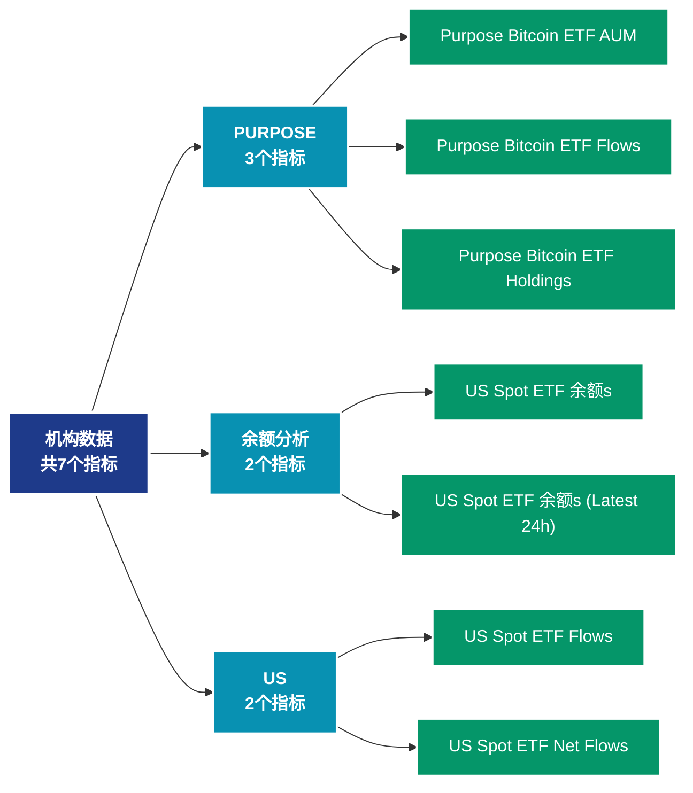

# 机构数据 (institutions)

## 📝 类别描述

机构投资者相关数据，包括灰度、ETF、上市公司持仓等机构指标。

## 📊 指标概览

本类别共包含 **7** 个指标，涵盖以下主要子类别：

| 子类别 | 指标数量 | 主要功能 |
|--------|----------|----------|
| PURPOSE | 3 | 专门数据分析 |
| 余额分析 | 2 | 地址余额分布和变化 |
| US | 2 | 专门数据分析 |

## 🎨 指标体系结构图



## 📂 详细指标说明

### 📊 PURPOSE（3个指标）

本子类别包含以下详细指标：

#### 1. Purpose Bitcoin ETF AUM

- **指标代码**: `purpose_etf_aum_sum`
- **API路径**: `/v1/metrics/institutions/purpose_etf_aum_sum`
- **英文名称**: Purpose Bitcoin ETF AUM

**英文原文：**
The total AUM of the Purpose Bitcoin ETF fund. Source: Purpose Investments

**中文解释：**
分析Purpose Bitcoin ETF AUM相关的链上数据。这个指标通过追踪区块链上的实时数据，提供了传统金融分析无法获得的透明度和洞察力。链上数据的优势在于：1）数据真实可验证；2）实时更新无延迟；3）覆盖所有参与者。通过综合分析多个链上指标，投资者可以做出更明智的决策，研究人员可以深入理解市场机制。

**使用示例**：
```python
# 获取Purpose Bitcoin ETF AUM数据
df = client.get_metric(
    "/v1/metrics/institutions/purpose_etf_aum_sum",
    asset="BTC",
    resolution="24h"
)
```

---

#### 2. Purpose Bitcoin ETF Flows

- **指标代码**: `purpose_etf_flows_sum`
- **API路径**: `/v1/metrics/institutions/purpose_etf_flows_sum`
- **英文名称**: Purpose Bitcoin ETF Flows

**英文原文：**
The number of bitcoin flowing from/to the Purpose Bitcoin ETF. Source: Purpose Investments

**中文解释：**
分析Purpose Bitcoin ETF Flows相关的链上数据。这个指标通过追踪区块链上的实时数据，提供了传统金融分析无法获得的透明度和洞察力。链上数据的优势在于：1）数据真实可验证；2）实时更新无延迟；3）覆盖所有参与者。通过综合分析多个链上指标，投资者可以做出更明智的决策，研究人员可以深入理解市场机制。

**使用示例**：
```python
# 获取Purpose Bitcoin ETF Flows数据
df = client.get_metric(
    "/v1/metrics/institutions/purpose_etf_flows_sum",
    asset="BTC",
    resolution="24h"
)
```

---

#### 3. Purpose Bitcoin ETF Holdings

- **指标代码**: `purpose_etf_holdings_sum`
- **API路径**: `/v1/metrics/institutions/purpose_etf_holdings_sum`
- **英文名称**: Purpose Bitcoin ETF Holdings

**英文原文：**
The number of bitcoin in the Purpose Bitcoin ETF. Source: Purpose Investments

**中文解释：**
分析Purpose Bitcoin ETF Holdings相关的链上数据。这个指标通过追踪区块链上的实时数据，提供了传统金融分析无法获得的透明度和洞察力。链上数据的优势在于：1）数据真实可验证；2）实时更新无延迟；3）覆盖所有参与者。通过综合分析多个链上指标，投资者可以做出更明智的决策，研究人员可以深入理解市场机制。

**使用示例**：
```python
# 获取Purpose Bitcoin ETF Holdings数据
df = client.get_metric(
    "/v1/metrics/institutions/purpose_etf_holdings_sum",
    asset="BTC",
    resolution="24h"
)
```

---

### 📊 余额分析（2个指标）

本子类别包含以下详细指标：

#### 1. US Spot ETF 余额s

- **指标代码**: `us_spot_etf_balances_all`
- **API路径**: `/v1/metrics/institutions/us_spot_etf_balances_all`
- **英文名称**: US Spot ETF Balances

**英文原文：**
This metric offers the most recent balances of the leading Bitcoin and Ethereum ETFs traded in the U.S., typically reflecting holdings at the end of the previous trading day (T+1). It updates hourly from 00:00 to 18:00 UTC to ensure timely information on the daily reported balances. Unlike the standard convention where updates are provided only after an interval has concluded, this metric also provides preliminary data for weekly and monthly updates once daily at 15:00 UTC.

The Bitcoin ETFs covered include: 

 - IBIT by BlackRock
 - GBTC by Grayscale
 - BTC by Grayscale (Mini Trust)
 - FBTC by Fidelity
 - ARKB by Ark/21 Shares
 - BITB by Bitwise
 - HODL by VanEck
 - BRRR by Valkyrie
 - BTCO by Invesco/Galaxy
 - EZBC by Franklin Templeton
 - BTCW by WisdomTree

The Ethereum ETFs covered include: 

 - ETHA by BlackRock
 - ETHE by Grayscale
 - ETH by Grayscale (Mini Trust)
 - FETH by Fidelity
 - CETH by 21 Shares
 - ETHW by Bitwise
 - ETHV by VanEck
 - QETH by Invesco/Galaxy
 - EZET by Franklin Templeton

Source: The metric utilizes publicly available information, obtained directly from the respective ETF issuers.

**中文解释：**
分析地址余额的各个方面，包括余额分布、余额变化、余额集中度等。余额分析揭示了网络的财富结构和演变趋势，是理解市场力量对比的关键。

**使用示例**：
```python
# 获取US Spot ETF 余额s数据
df = client.get_metric(
    "/v1/metrics/institutions/us_spot_etf_balances_all",
    asset="BTC",
    resolution="24h"
)
```

---

#### 2. US Spot ETF 余额s (Latest 24h)

- **指标代码**: `us_spot_etf_balances_latest`
- **API路径**: `/v1/metrics/institutions/us_spot_etf_balances_latest`
- **英文名称**: US Spot ETF Balances (Latest 24h)

**英文原文：**
This metric provides a consolidated overview of both the latest balances and flows of the leading Bitcoin and Ethereum ETFs traded in the U.S. It combines the most recent data points from the &#x27;US Spot ETF Balances&#x27; and &#x27;US Bitcoin ETF Flows&#x27; metrics, offering a snapshot of the current state of these ETFs.  It updates hourly from 00:00 to 18:00 UTC.

The Bitcoin ETFs covered include: 

 - IBIT by BlackRock
 - GBTC by Grayscale
 - BTC by Grayscale (Mini Trust)
 - FBTC by Fidelity
 - ARKB by Ark/21 Shares
 - BITB by Bitwise
 - HODL by VanEck
 - BRRR by Valkyrie
 - BTCO by Invesco/Galaxy
 - EZBC by Franklin Templeton
 - BTCW by WisdomTree

The Ethereum ETFs covered include: 

 - ETHA by BlackRock
 - ETHE by Grayscale
 - ETH by Grayscale (Mini Trust)
 - FETH by Fidelity
 - CETH by 21 Shares
 - ETHW by Bitwise
 - ETHV by VanEck
 - QETH by Invesco/Galaxy
 - EZET by Franklin Templeton

Source: The metric utilizes publicly available information, obtained directly from the respective ETF issuers.

**中文解释：**
分析地址余额的各个方面，包括余额分布、余额变化、余额集中度等。余额分析揭示了网络的财富结构和演变趋势，是理解市场力量对比的关键。

**使用示例**：
```python
# 获取US Spot ETF 余额s (Latest 24h)数据
df = client.get_metric(
    "/v1/metrics/institutions/us_spot_etf_balances_latest",
    asset="BTC",
    resolution="24h"
)
```

---

### 📊 US（2个指标）

本子类别包含以下详细指标：

#### 1. US Spot ETF Flows

- **指标代码**: `us_spot_etf_flows_all`
- **API路径**: `/v1/metrics/institutions/us_spot_etf_flows_all`
- **英文名称**: US Spot ETF Flows

**英文原文：**
This metric is an estimate of the daily net flow of funds within the leading Bitcoin and Ethereum ETFs traded in the U.S., reflecting the day-to-day changes in the ETF&#x27;s holdings. The calculation is based on shares outstanding and Basket Crypto Amount when this information is available; otherwise it is based on the difference between today&#x27;s balance data point and the previously available balance data point in native units. Each day&#x27;s native net flow is then converted into USD, leveraging the closing USD exchange rate at 16:00 New York time. It updates hourly from 00:00 to 18:00 UTC to ensure timely information on the daily reported balances. Unlike the standard convention where updates are provided only after an interval has concluded, this metric also provides preliminary data for weekly and monthly updates once daily at 15:00 UTC.

The Bitcoin ETFs covered include: 

 - IBIT by BlackRock
 - GBTC by Grayscale
 - BTC by Grayscale (Mini Trust)
 - FBTC by Fidelity
 - ARKB by Ark/21 Shares
 - BITB by Bitwise
 - HODL by VanEck
 - BRRR by Valkyrie
 - BTCO by Invesco/Galaxy
 - EZBC by Franklin Templeton
 - BTCW by WisdomTree

The Ethereum ETFs covered include: 

 - ETHA by BlackRock
 - ETHE by Grayscale
 - ETH by Grayscale (Mini Trust)
 - FETH by Fidelity
 - CETH by 21 Shares
 - ETHW by Bitwise
 - ETHV by VanEck
 - QETH by Invesco/Galaxy
 - EZET by Franklin Templeton

Source: The metric utilizes publicly available information, obtained directly from the respective ETF issuers.

**中文解释：**
分析US Spot ETF Flows相关的链上数据。这个指标通过追踪区块链上的实时数据，提供了传统金融分析无法获得的透明度和洞察力。链上数据的优势在于：1）数据真实可验证；2）实时更新无延迟；3）覆盖所有参与者。通过综合分析多个链上指标，投资者可以做出更明智的决策，研究人员可以深入理解市场机制。

**使用示例**：
```python
# 获取US Spot ETF Flows数据
df = client.get_metric(
    "/v1/metrics/institutions/us_spot_etf_flows_all",
    asset="BTC",
    resolution="24h"
)
```

---

#### 2. US Spot ETF Net Flows

- **指标代码**: `us_spot_etf_flows_net`
- **API路径**: `/v1/metrics/institutions/us_spot_etf_flows_net`
- **英文名称**: US Spot ETF Net Flows

**英文原文：**
This metric shows the total net flow of funds of the leading Bitcoin and Ethereum ETFs traded in the U.S., reflecting the day-to-day changes in the ETF&#x27;s holdings. It is calculated as the difference between today&#x27;s balance data point and the previously available balance data point in native units. Each day&#x27;s native net flow is then converted into USD, leveraging the closing USD exchange rate at 16:00 New York time. It updates hourly from 00:00 to 18:00 UTC to ensure timely information on the daily reported balances. Unlike the standard convention where updates are provided only after an interval has concluded, this metric also provides preliminary data for weekly and monthly updates once daily at 15:00 UTC.

The Bitcoin ETFs covered include: 

 - IBIT by BlackRock
 - GBTC by Grayscale
 - BTC by Grayscale (Mini Trust)
 - FBTC by Fidelity
 - ARKB by Ark/21 Shares
 - BITB by Bitwise
 - HODL by VanEck
 - BRRR by Valkyrie
 - BTCO by Invesco/Galaxy
 - EZBC by Franklin Templeton
 - BTCW by WisdomTree

The Ethereum ETFs covered include: 

 - ETHA by BlackRock
 - ETHE by Grayscale
 - ETH by Grayscale (Mini Trust)
 - FETH by Fidelity
 - CETH by 21 Shares
 - ETHW by Bitwise
 - ETHV by VanEck
 - QETH by Invesco/Galaxy
 - EZET by Franklin Templeton

Source: The metric utilizes publicly available information, obtained directly from the respective ETF issuers.

**中文解释：**
分析US Spot ETF Net Flows相关的链上数据。这个指标通过追踪区块链上的实时数据，提供了传统金融分析无法获得的透明度和洞察力。链上数据的优势在于：1）数据真实可验证；2）实时更新无延迟；3）覆盖所有参与者。通过综合分析多个链上指标，投资者可以做出更明智的决策，研究人员可以深入理解市场机制。

**使用示例**：
```python
# 获取US Spot ETF Net Flows数据
df = client.get_metric(
    "/v1/metrics/institutions/us_spot_etf_flows_net",
    asset="BTC",
    resolution="24h"
)
```

---

## 📊 完整指标列表

| # | 指标名称 | 指标代码 | API路径 |
|---|----------|----------|---------|
| 1 | Purpose Bitcoin ETF AUM | `purpose_etf_aum_sum` | `/v1/metrics/institutions/purpose_etf_aum_sum` |
| 2 | Purpose Bitcoin ETF Flows | `purpose_etf_flows_sum` | `/v1/metrics/institutions/purpose_etf_flows_sum` |
| 3 | Purpose Bitcoin ETF Holdings | `purpose_etf_holdings_sum` | `/v1/metrics/institutions/purpose_etf_holdings_sum` |
| 4 | US Spot ETF 余额s | `us_spot_etf_balances_all` | `/v1/metrics/institutions/us_spot_etf_balances_all` |
| 5 | US Spot ETF 余额s (Latest 24h) | `us_spot_etf_balances_latest` | `/v1/metrics/institutions/us_spot_etf_balances_latest` |
| 6 | US Spot ETF Flows | `us_spot_etf_flows_all` | `/v1/metrics/institutions/us_spot_etf_flows_all` |
| 7 | US Spot ETF Net Flows | `us_spot_etf_flows_net` | `/v1/metrics/institutions/us_spot_etf_flows_net` |

## 💻 代码示例

### Python SDK 使用示例

```python
from glassnode import GlassnodeClient

# 初始化客户端
client = GlassnodeClient(api_key="YOUR_API_KEY")

# 获取单个指标
data = client.get(
    "/v1/metrics/addresses/active_count",
    asset="BTC",
    resolution="24h",
    since="2024-01-01"
)

# 批量获取多个指标
metrics = [
    "active_count",
    "new",
    "non_zero_count"
]

results = {}
for metric in metrics:
    results[metric] = client.get(
        f"/v1/metrics/addresses/{metric}",
        asset="BTC"
    )
```

## 📚 参考资源

- [Glassnode官方文档](https://docs.glassnode.com)
- [Glassnode Studio](https://studio.glassnode.com)
- [API访问说明](https://docs.glassnode.com/basic-api/api)

---

*最后更新：2024年*
