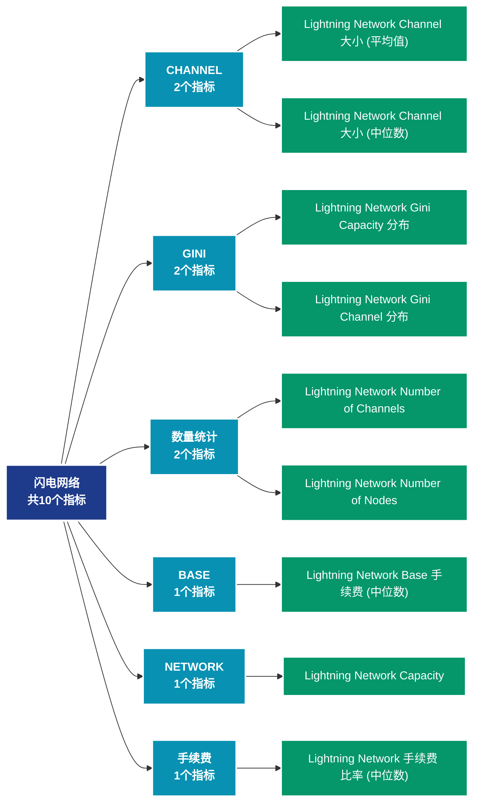

# 闪电网络 (lightning)

## 📝 类别描述

比特币闪电网络数据，包括节点数、通道容量、路由等二层网络指标。

## 📊 指标概览

本类别共包含 **10** 个指标，涵盖以下主要子类别：

| 子类别 | 指标数量 | 主要功能 |
|--------|----------|----------|
| CHANNEL | 2 | 专门数据分析 |
| GINI | 2 | 专门数据分析 |
| 数量统计 | 2 | 专门数据分析 |
| BASE | 1 | 专门数据分析 |
| NETWORK | 1 | 专门数据分析 |
| 手续费 | 1 | 手续费市场动态 |
| NODE | 1 | 专门数据分析 |

## 🎨 指标体系结构图



## 📂 详细指标说明

### 📊 CHANNEL（2个指标）

本子类别包含以下详细指标：

#### 1. Lightning Network Channel 大小 (平均值)

- **指标代码**: `channel_size_mean`
- **API路径**: `/v1/metrics/lightning/channel_size_mean`
- **英文名称**: Lightning Network Channel Size (Mean)

**英文原文：**
The mean BTC size of public Lightning Network channels. The Lightning Network works by creating payment channels between two parties, where multiple transactions can be made without the need for each individual transaction to be recorded on the Bitcoin blockchain. These transactions are instead recorded off-chain, which makes them faster and cheaper.

**中文解释：**
分析Lightning Network Channel Size (Mean)相关的链上数据。这个指标通过追踪区块链上的实时数据，提供了传统金融分析无法获得的透明度和洞察力。链上数据的优势在于：1）数据真实可验证；2）实时更新无延迟；3）覆盖所有参与者。通过综合分析多个链上指标，投资者可以做出更明智的决策，研究人员可以深入理解市场机制。

**使用示例**：
```python
# 获取Lightning Network Channel 大小 (平均值)数据
df = client.get_metric(
    "/v1/metrics/lightning/channel_size_mean",
    asset="BTC",
    resolution="24h"
)
```

---

#### 2. Lightning Network Channel 大小 (中位数)

- **指标代码**: `channel_size_median`
- **API路径**: `/v1/metrics/lightning/channel_size_median`
- **英文名称**: Lightning Network Channel Size (Median)

**英文原文：**
The median BTC size of public Lightning Network channels. The Lightning Network works by creating payment channels between two parties, where multiple transactions can be made without the need for each individual transaction to be recorded on the Bitcoin blockchain. These transactions are instead recorded off-chain, which makes them faster and cheaper.

**中文解释：**
分析Lightning Network Channel Size (Median)相关的链上数据。这个指标通过追踪区块链上的实时数据，提供了传统金融分析无法获得的透明度和洞察力。链上数据的优势在于：1）数据真实可验证；2）实时更新无延迟；3）覆盖所有参与者。通过综合分析多个链上指标，投资者可以做出更明智的决策，研究人员可以深入理解市场机制。

**使用示例**：
```python
# 获取Lightning Network Channel 大小 (中位数)数据
df = client.get_metric(
    "/v1/metrics/lightning/channel_size_median",
    asset="BTC",
    resolution="24h"
)
```

---

### 📊 GINI（2个指标）

本子类别包含以下详细指标：

#### 1. Lightning Network Gini Capacity 分布

- **指标代码**: `gini_capacity_distribution`
- **API路径**: `/v1/metrics/lightning/gini_capacity_distribution`
- **英文名称**: Lightning Network Gini Capacity Distribution

**英文原文：**
The Gini coefficient of the Lightning network capacity is a statistical measure of the distribution of Bitcoin capacity among the nodes on the Lightning Network. It is calculated by comparing the actual distribution of Bitcoin capacity among the nodes to a hypothetical uniform distribution. It ranges from 0 to 1, with 0 representing perfect equality and 1 representing maximum inequality. A higher Gini coefficient indicates a more unequal distribution of Bitcoin capacity among nodes, while a lower Gini coefficient indicates a more even distribution of Bitcoin capacity. The Gini coefficient of the Lightning network capacity can be used to monitor the degree of centralization and potential risks associated with a highly concentrated distribution of Bitcoin capacity.

**中文解释：**
分析Lightning Network Gini Capacity Distribution相关的链上数据。这个指标通过追踪区块链上的实时数据，提供了传统金融分析无法获得的透明度和洞察力。链上数据的优势在于：1）数据真实可验证；2）实时更新无延迟；3）覆盖所有参与者。通过综合分析多个链上指标，投资者可以做出更明智的决策，研究人员可以深入理解市场机制。

**使用示例**：
```python
# 获取Lightning Network Gini Capacity 分布数据
df = client.get_metric(
    "/v1/metrics/lightning/gini_capacity_distribution",
    asset="BTC",
    resolution="24h"
)
```

---

#### 2. Lightning Network Gini Channel 分布

- **指标代码**: `gini_channel_distribution`
- **API路径**: `/v1/metrics/lightning/gini_channel_distribution`
- **英文名称**: Lightning Network Gini Channel Distribution

**英文原文：**
The Gini coefficient of the Lightning network channel distribution is a statistical measure of the distribution of numbers of channels among the nodes on the Lightning Network. It is calculated by comparing the actual distribution of channels among the nodes to a hypothetical uniform distribution. It ranges from 0 to 1, with 0 representing perfect equality and 1 representing maximum inequality. A higher Gini coefficient indicates a more unequal distribution of channel numbers among nodes, while a lower Gini coefficient indicates a more even distribution of channel counts. The Gini coefficient of the Lightning network channel distribution can be used to monitor the degree of centralization and potential risks associated with a highly concentrated influence of network nodes.

**中文解释：**
分析Lightning Network Gini Channel Distribution相关的链上数据。这个指标通过追踪区块链上的实时数据，提供了传统金融分析无法获得的透明度和洞察力。链上数据的优势在于：1）数据真实可验证；2）实时更新无延迟；3）覆盖所有参与者。通过综合分析多个链上指标，投资者可以做出更明智的决策，研究人员可以深入理解市场机制。

**使用示例**：
```python
# 获取Lightning Network Gini Channel 分布数据
df = client.get_metric(
    "/v1/metrics/lightning/gini_channel_distribution",
    asset="BTC",
    resolution="24h"
)
```

---

### 📊 数量统计（2个指标）

本子类别包含以下详细指标：

#### 1. Lightning Network Number of Channels

- **指标代码**: `channels_count`
- **API路径**: `/v1/metrics/lightning/channels_count`
- **英文名称**: Lightning Network Number of Channels

**英文原文：**
The number of public Lightning Network channels. The Lightning Network works by creating payment channels between two parties, where multiple transactions can be made without the need for each individual transaction to be recorded on the Bitcoin blockchain. These transactions are instead recorded off-chain, which makes them faster and cheaper.

**中文解释：**
分析Lightning Network Number of Channels相关的链上数据。这个指标通过追踪区块链上的实时数据，提供了传统金融分析无法获得的透明度和洞察力。链上数据的优势在于：1）数据真实可验证；2）实时更新无延迟；3）覆盖所有参与者。通过综合分析多个链上指标，投资者可以做出更明智的决策，研究人员可以深入理解市场机制。

**使用示例**：
```python
# 获取Lightning Network Number of Channels数据
df = client.get_metric(
    "/v1/metrics/lightning/channels_count",
    asset="BTC",
    resolution="24h"
)
```

---

#### 2. Lightning Network Number of Nodes

- **指标代码**: `nodes_count`
- **API路径**: `/v1/metrics/lightning/nodes_count`
- **英文名称**: Lightning Network Number of Nodes

**英文原文：**
The number of Lightning Network nodes.

**中文解释：**
分析Lightning Network Number of Nodes相关的链上数据。这个指标通过追踪区块链上的实时数据，提供了传统金融分析无法获得的透明度和洞察力。链上数据的优势在于：1）数据真实可验证；2）实时更新无延迟；3）覆盖所有参与者。通过综合分析多个链上指标，投资者可以做出更明智的决策，研究人员可以深入理解市场机制。

**使用示例**：
```python
# 获取Lightning Network Number of Nodes数据
df = client.get_metric(
    "/v1/metrics/lightning/nodes_count",
    asset="BTC",
    resolution="24h"
)
```

---

### 📊 BASE（1个指标）

本子类别包含以下详细指标：

#### 1. Lightning Network Base 手续费 (中位数)

- **指标代码**: `base_fee_median`
- **API路径**: `/v1/metrics/lightning/base_fee_median`
- **英文名称**: Lightning Network Base Fee (Median)

**英文原文：**
The median base fee in the Lightning Network in Satoshi, derived from the channel graph. Base fees are fees that have to be paid for each payment that is routed through the channel. For payments between two peers that share a direct channel connection no fees have to be spent.

**中文解释：**
计算交易费用的中位数。相比平均值，中位数不受极端高额费用的影响，更能反映典型用户的费用负担。中位数费用是评估网络可用性和普通用户体验的关键指标。

**使用示例**：
```python
# 获取Lightning Network Base 手续费 (中位数)数据
df = client.get_metric(
    "/v1/metrics/lightning/base_fee_median",
    asset="BTC",
    resolution="24h"
)
```

---

### 📊 NETWORK（1个指标）

本子类别包含以下详细指标：

#### 1. Lightning Network Capacity

- **指标代码**: `network_capacity_sum`
- **API路径**: `/v1/metrics/lightning/network_capacity_sum`
- **英文名称**: Lightning Network Capacity

**英文原文：**
The total amount of BTC locked in the Lightning Network. The Bitcoin Lightning Network is a Layer 2 payment protocol built on top of the Bitcoin blockchain. It is designed to provide faster, cheaper, and more scalable transactions than traditional on-chain Bitcoin transactions.

**中文解释：**
分析Lightning Network Capacity相关的链上数据。这个指标通过追踪区块链上的实时数据，提供了传统金融分析无法获得的透明度和洞察力。链上数据的优势在于：1）数据真实可验证；2）实时更新无延迟；3）覆盖所有参与者。通过综合分析多个链上指标，投资者可以做出更明智的决策，研究人员可以深入理解市场机制。

**使用示例**：
```python
# 获取Lightning Network Capacity数据
df = client.get_metric(
    "/v1/metrics/lightning/network_capacity_sum",
    asset="BTC",
    resolution="24h"
)
```

---

### 📊 手续费（1个指标）

本子类别包含以下详细指标：

#### 1. Lightning Network 手续费 比率 (中位数)

- **指标代码**: `fee_rate_median`
- **API路径**: `/v1/metrics/lightning/fee_rate_median`
- **英文名称**: Lightning Network Fee Rate (Median)

**英文原文：**
The median fee rate in the Lightning Network, derived from the channel graph. On top of a base fee, fees for payments are proportional to the transferred amount. Values here are given in units sat / BTC. E.g., a value of 1000 indicates that a fee of 1000 Satoshi is required to transfer 1 BTC.

**中文解释：**
计算交易费用的中位数。相比平均值，中位数不受极端高额费用的影响，更能反映典型用户的费用负担。中位数费用是评估网络可用性和普通用户体验的关键指标。

**使用示例**：
```python
# 获取Lightning Network 手续费 比率 (中位数)数据
df = client.get_metric(
    "/v1/metrics/lightning/fee_rate_median",
    asset="BTC",
    resolution="24h"
)
```

---

### 📊 NODE（1个指标）

本子类别包含以下详细指标：

#### 1. Lightning Network Node Connectivity

- **指标代码**: `node_connectivity`
- **API路径**: `/v1/metrics/lightning/node_connectivity`
- **英文名称**: Lightning Network Node Connectivity

**英文原文：**
The number of nodes in the Lightning Network that are connected via IP, TOR, or both.

**中文解释：**
分析Lightning Network Node Connectivity相关的链上数据。这个指标通过追踪区块链上的实时数据，提供了传统金融分析无法获得的透明度和洞察力。链上数据的优势在于：1）数据真实可验证；2）实时更新无延迟；3）覆盖所有参与者。通过综合分析多个链上指标，投资者可以做出更明智的决策，研究人员可以深入理解市场机制。

**使用示例**：
```python
# 获取Lightning Network Node Connectivity数据
df = client.get_metric(
    "/v1/metrics/lightning/node_connectivity",
    asset="BTC",
    resolution="24h"
)
```

---

## 📊 完整指标列表

| # | 指标名称 | 指标代码 | API路径 |
|---|----------|----------|---------|
| 1 | Lightning Network Base 手续费 (中位数) | `base_fee_median` | `/v1/metrics/lightning/base_fee_median` |
| 2 | Lightning Network Capacity | `network_capacity_sum` | `/v1/metrics/lightning/network_capacity_sum` |
| 3 | Lightning Network Channel 大小 (平均值) | `channel_size_mean` | `/v1/metrics/lightning/channel_size_mean` |
| 4 | Lightning Network Channel 大小 (中位数) | `channel_size_median` | `/v1/metrics/lightning/channel_size_median` |
| 5 | Lightning Network 手续费 比率 (中位数) | `fee_rate_median` | `/v1/metrics/lightning/fee_rate_median` |
| 6 | Lightning Network Gini Capacity 分布 | `gini_capacity_distribution` | `/v1/metrics/lightning/gini_capacity_distribution` |
| 7 | Lightning Network Gini Channel 分布 | `gini_channel_distribution` | `/v1/metrics/lightning/gini_channel_distribution` |
| 8 | Lightning Network Node Connectivity | `node_connectivity` | `/v1/metrics/lightning/node_connectivity` |
| 9 | Lightning Network Number of Channels | `channels_count` | `/v1/metrics/lightning/channels_count` |
| 10 | Lightning Network Number of Nodes | `nodes_count` | `/v1/metrics/lightning/nodes_count` |

## 💻 代码示例

### Python SDK 使用示例

```python
from glassnode import GlassnodeClient

# 初始化客户端
client = GlassnodeClient(api_key="YOUR_API_KEY")

# 获取单个指标
data = client.get(
    "/v1/metrics/addresses/active_count",
    asset="BTC",
    resolution="24h",
    since="2024-01-01"
)

# 批量获取多个指标
metrics = [
    "active_count",
    "new",
    "non_zero_count"
]

results = {}
for metric in metrics:
    results[metric] = client.get(
        f"/v1/metrics/addresses/{metric}",
        asset="BTC"
    )
```

## 📚 参考资源

- [Glassnode官方文档](https://docs.glassnode.com)
- [Glassnode Studio](https://studio.glassnode.com)
- [API访问说明](https://docs.glassnode.com/basic-api/api)

---

*最后更新：2024年*
