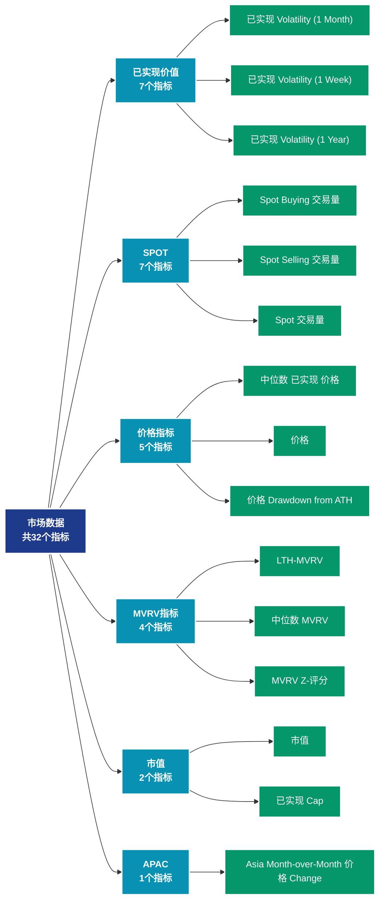

# 市场数据 (market)

## 📝 类别描述

全面的市场数据分析，涵盖价格、交易量、市值、已实现价值等市场核心指标。

## 📊 指标概览

本类别共包含 **32** 个指标，涵盖以下主要子类别：

| 子类别 | 指标数量 | 主要功能 |
|--------|----------|----------|
| 已实现价值 | 7 | 专门数据分析 |
| SPOT | 7 | 专门数据分析 |
| 价格指标 | 5 | 专门数据分析 |
| MVRV指标 | 4 | 专门数据分析 |
| 市值 | 2 | 专门数据分析 |
| APAC | 1 | 专门数据分析 |
| BTC | 1 | 专门数据分析 |
| DELTACAP | 1 | 专门数据分析 |
| EMEA | 1 | 专门数据分析 |
| HODL | 1 | 专门数据分析 |

## 🎨 指标体系结构图



## 📂 详细指标说明

### 📊 已实现价值（7个指标）

本子类别包含以下详细指标：

#### 1. 已实现 Volatility (1 Month)

- **指标代码**: `realized_volatility_1_month`
- **API路径**: `/v1/metrics/market/realized_volatility_1_month`
- **英文名称**: Realized Volatility (1 Month)

**英文原文：**
Realized volatility is the standard deviation of returns from the mean return of a market. High values in realized volatility indicate a phase of high risk in that market. It is measured on log returns over a fixed time horizon or over a rolling window to obtain a time-dependent observable. While implied volatility refers to the market’s assessment of future volatility, realized volatility measures what happened in the past. Here, we calculate the realized volatility based on daily returns and multiply it with a factor of sqrt(365) to yield the annualized daily realized volatility over a rolling window of 1 month.

**中文解释：**
分析Realized Volatility (1 Month)相关的链上数据。这个指标通过追踪区块链上的实时数据，提供了传统金融分析无法获得的透明度和洞察力。链上数据的优势在于：1）数据真实可验证；2）实时更新无延迟；3）覆盖所有参与者。通过综合分析多个链上指标，投资者可以做出更明智的决策，研究人员可以深入理解市场机制。

**使用示例**：
```python
# 获取已实现 Volatility (1 Month)数据
df = client.get_metric(
    "/v1/metrics/market/realized_volatility_1_month",
    asset="BTC",
    resolution="24h"
)
```

---

#### 2. 已实现 Volatility (1 Week)

- **指标代码**: `realized_volatility_1_week`
- **API路径**: `/v1/metrics/market/realized_volatility_1_week`
- **英文名称**: Realized Volatility (1 Week)

**英文原文：**
Realized volatility is the standard deviation of returns from the mean return of a market. High values in realized volatility indicate a phase of high risk in that market. It is measured on log returns over a fixed time horizon or over a rolling window to obtain a time-dependent observable. While implied volatility refers to the market’s assessment of future volatility, realized volatility measures what happened in the past. Here, we calculate the realized volatility based on daily returns and multiply it with a factor of sqrt(365) to yield the annualized daily realized volatility over a rolling window of 1 week.

**中文解释：**
分析Realized Volatility (1 Week)相关的链上数据。这个指标通过追踪区块链上的实时数据，提供了传统金融分析无法获得的透明度和洞察力。链上数据的优势在于：1）数据真实可验证；2）实时更新无延迟；3）覆盖所有参与者。通过综合分析多个链上指标，投资者可以做出更明智的决策，研究人员可以深入理解市场机制。

**使用示例**：
```python
# 获取已实现 Volatility (1 Week)数据
df = client.get_metric(
    "/v1/metrics/market/realized_volatility_1_week",
    asset="BTC",
    resolution="24h"
)
```

---

#### 3. 已实现 Volatility (1 Year)

- **指标代码**: `realized_volatility_1_year`
- **API路径**: `/v1/metrics/market/realized_volatility_1_year`
- **英文名称**: Realized Volatility (1 Year)

**英文原文：**
Realized volatility is the standard deviation of returns from the mean return of a market. High values in realized volatility indicate a phase of high risk in that market. It is measured on log returns over a fixed time horizon or over a rolling window to obtain a time-dependent observable. While implied volatility refers to the market’s assessment of future volatility, realized volatility measures what happened in the past. Here, we calculate the realized volatility based on daily returns and multiply it with a factor of sqrt(365) to yield the annualized daily realized volatility over a rolling window of 365 days.

**中文解释：**
分析Realized Volatility (1 Year)相关的链上数据。这个指标通过追踪区块链上的实时数据，提供了传统金融分析无法获得的透明度和洞察力。链上数据的优势在于：1）数据真实可验证；2）实时更新无延迟；3）覆盖所有参与者。通过综合分析多个链上指标，投资者可以做出更明智的决策，研究人员可以深入理解市场机制。

**使用示例**：
```python
# 获取已实现 Volatility (1 Year)数据
df = client.get_metric(
    "/v1/metrics/market/realized_volatility_1_year",
    asset="BTC",
    resolution="24h"
)
```

---

#### 4. 已实现 Volatility (2 Weeks)

- **指标代码**: `realized_volatility_2_weeks`
- **API路径**: `/v1/metrics/market/realized_volatility_2_weeks`
- **英文名称**: Realized Volatility (2 Weeks)

**英文原文：**
Realized volatility is the standard deviation of returns from the mean return of a market. High values in realized volatility indicate a phase of high risk in that market. It is measured on log returns over a fixed time horizon or over a rolling window to obtain a time-dependent observable. While implied volatility refers to the market’s assessment of future volatility, realized volatility measures what happened in the past. Here, we calculate the realized volatility based on daily returns and multiply it with a factor of sqrt(365) to yield the annualized daily realized volatility over a rolling window of 2 weeks.

**中文解释：**
分析Realized Volatility (2 Weeks)相关的链上数据。这个指标通过追踪区块链上的实时数据，提供了传统金融分析无法获得的透明度和洞察力。链上数据的优势在于：1）数据真实可验证；2）实时更新无延迟；3）覆盖所有参与者。通过综合分析多个链上指标，投资者可以做出更明智的决策，研究人员可以深入理解市场机制。

**使用示例**：
```python
# 获取已实现 Volatility (2 Weeks)数据
df = client.get_metric(
    "/v1/metrics/market/realized_volatility_2_weeks",
    asset="BTC",
    resolution="24h"
)
```

---

#### 5. 已实现 Volatility (3 Months)

- **指标代码**: `realized_volatility_3_months`
- **API路径**: `/v1/metrics/market/realized_volatility_3_months`
- **英文名称**: Realized Volatility (3 Months)

**英文原文：**
Realized volatility is the standard deviation of returns from the mean return of a market. High values in realized volatility indicate a phase of high risk in that market. It is measured on log returns over a fixed time horizon or over a rolling window to obtain a time-dependent observable. While implied volatility refers to the market’s assessment of future volatility, realized volatility measures what happened in the past. Here, we calculate the realized volatility based on daily returns and multiply it with a factor of sqrt(365) to yield the annualized daily realized volatility over a rolling window of 3 months.

**中文解释：**
分析Realized Volatility (3 Months)相关的链上数据。这个指标通过追踪区块链上的实时数据，提供了传统金融分析无法获得的透明度和洞察力。链上数据的优势在于：1）数据真实可验证；2）实时更新无延迟；3）覆盖所有参与者。通过综合分析多个链上指标，投资者可以做出更明智的决策，研究人员可以深入理解市场机制。

**使用示例**：
```python
# 获取已实现 Volatility (3 Months)数据
df = client.get_metric(
    "/v1/metrics/market/realized_volatility_3_months",
    asset="BTC",
    resolution="24h"
)
```

---

#### 6. 已实现 Volatility (6 Months)

- **指标代码**: `realized_volatility_6_months`
- **API路径**: `/v1/metrics/market/realized_volatility_6_months`
- **英文名称**: Realized Volatility (6 Months)

**英文原文：**
Realized volatility is the standard deviation of returns from the mean return of a market. High values in realized volatility indicate a phase of high risk in that market. It is measured on log returns over a fixed time horizon or over a rolling window to obtain a time-dependent observable. While implied volatility refers to the market’s assessment of future volatility, realized volatility measures what happened in the past. Here, we calculate the realized volatility based on daily returns and multiply it with a factor of sqrt(365) to yield the annualized daily realized volatility over a rolling window of 6 months.

**中文解释：**
分析Realized Volatility (6 Months)相关的链上数据。这个指标通过追踪区块链上的实时数据，提供了传统金融分析无法获得的透明度和洞察力。链上数据的优势在于：1）数据真实可验证；2）实时更新无延迟；3）覆盖所有参与者。通过综合分析多个链上指标，投资者可以做出更明智的决策，研究人员可以深入理解市场机制。

**使用示例**：
```python
# 获取已实现 Volatility (6 Months)数据
df = client.get_metric(
    "/v1/metrics/market/realized_volatility_6_months",
    asset="BTC",
    resolution="24h"
)
```

---

#### 7. 已实现 Volatility (All)

- **指标代码**: `realized_volatility_all`
- **API路径**: `/v1/metrics/market/realized_volatility_all`
- **英文名称**: Realized Volatility (All)

**英文原文：**
Realized volatility is the standard deviation of returns from the mean return of a market. High values in realized volatility indicate a phase of high risk in that market. It is measured on log returns over a fixed time horizon or over a rolling window to obtain a time-dependent observable. While implied volatility refers to the market’s assessment of future volatility, realized volatility measures what happened in the past. Here, we calculate the realized volatility based on daily returns and multiply it with a factor of sqrt(365) to yield the annualized daily realized volatility over rolling windows of 1 week, 2 weeks, 1 month, 3 months, 6 months, and 1 year, respectively.

**中文解释：**
分析Realized Volatility (All)相关的链上数据。这个指标通过追踪区块链上的实时数据，提供了传统金融分析无法获得的透明度和洞察力。链上数据的优势在于：1）数据真实可验证；2）实时更新无延迟；3）覆盖所有参与者。通过综合分析多个链上指标，投资者可以做出更明智的决策，研究人员可以深入理解市场机制。

**使用示例**：
```python
# 获取已实现 Volatility (All)数据
df = client.get_metric(
    "/v1/metrics/market/realized_volatility_all",
    asset="BTC",
    resolution="24h"
)
```

---

### 📊 SPOT（7个指标）

本子类别包含以下详细指标：

#### 1. Spot Buying 交易量

- **指标代码**: `spot_buying_volume_sum`
- **API路径**: `/v1/metrics/market/spot_buying_volume_sum`
- **英文名称**: Spot Buying Volume

**英文原文：**
Spot Buying Volume Intraday measures the aggregate trading volume in which the buyer was the aggressor, focusing on the native asset against USD-related currencies (both fiat and stablecoins). This volume is calculated within a specific intraday time frame, determined by your chosen data resolution (e.g., hourly, 10-minute intervals). 

You can view this metric for individual exchanges or as an aggregate total across exchanges.

**中文解释：**
分析Spot Buying Volume相关的链上数据。这个指标通过追踪区块链上的实时数据，提供了传统金融分析无法获得的透明度和洞察力。链上数据的优势在于：1）数据真实可验证；2）实时更新无延迟；3）覆盖所有参与者。通过综合分析多个链上指标，投资者可以做出更明智的决策，研究人员可以深入理解市场机制。

**使用示例**：
```python
# 获取Spot Buying 交易量数据
df = client.get_metric(
    "/v1/metrics/market/spot_buying_volume_sum",
    asset="BTC",
    resolution="24h"
)
```

---

#### 2. Spot Selling 交易量

- **指标代码**: `spot_selling_volume_sum`
- **API路径**: `/v1/metrics/market/spot_selling_volume_sum`
- **英文名称**: Spot Selling Volume

**英文原文：**
Spot Selling Volume Intraday measures the aggregate trading volume in which the seller was the aggressor, focusing on the native asset against USD-related currencies (both fiat and stablecoins). This volume is calculated within a specific intraday time frame, determined by your chosen data resolution (e.g., hourly, 10-minute intervals). 

You can view this metric for individual exchanges or as an aggregate total across exchanges.

**中文解释：**
分析Spot Selling Volume相关的链上数据。这个指标通过追踪区块链上的实时数据，提供了传统金融分析无法获得的透明度和洞察力。链上数据的优势在于：1）数据真实可验证；2）实时更新无延迟；3）覆盖所有参与者。通过综合分析多个链上指标，投资者可以做出更明智的决策，研究人员可以深入理解市场机制。

**使用示例**：
```python
# 获取Spot Selling 交易量数据
df = client.get_metric(
    "/v1/metrics/market/spot_selling_volume_sum",
    asset="BTC",
    resolution="24h"
)
```

---

#### 3. Spot 交易量

- **指标代码**: `spot_volume_sum_intraday`
- **API路径**: `/v1/metrics/market/spot_volume_sum_intraday`
- **英文名称**: Spot Volume

**英文原文：**
Spot Volume Intraday measures the aggregate trading volume for the native asset against USD-related currencies (both fiat and stablecoins) within a specific intraday time frame. The time frame is determined by the chosen data resolution (e.g., hourly, 10-minute intervals). 

 This metric can be viewed for individual exchanges or as an aggregate total across exchanges.

**中文解释：**
分析Spot Volume相关的链上数据。这个指标通过追踪区块链上的实时数据，提供了传统金融分析无法获得的透明度和洞察力。链上数据的优势在于：1）数据真实可验证；2）实时更新无延迟；3）覆盖所有参与者。通过综合分析多个链上指标，投资者可以做出更明智的决策，研究人员可以深入理解市场机制。

**使用示例**：
```python
# 获取Spot 交易量数据
df = client.get_metric(
    "/v1/metrics/market/spot_volume_sum_intraday",
    asset="BTC",
    resolution="24h"
)
```

---

#### 4. Spot 交易量 24h

- **指标代码**: `spot_volume_daily_sum`
- **API路径**: `/v1/metrics/market/spot_volume_daily_sum`
- **英文名称**: Spot Volume 24h

**英文原文：**
Spot Volume represents the total trading volume of the native asset against all USD-related currencies, including both fiat and stablecoins, aggregated over the past 24 hours.

 Dropdown menus can be used to select individual exchanges or aggregate values (default). Values are presented according to the selected data resolution.

**中文解释：**
分析Spot Volume 24h相关的链上数据。这个指标通过追踪区块链上的实时数据，提供了传统金融分析无法获得的透明度和洞察力。链上数据的优势在于：1）数据真实可验证；2）实时更新无延迟；3）覆盖所有参与者。通过综合分析多个链上指标，投资者可以做出更明智的决策，研究人员可以深入理解市场机制。

**使用示例**：
```python
# 获取Spot 交易量 24h数据
df = client.get_metric(
    "/v1/metrics/market/spot_volume_daily_sum",
    asset="BTC",
    resolution="24h"
)
```

---

#### 5. Spot 交易量 24h (Latest)

- **指标代码**: `spot_volume_daily_latest`
- **API路径**: `/v1/metrics/market/spot_volume_daily_latest`
- **英文名称**: Spot Volume 24h (Latest)

**英文原文：**
The total volume traded in spot markets per exchange aggregated over the last 24 hours. These values are updated every 10 minutes to reflect the latest trading dynamics. Alongside the total volume, &#x27;change&#x27; values are also presented, indicating the difference compared to the previous value.

**中文解释：**
分析Spot Volume 24h (Latest)相关的链上数据。这个指标通过追踪区块链上的实时数据，提供了传统金融分析无法获得的透明度和洞察力。链上数据的优势在于：1）数据真实可验证；2）实时更新无延迟；3）覆盖所有参与者。通过综合分析多个链上指标，投资者可以做出更明智的决策，研究人员可以深入理解市场机制。

**使用示例**：
```python
# 获取Spot 交易量 24h (Latest)数据
df = client.get_metric(
    "/v1/metrics/market/spot_volume_daily_latest",
    asset="BTC",
    resolution="24h"
)
```

---

#### 6. Spot 交易量 24h (Stacked)

- **指标代码**: `spot_volume_daily_sum_all`
- **API路径**: `/v1/metrics/market/spot_volume_daily_sum_all`
- **英文名称**: Spot Volume 24h (Stacked)

**英文原文：**
Spot Volume (Stacked) displays the cumulative trading volume of the native asset against USD-based currencies, encompassing both fiat and stablecoins, broken down by each exchange. This metric sums up trades over the last 24 hours and is visualized stacked to differentiate volumes by exchange.

**中文解释：**
分析Spot Volume 24h (Stacked)相关的链上数据。这个指标通过追踪区块链上的实时数据，提供了传统金融分析无法获得的透明度和洞察力。链上数据的优势在于：1）数据真实可验证；2）实时更新无延迟；3）覆盖所有参与者。通过综合分析多个链上指标，投资者可以做出更明智的决策，研究人员可以深入理解市场机制。

**使用示例**：
```python
# 获取Spot 交易量 24h (Stacked)数据
df = client.get_metric(
    "/v1/metrics/market/spot_volume_daily_sum_all",
    asset="BTC",
    resolution="24h"
)
```

---

#### 7. Spot 交易量 Delta

- **指标代码**: `spot_vd_sum`
- **API路径**: `/v1/metrics/market/spot_vd_sum`
- **英文名称**: Spot Volume Delta

**英文原文：**
Spot Volume Delta (VD) measures the net difference between buying and selling trade volumes, specifically highlighting the difference in volume where the buyer or seller was the aggressor. It includes trades where USD or USD-related currencies serve as the quote currency, encompassing both fiat and stablecoins. The CVD is computed within specific intraday time frames, which are determined based on your selected data resolution (e.g., hourly, 10-minute intervals). \
\
You can view this metric for individual exchanges or as an aggregate total across exchanges.

**中文解释：**
分析Spot Volume Delta相关的链上数据。这个指标通过追踪区块链上的实时数据，提供了传统金融分析无法获得的透明度和洞察力。链上数据的优势在于：1）数据真实可验证；2）实时更新无延迟；3）覆盖所有参与者。通过综合分析多个链上指标，投资者可以做出更明智的决策，研究人员可以深入理解市场机制。

**使用示例**：
```python
# 获取Spot 交易量 Delta数据
df = client.get_metric(
    "/v1/metrics/market/spot_vd_sum",
    asset="BTC",
    resolution="24h"
)
```

---

### 📊 价格指标（5个指标）

本子类别包含以下详细指标：

#### 1. 中位数 已实现 价格

- **指标代码**: `price_realized_median_usd`
- **API路径**: `/v1/metrics/market/price_realized_median_usd`
- **英文名称**: Median Realized Price

**英文原文：**
The Median Realized Price metric represents the median acquisition cost across the total supply of a digital asset, reflecting the price point at which half of the supply was last moved. Unlike average Realized Price, which is based on the Realized Cap divided by current supply, this median calculation provides a view of the central acquisition price by focusing on the midpoint.

**中文解释：**
计算已实现市值或已实现价格。已实现价格是所有币按最后移动时的价格加权平均得出，反映了市场的成本基础。当市场价格高于已实现价格时，市场整体盈利；反之则整体亏损。这是判断市场周期位置的重要指标。

**使用示例**：
```python
# 获取中位数 已实现 价格数据
df = client.get_metric(
    "/v1/metrics/market/price_realized_median_usd",
    asset="BTC",
    resolution="24h"
)
```

---

#### 2. 价格

- **指标代码**: `price_usd_close`
- **API路径**: `/v1/metrics/market/price_usd_close`
- **英文名称**: Price

**英文原文：**
The asset&#x27;s closing price in USD.

**中文解释：**
追踪市场价格和估值指标。市场数据提供价格发现、估值参考和市场情绪评估。通过结合链上数据和市场数据，可以获得更全面的市场洞察。

**使用示例**：
```python
# 获取价格数据
df = client.get_metric(
    "/v1/metrics/market/price_usd_close",
    asset="BTC",
    resolution="24h"
)
```

---

#### 3. 价格 Drawdown from ATH

- **指标代码**: `price_drawdown_relative`
- **API路径**: `/v1/metrics/market/price_drawdown_relative`
- **英文名称**: Price Drawdown from ATH

**英文原文：**
The percent drawdown of the asset&#x27;s price from the previous all-time high.

**中文解释：**
追踪市场价格和估值指标。市场数据提供价格发现、估值参考和市场情绪评估。通过结合链上数据和市场数据，可以获得更全面的市场洞察。

**使用示例**：
```python
# 获取价格 Drawdown from ATH数据
df = client.get_metric(
    "/v1/metrics/market/price_drawdown_relative",
    asset="BTC",
    resolution="24h"
)
```

---

#### 4. 价格 OHLC

- **指标代码**: `price_usd_ohlc`
- **API路径**: `/v1/metrics/market/price_usd_ohlc`
- **英文名称**: Price OHLC

**英文原文：**
OHLC candlestick chart of the asset&#x27;s price in USD.

**Note:** when showing 1 hour resolution the chart will dynamically aggregate data based on zoom level.

**中文解释：**
追踪市场价格和估值指标。市场数据提供价格发现、估值参考和市场情绪评估。通过结合链上数据和市场数据，可以获得更全面的市场洞察。

**使用示例**：
```python
# 获取价格 OHLC数据
df = client.get_metric(
    "/v1/metrics/market/price_usd_ohlc",
    asset="BTC",
    resolution="24h"
)
```

---

#### 5. 已实现 价格

- **指标代码**: `price_realized_usd`
- **API路径**: `/v1/metrics/market/price_realized_usd`
- **英文名称**: Realized Price

**英文原文：**
Realized Price is the Realized Cap divided by the current supply.

**中文解释：**
计算已实现市值或已实现价格。已实现价格是所有币按最后移动时的价格加权平均得出，反映了市场的成本基础。当市场价格高于已实现价格时，市场整体盈利；反之则整体亏损。这是判断市场周期位置的重要指标。

**使用示例**：
```python
# 获取已实现 价格数据
df = client.get_metric(
    "/v1/metrics/market/price_realized_usd",
    asset="BTC",
    resolution="24h"
)
```

---

### 📊 MVRV指标（4个指标）

本子类别包含以下详细指标：

#### 1. LTH-MVRV

- **指标代码**: `mvrv_more_155`
- **API路径**: `/v1/metrics/market/mvrv_more_155`
- **英文名称**: LTH-MVRV

**英文原文：**
Long Term Holder MVRV (LTH-MVRV) is MVRV that takes into account only UTXOs with a lifespan of at least 155 days and serves as an indicator to assess the behaviour of long term investors. For more information see this article.

**中文解释：**
分析LTH-MVRV相关的链上数据。这个指标通过追踪区块链上的实时数据，提供了传统金融分析无法获得的透明度和洞察力。链上数据的优势在于：1）数据真实可验证；2）实时更新无延迟；3）覆盖所有参与者。通过综合分析多个链上指标，投资者可以做出更明智的决策，研究人员可以深入理解市场机制。

**使用示例**：
```python
# 获取LTH-MVRV数据
df = client.get_metric(
    "/v1/metrics/market/mvrv_more_155",
    asset="BTC",
    resolution="24h"
)
```

---

#### 2. 中位数 MVRV

- **指标代码**: `mvrv_median`
- **API路径**: `/v1/metrics/market/mvrv_median`
- **英文名称**: Median MVRV

**英文原文：**
The Median MVRV metric represents the ratio of the current market price to the median realized price, providing a nuanced view of market valuation. Unlike the standard MVRV, which compares market cap to realized cap, the Median MVRV focuses on the midpoint acquisition cost, offering insight into how the current price relates to the median acquisition price of the supply. This metric helps indicate whether the traded price is above or below a typical acquisition price, highlighting potential undervaluation or overvaluation relative to the central price level at which the asset’s supply was acquired.

**中文解释：**
分析Median MVRV相关的链上数据。这个指标通过追踪区块链上的实时数据，提供了传统金融分析无法获得的透明度和洞察力。链上数据的优势在于：1）数据真实可验证；2）实时更新无延迟；3）覆盖所有参与者。通过综合分析多个链上指标，投资者可以做出更明智的决策，研究人员可以深入理解市场机制。

**使用示例**：
```python
# 获取中位数 MVRV数据
df = client.get_metric(
    "/v1/metrics/market/mvrv_median",
    asset="BTC",
    resolution="24h"
)
```

---

#### 3. MVRV Z-评分

- **指标代码**: `mvrv_z_score`
- **API路径**: `/v1/metrics/market/mvrv_z_score`
- **英文名称**: MVRV Z-Score

**英文原文：**
The MVRV Z-Score evaluates whether  is overvalued or undervalued relative to its "fair value". Instead of using a traditional z-score method, the MVRV Z-Score uniquely compares the market value to the realized value. When the market value, measured as network valuation by spot price multiplied by supply, is significantly higher than the realized value, represented by the cumulative capital inflow into the asset, it has typically signaled a market top (red zone). Conversely, a significantly lower market value than the realized value has often indicated market bottoms (green zone).

The MVRV Z-Score is defined as the ratio between the difference of market cap and realized cap, and the standard deviation of market cap, i.e. (market cap – realized cap) / std(market cap). This formula calculates the standard deviation from the first available data point until the present day, making it a cumulative measure.

**中文解释：**
分析MVRV Z-Score相关的链上数据。这个指标通过追踪区块链上的实时数据，提供了传统金融分析无法获得的透明度和洞察力。链上数据的优势在于：1）数据真实可验证；2）实时更新无延迟；3）覆盖所有参与者。通过综合分析多个链上指标，投资者可以做出更明智的决策，研究人员可以深入理解市场机制。

**使用示例**：
```python
# 获取MVRV Z-评分数据
df = client.get_metric(
    "/v1/metrics/market/mvrv_z_score",
    asset="BTC",
    resolution="24h"
)
```

---

#### 4. STH-MVRV

- **指标代码**: `mvrv_less_155`
- **API路径**: `/v1/metrics/market/mvrv_less_155`
- **英文名称**: STH-MVRV

**英文原文：**
Short Term Holder MVRV (STH-MVRV) is MVRV that takes into account only UTXOs younger than 155 days and serves as an indicator to assess the behaviour of short term investors. For more information see this article.

**中文解释：**
分析STH-MVRV相关的链上数据。这个指标通过追踪区块链上的实时数据，提供了传统金融分析无法获得的透明度和洞察力。链上数据的优势在于：1）数据真实可验证；2）实时更新无延迟；3）覆盖所有参与者。通过综合分析多个链上指标，投资者可以做出更明智的决策，研究人员可以深入理解市场机制。

**使用示例**：
```python
# 获取STH-MVRV数据
df = client.get_metric(
    "/v1/metrics/market/mvrv_less_155",
    asset="BTC",
    resolution="24h"
)
```

---

### 📊 市值（2个指标）

本子类别包含以下详细指标：

#### 1. 市值

- **指标代码**: `marketcap_usd`
- **API路径**: `/v1/metrics/market/marketcap_usd`
- **英文名称**: Market Cap

**英文原文：**
The market capitalization (or network value) is defined as the product of the current supply by the current USD price.

**中文解释：**
追踪市场价格和估值指标。市场数据提供价格发现、估值参考和市场情绪评估。通过结合链上数据和市场数据，可以获得更全面的市场洞察。

**使用示例**：
```python
# 获取市值数据
df = client.get_metric(
    "/v1/metrics/market/marketcap_usd",
    asset="BTC",
    resolution="24h"
)
```

---

#### 2. 已实现 Cap

- **指标代码**: `marketcap_realized_usd`
- **API路径**: `/v1/metrics/market/marketcap_realized_usd`
- **英文名称**: Realized Cap

**英文原文：**
Realized Cap values different part of the supplies at different prices (instead of using the current daily close). Specifically, it is computed by valuing each UTXO by the price when it was last moved.

**中文解释：**
计算已实现市值或已实现价格。已实现价格是所有币按最后移动时的价格加权平均得出，反映了市场的成本基础。当市场价格高于已实现价格时，市场整体盈利；反之则整体亏损。这是判断市场周期位置的重要指标。

**使用示例**：
```python
# 获取已实现 Cap数据
df = client.get_metric(
    "/v1/metrics/market/marketcap_realized_usd",
    asset="BTC",
    resolution="24h"
)
```

---

### 📊 APAC（1个指标）

本子类别包含以下详细指标：

#### 1. Asia Month-over-Month 价格 Change

- **指标代码**: `apac_30d_price_change`
- **API路径**: `/v1/metrics/market/apac_30d_price_change`
- **英文名称**: Asia Month-over-Month Price Change

**英文原文：**
This metric shows the 30-day change in the regional price set during Asia working hours, i.e. between 8am and 8pm China Standard Time (00:00-12:00 UTC).

Regional prices are constructed in a two-step process: First, price movements are assigned to regions based on working hours in the US, Europe, and Asia. Regional prices are then determined by calculating the cumulative sum of the price changes over time for each region.

**中文解释：**
追踪市场价格和估值指标。市场数据提供价格发现、估值参考和市场情绪评估。通过结合链上数据和市场数据，可以获得更全面的市场洞察。

**使用示例**：
```python
# 获取Asia Month-over-Month 价格 Change数据
df = client.get_metric(
    "/v1/metrics/market/apac_30d_price_change",
    asset="BTC",
    resolution="24h"
)
```

---

### 📊 BTC（1个指标）

本子类别包含以下详细指标：

#### 1. BTC Dominance

- **指标代码**: `btc_dominance`
- **API路径**: `/v1/metrics/market/btc_dominance`
- **英文名称**: BTC Dominance

**英文原文：**
BTC Dominance, or Bitcoin Dominance, denotes Bitcoin&#x27;s market capitalization as a percentage of the total market cap of all cryptocurrencies. It&#x27;s calculated by dividing Bitcoin&#x27;s market cap by the total cryptocurrency market cap. This metric is updated daily at 10:15 UTC, providing us with the previous day&#x27;s data point at this time.

**中文解释：**
分析BTC Dominance相关的链上数据。这个指标通过追踪区块链上的实时数据，提供了传统金融分析无法获得的透明度和洞察力。链上数据的优势在于：1）数据真实可验证；2）实时更新无延迟；3）覆盖所有参与者。通过综合分析多个链上指标，投资者可以做出更明智的决策，研究人员可以深入理解市场机制。

**使用示例**：
```python
# 获取BTC Dominance数据
df = client.get_metric(
    "/v1/metrics/market/btc_dominance",
    asset="BTC",
    resolution="24h"
)
```

---

### 📊 DELTACAP（1个指标）

本子类别包含以下详细指标：

#### 1. Delta Cap

- **指标代码**: `deltacap_usd`
- **API路径**: `/v1/metrics/market/deltacap_usd`
- **英文名称**: Delta Cap

**英文原文：**
Delta Cap is the difference between Realized Cap and Average Cap, where Average Cap is assumed to be the life-to-date moving average of Market Cap. It attempts to detect major market bottoms in Bitcoin cycles. This metric was put forward by David Puell. For more information please read his introductory article.

**中文解释：**
分析Delta Cap相关的链上数据。这个指标通过追踪区块链上的实时数据，提供了传统金融分析无法获得的透明度和洞察力。链上数据的优势在于：1）数据真实可验证；2）实时更新无延迟；3）覆盖所有参与者。通过综合分析多个链上指标，投资者可以做出更明智的决策，研究人员可以深入理解市场机制。

**使用示例**：
```python
# 获取Delta Cap数据
df = client.get_metric(
    "/v1/metrics/market/deltacap_usd",
    asset="BTC",
    resolution="24h"
)
```

---

### 📊 EMEA（1个指标）

本子类别包含以下详细指标：

#### 1. EU Month-over-Month 价格 Change

- **指标代码**: `emea_30d_price_change`
- **API路径**: `/v1/metrics/market/emea_30d_price_change`
- **英文名称**: EU Month-over-Month Price Change

**英文原文：**
This metric shows the 30-day change in the regional price set during EU working hours, i.e. between 8am and 8pm Central European Time (07:00-19:00 UTC), respectively Central European Summer Time (06:00-18:00 UTC).

Regional prices are constructed in a two-step process: First, price movements are assigned to regions based on working hours in the US, Europe, and Asia. Regional prices are then determined by calculating the cumulative sum of the price changes over time for each region.

**中文解释：**
追踪市场价格和估值指标。市场数据提供价格发现、估值参考和市场情绪评估。通过结合链上数据和市场数据，可以获得更全面的市场洞察。

**使用示例**：
```python
# 获取EU Month-over-Month 价格 Change数据
df = client.get_metric(
    "/v1/metrics/market/emea_30d_price_change",
    asset="BTC",
    resolution="24h"
)
```

---

### 📊 HODL（1个指标）

本子类别包含以下详细指标：

#### 1. HODL Cave

- **指标代码**: `hodl_cave`
- **API路径**: `/v1/metrics/market/hodl_cave`
- **英文名称**: HODL Cave

**英文原文：**
The HODL Cave metric analyzes the spread of historical returns for investors who hold a digital asset over various durations and visualizes both the potential gains and risks of holding. The data can be used to understand how the duration of an investor&#x27;s holdings influences returns, highlighting both potential long-term growth and short-term volatility in digital assets.

The chart shows the holding period in days on the x-axis and on the y-axis the distribution of returns that were historically observed when holding the asset for this amount of time are shown as percentiles. The metric can answer questions like "What have been the typical returns for holding this asset for three years?" For example, at a three-year holding duration, if the "80" percentile line shows a 5x return, it means 80% of all three-year holding periods achieved at least that return.

Note that the data shown in this metric is not static, since new holding windows (ending with the current timestamp) will contribute to all existing holding periods and in turn modify the observed distribution of returns.

This metric was first introduced by Unchained Capital.

**中文解释：**
分析HODL Cave相关的链上数据。这个指标通过追踪区块链上的实时数据，提供了传统金融分析无法获得的透明度和洞察力。链上数据的优势在于：1）数据真实可验证；2）实时更新无延迟；3）覆盖所有参与者。通过综合分析多个链上指标，投资者可以做出更明智的决策，研究人员可以深入理解市场机制。

**使用示例**：
```python
# 获取HODL Cave数据
df = client.get_metric(
    "/v1/metrics/market/hodl_cave",
    asset="BTC",
    resolution="24h"
)
```

---

### 📊 OTHER（1个指标）

本子类别包含以下详细指标：

#### 1. MVRV 比例

- **指标代码**: `mvrv`
- **API路径**: `/v1/metrics/market/mvrv`
- **英文名称**: MVRV Ratio

**英文原文：**
Market Value to Realized Value (MVRV) is the ratio between market cap and realised cap. It gives an indication of when the traded price is below a "fair value". This metric was created by David Puell and Murad Muhmudov. For more information see this post

**中文解释：**
分析MVRV Ratio相关的链上数据。这个指标通过追踪区块链上的实时数据，提供了传统金融分析无法获得的透明度和洞察力。链上数据的优势在于：1）数据真实可验证；2）实时更新无延迟；3）覆盖所有参与者。通过综合分析多个链上指标，投资者可以做出更明智的决策，研究人员可以深入理解市场机制。

**使用示例**：
```python
# 获取MVRV 比例数据
df = client.get_metric(
    "/v1/metrics/market/mvrv",
    asset="BTC",
    resolution="24h"
)
```

---

### 📊 AMER（1个指标）

本子类别包含以下详细指标：

#### 1. US Month-over-Month 价格 Change

- **指标代码**: `amer_30d_price_change`
- **API路径**: `/v1/metrics/market/amer_30d_price_change`
- **英文名称**: US Month-over-Month Price Change

**英文原文：**
This metric shows the 30-day change in the regional price set during US working hours, i.e. between 8am and 8pm Eastern Time (13:00-01:00 UTC), respectively Eastern Daylight Time (12:00-0:00 UTC).

Regional prices are constructed in a two-step process: First, price movements are assigned to regions based on working hours in the US, Europe, and Asia. Regional prices are then determined by calculating the cumulative sum of the price changes over time for each region.

**中文解释：**
追踪市场价格和估值指标。市场数据提供价格发现、估值参考和市场情绪评估。通过结合链上数据和市场数据，可以获得更全面的市场洞察。

**使用示例**：
```python
# 获取US Month-over-Month 价格 Change数据
df = client.get_metric(
    "/v1/metrics/market/amer_30d_price_change",
    asset="BTC",
    resolution="24h"
)
```

---

## 📊 完整指标列表

| # | 指标名称 | 指标代码 | API路径 |
|---|----------|----------|---------|
| 1 | Asia Month-over-Month 价格 Change | `apac_30d_price_change` | `/v1/metrics/market/apac_30d_price_change` |
| 2 | BTC Dominance | `btc_dominance` | `/v1/metrics/market/btc_dominance` |
| 3 | Delta Cap | `deltacap_usd` | `/v1/metrics/market/deltacap_usd` |
| 4 | EU Month-over-Month 价格 Change | `emea_30d_price_change` | `/v1/metrics/market/emea_30d_price_change` |
| 5 | HODL Cave | `hodl_cave` | `/v1/metrics/market/hodl_cave` |
| 6 | LTH-MVRV | `mvrv_more_155` | `/v1/metrics/market/mvrv_more_155` |
| 7 | 市值 | `marketcap_usd` | `/v1/metrics/market/marketcap_usd` |
| 8 | 中位数 MVRV | `mvrv_median` | `/v1/metrics/market/mvrv_median` |
| 9 | 中位数 已实现 价格 | `price_realized_median_usd` | `/v1/metrics/market/price_realized_median_usd` |
| 10 | MVRV 比例 | `mvrv` | `/v1/metrics/market/mvrv` |
| 11 | MVRV Z-评分 | `mvrv_z_score` | `/v1/metrics/market/mvrv_z_score` |
| 12 | 价格 | `price_usd_close` | `/v1/metrics/market/price_usd_close` |
| 13 | 价格 Drawdown from ATH | `price_drawdown_relative` | `/v1/metrics/market/price_drawdown_relative` |
| 14 | 价格 OHLC | `price_usd_ohlc` | `/v1/metrics/market/price_usd_ohlc` |
| 15 | 已实现 Cap | `marketcap_realized_usd` | `/v1/metrics/market/marketcap_realized_usd` |
| 16 | 已实现 价格 | `price_realized_usd` | `/v1/metrics/market/price_realized_usd` |
| 17 | 已实现 Volatility (1 Month) | `realized_volatility_1_month` | `/v1/metrics/market/realized_volatility_1_month` |
| 18 | 已实现 Volatility (1 Week) | `realized_volatility_1_week` | `/v1/metrics/market/realized_volatility_1_week` |
| 19 | 已实现 Volatility (1 Year) | `realized_volatility_1_year` | `/v1/metrics/market/realized_volatility_1_year` |
| 20 | 已实现 Volatility (2 Weeks) | `realized_volatility_2_weeks` | `/v1/metrics/market/realized_volatility_2_weeks` |
| 21 | 已实现 Volatility (3 Months) | `realized_volatility_3_months` | `/v1/metrics/market/realized_volatility_3_months` |
| 22 | 已实现 Volatility (6 Months) | `realized_volatility_6_months` | `/v1/metrics/market/realized_volatility_6_months` |
| 23 | 已实现 Volatility (All) | `realized_volatility_all` | `/v1/metrics/market/realized_volatility_all` |
| 24 | Spot Buying 交易量 | `spot_buying_volume_sum` | `/v1/metrics/market/spot_buying_volume_sum` |
| 25 | Spot Selling 交易量 | `spot_selling_volume_sum` | `/v1/metrics/market/spot_selling_volume_sum` |
| 26 | Spot 交易量 | `spot_volume_sum_intraday` | `/v1/metrics/market/spot_volume_sum_intraday` |
| 27 | Spot 交易量 24h | `spot_volume_daily_sum` | `/v1/metrics/market/spot_volume_daily_sum` |
| 28 | Spot 交易量 24h (Latest) | `spot_volume_daily_latest` | `/v1/metrics/market/spot_volume_daily_latest` |
| 29 | Spot 交易量 24h (Stacked) | `spot_volume_daily_sum_all` | `/v1/metrics/market/spot_volume_daily_sum_all` |
| 30 | Spot 交易量 Delta | `spot_vd_sum` | `/v1/metrics/market/spot_vd_sum` |
| 31 | STH-MVRV | `mvrv_less_155` | `/v1/metrics/market/mvrv_less_155` |
| 32 | US Month-over-Month 价格 Change | `amer_30d_price_change` | `/v1/metrics/market/amer_30d_price_change` |

## 💻 代码示例

### Python SDK 使用示例

```python
from glassnode import GlassnodeClient

# 初始化客户端
client = GlassnodeClient(api_key="YOUR_API_KEY")

# 获取单个指标
data = client.get(
    "/v1/metrics/addresses/active_count",
    asset="BTC",
    resolution="24h",
    since="2024-01-01"
)

# 批量获取多个指标
metrics = [
    "active_count",
    "new",
    "non_zero_count"
]

results = {}
for metric in metrics:
    results[metric] = client.get(
        f"/v1/metrics/addresses/{metric}",
        asset="BTC"
    )
```

## 📚 参考资源

- [Glassnode官方文档](https://docs.glassnode.com)
- [Glassnode Studio](https://studio.glassnode.com)
- [API访问说明](https://docs.glassnode.com/basic-api/api)

---

*最后更新：2024年*
