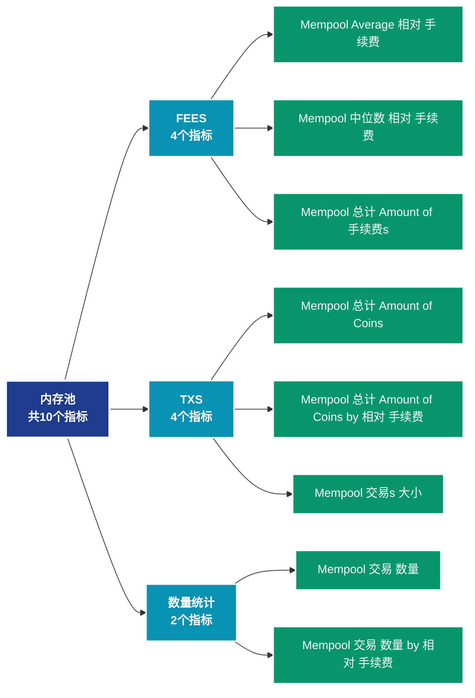

# 内存池 (mempool)

## 📝 类别描述

内存池状态监控，包括待确认交易、拥堵程度等内存池指标。

## 📊 指标概览

本类别共包含 **10** 个指标，涵盖以下主要子类别：

| 子类别 | 指标数量 | 主要功能 |
|--------|----------|----------|
| FEES | 4 | 手续费市场动态 |
| TXS | 4 | 专门数据分析 |
| 数量统计 | 2 | 专门数据分析 |

## 🎨 指标体系结构图



## 📂 详细指标说明

### 📊 FEES（4个指标）

本子类别包含以下详细指标：

#### 1. Mempool Average 相对 手续费

- **指标代码**: `fees_average_relative`
- **API路径**: `/v1/metrics/mempool/fees_average_relative`
- **英文名称**: Mempool Average Relative Fee

**英文原文：**
The mean relative fee of transactions waiting in the mempool. The relative fee is calculated as the total transaction fees divided by the transacion size (in vByte). High relative fees give an indication of transaction urgency as miners do not consider total transaction fee but fee per size, as the total fee they can collect is limited by the block space.

**中文解释：**
计算网络交易费用的平均值。平均费用反映：1）网络的拥堵程度；2）用户的支付意愿；3）区块空间的供需关系。高费用期间，只有高价值交易才会上链；低费用期间，更多小额交易变得可行。费用市场是评估网络使用需求的重要指标。

**使用示例**：
```python
# 获取Mempool Average 相对 手续费数据
df = client.get_metric(
    "/v1/metrics/mempool/fees_average_relative",
    asset="BTC",
    resolution="24h"
)
```

---

#### 2. Mempool 中位数 相对 手续费

- **指标代码**: `fees_median_relative`
- **API路径**: `/v1/metrics/mempool/fees_median_relative`
- **英文名称**: Mempool Median Relative Fee

**英文原文：**
The median relative fee of transactions waiting in the mempool. The relative fee is calculated as the total transaction fees divided by the transacion size (in vByte). High relative fees give an indication of transaction urgency as miners do not consider total transaction fee but fee per size, as the total fee they can collect is limited by the block space.

**中文解释：**
计算交易费用的中位数。相比平均值，中位数不受极端高额费用的影响，更能反映典型用户的费用负担。中位数费用是评估网络可用性和普通用户体验的关键指标。

**使用示例**：
```python
# 获取Mempool 中位数 相对 手续费数据
df = client.get_metric(
    "/v1/metrics/mempool/fees_median_relative",
    asset="BTC",
    resolution="24h"
)
```

---

#### 3. Mempool 总计 Amount of 手续费s

- **指标代码**: `fees_sum`
- **API路径**: `/v1/metrics/mempool/fees_sum`
- **英文名称**: Mempool Total Amount of Fees

**英文原文：**
The total amount of fees of transactions waiting in the mempool.

**中文解释：**
统计支付给矿工或验证者的总手续费。总费用反映：1）网络的安全预算；2）用户对区块空间的总需求；3）矿工/验证者的收入来源。在区块奖励减少的情况下，手续费将成为维护网络安全的主要激励。

**使用示例**：
```python
# 获取Mempool 总计 Amount of 手续费s数据
df = client.get_metric(
    "/v1/metrics/mempool/fees_sum",
    asset="BTC",
    resolution="24h"
)
```

---

#### 4. Mempool 总计 Amount of 手续费s by 相对 手续费

- **指标代码**: `fees_distribution`
- **API路径**: `/v1/metrics/mempool/fees_distribution`
- **英文名称**: Mempool Total Amount of Fees by Relative Fee

**英文原文：**
The total amount of fees of transactions waiting in the mempool in different relative fee (Sat / vByte) cohorts.

**中文解释：**
分析网络费用市场的动态。费用数据揭示了区块空间的稀缺性、用户的紧急程度和网络的经济可持续性。通过费用分析，可以优化交易时机，评估网络的采用程度。

**使用示例**：
```python
# 获取Mempool 总计 Amount of 手续费s by 相对 手续费数据
df = client.get_metric(
    "/v1/metrics/mempool/fees_distribution",
    asset="BTC",
    resolution="24h"
)
```

---

### 📊 TXS（4个指标）

本子类别包含以下详细指标：

#### 1. Mempool 总计 Amount of Coins

- **指标代码**: `txs_value_sum`
- **API路径**: `/v1/metrics/mempool/txs_value_sum`
- **英文名称**: Mempool Total Amount of Coins

**英文原文：**
The total amount of coins in transactions waiting in the mempool.

**中文解释：**
分析Mempool Total Amount of Coins相关的链上数据。这个指标通过追踪区块链上的实时数据，提供了传统金融分析无法获得的透明度和洞察力。链上数据的优势在于：1）数据真实可验证；2）实时更新无延迟；3）覆盖所有参与者。通过综合分析多个链上指标，投资者可以做出更明智的决策，研究人员可以深入理解市场机制。

**使用示例**：
```python
# 获取Mempool 总计 Amount of Coins数据
df = client.get_metric(
    "/v1/metrics/mempool/txs_value_sum",
    asset="BTC",
    resolution="24h"
)
```

---

#### 2. Mempool 总计 Amount of Coins by 相对 手续费

- **指标代码**: `txs_value_distribution`
- **API路径**: `/v1/metrics/mempool/txs_value_distribution`
- **英文名称**: Mempool Total Amount of Coins by Relative Fee

**英文原文：**
The total amount of coins in transactions waiting in the mempool in different relative fee (Sat / vByte) cohorts.

**中文解释：**
分析Mempool Total Amount of Coins by Relative Fee相关的链上数据。这个指标通过追踪区块链上的实时数据，提供了传统金融分析无法获得的透明度和洞察力。链上数据的优势在于：1）数据真实可验证；2）实时更新无延迟；3）覆盖所有参与者。通过综合分析多个链上指标，投资者可以做出更明智的决策，研究人员可以深入理解市场机制。

**使用示例**：
```python
# 获取Mempool 总计 Amount of Coins by 相对 手续费数据
df = client.get_metric(
    "/v1/metrics/mempool/txs_value_distribution",
    asset="BTC",
    resolution="24h"
)
```

---

#### 3. Mempool 交易s 大小

- **指标代码**: `txs_size_sum`
- **API路径**: `/v1/metrics/mempool/txs_size_sum`
- **英文名称**: Mempool Transactions Size

**英文原文：**
The total size (denoted in virtual bytes) of all transactions waiting in the mempool.

**中文解释：**
分析Mempool Transactions Size相关的链上数据。这个指标通过追踪区块链上的实时数据，提供了传统金融分析无法获得的透明度和洞察力。链上数据的优势在于：1）数据真实可验证；2）实时更新无延迟；3）覆盖所有参与者。通过综合分析多个链上指标，投资者可以做出更明智的决策，研究人员可以深入理解市场机制。

**使用示例**：
```python
# 获取Mempool 交易s 大小数据
df = client.get_metric(
    "/v1/metrics/mempool/txs_size_sum",
    asset="BTC",
    resolution="24h"
)
```

---

#### 4. Mempool 交易s 大小 by 相对 手续费

- **指标代码**: `txs_size_distribution`
- **API路径**: `/v1/metrics/mempool/txs_size_distribution`
- **英文名称**: Mempool Transactions Size by Relative Fee

**英文原文：**
The size of all transactions (denoted in virtual bytes) waiting in the mempool in different relative fee (Sat / vByte) cohorts.

**中文解释：**
分析Mempool Transactions Size by Relative Fee相关的链上数据。这个指标通过追踪区块链上的实时数据，提供了传统金融分析无法获得的透明度和洞察力。链上数据的优势在于：1）数据真实可验证；2）实时更新无延迟；3）覆盖所有参与者。通过综合分析多个链上指标，投资者可以做出更明智的决策，研究人员可以深入理解市场机制。

**使用示例**：
```python
# 获取Mempool 交易s 大小 by 相对 手续费数据
df = client.get_metric(
    "/v1/metrics/mempool/txs_size_distribution",
    asset="BTC",
    resolution="24h"
)
```

---

### 📊 数量统计（2个指标）

本子类别包含以下详细指标：

#### 1. Mempool 交易 数量

- **指标代码**: `txs_count_sum`
- **API路径**: `/v1/metrics/mempool/txs_count_sum`
- **英文名称**: Mempool Transaction Count

**英文原文：**
The total number of transactions waiting in the mempool.

**中文解释：**
分析Mempool Transaction Count相关的链上数据。这个指标通过追踪区块链上的实时数据，提供了传统金融分析无法获得的透明度和洞察力。链上数据的优势在于：1）数据真实可验证；2）实时更新无延迟；3）覆盖所有参与者。通过综合分析多个链上指标，投资者可以做出更明智的决策，研究人员可以深入理解市场机制。

**使用示例**：
```python
# 获取Mempool 交易 数量数据
df = client.get_metric(
    "/v1/metrics/mempool/txs_count_sum",
    asset="BTC",
    resolution="24h"
)
```

---

#### 2. Mempool 交易 数量 by 相对 手续费

- **指标代码**: `txs_count_distribution`
- **API路径**: `/v1/metrics/mempool/txs_count_distribution`
- **英文名称**: Mempool Transaction Count by Relative Fee

**英文原文：**
The total number of transactions waiting in the mempool in different relative fee (Sat / vByte) cohorts.

**中文解释：**
分析Mempool Transaction Count by Relative Fee相关的链上数据。这个指标通过追踪区块链上的实时数据，提供了传统金融分析无法获得的透明度和洞察力。链上数据的优势在于：1）数据真实可验证；2）实时更新无延迟；3）覆盖所有参与者。通过综合分析多个链上指标，投资者可以做出更明智的决策，研究人员可以深入理解市场机制。

**使用示例**：
```python
# 获取Mempool 交易 数量 by 相对 手续费数据
df = client.get_metric(
    "/v1/metrics/mempool/txs_count_distribution",
    asset="BTC",
    resolution="24h"
)
```

---

## 📊 完整指标列表

| # | 指标名称 | 指标代码 | API路径 |
|---|----------|----------|---------|
| 1 | Mempool Average 相对 手续费 | `fees_average_relative` | `/v1/metrics/mempool/fees_average_relative` |
| 2 | Mempool 中位数 相对 手续费 | `fees_median_relative` | `/v1/metrics/mempool/fees_median_relative` |
| 3 | Mempool 总计 Amount of Coins | `txs_value_sum` | `/v1/metrics/mempool/txs_value_sum` |
| 4 | Mempool 总计 Amount of Coins by 相对 手续费 | `txs_value_distribution` | `/v1/metrics/mempool/txs_value_distribution` |
| 5 | Mempool 总计 Amount of 手续费s | `fees_sum` | `/v1/metrics/mempool/fees_sum` |
| 6 | Mempool 总计 Amount of 手续费s by 相对 手续费 | `fees_distribution` | `/v1/metrics/mempool/fees_distribution` |
| 7 | Mempool 交易 数量 | `txs_count_sum` | `/v1/metrics/mempool/txs_count_sum` |
| 8 | Mempool 交易 数量 by 相对 手续费 | `txs_count_distribution` | `/v1/metrics/mempool/txs_count_distribution` |
| 9 | Mempool 交易s 大小 | `txs_size_sum` | `/v1/metrics/mempool/txs_size_sum` |
| 10 | Mempool 交易s 大小 by 相对 手续费 | `txs_size_distribution` | `/v1/metrics/mempool/txs_size_distribution` |

## 💻 代码示例

### Python SDK 使用示例

```python
from glassnode import GlassnodeClient

# 初始化客户端
client = GlassnodeClient(api_key="YOUR_API_KEY")

# 获取单个指标
data = client.get(
    "/v1/metrics/addresses/active_count",
    asset="BTC",
    resolution="24h",
    since="2024-01-01"
)

# 批量获取多个指标
metrics = [
    "active_count",
    "new",
    "non_zero_count"
]

results = {}
for metric in metrics:
    results[metric] = client.get(
        f"/v1/metrics/addresses/{metric}",
        asset="BTC"
    )
```

## 📚 参考资源

- [Glassnode官方文档](https://docs.glassnode.com)
- [Glassnode Studio](https://studio.glassnode.com)
- [API访问说明](https://docs.glassnode.com/basic-api/api)

---

*最后更新：2024年*
