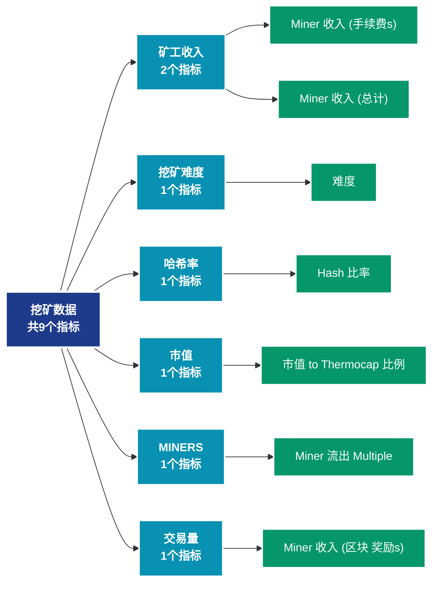

# 挖矿数据 (mining)

## 📝 类别描述

挖矿行业全景数据，包括算力、难度、矿工收入、区块奖励等挖矿相关指标。

## 📊 指标概览

本类别共包含 **9** 个指标，涵盖以下主要子类别：

| 子类别 | 指标数量 | 主要功能 |
|--------|----------|----------|
| 矿工收入 | 2 | 专门数据分析 |
| 挖矿难度 | 1 | 专门数据分析 |
| 哈希率 | 1 | 专门数据分析 |
| 市值 | 1 | 专门数据分析 |
| MINERS | 1 | 专门数据分析 |
| 交易量 | 1 | 专门数据分析 |
| 供应量分布 | 1 | 供应量分布统计 |
| OTHER | 1 | 专门数据分析 |

## 🎨 指标体系结构图



## 📂 详细指标说明

### 📊 矿工收入（2个指标）

本子类别包含以下详细指标：

#### 1. Miner 收入 (手续费s)

- **指标代码**: `revenue_from_fees`
- **API路径**: `/v1/metrics/mining/revenue_from_fees`
- **英文名称**: Miner Revenue (Fees)

**英文原文：**
The percentage of miner revenue derived from fees, i.e. fees divided by fees plus minted coins.

**中文解释：**
分析网络费用市场的动态。费用数据揭示了区块空间的稀缺性、用户的紧急程度和网络的经济可持续性。通过费用分析，可以优化交易时机，评估网络的采用程度。

**使用示例**：
```python
# 获取Miner 收入 (手续费s)数据
df = client.get_metric(
    "/v1/metrics/mining/revenue_from_fees",
    asset="BTC",
    resolution="24h"
)
```

---

#### 2. Miner 收入 (总计)

- **指标代码**: `revenue_sum`
- **API路径**: `/v1/metrics/mining/revenue_sum`
- **英文名称**: Miner Revenue (Total)

**英文原文：**
The total miner revenue, i.e. fees plus newly minted coins.

**中文解释：**
分析Miner Revenue (Total)相关的链上数据。这个指标通过追踪区块链上的实时数据，提供了传统金融分析无法获得的透明度和洞察力。链上数据的优势在于：1）数据真实可验证；2）实时更新无延迟；3）覆盖所有参与者。通过综合分析多个链上指标，投资者可以做出更明智的决策，研究人员可以深入理解市场机制。

**使用示例**：
```python
# 获取Miner 收入 (总计)数据
df = client.get_metric(
    "/v1/metrics/mining/revenue_sum",
    asset="BTC",
    resolution="24h"
)
```

---

### 📊 挖矿难度（1个指标）

本子类别包含以下详细指标：

#### 1. 难度

- **指标代码**: `difficulty_latest`
- **API路径**: `/v1/metrics/mining/difficulty_latest`
- **英文名称**: Difficulty

**英文原文：**
The current estimated number of hashes required to mine a block. Note:  difficulty is often denoted as the relative difficulty with respect to the genesis block, which required approximately 2^32 hashes. For better comparison across blockchains, our values are denoted in raw hashes.

**中文解释：**
分析Difficulty相关的链上数据。这个指标通过追踪区块链上的实时数据，提供了传统金融分析无法获得的透明度和洞察力。链上数据的优势在于：1）数据真实可验证；2）实时更新无延迟；3）覆盖所有参与者。通过综合分析多个链上指标，投资者可以做出更明智的决策，研究人员可以深入理解市场机制。

**使用示例**：
```python
# 获取难度数据
df = client.get_metric(
    "/v1/metrics/mining/difficulty_latest",
    asset="BTC",
    resolution="24h"
)
```

---

### 📊 哈希率（1个指标）

本子类别包含以下详细指标：

#### 1. Hash 比率

- **指标代码**: `hash_rate_mean`
- **API路径**: `/v1/metrics/mining/hash_rate_mean`
- **英文名称**: Hash Rate

**英文原文：**
The average estimated number of hashes per second produced by the miners in the network.

**中文解释：**
衡量全网的总计算能力，以每秒哈希运算次数表示。哈希率是网络安全性的直接指标：1）高哈希率意味着攻击网络的成本极高；2）哈希率增长表明矿工对未来有信心；3）哈希率下降可能因为挖矿不再盈利。哈希率与价格通常存在正相关关系。

**使用示例**：
```python
# 获取Hash 比率数据
df = client.get_metric(
    "/v1/metrics/mining/hash_rate_mean",
    asset="BTC",
    resolution="24h"
)
```

---

### 📊 市值（1个指标）

本子类别包含以下详细指标：

#### 1. 市值 to Thermocap 比例

- **指标代码**: `marketcap_thermocap_ratio`
- **API路径**: `/v1/metrics/mining/marketcap_thermocap_ratio`
- **英文名称**: Market Cap to Thermocap Ratio

**英文原文：**
The Market Cap to Thermocap Ratio is simply defined as Market cap / Thermocap, and can be used to assess if the asset&#x27;s price is currently trading at a premium with respect to total security spend by miners. The ratio is adjusted to account for the increasing circulating supply over time.

**中文解释：**
追踪市场价格和估值指标。市场数据提供价格发现、估值参考和市场情绪评估。通过结合链上数据和市场数据，可以获得更全面的市场洞察。

**使用示例**：
```python
# 获取市值 to Thermocap 比例数据
df = client.get_metric(
    "/v1/metrics/mining/marketcap_thermocap_ratio",
    asset="BTC",
    resolution="24h"
)
```

---

### 📊 MINERS（1个指标）

本子类别包含以下详细指标：

#### 1. Miner 流出 Multiple

- **指标代码**: `miners_outflow_multiple`
- **API路径**: `/v1/metrics/mining/miners_outflow_multiple`
- **英文名称**: Miner Outflow Multiple

**英文原文：**
The Miner Outflow Multiple indicates periods where the amount of bitcoins flowing out of miner addresses is high with respect to its historical average. It is defined as the ratio of the miners&#x27; outflow and its 365 day MA (in USD).

**中文解释：**
分析Miner Outflow Multiple相关的链上数据。这个指标通过追踪区块链上的实时数据，提供了传统金融分析无法获得的透明度和洞察力。链上数据的优势在于：1）数据真实可验证；2）实时更新无延迟；3）覆盖所有参与者。通过综合分析多个链上指标，投资者可以做出更明智的决策，研究人员可以深入理解市场机制。

**使用示例**：
```python
# 获取Miner 流出 Multiple数据
df = client.get_metric(
    "/v1/metrics/mining/miners_outflow_multiple",
    asset="BTC",
    resolution="24h"
)
```

---

### 📊 交易量（1个指标）

本子类别包含以下详细指标：

#### 1. Miner 收入 (区块 奖励s)

- **指标代码**: `volume_mined_sum`
- **API路径**: `/v1/metrics/mining/volume_mined_sum`
- **英文名称**: Miner Revenue (Block Rewards)

**英文原文：**
The total amount of newly minted coins, i.e. block rewards.

**中文解释：**
分析Miner Revenue (Block Rewards)相关的链上数据。这个指标通过追踪区块链上的实时数据，提供了传统金融分析无法获得的透明度和洞察力。链上数据的优势在于：1）数据真实可验证；2）实时更新无延迟；3）覆盖所有参与者。通过综合分析多个链上指标，投资者可以做出更明智的决策，研究人员可以深入理解市场机制。

**使用示例**：
```python
# 获取Miner 收入 (区块 奖励s)数据
df = client.get_metric(
    "/v1/metrics/mining/volume_mined_sum",
    asset="BTC",
    resolution="24h"
)
```

---

### 📊 供应量分布（1个指标）

本子类别包含以下详细指标：

#### 1. Miner Unspent 供应量

- **指标代码**: `miners_unspent_supply`
- **API路径**: `/v1/metrics/mining/miners_unspent_supply`
- **英文名称**: Miner Unspent Supply

**英文原文：**
The total amount of coins in coinbase transactions that have never been moved.

**中文解释：**
分析Miner Unspent Supply相关的链上数据。这个指标通过追踪区块链上的实时数据，提供了传统金融分析无法获得的透明度和洞察力。链上数据的优势在于：1）数据真实可验证；2）实时更新无延迟；3）覆盖所有参与者。通过综合分析多个链上指标，投资者可以做出更明智的决策，研究人员可以深入理解市场机制。

**使用示例**：
```python
# 获取Miner Unspent 供应量数据
df = client.get_metric(
    "/v1/metrics/mining/miners_unspent_supply",
    asset="BTC",
    resolution="24h"
)
```

---

### 📊 OTHER（1个指标）

本子类别包含以下详细指标：

#### 1. Thermocap

- **指标代码**: `thermocap`
- **API路径**: `/v1/metrics/mining/thermocap`
- **英文名称**: Thermocap

**英文原文：**
Aggregate security spend, or "Thermocap", is the aggregated amount of coins paid to miners and serves as a proxy to mining resources spent. It serves as a measure of the true capital flow into the network and is computed as the aggregate coinbase transactions multiplied by the price in USD at the time they were mined. This metric was first put forth by Nic Carter.

**中文解释：**
分析Thermocap相关的链上数据。这个指标通过追踪区块链上的实时数据，提供了传统金融分析无法获得的透明度和洞察力。链上数据的优势在于：1）数据真实可验证；2）实时更新无延迟；3）覆盖所有参与者。通过综合分析多个链上指标，投资者可以做出更明智的决策，研究人员可以深入理解市场机制。

**使用示例**：
```python
# 获取Thermocap数据
df = client.get_metric(
    "/v1/metrics/mining/thermocap",
    asset="BTC",
    resolution="24h"
)
```

---

## 📊 完整指标列表

| # | 指标名称 | 指标代码 | API路径 |
|---|----------|----------|---------|
| 1 | 难度 | `difficulty_latest` | `/v1/metrics/mining/difficulty_latest` |
| 2 | Hash 比率 | `hash_rate_mean` | `/v1/metrics/mining/hash_rate_mean` |
| 3 | 市值 to Thermocap 比例 | `marketcap_thermocap_ratio` | `/v1/metrics/mining/marketcap_thermocap_ratio` |
| 4 | Miner 流出 Multiple | `miners_outflow_multiple` | `/v1/metrics/mining/miners_outflow_multiple` |
| 5 | Miner 收入 (区块 奖励s) | `volume_mined_sum` | `/v1/metrics/mining/volume_mined_sum` |
| 6 | Miner 收入 (手续费s) | `revenue_from_fees` | `/v1/metrics/mining/revenue_from_fees` |
| 7 | Miner 收入 (总计) | `revenue_sum` | `/v1/metrics/mining/revenue_sum` |
| 8 | Miner Unspent 供应量 | `miners_unspent_supply` | `/v1/metrics/mining/miners_unspent_supply` |
| 9 | Thermocap | `thermocap` | `/v1/metrics/mining/thermocap` |

## 💻 代码示例

### Python SDK 使用示例

```python
from glassnode import GlassnodeClient

# 初始化客户端
client = GlassnodeClient(api_key="YOUR_API_KEY")

# 获取单个指标
data = client.get(
    "/v1/metrics/addresses/active_count",
    asset="BTC",
    resolution="24h",
    since="2024-01-01"
)

# 批量获取多个指标
metrics = [
    "active_count",
    "new",
    "non_zero_count"
]

results = {}
for metric in metrics:
    results[metric] = client.get(
        f"/v1/metrics/addresses/{metric}",
        asset="BTC"
    )
```

## 📚 参考资源

- [Glassnode官方文档](https://docs.glassnode.com)
- [Glassnode Studio](https://studio.glassnode.com)
- [API访问说明](https://docs.glassnode.com/basic-api/api)

---

*最后更新：2024年*
