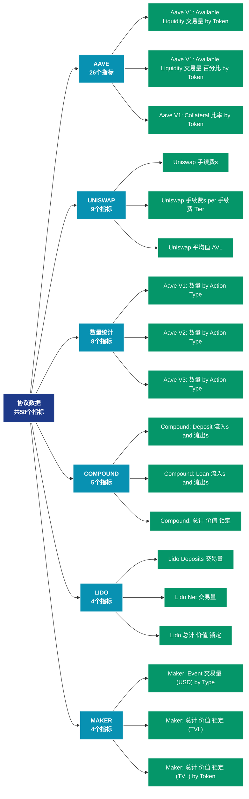

# 协议数据 (protocols)

## 📝 类别描述

各类协议的专属数据，包括特定协议的使用量、锁定量等。

## 📊 指标概览

本类别共包含 **58** 个指标，涵盖以下主要子类别：

| 子类别 | 指标数量 | 主要功能 |
|--------|----------|----------|
| AAVE | 26 | 专门数据分析 |
| UNISWAP | 9 | 专门数据分析 |
| 数量统计 | 8 | 专门数据分析 |
| COMPOUND | 5 | 专门数据分析 |
| LIDO | 4 | 专门数据分析 |
| MAKER | 4 | 专门数据分析 |
| 新增地址 | 1 | 新增用户和采用度 |
| 余额分析 | 1 | 地址余额分布和变化 |

## 🎨 指标体系结构图



## 📂 详细指标说明

### 📊 AAVE（26个指标）

本子类别包含以下详细指标：

#### 1. Aave V1: Available Liquidity 交易量 by Token

- **指标代码**: `aave_v1_available_liquidity_sum_by_token`
- **API路径**: `/v1/metrics/protocols/aave_v1_available_liquidity_sum_by_token`
- **英文名称**: Aave V1: Available Liquidity Volume by Token

**英文原文：**
This metric shows the total amount of liquidity available for each token on the version 1 of the Aave platform, allowing users to assess the depth of the market and the potential ease of borrowing or supplying assets. Users may not be able to withdraw funds if the liquidity drops too far. This means that they would need to wait until more liquidity is deposited by other users to be able to borrow or withdraw funds.

**中文解释：**
分析Aave V1: Available Liquidity Volume by Token相关的链上数据。这个指标通过追踪区块链上的实时数据，提供了传统金融分析无法获得的透明度和洞察力。链上数据的优势在于：1）数据真实可验证；2）实时更新无延迟；3）覆盖所有参与者。通过综合分析多个链上指标，投资者可以做出更明智的决策，研究人员可以深入理解市场机制。

**使用示例**：
```python
# 获取Aave V1: Available Liquidity 交易量 by Token数据
df = client.get_metric(
    "/v1/metrics/protocols/aave_v1_available_liquidity_sum_by_token",
    asset="BTC",
    resolution="24h"
)
```

---

#### 2. Aave V1: Available Liquidity 交易量 百分比 by Token

- **指标代码**: `aave_v1_available_liquidity_perc_by_token`
- **API路径**: `/v1/metrics/protocols/aave_v1_available_liquidity_perc_by_token`
- **英文名称**: Aave V1: Available Liquidity Volume Percentage by Token

**英文原文：**
This metric represents the percentage of available liquidity for each token on the version 1 of the Aave platform relative to the total available liquidity across all tokens. It provides insights into the distribution of liquidity and the prominence of individual tokens within the platform.

**中文解释：**
分析Aave V1: Available Liquidity Volume Percentage by Token相关的链上数据。这个指标通过追踪区块链上的实时数据，提供了传统金融分析无法获得的透明度和洞察力。链上数据的优势在于：1）数据真实可验证；2）实时更新无延迟；3）覆盖所有参与者。通过综合分析多个链上指标，投资者可以做出更明智的决策，研究人员可以深入理解市场机制。

**使用示例**：
```python
# 获取Aave V1: Available Liquidity 交易量 百分比 by Token数据
df = client.get_metric(
    "/v1/metrics/protocols/aave_v1_available_liquidity_perc_by_token",
    asset="BTC",
    resolution="24h"
)
```

---

#### 3. Aave V1: Collateral 比率 by Token

- **指标代码**: `aave_v1_collateral_rate_by_token`
- **API路径**: `/v1/metrics/protocols/aave_v1_collateral_rate_by_token`
- **英文名称**: Aave V1: Collateral Rate by Token

**英文原文：**
This metric represents the interest rate paid to users who provide collateral for each token on the version 1 of the Aave platform. It allows users to compare the rates they can earn when supplying different tokens as collateral, enabling them to make informed decisions when participating in the lending market. Aave&#x27;s interest rate algorithm is calibrated to manage liquidity risk and optimise utilisation.

**中文解释：**
分析Aave V1: Collateral Rate by Token相关的链上数据。这个指标通过追踪区块链上的实时数据，提供了传统金融分析无法获得的透明度和洞察力。链上数据的优势在于：1）数据真实可验证；2）实时更新无延迟；3）覆盖所有参与者。通过综合分析多个链上指标，投资者可以做出更明智的决策，研究人员可以深入理解市场机制。

**使用示例**：
```python
# 获取Aave V1: Collateral 比率 by Token数据
df = client.get_metric(
    "/v1/metrics/protocols/aave_v1_collateral_rate_by_token",
    asset="BTC",
    resolution="24h"
)
```

---

#### 4. Aave V1: Fixed Borrow 比率 by Token

- **指标代码**: `aave_v1_stable_borrow_rate_by_token`
- **API路径**: `/v1/metrics/protocols/aave_v1_stable_borrow_rate_by_token`
- **英文名称**: Aave V1: Fixed Borrow Rate by Token

**英文原文：**
This metric displays the stable borrow rate for each token on the  version 1 of the Aave platform. The stable borrow rate is a fixed interest rate that users can choose when borrowing assets, offering predictable repayment costs over the loan&#x27;s duration. Aave&#x27;s interest rate algorithm is calibrated to manage liquidity risk and optimise utilisation.

**中文解释：**
分析Aave V1: Fixed Borrow Rate by Token相关的链上数据。这个指标通过追踪区块链上的实时数据，提供了传统金融分析无法获得的透明度和洞察力。链上数据的优势在于：1）数据真实可验证；2）实时更新无延迟；3）覆盖所有参与者。通过综合分析多个链上指标，投资者可以做出更明智的决策，研究人员可以深入理解市场机制。

**使用示例**：
```python
# 获取Aave V1: Fixed Borrow 比率 by Token数据
df = client.get_metric(
    "/v1/metrics/protocols/aave_v1_stable_borrow_rate_by_token",
    asset="BTC",
    resolution="24h"
)
```

---

#### 5. Aave V1: Variable Borrow 比率 by Token

- **指标代码**: `aave_v1_variable_borrow_rate_by_token`
- **API路径**: `/v1/metrics/protocols/aave_v1_variable_borrow_rate_by_token`
- **英文名称**: Aave V1: Variable Borrow Rate by Token

**英文原文：**
This metric displays the variable borrow rate for each token on the version 1 of the Aave platform. The variable borrow rate is an interest rate that changes with market conditions, providing users with potentially lower borrowing costs but increased risk due to rate fluctuations. Aave&#x27;s interest rate algorithm is calibrated to manage liquidity risk and optimise utilisation.

**中文解释：**
分析Aave V1: Variable Borrow Rate by Token相关的链上数据。这个指标通过追踪区块链上的实时数据，提供了传统金融分析无法获得的透明度和洞察力。链上数据的优势在于：1）数据真实可验证；2）实时更新无延迟；3）覆盖所有参与者。通过综合分析多个链上指标，投资者可以做出更明智的决策，研究人员可以深入理解市场机制。

**使用示例**：
```python
# 获取Aave V1: Variable Borrow 比率 by Token数据
df = client.get_metric(
    "/v1/metrics/protocols/aave_v1_variable_borrow_rate_by_token",
    asset="BTC",
    resolution="24h"
)
```

---

#### 6. Aave V1: 交易量 by Action Type

- **指标代码**: `aave_v1_volume_sum_by_action`
- **API路径**: `/v1/metrics/protocols/aave_v1_volume_sum_by_action`
- **英文名称**: Aave V1: Volume by Action Type

**英文原文：**
The total cumulative volume of all activities performed within the version 1 of the Aave protocol. This includes the volume of deposits, withdrawals, stable borrows, variable borrows, repays, debt liquidations, collateral liquidations (receiving the underlying token or the aToken) and flash loans.
Stacked Volume represents the overall magnitude of the financial transactions that have taken place within the Aave protocol and can provide insight into the overall growth and usage of the platform.

**中文解释：**
分析Aave V1: Volume by Action Type相关的链上数据。这个指标通过追踪区块链上的实时数据，提供了传统金融分析无法获得的透明度和洞察力。链上数据的优势在于：1）数据真实可验证；2）实时更新无延迟；3）覆盖所有参与者。通过综合分析多个链上指标，投资者可以做出更明智的决策，研究人员可以深入理解市场机制。

**使用示例**：
```python
# 获取Aave V1: 交易量 by Action Type数据
df = client.get_metric(
    "/v1/metrics/protocols/aave_v1_volume_sum_by_action",
    asset="BTC",
    resolution="24h"
)
```

---

#### 7. Aave V2: Activity-Based 总计 价值 锁定 (TVL)

- **指标代码**: `aave_v2_total_value_locked_sum`
- **API路径**: `/v1/metrics/protocols/aave_v2_total_value_locked_sum`
- **英文名称**: Aave V2: Activity-Based Total Value Locked (TVL)

**英文原文：**
This metric indicates the total value of assets locked on the version 2 of the Aave platform, broken down into available liquidity, stable borrows, and variable borrows. This representation allows for visualization of the amounts of these components within the total value locked, addressing the fact that borrows might not always be considered when computing the total value locked. It reflects the overall usage and popularity of the platform.

**中文解释：**
分析Aave V2: Activity-Based Total Value Locked (TVL)相关的链上数据。这个指标通过追踪区块链上的实时数据，提供了传统金融分析无法获得的透明度和洞察力。链上数据的优势在于：1）数据真实可验证；2）实时更新无延迟；3）覆盖所有参与者。通过综合分析多个链上指标，投资者可以做出更明智的决策，研究人员可以深入理解市场机制。

**使用示例**：
```python
# 获取Aave V2: Activity-Based 总计 价值 锁定 (TVL)数据
df = client.get_metric(
    "/v1/metrics/protocols/aave_v2_total_value_locked_sum",
    asset="BTC",
    resolution="24h"
)
```

---

#### 8. Aave V2: Activity-Based 总计 价值 锁定 (TVL) 百分比 Share

- **指标代码**: `aave_v2_total_value_locked_perc`
- **API路径**: `/v1/metrics/protocols/aave_v2_total_value_locked_perc`
- **英文名称**: Aave V2: Activity-Based Total Value Locked (TVL) Percentage Share

**英文原文：**
This metric displays the proportion of the total value locked in the version 2 of the Aave platform, broken down into available liquidity, stable borrows, and variable borrows. This representation allows for visualization of the proportions of these components within the total value locked, addressing the fact that borrows might not always be considered when computing the total value locked. It reflects the overall usage and popularity of the platform.

**中文解释：**
分析Aave V2: Activity-Based Total Value Locked (TVL) Percentage Share相关的链上数据。这个指标通过追踪区块链上的实时数据，提供了传统金融分析无法获得的透明度和洞察力。链上数据的优势在于：1）数据真实可验证；2）实时更新无延迟；3）覆盖所有参与者。通过综合分析多个链上指标，投资者可以做出更明智的决策，研究人员可以深入理解市场机制。

**使用示例**：
```python
# 获取Aave V2: Activity-Based 总计 价值 锁定 (TVL) 百分比 Share数据
df = client.get_metric(
    "/v1/metrics/protocols/aave_v2_total_value_locked_perc",
    asset="BTC",
    resolution="24h"
)
```

---

#### 9. Aave V2: Available Liquidity 百分比 Share by Token

- **指标代码**: `aave_v2_available_liquidity_perc_by_token`
- **API路径**: `/v1/metrics/protocols/aave_v2_available_liquidity_perc_by_token`
- **英文名称**: Aave V2: Available Liquidity Percentage Share by Token

**英文原文：**
This metric represents the percentage of available liquidity for each token on the version 2 of the Aave platform relative to the total available liquidity across all tokens. It provides insights into the distribution of liquidity and the prominence of individual tokens within the platform.

**中文解释：**
分析Aave V2: Available Liquidity Percentage Share by Token相关的链上数据。这个指标通过追踪区块链上的实时数据，提供了传统金融分析无法获得的透明度和洞察力。链上数据的优势在于：1）数据真实可验证；2）实时更新无延迟；3）覆盖所有参与者。通过综合分析多个链上指标，投资者可以做出更明智的决策，研究人员可以深入理解市场机制。

**使用示例**：
```python
# 获取Aave V2: Available Liquidity 百分比 Share by Token数据
df = client.get_metric(
    "/v1/metrics/protocols/aave_v2_available_liquidity_perc_by_token",
    asset="BTC",
    resolution="24h"
)
```

---

#### 10. Aave V2: Available Liquidity 交易量 by Token

- **指标代码**: `aave_v2_available_liquidity_sum_by_token`
- **API路径**: `/v1/metrics/protocols/aave_v2_available_liquidity_sum_by_token`
- **英文名称**: Aave V2: Available Liquidity Volume by Token

**英文原文：**
This metric shows the total amount of liquidity available for each token on the version 2 of the Aave platform, allowing users to assess the depth of the market and the potential ease of borrowing or supplying assets. Users may not be able to withdraw funds if the liquidity drops too far. This means that they would need to wait until more liquidity is deposited by other users to be able to borrow or withdraw funds.

**中文解释：**
分析Aave V2: Available Liquidity Volume by Token相关的链上数据。这个指标通过追踪区块链上的实时数据，提供了传统金融分析无法获得的透明度和洞察力。链上数据的优势在于：1）数据真实可验证；2）实时更新无延迟；3）覆盖所有参与者。通过综合分析多个链上指标，投资者可以做出更明智的决策，研究人员可以深入理解市场机制。

**使用示例**：
```python
# 获取Aave V2: Available Liquidity 交易量 by Token数据
df = client.get_metric(
    "/v1/metrics/protocols/aave_v2_available_liquidity_sum_by_token",
    asset="BTC",
    resolution="24h"
)
```

---

#### 11. Aave V2: Borrow 交易量 by Token

- **指标代码**: `aave_v2_borrows_sum_by_token`
- **API路径**: `/v1/metrics/protocols/aave_v2_borrows_sum_by_token`
- **英文名称**: Aave V2: Borrow Volume by Token

**英文原文：**
This metric displays the total amount of assets borrowed for each token on the version 2 of the Aave platform, providing insights into the borrowing demand for individual tokens and the overall usage of the platform.

**中文解释：**
分析Aave V2: Borrow Volume by Token相关的链上数据。这个指标通过追踪区块链上的实时数据，提供了传统金融分析无法获得的透明度和洞察力。链上数据的优势在于：1）数据真实可验证；2）实时更新无延迟；3）覆盖所有参与者。通过综合分析多个链上指标，投资者可以做出更明智的决策，研究人员可以深入理解市场机制。

**使用示例**：
```python
# 获取Aave V2: Borrow 交易量 by Token数据
df = client.get_metric(
    "/v1/metrics/protocols/aave_v2_borrows_sum_by_token",
    asset="BTC",
    resolution="24h"
)
```

---

#### 12. Aave V2: Borrow 交易量 Share 百分比 by Token

- **指标代码**: `aave_v2_borrows_perc_by_token`
- **API路径**: `/v1/metrics/protocols/aave_v2_borrows_perc_by_token`
- **英文名称**: Aave V2: Borrow Volume Share Percentage by Token

**英文原文：**
This metric shows the percentage of borrowed assets for each token on the version 2 of the Aave platform relative to the total borrowed assets across all tokens. It offers insights into the borrowing demand distribution and the relative popularity of individual tokens within the borrowing market on the platform.

**中文解释：**
分析Aave V2: Borrow Volume Share Percentage by Token相关的链上数据。这个指标通过追踪区块链上的实时数据，提供了传统金融分析无法获得的透明度和洞察力。链上数据的优势在于：1）数据真实可验证；2）实时更新无延迟；3）覆盖所有参与者。通过综合分析多个链上指标，投资者可以做出更明智的决策，研究人员可以深入理解市场机制。

**使用示例**：
```python
# 获取Aave V2: Borrow 交易量 Share 百分比 by Token数据
df = client.get_metric(
    "/v1/metrics/protocols/aave_v2_borrows_perc_by_token",
    asset="BTC",
    resolution="24h"
)
```

---

#### 13. Aave V2: Collateral 比率 by Token

- **指标代码**: `aave_v2_collateral_rate_by_token`
- **API路径**: `/v1/metrics/protocols/aave_v2_collateral_rate_by_token`
- **英文名称**: Aave V2: Collateral Rate by Token

**英文原文：**
This metric represents the interest rate paid to users who provide collateral for each token on the version 2 of the Aave platform. It allows users to compare the rates they can earn when supplying different tokens as collateral, enabling them to make informed decisions when participating in the lending market.. Aave&#x27;s interest rate algorithm is calibrated to manage liquidity risk and optimise utilisation.

**中文解释：**
分析Aave V2: Collateral Rate by Token相关的链上数据。这个指标通过追踪区块链上的实时数据，提供了传统金融分析无法获得的透明度和洞察力。链上数据的优势在于：1）数据真实可验证；2）实时更新无延迟；3）覆盖所有参与者。通过综合分析多个链上指标，投资者可以做出更明智的决策，研究人员可以深入理解市场机制。

**使用示例**：
```python
# 获取Aave V2: Collateral 比率 by Token数据
df = client.get_metric(
    "/v1/metrics/protocols/aave_v2_collateral_rate_by_token",
    asset="BTC",
    resolution="24h"
)
```

---

#### 14. Aave V2: Fixed Borrow 比率 by Token

- **指标代码**: `aave_v2_stable_borrow_rate_by_token`
- **API路径**: `/v1/metrics/protocols/aave_v2_stable_borrow_rate_by_token`
- **英文名称**: Aave V2: Fixed Borrow Rate by Token

**英文原文：**
This metric displays the stable borrow rate for each token on the  version 2 of the Aave platform. The stable borrow rate is a fixed interest rate that users can choose when borrowing assets, offering predictable repayment costs over the loan&#x27;s duration. Aave&#x27;s interest rate algorithm is calibrated to manage liquidity risk and optimise utilisation.

**中文解释：**
分析Aave V2: Fixed Borrow Rate by Token相关的链上数据。这个指标通过追踪区块链上的实时数据，提供了传统金融分析无法获得的透明度和洞察力。链上数据的优势在于：1）数据真实可验证；2）实时更新无延迟；3）覆盖所有参与者。通过综合分析多个链上指标，投资者可以做出更明智的决策，研究人员可以深入理解市场机制。

**使用示例**：
```python
# 获取Aave V2: Fixed Borrow 比率 by Token数据
df = client.get_metric(
    "/v1/metrics/protocols/aave_v2_stable_borrow_rate_by_token",
    asset="BTC",
    resolution="24h"
)
```

---

#### 15. Aave V2: Variable Borrow 比率 by Token

- **指标代码**: `aave_v2_variable_borrow_rate_by_token`
- **API路径**: `/v1/metrics/protocols/aave_v2_variable_borrow_rate_by_token`
- **英文名称**: Aave V2: Variable Borrow Rate by Token

**英文原文：**
This metric displays the variable borrow rate for each token on the version 2 of the Aave platform. The variable borrow rate is an interest rate that changes with market conditions, providing users with potentially lower borrowing costs but increased risk due to rate fluctuations. Aave&#x27;s interest rate algorithm is calibrated to manage liquidity risk and optimise utilisation.

**中文解释：**
分析Aave V2: Variable Borrow Rate by Token相关的链上数据。这个指标通过追踪区块链上的实时数据，提供了传统金融分析无法获得的透明度和洞察力。链上数据的优势在于：1）数据真实可验证；2）实时更新无延迟；3）覆盖所有参与者。通过综合分析多个链上指标，投资者可以做出更明智的决策，研究人员可以深入理解市场机制。

**使用示例**：
```python
# 获取Aave V2: Variable Borrow 比率 by Token数据
df = client.get_metric(
    "/v1/metrics/protocols/aave_v2_variable_borrow_rate_by_token",
    asset="BTC",
    resolution="24h"
)
```

---

#### 16. Aave V2: 交易量 by Action Type

- **指标代码**: `aave_v2_volume_sum_by_action`
- **API路径**: `/v1/metrics/protocols/aave_v2_volume_sum_by_action`
- **英文名称**: Aave V2: Volume by Action Type

**英文原文：**
The total cumulative volume of all activities performed within the version 2 of the Aave protocol. This includes the volume of deposits, withdrawals, stable borrows, variable borrows, repays, debt liquidations, collateral liquidations (receiving the underlying token or the aToken) and flash loans. Stacked Volume represents the overall magnitude of the financial transactions that have taken place within the Aave protocol and can provide insight into the overall growth and usage of the platform.

**中文解释：**
分析Aave V2: Volume by Action Type相关的链上数据。这个指标通过追踪区块链上的实时数据，提供了传统金融分析无法获得的透明度和洞察力。链上数据的优势在于：1）数据真实可验证；2）实时更新无延迟；3）覆盖所有参与者。通过综合分析多个链上指标，投资者可以做出更明智的决策，研究人员可以深入理解市场机制。

**使用示例**：
```python
# 获取Aave V2: 交易量 by Action Type数据
df = client.get_metric(
    "/v1/metrics/protocols/aave_v2_volume_sum_by_action",
    asset="BTC",
    resolution="24h"
)
```

---

#### 17. Aave V3: Activity-Based 总计 价值 锁定 (TVL)

- **指标代码**: `aave_v3_total_value_locked_sum`
- **API路径**: `/v1/metrics/protocols/aave_v3_total_value_locked_sum`
- **英文名称**: Aave V3: Activity-Based Total Value Locked (TVL)

**英文原文：**
This metric shows the total amount of liquidity available for each token on the version 3 of the Aave platform, allowing users to assess the depth of the market and the potential ease of borrowing or supplying assets. Users may not be able to withdraw funds if the liquidity drops too far. This means that they would need to wait until more liquidity is deposited by other users to be able to borrow or withdraw funds.

**中文解释：**
分析Aave V3: Activity-Based Total Value Locked (TVL)相关的链上数据。这个指标通过追踪区块链上的实时数据，提供了传统金融分析无法获得的透明度和洞察力。链上数据的优势在于：1）数据真实可验证；2）实时更新无延迟；3）覆盖所有参与者。通过综合分析多个链上指标，投资者可以做出更明智的决策，研究人员可以深入理解市场机制。

**使用示例**：
```python
# 获取Aave V3: Activity-Based 总计 价值 锁定 (TVL)数据
df = client.get_metric(
    "/v1/metrics/protocols/aave_v3_total_value_locked_sum",
    asset="BTC",
    resolution="24h"
)
```

---

#### 18. Aave V3: Activity-Based 总计 价值 锁定 (TVL) 百分比 Share

- **指标代码**: `aave_v3_total_value_locked_perc`
- **API路径**: `/v1/metrics/protocols/aave_v3_total_value_locked_perc`
- **英文名称**: Aave V3: Activity-Based Total Value Locked (TVL) Percentage Share

**英文原文：**
This metric represents the percentage of available liquidity for each token on the version 3 of the Aave platform relative to the total available liquidity across all tokens. It provides insights into the distribution of liquidity and the prominence of individual tokens within the platform.

**中文解释：**
分析Aave V3: Activity-Based Total Value Locked (TVL) Percentage Share相关的链上数据。这个指标通过追踪区块链上的实时数据，提供了传统金融分析无法获得的透明度和洞察力。链上数据的优势在于：1）数据真实可验证；2）实时更新无延迟；3）覆盖所有参与者。通过综合分析多个链上指标，投资者可以做出更明智的决策，研究人员可以深入理解市场机制。

**使用示例**：
```python
# 获取Aave V3: Activity-Based 总计 价值 锁定 (TVL) 百分比 Share数据
df = client.get_metric(
    "/v1/metrics/protocols/aave_v3_total_value_locked_perc",
    asset="BTC",
    resolution="24h"
)
```

---

#### 19. Aave V3: Available Liquidity 百分比 Share by Token

- **指标代码**: `aave_v3_available_liquidity_perc_by_token`
- **API路径**: `/v1/metrics/protocols/aave_v3_available_liquidity_perc_by_token`
- **英文名称**: Aave V3: Available Liquidity Percentage Share by Token

**英文原文：**
This metric shows the percentage of borrowed assets for each token on the version 3 of the Aave platform relative to the total borrowed assets across all tokens. It offers insights into the borrowing demand distribution and the relative popularity of individual tokens within the borrowing market on the platform.

**中文解释：**
分析Aave V3: Available Liquidity Percentage Share by Token相关的链上数据。这个指标通过追踪区块链上的实时数据，提供了传统金融分析无法获得的透明度和洞察力。链上数据的优势在于：1）数据真实可验证；2）实时更新无延迟；3）覆盖所有参与者。通过综合分析多个链上指标，投资者可以做出更明智的决策，研究人员可以深入理解市场机制。

**使用示例**：
```python
# 获取Aave V3: Available Liquidity 百分比 Share by Token数据
df = client.get_metric(
    "/v1/metrics/protocols/aave_v3_available_liquidity_perc_by_token",
    asset="BTC",
    resolution="24h"
)
```

---

#### 20. Aave V3: Available Liquidity 交易量 by Token

- **指标代码**: `aave_v3_available_liquidity_sum_by_token`
- **API路径**: `/v1/metrics/protocols/aave_v3_available_liquidity_sum_by_token`
- **英文名称**: Aave V3: Available Liquidity Volume by Token

**英文原文：**
This metric displays the total amount of assets borrowed for each token on the version 3 of the Aave platform, providing insights into the borrowing demand for individual tokens and the overall usage of the platform.

**中文解释：**
分析Aave V3: Available Liquidity Volume by Token相关的链上数据。这个指标通过追踪区块链上的实时数据，提供了传统金融分析无法获得的透明度和洞察力。链上数据的优势在于：1）数据真实可验证；2）实时更新无延迟；3）覆盖所有参与者。通过综合分析多个链上指标，投资者可以做出更明智的决策，研究人员可以深入理解市场机制。

**使用示例**：
```python
# 获取Aave V3: Available Liquidity 交易量 by Token数据
df = client.get_metric(
    "/v1/metrics/protocols/aave_v3_available_liquidity_sum_by_token",
    asset="BTC",
    resolution="24h"
)
```

---

#### 21. Aave V3: Borrow 交易量 by Token

- **指标代码**: `aave_v3_borrows_sum_by_token`
- **API路径**: `/v1/metrics/protocols/aave_v3_borrows_sum_by_token`
- **英文名称**: Aave V3: Borrow Volume by Token

**英文原文：**
This metric indicates the total value of assets locked on the version 3 of the Aave platform, broken down into available liquidity, stable borrows, and variable borrows. This representation allows for visualization of the amounts of these components within the total value locked, addressing the fact that borrows might not always be considered when computing the total value locked. It reflects the overall usage and popularity of the platform.

**中文解释：**
分析Aave V3: Borrow Volume by Token相关的链上数据。这个指标通过追踪区块链上的实时数据，提供了传统金融分析无法获得的透明度和洞察力。链上数据的优势在于：1）数据真实可验证；2）实时更新无延迟；3）覆盖所有参与者。通过综合分析多个链上指标，投资者可以做出更明智的决策，研究人员可以深入理解市场机制。

**使用示例**：
```python
# 获取Aave V3: Borrow 交易量 by Token数据
df = client.get_metric(
    "/v1/metrics/protocols/aave_v3_borrows_sum_by_token",
    asset="BTC",
    resolution="24h"
)
```

---

#### 22. Aave V3: Borrow 交易量 Share 百分比 by Token

- **指标代码**: `aave_v3_borrows_perc_by_token`
- **API路径**: `/v1/metrics/protocols/aave_v3_borrows_perc_by_token`
- **英文名称**: Aave V3: Borrow Volume Share Percentage by Token

**英文原文：**
This metric displays the proportion of the total value locked in the version 3 of the Aave platform, broken down into available liquidity, stable borrows, and variable borrows. This representation allows for visualization of the proportions of these components within the total value locked, addressing the fact that borrows might not always be considered when computing the total value locked. It reflects the overall usage and popularity of the platform.

**中文解释：**
分析Aave V3: Borrow Volume Share Percentage by Token相关的链上数据。这个指标通过追踪区块链上的实时数据，提供了传统金融分析无法获得的透明度和洞察力。链上数据的优势在于：1）数据真实可验证；2）实时更新无延迟；3）覆盖所有参与者。通过综合分析多个链上指标，投资者可以做出更明智的决策，研究人员可以深入理解市场机制。

**使用示例**：
```python
# 获取Aave V3: Borrow 交易量 Share 百分比 by Token数据
df = client.get_metric(
    "/v1/metrics/protocols/aave_v3_borrows_perc_by_token",
    asset="BTC",
    resolution="24h"
)
```

---

#### 23. Aave V3: Collateral 比率 by Token

- **指标代码**: `aave_v3_collateral_rate_by_token`
- **API路径**: `/v1/metrics/protocols/aave_v3_collateral_rate_by_token`
- **英文名称**: Aave V3: Collateral Rate by Token

**英文原文：**
This metric represents the interest rate paid to users who provide collateral for each token on the version 3 of the Aave platform. It allows users to compare the rates they can earn when supplying different tokens as collateral, enabling them to make informed decisions when participating in the lending market. Aave&#x27;s interest rate algorithm is calibrated to manage liquidity risk and optimise utilisation.

**中文解释：**
分析Aave V3: Collateral Rate by Token相关的链上数据。这个指标通过追踪区块链上的实时数据，提供了传统金融分析无法获得的透明度和洞察力。链上数据的优势在于：1）数据真实可验证；2）实时更新无延迟；3）覆盖所有参与者。通过综合分析多个链上指标，投资者可以做出更明智的决策，研究人员可以深入理解市场机制。

**使用示例**：
```python
# 获取Aave V3: Collateral 比率 by Token数据
df = client.get_metric(
    "/v1/metrics/protocols/aave_v3_collateral_rate_by_token",
    asset="BTC",
    resolution="24h"
)
```

---

#### 24. Aave V3: Stable Borrow 比率 by Token

- **指标代码**: `aave_v3_stable_borrow_rate_by_token`
- **API路径**: `/v1/metrics/protocols/aave_v3_stable_borrow_rate_by_token`
- **英文名称**: Aave V3: Stable Borrow Rate by Token

**英文原文：**
This metric displays the stable borrow rate for each token on the version 3 of the Aave platform. The stable borrow rate is a fixed interest rate that users can choose when borrowing assets, offering predictable repayment costs over the loan&#x27;s duration. Aave&#x27;s interest rate algorithm is calibrated to manage liquidity risk and optimise utilisation.

**中文解释：**
分析Aave V3: Stable Borrow Rate by Token相关的链上数据。这个指标通过追踪区块链上的实时数据，提供了传统金融分析无法获得的透明度和洞察力。链上数据的优势在于：1）数据真实可验证；2）实时更新无延迟；3）覆盖所有参与者。通过综合分析多个链上指标，投资者可以做出更明智的决策，研究人员可以深入理解市场机制。

**使用示例**：
```python
# 获取Aave V3: Stable Borrow 比率 by Token数据
df = client.get_metric(
    "/v1/metrics/protocols/aave_v3_stable_borrow_rate_by_token",
    asset="BTC",
    resolution="24h"
)
```

---

#### 25. Aave V3: Variable Borrow 比率 by Token

- **指标代码**: `aave_v3_variable_borrow_rate_by_token`
- **API路径**: `/v1/metrics/protocols/aave_v3_variable_borrow_rate_by_token`
- **英文名称**: Aave V3: Variable Borrow Rate by Token

**英文原文：**
This metric displays the variable borrow rate for each token on the version 3 of the Aave platform. The variable borrow rate is an interest rate that changes with market conditions, providing users with potentially lower borrowing costs but increased risk due to rate fluctuations. Aave&#x27;s interest rate algorithm is calibrated to manage liquidity risk and optimise utilisation.

**中文解释：**
分析Aave V3: Variable Borrow Rate by Token相关的链上数据。这个指标通过追踪区块链上的实时数据，提供了传统金融分析无法获得的透明度和洞察力。链上数据的优势在于：1）数据真实可验证；2）实时更新无延迟；3）覆盖所有参与者。通过综合分析多个链上指标，投资者可以做出更明智的决策，研究人员可以深入理解市场机制。

**使用示例**：
```python
# 获取Aave V3: Variable Borrow 比率 by Token数据
df = client.get_metric(
    "/v1/metrics/protocols/aave_v3_variable_borrow_rate_by_token",
    asset="BTC",
    resolution="24h"
)
```

---

#### 26. Aave V3: 交易量 by Action Type

- **指标代码**: `aave_v3_volume_sum_by_action`
- **API路径**: `/v1/metrics/protocols/aave_v3_volume_sum_by_action`
- **英文名称**: Aave V3: Volume by Action Type

**英文原文：**
The total cumulative volume of all activities performed within the version 3 of the Aave protocol. This includes the volume of deposits, withdrawals, stable borrows, variable borrows, repays, debt liquidations, collateral liquidations (receiving the underlying token or the aToken) and flash loans. Stacked Volume represents the overall magnitude of the financial transactions that have taken place within the Aave protocol and can provide insight into the overall growth and usage of the platform.

**中文解释：**
分析Aave V3: Volume by Action Type相关的链上数据。这个指标通过追踪区块链上的实时数据，提供了传统金融分析无法获得的透明度和洞察力。链上数据的优势在于：1）数据真实可验证；2）实时更新无延迟；3）覆盖所有参与者。通过综合分析多个链上指标，投资者可以做出更明智的决策，研究人员可以深入理解市场机制。

**使用示例**：
```python
# 获取Aave V3: 交易量 by Action Type数据
df = client.get_metric(
    "/v1/metrics/protocols/aave_v3_volume_sum_by_action",
    asset="BTC",
    resolution="24h"
)
```

---

### 📊 UNISWAP（9个指标）

本子类别包含以下详细指标：

#### 1. Uniswap 手续费s

- **指标代码**: `uniswap_fees_sum`
- **API路径**: `/v1/metrics/protocols/uniswap_fees_sum`
- **英文名称**: Uniswap Fees

**英文原文：**
This metric represents the cumulative value of transaction fees generated on the entire protocol as well as both Uniswap v2 and Uniswap v3, expressed in US Dollars.  Fees are collected from traders as a percentage of the trade value. They are used to reward liquidity providers for contributing assets to the liquidity pools. 

 This metric serves as an indicator of the platform&#x27;s overall trading activity and the potential returns for liquidity providers. A higher fee value reflects increased trading volume and engagement on the platform, signaling a more active and robust ecosystem. 

 To improve its accuracy, adjustments have been made by eliminating token reserves that showed signs of token price manipulation.

**中文解释：**
统计支付给矿工或验证者的总手续费。总费用反映：1）网络的安全预算；2）用户对区块空间的总需求；3）矿工/验证者的收入来源。在区块奖励减少的情况下，手续费将成为维护网络安全的主要激励。

**使用示例**：
```python
# 获取Uniswap 手续费s数据
df = client.get_metric(
    "/v1/metrics/protocols/uniswap_fees_sum",
    asset="BTC",
    resolution="24h"
)
```

---

#### 2. Uniswap 手续费s per 手续费 Tier

- **指标代码**: `uniswap_v3_fees_sum_by_fee_tier`
- **API路径**: `/v1/metrics/protocols/uniswap_v3_fees_sum_by_fee_tier`
- **英文名称**: Uniswap Fees per Fee Tier

**英文原文：**
The Uniswap Fees per Fee Tier metric represents the cumulative value of transaction fees generated for Uniswap v3 on the Ethereum blockchain, expressed in USD.  Fees are collected from traders during token swaps as a small percentage of the trade value. They are used to reward liquidity providers for contributing assets to the liquidity pools. 

 This metric serves as an indicator of the platform&#x27;s overall trading activity and the potential returns for liquidity providers. A higher fee value reflects increased trading volume and engagement on the platform, signaling a more active and robust ecosystem.  For each traded token-pair Uniswap allows for pools with four different trading fee tiers: 0.01, 0.3. This metric presents the total value of fees generated for a given fee tier on Uniswap V3. 

 To improve its accuracy, adjustments have been made by eliminating token reserves that showed signs of token price manipulation.

**中文解释：**
统计支付给矿工或验证者的总手续费。总费用反映：1）网络的安全预算；2）用户对区块空间的总需求；3）矿工/验证者的收入来源。在区块奖励减少的情况下，手续费将成为维护网络安全的主要激励。

**使用示例**：
```python
# 获取Uniswap 手续费s per 手续费 Tier数据
df = client.get_metric(
    "/v1/metrics/protocols/uniswap_v3_fees_sum_by_fee_tier",
    asset="BTC",
    resolution="24h"
)
```

---

#### 3. Uniswap 平均值 AVL

- **指标代码**: `uniswap_v3_avl_mean`
- **API路径**: `/v1/metrics/protocols/uniswap_v3_avl_mean`
- **英文名称**: Uniswap Mean AVL

**英文原文：**
The Active Value Locked (AVL) describes the share of the Uniswap liquiidty that is being actively used to facilitate trades. It helps measure capital efficiency on Uniswap. The mean AVL is determined by aggregating the amount of liquidity within price ticks of a specific pool that fall within the designated price range. 

 This metric presents the total of the AVL for Uniswap V3 pools. 

 To improve its accuracy, adjustments have been made by eliminating token reserves that showed signs of token price manipulation.

**中文解释：**
分析Uniswap Mean AVL相关的链上数据。这个指标通过追踪区块链上的实时数据，提供了传统金融分析无法获得的透明度和洞察力。链上数据的优势在于：1）数据真实可验证；2）实时更新无延迟；3）覆盖所有参与者。通过综合分析多个链上指标，投资者可以做出更明智的决策，研究人员可以深入理解市场机制。

**使用示例**：
```python
# 获取Uniswap 平均值 AVL数据
df = client.get_metric(
    "/v1/metrics/protocols/uniswap_v3_avl_mean",
    asset="BTC",
    resolution="24h"
)
```

---

#### 4. Uniswap 平均值 AVL per 手续费 Tier

- **指标代码**: `uniswap_v3_avl_by_fee_tier_mean`
- **API路径**: `/v1/metrics/protocols/uniswap_v3_avl_by_fee_tier_mean`
- **英文名称**: Uniswap Mean AVL per Fee Tier

**英文原文：**
The Active Value Locked (AVL) describes the share of the Uniswap liquiidty that is being actively used to facilitate trades. It helps measure capital efficiency on Uniswap. 

 The mean AVL is determined by aggregating the amount of liquidity within the price ticks of a specific pool that fall within the designated price range. 

 This metric presents the total of the AVL for a given fee tier on Uniswap V3.  For each traded token-pair Uniswap allows for pools with four different trading fees: 0.01, 0.3. 

  To improve its accuracy, adjustments have been made by eliminating token reserves that showed signs of token price manipulation.

**中文解释：**
计算网络交易费用的平均值。平均费用反映：1）网络的拥堵程度；2）用户的支付意愿；3）区块空间的供需关系。高费用期间，只有高价值交易才会上链；低费用期间，更多小额交易变得可行。费用市场是评估网络使用需求的重要指标。

**使用示例**：
```python
# 获取Uniswap 平均值 AVL per 手续费 Tier数据
df = client.get_metric(
    "/v1/metrics/protocols/uniswap_v3_avl_by_fee_tier_mean",
    asset="BTC",
    resolution="24h"
)
```

---

#### 5. Uniswap Trade 交易量

- **指标代码**: `uniswap_volume_traded_sum`
- **API路径**: `/v1/metrics/protocols/uniswap_volume_traded_sum`
- **英文名称**: Uniswap Trade Volume

**英文原文：**
Trade volume refers to the total value of all tokens traded on Uniswap, expressed in US Dollars. It accounts for the inflow volume into the protocol, representing trading activities for both the entire protocol and Uniswap&#x27;s version 2 and version 3.

**中文解释：**
分析Uniswap Trade Volume相关的链上数据。这个指标通过追踪区块链上的实时数据，提供了传统金融分析无法获得的透明度和洞察力。链上数据的优势在于：1）数据真实可验证；2）实时更新无延迟；3）覆盖所有参与者。通过综合分析多个链上指标，投资者可以做出更明智的决策，研究人员可以深入理解市场机制。

**使用示例**：
```python
# 获取Uniswap Trade 交易量数据
df = client.get_metric(
    "/v1/metrics/protocols/uniswap_volume_traded_sum",
    asset="BTC",
    resolution="24h"
)
```

---

#### 6. Uniswap Trade 交易量 per Token Type

- **指标代码**: `uniswap_volume_by_token_type`
- **API路径**: `/v1/metrics/protocols/uniswap_volume_by_token_type`
- **英文名称**: Uniswap Trade Volume per Token Type

**英文原文：**
Trade volume refers to the total value of all tokens traded on Uniswap, expressed in US Dollars. It accounts for the inflow volume into the protocol. This metric presents the trade volume per token type. Tokens are categorized into three groups: Bluechips (WBTC & WETH), Stablecoins and Altcoins.

**中文解释：**
分析Uniswap Trade Volume per Token Type相关的链上数据。这个指标通过追踪区块链上的实时数据，提供了传统金融分析无法获得的透明度和洞察力。链上数据的优势在于：1）数据真实可验证；2）实时更新无延迟；3）覆盖所有参与者。通过综合分析多个链上指标，投资者可以做出更明智的决策，研究人员可以深入理解市场机制。

**使用示例**：
```python
# 获取Uniswap Trade 交易量 per Token Type数据
df = client.get_metric(
    "/v1/metrics/protocols/uniswap_volume_by_token_type",
    asset="BTC",
    resolution="24h"
)
```

---

#### 7. Uniswap Trade 交易量 per Trade 大小

- **指标代码**: `uniswap_volume_by_size_cohort`
- **API路径**: `/v1/metrics/protocols/uniswap_volume_by_size_cohort`
- **英文名称**: Uniswap Trade Volume per Trade Size

**英文原文：**
Trade volume refers to the total value of all tokens traded on Uniswap, expressed in US dollars. It accounts for the inflow volume into the protocol. 

 This metrics represents the total trade volume for a given trade size.

**中文解释：**
分析Uniswap Trade Volume per Trade Size相关的链上数据。这个指标通过追踪区块链上的实时数据，提供了传统金融分析无法获得的透明度和洞察力。链上数据的优势在于：1）数据真实可验证；2）实时更新无延迟；3）覆盖所有参与者。通过综合分析多个链上指标，投资者可以做出更明智的决策，研究人员可以深入理解市场机制。

**使用示例**：
```python
# 获取Uniswap Trade 交易量 per Trade 大小数据
df = client.get_metric(
    "/v1/metrics/protocols/uniswap_volume_by_size_cohort",
    asset="BTC",
    resolution="24h"
)
```

---

#### 8. Uniswap TVL per 手续费 Tier

- **指标代码**: `uniswap_total_value_locked_by_fee_tier`
- **API路径**: `/v1/metrics/protocols/uniswap_total_value_locked_by_fee_tier`
- **英文名称**: Uniswap TVL per Fee Tier

**英文原文：**
The Total Value Locked (TVL) quantifies the value of all assets used as liquidity on Uniswap, it is denominated in US dollars.  It is calculated by summing the token amounts multiplied by their respective prices at each timestamp. 

 This metric presents the total of the TVL for a given fee tier on Uniswap V3. For each traded token-pair Uniswap allows for pools with four different trading fees: 0.01, 0.3.  

 To improve its accuracy, adjustments have been made by eliminating token reserves that showed signs of token price manipulation.

**中文解释：**
统计支付给矿工或验证者的总手续费。总费用反映：1）网络的安全预算；2）用户对区块空间的总需求；3）矿工/验证者的收入来源。在区块奖励减少的情况下，手续费将成为维护网络安全的主要激励。

**使用示例**：
```python
# 获取Uniswap TVL per 手续费 Tier数据
df = client.get_metric(
    "/v1/metrics/protocols/uniswap_total_value_locked_by_fee_tier",
    asset="BTC",
    resolution="24h"
)
```

---

#### 9. Uniswap: 总计 价值 锁定

- **指标代码**: `uniswap_total_value_locked`
- **API路径**: `/v1/metrics/protocols/uniswap_total_value_locked`
- **英文名称**: Uniswap: Total Value Locked

**英文原文：**
The Total Value Locked (TVL) quantifies the value of all assets used as liquidity on Uniswap, it is denominated in US dollars. TVL is often used to assess the health and strength of a DeFi protocol. The TVL is calculated by summing the token amounts multiplied by their respective prices at each timestamp. 

 This metric shows the Total Value Locked (TVL) for the entire protocol, as well as seperatly for Uniswap&#x27;s version 2 and version 3.

To improve its accuracy, adjustments have been made by eliminating token reserves that showed signs of token price manipulation.

**中文解释：**
分析Uniswap: Total Value Locked相关的链上数据。这个指标通过追踪区块链上的实时数据，提供了传统金融分析无法获得的透明度和洞察力。链上数据的优势在于：1）数据真实可验证；2）实时更新无延迟；3）覆盖所有参与者。通过综合分析多个链上指标，投资者可以做出更明智的决策，研究人员可以深入理解市场机制。

**使用示例**：
```python
# 获取Uniswap: 总计 价值 锁定数据
df = client.get_metric(
    "/v1/metrics/protocols/uniswap_total_value_locked",
    asset="BTC",
    resolution="24h"
)
```

---

### 📊 数量统计（8个指标）

本子类别包含以下详细指标：

#### 1. Aave V1: 数量 by Action Type

- **指标代码**: `aave_v1_count_by_action`
- **API路径**: `/v1/metrics/protocols/aave_v1_count_by_action`
- **英文名称**: Aave V1: Count by Action Type

**英文原文：**
The total cumulative count of all activities performed within the version 1 of the Aave protocol. This includes the count of deposits, withdrawals, stable borrows, variable borrows, repays, liquidations, flash loans, rebalance stable borrow rate, swaps to stable rate mode and swaps to variable rate mode.
Stacked Count represents the overall frequency of the financial transactions that have taken place within the Aave protocol and can provide insight into the overall usage and popularity of the platform.

**中文解释：**
分析Aave V1: Count by Action Type相关的链上数据。这个指标通过追踪区块链上的实时数据，提供了传统金融分析无法获得的透明度和洞察力。链上数据的优势在于：1）数据真实可验证；2）实时更新无延迟；3）覆盖所有参与者。通过综合分析多个链上指标，投资者可以做出更明智的决策，研究人员可以深入理解市场机制。

**使用示例**：
```python
# 获取Aave V1: 数量 by Action Type数据
df = client.get_metric(
    "/v1/metrics/protocols/aave_v1_count_by_action",
    asset="BTC",
    resolution="24h"
)
```

---

#### 2. Aave V2: 数量 by Action Type

- **指标代码**: `aave_v2_count_by_action`
- **API路径**: `/v1/metrics/protocols/aave_v2_count_by_action`
- **英文名称**: Aave V2: Count by Action Type

**英文原文：**
The total cumulative count of all activities performed within the version 2 of the Aave protocol. This includes the count of deposits, withdrawals, stable borrows, variable borrows, repays, liquidations, flash loans, rebalance stable borrow rate, swaps to stable rate mode and swaps to variable rate mode.
          Stacked Count represents the overall frequency of the financial transactions that have taken place within the Aave protocol and can provide insight into the overall usage and popularity of the platform.

**中文解释：**
分析Aave V2: Count by Action Type相关的链上数据。这个指标通过追踪区块链上的实时数据，提供了传统金融分析无法获得的透明度和洞察力。链上数据的优势在于：1）数据真实可验证；2）实时更新无延迟；3）覆盖所有参与者。通过综合分析多个链上指标，投资者可以做出更明智的决策，研究人员可以深入理解市场机制。

**使用示例**：
```python
# 获取Aave V2: 数量 by Action Type数据
df = client.get_metric(
    "/v1/metrics/protocols/aave_v2_count_by_action",
    asset="BTC",
    resolution="24h"
)
```

---

#### 3. Aave V3: 数量 by Action Type

- **指标代码**: `aave_v3_count_by_action`
- **API路径**: `/v1/metrics/protocols/aave_v3_count_by_action`
- **英文名称**: Aave V3: Count by Action Type

**英文原文：**
The total cumulative count of all activities performed within the version 3 of the Aave protocol. This includes the count of deposits, withdrawals, stable borrows, variable borrows, repays, liquidations, flash loans, rebalance stable borrow rate, swaps to stable rate mode and swaps to variable rate mode. Stacked Count represents the overall frequency of the financial transactions that have taken place within the Aave protocol and can provide insight into the overall usage and popularity of the platform.

**中文解释：**
分析Aave V3: Count by Action Type相关的链上数据。这个指标通过追踪区块链上的实时数据，提供了传统金融分析无法获得的透明度和洞察力。链上数据的优势在于：1）数据真实可验证；2）实时更新无延迟；3）覆盖所有参与者。通过综合分析多个链上指标，投资者可以做出更明智的决策，研究人员可以深入理解市场机制。

**使用示例**：
```python
# 获取Aave V3: 数量 by Action Type数据
df = client.get_metric(
    "/v1/metrics/protocols/aave_v3_count_by_action",
    asset="BTC",
    resolution="24h"
)
```

---

#### 4. Compound: User Interaction 数量 by Action Type

- **指标代码**: `compound_count_by_action`
- **API路径**: `/v1/metrics/protocols/compound_count_by_action`
- **英文名称**: Compound: User Interaction Count by Action Type

**英文原文：**
This metric counts the number of interactions users have with the Compound protocol, broken down by action type, including deposits, withdrawals, borrows, repays, and liquidations. It provides insights into the overall activity and user engagement with the platform, showing which actions are most prevalent.

**中文解释：**
分析Compound: User Interaction Count by Action Type相关的链上数据。这个指标通过追踪区块链上的实时数据，提供了传统金融分析无法获得的透明度和洞察力。链上数据的优势在于：1）数据真实可验证；2）实时更新无延迟；3）覆盖所有参与者。通过综合分析多个链上指标，投资者可以做出更明智的决策，研究人员可以深入理解市场机制。

**使用示例**：
```python
# 获取Compound: User Interaction 数量 by Action Type数据
df = client.get_metric(
    "/v1/metrics/protocols/compound_count_by_action",
    asset="BTC",
    resolution="24h"
)
```

---

#### 5. Maker: Event 数量 by Type

- **指标代码**: `maker_event_count_by_type`
- **API路径**: `/v1/metrics/protocols/maker_event_count_by_type`
- **英文名称**: Maker: Event Count by Type

**英文原文：**
This metric tallies the daily occurrences of the different event types within the Maker protocol: Deposits, Withdrawals, Borrows, Repays and Liquidations. By tracking the frequency of these events, stakeholders can gauge user engagement and the protocol&#x27;s operational dynamics, making it a reflection of the protocol&#x27;s health and activity.

**中文解释：**
分析Maker: Event Count by Type相关的链上数据。这个指标通过追踪区块链上的实时数据，提供了传统金融分析无法获得的透明度和洞察力。链上数据的优势在于：1）数据真实可验证；2）实时更新无延迟；3）覆盖所有参与者。通过综合分析多个链上指标，投资者可以做出更明智的决策，研究人员可以深入理解市场机制。

**使用示例**：
```python
# 获取Maker: Event 数量 by Type数据
df = client.get_metric(
    "/v1/metrics/protocols/maker_event_count_by_type",
    asset="BTC",
    resolution="24h"
)
```

---

#### 6. Uniswap Pools 创建

- **指标代码**: `uniswap_pools_created_count`
- **API路径**: `/v1/metrics/protocols/uniswap_pools_created_count`
- **英文名称**: Uniswap Pools Created

**英文原文：**
The total amount of pools created for the entire protocol as well as for Uniswap&#x27;s version 2 and version 3. 

 To improve its accuracy, adjustments have been made by eliminating token reserves that showed signs of token price manipulation.

**中文解释：**
分析Uniswap Pools Created相关的链上数据。这个指标通过追踪区块链上的实时数据，提供了传统金融分析无法获得的透明度和洞察力。链上数据的优势在于：1）数据真实可验证；2）实时更新无延迟；3）覆盖所有参与者。通过综合分析多个链上指标，投资者可以做出更明智的决策，研究人员可以深入理解市场机制。

**使用示例**：
```python
# 获取Uniswap Pools 创建数据
df = client.get_metric(
    "/v1/metrics/protocols/uniswap_pools_created_count",
    asset="BTC",
    resolution="24h"
)
```

---

#### 7. Uniswap Pools 创建 per 手续费 Tier

- **指标代码**: `uniswap_v3_pools_created_by_fee_tier_count`
- **API路径**: `/v1/metrics/protocols/uniswap_v3_pools_created_by_fee_tier_count`
- **英文名称**: Uniswap Pools Created per Fee Tier

**英文原文：**
This metric represents total amount of pools created per fee tier on Uniswap v3. 

  For each traded token-pair Uniswap allows for pools with four different trading fee tier: 0.01, 0.3.  

 To improve its accuracy, adjustments have been made by eliminating token reserves that showed signs of token price manipulation.

**中文解释：**
分析网络费用市场的动态。费用数据揭示了区块空间的稀缺性、用户的紧急程度和网络的经济可持续性。通过费用分析，可以优化交易时机，评估网络的采用程度。

**使用示例**：
```python
# 获取Uniswap Pools 创建 per 手续费 Tier数据
df = client.get_metric(
    "/v1/metrics/protocols/uniswap_v3_pools_created_by_fee_tier_count",
    asset="BTC",
    resolution="24h"
)
```

---

#### 8. Uniswap Trade 数量

- **指标代码**: `uniswap_trades_count`
- **API路径**: `/v1/metrics/protocols/uniswap_trades_count`
- **英文名称**: Uniswap Trade Count

**英文原文：**
The total number of trades for the entire protocol as well as for the two Uniswap&#x27;s version 2 and 3. 

 To improve its accuracy, adjustments have been made by eliminating token reserves that showed signs of token price manipulation.

**中文解释：**
分析Uniswap Trade Count相关的链上数据。这个指标通过追踪区块链上的实时数据，提供了传统金融分析无法获得的透明度和洞察力。链上数据的优势在于：1）数据真实可验证；2）实时更新无延迟；3）覆盖所有参与者。通过综合分析多个链上指标，投资者可以做出更明智的决策，研究人员可以深入理解市场机制。

**使用示例**：
```python
# 获取Uniswap Trade 数量数据
df = client.get_metric(
    "/v1/metrics/protocols/uniswap_trades_count",
    asset="BTC",
    resolution="24h"
)
```

---

### 📊 COMPOUND（5个指标）

本子类别包含以下详细指标：

#### 1. Compound: Deposit 流入s and 流出s

- **指标代码**: `compound_deposit_flow`
- **API路径**: `/v1/metrics/protocols/compound_deposit_flow`
- **英文名称**: Compound: Deposit Inflows and Outflows

**英文原文：**
This metric reflects the inflows and outflows of deposits in USD on the Compound protocol, aggregated by token. This provides a comprehensive view of the deposit behavior on the platform and indicates periods of depositing growth or contraction.

**中文解释：**
分析Compound: Deposit Inflows and Outflows相关的链上数据。这个指标通过追踪区块链上的实时数据，提供了传统金融分析无法获得的透明度和洞察力。链上数据的优势在于：1）数据真实可验证；2）实时更新无延迟；3）覆盖所有参与者。通过综合分析多个链上指标，投资者可以做出更明智的决策，研究人员可以深入理解市场机制。

**使用示例**：
```python
# 获取Compound: Deposit 流入s and 流出s数据
df = client.get_metric(
    "/v1/metrics/protocols/compound_deposit_flow",
    asset="BTC",
    resolution="24h"
)
```

---

#### 2. Compound: Loan 流入s and 流出s

- **指标代码**: `compound_loan_flow`
- **API路径**: `/v1/metrics/protocols/compound_loan_flow`
- **英文名称**: Compound: Loan Inflows and Outflows

**英文原文：**
This metric shows the inflows and outflows of loans in USD on the Compound protocol, aggregated by token. This provides a comprehensive view of the borrowing behavior on the platform and indicates periods of borrowing growth or contraction.

**中文解释：**
分析Compound: Loan Inflows and Outflows相关的链上数据。这个指标通过追踪区块链上的实时数据，提供了传统金融分析无法获得的透明度和洞察力。链上数据的优势在于：1）数据真实可验证；2）实时更新无延迟；3）覆盖所有参与者。通过综合分析多个链上指标，投资者可以做出更明智的决策，研究人员可以深入理解市场机制。

**使用示例**：
```python
# 获取Compound: Loan 流入s and 流出s数据
df = client.get_metric(
    "/v1/metrics/protocols/compound_loan_flow",
    asset="BTC",
    resolution="24h"
)
```

---

#### 3. Compound: 总计 价值 锁定

- **指标代码**: `compound_total_value_locked`
- **API路径**: `/v1/metrics/protocols/compound_total_value_locked`
- **英文名称**: Compound: Total Value Locked

**英文原文：**
This metric illustrates the total value in USD of all tokens accepted in the Compound protocol over its history, differentiating between deposits (discounting withdrawals) and loans (discounting repays). It provides a comprehensive view of the total assets secured in the protocol.

**中文解释：**
分析Compound: Total Value Locked相关的链上数据。这个指标通过追踪区块链上的实时数据，提供了传统金融分析无法获得的透明度和洞察力。链上数据的优势在于：1）数据真实可验证；2）实时更新无延迟；3）覆盖所有参与者。通过综合分析多个链上指标，投资者可以做出更明智的决策，研究人员可以深入理解市场机制。

**使用示例**：
```python
# 获取Compound: 总计 价值 锁定数据
df = client.get_metric(
    "/v1/metrics/protocols/compound_total_value_locked",
    asset="BTC",
    resolution="24h"
)
```

---

#### 4. Compound: User Interaction 交易量 by Action Type

- **指标代码**: `compound_volume_by_action`
- **API路径**: `/v1/metrics/protocols/compound_volume_by_action`
- **英文名称**: Compound: User Interaction Volume by Action Type

**英文原文：**
This metric illustrates the volume in USD of user interactions with the Compound protocol, segregated by action type. By quantifying the financial magnitude of each action, it offers insights into the economic significance of user behaviors, indicating which actions drive the most financial activity on the platform.

**中文解释：**
分析Compound: User Interaction Volume by Action Type相关的链上数据。这个指标通过追踪区块链上的实时数据，提供了传统金融分析无法获得的透明度和洞察力。链上数据的优势在于：1）数据真实可验证；2）实时更新无延迟；3）覆盖所有参与者。通过综合分析多个链上指标，投资者可以做出更明智的决策，研究人员可以深入理解市场机制。

**使用示例**：
```python
# 获取Compound: User Interaction 交易量 by Action Type数据
df = client.get_metric(
    "/v1/metrics/protocols/compound_volume_by_action",
    asset="BTC",
    resolution="24h"
)
```

---

#### 5. Compound: Utilization 比例

- **指标代码**: `compound_utilization_ratio`
- **API路径**: `/v1/metrics/protocols/compound_utilization_ratio`
- **英文名称**: Compound: Utilization Ratio

**英文原文：**
This metric reflects the proportion of borrowed funds to available deposits in the Compound protocol. It measures capital efficiency by dividing the total borrowed by the total deposits. A high ratio indicates strong borrowing demand and active lending, while a low ratio points to excess liquidity. This ratio is key for understanding market health and influences the interest rates for lenders and borrowers within the protocol.

**中文解释：**
分析Compound: Utilization Ratio相关的链上数据。这个指标通过追踪区块链上的实时数据，提供了传统金融分析无法获得的透明度和洞察力。链上数据的优势在于：1）数据真实可验证；2）实时更新无延迟；3）覆盖所有参与者。通过综合分析多个链上指标，投资者可以做出更明智的决策，研究人员可以深入理解市场机制。

**使用示例**：
```python
# 获取Compound: Utilization 比例数据
df = client.get_metric(
    "/v1/metrics/protocols/compound_utilization_ratio",
    asset="BTC",
    resolution="24h"
)
```

---

### 📊 LIDO（4个指标）

本子类别包含以下详细指标：

#### 1. Lido Deposits 交易量

- **指标代码**: `lido_deposits_volume_sum`
- **API路径**: `/v1/metrics/protocols/lido_deposits_volume_sum`
- **英文名称**: Lido Deposits Volume

**英文原文：**
The total amount of ETH that users have deposited into the Lido protocol within a specified timeframe. This metric can help gauge user adoption and trust in the system.

**中文解释：**
分析Lido Deposits Volume相关的链上数据。这个指标通过追踪区块链上的实时数据，提供了传统金融分析无法获得的透明度和洞察力。链上数据的优势在于：1）数据真实可验证；2）实时更新无延迟；3）覆盖所有参与者。通过综合分析多个链上指标，投资者可以做出更明智的决策，研究人员可以深入理解市场机制。

**使用示例**：
```python
# 获取Lido Deposits 交易量数据
df = client.get_metric(
    "/v1/metrics/protocols/lido_deposits_volume_sum",
    asset="BTC",
    resolution="24h"
)
```

---

#### 2. Lido Net 交易量

- **指标代码**: `lido_volume_net`
- **API路径**: `/v1/metrics/protocols/lido_volume_net`
- **英文名称**: Lido Net Volume

**英文原文：**
The net inflow (or outflow) of assets in the Lido protocol. A positive value indicates a net deposit, suggesting growing user participation, while a negative value suggests more assets were withdrawn than deposited.

**中文解释：**
分析Lido Net Volume相关的链上数据。这个指标通过追踪区块链上的实时数据，提供了传统金融分析无法获得的透明度和洞察力。链上数据的优势在于：1）数据真实可验证；2）实时更新无延迟；3）覆盖所有参与者。通过综合分析多个链上指标，投资者可以做出更明智的决策，研究人员可以深入理解市场机制。

**使用示例**：
```python
# 获取Lido Net 交易量数据
df = client.get_metric(
    "/v1/metrics/protocols/lido_volume_net",
    asset="BTC",
    resolution="24h"
)
```

---

#### 3. Lido 总计 价值 锁定

- **指标代码**: `lido_total_value_locked`
- **API路径**: `/v1/metrics/protocols/lido_total_value_locked`
- **英文名称**: Lido Total Value Locked

**英文原文：**
The total value of all ETH currently staked or locked in the Lido protocol. It&#x27;s a key metric in the DeFi space as it indicates the size and relative importance of a protocol within the ecosystem. A rising TVL can suggest growing trust and usage of the protocol.

**中文解释：**
分析Lido Total Value Locked相关的链上数据。这个指标通过追踪区块链上的实时数据，提供了传统金融分析无法获得的透明度和洞察力。链上数据的优势在于：1）数据真实可验证；2）实时更新无延迟；3）覆盖所有参与者。通过综合分析多个链上指标，投资者可以做出更明智的决策，研究人员可以深入理解市场机制。

**使用示例**：
```python
# 获取Lido 总计 价值 锁定数据
df = client.get_metric(
    "/v1/metrics/protocols/lido_total_value_locked",
    asset="BTC",
    resolution="24h"
)
```

---

#### 4. Lido Withdrawn 交易量

- **指标代码**: `lido_withdrawn_volume_sum`
- **API路径**: `/v1/metrics/protocols/lido_withdrawn_volume_sum`
- **英文名称**: Lido Withdrawn Volume

**英文原文：**
The total amount of ETH that users have withdrawn from the Lido protocol within a given period. A high value can indicate users reclaiming their staked assets, either due to rewards or changing trust in the system.

**中文解释：**
分析Lido Withdrawn Volume相关的链上数据。这个指标通过追踪区块链上的实时数据，提供了传统金融分析无法获得的透明度和洞察力。链上数据的优势在于：1）数据真实可验证；2）实时更新无延迟；3）覆盖所有参与者。通过综合分析多个链上指标，投资者可以做出更明智的决策，研究人员可以深入理解市场机制。

**使用示例**：
```python
# 获取Lido Withdrawn 交易量数据
df = client.get_metric(
    "/v1/metrics/protocols/lido_withdrawn_volume_sum",
    asset="BTC",
    resolution="24h"
)
```

---

### 📊 MAKER（4个指标）

本子类别包含以下详细指标：

#### 1. Maker: Event 交易量 (USD) by Type

- **指标代码**: `maker_event_volume_usd_by_type`
- **API路径**: `/v1/metrics/protocols/maker_event_volume_usd_by_type`
- **英文名称**: Maker: Event Volume (USD) by Type

**英文原文：**
The Event Volume (USD) by Type metric encapsulates the total USD value associated with the different event types within the Maker protocol: Deposits, Withdrawals, Borrows, Repays, Collateral Liquidations, and Debt Liquidations. This metric provides a monetary perspective on the protocol&#x27;s daily operations, shedding light on the financial implications of user actions and the economic activity generated within the Maker ecosystem.

**中文解释：**
分析Maker: Event Volume (USD) by Type相关的链上数据。这个指标通过追踪区块链上的实时数据，提供了传统金融分析无法获得的透明度和洞察力。链上数据的优势在于：1）数据真实可验证；2）实时更新无延迟；3）覆盖所有参与者。通过综合分析多个链上指标，投资者可以做出更明智的决策，研究人员可以深入理解市场机制。

**使用示例**：
```python
# 获取Maker: Event 交易量 (USD) by Type数据
df = client.get_metric(
    "/v1/metrics/protocols/maker_event_volume_usd_by_type",
    asset="BTC",
    resolution="24h"
)
```

---

#### 2. Maker: 总计 价值 锁定 (TVL)

- **指标代码**: `maker_total_value_locked_sum`
- **API路径**: `/v1/metrics/protocols/maker_total_value_locked_sum`
- **英文名称**: Maker: Total Value Locked (TVL)

**英文原文：**
The Total Value Locked (TVL) metric represents the combined value of all assets locked in MakerDAO&#x27;s smart contracts, denominated in USD. It serves as an indicator of the protocol&#x27;s popularity, usage, and trust within the DeFi ecosystem. A higher TVL implies greater adoption and more liquidity in the protocol, making it an important reference for investors and users.

**中文解释：**
分析Maker: Total Value Locked (TVL)相关的链上数据。这个指标通过追踪区块链上的实时数据，提供了传统金融分析无法获得的透明度和洞察力。链上数据的优势在于：1）数据真实可验证；2）实时更新无延迟；3）覆盖所有参与者。通过综合分析多个链上指标，投资者可以做出更明智的决策，研究人员可以深入理解市场机制。

**使用示例**：
```python
# 获取Maker: 总计 价值 锁定 (TVL)数据
df = client.get_metric(
    "/v1/metrics/protocols/maker_total_value_locked_sum",
    asset="BTC",
    resolution="24h"
)
```

---

#### 3. Maker: 总计 价值 锁定 (TVL) by Token

- **指标代码**: `maker_total_value_locked_sum_by_token`
- **API路径**: `/v1/metrics/protocols/maker_total_value_locked_sum_by_token`
- **英文名称**: Maker: Total Value Locked (TVL) by Token

**英文原文：**
This metric measures the value of assets locked in the Maker protocol, broken down by individual token types. It helps to understand the distribution of collateral, the protocol&#x27;s reliance on specific assets, and the diversity of the collateral portfolio. This information can be crucial to assess the risk exposure of the protocol and its resilience to market fluctuations.

**中文解释：**
分析Maker: Total Value Locked (TVL) by Token相关的链上数据。这个指标通过追踪区块链上的实时数据，提供了传统金融分析无法获得的透明度和洞察力。链上数据的优势在于：1）数据真实可验证；2）实时更新无延迟；3）覆盖所有参与者。通过综合分析多个链上指标，投资者可以做出更明智的决策，研究人员可以深入理解市场机制。

**使用示例**：
```python
# 获取Maker: 总计 价值 锁定 (TVL) by Token数据
df = client.get_metric(
    "/v1/metrics/protocols/maker_total_value_locked_sum_by_token",
    asset="BTC",
    resolution="24h"
)
```

---

#### 4. Maker: 总计 Vaults 创建

- **指标代码**: `maker_total_vaults_created_cum`
- **API路径**: `/v1/metrics/protocols/maker_total_vaults_created_cum`
- **英文名称**: Maker: Total Vaults Created

**英文原文：**
This metric represents the cumulative count of all vaults created within the MakerDAO ecosystem over time. A vault, in this context, is a type of smart contract on the Ethereum blockchain designed to hold collateral in the form of Ethereum tokens, which is utilized to mint the DAI stablecoin. By tracking the total number of vaults that have been established since the inception of MakerDAO, this metric offers insights into the historical growth and adoption rate of the platform. It encapsulates the long-term user engagement, sustained credit creation, and the enduring expansion of the protocol.

**中文解释：**
分析Maker: Total Vaults Created相关的链上数据。这个指标通过追踪区块链上的实时数据，提供了传统金融分析无法获得的透明度和洞察力。链上数据的优势在于：1）数据真实可验证；2）实时更新无延迟；3）覆盖所有参与者。通过综合分析多个链上指标，投资者可以做出更明智的决策，研究人员可以深入理解市场机制。

**使用示例**：
```python
# 获取Maker: 总计 Vaults 创建数据
df = client.get_metric(
    "/v1/metrics/protocols/maker_total_vaults_created_cum",
    asset="BTC",
    resolution="24h"
)
```

---

### 📊 新增地址（1个指标）

本子类别包含以下详细指标：

#### 1. Maker: Number of New Vaults 创建

- **指标代码**: `maker_new_vaults_created_count`
- **API路径**: `/v1/metrics/protocols/maker_new_vaults_created_count`
- **英文名称**: Maker: Number of New Vaults Created

**英文原文：**
A vault is a smart contract on the Ethereum blockchain that holds collateral in the form of Ethereum tokens that is used to generate the DAI stablecoin. This metric shows the count of new vaults (collateralized debt positions) created in the MakerDAO ecosystem. It reflects user engagement, credit creation, and overall growth of the protocol. A rising number of new vaults suggests increased activity and interest in the platform, while a decline may indicate reduced demand for borrowing or shifts in user preferences.

**中文解释：**
统计首次在区块链上出现的新地址数量。新地址激增通常发生在：1）牛市早期（新用户涌入）；2）重大利好消息后；3）新应用或功能推出时。新地址增长是网络扩张的先行指标，但需要结合活跃度来判断是真实增长还是虚假繁荣。

**使用示例**：
```python
# 获取Maker: Number of New Vaults 创建数据
df = client.get_metric(
    "/v1/metrics/protocols/maker_new_vaults_created_count",
    asset="BTC",
    resolution="24h"
)
```

---

### 📊 余额分析（1个指标）

本子类别包含以下详细指标：

#### 1. Maker: Peg Stability Module (PSM) 余额

- **指标代码**: `maker_psm_balance_sum`
- **API路径**: `/v1/metrics/protocols/maker_psm_balance_sum`
- **英文名称**: Maker: Peg Stability Module (PSM) Balance

**英文原文：**
The Peg Stability Module (PSM) balance indicates the amount of stablecoins (USDC, GUSD and PAX) held in the peg stability module, a component of the MakerDAO protocol designed to help maintain the DAI stablecoin&#x27;s peg to the US dollar by facilitating arbitrage opportunities. A higher PSM balance implies better support for the DAI peg and a lower likelihood of deviations from its intended value.

**中文解释：**
分析地址余额的各个方面，包括余额分布、余额变化、余额集中度等。余额分析揭示了网络的财富结构和演变趋势，是理解市场力量对比的关键。

**使用示例**：
```python
# 获取Maker: Peg Stability Module (PSM) 余额数据
df = client.get_metric(
    "/v1/metrics/protocols/maker_psm_balance_sum",
    asset="BTC",
    resolution="24h"
)
```

---

## 📊 完整指标列表

| # | 指标名称 | 指标代码 | API路径 |
|---|----------|----------|---------|
| 1 | Aave V1: Available Liquidity 交易量 by Token | `aave_v1_available_liquidity_sum_by_token` | `/v1/metrics/protocols/aave_v1_available_liquidity_sum_by_token` |
| 2 | Aave V1: Available Liquidity 交易量 百分比 by Token | `aave_v1_available_liquidity_perc_by_token` | `/v1/metrics/protocols/aave_v1_available_liquidity_perc_by_token` |
| 3 | Aave V1: Collateral 比率 by Token | `aave_v1_collateral_rate_by_token` | `/v1/metrics/protocols/aave_v1_collateral_rate_by_token` |
| 4 | Aave V1: 数量 by Action Type | `aave_v1_count_by_action` | `/v1/metrics/protocols/aave_v1_count_by_action` |
| 5 | Aave V1: Fixed Borrow 比率 by Token | `aave_v1_stable_borrow_rate_by_token` | `/v1/metrics/protocols/aave_v1_stable_borrow_rate_by_token` |
| 6 | Aave V1: Variable Borrow 比率 by Token | `aave_v1_variable_borrow_rate_by_token` | `/v1/metrics/protocols/aave_v1_variable_borrow_rate_by_token` |
| 7 | Aave V1: 交易量 by Action Type | `aave_v1_volume_sum_by_action` | `/v1/metrics/protocols/aave_v1_volume_sum_by_action` |
| 8 | Aave V2: Activity-Based 总计 价值 锁定 (TVL) | `aave_v2_total_value_locked_sum` | `/v1/metrics/protocols/aave_v2_total_value_locked_sum` |
| 9 | Aave V2: Activity-Based 总计 价值 锁定 (TVL) 百分比 Share | `aave_v2_total_value_locked_perc` | `/v1/metrics/protocols/aave_v2_total_value_locked_perc` |
| 10 | Aave V2: Available Liquidity 百分比 Share by Token | `aave_v2_available_liquidity_perc_by_token` | `/v1/metrics/protocols/aave_v2_available_liquidity_perc_by_token` |
| 11 | Aave V2: Available Liquidity 交易量 by Token | `aave_v2_available_liquidity_sum_by_token` | `/v1/metrics/protocols/aave_v2_available_liquidity_sum_by_token` |
| 12 | Aave V2: Borrow 交易量 by Token | `aave_v2_borrows_sum_by_token` | `/v1/metrics/protocols/aave_v2_borrows_sum_by_token` |
| 13 | Aave V2: Borrow 交易量 Share 百分比 by Token | `aave_v2_borrows_perc_by_token` | `/v1/metrics/protocols/aave_v2_borrows_perc_by_token` |
| 14 | Aave V2: Collateral 比率 by Token | `aave_v2_collateral_rate_by_token` | `/v1/metrics/protocols/aave_v2_collateral_rate_by_token` |
| 15 | Aave V2: 数量 by Action Type | `aave_v2_count_by_action` | `/v1/metrics/protocols/aave_v2_count_by_action` |
| 16 | Aave V2: Fixed Borrow 比率 by Token | `aave_v2_stable_borrow_rate_by_token` | `/v1/metrics/protocols/aave_v2_stable_borrow_rate_by_token` |
| 17 | Aave V2: Variable Borrow 比率 by Token | `aave_v2_variable_borrow_rate_by_token` | `/v1/metrics/protocols/aave_v2_variable_borrow_rate_by_token` |
| 18 | Aave V2: 交易量 by Action Type | `aave_v2_volume_sum_by_action` | `/v1/metrics/protocols/aave_v2_volume_sum_by_action` |
| 19 | Aave V3: Activity-Based 总计 价值 锁定 (TVL) | `aave_v3_total_value_locked_sum` | `/v1/metrics/protocols/aave_v3_total_value_locked_sum` |
| 20 | Aave V3: Activity-Based 总计 价值 锁定 (TVL) 百分比 Share | `aave_v3_total_value_locked_perc` | `/v1/metrics/protocols/aave_v3_total_value_locked_perc` |
| 21 | Aave V3: Available Liquidity 百分比 Share by Token | `aave_v3_available_liquidity_perc_by_token` | `/v1/metrics/protocols/aave_v3_available_liquidity_perc_by_token` |
| 22 | Aave V3: Available Liquidity 交易量 by Token | `aave_v3_available_liquidity_sum_by_token` | `/v1/metrics/protocols/aave_v3_available_liquidity_sum_by_token` |
| 23 | Aave V3: Borrow 交易量 by Token | `aave_v3_borrows_sum_by_token` | `/v1/metrics/protocols/aave_v3_borrows_sum_by_token` |
| 24 | Aave V3: Borrow 交易量 Share 百分比 by Token | `aave_v3_borrows_perc_by_token` | `/v1/metrics/protocols/aave_v3_borrows_perc_by_token` |
| 25 | Aave V3: Collateral 比率 by Token | `aave_v3_collateral_rate_by_token` | `/v1/metrics/protocols/aave_v3_collateral_rate_by_token` |
| 26 | Aave V3: 数量 by Action Type | `aave_v3_count_by_action` | `/v1/metrics/protocols/aave_v3_count_by_action` |
| 27 | Aave V3: Stable Borrow 比率 by Token | `aave_v3_stable_borrow_rate_by_token` | `/v1/metrics/protocols/aave_v3_stable_borrow_rate_by_token` |
| 28 | Aave V3: Variable Borrow 比率 by Token | `aave_v3_variable_borrow_rate_by_token` | `/v1/metrics/protocols/aave_v3_variable_borrow_rate_by_token` |
| 29 | Aave V3: 交易量 by Action Type | `aave_v3_volume_sum_by_action` | `/v1/metrics/protocols/aave_v3_volume_sum_by_action` |
| 30 | Compound: Deposit 流入s and 流出s | `compound_deposit_flow` | `/v1/metrics/protocols/compound_deposit_flow` |
| 31 | Compound: Loan 流入s and 流出s | `compound_loan_flow` | `/v1/metrics/protocols/compound_loan_flow` |
| 32 | Compound: 总计 价值 锁定 | `compound_total_value_locked` | `/v1/metrics/protocols/compound_total_value_locked` |
| 33 | Compound: User Interaction 数量 by Action Type | `compound_count_by_action` | `/v1/metrics/protocols/compound_count_by_action` |
| 34 | Compound: User Interaction 交易量 by Action Type | `compound_volume_by_action` | `/v1/metrics/protocols/compound_volume_by_action` |
| 35 | Compound: Utilization 比例 | `compound_utilization_ratio` | `/v1/metrics/protocols/compound_utilization_ratio` |
| 36 | Lido Deposits 交易量 | `lido_deposits_volume_sum` | `/v1/metrics/protocols/lido_deposits_volume_sum` |
| 37 | Lido Net 交易量 | `lido_volume_net` | `/v1/metrics/protocols/lido_volume_net` |
| 38 | Lido 总计 价值 锁定 | `lido_total_value_locked` | `/v1/metrics/protocols/lido_total_value_locked` |
| 39 | Lido Withdrawn 交易量 | `lido_withdrawn_volume_sum` | `/v1/metrics/protocols/lido_withdrawn_volume_sum` |
| 40 | Maker: Event 数量 by Type | `maker_event_count_by_type` | `/v1/metrics/protocols/maker_event_count_by_type` |
| 41 | Maker: Event 交易量 (USD) by Type | `maker_event_volume_usd_by_type` | `/v1/metrics/protocols/maker_event_volume_usd_by_type` |
| 42 | Maker: Number of New Vaults 创建 | `maker_new_vaults_created_count` | `/v1/metrics/protocols/maker_new_vaults_created_count` |
| 43 | Maker: Peg Stability Module (PSM) 余额 | `maker_psm_balance_sum` | `/v1/metrics/protocols/maker_psm_balance_sum` |
| 44 | Maker: 总计 价值 锁定 (TVL) | `maker_total_value_locked_sum` | `/v1/metrics/protocols/maker_total_value_locked_sum` |
| 45 | Maker: 总计 价值 锁定 (TVL) by Token | `maker_total_value_locked_sum_by_token` | `/v1/metrics/protocols/maker_total_value_locked_sum_by_token` |
| 46 | Maker: 总计 Vaults 创建 | `maker_total_vaults_created_cum` | `/v1/metrics/protocols/maker_total_vaults_created_cum` |
| 47 | Uniswap 手续费s | `uniswap_fees_sum` | `/v1/metrics/protocols/uniswap_fees_sum` |
| 48 | Uniswap 手续费s per 手续费 Tier | `uniswap_v3_fees_sum_by_fee_tier` | `/v1/metrics/protocols/uniswap_v3_fees_sum_by_fee_tier` |
| 49 | Uniswap 平均值 AVL | `uniswap_v3_avl_mean` | `/v1/metrics/protocols/uniswap_v3_avl_mean` |
| 50 | Uniswap 平均值 AVL per 手续费 Tier | `uniswap_v3_avl_by_fee_tier_mean` | `/v1/metrics/protocols/uniswap_v3_avl_by_fee_tier_mean` |
| 51 | Uniswap Pools 创建 | `uniswap_pools_created_count` | `/v1/metrics/protocols/uniswap_pools_created_count` |
| 52 | Uniswap Pools 创建 per 手续费 Tier | `uniswap_v3_pools_created_by_fee_tier_count` | `/v1/metrics/protocols/uniswap_v3_pools_created_by_fee_tier_count` |
| 53 | Uniswap Trade 数量 | `uniswap_trades_count` | `/v1/metrics/protocols/uniswap_trades_count` |
| 54 | Uniswap Trade 交易量 | `uniswap_volume_traded_sum` | `/v1/metrics/protocols/uniswap_volume_traded_sum` |
| 55 | Uniswap Trade 交易量 per Token Type | `uniswap_volume_by_token_type` | `/v1/metrics/protocols/uniswap_volume_by_token_type` |
| 56 | Uniswap Trade 交易量 per Trade 大小 | `uniswap_volume_by_size_cohort` | `/v1/metrics/protocols/uniswap_volume_by_size_cohort` |
| 57 | Uniswap TVL per 手续费 Tier | `uniswap_total_value_locked_by_fee_tier` | `/v1/metrics/protocols/uniswap_total_value_locked_by_fee_tier` |
| 58 | Uniswap: 总计 价值 锁定 | `uniswap_total_value_locked` | `/v1/metrics/protocols/uniswap_total_value_locked` |

## 💻 代码示例

### Python SDK 使用示例

```python
from glassnode import GlassnodeClient

# 初始化客户端
client = GlassnodeClient(api_key="YOUR_API_KEY")

# 获取单个指标
data = client.get(
    "/v1/metrics/addresses/active_count",
    asset="BTC",
    resolution="24h",
    since="2024-01-01"
)

# 批量获取多个指标
metrics = [
    "active_count",
    "new",
    "non_zero_count"
]

results = {}
for metric in metrics:
    results[metric] = client.get(
        f"/v1/metrics/addresses/{metric}",
        asset="BTC"
    )
```

## 📚 参考资源

- [Glassnode官方文档](https://docs.glassnode.com)
- [Glassnode Studio](https://studio.glassnode.com)
- [API访问说明](https://docs.glassnode.com/basic-api/api)

---

*最后更新：2024年*
