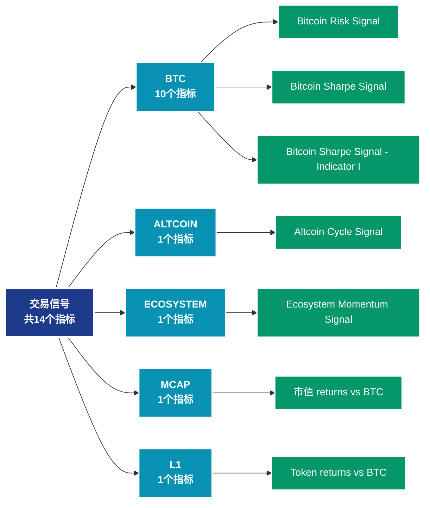

# 交易信号 (signals)

## 📝 类别描述

交易信号和预警指标，提供买卖信号、风险预警等决策支持。

## 📊 指标概览

本类别共包含 **14** 个指标，涵盖以下主要子类别：

| 子类别 | 指标数量 | 主要功能 |
|--------|----------|----------|
| BTC | 10 | 专门数据分析 |
| ALTCOIN | 1 | 专门数据分析 |
| ECOSYSTEM | 1 | 专门数据分析 |
| MCAP | 1 | 专门数据分析 |
| L1 | 1 | 专门数据分析 |

## 🎨 指标体系结构图



## 📂 详细指标说明

### 📊 BTC（10个指标）

本子类别包含以下详细指标：

#### 1. Bitcoin Risk Signal

- **指标代码**: `btc_risk_index`
- **API路径**: `/v1/metrics/signals/btc_risk_index`
- **英文名称**: Bitcoin Risk Signal

**英文原文：**
The Bitcoin Risk Signal gauges the amount of risk of a major drawdown in bitcoin price. It is based on a set of proprietary indicators, including bitcoin price data, on-chain data, and a selection of other trading metrics.

For more information on its interpretation and methodology see this dashboard.

**中文解释：**
分析Bitcoin Risk Signal相关的链上数据。这个指标通过追踪区块链上的实时数据，提供了传统金融分析无法获得的透明度和洞察力。链上数据的优势在于：1）数据真实可验证；2）实时更新无延迟；3）覆盖所有参与者。通过综合分析多个链上指标，投资者可以做出更明智的决策，研究人员可以深入理解市场机制。

**使用示例**：
```python
# 获取Bitcoin Risk Signal数据
df = client.get_metric(
    "/v1/metrics/signals/btc_risk_index",
    asset="BTC",
    resolution="24h"
)
```

---

#### 2. Bitcoin Sharpe Signal

- **指标代码**: `btc_sharpe_signal`
- **API路径**: `/v1/metrics/signals/btc_sharpe_signal`
- **英文名称**: Bitcoin Sharpe Signal

**英文原文：**
The Glassnode Bitcoin Sharpe signal uses a unique ML-based approach with on-chain data to strategically minimize downside risks and capture rising trends in Bitcoin. In the context of enhancing risk-adjusted returns, the model&#x27;s confidence is visually represented, with green for the highest confidence and orange to red for reduced confidence. A surge beyond the 0.5 mark has historically been associated with improved risk-adjusted performance in Bitcoin.
For more information on its interpretation and methodology see this dashboard.

The signal is refreshed daily at 04:00 AM UTC effectively finalizing the previous day&#x27;s timestamp. Please note that the standard version of the signal includes a 1-day lag.

For Enterprise clients interested in looking to trade with same-day data, learn more about the signal&#x27;s full potential, or understand the methodology that underpins it, we encourage you to contact our Institutional team.

**中文解释：**
分析Bitcoin Sharpe Signal相关的链上数据。这个指标通过追踪区块链上的实时数据，提供了传统金融分析无法获得的透明度和洞察力。链上数据的优势在于：1）数据真实可验证；2）实时更新无延迟；3）覆盖所有参与者。通过综合分析多个链上指标，投资者可以做出更明智的决策，研究人员可以深入理解市场机制。

**使用示例**：
```python
# 获取Bitcoin Sharpe Signal数据
df = client.get_metric(
    "/v1/metrics/signals/btc_sharpe_signal",
    asset="BTC",
    resolution="24h"
)
```

---

#### 3. Bitcoin Sharpe Signal - Indicator I

- **指标代码**: `btc_bss_indicator_1`
- **API路径**: `/v1/metrics/signals/btc_bss_indicator_1`
- **英文名称**: Bitcoin Sharpe Signal - Indicator I

**英文原文：**
Derived directly from entities&#x27; profit, this indicator offers a nuanced view of entities profit momentum. This indicator is used as one of the main features of the BSS model.

**中文解释：**
分析Bitcoin Sharpe Signal - Indicator I相关的链上数据。这个指标通过追踪区块链上的实时数据，提供了传统金融分析无法获得的透明度和洞察力。链上数据的优势在于：1）数据真实可验证；2）实时更新无延迟；3）覆盖所有参与者。通过综合分析多个链上指标，投资者可以做出更明智的决策，研究人员可以深入理解市场机制。

**使用示例**：
```python
# 获取Bitcoin Sharpe Signal - Indicator I数据
df = client.get_metric(
    "/v1/metrics/signals/btc_bss_indicator_1",
    asset="BTC",
    resolution="24h"
)
```

---

#### 4. Bitcoin Sharpe Signal - Indicator II

- **指标代码**: `btc_bss_indicator_2`
- **API路径**: `/v1/metrics/signals/btc_bss_indicator_2`
- **英文名称**: Bitcoin Sharpe Signal - Indicator II

**英文原文：**
This refined version of the MVRV ratio employs statistical techniques to amplify its predictive power, highlighting periods of potential overvaluation or undervaluation. This indicator is used as one of the main feature of the BSS model

**中文解释：**
分析Bitcoin Sharpe Signal - Indicator II相关的链上数据。这个指标通过追踪区块链上的实时数据，提供了传统金融分析无法获得的透明度和洞察力。链上数据的优势在于：1）数据真实可验证；2）实时更新无延迟；3）覆盖所有参与者。通过综合分析多个链上指标，投资者可以做出更明智的决策，研究人员可以深入理解市场机制。

**使用示例**：
```python
# 获取Bitcoin Sharpe Signal - Indicator II数据
df = client.get_metric(
    "/v1/metrics/signals/btc_bss_indicator_2",
    asset="BTC",
    resolution="24h"
)
```

---

#### 5. Bitcoin Sharpe Signal - Indicator III

- **指标代码**: `btc_bss_indicator_3`
- **API路径**: `/v1/metrics/signals/btc_bss_indicator_3`
- **英文名称**: Bitcoin Sharpe Signal - Indicator III

**英文原文：**
Drawing from recent STH_SOPR data, this indicator offers insights into the market&#x27;s short-term holder steadiness. This indicator is used as one of the main feature of the BSS model.

**中文解释：**
分析Bitcoin Sharpe Signal - Indicator III相关的链上数据。这个指标通过追踪区块链上的实时数据，提供了传统金融分析无法获得的透明度和洞察力。链上数据的优势在于：1）数据真实可验证；2）实时更新无延迟；3）覆盖所有参与者。通过综合分析多个链上指标，投资者可以做出更明智的决策，研究人员可以深入理解市场机制。

**使用示例**：
```python
# 获取Bitcoin Sharpe Signal - Indicator III数据
df = client.get_metric(
    "/v1/metrics/signals/btc_bss_indicator_3",
    asset="BTC",
    resolution="24h"
)
```

---

#### 6. Bitcoin Sharpe Signal - Indicator IV

- **指标代码**: `btc_bss_indicator_4`
- **API路径**: `/v1/metrics/signals/btc_bss_indicator_4`
- **英文名称**: Bitcoin Sharpe Signal - Indicator IV

**英文原文：**
This indicator assesses the momentum in the percentage of circulating supply in profit, subtly highlighting trends by applying a transformation on the base metric. This indicator is used as one of the main feature of the BSS model.

**中文解释：**
分析Bitcoin Sharpe Signal - Indicator IV相关的链上数据。这个指标通过追踪区块链上的实时数据，提供了传统金融分析无法获得的透明度和洞察力。链上数据的优势在于：1）数据真实可验证；2）实时更新无延迟；3）覆盖所有参与者。通过综合分析多个链上指标，投资者可以做出更明智的决策，研究人员可以深入理解市场机制。

**使用示例**：
```python
# 获取Bitcoin Sharpe Signal - Indicator IV数据
df = client.get_metric(
    "/v1/metrics/signals/btc_bss_indicator_4",
    asset="BTC",
    resolution="24h"
)
```

---

#### 7. Bitcoin Sharpe Signal Short

- **指标代码**: `btc_bss_short`
- **API路径**: `/v1/metrics/signals/btc_bss_short`
- **英文名称**: Bitcoin Sharpe Signal Short

**英文原文：**
The Bitcoin Sharpe Signal Short is a machine-learning-based strategy designed to anticipate market turmoil using on-chain data. The signal can help identify potential opportunities to short Bitcoin with reduced downside risk. The model&#x27;s confidence is visually represented, with red for the highest confidence in market sell-off and yellow to green for reduced confidence. When the indicator surges beyond the 0.5 mark, it has historically been associated with imminent market downturns.

**中文解释：**
分析Bitcoin Sharpe Signal Short相关的链上数据。这个指标通过追踪区块链上的实时数据，提供了传统金融分析无法获得的透明度和洞察力。链上数据的优势在于：1）数据真实可验证；2）实时更新无延迟；3）覆盖所有参与者。通过综合分析多个链上指标，投资者可以做出更明智的决策，研究人员可以深入理解市场机制。

**使用示例**：
```python
# 获取Bitcoin Sharpe Signal Short数据
df = client.get_metric(
    "/v1/metrics/signals/btc_bss_short",
    asset="BTC",
    resolution="24h"
)
```

---

#### 8. BSS Goldilocks Short Signal

- **指标代码**: `btc_bss_goldilocks_short`
- **API路径**: `/v1/metrics/signals/btc_bss_goldilocks_short`
- **英文名称**: BSS Goldilocks Short Signal

**英文原文：**
Signal decision extracted from the Goldilocks Zone. Prime area to be short on Bitcoin according to the Bitcoin Sharpe Signal Short.

**中文解释：**
分析BSS Goldilocks Short Signal相关的链上数据。这个指标通过追踪区块链上的实时数据，提供了传统金融分析无法获得的透明度和洞察力。链上数据的优势在于：1）数据真实可验证；2）实时更新无延迟；3）覆盖所有参与者。通过综合分析多个链上指标，投资者可以做出更明智的决策，研究人员可以深入理解市场机制。

**使用示例**：
```python
# 获取BSS Goldilocks Short Signal数据
df = client.get_metric(
    "/v1/metrics/signals/btc_bss_goldilocks_short",
    asset="BTC",
    resolution="24h"
)
```

---

#### 9. BSS Goldilocks Signal

- **指标代码**: `btc_bss_goldilocks`
- **API路径**: `/v1/metrics/signals/btc_bss_goldilocks`
- **英文名称**: BSS Goldilocks Signal

**英文原文：**
The BSS Goldilocks Signal is derived from the heuristics of the ML model used to construct the Bitcoin Sharpe Signal. It activates when the conditions of the Goldilocks zone are met, identifying prime opportunities to enhance the risk-adjusted return on Bitcoin.
Conditions of Goldilocks Zone: when BSS Indicator I is between 52 and 65 and when BSS Indicator III is below 4%.

**中文解释：**
分析BSS Goldilocks Signal相关的链上数据。这个指标通过追踪区块链上的实时数据，提供了传统金融分析无法获得的透明度和洞察力。链上数据的优势在于：1）数据真实可验证；2）实时更新无延迟；3）覆盖所有参与者。通过综合分析多个链上指标，投资者可以做出更明智的决策，研究人员可以深入理解市场机制。

**使用示例**：
```python
# 获取BSS Goldilocks Signal数据
df = client.get_metric(
    "/v1/metrics/signals/btc_bss_goldilocks",
    asset="BTC",
    resolution="24h"
)
```

---

#### 10. Intraday Bitcoin Sharpe Signal

- **指标代码**: `btc_bss_v2`
- **API路径**: `/v1/metrics/signals/btc_bss_v2`
- **英文名称**: Intraday Bitcoin Sharpe Signal

**英文原文：**
The Glassnode Intraday Bitcoin Sharpe enhances the BSS by providing intraday insights into the positioning of the Bitcoin Sharpe signal, thus improving response capabilities for Pro ML package subscribers against market movements.

The signal uses a unique ML-based approach with on-chain data to strategically minimize downside risks and capture rising trends in Bitcoin. In the context of enhancing risk-adjusted returns, the model&#x27;s confidence is visually represented, with green for the highest confidence and orange to red for reduced confidence. A surge beyond the 0.5 mark has historically been associated with improved risk-adjusted performance in Bitcoin.

**中文解释：**
分析Intraday Bitcoin Sharpe Signal相关的链上数据。这个指标通过追踪区块链上的实时数据，提供了传统金融分析无法获得的透明度和洞察力。链上数据的优势在于：1）数据真实可验证；2）实时更新无延迟；3）覆盖所有参与者。通过综合分析多个链上指标，投资者可以做出更明智的决策，研究人员可以深入理解市场机制。

**使用示例**：
```python
# 获取Intraday Bitcoin Sharpe Signal数据
df = client.get_metric(
    "/v1/metrics/signals/btc_bss_v2",
    asset="BTC",
    resolution="24h"
)
```

---

### 📊 ALTCOIN（1个指标）

本子类别包含以下详细指标：

#### 1. Altcoin Cycle Signal

- **指标代码**: `altcoin_index`
- **API路径**: `/v1/metrics/signals/altcoin_index`
- **英文名称**: Altcoin Cycle Signal

**英文原文：**
The Altcoin Cycle Signal measures whether the market favors bitcoin versus all altcoins. During Bitcoin Season, bitcoin is likely to outperform the basket of all altcoins and during Altcoin Season this dynamic inverts. The signal is meant to be largely agnostic to which altcoins in particular an investor holds. The Altcoin Cycle Signal is based on price data of the top 250 altcoins by market capitalization (excluding stablecoins). This metric is updated daily at 10:15 UTC, providing us with the previous day&#x27;s data point at this time.

For more information on its interpretation and methodology see this dashboard.

**中文解释：**
分析Altcoin Cycle Signal相关的链上数据。这个指标通过追踪区块链上的实时数据，提供了传统金融分析无法获得的透明度和洞察力。链上数据的优势在于：1）数据真实可验证；2）实时更新无延迟；3）覆盖所有参与者。通过综合分析多个链上指标，投资者可以做出更明智的决策，研究人员可以深入理解市场机制。

**使用示例**：
```python
# 获取Altcoin Cycle Signal数据
df = client.get_metric(
    "/v1/metrics/signals/altcoin_index",
    asset="BTC",
    resolution="24h"
)
```

---

### 📊 ECOSYSTEM（1个指标）

本子类别包含以下详细指标：

#### 1. Ecosystem Momentum Signal

- **指标代码**: `ecosystem_momentum_index`
- **API路径**: `/v1/metrics/signals/ecosystem_momentum_index`
- **英文名称**: Ecosystem Momentum Signal

**英文原文：**
The L1 Momentum Signal evaluates the propensity of a Layer 1 ecosystem to move into an exponential trend that can be either positive or negative. It can be used to evaluate the likelihood of a short-term exponential price momentum continuing and intensifying. The Signal is based on a proprietary statistical method that identifies whether the underlying distribution of an asset&#x27;s returns has departed from its usual structure.

For more information on its interpretation and methodology see this dashboard.

Note: Data for 1 hour resolution is updated every 6 hours due to a data source limitation for this metric.

**中文解释：**
分析Ecosystem Momentum Signal相关的链上数据。这个指标通过追踪区块链上的实时数据，提供了传统金融分析无法获得的透明度和洞察力。链上数据的优势在于：1）数据真实可验证；2）实时更新无延迟；3）覆盖所有参与者。通过综合分析多个链上指标，投资者可以做出更明智的决策，研究人员可以深入理解市场机制。

**使用示例**：
```python
# 获取Ecosystem Momentum Signal数据
df = client.get_metric(
    "/v1/metrics/signals/ecosystem_momentum_index",
    asset="BTC",
    resolution="24h"
)
```

---

### 📊 MCAP（1个指标）

本子类别包含以下详细指标：

#### 1. 市值 returns vs BTC

- **指标代码**: `mcap_returns_vs_btc`
- **API路径**: `/v1/metrics/signals/mcap_returns_vs_btc`
- **英文名称**: Marketcap returns vs BTC

**英文原文：**
The Market Capitalization Grouping vs BTC highlights the relative price performance of market capitalization size-based clusters versus bitcoin. Market capitalization groupings are defined as, Large Cap: >1B $, Mid Cap: 1B-100M $, Small Cap: 100M-50M $.

For more information on its interpretation and methodology see this dashboard.

**中文解释：**
分析Marketcap returns vs BTC相关的链上数据。这个指标通过追踪区块链上的实时数据，提供了传统金融分析无法获得的透明度和洞察力。链上数据的优势在于：1）数据真实可验证；2）实时更新无延迟；3）覆盖所有参与者。通过综合分析多个链上指标，投资者可以做出更明智的决策，研究人员可以深入理解市场机制。

**使用示例**：
```python
# 获取市值 returns vs BTC数据
df = client.get_metric(
    "/v1/metrics/signals/mcap_returns_vs_btc",
    asset="BTC",
    resolution="24h"
)
```

---

### 📊 L1（1个指标）

本子类别包含以下详细指标：

#### 1. Token returns vs BTC

- **指标代码**: `l1_native_tokens_returns_vs_btc`
- **API路径**: `/v1/metrics/signals/l1_native_tokens_returns_vs_btc`
- **英文名称**: Token returns vs BTC

**英文原文：**
The L1 Native Token Returns vs BTC highlights the relative price performance of large L1 native tokens versus bitcoin.

For more information on its interpretation and methodology see this dashboard.

**中文解释：**
分析Token returns vs BTC相关的链上数据。这个指标通过追踪区块链上的实时数据，提供了传统金融分析无法获得的透明度和洞察力。链上数据的优势在于：1）数据真实可验证；2）实时更新无延迟；3）覆盖所有参与者。通过综合分析多个链上指标，投资者可以做出更明智的决策，研究人员可以深入理解市场机制。

**使用示例**：
```python
# 获取Token returns vs BTC数据
df = client.get_metric(
    "/v1/metrics/signals/l1_native_tokens_returns_vs_btc",
    asset="BTC",
    resolution="24h"
)
```

---

## 📊 完整指标列表

| # | 指标名称 | 指标代码 | API路径 |
|---|----------|----------|---------|
| 1 | Altcoin Cycle Signal | `altcoin_index` | `/v1/metrics/signals/altcoin_index` |
| 2 | Bitcoin Risk Signal | `btc_risk_index` | `/v1/metrics/signals/btc_risk_index` |
| 3 | Bitcoin Sharpe Signal | `btc_sharpe_signal` | `/v1/metrics/signals/btc_sharpe_signal` |
| 4 | Bitcoin Sharpe Signal - Indicator I | `btc_bss_indicator_1` | `/v1/metrics/signals/btc_bss_indicator_1` |
| 5 | Bitcoin Sharpe Signal - Indicator II | `btc_bss_indicator_2` | `/v1/metrics/signals/btc_bss_indicator_2` |
| 6 | Bitcoin Sharpe Signal - Indicator III | `btc_bss_indicator_3` | `/v1/metrics/signals/btc_bss_indicator_3` |
| 7 | Bitcoin Sharpe Signal - Indicator IV | `btc_bss_indicator_4` | `/v1/metrics/signals/btc_bss_indicator_4` |
| 8 | Bitcoin Sharpe Signal Short | `btc_bss_short` | `/v1/metrics/signals/btc_bss_short` |
| 9 | BSS Goldilocks Short Signal | `btc_bss_goldilocks_short` | `/v1/metrics/signals/btc_bss_goldilocks_short` |
| 10 | BSS Goldilocks Signal | `btc_bss_goldilocks` | `/v1/metrics/signals/btc_bss_goldilocks` |
| 11 | Ecosystem Momentum Signal | `ecosystem_momentum_index` | `/v1/metrics/signals/ecosystem_momentum_index` |
| 12 | Intraday Bitcoin Sharpe Signal | `btc_bss_v2` | `/v1/metrics/signals/btc_bss_v2` |
| 13 | 市值 returns vs BTC | `mcap_returns_vs_btc` | `/v1/metrics/signals/mcap_returns_vs_btc` |
| 14 | Token returns vs BTC | `l1_native_tokens_returns_vs_btc` | `/v1/metrics/signals/l1_native_tokens_returns_vs_btc` |

## 💻 代码示例

### Python SDK 使用示例

```python
from glassnode import GlassnodeClient

# 初始化客户端
client = GlassnodeClient(api_key="YOUR_API_KEY")

# 获取单个指标
data = client.get(
    "/v1/metrics/addresses/active_count",
    asset="BTC",
    resolution="24h",
    since="2024-01-01"
)

# 批量获取多个指标
metrics = [
    "active_count",
    "new",
    "non_zero_count"
]

results = {}
for metric in metrics:
    results[metric] = client.get(
        f"/v1/metrics/addresses/{metric}",
        asset="BTC"
    )
```

## 📚 参考资源

- [Glassnode官方文档](https://docs.glassnode.com)
- [Glassnode Studio](https://studio.glassnode.com)
- [API访问说明](https://docs.glassnode.com/basic-api/api)

---

*最后更新：2024年*
