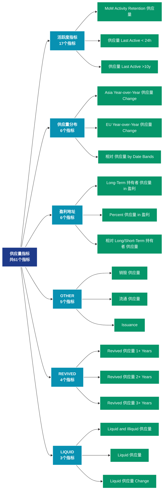

# 供应量指标 (supply)

## 📝 类别描述

追踪加密货币的供应动态，包括流通量、锁定量、销毁量等供应端指标。

## 📊 指标概览

本类别共包含 **61** 个指标，涵盖以下主要子类别：

| 子类别 | 指标数量 | 主要功能 |
|--------|----------|----------|
| 活跃度指标 | 17 | 网络活跃度和用户参与 |
| 供应量分布 | 6 | 供应量分布统计 |
| 盈利地址 | 6 | 盈利状态分析 |
| OTHER | 5 | 专门数据分析 |
| REVIVED | 4 | 专门数据分析 |
| LIQUID | 3 | 专门数据分析 |
| 亏损地址 | 3 | 亏损状态评估 |
| RCAP | 3 | 专门数据分析 |
| ILLIQUID | 2 | 专门数据分析 |
| LTH | 2 | 专门数据分析 |

## 🎨 指标体系结构图



## 📂 详细指标说明

### 📊 活跃度指标（17个指标）

本子类别包含以下详细指标：

#### 1. MoM Activity Retention 供应量

- **指标代码**: `activity_retention`
- **API路径**: `/v1/metrics/supply/activity_retention`
- **英文名称**: MoM Activity Retention Supply

**英文原文：**
This metric shows the supply held by addresses that interact with the asset, segmented into "retention cohorts". The cohorts are defined as follows:
 * &#x60;New&#x60;: Addresses that interacted with the asset for the first time during the last 30 days.
 * &#x60;Retained (Increase)&#x60;: Addresses that were active in both the previous and current 30d period, and increased their activity.
 * &#x60;Retained (Equal)&#x60;: Addresses that were active in both the previous and current 30d period, with the same activity.
 * &#x60;Retained (Decrease)&#x60;: Addresses that were active in both the previous and current 30d period, and reduced their activity.
 * &#x60;Resurrected&#x60;: Addresses that were active in the current, but inactive in the previous 30d period.
 * &#x60;Churned&#x60;: Addresses that were not active within the last 30 days, but were active in the previous 30d period.
 * &#x60;Dead&#x60;: Addresses that were inactive in the current and previous 30d interval, but were active at some point before.

**中文解释：**
分析MoM Activity Retention Supply相关的链上数据。这个指标通过追踪区块链上的实时数据，提供了传统金融分析无法获得的透明度和洞察力。链上数据的优势在于：1）数据真实可验证；2）实时更新无延迟；3）覆盖所有参与者。通过综合分析多个链上指标，投资者可以做出更明智的决策，研究人员可以深入理解市场机制。

**使用示例**：
```python
# 获取MoM Activity Retention 供应量数据
df = client.get_metric(
    "/v1/metrics/supply/activity_retention",
    asset="BTC",
    resolution="24h"
)
```

---

#### 2. 供应量 Last Active < 24h

- **指标代码**: `active_24h`
- **API路径**: `/v1/metrics/supply/active_24h`
- **英文名称**: Supply Last Active < 24h

**英文原文：**
The amount of circulating supply last moved in the last 24 hours.

**中文解释：**
分析网络中地址的活跃模式和行为特征。通过多维度的活跃度分析，包括活跃频率、活跃时段、活跃类型等，可以深入理解用户行为模式，预测网络发展趋势，识别异常活动。

**使用示例**：
```python
# 获取供应量 Last Active < 24h数据
df = client.get_metric(
    "/v1/metrics/supply/active_24h",
    asset="BTC",
    resolution="24h"
)
```

---

#### 3. 供应量 Last Active >10y

- **指标代码**: `active_more_10y`
- **API路径**: `/v1/metrics/supply/active_more_10y`
- **英文名称**: Supply Last Active >10y

**英文原文：**
The amount of circulating supply last moved more than 10 years ago.

**中文解释：**
分析网络中地址的活跃模式和行为特征。通过多维度的活跃度分析，包括活跃频率、活跃时段、活跃类型等，可以深入理解用户行为模式，预测网络发展趋势，识别异常活动。

**使用示例**：
```python
# 获取供应量 Last Active >10y数据
df = client.get_metric(
    "/v1/metrics/supply/active_more_10y",
    asset="BTC",
    resolution="24h"
)
```

---

#### 4. 供应量 Last Active 1+ Years Ago

- **指标代码**: `active_more_1y_percent`
- **API路径**: `/v1/metrics/supply/active_more_1y_percent`
- **英文名称**: Supply Last Active 1+ Years Ago

**英文原文：**
The percent of circulating supply that has not moved in at least 1 year.

**中文解释：**
分析网络中地址的活跃模式和行为特征。通过多维度的活跃度分析，包括活跃频率、活跃时段、活跃类型等，可以深入理解用户行为模式，预测网络发展趋势，识别异常活动。

**使用示例**：
```python
# 获取供应量 Last Active 1+ Years Ago数据
df = client.get_metric(
    "/v1/metrics/supply/active_more_1y_percent",
    asset="BTC",
    resolution="24h"
)
```

---

#### 5. 供应量 Last Active 1d-1w

- **指标代码**: `active_1d_1w`
- **API路径**: `/v1/metrics/supply/active_1d_1w`
- **英文名称**: Supply Last Active 1d-1w

**英文原文：**
The amount of circulating supply last moved between 1 day and 1 week ago.

**中文解释：**
分析网络中地址的活跃模式和行为特征。通过多维度的活跃度分析，包括活跃频率、活跃时段、活跃类型等，可以深入理解用户行为模式，预测网络发展趋势，识别异常活动。

**使用示例**：
```python
# 获取供应量 Last Active 1d-1w数据
df = client.get_metric(
    "/v1/metrics/supply/active_1d_1w",
    asset="BTC",
    resolution="24h"
)
```

---

#### 6. 供应量 Last Active 1m-3m

- **指标代码**: `active_1m_3m`
- **API路径**: `/v1/metrics/supply/active_1m_3m`
- **英文名称**: Supply Last Active 1m-3m

**英文原文：**
The amount of circulating supply last moved between 1 month and 3 months ago.

**中文解释：**
分析网络中地址的活跃模式和行为特征。通过多维度的活跃度分析，包括活跃频率、活跃时段、活跃类型等，可以深入理解用户行为模式，预测网络发展趋势，识别异常活动。

**使用示例**：
```python
# 获取供应量 Last Active 1m-3m数据
df = client.get_metric(
    "/v1/metrics/supply/active_1m_3m",
    asset="BTC",
    resolution="24h"
)
```

---

#### 7. 供应量 Last Active 1w-1m

- **指标代码**: `active_1w_1m`
- **API路径**: `/v1/metrics/supply/active_1w_1m`
- **英文名称**: Supply Last Active 1w-1m

**英文原文：**
The amount of circulating supply last moved between 1 week and 1 month ago.

**中文解释：**
分析网络中地址的活跃模式和行为特征。通过多维度的活跃度分析，包括活跃频率、活跃时段、活跃类型等，可以深入理解用户行为模式，预测网络发展趋势，识别异常活动。

**使用示例**：
```python
# 获取供应量 Last Active 1w-1m数据
df = client.get_metric(
    "/v1/metrics/supply/active_1w_1m",
    asset="BTC",
    resolution="24h"
)
```

---

#### 8. 供应量 Last Active 1y-2y

- **指标代码**: `active_1y_2y`
- **API路径**: `/v1/metrics/supply/active_1y_2y`
- **英文名称**: Supply Last Active 1y-2y

**英文原文：**
The amount of circulating supply last moved between 1 year and 2 years ago.

**中文解释：**
分析网络中地址的活跃模式和行为特征。通过多维度的活跃度分析，包括活跃频率、活跃时段、活跃类型等，可以深入理解用户行为模式，预测网络发展趋势，识别异常活动。

**使用示例**：
```python
# 获取供应量 Last Active 1y-2y数据
df = client.get_metric(
    "/v1/metrics/supply/active_1y_2y",
    asset="BTC",
    resolution="24h"
)
```

---

#### 9. 供应量 Last Active 2+ Years Ago

- **指标代码**: `active_more_2y_percent`
- **API路径**: `/v1/metrics/supply/active_more_2y_percent`
- **英文名称**: Supply Last Active 2+ Years Ago

**英文原文：**
The percent of circulating supply that has not moved in at least 2 years.

**中文解释：**
分析网络中地址的活跃模式和行为特征。通过多维度的活跃度分析，包括活跃频率、活跃时段、活跃类型等，可以深入理解用户行为模式，预测网络发展趋势，识别异常活动。

**使用示例**：
```python
# 获取供应量 Last Active 2+ Years Ago数据
df = client.get_metric(
    "/v1/metrics/supply/active_more_2y_percent",
    asset="BTC",
    resolution="24h"
)
```

---

#### 10. 供应量 Last Active 2y-3y

- **指标代码**: `active_2y_3y`
- **API路径**: `/v1/metrics/supply/active_2y_3y`
- **英文名称**: Supply Last Active 2y-3y

**英文原文：**
The amount of circulating supply last moved between 2 years and 3 years ago.

**中文解释：**
分析网络中地址的活跃模式和行为特征。通过多维度的活跃度分析，包括活跃频率、活跃时段、活跃类型等，可以深入理解用户行为模式，预测网络发展趋势，识别异常活动。

**使用示例**：
```python
# 获取供应量 Last Active 2y-3y数据
df = client.get_metric(
    "/v1/metrics/supply/active_2y_3y",
    asset="BTC",
    resolution="24h"
)
```

---

#### 11. 供应量 Last Active 3+ Years Ago

- **指标代码**: `active_more_3y_percent`
- **API路径**: `/v1/metrics/supply/active_more_3y_percent`
- **英文名称**: Supply Last Active 3+ Years Ago

**英文原文：**
The percent of circulating supply that has not moved in at least 3 years.

**中文解释：**
分析网络中地址的活跃模式和行为特征。通过多维度的活跃度分析，包括活跃频率、活跃时段、活跃类型等，可以深入理解用户行为模式，预测网络发展趋势，识别异常活动。

**使用示例**：
```python
# 获取供应量 Last Active 3+ Years Ago数据
df = client.get_metric(
    "/v1/metrics/supply/active_more_3y_percent",
    asset="BTC",
    resolution="24h"
)
```

---

#### 12. 供应量 Last Active 3m-6m

- **指标代码**: `active_3m_6m`
- **API路径**: `/v1/metrics/supply/active_3m_6m`
- **英文名称**: Supply Last Active 3m-6m

**英文原文：**
The amount of circulating supply last moved between 3 months and 6 months ago.

**中文解释：**
分析网络中地址的活跃模式和行为特征。通过多维度的活跃度分析，包括活跃频率、活跃时段、活跃类型等，可以深入理解用户行为模式，预测网络发展趋势，识别异常活动。

**使用示例**：
```python
# 获取供应量 Last Active 3m-6m数据
df = client.get_metric(
    "/v1/metrics/supply/active_3m_6m",
    asset="BTC",
    resolution="24h"
)
```

---

#### 13. 供应量 Last Active 3y-5y

- **指标代码**: `active_3y_5y`
- **API路径**: `/v1/metrics/supply/active_3y_5y`
- **英文名称**: Supply Last Active 3y-5y

**英文原文：**
The amount of circulating supply last moved between 3 years and 5 years ago.

**中文解释：**
分析网络中地址的活跃模式和行为特征。通过多维度的活跃度分析，包括活跃频率、活跃时段、活跃类型等，可以深入理解用户行为模式，预测网络发展趋势，识别异常活动。

**使用示例**：
```python
# 获取供应量 Last Active 3y-5y数据
df = client.get_metric(
    "/v1/metrics/supply/active_3y_5y",
    asset="BTC",
    resolution="24h"
)
```

---

#### 14. 供应量 Last Active 5+ Years Ago

- **指标代码**: `active_more_5y_percent`
- **API路径**: `/v1/metrics/supply/active_more_5y_percent`
- **英文名称**: Supply Last Active 5+ Years Ago

**英文原文：**
The percent of circulating supply that has not moved in at least 5 years.

**中文解释：**
分析网络中地址的活跃模式和行为特征。通过多维度的活跃度分析，包括活跃频率、活跃时段、活跃类型等，可以深入理解用户行为模式，预测网络发展趋势，识别异常活动。

**使用示例**：
```python
# 获取供应量 Last Active 5+ Years Ago数据
df = client.get_metric(
    "/v1/metrics/supply/active_more_5y_percent",
    asset="BTC",
    resolution="24h"
)
```

---

#### 15. 供应量 Last Active 5y-7y

- **指标代码**: `active_5y_7y`
- **API路径**: `/v1/metrics/supply/active_5y_7y`
- **英文名称**: Supply Last Active 5y-7y

**英文原文：**
The amount of circulating supply last moved between 5 years and 7 years ago.

**中文解释：**
分析网络中地址的活跃模式和行为特征。通过多维度的活跃度分析，包括活跃频率、活跃时段、活跃类型等，可以深入理解用户行为模式，预测网络发展趋势，识别异常活动。

**使用示例**：
```python
# 获取供应量 Last Active 5y-7y数据
df = client.get_metric(
    "/v1/metrics/supply/active_5y_7y",
    asset="BTC",
    resolution="24h"
)
```

---

#### 16. 供应量 Last Active 6m-12m

- **指标代码**: `active_6m_12m`
- **API路径**: `/v1/metrics/supply/active_6m_12m`
- **英文名称**: Supply Last Active 6m-12m

**英文原文：**
The amount of circulating supply last moved between 6 months and 12 months ago.

**中文解释：**
分析网络中地址的活跃模式和行为特征。通过多维度的活跃度分析，包括活跃频率、活跃时段、活跃类型等，可以深入理解用户行为模式，预测网络发展趋势，识别异常活动。

**使用示例**：
```python
# 获取供应量 Last Active 6m-12m数据
df = client.get_metric(
    "/v1/metrics/supply/active_6m_12m",
    asset="BTC",
    resolution="24h"
)
```

---

#### 17. 供应量 Last Active 7y-10y

- **指标代码**: `active_7y_10y`
- **API路径**: `/v1/metrics/supply/active_7y_10y`
- **英文名称**: Supply Last Active 7y-10y

**英文原文：**
The amount of circulating supply last moved between 7 years and 10 years ago.

**中文解释：**
分析网络中地址的活跃模式和行为特征。通过多维度的活跃度分析，包括活跃频率、活跃时段、活跃类型等，可以深入理解用户行为模式，预测网络发展趋势，识别异常活动。

**使用示例**：
```python
# 获取供应量 Last Active 7y-10y数据
df = client.get_metric(
    "/v1/metrics/supply/active_7y_10y",
    asset="BTC",
    resolution="24h"
)
```

---

### 📊 供应量分布（6个指标）

本子类别包含以下详细指标：

#### 1. Asia Year-over-Year 供应量 Change

- **指标代码**: `apac_1y_supply_change`
- **API路径**: `/v1/metrics/supply/apac_1y_supply_change`
- **英文名称**: Asia Year-over-Year Supply Change

**英文原文：**
This metric aims at giving an estimate for the year-over-year change in the share of the Bitcoin supply to be held/traded in Asia.

Geolocation of Bitcoin supply is performed probabilistically at the entity level. The timestamps of all transactions created by an entity are correlated with the working hours of different geographical regions to determine the probabilities for each entity being located in the US, Europe, or Asia. Working hours are defined as:

* US: 8am to 8pm Eastern Time (13:00-01:00 UTC)
* EU: 8am to 8pm Central European Time (07:00-19:00 UTC)
* Asia: 8am to 8pm China Standard Time (00:00-12:00 UTC)

An entity&#x27;s balance will only contribute to the supply in the respective region if the location can be determined with a high certainty. Supply held on exchanges wallets are excluded.

**中文解释：**
分析Asia Year-over-Year Supply Change相关的链上数据。这个指标通过追踪区块链上的实时数据，提供了传统金融分析无法获得的透明度和洞察力。链上数据的优势在于：1）数据真实可验证；2）实时更新无延迟；3）覆盖所有参与者。通过综合分析多个链上指标，投资者可以做出更明智的决策，研究人员可以深入理解市场机制。

**使用示例**：
```python
# 获取Asia Year-over-Year 供应量 Change数据
df = client.get_metric(
    "/v1/metrics/supply/apac_1y_supply_change",
    asset="BTC",
    resolution="24h"
)
```

---

#### 2. EU Year-over-Year 供应量 Change

- **指标代码**: `emea_1y_supply_change`
- **API路径**: `/v1/metrics/supply/emea_1y_supply_change`
- **英文名称**: EU Year-over-Year Supply Change

**英文原文：**
This metric aims at giving an estimate for the year-over-year change in the share of the Bitcoin supply to be held/traded in Europe.

Geolocation of Bitcoin supply is performed probabilistically at the entity level. The timestamps of all transactions created by an entity are correlated with the working hours of different geographical regions to determine the probabilities for each entity being located in the US, Europe, or Asia. Working hours are defined as:

* US: 8am to 8pm Eastern Time (13:00-01:00 UTC)
* EU: 8am to 8pm Central European Time (07:00-19:00 UTC)
* Asia: 8am to 8pm China Standard Time (00:00-12:00 UTC)

An entity&#x27;s balance will only contribute to the supply in the respective region if the location can be determined with a high certainty. Supply held on exchanges wallets are excluded.

**中文解释：**
分析EU Year-over-Year Supply Change相关的链上数据。这个指标通过追踪区块链上的实时数据，提供了传统金融分析无法获得的透明度和洞察力。链上数据的优势在于：1）数据真实可验证；2）实时更新无延迟；3）覆盖所有参与者。通过综合分析多个链上指标，投资者可以做出更明智的决策，研究人员可以深入理解市场机制。

**使用示例**：
```python
# 获取EU Year-over-Year 供应量 Change数据
df = client.get_metric(
    "/v1/metrics/supply/emea_1y_supply_change",
    asset="BTC",
    resolution="24h"
)
```

---

#### 3. 相对 供应量 by Date Bands

- **指标代码**: `supply_by_date_bands_relative`
- **API路径**: `/v1/metrics/supply/supply_by_date_bands_relative`
- **英文名称**: Relative Supply by Date Bands

**英文原文：**
This metric shows a breakdown of the relative supply by date bands. Each date band refers to the date when the UTXO was created. The metric is similar to the concept of HODL Waves, however it uses absolute date ranges instead of floating time periods.

**中文解释：**
分析Relative Supply by Date Bands相关的链上数据。这个指标通过追踪区块链上的实时数据，提供了传统金融分析无法获得的透明度和洞察力。链上数据的优势在于：1）数据真实可验证；2）实时更新无延迟；3）覆盖所有参与者。通过综合分析多个链上指标，投资者可以做出更明智的决策，研究人员可以深入理解市场机制。

**使用示例**：
```python
# 获取相对 供应量 by Date Bands数据
df = client.get_metric(
    "/v1/metrics/supply/supply_by_date_bands_relative",
    asset="BTC",
    resolution="24h"
)
```

---

#### 4. 供应量 by Date Bands

- **指标代码**: `supply_by_date_bands`
- **API路径**: `/v1/metrics/supply/supply_by_date_bands`
- **英文名称**: Supply by Date Bands

**英文原文：**
This metric shows a breakdown of the total supply by date bands. Each date band refers to the date when the UTXO was created. The metric is similar to the concept of HODL Waves, however it uses absolute date ranges instead of floating time periods.

**中文解释：**
分析Supply by Date Bands相关的链上数据。这个指标通过追踪区块链上的实时数据，提供了传统金融分析无法获得的透明度和洞察力。链上数据的优势在于：1）数据真实可验证；2）实时更新无延迟；3）覆盖所有参与者。通过综合分析多个链上指标，投资者可以做出更明智的决策，研究人员可以深入理解市场机制。

**使用示例**：
```python
# 获取供应量 by Date Bands数据
df = client.get_metric(
    "/v1/metrics/supply/supply_by_date_bands",
    asset="BTC",
    resolution="24h"
)
```

---

#### 5. 供应量 by TxOut Type

- **指标代码**: `supply_by_txout_type`
- **API路径**: `/v1/metrics/supply/supply_by_txout_type`
- **英文名称**: Supply by TxOut Type

**英文原文：**
This metric breaks down the total Bitcoin supply by transaction output types. Transaction output types, or txout types for short, are determined by the type of Bitcoin script conditions that are used to lock Bitcoin in the output. The most common transaction output types are:

- P2TR (Pay to Taproot): Funds are locked using a 32-byte hash that is either (1) a public key, (2) a combination of multiple public keys, or (3) a script hash.
- P2WPKH (Pay to Witness Public Key Hash): The SegWit version of P2PKH.
- P2WSH (Pay to Witness Script Hash): The SegWit version of P2SH. This type comes in two variants.
- P2SH (Pay to Script Hash): Funds are locked using arbitrary Bitcoin script instructions.
- P2PKH (Pay to Public Key Hash): The successor of P2PK, locking funds using the hash of a public key.
- P2PK (Pay to Public Key): The first available type, locking funds using a public key.
- Other: Serves as catch-all for all outputs whose script instructions don&#x27;t match any of most commonly used output types listed above.

**中文解释：**
分析Supply by TxOut Type相关的链上数据。这个指标通过追踪区块链上的实时数据，提供了传统金融分析无法获得的透明度和洞察力。链上数据的优势在于：1）数据真实可验证；2）实时更新无延迟；3）覆盖所有参与者。通过综合分析多个链上指标，投资者可以做出更明智的决策，研究人员可以深入理解市场机制。

**使用示例**：
```python
# 获取供应量 by TxOut Type数据
df = client.get_metric(
    "/v1/metrics/supply/supply_by_txout_type",
    asset="BTC",
    resolution="24h"
)
```

---

#### 6. US Year-over-Year 供应量 Change

- **指标代码**: `amer_1y_supply_change`
- **API路径**: `/v1/metrics/supply/amer_1y_supply_change`
- **英文名称**: US Year-over-Year Supply Change

**英文原文：**
This metric aims at giving an estimate for the year-over-year change in the share of the Bitcoin supply to be held/traded in the US.

Geolocation of Bitcoin supply is performed probabilistically at the entity level. The timestamps of all transactions created by an entity are correlated with the working hours of different geographical regions to determine the probabilities for each entity being located in the US, Europe, or Asia. Working hours are defined as:

* US: 8am to 8pm Eastern Time (13:00-01:00 UTC)
* EU: 8am to 8pm Central European Time (07:00-19:00 UTC)
* Asia: 8am to 8pm China Standard Time (00:00-12:00 UTC)

An entity&#x27;s balance will only contribute to the supply in the respective region if the location can be determined with a high certainty. Supply held on exchanges wallets are excluded.

**中文解释：**
分析US Year-over-Year Supply Change相关的链上数据。这个指标通过追踪区块链上的实时数据，提供了传统金融分析无法获得的透明度和洞察力。链上数据的优势在于：1）数据真实可验证；2）实时更新无延迟；3）覆盖所有参与者。通过综合分析多个链上指标，投资者可以做出更明智的决策，研究人员可以深入理解市场机制。

**使用示例**：
```python
# 获取US Year-over-Year 供应量 Change数据
df = client.get_metric(
    "/v1/metrics/supply/amer_1y_supply_change",
    asset="BTC",
    resolution="24h"
)
```

---

### 📊 盈利地址（6个指标）

本子类别包含以下详细指标：

#### 1. Long-Term 持有者 供应量 in 盈利

- **指标代码**: `lth_profit_sum`
- **API路径**: `/v1/metrics/supply/lth_profit_sum`
- **英文名称**: Long-Term Holder Supply in Profit

**英文原文：**
The total amount of circulating supply that is currently in profit and held by long term holders. Long- and Short-Term Holder supply is defined with respect to the entity&#x27;s averaged purchasing date with weights given by a logistic function centered at an age of 155 days and a transition width of 10 days.

**中文解释：**
深入分析地址的盈利状况，包括盈利幅度、盈利持续时间、盈利地址的行为模式等。通过了解投资者的盈利情况，可以评估市场的获利回吐压力和持续上涨的潜力。

**使用示例**：
```python
# 获取Long-Term 持有者 供应量 in 盈利数据
df = client.get_metric(
    "/v1/metrics/supply/lth_profit_sum",
    asset="BTC",
    resolution="24h"
)
```

---

#### 2. Percent 供应量 in 盈利

- **指标代码**: `profit_relative`
- **API路径**: `/v1/metrics/supply/profit_relative`
- **英文名称**: Percent Supply in Profit

**英文原文：**
The percentage of circulating supply in profit, i.e. the percentage of existing coins whose price at the time they last moved was lower than the current price. For more information see this article.

**中文解释：**
计算盈利地址占所有持币地址的百分比。这是一个标准化的指标，便于不同时期和不同资产之间的比较。历史数据显示，当该比例低于50%时，通常接近市场底部；高于90%时，需要警惕回调风险。

**使用示例**：
```python
# 获取Percent 供应量 in 盈利数据
df = client.get_metric(
    "/v1/metrics/supply/profit_relative",
    asset="BTC",
    resolution="24h"
)
```

---

#### 3. 相对 Long/Short-Term 持有者 供应量

- **指标代码**: `lth_sth_profit_loss_relative`
- **API路径**: `/v1/metrics/supply/lth_sth_profit_loss_relative`
- **英文名称**: Relative Long/Short-Term Holder Supply

**英文原文：**
The relative amount of circulating supply of held by long- and short-term holders in profit/loss. Long- and Short-Term Holder supply is defined with respect to the entity&#x27;s averaged purchasing date with weights given by a logistic function centered at an age of 155 days and a transition width of 10 days.

**中文解释：**
计算盈利地址占所有持币地址的百分比。这是一个标准化的指标，便于不同时期和不同资产之间的比较。历史数据显示，当该比例低于50%时，通常接近市场底部；高于90%时，需要警惕回调风险。

**使用示例**：
```python
# 获取相对 Long/Short-Term 持有者 供应量数据
df = client.get_metric(
    "/v1/metrics/supply/lth_sth_profit_loss_relative",
    asset="BTC",
    resolution="24h"
)
```

---

#### 4. Short-Term 持有者 盈利/亏损 比例

- **指标代码**: `sth_profit_loss_ratio`
- **API路径**: `/v1/metrics/supply/sth_profit_loss_ratio`
- **英文名称**: Short-Term Holder Profit/Loss Ratio

**英文原文：**
The ratio of the Short-Term Holder Supply in Profit and the Short-Term Holder Supply in Loss. Similar to SOPR, it detects local bottoms in bull markets and local tops in bear markets. This metric was first put forward by ARK Invest.

**中文解释：**
深入分析地址的盈利状况，包括盈利幅度、盈利持续时间、盈利地址的行为模式等。通过了解投资者的盈利情况，可以评估市场的获利回吐压力和持续上涨的潜力。

**使用示例**：
```python
# 获取Short-Term 持有者 盈利/亏损 比例数据
df = client.get_metric(
    "/v1/metrics/supply/sth_profit_loss_ratio",
    asset="BTC",
    resolution="24h"
)
```

---

#### 5. Short-Term 持有者 供应量 in 盈利

- **指标代码**: `sth_profit_sum`
- **API路径**: `/v1/metrics/supply/sth_profit_sum`
- **英文名称**: Short-Term Holder Supply in Profit

**英文原文：**
The total amount of circulating supply that is currently in profit and held by short term holders. Long- and Short-Term Holder supply is defined with respect to the entity&#x27;s averaged purchasing date with weights given by a logistic function centered at an age of 155 days and a transition width of 10 days.

**中文解释：**
深入分析地址的盈利状况，包括盈利幅度、盈利持续时间、盈利地址的行为模式等。通过了解投资者的盈利情况，可以评估市场的获利回吐压力和持续上涨的潜力。

**使用示例**：
```python
# 获取Short-Term 持有者 供应量 in 盈利数据
df = client.get_metric(
    "/v1/metrics/supply/sth_profit_sum",
    asset="BTC",
    resolution="24h"
)
```

---

#### 6. 供应量 in 盈利

- **指标代码**: `profit_sum`
- **API路径**: `/v1/metrics/supply/profit_sum`
- **英文名称**: Supply in Profit

**英文原文：**
The circulating supply in profit, i.e. the amount of coins whose price at the time they last moved was lower than the current price. For more information see this article.

**中文解释：**
深入分析地址的盈利状况，包括盈利幅度、盈利持续时间、盈利地址的行为模式等。通过了解投资者的盈利情况，可以评估市场的获利回吐压力和持续上涨的潜力。

**使用示例**：
```python
# 获取供应量 in 盈利数据
df = client.get_metric(
    "/v1/metrics/supply/profit_sum",
    asset="BTC",
    resolution="24h"
)
```

---

### 📊 OTHER（5个指标）

本子类别包含以下详细指标：

#### 1. 销毁 供应量

- **指标代码**: `burned`
- **API路径**: `/v1/metrics/supply/burned`
- **英文名称**: Burned Supply

**英文原文：**
This metric represents the cumulative sum of ETH incinerated since the implementation of the London Hard Fork, which introduced EIP-1559. The Ethereum Improvement Proposal (EIP-1559) established a base fee for transactions, which is burned to reduce the overall ETH supply. As a result, this metric indicates the deflationary pressure on Ethereum.

**中文解释：**
分析Burned Supply相关的链上数据。这个指标通过追踪区块链上的实时数据，提供了传统金融分析无法获得的透明度和洞察力。链上数据的优势在于：1）数据真实可验证；2）实时更新无延迟；3）覆盖所有参与者。通过综合分析多个链上指标，投资者可以做出更明智的决策，研究人员可以深入理解市场机制。

**使用示例**：
```python
# 获取销毁 供应量数据
df = client.get_metric(
    "/v1/metrics/supply/burned",
    asset="BTC",
    resolution="24h"
)
```

---

#### 2. 流通 供应量

- **指标代码**: `current`
- **API路径**: `/v1/metrics/supply/current`
- **英文名称**: Circulating Supply

**英文原文：**
The total amount of all coins ever created/issued, i.e. the circulating supply.

**中文解释：**
分析Circulating Supply相关的链上数据。这个指标通过追踪区块链上的实时数据，提供了传统金融分析无法获得的透明度和洞察力。链上数据的优势在于：1）数据真实可验证；2）实时更新无延迟；3）覆盖所有参与者。通过综合分析多个链上指标，投资者可以做出更明智的决策，研究人员可以深入理解市场机制。

**使用示例**：
```python
# 获取流通 供应量数据
df = client.get_metric(
    "/v1/metrics/supply/current",
    asset="BTC",
    resolution="24h"
)
```

---

#### 3. Issuance

- **指标代码**: `issued`
- **API路径**: `/v1/metrics/supply/issued`
- **英文名称**: Issuance

**英文原文：**
The total amount of new coins added to the current supply, i.e. minted coins or new coins released to the network.

**中文解释：**
分析Issuance相关的链上数据。这个指标通过追踪区块链上的实时数据，提供了传统金融分析无法获得的透明度和洞察力。链上数据的优势在于：1）数据真实可验证；2）实时更新无延迟；3）覆盖所有参与者。通过综合分析多个链上指标，投资者可以做出更明智的决策，研究人员可以深入理解市场机制。

**使用示例**：
```python
# 获取Issuance数据
df = client.get_metric(
    "/v1/metrics/supply/issued",
    asset="BTC",
    resolution="24h"
)
```

---

#### 4. Minted 供应量

- **指标代码**: `minted`
- **API路径**: `/v1/metrics/supply/minted`
- **英文名称**: Minted Supply

**英文原文：**
The total amount of issued ETH.

**中文解释：**
分析Minted Supply相关的链上数据。这个指标通过追踪区块链上的实时数据，提供了传统金融分析无法获得的透明度和洞察力。链上数据的优势在于：1）数据真实可验证；2）实时更新无延迟；3）覆盖所有参与者。通过综合分析多个链上指标，投资者可以做出更明智的决策，研究人员可以深入理解市场机制。

**使用示例**：
```python
# 获取Minted 供应量数据
df = client.get_metric(
    "/v1/metrics/supply/minted",
    asset="BTC",
    resolution="24h"
)
```

---

#### 5. Tips (Priority 手续费)

- **指标代码**: `tips`
- **API路径**: `/v1/metrics/supply/tips`
- **英文名称**: Tips (Priority Fee)

**英文原文：**
The Ethereum Improvement Proposal (EIP-1559), introduced as part of the London Hard Fork, established priority fees, commonly referred to as tips. These fees are paid by users to expedite their transactions, rewarding miners or validators for prioritizing them. Before the Paris upgrade, miners received these tips, but with the transition to Proof-of-Stake, validators now benefit from these additional fees. This metric provides insight into the supplementary income received by validators, beyond the base fee, for ensuring timely transaction processing on the Ethereum network.

**中文解释：**
分析Tips (Priority Fee)相关的链上数据。这个指标通过追踪区块链上的实时数据，提供了传统金融分析无法获得的透明度和洞察力。链上数据的优势在于：1）数据真实可验证；2）实时更新无延迟；3）覆盖所有参与者。通过综合分析多个链上指标，投资者可以做出更明智的决策，研究人员可以深入理解市场机制。

**使用示例**：
```python
# 获取Tips (Priority 手续费)数据
df = client.get_metric(
    "/v1/metrics/supply/tips",
    asset="BTC",
    resolution="24h"
)
```

---

### 📊 REVIVED（4个指标）

本子类别包含以下详细指标：

#### 1. Revived 供应量 1+ Years

- **指标代码**: `revived_more_1y_sum`
- **API路径**: `/v1/metrics/supply/revived_more_1y_sum`
- **英文名称**: Revived Supply 1+ Years

**英文原文：**
The total amount of coins that come back into circulation after being untouched for at least 1 year. In other words, it is the total transfer volume of coins that were previously dormant for 1+ years.

**中文解释：**
分析Revived Supply 1+ Years相关的链上数据。这个指标通过追踪区块链上的实时数据，提供了传统金融分析无法获得的透明度和洞察力。链上数据的优势在于：1）数据真实可验证；2）实时更新无延迟；3）覆盖所有参与者。通过综合分析多个链上指标，投资者可以做出更明智的决策，研究人员可以深入理解市场机制。

**使用示例**：
```python
# 获取Revived 供应量 1+ Years数据
df = client.get_metric(
    "/v1/metrics/supply/revived_more_1y_sum",
    asset="BTC",
    resolution="24h"
)
```

---

#### 2. Revived 供应量 2+ Years

- **指标代码**: `revived_more_2y_sum`
- **API路径**: `/v1/metrics/supply/revived_more_2y_sum`
- **英文名称**: Revived Supply 2+ Years

**英文原文：**
The total amount of coins that come back into circulation after being untouched for at least 2 years. In other words, it is the total transfer volume of coins that were previously dormant for 2+ years.

**中文解释：**
分析Revived Supply 2+ Years相关的链上数据。这个指标通过追踪区块链上的实时数据，提供了传统金融分析无法获得的透明度和洞察力。链上数据的优势在于：1）数据真实可验证；2）实时更新无延迟；3）覆盖所有参与者。通过综合分析多个链上指标，投资者可以做出更明智的决策，研究人员可以深入理解市场机制。

**使用示例**：
```python
# 获取Revived 供应量 2+ Years数据
df = client.get_metric(
    "/v1/metrics/supply/revived_more_2y_sum",
    asset="BTC",
    resolution="24h"
)
```

---

#### 3. Revived 供应量 3+ Years

- **指标代码**: `revived_more_3y_sum`
- **API路径**: `/v1/metrics/supply/revived_more_3y_sum`
- **英文名称**: Revived Supply 3+ Years

**英文原文：**
The total amount of coins that come back into circulation after being untouched for at least 3 years. In other words, it is the total transfer volume of coins that were previously dormant for 3+ years.

**中文解释：**
分析Revived Supply 3+ Years相关的链上数据。这个指标通过追踪区块链上的实时数据，提供了传统金融分析无法获得的透明度和洞察力。链上数据的优势在于：1）数据真实可验证；2）实时更新无延迟；3）覆盖所有参与者。通过综合分析多个链上指标，投资者可以做出更明智的决策，研究人员可以深入理解市场机制。

**使用示例**：
```python
# 获取Revived 供应量 3+ Years数据
df = client.get_metric(
    "/v1/metrics/supply/revived_more_3y_sum",
    asset="BTC",
    resolution="24h"
)
```

---

#### 4. Revived 供应量 5+ Years

- **指标代码**: `revived_more_5y_sum`
- **API路径**: `/v1/metrics/supply/revived_more_5y_sum`
- **英文名称**: Revived Supply 5+ Years

**英文原文：**
The total amount of coins that come back into circulation after being untouched for at least 5 years. In other words, it is the total transfer volume of coins that were previously dormant for 5+ years.

**中文解释：**
分析Revived Supply 5+ Years相关的链上数据。这个指标通过追踪区块链上的实时数据，提供了传统金融分析无法获得的透明度和洞察力。链上数据的优势在于：1）数据真实可验证；2）实时更新无延迟；3）覆盖所有参与者。通过综合分析多个链上指标，投资者可以做出更明智的决策，研究人员可以深入理解市场机制。

**使用示例**：
```python
# 获取Revived 供应量 5+ Years数据
df = client.get_metric(
    "/v1/metrics/supply/revived_more_5y_sum",
    asset="BTC",
    resolution="24h"
)
```

---

### 📊 LIQUID（3个指标）

本子类别包含以下详细指标：

#### 1. Liquid and Illiquid 供应量

- **指标代码**: `liquid_illiquid_sum`
- **API路径**: `/v1/metrics/supply/liquid_illiquid_sum`
- **英文名称**: Liquid and Illiquid Supply

**英文原文：**
The total supply held by illiquid, liquid, and highly liquid entities. The liquidity of an entity is defined as the ratio of cumulative outflows and cumulative inflows over the entity&#x27;s lifespan. An entity is considered to be illiquid / liquid / highly liquid if its liquidity *L* is ≲ 0.25 / 0.25 ≲ *L* ≲ 0.75 / 0.75 ≲ L, respectively. For more information see our introductory article on Bitcoin liquidity.

**中文解释：**
分析Liquid and Illiquid Supply相关的链上数据。这个指标通过追踪区块链上的实时数据，提供了传统金融分析无法获得的透明度和洞察力。链上数据的优势在于：1）数据真实可验证；2）实时更新无延迟；3）覆盖所有参与者。通过综合分析多个链上指标，投资者可以做出更明智的决策，研究人员可以深入理解市场机制。

**使用示例**：
```python
# 获取Liquid and Illiquid 供应量数据
df = client.get_metric(
    "/v1/metrics/supply/liquid_illiquid_sum",
    asset="BTC",
    resolution="24h"
)
```

---

#### 2. Liquid 供应量

- **指标代码**: `liquid_sum`
- **API路径**: `/v1/metrics/supply/liquid_sum`
- **英文名称**: Liquid Supply

**英文原文：**
The total supply held by "liquid" entities. The liquidity of an entity is defined as the ratio of cumulative outflows and cumulative inflows over the entity&#x27;s lifespan. An entity is considered to be illiquid / liquid / highly liquid if its liquidity *L* is ≲ 0.25 / 0.25 ≲ *L* ≲ 0.75 / 0.75 ≲ L, respectively. For more information see our introductory article on Bitcoin liquidity.

**中文解释：**
分析Liquid Supply相关的链上数据。这个指标通过追踪区块链上的实时数据，提供了传统金融分析无法获得的透明度和洞察力。链上数据的优势在于：1）数据真实可验证；2）实时更新无延迟；3）覆盖所有参与者。通过综合分析多个链上指标，投资者可以做出更明智的决策，研究人员可以深入理解市场机制。

**使用示例**：
```python
# 获取Liquid 供应量数据
df = client.get_metric(
    "/v1/metrics/supply/liquid_sum",
    asset="BTC",
    resolution="24h"
)
```

---

#### 3. Liquid 供应量 Change

- **指标代码**: `liquid_change`
- **API路径**: `/v1/metrics/supply/liquid_change`
- **英文名称**: Liquid Supply Change

**英文原文：**
The monthly (30d) net change of supply held by liquid and highly liquid entities. For more information see our introductory article on Bitcoin liquidity.

**中文解释：**
分析Liquid Supply Change相关的链上数据。这个指标通过追踪区块链上的实时数据，提供了传统金融分析无法获得的透明度和洞察力。链上数据的优势在于：1）数据真实可验证；2）实时更新无延迟；3）覆盖所有参与者。通过综合分析多个链上指标，投资者可以做出更明智的决策，研究人员可以深入理解市场机制。

**使用示例**：
```python
# 获取Liquid 供应量 Change数据
df = client.get_metric(
    "/v1/metrics/supply/liquid_change",
    asset="BTC",
    resolution="24h"
)
```

---

### 📊 亏损地址（3个指标）

本子类别包含以下详细指标：

#### 1. Long-Term 持有者 供应量 in 亏损

- **指标代码**: `lth_loss_sum`
- **API路径**: `/v1/metrics/supply/lth_loss_sum`
- **英文名称**: Long-Term Holder Supply in Loss

**英文原文：**
The total amount of circulating supply that is currently at loss and held by long term holders. Long- and Short-Term Holder supply is defined with respect to the entity&#x27;s averaged purchasing date with weights given by a logistic function centered at an age of 155 days and a transition width of 10 days.

**中文解释：**
全面评估地址的亏损状况。亏损数据帮助识别：1）投降性抛售的强度；2）市场底部的形成；3）支撑位的强弱。深度亏损往往伴随着市场的极度恐慌，这通常是反向投资的良机。

**使用示例**：
```python
# 获取Long-Term 持有者 供应量 in 亏损数据
df = client.get_metric(
    "/v1/metrics/supply/lth_loss_sum",
    asset="BTC",
    resolution="24h"
)
```

---

#### 2. Short-Term 持有者 供应量 in 亏损

- **指标代码**: `sth_loss_sum`
- **API路径**: `/v1/metrics/supply/sth_loss_sum`
- **英文名称**: Short-Term Holder Supply in Loss

**英文原文：**
The total amount of circulating supply that is currently at loss and held by short term holders. Long- and Short-Term Holder supply is defined with respect to the entity&#x27;s averaged purchasing date with weights given by a logistic function centered at an age of 155 days and a transition width of 10 days.

**中文解释：**
全面评估地址的亏损状况。亏损数据帮助识别：1）投降性抛售的强度；2）市场底部的形成；3）支撑位的强弱。深度亏损往往伴随着市场的极度恐慌，这通常是反向投资的良机。

**使用示例**：
```python
# 获取Short-Term 持有者 供应量 in 亏损数据
df = client.get_metric(
    "/v1/metrics/supply/sth_loss_sum",
    asset="BTC",
    resolution="24h"
)
```

---

#### 3. 供应量 in 亏损

- **指标代码**: `loss_sum`
- **API路径**: `/v1/metrics/supply/loss_sum`
- **英文名称**: Supply in Loss

**英文原文：**
The circulating supply in loss, i.e. the amount of coins whose price at the time they last moved was higher than the current price. For more information see this article.

**中文解释：**
全面评估地址的亏损状况。亏损数据帮助识别：1）投降性抛售的强度；2）市场底部的形成；3）支撑位的强弱。深度亏损往往伴随着市场的极度恐慌，这通常是反向投资的良机。

**使用示例**：
```python
# 获取供应量 in 亏损数据
df = client.get_metric(
    "/v1/metrics/supply/loss_sum",
    asset="BTC",
    resolution="24h"
)
```

---

### 📊 RCAP（3个指标）

本子类别包含以下详细指标：

#### 1. 已实现 Cap by Date Bands

- **指标代码**: `rcap_by_date_bands`
- **API路径**: `/v1/metrics/supply/rcap_by_date_bands`
- **英文名称**: Realized Cap by Date Bands

**英文原文：**
This metric shows a breakdown of the Realized Cap by date bands. Each date band refers to the date when the UTXO was created. The metric is similar to the concept of Realized Cap HODL Waves, however it uses absolute date ranges instead of floating time periods.

**中文解释：**
分析Realized Cap by Date Bands相关的链上数据。这个指标通过追踪区块链上的实时数据，提供了传统金融分析无法获得的透明度和洞察力。链上数据的优势在于：1）数据真实可验证；2）实时更新无延迟；3）覆盖所有参与者。通过综合分析多个链上指标，投资者可以做出更明智的决策，研究人员可以深入理解市场机制。

**使用示例**：
```python
# 获取已实现 Cap by Date Bands数据
df = client.get_metric(
    "/v1/metrics/supply/rcap_by_date_bands",
    asset="BTC",
    resolution="24h"
)
```

---

#### 2. 已实现 Cap HODL Waves

- **指标代码**: `rcap_hodl_waves`
- **API路径**: `/v1/metrics/supply/rcap_hodl_waves`
- **英文名称**: Realized Cap HODL Waves

**英文原文：**
HODL Waves weighted by Realized Price. The idea for this visualization of HODL waves was first introduced by @typerbole.

**中文解释：**
分析Realized Cap HODL Waves相关的链上数据。这个指标通过追踪区块链上的实时数据，提供了传统金融分析无法获得的透明度和洞察力。链上数据的优势在于：1）数据真实可验证；2）实时更新无延迟；3）覆盖所有参与者。通过综合分析多个链上指标，投资者可以做出更明智的决策，研究人员可以深入理解市场机制。

**使用示例**：
```python
# 获取已实现 Cap HODL Waves数据
df = client.get_metric(
    "/v1/metrics/supply/rcap_hodl_waves",
    asset="BTC",
    resolution="24h"
)
```

---

#### 3. 相对 已实现 Cap by Date Bands

- **指标代码**: `rcap_by_date_bands_relative`
- **API路径**: `/v1/metrics/supply/rcap_by_date_bands_relative`
- **英文名称**: Relative Realized Cap by Date Bands

**英文原文：**
This metric shows a breakdown of the relative Realized Cap by date bands. Each date band refers to the date when the UTXO was created. The metric is similar to the concept of Realized Cap HODL Waves, however it uses absolute date ranges instead of floating time periods.

**中文解释：**
分析Relative Realized Cap by Date Bands相关的链上数据。这个指标通过追踪区块链上的实时数据，提供了传统金融分析无法获得的透明度和洞察力。链上数据的优势在于：1）数据真实可验证；2）实时更新无延迟；3）覆盖所有参与者。通过综合分析多个链上指标，投资者可以做出更明智的决策，研究人员可以深入理解市场机制。

**使用示例**：
```python
# 获取相对 已实现 Cap by Date Bands数据
df = client.get_metric(
    "/v1/metrics/supply/rcap_by_date_bands_relative",
    asset="BTC",
    resolution="24h"
)
```

---

### 📊 ILLIQUID（2个指标）

本子类别包含以下详细指标：

#### 1. Illiquid 供应量

- **指标代码**: `illiquid_sum`
- **API路径**: `/v1/metrics/supply/illiquid_sum`
- **英文名称**: Illiquid Supply

**英文原文：**
The total supply held by illiquid entities. The liquidity of an entity is defined as the ratio of cumulative outflows and cumulative inflows over the entity&#x27;s lifespan. An entity is considered to be illiquid / liquid / highly liquid if its liquidity *L* is ≲ 0.25 / 0.25 ≲ *L* ≲ 0.75 / 0.75 ≲ L, respectively. For more information see our introductory article on Bitcoin liquidity.

**中文解释：**
分析Illiquid Supply相关的链上数据。这个指标通过追踪区块链上的实时数据，提供了传统金融分析无法获得的透明度和洞察力。链上数据的优势在于：1）数据真实可验证；2）实时更新无延迟；3）覆盖所有参与者。通过综合分析多个链上指标，投资者可以做出更明智的决策，研究人员可以深入理解市场机制。

**使用示例**：
```python
# 获取Illiquid 供应量数据
df = client.get_metric(
    "/v1/metrics/supply/illiquid_sum",
    asset="BTC",
    resolution="24h"
)
```

---

#### 2. Illiquid 供应量 Change

- **指标代码**: `illiquid_change`
- **API路径**: `/v1/metrics/supply/illiquid_change`
- **英文名称**: Illiquid Supply Change

**英文原文：**
The monthly (30d) net change of supply held by illiquid entities. For more information see our introductory article on Bitcoin liquidity.

**中文解释：**
分析Illiquid Supply Change相关的链上数据。这个指标通过追踪区块链上的实时数据，提供了传统金融分析无法获得的透明度和洞察力。链上数据的优势在于：1）数据真实可验证；2）实时更新无延迟；3）覆盖所有参与者。通过综合分析多个链上指标，投资者可以做出更明智的决策，研究人员可以深入理解市场机制。

**使用示例**：
```python
# 获取Illiquid 供应量 Change数据
df = client.get_metric(
    "/v1/metrics/supply/illiquid_change",
    asset="BTC",
    resolution="24h"
)
```

---

### 📊 LTH（2个指标）

本子类别包含以下详细指标：

#### 1. Long-Term 持有者 Position Change

- **指标代码**: `lth_net_change`
- **API路径**: `/v1/metrics/supply/lth_net_change`
- **英文名称**: Long-Term Holder Position Change

**英文原文：**
The monthly net position change of long term holders, i.e. the 30 day change in supply held by long term holders. Long- and Short-Term Holder supply is defined with respect to the entity&#x27;s averaged purchasing date with weights given by a logistic function centered at an age of 155 days and a transition width of 10 days.

**中文解释：**
分析Long-Term Holder Position Change相关的链上数据。这个指标通过追踪区块链上的实时数据，提供了传统金融分析无法获得的透明度和洞察力。链上数据的优势在于：1）数据真实可验证；2）实时更新无延迟；3）覆盖所有参与者。通过综合分析多个链上指标，投资者可以做出更明智的决策，研究人员可以深入理解市场机制。

**使用示例**：
```python
# 获取Long-Term 持有者 Position Change数据
df = client.get_metric(
    "/v1/metrics/supply/lth_net_change",
    asset="BTC",
    resolution="24h"
)
```

---

#### 2. Long-Term 持有者 供应量

- **指标代码**: `lth_sum`
- **API路径**: `/v1/metrics/supply/lth_sum`
- **英文名称**: Long-Term Holder Supply

**英文原文：**
The total amount of circulating supply held by long term holders. Long- and Short-Term Holder supply is defined with respect to the entity&#x27;s averaged purchasing date with weights given by a logistic function centered at an age of 155 days and a transition width of 10 days.

**中文解释：**
分析Long-Term Holder Supply相关的链上数据。这个指标通过追踪区块链上的实时数据，提供了传统金融分析无法获得的透明度和洞察力。链上数据的优势在于：1）数据真实可验证；2）实时更新无延迟；3）覆盖所有参与者。通过综合分析多个链上指标，投资者可以做出更明智的决策，研究人员可以深入理解市场机制。

**使用示例**：
```python
# 获取Long-Term 持有者 供应量数据
df = client.get_metric(
    "/v1/metrics/supply/lth_sum",
    asset="BTC",
    resolution="24h"
)
```

---

### 📊 STH（2个指标）

本子类别包含以下详细指标：

#### 1. Short-Term 持有者 供应量

- **指标代码**: `sth_sum`
- **API路径**: `/v1/metrics/supply/sth_sum`
- **英文名称**: Short-Term Holder Supply

**英文原文：**
The total amount of circulating supply held by short term holders. Long- and Short-Term Holder supply is defined with respect to the entity&#x27;s averaged purchasing date with weights given by a logistic function centered at an age of 155 days and a transition width of 10 days.

**中文解释：**
分析Short-Term Holder Supply相关的链上数据。这个指标通过追踪区块链上的实时数据，提供了传统金融分析无法获得的透明度和洞察力。链上数据的优势在于：1）数据真实可验证；2）实时更新无延迟；3）覆盖所有参与者。通过综合分析多个链上指标，投资者可以做出更明智的决策，研究人员可以深入理解市场机制。

**使用示例**：
```python
# 获取Short-Term 持有者 供应量数据
df = client.get_metric(
    "/v1/metrics/supply/sth_sum",
    asset="BTC",
    resolution="24h"
)
```

---

#### 2. SLRV 比例

- **指标代码**: `sth_lth_realized_value_ratio`
- **API路径**: `/v1/metrics/supply/sth_lth_realized_value_ratio`
- **英文名称**: SLRV Ratio

**英文原文：**
The Short to Long-Term Realized Value (SLRV) Ratio is the ratio of the 24h realized HODL wave and the 6m-1y realized HODL wave. It serves as a measurement for comparing short-term and long-term velocity for bear market detection. This metric was first put forward by ARK Invest.

**中文解释：**
分析SLRV Ratio相关的链上数据。这个指标通过追踪区块链上的实时数据，提供了传统金融分析无法获得的透明度和洞察力。链上数据的优势在于：1）数据真实可验证；2）实时更新无延迟；3）覆盖所有参与者。通过综合分析多个链上指标，投资者可以做出更明智的决策，研究人员可以深入理解市场机制。

**使用示例**：
```python
# 获取SLRV 比例数据
df = client.get_metric(
    "/v1/metrics/supply/sth_lth_realized_value_ratio",
    asset="BTC",
    resolution="24h"
)
```

---

### 📊 CURRENT（1个指标）

本子类别包含以下详细指标：

#### 1. Adjusted 供应量

- **指标代码**: `current_adjusted`
- **API路径**: `/v1/metrics/supply/current_adjusted`
- **英文名称**: Adjusted Supply

**英文原文：**
The circulating supply adjusted by accounting for lost coins. The amount of lost coins is estimated by all those that have not moved in over 7 years.

**中文解释：**
分析Adjusted Supply相关的链上数据。这个指标通过追踪区块链上的实时数据，提供了传统金融分析无法获得的透明度和洞察力。链上数据的优势在于：1）数据真实可验证；2）实时更新无延迟；3）覆盖所有参与者。通过综合分析多个链上指标，投资者可以做出更明智的决策，研究人员可以深入理解市场机制。

**使用示例**：
```python
# 获取Adjusted 供应量数据
df = client.get_metric(
    "/v1/metrics/supply/current_adjusted",
    asset="BTC",
    resolution="24h"
)
```

---

### 📊 BURN（1个指标）

本子类别包含以下详细指标：

#### 1. Burn 比率 (Base 手续费)

- **指标代码**: `burn_rate`
- **API路径**: `/v1/metrics/supply/burn_rate`
- **英文名称**: Burn Rate (Base Fee)

**英文原文：**
This metric represents the ongoing pace at which ETH is being burned, following the introduction of the London Hard Fork and the implementation of EIP-1559. The Ethereum Improvement Proposal (EIP-1559) established a base fee for each transaction, which is subsequently incinerated, reducing the overall ETH supply. By tracking the ETH burn rate, users can gain insights into the deflationary pressure on Ethereum and its potential impact on the network&#x27;s long-term economic dynamics.

**中文解释：**
分析Burn Rate (Base Fee)相关的链上数据。这个指标通过追踪区块链上的实时数据，提供了传统金融分析无法获得的透明度和洞察力。链上数据的优势在于：1）数据真实可验证；2）实时更新无延迟；3）覆盖所有参与者。通过综合分析多个链上指标，投资者可以做出更明智的决策，研究人员可以深入理解市场机制。

**使用示例**：
```python
# 获取Burn 比率 (Base 手续费)数据
df = client.get_metric(
    "/v1/metrics/supply/burn_rate",
    asset="BTC",
    resolution="24h"
)
```

---

### 📊 HIGHLY（1个指标）

本子类别包含以下详细指标：

#### 1. Highly Liquid 供应量

- **指标代码**: `highly_liquid_sum`
- **API路径**: `/v1/metrics/supply/highly_liquid_sum`
- **英文名称**: Highly Liquid Supply

**英文原文：**
The total supply held by "highly liquid" entities. The liquidity of an entity is defined as the ratio of cumulative outflows and cumulative inflows over the entity&#x27;s lifespan. An entity is considered to be illiquid / liquid / highly liquid if its liquidity *L* is ≲ 0.25 / 0.25 ≲ *L* ≲ 0.75 / 0.75 ≲ L, respectively. For more information see our introductory article on Bitcoin liquidity.

**中文解释：**
分析Highly Liquid Supply相关的链上数据。这个指标通过追踪区块链上的实时数据，提供了传统金融分析无法获得的透明度和洞察力。链上数据的优势在于：1）数据真实可验证；2）实时更新无延迟；3）覆盖所有参与者。通过综合分析多个链上指标，投资者可以做出更明智的决策，研究人员可以深入理解市场机制。

**使用示例**：
```python
# 获取Highly Liquid 供应量数据
df = client.get_metric(
    "/v1/metrics/supply/highly_liquid_sum",
    asset="BTC",
    resolution="24h"
)
```

---

### 📊 HODL（1个指标）

本子类别包含以下详细指标：

#### 1. HODL Waves

- **指标代码**: `hodl_waves`
- **API路径**: `/v1/metrics/supply/hodl_waves`
- **英文名称**: HODL Waves

**英文原文：**
Bundle of all active supply age bands, aka HODL waves. Each colored band shows the percentage of  in existence that was last moved within the time period denoted in the legend. The concept of HODL waves was first described in this post by Unchained Capital.

**中文解释：**
分析HODL Waves相关的链上数据。这个指标通过追踪区块链上的实时数据，提供了传统金融分析无法获得的透明度和洞察力。链上数据的优势在于：1）数据真实可验证；2）实时更新无延迟；3）覆盖所有参与者。通过综合分析多个链上指标，投资者可以做出更明智的决策，研究人员可以深入理解市场机制。

**使用示例**：
```python
# 获取HODL Waves数据
df = client.get_metric(
    "/v1/metrics/supply/hodl_waves",
    asset="BTC",
    resolution="24h"
)
```

---

### 📊 INFLATION（1个指标）

本子类别包含以下详细指标：

#### 1. 通胀 比率

- **指标代码**: `inflation_rate`
- **API路径**: `/v1/metrics/supply/inflation_rate`
- **英文名称**: Inflation Rate

**英文原文：**
The percentage of new coins issued, divided by the current supply.

**中文解释：**
分析Inflation Rate相关的链上数据。这个指标通过追踪区块链上的实时数据，提供了传统金融分析无法获得的透明度和洞察力。链上数据的优势在于：1）数据真实可验证；2）实时更新无延迟；3）覆盖所有参与者。通过综合分析多个链上指标，投资者可以做出更明智的决策，研究人员可以深入理解市场机制。

**使用示例**：
```python
# 获取通胀 比率数据
df = client.get_metric(
    "/v1/metrics/supply/inflation_rate",
    asset="BTC",
    resolution="24h"
)
```

---

### 📊 持有者分析（1个指标）

本子类别包含以下详细指标：

#### 1. MoM 持有者 Retention 供应量

- **指标代码**: `holder_retention`
- **API路径**: `/v1/metrics/supply/holder_retention`
- **英文名称**: MoM Holder Retention Supply

**英文原文：**
This metric shows the supply held by addresses that hold the selected asset or held it previously, segmented into "retention cohorts". The cohorts are defined as follows:
 * &#x60;New&#x60;: Addresses that interacted with the asset for the first time during the last 30 days and have a non-zero balance.
 * &#x60;Retained (Increase)&#x60;: Addresses that had a non-zero balance 30d ago and have increased their holdings since then.
 * &#x60;Retained (Equal)&#x60;: Addresses that have the same non-zero balance now compared to 30 days ago.
 * &#x60;Retained (Decrease)&#x60;: Addresses that had a non-zero balance 30d ago and have reduced their holdings since then, but still have a balance greater than zero.
 * &#x60;Resurrected&#x60;: Addresses with a non-zero balance that didn&#x27;t hold any supply 30 days ago. Note that addresses that appeared for the first time during the last 30 days are not included here and instead captured in the cohort &#x60;New&#x60;.

Addresses with a balance below a certain dust threshold are not considered as holders and their balance is not taken into account in the supply shown here.

**中文解释：**
分析MoM Holder Retention Supply相关的链上数据。这个指标通过追踪区块链上的实时数据，提供了传统金融分析无法获得的透明度和洞察力。链上数据的优势在于：1）数据真实可验证；2）实时更新无延迟；3）覆盖所有参与者。通过综合分析多个链上指标，投资者可以做出更明智的决策，研究人员可以深入理解市场机制。

**使用示例**：
```python
# 获取MoM 持有者 Retention 供应量数据
df = client.get_metric(
    "/v1/metrics/supply/holder_retention",
    asset="BTC",
    resolution="24h"
)
```

---

### 📊 PROBABLY（1个指标）

本子类别包含以下详细指标：

#### 1. Probably Lost 供应量

- **指标代码**: `probably_lost`
- **API路径**: `/v1/metrics/supply/probably_lost`
- **英文名称**: Probably Lost Supply

**英文原文：**
Probably lost coins refer to so-called "zombie coins". Zombie coins are coins that have been inactive since the launch of the first BTC exchange in July 2010. Zombie coins are *probably* lost, as there is a non-zero probability that they can still be spent. Note that over time the chart steadily decreases as coins from before July 2010 are spent, eventually converging to the real number of lost coins. "Patoshi" coins are included in this category.

**中文解释：**
分析Probably Lost Supply相关的链上数据。这个指标通过追踪区块链上的实时数据，提供了传统金融分析无法获得的透明度和洞察力。链上数据的优势在于：1）数据真实可验证；2）实时更新无延迟；3）覆盖所有参与者。通过综合分析多个链上指标，投资者可以做出更明智的决策，研究人员可以深入理解市场机制。

**使用示例**：
```python
# 获取Probably Lost 供应量数据
df = client.get_metric(
    "/v1/metrics/supply/probably_lost",
    asset="BTC",
    resolution="24h"
)
```

---

### 📊 PROVABLY（1个指标）

本子类别包含以下详细指标：

#### 1. Provably Lost 供应量

- **指标代码**: `provably_lost`
- **API路径**: `/v1/metrics/supply/provably_lost`
- **英文名称**: Provably Lost Supply

**英文原文：**
The total amount of BTC that is *provably* lost. Provably lost coins fall into one of the following categories:

- Unclaimed miner rewards: The Bitcoin protocol states that the miner of a valid block can add a special transaction to claim a reward plus the transaction fees. Miners are not allowed to claim more than the specified reward, but they are allowed to claim less.
- BTC sent to burn addresses: We identify a burn address as an address whose private key has provably no owner. We consider addresses which are virtually impossible to be randomly generated, for example:  &#x27;1Anything11111111111111111125qfuN&#x27;
- BTC sent to &#x27;OP_RETURN&#x27;: OP_RETURN is a script opcode that has been primarily used as a means of storing data on the blockchain. Coins sent to OP_RETURN opcode are provably unspendable as they do not get added to the UTXO set.

**中文解释：**
分析Provably Lost Supply相关的链上数据。这个指标通过追踪区块链上的实时数据，提供了传统金融分析无法获得的透明度和洞察力。链上数据的优势在于：1）数据真实可验证；2）实时更新无延迟；3）覆盖所有参与者。通过综合分析多个链上指标，投资者可以做出更明智的决策，研究人员可以深入理解市场机制。

**使用示例**：
```python
# 获取Provably Lost 供应量数据
df = client.get_metric(
    "/v1/metrics/supply/provably_lost",
    asset="BTC",
    resolution="24h"
)
```

---

## 📊 完整指标列表

| # | 指标名称 | 指标代码 | API路径 |
|---|----------|----------|---------|
| 1 | Adjusted 供应量 | `current_adjusted` | `/v1/metrics/supply/current_adjusted` |
| 2 | Asia Year-over-Year 供应量 Change | `apac_1y_supply_change` | `/v1/metrics/supply/apac_1y_supply_change` |
| 3 | Burn 比率 (Base 手续费) | `burn_rate` | `/v1/metrics/supply/burn_rate` |
| 4 | 销毁 供应量 | `burned` | `/v1/metrics/supply/burned` |
| 5 | 流通 供应量 | `current` | `/v1/metrics/supply/current` |
| 6 | EU Year-over-Year 供应量 Change | `emea_1y_supply_change` | `/v1/metrics/supply/emea_1y_supply_change` |
| 7 | Highly Liquid 供应量 | `highly_liquid_sum` | `/v1/metrics/supply/highly_liquid_sum` |
| 8 | HODL Waves | `hodl_waves` | `/v1/metrics/supply/hodl_waves` |
| 9 | Illiquid 供应量 | `illiquid_sum` | `/v1/metrics/supply/illiquid_sum` |
| 10 | Illiquid 供应量 Change | `illiquid_change` | `/v1/metrics/supply/illiquid_change` |
| 11 | 通胀 比率 | `inflation_rate` | `/v1/metrics/supply/inflation_rate` |
| 12 | Issuance | `issued` | `/v1/metrics/supply/issued` |
| 13 | Liquid and Illiquid 供应量 | `liquid_illiquid_sum` | `/v1/metrics/supply/liquid_illiquid_sum` |
| 14 | Liquid 供应量 | `liquid_sum` | `/v1/metrics/supply/liquid_sum` |
| 15 | Liquid 供应量 Change | `liquid_change` | `/v1/metrics/supply/liquid_change` |
| 16 | Long-Term 持有者 Position Change | `lth_net_change` | `/v1/metrics/supply/lth_net_change` |
| 17 | Long-Term 持有者 供应量 | `lth_sum` | `/v1/metrics/supply/lth_sum` |
| 18 | Long-Term 持有者 供应量 in 亏损 | `lth_loss_sum` | `/v1/metrics/supply/lth_loss_sum` |
| 19 | Long-Term 持有者 供应量 in 盈利 | `lth_profit_sum` | `/v1/metrics/supply/lth_profit_sum` |
| 20 | Minted 供应量 | `minted` | `/v1/metrics/supply/minted` |
| 21 | MoM Activity Retention 供应量 | `activity_retention` | `/v1/metrics/supply/activity_retention` |
| 22 | MoM 持有者 Retention 供应量 | `holder_retention` | `/v1/metrics/supply/holder_retention` |
| 23 | Percent 供应量 in 盈利 | `profit_relative` | `/v1/metrics/supply/profit_relative` |
| 24 | Probably Lost 供应量 | `probably_lost` | `/v1/metrics/supply/probably_lost` |
| 25 | Provably Lost 供应量 | `provably_lost` | `/v1/metrics/supply/provably_lost` |
| 26 | 已实现 Cap by Date Bands | `rcap_by_date_bands` | `/v1/metrics/supply/rcap_by_date_bands` |
| 27 | 已实现 Cap HODL Waves | `rcap_hodl_waves` | `/v1/metrics/supply/rcap_hodl_waves` |
| 28 | 相对 Long/Short-Term 持有者 供应量 | `lth_sth_profit_loss_relative` | `/v1/metrics/supply/lth_sth_profit_loss_relative` |
| 29 | 相对 已实现 Cap by Date Bands | `rcap_by_date_bands_relative` | `/v1/metrics/supply/rcap_by_date_bands_relative` |
| 30 | 相对 供应量 by Date Bands | `supply_by_date_bands_relative` | `/v1/metrics/supply/supply_by_date_bands_relative` |
| 31 | Revived 供应量 1+ Years | `revived_more_1y_sum` | `/v1/metrics/supply/revived_more_1y_sum` |
| 32 | Revived 供应量 2+ Years | `revived_more_2y_sum` | `/v1/metrics/supply/revived_more_2y_sum` |
| 33 | Revived 供应量 3+ Years | `revived_more_3y_sum` | `/v1/metrics/supply/revived_more_3y_sum` |
| 34 | Revived 供应量 5+ Years | `revived_more_5y_sum` | `/v1/metrics/supply/revived_more_5y_sum` |
| 35 | Short-Term 持有者 盈利/亏损 比例 | `sth_profit_loss_ratio` | `/v1/metrics/supply/sth_profit_loss_ratio` |
| 36 | Short-Term 持有者 供应量 | `sth_sum` | `/v1/metrics/supply/sth_sum` |
| 37 | Short-Term 持有者 供应量 in 亏损 | `sth_loss_sum` | `/v1/metrics/supply/sth_loss_sum` |
| 38 | Short-Term 持有者 供应量 in 盈利 | `sth_profit_sum` | `/v1/metrics/supply/sth_profit_sum` |
| 39 | SLRV 比例 | `sth_lth_realized_value_ratio` | `/v1/metrics/supply/sth_lth_realized_value_ratio` |
| 40 | 供应量 by Date Bands | `supply_by_date_bands` | `/v1/metrics/supply/supply_by_date_bands` |
| 41 | 供应量 by TxOut Type | `supply_by_txout_type` | `/v1/metrics/supply/supply_by_txout_type` |
| 42 | 供应量 in 亏损 | `loss_sum` | `/v1/metrics/supply/loss_sum` |
| 43 | 供应量 in 盈利 | `profit_sum` | `/v1/metrics/supply/profit_sum` |
| 44 | 供应量 Last Active < 24h | `active_24h` | `/v1/metrics/supply/active_24h` |
| 45 | 供应量 Last Active >10y | `active_more_10y` | `/v1/metrics/supply/active_more_10y` |
| 46 | 供应量 Last Active 1+ Years Ago | `active_more_1y_percent` | `/v1/metrics/supply/active_more_1y_percent` |
| 47 | 供应量 Last Active 1d-1w | `active_1d_1w` | `/v1/metrics/supply/active_1d_1w` |
| 48 | 供应量 Last Active 1m-3m | `active_1m_3m` | `/v1/metrics/supply/active_1m_3m` |
| 49 | 供应量 Last Active 1w-1m | `active_1w_1m` | `/v1/metrics/supply/active_1w_1m` |
| 50 | 供应量 Last Active 1y-2y | `active_1y_2y` | `/v1/metrics/supply/active_1y_2y` |
| 51 | 供应量 Last Active 2+ Years Ago | `active_more_2y_percent` | `/v1/metrics/supply/active_more_2y_percent` |
| 52 | 供应量 Last Active 2y-3y | `active_2y_3y` | `/v1/metrics/supply/active_2y_3y` |
| 53 | 供应量 Last Active 3+ Years Ago | `active_more_3y_percent` | `/v1/metrics/supply/active_more_3y_percent` |
| 54 | 供应量 Last Active 3m-6m | `active_3m_6m` | `/v1/metrics/supply/active_3m_6m` |
| 55 | 供应量 Last Active 3y-5y | `active_3y_5y` | `/v1/metrics/supply/active_3y_5y` |
| 56 | 供应量 Last Active 5+ Years Ago | `active_more_5y_percent` | `/v1/metrics/supply/active_more_5y_percent` |
| 57 | 供应量 Last Active 5y-7y | `active_5y_7y` | `/v1/metrics/supply/active_5y_7y` |
| 58 | 供应量 Last Active 6m-12m | `active_6m_12m` | `/v1/metrics/supply/active_6m_12m` |
| 59 | 供应量 Last Active 7y-10y | `active_7y_10y` | `/v1/metrics/supply/active_7y_10y` |
| 60 | Tips (Priority 手续费) | `tips` | `/v1/metrics/supply/tips` |
| 61 | US Year-over-Year 供应量 Change | `amer_1y_supply_change` | `/v1/metrics/supply/amer_1y_supply_change` |

## 💻 代码示例

### Python SDK 使用示例

```python
from glassnode import GlassnodeClient

# 初始化客户端
client = GlassnodeClient(api_key="YOUR_API_KEY")

# 获取单个指标
data = client.get(
    "/v1/metrics/addresses/active_count",
    asset="BTC",
    resolution="24h",
    since="2024-01-01"
)

# 批量获取多个指标
metrics = [
    "active_count",
    "new",
    "non_zero_count"
]

results = {}
for metric in metrics:
    results[metric] = client.get(
        f"/v1/metrics/addresses/{metric}",
        asset="BTC"
    )
```

## 📚 参考资源

- [Glassnode官方文档](https://docs.glassnode.com)
- [Glassnode Studio](https://studio.glassnode.com)
- [API访问说明](https://docs.glassnode.com/basic-api/api)

---

*最后更新：2024年*
