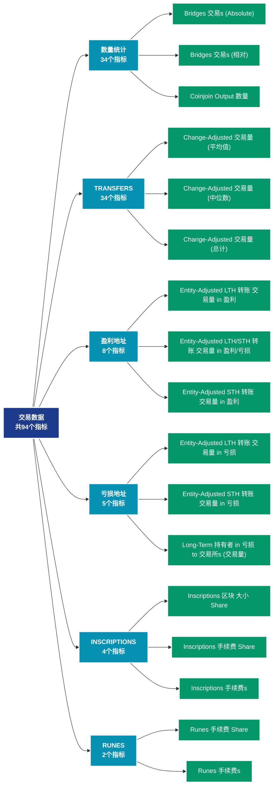

# 交易数据 (transactions)

## 📝 类别描述

深入分析链上交易活动，包括交易量、转账金额、交易类型等交易层面数据。

## 📊 指标概览

本类别共包含 **94** 个指标，涵盖以下主要子类别：

| 子类别 | 指标数量 | 主要功能 |
|--------|----------|----------|
| 数量统计 | 34 | 专门数据分析 |
| TRANSFERS | 34 | 交易活动分析 |
| 盈利地址 | 8 | 盈利状态分析 |
| 亏损地址 | 5 | 亏损状态评估 |
| INSCRIPTIONS | 4 | 专门数据分析 |
| RUNES | 2 | 专门数据分析 |
| SIZE | 2 | 专门数据分析 |
| SEGWIT | 1 | 专门数据分析 |
| SPENT | 1 | 专门数据分析 |
| TAPROOT | 1 | 专门数据分析 |

## 🎨 指标体系结构图



## 📂 详细指标说明

### 📊 数量统计（34个指标）

本子类别包含以下详细指标：

#### 1. Bridges 交易s (Absolute)

- **指标代码**: `transfers_count_bridges`
- **API路径**: `/v1/metrics/transactions/transfers_count_bridges`
- **英文名称**: Bridges Transactions (Absolute)

**英文原文：**
The number of transactions (transaction count) in the Ethereum network by contracts that allow transfer of tokens between different blockchains.

**中文解释：**
统计区块链上的交易或转账数量。交易数量反映网络的使用频率和采用程度。高交易量表明：1）网络功能被积极使用；2）经济活动活跃；3）可能的网络拥堵。交易数量的趋势变化是评估网络健康度的基础指标。

**使用示例**：
```python
# 获取Bridges 交易s (Absolute)数据
df = client.get_metric(
    "/v1/metrics/transactions/transfers_count_bridges",
    asset="BTC",
    resolution="24h"
)
```

---

#### 2. Bridges 交易s (相对)

- **指标代码**: `transfers_count_bridges_relative`
- **API路径**: `/v1/metrics/transactions/transfers_count_bridges_relative`
- **英文名称**: Bridges Transactions (Relative)

**英文原文：**
The relative amount (share) of transactions in the Ethereum network by contracts that allow transfer of tokens between different blockchains.

**中文解释：**
统计区块链上的交易或转账数量。交易数量反映网络的使用频率和采用程度。高交易量表明：1）网络功能被积极使用；2）经济活动活跃；3）可能的网络拥堵。交易数量的趋势变化是评估网络健康度的基础指标。

**使用示例**：
```python
# 获取Bridges 交易s (相对)数据
df = client.get_metric(
    "/v1/metrics/transactions/transfers_count_bridges_relative",
    asset="BTC",
    resolution="24h"
)
```

---

#### 3. Coinjoin Output 数量

- **指标代码**: `transfers_from_coinjoins_count`
- **API路径**: `/v1/metrics/transactions/transfers_from_coinjoins_count`
- **英文名称**: Coinjoin Output Count

**英文原文：**
The total count of indistinguishable outputs in coinjoin transactions. The metric is an aggregate of different coinjoin providers. Note that coinjoin metrics rely on heuristics and statistical information that change over time. Therefore these metrics are mutable – the data is stable, but especially most recent data points are subject to slight fluctuations as time progresses.

**中文解释：**
统计区块链上的交易或转账数量。交易数量反映网络的使用频率和采用程度。高交易量表明：1）网络功能被积极使用；2）经济活动活跃；3）可能的网络拥堵。交易数量的趋势变化是评估网络健康度的基础指标。

**使用示例**：
```python
# 获取Coinjoin Output 数量数据
df = client.get_metric(
    "/v1/metrics/transactions/transfers_from_coinjoins_count",
    asset="BTC",
    resolution="24h"
)
```

---

#### 4. Contract Calls (External)

- **指标代码**: `contract_calls_external_count`
- **API路径**: `/v1/metrics/transactions/contract_calls_external_count`
- **英文名称**: Contract Calls (External)

**英文原文：**
The total number of smart contract calls on the Ethereum network initiated by Externally Owned Addresses (EOAs), i.e. external transactions. Only successful transactions are counted.

**中文解释：**
分析Contract Calls (External)相关的链上数据。这个指标通过追踪区块链上的实时数据，提供了传统金融分析无法获得的透明度和洞察力。链上数据的优势在于：1）数据真实可验证；2）实时更新无延迟；3）覆盖所有参与者。通过综合分析多个链上指标，投资者可以做出更明智的决策，研究人员可以深入理解市场机制。

**使用示例**：
```python
# 获取Contract Calls (External)数据
df = client.get_metric(
    "/v1/metrics/transactions/contract_calls_external_count",
    asset="BTC",
    resolution="24h"
)
```

---

#### 5. Contract Calls (Internal)

- **指标代码**: `contract_calls_internal_count`
- **API路径**: `/v1/metrics/transactions/contract_calls_internal_count`
- **英文名称**: Contract Calls (Internal)

**英文原文：**
The total number of internal smart contract calls on the Ethereum network, i.e. contract calls initiated by other contracts (internal transactions). Only successful transactions are counted.

**中文解释：**
分析Contract Calls (Internal)相关的链上数据。这个指标通过追踪区块链上的实时数据，提供了传统金融分析无法获得的透明度和洞察力。链上数据的优势在于：1）数据真实可验证；2）实时更新无延迟；3）覆盖所有参与者。通过综合分析多个链上指标，投资者可以做出更明智的决策，研究人员可以深入理解市场机制。

**使用示例**：
```python
# 获取Contract Calls (Internal)数据
df = client.get_metric(
    "/v1/metrics/transactions/contract_calls_internal_count",
    asset="BTC",
    resolution="24h"
)
```

---

#### 6. DeFi 交易s (Absolute)

- **指标代码**: `transfers_count_defi`
- **API路径**: `/v1/metrics/transactions/transfers_count_defi`
- **英文名称**: DeFi Transactions (Absolute)

**英文原文：**
The number of transactions (transaction count) in the Ethereum network by on-chain financial instruments and protocols implemented as smart contracts, including decentralized exchanges (DEXs).

**中文解释：**
统计区块链上的交易或转账数量。交易数量反映网络的使用频率和采用程度。高交易量表明：1）网络功能被积极使用；2）经济活动活跃；3）可能的网络拥堵。交易数量的趋势变化是评估网络健康度的基础指标。

**使用示例**：
```python
# 获取DeFi 交易s (Absolute)数据
df = client.get_metric(
    "/v1/metrics/transactions/transfers_count_defi",
    asset="BTC",
    resolution="24h"
)
```

---

#### 7. DeFi 交易s (相对)

- **指标代码**: `transfers_count_defi_relative`
- **API路径**: `/v1/metrics/transactions/transfers_count_defi_relative`
- **英文名称**: DeFi Transactions (Relative)

**英文原文：**
The relative amount (share) of transactions in the Ethereum network by on-chain financial instruments and protocols implemented as smart contracts, including decentralized exchanges (DEXs).

**中文解释：**
统计区块链上的交易或转账数量。交易数量反映网络的使用频率和采用程度。高交易量表明：1）网络功能被积极使用；2）经济活动活跃；3）可能的网络拥堵。交易数量的趋势变化是评估网络健康度的基础指标。

**使用示例**：
```python
# 获取DeFi 交易s (相对)数据
df = client.get_metric(
    "/v1/metrics/transactions/transfers_count_defi_relative",
    asset="BTC",
    resolution="24h"
)
```

---

#### 8. Entity-Adjusted 交易 数量

- **指标代码**: `entity_adjusted_count`
- **API路径**: `/v1/metrics/transactions/entity_adjusted_count`
- **英文名称**: Entity-Adjusted Transaction Count

**英文原文：**
The estimated entity-adjusted number of transactions is defined as the number of transactions between different entities, i.e. the total number of transactions excluding transactions within addresses of the same entity. Entities are defined as a cluster of addresses that are controlled by the same network entity and are estimated through advanced heuristics and Glassnode&#x27;s proprietary clustering algorithms. Note that entity–based metrics are based on data science techniques and statistical information that changes over time and are therefore mutable – the data is stable, but most recent data points are subject to slight fluctuations as time progresses.

For more information this article.

**中文解释：**
分析Entity-Adjusted Transaction Count相关的链上数据。这个指标通过追踪区块链上的实时数据，提供了传统金融分析无法获得的透明度和洞察力。链上数据的优势在于：1）数据真实可验证；2）实时更新无延迟；3）覆盖所有参与者。通过综合分析多个链上指标，投资者可以做出更明智的决策，研究人员可以深入理解市场机制。

**使用示例**：
```python
# 获取Entity-Adjusted 交易 数量数据
df = client.get_metric(
    "/v1/metrics/transactions/entity_adjusted_count",
    asset="BTC",
    resolution="24h"
)
```

---

#### 9. ERC-20 交易s (Absolute)

- **指标代码**: `transfers_count_erc20`
- **API路径**: `/v1/metrics/transactions/transfers_count_erc20`
- **英文名称**: ERC-20 Transactions (Absolute)

**英文原文：**
The number of transactions (transaction count) in the Ethereum network by transactions calling ERC20 contracts. Stablecoins contracts are excluded here.

**中文解释：**
统计区块链上的交易或转账数量。交易数量反映网络的使用频率和采用程度。高交易量表明：1）网络功能被积极使用；2）经济活动活跃；3）可能的网络拥堵。交易数量的趋势变化是评估网络健康度的基础指标。

**使用示例**：
```python
# 获取ERC-20 交易s (Absolute)数据
df = client.get_metric(
    "/v1/metrics/transactions/transfers_count_erc20",
    asset="BTC",
    resolution="24h"
)
```

---

#### 10. ERC-20 交易s (相对)

- **指标代码**: `transfers_count_erc20_relative`
- **API路径**: `/v1/metrics/transactions/transfers_count_erc20_relative`
- **英文名称**: ERC-20 Transactions (Relative)

**英文原文：**
The relative amount (share) of transactions in the Ethereum network by transactions calling ERC20 contracts. Stablecoins contracts are excluded here.

**中文解释：**
统计区块链上的交易或转账数量。交易数量反映网络的使用频率和采用程度。高交易量表明：1）网络功能被积极使用；2）经济活动活跃；3）可能的网络拥堵。交易数量的趋势变化是评估网络健康度的基础指标。

**使用示例**：
```python
# 获取ERC-20 交易s (相对)数据
df = client.get_metric(
    "/v1/metrics/transactions/transfers_count_erc20_relative",
    asset="BTC",
    resolution="24h"
)
```

---

#### 11. 交易所 Deposits

- **指标代码**: `transfers_to_exchanges_count`
- **API路径**: `/v1/metrics/transactions/transfers_to_exchanges_count`
- **英文名称**: Exchange Deposits

**英文原文：**
The total count of transfers to exchange addresses, i.e. the number of on-chain deposits to exchanges. Note that exchange metrics are based on our labeled data of exchange addresses that we constantly keep updating, as well as data science techniques and statistical information that changes over time. Therefore these metrics are mutable – the data is stable, but especially most recent data points are subject to slight fluctuations as time progresses.

**中文解释：**
统计区块链上的交易或转账数量。交易数量反映网络的使用频率和采用程度。高交易量表明：1）网络功能被积极使用；2）经济活动活跃；3）可能的网络拥堵。交易数量的趋势变化是评估网络健康度的基础指标。

**使用示例**：
```python
# 获取交易所 Deposits数据
df = client.get_metric(
    "/v1/metrics/transactions/transfers_to_exchanges_count",
    asset="BTC",
    resolution="24h"
)
```

---

#### 12. 交易所 Withdrawals

- **指标代码**: `transfers_from_exchanges_count`
- **API路径**: `/v1/metrics/transactions/transfers_from_exchanges_count`
- **英文名称**: Exchange Withdrawals

**英文原文：**
The total count of transfers from exchange addresses, i.e. the number of on-chain withdrawals from exchanges. Note that exchange metrics are based on our labeled data of exchange addresses that we constantly keep updating, as well as data science techniques and statistical information that changes over time. Therefore these metrics are mutable – the data is stable, but especially most recent data points are subject to slight fluctuations as time progresses.

**中文解释：**
统计区块链上的交易或转账数量。交易数量反映网络的使用频率和采用程度。高交易量表明：1）网络功能被积极使用；2）经济活动活跃；3）可能的网络拥堵。交易数量的趋势变化是评估网络健康度的基础指标。

**使用示例**：
```python
# 获取交易所 Withdrawals数据
df = client.get_metric(
    "/v1/metrics/transactions/transfers_from_exchanges_count",
    asset="BTC",
    resolution="24h"
)
```

---

#### 13. Inscriptions 总计 数量

- **指标代码**: `inscriptions_count_sum`
- **API路径**: `/v1/metrics/transactions/inscriptions_count_sum`
- **英文名称**: Inscriptions Total Count

**英文原文：**
This metric presents the cumulative sum of transactions including inscriptions for each inscription type. The bar chart illustrates the cumulative sum of each type, with the x-axis representing the block time resolution and the y-axis displaying the cumulative sum of inscription transactions.

**中文解释：**
分析Inscriptions Total Count相关的链上数据。这个指标通过追踪区块链上的实时数据，提供了传统金融分析无法获得的透明度和洞察力。链上数据的优势在于：1）数据真实可验证；2）实时更新无延迟；3）覆盖所有参与者。通过综合分析多个链上指标，投资者可以做出更明智的决策，研究人员可以深入理解市场机制。

**使用示例**：
```python
# 获取Inscriptions 总计 数量数据
df = client.get_metric(
    "/v1/metrics/transactions/inscriptions_count_sum",
    asset="BTC",
    resolution="24h"
)
```

---

#### 14. Inscriptions 交易 数量

- **指标代码**: `inscriptions_count`
- **API路径**: `/v1/metrics/transactions/inscriptions_count`
- **英文名称**: Inscriptions Transaction Count

**英文原文：**
This metric represents the total number of transactions with inscriptions for each inscription type (text (other than brc-20), text/brc-20, image, video, other, and audio). The chart visualizes this metric over time, using a bar chart, with the x-axis representing the block time resolution (e.g., hourly or daily) and the y-axis representing the count of inscription transactions.

**中文解释：**
分析Inscriptions Transaction Count相关的链上数据。这个指标通过追踪区块链上的实时数据，提供了传统金融分析无法获得的透明度和洞察力。链上数据的优势在于：1）数据真实可验证；2）实时更新无延迟；3）覆盖所有参与者。通过综合分析多个链上指标，投资者可以做出更明智的决策，研究人员可以深入理解市场机制。

**使用示例**：
```python
# 获取Inscriptions 交易 数量数据
df = client.get_metric(
    "/v1/metrics/transactions/inscriptions_count",
    asset="BTC",
    resolution="24h"
)
```

---

#### 15. Inscriptions 交易 数量 Share

- **指标代码**: `inscriptions_count_share`
- **API路径**: `/v1/metrics/transactions/inscriptions_count_share`
- **英文名称**: Inscriptions Transaction Count Share

**英文原文：**
This metric shows the share or proportion of transactions with inscriptions for each type relative to the total volume (hourly or daily). The bar chart displays the share of each inscription type over time, with the x-axis representing the block time resolution and the y-axis representing the share of inscription transactions.

**中文解释：**
分析Inscriptions Transaction Count Share相关的链上数据。这个指标通过追踪区块链上的实时数据，提供了传统金融分析无法获得的透明度和洞察力。链上数据的优势在于：1）数据真实可验证；2）实时更新无延迟；3）覆盖所有参与者。通过综合分析多个链上指标，投资者可以做出更明智的决策，研究人员可以深入理解市场机制。

**使用示例**：
```python
# 获取Inscriptions 交易 数量 Share数据
df = client.get_metric(
    "/v1/metrics/transactions/inscriptions_count_share",
    asset="BTC",
    resolution="24h"
)
```

---

#### 16. Inter-交易所 转账s

- **指标代码**: `transfers_between_exchanges_count`
- **API路径**: `/v1/metrics/transactions/transfers_between_exchanges_count`
- **英文名称**: Inter-Exchange Transfers

**英文原文：**
The total count of transfers between exchanges. Note that exchange metrics are based on our labeled data of exchange addresses that we constantly keep updating, as well as data science techniques and statistical information that changes over time. Therefore these metrics are mutable – the data is stable, but especially most recent data points are subject to slight fluctuations as time progresses.

**中文解释：**
统计区块链上的交易或转账数量。交易数量反映网络的使用频率和采用程度。高交易量表明：1）网络功能被积极使用；2）经济活动活跃；3）可能的网络拥堵。交易数量的趋势变化是评估网络健康度的基础指标。

**使用示例**：
```python
# 获取Inter-交易所 转账s数据
df = client.get_metric(
    "/v1/metrics/transactions/transfers_between_exchanges_count",
    asset="BTC",
    resolution="24h"
)
```

---

#### 17. Miner Incoming 转账s

- **指标代码**: `transfers_to_miners_count`
- **API路径**: `/v1/metrics/transactions/transfers_to_miners_count`
- **英文名称**: Miner Incoming Transfers

**英文原文：**
The total number of transfers in which the receiver is a miners&#x27; address.

**中文解释：**
统计区块链上的交易或转账数量。交易数量反映网络的使用频率和采用程度。高交易量表明：1）网络功能被积极使用；2）经济活动活跃；3）可能的网络拥堵。交易数量的趋势变化是评估网络健康度的基础指标。

**使用示例**：
```python
# 获取Miner Incoming 转账s数据
df = client.get_metric(
    "/v1/metrics/transactions/transfers_to_miners_count",
    asset="BTC",
    resolution="24h"
)
```

---

#### 18. Miner Outgoing 转账s

- **指标代码**: `transfers_from_miners_count`
- **API路径**: `/v1/metrics/transactions/transfers_from_miners_count`
- **英文名称**: Miner Outgoing Transfers

**英文原文：**
The total number of transfers in which the sender is a miners&#x27; address.

**中文解释：**
统计区块链上的交易或转账数量。交易数量反映网络的使用频率和采用程度。高交易量表明：1）网络功能被积极使用；2）经济活动活跃；3）可能的网络拥堵。交易数量的趋势变化是评估网络健康度的基础指标。

**使用示例**：
```python
# 获取Miner Outgoing 转账s数据
df = client.get_metric(
    "/v1/metrics/transactions/transfers_from_miners_count",
    asset="BTC",
    resolution="24h"
)
```

---

#### 19. NFTs 交易s (Absolute)

- **指标代码**: `transfers_count_nfts`
- **API路径**: `/v1/metrics/transactions/transfers_count_nfts`
- **英文名称**: NFTs Transactions (Absolute)

**英文原文：**
The number of transactions (transaction count) in the Ethereum network by transactions interacting with non-fungible tokens. This category includes of both token contract standards (ERC721, ERC1155), as well as NFT marketplaces (OpenSea, Blur, LooksRare, Rarible, SuperRare) for trading those.

**中文解释：**
统计区块链上的交易或转账数量。交易数量反映网络的使用频率和采用程度。高交易量表明：1）网络功能被积极使用；2）经济活动活跃；3）可能的网络拥堵。交易数量的趋势变化是评估网络健康度的基础指标。

**使用示例**：
```python
# 获取NFTs 交易s (Absolute)数据
df = client.get_metric(
    "/v1/metrics/transactions/transfers_count_nfts",
    asset="BTC",
    resolution="24h"
)
```

---

#### 20. NFTs 交易s (相对)

- **指标代码**: `transfers_count_nfts_relative`
- **API路径**: `/v1/metrics/transactions/transfers_count_nfts_relative`
- **英文名称**: NFTs Transactions (Relative)

**英文原文：**
The relative amount (share) of transactions in the Ethereum network by transactions interacting with non-fungible tokens. This category includes of both token contract standards (ERC721, ERC1155), as well as NFT marketplaces (OpenSea, Blur, LooksRare, Rarible, SuperRare) for trading those.

**中文解释：**
统计区块链上的交易或转账数量。交易数量反映网络的使用频率和采用程度。高交易量表明：1）网络功能被积极使用；2）经济活动活跃；3）可能的网络拥堵。交易数量的趋势变化是评估网络健康度的基础指标。

**使用示例**：
```python
# 获取NFTs 交易s (相对)数据
df = client.get_metric(
    "/v1/metrics/transactions/transfers_count_nfts_relative",
    asset="BTC",
    resolution="24h"
)
```

---

#### 21. OTC Desks Incoming 交易s

- **指标代码**: `transfers_to_otc_desks_count`
- **API路径**: `/v1/metrics/transactions/transfers_to_otc_desks_count`
- **英文名称**: OTC Desks Incoming Transactions

**英文原文：**
The total count of transfers to OTC desk addresses. This data is based on three different OTC desks. Note that OTC metrics are based on our labeled data that we constantly keep updating, as well as data science techniques and statistical information that changes over time. Therefore these metrics are mutable – the data is stable, but especially most recent data points are subject to slight fluctuations as time progresses.

**中文解释：**
统计区块链上的交易或转账数量。交易数量反映网络的使用频率和采用程度。高交易量表明：1）网络功能被积极使用；2）经济活动活跃；3）可能的网络拥堵。交易数量的趋势变化是评估网络健康度的基础指标。

**使用示例**：
```python
# 获取OTC Desks Incoming 交易s数据
df = client.get_metric(
    "/v1/metrics/transactions/transfers_to_otc_desks_count",
    asset="BTC",
    resolution="24h"
)
```

---

#### 22. OTC Desks Outgoing 交易s

- **指标代码**: `transfers_from_otc_desks_count`
- **API路径**: `/v1/metrics/transactions/transfers_from_otc_desks_count`
- **英文名称**: OTC Desks Outgoing Transactions

**英文原文：**
The total count of transfers from OTC desk addresses. This data is based on three different OTC desks. Note that OTC metrics are based on our labeled data that we constantly keep updating, as well as data science techniques and statistical information that changes over time. Therefore these metrics are mutable – the data is stable, but especially most recent data points are subject to slight fluctuations as time progresses.

**中文解释：**
统计区块链上的交易或转账数量。交易数量反映网络的使用频率和采用程度。高交易量表明：1）网络功能被积极使用；2）经济活动活跃；3）可能的网络拥堵。交易数量的趋势变化是评估网络健康度的基础指标。

**使用示例**：
```python
# 获取OTC Desks Outgoing 交易s数据
df = client.get_metric(
    "/v1/metrics/transactions/transfers_from_otc_desks_count",
    asset="BTC",
    resolution="24h"
)
```

---

#### 23. Runes 数量

- **指标代码**: `runes_count`
- **API路径**: `/v1/metrics/transactions/runes_count`
- **英文名称**: Runes Count

**英文原文：**
The number of transactions with new Rune protocol messages (Runestones).

**中文解释：**
分析Runes Count相关的链上数据。这个指标通过追踪区块链上的实时数据，提供了传统金融分析无法获得的透明度和洞察力。链上数据的优势在于：1）数据真实可验证；2）实时更新无延迟；3）覆盖所有参与者。通过综合分析多个链上指标，投资者可以做出更明智的决策，研究人员可以深入理解市场机制。

**使用示例**：
```python
# 获取Runes 数量数据
df = client.get_metric(
    "/v1/metrics/transactions/runes_count",
    asset="BTC",
    resolution="24h"
)
```

---

#### 24. Runes 数量 Share

- **指标代码**: `runes_count_share`
- **API路径**: `/v1/metrics/transactions/runes_count_share`
- **英文名称**: Runes Count Share

**英文原文：**
The relative number transactions including Rune protocol messages (Runestones).

**中文解释：**
分析Runes Count Share相关的链上数据。这个指标通过追踪区块链上的实时数据，提供了传统金融分析无法获得的透明度和洞察力。链上数据的优势在于：1）数据真实可验证；2）实时更新无延迟；3）覆盖所有参与者。通过综合分析多个链上指标，投资者可以做出更明智的决策，研究人员可以深入理解市场机制。

**使用示例**：
```python
# 获取Runes 数量 Share数据
df = client.get_metric(
    "/v1/metrics/transactions/runes_count_share",
    asset="BTC",
    resolution="24h"
)
```

---

#### 25. Runes 总计 数量

- **指标代码**: `runes_count_sum`
- **API路径**: `/v1/metrics/transactions/runes_count_sum`
- **英文名称**: Runes Total Count

**英文原文：**
The total number of transactions with Rune protocol messages (Runestones).

**中文解释：**
分析Runes Total Count相关的链上数据。这个指标通过追踪区块链上的实时数据，提供了传统金融分析无法获得的透明度和洞察力。链上数据的优势在于：1）数据真实可验证；2）实时更新无延迟；3）覆盖所有参与者。通过综合分析多个链上指标，投资者可以做出更明智的决策，研究人员可以深入理解市场机制。

**使用示例**：
```python
# 获取Runes 总计 数量数据
df = client.get_metric(
    "/v1/metrics/transactions/runes_count_sum",
    asset="BTC",
    resolution="24h"
)
```

---

#### 26. Stablecoins 交易s (Absolute)

- **指标代码**: `transfers_count_stablecoins`
- **API路径**: `/v1/metrics/transactions/transfers_count_stablecoins`
- **英文名称**: Stablecoins Transactions (Absolute)

**英文原文：**
The number of transactions (transaction count) in the Ethereum network by stablecoin transactions. Stablecoin are fungible tokens that have their value pegged to an off-chain asset, either by the issuer or by an algorithm. We include 150+ stablecoins in this category, with USDT, USDC, UST, BUSD, and DAI being the most prominent ones.

**中文解释：**
统计区块链上的交易或转账数量。交易数量反映网络的使用频率和采用程度。高交易量表明：1）网络功能被积极使用；2）经济活动活跃；3）可能的网络拥堵。交易数量的趋势变化是评估网络健康度的基础指标。

**使用示例**：
```python
# 获取Stablecoins 交易s (Absolute)数据
df = client.get_metric(
    "/v1/metrics/transactions/transfers_count_stablecoins",
    asset="BTC",
    resolution="24h"
)
```

---

#### 27. Stablecoins 交易s (相对)

- **指标代码**: `transfers_count_stablecoins_relative`
- **API路径**: `/v1/metrics/transactions/transfers_count_stablecoins_relative`
- **英文名称**: Stablecoins Transactions (Relative)

**英文原文：**
The relative amount (share) of transactions in the Ethereum network by stablecoin transactions. Stablecoin are fungible tokens that have their value pegged to an off-chain asset, either by the issuer or by an algorithm. We include 150+ stablecoins in this category, with USDT, USDC, UST, BUSD, and DAI being the most prominent ones.

**中文解释：**
统计区块链上的交易或转账数量。交易数量反映网络的使用频率和采用程度。高交易量表明：1）网络功能被积极使用；2）经济活动活跃；3）可能的网络拥堵。交易数量的趋势变化是评估网络健康度的基础指标。

**使用示例**：
```python
# 获取Stablecoins 交易s (相对)数据
df = client.get_metric(
    "/v1/metrics/transactions/transfers_count_stablecoins_relative",
    asset="BTC",
    resolution="24h"
)
```

---

#### 28. 交易 数量

- **指标代码**: `count`
- **API路径**: `/v1/metrics/transactions/count`
- **英文名称**: Transaction Count

**英文原文：**
The total amount of transactions. Only successful transactions are counted.

**中文解释：**
分析Transaction Count相关的链上数据。这个指标通过追踪区块链上的实时数据，提供了传统金融分析无法获得的透明度和洞察力。链上数据的优势在于：1）数据真实可验证；2）实时更新无延迟；3）覆盖所有参与者。通过综合分析多个链上指标，投资者可以做出更明智的决策，研究人员可以深入理解市场机制。

**使用示例**：
```python
# 获取交易 数量数据
df = client.get_metric(
    "/v1/metrics/transactions/count",
    asset="BTC",
    resolution="24h"
)
```

---

#### 29. 交易 Type Breakdown (Absolute)

- **指标代码**: `tx_types_breakdown_count`
- **API路径**: `/v1/metrics/transactions/tx_types_breakdown_count`
- **英文名称**: Transaction Type Breakdown (Absolute)

**英文原文：**
The number of transactions (transaction count) in the Ethereum network by category. Transactions are classified into the following categories:

- *Vanilla:* Pure ETH transfers between Externally Owned Accounts (EOAs), with no contracts being called.

- *ERC20:* All transactions calling ERC20 contracts. Contracts in the Stablecoins category are excluded here.

- *Stablecoins:* Fungible tokens that have their value pegged to an off-chain asset, either by the issuer or by an algorithm. We include 150+ stablecoins in this category, with USDT, USDC, UST, BUSD, and DAI being the most prominent ones.

- *DeFi:* On-chain financial instruments and protocols implemented as smart contracts, including decentralized exchanges (DEXs). We include over 90+ DeFi protocols in this category, such as Uniswap, Etherdelta, 1inch, Sushiswap, Aave, and 0x.

- *Bridges:* Contracts allowing transfer of tokens between different blockchains. We include 50+ bridges in this category, such as Ronin, Polygon, Optimism, and Arbitrum.

- *NFTs:* Transactions interacting with non-fungible tokens. This category includes of both token contract standards (ERC721, ERC1155), as well as NFT marketplaces (OpenSea, Blur, LooksRare, Rarible, SuperRare) for trading those.

- *MEV Bots:* Miner Extractable Value (MEV) bots execute transactions for profit by reordering, inserting, and censoring transactions within blocks.

- *Other:* This category includes all other transactions in the Ethereum network that are not included in categories listed above.

**中文解释：**
分析Transaction Type Breakdown (Absolute)相关的链上数据。这个指标通过追踪区块链上的实时数据，提供了传统金融分析无法获得的透明度和洞察力。链上数据的优势在于：1）数据真实可验证；2）实时更新无延迟；3）覆盖所有参与者。通过综合分析多个链上指标，投资者可以做出更明智的决策，研究人员可以深入理解市场机制。

**使用示例**：
```python
# 获取交易 Type Breakdown (Absolute)数据
df = client.get_metric(
    "/v1/metrics/transactions/tx_types_breakdown_count",
    asset="BTC",
    resolution="24h"
)
```

---

#### 30. 转账 数量

- **指标代码**: `transfers_count`
- **API路径**: `/v1/metrics/transactions/transfers_count`
- **英文名称**: Transfer Count

**英文原文：**
The total amount of transfers. One transaction can trigger one or more transfers. Only successful, non-zero transfers are counted.

**中文解释：**
统计区块链上的交易或转账数量。交易数量反映网络的使用频率和采用程度。高交易量表明：1）网络功能被积极使用；2）经济活动活跃；3）可能的网络拥堵。交易数量的趋势变化是评估网络健康度的基础指标。

**使用示例**：
```python
# 获取转账 数量数据
df = client.get_metric(
    "/v1/metrics/transactions/transfers_count",
    asset="BTC",
    resolution="24h"
)
```

---

#### 31. Vanilla 交易s (Absolute)

- **指标代码**: `transfers_count_vanilla`
- **API路径**: `/v1/metrics/transactions/transfers_count_vanilla`
- **英文名称**: Vanilla Transactions (Absolute)

**英文原文：**
The amount of gas consumed by the Ethereum network by vanilla transactions. Vanilla transactions are pure ETH transfers between Externally Owned Accounts (EOAs), with no contracts being called.
      If at least one of the EOAs participating in the transaction (the receiver, the sender, or both) belongs to an exchange, the amount will be represented in the exchange cohort.
      Note that occasionally the value of the last datapoint can slightly change as some addresses initially transact as "vanilla" before their associated smart contract deployment is observed.

**中文解释：**
统计区块链上的交易或转账数量。交易数量反映网络的使用频率和采用程度。高交易量表明：1）网络功能被积极使用；2）经济活动活跃；3）可能的网络拥堵。交易数量的趋势变化是评估网络健康度的基础指标。

**使用示例**：
```python
# 获取Vanilla 交易s (Absolute)数据
df = client.get_metric(
    "/v1/metrics/transactions/transfers_count_vanilla",
    asset="BTC",
    resolution="24h"
)
```

---

#### 32. Vanilla 交易s (相对)

- **指标代码**: `transfers_count_vanilla_relative`
- **API路径**: `/v1/metrics/transactions/transfers_count_vanilla_relative`
- **英文名称**: Vanilla Transactions (Relative)

**英文原文：**
The relative amount (share) of gas consumed by the Ethereum network by vanilla transactions. Vanilla transactions are pure ETH transfers between Externally Owned Accounts (EOAs), with no contracts being called.
      If at least one of the EOAs participating in the transaction (the receiver, the sender, or both) belongs to an exchange, the amount will be represented in the exchange cohort.
      Note that occasionally the value of the last datapoint can slightly change as some addresses initially transact as "vanilla" before their associated smart contract deployment is observed.

**中文解释：**
统计区块链上的交易或转账数量。交易数量反映网络的使用频率和采用程度。高交易量表明：1）网络功能被积极使用；2）经济活动活跃；3）可能的网络拥堵。交易数量的趋势变化是评估网络健康度的基础指标。

**使用示例**：
```python
# 获取Vanilla 交易s (相对)数据
df = client.get_metric(
    "/v1/metrics/transactions/transfers_count_vanilla_relative",
    asset="BTC",
    resolution="24h"
)
```

---

#### 33. 巨鲸 Deposits to 交易所s (数量s)

- **指标代码**: `transfers_whales_to_exchanges_count`
- **API路径**: `/v1/metrics/transactions/transfers_whales_to_exchanges_count`
- **英文名称**: Whale Deposits to Exchanges (Counts)

**英文原文：**
The total count of transfers from whales to exchange addresses. Whales are defined as network entities (cluster of addresses) that hold at least 1,000 BTC. Note that exchange metrics are based on our labeled data of exchange addresses that we constantly keep updating, as well as data science techniques and statistical information that changes over time. Therefore these metrics are mutable – the data is stable, but especially most recent data points are subject to slight fluctuations as time progresses.

**中文解释：**
统计区块链上的交易或转账数量。交易数量反映网络的使用频率和采用程度。高交易量表明：1）网络功能被积极使用；2）经济活动活跃；3）可能的网络拥堵。交易数量的趋势变化是评估网络健康度的基础指标。

**使用示例**：
```python
# 获取巨鲸 Deposits to 交易所s (数量s)数据
df = client.get_metric(
    "/v1/metrics/transactions/transfers_whales_to_exchanges_count",
    asset="BTC",
    resolution="24h"
)
```

---

#### 34. 巨鲸 Withdrawals from 交易所s (数量s)

- **指标代码**: `transfers_exchanges_to_whales_count`
- **API路径**: `/v1/metrics/transactions/transfers_exchanges_to_whales_count`
- **英文名称**: Whale Withdrawals from Exchanges (Counts)

**英文原文：**
The total count of transfers from exchange addresses to whales. Whales are defined as network entities (cluster of addresses) that hold at least 1,000 BTC. Note that exchange metrics are based on our labeled data of exchange addresses that we constantly keep updating, as well as data science techniques and statistical information that changes over time. Therefore these metrics are mutable – the data is stable, but especially most recent data points are subject to slight fluctuations as time progresses.

**中文解释：**
统计区块链上的交易或转账数量。交易数量反映网络的使用频率和采用程度。高交易量表明：1）网络功能被积极使用；2）经济活动活跃；3）可能的网络拥堵。交易数量的趋势变化是评估网络健康度的基础指标。

**使用示例**：
```python
# 获取巨鲸 Withdrawals from 交易所s (数量s)数据
df = client.get_metric(
    "/v1/metrics/transactions/transfers_exchanges_to_whales_count",
    asset="BTC",
    resolution="24h"
)
```

---

### 📊 TRANSFERS（34个指标）

本子类别包含以下详细指标：

#### 1. Change-Adjusted 交易量 (平均值)

- **指标代码**: `transfers_volume_adjusted_mean`
- **API路径**: `/v1/metrics/transactions/transfers_volume_adjusted_mean`
- **英文名称**: Change-Adjusted Volume (Mean)

**英文原文：**
The mean value of a transfer, adjusted by change volume. Only successful transfers are counted.

**中文解释：**
计算交易或转账的总价值。交易量反映经济活动的规模，是网络价值流动的直接体现。异常高的交易量可能因为：1）大户移动资金；2）交易所之间转账；3）市场剧烈波动期间的活跃交易。需要结合其他指标判断交易量的性质。

**使用示例**：
```python
# 获取Change-Adjusted 交易量 (平均值)数据
df = client.get_metric(
    "/v1/metrics/transactions/transfers_volume_adjusted_mean",
    asset="BTC",
    resolution="24h"
)
```

---

#### 2. Change-Adjusted 交易量 (中位数)

- **指标代码**: `transfers_volume_adjusted_median`
- **API路径**: `/v1/metrics/transactions/transfers_volume_adjusted_median`
- **英文名称**: Change-Adjusted Volume (Median)

**英文原文：**
The median value of a transfer, adjusted by change volume. Only successful transfers are counted.

**中文解释：**
计算交易或转账的总价值。交易量反映经济活动的规模，是网络价值流动的直接体现。异常高的交易量可能因为：1）大户移动资金；2）交易所之间转账；3）市场剧烈波动期间的活跃交易。需要结合其他指标判断交易量的性质。

**使用示例**：
```python
# 获取Change-Adjusted 交易量 (中位数)数据
df = client.get_metric(
    "/v1/metrics/transactions/transfers_volume_adjusted_median",
    asset="BTC",
    resolution="24h"
)
```

---

#### 3. Change-Adjusted 交易量 (总计)

- **指标代码**: `transfers_volume_adjusted_sum`
- **API路径**: `/v1/metrics/transactions/transfers_volume_adjusted_sum`
- **英文名称**: Change-Adjusted Volume (Total)

**英文原文：**
The total amount of coins transferred on-chain, adjusted by change volume. Only successful transfers are counted.

**中文解释：**
计算交易或转账的总价值。交易量反映经济活动的规模，是网络价值流动的直接体现。异常高的交易量可能因为：1）大户移动资金；2）交易所之间转账；3）市场剧烈波动期间的活跃交易。需要结合其他指标判断交易量的性质。

**使用示例**：
```python
# 获取Change-Adjusted 交易量 (总计)数据
df = client.get_metric(
    "/v1/metrics/transactions/transfers_volume_adjusted_sum",
    asset="BTC",
    resolution="24h"
)
```

---

#### 4. Coinjoin Output 交易量

- **指标代码**: `transfers_volume_from_coinjoins_sum`
- **API路径**: `/v1/metrics/transactions/transfers_volume_from_coinjoins_sum`
- **英文名称**: Coinjoin Output Volume

**英文原文：**
The total amount of indistinguishable outputs in coinjoin transactions, i.e. the volume of coins mixed by different coinjoin providers. Note that coinjoin metrics rely on heuristics and statistical information that change over time. Therefore these metrics are mutable – the data is stable, but especially most recent data points are subject to slight fluctuations as time progresses.

**中文解释：**
计算交易或转账的总价值。交易量反映经济活动的规模，是网络价值流动的直接体现。异常高的交易量可能因为：1）大户移动资金；2）交易所之间转账；3）市场剧烈波动期间的活跃交易。需要结合其他指标判断交易量的性质。

**使用示例**：
```python
# 获取Coinjoin Output 交易量数据
df = client.get_metric(
    "/v1/metrics/transactions/transfers_volume_from_coinjoins_sum",
    asset="BTC",
    resolution="24h"
)
```

---

#### 5. Entity-Adjusted LTH 转账 交易量

- **指标代码**: `transfers_volume_entity_adjusted_from_lth_sum`
- **API路径**: `/v1/metrics/transactions/transfers_volume_entity_adjusted_from_lth_sum`
- **英文名称**: Entity-Adjusted LTH Transfer Volume

**英文原文：**
The total estimated amount of coins moved by long-term holders. Volume transferred within addresses of the same entity is excluded. Long- and Short-Term Holder supply is defined with respect to the entity&#x27;s averaged purchasing date with weights given by a logistic function centered at an age of 155 days and a transition width of 10 days.

Entities are defined as a cluster of addresses that are controlled by the same network entity and are estimated through advanced heuristics and Glassnode&#x27;s proprietary clustering algorithms. Note that entity–based metrics are based on data science techniques and statistical information that changes over time and are therefore mutable – the data is stable, but most recent data points are subject to slight fluctuations as time progresses. For more information see this article.

**中文解释：**
计算交易或转账的总价值。交易量反映经济活动的规模，是网络价值流动的直接体现。异常高的交易量可能因为：1）大户移动资金；2）交易所之间转账；3）市场剧烈波动期间的活跃交易。需要结合其他指标判断交易量的性质。

**使用示例**：
```python
# 获取Entity-Adjusted LTH 转账 交易量数据
df = client.get_metric(
    "/v1/metrics/transactions/transfers_volume_entity_adjusted_from_lth_sum",
    asset="BTC",
    resolution="24h"
)
```

---

#### 6. Entity-Adjusted STH 转账 交易量

- **指标代码**: `transfers_volume_entity_adjusted_from_sth_sum`
- **API路径**: `/v1/metrics/transactions/transfers_volume_entity_adjusted_from_sth_sum`
- **英文名称**: Entity-Adjusted STH Transfer Volume

**英文原文：**
The total estimated amount of coins moved by short-term holders. Volume transferred within addresses of the same entity is excluded. Long- and Short-Term Holder supply is defined with respect to the entity&#x27;s averaged purchasing date with weights given by a logistic function centered at an age of 155 days and a transition width of 10 days.

Entities are defined as a cluster of addresses that are controlled by the same network entity and are estimated through advanced heuristics and Glassnode&#x27;s proprietary clustering algorithms. Note that entity–based metrics are based on data science techniques and statistical information that changes over time and are therefore mutable – the data is stable, but most recent data points are subject to slight fluctuations as time progresses. For more information see this article.

**中文解释：**
计算交易或转账的总价值。交易量反映经济活动的规模，是网络价值流动的直接体现。异常高的交易量可能因为：1）大户移动资金；2）交易所之间转账；3）市场剧烈波动期间的活跃交易。需要结合其他指标判断交易量的性质。

**使用示例**：
```python
# 获取Entity-Adjusted STH 转账 交易量数据
df = client.get_metric(
    "/v1/metrics/transactions/transfers_volume_entity_adjusted_from_sth_sum",
    asset="BTC",
    resolution="24h"
)
```

---

#### 7. Entity-Adjusted 交易量 (平均值)

- **指标代码**: `transfers_volume_entity_adjusted_mean`
- **API路径**: `/v1/metrics/transactions/transfers_volume_entity_adjusted_mean`
- **英文名称**: Entity-Adjusted Volume (Mean)

**英文原文：**
The mean estimated amount of coins moved between different entities, i.e. excluding the volume transferred within addresses of the same entity. Entities are defined as a cluster of addresses that are controlled by the same network entity and are estimated through advanced heuristics and Glassnode&#x27;s proprietary clustering algorithms. Note that entity–based metrics are based on data science techniques and statistical information that changes over time and are therefore mutable – the data is stable, but most recent data points are subject to slight fluctuations as time progresses.

For more information this article.

**中文解释：**
计算交易或转账的总价值。交易量反映经济活动的规模，是网络价值流动的直接体现。异常高的交易量可能因为：1）大户移动资金；2）交易所之间转账；3）市场剧烈波动期间的活跃交易。需要结合其他指标判断交易量的性质。

**使用示例**：
```python
# 获取Entity-Adjusted 交易量 (平均值)数据
df = client.get_metric(
    "/v1/metrics/transactions/transfers_volume_entity_adjusted_mean",
    asset="BTC",
    resolution="24h"
)
```

---

#### 8. Entity-Adjusted 交易量 (中位数)

- **指标代码**: `transfers_volume_entity_adjusted_median`
- **API路径**: `/v1/metrics/transactions/transfers_volume_entity_adjusted_median`
- **英文名称**: Entity-Adjusted Volume (Median)

**英文原文：**
The median estimated amount of coins moved between different entities, i.e. excluding volume transferred within addresses of the same entity. Entities are defined as a cluster of addresses that are controlled by the same network entity and are estimated through advanced heuristics and Glassnode&#x27;s proprietary clustering algorithms. Note that entity–based metrics are based on data science techniques and statistical information that changes over time and are therefore mutable – the data is stable, but most recent data points are subject to slight fluctuations as time progresses.

For more information this article.

**中文解释：**
计算交易或转账的总价值。交易量反映经济活动的规模，是网络价值流动的直接体现。异常高的交易量可能因为：1）大户移动资金；2）交易所之间转账；3）市场剧烈波动期间的活跃交易。需要结合其他指标判断交易量的性质。

**使用示例**：
```python
# 获取Entity-Adjusted 交易量 (中位数)数据
df = client.get_metric(
    "/v1/metrics/transactions/transfers_volume_entity_adjusted_median",
    asset="BTC",
    resolution="24h"
)
```

---

#### 9. Entity-Adjusted 交易量 (总计)

- **指标代码**: `transfers_volume_entity_adjusted_sum`
- **API路径**: `/v1/metrics/transactions/transfers_volume_entity_adjusted_sum`
- **英文名称**: Entity-Adjusted Volume (Total)

**英文原文：**
The total estimated amount of coins moved between different entities, i.e. the total volumed transferred excluding the volume transferred within addresses of the same entity. Entities are defined as a cluster of addresses that are controlled by the same network entity and are estimated through advanced heuristics and Glassnode&#x27;s proprietary clustering algorithms. Note that entity–based metrics are based on data science techniques and statistical information that changes over time and are therefore mutable – the data is stable, but most recent data points are subject to slight fluctuations as time progresses.

For more information this article.

**中文解释：**
计算交易或转账的总价值。交易量反映经济活动的规模，是网络价值流动的直接体现。异常高的交易量可能因为：1）大户移动资金；2）交易所之间转账；3）市场剧烈波动期间的活跃交易。需要结合其他指标判断交易量的性质。

**使用示例**：
```python
# 获取Entity-Adjusted 交易量 (总计)数据
df = client.get_metric(
    "/v1/metrics/transactions/transfers_volume_entity_adjusted_sum",
    asset="BTC",
    resolution="24h"
)
```

---

#### 10. 交易所 流入 交易量 (平均值)

- **指标代码**: `transfers_volume_to_exchanges_mean`
- **API路径**: `/v1/metrics/transactions/transfers_volume_to_exchanges_mean`
- **英文名称**: Exchange Inflow Volume (Mean)

**英文原文：**
The mean value of a transfer to exchanges addresses. Only successful transfers are counted. Note that exchange metrics are based on our labeled data of exchange addresses that we constantly keep updating, as well as data science techniques and statistical information that changes over time. Therefore these metrics are mutable – the data is stable, but especially most recent data points are subject to slight fluctuations as time progresses.

**中文解释：**
计算交易或转账的总价值。交易量反映经济活动的规模，是网络价值流动的直接体现。异常高的交易量可能因为：1）大户移动资金；2）交易所之间转账；3）市场剧烈波动期间的活跃交易。需要结合其他指标判断交易量的性质。

**使用示例**：
```python
# 获取交易所 流入 交易量 (平均值)数据
df = client.get_metric(
    "/v1/metrics/transactions/transfers_volume_to_exchanges_mean",
    asset="BTC",
    resolution="24h"
)
```

---

#### 11. 交易所 流入 交易量 (总计)

- **指标代码**: `transfers_volume_to_exchanges_sum`
- **API路径**: `/v1/metrics/transactions/transfers_volume_to_exchanges_sum`
- **英文名称**: Exchange Inflow Volume (Total)

**英文原文：**
The total amount of coins transferred to exchange addresses. Note that exchange metrics are based on our labeled data of exchange addresses that we constantly keep updating, as well as data science techniques and statistical information that changes over time. Therefore these metrics are mutable – the data is stable, but especially most recent data points are subject to slight fluctuations as time progresses.

**中文解释：**
计算交易或转账的总价值。交易量反映经济活动的规模，是网络价值流动的直接体现。异常高的交易量可能因为：1）大户移动资金；2）交易所之间转账；3）市场剧烈波动期间的活跃交易。需要结合其他指标判断交易量的性质。

**使用示例**：
```python
# 获取交易所 流入 交易量 (总计)数据
df = client.get_metric(
    "/v1/metrics/transactions/transfers_volume_to_exchanges_sum",
    asset="BTC",
    resolution="24h"
)
```

---

#### 12. 交易所 净流量 交易量

- **指标代码**: `transfers_volume_exchanges_net`
- **API路径**: `/v1/metrics/transactions/transfers_volume_exchanges_net`
- **英文名称**: Exchange Netflow Volume

**英文原文：**
The difference in volume flowing into exchanges and out of exchanges, i.e. the net flow of coins into/out of exchanges. Note that exchange metrics are based on our labeled data of exchange addresses that we constantly keep updating, as well as data science techniques and statistical information that changes over time. Therefore these metrics are mutable – the data is stable, but especially most recent data points are subject to slight fluctuations as time progresses.

**中文解释：**
计算交易或转账的总价值。交易量反映经济活动的规模，是网络价值流动的直接体现。异常高的交易量可能因为：1）大户移动资金；2）交易所之间转账；3）市场剧烈波动期间的活跃交易。需要结合其他指标判断交易量的性质。

**使用示例**：
```python
# 获取交易所 净流量 交易量数据
df = client.get_metric(
    "/v1/metrics/transactions/transfers_volume_exchanges_net",
    asset="BTC",
    resolution="24h"
)
```

---

#### 13. 交易所 净流量 交易量 by 大小

- **指标代码**: `transfers_volume_exchanges_net_by_size`
- **API路径**: `/v1/metrics/transactions/transfers_volume_exchanges_net_by_size`
- **英文名称**: Exchange Netflow Volume by Size

**英文原文：**
Breakdown of the net flow of coins into/out of exchanges by the USD value of the transactions. Note that exchange metrics are based on our labeled data of exchange addresses that we constantly keep updating, as well as data science techniques and statistical information that changes over time. Therefore these metrics are mutable - the data is stable, but especially most recent data points are subject to slight fluctuations as time progresses.

**中文解释：**
计算交易或转账的总价值。交易量反映经济活动的规模，是网络价值流动的直接体现。异常高的交易量可能因为：1）大户移动资金；2）交易所之间转账；3）市场剧烈波动期间的活跃交易。需要结合其他指标判断交易量的性质。

**使用示例**：
```python
# 获取交易所 净流量 交易量 by 大小数据
df = client.get_metric(
    "/v1/metrics/transactions/transfers_volume_exchanges_net_by_size",
    asset="BTC",
    resolution="24h"
)
```

---

#### 14. 交易所 流出 交易量 (平均值)

- **指标代码**: `transfers_volume_from_exchanges_mean`
- **API路径**: `/v1/metrics/transactions/transfers_volume_from_exchanges_mean`
- **英文名称**: Exchange Outflow Volume (Mean)

**英文原文：**
The mean value of a transfer from exchanges addresses. Only successful transfers are counted. Note that exchange metrics are based on our labeled data of exchange addresses that we constantly keep updating, as well as data science techniques and statistical information that changes over time. Therefore these metrics are mutable – the data is stable, but especially most recent data points are subject to slight fluctuations as time progresses.

**中文解释：**
计算交易或转账的总价值。交易量反映经济活动的规模，是网络价值流动的直接体现。异常高的交易量可能因为：1）大户移动资金；2）交易所之间转账；3）市场剧烈波动期间的活跃交易。需要结合其他指标判断交易量的性质。

**使用示例**：
```python
# 获取交易所 流出 交易量 (平均值)数据
df = client.get_metric(
    "/v1/metrics/transactions/transfers_volume_from_exchanges_mean",
    asset="BTC",
    resolution="24h"
)
```

---

#### 15. 交易所 流出 交易量 (总计)

- **指标代码**: `transfers_volume_from_exchanges_sum`
- **API路径**: `/v1/metrics/transactions/transfers_volume_from_exchanges_sum`
- **英文名称**: Exchange Outflow Volume (Total)

**英文原文：**
The total amount of coins transferred from exchange addresses. Note that exchange metrics are based on our labeled data of exchange addresses that we constantly keep updating, as well as data science techniques and statistical information that changes over time. Therefore these metrics are mutable – the data is stable, but especially most recent data points are subject to slight fluctuations as time progresses.

**中文解释：**
计算交易或转账的总价值。交易量反映经济活动的规模，是网络价值流动的直接体现。异常高的交易量可能因为：1）大户移动资金；2）交易所之间转账；3）市场剧烈波动期间的活跃交易。需要结合其他指标判断交易量的性质。

**使用示例**：
```python
# 获取交易所 流出 交易量 (总计)数据
df = client.get_metric(
    "/v1/metrics/transactions/transfers_volume_from_exchanges_sum",
    asset="BTC",
    resolution="24h"
)
```

---

#### 16. In-House 交易所 交易量

- **指标代码**: `transfers_volume_within_exchanges_sum`
- **API路径**: `/v1/metrics/transactions/transfers_volume_within_exchanges_sum`
- **英文名称**: In-House Exchange Volume

**英文原文：**
The total amount of coins transferred within wallets of the same exchange. Note that exchange metrics are based on our labeled data of exchange addresses that we constantly keep updating, as well as data science techniques and statistical information that changes over time. Therefore these metrics are mutable – the data is stable, but especially most recent data points are subject to slight fluctuations as time progresses.

**中文解释：**
计算交易或转账的总价值。交易量反映经济活动的规模，是网络价值流动的直接体现。异常高的交易量可能因为：1）大户移动资金；2）交易所之间转账；3）市场剧烈波动期间的活跃交易。需要结合其他指标判断交易量的性质。

**使用示例**：
```python
# 获取In-House 交易所 交易量数据
df = client.get_metric(
    "/v1/metrics/transactions/transfers_volume_within_exchanges_sum",
    asset="BTC",
    resolution="24h"
)
```

---

#### 17. Inter-交易所 交易量

- **指标代码**: `transfers_volume_between_exchanges_sum`
- **API路径**: `/v1/metrics/transactions/transfers_volume_between_exchanges_sum`
- **英文名称**: Inter-Exchange Volume

**英文原文：**
The total amount of coins transferred between exchanges. Note that exchange metrics are based on our labeled data of exchange addresses that we constantly keep updating, as well as data science techniques and statistical information that changes over time. Therefore these metrics are mutable – the data is stable, but especially most recent data points are subject to slight fluctuations as time progresses.

**中文解释：**
计算交易或转账的总价值。交易量反映经济活动的规模，是网络价值流动的直接体现。异常高的交易量可能因为：1）大户移动资金；2）交易所之间转账；3）市场剧烈波动期间的活跃交易。需要结合其他指标判断交易量的性质。

**使用示例**：
```python
# 获取Inter-交易所 交易量数据
df = client.get_metric(
    "/v1/metrics/transactions/transfers_volume_between_exchanges_sum",
    asset="BTC",
    resolution="24h"
)
```

---

#### 18. Long-Term 持有者 to 交易所s (交易量)

- **指标代码**: `transfers_volume_lth_to_exchanges_sum`
- **API路径**: `/v1/metrics/transactions/transfers_volume_lth_to_exchanges_sum`
- **英文名称**: Long-Term Holder to Exchanges (Volume)

**英文原文：**
The total amount of coins transferred from long-term holders to exchange wallets. Only direct transfers are counted. Long- and Short-Term Holder supply is defined with respect to the entity&#x27;s averaged purchasing date with weights given by a logistic function centered at an age of 155 days and a transition width of 10 days.

Entities are defined as a cluster of addresses that are controlled by the same network entity and are estimated through advanced heuristics and Glassnode&#x27;s proprietary clustering algorithms. Note that entity–based metrics are based on data science techniques and statistical information that changes over time and are therefore mutable – the data is stable, but most recent data points are subject to slight fluctuations as time progresses. For more information see this article.

Note that exchange metrics are based on our labeled data of exchange addresses that we constantly keep updating, as well as data science techniques and statistical information that changes over time. Therefore these metrics are mutable – the data is stable, but especially most recent data points are subject to slight fluctuations as time progresses.

**中文解释：**
计算交易或转账的总价值。交易量反映经济活动的规模，是网络价值流动的直接体现。异常高的交易量可能因为：1）大户移动资金；2）交易所之间转账；3）市场剧烈波动期间的活跃交易。需要结合其他指标判断交易量的性质。

**使用示例**：
```python
# 获取Long-Term 持有者 to 交易所s (交易量)数据
df = client.get_metric(
    "/v1/metrics/transactions/transfers_volume_lth_to_exchanges_sum",
    asset="BTC",
    resolution="24h"
)
```

---

#### 19. Miner 流入 交易量

- **指标代码**: `transfers_volume_to_miners_sum`
- **API路径**: `/v1/metrics/transactions/transfers_volume_to_miners_sum`
- **英文名称**: Miner Inflow Volume

**英文原文：**
The total amount of coins transferred to miner addresses.

**中文解释：**
计算交易或转账的总价值。交易量反映经济活动的规模，是网络价值流动的直接体现。异常高的交易量可能因为：1）大户移动资金；2）交易所之间转账；3）市场剧烈波动期间的活跃交易。需要结合其他指标判断交易量的性质。

**使用示例**：
```python
# 获取Miner 流入 交易量数据
df = client.get_metric(
    "/v1/metrics/transactions/transfers_volume_to_miners_sum",
    asset="BTC",
    resolution="24h"
)
```

---

#### 20. Miner 净流量 交易量

- **指标代码**: `transfers_volume_miners_net`
- **API路径**: `/v1/metrics/transactions/transfers_volume_miners_net`
- **英文名称**: Miner Netflow Volume

**英文原文：**
The difference between miner&#x27;s inflow and outflow, i.e the net flow of coins into/out of miner addresses.

**中文解释：**
计算交易或转账的总价值。交易量反映经济活动的规模，是网络价值流动的直接体现。异常高的交易量可能因为：1）大户移动资金；2）交易所之间转账；3）市场剧烈波动期间的活跃交易。需要结合其他指标判断交易量的性质。

**使用示例**：
```python
# 获取Miner 净流量 交易量数据
df = client.get_metric(
    "/v1/metrics/transactions/transfers_volume_miners_net",
    asset="BTC",
    resolution="24h"
)
```

---

#### 21. Miner 流出 交易量

- **指标代码**: `transfers_volume_from_miners_sum`
- **API路径**: `/v1/metrics/transactions/transfers_volume_from_miners_sum`
- **英文名称**: Miner Outflow Volume

**英文原文：**
The total amount of coins transferred from miner addresses.

**中文解释：**
计算交易或转账的总价值。交易量反映经济活动的规模，是网络价值流动的直接体现。异常高的交易量可能因为：1）大户移动资金；2）交易所之间转账；3）市场剧烈波动期间的活跃交易。需要结合其他指标判断交易量的性质。

**使用示例**：
```python
# 获取Miner 流出 交易量数据
df = client.get_metric(
    "/v1/metrics/transactions/transfers_volume_from_miners_sum",
    asset="BTC",
    resolution="24h"
)
```

---

#### 22. Miners to 交易所s

- **指标代码**: `transfers_volume_miners_to_exchanges`
- **API路径**: `/v1/metrics/transactions/transfers_volume_miners_to_exchanges`
- **英文名称**: Miners to Exchanges

**英文原文：**
The total amount of coins transferred from miners to exchange wallets. Only direct transfers are counted. Note that exchange metrics are based on our labeled data of exchange addresses that we constantly keep updating, as well as data science techniques and statistical information that changes over time. Therefore these metrics are mutable – the data is stable, but especially most recent data points are subject to slight fluctuations as time progresses.

**中文解释：**
计算交易或转账的总价值。交易量反映经济活动的规模，是网络价值流动的直接体现。异常高的交易量可能因为：1）大户移动资金；2）交易所之间转账；3）市场剧烈波动期间的活跃交易。需要结合其他指标判断交易量的性质。

**使用示例**：
```python
# 获取Miners to 交易所s数据
df = client.get_metric(
    "/v1/metrics/transactions/transfers_volume_miners_to_exchanges",
    asset="BTC",
    resolution="24h"
)
```

---

#### 23. Miners to 交易所s (Stacked)

- **指标代码**: `transfers_volume_miners_to_exchanges_all`
- **API路径**: `/v1/metrics/transactions/transfers_volume_miners_to_exchanges_all`
- **英文名称**: Miners to Exchanges (Stacked)

**英文原文：**
The total amount of coins transferred from miners to exchange wallets. Only direct transfers are counted. Note that exchange metrics are based on our labeled data of exchange addresses that we constantly keep updating, as well as data science techniques and statistical information that changes over time. Therefore these metrics are mutable – the data is stable, but especially most recent data points are subject to slight fluctuations as time progresses.

**中文解释：**
计算交易或转账的总价值。交易量反映经济活动的规模，是网络价值流动的直接体现。异常高的交易量可能因为：1）大户移动资金；2）交易所之间转账；3）市场剧烈波动期间的活跃交易。需要结合其他指标判断交易量的性质。

**使用示例**：
```python
# 获取Miners to 交易所s (Stacked)数据
df = client.get_metric(
    "/v1/metrics/transactions/transfers_volume_miners_to_exchanges_all",
    asset="BTC",
    resolution="24h"
)
```

---

#### 24. OTC Desks 流入s

- **指标代码**: `transfers_volume_to_otc_desks_sum`
- **API路径**: `/v1/metrics/transactions/transfers_volume_to_otc_desks_sum`
- **英文名称**: OTC Desks Inflows

**英文原文：**
The total amount of coins transferred to OTC desk addresses. This data is based on three different OTC desks. Note that OTC metrics are based on our labeled data that we constantly keep updating, as well as data science techniques and statistical information that changes over time. Therefore these metrics are mutable – the data is stable, but especially most recent data points are subject to slight fluctuations as time progresses.

**中文解释：**
计算交易或转账的总价值。交易量反映经济活动的规模，是网络价值流动的直接体现。异常高的交易量可能因为：1）大户移动资金；2）交易所之间转账；3）市场剧烈波动期间的活跃交易。需要结合其他指标判断交易量的性质。

**使用示例**：
```python
# 获取OTC Desks 流入s数据
df = client.get_metric(
    "/v1/metrics/transactions/transfers_volume_to_otc_desks_sum",
    asset="BTC",
    resolution="24h"
)
```

---

#### 25. OTC Desks 流出s

- **指标代码**: `transfers_volume_from_otc_desks_sum`
- **API路径**: `/v1/metrics/transactions/transfers_volume_from_otc_desks_sum`
- **英文名称**: OTC Desks Outflows

**英文原文：**
The total amount of coins transferred from OTC desk addresses. This data is based on three different OTC desks. Note that OTC metrics are based on our labeled data that we constantly keep updating, as well as data science techniques and statistical information that changes over time. Therefore these metrics are mutable – the data is stable, but especially most recent data points are subject to slight fluctuations as time progresses.

**中文解释：**
计算交易或转账的总价值。交易量反映经济活动的规模，是网络价值流动的直接体现。异常高的交易量可能因为：1）大户移动资金；2）交易所之间转账；3）市场剧烈波动期间的活跃交易。需要结合其他指标判断交易量的性质。

**使用示例**：
```python
# 获取OTC Desks 流出s数据
df = client.get_metric(
    "/v1/metrics/transactions/transfers_volume_from_otc_desks_sum",
    asset="BTC",
    resolution="24h"
)
```

---

#### 26. 相对 转账 交易量 by 大小 (Entity-Adjusted)

- **指标代码**: `transfers_volume_by_size_entity_adjusted_relative`
- **API路径**: `/v1/metrics/transactions/transfers_volume_by_size_entity_adjusted_relative`
- **英文名称**: Relative Transfer Volume by Size (Entity-Adjusted)

**英文原文：**
Entity-adjusted relative on-chain volume breakdown by the USD value of the transfers.

**中文解释：**
计算交易或转账的总价值。交易量反映经济活动的规模，是网络价值流动的直接体现。异常高的交易量可能因为：1）大户移动资金；2）交易所之间转账；3）市场剧烈波动期间的活跃交易。需要结合其他指标判断交易量的性质。

**使用示例**：
```python
# 获取相对 转账 交易量 by 大小 (Entity-Adjusted)数据
df = client.get_metric(
    "/v1/metrics/transactions/transfers_volume_by_size_entity_adjusted_relative",
    asset="BTC",
    resolution="24h"
)
```

---

#### 27. Short-Term 持有者 to 交易所s (交易量)

- **指标代码**: `transfers_volume_sth_to_exchanges_sum`
- **API路径**: `/v1/metrics/transactions/transfers_volume_sth_to_exchanges_sum`
- **英文名称**: Short-Term Holder to Exchanges (Volume)

**英文原文：**
The total amount of coins transferred from short-term holders to exchange wallets. Only direct transfers are counted. Long- and Short-Term Holder supply is defined with respect to the entity&#x27;s averaged purchasing date with weights given by a logistic function centered at an age of 155 days and a transition width of 10 days.

Entities are defined as a cluster of addresses that are controlled by the same network entity and are estimated through advanced heuristics and Glassnode&#x27;s proprietary clustering algorithms. Note that entity–based metrics are based on data science techniques and statistical information that changes over time and are therefore mutable – the data is stable, but most recent data points are subject to slight fluctuations as time progresses. For more information see this article.

Note that exchange metrics are based on our labeled data of exchange addresses that we constantly keep updating, as well as data science techniques and statistical information that changes over time. Therefore these metrics are mutable – the data is stable, but especially most recent data points are subject to slight fluctuations as time progresses.

**中文解释：**
计算交易或转账的总价值。交易量反映经济活动的规模，是网络价值流动的直接体现。异常高的交易量可能因为：1）大户移动资金；2）交易所之间转账；3）市场剧烈波动期间的活跃交易。需要结合其他指标判断交易量的性质。

**使用示例**：
```python
# 获取Short-Term 持有者 to 交易所s (交易量)数据
df = client.get_metric(
    "/v1/metrics/transactions/transfers_volume_sth_to_exchanges_sum",
    asset="BTC",
    resolution="24h"
)
```

---

#### 28. 总计 转账 交易量 by 大小 (Entity-Adjusted)

- **指标代码**: `transfers_volume_by_size_entity_adjusted_sum`
- **API路径**: `/v1/metrics/transactions/transfers_volume_by_size_entity_adjusted_sum`
- **英文名称**: Total Transfer Volume by Size (Entity-Adjusted)

**英文原文：**
Entity-adjusted on-chain volume breakdown by the USD value of the transfers.

**中文解释：**
计算交易或转账的总价值。交易量反映经济活动的规模，是网络价值流动的直接体现。异常高的交易量可能因为：1）大户移动资金；2）交易所之间转账；3）市场剧烈波动期间的活跃交易。需要结合其他指标判断交易量的性质。

**使用示例**：
```python
# 获取总计 转账 交易量 by 大小 (Entity-Adjusted)数据
df = client.get_metric(
    "/v1/metrics/transactions/transfers_volume_by_size_entity_adjusted_sum",
    asset="BTC",
    resolution="24h"
)
```

---

#### 29. 转账 比率

- **指标代码**: `transfers_rate`
- **API路径**: `/v1/metrics/transactions/transfers_rate`
- **英文名称**: Transfer Rate

**英文原文：**
The total amount of transfers per second. One transaction can trigger one or more transfers. Only successful, non-zero transfers are counted.

**中文解释：**
计算交易发生的速率或频率。交易率的变化反映网络活动的节奏变化，可以用于识别异常活动模式或网络使用的周期性规律。

**使用示例**：
```python
# 获取转账 比率数据
df = client.get_metric(
    "/v1/metrics/transactions/transfers_rate",
    asset="BTC",
    resolution="24h"
)
```

---

#### 30. 转账 交易量 (平均值)

- **指标代码**: `transfers_volume_mean`
- **API路径**: `/v1/metrics/transactions/transfers_volume_mean`
- **英文名称**: Transfer Volume (Mean)

**英文原文：**
The mean value of a transfer. Only successful transfers are counted.

**中文解释：**
计算交易或转账的总价值。交易量反映经济活动的规模，是网络价值流动的直接体现。异常高的交易量可能因为：1）大户移动资金；2）交易所之间转账；3）市场剧烈波动期间的活跃交易。需要结合其他指标判断交易量的性质。

**使用示例**：
```python
# 获取转账 交易量 (平均值)数据
df = client.get_metric(
    "/v1/metrics/transactions/transfers_volume_mean",
    asset="BTC",
    resolution="24h"
)
```

---

#### 31. 转账 交易量 (中位数)

- **指标代码**: `transfers_volume_median`
- **API路径**: `/v1/metrics/transactions/transfers_volume_median`
- **英文名称**: Transfer Volume (Median)

**英文原文：**
The median value of a transfer. Only successful transfers are counted.

**中文解释：**
计算交易或转账的总价值。交易量反映经济活动的规模，是网络价值流动的直接体现。异常高的交易量可能因为：1）大户移动资金；2）交易所之间转账；3）市场剧烈波动期间的活跃交易。需要结合其他指标判断交易量的性质。

**使用示例**：
```python
# 获取转账 交易量 (中位数)数据
df = client.get_metric(
    "/v1/metrics/transactions/transfers_volume_median",
    asset="BTC",
    resolution="24h"
)
```

---

#### 32. 转账 交易量 (总计)

- **指标代码**: `transfers_volume_sum`
- **API路径**: `/v1/metrics/transactions/transfers_volume_sum`
- **英文名称**: Transfer Volume (Total)

**英文原文：**
The total amount of coins transferred on-chain. Only successful transfers are counted.

**中文解释：**
计算交易或转账的总价值。交易量反映经济活动的规模，是网络价值流动的直接体现。异常高的交易量可能因为：1）大户移动资金；2）交易所之间转账；3）市场剧烈波动期间的活跃交易。需要结合其他指标判断交易量的性质。

**使用示例**：
```python
# 获取转账 交易量 (总计)数据
df = client.get_metric(
    "/v1/metrics/transactions/transfers_volume_sum",
    asset="BTC",
    resolution="24h"
)
```

---

#### 33. 巨鲸 Deposits to 交易所s (交易量)

- **指标代码**: `transfers_volume_whales_to_exchanges_sum`
- **API路径**: `/v1/metrics/transactions/transfers_volume_whales_to_exchanges_sum`
- **英文名称**: Whale Deposits to Exchanges (Volume)

**英文原文：**
The total amount of coins transferred from whales to exchange wallets. Only direct transfers are counted. Whales are defined as network entities (cluster of addresses) that hold at least 1,000 BTC. Note that exchange metrics are based on our labeled data of exchange addresses that we constantly keep updating, as well as data science techniques and statistical information that changes over time. Therefore these metrics are mutable – the data is stable, but especially most recent data points are subject to slight fluctuations as time progresses.

**中文解释：**
计算交易或转账的总价值。交易量反映经济活动的规模，是网络价值流动的直接体现。异常高的交易量可能因为：1）大户移动资金；2）交易所之间转账；3）市场剧烈波动期间的活跃交易。需要结合其他指标判断交易量的性质。

**使用示例**：
```python
# 获取巨鲸 Deposits to 交易所s (交易量)数据
df = client.get_metric(
    "/v1/metrics/transactions/transfers_volume_whales_to_exchanges_sum",
    asset="BTC",
    resolution="24h"
)
```

---

#### 34. 巨鲸 Withdrawals from 交易所s (交易量)

- **指标代码**: `transfers_volume_exchanges_to_whales_sum`
- **API路径**: `/v1/metrics/transactions/transfers_volume_exchanges_to_whales_sum`
- **英文名称**: Whale Withdrawals from Exchanges (Volume)

**英文原文：**
The total amount of coins transferred from exchange wallets to whale entities. Only direct transfers are counted. Whales are defined as network entities (cluster of addresses) that hold at least 1,000 BTC. Note that exchange metrics are based on our labeled data of exchange addresses that we constantly keep updating, as well as data science techniques and statistical information that changes over time. Therefore these metrics are mutable – the data is stable, but especially most recent data points are subject to slight fluctuations as time progresses.

**中文解释：**
计算交易或转账的总价值。交易量反映经济活动的规模，是网络价值流动的直接体现。异常高的交易量可能因为：1）大户移动资金；2）交易所之间转账；3）市场剧烈波动期间的活跃交易。需要结合其他指标判断交易量的性质。

**使用示例**：
```python
# 获取巨鲸 Withdrawals from 交易所s (交易量)数据
df = client.get_metric(
    "/v1/metrics/transactions/transfers_volume_exchanges_to_whales_sum",
    asset="BTC",
    resolution="24h"
)
```

---

### 📊 盈利地址（8个指标）

本子类别包含以下详细指标：

#### 1. Entity-Adjusted LTH 转账 交易量 in 盈利

- **指标代码**: `transfers_volume_entity_adjusted_from_lth_profit_sum`
- **API路径**: `/v1/metrics/transactions/transfers_volume_entity_adjusted_from_lth_profit_sum`
- **英文名称**: Entity-Adjusted LTH Transfer Volume in Profit

**英文原文：**
The total estimated amount of coins moved by long-term holders in profit. Volume transferred within addresses of the same entity is excluded. Coins are considered to be in profit when the price at the time the coins are spent is higher than the entity&#x27;s average on-chain acquisition price for its funds. Long- and Short-Term Holder supply is defined with respect to the entity&#x27;s averaged purchasing date with weights given by a logistic function centered at an age of 155 days and a transition width of 10 days.

Entities are defined as a cluster of addresses that are controlled by the same network entity and are estimated through advanced heuristics and Glassnode&#x27;s proprietary clustering algorithms. Note that entity–based metrics are based on data science techniques and statistical information that changes over time and are therefore mutable – the data is stable, but most recent data points are subject to slight fluctuations as time progresses. For more information see this article.

**中文解释：**
深入分析地址的盈利状况，包括盈利幅度、盈利持续时间、盈利地址的行为模式等。通过了解投资者的盈利情况，可以评估市场的获利回吐压力和持续上涨的潜力。

**使用示例**：
```python
# 获取Entity-Adjusted LTH 转账 交易量 in 盈利数据
df = client.get_metric(
    "/v1/metrics/transactions/transfers_volume_entity_adjusted_from_lth_profit_sum",
    asset="BTC",
    resolution="24h"
)
```

---

#### 2. Entity-Adjusted LTH/STH 转账 交易量 in 盈利/亏损

- **指标代码**: `transfers_volume_entity_adjusted_from_lth_sth_profit_loss_relative`
- **API路径**: `/v1/metrics/transactions/transfers_volume_entity_adjusted_from_lth_sth_profit_loss_relative`
- **英文名称**: Entity-Adjusted LTH/STH Transfer Volume in Profit/Loss

**英文原文：**
The relative amount of coins moved by by long- and short-term holders in profit/loss. Volume transferred within addresses of the same entity is excluded. Coins are considered to be in profit/loss when the price at the time the coins are spent is higher/lower than the entity&#x27;s average on-chain acquisition price for its funds. Long- and Short-Term Holder supply is defined with respect to the entity&#x27;s averaged purchasing date with weights given by a logistic function centered at an age of 155 days and a transition width of 10 days.

Entities are defined as a cluster of addresses that are controlled by the same network entity and are estimated through advanced heuristics and Glassnode&#x27;s proprietary clustering algorithms. Note that entity–based metrics are based on data science techniques and statistical information that changes over time and are therefore mutable – the data is stable, but most recent data points are subject to slight fluctuations as time progresses. For more information see this article.

**中文解释：**
计算盈利地址占所有持币地址的百分比。这是一个标准化的指标，便于不同时期和不同资产之间的比较。历史数据显示，当该比例低于50%时，通常接近市场底部；高于90%时，需要警惕回调风险。

**使用示例**：
```python
# 获取Entity-Adjusted LTH/STH 转账 交易量 in 盈利/亏损数据
df = client.get_metric(
    "/v1/metrics/transactions/transfers_volume_entity_adjusted_from_lth_sth_profit_loss_relative",
    asset="BTC",
    resolution="24h"
)
```

---

#### 3. Entity-Adjusted STH 转账 交易量 in 盈利

- **指标代码**: `transfers_volume_entity_adjusted_from_sth_profit_sum`
- **API路径**: `/v1/metrics/transactions/transfers_volume_entity_adjusted_from_sth_profit_sum`
- **英文名称**: Entity-Adjusted STH Transfer Volume in Profit

**英文原文：**
The total estimated amount of coins moved by short-term holders in profit. Volume transferred within addresses of the same entity is excluded. Coins are considered to be in profit when the price at the time the coins are spent is higher than the entity&#x27;s average on-chain acquisition price for its funds. Long- and Short-Term Holder supply is defined with respect to the entity&#x27;s averaged purchasing date with weights given by a logistic function centered at an age of 155 days and a transition width of 10 days.

Entities are defined as a cluster of addresses that are controlled by the same network entity and are estimated through advanced heuristics and Glassnode&#x27;s proprietary clustering algorithms. Note that entity–based metrics are based on data science techniques and statistical information that changes over time and are therefore mutable – the data is stable, but most recent data points are subject to slight fluctuations as time progresses. For more information see this article.

**中文解释：**
深入分析地址的盈利状况，包括盈利幅度、盈利持续时间、盈利地址的行为模式等。通过了解投资者的盈利情况，可以评估市场的获利回吐压力和持续上涨的潜力。

**使用示例**：
```python
# 获取Entity-Adjusted STH 转账 交易量 in 盈利数据
df = client.get_metric(
    "/v1/metrics/transactions/transfers_volume_entity_adjusted_from_sth_profit_sum",
    asset="BTC",
    resolution="24h"
)
```

---

#### 4. Long-Term 持有者 in 盈利 to 交易所s (交易量)

- **指标代码**: `transfers_volume_lth_to_exchanges_profit_sum`
- **API路径**: `/v1/metrics/transactions/transfers_volume_lth_to_exchanges_profit_sum`
- **英文名称**: Long-Term Holder in Profit to Exchanges (Volume)

**英文原文：**
The total amount of coins transferred from long-term holders in profit to exchange wallets. Only direct transfers are counted. Coins are considered to be in profit when the price at the time the coins are spent is higher than the entity&#x27;s average on-chain acquisition price for its funds. Long- and Short-Term Holder supply is defined with respect to the entity&#x27;s averaged purchasing date with weights given by a logistic function centered at an age of 155 days and a transition width of 10 days.

Entities are defined as a cluster of addresses that are controlled by the same network entity and are estimated through advanced heuristics and Glassnode&#x27;s proprietary clustering algorithms. Note that entity–based metrics are based on data science techniques and statistical information that changes over time and are therefore mutable – the data is stable, but most recent data points are subject to slight fluctuations as time progresses. For more information see this article.

Note that exchange metrics are based on our labeled data of exchange addresses that we constantly keep updating, as well as data science techniques and statistical information that changes over time. Therefore these metrics are mutable – the data is stable, but especially most recent data points are subject to slight fluctuations as time progresses.

**中文解释：**
深入分析地址的盈利状况，包括盈利幅度、盈利持续时间、盈利地址的行为模式等。通过了解投资者的盈利情况，可以评估市场的获利回吐压力和持续上涨的潜力。

**使用示例**：
```python
# 获取Long-Term 持有者 in 盈利 to 交易所s (交易量)数据
df = client.get_metric(
    "/v1/metrics/transactions/transfers_volume_lth_to_exchanges_profit_sum",
    asset="BTC",
    resolution="24h"
)
```

---

#### 5. LTH/STH 转账 交易量 in 盈利/亏损 to 交易所s

- **指标代码**: `transfers_volume_lth_sth_to_exchanges_profit_loss_relative`
- **API路径**: `/v1/metrics/transactions/transfers_volume_lth_sth_to_exchanges_profit_loss_relative`
- **英文名称**: LTH/STH Transfer Volume in Profit/Loss to Exchanges

**英文原文：**
The relative amount of coins moved by by long- and short-term holders in profit/loss to exchanges. Only direct transfers are counted. Coins are considered to be in profit/loss when the price at the time the coins are spent is higher/lower than the entity&#x27;s average on-chain acquisition price for its funds. Long- and Short-Term Holder supply is defined with respect to the entity&#x27;s averaged purchasing date with weights given by a logistic function centered at an age of 155 days and a transition width of 10 days.

Entities are defined as a cluster of addresses that are controlled by the same network entity and are estimated through advanced heuristics and Glassnode&#x27;s proprietary clustering algorithms. Note that entity–based metrics are based on data science techniques and statistical information that changes over time and are therefore mutable – the data is stable, but most recent data points are subject to slight fluctuations as time progresses. For more information see this article.

Note that exchange metrics are based on our labeled data of exchange addresses that we constantly keep updating, as well as data science techniques and statistical information that changes over time. Therefore these metrics are mutable – the data is stable, but especially most recent data points are subject to slight fluctuations as time progresses.

**中文解释：**
计算盈利地址占所有持币地址的百分比。这是一个标准化的指标，便于不同时期和不同资产之间的比较。历史数据显示，当该比例低于50%时，通常接近市场底部；高于90%时，需要警惕回调风险。

**使用示例**：
```python
# 获取LTH/STH 转账 交易量 in 盈利/亏损 to 交易所s数据
df = client.get_metric(
    "/v1/metrics/transactions/transfers_volume_lth_sth_to_exchanges_profit_loss_relative",
    asset="BTC",
    resolution="24h"
)
```

---

#### 6. Percent 交易量 in 盈利

- **指标代码**: `transfers_volume_profit_relative`
- **API路径**: `/v1/metrics/transactions/transfers_volume_profit_relative`
- **英文名称**: Percent Volume in Profit

**英文原文：**
The percentage of transfer volume in profit, i.e. the percentage of transferred coins whose price at the time of their previous movement was lower than the current price. Spent outputs with a lifespan of less than an hour are discarded.

**中文解释：**
计算盈利地址占所有持币地址的百分比。这是一个标准化的指标，便于不同时期和不同资产之间的比较。历史数据显示，当该比例低于50%时，通常接近市场底部；高于90%时，需要警惕回调风险。

**使用示例**：
```python
# 获取Percent 交易量 in 盈利数据
df = client.get_metric(
    "/v1/metrics/transactions/transfers_volume_profit_relative",
    asset="BTC",
    resolution="24h"
)
```

---

#### 7. Short-Term 持有者 in 盈利 to 交易所s (交易量)

- **指标代码**: `transfers_volume_sth_to_exchanges_profit_sum`
- **API路径**: `/v1/metrics/transactions/transfers_volume_sth_to_exchanges_profit_sum`
- **英文名称**: Short-Term Holder in Profit to Exchanges (Volume)

**英文原文：**
The total amount of coins transferred from short-term holders in profit to exchange wallets. Only direct transfers are counted. Coins are considered to be in profit when the price at the time the coins are spent is higher than the entity&#x27;s average on-chain acquisition price for its funds. Long- and Short-Term Holder supply is defined with respect to the entity&#x27;s averaged purchasing date with weights given by a logistic function centered at an age of 155 days and a transition width of 10 days.

Entities are defined as a cluster of addresses that are controlled by the same network entity and are estimated through advanced heuristics and Glassnode&#x27;s proprietary clustering algorithms. Note that entity–based metrics are based on data science techniques and statistical information that changes over time and are therefore mutable – the data is stable, but most recent data points are subject to slight fluctuations as time progresses. For more information see this article.

Note that exchange metrics are based on our labeled data of exchange addresses that we constantly keep updating, as well as data science techniques and statistical information that changes over time. Therefore these metrics are mutable – the data is stable, but especially most recent data points are subject to slight fluctuations as time progresses.

**中文解释：**
深入分析地址的盈利状况，包括盈利幅度、盈利持续时间、盈利地址的行为模式等。通过了解投资者的盈利情况，可以评估市场的获利回吐压力和持续上涨的潜力。

**使用示例**：
```python
# 获取Short-Term 持有者 in 盈利 to 交易所s (交易量)数据
df = client.get_metric(
    "/v1/metrics/transactions/transfers_volume_sth_to_exchanges_profit_sum",
    asset="BTC",
    resolution="24h"
)
```

---

#### 8. 转账 交易量 in 盈利

- **指标代码**: `transfers_volume_profit_sum`
- **API路径**: `/v1/metrics/transactions/transfers_volume_profit_sum`
- **英文名称**: Transfer Volume in Profit

**英文原文：**
The total transfer volume in profit, i.e. the amount of transferred coins whose price at the time of their previous movement was lower than the price during the current transfer. Spent outputs with a lifespan of less than an hour are discarded.

**中文解释：**
深入分析地址的盈利状况，包括盈利幅度、盈利持续时间、盈利地址的行为模式等。通过了解投资者的盈利情况，可以评估市场的获利回吐压力和持续上涨的潜力。

**使用示例**：
```python
# 获取转账 交易量 in 盈利数据
df = client.get_metric(
    "/v1/metrics/transactions/transfers_volume_profit_sum",
    asset="BTC",
    resolution="24h"
)
```

---

### 📊 亏损地址（5个指标）

本子类别包含以下详细指标：

#### 1. Entity-Adjusted LTH 转账 交易量 in 亏损

- **指标代码**: `transfers_volume_entity_adjusted_from_lth_loss_sum`
- **API路径**: `/v1/metrics/transactions/transfers_volume_entity_adjusted_from_lth_loss_sum`
- **英文名称**: Entity-Adjusted LTH Transfer Volume in Loss

**英文原文：**
The total estimated amount of coins moved by long-term holders in loss. Volume transferred within addresses of the same entity is excluded. Coins are considered to be in loss when the price at the time the coins are spent is lower than the entity&#x27;s average on-chain acquisition price for its funds. Long- and Short-Term Holder supply is defined with respect to the entity&#x27;s averaged purchasing date with weights given by a logistic function centered at an age of 155 days and a transition width of 10 days.

Entities are defined as a cluster of addresses that are controlled by the same network entity and are estimated through advanced heuristics and Glassnode&#x27;s proprietary clustering algorithms. Note that entity–based metrics are based on data science techniques and statistical information that changes over time and are therefore mutable – the data is stable, but most recent data points are subject to slight fluctuations as time progresses. For more information see this article.

**中文解释：**
全面评估地址的亏损状况。亏损数据帮助识别：1）投降性抛售的强度；2）市场底部的形成；3）支撑位的强弱。深度亏损往往伴随着市场的极度恐慌，这通常是反向投资的良机。

**使用示例**：
```python
# 获取Entity-Adjusted LTH 转账 交易量 in 亏损数据
df = client.get_metric(
    "/v1/metrics/transactions/transfers_volume_entity_adjusted_from_lth_loss_sum",
    asset="BTC",
    resolution="24h"
)
```

---

#### 2. Entity-Adjusted STH 转账 交易量 in 亏损

- **指标代码**: `transfers_volume_entity_adjusted_from_sth_loss_sum`
- **API路径**: `/v1/metrics/transactions/transfers_volume_entity_adjusted_from_sth_loss_sum`
- **英文名称**: Entity-Adjusted STH Transfer Volume in Loss

**英文原文：**
The total estimated amount of coins moved by short-term holders in loss. Volume transferred within addresses of the same entity is excluded. Coins are considered to be in loss when the price at the time the coins are spent is lower than the entity&#x27;s average on-chain acquisition price for its funds. Long- and Short-Term Holder supply is defined with respect to the entity&#x27;s averaged purchasing date with weights given by a logistic function centered at an age of 155 days and a transition width of 10 days.

Entities are defined as a cluster of addresses that are controlled by the same network entity and are estimated through advanced heuristics and Glassnode&#x27;s proprietary clustering algorithms. Note that entity–based metrics are based on data science techniques and statistical information that changes over time and are therefore mutable – the data is stable, but most recent data points are subject to slight fluctuations as time progresses. For more information see this article.

**中文解释：**
全面评估地址的亏损状况。亏损数据帮助识别：1）投降性抛售的强度；2）市场底部的形成；3）支撑位的强弱。深度亏损往往伴随着市场的极度恐慌，这通常是反向投资的良机。

**使用示例**：
```python
# 获取Entity-Adjusted STH 转账 交易量 in 亏损数据
df = client.get_metric(
    "/v1/metrics/transactions/transfers_volume_entity_adjusted_from_sth_loss_sum",
    asset="BTC",
    resolution="24h"
)
```

---

#### 3. Long-Term 持有者 in 亏损 to 交易所s (交易量)

- **指标代码**: `transfers_volume_lth_to_exchanges_loss_sum`
- **API路径**: `/v1/metrics/transactions/transfers_volume_lth_to_exchanges_loss_sum`
- **英文名称**: Long-Term Holder in Loss to Exchanges (Volume)

**英文原文：**
The total amount of coins transferred from long-term holders in loss to exchange wallets. Only direct transfers are counted. Coins are considered to be in loss when the price at the time the coins are spent is lower than the entity&#x27;s average on-chain acquisition price for its funds. Long- and Short-Term Holder supply is defined with respect to the entity&#x27;s averaged purchasing date with weights given by a logistic function centered at an age of 155 days and a transition width of 10 days.

Entities are defined as a cluster of addresses that are controlled by the same network entity and are estimated through advanced heuristics and Glassnode&#x27;s proprietary clustering algorithms. Note that entity–based metrics are based on data science techniques and statistical information that changes over time and are therefore mutable – the data is stable, but most recent data points are subject to slight fluctuations as time progresses. For more information see this article.

Note that exchange metrics are based on our labeled data of exchange addresses that we constantly keep updating, as well as data science techniques and statistical information that changes over time. Therefore these metrics are mutable – the data is stable, but especially most recent data points are subject to slight fluctuations as time progresses.

**中文解释：**
全面评估地址的亏损状况。亏损数据帮助识别：1）投降性抛售的强度；2）市场底部的形成；3）支撑位的强弱。深度亏损往往伴随着市场的极度恐慌，这通常是反向投资的良机。

**使用示例**：
```python
# 获取Long-Term 持有者 in 亏损 to 交易所s (交易量)数据
df = client.get_metric(
    "/v1/metrics/transactions/transfers_volume_lth_to_exchanges_loss_sum",
    asset="BTC",
    resolution="24h"
)
```

---

#### 4. Short-Term 持有者 in 亏损 to 交易所s (交易量)

- **指标代码**: `transfers_volume_sth_to_exchanges_loss_sum`
- **API路径**: `/v1/metrics/transactions/transfers_volume_sth_to_exchanges_loss_sum`
- **英文名称**: Short-Term Holder in Loss to Exchanges (Volume)

**英文原文：**
The total amount of coins transferred from short-term holders in loss to exchange wallets. Only direct transfers are counted. Coins are considered to be in loss when the price at the time the coins are spent is lower than the entity&#x27;s average on-chain acquisition price for its funds. Long- and Short-Term Holder supply is defined with respect to the entity&#x27;s averaged purchasing date with weights given by a logistic function centered at an age of 155 days and a transition width of 10 days.

Entities are defined as a cluster of addresses that are controlled by the same network entity and are estimated through advanced heuristics and Glassnode&#x27;s proprietary clustering algorithms. Note that entity–based metrics are based on data science techniques and statistical information that changes over time and are therefore mutable – the data is stable, but most recent data points are subject to slight fluctuations as time progresses. For more information see this article.

Note that exchange metrics are based on our labeled data of exchange addresses that we constantly keep updating, as well as data science techniques and statistical information that changes over time. Therefore these metrics are mutable – the data is stable, but especially most recent data points are subject to slight fluctuations as time progresses.

**中文解释：**
全面评估地址的亏损状况。亏损数据帮助识别：1）投降性抛售的强度；2）市场底部的形成；3）支撑位的强弱。深度亏损往往伴随着市场的极度恐慌，这通常是反向投资的良机。

**使用示例**：
```python
# 获取Short-Term 持有者 in 亏损 to 交易所s (交易量)数据
df = client.get_metric(
    "/v1/metrics/transactions/transfers_volume_sth_to_exchanges_loss_sum",
    asset="BTC",
    resolution="24h"
)
```

---

#### 5. 转账 交易量 in 亏损

- **指标代码**: `transfers_volume_loss_sum`
- **API路径**: `/v1/metrics/transactions/transfers_volume_loss_sum`
- **英文名称**: Transfer Volume in Loss

**英文原文：**
The total transfer volume in loss, i.e. the amount of transferred coins whose price at the time of their previous movement was higher than the price during the current transfer. Spent outputs with a lifespan of less than an hour are discarded.

**中文解释：**
全面评估地址的亏损状况。亏损数据帮助识别：1）投降性抛售的强度；2）市场底部的形成；3）支撑位的强弱。深度亏损往往伴随着市场的极度恐慌，这通常是反向投资的良机。

**使用示例**：
```python
# 获取转账 交易量 in 亏损数据
df = client.get_metric(
    "/v1/metrics/transactions/transfers_volume_loss_sum",
    asset="BTC",
    resolution="24h"
)
```

---

### 📊 INSCRIPTIONS（4个指标）

本子类别包含以下详细指标：

#### 1. Inscriptions 区块 大小 Share

- **指标代码**: `inscriptions_size_share`
- **API路径**: `/v1/metrics/transactions/inscriptions_size_share`
- **英文名称**: Inscriptions Block Size Share

**英文原文：**
This metric shows the share or proportion of the data size of transactions including inscriptions for each inscription type relative to the total block size (hourly or daily). It provides insights into the distribution of data size across different inscription types. The bar chart represents the share of each type&#x27;s data size over time, with the x-axis representing the block time resolution and the y-axis representing the share of the block size.

**中文解释：**
分析Inscriptions Block Size Share相关的链上数据。这个指标通过追踪区块链上的实时数据，提供了传统金融分析无法获得的透明度和洞察力。链上数据的优势在于：1）数据真实可验证；2）实时更新无延迟；3）覆盖所有参与者。通过综合分析多个链上指标，投资者可以做出更明智的决策，研究人员可以深入理解市场机制。

**使用示例**：
```python
# 获取Inscriptions 区块 大小 Share数据
df = client.get_metric(
    "/v1/metrics/transactions/inscriptions_size_share",
    asset="BTC",
    resolution="24h"
)
```

---

#### 2. Inscriptions 手续费 Share

- **指标代码**: `inscriptions_fee_share`
- **API路径**: `/v1/metrics/transactions/inscriptions_fee_share`
- **英文名称**: Inscriptions Fee Share

**英文原文：**
This metric shows the share or proportion of fees associated with transactions including inscriptions for each type relative to the total fees (hourly or daily). The bar chart represents the share of fees for each type over time, with the x-axis representing the block time resolution and the y-axis displaying the share of fees.

**中文解释：**
分析网络费用市场的动态。费用数据揭示了区块空间的稀缺性、用户的紧急程度和网络的经济可持续性。通过费用分析，可以优化交易时机，评估网络的采用程度。

**使用示例**：
```python
# 获取Inscriptions 手续费 Share数据
df = client.get_metric(
    "/v1/metrics/transactions/inscriptions_fee_share",
    asset="BTC",
    resolution="24h"
)
```

---

#### 3. Inscriptions 手续费s

- **指标代码**: `inscriptions_fee`
- **API路径**: `/v1/metrics/transactions/inscriptions_fee`
- **英文名称**: Inscriptions Fees

**英文原文：**
This metric indicates the fees associated with transactions including inscriptions for each type. The bar chart visualizes the fees (in BTC) for each type over time, with the x-axis representing the block time resolution and the y-axis displaying the fees.

**中文解释：**
分析网络费用市场的动态。费用数据揭示了区块空间的稀缺性、用户的紧急程度和网络的经济可持续性。通过费用分析，可以优化交易时机，评估网络的采用程度。

**使用示例**：
```python
# 获取Inscriptions 手续费s数据
df = client.get_metric(
    "/v1/metrics/transactions/inscriptions_fee",
    asset="BTC",
    resolution="24h"
)
```

---

#### 4. Inscriptions 总计 区块 大小

- **指标代码**: `inscriptions_size_sum`
- **API路径**: `/v1/metrics/transactions/inscriptions_size_sum`
- **英文名称**: Inscriptions Total Block Size

**英文原文：**
This metric represents the cumulative sum of the size (in terms of data size) of transactions for different types of inscription. The bar chart visualizes the total data size accumulated over time for each inscription type, with the x-axis representing the block time resolution and the y-axis displaying the cumulative sum of size.

**中文解释：**
分析Inscriptions Total Block Size相关的链上数据。这个指标通过追踪区块链上的实时数据，提供了传统金融分析无法获得的透明度和洞察力。链上数据的优势在于：1）数据真实可验证；2）实时更新无延迟；3）覆盖所有参与者。通过综合分析多个链上指标，投资者可以做出更明智的决策，研究人员可以深入理解市场机制。

**使用示例**：
```python
# 获取Inscriptions 总计 区块 大小数据
df = client.get_metric(
    "/v1/metrics/transactions/inscriptions_size_sum",
    asset="BTC",
    resolution="24h"
)
```

---

### 📊 RUNES（2个指标）

本子类别包含以下详细指标：

#### 1. Runes 手续费 Share

- **指标代码**: `runes_fee_share`
- **API路径**: `/v1/metrics/transactions/runes_fee_share`
- **英文名称**: Runes Fee Share

**英文原文：**
The relative amount of fees paid in transactions with Rune protocol messages (Runestones) compared to the total fees.

**中文解释：**
分析网络费用市场的动态。费用数据揭示了区块空间的稀缺性、用户的紧急程度和网络的经济可持续性。通过费用分析，可以优化交易时机，评估网络的采用程度。

**使用示例**：
```python
# 获取Runes 手续费 Share数据
df = client.get_metric(
    "/v1/metrics/transactions/runes_fee_share",
    asset="BTC",
    resolution="24h"
)
```

---

#### 2. Runes 手续费s

- **指标代码**: `runes_fee`
- **API路径**: `/v1/metrics/transactions/runes_fee`
- **英文名称**: Runes Fees

**英文原文：**
The fee paid in transactions with Rune protocol messages (Runestones).

**中文解释：**
分析网络费用市场的动态。费用数据揭示了区块空间的稀缺性、用户的紧急程度和网络的经济可持续性。通过费用分析，可以优化交易时机，评估网络的采用程度。

**使用示例**：
```python
# 获取Runes 手续费s数据
df = client.get_metric(
    "/v1/metrics/transactions/runes_fee",
    asset="BTC",
    resolution="24h"
)
```

---

### 📊 SIZE（2个指标）

本子类别包含以下详细指标：

#### 1. 交易 大小 (平均值)

- **指标代码**: `size_mean`
- **API路径**: `/v1/metrics/transactions/size_mean`
- **英文名称**: Transaction Size (Mean)

**英文原文：**
The mean size of a transaction within the time period (in bytes).

**中文解释：**
分析Transaction Size (Mean)相关的链上数据。这个指标通过追踪区块链上的实时数据，提供了传统金融分析无法获得的透明度和洞察力。链上数据的优势在于：1）数据真实可验证；2）实时更新无延迟；3）覆盖所有参与者。通过综合分析多个链上指标，投资者可以做出更明智的决策，研究人员可以深入理解市场机制。

**使用示例**：
```python
# 获取交易 大小 (平均值)数据
df = client.get_metric(
    "/v1/metrics/transactions/size_mean",
    asset="BTC",
    resolution="24h"
)
```

---

#### 2. 交易 大小 (总计)

- **指标代码**: `size_sum`
- **API路径**: `/v1/metrics/transactions/size_sum`
- **英文名称**: Transaction Size (Total)

**英文原文：**
The total size of all transactions within the time period (in bytes).

**中文解释：**
分析Transaction Size (Total)相关的链上数据。这个指标通过追踪区块链上的实时数据，提供了传统金融分析无法获得的透明度和洞察力。链上数据的优势在于：1）数据真实可验证；2）实时更新无延迟；3）覆盖所有参与者。通过综合分析多个链上指标，投资者可以做出更明智的决策，研究人员可以深入理解市场机制。

**使用示例**：
```python
# 获取交易 大小 (总计)数据
df = client.get_metric(
    "/v1/metrics/transactions/size_sum",
    asset="BTC",
    resolution="24h"
)
```

---

### 📊 SEGWIT（1个指标）

本子类别包含以下详细指标：

#### 1. SegWit Adoption

- **指标代码**: `segwit_adoption`
- **API路径**: `/v1/metrics/transactions/segwit_adoption`
- **英文名称**: SegWit Adoption

**英文原文：**
These metrics quantify the degree of SegWit adoption on the Bitcoin network. *Adoption* is the community-established way of measuring SegWit adoption and refers to the relative number of transactions that spent at least one SegWit input. *Utilization* is a more granular approach that refers to the relative number of spent SegWit inputs instead. For more information please see our research article.

**中文解释：**
分析SegWit Adoption相关的链上数据。这个指标通过追踪区块链上的实时数据，提供了传统金融分析无法获得的透明度和洞察力。链上数据的优势在于：1）数据真实可验证；2）实时更新无延迟；3）覆盖所有参与者。通过综合分析多个链上指标，投资者可以做出更明智的决策，研究人员可以深入理解市场机制。

**使用示例**：
```python
# 获取SegWit Adoption数据
df = client.get_metric(
    "/v1/metrics/transactions/segwit_adoption",
    asset="BTC",
    resolution="24h"
)
```

---

### 📊 SPENT（1个指标）

本子类别包含以下详细指标：

#### 1. 花费 Output Types

- **指标代码**: `spent_output_types_share`
- **API路径**: `/v1/metrics/transactions/spent_output_types_share`
- **英文名称**: Spent Output Types

**英文原文：**
This chart shows the shares of different transaction output types spent on the Bitcoin network. Transaction output types, or txout types for short, are determined by the type of Bitcoin script conditions that are used to lock Bitcoin in the output. The most common transaction output types are:

- P2PK (Pay to Public Key): The first available type, locking funds using a public key.
- P2PKH (Pay to Public Key Hash): The successor of P2PK, locking funds using the hash of a public key.
- Bare Multisig: An outdated approach to lock funds using multiple public keys.
- P2SH (Pay to Script Hash): Funds are locked using arbitrary Bitcoin script instructions. This type is primarily used for Multisig or wrapped SegWit (see below).
- P2WPKH (Pay to Witness Public Key Hash): The SegWit version of P2PKH. This type comes in two variants: for P2WPKH, spending conditions are directly encoded in the locking script; for nested P2WPKH, spending conditions are nested in a P2SH script.
- P2WSH (Pay to Witness Script Hash): The SegWit version of P2SH. This type comes in two variants: for P2WSH, spending conditions are directly encoded in the locking script; for nested P2WSH, spending conditions are nested in a P2SH script.
- P2TR (Pay to Taproot): Funds are locked using a 32-byte hash that is either (1) a public key, (2) a combination of multiple public keys, or (3) a script hash.
- Non-standard: Serves as catch-all for all outputs whose script instructions don&#x27;t match any of the well-defined output types.

**中文解释：**
分析Spent Output Types相关的链上数据。这个指标通过追踪区块链上的实时数据，提供了传统金融分析无法获得的透明度和洞察力。链上数据的优势在于：1）数据真实可验证；2）实时更新无延迟；3）覆盖所有参与者。通过综合分析多个链上指标，投资者可以做出更明智的决策，研究人员可以深入理解市场机制。

**使用示例**：
```python
# 获取花费 Output Types数据
df = client.get_metric(
    "/v1/metrics/transactions/spent_output_types_share",
    asset="BTC",
    resolution="24h"
)
```

---

### 📊 TAPROOT（1个指标）

本子类别包含以下详细指标：

#### 1. Taproot Adoption

- **指标代码**: `taproot_adoption`
- **API路径**: `/v1/metrics/transactions/taproot_adoption`
- **英文名称**: Taproot Adoption

**英文原文：**
These metrics quantify the degree of Taproot adoption on the Bitcoin network. *Adoption* is inspired by the approach used by the community-established way of measuring SegWit adoption. The metric expresses adoption by relating the number of transactions that spend at least one Taproot input to the overall number of transactions. The Taproot utilization metric is a different way to express adoption that is more granular and based on relating the number of spent Taproot inputs to the overall number of spent inputs.

**中文解释：**
分析Taproot Adoption相关的链上数据。这个指标通过追踪区块链上的实时数据，提供了传统金融分析无法获得的透明度和洞察力。链上数据的优势在于：1）数据真实可验证；2）实时更新无延迟；3）覆盖所有参与者。通过综合分析多个链上指标，投资者可以做出更明智的决策，研究人员可以深入理解市场机制。

**使用示例**：
```python
# 获取Taproot Adoption数据
df = client.get_metric(
    "/v1/metrics/transactions/taproot_adoption",
    asset="BTC",
    resolution="24h"
)
```

---

### 📊 OTHER（1个指标）

本子类别包含以下详细指标：

#### 1. 交易 比率

- **指标代码**: `rate`
- **API路径**: `/v1/metrics/transactions/rate`
- **英文名称**: Transaction Rate

**英文原文：**
The total amount of transactions per second. Only successful transactions are counted.

**中文解释：**
分析Transaction Rate相关的链上数据。这个指标通过追踪区块链上的实时数据，提供了传统金融分析无法获得的透明度和洞察力。链上数据的优势在于：1）数据真实可验证；2）实时更新无延迟；3）覆盖所有参与者。通过综合分析多个链上指标，投资者可以做出更明智的决策，研究人员可以深入理解市场机制。

**使用示例**：
```python
# 获取交易 比率数据
df = client.get_metric(
    "/v1/metrics/transactions/rate",
    asset="BTC",
    resolution="24h"
)
```

---

### 📊 TX（1个指标）

本子类别包含以下详细指标：

#### 1. 交易 Type Breakdown (相对)

- **指标代码**: `tx_types_breakdown_relative`
- **API路径**: `/v1/metrics/transactions/tx_types_breakdown_relative`
- **英文名称**: Transaction Type Breakdown (Relative)

**英文原文：**
The relative amount (share) of transactions in the Ethereum network by category. Transactions are classified into one of the following categories:

- *Vanilla:* Pure ETH transfers between Externally Owned Accounts (EOAs), with no contracts being called.

- *ERC20:* All transactions calling ERC20 contracts. Contracts in the Stablecoins category are excluded here.

- *Stablecoins:* Fungible tokens that have their value pegged to an off-chain asset, either by the issuer or by an algorithm. We include 150+ stablecoins in this category, with USDT, USDC, UST, BUSD, and DAI being the most prominent ones.

- *DeFi:* On-chain financial instruments and protocols implemented as smart contracts, including decentralized exchanges (DEXs). We include over 90+ DeFi protocols in this category, such as Uniswap, Etherdelta, 1inch, Sushiswap, Aave, and 0x.

- *Bridges:* Contracts allowing transfer of tokens between different blockchains. We include 50+ bridges in this category, such as Ronin, Polygon, Optimism, and Arbitrum.

- *NFTs:* Transactions interacting with non-fungible tokens. This category includes of both token contract standards (ERC721, ERC1155), as well as NFT marketplaces (OpenSea, Blur, LooksRare, Rarible, SuperRare) for trading those.

- *MEV Bots:* Miner Extractable Value (MEV) bots execute transactions for profit by reordering, inserting, and censoring transactions within blocks.

- *Other:* This category includes all other transactions in the Ethereum network that are not included in categories listed above.

**中文解释：**
分析Transaction Type Breakdown (Relative)相关的链上数据。这个指标通过追踪区块链上的实时数据，提供了传统金融分析无法获得的透明度和洞察力。链上数据的优势在于：1）数据真实可验证；2）实时更新无延迟；3）覆盖所有参与者。通过综合分析多个链上指标，投资者可以做出更明智的决策，研究人员可以深入理解市场机制。

**使用示例**：
```python
# 获取交易 Type Breakdown (相对)数据
df = client.get_metric(
    "/v1/metrics/transactions/tx_types_breakdown_relative",
    asset="BTC",
    resolution="24h"
)
```

---

## 📊 完整指标列表

| # | 指标名称 | 指标代码 | API路径 |
|---|----------|----------|---------|
| 1 | Bridges 交易s (Absolute) | `transfers_count_bridges` | `/v1/metrics/transactions/transfers_count_bridges` |
| 2 | Bridges 交易s (相对) | `transfers_count_bridges_relative` | `/v1/metrics/transactions/transfers_count_bridges_relative` |
| 3 | Change-Adjusted 交易量 (平均值) | `transfers_volume_adjusted_mean` | `/v1/metrics/transactions/transfers_volume_adjusted_mean` |
| 4 | Change-Adjusted 交易量 (中位数) | `transfers_volume_adjusted_median` | `/v1/metrics/transactions/transfers_volume_adjusted_median` |
| 5 | Change-Adjusted 交易量 (总计) | `transfers_volume_adjusted_sum` | `/v1/metrics/transactions/transfers_volume_adjusted_sum` |
| 6 | Coinjoin Output 数量 | `transfers_from_coinjoins_count` | `/v1/metrics/transactions/transfers_from_coinjoins_count` |
| 7 | Coinjoin Output 交易量 | `transfers_volume_from_coinjoins_sum` | `/v1/metrics/transactions/transfers_volume_from_coinjoins_sum` |
| 8 | Contract Calls (External) | `contract_calls_external_count` | `/v1/metrics/transactions/contract_calls_external_count` |
| 9 | Contract Calls (Internal) | `contract_calls_internal_count` | `/v1/metrics/transactions/contract_calls_internal_count` |
| 10 | DeFi 交易s (Absolute) | `transfers_count_defi` | `/v1/metrics/transactions/transfers_count_defi` |
| 11 | DeFi 交易s (相对) | `transfers_count_defi_relative` | `/v1/metrics/transactions/transfers_count_defi_relative` |
| 12 | Entity-Adjusted LTH 转账 交易量 | `transfers_volume_entity_adjusted_from_lth_sum` | `/v1/metrics/transactions/transfers_volume_entity_adjusted_from_lth_sum` |
| 13 | Entity-Adjusted LTH 转账 交易量 in 亏损 | `transfers_volume_entity_adjusted_from_lth_loss_sum` | `/v1/metrics/transactions/transfers_volume_entity_adjusted_from_lth_loss_sum` |
| 14 | Entity-Adjusted LTH 转账 交易量 in 盈利 | `transfers_volume_entity_adjusted_from_lth_profit_sum` | `/v1/metrics/transactions/transfers_volume_entity_adjusted_from_lth_profit_sum` |
| 15 | Entity-Adjusted LTH/STH 转账 交易量 in 盈利/亏损 | `transfers_volume_entity_adjusted_from_lth_sth_profit_loss_relative` | `/v1/metrics/transactions/transfers_volume_entity_adjusted_from_lth_sth_profit_loss_relative` |
| 16 | Entity-Adjusted STH 转账 交易量 | `transfers_volume_entity_adjusted_from_sth_sum` | `/v1/metrics/transactions/transfers_volume_entity_adjusted_from_sth_sum` |
| 17 | Entity-Adjusted STH 转账 交易量 in 亏损 | `transfers_volume_entity_adjusted_from_sth_loss_sum` | `/v1/metrics/transactions/transfers_volume_entity_adjusted_from_sth_loss_sum` |
| 18 | Entity-Adjusted STH 转账 交易量 in 盈利 | `transfers_volume_entity_adjusted_from_sth_profit_sum` | `/v1/metrics/transactions/transfers_volume_entity_adjusted_from_sth_profit_sum` |
| 19 | Entity-Adjusted 交易 数量 | `entity_adjusted_count` | `/v1/metrics/transactions/entity_adjusted_count` |
| 20 | Entity-Adjusted 交易量 (平均值) | `transfers_volume_entity_adjusted_mean` | `/v1/metrics/transactions/transfers_volume_entity_adjusted_mean` |
| 21 | Entity-Adjusted 交易量 (中位数) | `transfers_volume_entity_adjusted_median` | `/v1/metrics/transactions/transfers_volume_entity_adjusted_median` |
| 22 | Entity-Adjusted 交易量 (总计) | `transfers_volume_entity_adjusted_sum` | `/v1/metrics/transactions/transfers_volume_entity_adjusted_sum` |
| 23 | ERC-20 交易s (Absolute) | `transfers_count_erc20` | `/v1/metrics/transactions/transfers_count_erc20` |
| 24 | ERC-20 交易s (相对) | `transfers_count_erc20_relative` | `/v1/metrics/transactions/transfers_count_erc20_relative` |
| 25 | 交易所 Deposits | `transfers_to_exchanges_count` | `/v1/metrics/transactions/transfers_to_exchanges_count` |
| 26 | 交易所 流入 交易量 (平均值) | `transfers_volume_to_exchanges_mean` | `/v1/metrics/transactions/transfers_volume_to_exchanges_mean` |
| 27 | 交易所 流入 交易量 (总计) | `transfers_volume_to_exchanges_sum` | `/v1/metrics/transactions/transfers_volume_to_exchanges_sum` |
| 28 | 交易所 净流量 交易量 | `transfers_volume_exchanges_net` | `/v1/metrics/transactions/transfers_volume_exchanges_net` |
| 29 | 交易所 净流量 交易量 by 大小 | `transfers_volume_exchanges_net_by_size` | `/v1/metrics/transactions/transfers_volume_exchanges_net_by_size` |
| 30 | 交易所 流出 交易量 (平均值) | `transfers_volume_from_exchanges_mean` | `/v1/metrics/transactions/transfers_volume_from_exchanges_mean` |
| 31 | 交易所 流出 交易量 (总计) | `transfers_volume_from_exchanges_sum` | `/v1/metrics/transactions/transfers_volume_from_exchanges_sum` |
| 32 | 交易所 Withdrawals | `transfers_from_exchanges_count` | `/v1/metrics/transactions/transfers_from_exchanges_count` |
| 33 | In-House 交易所 交易量 | `transfers_volume_within_exchanges_sum` | `/v1/metrics/transactions/transfers_volume_within_exchanges_sum` |
| 34 | Inscriptions 区块 大小 Share | `inscriptions_size_share` | `/v1/metrics/transactions/inscriptions_size_share` |
| 35 | Inscriptions 手续费 Share | `inscriptions_fee_share` | `/v1/metrics/transactions/inscriptions_fee_share` |
| 36 | Inscriptions 手续费s | `inscriptions_fee` | `/v1/metrics/transactions/inscriptions_fee` |
| 37 | Inscriptions 总计 区块 大小 | `inscriptions_size_sum` | `/v1/metrics/transactions/inscriptions_size_sum` |
| 38 | Inscriptions 总计 数量 | `inscriptions_count_sum` | `/v1/metrics/transactions/inscriptions_count_sum` |
| 39 | Inscriptions 交易 数量 | `inscriptions_count` | `/v1/metrics/transactions/inscriptions_count` |
| 40 | Inscriptions 交易 数量 Share | `inscriptions_count_share` | `/v1/metrics/transactions/inscriptions_count_share` |
| 41 | Inter-交易所 转账s | `transfers_between_exchanges_count` | `/v1/metrics/transactions/transfers_between_exchanges_count` |
| 42 | Inter-交易所 交易量 | `transfers_volume_between_exchanges_sum` | `/v1/metrics/transactions/transfers_volume_between_exchanges_sum` |
| 43 | Long-Term 持有者 in 亏损 to 交易所s (交易量) | `transfers_volume_lth_to_exchanges_loss_sum` | `/v1/metrics/transactions/transfers_volume_lth_to_exchanges_loss_sum` |
| 44 | Long-Term 持有者 in 盈利 to 交易所s (交易量) | `transfers_volume_lth_to_exchanges_profit_sum` | `/v1/metrics/transactions/transfers_volume_lth_to_exchanges_profit_sum` |
| 45 | Long-Term 持有者 to 交易所s (交易量) | `transfers_volume_lth_to_exchanges_sum` | `/v1/metrics/transactions/transfers_volume_lth_to_exchanges_sum` |
| 46 | LTH/STH 转账 交易量 in 盈利/亏损 to 交易所s | `transfers_volume_lth_sth_to_exchanges_profit_loss_relative` | `/v1/metrics/transactions/transfers_volume_lth_sth_to_exchanges_profit_loss_relative` |
| 47 | Miner Incoming 转账s | `transfers_to_miners_count` | `/v1/metrics/transactions/transfers_to_miners_count` |
| 48 | Miner 流入 交易量 | `transfers_volume_to_miners_sum` | `/v1/metrics/transactions/transfers_volume_to_miners_sum` |
| 49 | Miner 净流量 交易量 | `transfers_volume_miners_net` | `/v1/metrics/transactions/transfers_volume_miners_net` |
| 50 | Miner 流出 交易量 | `transfers_volume_from_miners_sum` | `/v1/metrics/transactions/transfers_volume_from_miners_sum` |
| 51 | Miner Outgoing 转账s | `transfers_from_miners_count` | `/v1/metrics/transactions/transfers_from_miners_count` |
| 52 | Miners to 交易所s | `transfers_volume_miners_to_exchanges` | `/v1/metrics/transactions/transfers_volume_miners_to_exchanges` |
| 53 | Miners to 交易所s (Stacked) | `transfers_volume_miners_to_exchanges_all` | `/v1/metrics/transactions/transfers_volume_miners_to_exchanges_all` |
| 54 | NFTs 交易s (Absolute) | `transfers_count_nfts` | `/v1/metrics/transactions/transfers_count_nfts` |
| 55 | NFTs 交易s (相对) | `transfers_count_nfts_relative` | `/v1/metrics/transactions/transfers_count_nfts_relative` |
| 56 | OTC Desks Incoming 交易s | `transfers_to_otc_desks_count` | `/v1/metrics/transactions/transfers_to_otc_desks_count` |
| 57 | OTC Desks 流入s | `transfers_volume_to_otc_desks_sum` | `/v1/metrics/transactions/transfers_volume_to_otc_desks_sum` |
| 58 | OTC Desks 流出s | `transfers_volume_from_otc_desks_sum` | `/v1/metrics/transactions/transfers_volume_from_otc_desks_sum` |
| 59 | OTC Desks Outgoing 交易s | `transfers_from_otc_desks_count` | `/v1/metrics/transactions/transfers_from_otc_desks_count` |
| 60 | Percent 交易量 in 盈利 | `transfers_volume_profit_relative` | `/v1/metrics/transactions/transfers_volume_profit_relative` |
| 61 | 相对 转账 交易量 by 大小 (Entity-Adjusted) | `transfers_volume_by_size_entity_adjusted_relative` | `/v1/metrics/transactions/transfers_volume_by_size_entity_adjusted_relative` |
| 62 | Runes 数量 | `runes_count` | `/v1/metrics/transactions/runes_count` |
| 63 | Runes 数量 Share | `runes_count_share` | `/v1/metrics/transactions/runes_count_share` |
| 64 | Runes 手续费 Share | `runes_fee_share` | `/v1/metrics/transactions/runes_fee_share` |
| 65 | Runes 手续费s | `runes_fee` | `/v1/metrics/transactions/runes_fee` |
| 66 | Runes 总计 数量 | `runes_count_sum` | `/v1/metrics/transactions/runes_count_sum` |
| 67 | SegWit Adoption | `segwit_adoption` | `/v1/metrics/transactions/segwit_adoption` |
| 68 | Short-Term 持有者 in 亏损 to 交易所s (交易量) | `transfers_volume_sth_to_exchanges_loss_sum` | `/v1/metrics/transactions/transfers_volume_sth_to_exchanges_loss_sum` |
| 69 | Short-Term 持有者 in 盈利 to 交易所s (交易量) | `transfers_volume_sth_to_exchanges_profit_sum` | `/v1/metrics/transactions/transfers_volume_sth_to_exchanges_profit_sum` |
| 70 | Short-Term 持有者 to 交易所s (交易量) | `transfers_volume_sth_to_exchanges_sum` | `/v1/metrics/transactions/transfers_volume_sth_to_exchanges_sum` |
| 71 | 花费 Output Types | `spent_output_types_share` | `/v1/metrics/transactions/spent_output_types_share` |
| 72 | Stablecoins 交易s (Absolute) | `transfers_count_stablecoins` | `/v1/metrics/transactions/transfers_count_stablecoins` |
| 73 | Stablecoins 交易s (相对) | `transfers_count_stablecoins_relative` | `/v1/metrics/transactions/transfers_count_stablecoins_relative` |
| 74 | Taproot Adoption | `taproot_adoption` | `/v1/metrics/transactions/taproot_adoption` |
| 75 | 总计 转账 交易量 by 大小 (Entity-Adjusted) | `transfers_volume_by_size_entity_adjusted_sum` | `/v1/metrics/transactions/transfers_volume_by_size_entity_adjusted_sum` |
| 76 | 交易 数量 | `count` | `/v1/metrics/transactions/count` |
| 77 | 交易 比率 | `rate` | `/v1/metrics/transactions/rate` |
| 78 | 交易 大小 (平均值) | `size_mean` | `/v1/metrics/transactions/size_mean` |
| 79 | 交易 大小 (总计) | `size_sum` | `/v1/metrics/transactions/size_sum` |
| 80 | 交易 Type Breakdown (Absolute) | `tx_types_breakdown_count` | `/v1/metrics/transactions/tx_types_breakdown_count` |
| 81 | 交易 Type Breakdown (相对) | `tx_types_breakdown_relative` | `/v1/metrics/transactions/tx_types_breakdown_relative` |
| 82 | 转账 数量 | `transfers_count` | `/v1/metrics/transactions/transfers_count` |
| 83 | 转账 比率 | `transfers_rate` | `/v1/metrics/transactions/transfers_rate` |
| 84 | 转账 交易量 (平均值) | `transfers_volume_mean` | `/v1/metrics/transactions/transfers_volume_mean` |
| 85 | 转账 交易量 (中位数) | `transfers_volume_median` | `/v1/metrics/transactions/transfers_volume_median` |
| 86 | 转账 交易量 (总计) | `transfers_volume_sum` | `/v1/metrics/transactions/transfers_volume_sum` |
| 87 | 转账 交易量 in 亏损 | `transfers_volume_loss_sum` | `/v1/metrics/transactions/transfers_volume_loss_sum` |
| 88 | 转账 交易量 in 盈利 | `transfers_volume_profit_sum` | `/v1/metrics/transactions/transfers_volume_profit_sum` |
| 89 | Vanilla 交易s (Absolute) | `transfers_count_vanilla` | `/v1/metrics/transactions/transfers_count_vanilla` |
| 90 | Vanilla 交易s (相对) | `transfers_count_vanilla_relative` | `/v1/metrics/transactions/transfers_count_vanilla_relative` |
| 91 | 巨鲸 Deposits to 交易所s (数量s) | `transfers_whales_to_exchanges_count` | `/v1/metrics/transactions/transfers_whales_to_exchanges_count` |
| 92 | 巨鲸 Deposits to 交易所s (交易量) | `transfers_volume_whales_to_exchanges_sum` | `/v1/metrics/transactions/transfers_volume_whales_to_exchanges_sum` |
| 93 | 巨鲸 Withdrawals from 交易所s (数量s) | `transfers_exchanges_to_whales_count` | `/v1/metrics/transactions/transfers_exchanges_to_whales_count` |
| 94 | 巨鲸 Withdrawals from 交易所s (交易量) | `transfers_volume_exchanges_to_whales_sum` | `/v1/metrics/transactions/transfers_volume_exchanges_to_whales_sum` |

## 💻 代码示例

### Python SDK 使用示例

```python
from glassnode import GlassnodeClient

# 初始化客户端
client = GlassnodeClient(api_key="YOUR_API_KEY")

# 获取单个指标
data = client.get(
    "/v1/metrics/addresses/active_count",
    asset="BTC",
    resolution="24h",
    since="2024-01-01"
)

# 批量获取多个指标
metrics = [
    "active_count",
    "new",
    "non_zero_count"
]

results = {}
for metric in metrics:
    results[metric] = client.get(
        f"/v1/metrics/addresses/{metric}",
        asset="BTC"
    )
```

## 📚 参考资源

- [Glassnode官方文档](https://docs.glassnode.com)
- [Glassnode Studio](https://studio.glassnode.com)
- [API访问说明](https://docs.glassnode.com/basic-api/api)

---

*最后更新：2024年*
